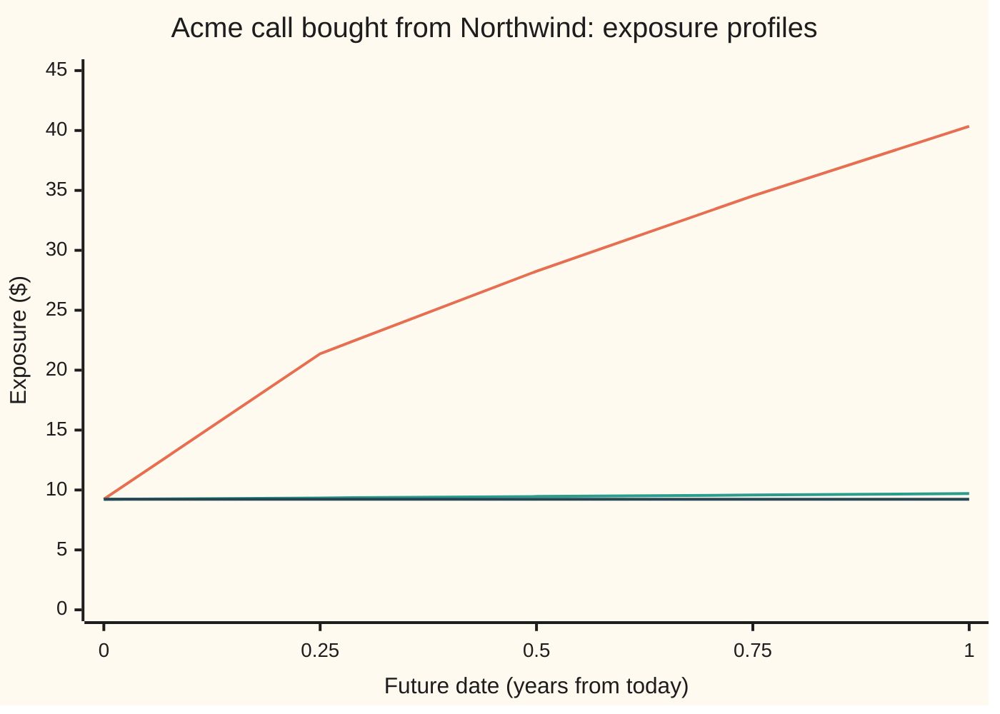
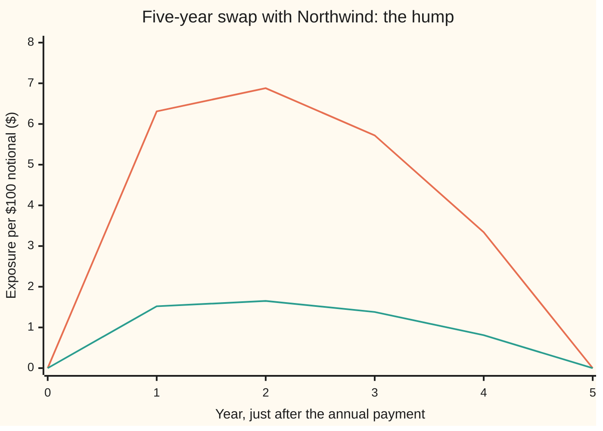

# Expected exposure over time: what you are likely to be owed at each future date, and the tail (PFE) above it

[Syllabus](../../../SYLLABUS.md) → [Financial mathematics](../README.md) → [Counterparty Risk and CVA](../README.md#s46) → Expected exposure over time

---

## General Overview

A bank buys the one-year Acme call from Northwind for \$9.23. Acme trades at \$100, the strike is \$100, and in a year Northwind must pay whatever Acme ends above \$100. Until then the bank holds a promise. The promise is only as good as Northwind.

Suppose Northwind fails in six months. The bank loses what the call is worth on that day, less whatever the bankruptcy court returns. That amount is unknown today: it depends on where Acme trades in six months. If Acme has crashed, the call is worth little and the loss is small. If Acme has soared, the loss is large. The amount at stake on a future date is a random number, not a fixed one.

The earlier card [Counterparty exposure](01-counterparty-exposure-and-netting.md) named this amount the **exposure**: the replacement value of the trade if it is positive to the bank, and zero if not. A weather forecast gives two numbers for each day ahead: the average rainfall, and the level only a one-in-twenty storm exceeds. Risk managers do the same for exposure, date by date. From here on the average is called **expected exposure** (EE) and the storm level **potential future exposure** (PFE). Drawn across all future dates, each becomes a **profile**.

For the Acme call the average climbs gently, from \$9.23 today to \$9.46 at six months and \$9.70 just before expiry. The 95% level climbs fast: \$28.26 at six months, \$40.35 at expiry. A five-year interest-rate swap tells a different story: its exposure starts at zero, humps in the middle years and dies at maturity.

**Expected exposure is the average of what the counterparty would owe on a future date, over every way the market could move; potential future exposure is the level exceeded only in the worst few percent of those ways; plotted date by date, they are the profiles that credit charges and credit limits are built from.**

**What kind of fact this is:** a definition (two chosen summaries of a random future amount); inside it sits one theorem, proved on this card in Why it works: for a bought option, expected exposure shrunk back to today's dollars equals today's price at every date.

### The picture: the Acme call, year one



Top line (orange): the 95% potential future exposure. Middle line (green): expected exposure in the dollars of each date. Bottom line (dark): the same expected exposure shrunk back to today's dollars, flat at the call's price. The gap between top and middle is the tail; it widens because Acme has more time to travel.

---

## The formula

Notation first, in words. The letter $u$ is a future date, in years from today. $V(u)$ is the trade's value to the bank on that date, before any thought of default; it may be negative. The exposure on that date is $\max(V(u), 0)$: the value if the bank is owed, zero if the bank owes. $\mathbb{E}[\,\cdot\,]$ is an average over all the ways the market could move, weighted by their chances (see [Monte Carlo pricing](../06-Numerical%20Methods%20for%20Pricing/01-monte-carlo-pricing.md)).

$$\mathrm{EE}(u) = \mathbb{E}\big[\max(V(u),\,0)\big]$$

**Read it aloud:** on each future date, floor the trade's value at zero in every scenario, then average.

$$\mathrm{PFE}_\alpha(u) = \text{the smallest } x \text{ with } \Pr\big(\max(V(u),0) \le x\big) \ge \alpha$$

**Read it aloud:** raise a threshold until a fraction $\alpha$ of scenarios sit at or below it; that threshold is the potential future exposure at confidence $\alpha$.

With $\alpha$ = 95%, PFE is the 95th percentile of exposure: one scenario in twenty is worse. Two helpers follow. Multiplying EE by the discount $e^{-ru}$ restates it in today's dollars. Averaging EE itself, undiscounted, over a window of dates gives the **expected positive exposure**:

$$\mathrm{EPE}[0,T] = \frac{1}{T}\int_0^T \mathrm{EE}(u)\,du$$

Write $C_0$ for the call's price today, $c(u,s)$ for its value on date $u$ if Acme stands at $s$, and $z_\alpha$ for the bell-curve point with area $\alpha$ to its left (1.645 at 95%). For the long Acme call, the card proves two closed forms:

$$e^{-ru}\,\mathrm{EE}(u) = C_0, \qquad \mathrm{PFE}_\alpha(u) = c\Big(u,\; S_0\,e^{(r-q-\frac12\sigma^2)u + \sigma\sqrt{u}\,z_\alpha}\Big)$$

**Read it aloud:** the call's average exposure, shrunk to today, is today's price at every date; its 95% exposure is the call revalued at the 95th-percentile Acme price.

| Symbol | Plain meaning | In our example | Push it up and the answer… |
| --- | --- | --- | --- |
| $u$ | a future date, years from today | 0.5 | EE for the call rises slowly; PFE rises fast |
| $V(u)$ | the trade's value to the bank on date $u$, signed | call: always ≥ 0 | more exposure |
| $\mathrm{EE}(u)$ | expected exposure: average of the floored value | \$9.46 at six months | a bigger credit charge |
| $e^{-ru}$ | the discount: a dollar due at $u$ in today's dollars | 0.9753 at six months | |
| $\mathrm{PFE}_\alpha(u)$ | potential future exposure: the $\alpha$ percentile of exposure | \$28.26 at six months | a tighter credit limit |
| $\alpha$, $z_\alpha$ | confidence level, and the bell-curve point with that much area to its left | 95%, 1.645 | PFE rises |
| $S_0$, $S_u$, $S_T$ | Acme's price today, on date $u$, and at expiry | \$100, random, random | call exposure rises |
| $K$, $T$, $H$ | the call's strike, its expiry, and its payoff at expiry | \$100, 1 year, $\max(S_T - K, 0)$ | |
| $c(u,s)$, $s$, $C_0$ | the call's value on date $u$ if Acme is at price $s$; today's price | $C_0$ = \$9.23 | |
| $r$, $q$, $\sigma$ | riskless rate (the "bank rate" below), Acme's dividend yield, Acme's volatility | 5%, 2%, 20% | $\sigma$ up: PFE up sharply |
| $\mathrm{EPE}$ | expected exposure averaged over a window of dates | \$9.46 over year one | |
| $N(x)$, $d_1$, $d_2$ | bell-curve area left of $x$; the call's two bell-curve distances | 1.857, 1.716 at the six-month PFE | |

$c(u,s)$ is the Black-Scholes call with $T - u$ years left ([Black–Scholes call](../08-The%20Black-Scholes%20call%20and%20put/01-black-scholes-call.md)). $z_\alpha$ is the normal quantile: the point with area $\alpha$ to its left ([Normal quantiles](../../09-Probability%20and%20statistics/04-Continuous%20Distributions/05-normal-quantile.md)).

### When it holds

EE and PFE are definitions and hold for any trade. The call's two closed forms rest on assumptions:

- **Paths from the pricing world.** Acme drifts at $r - q$, the bank rate less the dividend. Simulate with a real-world expected return of 8% instead and the average exposure no longer equals $C_0$ grown at the bank rate; the six-month PFE moves from \$28.26 to \$30.10.
- **Nothing paid before expiry.** The call pays once, at the end, and cannot be exercised early. A trade that pays coupons or can be cut short loses the flat line: each payment steps the profile down.
- **Exposure and default unrelated.** The profile ignores whether Northwind is likelier to fail when Acme soars. When the two move together, the average exposure given default differs from EE; that is [Wrong-way risk](05-wrong-way-risk.md).
- **No collateral, one trade.** Collateral posted by Northwind or netting against other trades changes $V(u)$ before the floor; the profile is then of the residual ([Collateral](../47-Collateral%2C%20Funding%20and%20the%20Rest%20of%20the%20XVAs/01-collateral-and-the-residual-exposure.md)).
- **One model for paths and prices.** Simulating Acme with one volatility and revaluing the call with another breaks the flat line by the mismatch.

---

## Why it works

### Step 0: a future amount is random, so it needs a summary

Exposure on a date six months away has a whole distribution: small in most scenarios, large in a few. No single number captures it, so each job picks the summary it needs. A price for the credit risk is an average, because prices are averages in the pricing world; that gives EE. A limit on how much can be lost to one name asks how bad things can plausibly get; that gives a high percentile, PFE. Every step below is one of those two summaries, computed well.

### Step 1: the recipe, for any trade

1. Choose a grid of future dates: here 0.25, 0.5, 0.75 and 1 year.
2. Simulate many paths of whatever drives the trade: here Acme's price, 40,000 paths.
3. On every date of every path, revalue the trade: here the Black-Scholes call with the time left.
4. Floor each value at zero.
5. On each date, average the floored values for EE; sort them and read the 95th percentile for PFE.

The sorted percentile is the smallest simulated value with 95% of all values at or below it: with 40,000 paths, the 38,000th. Step 3 is the expensive part. A call has a formula; a trade without one needs a price inside the simulation, and the standard tool regresses future values on today's state along the paths ([Longstaff-Schwartz](../06-Numerical%20Methods%20for%20Pricing/06-longstaff-schwartz-least-squares-monte-carlo.md)).

### Step 2: floor first, then average

The order in the formula matters. Flooring a scenario can only raise its value: $\max(V, 0) \ge V$ and $\max(V,0) \ge 0$ in every scenario. Averages keep inequalities, so the average of the floors is at least the average value, and at least zero. Hence

$$\mathbb{E}\big[\max(V,0)\big] \;\ge\; \max\big(\mathbb{E}[V],\,0\big).$$

The gap is large when the trade can go either way. The swap below is worth close to nothing on average at year two, \$0.08, yet its expected exposure is \$1.65: the scenarios where the bank owes Northwind do not cancel the ones where Northwind owes the bank, because a default in the first kind costs the bank nothing.

### Step 3: the call's expected exposure, shrunk to today, is its price

A bought call is never worth less than zero, so its exposure is its value: $\max(c, 0) = c$. The floor does nothing.

Now the pricing world's defining property ([Black–Scholes call](../08-The%20Black-Scholes%20call%20and%20put/01-black-scholes-call.md)): any traded thing that pays nothing along the way, shrunk by the bank rate, has an average future value equal to its value today. The call qualifies. On date $u$ its value is the shrunk average of its final payoff given what is known then; averaging again over what might be known then gives the shrunk average of the final payoff, which is $C_0$. So

$$e^{-ru}\,\mathrm{EE}(u) = C_0 \quad\text{for every } u \text{ up to expiry.}$$

Undo the shrinking and the undiscounted EE grows at the bank rate: $C_0\,e^{ru}$. At six months that is \$9.46; just before expiry it is \$9.70, the average payoff itself.

<details>
<summary>Detailed proof</summary>

Write $H = \max(S_T - K, 0)$ for the payoff and $\mathcal{F}_u$ for everything known on date $u$. Under the pricing world, Black-Scholes gives $c(u, S_u) = e^{-r(T-u)}\,\mathbb{E}[H \mid \mathcal{F}_u]$ for $0 \le u < T$. Multiply by $e^{-ru}$: $e^{-ru}c(u,S_u) = \mathbb{E}[e^{-rT}H \mid \mathcal{F}_u]$. Take the plain average of both sides. The tower rule (averaging a conditional average returns the plain average) gives $\mathbb{E}[e^{-ru}c(u,S_u)] = \mathbb{E}[e^{-rT}H] = C_0$. The payoff is integrable because $0 \le H \le S_T$ and $S_T$ has a finite average under the lognormal model. Since $c \ge 0$, exposure equals value and $e^{-ru}\mathrm{EE}(u) = C_0$. At expiry, just before settlement, $c(T^-, S_T) = H$ and the same identity holds. After settlement the call is gone and its exposure is zero. Nothing here uses the dividend yield: $q$ changes $C_0$ but not the flatness.

</details>

### Step 4: the call's PFE is one revaluation

The call's value rises with Acme's price: its slope is $e^{-q(T-u)}N(d_1)$, always positive. A rising map keeps order. If 95% of scenarios have Acme at or below some price $s^*$, then 95% have the call at or below $c(u, s^*)$. So the 95th percentile of exposure is the call revalued at the 95th percentile of Acme.

Acme's percentile needs no simulation. In the pricing world its log price on date $u$ is bell-shaped, centred at $\ln S_0 + (r - q - \tfrac12\sigma^2)u$ with spread $\sigma\sqrt{u}$. The 95th percentile sits $z_{0.95}$ = 1.645 spreads above the centre. That gives the formula above. Because the spread grows like $\sqrt{u}$, PFE climbs steeply while EE barely moves: \$21.37 at three months, \$28.26 at six, \$34.54 at nine, \$40.35 at expiry.

<details>
<summary>Why the percentile passes through the revaluation, including at expiry</summary>

Let the revaluation map $g(s)$ be continuous and never decreasing, and let $s^*$ be the $\alpha$ percentile of Acme's price, which has no gaps or jumps in its distribution. Then $\Pr(g(S_u) \le g(s^*)) \ge \Pr(S_u \le s^*) = \alpha$. For any level $x < g(s^*)$, continuity gives a price strictly below $s^*$ above which $g(s)$ exceeds $x$, so $\Pr(g(S_u) \le x) < \alpha$. Hence $g(s^*)$ is the smallest level reaching $\alpha$: the percentile. Before expiry $g(s)$ is $c(u, s)$, strictly rising. At expiry $g(s)$ is the payoff $\max(s - K, 0)$, flat below the strike, and the argument still holds; if $s^*$ sat below the strike the percentile would be zero. The argument fails for a trade whose value rises then falls in the driver, such as a range bet; there the simulation's sorted value is the only route.

</details>

### Step 5: which world the paths come from

A credit charge is a price, so its paths come from the pricing world, where Acme drifts at the bank rate less the dividend. A credit limit is a forecast of how bad things could get, so risk departments often simulate with real-world drifts fitted to history. For Acme with an 8% expected return, the six-month 95th percentile moves from \$126.82 to \$128.74 and PFE from \$28.26 to \$30.10. Neither is wrong; each answers its own question. Mixing them is the error: a charge computed from forecast paths is not a price, and no hedge in the market reproduces it.

The alternative route to any number here is the simulation itself, taken without formulas: the code does exactly that and lands within noise of each closed form. For a portfolio of many trades that simulation is the only route; the closed forms are the cross-checks that keep it honest.

<details>
<summary>Effective EPE: the regulator's version</summary>

Capital rules use EE through a ratchet. Effective EE on each date is the largest EE seen up to that date, so the profile never falls; effective EPE is its average over the first year. The reason: a short trade that matures will usually be replaced, so the exposure it leaves behind should not count as a fall. For the Acme call EE already rises every day, so effective EPE equals EPE, \$9.46. For the swap the ratchet would hold the year-two peak through the later years. The definitions are in the Basel text listed under Sources, which calls PFE "peak exposure".

</details>

---

## Worked numbers, by hand

The Acme call at six months: $S_0$ = \$100, $K$ = \$100, $r$ = 5%, $q$ = 2%, $\sigma$ = 20%, $u$ = 0.5, half a year left.

| Step | Arithmetic | Value |
| --- | --- | --- |
| today's price $C_0$ | Black-Scholes | \$9.23 |
| growth to six months, $e^{ru}$ | $e^{0.05 \times 0.5}$ | 1.0253 |
| **EE at six months** | \$9.23 × 1.0253 | **\$9.46** |
| EE in today's dollars | \$9.46 × $e^{-0.025}$ | \$9.23 |
| centre shift, $(r - q - \tfrac12\sigma^2)u$ | $(0.05 - 0.02 - 0.02) × 0.5$ | 0.0050 |
| spread, $\sigma\sqrt{u}$ | 0.20 × $\sqrt{0.5}$ | 0.1414 |
| 95th-percentile Acme | 100 × $e^{0.0050 + 1.6449 \times 0.1414}$ | \$126.82 |
| $d_1$, $d_2$ at that price, half a year left | Black-Scholes | 1.857, 1.716 |
| $N(d_1)$, $N(d_2)$ | bell-curve areas | 0.968, 0.957 |
| share half | \$126.82 × $e^{-0.01}$ × 0.968 | \$121.59 |
| cash half | \$100 × $e^{-0.025}$ × 0.957 | \$93.33 |
| **PFE at six months, 95%** | \$121.59 − \$93.33 | **\$28.26** |

If Northwind fails in six months, the bank expects to be owed about \$9.46, and in one scenario in twenty it is owed more than \$28.26. The average prices the risk; the tail sizes the limit a credit officer sets on Northwind.

For the house cross-check: with Northwind's hazard of 2% a year and 40% recovery, the flat \$9.23 in today's dollars gives a credit charge of 0.6 × \$9.23 × (1 − $e^{-0.02}$) = \$0.1096, and a risky price of \$9.12. That computation belongs to [CVA](03-cva.md); it appears here only to show the profile feeding it.

### What breaks if you drop a piece

| Mistake | Comes out at | What went wrong |
| --- | --- | --- |
| Average the swap's value, then floor (year two) | \$0.08 (right: \$1.65) | Owing Northwind does not cancel being owed by Northwind; floor each scenario first |
| Quote the six-month EE as today's price | \$9.23 (right: \$9.46) | That is EE in today's dollars; in six-month dollars it has grown at the bank rate |
| PFE as the average plus 1.645 standard deviations | \$24.68 (right: \$28.26) | Call exposure is skewed, with a long right tail; the bell-curve shortcut misses it |
| Revalue at the percentile price with intrinsic value only | \$26.82 (right: \$28.26) | Drops the six months of time value the call still has |
| Real-world paths (8% return) for a credit charge | PFE \$30.10; EE drifts off \$9.46 | A forecast, not a price; right for a limit, wrong for CVA |

The standard deviation of the six-month call value is \$9.25; the average plus 1.645 of those is \$24.68.

---

## How the profile moves with the date: the swap's hump

The call's profile rises and stops at expiry. A swap's profile rises, peaks and falls to zero. The difference is what each trade still owes.

The trade: a five-year swap with Northwind on \$100 of notional. The bank receives a fixed 5.13% each year and pays the floating rate, reset annually ([Interest rate swaps](../28-Swaps/01-interest-rate-swaps.md)). At a flat 5% rate, 5.13% is the par coupon ([The par swap rate](../28-Swaps/02-par-swap-rate-and-annuity.md)), so the swap is worth zero today and exposure starts at zero. In the sketch model the whole curve moves up or down together by a bell-curve amount with a spread of 1% a year times the square root of the years elapsed. When rates fall, the bank's fixed receipts are worth more and Northwind owes; when rates rise, the bank owes. Values are read just after each annual payment.

Two forces meet. **Uncertainty grows**: by year two the rate's spread is 1.41%, and the 5% tail sits at 2.67%. **Payments run out**: at year two three remain, at year four one, at year five none. Exposure is roughly the rate move times the payments left, so it rises then falls.

```
year   expected exposure, $100 notional (each █ = 5 cents)
   1   ██████████████████████████████      $1.52
   2   █████████████████████████████████   $1.65
   3   ████████████████████████████        $1.38
   4   ████████████████                    $0.81
   5                                       $0.00
```

```
year   95% potential future exposure, $100 notional (each █ = 20 cents)
   1   ████████████████████████████████    $6.31
   2   ██████████████████████████████████  $6.88
   3   █████████████████████████████       $5.72
   4   █████████████████                   $3.34
   5                                       $0.00
```



Top line (orange): 95% potential future exposure. Bottom line (green): expected exposure. Both start at zero because the swap starts at par, peak at year two, and end at zero because nothing is left to pay. Up to year two the square root of time wins; after it the shrinking list of payments wins. A swap with more frequent payments gives the same hump with a sawtooth on it, dropping a little at each payment.

---

## Code, from first principles, and it actually runs

The script builds the call's profile three ways: the closed form $C_0 e^{ru}$; a Simpson's-rule average of the revalued call over the bell curve; and a 40,000-path simulation that steps Acme forward, revalues, floors, averages and sorts. It builds PFE two ways: the percentile formula, and the 38,000th sorted simulated value. The swap's profile comes two ways: an integral over the falling-rate half of the bell curve, and its own simulation. Year-one EPE and the house credit charge are each computed from the integral road and checked against their closed forms. The normal curve, its percentile, the integrator and the random numbers are all written out.

### Python

```python
# Expected exposure profiles -- the check behind the card.  Standard library only.
# The Acme call bought from Northwind, then a five-year swap with Northwind.
# Nothing imported knows the answer: the normal CDF is Marsaglia's series, the
# quantile is bisection, the integrals are Simpson's rule, the random numbers
# are splitmix64 plus Box-Muller, all written out below.
from math import exp, log, sqrt, pi, cos

def phi(x): return exp(-0.5 * x * x) / sqrt(2.0 * pi)            # bell-curve height
def N(x):                                                         # 1/2 + phi(x)(x + x^3/3 + x^5/15 + ...)
    if x < -9.0: return 0.0
    if x > 9.0: return 1.0
    term, total, k = x, x, 1
    while abs(term) > 1e-17 * abs(total):
        k += 2; term *= x * x / k; total += term
    return 0.5 + phi(x) * total
def inv_N(p):                                                     # the z with N(z) = p, by bisection
    lo, hi = -9.0, 9.0
    for _ in range(100):
        mid = 0.5 * (lo + hi)
        if N(mid) < p: lo = mid
        else: hi = mid
    return 0.5 * (lo + hi)
def simpson(f, a, b, n):
    h = (b - a) / n
    return (f(a) + f(b) + sum((4 if i % 2 else 2) * f(a + i * h) for i in range(1, n))) * h / 3.0

S0, K, r, q, sig, T = 100.0, 100.0, 0.05, 0.02, 0.20, 1.0        # the house market
def call(s, tau):                                                 # Black-Scholes value, tau years left
    if tau <= 0.0: return max(s - K, 0.0)
    v = sig * sqrt(tau)
    d1 = (log(s / K) + (r - q + 0.5 * sig * sig) * tau) / v
    return s * exp(-q * tau) * N(d1) - K * exp(-r * tau) * N(d1 - v)
def s_at(u, z, mu=r):                                             # Acme at date u; mu = total expected return
    return S0 * exp((mu - q - 0.5 * sig * sig) * u + sig * sqrt(u) * z)
def ee_integral(u, power=1):                                      # road 2: average the revalued call over the bell curve
    return simpson(lambda z: call(s_at(u, z), T - u) ** power * phi(z), -8.0, 8.0, 4000)

M64 = (1 << 64) - 1
seed = [2026]
def rand():                                                       # splitmix64 -> uniform strictly inside (0, 1)
    seed[0] = (seed[0] + 0x9E3779B97F4A7C15) & M64
    z = seed[0]
    z = ((z ^ (z >> 30)) * 0xBF58476D1CE4E5B9) & M64
    z = ((z ^ (z >> 27)) * 0x94D049BB133111EB) & M64
    return (((z ^ (z >> 31)) >> 11) + 0.5) / 9007199254740992.0
def gauss():
    a = rand(); b = rand()
    return sqrt(-2.0 * log(a)) * cos(2.0 * pi * b)
def mc_profile(dates, step, value, x0, n=40000):                  # road 3: simulate paths, revalue at each date
    cols = [[] for _ in dates]
    for _ in range(n):
        x, t = x0, 0.0
        for j, u in enumerate(dates):
            x = step(x, u - t, gauss()); t = u
            cols[j].append(max(value(x, u), 0.0))
    out = []
    for c in cols:
        c.sort()
        out.append((sum(c) / n, c[-(-95 * n // 100) - 1]))        # mean, and the ceil(0.95 n)-th smallest
    return out

C0 = call(S0, T)
z95 = inv_N(0.95)
dates = [0.25, 0.5, 0.75, 1.0]
mc = mc_profile(dates, lambda s, dt, z: s * exp((r - q - 0.5 * sig * sig) * dt + sig * sqrt(dt) * z),
                lambda s, u: call(s, T - u), S0)
print("Acme call bought from Northwind, profile by date (years)")
print(f"{'u':>5}{'EE formula':>11}{'EE integral':>12}{'EE sim':>9}{'disc EE':>9}{'PFE95':>9}{'PFE95 sim':>10}")
ee_int, rows = [C0], []
for (u, (m, p)) in zip(dates, mc):
    e = ee_integral(u); ee_int.append(e)
    pfe = call(s_at(u, z95), T - u)
    rows.append((u, e, m, p, pfe))
    print(f"{u:5.2f}{C0 * exp(r * u):11.4f}{e:12.4f}{m:9.4f}{e * exp(-r * u):9.4f}{pfe:9.4f}{p:10.4f}")
u = 0.5; sq = s_at(u, z95); v = sig * sqrt(u)
d1 = (log(sq / K) + (r - q + 0.5 * sig * sig) * u) / v
sd = sqrt(ee_integral(u, 2) - ee_integral(u) ** 2)
sp = s_at(u, z95, 0.08)
wts = [1, 4, 2, 4, 1]                                             # Simpson over the five integral-road dates
epe = sum(w * e for w, e in zip(wts, ee_int)) * 0.25 / 3.0
epe_closed = C0 * (exp(r) - 1.0) / r
lam, R = 0.02, 0.40                                                # Northwind: hazard 2% a year, recovery 40%
cva = (1 - R) * sum(w * lam * exp(-(lam + r) * t) * e for w, t, e in zip(wts, [0.0] + dates, ee_int)) * 0.25 / 3.0
cva_closed = (1 - R) * C0 * (1.0 - exp(-lam))
for name, x in [("call today C0", C0), ("z95", z95), ("six months: e^(r u)", exp(r * u)), ("  e^(-r u)", exp(-r * u)),
                ("  drift (r - q - sig^2/2) u", (r - q - 0.5 * sig * sig) * u), ("  sig sqrt(u)", v),
                ("  Acme at 95%", sq), ("  d1", d1), ("  d2", d1 - v),
                ("  N(d1)", N(d1)), ("  N(d2)", N(d1 - v)), ("  share half", sq * exp(-q * u) * N(d1)),
                ("  cash half", K * exp(-r * u) * N(d1 - v)), ("  PFE95 = call there", call(sq, T - u)),
                ("  intrinsic only S - K", sq - K), ("  sd of call value", sd),
                ("  mean + 1.645 sd", ee_int[2] + z95 * sd), ("  real world 8%: Acme", sp),
                ("  real world 8%: PFE95", call(sp, T - u)), ("EPE year one, Simpson", epe),
                ("EPE year one, closed", epe_closed), ("CVA from flat disc EE", cva), ("  closed 0.6 C0 (1-e^-0.02)", cva_closed),
                ("  risky price", C0 - cva_closed)]:
    print(f"{name:<30}{x:12.4f}")

r0, sn, cpn = 0.05, 0.01, exp(0.05) - 1.0                          # par swap: flat 5%, rate spread 1% a year
def swap(x, k):                                                   # receiver, $100 notional, after year-k payment
    m = 5 - int(round(k))
    return 100.0 * (cpn * sum(exp(-x * j) for j in range(1, m + 1)) + exp(-x * m) - 1.0)
years = [1.0, 2.0, 3.0, 4.0, 5.0]
smc = mc_profile(years, lambda x, dt, z: x + sn * sqrt(dt) * z, swap, r0)
print("Five-year receiver swap with Northwind, $100 notional, after each payment")
print(f"{'year':>5}{'EE integral':>12}{'EE sim':>9}{'PFE95':>9}{'PFE95 sim':>10}{'(mean V)+':>10}")
sw = []
for (k, (m, p)) in zip(years, smc):
    e = simpson(lambda z: swap(r0 + sn * sqrt(k) * z, k) * phi(z), -8.0, 0.0, 2000)    # V > 0 only when rates fall
    mean_v = simpson(lambda z: swap(r0 + sn * sqrt(k) * z, k) * phi(z), -8.0, 8.0, 4000)
    pfe = swap(r0 - sn * sqrt(k) * z95, k)
    sw.append((e, m, pfe, p))
    print(f"{k:5.0f}{e:12.4f}{m:9.4f}{pfe:9.4f}{p:10.4f}{max(mean_v, 0.0):10.4f}")
for name, x in [("swap par coupon, percent", 100.0 * cpn), ("year 2: rate spread, percent", 100.0 * sn * sqrt(2.0)),
                ("year 2: rate at the 5% tail, percent", 100.0 * (r0 - sn * sqrt(2.0) * z95))]:
    print(f"{name:<38}{x:9.4f}")
print("chart, call EE " + " ".join(f"{x:.2f}" for x in [C0] + [C0 * exp(r * u) for u in dates]))
print("chart, call disc EE " + " ".join(f"{x * exp(-r * u):.2f}" for x, u in zip(ee_int, [0.0] + dates)))
print("chart, call PFE " + " ".join(f"{x:.2f}" for x in [C0] + [t[4] for t in rows]))
print("chart, swap EE 0.00 " + " ".join(f"{t[0]:.2f}" for t in sw))
print("chart, swap PFE 0.00 " + " ".join(f"{t[2]:.2f}" for t in sw))

for (u, e, m, p, pfe) in rows:
    assert abs(e - C0 * exp(r * u)) < 1e-4, "integral road must land on C0 e^(ru)"
    assert abs(m - e) < 0.15, "simulated EE within about three standard errors"
    assert abs(p - pfe) < 0.5, "simulated 95% quantile near the quantile formula"
assert abs(epe - epe_closed) < 1e-4, "EPE from the integral road vs the closed form"
assert abs(cva - cva_closed) < 1e-5, "CVA from the integral road vs the closed form"
for (e, m, pfe, p) in sw[:4]:
    assert abs(m - e) < 0.06, "swap: simulated EE agrees with the integral"
    assert abs(p - pfe) < 0.25, "swap: simulated 95% quantile agrees with the quantile formula"
assert sw[1][0] > sw[0][0], "the swap's EE rises first"
assert sw[1][0] > sw[3][0], "then falls: a hump"
print("ALL CHECKS PASS")
```

**Ran 2026-09-28 on macOS, Python 3.14.6, standard library only. All checks passed. Output, pasted from the run:**

```
Acme call bought from Northwind, profile by date (years)
    u EE formula EE integral   EE sim  disc EE    PFE95 PFE95 sim
 0.25     9.3431      9.3431   9.3269   9.2270  21.3653   21.2788
 0.50     9.4606      9.4606   9.4889   9.2270  28.2603   28.1750
 0.75     9.5796      9.5796   9.6363   9.2270  34.5419   34.6023
 1.00     9.7001      9.7001   9.7762   9.2270  40.3502   40.4244
call today C0                       9.2270
z95                                 1.6449
six months: e^(r u)                 1.0253
  e^(-r u)                          0.9753
  drift (r - q - sig^2/2) u         0.0050
  sig sqrt(u)                       0.1414
  Acme at 95%                     126.8224
  d1                                1.8570
  d2                                1.7156
  N(d1)                             0.9683
  N(d2)                             0.9569
  share half                      121.5857
  cash half                        93.3254
  PFE95 = call there               28.2603
  intrinsic only S - K             26.8224
  sd of call value                  9.2507
  mean + 1.645 sd                  24.6766
  real world 8%: Acme             128.7391
  real world 8%: PFE95             30.1046
EPE year one, Simpson               9.4616
EPE year one, closed                9.4616
CVA from flat disc EE               0.1096
  closed 0.6 C0 (1-e^-0.02)         0.1096
  risky price                       9.1174
Five-year receiver swap with Northwind, $100 notional, after each payment
 year EE integral   EE sim    PFE95 PFE95 sim (mean V)+
    1      1.5196   1.5128   6.3127    6.3271    0.0720
    2      1.6542   1.6455   6.8757    6.8594    0.0838
    3      1.3777   1.3691   5.7184    5.6975    0.0578
    4      0.8080   0.7987   3.3444    3.3198    0.0200
    5      0.0000   0.0000   0.0000    0.0000    0.0000
swap par coupon, percent                 5.1271
year 2: rate spread, percent             1.4142
year 2: rate at the 5% tail, percent     2.6738
chart, call EE 9.23 9.34 9.46 9.58 9.70
chart, call disc EE 9.23 9.23 9.23 9.23 9.23
chart, call PFE 9.23 21.37 28.26 34.54 40.35
chart, swap EE 0.00 1.52 1.65 1.38 0.81 0.00
chart, swap PFE 0.00 6.31 6.88 5.72 3.34 0.00
ALL CHECKS PASS
```

Three roads land together for EE: the formula and the integral agree to four decimals, and the simulation sits within its own sampling noise. The simulated 95th percentiles sit just as close to the percentile formula. The flat "disc EE" column is Step 3 made visible.

### Rust

Same checks, same labels, same random-number generator, written separately in Rust. No crates.

```rust
// Expected exposure profiles -- the same check as expected_exposure_profiles_check.py, in Rust.
// Standard library only, no crates.  Own normal CDF (Marsaglia's series), own
// quantile (bisection), own Simpson's rule, own random numbers (splitmix64 + Box-Muller).
use std::f64::consts::PI;

const S0: f64 = 100.0; const K: f64 = 100.0; const R: f64 = 0.05; const Q: f64 = 0.02;
const SIG: f64 = 0.20; const T: f64 = 1.0;
const R0: f64 = 0.05; const SN: f64 = 0.01;

fn phi(x: f64) -> f64 { (-0.5 * x * x).exp() / (2.0 * PI).sqrt() }
fn n_cdf(x: f64) -> f64 {                          // 1/2 + phi(x)(x + x^3/3 + x^5/15 + ...)
    if x < -9.0 { return 0.0; }
    if x > 9.0 { return 1.0; }
    let (mut term, mut total, mut k) = (x, x, 1.0);
    while term.abs() > 1e-17 * total.abs() { k += 2.0; term *= x * x / k; total += term; }
    0.5 + phi(x) * total
}
fn inv_n(p: f64) -> f64 {
    let (mut lo, mut hi) = (-9.0, 9.0);
    for _ in 0..100 { let mid = 0.5 * (lo + hi); if n_cdf(mid) < p { lo = mid; } else { hi = mid; } }
    0.5 * (lo + hi)
}
fn simpson<F: Fn(f64) -> f64>(f: F, a: f64, b: f64, n: usize) -> f64 {
    let h = (b - a) / n as f64;
    let mut s = 0.0;
    for i in 1..n { s += if i % 2 == 1 { 4.0 } else { 2.0 } * f(a + i as f64 * h); }
    (f(a) + f(b) + s) * h / 3.0
}
fn call(s: f64, tau: f64) -> f64 {                 // Black-Scholes value, tau years left
    if tau <= 0.0 { return (s - K).max(0.0); }
    let v = SIG * tau.sqrt();
    let d1 = ((s / K).ln() + (R - Q + 0.5 * SIG * SIG) * tau) / v;
    s * (-Q * tau).exp() * n_cdf(d1) - K * (-R * tau).exp() * n_cdf(d1 - v)
}
fn s_at(u: f64, z: f64, mu: f64) -> f64 { S0 * ((mu - Q - 0.5 * SIG * SIG) * u + SIG * u.sqrt() * z).exp() }
fn ee_integral(u: f64, power: i32) -> f64 {
    simpson(|z| call(s_at(u, z, R), T - u).powi(power) * phi(z), -8.0, 8.0, 4000)
}
struct Rng(u64);
impl Rng {
    fn rand(&mut self) -> f64 {                    // splitmix64 -> uniform strictly inside (0, 1)
        self.0 = self.0.wrapping_add(0x9E3779B97F4A7C15);
        let mut z = self.0;
        z = (z ^ (z >> 30)).wrapping_mul(0xBF58476D1CE4E5B9);
        z = (z ^ (z >> 27)).wrapping_mul(0x94D049BB133111EB);
        (((z ^ (z >> 31)) >> 11) as f64 + 0.5) / 9007199254740992.0
    }
    fn gauss(&mut self) -> f64 { let a = self.rand(); let b = self.rand(); (-2.0 * a.ln()).sqrt() * (2.0 * PI * b).cos() }
}
fn mc_profile(rng: &mut Rng, dates: &[f64], step: &dyn Fn(f64, f64, f64) -> f64,
              value: &dyn Fn(f64, f64) -> f64, x0: f64, n: usize) -> Vec<(f64, f64)> {
    let mut cols: Vec<Vec<f64>> = vec![Vec::with_capacity(n); dates.len()];
    for _ in 0..n {
        let (mut x, mut t) = (x0, 0.0);
        for (j, &u) in dates.iter().enumerate() {
            x = step(x, u - t, rng.gauss()); t = u;
            cols[j].push(value(x, u).max(0.0));
        }
    }
    cols.iter_mut().map(|c| {
        c.sort_by(|a, b| a.partial_cmp(b).unwrap());
        let mut s = 0.0; for v in c.iter() { s += *v; }
        (s / n as f64, c[(95 * n + 99) / 100 - 1])  // mean, and the ceil(0.95 n)-th smallest
    }).collect()
}
fn swap(x: f64, k: f64) -> f64 {                   // receiver, $100 notional, after year-k payment
    let m = 5 - k.round() as i32;
    let cpn = 0.05_f64.exp() - 1.0;
    let mut s = 0.0; for j in 1..=m { s += (-x * j as f64).exp(); }
    100.0 * (cpn * s + (-x * m as f64).exp() - 1.0)
}
fn join(v: &[f64]) -> String { v.iter().map(|x| format!("{:.2}", x)).collect::<Vec<_>>().join(" ") }

fn main() {
    let mut rng = Rng(2026);
    let c0 = call(S0, T);
    let z95 = inv_n(0.95);
    let dates = [0.25, 0.5, 0.75, 1.0];
    let mc = mc_profile(&mut rng, &dates, &|s, dt, z| s * ((R - Q - 0.5 * SIG * SIG) * dt + SIG * dt.sqrt() * z).exp(),
                        &|s, u| call(s, T - u), S0, 40000);
    println!("Acme call bought from Northwind, profile by date (years)");
    println!("{:>5}{:>11}{:>12}{:>9}{:>9}{:>9}{:>10}", "u", "EE formula", "EE integral", "EE sim", "disc EE", "PFE95", "PFE95 sim");
    let mut ee_int = vec![c0];
    let mut rows = Vec::new();
    for (&u, &(m, p)) in dates.iter().zip(mc.iter()) {
        let e = ee_integral(u, 1); ee_int.push(e);
        let pfe = call(s_at(u, z95, R), T - u);
        rows.push((u, e, m, p, pfe));
        println!("{:5.2}{:11.4}{:12.4}{:9.4}{:9.4}{:9.4}{:10.4}", u, c0 * (R * u).exp(), e, m, e * (-R * u).exp(), pfe, p);
    }
    let u = 0.5; let sq = s_at(u, z95, R); let v = SIG * u.sqrt();
    let d1 = ((sq / K).ln() + (R - Q + 0.5 * SIG * SIG) * u) / v;
    let sd = (ee_integral(u, 2) - ee_integral(u, 1).powi(2)).sqrt();
    let sp = s_at(u, z95, 0.08);
    let wts = [1.0, 4.0, 2.0, 4.0, 1.0];                         // Simpson over the five integral-road dates
    let times = [0.0, 0.25, 0.5, 0.75, 1.0];
    let (lam, rec) = (0.02, 0.40);                               // Northwind: hazard 2% a year, recovery 40%
    let (mut epe, mut cva) = (0.0, 0.0);
    for i in 0..5 {
        epe += wts[i] * ee_int[i];
        cva += wts[i] * lam * (-(lam + R) * times[i]).exp() * ee_int[i];
    }
    epe *= 0.25 / 3.0; cva *= (1.0 - rec) * 0.25 / 3.0;
    let epe_closed = c0 * (R.exp() - 1.0) / R;
    let cva_closed = (1.0 - rec) * c0 * (1.0 - (-lam as f64).exp());
    let list: Vec<(&str, f64)> = vec![("call today C0", c0), ("z95", z95), ("six months: e^(r u)", (R * u).exp()), ("  e^(-r u)", (-R * u).exp()),
        ("  drift (r - q - sig^2/2) u", (R - Q - 0.5 * SIG * SIG) * u), ("  sig sqrt(u)", v), ("  Acme at 95%", sq), ("  d1", d1),
        ("  d2", d1 - v), ("  N(d1)", n_cdf(d1)), ("  N(d2)", n_cdf(d1 - v)),
        ("  share half", sq * (-Q * u).exp() * n_cdf(d1)), ("  cash half", K * (-R * u).exp() * n_cdf(d1 - v)), ("  PFE95 = call there", call(sq, T - u)),
        ("  intrinsic only S - K", sq - K), ("  sd of call value", sd), ("  mean + 1.645 sd", ee_int[2] + z95 * sd),
        ("  real world 8%: Acme", sp), ("  real world 8%: PFE95", call(sp, T - u)), ("EPE year one, Simpson", epe),
        ("EPE year one, closed", epe_closed), ("CVA from flat disc EE", cva), ("  closed 0.6 C0 (1-e^-0.02)", cva_closed),
        ("  risky price", c0 - cva_closed)];
    for (name, x) in &list { println!("{:<30}{:12.4}", name, x); }

    let years = [1.0, 2.0, 3.0, 4.0, 5.0];
    let smc = mc_profile(&mut rng, &years, &|x, dt, z| x + SN * dt.sqrt() * z, &|x, k| swap(x, k), R0, 40000);
    println!("Five-year receiver swap with Northwind, $100 notional, after each payment");
    println!("{:>5}{:>12}{:>9}{:>9}{:>10}{:>10}", "year", "EE integral", "EE sim", "PFE95", "PFE95 sim", "(mean V)+");
    let mut sw = Vec::new();
    for (&k, &(m, p)) in years.iter().zip(smc.iter()) {
        let e = simpson(|z| swap(R0 + SN * k.sqrt() * z, k) * phi(z), -8.0, 0.0, 2000);   // V > 0 only when rates fall
        let mean_v = simpson(|z| swap(R0 + SN * k.sqrt() * z, k) * phi(z), -8.0, 8.0, 4000);
        let pfe = swap(R0 - SN * k.sqrt() * z95, k);
        sw.push((e, m, pfe, p));
        println!("{:5.0}{:12.4}{:9.4}{:9.4}{:10.4}{:10.4}", k, e, m, pfe, p, mean_v.max(0.0));
    }
    let cpn = 0.05_f64.exp() - 1.0;
    for (name, x) in [("swap par coupon, percent", 100.0 * cpn), ("year 2: rate spread, percent", 100.0 * SN * 2.0_f64.sqrt()),
                      ("year 2: rate at the 5% tail, percent", 100.0 * (R0 - SN * 2.0_f64.sqrt() * z95))] {
        println!("{:<38}{:9.4}", name, x);
    }
    let ee_line: Vec<f64> = times.iter().map(|&u| c0 * (R * u).exp()).collect();
    let disc_line: Vec<f64> = times.iter().zip(ee_int.iter()).map(|(&u, &e)| e * (-R * u).exp()).collect();
    let mut pfe_line = vec![c0]; for rw in &rows { pfe_line.push(rw.4); }
    let mut swe = vec![]; let mut swp = vec![]; for s in &sw { swe.push(s.0); swp.push(s.2); }
    println!("chart, call EE {}", join(&ee_line));
    println!("chart, call disc EE {}", join(&disc_line));
    println!("chart, call PFE {}", join(&pfe_line));
    println!("chart, swap EE 0.00 {}", join(&swe));
    println!("chart, swap PFE 0.00 {}", join(&swp));

    for &(u, e, m, p, pfe) in &rows {
        assert!((e - c0 * (R * u).exp()).abs() < 1e-4, "integral road must land on C0 e^(ru)");
        assert!((m - e).abs() < 0.15, "simulated EE within about three standard errors");
        assert!((p - pfe).abs() < 0.5, "simulated 95% quantile near the quantile formula");
    }
    assert!((epe - epe_closed).abs() < 1e-4, "EPE from the integral road vs the closed form");
    assert!((cva - cva_closed).abs() < 1e-5, "CVA from the integral road vs the closed form");
    for &(e, m, pfe, p) in &sw[..4] {
        assert!((m - e).abs() < 0.06, "swap: simulated EE agrees with the integral");
        assert!((p - pfe).abs() < 0.25, "swap: simulated 95% quantile agrees with the quantile formula");
    }
    assert!(sw[1].0 > sw[0].0, "the swap's EE rises first");
    assert!(sw[1].0 > sw[3].0, "then falls: a hump");
    println!("ALL CHECKS PASS");
}
```

**Ran 2026-09-28 on macOS, rustc 1.98.1, no crates. All checks passed. Output, pasted from the run:**

```
Acme call bought from Northwind, profile by date (years)
    u EE formula EE integral   EE sim  disc EE    PFE95 PFE95 sim
 0.25     9.3431      9.3431   9.3269   9.2270  21.3653   21.2788
 0.50     9.4606      9.4606   9.4889   9.2270  28.2603   28.1750
 0.75     9.5796      9.5796   9.6363   9.2270  34.5419   34.6023
 1.00     9.7001      9.7001   9.7762   9.2270  40.3502   40.4244
call today C0                       9.2270
z95                                 1.6449
six months: e^(r u)                 1.0253
  e^(-r u)                          0.9753
  drift (r - q - sig^2/2) u         0.0050
  sig sqrt(u)                       0.1414
  Acme at 95%                     126.8224
  d1                                1.8570
  d2                                1.7156
  N(d1)                             0.9683
  N(d2)                             0.9569
  share half                      121.5857
  cash half                        93.3254
  PFE95 = call there               28.2603
  intrinsic only S - K             26.8224
  sd of call value                  9.2507
  mean + 1.645 sd                  24.6766
  real world 8%: Acme             128.7391
  real world 8%: PFE95             30.1046
EPE year one, Simpson               9.4616
EPE year one, closed                9.4616
CVA from flat disc EE               0.1096
  closed 0.6 C0 (1-e^-0.02)         0.1096
  risky price                       9.1174
Five-year receiver swap with Northwind, $100 notional, after each payment
 year EE integral   EE sim    PFE95 PFE95 sim (mean V)+
    1      1.5196   1.5128   6.3127    6.3271    0.0720
    2      1.6542   1.6455   6.8757    6.8594    0.0838
    3      1.3777   1.3691   5.7184    5.6975    0.0578
    4      0.8080   0.7987   3.3444    3.3198    0.0200
    5      0.0000   0.0000   0.0000    0.0000    0.0000
swap par coupon, percent                 5.1271
year 2: rate spread, percent             1.4142
year 2: rate at the 5% tail, percent     2.6738
chart, call EE 9.23 9.34 9.46 9.58 9.70
chart, call disc EE 9.23 9.23 9.23 9.23 9.23
chart, call PFE 9.23 21.37 28.26 34.54 40.35
chart, swap EE 0.00 1.52 1.65 1.38 0.81 0.00
chart, swap PFE 0.00 6.31 6.88 5.72 3.34 0.00
ALL CHECKS PASS
```

The two outputs agree line for line at four decimals, including the simulated columns, because both languages run the same splitmix64 generator from the same seed.

> [!TIP]
> **Try changing**
> Guess first, then run.
> - **Simulate with the real-world drift.** In the call's `mc_profile` step, replace `r - q` with `0.08 - q`. Guess: the simulated EE column climbs away from the formula, date by date, and the EE assert fails at the first date. It does.
> - **Double the rate spread.** Set `sn` to 0.02. Guess: the swap's EE and PFE roughly double and the hump stays at year two. They do, a little more than double, because rate moves are not quite linear in value.
> - **Starve the simulation.** Set `n=4000`. Guess: the simulated columns wander about three times further from the formula. They do, and the EE assert fails at expiry: 4,000 paths cannot pin an average to within \$0.15.
> - **Set the dividend to zero.** Set `q` to 0.0. Guess: every number moves, but the "disc EE" column stays flat at the new call price. It does; the flatness never depended on $q$.

---

## The usual mistake

> [!warning]
> **Treating PFE as a worst case.** It is a percentile, not a ceiling. At six months one Acme scenario in twenty leaves Northwind owing more than \$28.26, and a few leave it owing far more. PFE also says nothing about whether Northwind defaults; it sizes the loss if it does. A limit set at PFE caps a plausible bad day, not the worst one.
>
> Smaller traps:
> - **Averaging before flooring.** Netting scenarios against each other shrinks the swap's year-two exposure from \$1.65 to \$0.08. Only the trade's value inside one scenario may be netted, and only across trades the netting agreement covers.
> - **Mixing today's dollars and future dollars.** The call's flat \$9.23 is EE in today's dollars; the \$9.46 at six months is the same thing in six-month dollars. A credit charge built from the second must discount; one built from the first must not discount again.

---

## Where you meet it in real life

- **Credit limits.** A bank's credit officers cap each counterparty's PFE profile at a limit. A new trade with Northwind is approved only if the combined profile, with the new trade netted in, stays under the limit on every date.
- **The CVA desk.** The expected-exposure profile in today's dollars, weighted by the chance Northwind fails in each period and by the loss if it does, is the credit charge: [CVA](03-cva.md). Its sensitivities are hedged: [CVA risk numbers](06-cva-risk-numbers-and-hedging.md).
- **Capital rules.** The Basel counterparty rules define EE, effective EE and effective EPE, and banks with approved models set capital from them.
- **The other side of the trade.** Northwind runs the same profile on what it owes the bank. The bank's own view of that, the negative side of $V(u)$, drives the charge for the bank's own default: [DVA](04-dva-and-bilateral-cva.md).
- **Margin.** Collateral cuts exposure to what can build up between margin calls; the residual profile is the same machinery on a short window: [Collateral](../47-Collateral%2C%20Funding%20and%20the%20Rest%20of%20the%20XVAs/01-collateral-and-the-residual-exposure.md).

> **Say it back**
> Exposure on a future date is what the counterparty would owe if it failed then, and it is random. Expected exposure averages it after flooring each scenario at zero; potential future exposure reads a high percentile of it. Both are built by simulating the market, revaluing the trade on each date, flooring, then averaging or sorting. A bought call's expected exposure, shrunk to today, equals its price on every date; its PFE is the call revalued at the percentile stock price. A swap's profile humps, because uncertainty grows while payments run out.

---

## What this builds on

- [Counterparty exposure](01-counterparty-exposure-and-netting.md): exposure on one date, the floor at zero, and which trades may be netted before it.
- [Monte Carlo pricing](../06-Numerical%20Methods%20for%20Pricing/01-monte-carlo-pricing.md): simulating paths and averaging, with the error shrinking like one over the square root of the path count.
- [Black–Scholes call](../08-The%20Black-Scholes%20call%20and%20put/01-black-scholes-call.md): the revaluation formula on every date, and the pricing world whose averaging property gives the flat line.
- [Normal quantiles](../../09-Probability%20and%20statistics/04-Continuous%20Distributions/05-normal-quantile.md): the 1.645 that places the 95th percentile.

## Where this goes next

- [CVA](03-cva.md): the discounted EE profile, weighted by Northwind's chance of failing in each period and by the loss given default, becomes the \$0.1096 credit charge on the Acme call.
- [Collateral](../47-Collateral%2C%20Funding%20and%20the%20Rest%20of%20the%20XVAs/01-collateral-and-the-residual-exposure.md): what remains of these profiles once Northwind posts collateral.

The profile says how much is at stake on each date; it does not yet say what that stake is worth, which needs Northwind's chance of failing and the pricing that turns both into dollars today.

---

## Sources

Verified 2026-09-28: every link below resolves to the publisher's page or to the work's registered DOI record.

- Basel Committee on Banking Supervision. *CRE50: Counterparty credit risk definitions and terminology*. Bank for International Settlements. [bis.org](https://www.bis.org/committees/bcbs/basel-framework/standard/cre/50/inforce/2019-12-15/published/2024-07-05). The regulatory definitions of expected exposure, effective EE, EPE and effective EPE; peak exposure, its name for PFE; and its split between risk-neutral (pricing-world) and actual (real-world) exposure distributions.
- Gregory, Jon. *The xVA Challenge: Counterparty Risk, Funding, Collateral, Capital and Initial Margin*, 4th ed. Wiley, 2020. [doi:10.1002/9781119508991](https://doi.org/10.1002/9781119508991). The practitioner's treatment of exposure profiles, the swap hump, and PFE limits.
- Glasserman, Paul. *Monte Carlo Methods in Financial Engineering*. Springer, 2003. [doi:10.1007/978-0-387-21617-1](https://doi.org/10.1007/978-0-387-21617-1). The simulation machinery behind Step 1, and the estimation of percentiles from sorted samples.
- Longstaff, Francis A., and Eduardo S. Schwartz. "Valuing American Options by Simulation: A Simple Least-Squares Approach." *Review of Financial Studies* 14, no. 1 (2001): 113–147. [doi:10.1093/rfs/14.1.113](https://doi.org/10.1093/rfs/14.1.113). The regression that revalues trades without formulas inside an exposure simulation.
