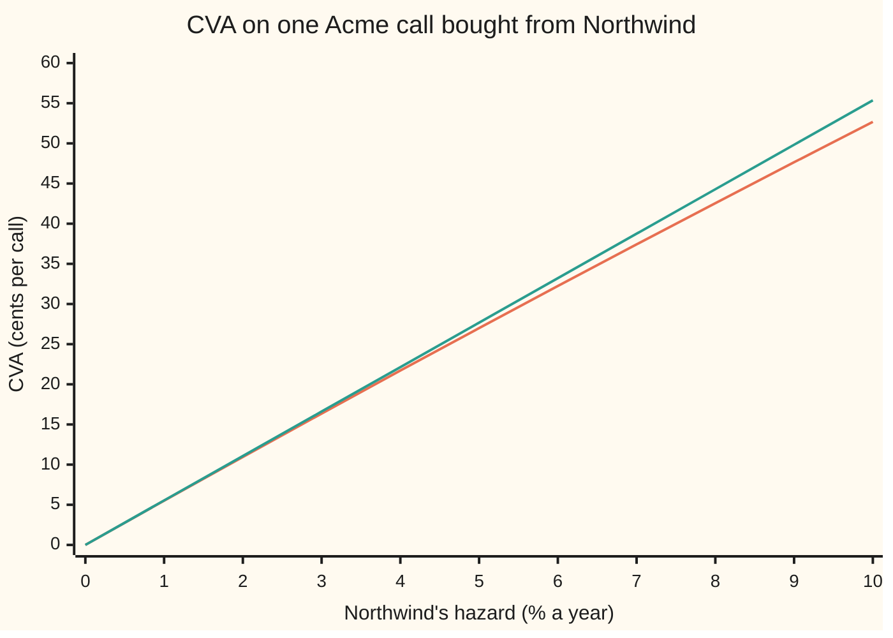
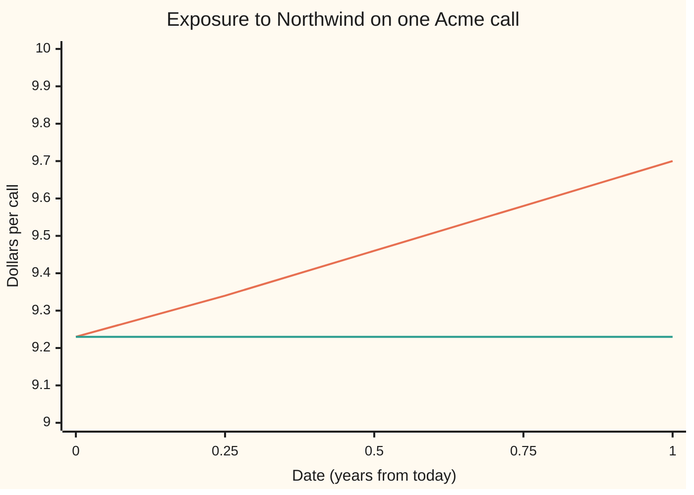

# CVA: the price of the counterparty's default, as loss times default chance times exposure summed over the deal's life

[Syllabus](../../../SYLLABUS.md) → [Financial mathematics](../README.md) → [Counterparty Risk and CVA](../README.md#s46) → CVA

---

## General Overview

A bank buys a one-year call option on Acme shares. Acme trades at \$100, the strike is \$100, and in the house market the call is worth **\$9.23** ([Black–Scholes call](../08-The%20Black-Scholes%20call%20and%20put/01-black-scholes-call.md)). That price assumes whoever sold the call will pay up in a year. The seller here is Northwind, a company the credit market reads as failing at 2% a year, with 40 cents on the dollar recovered from the wreck if it does.

If Northwind fails before the year is out, the bank does not get its option's worth. It files a claim for what the option was worth on the day of the failure and collects 40% of it. The call bought from Northwind is therefore worth less than the same call bought from a counterparty that cannot fail. The gap is the **credit valuation adjustment**, CVA for short, the term used from here on. For this trade it is **10.96 cents**, so the risky call is worth **\$9.12**.

CVA is built from three pieces. How much the bank would be owed if Northwind failed at a given date: the **exposure** ([Counterparty exposure](01-counterparty-exposure-and-netting.md)). The chance Northwind fails near that date. And the fraction lost when it does. Multiply the three, shrink to today's money, and add over every date in the deal's life.

**CVA is the loss fraction times the sum, over the deal's life, of the discounted expected exposure at each date times the chance of default at that date; the risky price is the clean price minus CVA.**

**What kind of fact this is:** a model: Northwind's default date is taken to arrive at a known hazard and independently of Acme's price, which is an assumption, not a law. Inside that model the CVA formula, and the closed form for a long option, are theorems proved on this card in Why it works.

### The picture: CVA against Northwind's hazard



Orange, lower: the CVA itself, loss × price × chance of default within the year. Green, upper: the same with the chance of default replaced by hazard × one year, a first guess that is close for a healthy counterparty and drifts high for a weak one. At 2%, Northwind's hazard, the CVA is 10.96 cents against a first guess of 11.07. A company three times as risky costs a little under three times as much.

---

## The formula

Notation first, in words. $V(t)$ is the call's clean value to the bank at date $t$, the value it would have if Northwind could not fail. $V^+(t)$ is its positive part, $\max(V(t), 0)$: what Northwind would owe on that date, or zero if the bank owed Northwind. The default date is $\tau$ (Greek "tau"), a random number of years from today. $\mathbb{E}[\,\cdot\,]$ is an average over the pricing world, where every asset grows at the riskless rate ([The fundamental theorems](../05-Black-Scholes%20from%20the%20Ground%20Up/02-risk-neutral-measure-and-the-fundamental-theorems.md)). The **expected exposure** $\mathrm{EE}(t) = \mathbb{E}[V^+(t)]$ is the average amount owed at date $t$; times the discount factor $D(t) = e^{-rt}$ it becomes the **discounted expected exposure**, in today's dollars ([Expected exposure over time](02-expected-exposure-profiles.md)). $T$ is the expiry in years. $\lambda$ ("lambda") is Northwind's **hazard**, its yearly default rate among survivors; $Q(t) = e^{-\lambda t}$ is the chance it survives to $t$. $R$ is the **recovery**, the fraction of the claim collected, so $1-R$ is the fraction lost.

$$\mathrm{CVA} = (1-R)\int_0^T D(t)\,\mathrm{EE}(t)\,\lambda\,Q(t)\,dt \;\approx\; (1-R)\sum_{i=1}^{n} D(t_i^*)\,\mathrm{EE}(t_i^*)\,\bigl[Q(t_{i-1}) - Q(t_i)\bigr]$$

**Read it aloud:** the loss fraction, times the sum over the deal's life of what the bank would be owed at each date in today's money, weighted by the chance Northwind defaults at that date.

On the right the year is cut into $n$ buckets with edges $t_i = iT/n$, and $t_i^*$ is the middle of bucket $i$. The bracket $Q(t_{i-1}) - Q(t_i)$ is the chance default lands in that bucket: alive at its start, gone by its end. The integral on the left is the limit as the buckets shrink; $\lambda Q(t)\,dt$ is the chance default lands in the short stretch after $t$ ([The hazard rate](../41-Default%2C%20Survival%20and%20the%20Hazard%20Rate/02-hazard-rate-and-survival-probability.md)).

For a long option under a flat hazard the whole integral collapses:

$$\mathrm{CVA} = (1-R)\times C_0\times\bigl(1 - e^{-\lambda T}\bigr), \qquad \text{risky price} = C_0 - \mathrm{CVA}.$$

**Read it aloud:** loss fraction, times today's clean price, times the chance of default before expiry. At the edges it is zero: a counterparty that cannot fail ($\lambda = 0$), full recovery ($R = 1$), or a worthless option ($C_0 = 0$).

| Symbol | Plain meaning | In our example | Push it up and CVA… |
| --- | --- | --- | --- |
| $C_0$, $X$ | the clean price: the call's value if the seller could not fail; the call's payoff at expiry | \$9.227006 | rises in proportion |
| $V(t)$, $V^+(t)$ | the call's clean value to the bank at date $t$; its positive part, the amount owed | $V(0) = C_0$; always positive for a bought call | — |
| $\tau$ | Northwind's default date, in years from today; random | inside the year with chance 0.019801 | — |
| $\lambda$, $Q(t)$ | the **hazard** ("lambda"): yearly default rate among survivors; the survival chance $e^{-\lambda t}$ | 2%; $1 - Q(1) = 0.019801$ | rises, slightly less than in proportion |
| $R$, $1-R$ | **recovery**, the fraction of the claim collected; **loss given default**, the fraction lost | 40%; 60% | falls with $R$ |
| $D(t)$, $r$ | the discount factor $e^{-rt}$; the riskless rate, continuously compounded | 5% | moves it only through $C_0$: the discounting cancels, see Step 3 |
| $\mathrm{EE}(t)$ | expected exposure: the average of $V^+(t)$ | \$9.23 today, \$9.70 at expiry | rises |
| $T$, $t$ | the call's expiry; a date in years | $T = 1$ | rises: more time to default |
| $t_i$, $i$, $n$ | bucket edges $iT/n$; the bucket's number; how many buckets | weekly, $n = 52$ | no effect here: see Step 3 |
| $S$, $K$, $q$, $\sigma$ | Acme's price, the strike, the dividend yield, the volatility | \$100, \$100, 2%, 20% | through $C_0$ |
| $\mathrm{CVA}$ | the credit valuation adjustment | \$0.109624 | — |
| $s$, $A_E$ | a running premium rate; the exposure annuity $\int_0^T D(t)\,\mathrm{EE}(t)\,Q(t)\,dt$ | 1.2% a year; 9.135348 | — |

### When it holds

- **Default is independent of the exposure.** The formula multiplies the average exposure by the default chance, which is only right if Northwind's failure says nothing about Acme's price. If the exposure tends to be high exactly when Northwind fails, CVA is larger than this; see [Wrong-way risk](05-wrong-way-risk.md).
- **The bank itself cannot fail.** This is the one-sided CVA. If the bank can fail too, Northwind faces the mirror cost, and the two sides' adjustments meet in [DVA](04-dva-and-bilateral-cva.md).
- **No collateral.** Collateral posted by Northwind shrinks the amount owed at default, and with it the CVA; [Collateral](../47-Collateral%2C%20Funding%20and%20the%20Rest%20of%20the%20XVAs/01-collateral-and-the-residual-exposure.md) prices what is left.
- **The hazard comes from the market.** $\lambda$ is read off Northwind's CDS quotes, not off a history of defaults. A historical rate gives a different number, and a bank that cannot hedge at it.
- **A fixed recovery, paid at default.** Real recoveries arrive months later and vary. A random recovery independent of everything else can be replaced by its average; one that falls in bad times cannot.

---

## Why it works

### Step 0: a promise from a company that can fail is worth less by the expected loss

The clean price $C_0$ is what the call's payoff is worth if it is certain to be paid. Northwind's promise pays the same payoff in every future except those where Northwind fails first. In those futures the bank collects a fraction of the call's worth on the failure date instead. So the risky price is the clean price minus the average, in today's money, of what is lost in the failure futures. That average is the CVA. Everything below computes it.

### Step 1: the loss on the default date is $(1-R)\,V^+(\tau)$

When a company fails, open trades are closed at their clean value on the failure date. This is **closeout**. If the call is worth $V(\tau)$ to the bank and that number is positive, the bank is a creditor for it and collects $R\,V(\tau)$. If it were negative, the bank would owe Northwind and would pay in full: a failed company's estate still collects its debts. Either way the shortfall against the clean value is $(1-R)\,V^+(\tau)$.

Averaging over when default comes, and discounting to today:

$$\mathrm{CVA} = (1-R)\,\mathbb{E}\bigl[D(\tau)\,V^+(\tau)\,;\ \tau \le T\bigr],$$

where "; $\tau \le T$" means only futures with default before expiry count. After expiry there is nothing left to lose.

<details>
<summary>Detailed proof: risky price = clean price − CVA</summary>

Write $X$ for the call's payoff at $T$. The clean price is $C_0 = \mathbb{E}[D(T)X]$. Split every future by whether $\tau > T$:
$$C_0 = \mathbb{E}[D(T)X;\ \tau > T] + \mathbb{E}[D(T)X;\ \tau \le T].$$
In the second term, the value at date $\tau$ of everything still to come is $V(\tau)$, so the pricing average gives $\mathbb{E}[D(T)X;\ \tau \le T] = \mathbb{E}[D(\tau)V(\tau);\ \tau \le T]$. This uses only that $V(\tau)$ is the clean value on that date, which holds when default does not change the pricing of Acme.

The risky claim pays $X$ if $\tau > T$, and at $\tau \le T$ pays $R\,V^+(\tau) - V^-(\tau)$, where $V^- = \max(-V, 0)$: the bank collects a fraction of what it is owed and pays all of what it owes. Its price is
$$\mathbb{E}[D(T)X;\ \tau > T] + \mathbb{E}\bigl[D(\tau)\bigl(R\,V^+(\tau) - V^-(\tau)\bigr);\ \tau \le T\bigr].$$
Subtract from $C_0$, using $V = V^+ - V^-$:
$$V - (R\,V^+ - V^-) = V^+ - V^- - R\,V^+ + V^- = (1-R)\,V^+.$$
So clean minus risky is $(1-R)\,\mathbb{E}[D(\tau)V^+(\tau);\ \tau \le T]$, which is CVA.

</details>

### Step 2: independence turns the average into a sum over dates

If Northwind's failure is independent of Acme, the average can be taken in two stages. First fix the default date $t$ and average the exposure: that gives $D(t)\,\mathrm{EE}(t)$. Then average over $t$, weighting each date by the chance default lands there, $\lambda Q(t)\,dt$. That is the integral in The formula. Cut the year into buckets and read the exposure at each bucket's middle: that is the sum.

The checks do this with 52 weekly buckets. They find each week's discounted exposure by integrating the call's value over every price Acme could have that week, 2,000 Simpson slices across the bell curve, with no shortcut. The sum is 0.109624. Grouped by quarter, the weekly pieces are:

```
CVA by quarter of the year, cents per call (52-week sum)
Q1  ██████████████████████████████████  2.76
Q2  █████████████████████████████████   2.75
Q3  █████████████████████████████████   2.73
Q4  █████████████████████████████████   2.72
```

Nearly equal. The small fall comes from survival: to default in the fourth quarter, Northwind must first survive three. The exposure contributes nothing to the tilt, and Step 3 says why.

### Step 3: for a bought option, the discounted exposure is flat

A bought call is never worth less than zero, so $V^+ = V$ and the exposure is the call's value itself. And in the pricing world, today's price of any traded claim is the discounted average of its price at any later date: otherwise buying now and selling later would be a sure gain or loss. So $\mathbb{E}[D(t)V(t)] = C_0$ at every date $t$.



Orange, rising: $\mathrm{EE}(t)$, the average amount owed at each date, in that date's dollars. Green, flat: $D(t)\,\mathrm{EE}(t)$, the same in today's dollars. The checks integrate both at each date; at expiry they average the payoff itself and land on $C_0$ to six decimals.

A flat discounted exposure comes out of the integral:

$$\mathrm{CVA} = (1-R)\,C_0\int_0^T \lambda e^{-\lambda t}\,dt = (1-R)\,C_0\,\bigl(1 - e^{-\lambda T}\bigr).$$

The integral is the chance of default before $T$. That is the closed form: loss × price × default chance. It also explains why the bucket count does not matter here. A flat exposure times the bucket chances adds up to the same total however the year is cut; the checks get 0.109624 from one bucket and from 52. For a swap, whose exposure rises and falls over its life ([Expected exposure over time](02-expected-exposure-profiles.md)), the buckets matter and the sum is the only road.

### Step 4: CVA is a CDS written on the exposure

The protection leg of a credit default swap on Northwind, per \$1 insured, is $(1-R)\int_0^T D(t)\,\lambda Q(t)\,dt$ ([Pricing a CDS](../42-Credit%20Default%20Swaps%20-%20Pricing%2C%20the%20Par%20Spread%20and%20the%20Hazard%20Behind%20It/02-cds-legs-risky-annuity-and-par-spread.md)). Put $\mathrm{EE}(t)$ in place of the \$1 and it is the CVA integral, term for term. CVA is the price of default protection on Northwind whose insured amount, at each date, is the exposure at that date. Such a contract is called a **contingent CDS**. A bank that buys ordinary CDS protection on Northwind in roughly that amount has hedged its CVA, and this is what CVA desks do; [CVA risk numbers](06-cva-risk-numbers-and-hedging.md) sizes the hedge.

The CDS view also gives CVA as a running premium. Protection paid for continuously at the rate $s$ a year, on the exposure, while Northwind survives, has a premium leg of $s$ times the **exposure annuity** $A_E = \int_0^T D(t)\,\mathrm{EE}(t)\,Q(t)\,dt$. Under a flat hazard the fair rate is $s = (1-R)\lambda$, 120 basis points (1.2% a year) for Northwind: the credit triangle ([The credit triangle](../42-Credit%20Default%20Swaps%20-%20Pricing%2C%20the%20Par%20Spread%20and%20the%20Hazard%20Behind%20It/03-the-credit-triangle.md)). The checks integrate $A_E = 9.135348$ with the exposure found numerically, and $0.012 \times 9.135348 = 0.109624$. Same CVA, reached through the premium side of the swap instead of the protection side.

### The other roads: simulation, and risky discounting

Simulation draws 400,000 default dates from the hazard, each conditioned to fall inside the year, and for each one a price for Acme on that date. It values the call there, takes 60% of it, discounts, and averages; multiplying by the 0.019801 chance of default in the year gives the CVA. It lands on 0.109532, with a standard error (the typical size of its random miss) of 0.000174: within one standard error of 0.109624.

A shortcut is also common: discount the whole payoff at the riskless rate plus the spread, $C_0\,e^{-(1-R)\lambda T}$. For Northwind that gives 9.116943, against the exact 9.117381: equal to three decimals. The shortcut works for a claim that only ever pays the bank, like a bought option or a bond. It fails for a trade whose value can turn negative, where there is no single payoff to discount.

---

## Worked numbers, by hand

The Acme call: $S = K = 100$, $r = 5\%$, $q = 2\%$, $\sigma = 20\%$, $T = 1$. Bought from Northwind: $\lambda = 2\%$, $R = 40\%$.

| Step | Arithmetic | Value |
| --- | --- | --- |
| clean call $C_0$ | Black-Scholes, house market | 9.227006 |
| default chance before expiry | $1 - e^{-0.02}$ | 0.019801 |
| loss given default | $1 - 0.40$ | 0.60 |
| **CVA** | $0.60 \times 9.227006 \times 0.019801$ | **0.109624** |
| **risky price** | $9.2270 - 0.1096$ | **\$9.1174** |
| 52-week bucketed sum | weekly exposure × weekly default chance, added | 0.109624 |
| CDS view | $0.012 \times 9.135348$ | 0.109624 |
| simulated default dates | 400,000 draws | 0.109532 |
| risky discounting shortcut | $9.227006 \times e^{-0.012}$ | 9.116943 |

The bank should pay Northwind about \$9.12 for the call, not \$9.23. The 10.96 cents is what the bank would pay a third party today to insure the call against Northwind's failure.

### What breaks if you drop a piece

Same trade, correct CVA 0.109624.

| Mistake | Comes out at | What went wrong |
| --- | --- | --- |
| $R$ in place of $1 - R$ | 0.073083 | Charges for the 40 cents recovered instead of the 60 lost |
| Exposure not discounted: $\mathrm{EE}(t)$ in place of $D(t)\,\mathrm{EE}(t)$ | 0.112402 | Treats a claim owed in year one as if it were owed today |
| Risky discounting and CVA both | risky price 9.007319, not 9.117381 | Charges for Northwind's default twice |
| CVA charged on a call sold to Northwind | 0.109624, not 0 | The bank owes on a sold call; its exposure is 0.000000 (checked at six months) |

Every number in that table is printed by the checks.

---

## Code, from first principles, and it actually runs

Nothing imported knows the answer: the scripts write their own normal CDF (a power series), integrator (Simpson's rule) and random numbers (splitmix64 with Box-Muller). The CVA is reached by **four roads**: the closed form, the 52-week sum with each week's exposure integrated over Acme's price, a simulation of 400,000 default dates, and the CDS view with the exposure annuity integrated. The risky-discounting shortcut, every "what breaks" number and every chart point are printed too.

### Python

```python
# CVA -- the check behind the card.  Standard library only.
# The Acme call (S = K = 100, r = 5%, q = 2%, sigma = 20%, T = 1) bought from
# Northwind (hazard 2% a year, recovery 40%).  Nothing imported knows the answer:
# the normal CDF is a series, the integrals are Simpson's rule, the random
# numbers are splitmix64 plus Box-Muller, all written out below.
from math import exp, log, sqrt, pi, cos

S, K, r, q, sig, T = 100.0, 100.0, 0.05, 0.02, 0.20, 1.0
LAM, R = 0.02, 0.40
LGD = 1.0 - R

def phi(x): return exp(-0.5 * x * x) / sqrt(2.0 * pi)              # bell-curve height
def N(x):                                                           # 1/2 + phi(x)(x + x^3/3 + x^5/15 + ...)
    if x < -9.0: return 0.0
    if x > 9.0: return 1.0
    term, total, k = x, x, 1
    while abs(term) > 1e-17 * abs(total):
        k += 2; term *= x * x / k; total += term
    return 0.5 + phi(x) * total

def bs(s, left, put=False):                                         # Acme option with `left` years to run
    if left <= 1e-12: return max(K - s, 0.0) if put else max(s - K, 0.0)
    v = sig * sqrt(left)
    d1 = (log(s / K) + (r - q + 0.5 * sig * sig) * left) / v
    if put: return K * exp(-r * left) * N(v - d1) - s * exp(-q * left) * N(-d1)
    return s * exp(-q * left) * N(d1) - K * exp(-r * left) * N(d1 - v)

def simpson(f, a, b, n):                                            # area under f from a to b, n even
    h = (b - a) / n
    return (f(a) + f(b) + sum((4 if i % 2 else 2) * f(a + i * h) for i in range(1, n))) * h / 3

def dee(t, sign=1.0):
    # discounted expected exposure D(t) EE(t): average of the bank's positive value at t over
    # Acme's price at t, found by integrating over the bell curve.  No martingale shortcut used.
    drift, vol = (r - q - 0.5 * sig * sig) * t, sig * sqrt(t)
    st = lambda z: S * exp(drift + vol * z)
    lo = -8.0 if t < T else (log(K / S) - drift) / vol              # at expiry, start at the kink
    f = lambda z: max(sign * bs(st(z), T - t), 0.0) * phi(z)
    return exp(-r * t) * simpson(f, lo, 8.0, 2000)

Q = lambda t, lam=LAM: exp(-lam * t)                                # survival to t
C0, P0 = bs(S, T), bs(S, T, put=True)
PD = 1.0 - Q(T)

cva_closed = LGD * C0 * PD                                          # road 1: loss x price x default chance

def bucketed(n):                                                    # road 2: sum over n buckets
    parts = [LGD * dee((i + 0.5) * T / n) * (Q(i * T / n) - Q((i + 1) * T / n)) for i in range(n)]
    return sum(parts), parts
cva_52, weekly = bucketed(52)
cva_1, _ = bucketed(1)

state = 20260928                                                    # road 3: simulate the default date
def uniform():
    global state
    state = (state + 0x9E3779B97F4A7C15) & 0xFFFFFFFFFFFFFFFF
    z = state
    z = ((z ^ (z >> 30)) * 0xBF58476D1CE4E5B9) & 0xFFFFFFFFFFFFFFFF
    z = ((z ^ (z >> 27)) * 0x94D049BB133111EB) & 0xFFFFFFFFFFFFFFFF
    return ((z ^ (z >> 31)) >> 11) * (1.0 / 9007199254740992.0) + 0.5 / 9007199254740992.0
M, acc, acc2 = 400000, 0.0, 0.0
for _ in range(M):
    u1, u2, u3 = uniform(), uniform(), uniform()
    tau = -log(1.0 - u1 * PD) / LAM                                 # a default date, given one before T
    z = sqrt(-2.0 * log(u2)) * cos(2.0 * pi * u3)
    s_tau = S * exp((r - q - 0.5 * sig * sig) * tau + sig * sqrt(tau) * z)
    x = LGD * PD * exp(-r * tau) * bs(s_tau, T - tau)
    acc += x; acc2 += x * x
cva_mc = acc / M
se_mc = sqrt((acc2 / M - cva_mc * cva_mc) / M)

s_run = LGD * LAM                                                   # road 4: a CDS on the exposure
annuity_E = simpson(lambda t: dee(t) * Q(t), 0.0, T, 8)             # exposure-weighted risky annuity
cva_cds = s_run * annuity_E

risky = C0 - cva_closed
risky_disc = C0 * exp(-LGD * LAM * T)                               # approximate road: risky discounting
dee_end = dee(T)

rows = [
    ("clean call C0", C0), ("clean put P0", P0), ("loss given default 1-R", LGD),
    ("default chance to T, 1-e^-lam T", PD),
    ("1 closed form (1-R) C0 PD", cva_closed), ("2 bucketed sum, 52 weeks", cva_52),
    ("  one bucket only", cva_1), ("3 simulated default dates", cva_mc), ("  standard error", se_mc),
    ("4 CDS view: spread x annuity", cva_cds),
    ("  running spread (1-R) lam", s_run), ("  exposure annuity int DEE Q dt", annuity_E),
    ("risky call C0 - CVA", risky), ("risky discounting C0 e^-(1-R)lam T", risky_disc),
    ("DEE at expiry, by integration", dee_end),
    ("wrong: R in place of 1-R", R * C0 * PD),
    ("wrong: exposure not discounted", LGD * C0 * LAM * (exp((r - LAM) * T) - 1.0) / (r - LAM)),
    ("wrong: risky discount and CVA", risky_disc - cva_closed),
    ("wrong: CVA charged on a call sold", cva_closed), ("  right: sold call DEE at 6 months", dee(0.5, -1.0)),
    ("try: hazard 5%", LGD * C0 * (1.0 - Q(T, 0.05))), ("try: recovery 0", C0 * PD),
    ("try: long put", LGD * P0 * PD), ("try: 5-year call", LGD * bs(S, 5.0) * (1.0 - Q(5.0))),
]
for name, v in rows:
    print(f"{name:<36}{v:12.6f}")
print()
ts = [0.0, 0.25, 0.5, 0.75, 1.0]
print("chart, years      " + " ".join(f"{t:6.2f}" for t in ts))
print("chart, EE         " + " ".join(f"{exp(r * t) * dee(t):6.2f}" for t in ts))
print("chart, DEE        " + " ".join(f"{dee(t):6.2f}" for t in ts))
hz = [i / 100 for i in range(11)]
print("chart, hazard %   " + " ".join(f"{100 * h:6.0f}" for h in hz))
print("chart, CVA cents  " + " ".join(f"{100 * LGD * C0 * (1 - Q(T, h)):6.2f}" for h in hz))
print("chart, lam T cents" + " ".join(f"{100 * LGD * C0 * h * T:6.2f}" for h in hz))
print("bars, CVA cents by quarter " + " ".join(f"{100 * sum(weekly[13 * j:13 * j + 13]):.2f}" for j in range(4)))

assert abs(C0 - 9.227005508154) < 1e-9, "own normal CDF reproduces the house call"
assert abs(P0 - 6.330080627550) < 1e-9, "and the house put"
assert abs(dee_end - C0) < 1e-6, "payoff averaged at expiry, discounted, is today's price"
assert abs(cva_52 - cva_closed) < 5e-6, "52-week sum with integrated exposure agrees to four decimals"
assert abs(cva_mc - cva_closed) < 4 * se_mc, "simulation within four standard errors"
assert abs(cva_cds - cva_closed) < 1e-6, "CDS view: spread times exposure annuity"
print("ALL CHECKS PASS")
```

**Ran 2026-09-28 on macOS, Python 3.14.6, standard library only. All checks passed. Output, pasted from the run:**

```
clean call C0                           9.227006
clean put P0                            6.330081
loss given default 1-R                  0.600000
default chance to T, 1-e^-lam T         0.019801
1 closed form (1-R) C0 PD               0.109624
2 bucketed sum, 52 weeks                0.109624
  one bucket only                       0.109624
3 simulated default dates               0.109532
  standard error                        0.000174
4 CDS view: spread x annuity            0.109624
  running spread (1-R) lam              0.012000
  exposure annuity int DEE Q dt         9.135348
risky call C0 - CVA                     9.117381
risky discounting C0 e^-(1-R)lam T      9.116943
DEE at expiry, by integration           9.227006
wrong: R in place of 1-R                0.073083
wrong: exposure not discounted          0.112402
wrong: risky discount and CVA           9.007319
wrong: CVA charged on a call sold       0.109624
  right: sold call DEE at 6 months      0.000000
try: hazard 5%                          0.270004
try: recovery 0                         0.182707
try: long put                           0.075206
try: 5-year call                        1.256781

chart, years        0.00   0.25   0.50   0.75   1.00
chart, EE           9.23   9.34   9.46   9.58   9.70
chart, DEE          9.23   9.23   9.23   9.23   9.23
chart, hazard %        0      1      2      3      4      5      6      7      8      9     10
chart, CVA cents    0.00   5.51  10.96  16.36  21.71  27.00  32.24  37.43  42.56  47.65  52.68
chart, lam T cents  0.00   5.54  11.07  16.61  22.14  27.68  33.22  38.75  44.29  49.83  55.36
bars, CVA cents by quarter 2.76 2.75 2.73 2.72
ALL CHECKS PASS
```

### Rust

Same roads, same random-number generator, same seed, built with `rustc --edition 2021 -O`.

```rust
// CVA -- the same check as cva_check.py, in Rust.  Standard library only, no crates.
// The Acme call (S = K = 100, r = 5%, q = 2%, sigma = 20%, T = 1) bought from
// Northwind (hazard 2% a year, recovery 40%).  The normal CDF is a series, the
// integrals are Simpson's rule, the random numbers are splitmix64 plus Box-Muller.
use std::f64::consts::PI;

const S: f64 = 100.0;
const K: f64 = 100.0;
const RATE: f64 = 0.05;
const Q_DIV: f64 = 0.02;
const SIG: f64 = 0.20;
const T: f64 = 1.0;
const LAM: f64 = 0.02;
const REC: f64 = 0.40;
const LGD: f64 = 1.0 - REC;

fn phi(x: f64) -> f64 { (-0.5 * x * x).exp() / (2.0 * PI).sqrt() }  // bell-curve height
fn n_cdf(x: f64) -> f64 {                                         // 1/2 + phi(x)(x + x^3/3 + x^5/15 + ...)
    if x < -9.0 { return 0.0; }
    if x > 9.0 { return 1.0; }
    let (mut term, mut total, mut k) = (x, x, 1.0);
    while term.abs() > 1e-17 * total.abs() { k += 2.0; term *= x * x / k; total += term; }
    0.5 + phi(x) * total
}

fn bs(s: f64, left: f64, put: bool) -> f64 {                      // Acme option with `left` years to run
    if left <= 1e-12 { return if put { (K - s).max(0.0) } else { (s - K).max(0.0) }; }
    let v = SIG * left.sqrt();
    let d1 = ((s / K).ln() + (RATE - Q_DIV + 0.5 * SIG * SIG) * left) / v;
    if put { return K * (-RATE * left).exp() * n_cdf(v - d1) - s * (-Q_DIV * left).exp() * n_cdf(-d1); }
    s * (-Q_DIV * left).exp() * n_cdf(d1) - K * (-RATE * left).exp() * n_cdf(d1 - v)
}

fn simpson<F: Fn(f64) -> f64>(f: F, a: f64, b: f64, n: usize) -> f64 {   // area under f, n even
    let h = (b - a) / n as f64;
    let mut s = f(a) + f(b);
    for i in 1..n { s += if i % 2 == 1 { 4.0 } else { 2.0 } * f(a + i as f64 * h); }
    s * h / 3.0
}

fn dee(t: f64, sign: f64) -> f64 {   // discounted expected exposure, integrated over Acme's price at t
    let (drift, vol) = ((RATE - Q_DIV - 0.5 * SIG * SIG) * t, SIG * t.sqrt());
    let lo = if t < T { -8.0 } else { ((K / S).ln() - drift) / vol };   // at expiry, start at the kink
    let f = |z: f64| (sign * bs(S * (drift + vol * z).exp(), T - t, false)).max(0.0) * phi(z);
    (-RATE * t).exp() * simpson(f, lo, 8.0, 2000)
}

fn surv(t: f64, lam: f64) -> f64 { (-lam * t).exp() }              // survival to t

fn bucketed(n: usize) -> (f64, Vec<f64>) {                         // road 2: sum over n buckets
    let parts: Vec<f64> = (0..n).map(|i| {
        let (a, b, m) = (i as f64 * T / n as f64, (i + 1) as f64 * T / n as f64, (i as f64 + 0.5) * T / n as f64);
        LGD * dee(m, 1.0) * (surv(a, LAM) - surv(b, LAM))
    }).collect();
    (parts.iter().sum(), parts)
}

struct Rng(u64);
impl Rng {
    fn uniform(&mut self) -> f64 {
        self.0 = self.0.wrapping_add(0x9E3779B97F4A7C15);
        let mut z = self.0;
        z = (z ^ (z >> 30)).wrapping_mul(0xBF58476D1CE4E5B9);
        z = (z ^ (z >> 27)).wrapping_mul(0x94D049BB133111EB);
        ((z ^ (z >> 31)) >> 11) as f64 * (1.0 / 9007199254740992.0) + 0.5 / 9007199254740992.0
    }
}

fn main() {
    let (c0, p0) = (bs(S, T, false), bs(S, T, true));
    let pd = 1.0 - surv(T, LAM);
    let cva_closed = LGD * c0 * pd;                                // road 1: loss x price x default chance
    let (cva_52, weekly) = bucketed(52);
    let (cva_1, _) = bucketed(1);

    let mut rng = Rng(20260928);                                   // road 3: simulate the default date
    let m = 400000;
    let (mut acc, mut acc2) = (0.0, 0.0);
    for _ in 0..m {
        let (u1, u2, u3) = (rng.uniform(), rng.uniform(), rng.uniform());
        let tau = -(1.0 - u1 * pd).ln() / LAM;                    // a default date, given one before T
        let z = (-2.0 * u2.ln()).sqrt() * (2.0 * PI * u3).cos();
        let s_tau = S * ((RATE - Q_DIV - 0.5 * SIG * SIG) * tau + SIG * tau.sqrt() * z).exp();
        let x = LGD * pd * (-RATE * tau).exp() * bs(s_tau, T - tau, false);
        acc += x; acc2 += x * x;
    }
    let cva_mc = acc / m as f64;
    let se_mc = ((acc2 / m as f64 - cva_mc * cva_mc) / m as f64).sqrt();

    let s_run = LGD * LAM;                                         // road 4: a CDS on the exposure
    let annuity_e = simpson(|t| dee(t, 1.0) * surv(t, LAM), 0.0, T, 8);
    let cva_cds = s_run * annuity_e;
    let risky = c0 - cva_closed;
    let risky_disc = c0 * (-LGD * LAM * T).exp();                  // approximate road: risky discounting
    let dee_end = dee(T, 1.0);

    let rows: Vec<(&str, f64)> = vec![
        ("clean call C0", c0), ("clean put P0", p0), ("loss given default 1-R", LGD),
        ("default chance to T, 1-e^-lam T", pd),
        ("1 closed form (1-R) C0 PD", cva_closed), ("2 bucketed sum, 52 weeks", cva_52),
        ("  one bucket only", cva_1), ("3 simulated default dates", cva_mc), ("  standard error", se_mc),
        ("4 CDS view: spread x annuity", cva_cds),
        ("  running spread (1-R) lam", s_run), ("  exposure annuity int DEE Q dt", annuity_e),
        ("risky call C0 - CVA", risky), ("risky discounting C0 e^-(1-R)lam T", risky_disc),
        ("DEE at expiry, by integration", dee_end),
        ("wrong: R in place of 1-R", REC * c0 * pd),
        ("wrong: exposure not discounted", LGD * c0 * LAM * (((RATE - LAM) * T).exp() - 1.0) / (RATE - LAM)),
        ("wrong: risky discount and CVA", risky_disc - cva_closed),
        ("wrong: CVA charged on a call sold", cva_closed), ("  right: sold call DEE at 6 months", dee(0.5, -1.0)),
        ("try: hazard 5%", LGD * c0 * (1.0 - surv(T, 0.05))), ("try: recovery 0", c0 * pd),
        ("try: long put", LGD * p0 * pd), ("try: 5-year call", LGD * bs(S, 5.0, false) * (1.0 - surv(5.0, LAM))),
    ];
    for (name, v) in &rows { println!("{:<36}{:12.6}", name, v); }
    println!();
    let ts = [0.0, 0.25, 0.5, 0.75, 1.0];
    let join = |v: Vec<String>| v.join(" ");
    println!("chart, years      {}", join(ts.iter().map(|t| format!("{:6.2}", t)).collect()));
    println!("chart, EE         {}", join(ts.iter().map(|t| format!("{:6.2}", (RATE * t).exp() * dee(*t, 1.0))).collect()));
    println!("chart, DEE        {}", join(ts.iter().map(|t| format!("{:6.2}", dee(*t, 1.0))).collect()));
    let hz: Vec<f64> = (0..11).map(|i| i as f64 / 100.0).collect();
    println!("chart, hazard %   {}", join(hz.iter().map(|h| format!("{:6.0}", 100.0 * h)).collect()));
    println!("chart, CVA cents  {}", join(hz.iter().map(|h| format!("{:6.2}", 100.0 * LGD * c0 * (1.0 - surv(T, *h)))).collect()));
    println!("chart, lam T cents{}", join(hz.iter().map(|h| format!("{:6.2}", 100.0 * LGD * c0 * h * T)).collect()));
    println!("bars, CVA cents by quarter {}", join((0..4).map(|j| format!("{:.2}", 100.0 * weekly[13 * j..13 * j + 13].iter().sum::<f64>())).collect()));

    assert!((c0 - 9.227005508154).abs() < 1e-9, "own normal CDF reproduces the house call");
    assert!((p0 - 6.330080627550).abs() < 1e-9, "and the house put");
    assert!((dee_end - c0).abs() < 1e-6, "payoff averaged at expiry, discounted, is today's price");
    assert!((cva_52 - cva_closed).abs() < 5e-6, "52-week sum with integrated exposure agrees to four decimals");
    assert!((cva_mc - cva_closed).abs() < 4.0 * se_mc, "simulation within four standard errors");
    assert!((cva_cds - cva_closed).abs() < 1e-6, "CDS view: spread times exposure annuity");
    println!("ALL CHECKS PASS");
}
```

**Ran 2026-09-28 on macOS, rustc 1.98.1, no crates. All checks passed. Output, pasted from the run:**

```
clean call C0                           9.227006
clean put P0                            6.330081
loss given default 1-R                  0.600000
default chance to T, 1-e^-lam T         0.019801
1 closed form (1-R) C0 PD               0.109624
2 bucketed sum, 52 weeks                0.109624
  one bucket only                       0.109624
3 simulated default dates               0.109532
  standard error                        0.000174
4 CDS view: spread x annuity            0.109624
  running spread (1-R) lam              0.012000
  exposure annuity int DEE Q dt         9.135348
risky call C0 - CVA                     9.117381
risky discounting C0 e^-(1-R)lam T      9.116943
DEE at expiry, by integration           9.227006
wrong: R in place of 1-R                0.073083
wrong: exposure not discounted          0.112402
wrong: risky discount and CVA           9.007319
wrong: CVA charged on a call sold       0.109624
  right: sold call DEE at 6 months      0.000000
try: hazard 5%                          0.270004
try: recovery 0                         0.182707
try: long put                           0.075206
try: 5-year call                        1.256781

chart, years        0.00   0.25   0.50   0.75   1.00
chart, EE           9.23   9.34   9.46   9.58   9.70
chart, DEE          9.23   9.23   9.23   9.23   9.23
chart, hazard %        0      1      2      3      4      5      6      7      8      9     10
chart, CVA cents    0.00   5.51  10.96  16.36  21.71  27.00  32.24  37.43  42.56  47.65  52.68
chart, lam T cents  0.00   5.54  11.07  16.61  22.14  27.68  33.22  38.75  44.29  49.83  55.36
bars, CVA cents by quarter 2.76 2.75 2.73 2.72
ALL CHECKS PASS
```

The two outputs agree line for line. The simulation draws the same numbers in both languages because the generator is written out, not borrowed.

> [!TIP]
> **Try changing**
> Guess first, then run.
> - **A weaker Northwind.** Set the hazard to 5%. CVA rises to **0.270004**, a little under two and a half times the 2% answer, because the default chance $1 - e^{-0.05}$ grows more slowly than the hazard.
> - **Nothing recovered.** Set `R = 0`. CVA is **0.182707**: the full price times the default chance, with no 60% factor.
> - **A put instead of a call.** Buy the house put, clean price \$6.33, from Northwind. CVA is **0.075206**. The closed form holds for any bought option; only the price changes.
> - **Five years.** A five-year Acme call from Northwind carries a CVA of **1.256781**. Both the price and the default chance grow with the term.

---

## The usual mistake

> [!warning]
> **Carrying loss × price × default chance to every trade.** The closed form rests on Step 3: a bought option's discounted exposure is flat at today's price. A swap starts at zero value and still carries exposure, because its value can move either way and only the positive side counts. Its CVA comes from the bucketed sum with the exposure profile, never from today's value, which would give zero.
>
> - **Recovery in place of loss.** $R$ where $1 - R$ belongs gives 0.073083.
> - **Undiscounted exposure.** Using the average amount owed in that date's dollars gives 0.112402: the error grows with the deal's length.
> - **Charging twice.** A price already discounted at the risky rate has CVA in it. Subtracting CVA again gives 9.007319.
> - **CVA on the wrong side.** A call sold to Northwind is owed by the bank, never to it. Its CVA to the bank is zero; the cost sits on Northwind's books, as the mirror adjustment on [DVA](04-dva-and-bilateral-cva.md).

---

## Where you meet it in real life

- **Bank accounts.** Banks report derivatives at fair value, and fair value includes the counterparty's credit. CVA is the line that takes the clean model price to the reported one.
- **Capital rules.** In the 2007 to 2009 crisis, banks lost more to CVA rising as counterparties' spreads widened than to actual defaults. Basel III answered with a capital charge for CVA risk, revised by the Basel Committee in 2020.
- **The CVA desk.** Large banks run one desk that charges each trading desk the CVA of its new trades and hedges the total with CDS on the counterparties, as Step 4 describes. How much the CVA moves with spreads and markets is on [CVA risk numbers](06-cva-risk-numbers-and-hedging.md).
- **Collateral agreements.** A counterparty that posts collateral daily leaves only a few days' moves at risk. CVA is the price of not having such an agreement: [Collateral](../47-Collateral%2C%20Funding%20and%20the%20Rest%20of%20the%20XVAs/01-collateral-and-the-residual-exposure.md).

> **Say it back**
> A trade with a company that can fail is worth its clean price minus the expected loss from that failure. On default the bank loses the loss fraction of what it is owed on that date, so CVA is the loss fraction times the discounted expected exposure, weighted by the chance of default at each date and added over the deal's life. For a bought option the discounted exposure is flat at today's price, so CVA is loss × price × default chance: 0.6 × 9.227 × 0.0198, or 10.96 cents, for the Acme call from Northwind. It is the price of CDS protection written on the exposure, which is how banks hedge it.

---

## What this builds on

- [Expected exposure over time](02-expected-exposure-profiles.md): the expected exposure at each date, and why a bought option's discounted exposure is flat.
- [Pricing a CDS](../42-Credit%20Default%20Swaps%20-%20Pricing%2C%20the%20Par%20Spread%20and%20the%20Hazard%20Behind%20It/02-cds-legs-risky-annuity-and-par-spread.md): the protection leg, whose integral CVA reuses with the exposure as the insured amount.

## Where this goes next

- [DVA](04-dva-and-bilateral-cva.md): the same adjustment seen from Northwind's side, and what happens when both firms can fail.
- [Wrong-way risk](05-wrong-way-risk.md): CVA when default and exposure move together, and the product of averages breaks.
- [CVA risk numbers](06-cva-risk-numbers-and-hedging.md): how CVA moves with Northwind's spread and Acme's price, and the CDS amounts that hedge it.
- [Collateral](../47-Collateral%2C%20Funding%20and%20the%20Rest%20of%20the%20XVAs/01-collateral-and-the-residual-exposure.md): what is left of the exposure, and of CVA, once collateral changes hands.

This card charges the bank for Northwind's default as if the bank could not fail; Northwind sees the same trade from the other side and charges for the bank's default, and the DVA card asks what price both can agree on.

---

## Sources

Verified 2026-09-28: every link below resolves to the publisher's page.

- Brigo, Damiano, Massimo Morini, and Andrea Pallavicini. *Counterparty Credit Risk, Collateral and Funding: With Pricing Cases for All Asset Classes*. Wiley, 2013. [Publisher page](https://www.wiley.com/en-us/Counterparty+Credit+Risk%2C+Collateral+and+Funding%3A+With+Pricing+Cases+For+All+Asset+Classes-p-9780470748466). The closeout argument of Step 1 and CVA as an integral over the default date.
- Basel Committee on Banking Supervision. *Targeted revisions to the credit valuation adjustment risk framework* (July 2020). [BIS page](https://www.bis.org/bcbs/publ/d507.htm). The capital charge for CVA risk: how banks must measure CVA and hold capital against its moves.
- Hull, John C. *Options, Futures, and Other Derivatives*, 11th ed. Pearson. [Publisher page](https://www.pearson.com/en-us/subject-catalog/p/options-futures-and-other-derivatives/P200000005938/9780136939979). The textbook CVA as a sum over time buckets of default chance times discounted exposure.
- Duffie, Darrell, and Kenneth J. Singleton. *Credit Risk: Pricing, Measurement, and Management*. Princeton University Press, 2003. [Publisher page](https://press.princeton.edu/books/hardcover/9780691090467/credit-risk). Hazard-rate models of default, and pricing a claim on a firm that can fail.
