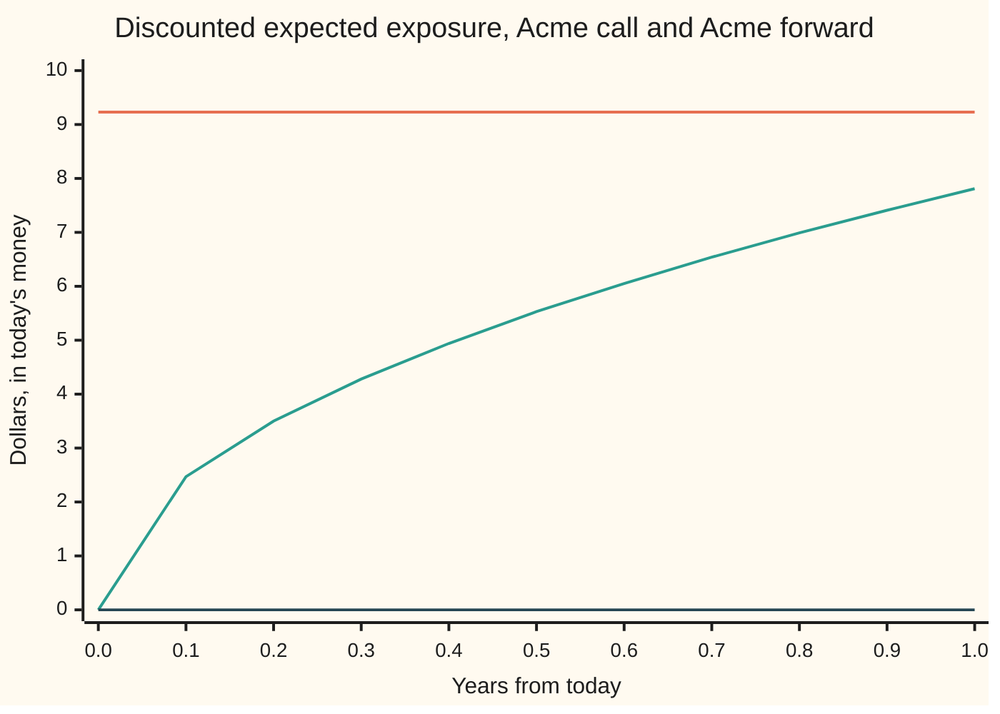
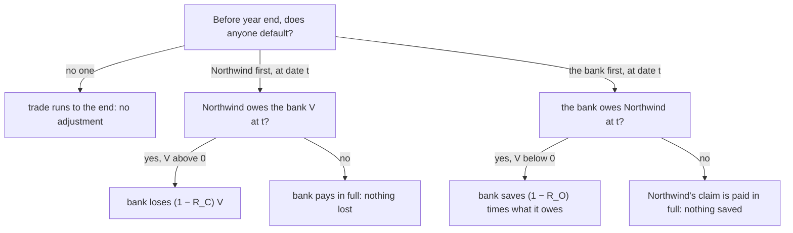

# DVA: the mirror gain from your own default, and the bilateral adjustment that nets the two

[Syllabus](../../../SYLLABUS.md) → [Financial mathematics](../../../SYLLABUS.md#w12) → [Counterparty Risk and CVA](../../../SYLLABUS.md#w12-s46) → DVA

---

## General Overview

A bank buys one Acme call from Northwind: the right to buy an Acme share for $100 in one year. The riskless price is $9.23. Northwind can default, at a hazard of 2 percent a year (a hazard rate is the chance of default per year among firms still alive), and would pay back 40 cents on the dollar. The bank therefore shaves its price by the CVA, the credit valuation adjustment: the average loss from Northwind's default. That adjustment is 0.1096, and the bank books the option at $9.12.

Now look from Northwind's desk. Northwind owes the bank whatever the option turns out to be worth. If Northwind defaults, it pays back only 40 percent of that debt. The 60 percent it never pays is the bank's loss and, to the same cent, Northwind's saving. Priced the same way, that saving is worth 0.1096 to Northwind. This mirror adjustment is the **DVA**, the debit valuation adjustment: the value a firm places on the chance that it will not pay in full what it owes.

A sold option never makes the seller a creditor: the premium was paid at the start, so the bank never owes Northwind anything. Northwind's CVA on the trade is zero and its DVA is 0.1096. The bank's DVA is zero and its CVA is 0.1096. Most contracts can run either way. A forward, the simplest swap (one share for a fixed sum of cash on a set date), carries both adjustments on both sides. Each is then weighted by the chance that the other party is still alive, because only the first default matters.

**One party's CVA is the other's DVA; netting the two gives the bilateral adjustment, and with it both desks book the same price for the same trade.**

**What kind of fact this is:** a model: the formula is proved on this card in Why it works from stated assumptions (defaults independent of Acme's price, close-out at the riskless value), and those assumptions are choices, not laws.

### The picture: who can owe whom, and how much

The discounted expected exposure (the average amount owed, counted in today's dollars) at each date over the year, for the two trades:



Orange, flat at 9.23: what Northwind owes the bank on the call, on average, at every date. Green, rising from 0 to 7.81: the forward, owed by either side to the other; the two directions trace the same curve. Dark blue, flat at zero: what the bank owes Northwind on the call, which is nothing, ever.

---

## The formula

Notation first, in words. For any number $x$, the positive part $x^+$ is $x$ if $x$ is above zero and zero otherwise; the negative part $x^-$ is the size of $x$ if it is below zero and zero otherwise. So $V_t^+$ is what the other side owes, and $V_t^-$ is what this side owes. Subscript C marks the counterparty, subscript O the firm doing its own books.

$$\text{BCVA} \;=\; \underbrace{(1-R_C)\int_0^T \lambda_C\, e^{-(\lambda_C+\lambda_O)t}\,\text{EPE}(t)\,dt}_{\text{CVA}} \;-\; \underbrace{(1-R_O)\int_0^T \lambda_O\, e^{-(\lambda_C+\lambda_O)t}\,\text{ENE}(t)\,dt}_{\text{DVA}}$$

**Read it aloud:** the bilateral adjustment is the expected loss from the other side defaulting first while owing money, minus the expected saving from defaulting first oneself while owing money.

The risky value of the trade is the riskless value minus the bilateral adjustment: $V_0 - \text{BCVA}$.

| Symbol | Plain meaning | In our example | Push it up and the answer… |
| --- | --- | --- | --- |
| $V_t$ | the trade's riskless value at date t to the firm doing the books | call 9.23 today to the bank; forward 0 today | — |
| $x^+$, $x^-$ | positive part, max(x, 0); negative part, max(−x, 0) | bank's call: $V^+ = V$, $V^- = 0$ | — |
| $D(t)$ | discount factor $e^{-rt}$: today's worth of a dollar due at t | 0.951229 at 1 year | — |
| $\text{EPE}(t)$, $\text{ENE}(t)$ | expected positive and negative exposure: the average of $D(t)V_t^+$ and of $D(t)V_t^-$ | call: 9.23 and 0; forward at 1 year: 7.81 and 7.81 | CVA rises with EPE, DVA with ENE |
| $\lambda_C$, $\lambda_O$ | hazard rates of counterparty and of self, per year (λ is "lambda") | Northwind 2%, bank 1% | $\lambda_C$ up: CVA up; $\lambda_O$ up: DVA up and CVA slightly down |
| $R_C$, $R_O$ | recovery rates: fraction of a debt paid after a default | 40% each | the matching adjustment falls |
| $\tau_C$, $\tau_O$ | default dates, in years from today (τ is "tau") | unknown; exponential with the hazards above | — |
| $t$, $T$ | a date, and the trade's end date, in years | T = 1 | more years, more room to default |
| $\text{CVA}$, $\text{DVA}$, $\text{BCVA}$ | the two adjustments and their difference | forward: 0.0614, 0.0307, 0.0307 | — |
| $F$ | the forward's delivery price, set so the forward is worth 0 today | 103.05 | — |
| $S$, $S_t$, $K$, $r$, $q$, $\sigma$, $C_0$ | house market: Acme today and at date t, strike, riskless rate, dividend yield, volatility; the call's riskless price | 100, 100, 5%, 2%, 20%; $C_0$ = 9.227 | $C_0$ up: the call's CVA rises in proportion |
| $N(x)$, $\mathbb{E}$, $\mathbf{1}\{\cdot\}$ | bell-curve area left of x; the average over the pretend (risk-neutral) world; a switch, 1 if the event in braces happens and 0 if not | — | — |

The exposures are averages in the pretend world where every asset grows at the riskless rate:

$$\text{EPE}(t) = \mathbb{E}\big[D(t)\,V_t^+\big], \qquad \text{ENE}(t) = \mathbb{E}\big[D(t)\,V_t^-\big].$$

The weight $\lambda_C e^{-(\lambda_C+\lambda_O)t}$ is the chance, per unit of time, that the counterparty defaults at date t while the firm is still alive. Set $\lambda_O = 0$ in it and the CVA is the unilateral one of [CVA](03-cva.md); set $\lambda_C = 0$ in the DVA's weight and it is the unilateral DVA.

### When it holds

- **Defaults independent of Acme's price.** The hazard is the same whatever the market does. If Northwind is likelier to fail exactly when it owes the most, the CVA is too low: [Wrong-way risk](05-wrong-way-risk.md).
- **Close-out at the riskless value.** At a default the trade is settled at $V_t$ with no credit adjustment in it. Real master agreements let the survivor claim a replacement cost, which can include its own adjustments; the numbers then shift, most for long trades between weak names.
- **First default ends the trade.** The second party's later default does nothing, because nothing is left to owe. Drop the survival factor and the scenarios where both default before T are counted twice.
- **Flat hazards and known recoveries.** A hazard curve replaces $\lambda e^{-\lambda t}$ with the curve's default density; a random recovery is replaced by its average when it is independent of everything else.
- **One uncollateralised trade.** Netting across trades and posted collateral cut both EPE and ENE: [Counterparty exposure](01-counterparty-exposure-and-netting.md).

---

## Why it works

### Step 0: a default moves money between the two sides and nowhere else

When Northwind defaults owing $10, the bank collects $4 and loses $6. Northwind's estate keeps the $6 it did not pay. The shortfall is a loss to one side and a saving to the other, dollar for dollar. So whatever one firm books as CVA, the other books as DVA. Pricing the saving is the whole of DVA.

### Step 1: list what happens at the first default

Take the bank's view of any trade. Before the end date, no one defaults, Northwind defaults first, or the bank does.



A defaulter that is owed money gets paid in full: the survivor cannot skip a debt because the other side failed. Only the side that owes can fall short.

### Step 2: average the cases

Write $\mathbf{1}\{\cdot\}$ for a switch that is 1 when the bracketed event happens and 0 when not. The bank's credit loss, in today's dollars, is

$$(1-R_C)\,\mathbf{1}\{\tau_C \le T,\ \tau_C < \tau_O\}\,D(\tau_C)\,V_{\tau_C}^+ \;-\; (1-R_O)\,\mathbf{1}\{\tau_O \le T,\ \tau_O < \tau_C\}\,D(\tau_O)\,V_{\tau_O}^-.$$

Average it in the pretend world. With independent default dates, the chance that Northwind defaults in the small interval just after t is $\lambda_C e^{-\lambda_C t}\,dt$, and the chance that the bank is still alive at t is $e^{-\lambda_O t}$. Multiply, then average the exposure at that date, which is $\text{EPE}(t)$ because the default date is independent of Acme. Adding over all dates gives the CVA integral. The same steps with the roles swapped give the DVA integral.

<details>
<summary>Detailed proof: the first-to-default weight and the averaging</summary>

Let $\tau_C$ and $\tau_O$ be independent, exponential with rates $\lambda_C$ and $\lambda_O$, and independent of Acme's path. Condition on $\tau_C = t$. The density of $\tau_C$ at t is $\lambda_C e^{-\lambda_C t}$; the chance that $\tau_O > t$ is $e^{-\lambda_O t}$. By independence the joint weight for "Northwind defaults at t and the bank is alive" is $\lambda_C e^{-(\lambda_C+\lambda_O)t}\,dt$.

Given $\tau_C = t$, the loss is $(1-R_C)D(t)V_t^+$, and its average is $(1-R_C)\,\mathbb{E}[D(t)V_t^+] = (1-R_C)\,\text{EPE}(t)$, because the market path does not depend on $\tau_C$. Integrating t from 0 to T gives the CVA term. Swapping C and O and $V^+$ for $V^-$ gives the DVA term. The two events "C first" and "O first" cannot both happen (ties have probability zero), so the terms add with no overlap, and the case "no default before T" contributes zero.

Unilateral CVA drops the factor $e^{-\lambda_O t}$. It then also counts the bank's loss in paths where the bank had already defaulted, when there was nothing left for it to lose. Unilateral CVA minus unilateral DVA counts those paths twice, once on each side.

</details>

### Step 3: the mirror, and why DVA has to exist

Northwind's value of any trade is the bank's value with the sign changed: $-V_t$. Its positive part is the bank's negative part. Feed that into the formula with C and O swapped: Northwind's CVA is the bank's DVA, Northwind's DVA is the bank's CVA, and Northwind's BCVA is the bank's with the sign changed.

That sign change is the reason DVA is booked at all. Without it the bank prices the call at $9.12 (riskless value less CVA), while Northwind, having no CVA, marks its obligation at $9.23. Two desks, one contract, two prices. Adding DVA to Northwind's books brings its obligation to $9.12 as well. With first-to-default weights both desks land on $9.1179.

### Step 4: the option, where one side is always the creditor

The bank paid the premium on day one. After that the call can only be worth something to the bank, never a debt of the bank. So $V_t^- = 0$ for the bank: its ENE and DVA are zero, and so are Northwind's EPE and CVA.

The bank's exposure is flat. In the pretend world, the average of a traded price discounted back to today is today's price, at every date (a discounted price is a martingale: a quantity whose average future value is its value now). So $\text{EPE}(t) = C_0 = 9.227$ for every t, and the integral has a closed form:

$$\text{CVA}_{\text{bilateral}} = (1-R_C)\,C_0\,\frac{\lambda_C}{\lambda_C+\lambda_O}\big(1 - e^{-(\lambda_C+\lambda_O)T}\big).$$

The fraction times the bracket is the chance that Northwind defaults first and before year end: 0.019703. With $\lambda_O = 0$ it becomes $1 - e^{-\lambda_C T}$, the plain default chance, 0.019801.

### Step 5: the forward, where either side can owe

The forward obliges the bank to pay $F = S e^{(r-q)T} = 103.05$ for one Acme share in a year. That price makes the forward worth zero today. Its value at date t is the share's worth, delivered later, minus the cash's worth, paid later: $V_t = S_t e^{-q(T-t)} - F e^{-r(T-t)}$.

Its average discounted value stays at zero, so $\text{EPE}(t) - \text{ENE}(t) = \mathbb{E}[D(t)V_t] = V_0 = 0$: the two exposures are equal at every date. The positive part is a call struck at Acme's forward level, priced like a Black-Scholes call:

$$\text{EPE}(t) = \text{ENE}(t) = S\,e^{-qT}\big(2N(\tfrac12\sigma\sqrt{t}) - 1\big).$$

It starts at zero and grows roughly like $\sqrt{t}$, reaching 7.81 at one year. With equal exposures, the CVA and DVA differ only through hazards and recoveries. Northwind's hazard is twice the bank's, so the CVA 0.0614 is twice the DVA 0.0307.

The same numbers come from a third road, used in the code: simulate both default dates, simulate Acme at the first one, settle the trade by the rules in Step 1, and average. That road uses no exposure profile and no first-to-default weight.

---

## Worked numbers, by hand

House market (S = K = 100, r = 5%, q = 2%, σ = 20%, T = 1, call 9.227). Northwind: hazard 2%, recovery 40%. The bank: hazard 1%, recovery 40%.

| Step | Arithmetic | Value |
| --- | --- | --- |
| Northwind defaults within the year | $1 - e^{-0.02}$ | 0.019801 |
| bank's CVA on the call, unilateral | 0.6 × 9.227006 × 0.019801 | 0.1096 |
| bank's risky price | 9.227006 − 0.109624 | $9.12 |
| Northwind's DVA on the sold call, unilateral | same arithmetic, from its desk | 0.1096 |
| Northwind's CVA; bank's DVA | nobody ever owes Northwind | 0 |
| Northwind defaults first, within the year | $\tfrac{0.02}{0.03}\,(1 - e^{-0.03})$ | 0.019703 |
| bank's CVA on the call, bilateral | 0.6 × 9.227006 × 0.019703 | 0.1091 |
| **price both desks book** | 9.227006 − 0.109080 | **$9.1179** |
| forward: exposure each way at 1 year | $100e^{-0.02}(2N(0.1) - 1)$ | 7.81 |
| forward: bank's CVA and DVA | integrals over the year | 0.0614 and 0.0307 |
| **forward: bank's BCVA** | 0.061391 − 0.030696 | **0.0307** |

The forward is worth zero without default risk. With it, the bank books the forward at −0.0307 and Northwind at +0.0307. Northwind is the weaker credit, so to make the deal fair to both, Northwind pays the bank 0.0307 at the start.

### What breaks if you drop a piece

| Mistake | Comes out at | What went wrong |
| --- | --- | --- |
| Forward: CVA alone, no DVA | 0.0618 (right: 0.0307) | Charges for Northwind's default and ignores the bank's own; Northwind would book a different price |
| Forward: DVA added, not subtracted | 0.0921 | The saving from one's own default reduces the charge; it does not add to it |
| Call: exposure not discounted | 0.1124 (right: 0.1096) | The undiscounted average call value grows at the riskless rate; the loss happens later and is worth less today |
| Call: buyer charged itself a DVA | 0.0545 (right: 0.1091) | Treated the call's value as money the bank could owe; a bought option is never a debt |

---

## When a firm's own credit worsens

The strangest property of DVA: a firm whose own credit gets worse books a profit.

Northwind sold the call. Its obligation, before any adjustment, is −$9.23. As its hazard rises, the chance that it never pays in full rises, so its DVA grows and the booked obligation shrinks. Nothing about Acme changed. Only Northwind's health did.

```
Northwind's own hazard   Northwind's DVA on the sold call, dollars
   0%                                                          0.0000
   1%   ████                                                   0.0551
   2%   ████████                                               0.1096
   4%   ████████████████                                       0.2171
   8%   ████████████████████████████████                       0.4256
```

The booked obligation moves from −$9.23 at 0 percent to −$9.12 at 2 percent, −$9.01 at 4 percent and −$8.80 at 8 percent. Every worsening of Northwind's credit shows up as a gain.

The forward shows the same effect on the bank's side. At a bank hazard of 1 percent the bank books the forward at −0.0307. At 2 percent the two firms are equally risky, the adjustments cancel, and the forward is booked at 0.0000. At 3 percent the bank is the weaker credit and books the forward at +0.0303. The bank's own decline turned a loss into a gain.

### The argument for booking it

Fair value is the price at which a position could be exchanged between willing parties. A buyer taking over Northwind's obligation would pay less for a promise from a weaker firm, so the obligation is worth less. Fair-value accounting follows this: IFRS 13 and the US standard ASC 820 require a liability's fair value to reflect the risk that it is not paid. Step 3 gives the price-side reason: without DVA the two sides of one contract disagree.

### The argument against

The gain can be collected in only two ways. One is to default. The other is to buy back one's own debt cheaply, which needs cash that a weakening firm rarely has. A firm cannot buy credit protection on itself, so desks hedged DVA by selling protection on similar banks, which adds exposure to exactly the crisis that would hurt them. In late 2011, as bank credit spreads widened, several large banks reported quarterly profits in which own-credit gains were a large part. Bank supervisors took the cautious side: in July 2012 the Basel Committee ruled that banks strip all DVA on derivatives out of the common equity counted as capital, and forbade netting it against CVA.

The result is a split still in force (conventions verified 2026-09-28): DVA sits in accounting prices and in the price two dealers agree on, and is removed from the capital that is supposed to absorb losses.

---

## Code, from first principles, and it actually runs

The code prices the call and the forward from both desks and reaches every adjustment by three independent roads. Road 1 uses the closed forms. Road 2 builds each exposure profile by integrating over the bell curve at 201 dates, then integrates over time; both integrals are Simpson's rule written out, with a bisection root finder for the forward's kink. Road 3 simulates four million pairs of default dates with a home-made random number generator (splitmix64) and settles each trade at the first default. The normal curve area comes from `math.erf` in Python and from a series and a continued fraction in Rust.

### Python

```python
# DVA and bilateral CVA -- the check behind the card.  Standard library only.
# Three roads: closed forms; Simpson integrals over the bell curve and over time;
# a simulation of both default dates with a home-made random number generator.
from math import exp, log, sqrt, erf, pi, cos

S, K, r, q, sig, T = 100.0, 100.0, 0.05, 0.02, 0.20, 1.0
lamN, RN = 0.02, 0.40                  # Northwind: hazard per year, recovery
lamB, RB = 0.01, 0.40                  # the bank: hazard per year, recovery
F = S * exp((r - q) * T)               # forward delivery price: forward worth 0 today

def N(x): return 0.5 * (1.0 + erf(x / sqrt(2.0)))
def phi(z): return exp(-0.5 * z * z) / sqrt(2.0 * pi)

def call(s, tau):                      # Black-Scholes call, tau years left
    if tau <= 0.0: return max(s - K, 0.0)
    v = sig * sqrt(tau)
    d1 = (log(s / K) + (r - q + 0.5 * sig * sig) * tau) / v
    return s * exp(-q * tau) * N(d1) - K * exp(-r * tau) * N(d1 - v)

def fwd(s, tau): return s * exp(-q * tau) - F * exp(-r * tau)   # to the bank, who buys Acme

def simpson(vals, h):
    n = len(vals) - 1
    return h / 3.0 * (vals[0] + vals[n] + sum((4 if i % 2 else 2) * vals[i] for i in range(1, n)))

def ee(value, t, side):                # discounted expected exposure: side +1 owed to us, -1 we owe
    if t == 0.0: return max(side * value(S, T), 0.0)
    g = lambda z: side * value(S * exp((r - q - 0.5 * sig * sig) * t + sig * sqrt(t) * z), T - t)
    a, b = -8.0, 8.0
    if g(a) <= 0.0 and g(b) <= 0.0: return 0.0
    if g(a) <= 0.0 or g(b) <= 0.0:      # exposure starts at a kink: find it by bisection, integrate past it
        lo, hi = a, b
        for _ in range(80):
            mid = 0.5 * (lo + hi)
            if (g(mid) > 0.0) == (g(hi) > 0.0): hi = mid
            else: lo = mid
        a, b = (hi, b) if g(b) > 0.0 else (a, lo)
    h = (b - a) / 400
    return exp(-r * t) * simpson([max(g(a + i * h), 0.0) * phi(a + i * h) for i in range(401)], h)

NT = 200; HU = sqrt(T) / NT            # time grid t = u^2, which smooths the sqrt(t) start
TS = [(i * HU) ** 2 for i in range(NT + 1)]
def over_time(profile, lam_def, lam_other, R):   # (1-R) * integral of lam e^-(lam+other)t * profile dt
    return simpson([(1 - R) * lam_def * exp(-(lam_def + lam_other) * t) * p * 2 * sqrt(t) for t, p in zip(TS, profile)], HU)

C0 = call(S, T)
# road 1: closed forms
cva_uni = (1 - RN) * C0 * (1 - exp(-lamN * T))
cva_bil = (1 - RN) * C0 * lamN / (lamN + lamB) * (1 - exp(-(lamN + lamB) * T))
fwd_pe = [S * exp(-q * T) * (2 * N(0.5 * sig * sqrt(t)) - 1) for t in TS]   # EPE = ENE for the forward
f_cva1, f_dva1 = over_time(fwd_pe, lamN, lamB, RN), over_time(fwd_pe, lamB, lamN, RB)
# road 2: exposure profiles by integrating over the bell curve at every date
call_pe = [ee(call, t, +1) for t in TS]
call_ne = [ee(call, t, -1) for t in TS]
f_pe2 = [ee(fwd, t, +1) for t in TS]
f_ne2 = [ee(fwd, t, -1) for t in TS]
cva_uni2 = over_time(call_pe, lamN, 0.0, RN)
cva_bil2, dva_call_B = over_time(call_pe, lamN, lamB, RN), over_time(call_ne, lamB, lamN, RB)
f_cva2, f_dva2 = over_time(f_pe2, lamN, lamB, RN), over_time(f_ne2, lamB, lamN, RB)
# Northwind's own books: sold call and sold forward, values the other way round
sold = lambda s, tau: -call(s, tau)
sfwd = lambda s, tau: -fwd(s, tau)
nw_cva = over_time([ee(sold, t, +1) for t in TS], lamB, 0.0, RB)
nw_dva_uni = over_time([ee(sold, t, -1) for t in TS], lamN, 0.0, RN)
nw_dva_bil = over_time([ee(sold, t, -1) for t in TS], lamN, lamB, RN)
nw_f_cva = over_time([ee(sfwd, t, +1) for t in TS], lamB, lamN, RB)
nw_f_dva = over_time([ee(sfwd, t, -1) for t in TS], lamN, lamB, RN)

# road 3: simulate both default dates; close out at the first one if it comes before T
M = (1 << 64) - 1
state = 20260928
def rnd():                             # splitmix64, then a uniform strictly inside (0, 1)
    global state
    state = (state + 0x9E3779B97F4A7C15) & M
    z = state
    z = ((z ^ (z >> 30)) * 0xBF58476D1CE4E5B9) & M
    z = ((z ^ (z >> 27)) * 0x94D049BB133111EB) & M
    return (((z ^ (z >> 31)) >> 11) + 0.5) / 9007199254740992.0
PATHS = 4_000_000
sc = scc = sf = sff = 0.0
for _ in range(PATHS):
    tN, tB = -log(rnd()) / lamN, -log(rnd()) / lamB
    t = min(tN, tB)
    if t >= T: continue
    z = sqrt(-2.0 * log(rnd())) * cos(2.0 * pi * rnd())
    st = S * exp((r - q - 0.5 * sig * sig) * t + sig * sqrt(t) * z)
    vc, vf, d = call(st, T - t), fwd(st, T - t), exp(-r * t)
    if tN < tB: xc, xf = (1 - RN) * d * max(vc, 0.0), (1 - RN) * d * max(vf, 0.0)
    else: xc, xf = -(1 - RB) * d * max(-vc, 0.0), -(1 - RB) * d * max(-vf, 0.0)
    sc += xc; scc += xc * xc; sf += xf; sff += xf * xf
mc_c, mc_f = sc / PATHS, sf / PATHS
se_c, se_f = sqrt((scc / PATHS - mc_c ** 2) / PATHS), sqrt((sff / PATHS - mc_f ** 2) / PATHS)

bil_f = f_cva1 - f_dva1
rows = [
    ("call C0", C0), ("forward price F", F), ("discount D(1)", exp(-r * T)),
    ("Northwind defaults by 1y", 1 - exp(-lamN * T)), ("Northwind defaults first by 1y", lamN / (lamN + lamB) * (1 - exp(-(lamN + lamB) * T))),
    ("call, bank CVA unilateral, closed", cva_uni), ("call, bank CVA unilateral, integral", cva_uni2),
    ("call, bank risky price unilateral", C0 - cva_uni),
    ("call, Northwind CVA", nw_cva), ("call, Northwind DVA unilateral", nw_dva_uni),
    ("call, bank CVA bilateral, closed", cva_bil), ("call, bank CVA bilateral, integral", cva_bil2),
    ("call, bank DVA", dva_call_B), ("call, Northwind DVA bilateral", nw_dva_bil),
    ("call, price both agree on", C0 - cva_bil),
    ("call, bank BCVA simulated", mc_c), ("  standard error", se_c),
    ("fwd EPE at 1y, closed", fwd_pe[-1]), ("fwd EPE at 1y, integral", f_pe2[-1]),
    ("fwd ENE at 1y, integral", f_ne2[-1]),
    ("fwd, bank CVA, road 1", f_cva1), ("fwd, bank CVA, road 2", f_cva2),
    ("fwd, bank DVA, road 1", f_dva1), ("fwd, bank DVA, road 2", f_dva2),
    ("fwd, bank BCVA", bil_f), ("fwd, bank BCVA simulated", mc_f), ("  standard error", se_f),
    ("fwd, Northwind CVA", nw_f_cva), ("fwd, Northwind DVA", nw_f_dva),
    ("fwd, Northwind BCVA", nw_f_cva - nw_f_dva),
]
for name, v in rows: print(f"{name:<38}{v:>12.6f}")
print()
for lam in (0.0, 0.01, 0.02, 0.04, 0.08):     # Northwind's own credit worsens: sold call on its books
    dva = (1 - RN) * C0 * (1 - exp(-lam * T))
    print(f"own hazard {lam:4.2f}  Northwind DVA {dva:8.4f}  sold call booked at {-C0 + dva:9.4f}")
for lb in (0.01, 0.02, 0.03):                        # the bank's own credit worsens: the forward on its books
    b = over_time(fwd_pe, lamN, lb, RN) - over_time(fwd_pe, lb, lamN, RB)
    print(f"bank hazard {lb:4.2f}  fwd BCVA {b:8.4f}  forward booked at {-b:8.4f}")
print()
wrong = [
    ("wrong: fwd, CVA alone, DVA left out", over_time(fwd_pe, lamN, 0.0, RN)),
    ("wrong: fwd, DVA added not subtracted", f_cva1 + f_dva1),
    ("wrong: call, undiscounted exposure", (1 - RN) * lamN * C0 * (exp((r - lamN) * T) - 1) / (r - lamN)),
    ("wrong: call, buyer charged a DVA", cva_bil - (1 - RB) * C0 * lamB / (lamN + lamB) * (1 - exp(-(lamN + lamB) * T))),
]
for name, v in wrong: print(f"{name:<38}{v:>12.6f}")
print()
grid = [i / 10 for i in range(11)]
print("chart, years      " + " ".join(f"{t:5.1f}" for t in grid))
for lab, fn, sd in (("chart, call EPE   ", call, 1), ("chart, fwd EPE    ", fwd, 1), ("chart, fwd ENE    ", fwd, -1), ("chart, call ENE   ", call, -1)):
    print(lab + " ".join(f"{ee(fn, t, sd):5.2f}" for t in grid))

assert abs(cva_uni - 0.1096) < 5e-5, "house CVA from the shelf"
assert abs(cva_uni2 - cva_uni) < 1e-7 and abs(cva_bil2 - cva_bil) < 1e-7, "flat discounted exposure: integral road meets closed form"
assert abs(f_cva2 - f_cva1) < 1e-7 and abs(f_dva2 - f_dva1) < 1e-7, "forward: bell-curve road meets closed-form road"
assert abs(nw_dva_bil - cva_bil) < 1e-7 and abs(nw_f_cva - f_dva2) < 1e-7 and nw_cva + dva_call_B < 1e-12, "mirror: one side's CVA is the other's DVA"
assert abs(mc_c - cva_bil) < 4 * se_c and abs(mc_f - bil_f) < 4 * se_f, "simulation within 4 standard errors"
print("ALL CHECKS PASS")
```

**Ran 2026-09-28 on macOS, Python 3.14.6, standard library only. All checks passed. Output, pasted from the run:**

```
call C0                                   9.227006
forward price F                         103.045453
discount D(1)                             0.951229
Northwind defaults by 1y                  0.019801
Northwind defaults first by 1y            0.019703
call, bank CVA unilateral, closed         0.109624
call, bank CVA unilateral, integral       0.109624
call, bank risky price unilateral         9.117381
call, Northwind CVA                       0.000000
call, Northwind DVA unilateral            0.109624
call, bank CVA bilateral, closed          0.109080
call, bank CVA bilateral, integral        0.109080
call, bank DVA                            0.000000
call, Northwind DVA bilateral             0.109080
call, price both agree on                 9.117926
call, bank BCVA simulated                 0.109038
  standard error                          0.000547
fwd EPE at 1y, closed                     7.807839
fwd EPE at 1y, integral                   7.807839
fwd ENE at 1y, integral                   7.807839
fwd, bank CVA, road 1                     0.061391
fwd, bank CVA, road 2                     0.061391
fwd, bank DVA, road 1                     0.030696
fwd, bank DVA, road 2                     0.030696
fwd, bank BCVA                            0.030696
fwd, bank BCVA simulated                  0.030789
  standard error                          0.000517
fwd, Northwind CVA                        0.030696
fwd, Northwind DVA                        0.061391
fwd, Northwind BCVA                      -0.030696

own hazard 0.00  Northwind DVA   0.0000  sold call booked at   -9.2270
own hazard 0.01  Northwind DVA   0.0551  sold call booked at   -9.1719
own hazard 0.02  Northwind DVA   0.1096  sold call booked at   -9.1174
own hazard 0.04  Northwind DVA   0.2171  sold call booked at   -9.0099
own hazard 0.08  Northwind DVA   0.4256  sold call booked at   -8.8014
bank hazard 0.01  fwd BCVA   0.0307  forward booked at  -0.0307
bank hazard 0.02  fwd BCVA   0.0000  forward booked at  -0.0000
bank hazard 0.03  fwd BCVA  -0.0303  forward booked at   0.0303

wrong: fwd, CVA alone, DVA left out       0.061760
wrong: fwd, DVA added not subtracted      0.092087
wrong: call, undiscounted exposure        0.112402
wrong: call, buyer charged a DVA          0.054540

chart, years        0.0   0.1   0.2   0.3   0.4   0.5   0.6   0.7   0.8   0.9   1.0
chart, call EPE    9.23  9.23  9.23  9.23  9.23  9.23  9.23  9.23  9.23  9.23  9.23
chart, fwd EPE     0.00  2.47  3.50  4.28  4.94  5.53  6.05  6.54  6.99  7.41  7.81
chart, fwd ENE     0.00  2.47  3.50  4.28  4.94  5.53  6.05  6.54  6.99  7.41  7.81
chart, call ENE    0.00  0.00  0.00  0.00  0.00  0.00  0.00  0.00  0.00  0.00  0.00
ALL CHECKS PASS
```

### Rust

```rust
// DVA and bilateral CVA -- the check behind the card.  Rust std only.
// Three roads: closed forms; Simpson integrals over the bell curve and over time;
// a simulation of both default dates with a home-made random number generator.
use std::f64::consts::PI;

const S: f64 = 100.0; const K: f64 = 100.0; const R: f64 = 0.05; const Q: f64 = 0.02; const SIG: f64 = 0.20; const T: f64 = 1.0;
const LAM_N: f64 = 0.02; const RN: f64 = 0.40; const LAM_B: f64 = 0.01; const RB: f64 = 0.40; // Northwind, the bank: hazard, recovery

fn erf_series(y: f64) -> f64 {                     // 2/sqrt(pi) * sum (-1)^n y^(2n+1) / (n! (2n+1))
    let (mut term, mut sum, mut n) = (y, y, 0.0);
    while term.abs() > 1e-17 * sum.abs() {
        n += 1.0;
        term *= -y * y / n;
        sum += term / (2.0 * n + 1.0);
    }
    2.0 / PI.sqrt() * sum
}
fn erfc_cf(y: f64) -> f64 {                        // continued fraction for the far tail, y > 2.5
    let mut f = 0.0;
    for k in (1..=80).rev() { f = (k as f64 / 2.0) / (y + f); }
    (-y * y).exp() / PI.sqrt() / (y + f)
}
fn n_cdf(x: f64) -> f64 {
    let y = x.abs() / 2f64.sqrt();
    if y < 2.5 { 0.5 * (1.0 + x.signum() * erf_series(y)) }
    else if x > 0.0 { 1.0 - 0.5 * erfc_cf(y) } else { 0.5 * erfc_cf(y) }
}
fn phi(z: f64) -> f64 { (-0.5 * z * z).exp() / (2.0 * PI).sqrt() }
fn fwd_price() -> f64 { S * ((R - Q) * T).exp() }  // forward delivery price: forward worth 0 today

fn call(s: f64, tau: f64) -> f64 {                 // Black-Scholes call, tau years left
    if tau <= 0.0 { return (s - K).max(0.0); }
    let v = SIG * tau.sqrt();
    let d1 = ((s / K).ln() + (R - Q + 0.5 * SIG * SIG) * tau) / v;
    s * (-Q * tau).exp() * n_cdf(d1) - K * (-R * tau).exp() * n_cdf(d1 - v)
}
fn fwd(s: f64, tau: f64) -> f64 { s * (-Q * tau).exp() - fwd_price() * (-R * tau).exp() }
fn sold(s: f64, tau: f64) -> f64 { -call(s, tau) }  fn sfwd(s: f64, tau: f64) -> f64 { -fwd(s, tau) }

fn simpson(v: &[f64], h: f64) -> f64 {
    let n = v.len() - 1;
    h / 3.0 * (v[0] + v[n] + (1..n).fold(0.0, |acc, i| acc + if i % 2 == 1 { 4.0 } else { 2.0 } * v[i]))
}
fn ee(value: fn(f64, f64) -> f64, t: f64, side: f64) -> f64 {   // discounted expected exposure
    if t == 0.0 { return (side * value(S, T)).max(0.0); }
    let g = |z: f64| side * value(S * ((R - Q - 0.5 * SIG * SIG) * t + SIG * t.sqrt() * z).exp(), T - t);
    let (mut a, mut b) = (-8.0, 8.0);
    if g(a) <= 0.0 && g(b) <= 0.0 { return 0.0; }
    if g(a) <= 0.0 || g(b) <= 0.0 {                 // exposure starts at a kink: bisection finds it
        let (mut lo, mut hi) = (a, b);
        for _ in 0..80 {
            let mid = 0.5 * (lo + hi);
            if (g(mid) > 0.0) == (g(hi) > 0.0) { hi = mid; } else { lo = mid; }
        }
        if g(b) > 0.0 { a = hi; } else { b = lo; }
    }
    let h = (b - a) / 400.0;
    let v: Vec<f64> = (0..=400).map(|i| g(a + i as f64 * h).max(0.0) * phi(a + i as f64 * h)).collect();
    (-R * t).exp() * simpson(&v, h)
}
const NT: usize = 200;                               // time grid t = u^2 smooths the sqrt(t) start
fn over_time(p: &[f64], lam_def: f64, lam_other: f64, rec: f64) -> f64 {
    let hu = T.sqrt() / NT as f64;
    let v: Vec<f64> = (0..=NT).map(|i| { let t = (i as f64 * hu).powi(2);
        (1.0 - rec) * lam_def * (-(lam_def + lam_other) * t).exp() * p[i] * 2.0 * t.sqrt() }).collect();
    simpson(&v, hu)
}
struct Rng(u64);
impl Rng {                                         // splitmix64, then a uniform strictly inside (0, 1)
    fn next(&mut self) -> f64 {
        self.0 = self.0.wrapping_add(0x9E3779B97F4A7C15);
        let mut z = self.0;
        z = (z ^ (z >> 30)).wrapping_mul(0xBF58476D1CE4E5B9);
        z = (z ^ (z >> 27)).wrapping_mul(0x94D049BB133111EB);
        (((z ^ (z >> 31)) >> 11) as f64 + 0.5) / 9007199254740992.0
    }
}

fn main() {
    let hu = T.sqrt() / NT as f64;
    let ts: Vec<f64> = (0..=NT).map(|i| (i as f64 * hu).powi(2)).collect();
    let prof = |f: fn(f64, f64) -> f64, sd: f64| -> Vec<f64> { ts.iter().map(|&t| ee(f, t, sd)).collect() };
    let c0 = call(S, T);
    // road 1: closed forms
    let cva_uni = (1.0 - RN) * c0 * (1.0 - (-LAM_N * T).exp());
    let cva_bil = (1.0 - RN) * c0 * LAM_N / (LAM_N + LAM_B) * (1.0 - (-(LAM_N + LAM_B) * T).exp());
    let fwd_pe: Vec<f64> = ts.iter().map(|&t| S * (-Q * T).exp() * (2.0 * n_cdf(0.5 * SIG * t.sqrt()) - 1.0)).collect();
    let (f_cva1, f_dva1) = (over_time(&fwd_pe, LAM_N, LAM_B, RN), over_time(&fwd_pe, LAM_B, LAM_N, RB));
    // road 2: exposure profiles by integrating over the bell curve at every date
    let (call_pe, call_ne, f_pe2, f_ne2) = (prof(call, 1.0), prof(call, -1.0), prof(fwd, 1.0), prof(fwd, -1.0));
    let cva_uni2 = over_time(&call_pe, LAM_N, 0.0, RN);
    let (cva_bil2, dva_call_b) = (over_time(&call_pe, LAM_N, LAM_B, RN), over_time(&call_ne, LAM_B, LAM_N, RB));
    let (f_cva2, f_dva2) = (over_time(&f_pe2, LAM_N, LAM_B, RN), over_time(&f_ne2, LAM_B, LAM_N, RB));
    // Northwind's own books: sold call and sold forward, values the other way round
    let nw_cva = over_time(&prof(sold, 1.0), LAM_B, 0.0, RB);
    let nw_dva_uni = over_time(&prof(sold, -1.0), LAM_N, 0.0, RN);
    let nw_dva_bil = over_time(&prof(sold, -1.0), LAM_N, LAM_B, RN);
    let nw_f_cva = over_time(&prof(sfwd, 1.0), LAM_B, LAM_N, RB);
    let nw_f_dva = over_time(&prof(sfwd, -1.0), LAM_N, LAM_B, RN);

    // road 3: simulate both default dates; close out at the first one if it comes before T
    let mut rng = Rng(20260928);
    let paths = 4_000_000usize;
    let (mut sc, mut scc, mut sf, mut sff) = (0.0, 0.0, 0.0, 0.0);
    for _ in 0..paths {
        let t_n = -rng.next().ln() / LAM_N;
        let t_b = -rng.next().ln() / LAM_B; let t = t_n.min(t_b);
        if t >= T { continue; }
        let u1 = rng.next(); let z = (-2.0 * u1.ln()).sqrt() * (2.0 * PI * rng.next()).cos();
        let st = S * ((R - Q - 0.5 * SIG * SIG) * t + SIG * t.sqrt() * z).exp();
        let (vc, vf, d) = (call(st, T - t), fwd(st, T - t), (-R * t).exp());
        let (xc, xf) = if t_n < t_b { ((1.0 - RN) * d * vc.max(0.0), (1.0 - RN) * d * vf.max(0.0)) }
                       else { (-(1.0 - RB) * d * (-vc).max(0.0), -(1.0 - RB) * d * (-vf).max(0.0)) };
        sc += xc; scc += xc * xc; sf += xf; sff += xf * xf;
    }
    let np = paths as f64; let (mc_c, mc_f) = (sc / np, sf / np);
    let (se_c, se_f) = (((scc / np - mc_c * mc_c) / np).sqrt(), ((sff / np - mc_f * mc_f) / np).sqrt());

    let bil_f = f_cva1 - f_dva1; let rows: Vec<(&str, f64)> = vec![
        ("call C0", c0), ("forward price F", fwd_price()), ("discount D(1)", (-R * T).exp()),
        ("Northwind defaults by 1y", 1.0 - (-LAM_N * T).exp()), ("Northwind defaults first by 1y", LAM_N / (LAM_N + LAM_B) * (1.0 - (-(LAM_N + LAM_B) * T).exp())),
        ("call, bank CVA unilateral, closed", cva_uni), ("call, bank CVA unilateral, integral", cva_uni2),
        ("call, bank risky price unilateral", c0 - cva_uni),
        ("call, Northwind CVA", nw_cva), ("call, Northwind DVA unilateral", nw_dva_uni),
        ("call, bank CVA bilateral, closed", cva_bil), ("call, bank CVA bilateral, integral", cva_bil2),
        ("call, bank DVA", dva_call_b), ("call, Northwind DVA bilateral", nw_dva_bil),
        ("call, price both agree on", c0 - cva_bil),
        ("call, bank BCVA simulated", mc_c), ("  standard error", se_c),
        ("fwd EPE at 1y, closed", fwd_pe[NT]), ("fwd EPE at 1y, integral", f_pe2[NT]),
        ("fwd ENE at 1y, integral", f_ne2[NT]),
        ("fwd, bank CVA, road 1", f_cva1), ("fwd, bank CVA, road 2", f_cva2),
        ("fwd, bank DVA, road 1", f_dva1), ("fwd, bank DVA, road 2", f_dva2),
        ("fwd, bank BCVA", bil_f), ("fwd, bank BCVA simulated", mc_f), ("  standard error", se_f),
        ("fwd, Northwind CVA", nw_f_cva), ("fwd, Northwind DVA", nw_f_dva),
        ("fwd, Northwind BCVA", nw_f_cva - nw_f_dva),
    ];
    for (name, v) in &rows { println!("{:<38}{:>12.6}", name, v); }
    println!();
    for lam in [0.0, 0.01, 0.02, 0.04, 0.08] {     // Northwind's own credit worsens: sold call on its books
        let dva = (1.0 - RN) * c0 * (1.0 - (-lam * T).exp());
        println!("own hazard {:4.2}  Northwind DVA {:8.4}  sold call booked at {:9.4}", lam, dva, -c0 + dva);
    }
    for lb in [0.01, 0.02, 0.03] {                       // the bank's own credit worsens: the forward on its books
        let b = over_time(&fwd_pe, LAM_N, lb, RN) - over_time(&fwd_pe, lb, LAM_N, RB);
        println!("bank hazard {:4.2}  fwd BCVA {:8.4}  forward booked at {:8.4}", lb, b, -b);
    }
    println!();
    let wrong: Vec<(&str, f64)> = vec![
        ("wrong: fwd, CVA alone, DVA left out", over_time(&fwd_pe, LAM_N, 0.0, RN)),
        ("wrong: fwd, DVA added not subtracted", f_cva1 + f_dva1),
        ("wrong: call, undiscounted exposure", (1.0 - RN) * LAM_N * c0 * (((R - LAM_N) * T).exp() - 1.0) / (R - LAM_N)),
        ("wrong: call, buyer charged a DVA", cva_bil - (1.0 - RB) * c0 * LAM_B / (LAM_N + LAM_B) * (1.0 - (-(LAM_N + LAM_B) * T).exp())),
    ];
    for (name, v) in &wrong { println!("{:<38}{:>12.6}", name, v); }
    println!();
    let grid: Vec<f64> = (0..=10).map(|i| i as f64 / 10.0).collect();
    let line = |v: Vec<String>| v.join(" ");
    println!("chart, years      {}", line(grid.iter().map(|t| format!("{:5.1}", t)).collect()));
    for (lab, f, sd) in [("chart, call EPE   ", call as fn(f64, f64) -> f64, 1.0), ("chart, fwd EPE    ", fwd, 1.0), ("chart, fwd ENE    ", fwd, -1.0), ("chart, call ENE   ", call, -1.0)] {
        println!("{}{}", lab, line(grid.iter().map(|&t| format!("{:5.2}", ee(f, t, sd))).collect()));
    }

    assert!((cva_uni - 0.1096).abs() < 5e-5, "house CVA from the shelf");
    assert!((cva_uni2 - cva_uni).abs() < 1e-7 && (cva_bil2 - cva_bil).abs() < 1e-7, "flat exposure: integral meets closed form");
    assert!((f_cva2 - f_cva1).abs() < 1e-7 && (f_dva2 - f_dva1).abs() < 1e-7, "forward: bell-curve road meets closed-form road");
    assert!((nw_dva_bil - cva_bil).abs() < 1e-7 && (nw_f_cva - f_dva2).abs() < 1e-7 && nw_cva + dva_call_b < 1e-12, "mirror: one side's CVA is the other's DVA");
    assert!((mc_c - cva_bil).abs() < 4.0 * se_c && (mc_f - bil_f).abs() < 4.0 * se_f, "simulation within 4 standard errors");
    println!("ALL CHECKS PASS");
}
```

**Ran 2026-09-28 on macOS, rustc 1.98.1, no crates. All checks passed. Output, pasted from the run:**

```
call C0                                   9.227006
forward price F                         103.045453
discount D(1)                             0.951229
Northwind defaults by 1y                  0.019801
Northwind defaults first by 1y            0.019703
call, bank CVA unilateral, closed         0.109624
call, bank CVA unilateral, integral       0.109624
call, bank risky price unilateral         9.117381
call, Northwind CVA                       0.000000
call, Northwind DVA unilateral            0.109624
call, bank CVA bilateral, closed          0.109080
call, bank CVA bilateral, integral        0.109080
call, bank DVA                            0.000000
call, Northwind DVA bilateral             0.109080
call, price both agree on                 9.117926
call, bank BCVA simulated                 0.109038
  standard error                          0.000547
fwd EPE at 1y, closed                     7.807839
fwd EPE at 1y, integral                   7.807839
fwd ENE at 1y, integral                   7.807839
fwd, bank CVA, road 1                     0.061391
fwd, bank CVA, road 2                     0.061391
fwd, bank DVA, road 1                     0.030696
fwd, bank DVA, road 2                     0.030696
fwd, bank BCVA                            0.030696
fwd, bank BCVA simulated                  0.030789
  standard error                          0.000517
fwd, Northwind CVA                        0.030696
fwd, Northwind DVA                        0.061391
fwd, Northwind BCVA                      -0.030696

own hazard 0.00  Northwind DVA   0.0000  sold call booked at   -9.2270
own hazard 0.01  Northwind DVA   0.0551  sold call booked at   -9.1719
own hazard 0.02  Northwind DVA   0.1096  sold call booked at   -9.1174
own hazard 0.04  Northwind DVA   0.2171  sold call booked at   -9.0099
own hazard 0.08  Northwind DVA   0.4256  sold call booked at   -8.8014
bank hazard 0.01  fwd BCVA   0.0307  forward booked at  -0.0307
bank hazard 0.02  fwd BCVA   0.0000  forward booked at  -0.0000
bank hazard 0.03  fwd BCVA  -0.0303  forward booked at   0.0303

wrong: fwd, CVA alone, DVA left out       0.061760
wrong: fwd, DVA added not subtracted      0.092087
wrong: call, undiscounted exposure        0.112402
wrong: call, buyer charged a DVA          0.054540

chart, years        0.0   0.1   0.2   0.3   0.4   0.5   0.6   0.7   0.8   0.9   1.0
chart, call EPE    9.23  9.23  9.23  9.23  9.23  9.23  9.23  9.23  9.23  9.23  9.23
chart, fwd EPE     0.00  2.47  3.50  4.28  4.94  5.53  6.05  6.54  6.99  7.41  7.81
chart, fwd ENE     0.00  2.47  3.50  4.28  4.94  5.53  6.05  6.54  6.99  7.41  7.81
chart, call ENE    0.00  0.00  0.00  0.00  0.00  0.00  0.00  0.00  0.00  0.00  0.00
ALL CHECKS PASS
```

The two outputs are identical line for line. Both use the same random number stream, so the simulated rows match too. The −0.0000 in the bank-hazard 2 percent row is zero with its sign flipped: at equal hazards the two adjustments cancel exactly, and the code prints the negative of that zero.

> [!TIP]
> **Try changing**
> Guess first, then run it.
> - **Make the bank as risky as Northwind.** Set `lamB = 0.02`. Guess: the forward's adjustments cancel. They do: `fwd, bank BCVA` prints 0.000000, as the bank-hazard loop already shows.
> - **Let Northwind's credit collapse.** Guess Northwind's DVA on the sold call at a hazard of 8 percent before reading the own-hazard loop, which runs it. The answer is 0.4256, almost four times its value at 2 percent, and the booked obligation falls to −8.8014.
> - **Starve the simulation.** Set `PATHS = 1_000_000`. Guess: a quarter of the paths doubles the standard errors. It does, and the simulated rows wander further from the closed forms, still inside the four-standard-error test.
> - **Break the survival weight.** In `over_time`, replace `lam_def + lam_other` with `lam_def`. Guess which assert fails. The integral road now prints 0.109624, the unilateral figure, against the bilateral closed form's 0.109080, and the second assert stops the run.

---

## The usual mistake

> [!warning]
> **Treating DVA as money the firm can use.** DVA is real in the sense that it makes two desks agree on a price. It is not cash. A firm collects it only by defaulting, and its size grows exactly as the firm's ability to pay shrinks. That is why capital rules remove it.
>
> Smaller traps:
> - **Unilateral CVA minus unilateral DVA.** Without the other party's survival factor, paths where both default are counted on both sides. At hazards of 1 and 2 percent the damage is small (0.1096 against 0.1091 on the call); at distressed hazards it is not.
> - **A DVA on a bought option.** The buyer is never in debt once the premium is paid. Charging it one halves the call's adjustment, to 0.0545 from 0.1091.
> - **The sign.** DVA reduces the charge: forward BCVA is 0.0307, not 0.0921.
> - **Exposure in future dollars.** Undiscounted exposure grows with the riskless rate and inflates the call's CVA to 0.1124 from 0.1096.

---

## Where you meet it in real life

- **Dealer-to-dealer pricing.** Two banks trading an uncollateralised swap each compute CVA and DVA; the price they settle on sits near the bilateral figure, and the weaker credit pays.
- **Quarterly results.** Banks report own-credit adjustments as a separate line so that readers can see how much of a period's profit came from their own credit spreads moving.
- **Capital.** Basel III takes DVA on derivatives out of common equity, which is why capital and accounting figures for the same book differ.
- **Funding.** The gain from one's own default overlaps with the benefit of cheap funding from owing money; separating the two is the job of [FVA](../47-Collateral%2C%20Funding%20and%20the%20Rest%20of%20the%20XVAs/02-fva.md).
- **Hedging desks.** The sensitivity of CVA and DVA to each party's credit spread is what an xVA desk (the desk that manages all these adjustments) trades against: [CVA risk numbers](06-cva-risk-numbers-and-hedging.md).
- **Exposure profiles.** The EPE and ENE curves fed into the formula come from [Expected exposure over time](02-expected-exposure-profiles.md).

> **Say it back**
> A default moves money from the creditor to the debtor, so one firm's CVA is the other's DVA. DVA is the expected saving from not paying in full what one owes, priced like CVA from the negative exposure and one's own hazard. Only the first default counts, so each adjustment is weighted by the other party's survival. The bilateral adjustment, CVA minus DVA, gives both desks the same price. A firm whose credit worsens books a DVA gain it can only collect by defaulting, so capital rules strip it out.

---

## What this builds on

- [CVA](03-cva.md): the unilateral charge, loss times default density times exposure, which this card mirrors and nets.
- [The hazard rate](../41-Default%2C%20Survival%20and%20the%20Hazard%20Rate/02-hazard-rate-and-survival-probability.md): the hazard rate and the survival curve $e^{-\lambda t}$ behind every weight here.
- [Black–Scholes call](../08-The%20Black-Scholes%20call%20and%20put/01-black-scholes-call.md): the $9.23 call and the pretend-world average used for every exposure.

## Where this goes next

- [FVA](../47-Collateral%2C%20Funding%20and%20the%20Rest%20of%20the%20XVAs/02-fva.md): the cost and benefit of funding an uncollateralised trade, and how it overlaps with DVA.
- [Wrong-way risk](05-wrong-way-risk.md): what happens when the independence assumed here fails.

DVA is a gain that is not cash, which leaves the question of what an unsecured trade really costs to carry: the answer is the funding adjustment, FVA.

---

## Sources

Verified 2026-09-28: every link below resolves to the publisher's page.

- Brigo, Damiano, and Agostino Capponi. "Bilateral counterparty risk valuation with stochastic dynamical models and application to Credit Default Swaps." [arXiv:0812.3705](https://arxiv.org/abs/0812.3705). The bilateral formula with first-to-default weights, derived as on this card.
- Brigo, Damiano, Massimo Morini, and Andrea Pallavicini. *Counterparty Credit Risk, Collateral and Funding: With Pricing Cases For All Asset Classes*. Wiley, 2013. [Publisher page](https://www.wiley.com/en-us/Counterparty+Credit+Risk%2C+Collateral+and+Funding%3A+With+Pricing+Cases+For+All+Asset+Classes-p-9780470748466). Bilateral CVA, DVA and the close-out question at book length.
- Basel Committee on Banking Supervision. "Application of own credit risk adjustments to derivatives," consultative document, December 2011. [bis.org](https://www.bis.org/publ/bcbs214.htm). The proposal to deduct DVA from common equity, with the alternatives considered.
- Basel Committee on Banking Supervision. "Regulatory treatment of valuation adjustments to derivative liabilities: final rule issued by the Basel Committee," press release, 25 July 2012. [bis.org](https://www.bis.org/press/p120725b.htm). The final rule: full derecognition of DVA, no offset against CVA.
