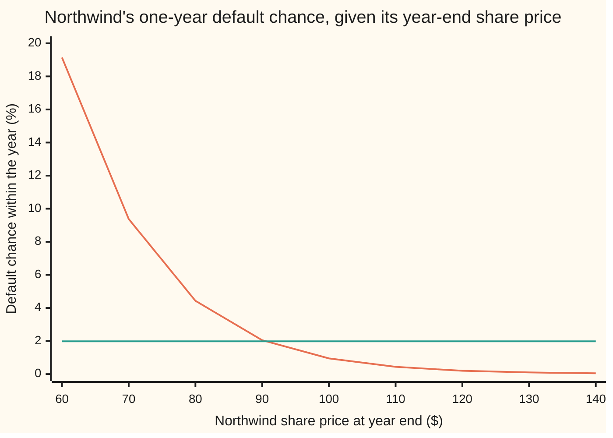
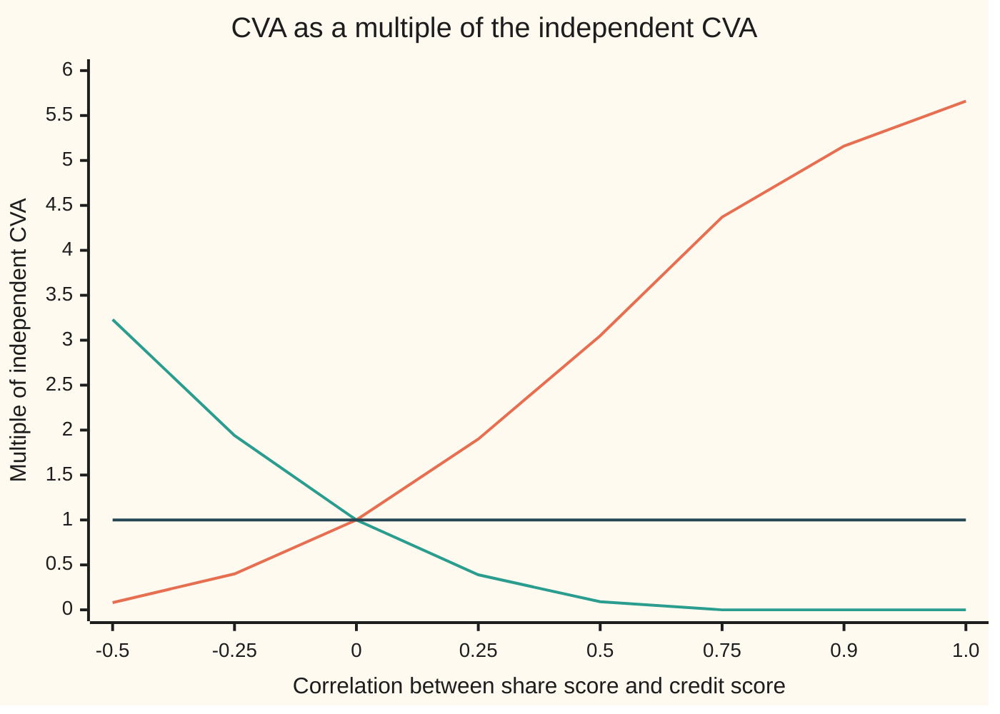

# Wrong-way risk: when the exposure grows just as the counterparty weakens, and what it does to CVA

[Syllabus](../../../SYLLABUS.md) → [Financial mathematics](../../../SYLLABUS.md#w12) → [Counterparty Risk and CVA](../../../SYLLABUS.md#w12-s46) → Wrong-way risk

---

## General Overview

A fund buys a one-year put on Northwind's shares. The shares trade at $100, the strike is $100, and the market is the house market: a 5% bank rate, a 2% dividend yield, 20% volatility. The put is worth $6.33. The fund bought it from Northwind itself.

Northwind can fail. Its credit spread implies a hazard rate (the default chance per year, counted continuously) of 2%, so about a 1.98% chance of failing within the year. If it fails, the fund collects 40 cents on the dollar of whatever the put is owed. The price of that risk is the **CVA** (credit valuation adjustment): the average loss from the seller's default, counted in today's dollars ([CVA](03-cva.md)).

The CVA card multiplies three numbers: the loss share, 60%, the default chance, 1.98%, and the put's value, $6.33. That gives $0.0752. The multiplication assumes the put's payoff and Northwind's default have nothing to do with each other. Here they have everything to do with each other. The put pays most when Northwind's shares have fallen hard, and a firm whose shares have fallen hard is the firm most likely to be failing. The protection pays out in exactly the worlds where its seller cannot pay.

That coincidence is **wrong-way risk**: exposure (what the counterparty owes) tends to be large exactly when the counterparty is likely to default. Its mirror is **right-way risk**: exposure tends to be small then. A call on the same Northwind shares, from the same Northwind, is right-way: it pays when Northwind is doing well.

This card ties Northwind's default to its share price through a Gaussian copula (a rule that joins two chances without changing either), with correlation 50%. The put's CVA becomes $0.2297, **3.05 times** the independent figure. The call's CVA falls from $0.1096 (risky call $9.12, as on the CVA card) to $0.0093. Northwind's default chance never moves from 1.98%.

**CVA is the average of exposure times default, and an average of a product equals the product of averages only when the two do not move together; wrong-way risk is the extra that the covariance adds, and right-way risk is what it takes away.**

**What kind of fact this is:** a model: the Gaussian link between share and credit is an assumption, not a law. Inside it, the covariance split, the closed form and the direction of each effect are theorems proved on this card in Why it works.

### The picture: Northwind's default chance, once the year-end share price is known



Steep curve: the default chance at 50% correlation, once the share price is known. Flat line: the same chance with the link cut, 1.98% wherever the shares end. The put pays $40 at a share price of $60, where default is 19.14% likely; it pays nothing above $100, where default is below 1%. Averaged over how often each price occurs, the steep curve still comes to 1.98%.

---

## The formula

Notation first, in words. Northwind's year-end share price is driven by one bell-curve draw $Y$, the **share score**: average 0, spread 1, a low value meaning a low price. Northwind's health is a second bell-curve draw $Z$, the **credit score**. Northwind defaults within the year when $Z$ falls below a cutoff $a$. The two scores have correlation $\rho$. The payoff the fund is owed is the **exposure** $X$; $B$ is 1 if Northwind defaults and 0 if not. $N$ is the bell-curve area to the left of a point, as on the Black-Scholes cards, $\varphi$ is the bell-curve height, and $\mathbb{E}$ is an average over all outcomes.

$$\mathrm{CVA} = L\,\mathbb{E}\!\left[e^{-rT}XB\right] = L\int_{-\infty}^{\infty} e^{-rT}\,X(y)\,\varphi(y)\,p_\rho(y)\,dy, \qquad p_\rho(y) = N\!\left(\frac{a-\rho y}{\sqrt{1-\rho^2}}\right)$$

**Read it aloud:** for each possible share outcome, take what the put pays, discount it, weight it by how often that outcome occurs and by Northwind's default chance in that outcome, add it all up, and keep the 60% that recovery does not return.

Split the average of a product into the product of averages plus a correction:

$$\mathrm{CVA} = \underbrace{L\,p\,P}_{\text{the independent CVA}} + \underbrace{L\,\mathrm{Cov}\!\left(e^{-rT}X,\;B\right)}_{\text{the wrong-way term}}$$

**Read it aloud:** CVA is the loss share times the default chance times the clean price, plus the loss share times how strongly the discounted payoff and the default move together. Cov is covariance: the average of the product minus the product of the averages.

For the put the integral has a closed form. It uses $N_2(h, k; \rho)$, the chance that two bell-curve draws with correlation $\rho$ fall below $h$ and $k$ together:

$$\mathrm{CVA}_{\text{put}}(\rho) = L\left[K e^{-rT} N_2(-d_2,\,a;\,\rho) - S e^{-qT} N_2\!\left(-d_1,\,a-\rho\sigma\sqrt{T};\,\rho\right)\right]$$

**Read it aloud:** the cash the put hands over, counted only in worlds where it pays and Northwind has failed, minus the shares it takes in, counted the same way; the shares' count uses a cutoff shifted by the correlation times one volatility unit.

The call is the mirror, with the correlation's sign flipped:

$$\mathrm{CVA}_{\text{call}}(\rho) = L\left[S e^{-qT} N_2\!\left(d_1,\,a-\rho\sigma\sqrt{T};\,-\rho\right) - K e^{-rT} N_2(d_2,\,a;\,-\rho)\right]$$

| Symbol | Plain meaning | In our example | Push it up and the answer… |
| --- | --- | --- | --- |
| $S$, $K$, $S_T$ | Northwind's share price today, the strike, the share price at year end | $100, $100, depends on $Y$ | higher $S$: the put and its CVA shrink |
| $r$, $q$, $\sigma$, $T$ | bank rate, dividend yield, volatility, years to expiry | 5%, 2%, 20%, 1 | higher $\sigma$: the put is worth more, CVA rises |
| $P$, $C$, $d_1$, $d_2$ | clean put and call (prices with no default risk), and the Black-Scholes distances as on the pilot | $6.33 and $9.23; 0.25 and 0.05 | CVA scales with the clean price |
| $\lambda$, $p$ | Northwind's hazard rate, and its one-year default chance $1 - e^{-\lambda T}$ | 2%, 1.9801% | CVA rises almost in proportion |
| $R$, $L$ | recovery rate, and the loss share $L = 1 - R$ | 40%, 60% | higher $L$: CVA rises in proportion |
| $Y$, $y$, $\varepsilon$ | the share score, one value of it, and Northwind's private credit noise | bell-curve draws | — |
| $Z$, $a$ | the credit score $Z = \rho Y + \sqrt{1-\rho^2}\,\varepsilon$, and the default cutoff $N^{-1}(p)$ | $a = -2.0579$ | higher $a$: more defaults |
| $\rho$ | correlation between share score and credit score | 50% | put CVA rises, call CVA falls |
| $p_\rho(y)$ | default chance once the share score is known to be $y$ | 4.43% if the shares end at $80 | — |
| $X$, $B$ | exposure (what Northwind owes at year end), and default (1 or 0) | the put's payoff | — |
| $N$, $N_2$, $\varphi$, $h$, $k$ | bell-curve area to the left; the same for a correlated pair, below $h$ and $k$; bell-curve height | $N(a) = p$ | — |
| $U$, $V$, $f$, $g$ | any two quantities in a covariance; two functions of the share score in the proofs | $U$ the discounted payoff, $V$ the default | — |

The helpers: the share price at year end is $S_T = S e^{(r - q - \sigma^2/2)T + \sigma\sqrt{T}\,Y}$, as in [Geometric Brownian motion](../../11-Stochastic%20processes%20and%20calculus/05-Brownian%20Motion/07-geometric-brownian-motion.md). The put pays when $Y < -d_2$, that is when the shares end below $100. The cutoff $a = N^{-1}(p)$ is the point with 1.98% of the bell curve to its left.

### When it holds

- **Settlement at year end.** If Northwind fails during the year, the put still settles at expiry and the fund collects 40% of what it is owed. Real contracts close out at the default date, on the replacement value then; the numbers move, the direction does not. [Expected exposure over time](02-expected-exposure-profiles.md) handles exposure date by date.
- **A Gaussian link.** Bell-curve scores give joint extremes little weight. A fatter-tailed copula puts more weight on "shares crash and Northwind fails together", and raises the put's CVA further ([Tail dependence](../45-Portfolio%20Credit%20-%20Correlation%2C%20Copulas%2C%20Indices%20and%20Tranches/07-tail-dependence-and-the-t-copula.md)).
- **No jump at default.** In this model a failing Northwind's shares are merely low. Real shares of a defaulted firm fall toward zero. That pushes the put's CVA toward its ceiling, $1.13, computed below.
- **Fixed recovery.** Recoveries are lower when the firm fails in a bad state; a fixed 40% understates the loss.
- **A correlation nobody quotes.** No market trades $\rho$. It is a judgement or a stress parameter, and the answer triples between 0% and 50%.

---

## Why it works

### Step 0: an average of a product needs to know how the factors move together

CVA is an average of a product: payoff times default. If a big payoff and a default tend to happen in the same worlds, the average of the product is larger than the product of the averages. If they avoid each other, it is smaller. Only when they are unrelated does the CVA card's multiplication hold. Wrong-way risk is that gap.

### Step 1: the covariance split

Covariance is defined as $\mathrm{Cov}(U, V) = \mathbb{E}[UV] - \mathbb{E}[U]\,\mathbb{E}[V]$, for any two quantities $U$ and $V$ with finite averages. Rearranged, $\mathbb{E}[UV] = \mathbb{E}[U]\,\mathbb{E}[V] + \mathrm{Cov}(U, V)$. Put $U = e^{-rT}X$ and $V = B$. The average of the discounted payoff is the clean put, $P$, because the put's price is its discounted average payoff ([Black-Scholes put](../08-The%20Black-Scholes%20call%20and%20put/02-black-scholes-put.md)). The average of $B$ is $p$. Multiply by $L$ and the split in The formula follows. It is exact and needs no model. The model is needed to compute the covariance.

### Step 2: join the scores without moving the default chance

Northwind's credit score is $Z = \rho Y + \sqrt{1-\rho^2}\,\varepsilon$, with $\varepsilon$ a private bell-curve draw independent of $Y$. The weights are chosen so that the variance is $\rho^2 + (1 - \rho^2) = 1$ at every correlation. So $Z$ is a standard bell-curve draw whatever $\rho$ is, and the chance that $Z < a$ is $N(a) = p = 1.98\%$. Correlation only decides which worlds the defaults fall in.

This is the one-factor construction of [The one-factor Gaussian copula](../45-Portfolio%20Credit%20-%20Correlation%2C%20Copulas%2C%20Indices%20and%20Tranches/02-one-factor-gaussian-copula.md), with Northwind's share score playing the economy factor. That card weights the factor by $\sqrt{\rho}$, because its $\rho$ is the correlation between two firms. Here $\rho$ is the correlation between the credit score and the factor itself, so the weight is $\rho$.

### Step 3: the default chance once the share score is known

Fix $Y = y$. Then $Z < a$ means $\sqrt{1-\rho^2}\,\varepsilon < a - \rho y$, that is $\varepsilon < (a - \rho y)/\sqrt{1-\rho^2}$. The private noise is still a standard bell-curve draw, so the chance is $p_\rho(y)$. For positive $\rho$ it falls as $y$ rises: a higher share price means a healthier Northwind. At 50% correlation, shares ending at $100 leave a default chance of 0.95%; shares ending at $60 raise it to 19.14%.

### Step 4: average over the share score

Average in two stages: first over Northwind's private noise with the share score held fixed, then over the share score. The first stage turns $B$ into $p_\rho(y)$. The second is the integral in The formula. This is the first road in the code, and it works for any payoff: replace the put's $X(y)$ with any other.

### Step 5: the closed form, by splitting the payoff

The put's payoff is $K$ in cash minus one share, in the worlds where $Y < -d_2$. The cash half contributes $K e^{-rT}$ times the chance that $Y < -d_2$ and $Z < a$ together, which is $N_2(-d_2, a; \rho)$. The share half is worth more in the worlds where the shares are high, so it is averaged under a slid bell curve, as in Step 3 of the Black-Scholes pilot. Sliding $Y$ up by one volatility unit, $\sigma\sqrt{T}$, slides $Z$ up by $\rho\sigma\sqrt{T}$, since $Z$ carries $\rho$ of $Y$. Both cutoffs move: $-d_2$ becomes $-d_1$, and $a$ becomes $a - \rho\sigma\sqrt{T}$.

<details>
<summary>Detailed proof: the share half, by completing the square</summary>

The share half is $\mathbb{E}[e^{-rT} S_T\, \mathbf{1}\{Y < -d_2\}\, \mathbf{1}\{Z < a\}]$, where $\mathbf{1}\{\cdot\}$ is 1 when the condition holds and 0 otherwise. Write $v = \sigma\sqrt{T}$, so $e^{-rT}S_T = S e^{-qT} e^{vY - v^2/2}$.

Condition on $Y = y$ as in Step 3. The share half becomes $S e^{-qT}\int_{-\infty}^{-d_2} e^{vy - v^2/2}\,\varphi(y)\,p_\rho(y)\,dy$. Completing the square gives $e^{vy - v^2/2}\varphi(y) = \varphi(y - v)$. Substitute $u = y - v$: the upper limit becomes $-d_2 - v = -d_1$, and $p_\rho(u + v) = N\big((a - \rho v - \rho u)/\sqrt{1-\rho^2}\big)$, which is $p_\rho(u)$ with the cutoff $a$ replaced by $a - \rho v$.

What remains is $\int_{-\infty}^{-d_1}\varphi(u)\,N\big((a' - \rho u)/\sqrt{1-\rho^2}\big)\,du$ with $a' = a - \rho v$. By Step 3 read backwards, that is the chance that a standard pair with correlation $\rho$ falls below $-d_1$ and $a'$ together: $N_2(-d_1, a - \rho v; \rho)$. The cash half is the same integral without the slide. Subtract and multiply by $L$.

For the call, the region is $Y > -d_2$. Replacing $Y$ by $-Y$ turns "above $-d_2$" into "below $d_2$" and flips the correlation's sign, which gives the call formula.

</details>

### Step 6: why the put's CVA rises and the call's falls

For $\rho > 0$ both the put's payoff and $p_\rho(y)$ fall as $y$ rises. Two quantities that both fall with the same variable have positive covariance, so the wrong-way term is positive and the put's CVA exceeds $L p P$. The call's payoff rises with $y$ while $p_\rho(y)$ falls; their covariance is negative, and the call's CVA is below $L p C$. Flip the sign of $\rho$ and the roles swap: the put becomes right-way.

<details>
<summary>Detailed proof: two falling functions have positive covariance</summary>

Let $f$ and $g$ be functions of $Y$ that are both non-increasing, with finite averages of $f$, $g$ and their product. Take $Y'$, an independent copy of $Y$. For any pair of values, $(f(Y) - f(Y'))(g(Y) - g(Y'))$ is never negative: when $Y < Y'$ both brackets are at least zero, and when $Y > Y'$ both are at most zero.

Average it. Expanding gives $2\,\mathbb{E}[fg] - 2\,\mathbb{E}[f]\,\mathbb{E}[g] = 2\,\mathrm{Cov}(f(Y), g(Y))$, using independence for the cross terms. So the covariance is at least zero. It is strictly positive when both functions change on a set of outcomes with positive chance: the put's payoff falls strictly below $-d_2$, and for $0 < \rho < 1$, $p_\rho$ falls strictly everywhere.

Now $\mathrm{Cov}(e^{-rT}X, B) = \mathrm{Cov}(e^{-rT}X, p_\rho(Y))$, because averaging $B$ over the private noise first gives $p_\rho(Y)$. Take $f$ the discounted put payoff and $g = p_\rho$: positive covariance. For the call, $f$ rises, so $-f$ falls, and the covariance is negative. This is a statement about this monotone model, not about every trade called a put.

</details>

### Step 7: the extremes

At $\rho = 1$ the credit score is the share score, and Northwind defaults exactly when $Y < a$. The cutoff $a = -2.0579$ lies inside the put's paying region, so the CVA is $L[K e^{-rT} N(a) - S e^{-qT} N(a - \sigma\sqrt{T})] = 0.4258$, 5.66 times the independent figure. The call is then never owed anything in a default world, and its CVA is zero.

No model can go past one bound. The put never pays more than $K$. So its CVA is at most $L K e^{-rT} p = 0.6 \times 95.1229 \times 0.019801 = 1.1301$, which is what the CVA would be if Northwind's shares went to zero at the moment it failed. That is the extreme case of a put on the counterparty's own shares: in every default world the protection is owed its maximum. A model in which the shares jump toward zero at default moves the CVA from the Gaussian figure toward this ceiling.

The other route ties the hazard rate, not a score, to the exposure. Hull and White (2012) make Northwind's hazard rate an increasing function of the trade's value, fitted so that the average default chance still matches the credit spread; a simulation of the share path then averages exposure times the path's default chance. It answers the same question with default timing built in, at the cost of a simulation.

---

## Worked numbers, by hand

The Northwind put at 50% correlation, by the closed form.

| Step | Arithmetic | Value |
| --- | --- | --- |
| clean put | Black-Scholes, house market | $6.330081 |
| default chance | $1 - e^{-0.02}$ | 0.019801 |
| cutoff | the point with 1.9801% of the bell curve to its left | −2.057870 |
| independent CVA | 0.6 × 0.019801 × 6.330081 | 0.075206 |
| discounted strike and share | $100e^{-0.05}$, $100e^{-0.02}$ | 95.122942 and 98.019867 |
| cash-half area | $N_2(-0.05, -2.0579; 0.5)$ | 0.017950 |
| share-half area | $N_2(-0.25, -2.0579 - 0.1; 0.5)$ | 0.013513 |
| put CVA at 50% | 0.6 × (95.122942 × 0.017950 − 98.019867 × 0.013513) | **0.229705** |
| times the independent figure | 0.229705 / 0.075206 | **3.05** |
| exposure given default | 0.229705 / (0.6 × 0.019801) | 19.334150 |
| risky put | 6.330081 − 0.229705 | $6.100376 |

The put is worth $6.33 on average across all worlds, but $19.33 on average across the worlds where Northwind fails. That second number is the exposure the CVA really multiplies: the fund's claim is three times larger than usual at the moment it becomes uncollectable. The fair price of the put from Northwind is $6.10, not the $6.25 the independent CVA suggests.

The same numbers across the correlation, for the put (wrong-way) and the call (right-way), each divided by its own independent CVA:



Rising line: the put on Northwind's shares, 0.08 times at −50% up to 5.66 times at 100%. Falling line: the call on the same shares, 3.23 times at −50% down to zero once the correlation passes about 90%. Flat line: the independent CVA, 1 by definition. At zero correlation all three meet. Negative correlation makes the put right-way and the call wrong-way.

Four figures for the same put, CVA in dollars per share:

```
CVA of the Northwind put, in dollars, one █ = 5 cents
independent (rho 0)        ██                      0.0752
Gaussian, rho 0.5          █████                   0.2297
Gaussian, rho 1            █████████               0.4258
ceiling: shares go to 0    ███████████████████████ 1.1301
```

### What breaks if you drop a piece

| Mistake | Comes out at | What went wrong |
| --- | --- | --- |
| The CVA card's product, at 50% correlation | 0.0752 | Treats payoff and default as unrelated; misses most of the charge. |
| 50% read as the copula card's variance share | 0.3117 | That card's $\rho$ weights the factor by $\sqrt{\rho}$; plugging 50% there means a correlation equal to the square root of 50%. |
| Sign of $\rho$ flipped | 0.0063 | A low credit score means default; positive $\rho$ means shares and health fall together. Flip it and the put looks right-way. |
| The ceiling quoted as the price | 1.1301 | A bound, reached only if the shares go to zero at default in every case. |

---

## Code, from first principles, and it actually runs

The code prices the Northwind put and call at eight correlations by two independent roads: the one-dimensional integral of Step 4 (Simpson's rule), and the closed form of Step 5, whose $N_2$ is built from Plackett's identity, which writes $N_2$ as $N(h)N(k)$ plus an integral of the pair's density over the correlation from 0 to $\rho$. A third road simulates a million pairs of scores at 50% correlation. A fourth checks an identity: put CVA minus call CVA equals $L[K e^{-rT}N(a) - S e^{-qT}N(a - \rho\sigma\sqrt{T})]$, since the put minus the call is cash minus a share in every world. Its own normal area, root finder, integrator and random numbers are written out.

### Python

```python
# Wrong-way risk -- the check behind the card.  Standard library only.
# A put on Northwind's own shares, bought from Northwind.  Default is tied to the
# share through a Gaussian copula; CVA is recomputed at each correlation.
# Nothing imported knows the answer: normal CDF by series, quantile by bisection,
# integrals by Simpson's rule, random numbers by splitmix64 and Box-Muller.
from math import exp, log, sqrt, pi, cos

def phi(x): return exp(-0.5 * x * x) / sqrt(2.0 * pi)            # bell-curve height
def N(x):                                                         # 1/2 + phi(x)(x + x^3/3 + x^5/15 + ...)
    if x < -9.0: return 0.0
    if x > 9.0: return 1.0
    term, total, k = x, x, 1
    while abs(term) > 1e-17 * abs(total):
        k += 2; term *= x * x / k; total += term
    return 0.5 + phi(x) * total
def inv_N(p):                                                     # the z with N(z) = p, by bisection
    lo, hi = -9.0, 9.0
    for _ in range(100):
        mid = 0.5 * (lo + hi)
        if N(mid) < p: lo = mid
        else: hi = mid
    return 0.5 * (lo + hi)
def simpson(f, a, b, n):
    h = (b - a) / n
    return (f(a) + f(b) + sum((4 if i % 2 else 2) * f(a + i * h) for i in range(1, n))) * h / 3.0

S, K, r, q, sig, T = 100.0, 100.0, 0.05, 0.02, 0.20, 1.0         # the house market, on Northwind's shares
lam, R = 0.02, 0.40                                               # Northwind's hazard rate and recovery
L, p = 1.0 - R, 1.0 - exp(-lam * T)                               # loss share, one-year default chance
a = inv_N(p)                                                      # the default cutoff on the credit score
v = sig * sqrt(T)
d1 = (log(S / K) + (r - q + 0.5 * sig * sig) * T) / v
d2 = d1 - v
D = exp(-r * T)
put = K * D * N(-d2) - S * exp(-q * T) * N(-d1)
call = S * exp(-q * T) * N(d1) - K * D * N(d2)
def s_T(y): return S * exp((r - q - 0.5 * sig * sig) * T + v * y)  # year-end share price, share score y
def p_rho(y, rho):                                                # default chance once the share score is y
    if rho >= 1.0: return 1.0 if y <= a else 0.0
    return N((a - rho * y) / sqrt(1.0 - rho * rho))

# road 1: integrate payoff x bell-curve height x conditional default chance
def cva_int(rho, kind):
    if kind == "put":
        lo, hi, pay = -9.0, -d2, lambda y: K - s_T(y)
    else:
        lo, hi, pay = -d2, 9.0, lambda y: s_T(y) - K
    if rho >= 1.0: hi = min(hi, a)                                # default only below the cutoff
    if hi <= lo: return 0.0
    return L * D * simpson(lambda y: pay(y) * phi(y) * p_rho(y, rho), lo, hi, 4000)

# road 2: closed form with the two-score bell-curve area N2, built from Plackett's identity
def N2(h, k, rho):                                                # chance first score < h and second < k
    def dens(t):
        if 1.0 - t * t < 1e-14: return 0.0
        return exp(-(h * h - 2 * t * h * k + k * k) / (2 * (1 - t * t))) / (2 * pi * sqrt(1 - t * t))
    return N(h) * N(k) + (simpson(dens, 0.0, rho, 2000) if rho != 0.0 else 0.0)
def cva_closed(rho, kind):
    if kind == "put":
        return L * (K * D * N2(-d2, a, rho) - S * exp(-q * T) * N2(-d1, a - rho * v, rho))
    return L * (S * exp(-q * T) * N2(d1, a - rho * v, -rho) - K * D * N2(d2, a, -rho))

# road 3: simulate share and credit scores together
M64 = (1 << 64) - 1
seed = [2026]
def rand():                                                       # splitmix64 -> uniform strictly inside (0, 1)
    seed[0] = (seed[0] + 0x9E3779B97F4A7C15) & M64
    z = seed[0]
    z = ((z ^ (z >> 30)) * 0xBF58476D1CE4E5B9) & M64
    z = ((z ^ (z >> 27)) * 0x94D049BB133111EB) & M64
    return (((z ^ (z >> 31)) >> 11) + 0.5) / 9007199254740992.0
def mc(rho, n=1000000):
    sp = sc = sp2 = sc2 = 0.0
    for _ in range(n):
        u1, u2, u3 = rand(), rand(), rand()
        y = sqrt(-2.0 * log(u1)) * cos(2.0 * pi * u2)
        e = sqrt(-2.0 * log(u3)) * cos(2.0 * pi * rand())
        if rho * y + sqrt(1.0 - rho * rho) * e <= a:              # Northwind defaults this year
            st = s_T(y)
            xp, xc = L * D * max(K - st, 0.0), L * D * max(st - K, 0.0)
            sp += xp; sp2 += xp * xp; sc += xc; sc2 += xc * xc
    mp, mcl = sp / n, sc / n
    return mp, sqrt((sp2 / n - mp * mp) / n), mcl, sqrt((sc2 / n - mcl * mcl) / n)

indep_put, indep_call = L * p * put, L * p * call
print(f"{'clean put, Black-Scholes':<34}{put:>12.6f}")
print(f"{'clean call, Black-Scholes':<34}{call:>12.6f}")
print(f"{'one-year default chance p':<34}{p:>12.6f}")
print(f"{'default cutoff a':<34}{a:>12.6f}")
print(f"{'d1, d2':<22}{d1:>12.6f}{d2:>12.6f}")
print(f"{'independent put CVA  L p P':<34}{indep_put:>12.6f}")
print(f"{'independent call CVA L p C':<34}{indep_call:>12.6f}")
print()
print("rho    put:integral    closed   x indep   call:integral   closed   x indep")
rhos = (-0.5, -0.25, 0.0, 0.25, 0.5, 0.75, 0.9, 1.0)
res = {}
for rho in rhos:
    res[rho] = (cva_int(rho, "put"), cva_closed(rho, "put"), cva_int(rho, "call"), cva_closed(rho, "call"))
    pi_, pc_, ci_, cc_ = res[rho]
    print(f"{rho:>5.2f} {pi_:>13.6f} {pc_:>9.6f} {pi_ / indep_put:>8.2f} {ci_:>14.6f} {cc_:>9.6f} {ci_ / indep_call:>8.2f}")
put5, call5 = res[0.5][0], res[0.5][2]
mp, sep, mcl, sec = mc(0.5)
print()
print(f"{'MC rho 0.5 put, 1000000 paths':<34}{mp:>12.4f}  +/- {sep:.4f}")
print(f"{'MC rho 0.5 call, 1000000 paths':<34}{mcl:>12.4f}  +/- {sec:.4f}")
parity = L * (K * D * N(a) - S * exp(-q * T) * N(a - 0.5 * v))
print(f"{'K e^-rT, S e^-qT':<22}{K * D:>12.6f}{S * exp(-q * T):>12.6f}")
print(f"{'N2(-d2, a; .5), N2(-d1, a-.5v; .5)':<34}{N2(-d2, a, 0.5):>12.6f}{N2(-d1, a - 0.5 * v, 0.5):>12.6f}")
print(f"{'rho 0.5 put CVA - call CVA':<34}{put5 - call5:>12.6f}")
print(f"{'  L(K D N(a) - S e^-qT N(a-rho v))':<34}{parity:>12.6f}")
for x in (0.0, 0.5, 1.0):
    print(f"{'put exposure given default, rho':<30}{x:>4.1f}{res[x][0] / (L * p):>12.6f}")
print(f"{'rho 0.5 risky put  P - CVA':<34}{put - put5:>12.6f}")
print(f"{'independent risky put':<34}{put - indep_put:>12.6f}")
print(f"{'ceiling: put pays K at default':<34}{L * K * D * p:>12.6f}")
print(f"{'house check: L p x Acme call':<34}{indep_call:>12.6f}")
print()
print("wrong answers")
print(f"{'wrong: independent formula at 0.5':<34}{indep_put:>12.6f}")
print(f"{'wrong: 50% as a variance share':<34}{cva_int(sqrt(0.5), 'put'):>12.6f}")
print(f"{'wrong: sign of rho flipped':<34}{res[-0.5][0]:>12.6f}")
print(f"{'wrong: the ceiling read as a price':<34}{L * K * D * p:>12.6f}")
print()
print(f"chart: default chance % at rho 0.5 by year-end price; {100 * p:.2f} at rho 0")
for st in (60.0, 70.0, 80.0, 90.0, 100.0, 110.0, 120.0, 130.0, 140.0):
    y = (log(st / S) - (r - q - 0.5 * sig * sig) * T) / v
    print(f"  price {st:>5.0f}   default chance {100 * p_rho(y, 0.5):>6.2f}   put pays {max(K - st, 0.0):>5.2f}")

assert all(abs(res[x][0] - res[x][1]) < 1e-7 for x in rhos), "put: integral road vs closed-form road"
assert all(abs(res[x][2] - res[x][3]) < 1e-7 for x in rhos), "call: integral road vs closed-form road"
assert abs(res[0.0][0] - L * p * put) < 1e-8, "independence: integral must collapse to L p P"
assert abs(mp - put5) < 4 * sep and abs(mcl - call5) < 4 * sec, "simulation within 4 standard errors"
assert all(abs(res[x][0] - res[x][2] - L * (K * D * N(a) - S * exp(-q * T) * N(a - x * v))) < 1e-7 for x in rhos), "CVA parity"
assert all(res[x][0] < res[y][0] and res[x][2] > res[y][2] for x, y in zip(rhos, rhos[1:])), "put up, call down"
assert res[1.0][0] < L * K * D * p, "no model beats the ceiling"
assert abs(put - 6.330080627550) < 1e-9 and abs(indep_call - 0.1096) < 5e-5 and abs(call - indep_call - 9.117) < 5e-4, "house put, CVA 0.1096, risky call 9.117"
print("ALL CHECKS PASS")
```

**Ran 2026-09-28 on macOS, Python 3.14.6, standard library only. All checks passed. Output, pasted from the run:**

```
clean put, Black-Scholes              6.330081
clean call, Black-Scholes             9.227006
one-year default chance p             0.019801
default cutoff a                     -2.057870
d1, d2                    0.250000    0.050000
independent put CVA  L p P            0.075206
independent call CVA L p C            0.109624

rho    put:integral    closed   x indep   call:integral   closed   x indep
-0.50      0.006311  0.006311     0.08       0.353686  0.353686     3.23
-0.25      0.029788  0.029788     0.40       0.212838  0.212838     1.94
 0.00      0.075206  0.075206     1.00       0.109624  0.109624     1.00
 0.25      0.142695  0.142695     1.90       0.043010  0.043010     0.39
 0.50      0.229705  0.229705     3.05       0.009330  0.009330     0.09
 0.75      0.329000  0.329000     4.37       0.000275  0.000275     0.00
 0.90      0.388237  0.388237     5.16       0.000000  0.000000     0.00
 1.00      0.425752  0.425752     5.66       0.000000  0.000000     0.00

MC rho 0.5 put, 1000000 paths           0.2294  +/- 0.0019
MC rho 0.5 call, 1000000 paths          0.0091  +/- 0.0003
K e^-rT, S e^-qT         95.122942   98.019867
N2(-d2, a; .5), N2(-d1, a-.5v; .5)    0.017950    0.013513
rho 0.5 put CVA - call CVA            0.220375
  L(K D N(a) - S e^-qT N(a-rho v))    0.220375
put exposure given default, rho 0.0    6.330081
put exposure given default, rho 0.5   19.334150
put exposure given default, rho 1.0   35.835314
rho 0.5 risky put  P - CVA            6.100376
independent risky put                 6.254874
ceiling: put pays K at default        1.130136
house check: L p x Acme call          0.109624

wrong answers
wrong: independent formula at 0.5     0.075206
wrong: 50% as a variance share        0.311672
wrong: sign of rho flipped            0.006311
wrong: the ceiling read as a price    1.130136

chart: default chance % at rho 0.5 by year-end price; 1.98 at rho 0
  price    60   default chance  19.14   put pays 40.00
  price    70   default chance   9.38   put pays 30.00
  price    80   default chance   4.43   put pays 20.00
  price    90   default chance   2.05   put pays 10.00
  price   100   default chance   0.95   put pays  0.00
  price   110   default chance   0.44   put pays  0.00
  price   120   default chance   0.20   put pays  0.00
  price   130   default chance   0.10   put pays  0.00
  price   140   default chance   0.05   put pays  0.00
ALL CHECKS PASS
```

### Rust

```rust
// Wrong-way risk -- the check behind the card.  Rust std only, no crates.
// A put on Northwind's own shares, bought from Northwind.  Default is tied to the
// share through a Gaussian copula; CVA is recomputed at each correlation.
// Normal CDF by series, quantile by bisection, integrals by Simpson's rule,
// random numbers by splitmix64 and Box-Muller: all written out below.
use std::f64::consts::PI;

const S: f64 = 100.0; const K: f64 = 100.0; const R_: f64 = 0.05; const Q: f64 = 0.02;
const SIG: f64 = 0.20; const T: f64 = 1.0; const LAM: f64 = 0.02; const REC: f64 = 0.40;

fn phi(x: f64) -> f64 { (-0.5 * x * x).exp() / (2.0 * PI).sqrt() }
fn n(x: f64) -> f64 {
    if x < -9.0 { return 0.0; }
    if x > 9.0 { return 1.0; }
    let (mut term, mut total, mut k) = (x, x, 1.0);
    while term.abs() > 1e-17 * total.abs() { k += 2.0; term *= x * x / k; total += term; }
    0.5 + phi(x) * total
}
fn inv_n(p: f64) -> f64 {
    let (mut lo, mut hi) = (-9.0, 9.0);
    for _ in 0..100 { let mid = 0.5 * (lo + hi); if n(mid) < p { lo = mid } else { hi = mid } }
    0.5 * (lo + hi)
}
fn simpson<F: Fn(f64) -> f64>(f: F, a: f64, b: f64, m: usize) -> f64 {
    let h = (b - a) / m as f64;
    let mut s = f(a) + f(b);
    for i in 1..m { s += if i % 2 == 1 { 4.0 } else { 2.0 } * f(a + i as f64 * h); }
    s * h / 3.0
}
struct M { l: f64, a: f64, v: f64, d1: f64, d2: f64, disc: f64 }
impl M {
    fn s_t(&self, y: f64) -> f64 { S * ((R_ - Q - 0.5 * SIG * SIG) * T + self.v * y).exp() }
    fn p_rho(&self, y: f64, rho: f64) -> f64 {
        if rho >= 1.0 { return if y <= self.a { 1.0 } else { 0.0 }; }
        n((self.a - rho * y) / (1.0 - rho * rho).sqrt())
    }
    // road 1: integrate payoff x bell-curve height x conditional default chance
    fn cva_int(&self, rho: f64, put: bool) -> f64 {
        let (lo, mut hi) = if put { (-9.0, -self.d2) } else { (-self.d2, 9.0) };
        if rho >= 1.0 { hi = hi.min(self.a); }
        if hi <= lo { return 0.0; }
        let pay = |y: f64| if put { K - self.s_t(y) } else { self.s_t(y) - K };
        self.l * self.disc * simpson(|y| pay(y) * phi(y) * self.p_rho(y, rho), lo, hi, 4000)
    }
    // road 2: closed form with the two-score bell-curve area N2 (Plackett's identity)
    fn cva_closed(&self, rho: f64, put: bool) -> f64 {
        let (a, v, dq) = (self.a, self.v, (-Q * T).exp());
        if put { self.l * (K * self.disc * n2(-self.d2, a, rho) - S * dq * n2(-self.d1, a - rho * v, rho)) }
        else { self.l * (S * dq * n2(self.d1, a - rho * v, -rho) - K * self.disc * n2(self.d2, a, -rho)) }
    }
}
fn n2(h: f64, k: f64, rho: f64) -> f64 {
    let dens = |t: f64| {
        if 1.0 - t * t < 1e-14 { return 0.0; }
        (-(h * h - 2.0 * t * h * k + k * k) / (2.0 * (1.0 - t * t))).exp() / (2.0 * PI * (1.0 - t * t).sqrt())
    };
    n(h) * n(k) + if rho != 0.0 { simpson(dens, 0.0, rho, 2000) } else { 0.0 }
}
// road 3: simulate share and credit scores together
struct Rng(u64);
impl Rng {
    fn rand(&mut self) -> f64 {
        self.0 = self.0.wrapping_add(0x9E3779B97F4A7C15);
        let mut z = self.0;
        z = (z ^ (z >> 30)).wrapping_mul(0xBF58476D1CE4E5B9);
        z = (z ^ (z >> 27)).wrapping_mul(0x94D049BB133111EB);
        (((z ^ (z >> 31)) >> 11) as f64 + 0.5) / 9007199254740992.0
    }
}
fn mc(m: &M, rho: f64, paths: usize) -> (f64, f64, f64, f64) {
    let mut g = Rng(2026);
    let (mut sp, mut sc, mut sp2, mut sc2) = (0.0, 0.0, 0.0, 0.0);
    for _ in 0..paths {
        let (u1, u2, u3) = (g.rand(), g.rand(), g.rand());
        let y = (-2.0 * u1.ln()).sqrt() * (2.0 * PI * u2).cos();
        let e = (-2.0 * u3.ln()).sqrt() * (2.0 * PI * g.rand()).cos();
        if rho * y + (1.0 - rho * rho).sqrt() * e <= m.a {
            let st = m.s_t(y);
            let (xp, xc) = (m.l * m.disc * (K - st).max(0.0), m.l * m.disc * (st - K).max(0.0));
            sp += xp; sp2 += xp * xp; sc += xc; sc2 += xc * xc;
        }
    }
    let nf = paths as f64;
    let (mp, mcl) = (sp / nf, sc / nf);
    (mp, ((sp2 / nf - mp * mp) / nf).sqrt(), mcl, ((sc2 / nf - mcl * mcl) / nf).sqrt())
}
fn main() {
    let (l, p) = (1.0 - REC, 1.0 - (-LAM * T).exp());
    let v = SIG * T.sqrt();
    let d1 = ((S / K).ln() + (R_ - Q + 0.5 * SIG * SIG) * T) / v;
    let m = M { l, a: inv_n(p), v, d1, d2: d1 - v, disc: (-R_ * T).exp() };
    let (a, disc, dq) = (m.a, m.disc, (-Q * T).exp());
    let put = K * disc * n(-m.d2) - S * dq * n(-d1);
    let call = S * dq * n(d1) - K * disc * n(m.d2);
    let (indep_put, indep_call) = (l * p * put, l * p * call);
    println!("{:<34}{:>12.6}", "clean put, Black-Scholes", put);
    println!("{:<34}{:>12.6}", "clean call, Black-Scholes", call);
    println!("{:<34}{:>12.6}", "one-year default chance p", p);
    println!("{:<34}{:>12.6}", "default cutoff a", a);
    println!("{:<22}{:>12.6}{:>12.6}", "d1, d2", d1, m.d2);
    println!("{:<34}{:>12.6}", "independent put CVA  L p P", indep_put);
    println!("{:<34}{:>12.6}", "independent call CVA L p C", indep_call);
    println!();
    println!("rho    put:integral    closed   x indep   call:integral   closed   x indep");
    let rhos = [-0.5, -0.25, 0.0, 0.25, 0.5, 0.75, 0.9, 1.0];
    let mut res = Vec::new();
    for &rho in rhos.iter() {
        let row = (m.cva_int(rho, true), m.cva_closed(rho, true), m.cva_int(rho, false), m.cva_closed(rho, false));
        println!("{:>5.2} {:>13.6} {:>9.6} {:>8.2} {:>14.6} {:>9.6} {:>8.2}",
                 rho, row.0, row.1, row.0 / indep_put, row.2, row.3, row.2 / indep_call);
        res.push(row);
    }
    let at = |x: f64| res[rhos.iter().position(|&r| r == x).unwrap()];
    let (put5, call5) = (at(0.5).0, at(0.5).2);
    let (mp, sep, mcl, sec) = mc(&m, 0.5, 1000000);
    println!();
    println!("{:<34}{:>12.4}  +/- {:.4}", "MC rho 0.5 put, 1000000 paths", mp, sep);
    println!("{:<34}{:>12.4}  +/- {:.4}", "MC rho 0.5 call, 1000000 paths", mcl, sec);
    let parity = |x: f64| l * (K * disc * n(a) - S * dq * n(a - x * v));
    println!("{:<22}{:>12.6}{:>12.6}", "K e^-rT, S e^-qT", K * disc, S * dq);
    println!("{:<34}{:>12.6}{:>12.6}", "N2(-d2, a; .5), N2(-d1, a-.5v; .5)", n2(-m.d2, a, 0.5), n2(-d1, a - 0.5 * v, 0.5));
    println!("{:<34}{:>12.6}", "rho 0.5 put CVA - call CVA", put5 - call5);
    println!("{:<34}{:>12.6}", "  L(K D N(a) - S e^-qT N(a-rho v))", parity(0.5));
    for x in [0.0, 0.5, 1.0] {
        println!("{:<30}{:>4.1}{:>12.6}", "put exposure given default, rho", x, at(x).0 / (l * p));
    }
    println!("{:<34}{:>12.6}", "rho 0.5 risky put  P - CVA", put - put5);
    println!("{:<34}{:>12.6}", "independent risky put", put - indep_put);
    println!("{:<34}{:>12.6}", "ceiling: put pays K at default", l * K * disc * p);
    println!("{:<34}{:>12.6}", "house check: L p x Acme call", indep_call);
    println!();
    println!("wrong answers");
    println!("{:<34}{:>12.6}", "wrong: independent formula at 0.5", indep_put);
    println!("{:<34}{:>12.6}", "wrong: 50% as a variance share", m.cva_int(0.5f64.sqrt(), true));
    println!("{:<34}{:>12.6}", "wrong: sign of rho flipped", at(-0.5).0);
    println!("{:<34}{:>12.6}", "wrong: the ceiling read as a price", l * K * disc * p);
    println!();
    println!("chart: default chance % at rho 0.5 by year-end price; {:.2} at rho 0", 100.0 * p);
    for st in [60.0, 70.0, 80.0, 90.0, 100.0, 110.0, 120.0, 130.0, 140.0] {
        let y = ((st / S).ln() - (R_ - Q - 0.5 * SIG * SIG) * T) / v;
        println!("  price {:>5.0}   default chance {:>6.2}   put pays {:>5.2}", st, 100.0 * m.p_rho(y, 0.5), (K - st).max(0.0));
    }
    for (i, &x) in rhos.iter().enumerate() {
        assert!((res[i].0 - res[i].1).abs() < 1e-7, "put: integral road vs closed-form road");
        assert!((res[i].2 - res[i].3).abs() < 1e-7, "call: integral road vs closed-form road");
        assert!((res[i].0 - res[i].2 - parity(x)).abs() < 1e-7, "CVA parity");
        if i > 0 { assert!(res[i - 1].0 < res[i].0 && res[i - 1].2 > res[i].2, "put up, call down"); }
    }
    assert!((at(0.0).0 - l * p * put).abs() < 1e-8, "independence: integral must collapse to L p P");
    assert!((mp - put5).abs() < 4.0 * sep && (mcl - call5).abs() < 4.0 * sec, "simulation within 4 standard errors");
    assert!(at(1.0).0 < l * K * disc * p, "no model beats the ceiling");
    assert!((put - 6.330080627550).abs() < 1e-9 && (indep_call - 0.1096).abs() < 5e-5 && (call - indep_call - 9.117).abs() < 5e-4,
            "house put, CVA 0.1096, risky call 9.117");
    println!("ALL CHECKS PASS");
}
```

**Ran 2026-09-28 on macOS, rustc 1.98.1, no crates. All checks passed. Output, pasted from the run:**

```
clean put, Black-Scholes              6.330081
clean call, Black-Scholes             9.227006
one-year default chance p             0.019801
default cutoff a                     -2.057870
d1, d2                    0.250000    0.050000
independent put CVA  L p P            0.075206
independent call CVA L p C            0.109624

rho    put:integral    closed   x indep   call:integral   closed   x indep
-0.50      0.006311  0.006311     0.08       0.353686  0.353686     3.23
-0.25      0.029788  0.029788     0.40       0.212838  0.212838     1.94
 0.00      0.075206  0.075206     1.00       0.109624  0.109624     1.00
 0.25      0.142695  0.142695     1.90       0.043010  0.043010     0.39
 0.50      0.229705  0.229705     3.05       0.009330  0.009330     0.09
 0.75      0.329000  0.329000     4.37       0.000275  0.000275     0.00
 0.90      0.388237  0.388237     5.16       0.000000  0.000000     0.00
 1.00      0.425752  0.425752     5.66       0.000000  0.000000     0.00

MC rho 0.5 put, 1000000 paths           0.2294  +/- 0.0019
MC rho 0.5 call, 1000000 paths          0.0091  +/- 0.0003
K e^-rT, S e^-qT         95.122942   98.019867
N2(-d2, a; .5), N2(-d1, a-.5v; .5)    0.017950    0.013513
rho 0.5 put CVA - call CVA            0.220375
  L(K D N(a) - S e^-qT N(a-rho v))    0.220375
put exposure given default, rho 0.0    6.330081
put exposure given default, rho 0.5   19.334150
put exposure given default, rho 1.0   35.835314
rho 0.5 risky put  P - CVA            6.100376
independent risky put                 6.254874
ceiling: put pays K at default        1.130136
house check: L p x Acme call          0.109624

wrong answers
wrong: independent formula at 0.5     0.075206
wrong: 50% as a variance share        0.311672
wrong: sign of rho flipped            0.006311
wrong: the ceiling read as a price    1.130136

chart: default chance % at rho 0.5 by year-end price; 1.98 at rho 0
  price    60   default chance  19.14   put pays 40.00
  price    70   default chance   9.38   put pays 30.00
  price    80   default chance   4.43   put pays 20.00
  price    90   default chance   2.05   put pays 10.00
  price   100   default chance   0.95   put pays  0.00
  price   110   default chance   0.44   put pays  0.00
  price   120   default chance   0.20   put pays  0.00
  price   130   default chance   0.10   put pays  0.00
  price   140   default chance   0.05   put pays  0.00
ALL CHECKS PASS
```

The two outputs agree line for line, including the simulation, since both use the same random-number recipe and seed.

> [!TIP]
> **Try changing**
> - **Correlation 75%.** Guess first: more or less than four times the independent CVA? Read the 0.75 row of the sweep: 4.37 times, a CVA of 0.3290.
> - **Correlation −50%.** Guess first: which option becomes wrong-way? The put's CVA falls to 0.0063 and the call's rises to 0.3537, 3.23 times its independent figure.
> - **Correlation 90%, the call.** Guess first: how much CVA is left? None to six decimals: Northwind's default worlds sit at share scores below the cutoff, where the call pays nothing.
> - **The simulation.** Guess first: how close is a million paths? The put comes out at 0.2294 with a standard error of 0.0019, against 0.2297 exact.

---

## The usual mistake

> [!warning]
> **Reading wrong-way risk as a higher default chance.** It is not. Northwind's default chance is 1.98% at every correlation on this card; the cutoff never moves. What moves is where the defaults fall: at 50% correlation they land mostly in the worlds where the put pays. Bumping the default chance instead would raise the call's CVA too, when in fact the call's CVA falls to under a tenth of its independent figure.
>
> - **Mixing correlation conventions.** The copula card's $\rho$ is a variance share, and the correlation with the factor is its square root. Read 50% that way and the put's CVA comes out at 0.3117.
> - **Assuming right-way risk nets against wrong-way.** Buying the call as well does not cancel the put's charge: in Northwind's default worlds the call is owed almost nothing and the put almost everything. Their CVAs differ by 0.2204, exactly the identity in the code.
> - **Treating the Gaussian number as the worst case.** Bell-curve scores never send the shares to zero at default. A firm's own shares usually do fall close to zero when it fails, which pushes the put's CVA toward the 1.1301 ceiling.

---

## Where you meet it in real life

- **Puts on a firm's own shares.** The Basel Committee's counterparty rules give a company writing puts on its own stock as the standard example of specific wrong-way risk (exposure tied to one named counterparty), and require banks to identify and control it.
- **Credit protection bought from a correlated seller.** A bank that buys default protection on a company from a dealer heavily exposed to that company holds a claim that pays when the dealer is weakest. In 2007 and 2008 protection on mortgage securities bought from insurers that had sold large amounts of it lost value exactly when it was needed.
- **Currency trades with a local bank.** A forward that receives dollars from a bank in a country whose currency may collapse is worth most after a devaluation, and a devaluation is when that bank is most likely to fail.
- **Lending against the borrower's own bonds.** A loan secured by the borrower's own debt loses its collateral in the same event that stops the borrower paying.
- **Right-way hedges.** A producer that sells oil forward to a bank owes the bank most when oil is expensive, which is when the producer is richest. The bank's exposure and the producer's default chance move apart.
- **The shelf.** [Counterparty exposure](01-counterparty-exposure-and-netting.md) defines what is owed; [DVA](04-dva-and-bilateral-cva.md) lets the fund's own default count too, where the same coincidence can arise.

> **Say it back**
> CVA averages the loss from default over all worlds, which is exposure times default. That average equals the independent product plus a covariance term. For a put on Northwind's shares bought from Northwind, large payoffs and default happen together, so the covariance is positive and the CVA at 50% correlation is 3.05 times the independent figure. The call on the same shares is right-way: its CVA drops to under a tenth of the independent figure. The default chance never changes; only which worlds it lands in.

---

## What this builds on

- [CVA](03-cva.md): the loss-from-default average and the independent product $L p P$ that this card corrects.
- [The one-factor Gaussian copula](../45-Portfolio%20Credit%20-%20Correlation%2C%20Copulas%2C%20Indices%20and%20Tranches/02-one-factor-gaussian-copula.md): a factor plus private noise, a cutoff that keeps each default chance fixed, and the conditional default chance given the factor.
- [Black-Scholes put](../08-The%20Black-Scholes%20call%20and%20put/02-black-scholes-put.md): the clean put, $6.33, and the slid bell curve behind the share half.

## Where this goes next

- [CVA risk numbers](06-cva-risk-numbers-and-hedging.md): the card after this one on the shelf. How CVA moves when the share price, volatility or credit spread moves, and how a desk hedges it; under wrong-way risk the share hedge and the credit hedge can no longer be set separately.
- [Tail dependence](../45-Portfolio%20Credit%20-%20Correlation%2C%20Copulas%2C%20Indices%20and%20Tranches/07-tail-dependence-and-the-t-copula.md): a copula that gives joint crashes more weight than the Gaussian, pushing the put's CVA toward its ceiling.

---

## Sources

Verified 2026-09-28: every link below resolves; the Basel page was read, and each DOI's title, authors and pages were checked against its Crossref record.

- Basel Committee on Banking Supervision. *Basel Framework*, CRE53, "Internal models method for counterparty credit risk", paragraphs 53.47 and 53.48. [bis.org](https://www.bis.org/committees/bcbs/basel-framework/standard/cre/53/inforce/2023-01-01/published/2020-03-27). Defines specific wrong-way risk and gives the own-stock put as its example.
- Hull, John, and Alan White. "CVA and Wrong-Way Risk." *Financial Analysts Journal* 68, no. 5 (2012): 58–69. [doi:10.2469/faj.v68.n5.6](https://doi.org/10.2469/faj.v68.n5.6). The hazard-rate route: default intensity as a function of the trade's value.
- Li, David X. "On Default Correlation: A Copula Function Approach." *The Journal of Fixed Income* 9, no. 4 (2000): 43–54. [doi:10.3905/jfi.2000.319253](https://doi.org/10.3905/jfi.2000.319253). The Gaussian copula for default times, used here to join default to a share price.
- Plackett, R. L. "A Reduction Formula for Normal Multivariate Integrals." *Biometrika* 41, no. 3–4 (1954): 351–360. [doi:10.1093/biomet/41.3-4.351](https://doi.org/10.1093/biomet/41.3-4.351). The identity the code uses to build $N_2$ as an integral over the correlation.
