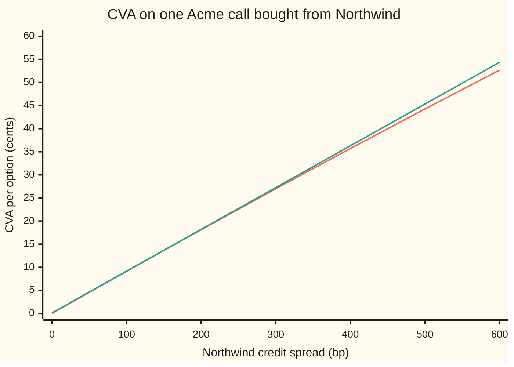
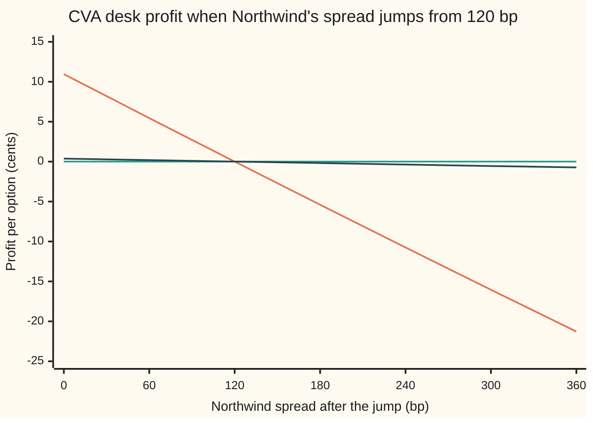

# CVA risk numbers: sensitivity to the counterparty's spread, to the underlying, and how a CDS hedges it

Financial mathematics → Counterparty Risk and CVA → Hedging the counterparty charge → CVA risk numbers

---

## General Overview

A bank buys one call option on Acme shares from a company called Northwind. The option lets the bank buy an Acme share for $100 in a year. With Acme at $100 it is worth **$9.23** if Northwind is sure to pay. Northwind is not sure to pay. Its chance of failing is 2% a year, and a failed Northwind would hand back 40 cents in the dollar. So the bank marks the option down by the expected loss, **0.1096 dollars**, about 11 cents, and carries it at **$9.12**. That markdown is the **credit valuation adjustment**, CVA ([cva](03-cva.md)).

CVA is a price, and prices move. If the market starts to doubt Northwind, the cost of insuring Northwind's debt rises, CVA rises, and the bank loses money though nobody has defaulted. If Acme rises, the option is worth more, more money sits with Northwind, and CVA rises again. In the 2007 to 2009 crisis, by the Basel Committee's count, roughly two-thirds of banks' counterparty losses came from CVA moving, and only about a third from actual defaults.

So banks run CVA as a trading book. This card computes three risk numbers for the Acme option: **CS01**, the change in CVA when Northwind's credit spread, the yearly premium for insuring its debt, rises one basis point (a hundredth of a percent), here **$0.000904 per option**; and **delta** and **vega**, the change in CVA when Acme's price or volatility moves, here 0.011881 times the option's own. It then builds the hedges: buy about **$9.36 of one-year default insurance on Northwind per option**, close to the $9.23 at stake, and buy **0.0070 Acme shares per option**.

**When the amount at stake does not depend on the counterparty's health, CVA is the recovery-adjusted exposure times the chance of default; its spread risk is hedged by buying default protection on the counterparty in the amount that matches the two spread sensitivities, and its market risk is the trade's own delta and vega scaled down by that same small factor.**

**What kind of fact this is:** a method: each risk number is a definition (move one input, reprice CVA), and inside this card's model (one flat hazard, exposure independent of default) their formulas are theorems, proved on this card in Why it works.

### The picture: CVA as Northwind's spread moves

Across the bottom, Northwind's credit spread in basis points; today it is 120. Up the side, CVA per option, in cents.



The first line (orange) is CVA repriced at each spread. The second (teal) is straight: today's CVA plus CS01, 0.000904 dollars, for every basis point away from 120. They touch at 120 bp. At 600 bp the straight line says 54.38 cents and the true CVA is 52.68, because a sicker Northwind is more likely to have failed early, and a default can only happen once.

---

## The formula

Notation first, in words. $C$ is the option's value if Northwind were riskless. $\lambda$ ("lambda") is Northwind's **hazard**: its default rate per year while it is still alive. $R$ is the recovery rate. $s$ is Northwind's credit spread, the yearly premium for default insurance on its debt. $E(t)$ is the **discounted expected exposure** at date $t$: the average, over every path Acme might take, of what Northwind would owe the bank at $t$, in today's dollars ([expected-exposure-profiles](02-expected-exposure-profiles.md)). The integral adds a quantity over every instant from today to expiry.

$$\text{CVA} = (1-R)\int_0^T E(t)\,\lambda e^{-\lambda t}\,dt = (1-R)\,C\,\big(1 - e^{-\lambda T}\big), \qquad \lambda = \frac{s}{1-R}$$

**Read it aloud:** CVA is the fraction lost on default, times the exposure, times the chance Northwind fails before expiry; and the hazard is the spread divided by the fraction lost.

The second equality uses $E(t) = C$ at every date, proved in Step 1 below. The hazard-from-spread rule is the credit triangle, exact for insurance whose premium is paid continuously on a flat hazard.

The risk numbers differentiate that one line:

$$\text{CS01} = \frac{\partial\,\text{CVA}}{\partial s}\times 1\text{ bp} = C\,T\,e^{-\lambda T}\times 1\text{ bp}, \qquad \Delta = (1-R)\big(1-e^{-\lambda T}\big)\,\Delta_C, \qquad \nu = (1-R)\big(1-e^{-\lambda T}\big)\,\nu_C$$

**Read it aloud:** a basis point of spread costs the survival-weighted exposure over the option's life; Acme's price and volatility move CVA exactly as they move the option, scaled down by the loss fraction times the default chance.

The hedges set each sensitivity against an instrument with a known one:

$$M = \frac{\text{CS01}}{A \times 1\text{ bp}}, \qquad A = \frac{1 - e^{-(r+\lambda)T}}{r + \lambda}, \qquad \text{shares} = \Delta$$

**Read it aloud:** buy enough default insurance that its value per basis point equals CVA's, and hold as many Acme shares as CVA's delta.

| Number | Move | CVA, per option | The call's own | Hedge |
| --- | --- | --- | --- | --- |
| CS01 | Northwind spread +1 bp | $0.000904 | none | $9.36 of 1-year CDS protection |
| Delta | Acme +$1 | 0.006972 | 0.586851 | buy 0.006972 shares |
| Vega | volatility +1 point | 0.004503 | 0.379012 | buy 0.011881 Acme calls |
| Jump-to-default | Northwind fails now | $5.4266 loss | none | $9.04 of CDS protection |

| Symbol | Plain meaning | In our example | Push it up and the answer… |
| --- | --- | --- | --- |
| $C$ | the option's value with a riskless seller | $9.23 | CVA and CS01 rise in proportion |
| $S$ | Acme's share price today | $100 | $C$ rises, so CVA rises by its delta |
| $\sigma$ | Acme's volatility, how jumpy the price is | 20% | $C$ rises, so CVA rises by its vega |
| $r$, $q$ | riskless rate, continuously compounded; Acme's dividend yield | 5%, 2% | $r$ up shrinks the annuity $A$ and raises $M$ |
| $\lambda$ | Northwind's hazard: default chance per year among survivors | 2% | CVA rises, CS01 falls a little |
| $R$ | recovery: fraction of the claim paid after default | 40% | at a fixed spread, CVA barely moves |
| $s$, $s_0$ | Northwind's credit spread today; the spread written into a CDS contract | 120 bp, 120 bp | CVA rises about CS01 per bp |
| $T$, $t$, $\tau$ | years to expiry; a date along the way; Northwind's default date | 1; 0 to 1; unknown | longer $T$ raises CVA and CS01 |
| $E(t)$ | discounted expected exposure at date $t$ | $9.23 at every date | CVA rises |
| $A$ | CDS risky annuity: value of 1 a year paid while Northwind survives | 0.965803 | $M$ falls |
| $M$ | notional of CDS protection bought per option | $9.36 | hedge grows |
| $\Delta$, $\Delta_C$, $\nu$, $\nu_C$ | delta and vega of CVA, and of the option itself | 0.006972, 0.586851, 0.004503, 0.379012 | more shares or calls in the hedge |

### When it holds

- **Exposure independent of default.** The formula multiplies the average exposure by the default chance. If Northwind tends to fail exactly when Acme soars, the two move together and CVA is larger than this; that is [wrong-way-risk](05-wrong-way-risk.md).
- **One flat hazard, premium paid continuously.** Then spread equals hazard times loss fraction, exactly. A quarterly-paid CDS on a sloping curve needs a root finder and a curve, and CS01 is reported tenor by tenor ([cds-risk-numbers](../42-Credit%20Default%20Swaps%20-%20Pricing%2C%20the%20Par%20Spread%20and%20the%20Hazard%20Behind%20It/08-cds-risk-numbers.md)).
- **Small moves.** CS01, delta and vega are slopes. When Acme and Northwind's spread move together, a cross term appears: after Acme +$5 and spread +100 bp, the hedged book is still down $0.0334 per option.
- **A counterparty with a traded CDS.** Most counterparties have none. Desks then hedge with a CDS index or a similar name, and the gap between the proxy and Northwind is unhedged.

Conventions verified 28 Sep 2026: the Basel Committee's CVA risk framework (targeted revisions of July 2020, effective 1 January 2023 in the Basel timetable; national start dates differ) offers a standardised approach, SA-CVA, whose capital is computed from the delta and vega sensitivities of regulatory CVA to counterparty credit spreads and market risk factors, eligible hedges included, and a basic approach, BA-CVA, for banks without that machinery.

---

## Why it works

### Step 0: CVA is default insurance the bank has sold, so the hedge is to buy it back

If Northwind fails at some date $\tau$ before expiry, the bank loses the fraction $1 - R$ of whatever Northwind owes it then. That is the payout of a credit default swap, CDS: insurance that pays the lost part of a notional amount if a named company defaults ([cds-risk-numbers](../42-Credit%20Default%20Swaps%20-%20Pricing%2C%20the%20Par%20Spread%20and%20the%20Hazard%20Behind%20It/08-cds-risk-numbers.md)). The notional here is not fixed: it is the option's value on the default date. By trading with Northwind, the bank has in effect written insurance on Northwind with a moving notional, and CVA is that insurance's price.

Two things move the price of insurance: the chance of the event, here Northwind's spread, and the amount insured, here the option's value. Each risk number moves one; each hedge buys back the matching piece.

### Step 1: the discounted exposure of a bought option is flat

The bank owns the option. An option's value is never negative, so whatever it is worth, Northwind owes all of it: exposure equals value, with no floor to apply ([counterparty-exposure-and-netting](01-counterparty-exposure-and-netting.md)).

In the pricing world every asset's discounted value averages to its value today ([black-scholes-call](../08-The%20Black-Scholes%20call%20and%20put/01-black-scholes-call.md)). So the average of $e^{-rt}$ times the option's value at $t$ is $C$, at every $t$: $E(t) = C$ = $9.227006.

The second road in the code checks this without using it. At $t = 0.5$ it averages the Black-Scholes value of the half-year-old option over every Acme price, weighted by the bell curve, and discounts: 9.227006. At $t = 1$ it averages the payoff itself: 9.227006.

### Step 2: CVA in terms of the spread

Default before $T$ happens with chance $1 - e^{-\lambda T}$ = 0.019801. The loss on default is 60% of an exposure worth $C$ in today's dollars. Multiply:

$$\text{CVA} = 0.6 \times 9.227006 \times 0.019801 = 0.109624.$$

Now write the hazard as spread over loss fraction, $\lambda = s/(1-R)$:

$$\text{CVA}(s) = (1-R)\,C\,\big(1 - e^{-sT/(1-R)}\big).$$

For small spreads, $1 - e^{-x}$ is close to $x$, and the recovery cancels: CVA is close to $s \times C \times T$ = 0.012 × 9.227006 × 1 = 0.110724. That is the desk's rule of thumb: spread times exposure times years. It shows why recovery hardly matters once the spread is quoted. Setting $R$ to zero at the same 120 bp gives CVA 0.110062, against 0.109624 at 40%.

### Step 3: CS01, and the CDS that cancels it

Differentiate $\text{CVA}(s)$. The chain rule brings down $T/(1-R)$ from the exponent, and it cancels the $(1-R)$ in front:

$$\frac{\partial\,\text{CVA}}{\partial s} = C\,T\,e^{-\lambda T}.$$

Per basis point: 9.227006 × 1 × 0.980199 × 0.0001 = **0.000904 dollars per option**. The recovery has gone, as the rule of thumb promised.

A CDS bought at today's spread $s_0$ is worth, per dollar of notional, $A \times (s - s_0)$ ([cds-risk-numbers](../42-Credit%20Default%20Swaps%20-%20Pricing%2C%20the%20Par%20Spread%20and%20the%20Hazard%20Behind%20It/08-cds-risk-numbers.md)). At par its CS01 is $A \times$ 1 bp, with $A$ the risky annuity. For a one-year contract with continuous premium, $A = (1 - e^{-0.07})/0.07$ = 0.965803. Setting the CDS's CS01 equal to CVA's:

$$M = \frac{C\,T\,e^{-\lambda T}}{A} = \frac{9.227006 \times 0.980199}{0.965803} = 9.364542.$$

Why a little more than the $9.23 exposure? CVA's slope carries the survival factor 0.980199 and nothing else; the CDS's annuity also discounts each premium at 5%, so it sits lower, at 0.965803. A basis point on the CDS is worth slightly less, and the hedge needs slightly more of it.

The match holds far from today's spread too. CVA here is a contingent CDS on a flat exposure, so it bends with the spread almost exactly as a CDS does. The second chart below shows the hedged book staying at 0.00 cents from 0 to 360 bp.

### Step 4: delta and vega, the option's own Greeks scaled down

Hold Northwind's credit fixed. Then $(1-R)(1-e^{-\lambda T})$ is a fixed number, 0.011881, and CVA is that number times $C$. Anything that moves the option moves CVA by 0.011881 times as much:

- **Delta.** The option's delta, $e^{-qT}N(d_1)$, is 0.586851 ([black-scholes-call](../08-The%20Black-Scholes%20call%20and%20put/01-black-scholes-call.md)). CVA's is 0.011881 × 0.586851 = 0.006972. When Acme rises $1, CVA rises 0.006972 dollars, a loss to the bank. Buying 0.006972 Acme shares per option offsets it.
- **Vega.** The option gains 0.379012 dollars per volatility point (20% to 21%); CVA gains 0.004503. Shares cannot hedge this. Buying 0.011881 Acme calls per option hedges delta and vega together, since the CVA's market risk is exactly that slice of the option.

The two hedges interact. CS01 is proportional to $C$, so when Acme rises the right CDS notional rises too: at Acme $110 it is 16.199212. Desks call this **cross-gamma** and rebalance for it.

### Step 5: jump-to-default, the one move a CS01 hedge does not size

If Northwind fails this instant, the bank loses 60% of $9.227006 but has already reserved 0.109624 as CVA. The net loss is **5.426579 dollars**. The CDS pays 60% of its notional. Paying back exactly the loss needs $M$ = 5.426579/0.6 = 9.044299.

That is not 9.364542. One CDS cannot match both numbers: bought by CS01 it gains 0.1921 on default; bought by default loss it loses 0.0031 on a 100 bp widening. The two sizes are close only because the CDS matches the option's one-year life. A five-year CDS sized by CS01 needs only $2.14 of notional, since each of its basis points is paid for five years, and a default then leaves the bank 4.1403 dollars short.

<details>
<summary>Detailed proof: CVA, its CS01, the CDS annuity, and the jump-to-default notional</summary>

**CVA.** Default at $\tau$ has density $\lambda e^{-\lambda t}$. Given default at $t$, the discounted loss is $(1-R)e^{-rt}V(t)$, where $V(t)$ is the option's value then; independence of default and Acme lets the average split, so $\text{CVA} = (1-R)\int_0^T \lambda e^{-\lambda t}\,E(t)\,dt$ with $E(t) = \mathbb{E}[e^{-rt}V(t)]$. The discounted option price is a martingale in the pricing world, so $E(t) = V(0) = C$, and $\int_0^T \lambda e^{-\lambda t}dt = 1 - e^{-\lambda T}$.

**CS01.** With $\lambda = s/(1-R)$: $\partial\,\text{CVA}/\partial s = (1-R)\,C\,e^{-sT/(1-R)} \cdot T/(1-R) = C\,T\,e^{-\lambda T}$.

**The CDS.** Continuous premium $s_0$, flat hazard, discount rate $r$: the premium leg is $s_0\int_0^{T} e^{-(r+\lambda)t}dt = s_0 A$ and the protection leg is $(1-R)\lambda\int_0^{T}e^{-(r+\lambda)t}dt = (1-R)\lambda A$. Setting the two legs equal gives the par spread, $s = (1-R)\lambda$: the credit triangle, exact here. Value per dollar $= A(s)(s - s_0)$; its derivative in $s$ at $s = s_0$ is $A$, since the term with $dA/ds$ is multiplied by $s - s_0 = 0$.

**Jump-to-default.** On default the bank's position falls from $C - \text{CVA}$ to $R \times C$, a loss of $(1-R)C - \text{CVA} = (1-R)\,C\,e^{-\lambda T}$. A par CDS pays $(1-R)M$ and loses its zero value, so $M = C\,e^{-\lambda T}$. With $T = 1$ this equals $\partial\,\text{CVA}/\partial s$, and $M_{\text{CS01}}/M_{\text{JTD}} = T/A$, which is above 1 whenever $r + \lambda > 0$.

</details>

The same numbers come out of bump and revalue on the second road ([bump-and-revalue-and-common-random-numbers](../07-Greeks%20by%20Numbers%20and%20Calibration/01-bump-and-revalue-and-common-random-numbers.md)): move one input up and down, reprice CVA by the double integral, divide. It needs no formula, so it is the road desks use on real books.

---

## Worked numbers, by hand

Acme call, $S = K = 100$, $r$ = 5%, $q$ = 2%, $\sigma$ = 20%, one year, bought from Northwind: hazard 2%, recovery 40%.

| Step | Arithmetic | Value |
| --- | --- | --- |
| riskless option value | Black-Scholes | $9.227006 |
| Northwind spread | 0.02 × 0.6 | 120 bp |
| default chance by expiry | 1 − e^(−0.02) | 0.019801 |
| **CVA** | 0.6 × 9.227006 × 0.019801 | **0.109624** |
| risky price | 9.227006 − 0.109624 | $9.117381 |
| **CS01** | 9.227006 × 0.980199 × 0.0001 | **0.000904** |
| CDS annuity | (1 − e^(−0.07))/0.07 | 0.965803 |
| **CDS notional** | 9.227006 × 0.980199 / 0.965803 | **$9.36** |
| greek factor | 0.6 × 0.019801 | 0.011881 |
| **CVA delta** | 0.011881 × 0.586851 | **0.006972 shares** |
| CVA vega | 0.011881 × 0.379012 | 0.004503 per vol point |
| jump-to-default loss | 0.6 × 9.227006 − 0.109624 | $5.426579 |

Per million options, the desk reports a loss of about $904 per basis point of Northwind widening, and hedges it with $9.36 million of one-year Northwind protection.

### What the hedges do

Moves happen instantly; dollars per option. "Unhedged" holds CVA alone. "CS01 hedge" adds $9.36 of CDS and 0.006972 shares; "JTD hedge" adds $9.04 of CDS and the same shares; the last column uses the option's own delta, a mistake.

| Scenario | Unhedged | CS01 hedge | JTD hedge | Option's delta |
| --- | --- | --- | --- | --- |
| spread +10 bp | −0.0090 | 0.0000 | −0.0003 | 0.0000 |
| spread +100 bp | −0.0897 | 0.0000 | −0.0031 | 0.0000 |
| Acme +$5 | −0.0376 | −0.0027 | −0.0027 | 2.8967 |
| Acme +$5 and spread +100 bp | −0.1580 | −0.0334 | −0.0365 | 2.8660 |
| Northwind defaults now | −5.4266 | 0.1921 | 0.0000 | 0.1921 |

What is left in the CS01 column is second order: −0.0027 is the option's curvature in Acme, and the extra loss on the combined move is cross-gamma.



Orange, the steep line: unhedged. A jump to 360 bp costs 21.28 cents per option. Teal, flat on zero: hedged with $9.36 of CDS, flat to the cent across the whole range. Dark blue, the shallow line: hedged with $9.04, the default-sized notional, which leaves 0.72 cents at 360 bp.

```
CDS notional per option, three ways to size it ($)
by jump-to-default  ███████████████████████████████████████████████  $9.0443
exposure itself     ████████████████████████████████████████████████ $9.2270
by CS01             █████████████████████████████████████████████████ $9.3645
```

### What breaks if you drop a piece

| Mistake | Comes out at | What went wrong |
| --- | --- | --- |
| Bump the hazard 1 bp instead of the spread | CS01 0.000543, not 0.000904 | A hazard basis point is 0.6 of a spread basis point; the CDS is quoted in spread |
| Hedge CVA's delta with the option's delta, 0.586851 shares | +2.8967 after Acme +$5, not −0.0027 | That hedges the whole option; CVA is 0.011881 of it |
| Use exposure in future dollars, undiscounted | CVA 0.112402, not 0.109624 | Exposure must be in today's dollars; the discount $e^{-rt}$ was left out |
| Hedge with a five-year CDS sized by CS01 | notional $2.14; −4.1403 if Northwind defaults | Right spread slope, wrong default payout: tenor mismatch |

---

## Code, from first principles, and it actually runs

Both scripts take two independent roads. Road 1 is the closed form and its derivatives. Road 2 prices CVA as a double integral: at eleven dates it averages the option's discounted value over the bell curve of Acme's price (Simpson's rule), then integrates that exposure against the default density. It knows nothing of the closed form, and every risk number on road 2 is bump and revalue. The normal CDF is a power series written out, the CDS legs are integrated numerically, and the scenario table, the what-breaks numbers and every chart point are printed.

### Python

```python
# CVA risk numbers and hedging -- the check behind the card.  Standard library only.
# The Acme call (S = K = 100, r 5%, q 2%, vol 20%, 1 year) bought from Northwind
# (hazard 2%, recovery 40%).  Road 1: closed forms and their derivatives.
# Road 2: CVA as a double integral (over Acme's price, then over the default date),
# every risk number by bump and revalue.  The normal CDF is a power series written out.
from math import exp, log, sqrt, pi

def phi(x): return exp(-0.5 * x * x) / sqrt(2.0 * pi)
def ncdf(x):                                   # 1/2 + phi(x) (x + x^3/3 + x^5/(3*5) + ...)
    if x > 10.0: return 1.0
    if x < -10.0: return 0.0
    term, total, n = x, x, 0
    while abs(term) > 1e-17 * abs(total):
        n += 1; term *= x * x / (2 * n + 1); total += term
    return 0.5 + phi(x) * total

def simpson(f, a, b, n):
    h = (b - a) / n
    s = f(a) + f(b)
    for i in range(1, n): s += (4 if i % 2 else 2) * f(a + i * h)
    return s * h / 3.0

K, r, q, T, R = 100.0, 0.05, 0.02, 1.0, 0.40
def call(S, vol, t):                           # Black-Scholes call with t years left
    if t <= 0.0: return max(S - K, 0.0)
    d1 = (log(S / K) + (r - q + 0.5 * vol * vol) * t) / (vol * sqrt(t))
    return S * exp(-q * t) * ncdf(d1) - K * exp(-r * t) * ncdf(d1 - vol * sqrt(t))

# ---- road 1: closed forms ----
def cva1(S, vol, s): return (1 - R) * call(S, vol, T) * (1 - exp(-s / (1 - R) * T))
def cds1(s_now, s0, M, tenor):                 # value of M of protection bought at s0, continuous premium
    h = s_now / (1 - R); k = r + h
    return M * (1 - exp(-k * tenor)) / k * (s_now - s0)

# ---- road 2: integrals, no closed form for CVA or the CDS legs ----
def dee(S, vol, t):                            # discounted expected exposure at date t
    if t == 0.0: return call(S, vol, T)
    g = lambda z: phi(z) * call(S * exp((r - q - 0.5 * vol * vol) * t + vol * sqrt(t) * z), vol, T - t)
    a = -8.0 if t < T else (log(K / S) - (r - q - 0.5 * vol * vol) * t) / (vol * sqrt(t))   # kink at expiry
    return exp(-r * t) * simpson(g, a, 8.0, 2000)
def cva2(S, vol, s):
    h = s / (1 - R)
    return (1 - R) * simpson(lambda t: dee(S, vol, t) * h * exp(-h * t), 0.0, T, 10)
def cds2(s_now, s0, M, tenor):
    h = s_now / (1 - R)
    ann = simpson(lambda t: exp(-(r + h) * t), 0.0, tenor, 200)
    prot = (1 - R) * simpson(lambda t: exp(-r * t) * h * exp(-h * t), 0.0, tenor, 200)
    return M * (prot - s0 * ann)

S0, vol0, lam = 100.0, 0.20, 0.02
s0, bp = lam * (1 - R), 1e-4
C = call(S0, vol0, T)
pd = 1 - exp(-lam * T)
d1 = (log(S0 / K) + (r - q + 0.5 * vol0 ** 2) * T) / (vol0 * sqrt(T))
c_delta, c_vega = exp(-q * T) * ncdf(d1), S0 * exp(-q * T) * phi(d1) * sqrt(T) / 100
CVA, CVA2 = cva1(S0, vol0, s0), cva2(S0, vol0, s0)
cs01_an = C * T * exp(-lam * T) * bp           # dCVA/ds = C T e^{-hT}: the (1-R) cancels
cs01_bp = (cva2(S0, vol0, s0 + bp) - cva2(S0, vol0, s0 - bp)) / 2
ann1 = (1 - exp(-(r + lam) * T)) / (r + lam)
cds_cs01 = (cds2(s0 + bp, s0, 1.0, T) - cds2(s0 - bp, s0, 1.0, T)) / 2
M_cs01 = cs01_bp / cds_cs01
jtd = (1 - R) * C - CVA                         # the risky price falls to recovery times C
M_jtd = jtd / (1 - R)
dl_an, vg_an = (1 - R) * pd * c_delta, (1 - R) * pd * c_vega
dl_bp = (cva2(S0 + 0.5, vol0, s0) - cva2(S0 - 0.5, vol0, s0)) / 1.0
vg_bp = (cva2(S0, vol0 + 0.01, s0) - cva2(S0, vol0 - 0.01, s0)) / 2

rows = [("call C", C), ("Northwind spread s = h(1-R), bp", s0 / bp), ("default chance by T, 1-e^-hT", pd), ("survival to T, e^-hT", 1 - pd),
    ("1 CVA formula (1-R) C (1-e^-hT)", CVA), ("2 CVA by double integral", CVA2),
    ("  DEE at t = 0.5, integral", dee(S0, vol0, 0.5)), ("  DEE at t = 1, integral", dee(S0, vol0, 1.0)),
    ("rule of thumb s C T", s0 * C * T), ("risky price C - CVA", C - CVA),
    ("CS01 analytic C T e^-hT x 1bp", cs01_an), ("CS01 by bump, road 2", cs01_bp),
    ("CDS annuity A = (1-e^-(r+h)T)/(r+h)", ann1), ("CDS CS01 per $1 by bump, x 1e4", cds_cs01 * 1e4),
    ("hedge notional by CS01", M_cs01), ("jump-to-default loss (1-R)C - CVA", jtd),
    ("hedge notional by jump-to-default", M_jtd),
    ("CVA delta analytic", dl_an), ("CVA delta by bump, road 2", dl_bp), ("  call's own delta", c_delta),
    ("CVA vega per vol point, analytic", vg_an), ("CVA vega by bump, road 2", vg_bp), ("  call's own vega", c_vega),
    ("greek ratio (1-R)(1-e^-hT)", (1 - R) * pd),
    ("wrong: CS01 per bp of hazard", (cva1(S0, vol0, s0 + (1 - R) * bp) - CVA)),
    ("wrong: CVA on undiscounted exposure", (1 - R) * lam * C * (exp((r - lam) * T) - 1) / (r - lam)),
    ("wrong: 5y CDS notional by CS01", cs01_bp / ((1 - exp(-(r + lam) * 5)) / (r + lam) * bp)),
    ("try: notional if spread 300bp", C * T * exp(-0.05 * T) / ((1 - exp(-0.10)) / 0.10)),
    ("try: notional if Acme 110", call(110, vol0, T) * T * exp(-lam * T) / ann1),
    ("try: CVA if recovery 0, same spread", C * (1 - exp(-s0 * T)))]
for name, v in rows: print(f"{name:<38}{v:>14.6f}")

def pnl(dS, ds, M, shares):                     # desk is short CVA, long M of CDS and some shares
    return -(cva1(S0 + dS, vol0, s0 + ds) - CVA) + cds1(s0 + ds, s0, M, T) + shares * dS
print(f"{'scenario, $ per option':<28}{'unhedged':>10}{'CS01 hedge':>12}{'JTD hedge':>11}{'call delta':>11}")
for lab, dS, ds in (("spread +10bp", 0, 10 * bp), ("spread +100bp", 0, 100 * bp), ("Acme +5", 5, 0),
                    ("Acme +5 and spread +100bp", 5, 100 * bp)):
    print(f"{lab:<28}{pnl(dS, ds, 0, 0):>10.4f}{pnl(dS, ds, M_cs01, dl_an):>12.4f}"
          f"{pnl(dS, ds, M_jtd, dl_an):>11.4f}{pnl(dS, ds, M_cs01, c_delta):>11.4f}")
dflt = lambda M: -jtd + M * (1 - R)             # default now: pay (1-R)C, release CVA, CDS pays M(1-R)
print(f"{'Northwind defaults now':<28}{dflt(0):>10.4f}{dflt(M_cs01):>12.4f}{dflt(M_jtd):>11.4f}{dflt(M_cs01):>11.4f}")
print(f"{'  5y CDS sized by CS01':<28}{'':>10}{dflt(cs01_bp / ((1 - exp(-(r + lam) * 5)) / (r + lam) * bp)):>12.4f}")

grid = [0, 100, 200, 300, 400, 500, 600]
print("chart, spread bp       " + " ".join(f"{x:>7d}" for x in grid))
print("chart, CVA cents       " + " ".join(f"{100 * cva1(S0, vol0, x * bp):>7.2f}" for x in grid))
print("chart, CS01 line cents " + " ".join(f"{100 * (CVA + cs01_an * (x - 120)):>7.2f}" for x in grid))
moves = [0, 60, 120, 180, 240, 300, 360]
print("chart, spread after bp " + " ".join(f"{x:>7d}" for x in moves))
print("chart, unhedged cents  " + " ".join(f"{100 * pnl(0, (x - 120) * bp, 0, 0):>7.2f}" for x in moves))
print("chart, CS01 hedge cents" + " ".join(f"{100 * pnl(0, (x - 120) * bp, M_cs01, 0):>7.2f}" for x in moves))
print("chart, JTD hedge cents " + " ".join(f"{100 * pnl(0, (x - 120) * bp, M_jtd, 0):>7.2f}" for x in moves))

assert abs(CVA2 - CVA) < 1e-9, "double integral must land on the closed form"
assert max(abs(dee(S0, vol0, t) - C) for t in (0.5, 1.0)) < 1e-9, "discounted exposure is flat at C"
assert abs(cs01_bp - cs01_an) < 1e-10, "bumped CS01 vs C T e^-hT"
assert abs(cds_cs01 / bp - ann1) < 1e-8, "CDS CS01 per bp vs the annuity"
assert abs(dl_bp - dl_an) < 1e-6, "delta by bump vs (1-R) pd x call delta"
assert abs(vg_bp - vg_an) < 1e-6, "vega by bump vs (1-R) pd x call vega"
assert abs(pnl(0, 10 * bp, M_cs01, dl_an)) < 0.01 * abs(pnl(0, 10 * bp, 0, 0)), "CS01 hedge kills 99% of a 10bp move"
print("ALL CHECKS PASS")
```

**Ran 2026-09-28 on macOS, Python 3.14.6, standard library only. All checks passed. Output, pasted from the run:**

```
call C                                      9.227006
Northwind spread s = h(1-R), bp           120.000000
default chance by T, 1-e^-hT                0.019801
survival to T, e^-hT                        0.980199
1 CVA formula (1-R) C (1-e^-hT)             0.109624
2 CVA by double integral                    0.109624
  DEE at t = 0.5, integral                  9.227006
  DEE at t = 1, integral                    9.227006
rule of thumb s C T                         0.110724
risky price C - CVA                         9.117381
CS01 analytic C T e^-hT x 1bp               0.000904
CS01 by bump, road 2                        0.000904
CDS annuity A = (1-e^-(r+h)T)/(r+h)         0.965803
CDS CS01 per $1 by bump, x 1e4              0.965803
hedge notional by CS01                      9.364542
jump-to-default loss (1-R)C - CVA           5.426579
hedge notional by jump-to-default           9.044299
CVA delta analytic                          0.006972
CVA delta by bump, road 2                   0.006972
  call's own delta                          0.586851
CVA vega per vol point, analytic            0.004503
CVA vega by bump, road 2                    0.004503
  call's own vega                           0.379012
greek ratio (1-R)(1-e^-hT)                  0.011881
wrong: CS01 per bp of hazard                0.000543
wrong: CVA on undiscounted exposure         0.112402
wrong: 5y CDS notional by CS01              2.143838
try: notional if spread 300bp               9.223162
try: notional if Acme 110                  16.199212
try: CVA if recovery 0, same spread         0.110062
scenario, $ per option        unhedged  CS01 hedge  JTD hedge call delta
spread +10bp                   -0.0090      0.0000    -0.0003     0.0000
spread +100bp                  -0.0897      0.0000    -0.0031     0.0000
Acme +5                        -0.0376     -0.0027    -0.0027     2.8967
Acme +5 and spread +100bp      -0.1580     -0.0334    -0.0365     2.8660
Northwind defaults now         -5.4266      0.1921     0.0000     0.1921
  5y CDS sized by CS01                     -4.1403
chart, spread bp             0     100     200     300     400     500     600
chart, CVA cents          0.00    9.15   18.15   27.00   35.70   44.27   52.68
chart, CS01 line cents    0.11    9.15   18.20   27.24   36.29   45.33   54.38
chart, spread after bp       0      60     120     180     240     300     360
chart, unhedged cents    10.96    5.45    0.00   -5.40  -10.75  -16.04  -21.28
chart, CS01 hedge cents   0.00    0.00    0.00    0.00    0.00    0.00    0.00
chart, JTD hedge cents    0.38    0.19    0.00   -0.18   -0.37   -0.55   -0.72
ALL CHECKS PASS
```

### Rust

```rust
// CVA risk numbers and hedging -- the same check as cva_risk_numbers_and_hedging_check.py, in Rust.
// Standard library only, no crates.  Road 1: closed forms and their derivatives.
// Road 2: CVA as a double integral, every risk number by bump and revalue.
// Compile: rustc --edition 2021 -O cva_risk_numbers_and_hedging_check.rs -o /tmp/cva_check
use std::f64::consts::PI;

const K: f64 = 100.0; const R_: f64 = 0.05; const Q: f64 = 0.02; const T: f64 = 1.0; const REC: f64 = 0.40;
const S0: f64 = 100.0; const VOL0: f64 = 0.20; const LAM: f64 = 0.02; const BP: f64 = 1e-4;

fn phi(x: f64) -> f64 { (-0.5 * x * x).exp() / (2.0 * PI).sqrt() }
fn ncdf(x: f64) -> f64 {                          // 1/2 + phi(x) (x + x^3/3 + x^5/(3*5) + ...)
    if x > 10.0 { return 1.0; }
    if x < -10.0 { return 0.0; }
    let (mut term, mut total, mut n) = (x, x, 0.0);
    while term.abs() > 1e-17 * total.abs() { n += 1.0; term *= x * x / (2.0 * n + 1.0); total += term; }
    0.5 + phi(x) * total
}
fn simpson<F: Fn(f64) -> f64>(f: F, a: f64, b: f64, n: usize) -> f64 {
    let h = (b - a) / n as f64;
    let mut s = f(a) + f(b);
    for i in 1..n { s += if i % 2 == 1 { 4.0 } else { 2.0 } * f(a + i as f64 * h); }
    s * h / 3.0
}
fn call(s: f64, vol: f64, t: f64) -> f64 {        // Black-Scholes call with t years left
    if t <= 0.0 { return (s - K).max(0.0); }
    let d1 = ((s / K).ln() + (R_ - Q + 0.5 * vol * vol) * t) / (vol * t.sqrt());
    s * (-Q * t).exp() * ncdf(d1) - K * (-R_ * t).exp() * ncdf(d1 - vol * t.sqrt())
}
// ---- road 1: closed forms ----
fn cva1(s: f64, vol: f64, sp: f64) -> f64 { (1.0 - REC) * call(s, vol, T) * (1.0 - (-sp / (1.0 - REC) * T).exp()) }
fn cds1(s_now: f64, s0: f64, m: f64, tenor: f64) -> f64 {
    let h = s_now / (1.0 - REC); let k = R_ + h;
    m * (1.0 - (-k * tenor).exp()) / k * (s_now - s0)
}
// ---- road 2: integrals, no closed form for CVA or the CDS legs ----
fn dee(s: f64, vol: f64, t: f64) -> f64 {         // discounted expected exposure at date t
    if t == 0.0 { return call(s, vol, T); }
    let g = |z: f64| phi(z) * call(s * ((R_ - Q - 0.5 * vol * vol) * t + vol * t.sqrt() * z).exp(), vol, T - t);
    let a = if t < T { -8.0 } else { ((K / s).ln() - (R_ - Q - 0.5 * vol * vol) * t) / (vol * t.sqrt()) }; // kink at expiry
    (-R_ * t).exp() * simpson(g, a, 8.0, 2000)
}
fn cva2(s: f64, vol: f64, sp: f64) -> f64 {
    let h = sp / (1.0 - REC);
    (1.0 - REC) * simpson(|t| dee(s, vol, t) * h * (-h * t).exp(), 0.0, T, 10)
}
fn cds2(s_now: f64, s0: f64, m: f64, tenor: f64) -> f64 {
    let h = s_now / (1.0 - REC);
    let ann = simpson(|t| (-(R_ + h) * t).exp(), 0.0, tenor, 200);
    let prot = (1.0 - REC) * simpson(|t| (-R_ * t).exp() * h * (-h * t).exp(), 0.0, tenor, 200);
    m * (prot - s0 * ann)
}

fn main() {
    let s0 = LAM * (1.0 - REC);
    let c = call(S0, VOL0, T);
    let pd = 1.0 - (-LAM * T).exp();
    let d1 = ((S0 / K).ln() + (R_ - Q + 0.5 * VOL0 * VOL0) * T) / (VOL0 * T.sqrt());
    let (c_delta, c_vega) = ((-Q * T).exp() * ncdf(d1), S0 * (-Q * T).exp() * phi(d1) * T.sqrt() / 100.0);
    let (cva, cva_2) = (cva1(S0, VOL0, s0), cva2(S0, VOL0, s0));
    let cs01_an = c * T * (-LAM * T).exp() * BP;     // dCVA/ds = C T e^{-hT}: the (1-R) cancels
    let cs01_bp = (cva2(S0, VOL0, s0 + BP) - cva2(S0, VOL0, s0 - BP)) / 2.0;
    let ann1 = (1.0 - (-(R_ + LAM) * T).exp()) / (R_ + LAM);
    let cds_cs01 = (cds2(s0 + BP, s0, 1.0, T) - cds2(s0 - BP, s0, 1.0, T)) / 2.0;
    let m_cs01 = cs01_bp / cds_cs01;
    let jtd = (1.0 - REC) * c - cva;                 // the risky price falls to recovery times C
    let m_jtd = jtd / (1.0 - REC);
    let (dl_an, vg_an) = ((1.0 - REC) * pd * c_delta, (1.0 - REC) * pd * c_vega);
    let dl_bp = (cva2(S0 + 0.5, VOL0, s0) - cva2(S0 - 0.5, VOL0, s0)) / 1.0;
    let vg_bp = (cva2(S0, VOL0 + 0.01, s0) - cva2(S0, VOL0 - 0.01, s0)) / 2.0;
    let m_5y = cs01_bp / ((1.0 - (-(R_ + LAM) * 5.0).exp()) / (R_ + LAM) * BP);

    let rows: Vec<(&str, f64)> = vec![("call C", c), ("Northwind spread s = h(1-R), bp", s0 / BP),
        ("default chance by T, 1-e^-hT", pd), ("survival to T, e^-hT", 1.0 - pd),
        ("1 CVA formula (1-R) C (1-e^-hT)", cva), ("2 CVA by double integral", cva_2),
        ("  DEE at t = 0.5, integral", dee(S0, VOL0, 0.5)), ("  DEE at t = 1, integral", dee(S0, VOL0, 1.0)),
        ("rule of thumb s C T", s0 * c * T), ("risky price C - CVA", c - cva),
        ("CS01 analytic C T e^-hT x 1bp", cs01_an), ("CS01 by bump, road 2", cs01_bp),
        ("CDS annuity A = (1-e^-(r+h)T)/(r+h)", ann1), ("CDS CS01 per $1 by bump, x 1e4", cds_cs01 * 1e4),
        ("hedge notional by CS01", m_cs01), ("jump-to-default loss (1-R)C - CVA", jtd),
        ("hedge notional by jump-to-default", m_jtd),
        ("CVA delta analytic", dl_an), ("CVA delta by bump, road 2", dl_bp), ("  call's own delta", c_delta),
        ("CVA vega per vol point, analytic", vg_an), ("CVA vega by bump, road 2", vg_bp), ("  call's own vega", c_vega),
        ("greek ratio (1-R)(1-e^-hT)", (1.0 - REC) * pd),
        ("wrong: CS01 per bp of hazard", cva1(S0, VOL0, s0 + (1.0 - REC) * BP) - cva),
        ("wrong: CVA on undiscounted exposure", (1.0 - REC) * LAM * c * (((R_ - LAM) * T).exp() - 1.0) / (R_ - LAM)),
        ("wrong: 5y CDS notional by CS01", m_5y),
        ("try: notional if spread 300bp", c * T * (-0.05 * T).exp() / ((1.0 - (-0.10_f64).exp()) / 0.10)),
        ("try: notional if Acme 110", call(110.0, VOL0, T) * T * (-LAM * T).exp() / ann1),
        ("try: CVA if recovery 0, same spread", c * (1.0 - (-s0 * T).exp()))];
    for (name, v) in &rows { println!("{:<38}{:>14.6}", name, v); }

    // desk is short CVA, long m of CDS and some shares
    let pnl = |ds_: f64, dsp: f64, m: f64, sh: f64| -(cva1(S0 + ds_, VOL0, s0 + dsp) - cva) + cds1(s0 + dsp, s0, m, T) + sh * ds_;
    println!("{:<28}{:>10}{:>12}{:>11}{:>11}", "scenario, $ per option", "unhedged", "CS01 hedge", "JTD hedge", "call delta");
    for (lab, ds_, dsp) in [("spread +10bp", 0.0, 10.0 * BP), ("spread +100bp", 0.0, 100.0 * BP), ("Acme +5", 5.0, 0.0),
                            ("Acme +5 and spread +100bp", 5.0, 100.0 * BP)] {
        println!("{:<28}{:>10.4}{:>12.4}{:>11.4}{:>11.4}", lab, pnl(ds_, dsp, 0.0, 0.0), pnl(ds_, dsp, m_cs01, dl_an),
                 pnl(ds_, dsp, m_jtd, dl_an), pnl(ds_, dsp, m_cs01, c_delta));
    }
    let dflt = |m: f64| -jtd + m * (1.0 - REC);      // default now: pay (1-R)C, release CVA, CDS pays M(1-R)
    println!("{:<28}{:>10.4}{:>12.4}{:>11.4}{:>11.4}", "Northwind defaults now", dflt(0.0), dflt(m_cs01), dflt(m_jtd), dflt(m_cs01));
    println!("{:<28}{:>10}{:>12.4}", "  5y CDS sized by CS01", "", dflt(m_5y));

    let row = |lab: &str, xs: &[i32], f: &dyn Fn(f64) -> f64| {
        let v: Vec<String> = xs.iter().map(|&x| format!("{:>7.2}", f(x as f64))).collect();
        println!("{}{}", lab, v.join(" "));
    };
    let grid = [0, 100, 200, 300, 400, 500, 600];
    println!("chart, spread bp       {}", grid.iter().map(|x| format!("{:>7}", x)).collect::<Vec<_>>().join(" "));
    row("chart, CVA cents       ", &grid, &|x| 100.0 * cva1(S0, VOL0, x * BP));
    row("chart, CS01 line cents ", &grid, &|x| 100.0 * (cva + cs01_an * (x - 120.0)));
    let moves = [0, 60, 120, 180, 240, 300, 360];
    println!("chart, spread after bp {}", moves.iter().map(|x| format!("{:>7}", x)).collect::<Vec<_>>().join(" "));
    row("chart, unhedged cents  ", &moves, &|x| 100.0 * pnl(0.0, (x - 120.0) * BP, 0.0, 0.0));
    row("chart, CS01 hedge cents", &moves, &|x| 100.0 * pnl(0.0, (x - 120.0) * BP, m_cs01, 0.0));
    row("chart, JTD hedge cents ", &moves, &|x| 100.0 * pnl(0.0, (x - 120.0) * BP, m_jtd, 0.0));

    assert!((cva_2 - cva).abs() < 1e-9, "double integral must land on the closed form");
    assert!([0.5, 1.0].iter().all(|&t| (dee(S0, VOL0, t) - c).abs() < 1e-9), "discounted exposure is flat at C");
    assert!((cs01_bp - cs01_an).abs() < 1e-10, "bumped CS01 vs C T e^-hT");
    assert!((cds_cs01 / BP - ann1).abs() < 1e-8, "CDS CS01 per bp vs the annuity");
    assert!((dl_bp - dl_an).abs() < 1e-6, "delta by bump vs (1-R) pd x call delta");
    assert!((vg_bp - vg_an).abs() < 1e-6, "vega by bump vs (1-R) pd x call vega");
    assert!(pnl(0.0, 10.0 * BP, m_cs01, dl_an).abs() < 0.01 * pnl(0.0, 10.0 * BP, 0.0, 0.0).abs(), "CS01 hedge kills 99% of a 10bp move");
    println!("ALL CHECKS PASS");
}
```

**Ran 2026-09-28 on macOS, rustc 1.98.1, no crates. All checks passed. Output, pasted from the run:**

```
call C                                      9.227006
Northwind spread s = h(1-R), bp           120.000000
default chance by T, 1-e^-hT                0.019801
survival to T, e^-hT                        0.980199
1 CVA formula (1-R) C (1-e^-hT)             0.109624
2 CVA by double integral                    0.109624
  DEE at t = 0.5, integral                  9.227006
  DEE at t = 1, integral                    9.227006
rule of thumb s C T                         0.110724
risky price C - CVA                         9.117381
CS01 analytic C T e^-hT x 1bp               0.000904
CS01 by bump, road 2                        0.000904
CDS annuity A = (1-e^-(r+h)T)/(r+h)         0.965803
CDS CS01 per $1 by bump, x 1e4              0.965803
hedge notional by CS01                      9.364542
jump-to-default loss (1-R)C - CVA           5.426579
hedge notional by jump-to-default           9.044299
CVA delta analytic                          0.006972
CVA delta by bump, road 2                   0.006972
  call's own delta                          0.586851
CVA vega per vol point, analytic            0.004503
CVA vega by bump, road 2                    0.004503
  call's own vega                           0.379012
greek ratio (1-R)(1-e^-hT)                  0.011881
wrong: CS01 per bp of hazard                0.000543
wrong: CVA on undiscounted exposure         0.112402
wrong: 5y CDS notional by CS01              2.143838
try: notional if spread 300bp               9.223162
try: notional if Acme 110                  16.199212
try: CVA if recovery 0, same spread         0.110062
scenario, $ per option        unhedged  CS01 hedge  JTD hedge call delta
spread +10bp                   -0.0090      0.0000    -0.0003     0.0000
spread +100bp                  -0.0897      0.0000    -0.0031     0.0000
Acme +5                        -0.0376     -0.0027    -0.0027     2.8967
Acme +5 and spread +100bp      -0.1580     -0.0334    -0.0365     2.8660
Northwind defaults now         -5.4266      0.1921     0.0000     0.1921
  5y CDS sized by CS01                     -4.1403
chart, spread bp             0     100     200     300     400     500     600
chart, CVA cents          0.00    9.15   18.15   27.00   35.70   44.27   52.68
chart, CS01 line cents    0.11    9.15   18.20   27.24   36.29   45.33   54.38
chart, spread after bp       0      60     120     180     240     300     360
chart, unhedged cents    10.96    5.45    0.00   -5.40  -10.75  -16.04  -21.28
chart, CS01 hedge cents   0.00    0.00    0.00    0.00    0.00    0.00    0.00
chart, JTD hedge cents    0.38    0.19    0.00   -0.18   -0.37   -0.55   -0.72
ALL CHECKS PASS
```

The two outputs agree line for line, and every bumped sensitivity matches its analytic twin to the printed digit.

> [!TIP]
> **Try changing**
> Guess the direction first. Then run it.
> - **Northwind widens to 300 bp.** Guess the new CDS notional. It is **$9.22**, barely changed: CS01 falls with survival, the annuity falls with it.
> - **Acme rallies to $110.** The option is worth more, so more is insured. The CS01-matched notional becomes **$16.20**. The credit hedge must be rebalanced every time the exposure moves.
> - **Recovery 0% at the same 120 bp spread.** Guess whether CVA doubles. It goes to **0.110062** from 0.109624: once the spread is quoted, recovery hardly matters.
> - **Swap the one-year CDS for a five-year one.** The CS01 match needs only **$2.14** of notional, and a default leaves the desk 4.1403 dollars short.

---

## The usual mistake

> [!warning]
> **Matching CS01 and calling CVA hedged.** A CS01 match protects against Northwind's spread drifting. It does not protect against Northwind failing, against Acme moving, or against both moving together. The table above shows each gap: +0.1921 on default, −0.0027 on a $5 Acme move, −0.0334 on a combined move. A CVA book needs a credit hedge, an exposure hedge and a rebalancing plan.
>
> Four smaller traps:
> - **Bumping the hazard, not the spread.** A hazard basis point is only 0.6 of a spread basis point here, so CS01 comes out at 0.000543 instead of 0.000904 and the CDS hedge is only 0.6 of the right size.
> - **Hedging CVA's delta with the whole option's delta.** CVA's delta is 0.006972 shares, not 0.586851. The wrong hedge turns a loss of 0.0376 on a $5 move into a gain of 2.8967: a large new position, not a hedge.
> - **Reading the CDS notional as the exposure.** $9.36, $9.23 and $9.04 are three different numbers with three different jobs. The first matches spread risk, the last matches default loss.
> - **Treating CVA as a reserve that sits still.** It is marked to market daily; in the crisis its moves cost banks twice what defaults did.

---

## Where you meet it in real life

- **A bank's CVA desk.** It is charged the CVA on the bank's uncollateralised trades and runs it as a book: CS01 per counterparty, delta and vega per market, jump-to-default per name.
- **Regulatory capital.** Under the Basel Committee's CVA framework, banks on the standardised approach, SA-CVA, hold capital against exactly the delta and vega numbers on this card, reduced by eligible hedges such as CDS on the counterparty.
- **Exposure from a simulation.** A swap's exposure rises and falls over its life ([expected-exposure-profiles](02-expected-exposure-profiles.md)). With no closed form, bump and revalue is the method that survives.
- **When exposure and default move together.** A bank buying protection from a seller whose health tracks the reference name has CVA that jumps with default risk itself; the independence behind this card fails ([wrong-way-risk](05-wrong-way-risk.md)).

> **Say it back**
> CVA is the price of default insurance the bank has effectively sold on its counterparty, with the trade's value as the insured amount. For the Acme option bought from Northwind it is 0.6 × $9.23 × 2% chance of default, about 11 cents. Its spread sensitivity is exposure times life times survival, 0.000904 per basis point, and a one-year CDS of about $9.36 cancels it. Its delta and vega are the option's own, scaled by 0.011881, and are hedged with shares or a sliver of the option. What a CS01 hedge leaves open is default itself, cross-gamma and the drift of exposure, which is why the hedge is rebalanced.

---

## What this builds on

- [cva](03-cva.md): the CVA integral and the Acme-from-Northwind number, 0.1096, that this card differentiates.
- [cds-risk-numbers](../42-Credit%20Default%20Swaps%20-%20Pricing%2C%20the%20Par%20Spread%20and%20the%20Hazard%20Behind%20It/08-cds-risk-numbers.md): the hedge instrument's CS01, notional times risky annuity at par, and its jump-to-default.
- [bump-and-revalue-and-common-random-numbers](../07-Greeks%20by%20Numbers%20and%20Calibration/01-bump-and-revalue-and-common-random-numbers.md): move an input, reprice, divide; the method behind road 2 and behind every CVA desk's reports.

## Where this goes next

- [wrong-way-risk](05-wrong-way-risk.md): exposure and default moving together, which breaks the independence behind every formula here, so the share hedge and the credit hedge can no longer be set separately.
- [dva-and-bilateral-cva](04-dva-and-bilateral-cva.md): the mirror term from the bank's own default, whose sensitivity to the bank's own spread cannot be hedged by selling protection on itself.

This card hedged CVA one input at a time on the assumption that Northwind's health and Acme's price are unrelated; the open question is what the hedge is worth when they are not.

---

## Sources

Verified 28 Sep 2026: every link below resolves to the publisher's page.

- Basel Committee on Banking Supervision. "Capital treatment for bilateral counterparty credit risk finalised by the Basel Committee." Press release, 1 June 2011. [bis.org/press/p110601.htm](https://www.bis.org/press/p110601.htm). The two-thirds figure: CVA losses against default losses in the crisis.
- Basel Committee on Banking Supervision. *Targeted revisions to the credit valuation adjustment risk framework*. July 2020. [bis.org/bcbs/publ/d507.htm](https://www.bis.org/bcbs/publ/d507.htm). SA-CVA and BA-CVA; SA-CVA capital from delta and vega sensitivities of CVA, eligible hedges included.
- Cesari, Giovanni, John Aquilina, Niels Charpillon, Zlatko Filipovic, Gordon Lee, and Ion Manda. *Modelling, Pricing, and Hedging Counterparty Credit Exposure: A Technical Guide*. Springer, 2009. [doi:10.1007/978-3-642-04454-0](https://doi.org/10.1007/978-3-642-04454-0). Exposure simulation, CVA sensitivities and hedging on a real book.
- Sorensen, Eric H., and Thierry F. Bollier. "Pricing Swap Default Risk." *Financial Analysts Journal* 50, no. 3 (1994): 23–33. [doi:10.2469/faj.v50.n3.23](https://doi.org/10.2469/faj.v50.n3.23). Counterparty risk priced as options on the trade's value at default: the contingent-insurance view of Step 0.
