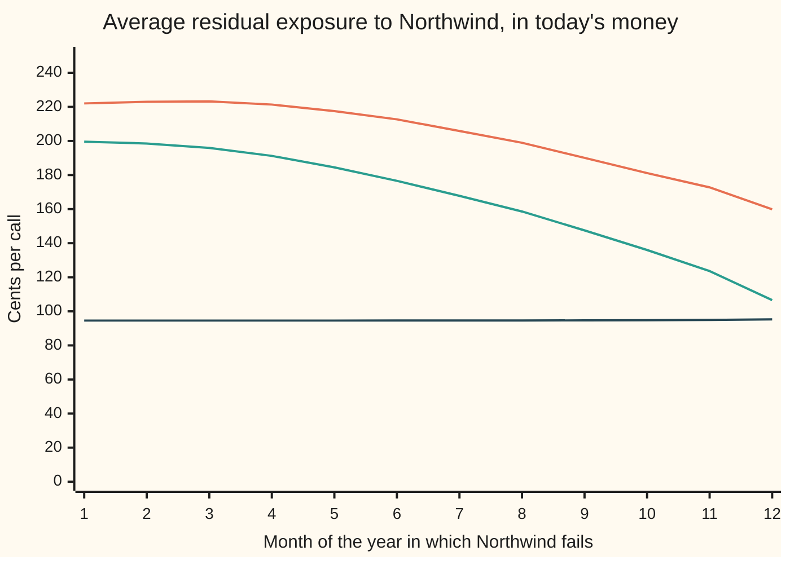
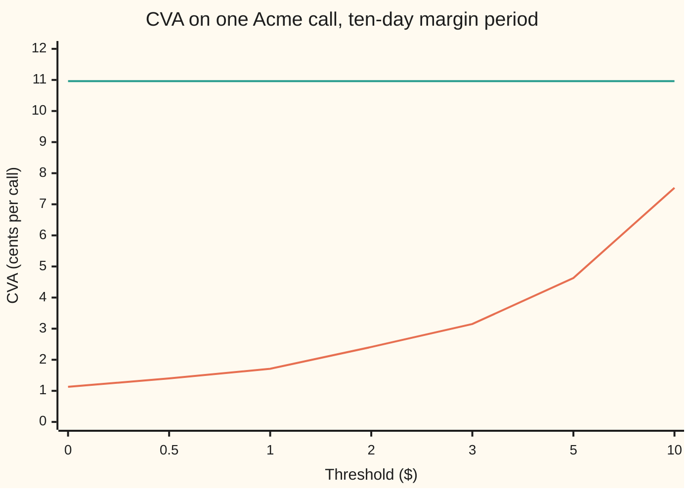

# Collateral: variation margin tracks the mark-to-market, thresholds and the margin period of risk leave a residual, and the CVA that remains

[Syllabus](../../../SYLLABUS.md) → [Financial mathematics](../README.md) → [Collateral, Funding and the Rest of the XVAs](../README.md#s47) → Collateral

---

## General Overview

A bank buys the one-year Acme call from Northwind. Acme trades at \$100, the strike is \$100, and in the house market the call is worth **\$9.23**. Northwind fails at 2% a year and would return 40 cents on the dollar. Unprotected, the bank's expected loss from that failure, the credit valuation adjustment or CVA, is **10.96 cents** ([CVA](../46-Counterparty%20Risk%20and%20CVA/03-cva.md)).

Now the two sides sign a collateral agreement. Every business day the bank values the call, and Northwind hands over cash to match, less a \$2 allowance. The cash works like a landlord's deposit: it sits with the bank, it goes back when the debt shrinks, and it is kept if the debtor walks away. The daily top-up that tracks the trade's value is called **variation margin**, the term used from here on. The \$2 allowance is the **threshold**. A small change below a set size is not sent at all: the **minimum transfer amount**. The contract that sets all three is the **credit support annex**, CSA for short.

If Northwind fails, the bank keeps the cash and claims only what the cash does not cover. That gap is not just the \$2. Northwind stops paying margin a while before anyone can call it a default, and the bank then needs days to close the trade out and replace it. Through that stretch the collateral is frozen and Acme keeps moving. The standard allowance for it is ten business days, the **margin period of risk**. With the \$2 threshold and the ten-day gap, CVA falls to **2.41 cents**. With no threshold at all it falls to **1.13 cents**, and no further: ten days of Acme's moves are left.

**Collateral that tracks the trade's value leaves the bank exposed only to the threshold plus whatever the trade gains while margin is frozen before closeout, and CVA recomputed on that residual falls sharply but stays above zero.**

**What kind of fact this is:** a model: margin is taken to arrive daily, to freeze for exactly ten business days before a default, and Northwind's failure is taken to be independent of Acme's price. Inside that model the two ceilings on the residual are theorems, proved on this card in Why it works.

### The picture: what each agreement leaves

```
CVA on one Acme call bought from Northwind, cents per call
no collateral              ████████████████████████████████████  10.96
threshold $2, 10-day gap   ████████                               2.41
threshold $2, instant      ██████                                 1.97
threshold $0, 10-day gap   ████                                   1.13
```

The top bar is the uncollateralised CVA. The second is the agreement in this card. The third pretends margin could be seized the instant Northwind fails: too optimistic, as Step 3 shows. The last is the best a daily agreement can do, and it is not zero.

---

## The formula

Notation first, in words. $V(t)$ is the call's clean value to the bank at date $t$, in years from today: the value if Northwind could not fail. For any amount $x$, $x^+$ means $\max(x, 0)$: the amount if positive, else zero. $H$ is the threshold, $M$ the minimum transfer amount, and $\delta$ ("delta") the margin period of risk in years. $C(t)$ is the collateral the bank holds at date $t$. $X(t)$ is the **residual exposure**: what Northwind would owe beyond the collateral, if it failed at $t$.

$$C(t) = \bigl(V(t-\delta) - H\bigr)^+, \qquad X(t) = \bigl(V(t) - C(t)\bigr)^+$$

**Read it aloud:** the collateral held is the trade's value ten days before the failure, less the threshold; the bank is exposed to whatever the trade is worth now above that.

The CVA is the formula of [CVA](../46-Counterparty%20Risk%20and%20CVA/03-cva.md) with the residual in place of the full value. $\mathbb{E}$ is the average in the pricing world, where every asset grows at the riskless rate:

$$\mathrm{CVA} = (1-R)\int_0^T D(t)\,\mathbb{E}\bigl[X(t)\bigr]\,\lambda\,Q(t)\,dt$$

Here $R$ is the **recovery**, the fraction of an unsecured claim collected, so $1-R$ is the loss fraction. $\lambda$ ("lambda") is Northwind's **hazard**, its yearly default rate among survivors, and $Q(t) = e^{-\lambda t}$ its chance of surviving to $t$. $D(t) = e^{-rt}$ discounts at the riskless rate $r$, and $T$ is the expiry.

**Read it aloud:** the loss fraction, times the discounted average residual at each date, weighted by the chance Northwind fails at that date, added over the year.

Two refinements change $C(t)$. Under a minimum transfer amount, the balance moves to its target only when the change is at least $M$; otherwise it stays. Under a **haircut** $h$, collateral posted as bonds of market value $B$ counts as $(1-h)B$: a bond can fall in price while the bank waits to sell it, and the haircut is the cushion. Every refinement leaves one ceiling standing, proved in Step 4:

$$0 \le X(t) \le H + M + \bigl(V(t) - V(t-\delta)\bigr)^+$$

**Read it aloud:** the residual is never more than the threshold, plus the minimum transfer, plus what the trade gained during the frozen stretch.

| Symbol | Plain meaning | In our example | Push it up and CVA… |
| --- | --- | --- | --- |
| $V(t)$, $V(0)$ | the call's clean value at date $t$; today's value | $V(0)$ = \$9.227006 | rises |
| $H$ | the **threshold**: value Northwind may owe before any margin is due | \$2 | rises: 1.13 cents at \$0, 7.53 at \$10 |
| $M$ | the **minimum transfer amount**: smaller changes are not sent | \$0 in the headline; \$0.50 in the checks | barely moves: it cuts both ways |
| $\delta$ | the **margin period of risk**, in years | 10/252 = 0.039683 | rises, roughly with $\sqrt{\delta}$ |
| $C(t)$, $A$, $G$ | collateral held at date $t$; in the proofs, the amount held and its target | \$7.227006 called today | falls |
| $X(t)$ | residual exposure: owed beyond the collateral | about \$2.22 on average in the first month | — |
| $h$, $B$ | haircut; market value of bonds posted | 4%; \$7.528131 | falls: more cushion |
| $R$, $\lambda$, $\tau$ | recovery; hazard; the default date ("tau") | 40%; 2%; before $T$ with chance 0.019801 | falls with $R$, rises with $\lambda$ |
| $Q(t)$, $D(t)$ | survival chance $e^{-\lambda t}$; discount factor $e^{-rt}$ | $1 - Q(1)$ = 0.019801 | — |
| $r$, $T$, $t$ | riskless rate; expiry; a date, in years | 5%; 1 year | — |
| $S$, $\sigma$, $\Delta$ | Acme's price; its volatility ("sigma"); the call's **delta**, dollars of call value per dollar of Acme | \$100; 20%; 0.586851 | $\sigma$ up: more move, more residual |
| $z$ | the 99% point of the standard bell curve | 2.326348 | — |

### When it holds

- **Default is independent of Acme.** The average residual multiplies the default chance only if Northwind's failure says nothing about Acme's move in the frozen stretch. If Acme tends to jump exactly when Northwind fails, the residual at default is larger: [Wrong-way risk](../46-Counterparty%20Risk%20and%20CVA/05-wrong-way-risk.md).
- **The collateral is really there.** Cash held by the bank, or bonds it can sell for at least $(1-h)B$. Collateral lent on, frozen by a court or paid in Northwind's own bonds covers less than its face value.
- **One frozen gap of fixed length.** The last good margin call comes $\delta$ before the failure, and nothing moves in either direction after it. A dispute that stretches the gap to 20 days raises the CVA to 2.76 cents, as Try changing shows.
- **Margin is called daily and the bank cannot fail.** A weekly call adds a week to the gap. If the bank can fail too, the mirror adjustment appears: [DVA](../46-Counterparty%20Risk%20and%20CVA/04-dva-and-bilateral-cva.md).

---

## Why it works

### Step 0: collateral turns a claim into a set-off

Without collateral, the bank's whole claim on a failed Northwind is at the mercy of the bankruptcy court. With collateral, part of it is already in hand. At closeout the bank values the trade, keeps the collateral against it, and files a claim only for the rest. The court's recovery rate applies to that rest alone. So CVA keeps its shape and changes one input: the amount at risk on each date is the residual, not the full value.

### Step 1: the loss at default is $(1-R)X(\tau)$

When Northwind fails at date $\tau$, the call is closed at its clean value $V(\tau)$. The bank holds cash $C(\tau)$. If $V(\tau) > C(\tau)$, the bank keeps the cash, claims the gap, and recovers $R$ of it: the loss is $(1-R)\bigl(V(\tau) - C(\tau)\bigr)$. If $V(\tau) \le C(\tau)$, the bank returns the surplus cash and loses nothing. Either way the loss is $(1-R)X(\tau)$.

Averaging over the default date and Acme's price, as in the CVA card, gives the formula above.

<details>
<summary>Detailed proof: the surplus goes back, so the loss is never negative</summary>

Write $A = C(\tau)$ for the collateral. The loss is measured against the clean value. The bank is owed $V(\tau)$ and holds $A$.

If $V(\tau) > A$: the bank applies $A$ in full and is an unsecured creditor for $V(\tau) - A$, collecting $R\bigl(V(\tau) - A\bigr)$. It ends with $A + R\bigl(V(\tau) - A\bigr)$ against a clean value $V(\tau)$, so the loss is $(1-R)\bigl(V(\tau) - A\bigr)$.

If $V(\tau) \le A$: the bank takes $V(\tau)$ from the collateral and owes the surplus $A - V(\tau)$ back to Northwind's estate, which collects it in full. It ends with exactly $V(\tau)$, so the loss is zero.

Both cases are the loss $(1-R)\bigl(V(\tau) - A\bigr)^+ = (1-R)X(\tau)$. Discounting and averaging over $\tau \le T$ with $\tau$ independent of Acme, as in the CVA card's Step 2, turns $(1-R)\,\mathbb{E}[D(\tau)X(\tau);\ \tau \le T]$ into the integral in The formula.

</details>

### Step 2: with instant margin, the residual is capped at the threshold

Suppose margin could be seized the moment Northwind fails, so $C(t) = \bigl(V(t) - H\bigr)^+$. If the call is worth more than \$2, the bank holds all but \$2. If less, it holds nothing and is owed less than \$2. Either way the residual is the smaller of the value and the threshold: $X(t) = \min\bigl(V(t), H\bigr)$.

So every date carries at most \$2 at risk, in that date's money. Replace $X(t)$ by $H$ in the CVA integral and the integral can be done by hand:

$$\mathrm{CVA} \le (1-R)\,H\int_0^T e^{-rt}\,\lambda e^{-\lambda t}\,dt = (1-R)\,H\,\frac{\lambda}{\lambda + r}\bigl(1 - e^{-(\lambda + r)T}\bigr) = 0.023179.$$

The exact figure is lower, 0.019687, because the call is sometimes worth less than \$2. That happens more often late in the year, when Acme has had time to fall well below the strike and the call has little time left.

### Step 3: the margin period puts the ten-day move back in

Instant seizure is a fiction. A margin call is missed, chased and disputed before the trade can be closed and replaced. Through all of it the collateral stays at the level of the last call it met, set $\delta$ earlier. The residual becomes $X(t) = \bigl(V(t) - (V(t-\delta) - H)^+\bigr)^+$: the threshold, plus whatever the call gained in those ten days, minus whatever it lost.

A gain and a loss of the same size do not cancel. A gain adds to the residual in full. A loss can only eat the \$2 down to zero. The average residual therefore sits above \$2 early in the year, \$2.22 in the first month, and the CVA rises from 1.97 cents to **2.41 cents**.



Orange, top: threshold \$2 with the ten-day gap, the agreement on this card. Green, middle: threshold \$2 with instant seizure. Dark, bottom: threshold \$0 with the ten-day gap. Each point is the average residual at the middle of that month, discounted to today. The top two fall through the year as more futures leave the call worth under \$2. The bottom one stays flat near 95 cents: the ten-day move of the call is about the same size in today's money whenever it happens.

### Step 4: the ceiling on the residual, with every refinement

Without a minimum transfer, the collateral is $\bigl(V(t-\delta) - H\bigr)^+ \ge V(t-\delta) - H$. So the residual is at most $V(t) - V(t-\delta) + H$, and never negative. With a minimum transfer, the balance can lag its target by less than $M$, so the held amount is at least the target minus $M$. That adds $M$ to the ceiling:

$$X(t) \le H + M + \bigl(V(t) - V(t-\delta)\bigr)^+.$$

The Monte Carlo road below checks this on every path and every default day, 1,260,000 residuals under a \$0.50 minimum transfer. The largest amount by which any residual exceeds its ceiling is −0.000002: none does, and the closest comes within two millionths.

<details>
<summary>Detailed proof: the ceiling</summary>

Write $G = \bigl(V(t-\delta) - H\bigr)^+$ for the target at the last margin call and $A$ for the collateral actually held from then on. Without a minimum transfer $A = G$. With one, the rule moves $A$ to $G$ when $\lvert G - A_{\text{old}}\rvert \ge M$ and leaves it otherwise, so in both cases $\lvert A - G\rvert < M$ or $A = G$; hence $A \ge G - M$.

Since $G \ge V(t-\delta) - H$, we get $A \ge V(t-\delta) - H - M$, so
$$V(t) - A \le V(t) - V(t-\delta) + H + M \le \bigl(V(t) - V(t-\delta)\bigr)^+ + H + M.$$
The right side is at least zero, so taking the positive part of the left keeps the inequality: $X(t) \le H + M + \bigl(V(t) - V(t-\delta)\bigr)^+$. With a haircut, cash $A$ is replaced by $(1-h)B$; the ceiling holds as long as the bank calls enough bonds that $(1-h)B$ meets the same rule and the bonds keep that value until sold.

</details>

### Step 5: a zero threshold leaves the ten-day move, and it is not zero

Set $H = 0$. The residual is $\bigl(V(t) - V(t-\delta)\bigr)^+$: the call's gain over the frozen stretch, if it gained. Over ten days the call moves about $\Delta$ dollars for each dollar Acme moves. Acme's ten-day moves are close to a bell curve with spread $S\sigma\sqrt{\delta}$. A bell-curve move centred on zero, counted only when positive, averages its spread divided by $\sqrt{2\pi}$. That gives a back-of-envelope CVA:

$$\mathrm{CVA} \approx (1-R)\,\bigl(1 - e^{-\lambda T}\bigr)\,\frac{\Delta\,S\,\sigma\sqrt{\delta}}{\sqrt{2\pi}} = 0.011082,$$

against the exact 0.011252. The estimate ignores the call's curvature and its drift, which is why it comes out slightly low.

This is the floor under any daily agreement. It is zero only if Northwind cannot fail ($\lambda = 0$), recovers everything ($R = 1$), the gap has no length ($\delta = 0$), or Acme cannot move ($\sigma = 0$). In any real market none of these holds, so collateral cuts CVA but never removes it. The next cut needs collateral posted in advance of the move: initial margin, sized on the ten-day tail. That is [MVA](03-mva.md).

### Step 6: the 99% ten-day move, and the tail of the residual

The average move prices CVA. The bad move sizes limits and initial margin. At 99%, the delta rule puts it at $z\,\Delta\,S\,\sigma\sqrt{\delta}$ = \$5.44, where $z$ = 2.326348 is the bell curve's 99% point, found in the checks by bisection. So the residual under a \$2 threshold reaches **\$7.44** in one future in a hundred, if the last good margin call was today.

The delta rule is a straight-line estimate. A bought call gains faster than delta on the way up, so revaluing the call at the 99% Acme price gives \$6.35, and the Monte Carlo paths give \$6.25. The straight line understates the tail, but it is quick, and it is the convention behind the ten-day figure of about \$5.4 used across this shelf.

### Step 7: haircuts protect against the collateral itself

Cash does not change value in ten days. A bond does. Today the \$2 threshold calls for \$7.227006 of margin. Paid in bonds with a 4% haircut, Northwind must post bonds worth \$7.528131, since only 96% of their value counts. If the bonds fall 3% while the bank waits to sell them, they fetch \$7.302287: still more than the margin they stood for. With no haircut, the same fall leaves the bank \$0.216810 short, on top of the residual. A haircut is a threshold run backwards: it is the part of the collateral the bank refuses to count.

### The other road: simulate the agreement day by day

Simulation follows Acme on 5,000 paths of 252 trading days each, half of them mirror images of the other half. On each path it values the call every day, runs the margin rule every day, and for each possible default day reads the residual from the collateral held ten days earlier. It weights each day by the chance Northwind fails on it and discounts. It gets 0.024001 for the \$2 threshold, against the Simpson figure of 0.024056, with a standard error of 0.000046; and 0.011134 for no threshold, against 0.011252, standard error 0.000055. The daily paths also carry the minimum transfer amount, which the formula road cannot: 0.023764 at \$0.50.

---

## Worked numbers, by hand

The Acme call, $S = K = 100$, $r = 5\%$, $q = 2\%$, $\sigma = 20\%$, $T = 1$, bought from Northwind, $\lambda = 2\%$, $R = 40\%$; threshold \$2, margin period 10 trading days.

| Step | Arithmetic | Value |
| --- | --- | --- |
| clean call $V(0)$ | Black-Scholes, house market | 9.227006 |
| CVA with no collateral | $0.60 \times 9.227006 \times (1 - e^{-0.02})$ | 0.109624 |
| margin called today | $9.227006 - 2$ | 7.227006 |
| margin period $\delta$ | $10 / 252$ | 0.039683 |
| ceiling, instant margin | $0.60 \times 2 \times \frac{0.02}{0.07}(1 - e^{-0.07})$ | 0.023179 |
| CVA, instant margin | Simpson over Acme's price, 12 monthly default buckets | 0.019687 |
| **CVA, threshold \$2 and ten-day gap** | Simpson over two bell curves, 12 monthly buckets | **0.024056** |
| same, simulated | 5,000 daily paths | 0.024001 |
| CVA, zero threshold | Simpson, as above | 0.011252 |
| same, back of envelope | $0.60 \times 0.019801 \times 0.586851 \times 100 \times 0.20\sqrt{0.039683} / \sqrt{2\pi}$ | 0.011082 |
| 99% ten-day move, delta rule | $2.326348 \times 0.586851 \times 100 \times 0.20\sqrt{0.039683}$ | 5.439166 |
| 99% residual | $2 + 5.439166$ | 7.439166 |

The collateral agreement takes the bank's expected default loss from 10.96 cents a call to 2.41. The 2.41 cents that remain are still a real charge, and the desk books it as the CVA of a collateralised trade.

### What breaks if you drop a piece

Same trade, correct CVA 0.024056.

| Mistake | Comes out at | What went wrong |
| --- | --- | --- |
| Assume margin is seized the instant Northwind fails | 0.019687 | Ignores the ten days of moves while the collateral is frozen |
| Treat a zero-threshold agreement as no risk | 0 | The ten-day move alone costs 0.011252 |
| Use the 99% move in place of the average | 0.086217 | Prices a one-in-a-hundred residual as if it happened every time |
| Count bonds at full value, no haircut, in a 3% fall | \$0.216810 short | The collateral itself lost value before it was sold |

---

## Code, from first principles, and it actually runs

The checks price the call with their own normal curve and reach each CVA by two independent roads: nested Simpson sums over Acme's price at the last margin call and at default (Road 1), and 5,000 simulated daily paths (Road 2). Step 5's back-of-envelope formula is a third road for the zero threshold, and the no-collateral case meets the CVA card's closed form. The random numbers come from a xorshift generator written out; the 99% point comes from bisection. The asserts compare the roads, test both ceilings, and compare the simulated 99% move with full revaluation.

### Python

```python
# Collateral and the residual exposure -- the check behind the card.  Standard library only.
# Every number on the card is printed here.  Nothing imported knows the answer: the normal CDF,
# the root finder, the integrator and the random numbers are all written below.
from math import exp, log, sqrt, pi, cos

def N(x):  # normal CDF, Hart's rational approximation (double precision)
    a = abs(x); e = exp(-a * a / 2)
    if a > 37: c = 0.0
    elif a < 7.07106781186547:
        p = (((((0.0352624965998911 * a + 0.700383064443688) * a + 6.37396220353165) * a + 33.912866078383) * a + 112.079291497871) * a + 221.213596169931) * a + 220.206867912376
        s = ((((((0.0883883476483184 * a + 1.75566716318264) * a + 16.064177579207) * a + 86.7807322029461) * a + 296.564248779674) * a + 637.333633378831) * a + 793.826512519948) * a + 440.413735824752
        c = e * p / s
    else: c = e / (a + 1 / (a + 2 / (a + 3 / (a + 4 / (a + 0.65))))) / 2.506628274631
    return 1 - c if x > 0 else c

def Ninv(p):  # root finder: bisection on N
    lo, hi = -10.0, 10.0
    for _ in range(200):
        mid = (lo + hi) / 2
        lo, hi = (mid, hi) if N(mid) < p else (lo, mid)
    return (lo + hi) / 2

S0, K, r, q, sig, T = 100.0, 100.0, 0.05, 0.02, 0.20, 1.0
lam, R = 0.02, 0.40; LGD = 1 - R
H, M, lag = 2.0, 0.5, 10 / 252           # threshold, minimum transfer, margin period (ten trading days)
mu = r - q - sig * sig / 2

def V(S, t):  # the call's clean value at date t when Acme is at S
    u = T - t
    if u <= 1e-12: return max(S - K, 0.0)
    d1 = (log(S / K) + (r - q + sig * sig / 2) * u) / (sig * sqrt(u))
    return S * exp(-q * u) * N(d1) - K * exp(-r * u) * N(d1 - sig * sqrt(u))

# ---- Road 1: Simpson over the bell curve, one date per month ----
NZ, L = 80, 8.0; hz = 2 * L / NZ
Z = [-L + i * hz for i in range(NZ + 1)]
W = [(1 if i in (0, NZ) else 4 if i % 2 else 2) * hz / 3 * exp(-z * z / 2) / sqrt(2 * pi) for i, z in enumerate(Z)]

def ee(t, H, lag):  # discounted expected residual at date t; lag = 0 means margin arrives instantly
    tl = max(t - lag, 0.0); dl = t - tl; tot = 0.0
    for z1, w1 in zip(Z, W):
        s1 = S0 * exp(mu * tl + sig * sqrt(tl) * z1)
        if lag == 0: tot += w1 * min(V(s1, t), H); continue
        c = max(V(s1, tl) - H, 0.0)       # collateral held: set at the last margin call, frozen since
        tot += w1 * sum(w2 * max(V(s1 * exp(mu * dl + sig * sqrt(dl) * z2), t) - c, 0.0) for z2, w2 in zip(Z, W))
    return exp(-r * t) * tot

NB = 12; mids = [(i + 0.5) / NB for i in range(NB)]
def cva(H, lag, lam=lam):
    prof = [ee(t, H, lag) for t in mids]
    return LGD * sum((exp(-lam * i / NB) - exp(-lam * (i + 1) / NB)) * e for i, e in enumerate(prof)), prof

# ---- Road 2: daily Monte Carlo paths, margin called every day, default on any day ----
st = 0x2545F4914F6CDD1D; MASK = (1 << 64) - 1
def unif():  # xorshift64*, top 53 bits, never 0
    global st
    st ^= st >> 12; st ^= (st << 25) & MASK; st ^= st >> 27
    return ((((st * 2685821657736338717) & MASK) >> 11) + 0.5) / 9007199254740992.0

ND, LAGD, PAIRS = 252, 10, 2500; dt = T / ND
wk = [exp(-lam * (k - 1) * dt) - exp(-lam * k * dt) for k in range(ND + 1)]
dk = [exp(-r * k * dt) for k in range(ND + 1)]
cases = ("none", "thr", "thr_mpor", "zero_mpor", "thr_mpor_mta")
acc = {c: [] for c in cases}; moves = []; worst = -1.0
for _ in range(PAIRS):
    zs = [sqrt(-2 * log(unif())) * cos(2 * pi * unif()) for _ in range(ND)]
    pair = {c: 0.0 for c in cases}
    for sgn in (1.0, -1.0):                   # antithetic: the same path and its mirror image
        S = S0; v = [V(S, 0.0)]
        for k in range(1, ND + 1):
            S *= exp(mu * dt + sig * sqrt(dt) * sgn * zs[k - 1]); v.append(V(S, k * dt))
        moves.append(v[LAGD] - v[0])
        c2 = [max(x - H, 0.0) for x in v]; c0 = v; cm = []; held = 0.0
        for x in v:
            tgt = max(x - H, 0.0)
            if abs(tgt - held) >= M: held = tgt
            cm.append(held)
        for k in range(1, ND + 1):
            j = max(k - LAGD, 0); f = wk[k] * dk[k] / 2
            res = max(v[k] - cm[j], 0.0)
            worst = max(worst, res - (H + M + max(v[k] - v[j], 0.0)))
            pair["none"] += f * v[k]; pair["thr"] += f * min(v[k], H)
            pair["thr_mpor"] += f * max(v[k] - c2[j], 0.0); pair["zero_mpor"] += f * max(v[k] - c0[j], 0.0)
            pair["thr_mpor_mta"] += f * res
    for c in cases: acc[c].append(LGD * pair[c])
mc = {c: sum(a) / PAIRS for c, a in acc.items()}
se = {c: sqrt(sum((x - mc[c]) ** 2 for x in a) / (PAIRS - 1) / PAIRS) for c, a in acc.items()}

# ---- the numbers ----
C0 = V(S0, 0.0); pd1 = 1 - exp(-lam * T)
d1 = (log(S0 / K) + (r - q + sig * sig / 2) * T) / (sig * sqrt(T)); delta = exp(-q * T) * N(d1)
cva_none = LGD * C0 * pd1
cva_thr, prof_thr = cva(H, 0.0)
cva_mp, prof_mp = cva(H, lag)
cva_zero, prof_zero = cva(0.0, lag)
cap = LGD * H * lam * (1 - exp(-(lam + r) * T)) / (lam + r)     # threshold-only can never exceed this
z99 = Ninv(0.99); move_delta = z99 * delta * S0 * sig * sqrt(lag)
move_full = V(S0 * exp(mu * lag + sig * sqrt(lag) * z99), lag) - C0
moves.sort(); move_mc = moves[int(0.99 * len(moves)) - 1]
envelope = LGD * pd1 * delta * S0 * sig * sqrt(lag) / sqrt(2 * pi)   # back of envelope for zero threshold
vm0 = C0 - H; h, fall = 0.04, 0.03; bonds = vm0 / (1 - h)
wrong_q99 = LGD * sum((exp(-lam * i / NB) - exp(-lam * (i + 1) / NB)) * exp(-r * t) for i, t in enumerate(mids)) * (H + move_delta)

rows = [("clean call C0", C0), ("default chance in the year", pd1), ("call delta", delta),
        ("margin period in years (10/252)", lag),
        ("CVA, no collateral: closed form", cva_none), ("CVA, no collateral: Monte Carlo", mc["none"]),
        ("  Monte Carlo standard error", se["none"]),
        ("CVA, threshold 2, instant: Simpson", cva_thr), ("CVA, threshold 2, instant: Monte Carlo", mc["thr"]),
        ("  ceiling LGD x H x discounted PD", cap),
        ("CVA, threshold 2 + 10 days: Simpson", cva_mp), ("CVA, threshold 2 + 10 days: Monte Carlo", mc["thr_mpor"]),
        ("  Monte Carlo standard error", se["thr_mpor"]),
        ("CVA, threshold 0 + 10 days: Simpson", cva_zero), ("CVA, threshold 0 + 10 days: Monte Carlo", mc["zero_mpor"]),
        ("  Monte Carlo standard error", se["zero_mpor"]), ("  back of envelope", envelope),
        ("CVA, threshold 2 + 10 days + MTA 0.5: MC", mc["thr_mpor_mta"]),
        ("worst residual minus bound H+M+move", worst),
        ("z at 99%", z99), ("99% ten-day move, delta rule", move_delta),
        ("99% ten-day move, full revaluation", move_full), ("99% ten-day move, Monte Carlo", move_mc),
        ("99% residual, threshold 2", H + move_delta),
        ("margin called today, threshold 2", vm0), ("bonds posted at 4% haircut", bonds),
        ("  after a 3% fall", bonds * (1 - fall)),
        ("  shortfall with no haircut", vm0 * fall),
        ("wrong: 99% move in place of average", wrong_q99),
        ("try: 20-day margin period, threshold 2", cva(H, 2 * lag)[0]),
        ("try: 20-day margin period, threshold 0", cva(0.0, 2 * lag)[0]),
        ("try: hazard 4%, threshold 2 + 10 days", cva(H, lag, 0.04)[0])]
for name, x in rows: print(f"{name:<42} {x:>12.6f}")
print("CVA against threshold H, 10-day margin period: dollars, cents")
for hh in (0.0, 0.5, 1.0, 2.0, 3.0, 5.0, 10.0, float("inf")):
    x = cva(hh, lag)[0] if hh != H else cva_mp; print(f"  H = {hh:>4.1f} {x:>12.6f} {100 * x:>8.2f}")
print("discounted expected residual, cents: instant thr 2 | thr 2 + 10d | thr 0 + 10d")
for t, a, b, c in zip(mids, prof_thr, prof_mp, prof_zero): print(f"  t = {t:.4f} {100 * a:>8.2f} {100 * b:>8.2f} {100 * c:>8.2f}")

assert abs(C0 - 9.227005508154) < 1e-9                                  # house call, from the pilot card
assert abs(mc["none"] - cva_none) < 4 * se["none"] + 2e-4               # simulation meets the closed form
assert abs(mc["thr"] - cva_thr) < 4 * se["thr"] + 2e-5                  # simulation meets Simpson
assert abs(mc["thr_mpor"] - cva_mp) < 4 * se["thr_mpor"] + 2e-5
assert abs(mc["zero_mpor"] - cva_zero) < 4 * se["zero_mpor"] + 2e-5
assert cva_thr < cap; assert worst <= 1e-12                             # the two bounds proved on the card
assert abs(envelope / cva_zero - 1) < 0.1; assert abs(move_mc - move_full) < 0.4
print("all checks passed")
```

**Ran 2026-09-28 on macOS, Python 3.14.6, standard library only. All checks passed. Output, pasted from the run:**

```
clean call C0                                  9.227006
default chance in the year                     0.019801
call delta                                     0.586851
margin period in years (10/252)                0.039683
CVA, no collateral: closed form                0.109624
CVA, no collateral: Monte Carlo                0.110223
  Monte Carlo standard error                   0.000702
CVA, threshold 2, instant: Simpson             0.019687
CVA, threshold 2, instant: Monte Carlo         0.019619
  ceiling LGD x H x discounted PD              0.023179
CVA, threshold 2 + 10 days: Simpson            0.024056
CVA, threshold 2 + 10 days: Monte Carlo        0.024001
  Monte Carlo standard error                   0.000046
CVA, threshold 0 + 10 days: Simpson            0.011252
CVA, threshold 0 + 10 days: Monte Carlo        0.011134
  Monte Carlo standard error                   0.000055
  back of envelope                             0.011082
CVA, threshold 2 + 10 days + MTA 0.5: MC       0.023764
worst residual minus bound H+M+move           -0.000002
z at 99%                                       2.326348
99% ten-day move, delta rule                   5.439166
99% ten-day move, full revaluation             6.350962
99% ten-day move, Monte Carlo                  6.253624
99% residual, threshold 2                      7.439166
margin called today, threshold 2               7.227006
bonds posted at 4% haircut                     7.528131
  after a 3% fall                              7.302287
  shortfall with no haircut                    0.216810
wrong: 99% move in place of average            0.086217
try: 20-day margin period, threshold 2         0.027573
try: 20-day margin period, threshold 0         0.015652
try: hazard 4%, threshold 2 + 10 days          0.047663
CVA against threshold H, 10-day margin period: dollars, cents
  H =  0.0     0.011252     1.13
  H =  0.5     0.014014     1.40
  H =  1.0     0.017100     1.71
  H =  2.0     0.024056     2.41
  H =  3.0     0.031485     3.15
  H =  5.0     0.046337     4.63
  H = 10.0     0.075339     7.53
  H =  inf     0.109624    10.96
discounted expected residual, cents: instant thr 2 | thr 2 + 10d | thr 0 + 10d
  t = 0.0417   199.58   222.03    94.59
  t = 0.1250   198.51   222.98    94.59
  t = 0.2083   195.92   223.22    94.59
  t = 0.2917   191.24   221.36    94.59
  t = 0.3750   184.48   217.49    94.59
  t = 0.4583   176.59   212.68    94.60
  t = 0.5417   167.78   205.86    94.62
  t = 0.6250   158.60   198.95    94.64
  t = 0.7083   147.51   190.07    94.69
  t = 0.7917   136.00   181.13    94.76
  t = 0.8750   123.63   172.76    94.93
  t = 0.9583   106.58   159.88    95.32
all checks passed
```

### Rust

```rust
// Collateral and the residual exposure -- the check behind the card.  Rust std only, no crates.
// Every number on the card is printed here.  The normal CDF, the root finder, the integrator
// and the random numbers are all written below.
use std::f64::consts::PI;

const S0: f64 = 100.0; const K: f64 = 100.0; const R: f64 = 0.05; const Q: f64 = 0.02;
const SIG: f64 = 0.20; const T: f64 = 1.0; const LAM: f64 = 0.02; const LGD: f64 = 0.60;
const H: f64 = 2.0; const M: f64 = 0.5; const NB: usize = 12;

fn n_cdf(x: f64) -> f64 { // normal CDF, Hart's rational approximation (double precision)
    let a = x.abs(); let e = (-a * a / 2.0).exp();
    let c = if a > 37.0 { 0.0 } else if a < 7.07106781186547 {
        let p = (((((0.0352624965998911 * a + 0.700383064443688) * a + 6.37396220353165) * a + 33.912866078383) * a + 112.079291497871) * a + 221.213596169931) * a + 220.206867912376;
        let s = ((((((0.0883883476483184 * a + 1.75566716318264) * a + 16.064177579207) * a + 86.7807322029461) * a + 296.564248779674) * a + 637.333633378831) * a + 793.826512519948) * a + 440.413735824752;
        e * p / s
    } else { e / (a + 1.0 / (a + 2.0 / (a + 3.0 / (a + 4.0 / (a + 0.65))))) / 2.506628274631 };
    if x > 0.0 { 1.0 - c } else { c }
}

fn n_inv(p: f64) -> f64 { // root finder: bisection on the CDF
    let (mut lo, mut hi) = (-10.0_f64, 10.0_f64);
    for _ in 0..200 { let mid = (lo + hi) / 2.0; if n_cdf(mid) < p { lo = mid } else { hi = mid } }
    (lo + hi) / 2.0
}

fn mu() -> f64 { R - Q - SIG * SIG / 2.0 }

fn v(s: f64, t: f64) -> f64 { // the call's clean value at date t when Acme is at s
    let u = T - t;
    if u <= 1e-12 { return (s - K).max(0.0); }
    let d1 = ((s / K).ln() + (R - Q + SIG * SIG / 2.0) * u) / (SIG * u.sqrt());
    s * (-Q * u).exp() * n_cdf(d1) - K * (-R * u).exp() * n_cdf(d1 - SIG * u.sqrt())
}

struct Grid { z: Vec<f64>, w: Vec<f64> }

fn grid() -> Grid { // Simpson nodes and weights on [-8, 8], bell-curve height folded in
    let (nz, l) = (80usize, 8.0_f64); let hz = 2.0 * l / nz as f64;
    let z: Vec<f64> = (0..=nz).map(|i| -l + i as f64 * hz).collect();
    let w = z.iter().enumerate().map(|(i, &zz)| {
        let m = if i == 0 || i == nz { 1.0 } else if i % 2 == 1 { 4.0 } else { 2.0 };
        m * hz / 3.0 * (-zz * zz / 2.0).exp() / (2.0 * PI).sqrt()
    }).collect();
    Grid { z, w }
}

// Road 1: discounted expected residual at date t; lag = 0 means margin arrives instantly
fn ee(g: &Grid, t: f64, h: f64, lag: f64) -> f64 {
    let tl = (t - lag).max(0.0); let dl = t - tl; let mut tot = 0.0;
    for (&z1, &w1) in g.z.iter().zip(g.w.iter()) {
        let s1 = S0 * (mu() * tl + SIG * tl.sqrt() * z1).exp();
        if lag == 0.0 { tot += w1 * v(s1, t).min(h); continue; }
        let c = (v(s1, tl) - h).max(0.0); // collateral held: set at the last margin call, frozen since
        let mut inner = 0.0;
        for (&z2, &w2) in g.z.iter().zip(g.w.iter()) {
            inner += w2 * (v(s1 * (mu() * dl + SIG * dl.sqrt() * z2).exp(), t) - c).max(0.0);
        }
        tot += w1 * inner;
    }
    (-R * t).exp() * tot
}

fn cva(g: &Grid, h: f64, lag: f64, lam: f64) -> (f64, Vec<f64>) {
    let prof: Vec<f64> = (0..NB).map(|i| ee(g, (i as f64 + 0.5) / NB as f64, h, lag)).collect();
    let s: f64 = prof.iter().enumerate()
        .map(|(i, e)| ((-lam * i as f64 / NB as f64).exp() - (-lam * (i + 1) as f64 / NB as f64).exp()) * e).sum();
    (LGD * s, prof)
}

struct Rng(u64);
impl Rng { // xorshift64*, top 53 bits, never 0
    fn unif(&mut self) -> f64 {
        self.0 ^= self.0 >> 12; self.0 ^= self.0 << 25; self.0 ^= self.0 >> 27;
        ((self.0.wrapping_mul(2685821657736338717) >> 11) as f64 + 0.5) / 9007199254740992.0
    }
}

fn main() {
    let g = grid(); let lag = 10.0 / 252.0; let mu = mu();
    // Road 2: daily Monte Carlo paths, margin called every day, default on any day
    let (nd, lagd, pairs) = (252usize, 10usize, 2500usize); let dt = T / nd as f64;
    let wk: Vec<f64> = (0..=nd).map(|k| (-LAM * (k as f64 - 1.0) * dt).exp() - (-LAM * k as f64 * dt).exp()).collect();
    let dk: Vec<f64> = (0..=nd).map(|k| (-R * k as f64 * dt).exp()).collect();
    let mut rng = Rng(0x2545F4914F6CDD1D);
    let mut acc = vec![Vec::with_capacity(pairs); 5]; let mut moves = Vec::new(); let mut worst = -1.0_f64;
    for _ in 0..pairs {
        let zs: Vec<f64> = (0..nd).map(|_| { let u1 = rng.unif(); let u2 = rng.unif();
            (-2.0 * u1.ln()).sqrt() * (2.0 * PI * u2).cos() }).collect();
        let mut pair = [0.0_f64; 5]; // none, thr, thr_mpor, zero_mpor, thr_mpor_mta
        for sgn in [1.0_f64, -1.0] { // antithetic: the same path and its mirror image
            let mut s = S0; let mut vv = vec![v(s, 0.0)];
            for k in 1..=nd { s *= (mu * dt + SIG * dt.sqrt() * sgn * zs[k - 1]).exp(); vv.push(v(s, k as f64 * dt)); }
            moves.push(vv[lagd] - vv[0]);
            let c2: Vec<f64> = vv.iter().map(|x| (x - H).max(0.0)).collect();
            let mut cm = Vec::with_capacity(nd + 1); let mut held = 0.0_f64;
            for &x in &vv { let tgt = (x - H).max(0.0); if (tgt - held).abs() >= M { held = tgt; } cm.push(held); }
            for k in 1..=nd {
                let j = k.saturating_sub(lagd); let f = wk[k] * dk[k] / 2.0;
                let res = (vv[k] - cm[j]).max(0.0);
                worst = worst.max(res - (H + M + (vv[k] - vv[j]).max(0.0)));
                pair[0] += f * vv[k]; pair[1] += f * vv[k].min(H);
                pair[2] += f * (vv[k] - c2[j]).max(0.0); pair[3] += f * (vv[k] - vv[j]).max(0.0);
                pair[4] += f * res;
            }
        }
        for c in 0..5 { acc[c].push(LGD * pair[c]); }
    }
    let np = pairs as f64; let mc: Vec<f64> = acc.iter().map(|a| a.iter().sum::<f64>() / np).collect();
    let se: Vec<f64> = acc.iter().zip(mc.iter())
        .map(|(a, m)| (a.iter().map(|x| (x - m) * (x - m)).sum::<f64>() / (np - 1.0) / np).sqrt()).collect();

    // the numbers
    let c0 = v(S0, 0.0); let pd1 = 1.0 - (-LAM * T).exp();
    let d1 = ((S0 / K).ln() + (R - Q + SIG * SIG / 2.0) * T) / (SIG * T.sqrt()); let delta = (-Q * T).exp() * n_cdf(d1);
    let cva_none = LGD * c0 * pd1;
    let (cva_thr, prof_thr) = cva(&g, H, 0.0, LAM);
    let (cva_mp, prof_mp) = cva(&g, H, lag, LAM);
    let (cva_zero, prof_zero) = cva(&g, 0.0, lag, LAM);
    let cap = LGD * H * LAM * (1.0 - (-(LAM + R) * T).exp()) / (LAM + R); // threshold-only can never exceed this
    let z99 = n_inv(0.99); let move_delta = z99 * delta * S0 * SIG * lag.sqrt();
    let move_full = v(S0 * (mu * lag + SIG * lag.sqrt() * z99).exp(), lag) - c0;
    moves.sort_by(|a, b| a.partial_cmp(b).unwrap()); let move_mc = moves[(0.99 * moves.len() as f64) as usize - 1];
    let envelope = LGD * pd1 * delta * S0 * SIG * lag.sqrt() / (2.0 * PI).sqrt(); // back of envelope, zero threshold
    let vm0 = c0 - H; let (h, fall) = (0.04, 0.03); let bonds = vm0 / (1.0 - h);
    let disc_pd: f64 = (0..NB).map(|i| { let t = (i as f64 + 0.5) / NB as f64;
        ((-LAM * i as f64 / NB as f64).exp() - (-LAM * (i + 1) as f64 / NB as f64).exp()) * (-R * t).exp() }).sum();
    let wrong_q99 = LGD * disc_pd * (H + move_delta);

    let rows: Vec<(&str, f64)> = vec![("clean call C0", c0), ("default chance in the year", pd1), ("call delta", delta),
        ("margin period in years (10/252)", lag),
        ("CVA, no collateral: closed form", cva_none), ("CVA, no collateral: Monte Carlo", mc[0]),
        ("  Monte Carlo standard error", se[0]),
        ("CVA, threshold 2, instant: Simpson", cva_thr), ("CVA, threshold 2, instant: Monte Carlo", mc[1]),
        ("  ceiling LGD x H x discounted PD", cap),
        ("CVA, threshold 2 + 10 days: Simpson", cva_mp), ("CVA, threshold 2 + 10 days: Monte Carlo", mc[2]),
        ("  Monte Carlo standard error", se[2]),
        ("CVA, threshold 0 + 10 days: Simpson", cva_zero), ("CVA, threshold 0 + 10 days: Monte Carlo", mc[3]),
        ("  Monte Carlo standard error", se[3]), ("  back of envelope", envelope),
        ("CVA, threshold 2 + 10 days + MTA 0.5: MC", mc[4]),
        ("worst residual minus bound H+M+move", worst),
        ("z at 99%", z99), ("99% ten-day move, delta rule", move_delta),
        ("99% ten-day move, full revaluation", move_full), ("99% ten-day move, Monte Carlo", move_mc),
        ("99% residual, threshold 2", H + move_delta),
        ("margin called today, threshold 2", vm0), ("bonds posted at 4% haircut", bonds),
        ("  after a 3% fall", bonds * (1.0 - fall)),
        ("  shortfall with no haircut", vm0 * fall),
        ("wrong: 99% move in place of average", wrong_q99),
        ("try: 20-day margin period, threshold 2", cva(&g, H, 2.0 * lag, LAM).0),
        ("try: 20-day margin period, threshold 0", cva(&g, 0.0, 2.0 * lag, LAM).0),
        ("try: hazard 4%, threshold 2 + 10 days", cva(&g, H, lag, 0.04).0)];
    for (name, x) in &rows { println!("{:<42} {:>12.6}", name, x); }
    println!("CVA against threshold H, 10-day margin period: dollars, cents");
    for hh in [0.0, 0.5, 1.0, 2.0, 3.0, 5.0, 10.0, f64::INFINITY] {
        let x = if hh != H { cva(&g, hh, lag, LAM).0 } else { cva_mp };
        println!("  H = {:>4.1} {:>12.6} {:>8.2}", hh, x, 100.0 * x);
    }
    println!("discounted expected residual, cents: instant thr 2 | thr 2 + 10d | thr 0 + 10d");
    for i in 0..NB {
        println!("  t = {:.4} {:>8.2} {:>8.2} {:>8.2}", (i as f64 + 0.5) / NB as f64, 100.0 * prof_thr[i], 100.0 * prof_mp[i], 100.0 * prof_zero[i]);
    }

    assert!((c0 - 9.227005508154).abs() < 1e-9);                     // house call, from the pilot card
    assert!((mc[0] - cva_none).abs() < 4.0 * se[0] + 2e-4);          // simulation meets the closed form
    assert!((mc[1] - cva_thr).abs() < 4.0 * se[1] + 2e-5);           // simulation meets Simpson
    assert!((mc[2] - cva_mp).abs() < 4.0 * se[2] + 2e-5);
    assert!((mc[3] - cva_zero).abs() < 4.0 * se[3] + 2e-5);
    assert!(cva_thr < cap); assert!(worst <= 1e-12);                 // the two bounds proved on the card
    assert!((envelope / cva_zero - 1.0).abs() < 0.1); assert!((move_mc - move_full).abs() < 0.4);
    println!("all checks passed");
}
```

**Ran 2026-09-28 on macOS, rustc 1.98.1, no crates. All checks passed. Output, pasted from the run:**

```
clean call C0                                  9.227006
default chance in the year                     0.019801
call delta                                     0.586851
margin period in years (10/252)                0.039683
CVA, no collateral: closed form                0.109624
CVA, no collateral: Monte Carlo                0.110223
  Monte Carlo standard error                   0.000702
CVA, threshold 2, instant: Simpson             0.019687
CVA, threshold 2, instant: Monte Carlo         0.019619
  ceiling LGD x H x discounted PD              0.023179
CVA, threshold 2 + 10 days: Simpson            0.024056
CVA, threshold 2 + 10 days: Monte Carlo        0.024001
  Monte Carlo standard error                   0.000046
CVA, threshold 0 + 10 days: Simpson            0.011252
CVA, threshold 0 + 10 days: Monte Carlo        0.011134
  Monte Carlo standard error                   0.000055
  back of envelope                             0.011082
CVA, threshold 2 + 10 days + MTA 0.5: MC       0.023764
worst residual minus bound H+M+move           -0.000002
z at 99%                                       2.326348
99% ten-day move, delta rule                   5.439166
99% ten-day move, full revaluation             6.350962
99% ten-day move, Monte Carlo                  6.253624
99% residual, threshold 2                      7.439166
margin called today, threshold 2               7.227006
bonds posted at 4% haircut                     7.528131
  after a 3% fall                              7.302287
  shortfall with no haircut                    0.216810
wrong: 99% move in place of average            0.086217
try: 20-day margin period, threshold 2         0.027573
try: 20-day margin period, threshold 0         0.015652
try: hazard 4%, threshold 2 + 10 days          0.047663
CVA against threshold H, 10-day margin period: dollars, cents
  H =  0.0     0.011252     1.13
  H =  0.5     0.014014     1.40
  H =  1.0     0.017100     1.71
  H =  2.0     0.024056     2.41
  H =  3.0     0.031485     3.15
  H =  5.0     0.046337     4.63
  H = 10.0     0.075339     7.53
  H =  inf     0.109624    10.96
discounted expected residual, cents: instant thr 2 | thr 2 + 10d | thr 0 + 10d
  t = 0.0417   199.58   222.03    94.59
  t = 0.1250   198.51   222.98    94.59
  t = 0.2083   195.92   223.22    94.59
  t = 0.2917   191.24   221.36    94.59
  t = 0.3750   184.48   217.49    94.59
  t = 0.4583   176.59   212.68    94.60
  t = 0.5417   167.78   205.86    94.62
  t = 0.6250   158.60   198.95    94.64
  t = 0.7083   147.51   190.07    94.69
  t = 0.7917   136.00   181.13    94.76
  t = 0.8750   123.63   172.76    94.93
  t = 0.9583   106.58   159.88    95.32
all checks passed
```

The two outputs agree line for line: both use the same generator and seed, so their simulations draw the same paths.

### CVA against the threshold



Orange, rising: CVA under the agreement, by threshold. Green, flat: CVA with no collateral. The orange line starts at 1.13 cents, not zero, and climbs toward the green one as the threshold grows past the call's typical value.

> [!TIP]
> **Try changing**
> - **Double the margin period to 20 days**, the Basel floor for large or hard-to-replace netting sets. Guess first. Threshold \$2: 0.027573. Zero threshold: 0.015652, close to $\sqrt{2}$ times 0.011252, because a move over twice the time is about $\sqrt{2}$ times as large.
> - **Double Northwind's hazard to 4%.** Guess first. The CVA goes to 0.047663, just under twice 0.024056: more defaults, but fewer survivors left to default late.
> - **Add a \$0.50 minimum transfer amount.** Guess first. The CVA goes to 0.023764, slightly lower. The rule cuts both ways: when the call falls, Northwind waits longer to get cash back, and the bank holds a little extra.
> - **Raise the threshold to \$10.** Guess first. The CVA is 7.53 cents: with the call worth about \$9.23, a \$10 threshold means most futures never trigger a call at all.

---

## The usual mistake

> [!warning]
> **Believing a daily-margined trade has no counterparty risk.** Margin follows the trade's value with a lag, and the lag is exactly the stretch when the counterparty is failing. The ten days between the last payment and the replacement trade are unsecured. For the Acme call that is 1.13 cents a call even with no threshold, and it grows with the square root of the gap.
>
> - **Leaving out the margin period of risk.** It turns 2.41 cents into 1.97 and hides the fact that a gain in the frozen stretch adds in full while a loss can only eat the threshold.
> - **Pricing CVA on the 99% residual.** \$7.44 is a limit number. Put it in the CVA formula and the charge comes out at 0.086217, more than three times the right one.
> - **Using the delta rule for the tail of a bought option.** It gives \$5.44; revaluing the call gives \$6.35. The straight line misses the call's curvature on the way up.
> - **Counting bonds at face value.** A 3% fall in the bonds during the gap leaves the bank \$0.216810 short on the \$7.23 margin. The haircut is there to absorb it.

---

## Where you meet it in real life

- **The credit support annex.** Most bilateral derivatives between banks and large firms sit under a CSA that fixes the threshold, the minimum transfer amount, the eligible collateral and its haircuts. The numbers on this card are what those clauses are worth.
- **The uncleared margin rules.** Since 2016 the BCBS-IOSCO rules require large dealers to exchange variation margin on uncleared derivatives with, in effect, no threshold. That is the \$0 point on the threshold chart: the risk that remains is the margin period.
- **Capital.** Basel's counterparty rules floor the margin period of risk at ten business days for daily-margined uncleared trades, and at 20 for very large or illiquid netting sets.
- **Initial margin and its cost.** Collateral posted in advance, sized on the 99% ten-day move, is what removes most of the remaining residual. Funding it has a price: [MVA](03-mva.md). The capital held against what is still left is priced in [KVA](04-kva.md), and the adjustments meet on one desk in [Putting the adjustments together](05-the-xva-desk-view.md).

> **Say it back**
> Collateral is cash or bonds handed over to match a trade's value, less a threshold. If the counterparty fails, the bank keeps it and claims only the rest, so CVA is recomputed on that residual. With instant seizure the residual would be capped at the threshold. In fact margin is frozen for about ten days before closeout, and whatever the trade gains in those days is unsecured too. So collateral cuts the Acme call's CVA from 10.96 cents to 2.41, and even with no threshold 1.13 cents remain.

---

## What this builds on

- [Expected exposure over time](../46-Counterparty%20Risk%20and%20CVA/02-expected-exposure-profiles.md): the average amount owed at each future date, and the tail above it; here the same measures are taken of the residual instead of the full value.
- [CVA](../46-Counterparty%20Risk%20and%20CVA/03-cva.md): the loss-times-chance-times-exposure integral and the uncollateralised 10.96 cents that this card cuts down.

---

## Where this goes next

- [FVA](02-fva.md): what it costs the bank to fund the part of a trade that collateral does not cover, and the hedges around it.

Collateral answers who bears the loss if Northwind fails, but not who pays for the cash in the meantime: the bank carries value it has not been paid for, above the threshold and on its hedges, and the FVA card prices that funding.

---

## Sources

Verified 2026-09-28: every link below resolves to the publisher's page. Conventions verified 2026-09-28: margin period of risk floored at ten business days for daily-margined uncleared trades and 20 for netting sets over 5,000 trades or with illiquid collateral (CRE52.50–52.51); this card counts 252 trading days a year.

- Basel Committee on Banking Supervision, [CRE52: Standardised approach to counterparty credit risk](https://www.bis.org/committees/bcbs/basel-framework/standard/cre/52/inforce/2019-12-15/published/2020-06-05). Defines the margin period of risk from the last collateral exchange to replacement, and sets its floors: ten business days for daily-margined uncleared trades, 20 for large or illiquid netting sets (CRE52.50 and 52.51).
- Basel Committee and IOSCO, [Margin requirements for non-centrally cleared derivatives](https://www.bis.org/bcbs/publ/d475.htm) (2019). The standard for variation and initial margin on uncleared trades: thresholds, minimum transfers and haircuts on collateral.
- Leif Andersen, Michael Pykhtin and Alexander Sokol, [Rethinking the margin period of risk](https://doi.org/10.21314/JCR.2016.218), Journal of Credit Risk 13(1), 2017. Shows why a single frozen gap is a simplification, and models the timeline of a default day by day.
