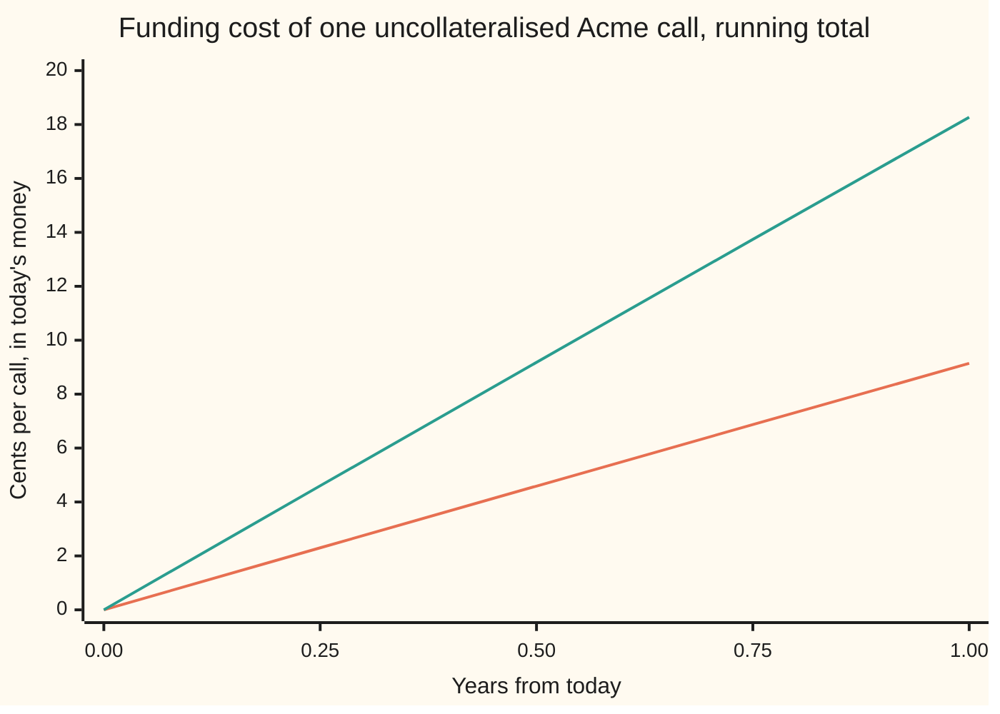

# FVA: funding the uncollateralised exposure at the bank's own spread, and the adjustment that books the cost

[Syllabus](../../../SYLLABUS.md) → [Financial mathematics](../README.md) → [Collateral, Funding and the Rest of the XVAs](../README.md#s47) → FVA

---

## General Overview

A bank buys a one-year call option on Acme shares from Northwind. Acme trades at \$100, the strike is \$100, and in the house market the call costs **\$9.23** ([Black–Scholes call](../08-The%20Black-Scholes%20call%20and%20put/01-black-scholes-call.md)). The bank pays that premium today. The \$9.23 has to come from somewhere, and a bank's cash is borrowed. It borrows unsecured, meaning with nothing pledged, at 1 percentage point a year above the rate that cash collateral earns. That extra 1% is the bank's **funding spread**.

The \$9.23 price already pays for the money at the collateral rate, 5% in the house market: that rate is the one used to discount the payoff. What the price leaves out is the extra 1%. On \$9.23 held for a year it comes to about 9.2 cents. The bank only carries the loan while the trade lives, and the trade ends early if Northwind fails, so the charge is weighted by Northwind's survival: **9.14 cents**. That charge is the **funding cost adjustment**, FCA, and with its mirror image, the **funding benefit adjustment** FBA, it makes the **funding valuation adjustment**, FVA for short, the term used from here on.

Now put the same trade under a collateral agreement. Northwind hands the bank \$9.23 of cash collateral the moment the premium is paid, and tops it up or takes it back daily as the call's value moves. The bank never borrows a cent, pays the collateral rate on the cash it holds, and its FVA is **zero**. Double the funding spread to 200 basis points (a basis point is a hundredth of a percent) and the uncollateralised charge doubles to **18.27 cents**.

**A fully collateralised trade is discounted at the collateral rate; the uncollateralised part must be borrowed at the bank's own rate, and FVA is the funding spread times the discounted expected exposure times the counterparty's survival chance, summed over the trade's life.**

**What kind of fact this is:** a model: the bank is taken to borrow and lend at one fixed spread over the collateral rate, and the cost is taken to first order in that spread. Inside that model, collateral-rate discounting and the FVA integral are proved on this card in Why it works. Whether FVA belongs in a price at all is still argued; Step 5 weighs the argument.

### The picture: the funding bill building up over the year



Orange, lower: the running FCA at a 100 basis point funding spread, ending at 9.14 cents. Green, upper: the same at 200 basis points, ending at 18.27, twice as much at every date. The collateralised twin would be a flat line at zero. Each quarter adds a little less than the one before, because the loan only runs while Northwind survives.

---

## The formula

Notation first, in words. $V(t)$ is the call's clean value to the bank at date $t$, in years from today: its value if nobody could fail. Its positive part $V^+(t) = \max(V(t), 0)$ is what Northwind owes the bank; its negative part $V^-(t) = \max(-V(t), 0)$ is what the bank owes Northwind. $\mathbb{E}[\,\cdot\,]$ is an average over the pricing world, where every asset grows on average at the collateral rate $r$. The **expected positive exposure** is $\mathrm{EPE}(t) = \mathbb{E}[V^+(t)]$ and the **expected negative exposure** is $\mathrm{ENE}(t) = \mathbb{E}[V^-(t)]$. The discount factor $D(t) = e^{-rt}$ turns a dollar at date $t$ into today's money. Northwind's **hazard** $\lambda_C$ ("lambda C") is its yearly default rate among survivors, and $Q_C(t) = e^{-\lambda_C t}$ is the chance it is still alive at $t$ ([The hazard rate](../41-Default%2C%20Survival%20and%20the%20Hazard%20Rate/02-hazard-rate-and-survival-probability.md)). The funding spread is $s_F$.

$$\mathrm{FCA} = s_F\int_0^T D(t)\,\mathrm{EPE}(t)\,Q_C(t)\,dt, \qquad \mathrm{FBA} = s_F\int_0^T D(t)\,\mathrm{ENE}(t)\,Q_C(t)\,dt, \qquad \mathrm{FVA} = \mathrm{FCA} - \mathrm{FBA}.$$

**Read it aloud:** the funding cost is the spread, times what the bank is owed at each date in today's money, times the chance the trade is still alive then, added over the trade's life; the funding benefit is the same with what the bank owes; FVA is cost minus benefit, and it comes off the price.

The funded price is the clean price minus FVA. The adjustments for default, CVA and DVA ([DVA](../46-Counterparty%20Risk%20and%20CVA/04-dva-and-bilateral-cva.md)), come off separately.

For a bought option, $\mathrm{ENE} = 0$ and the discounted exposure $D(t)\,\mathrm{EPE}(t)$ is flat at today's price $C_0$, so the integral closes:

$$\mathrm{FCA} = s_F\,C_0\,\frac{1 - e^{-\lambda_C T}}{\lambda_C}.$$

**Read it aloud:** the spread, times the price, times the expected number of years the trade survives. For Northwind that last factor is 0.990 years rather than a full year.

| Symbol | Plain meaning | In our example | Push it up and FVA… |
| --- | --- | --- | --- |
| $s_F$ | the **funding spread**: the bank's unsecured borrowing rate minus the collateral rate | 1% (100 basis points) | rises in proportion |
| $r$, $r_F$ | the collateral rate, continuously compounded; the bank's unsecured rate $r + s_F$ | 5%; 6% | $r$ moves FVA only through $C_0$ |
| $D(t)$ | discount factor $e^{-rt}$, at the collateral rate | 0.951229 at one year | — |
| $V(t)$, $V^+$, $V^-$, $V_k$ | the trade's clean value to the bank at $t$; its positive part; its negative part; its value at date $t_k$ | bought call: $V^+ = V$, $V^- = 0$ | — |
| $\mathrm{EPE}$, $\mathrm{ENE}$ | expected positive and negative exposure: averages of $V^+(t)$ and $V^-(t)$ | bought call: \$9.23 today, 0 | FCA rises with EPE, FBA with ENE |
| $\lambda_C$, $Q_C(t)$, $R_C$ | Northwind's hazard; its survival chance $e^{-\lambda_C t}$; its recovery | 2%; $Q_C(1) = 0.980$; 40% | $\lambda_C$ up: FVA slightly down |
| $\lambda_O$, $R_O$ | the bank's own hazard and recovery (O for "own") | 1%; 40% | — |
| $s_{\text{cr}}$, $s_\ell$ | the credit part of the spread, $(1-R_O)\lambda_O$; the rest, the **liquidity part** | 0.6%; 0.4% | — |
| $T$, $t$, $dt$, $t_k$, $k$ | the trade's end date; a date, in years; a short stretch of time; the $k$-th of a set of cut dates | $T = 1$ | rises: more years to fund |
| $C_0$, $P_0$, $X$ | the clean call and put prices; the call's payoff at expiry | \$9.227006, \$6.330081 | rises in proportion |
| $S$, $K$, $q$, $\sigma$ | Acme's price, the strike, the dividend yield, the volatility | \$100, \$100, 2%, 20% | through $C_0$ |
| $\mathrm{FCA}$, $\mathrm{FBA}$, $\mathrm{FVA}$ | funding cost, funding benefit, and cost minus benefit | 0.091353, 0, 0.091353 | — |

### When it holds

- **The funding need is the trade's value.** The bank borrows exactly what the trade is worth, and any hedge is financed at the collateral rate through repo (a loan secured on the hedge itself). If the hedge also needs unsecured cash, the need, and the FVA, are larger.
- **One flat spread for borrowing and lending.** FBA assumes cash the bank holds can repay borrowing at the same spread. A bank that can only park spare cash at the collateral rate has no benefit: its FBA is zero and FVA equals FCA.
- **First order in the spread.** The formula discounts at the collateral rate. Compounding the spread as well gives 0.090900 in place of 0.091353: an error of about half a percent, growing with spread and term.
- **The funding need ends when Northwind fails.** At default the trade is closed out and the loan repaid from what is recovered; the loss itself is the CVA's business. The bank's own default is left out: include it and every weight picks up the bank's survival too, which Step 5 uses.
- **Spread and exposure independent.** A spread that widens exactly when the trade is worth most would make the average of the product larger than the product of averages.

---

## Why it works

### Step 0: a price is what it costs to carry the trade, money included

A clean price assumes the cash to hold the trade costs the collateral rate $r$. A bank's cash costs whatever the bank can borrow at. So two questions decide the true cost of carrying a trade: what rate does the trade's own cash flow earn, and how much of the trade's value does the bank have to borrow? Collateral answers both.

### Step 1: with full cash collateral, the trade discounts at the collateral rate

Follow the bank's cash on the collateralised twin. Today it pays \$9.23 of premium and receives \$9.23 of collateral: net zero. Each day the call's value changes, Northwind posts or recalls the change, and the bank pays the collateral rate $r$ on the balance it holds. At expiry the bank receives the payoff $X$ and hands back the collateral, which by then equals $X$. At no date does the bank hold or owe any cash of its own.

The collateral agreement fixes the rate on that cash, so the rate that makes the trade cost nothing to hold is $r$. Adding up every daily cash flow, each discounted at $r$, the sum collapses to the discounted payoff minus today's price; setting its average to zero gives

$$V(0) = \mathbb{E}\bigl[D(T)\,X\bigr], \qquad D(T) = e^{-rT}.$$

The discount rate is the rate paid on collateral. It is why interest rate markets moved from discounting at a bank lending rate to discounting at the overnight rate once collateral became standard ([Collateral discounting](../28-Swaps/05-ois-discounting-and-collateral.md)). The checks confirm the discounting: 400,000 simulated payoffs, each discounted at $r$, average 9.217775 with a standard error of 0.021868, within half a standard error of $C_0$. The twin's funding need, trade value minus collateral held, is zero at every date, so its FVA is zero.

<details>
<summary>Detailed proof: the collateral account telescopes</summary>

Cut the year at dates $t_0 = 0 < t_1 < \dots < t_n = T$ and write $V_k$ for the trade's value at $t_k$ and $D_k = e^{-rt_k}$. Collateral held over each stretch equals $V_k$ and accrues interest at $r$, so the bank owes back $V_k e^{r(t_{k+1}-t_k)}$ at $t_{k+1}$, while the new collateral call brings the balance to $V_{k+1}$. The net cash the bank receives at $t_{k+1}$ is $V_{k+1} - V_k e^{r(t_{k+1}-t_k)}$. In today's money, $D_{k+1}V_{k+1} - D_k V_k$. Add over $k$: every middle term cancels and the total is $D_n V_n - D_0 V_0 = D(T)X - V(0)$. At the start the premium and the first collateral cancel. A strategy that never needs the bank's own cash must have an average present value of zero, else it is a free gain or loss, so $V(0) = \mathbb{E}[D(T)X]$. Nothing here used the bank's borrowing rate: collateralised trades never touch it.

</details>

### Step 2: without collateral, the bank borrows the value, and pays the spread on it

Remove the collateral. The bank now holds a trade worth $V(t)$ and no cash came back to pay for it. When $V(t) > 0$ the bank has laid out money and must borrow $V^+(t)$. It pays $r_F = r + s_F$ on that loan. The collateral rate part, $r$, is already charged by discounting at $r$ in Step 1. What is left over each short stretch $dt$ is $s_F\,V^+(t)\,dt$.

When $V(t) < 0$ the bank has received money, like the premium on a call it sold. That cash repays borrowing it would otherwise have, saving $s_F\,V^-(t)\,dt$.

Discount each stretch's cost and saving to today, average over Acme's paths, and add up over the life: $s_F\int_0^T D(t)\,\mathrm{EPE}(t)\,dt$ of cost, and the same with ENE of benefit. This is the linear, first-order account. It charges the spread on the clean value rather than on the funded value, which itself shrinks as spread is paid; the exact account compounds, and differs by a term of the size of the spread squared.

### Step 3: the loan only runs while Northwind survives

If Northwind fails at some date, the trade is closed out on that date. The bank collects what it can, repays its loan, and funds nothing afterward. So the cost at date $t$ is paid only in the futures where Northwind is alive at $t$. With default independent of Acme, the average of the product is the product of averages, and each date gets the weight $Q_C(t)$. That is the FCA integral in The formula.

The checks compute it by brute force: 52 weekly buckets, each week's discounted exposure found by integrating the call's value over every price Acme could have that week (2,000 slices of the bell curve), times the spread, times the time Northwind is expected to survive within that week. The sum is **0.091353**.

### Step 4: a bought option's discounted exposure is flat, so the integral closes

In the pricing world, today's price of a traded claim is the discounted average of its price at any later date. A bought call is never negative, so $D(t)\,\mathrm{EPE}(t) = C_0$ at every date ([Expected exposure over time](../46-Counterparty%20Risk%20and%20CVA/02-expected-exposure-profiles.md)). Then

$$\mathrm{FCA} = s_F\,C_0\int_0^T e^{-\lambda_C t}\,dt = s_F\,C_0\,\frac{1-e^{-\lambda_C T}}{\lambda_C} = 0.01 \times 9.227006 \times 0.990066 = 0.091353.$$

The same flat exposure makes the running total in the overview nearly a straight line. The third road is a simulation: draw a date in the year, Acme's price on that date, and Northwind's default date; charge the spread on the call's value if Northwind is still alive. Over 400,000 draws it averages 0.091449, with a standard error (the typical size of its random miss) of 0.000146: within one standard error of 0.091353.

### Step 5: the funding benefit, and the part of it that is already DVA

Turn the trade round. The bank sells the Acme call to Northwind and receives \$9.23 today. Its value to the bank is $-C_0$: all negative exposure. FCA is zero and the FBA is the mirror of the bought call's FCA, **0.091353**. The bank treats the premium as cheap funding.

Why does the bank pay a spread at all? Partly because its lenders might not be repaid. By the credit triangle ([The credit triangle](../42-Credit%20Default%20Swaps%20-%20Pricing%2C%20the%20Par%20Spread%20and%20the%20Hazard%20Behind%20It/03-the-credit-triangle.md)), a firm with hazard $\lambda_O = 1\%$ and recovery $R_O = 40\%$ pays a credit spread of $(1-R_O)\lambda_O = 0.6\%$. The remaining 0.4% is the **liquidity part**: what lenders charge for tying up cash, over and above default. Split the FBA the same way:

```
Sold Acme call, bank's view: cents per call
FBA, credit part (0.6%)             ████████████████████████████  5.48
FBA, liquidity part (0.4%)          ███████████████████           3.65
FBA credit part, bank survival too  ████████████████████████████  5.45
bank's DVA, simulated               ████████████████████████████  5.46
```

The credit part, weighted also by the bank's own survival, is 0.054540. That is exactly the bank's **DVA** on the sold call, the value to the bank of possibly not paying what it owes ([DVA](../46-Counterparty%20Risk%20and%20CVA/04-dva-and-bilateral-cva.md)): the DVA integral is $(1-R_O)\lambda_O$ times the same exposure, times both survivals. The checks confirm it by simulating the bank's own default date, and Northwind's, and paying out 60% of the call's value when the bank fails first: 0.054588, standard error 0.000087.

So the same 5.45 cents appears twice: once as DVA, the gain from the bank's own default, and once inside the FBA, the gain from funding at a spread that exists because of that default. A bank that books both counts it twice and shows a benefit of 0.145893 on the sold call instead of 0.091353.

<details>
<summary>The debate, in its two positions</summary>

**Funding costs belong in the price.** A bank's shareholders do pay the spread, day after day, on every uncollateralised trade. Fair value in accounting is an exit price, the price at which another dealer would take the trade over, and dealers quote with their funding in it. Large dealers began booking FVA in the years after the 2008 crisis; JPMorgan's first FVA charge, in its results for the fourth quarter of 2013, was \$1.5 billion.

**Funding costs do not belong in the price.** Hull and White argue that the credit part of the spread is a transfer from shareholders to the bank's lenders, who are compensated for the bank's own default: the lenders gain what shareholders lose, the firm as a whole does not. A trade should be valued at the riskless rate, and charging a funding spread in the price counts the bank's own credit a second time, the double count shown in Step 5.

**What desks do.** Two conventions survive. Book CVA, DVA and only a cost, FCA, dropping the FBA. Or book CVA, FCA and FBA and drop the DVA. Either way the credit part of the spread is counted once. The liquidity part of the benefit, 3.65 cents here, is dropped by the first convention and kept by the second.

</details>

### The other road: a cash stream, discounted two ways

<details>
<summary>A second example: a bought stream of payments</summary>

A bank pays today for \$100,000 a year for five years, with a collateral rate of 2% and a 100 basis point spread, so it funds at 3%. Discount the stream at 2% and at 3%: the gap is **\$13,693.67**, the exact funding cost with the spread compounded. At 200 basis points it is \$26,900.56, a little under double.

The linear FVA formula gives more. The funding need at date $t$ is the value of the payments still to come, and its discounted value is the sum of the payments after $t$, each discounted to today. Integrated over the five years that is \$1,394,372.36, and 1% of it is **\$13,943.72**; the checks get the same by a closed form, the spread times each payment times its date times its discount factor, and by a 5,000-step integral of the need. The linear formula overstates by \$250.05 because it charges the spread on the clean value; paying the spread shrinks what has to be funded, and the exact account knows it. On long trades the gap is not small.

</details>

---

## Worked numbers, by hand

The Acme call: $S = K = 100$, $r = 5\%$, $q = 2\%$, $\sigma = 20\%$, $T = 1$. Bought from Northwind with no collateral: Northwind's hazard 2%, the bank's funding spread 100 basis points.

| Step | Arithmetic | Value |
| --- | --- | --- |
| clean call $C_0$ | Black-Scholes, house market, discounted at the collateral rate | 9.227006 |
| expected years Northwind survives, within the year | $(1 - e^{-0.02})/0.02$ | 0.990066 |
| funding spread | 100 basis points | 0.01 |
| **FCA** | $0.01 \times 9.227006 \times 0.990066$ | **0.091353** |
| FBA | nothing owed to Northwind, ever | 0 |
| **funded price** | $9.227006 - 0.091353$ | **9.135652** |
| 52-week bucketed sum | weekly integrated exposure × spread × expected survival time | 0.091353 |
| simulated | 400,000 draws of date, Acme price and default date | 0.091449 |
| collateralised twin | need $=$ value $-$ collateral $= 0$ at every date; simulated $\mathbb{E}[D(T)X]$ is 9.217775, standard error 0.021868 | 0 |
| at 200 basis points | $0.02 \times 9.227006 \times 0.990066$ | 0.182707 |

Funding the Acme call costs the bank 9.14 cents over the year, on top of the 5% the price already pays for the money. Collateral removes the cost entirely.

### What breaks if you drop a piece

Same trade, correct FVA 0.091353 (and 0 for the collateralised twin).

| Mistake | Comes out at | What went wrong |
| --- | --- | --- |
| Full borrowing rate $r_F$ in place of the spread | 0.548121 | Charges the 5% twice: the discounting already pays it |
| No survival weight | 0.092270 | Funds the loan after Northwind has failed and the trade has closed |
| Collateralised twin discounted at the funding rate | 0.091810, not 0 | A trade that never needs the bank's cash is charged for it |
| FBA and DVA both booked on the sold call | benefit 0.145893, not 0.091353 | The credit part of the spread, 0.054540, counted twice |

Every number in that table is printed by the checks.

---

## Code, from first principles, and it actually runs

Nothing imported knows the answer: the scripts write their own normal CDF (a power series), integrator (Simpson's rule) and random numbers (splitmix64 with Box-Muller). FCA is reached by **three roads**: the closed form, the 52-week sum with each week's exposure integrated over Acme's price, and a simulation of 400,000 draws. The sold call's FBA is split into credit and liquidity parts, and the credit part is checked against a separate simulation of the bank's own default. The collateralised twin's price is re-simulated as the payoff discounted at $r$. The folded cash stream is valued two ways, and its linear FVA is reached by a closed form and a 5,000-step integral. Every "what breaks" number and every chart point is printed too.

### Python

```python
# FVA -- the check behind the card.  Standard library only.
# The Acme call (S = K = 100, r = 5%, q = 2%, sigma = 20%, T = 1) bought from Northwind with
# no collateral.  The bank funds at 100 bp over the collateral rate r; Northwind's hazard is
# 2% a year, the bank's own 1%, recovery 40% each.  Nothing imported knows the answer: the
# normal CDF is a series, integrals are Simpson's rule, random numbers are splitmix64.
from math import exp, log, sqrt, pi, cos

S, K, r, q, sig, T = 100.0, 100.0, 0.05, 0.02, 0.20, 1.0
SF, LC, RC, LO, RO = 0.01, 0.02, 0.40, 0.01, 0.40   # funding spread, hazards, recoveries

def phi(x): return exp(-0.5 * x * x) / sqrt(2.0 * pi)              # bell-curve height
def N(x):                                                           # 1/2 + phi(x)(x + x^3/3 + x^5/15 + ...)
    if x < -9.0: return 0.0
    if x > 9.0: return 1.0
    term, total, k = x, x, 1
    while abs(term) > 1e-17 * abs(total):
        k += 2; term *= x * x / k; total += term
    return 0.5 + phi(x) * total

def bs(s, left, put=False):                                         # Acme option with `left` years to run
    if left <= 1e-12: return max(K - s, 0.0) if put else max(s - K, 0.0)
    v = sig * sqrt(left)
    d1 = (log(s / K) + (r - q + 0.5 * sig * sig) * left) / v
    if put: return K * exp(-r * left) * N(v - d1) - s * exp(-q * left) * N(-d1)
    return s * exp(-q * left) * N(d1) - K * exp(-r * left) * N(d1 - v)

def simpson(f, a, b, n):                                            # area under f from a to b, n even
    h = (b - a) / n
    return (f(a) + f(b) + sum((4 if i % 2 else 2) * f(a + i * h) for i in range(1, n))) * h / 3

def dee(t, need=lambda v: max(v, 0.0)):
    # discounted expected funding need D(t) E[need(V(t))], integrated over Acme's price at t
    drift, vol = (r - q - 0.5 * sig * sig) * t, sig * sqrt(t)
    lo = -8.0 if t < T else (log(K / S) - drift) / vol              # at expiry, start at the kink
    f = lambda z: need(bs(S * exp(drift + vol * z), T - t)) * phi(z)
    return exp(-r * t) * simpson(f, lo, 8.0, 2000)

Q = lambda t, lam=LC: exp(-lam * t)                                 # survival to t
C0, P0 = bs(S, T), bs(S, T, put=True)

fca_closed = SF * C0 * (1.0 - Q(T)) / LC                            # road 1: flat exposure, integrated
weekly = [SF * dee((i + 0.5) / 52) * (Q(i / 52) - Q((i + 1) / 52)) / LC for i in range(52)]
fca_52 = sum(weekly)                                                # road 2: 52 weekly buckets

state = 20260928                                                    # road 3: simulation
def uniform():
    global state
    state = (state + 0x9E3779B97F4A7C15) & 0xFFFFFFFFFFFFFFFF
    z = state
    z = ((z ^ (z >> 30)) * 0xBF58476D1CE4E5B9) & 0xFFFFFFFFFFFFFFFF
    z = ((z ^ (z >> 27)) * 0x94D049BB133111EB) & 0xFFFFFFFFFFFFFFFF
    return ((z ^ (z >> 31)) >> 11) * (1.0 / 9007199254740992.0) + 0.5 / 9007199254740992.0
def acme_at(t):
    z = sqrt(-2.0 * log(uniform())) * cos(2.0 * pi * uniform())
    return S * exp((r - q - 0.5 * sig * sig) * t + sig * sqrt(t) * z)
def mean_se(xs):
    m = sum(xs) / len(xs)
    return m, sqrt((sum(x * x for x in xs) / len(xs) - m * m) / len(xs))
M = 400000
draws = []
for _ in range(M):                          # a date u in the year, Acme at u, Northwind's default date
    u = uniform() * T
    s_u = acme_at(u)
    alive = -log(uniform()) / LC > u
    draws.append(SF * T * exp(-r * u) * bs(s_u, T - u) if alive else 0.0)
fca_mc, se_fca = mean_se(draws)

# the sold call: the bank holds Northwind's premium, a negative exposure worth C0 in today's money
fba = SF * simpson(lambda t: dee(t, lambda v: max(v, 0.0)) * Q(t), 0.0, T, 8)   # FBA on the sold call
fca_sold = SF * simpson(lambda t: dee(t, lambda v: max(-v, 0.0)) * Q(t), 0.0, T, 8)
s_credit = (1.0 - RO) * LO                                          # the part of the spread that is default
fba_credit = s_credit * C0 * (1.0 - Q(T)) / LC                      # weighted by Northwind's survival
fba_credit2 = s_credit * C0 * (1.0 - Q(T, LC + LO)) / (LC + LO)     # and by the bank's own as well
fba_liquid = (SF - s_credit) * C0 * (1.0 - Q(T)) / LC
pd_o = 1.0 - Q(T, LO)
draws = []
for _ in range(M):                          # DVA by simulation: the bank defaults first, owing V
    tau = -log(1.0 - uniform() * pd_o) / LO                         # bank's default date, given one in the year
    s_tau = acme_at(tau)
    first = -log(uniform()) / LC > tau
    draws.append((1.0 - RO) * pd_o * exp(-r * tau) * bs(s_tau, T - tau) if first else 0.0)
dva_mc, se_dva = mean_se(draws)
# collateralised twin: Step 1 says V(0) = E[D(T) X] at the collateral rate; simulate the payoff
dx_mc, se_dx = mean_se([exp(-r * T) * max(acme_at(T) - K, 0.0) for _ in range(M)])

C, Y, RS = 100000.0, 5, 0.02                                        # folded example: a bought cash stream
D = lambda t, rate=RS: exp(-rate * t)
stream_exact = sum(C * (D(k) - D(k, RS + SF)) for k in range(1, Y + 1))
stream_200 = sum(C * (D(k) - D(k, RS + 2 * SF)) for k in range(1, Y + 1))
stream_lin = SF * sum(k * C * D(k) for k in range(1, Y + 1))        # need at t = value of flows after t
n = 5000
stream_lin2 = SF * sum(sum(C * D(k) for k in range(1, Y + 1) if k > (j + 0.5) * Y / n) * Y / n for j in range(n))

rows = [
    ("clean call C0", C0), ("clean put P0", P0), ("funding spread s_F", SF),
    ("discount factor D(1)", exp(-r * T)), ("Northwind survival Q_C(1)", Q(T)),
    ("expected years alive (1-e^-lam T)/lam", (1.0 - Q(T)) / LC),
    ("1 closed form s C0 (1-e^-lam T)/lam", fca_closed), ("2 bucketed sum, 52 weeks", fca_52),
    ("3 simulated, 400000 draws", fca_mc), ("  standard error", se_fca),
    ("funded call C0 - FVA", C0 - fca_closed), ("collateral-rate value E[D(T)X], sim.", dx_mc), ("  standard error", se_dx), ("FCA at 200 bp", 2.0 * fca_52),
    ("sold call: FCA", fca_sold), ("sold call: FBA", fba),
    ("  credit part of spread (1-R_O)lam_O", s_credit), ("  FBA, credit part", fba_credit),
    ("  FBA, credit part, both survivals", fba_credit2),
    ("  FBA, liquidity part", fba_liquid), ("  bank DVA, simulated", dva_mc), ("  standard error", se_dva),
    ("wrong: no survival weight", SF * C0 * T), ("wrong: full funding rate r+s_F", (r + SF) * fca_52 / SF),
    ("wrong: funding-rate discount, collat.", C0 * (1.0 - exp(-SF * T))), ("wrong: FBA plus DVA", fba + fba_credit2),
    ("compounded, not linear", SF * C0 * (1.0 - Q(T, LC + SF)) / (LC + SF)),
    ("try: long put", SF * P0 * (1.0 - Q(T)) / LC), ("try: 5-year call", SF * bs(S, 5.0) * (1.0 - Q(5.0)) / LC),
    ("stream: FVA, discount at 3% vs 2%", stream_exact), ("stream: same at 200 bp", stream_200),
    ("stream: linear, closed form", stream_lin), ("stream: linear, integrated", stream_lin2),
    ("stream: integral of discounted need", stream_lin2 / SF), ("stream: linear minus exact", stream_lin - stream_exact),
]
for name, v in rows:
    print(f"{name:<38}{v:14.6f}")
print()
print("chart, quarter end    " + " ".join(f"{t:6.2f}" for t in (0.0, 0.25, 0.5, 0.75, 1.0)))
cum = [0.0] + [100 * sum(weekly[:13 * j]) for j in range(1, 5)]
print("chart, FCA cents 100bp" + " ".join(f"{c:6.2f}" for c in cum))
print("chart, FCA cents 200bp" + " ".join(f"{2 * c:6.2f}" for c in cum))
print("bars, cents: FBA credit, liquidity; credit both surv., DVA " + " ".join(f"{100 * x:.2f}" for x in (fba_credit, fba_liquid, fba_credit2, dva_mc)))

assert abs(C0 - 9.227005508154) < 1e-9, "own normal CDF reproduces the house call"
assert abs(fca_52 - fca_closed) < 1e-6, "weekly sum with integrated exposure matches the flat-exposure integral"
assert abs(fca_mc - fca_closed) < 4 * se_fca, "simulation within four standard errors"
assert abs(dva_mc - fba_credit2) < 4 * se_dva, "credit part of the FBA is the bank's DVA"
assert abs(dx_mc - C0) < 4 * se_dx, "collateralised twin: payoff discounted at r averages to C0"
assert abs(stream_lin2 - stream_lin) < 1e-6 * stream_lin, "stream: two roads to the linear FVA"
print("ALL CHECKS PASS")
```

**Ran 2026-09-28 on macOS, Python 3.14.6, standard library only. All checks passed. Output, pasted from the run:**

```
clean call C0                               9.227006
clean put P0                                6.330081
funding spread s_F                          0.010000
discount factor D(1)                        0.951229
Northwind survival Q_C(1)                   0.980199
expected years alive (1-e^-lam T)/lam       0.990066
1 closed form s C0 (1-e^-lam T)/lam         0.091353
2 bucketed sum, 52 weeks                    0.091353
3 simulated, 400000 draws                   0.091449
  standard error                            0.000146
funded call C0 - FVA                        9.135652
collateral-rate value E[D(T)X], sim.        9.217775
  standard error                            0.021868
FCA at 200 bp                               0.182707
sold call: FCA                              0.000000
sold call: FBA                              0.091353
  credit part of spread (1-R_O)lam_O        0.006000
  FBA, credit part                          0.054812
  FBA, credit part, both survivals          0.054540
  FBA, liquidity part                       0.036541
  bank DVA, simulated                       0.054588
  standard error                            0.000087
wrong: no survival weight                   0.092270
wrong: full funding rate r+s_F              0.548121
wrong: funding-rate discount, collat.       0.091810
wrong: FBA plus DVA                         0.145893
compounded, not linear                      0.090900
try: long put                               0.062672
try: 5-year call                            1.047318
stream: FVA, discount at 3% vs 2%       13693.674492
stream: same at 200 bp                  26900.564617
stream: linear, closed form             13943.723628
stream: linear, integrated              13943.723628
stream: integral of discounted need   1394372.362809
stream: linear minus exact                250.049136

chart, quarter end      0.00   0.25   0.50   0.75   1.00
chart, FCA cents 100bp  0.00   2.30   4.59   6.87   9.14
chart, FCA cents 200bp  0.00   4.60   9.18  13.74  18.27
bars, cents: FBA credit, liquidity; credit both surv., DVA 5.48 3.65 5.45 5.46
ALL CHECKS PASS
```

### Rust

Same roads, same random-number generator, same seed, built with `rustc --edition 2021 -O`.

```rust
// FVA -- the same check as fva_check.py, in Rust.  Standard library only, no crates.
// The Acme call (S = K = 100, r = 5%, q = 2%, sigma = 20%, T = 1) bought from Northwind with
// no collateral.  The bank funds at 100 bp over the collateral rate r; Northwind's hazard is
// 2% a year, the bank's own 1%, recovery 40% each.  The normal CDF is a series, integrals are
// Simpson's rule, random numbers are splitmix64.
use std::f64::consts::PI;

const S: f64 = 100.0;
const K: f64 = 100.0;
const RATE: f64 = 0.05;
const Q_DIV: f64 = 0.02;
const SIG: f64 = 0.20;
const T: f64 = 1.0;
const SF: f64 = 0.01; // funding spread
const LC: f64 = 0.02; // Northwind's hazard
const LO: f64 = 0.01; // the bank's own hazard
const RO: f64 = 0.40; // the bank's recovery

fn phi(x: f64) -> f64 { (-0.5 * x * x).exp() / (2.0 * PI).sqrt() }  // bell-curve height
fn n_cdf(x: f64) -> f64 {                                         // 1/2 + phi(x)(x + x^3/3 + x^5/15 + ...)
    if x < -9.0 { return 0.0; }
    if x > 9.0 { return 1.0; }
    let (mut term, mut total, mut k) = (x, x, 1.0);
    while term.abs() > 1e-17 * total.abs() { k += 2.0; term *= x * x / k; total += term; }
    0.5 + phi(x) * total
}

fn bs(s: f64, left: f64, put: bool) -> f64 {                      // Acme option with `left` years to run
    if left <= 1e-12 { return if put { (K - s).max(0.0) } else { (s - K).max(0.0) }; }
    let v = SIG * left.sqrt();
    let d1 = ((s / K).ln() + (RATE - Q_DIV + 0.5 * SIG * SIG) * left) / v;
    if put { return K * (-RATE * left).exp() * n_cdf(v - d1) - s * (-Q_DIV * left).exp() * n_cdf(-d1); }
    s * (-Q_DIV * left).exp() * n_cdf(d1) - K * (-RATE * left).exp() * n_cdf(d1 - v)
}

fn simpson<F: Fn(f64) -> f64>(f: F, a: f64, b: f64, n: usize) -> f64 {   // area under f, n even
    let h = (b - a) / n as f64;
    let mut s = f(a) + f(b);
    for i in 1..n { s += if i % 2 == 1 { 4.0 } else { 2.0 } * f(a + i as f64 * h); }
    s * h / 3.0
}

// discounted expected funding need D(t) E[need(V(t))], integrated over Acme's price at t
fn dee<G: Fn(f64) -> f64>(t: f64, need: G) -> f64 {
    let (drift, vol) = ((RATE - Q_DIV - 0.5 * SIG * SIG) * t, SIG * t.sqrt());
    let lo = if t < T { -8.0 } else { ((K / S).ln() - drift) / vol };   // at expiry, start at the kink
    let f = |z: f64| need(bs(S * (drift + vol * z).exp(), T - t, false)) * phi(z);
    (-RATE * t).exp() * simpson(f, lo, 8.0, 2000)
}
fn pos(v: f64) -> f64 { v.max(0.0) }
fn surv(t: f64, lam: f64) -> f64 { (-lam * t).exp() }              // survival to t

struct Rng(u64);
impl Rng {
    fn uniform(&mut self) -> f64 {
        self.0 = self.0.wrapping_add(0x9E3779B97F4A7C15);
        let mut z = self.0;
        z = (z ^ (z >> 30)).wrapping_mul(0xBF58476D1CE4E5B9);
        z = (z ^ (z >> 27)).wrapping_mul(0x94D049BB133111EB);
        ((z ^ (z >> 31)) >> 11) as f64 * (1.0 / 9007199254740992.0) + 0.5 / 9007199254740992.0
    }
    fn acme_at(&mut self, t: f64) -> f64 {
        let (u1, u2) = (self.uniform(), self.uniform());
        let z = (-2.0 * u1.ln()).sqrt() * (2.0 * PI * u2).cos();
        S * ((RATE - Q_DIV - 0.5 * SIG * SIG) * t + SIG * t.sqrt() * z).exp()
    }
}
fn mean_se(xs: &[f64]) -> (f64, f64) {
    let n = xs.len() as f64;
    let m = xs.iter().sum::<f64>() / n;
    (m, ((xs.iter().map(|x| x * x).sum::<f64>() / n - m * m) / n).sqrt())
}

fn main() {
    let (c0, p0) = (bs(S, T, false), bs(S, T, true));
    let fca_closed = SF * c0 * (1.0 - surv(T, LC)) / LC;          // road 1: flat exposure, integrated
    let weekly: Vec<f64> = (0..52).map(|i| {                       // road 2: 52 weekly buckets
        SF * dee((i as f64 + 0.5) / 52.0, pos) * (surv(i as f64 / 52.0, LC) - surv((i + 1) as f64 / 52.0, LC)) / LC
    }).collect();
    let fca_52: f64 = weekly.iter().sum();

    let mut rng = Rng(20260928);                                   // road 3: simulation
    let m = 400000;
    let mut draws = Vec::with_capacity(m);
    for _ in 0..m {                        // a date u in the year, Acme at u, Northwind's default date
        let u = rng.uniform() * T;
        let s_u = rng.acme_at(u);
        let alive = -rng.uniform().ln() / LC > u;
        draws.push(if alive { SF * T * (-RATE * u).exp() * bs(s_u, T - u, false) } else { 0.0 });
    }
    let (fca_mc, se_fca) = mean_se(&draws);

    // the sold call: the bank holds Northwind's premium, a negative exposure worth C0 in today's money
    let fba = SF * simpson(|t| dee(t, pos) * surv(t, LC), 0.0, T, 8);
    let fca_sold = SF * simpson(|t| dee(t, |v| (-v).max(0.0)) * surv(t, LC), 0.0, T, 8);
    let s_credit = (1.0 - RO) * LO;                                // the part of the spread that is default
    let fba_credit = s_credit * c0 * (1.0 - surv(T, LC)) / LC;
    let fba_credit2 = s_credit * c0 * (1.0 - surv(T, LC + LO)) / (LC + LO);
    let fba_liquid = (SF - s_credit) * c0 * (1.0 - surv(T, LC)) / LC;
    let pd_o = 1.0 - surv(T, LO);
    draws.clear();
    for _ in 0..m {                        // DVA by simulation: the bank defaults first, owing V
        let tau = -(1.0 - rng.uniform() * pd_o).ln() / LO;
        let s_tau = rng.acme_at(tau);
        let first = -rng.uniform().ln() / LC > tau;
        draws.push(if first { (1.0 - RO) * pd_o * (-RATE * tau).exp() * bs(s_tau, T - tau, false) } else { 0.0 });
    }
    let (dva_mc, se_dva) = mean_se(&draws);
    // collateralised twin: Step 1 says V(0) = E[D(T) X] at the collateral rate; simulate the payoff
    let pay: Vec<f64> = (0..m).map(|_| (-RATE * T).exp() * (rng.acme_at(T) - K).max(0.0)).collect();
    let (dx_mc, se_dx) = mean_se(&pay);

    let (c, y, rs) = (100000.0, 5, 0.02);                          // folded example: a bought cash stream
    let d = |t: f64, rate: f64| (-rate * t).exp();
    let stream_exact: f64 = (1..=y).map(|k| c * (d(k as f64, rs) - d(k as f64, rs + SF))).sum();
    let stream_200: f64 = (1..=y).map(|k| c * (d(k as f64, rs) - d(k as f64, rs + 2.0 * SF))).sum();
    let stream_lin = SF * (1..=y).map(|k| k as f64 * c * d(k as f64, rs)).sum::<f64>();
    let n = 5000;
    let stream_lin2 = SF * (0..n).map(|j| {
        let mid = (j as f64 + 0.5) * y as f64 / n as f64;
        (1..=y).filter(|k| *k as f64 > mid).map(|k| c * d(k as f64, rs)).sum::<f64>() * y as f64 / n as f64
    }).sum::<f64>();

    let rows: Vec<(&str, f64)> = vec![
        ("clean call C0", c0), ("clean put P0", p0), ("funding spread s_F", SF),
        ("discount factor D(1)", (-RATE * T).exp()), ("Northwind survival Q_C(1)", surv(T, LC)),
        ("expected years alive (1-e^-lam T)/lam", (1.0 - surv(T, LC)) / LC),
        ("1 closed form s C0 (1-e^-lam T)/lam", fca_closed), ("2 bucketed sum, 52 weeks", fca_52),
        ("3 simulated, 400000 draws", fca_mc), ("  standard error", se_fca),
        ("funded call C0 - FVA", c0 - fca_closed), ("collateral-rate value E[D(T)X], sim.", dx_mc), ("  standard error", se_dx), ("FCA at 200 bp", 2.0 * fca_52),
        ("sold call: FCA", fca_sold), ("sold call: FBA", fba),
        ("  credit part of spread (1-R_O)lam_O", s_credit), ("  FBA, credit part", fba_credit),
        ("  FBA, credit part, both survivals", fba_credit2),
        ("  FBA, liquidity part", fba_liquid), ("  bank DVA, simulated", dva_mc), ("  standard error", se_dva),
        ("wrong: no survival weight", SF * c0 * T), ("wrong: full funding rate r+s_F", (RATE + SF) * fca_52 / SF),
        ("wrong: funding-rate discount, collat.", c0 * (1.0 - (-SF * T).exp())), ("wrong: FBA plus DVA", fba + fba_credit2),
        ("compounded, not linear", SF * c0 * (1.0 - surv(T, LC + SF)) / (LC + SF)),
        ("try: long put", SF * p0 * (1.0 - surv(T, LC)) / LC), ("try: 5-year call", SF * bs(S, 5.0, false) * (1.0 - surv(5.0, LC)) / LC),
        ("stream: FVA, discount at 3% vs 2%", stream_exact), ("stream: same at 200 bp", stream_200),
        ("stream: linear, closed form", stream_lin), ("stream: linear, integrated", stream_lin2),
        ("stream: integral of discounted need", stream_lin2 / SF), ("stream: linear minus exact", stream_lin - stream_exact),
    ];
    for (name, v) in &rows { println!("{:<38}{:14.6}", name, v); }
    println!();
    let join = |v: Vec<String>| v.join(" ");
    println!("chart, quarter end    {}", join([0.0, 0.25, 0.5, 0.75, 1.0].iter().map(|t: &f64| format!("{:6.2}", t)).collect()));
    let mut cum = vec![0.0];
    for j in 1..5 { cum.push(100.0 * weekly[..13 * j].iter().sum::<f64>()); }
    println!("chart, FCA cents 100bp{}", join(cum.iter().map(|c| format!("{:6.2}", c)).collect()));
    println!("chart, FCA cents 200bp{}", join(cum.iter().map(|c| format!("{:6.2}", 2.0 * c)).collect()));
    println!("bars, cents: FBA credit, liquidity; credit both surv., DVA {}",
        join([fba_credit, fba_liquid, fba_credit2, dva_mc].iter().map(|x| format!("{:.2}", 100.0 * x)).collect()));

    assert!((c0 - 9.227005508154).abs() < 1e-9, "own normal CDF reproduces the house call");
    assert!((fca_52 - fca_closed).abs() < 1e-6, "weekly sum with integrated exposure matches the flat-exposure integral");
    assert!((fca_mc - fca_closed).abs() < 4.0 * se_fca, "simulation within four standard errors");
    assert!((dva_mc - fba_credit2).abs() < 4.0 * se_dva, "credit part of the FBA is the bank's DVA");
    assert!((dx_mc - c0).abs() < 4.0 * se_dx, "collateralised twin: payoff discounted at r averages to C0");
    assert!((stream_lin2 - stream_lin).abs() < 1e-6 * stream_lin, "stream: two roads to the linear FVA");
    println!("ALL CHECKS PASS");
}
```

**Ran 2026-09-28 on macOS, rustc 1.98.1, no crates. All checks passed. Output, pasted from the run:**

```
clean call C0                               9.227006
clean put P0                                6.330081
funding spread s_F                          0.010000
discount factor D(1)                        0.951229
Northwind survival Q_C(1)                   0.980199
expected years alive (1-e^-lam T)/lam       0.990066
1 closed form s C0 (1-e^-lam T)/lam         0.091353
2 bucketed sum, 52 weeks                    0.091353
3 simulated, 400000 draws                   0.091449
  standard error                            0.000146
funded call C0 - FVA                        9.135652
collateral-rate value E[D(T)X], sim.        9.217775
  standard error                            0.021868
FCA at 200 bp                               0.182707
sold call: FCA                              0.000000
sold call: FBA                              0.091353
  credit part of spread (1-R_O)lam_O        0.006000
  FBA, credit part                          0.054812
  FBA, credit part, both survivals          0.054540
  FBA, liquidity part                       0.036541
  bank DVA, simulated                       0.054588
  standard error                            0.000087
wrong: no survival weight                   0.092270
wrong: full funding rate r+s_F              0.548121
wrong: funding-rate discount, collat.       0.091810
wrong: FBA plus DVA                         0.145893
compounded, not linear                      0.090900
try: long put                               0.062672
try: 5-year call                            1.047318
stream: FVA, discount at 3% vs 2%       13693.674492
stream: same at 200 bp                  26900.564617
stream: linear, closed form             13943.723628
stream: linear, integrated              13943.723628
stream: integral of discounted need   1394372.362809
stream: linear minus exact                250.049136

chart, quarter end      0.00   0.25   0.50   0.75   1.00
chart, FCA cents 100bp  0.00   2.30   4.59   6.87   9.14
chart, FCA cents 200bp  0.00   4.60   9.18  13.74  18.27
bars, cents: FBA credit, liquidity; credit both surv., DVA 5.48 3.65 5.45 5.46
ALL CHECKS PASS
```

The two outputs agree line for line. The simulations draw the same numbers in both languages because the generator is written out, not borrowed.

> [!TIP]
> **Try changing**
> Guess first, then run.
> - **Double the spread.** Set `SF = 0.02`. FCA becomes **0.182707**, exactly twice 0.091353: the linear formula is proportional to the spread.
> - **Compound the spread.** Discount the funding cost at $r_F$ rather than $r$. FCA falls to **0.090900**: the first-order formula is about half a percent high here.
> - **A put instead of a call.** Buy the house put, clean price \$6.33, uncollateralised. FCA is **0.062672**: the closed form holds for any bought option.
> - **Five years.** A five-year Acme call from Northwind carries an FCA of **1.047318**: more premium to fund, for longer.

---

## The usual mistake

> [!warning]
> **Discounting everything at the bank's own funding rate.** The funding rate prices only the cash the bank actually has to borrow. A collateralised trade needs none, and discounting it at 6% charges it 0.091810 for a loan that does not exist. The right order is: discount the whole trade at the collateral rate, then charge the spread on the uncollateralised exposure only.
>
> - **Charging the whole rate.** $r_F$ in place of $s_F$ gives 0.548121: the collateral rate is already in the price.
> - **Forgetting survival.** Without the survival weight the FCA is 0.092270; the loan stops when Northwind fails.
> - **Booking FBA and DVA together.** On the sold call that gives a benefit of 0.145893 instead of 0.091353; the credit part of the spread is DVA already.
> - **FCA on the wrong side.** A sold option never needs funding: its FCA is 0.000000 and its FVA is the benefit, 0.091353.

---

## Where you meet it in real life

- **Bank results.** Dealers report FVA as a line in their derivative valuations. JPMorgan's first FVA charge, \$1.5 billion, came with its results for the fourth quarter of 2013.
- **The treasury charge.** A trading desk that writes an uncollateralised trade is charged the FCA by the bank's treasury, which raises the cash. The charge is why corporate clients who cannot post collateral pay more for the same option.
- **Collateral agreements.** Two-way daily cash collateral removes FVA, as Step 1 proves, and the collateral rate becomes the discount rate. What collateral leaves behind, over the few days a margin call takes, is on [Collateral](01-collateral-and-the-residual-exposure.md).
- **Initial margin and capital.** Cleared and margined trades swap FVA for a new funding bill: initial margin must be posted and funded, [MVA](03-mva.md). Capital held against the trade has a cost too, [KVA](04-kva.md). The whole stack meets on [Putting the adjustments together](05-the-xva-desk-view.md).

> **Say it back**
> A fully collateralised trade needs none of the bank's cash, so it is discounted at the rate collateral earns. An uncollateralised trade must be borrowed at the bank's own rate, and the spread over the collateral rate is a cost the clean price leaves out. FVA is that spread times the discounted expected exposure times the counterparty's survival chance, added over the trade's life: 0.01 × 9.227 × 0.990, or 9.14 cents, for the Acme call bought from Northwind. Money the bank holds earns the mirror benefit, FBA, but the credit part of that benefit is the bank's DVA again, so a bank books one or the other.

---

## What this builds on

- [Collateral](01-collateral-and-the-residual-exposure.md): how collateral works and what exposure it leaves behind; FVA prices the funding of what is left.
- [DVA](../46-Counterparty%20Risk%20and%20CVA/04-dva-and-bilateral-cva.md): the bank's own-default adjustment, which the credit part of the FBA repeats.
- [Collateral discounting](../28-Swaps/05-ois-discounting-and-collateral.md): the overnight curve as the collateral rate, and the market's switch to discounting on it.

## Where this goes next

- [MVA](03-mva.md): the funding cost of the initial margin a collateralised trade must post, the bill that replaces FVA once collateral removes it.

---

## Sources

Verified 2026-09-28: every link below resolves to the publisher's page or to the paper's DOI record.

- Gregory, Jon. *The xVA Challenge: Counterparty Risk, Funding, Collateral, Capital and Initial Margin*, 4th ed. Wiley, 2020. [Publisher page](https://www.wiley.com/en-us/The+xVA+Challenge%3A+Counterparty+Risk%2C+Funding%2C+Collateral%2C+Capital+and+Initial+Margin%2C+4th+Edition-p-9781119508991). FCA and FBA as spread times exposure times survival, and the FBA and DVA overlap.
- Piterbarg, Vladimir. "Funding beyond discounting: collateral agreements and derivatives pricing." *Risk*, February 2010. [Risk.net page](https://www.risk.net/derivatives/1589992/funding-beyond-discounting-collateral-agreements-and-derivatives-pricing). Why a collateralised trade discounts at the collateral rate and an unsecured one at the funding rate.
- Burgard, Christoph, and Mats Kjaer. "Partial differential equation representations of derivatives with bilateral counterparty risk and funding costs." *The Journal of Credit Risk* 7(3), 2011. [DOI 10.21314/JCR.2011.131](https://doi.org/10.21314/JCR.2011.131). The replication argument that produces the funding term alongside CVA and DVA.
- Hull, John, and Alan White. "Valuing derivatives: funding value adjustments and fair value." *Financial Analysts Journal* 70(3), 2014. [DOI 10.2469/faj.v70.n3.3](https://doi.org/10.2469/faj.v70.n3.3). The case that funding costs should not enter a derivative's value, and the overlap with DVA.
- Brigo, Damiano, Massimo Morini, and Andrea Pallavicini. *Counterparty Credit Risk, Collateral and Funding: With Pricing Cases for All Asset Classes*. Wiley, 2013. [Publisher page](https://www.wiley.com/en-us/Counterparty+Credit+Risk%2C+Collateral+and+Funding%3A+With+Pricing+Cases+For+All+Asset+Classes-p-9780470748466). Collateral, closeout and funding in one pricing framework.
