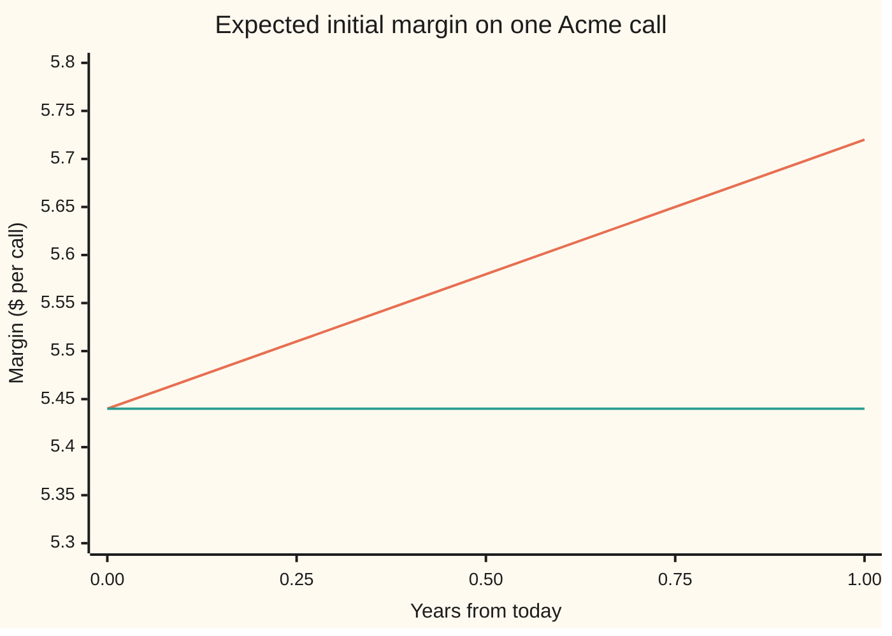
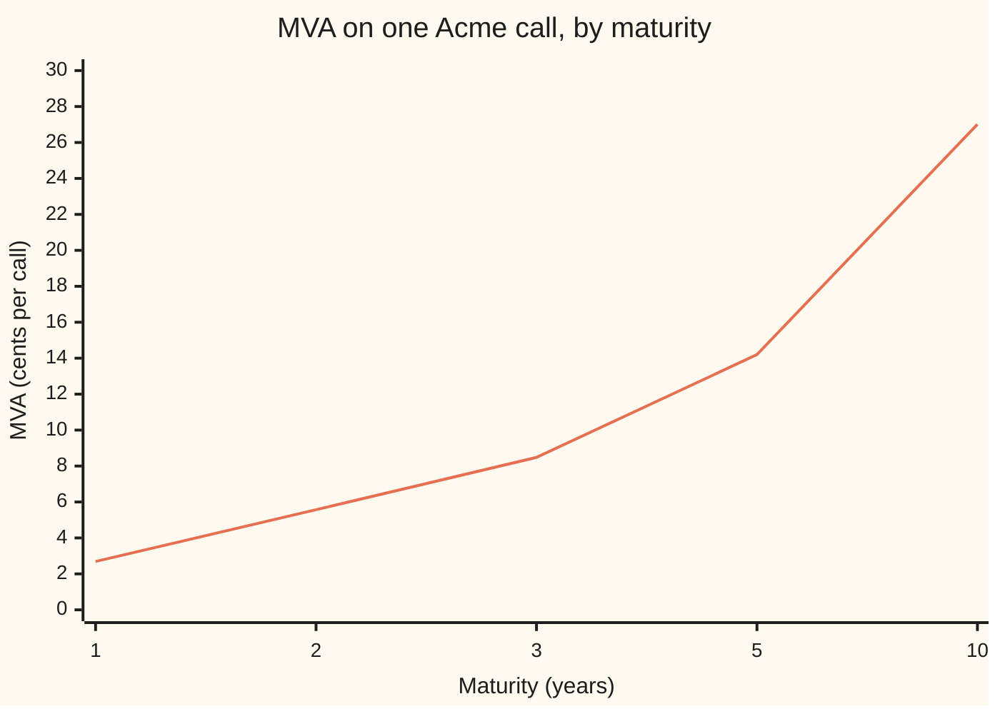

# MVA: initial margin sits idle for the life of the trade, and its funding cost is priced

[Syllabus](../../../SYLLABUS.md) → [Financial mathematics](../README.md) → [Collateral, Funding and the Rest of the XVAs](../README.md#s47) → MVA

---

## General Overview

A bank buys a one-year call option on Acme shares from Northwind. Acme trades at \$100, the strike is \$100, and in the house market the call is worth **\$9.23** ([Black–Scholes call](../08-The%20Black-Scholes%20call%20and%20put/01-black-scholes-call.md)). Northwind defaults at a rate of 2% a year and recovers 40 cents on the dollar, which costs the bank 10.96 cents of CVA ([CVA](../46-Counterparty%20Risk%20and%20CVA/03-cva.md)).

Now the trade sits under modern margin rules. Each side hands the other a deposit on day one, sized to cover a bad ten-day move in the option's value: about **\$5.44**. The deposit goes to a third-party custodian, a bank that holds it on the receiver's behalf. The receiver may seize it only if the poster defaults; until then nobody may spend it. The bank received \$5.44 from Northwind that it cannot touch, and posted \$5.44 of its own that it had to borrow. That deposit is **initial margin**, IM for short, the term used from here on.

Borrowed money costs the bank its funding rate. The margin earns only the lower rate the custodian pays. The gap, 50 basis points (0.5% a year) here, is paid on \$5.44 every day the trade is alive. Priced up front it comes to **0.0269 dollars per call, about 2.7 cents**: the **margin valuation adjustment**, MVA. That is a quarter of the CVA. It grows with maturity. And once collateral has wiped out most of the CVA, MVA is what is left.

**MVA is the funding spread on initial margin, times the discounted expected margin, times the chance the trade is still alive, added up over the trade's life.**

**What kind of fact this is:** a model: the margin rule, the flat funding spread and Northwind's default clock are assumptions, not laws. Inside the model the MVA formula follows from its definition, and the closed form for this call is a theorem proved on this card in Why it works.

### The picture: the margin the bank expects to post, over the year



Orange, rising: the average margin at each date, in that date's dollars. Green, flat: the same average shrunk to today's dollars. The green line is flat to the cent for the whole year. That flatness is proved in Step 4 and is why the MVA of this call has a one-line answer.

---

## The formula

Notation first, in words. $\mathrm{IM}(t)$ is the initial margin posted at date $t$, in years from today. $\mathbb{E}[\,\cdot\,]$ is an average over the pricing world, where every asset grows at the riskless rate ([The fundamental theorems](../05-Black-Scholes%20from%20the%20Ground%20Up/02-risk-neutral-measure-and-the-fundamental-theorems.md)). $D(t) = e^{-rt}$ is the discount factor that shrinks a date-$t$ dollar to today. $Q(t) = e^{-\lambda t}$ is the chance Northwind is still alive at $t$ when it fails at the yearly rate $\lambda$ (Greek "lambda"), its **hazard**. $s_I$ is the **margin funding spread**: what the bank pays to borrow, minus what the posted margin earns.

$$\mathrm{MVA} = s_I \int_0^T D(t)\,\mathbb{E}\bigl[\mathrm{IM}(t)\bigr]\,Q(t)\,dt$$

**Read it aloud:** at every instant of the trade's life, pay the spread on the margin expected to be posted, shrink that payment to today, weight it by the chance the trade is still running, and add up.

The margin itself is a 99% ten-day move of the option, sized by its delta:

$$\mathrm{IM}(t) = z_{0.99}\;\Delta(t)\,S(t)\,\sigma\sqrt{h}, \qquad \Delta(t) = e^{-q(T-t)}N\bigl(d_1(t)\bigr)$$

Here $z_{0.99} = 2.326348$ is the 99th percentile of the standard normal, $h = 10/252$ is ten trading days in years, $\sigma$ is Acme's volatility, $q$ its dividend yield, and $d_1$ is as on the Black-Scholes card. $\Delta(t)\,S(t)$ is the option's **dollar delta**: to first order, a 1% rise in Acme adds 1% of it to the option's value. Times $\sigma\sqrt{h}$ it becomes one standard deviation of the option's ten-day change; times $z_{0.99}$ it becomes the 99th percentile of that change.

For this call, and for any claim whose dollar delta is itself a traded price, the average margin in today's dollars stays at its day-one level, so the integral closes:

$$\mathrm{MVA} = s_I \times \mathrm{IM}_0 \times \frac{1 - e^{-\lambda T}}{\lambda}$$

**Read it aloud:** the spread, times today's margin, times the survival-weighted length of the trade in years.

| Symbol | Plain meaning | In our example | Push it up and the answer… |
| --- | --- | --- | --- |
| $\mathrm{MVA}$ | margin valuation adjustment: today's value of the margin's funding cost | \$0.026926 | — |
| $s_I$ | margin funding spread: borrowing rate minus what posted margin earns | 0.005 (50 bp) | rises in proportion |
| $\mathrm{IM}(t)$, $\mathrm{IM}_0$ | initial margin at date $t$; at day one | \$5.439166 | rises in proportion |
| $z_{0.99}$, $N$, $\varphi$ | the 99th percentile of a standard bell curve; the curve's area to the left, and its height | 2.326348 | rises: a stricter rule, more margin |
| $\Delta(t)$, $d_1$, $q$ | delta: shares that move like one option; the Black-Scholes $d_1$; Acme's dividend yield, 2% | 0.586851 | rises |
| $S(t)$ | Acme's share price | \$100 today | rises, through dollar delta |
| $\sigma$, $\sigma_{10}$ | Acme's volatility: yearly wiggle of its log price; the option's ten-day standard deviation in dollars | 0.20; \$2.338071 | rises, nearly in proportion |
| $h$ | the margin horizon, ten trading days, in years | 10/252 | rises as $\sqrt{h}$ |
| $D(t)$, $r$ | discount factor $e^{-rt}$; riskless rate | $r$ = 0.05 | — (drops out of the closed form) |
| $Q(t)$, $\lambda$ | Northwind's survival chance to $t$; its hazard | $\lambda$ = 0.02 | falls slightly: the trade may end early |
| $T$, $t$ | the trade's life in years; a date inside it | 1 | rises, a little less than in proportion |
| $C_0$, $R$, $s_F$ | the clean call; recovery; unsecured funding spread (for CVA and FVA) | \$9.227006; 0.40; 0.01 | — (comparison only) |

### When it holds

- **Received margin cannot be reused.** Under the uncleared-margin rules it is segregated at a custodian. If a rule let the bank lend on Northwind's margin, received would offset posted and MVA would shrink toward zero.
- **A flat margin spread.** Funding costs move with the bank's own credit. If the spread doubles to 100 bp, MVA doubles to 0.053851.
- **Delta-normal margin.** The real rule reprices the option. Repriced in full, Northwind posts against a 99% rise in the call, \$6.518167; the bank posts against a 99% fall, \$4.413348. The delta sizing, \$5.44, sits between them because it ignores gamma (the curvature of the option's price). Full repricing would lower the bank's MVA.
- **Default independent of Acme.** $Q(t)$ multiplies the expected margin only if Northwind's failure does not depend on Acme's price. If it does, the average must be taken jointly, as wrong-way risk does for CVA.
- **Only Northwind can end the trade early.** The bank's own default is set aside, as on the CVA card. Adding a bank hazard lowers MVA slightly: posting stops sooner.

---

## Why it works

### Step 0: margin is a loan the bank makes to a locked box

The whole idea is a cash flow. Posting \$5.44 means borrowing \$5.44 at the funding rate and parking it where it earns less. The spread between the two rates is a running cost, like rent. Rent paid on an uncertain amount for an uncertain time is priced the usual way: average it in the pricing world, discount it, add it up.

### Step 1: size the margin as a 99% ten-day move

If Northwind stops paying, the bank needs time to notice, dispute, close out and re-hedge. The rules assume ten business days: the **margin period of risk**. Initial margin covers the option's move over that window with 99% confidence.

Over ten days a call moves by about its dollar delta times Acme's percentage move. Acme's ten-day log move is normal with standard deviation $\sigma\sqrt{h}$. So the option's ten-day change is normal with standard deviation $\Delta S \sigma\sqrt{h}$, here \$2.338071. Its 99th percentile is 2.326348 of those: **\$5.439166**. This is delta-normal VaR on one position ([Parametric VaR](../39-Value%20at%20Risk%20and%20Expected%20Shortfall/02-parametric-var-and-delta-normal.md)).

The two margin engines in use are richer versions of this line.

- **ISDA SIMM**, the Standard Initial Margin Model, is what most dealers use between themselves. It takes sensitivities (delta, vega, and a curvature term for gamma), multiplies each by a published risk weight, and aggregates them across risk types with published correlations. For a single equity delta, the risk weight plays the part of $z_{0.99}\sigma\sqrt{h}$.
- **A VaR-based model** reprices the whole netting set (all trades with one counterparty) under historical or stressed ten-day scenarios and takes the 99% loss. The international baseline asks for exactly this: a one-tailed 99% interval over ten days, calibrated on a period that includes stress, or a standard schedule of percentages of notional.

Conventions verified 2026-09-28 against the BCBS-IOSCO text and MGN20: 99% one-tailed, ten business days with daily variation margin, segregated initial margin; 252 trading days a year is this card's choice.

The simulated check draws 200,000 ten-day moves, sorts them and reads off the 99% point: \$5.437698, against \$5.439166 by formula.

### Step 2: the cost over one short interval

Over a sliver of time at date $t$, the bank pays the spread times the margin times the sliver's length, $s_I\,\mathrm{IM}(t)\,dt$, but only if Northwind is still alive, since a default ends the trade and releases the margin. That payment is a date-$t$ dollar, worth $D(t)$ today. Its value today is $s_I\,D(t)\,\mathrm{IM}(t)\,\mathbf{1}_{\text{alive}}\,dt$, where the last factor is 1 while the trade is running and 0 after.

### Step 3: average and add up

Average over the pricing world and integrate over the life. If Northwind's default clock is independent of Acme's price, the average of a product splits: expected margin times survival chance. That is the formula:

$$\mathrm{MVA} = s_I \int_0^T D(t)\,\mathbb{E}\bigl[\mathrm{IM}(t)\bigr]\,Q(t)\,dt.$$

It has the same skeleton as CVA and FVA. CVA puts expected exposure and the default rate (times the loss fraction $1-R$) where MVA puts expected margin and the spread. FVA puts expected unsecured balance and the unsecured funding spread ([FVA](02-fva.md)).

### Step 4: the discounted margin is flat, so the integral closes

The margin is $z_{0.99}\sigma\sqrt{h}$ times the dollar delta $\Delta(t)S(t)$. The dollar delta of a call is the price of its share half: $S e^{-q(T-t)}N(d_1)$ is exactly what a contract paying one Acme share at expiry, if Acme finishes above \$100, is worth at date $t$ ([Asset-or-nothing digital](../10-Digitals%20and%20the%20implied%20density/02-asset-or-nothing-digital.md)). The discounted price of a traded claim, averaged in the pricing world, never changes: that is what pricing world means. So $D(t)\,\mathbb{E}[\mathrm{IM}(t)] = \mathrm{IM}_0$ at every date, the green line in the picture.

The orange line is the same thing in date-$t$ dollars, $\mathrm{IM}_0 e^{rt}$: 5.44 rising to 5.72. The average margin grows at the riskless rate. Shrinking by $D(t)$ undoes it exactly.

What remains is the survival integral: $\int_0^T e^{-\lambda t}\,dt = (1 - e^{-\lambda T})/\lambda$, which is 0.990066 years for Northwind. Hence the closed form.

<details>
<summary>Detailed proof: the discounted expected margin equals today's margin</summary>

Let $A(t) = S(t)\,e^{-q(T-t)}N(d_1(t))$. Write $V_A(t)$ for the date-$t$ price of the claim paying $S(T)$ at $T$ if $S(T) > K$, else nothing. Under the pricing world, with the share as the unit of account, the chance $S(T) > K$ given $S(t)$ is $N(d_1(t))$; the share, paying dividends at rate $q$, is worth $S(t)e^{-q(T-t)}$ in date-$t$ dollars as a claim on $S(T)$. So $V_A(t) = A(t)$ (the share-half step of the Black-Scholes derivation).

The claim pays nothing before $T$, so $D(t)V_A(t)$ is a martingale in the pricing world: $\mathbb{E}[D(t)V_A(t)] = V_A(0)$ for every $t \le T$. Multiply by the constant $z_{0.99}\sigma\sqrt{h}$: $D(t)\,\mathbb{E}[\mathrm{IM}(t)] = \mathrm{IM}_0$. At $t = T$ the margin is $z_{0.99}\sigma\sqrt{h}\,S(T)$ if Acme finishes above \$100, else zero, and the identity still holds.

With independent default and a flat hazard,
$$\mathrm{MVA} = s_I\int_0^T \mathrm{IM}_0\,e^{-\lambda t}\,dt = s_I\,\mathrm{IM}_0\,\frac{1-e^{-\lambda T}}{\lambda}.$$
Its slope in $T$, holding the margin fixed, is $s_I\,\mathrm{IM}_0\,e^{-\lambda T} > 0$, so MVA grows with maturity but more slowly than in proportion. For a product whose margin profile is not a traded price (a swap, whose margin falls as payments run off), the profile must be integrated date by date; the checks do that here as road 2 and land on the same number.

</details>

### The other door: simulate it

Pick a random date in the year, a random Acme price at that date, and a random default date for Northwind. If Northwind is still alive, record the discounted spread on that date's margin, times the year's length. Average 200,000 such draws: 0.026931, with a standard error (the typical size of the random miss) of 0.000038. The closed form, 0.026926, is well inside it. This route needs no flatness argument, so it works for any product and any margin rule a simulation can evaluate. Desks do it with regression, because repricing a whole netting set's margin on every path is expensive (the Green and Kenyon paper in Sources).

---

## Worked numbers, by hand

| Step | Arithmetic | Value |
| --- | --- | --- |
| delta | $e^{-0.02}N(d_1)$, from the Black-Scholes card | 0.586851 |
| ten-day standard deviation | 0.586851 × 100 × 0.20 × √(10/252) | \$2.338071 |
| 99% percentile | $z_{0.99}$ | 2.326348 |
| initial margin | 2.326348 × 2.338071 | \$5.439166 |
| hand version | 2.33 × 0.587 × 100 × 0.20 × √(10/252) | \$5.449087 |
| survival-weighted life | (1 − e^{−0.02})/0.02 | 0.990066 years |
| **MVA** | 0.005 × 5.439166 × 0.990066 | **\$0.026926** |

Posting \$5.44 for a year at 50 bp costs about 2.7 cents, slightly less than 0.5% of \$5.44 because Northwind may default first and end the trade.

### Against CVA and FVA: when MVA dominates

| Adjustment | Formula here | Value | MVA as a share of it |
| --- | --- | --- | --- |
| CVA | 0.60 × 9.227006 × (1 − e^{−0.02}) | \$0.109624 | 0.245618 |
| FVA, no collateral | 0.01 × 9.227006 × 0.990066 | \$0.091353 | 0.294742 |
| MVA | as above | \$0.026926 | — |

All three share the survival factor, so the comparison reduces to one product each: $s_I\,\mathrm{IM}_0$ against $(1-R)\lambda C_0$ for CVA and against $s_F C_0$ for FVA. Setting them equal gives the crossovers.

- **Against CVA:** MVA wins when Northwind's hazard is below $s_I\,\mathrm{IM}_0/((1-R)C_0)$ = 0.004912, about 0.49% a year: a very safe counterparty. The checks find the same point by bisection on the two costs.
- **Against FVA:** MVA wins when the unsecured funding spread is below $s_I\,\mathrm{IM}_0/C_0$ = 0.002947, about 29 bp.

The decisive case is collateral. With daily variation margin (the daily cash that settles each change in the trade's value) and Northwind's \$5.44 of initial margin in hand, the bank loses only when a ten-day move overshoots the margin. That average overshoot, held at its day-one size, is $\sigma_{10}\bigl(\varphi(z_{0.99}) - z_{0.99}(1-N(z_{0.99}))\bigr)$ = \$0.007923, where $\sigma_{10}$ is the \$2.338071 ten-day standard deviation and $\varphi$ the bell curve's height, found again by integration. CVA falls to 0.60 × 0.007923 × (1 − e^{−0.02}) = \$0.000094. Variation margin also funds the hedge, so FVA falls toward zero ([Collateral](01-collateral-and-the-residual-exposure.md)). MVA does not fall at all: the margin that killed the CVA is the margin being funded.

```
cents per call, one block = 0.25 cents
CVA, no collateral    ████████████████████████████████████████████ 10.962
MVA, no collateral    ███████████ 2.693
CVA, VM and IM held   0.009
MVA, VM and IM held   ███████████ 2.693
```

### What breaks if you drop a piece

Same trade, correct MVA 0.026926.

| Mistake | Comes out at | What went wrong |
| --- | --- | --- |
| No survival weight | 0.027196 | Charges for margin posted after Northwind has defaulted and the trade has ended |
| Margin discounted twice | 0.026266 | Treats \$5.44 as the margin in every future date's dollars, then discounts it: the expected margin already grows at $r$ |
| One-day horizon instead of ten | 0.008515 | Cuts the margin by √10; the rules use the time to close out, not one day |
| Whole 5.5% funding rate, not the 50 bp spread | 0.296182 | Forgets the margin earns the collateral rate at the custodian |
| Received margin netted against posted | 0 | Received margin is segregated; it cannot fund the bank's own posting |

---

## How it moves with maturity

The same call with a longer life. The margin barely changes, since delta and dollar delta move slowly with maturity. The time the margin is funded grows almost in proportion. So MVA grows almost in proportion.

| Maturity (years) | Day-one margin | Call price | MVA | FVA | CVA | MVA / CVA |
| --- | --- | --- | --- | --- | --- | --- |
| 1 | 5.439 | 9.227 | 0.02693 | 0.09135 | 0.10962 | 0.246 |
| 2 | 5.683 | 13.522 | 0.05571 | 0.26510 | 0.31812 | 0.175 |
| 3 | 5.826 | 16.857 | 0.08482 | 0.49084 | 0.58901 | 0.144 |
| 5 | 5.970 | 22.011 | 0.14204 | 1.04732 | 1.25678 | 0.113 |
| 10 | 5.960 | 30.167 | 0.27009 | 2.73415 | 3.28098 | 0.082 |



Orange: MVA in cents, from 2.69 at one year to 27.01 at ten. The CVA of an uncollateralised call grows faster still, because the call's price grows with the square root of maturity while its margin does not: the MVA share falls from 0.246 to 0.082. MVA overtakes the other adjustments through collateral and credit quality, not through maturity.

---

## Code, from first principles, and it actually runs

The checks size the margin two ways (the delta-normal formula, and the 99% point of 200,000 simulated ten-day moves) and reach MVA by three independent roads: the closed form; a monthly margin profile with each month's expected margin integrated over Acme's price by Simpson's rule, no flatness assumed; and a simulation of dates, prices and default times. They also compute the CVA and FVA crossovers by algebra and by bisection, the collateralised tail by formula and by integration, and every number in the tables, charts and bars. The normal CDF is a series, the percentile a bisection, the random numbers splitmix64 with Box-Muller.

### Python

```python
# MVA -- the check behind the card.  Standard library only.
# The Acme call (S = K = 100, r = 5%, q = 2%, sigma = 20%, T = 1) bought from Northwind
# (hazard 2% a year, recovery 40%), now with two-way initial margin sized as a 99% ten-day
# move and funded at 50 bp over what the margin earns.  Nothing imported knows the answer:
# the normal CDF is a series, the percentile is bisection, the integrals are Simpson's rule,
# the random numbers are splitmix64 plus Box-Muller, all written out below.
from math import exp, log, sqrt, pi, cos

S, K, r, q, sig, T = 100.0, 100.0, 0.05, 0.02, 0.20, 1.0
LAM, R, S_IM, S_F = 0.02, 0.40, 0.005, 0.01           # hazard, recovery, margin spread, funding spread
H = 10.0 / 252.0                                      # ten trading days, in years

def phi(x): return exp(-0.5 * x * x) / sqrt(2.0 * pi)
def N(x):                                             # 1/2 + phi(x)(x + x^3/3 + x^5/15 + ...)
    if x < -9.0: return 0.0
    if x > 9.0: return 1.0
    term, total, k = x, x, 1
    while abs(term) > 1e-17 * abs(total):
        k += 2; term *= x * x / k; total += term
    return 0.5 + phi(x) * total

def d1(s, left): return (log(s / K) + (r - q + 0.5 * sig * sig) * left) / (sig * sqrt(left))
def call(s, left): return s * exp(-q * left) * N(d1(s, left)) - K * exp(-r * left) * N(d1(s, left) - sig * sqrt(left))
def delta(s, left): return exp(-q * left) * N(d1(s, left)) if left > 1e-12 else (1.0 if s >= K else 0.0)

lo, hi = 0.0, 8.0                                     # the 99th percentile z: N(z) = 0.99, by bisection
for _ in range(200):
    mid = 0.5 * (lo + hi)
    lo, hi = (mid, hi) if N(mid) < 0.99 else (lo, mid)
Z99 = 0.5 * (lo + hi)
def im(s, left): return Z99 * delta(s, left) * s * sig * sqrt(H)   # delta-normal 99% ten-day move

def simpson(f, a, b, n):
    h = (b - a) / n
    return (f(a) + f(b) + sum((4 if i % 2 else 2) * f(a + i * h) for i in range(1, n))) * h / 3

def deim(t):                                          # D(t) E[IM(t)], integrated over Acme's price at t
    if t < 1e-12: return im(S, T)
    drift, vol = (r - q - 0.5 * sig * sig) * t, sig * sqrt(t)
    a = -8.0 if t < T else (log(K / S) - drift) / vol # at expiry delta jumps at K: start there
    return exp(-r * t) * simpson(lambda z: im(S * exp(drift + vol * z), T - t) * phi(z), a, 8.0, 2000)

state = 20260928
def uniform():                                        # splitmix64, a number in (0, 1)
    global state
    state = (state + 0x9E3779B97F4A7C15) & 0xFFFFFFFFFFFFFFFF
    z = state
    z = ((z ^ (z >> 30)) * 0xBF58476D1CE4E5B9) & 0xFFFFFFFFFFFFFFFF
    z = ((z ^ (z >> 27)) * 0x94D049BB133111EB) & 0xFFFFFFFFFFFFFFFF
    return ((z ^ (z >> 31)) >> 11) * (1.0 / 9007199254740992.0) + 0.5 / 9007199254740992.0
def gauss(): return sqrt(-2.0 * log(uniform())) * cos(2.0 * pi * uniform())

def annuity(lam, T): return (1.0 - exp(-lam * T)) / lam if lam > 0 else T
def im0(T): return Z99 * delta(S, T) * S * sig * sqrt(H)
def mva(T, lam=LAM, s=S_IM): return s * im0(T) * annuity(lam, T)
def cva(T, lam=LAM): return (1.0 - R) * call(S, T) * (1.0 - exp(-lam * T))
def fva(T, lam=LAM): return S_F * call(S, T) * annuity(lam, T)

C0, D0 = call(S, T), delta(S, T)
ten_day_sd = D0 * S * sig * sqrt(H)                   # one standard deviation of the ten-day P&L
IM0 = im0(T)
im_spec = 2.33 * 0.587 * S * sig * sqrt(H)            # the rounded hand arithmetic
M = 200000                                            # road 2 for IM: simulate ten-day P&L, sort, read 99%
pnl = sorted(ten_day_sd * gauss() for _ in range(M))
im_sim = pnl[int(0.99 * M)]
up = exp(sig * sqrt(H) * Z99)
im_full_up, im_full_dn = call(S * up, T) - C0, C0 - call(S / up, T)

mva1 = mva(T)                                         # road 1: closed form, flat discounted margin
n = 12                                                # road 2: monthly profile, each month integrated
mva2 = sum(S_IM * deim((i + 0.5) / n) * exp(-LAM * (i + 0.5) / n) / n for i in range(n))
acc = acc2 = 0.0                                      # road 3: simulate a date, a price, a default time
for _ in range(M):
    t, tau = T * uniform(), -log(uniform()) / LAM
    st = S * exp((r - q - 0.5 * sig * sig) * t + sig * sqrt(t) * gauss())
    x = T * S_IM * exp(-r * t) * im(st, T - t) if t < tau else 0.0
    acc += x; acc2 += x * x
mva3 = acc / M; se3 = sqrt((acc2 / M - mva3 * mva3) / M)

cva1, fva1 = cva(T), fva(T)
lam_star = S_IM * IM0 / ((1.0 - R) * C0)              # hazard where CVA = MVA, by algebra
a, b = 1e-6, 0.5                                      # ... and by bisection on the two costs
for _ in range(200):
    m = 0.5 * (a + b)
    a, b = (m, b) if cva(T, m) < mva(T, m) else (a, m)
lam_bis = 0.5 * (a + b)
sf_star = S_IM * IM0 / C0                             # funding spread where FVA = MVA
tail = ten_day_sd * (phi(Z99) - Z99 * (1.0 - N(Z99))) # E[(move - IM)+]: loss beyond the margin
tail_int = simpson(lambda x: (x - IM0) * phi(x / ten_day_sd) / ten_day_sd, IM0, 10 * ten_day_sd, 4000)
cva_coll = (1.0 - R) * tail * (1.0 - exp(-LAM * T))

rows = [
    ("clean call C0", C0), ("delta e^-qT N(d1)", D0), ("z, 99th percentile", Z99),
    ("ten-day P&L sd, D S sig sqrt(h)", ten_day_sd), ("IM, delta-normal z x sd", IM0),
    ("IM, rounded 2.33 x 0.587", im_spec), ("IM, simulated 99% quantile", im_sim),
    ("IM, full repricing, Acme up", im_full_up), ("IM, full repricing, Acme down", im_full_dn),
    ("survival annuity (1-e^-lam T)/lam", annuity(LAM, T)),
    ("1 MVA closed form", mva1), ("2 MVA monthly integrated profile", mva2),
    ("3 MVA simulated", mva3), ("  standard error", se3),
    ("CVA (1-R) C0 PD", cva1), ("FVA s_F C0 annuity", fva1),
    ("MVA / CVA", mva1 / cva1), ("MVA / FVA", mva1 / fva1),
    ("hazard where CVA = MVA, algebra", lam_star), ("  by bisection", lam_bis),
    ("funding spread where FVA = MVA", sf_star),
    ("tail beyond IM, E[(X-IM)+]", tail), ("  by integration", tail_int),
    ("CVA with VM and IM held", cva_coll),
    ("wrong: no survival weight", S_IM * IM0 * T),
    ("wrong: margin discounted twice", S_IM * IM0 * annuity(LAM + r, T)),
    ("wrong: one-day horizon", mva1 * sqrt(1.0 / 10.0)),
    ("wrong: whole 5.5% funding rate", (r + S_IM) * IM0 * annuity(LAM, T)),
    ("try: spread 100 bp", mva(T, s=0.01)), ("try: hazard 10%", mva(T, lam=0.10)),
]
for name, v in rows:
    print(f"{name:<36}{v:12.6f}")
print()
ts = [0.0, 0.25, 0.5, 0.75, 1.0]
prof = [deim(t) for t in ts]
print("chart, years       " + " ".join(f"{t:6.2f}" for t in ts))
print("chart, E[IM]       " + " ".join(f"{exp(r * t) * p:6.2f}" for t, p in zip(ts, prof)))
print("chart, D E[IM]     " + " ".join(f"{p:6.2f}" for p in prof))
print("maturity   IM0    C0      MVA      FVA      CVA   MVA/CVA")
for Tm in (1.0, 2.0, 3.0, 5.0, 10.0):
    print(f"{Tm:6.0f} {im0(Tm):6.3f} {call(S, Tm):6.3f} {mva(Tm):8.5f} {fva(Tm):8.5f} {cva(Tm):8.5f} {mva(Tm) / cva(Tm):7.3f}")
print("chart, MVA cents by maturity " + " ".join(f"{100 * mva(Tm):.2f}" for Tm in (1.0, 2.0, 3.0, 5.0, 10.0)))
print("bars, cents: CVA MVA uncollateralised, CVA MVA collateralised "
      + " ".join(f"{100 * v:.3f}" for v in (cva1, mva1, cva_coll, mva1)))

assert abs(C0 - 9.227005508154) < 1e-9, "own normal CDF reproduces the house call"
assert abs(mva2 - mva1) < 1e-6, "monthly integrated margin profile lands on the closed form"
assert abs(mva3 - mva1) < 4 * se3, "simulated dates, prices and defaults within four standard errors"
assert abs(im_sim - IM0) < 0.06, "simulated 99% quantile of the ten-day P&L near z x sd"
assert abs(lam_bis - lam_star) < 1e-9, "bisection on the two costs finds the algebraic crossover"
assert abs(tail_int - tail) < 1e-7, "tail beyond the margin: formula vs integral"
print("ALL CHECKS PASS")
```

**Ran 2026-09-28 on macOS, Python 3.14.6, standard library only. All checks passed. Output, pasted from the run:**

```
clean call C0                           9.227006
delta e^-qT N(d1)                       0.586851
z, 99th percentile                      2.326348
ten-day P&L sd, D S sig sqrt(h)         2.338071
IM, delta-normal z x sd                 5.439166
IM, rounded 2.33 x 0.587                5.449087
IM, simulated 99% quantile              5.437698
IM, full repricing, Acme up             6.518167
IM, full repricing, Acme down           4.413348
survival annuity (1-e^-lam T)/lam       0.990066
1 MVA closed form                       0.026926
2 MVA monthly integrated profile        0.026926
3 MVA simulated                         0.026931
  standard error                        0.000038
CVA (1-R) C0 PD                         0.109624
FVA s_F C0 annuity                      0.091353
MVA / CVA                               0.245618
MVA / FVA                               0.294742
hazard where CVA = MVA, algebra         0.004912
  by bisection                          0.004912
funding spread where FVA = MVA          0.002947
tail beyond IM, E[(X-IM)+]              0.007923
  by integration                        0.007923
CVA with VM and IM held                 0.000094
wrong: no survival weight               0.027196
wrong: margin discounted twice          0.026266
wrong: one-day horizon                  0.008515
wrong: whole 5.5% funding rate          0.296182
try: spread 100 bp                      0.053851
try: hazard 10%                         0.025880

chart, years         0.00   0.25   0.50   0.75   1.00
chart, E[IM]         5.44   5.51   5.58   5.65   5.72
chart, D E[IM]       5.44   5.44   5.44   5.44   5.44
maturity   IM0    C0      MVA      FVA      CVA   MVA/CVA
     1  5.439  9.227  0.02693  0.09135  0.10962   0.246
     2  5.683 13.522  0.05571  0.26510  0.31812   0.175
     3  5.826 16.857  0.08482  0.49084  0.58901   0.144
     5  5.970 22.011  0.14204  1.04732  1.25678   0.113
    10  5.960 30.167  0.27009  2.73415  3.28098   0.082
chart, MVA cents by maturity 2.69 5.57 8.48 14.20 27.01
bars, cents: CVA MVA uncollateralised, CVA MVA collateralised 10.962 2.693 0.009 2.693
ALL CHECKS PASS
```

### Rust

```rust
// MVA -- the same check as mva_check.py, in Rust.  Standard library only, no crates.
// The Acme call (S = K = 100, r = 5%, q = 2%, sigma = 20%, T = 1) bought from Northwind
// (hazard 2% a year, recovery 40%), now with two-way initial margin sized as a 99% ten-day
// move and funded at 50 bp over what the margin earns.  The normal CDF is a series, the
// percentile is bisection, the integrals are Simpson's rule, the random numbers are
// splitmix64 plus Box-Muller.
use std::f64::consts::PI;

const S: f64 = 100.0;
const K: f64 = 100.0;
const RATE: f64 = 0.05;
const QD: f64 = 0.02;
const SIG: f64 = 0.20;
const T: f64 = 1.0;
const LAM: f64 = 0.02;
const REC: f64 = 0.40;
const S_IM: f64 = 0.005;
const S_F: f64 = 0.01;
const H: f64 = 10.0 / 252.0;

fn phi(x: f64) -> f64 { (-0.5 * x * x).exp() / (2.0 * PI).sqrt() }
fn n_cdf(x: f64) -> f64 {                                     // 1/2 + phi(x)(x + x^3/3 + x^5/15 + ...)
    if x < -9.0 { return 0.0; }
    if x > 9.0 { return 1.0; }
    let (mut term, mut total, mut k) = (x, x, 1.0);
    while term.abs() > 1e-17 * total.abs() { k += 2.0; term *= x * x / k; total += term; }
    0.5 + phi(x) * total
}
fn d1(s: f64, left: f64) -> f64 { ((s / K).ln() + (RATE - QD + 0.5 * SIG * SIG) * left) / (SIG * left.sqrt()) }
fn call(s: f64, left: f64) -> f64 {
    let d = d1(s, left);
    s * (-QD * left).exp() * n_cdf(d) - K * (-RATE * left).exp() * n_cdf(d - SIG * left.sqrt())
}
fn delta(s: f64, left: f64) -> f64 {
    if left > 1e-12 { (-QD * left).exp() * n_cdf(d1(s, left)) } else if s >= K { 1.0 } else { 0.0 }
}
fn z99() -> f64 {                                             // N(z) = 0.99, by bisection
    let (mut lo, mut hi) = (0.0, 8.0);
    for _ in 0..200 { let m = 0.5 * (lo + hi); if n_cdf(m) < 0.99 { lo = m } else { hi = m } }
    0.5 * (lo + hi)
}
fn im(z: f64, s: f64, left: f64) -> f64 { z * delta(s, left) * s * SIG * H.sqrt() }
fn simpson<F: Fn(f64) -> f64>(f: F, a: f64, b: f64, n: usize) -> f64 {
    let h = (b - a) / n as f64;
    let mut s = f(a) + f(b);
    for i in 1..n { s += if i % 2 == 1 { 4.0 } else { 2.0 } * f(a + i as f64 * h); }
    s * h / 3.0
}
fn deim(z: f64, t: f64) -> f64 {                              // D(t) E[IM(t)] over Acme's price at t
    if t < 1e-12 { return im(z, S, T); }
    let (drift, vol) = ((RATE - QD - 0.5 * SIG * SIG) * t, SIG * t.sqrt());
    let a = if t < T { -8.0 } else { ((K / S).ln() - drift) / vol };
    (-RATE * t).exp() * simpson(|x| im(z, S * (drift + vol * x).exp(), T - t) * phi(x), a, 8.0, 2000)
}
struct Rng(u64);
impl Rng {
    fn uniform(&mut self) -> f64 {                            // splitmix64, a number in (0, 1)
        self.0 = self.0.wrapping_add(0x9E3779B97F4A7C15);
        let mut z = self.0;
        z = (z ^ (z >> 30)).wrapping_mul(0xBF58476D1CE4E5B9);
        z = (z ^ (z >> 27)).wrapping_mul(0x94D049BB133111EB);
        ((z ^ (z >> 31)) >> 11) as f64 * (1.0 / 9007199254740992.0) + 0.5 / 9007199254740992.0
    }
    fn gauss(&mut self) -> f64 { let u = self.uniform(); (-2.0 * u.ln()).sqrt() * (2.0 * PI * self.uniform()).cos() }
}
fn annuity(lam: f64, t: f64) -> f64 { if lam > 0.0 { (1.0 - (-lam * t).exp()) / lam } else { t } }
fn im0(z: f64, t: f64) -> f64 { z * delta(S, t) * S * SIG * H.sqrt() }
fn mva(z: f64, t: f64, lam: f64, s: f64) -> f64 { s * im0(z, t) * annuity(lam, t) }
fn cva(t: f64, lam: f64) -> f64 { (1.0 - REC) * call(S, t) * (1.0 - (-lam * t).exp()) }
fn fva(t: f64, lam: f64) -> f64 { S_F * call(S, t) * annuity(lam, t) }

fn main() {
    let z = z99();
    let (c0, d0) = (call(S, T), delta(S, T));
    let sd = d0 * S * SIG * H.sqrt();                         // one standard deviation of the ten-day P&L
    let im_0 = im0(z, T);
    let im_spec = 2.33 * 0.587 * S * SIG * H.sqrt();
    let m = 200000usize;
    let mut rng = Rng(20260928);
    let mut pnl: Vec<f64> = (0..m).map(|_| sd * rng.gauss()).collect();
    pnl.sort_by(|a, b| a.partial_cmp(b).unwrap());
    let im_sim = pnl[(0.99 * m as f64) as usize];
    let up = (SIG * H.sqrt() * z).exp();
    let (im_up, im_dn) = (call(S * up, T) - c0, c0 - call(S / up, T));

    let mva1 = mva(z, T, LAM, S_IM);                          // road 1: closed form
    let n = 12;                                               // road 2: monthly integrated profile
    let mva2: f64 = (0..n).map(|i| { let t = (i as f64 + 0.5) / n as f64; S_IM * deim(z, t) * (-LAM * t).exp() / n as f64 }).sum();
    let (mut acc, mut acc2) = (0.0, 0.0);                     // road 3: simulate date, price, default
    for _ in 0..m {
        let t = T * rng.uniform();
        let tau = -rng.uniform().ln() / LAM;
        let st = S * ((RATE - QD - 0.5 * SIG * SIG) * t + SIG * t.sqrt() * rng.gauss()).exp();
        let x = if t < tau { T * S_IM * (-RATE * t).exp() * im(z, st, T - t) } else { 0.0 };
        acc += x; acc2 += x * x;
    }
    let mva3 = acc / m as f64;
    let se3 = ((acc2 / m as f64 - mva3 * mva3) / m as f64).sqrt();

    let (cva1, fva1) = (cva(T, LAM), fva(T, LAM));
    let lam_star = S_IM * im_0 / ((1.0 - REC) * c0);
    let (mut a, mut b) = (1e-6, 0.5);
    for _ in 0..200 { let mm = 0.5 * (a + b); if cva(T, mm) < mva(z, T, mm, S_IM) { a = mm } else { b = mm } }
    let lam_bis = 0.5 * (a + b);
    let sf_star = S_IM * im_0 / c0;
    let tail = sd * (phi(z) - z * (1.0 - n_cdf(z)));
    let tail_int = simpson(|x| (x - im_0) * phi(x / sd) / sd, im_0, 10.0 * sd, 4000);
    let cva_coll = (1.0 - REC) * tail * (1.0 - (-LAM * T).exp());

    let rows: Vec<(&str, f64)> = vec![
        ("clean call C0", c0), ("delta e^-qT N(d1)", d0), ("z, 99th percentile", z),
        ("ten-day P&L sd, D S sig sqrt(h)", sd), ("IM, delta-normal z x sd", im_0),
        ("IM, rounded 2.33 x 0.587", im_spec), ("IM, simulated 99% quantile", im_sim),
        ("IM, full repricing, Acme up", im_up), ("IM, full repricing, Acme down", im_dn),
        ("survival annuity (1-e^-lam T)/lam", annuity(LAM, T)),
        ("1 MVA closed form", mva1), ("2 MVA monthly integrated profile", mva2),
        ("3 MVA simulated", mva3), ("  standard error", se3),
        ("CVA (1-R) C0 PD", cva1), ("FVA s_F C0 annuity", fva1),
        ("MVA / CVA", mva1 / cva1), ("MVA / FVA", mva1 / fva1),
        ("hazard where CVA = MVA, algebra", lam_star), ("  by bisection", lam_bis),
        ("funding spread where FVA = MVA", sf_star),
        ("tail beyond IM, E[(X-IM)+]", tail), ("  by integration", tail_int),
        ("CVA with VM and IM held", cva_coll),
        ("wrong: no survival weight", S_IM * im_0 * T),
        ("wrong: margin discounted twice", S_IM * im_0 * annuity(LAM + RATE, T)),
        ("wrong: one-day horizon", mva1 * (1.0f64 / 10.0).sqrt()),
        ("wrong: whole 5.5% funding rate", (RATE + S_IM) * im_0 * annuity(LAM, T)),
        ("try: spread 100 bp", mva(z, T, LAM, 0.01)), ("try: hazard 10%", mva(z, T, 0.10, S_IM)),
    ];
    for (name, v) in &rows { println!("{:<36}{:12.6}", name, v); }
    println!();
    let ts = [0.0, 0.25, 0.5, 0.75, 1.0];
    let prof: Vec<f64> = ts.iter().map(|&t| deim(z, t)).collect();
    let line = |v: Vec<f64>| v.iter().map(|x| format!("{:6.2}", x)).collect::<Vec<_>>().join(" ");
    println!("chart, years       {}", line(ts.to_vec()));
    println!("chart, E[IM]       {}", line(ts.iter().zip(&prof).map(|(t, p)| (RATE * t).exp() * p).collect()));
    println!("chart, D E[IM]     {}", line(prof.clone()));
    println!("maturity   IM0    C0      MVA      FVA      CVA   MVA/CVA");
    for tm in [1.0, 2.0, 3.0, 5.0, 10.0] {
        println!("{:6.0} {:6.3} {:6.3} {:8.5} {:8.5} {:8.5} {:7.3}", tm, im0(z, tm), call(S, tm),
                 mva(z, tm, LAM, S_IM), fva(tm, LAM), cva(tm, LAM), mva(z, tm, LAM, S_IM) / cva(tm, LAM));
    }
    println!("chart, MVA cents by maturity {}", [1.0, 2.0, 3.0, 5.0, 10.0].iter()
             .map(|&tm| format!("{:.2}", 100.0 * mva(z, tm, LAM, S_IM))).collect::<Vec<_>>().join(" "));
    println!("bars, cents: CVA MVA uncollateralised, CVA MVA collateralised {}",
             [cva1, mva1, cva_coll, mva1].iter().map(|v| format!("{:.3}", 100.0 * v)).collect::<Vec<_>>().join(" "));

    assert!((c0 - 9.227005508154).abs() < 1e-9, "own normal CDF reproduces the house call");
    assert!((mva2 - mva1).abs() < 1e-6, "monthly integrated margin profile lands on the closed form");
    assert!((mva3 - mva1).abs() < 4.0 * se3, "simulation within four standard errors");
    assert!((im_sim - im_0).abs() < 0.06, "simulated 99% quantile of the ten-day P&L near z x sd");
    assert!((lam_bis - lam_star).abs() < 1e-9, "bisection finds the algebraic crossover");
    assert!((tail_int - tail).abs() < 1e-7, "tail beyond the margin: formula vs integral");
    println!("ALL CHECKS PASS");
}
```

**Ran 2026-09-28 on macOS, rustc 1.98.1, no crates. All checks passed. Output, pasted from the run:**

```
clean call C0                           9.227006
delta e^-qT N(d1)                       0.586851
z, 99th percentile                      2.326348
ten-day P&L sd, D S sig sqrt(h)         2.338071
IM, delta-normal z x sd                 5.439166
IM, rounded 2.33 x 0.587                5.449087
IM, simulated 99% quantile              5.437698
IM, full repricing, Acme up             6.518167
IM, full repricing, Acme down           4.413348
survival annuity (1-e^-lam T)/lam       0.990066
1 MVA closed form                       0.026926
2 MVA monthly integrated profile        0.026926
3 MVA simulated                         0.026931
  standard error                        0.000038
CVA (1-R) C0 PD                         0.109624
FVA s_F C0 annuity                      0.091353
MVA / CVA                               0.245618
MVA / FVA                               0.294742
hazard where CVA = MVA, algebra         0.004912
  by bisection                          0.004912
funding spread where FVA = MVA          0.002947
tail beyond IM, E[(X-IM)+]              0.007923
  by integration                        0.007923
CVA with VM and IM held                 0.000094
wrong: no survival weight               0.027196
wrong: margin discounted twice          0.026266
wrong: one-day horizon                  0.008515
wrong: whole 5.5% funding rate          0.296182
try: spread 100 bp                      0.053851
try: hazard 10%                         0.025880

chart, years         0.00   0.25   0.50   0.75   1.00
chart, E[IM]         5.44   5.51   5.58   5.65   5.72
chart, D E[IM]       5.44   5.44   5.44   5.44   5.44
maturity   IM0    C0      MVA      FVA      CVA   MVA/CVA
     1  5.439  9.227  0.02693  0.09135  0.10962   0.246
     2  5.683 13.522  0.05571  0.26510  0.31812   0.175
     3  5.826 16.857  0.08482  0.49084  0.58901   0.144
     5  5.970 22.011  0.14204  1.04732  1.25678   0.113
    10  5.960 30.167  0.27009  2.73415  3.28098   0.082
chart, MVA cents by maturity 2.69 5.57 8.48 14.20 27.01
bars, cents: CVA MVA uncollateralised, CVA MVA collateralised 10.962 2.693 0.009 2.693
ALL CHECKS PASS
```

The two outputs agree line for line.

> [!TIP]
> **Try changing**
> - **Double the spread.** Guess first: does MVA double? Set `S_IM = 0.01`. It comes out at **0.053851**: exactly double, since the spread multiplies everything.
> - **A much weaker Northwind.** Guess first: does a riskier counterparty cost more margin funding? Set `LAM = 0.10`. MVA **falls** to **0.025880**: the trade is more likely to end early, so the margin is funded for less time.
> - **A ten-year trade.** Guess first: ten times the one-year MVA? The maturity table gives **0.27009**, about ten times: the margin stays near \$5.96 and survival trims the rest.
> - **A one-day margin period.** Set `H = 1.0 / 252.0`. Guess first: a tenth? No: the margin scales as √h, so MVA falls to **0.008515**, the one-day row of the what-breaks table.

---

## The usual mistake

> [!warning]
> **Treating initial margin as free because it comes back.** The bank does get its \$5.44 back at the end. MVA is not the margin; it is the rent on the margin. The money is borrowed at one rate and parked at a lower one for the life of the trade, and that gap is a real cost: 0.026926 on this call. The mirror mistake is to charge the margin itself as a loss; that would be \$5.44, two hundred times too much.
>
> Smaller traps:
> - **Netting posted against received.** Received margin is segregated at a custodian and cannot be spent. Netting gives an MVA of 0 on a two-way trade.
> - **Charging the whole funding rate.** Posted margin earns the collateral rate. Charging 5.5% instead of the 50 bp spread gives 0.296182, eleven times too much.
> - **Freezing today's margin in future dollars.** The average future margin grows at the riskless rate; discounting a flat \$5.44 double-counts the discount and gives 0.026266.
> - **Adding MVA to a CVA computed without the margin.** The margin that creates MVA also cuts CVA from 0.109624 to 0.000094. Adding the uncollateralised CVA to MVA counts the trade's risk twice.

---

## Where you meet it in real life

- **The uncleared-margin rules.** Since 2016, phased in to 2022, large banks and funds trading derivatives outside a clearing house must post two-way initial margin to a custodian. MVA is the price tag on that obligation.
- **The clearing house.** A cleared trade also carries initial margin, set by the clearing house's own VaR model. The same formula prices its funding; the difference is who sets the margin.
- **Choosing where to trade.** A desk compares the MVA of clearing a swap against the MVA of keeping it bilateral, because the two margin models charge different amounts for the same risk.
- **Portfolio margin.** SIMM margins the netting set, not the trade. A new trade that offsets existing risk can lower margin and carry a negative incremental MVA: the desk may pay the client for it.
- **The rest of the XVA stack.** Capital held against the same trade has its own rent ([KVA](04-kva.md)), and the desk adds them without double counting in [Putting the adjustments together](05-the-xva-desk-view.md).

> **Say it back**
> Under two-way margin rules each side posts a deposit sized to a 99% ten-day move, and neither may spend what it receives. The poster borrows that deposit at its funding rate and earns less on it, so it pays a spread for the life of the trade. MVA is that spread times the discounted expected margin times the chance the trade is still alive, added over the life. For the Acme call the discounted expected margin stays at its day-one \$5.44, so MVA is 50 bp times \$5.44 times 0.990066 years: 2.7 cents, a quarter of the uncollateralised CVA. Once margin has removed the credit risk, MVA is the adjustment that remains.

---

## What this builds on

- [FVA](02-fva.md): the funding-cost integral, spread times discounted expected balance times survival, which MVA applies to posted margin instead of to an unsecured balance.
- [Value at risk](../39-Value%20at%20Risk%20and%20Expected%20Shortfall/01-profit-and-loss-distribution-and-var.md): what a 99% ten-day loss is, the quantity the margin is sized to.

## Where this goes next

- [KVA](04-kva.md): regulatory capital is another balance the bank must hold for the life of the trade; KVA prices its rent at the return shareholders demand.

MVA prices the cash locked up against a default the margin was built to survive; what it leaves open is the cost of the capital held against the losses no margin can cover.

---

## Sources

Verified 2026-09-28: every link below resolves to the publisher's page.

- Basel Committee on Banking Supervision and IOSCO. *Margin requirements for non-centrally cleared derivatives*. Bank for International Settlements, 2015. [bis.org/bcbs/publ/d317](https://www.bis.org/bcbs/publ/d317.htm). The two-way, segregated initial-margin regime and its 99%, ten-day baseline.
- Basel Framework, chapter MGN20, *Margin requirements*. Bank for International Settlements. [bis.org/basel_framework/chapter/MGN/20](https://www.bis.org/basel_framework/chapter/MGN/20.htm). The consolidated text: model-based or standard-schedule margin, stress calibration, segregation and tight limits on re-use of received margin.
- International Swaps and Derivatives Association. *ISDA SIMM*. [isda.org/category/margin/isda-simm](https://www.isda.org/category/margin/isda-simm/). The Standard Initial Margin Model: its methodology documents, risk weights and correlations by version.
- Green, Andrew, and Chris Kenyon. "MVA: Initial Margin Valuation Adjustment by Replication and Regression." arXiv:1405.0508, 2014. [arxiv.org/abs/1405.0508](https://arxiv.org/abs/1405.0508). The MVA integral from a replication argument, and regression to estimate future margin along simulated paths.
