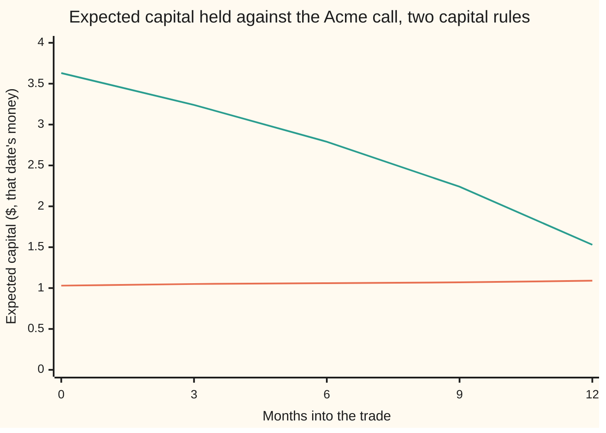

# KVA: the capital a trade ties up over its life, charged at the bank's hurdle rate

[Syllabus](../../../SYLLABUS.md) → [Financial mathematics](../../../SYLLABUS.md#w12) → [Collateral, Funding and the Rest of the XVAs](../../../SYLLABUS.md#w12-s47) → KVA

---

## General Overview

A bank buys a one-year call option on Acme shares from Northwind. Acme trades at \$100, the strike is \$100, and in the house market the call is worth **\$9.23** ([Black–Scholes call](../08-The%20Black-Scholes%20call%20and%20put/01-black-scholes-call.md)). Northwind can fail, and the price of that risk, the credit valuation adjustment, is 10.96 cents ([CVA](../46-Counterparty%20Risk%20and%20CVA/03-cva.md)).

The regulator adds a second cost. Because Northwind might fail, the bank must hold some of its shareholders' money, its **capital**, against the trade for as long as the trade is open. Under a simple rule the bank's claim on Northwind counts as \$12.92, which is 1.4 times the \$9.23, and the bank must hold 8% of that: **\$1.03** of capital. It is a cushion: losses fall on it before they reach depositors.

Shareholders do not provide cushions for free. The bank's board sets a **hurdle rate**, the yearly return shareholders are promised on money tied up in the business: 10% here. So the trade costs about 10% of \$1.03 for each year it is open, a little over 10 cents a year. Added over the trade's life and shrunk to today's money, that cost is the **capital valuation adjustment**, KVA from here on (the K is for the German *Kapital*, since CVA was taken). For this trade it is **10.23 cents**, the same size as the CVA.

**KVA is the hurdle rate times the capital the trade is expected to tie up at each future date, discounted and weighted by the chance the trade is still alive, summed over the trade's life.**

**What kind of fact this is:** a model built on two conventions: the regulator's capital rule and the board's hurdle rate are choices, not laws of markets. Inside that model the KVA integral, and its closed form for a bought option, are proved on this card in Why it works.

### The picture: the capital the trade ties up, month by month



Orange, low and flat: the simple rule, 8% of 1.4 times the call's value. It creeps up at the 5% riskless rate, because the call's average value does. Green, high and falling: the regulator's standardised rule (SA-CCR, Step 5), which adds a charge for how far the call's value could still move. With a year to go that charge is large; it shrinks as expiry nears. Same trade, same day, capital three and a half times higher under the second rule. That gap is the reason KVA is the most model-dependent of the adjustments.

---

## The formula

Notation first, in words. $T$ is the expiry, 1 year, and $t$ a date before it. $h$ is the hurdle rate. $D(t) = e^{-rt}$ is the discount factor at the riskless rate $r$. $\lambda$ ("lambda") is Northwind's hazard, its yearly default rate, and $Q(t) = e^{-\lambda t}$ the chance it is still alive at $t$. $C_0$ is today's call price. $V(t)$ is the call's value to the bank at date $t$ if nobody could fail. $\mathrm{EE}(t)$ is its average over the pricing world, the **expected exposure** ([Expected exposure over time](../46-Counterparty%20Risk%20and%20CVA/02-expected-exposure-profiles.md)). $\mathrm{EAD}(t)$, **exposure at default**, is the amount the regulator says the bank is owed for capital purposes. $K(t)$ is the capital held at date $t$: a random amount, since it depends on where Acme is by then. $\mathbb{E}[K(t)]$ is its average.

$$\mathrm{KVA} = h\int_0^T D(t)\,\mathbb{E}[K(t)]\,Q(t)\,dt$$

**Read it aloud:** the hurdle rate, times the capital expected at each date in today's money, times the chance the trade is still alive then, added up over the trade's life.

The simple capital rule:

$$K(t) = 8\% \times \mathrm{RW} \times \mathrm{EAD}(t), \qquad \mathrm{EAD}(t) = \alpha\,V(t)$$

In words: 8% of the risk-weighted exposure, and the exposure is 1.4 times what the trade is worth. The fixed part, $c = 8\% \times \mathrm{RW} \times \alpha = 0.112$, is capital per dollar of value.

For a bought option under a flat hazard the integral collapses:

$$\mathrm{KVA} = h\,c\,C_0\,\frac{1 - e^{-\lambda T}}{\lambda}$$

**Read it aloud:** the hurdle rate, times today's capital, times the survival-weighted length of the trade. For Acme: $0.10 \times 1.033425 \times 0.990066 = 0.102316$.

| Symbol | Plain meaning | In our example | Push it up and KVA… |
| --- | --- | --- | --- |
| $\mathrm{KVA}$ | the capital valuation adjustment: today's value of the trade's lifetime capital cost | \$0.102316 | — |
| $h$ | the **hurdle rate**: yearly return promised to shareholders on capital | 10% | rises in proportion |
| $K(t)$, $c$ | capital held at date $t$; capital per dollar of trade value, $8\% \times \mathrm{RW} \times \alpha$ | $c = 0.112$; \$1.033425 today | rises in proportion |
| $\mathrm{RW}$, 8% | the **risk weight**, a regulator's multiplier by type of borrower; the minimum capital ratio | 100% for an unrated company | rises in proportion |
| $\alpha$, $\mathrm{EAD}(t)$ | the regulator's multiplier on exposure ("alpha"); **exposure at default**, the capital measure of what is owed | 1.4; \$12.917808 today | rises in proportion |
| $V(t)$, $\mathrm{EE}(t)$, $C_0$, $X$ | the call's clean value at $t$; its average; today's price; its payoff at expiry | $C_0 = \$9.227006$ | rises in proportion |
| $D(t)$, $r$ | the discount factor $e^{-rt}$; the riskless rate | 5% | rises, but only through $C_0$: discounting cancels (Step 3) |
| $\lambda$, $Q(t)$, $\tau$ | Northwind's **hazard** ("lambda"), its yearly default rate; the survival chance $e^{-\lambda t}$; its default date ("tau") | 2%; survival integral 0.990066 | falls slightly: a trade that may end early ties up capital for less time |
| $T$, $t$, $dt$ | the expiry; a date, in years; a short stretch of time | $T = 1$ | rises: capital held longer |
| $\mathrm{PD}$, $\mathrm{LGD}$, $\rho$, $N$ | IRB inputs: one-year default chance; loss given default; the Basel correlation ("rho"); the bell-curve area to the left, $N^{-1}$ its inverse | 2%; 60%; 16.41% | rises with each |
| $A(t)$ | the SA-CCR **add-on**: the regulator's charge for how far the trade's value could still move | \$23.223900 today | rises |
| $R$ | Northwind's recovery, used only for the CVA comparison | 40% | no effect on KVA |

### When it holds

- **Capital is proportional to exposure.** The simple rule and the IRB rule are both a fixed number times $\mathrm{EAD}$. Under SA-CCR the add-on bends with Acme's price, the integral no longer collapses, and only the bucketed sum and the simulation remain (Step 5).
- **The trade stands alone.** Real capital is set on the bank's whole book with Northwind (the **netting set**, all trades that offset at default) and against the bank's total capital. A trade that offsets another needs less capital, sometimes negative. Pricing it alone overstates KVA for a hedge and understates it for a concentration.
- **Today's rules hold for the life of the trade.** The integral projects capital under the current rulebook. Basel has rewritten its counterparty rules several times since 2010; a ten-year swap's KVA depends on rules nobody has written yet.
- **Default is independent of Acme.** As for CVA, the survival chance multiplies the expected capital only if Northwind's failure says nothing about Acme's price ([Wrong-way risk](../46-Counterparty%20Risk%20and%20CVA/05-wrong-way-risk.md)).
- **The hurdle is a given number.** It is set by the board, not traded in a market. No hedge locks it in, so KVA cannot be replicated the way CVA can.

---

## Why it works

### Step 0: capital is money that must earn its hurdle

A bank funds itself with borrowed money and with shareholders' money. The regulator requires a minimum share of the second kind behind every risk, so that losses fall on shareholders before depositors. Shareholders accept that role only for a return. The board turns that into a rule: every dollar of capital a trade uses must earn $h$ a year. A trade that ties up $K(t)$ dollars for a short stretch $dt$ therefore costs $h\,K(t)\,dt$. KVA is the value today of that stream of costs, charged to the trade at inception so the desk does not book a profit that shareholders never receive.

### Step 1: the cost stream runs while the trade is alive

Capital is held from today until the trade ends. The call ends at expiry, or earlier if Northwind fails: at default the trade is closed out (settled at its value on that day) and the capital is released. Averaging the cost over when default comes and over where Acme goes:

$$\mathrm{KVA} = \mathbb{E}\Bigl[\int_0^{\min(\tau, T)} D(t)\,h\,K(t)\,dt\Bigr],$$

where $\tau$ ("tau") is Northwind's default date. If default is independent of Acme, the chance of still being alive at $t$ factors out as $Q(t) = e^{-\lambda t}$, and the average moves inside the integral: that is the KVA formula. The bank's own default is ignored here; a bank that can fail holds capital only while it survives, and some desks multiply in its survival too.

### Step 2: the capital rule turns value into capital

Under the simple rule, capital at date $t$ is $c\,V(t)$, with $c = 0.08 \times 1.00 \times 1.4 = 0.112$. A bought call is never worth less than zero, so $V(t)$ is also the exposure. Averages pass through a fixed multiplier: $\mathbb{E}[K(t)] = c\,\mathrm{EE}(t)$. Today that is $0.112 \times 9.227006 = \$1.033425$. The orange line in the picture is this capital at each date: it grows with $\mathrm{EE}(t)$, from \$1.03 to \$1.09 at expiry.

The two regulatory numbers do different jobs. The multiplier $\alpha = 1.4$ scales an average exposure up to a cautious one, since exposure is uncertain and concentrated. The 8% times the risk weight converts the exposure to capital: 8% is the Basel minimum ratio, and a risk weight of 100% is the standard weight for an unrated company.

### Step 3: in today's money, the capital is flat

The CVA card showed that for a bought option $D(t)\,\mathrm{EE}(t) = C_0$ at every date ([CVA](../46-Counterparty%20Risk%20and%20CVA/03-cva.md), Step 3): today's price of a traded claim is the discounted average of its later price. So $D(t)\,\mathbb{E}[K(t)] = c\,C_0$ at every date, and the integral keeps only the survival:

$$\mathrm{KVA} = h\,c\,C_0\int_0^T e^{-\lambda t}\,dt = h\,c\,C_0\,\frac{1 - e^{-\lambda T}}{\lambda}.$$

The last factor, 0.990066, is the survival-weighted length of the trade in years: a year, less the small chance Northwind fails and ends it early. So KVA is 10% of \$1.033425 for 0.990066 years: **0.102316**.

<details>
<summary>Detailed proof: from the cost stream to the closed form</summary>

Write $\mathbf{1}\{t < \tau\}$ for the switch that is 1 while Northwind is alive and 0 after. The cost stream up to $\min(\tau, T)$ is $\int_0^T \mathbf{1}\{t < \tau\}\,D(t)\,h\,K(t)\,dt$. Everything inside is non-negative, so the average can be taken inside the integral (Tonelli's theorem):
$$\mathrm{KVA} = h\int_0^T \mathbb{E}\bigl[\mathbf{1}\{t < \tau\}\,D(t)\,K(t)\bigr]\,dt.$$
Default is independent of Acme and $D(t)$ is a fixed number, so the average splits: $\mathbb{E}[\mathbf{1}\{t < \tau\}] = Q(t)$, and $\mathbb{E}[D(t)K(t)] = D(t)\,\mathbb{E}[K(t)]$. That is the KVA formula.

Under the simple rule $K(t) = c\,V(t)$ with $V(t) = e^{-r(T-t)}\,\mathbb{E}_t[X]$, where $X$ is the payoff and $\mathbb{E}_t$ averages given what is known at $t$. Then $D(t)\,\mathbb{E}[V(t)] = e^{-rt}e^{-r(T-t)}\,\mathbb{E}[\mathbb{E}_t[X]] = e^{-rT}\,\mathbb{E}[X] = C_0$, by the tower rule (averaging an average gives the plain average). Substituting and integrating $e^{-\lambda t}$ from 0 to $T$ gives $h\,c\,C_0\,(1 - e^{-\lambda T})/\lambda$.

</details>

### Step 4: KVA is a CVA with a different running rate

Put the two closed forms side by side. CVA is $(1-R)\,C_0\,(1 - e^{-\lambda T})$, which is $(1-R)\,\lambda \times C_0 \times (1 - e^{-\lambda T})/\lambda$. KVA is $h\,c \times C_0 \times (1 - e^{-\lambda T})/\lambda$. Same exposure, same survival-weighted life; only the yearly rate charged on the exposure differs. CVA charges the credit spread $(1-R)\lambda = 1.2\%$ a year. KVA charges $h\,c = 1.12\%$ a year. Their ratio is $0.0112 / 0.012 = 0.933333$, and that is why the two come out the same size: 10.23 cents against 10.96. For a riskier counterparty CVA grows with $\lambda$ while KVA under the simple rule does not; under IRB it does, through the risk weight.

### Step 5: the refined routes, IRB and SA-CCR

**IRB.** Banks with the regulator's approval replace the flat 100% risk weight with the **internal ratings-based** formula, the Vasicek one-in-a-thousand-year loss ([Vasicek's large-pool loss curve](../45-Portfolio%20Credit%20-%20Correlation%2C%20Copulas%2C%20Indices%20and%20Tranches/03-vasicek-loss-distribution-and-basel-capital.md)). Capital per dollar of exposure is

$$\mathrm{LGD}\times\Bigl[N\Bigl(\tfrac{N^{-1}(\mathrm{PD}) + \sqrt{\rho}\,N^{-1}(0.999)}{\sqrt{1-\rho}}\Bigr) - \mathrm{PD}\Bigr],$$

where $N$ is the bell-curve area to the left and $N^{-1}$ runs it backwards. Basel multiplies this by a maturity adjustment that equals exactly 1 for a one-year effective maturity, so it drops out here. Northwind's one-year default chance is 1.98% at a 2% hazard; take the rounded 2% a rating would carry, and 60% lost at default. Basel's correlation for that PD is 16.41%, the bad-year default rate 19.03%, and capital per dollar of EAD $0.60 \times (0.190259 - 0.02) = 0.102155$, against 0.08 under the simple rule. That is a risk weight of 127.69%. KVA rises in proportion, to **0.130652**.

**SA-CCR.** Basel's standard way, published in 2014, to measure EAD for derivatives is the **standardised approach for counterparty credit risk**, SA-CCR. It keeps $\alpha = 1.4$ but applies it to two pieces: the **replacement cost**, today's value $V(t)$, plus a **potential future exposure add-on** $A(t)$ for how much the value could still grow. For one bought equity call without margin, the add-on is 32% (the regulator's factor for a single stock) times a supervisory delta (the call's sensitivity to Acme, recomputed with a fixed 120% volatility over the time to expiry) times Acme's price times the square root of the remaining maturity, capped at one year and floored at ten business days. Today that is \$23.22, so the EAD is $1.4 \times (9.227006 + 23.223900) = \$45.43$, three and a half times the simple rule's \$12.92.

The add-on bends with Acme's price, through the delta, and fades with the square root of the time left. So $D(t)\,\mathbb{E}[K(t)]$ is no longer flat, the closed form fails, and the integral has to be done. Two roads do it. The first cuts the year into 52 weeks and, at each week's middle, averages the capital over every price Acme could have, by Simpson's rule (a weighted sum over thin slices of the bell curve). The second draws 100,000 random dates, each with a random Acme price, and averages the discounted capital. They give 0.263164 and 0.262747, within one standard error (0.000471) of each other.

Conventions verified 2026-09-28 against the Basel Framework (RBC20, CRE20, CRE31, CRE52): 8% minimum capital ratio, 100% weight for an unrated company, the IRB formula above, $\alpha = 1.4$, the 32% single-stock factor and the 120% supervisory volatility.

### Step 6: why KVA moves more than any other adjustment

CVA rests on a market price: Northwind's credit spread, which a CDS can hedge. KVA rests on three choices nobody can hedge: which capital rule, which hurdle, and how to charge it. Each is defensible, and each moves the number:

```
KVA on the Acme call under different choices, $ per call
SA-CCR capital rule        ██████████████████████████████████████  0.2632
IRB capital rule           ███████████████████                     0.1307
hurdle 12%                 ██████████████████                      0.1228
simple rule, hurdle 10%    ███████████████                         0.1023
capital frozen at today's  ██████████████                          0.0998
discount the cost at r + h ██████████████                          0.0974
hurdle 8%                  ████████████                            0.0819
charge only h - r = 5%     ███████                                 0.0512
```

The smallest is a fifth of the largest. "Charge only $h - r$" is a real argument: capital sits in riskless assets and earns $r$, so only the excess over $r$ is a cost. "Discount at $r + h$" is another: shareholders discount the cost stream at their own required return. "Frozen" holds capital at today's \$1.033425 instead of letting it grow with $\mathrm{EE}(t)$. The capital rule dominates. Which rule applies is set by the regulator, not by the desk.

---

## Worked numbers, by hand

The Acme call: Acme at \$100, strike \$100, riskless rate 5%, dividend yield 2%, volatility 20%, one year, bought from Northwind at a 2% hazard. Simple capital rule, hurdle 10%.

| Step | Arithmetic | Value |
| --- | --- | --- |
| clean call $C_0$ | Black-Scholes, house market | 9.227006 |
| exposure at default today | $1.4 \times 9.227006$ | 12.917808 |
| capital today | $0.08 \times 100\% \times 12.917808$ | 1.033425 |
| yearly cost of that capital | $0.10 \times 1.033425$ | 0.103342 |
| survival-weighted life | $(1 - e^{-0.02}) / 0.02$ | 0.990066 |
| **KVA** | $0.103342 \times 0.990066$ | **0.102316** |
| 52-week bucketed sum | weekly expected capital × discount × survival × hurdle, added | 0.102316 |
| simulated dates | 100,000 draws | 0.102054 |
| CVA, for scale | $0.60 \times 9.227006 \times (1 - e^{-0.02})$ | 0.109624 |

The desk should charge about 10 cents on the \$9.23 call to pay shareholders for the \$1.03 of capital it locks up for a year. Together with CVA, the Northwind trade carries 0.211940, about 21 cents, of adjustments before funding is counted.

### What breaks if you drop a piece

Same trade, correct KVA 0.102316.

| Mistake | Comes out at | What went wrong |
| --- | --- | --- |
| No survival: capital held a full year | 0.103342 | Charges for a year of capital a defaulted trade no longer needs |
| No $\alpha$: capital on the value, not 1.4 times it | 0.073083 | Drops the regulator's cushion on exposure |
| No discounting: $\mathrm{EE}(t)$ in that date's dollars | 0.104908 | Treats next year's cost as if paid today |
| Hurdle charged on the whole EAD | 1.278949 | Treats all \$12.92 of exposure as shareholders' money; only 8% of it is |

Every number in that table is printed by the checks.

---

## Code, from first principles, and it actually runs

The script prices the call, then reaches KVA by three independent roads: the closed form of Step 3; 52 weekly buckets, each averaging the capital over Acme's bell curve by Simpson's rule; and 100,000 simulated dates and prices. It computes the IRB capital with its own bell-curve area and its own inverse (a bisection root finder), and SA-CCR capital by the two integral roads. It prints every number on the card, the chart points included. Five asserts: the weekly sum against the closed form, the simulation against the closed form within four standard errors, the two SA-CCR roads against each other, the averaged payoff at expiry against $C_0$ grown at $r$, and the IRB capital against the Vasicek card's \$10.22 per \$100. Breaking the survival weight, the discounting or the price drift trips the first; breaking the Basel correlation trips the last.

### Python

```python
# KVA on the Acme call bought from Northwind: capital cost over the trade's life.
# Standard library only. The bell-curve area, its inverse, the integrator and the
# random numbers are all written here; nothing imported knows the answer.
from math import exp, log, sqrt, pi, cos

def N(x):                                   # bell-curve area left of x, positive-term erf series
    if x > 12.0: return 1.0
    if x < -12.0: return 0.0
    z = abs(x) / sqrt(2.0)
    term, total, n = z, z, 0
    while term > 1e-17 * total:
        n += 1
        term *= 2.0 * z * z / (2 * n + 1)
        total += term
    half = exp(-z * z) * total / sqrt(pi)   # erf(z) / 2
    return 0.5 + half if x >= 0 else 0.5 - half

def N_inv(u):                               # bisection root finder on N
    lo, hi = -12.0, 12.0
    for _ in range(200):
        mid = 0.5 * (lo + hi)
        lo, hi = (mid, hi) if N(mid) < u else (lo, mid)
    return 0.5 * (lo + hi)

S0, K, r, q, sig, T = 100.0, 100.0, 0.05, 0.02, 0.20, 1.0
lam, R = 0.02, 0.40                         # Northwind's hazard and recovery
h, alpha, ratio, rw = 0.10, 1.4, 0.08, 1.00 # hurdle, EAD multiplier, capital ratio, risk weight
c = ratio * rw * alpha                      # capital per $1 of exposure: 0.112

def call(S, tau):
    if tau <= 0.0: return max(S - K, 0.0)
    v = sig * sqrt(tau)
    d1 = (log(S / K) + (r - q + 0.5 * sig * sig) * tau) / v
    return S * exp(-q * tau) * N(d1) - K * exp(-r * tau) * N(d1 - v)

def addon(S, tau):                          # SA-CCR add-on for one bought equity call, unmargined
    m = max(tau, 10.0 / 250.0)              # maturity factor's input, floored at 10 business days
    if tau <= 0.0: d = 40.0 if S > K else -40.0                # delta at expiry: 1 or 0
    else: d = (log(S / K) + 0.72 * tau) / (1.2 * sqrt(tau))    # delta: time to expiry, vol 120%
    return 0.32 * N(d) * S * sqrt(min(m, 1.0))                 # supervisory factor 32%

def S_at(t, z): return S0 * exp((r - q - 0.5 * sig * sig) * t + sig * sqrt(t) * z)

def avg(f, t, n=200):                       # Simpson over the bell curve of Acme's price at t
    if t == 0.0: return f(S0, T)
    a, w = -8.0, 16.0 / n
    tot = 0.0
    for i in range(n + 1):
        z = a + i * w
        wt = 1 if i in (0, n) else (4 if i % 2 else 2)
        tot += wt * f(S_at(t, z), T - t) * exp(-0.5 * z * z)
    return tot * w / 3.0 / sqrt(2.0 * pi)

C0 = call(S0, T)
cva = (1 - R) * C0 * (1 - exp(-lam * T))
life = (1 - exp(-lam * T)) / lam            # integral of survival over the year
kva_closed = h * c * C0 * life              # road 1: the flat discounted exposure collapses it

# road 2: 52 weekly buckets, expected capital at each midpoint by Simpson
kva_wk = kva_wk_rh = kva_sa = 0.0
for i in range(52):
    t, dt = (i + 0.5) / 52.0, 1.0 / 52.0
    ee = avg(call, t)
    ea = avg(addon, t)
    w = h * exp(-(r + lam) * t) * dt
    kva_wk += w * c * ee
    kva_wk_rh += w * c * ee * exp(-h * t)   # variant: discount the cost at r + h
    kva_sa += w * c * (ee + ea)

# road 3: Monte Carlo, a uniform date and a price on that date, splitmix64 + Box-Muller
state = 20260928
def U():
    global state
    state = (state + 0x9E3779B97F4A7C15) & 0xFFFFFFFFFFFFFFFF
    x = state
    x = ((x ^ (x >> 30)) * 0xBF58476D1CE4E5B9) & 0xFFFFFFFFFFFFFFFF
    x = ((x ^ (x >> 27)) * 0x94D049BB133111EB) & 0xFFFFFFFFFFFFFFFF
    return ((x ^ (x >> 31)) >> 11) * 2.0 ** -53 + 2.0 ** -54
M = 100000
s1 = s2 = sa1 = sa2 = 0.0
for _ in range(M):
    t = U() * T
    z = sqrt(-2.0 * log(U())) * cos(2.0 * pi * U())
    S = S_at(t, z)
    base = h * exp(-(r + lam) * t) * T * c
    x, y = base * call(S, T - t), base * (call(S, T - t) + addon(S, T - t))
    s1 += x; s2 += x * x; sa1 += y; sa2 += y * y
kva_mc, kva_mc_sa = s1 / M, sa1 / M
se = sqrt((s2 / M - kva_mc ** 2) / M)
se_sa = sqrt((sa2 / M - kva_mc_sa ** 2) / M)

# the refined route: Basel IRB capital per $1 for Northwind (PD 2%, LGD 60%, M = 1)
pd, lgd = 0.02, 0.60
wgt = (1 - exp(-50 * pd)) / (1 - exp(-50))
rho = 0.12 * wgt + 0.24 * (1 - wgt)
x999 = N((N_inv(pd) + sqrt(rho) * N_inv(0.999)) / sqrt(1 - rho))
k_irb = lgd * (x999 - pd)
kva_irb = h * alpha * k_irb * C0 * life

rows = [
    ("clean call C0", C0), ("CVA, Northwind 2%, R 40%", cva),
    ("capital per $ of exposure c", c), ("EAD today 1.4 x C0", alpha * C0),
    ("capital today 0.112 x C0", c * C0), ("survival integral", life),
    ("1 KVA closed form", kva_closed), ("2 KVA 52 weekly buckets", kva_wk),
    ("3 KVA Monte Carlo", kva_mc), ("  MC standard error", se),
    ("KVA / CVA", kva_closed / cva), ("running rate, CVA (1-R) lam", (1 - R) * lam),
    ("running rate, KVA h c", h * c), ("Northwind 1-year default", 1 - exp(-lam)),
    ("IRB correlation", rho), ("IRB 99.9% default rate", x999),
    ("IRB capital per $ of EAD", k_irb), ("IRB risk weight", 12.5 * k_irb),
    ("rule: simple 8% x 100%", kva_closed), ("rule: IRB", kva_irb),
    ("rule: SA-CCR, weekly", kva_sa), ("rule: SA-CCR, Monte Carlo", kva_mc_sa),
    ("  MC standard error", se_sa), ("SA-CCR add-on today", addon(S0, T)),
    ("SA-CCR EAD today", alpha * (C0 + addon(S0, T))),
    ("hurdle 8%", 0.08 / h * kva_closed), ("hurdle 12%", 0.12 / h * kva_closed),
    ("charge h - r = 5%", (h - r) / h * kva_closed),
    ("discount at r + h, weekly", kva_wk_rh),
    ("discount at r + h, closed", h * c * C0 * (1 - exp(-(lam + h))) / (lam + h)),
    ("capital frozen at today's", h * c * C0 * (1 - exp(-(r + lam))) / (r + lam)),
    ("wrong: no survival", h * c * C0 * T), ("wrong: no alpha", h * ratio * C0 * life),
    ("wrong: no discount", h * c * C0 * (exp((r - lam) * T) - 1) / (r - lam)),
    ("wrong: hurdle on EAD itself", h * alpha * C0 * life), ("KVA + CVA", kva_closed + cva),
    ("try: hurdle 15%", 0.15 / h * kva_closed), ("try: risk weight 20%", 0.20 * kva_closed),
    ("try: hazard 10%, KVA", h * c * C0 * (1 - exp(-0.1)) / 0.1),
    ("try: hazard 10%, CVA", (1 - R) * C0 * (1 - exp(-0.1))),
]
for name, v in rows:
    print(f"{name:<30} {v:>12.6f}")
print("chart, expected capital by month (t dollars)")
for mo in (0, 3, 6, 9, 12):
    t = mo / 12.0
    print(f"  month {mo:>2}  simple {c * avg(call, t, 2000):6.2f}  SA-CCR {c * (avg(call, t, 2000) + avg(addon, t, 2000)):6.2f}")

assert abs(kva_wk - kva_closed) < 1e-7,             "weekly Simpson sum vs closed form"
assert abs(kva_mc - kva_closed) < 4 * se,           "Monte Carlo vs closed form"
assert abs(kva_mc_sa - kva_sa) < 4 * se_sa,         "SA-CCR: Monte Carlo vs weekly sum"
assert abs(avg(call, T, 2000) - C0 * exp(r * T)) < 1e-4, "payoff averaged at expiry vs C0 grown at r"
assert abs(k_irb - 0.1022) < 5e-5,                  "IRB capital vs the Vasicek card's 10.22 per 100"
print("ALL CHECKS PASS")
```

**Ran 2026-09-28 on macOS, Python 3.14.6, standard library only. All checks passed. Output, pasted from the run:**

```
clean call C0                      9.227006
CVA, Northwind 2%, R 40%           0.109624
capital per $ of exposure c        0.112000
EAD today 1.4 x C0                12.917808
capital today 0.112 x C0           1.033425
survival integral                  0.990066
1 KVA closed form                  0.102316
2 KVA 52 weekly buckets            0.102316
3 KVA Monte Carlo                  0.102054
  MC standard error                0.000325
KVA / CVA                          0.933333
running rate, CVA (1-R) lam        0.012000
running rate, KVA h c              0.011200
Northwind 1-year default           0.019801
IRB correlation                    0.164146
IRB 99.9% default rate             0.190259
IRB capital per $ of EAD           0.102155
IRB risk weight                    1.276943
rule: simple 8% x 100%             0.102316
rule: IRB                          0.130652
rule: SA-CCR, weekly               0.263164
rule: SA-CCR, Monte Carlo          0.262747
  MC standard error                0.000471
SA-CCR add-on today               23.223900
SA-CCR EAD today                  45.431268
hurdle 8%                          0.081853
hurdle 12%                         0.122779
charge h - r = 5%                  0.051158
discount at r + h, weekly          0.097383
discount at r + h, closed          0.097383
capital frozen at today's          0.099808
wrong: no survival                 0.103342
wrong: no alpha                    0.073083
wrong: no discount                 0.104908
wrong: hurdle on EAD itself        1.278949
KVA + CVA                          0.211940
try: hurdle 15%                    0.153474
try: risk weight 20%               0.020463
try: hazard 10%, KVA               0.098343
try: hazard 10%, CVA               0.526839
chart, expected capital by month (t dollars)
  month  0  simple   1.03  SA-CCR   3.63
  month  3  simple   1.05  SA-CCR   3.24
  month  6  simple   1.06  SA-CCR   2.79
  month  9  simple   1.07  SA-CCR   2.24
  month 12  simple   1.09  SA-CCR   1.53
ALL CHECKS PASS
```

### Rust

The same roads with the same random stream (splitmix64), so the simulated numbers match Python's to every printed digit.

```rust
// KVA on the Acme call bought from Northwind: capital cost over the trade's life.
// Standard library only, no crates. The bell-curve area, its inverse, the
// integrator and the random numbers are all written here.
use std::f64::consts::PI;

const S0: f64 = 100.0; const K: f64 = 100.0; const R_: f64 = 0.05; const Q: f64 = 0.02;
const SIG: f64 = 0.20; const T: f64 = 1.0;
const LAM: f64 = 0.02; const REC: f64 = 0.40;               // Northwind's hazard and recovery
const H: f64 = 0.10; const ALPHA: f64 = 1.4; const RATIO: f64 = 0.08; const RW: f64 = 1.00;

fn n_cdf(x: f64) -> f64 {                                  // positive-term erf series
    if x > 12.0 { return 1.0; }
    if x < -12.0 { return 0.0; }
    let z = x.abs() / 2f64.sqrt();
    let (mut term, mut total, mut n) = (z, z, 0.0);
    while term > 1e-17 * total {
        n += 1.0;
        term *= 2.0 * z * z / (2.0 * n + 1.0);
        total += term;
    }
    let half = (-z * z).exp() * total / PI.sqrt();         // erf(z) / 2
    if x >= 0.0 { 0.5 + half } else { 0.5 - half }
}

fn n_inv(u: f64) -> f64 {                                  // bisection root finder on N
    let (mut lo, mut hi) = (-12.0, 12.0);
    for _ in 0..200 {
        let mid = 0.5 * (lo + hi);
        if n_cdf(mid) < u { lo = mid; } else { hi = mid; }
    }
    0.5 * (lo + hi)
}

fn call(s: f64, tau: f64) -> f64 {
    if tau <= 0.0 { return (s - K).max(0.0); }
    let v = SIG * tau.sqrt();
    let d1 = ((s / K).ln() + (R_ - Q + 0.5 * SIG * SIG) * tau) / v;
    s * (-Q * tau).exp() * n_cdf(d1) - K * (-R_ * tau).exp() * n_cdf(d1 - v)
}

fn addon(s: f64, tau: f64) -> f64 {                        // SA-CCR add-on, bought equity call
    let m = tau.max(10.0 / 250.0);                         // maturity factor, floored at 10 days
    let d = if tau <= 0.0 { if s > K { 40.0 } else { -40.0 } }   // delta at expiry: 1 or 0
            else { ((s / K).ln() + 0.72 * tau) / (1.2 * tau.sqrt()) };   // time to expiry, vol 120%
    0.32 * n_cdf(d) * s * m.min(1.0).sqrt()
}

fn s_at(t: f64, z: f64) -> f64 { S0 * ((R_ - Q - 0.5 * SIG * SIG) * t + SIG * t.sqrt() * z).exp() }

fn avg(f: fn(f64, f64) -> f64, t: f64, n: usize) -> f64 { // Simpson over the bell curve
    if t == 0.0 { return f(S0, T); }
    let (a, w) = (-8.0, 16.0 / n as f64);
    let mut tot = 0.0;
    for i in 0..=n {
        let z = a + i as f64 * w;
        let wt = if i == 0 || i == n { 1.0 } else if i % 2 == 1 { 4.0 } else { 2.0 };
        tot += wt * f(s_at(t, z), T - t) * (-0.5 * z * z).exp();
    }
    tot * w / 3.0 / (2.0 * PI).sqrt()
}

struct Rng(u64);
impl Rng {                                                 // splitmix64, same stream as Python
    fn u(&mut self) -> f64 {
        self.0 = self.0.wrapping_add(0x9E3779B97F4A7C15);
        let mut x = self.0;
        x = (x ^ (x >> 30)).wrapping_mul(0xBF58476D1CE4E5B9);
        x = (x ^ (x >> 27)).wrapping_mul(0x94D049BB133111EB);
        ((x ^ (x >> 31)) >> 11) as f64 * 2f64.powi(-53) + 2f64.powi(-54)
    }
}

fn main() {
    let c = RATIO * RW * ALPHA;                            // capital per $1 of exposure
    let c0 = call(S0, T);
    let cva = (1.0 - REC) * c0 * (1.0 - (-LAM * T).exp());
    let life = (1.0 - (-LAM * T).exp()) / LAM;
    let kva_closed = H * c * c0 * life;                    // road 1

    let (mut kva_wk, mut kva_wk_rh, mut kva_sa) = (0.0, 0.0, 0.0);   // road 2
    for i in 0..52 {
        let (t, dt) = ((i as f64 + 0.5) / 52.0, 1.0 / 52.0);
        let ee = avg(call, t, 200);
        let ea = avg(addon, t, 200);
        let w = H * (-(R_ + LAM) * t).exp() * dt;
        kva_wk += w * c * ee;
        kva_wk_rh += w * c * ee * (-H * t).exp();
        kva_sa += w * c * (ee + ea);
    }

    let mut rng = Rng(20260928);                           // road 3
    let m = 100000usize;
    let (mut s1, mut s2, mut sa1, mut sa2) = (0.0, 0.0, 0.0, 0.0);
    for _ in 0..m {
        let t = rng.u() * T;
        let z = (-2.0 * rng.u().ln()).sqrt() * (2.0 * PI * rng.u()).cos();
        let s = s_at(t, z);
        let base = H * (-(R_ + LAM) * t).exp() * T * c;
        let (x, y) = (base * call(s, T - t), base * (call(s, T - t) + addon(s, T - t)));
        s1 += x; s2 += x * x; sa1 += y; sa2 += y * y;
    }
    let mf = m as f64;
    let (kva_mc, kva_mc_sa) = (s1 / mf, sa1 / mf);
    let se = ((s2 / mf - kva_mc * kva_mc) / mf).sqrt();
    let se_sa = ((sa2 / mf - kva_mc_sa * kva_mc_sa) / mf).sqrt();

    let (pd, lgd) = (0.02f64, 0.60);                       // Basel IRB, M = 1
    let wgt = (1.0 - (-50.0 * pd).exp()) / (1.0 - (-50.0f64).exp());
    let rho = 0.12 * wgt + 0.24 * (1.0 - wgt);
    let x999 = n_cdf((n_inv(pd) + rho.sqrt() * n_inv(0.999)) / (1.0 - rho).sqrt());
    let k_irb = lgd * (x999 - pd);
    let kva_irb = H * ALPHA * k_irb * c0 * life;

    let rows: Vec<(&str, f64)> = vec![
        ("clean call C0", c0), ("CVA, Northwind 2%, R 40%", cva),
        ("capital per $ of exposure c", c), ("EAD today 1.4 x C0", ALPHA * c0),
        ("capital today 0.112 x C0", c * c0), ("survival integral", life),
        ("1 KVA closed form", kva_closed), ("2 KVA 52 weekly buckets", kva_wk),
        ("3 KVA Monte Carlo", kva_mc), ("  MC standard error", se),
        ("KVA / CVA", kva_closed / cva), ("running rate, CVA (1-R) lam", (1.0 - REC) * LAM),
        ("running rate, KVA h c", H * c), ("Northwind 1-year default", 1.0 - (-LAM).exp()),
        ("IRB correlation", rho), ("IRB 99.9% default rate", x999),
        ("IRB capital per $ of EAD", k_irb), ("IRB risk weight", 12.5 * k_irb),
        ("rule: simple 8% x 100%", kva_closed), ("rule: IRB", kva_irb),
        ("rule: SA-CCR, weekly", kva_sa), ("rule: SA-CCR, Monte Carlo", kva_mc_sa),
        ("  MC standard error", se_sa), ("SA-CCR add-on today", addon(S0, T)),
        ("SA-CCR EAD today", ALPHA * (c0 + addon(S0, T))),
        ("hurdle 8%", 0.08 / H * kva_closed), ("hurdle 12%", 0.12 / H * kva_closed),
        ("charge h - r = 5%", (H - R_) / H * kva_closed),
        ("discount at r + h, weekly", kva_wk_rh),
        ("discount at r + h, closed", H * c * c0 * (1.0 - (-(LAM + H)).exp()) / (LAM + H)),
        ("capital frozen at today's", H * c * c0 * (1.0 - (-(R_ + LAM)).exp()) / (R_ + LAM)),
        ("wrong: no survival", H * c * c0 * T), ("wrong: no alpha", H * RATIO * c0 * life),
        ("wrong: no discount", H * c * c0 * (((R_ - LAM) * T).exp() - 1.0) / (R_ - LAM)),
        ("wrong: hurdle on EAD itself", H * ALPHA * c0 * life), ("KVA + CVA", kva_closed + cva),
        ("try: hurdle 15%", 0.15 / H * kva_closed), ("try: risk weight 20%", 0.20 * kva_closed),
        ("try: hazard 10%, KVA", H * c * c0 * (1.0 - (-0.1f64).exp()) / 0.1),
        ("try: hazard 10%, CVA", (1.0 - REC) * c0 * (1.0 - (-0.1f64).exp())),
    ];
    for (name, v) in &rows { println!("{:<30} {:>12.6}", name, v); }
    println!("chart, expected capital by month (t dollars)");
    for mo in [0, 3, 6, 9, 12] {
        let t = mo as f64 / 12.0;
        let (e, a) = (avg(call, t, 2000), avg(addon, t, 2000));
        println!("  month {:>2}  simple {:6.2}  SA-CCR {:6.2}", mo, c * e, c * (e + a));
    }

    assert!((kva_wk - kva_closed).abs() < 1e-7, "weekly Simpson sum vs closed form");
    assert!((kva_mc - kva_closed).abs() < 4.0 * se, "Monte Carlo vs closed form");
    assert!((kva_mc_sa - kva_sa).abs() < 4.0 * se_sa, "SA-CCR: Monte Carlo vs weekly sum");
    assert!((avg(call, T, 2000) - c0 * (R_ * T).exp()).abs() < 1e-4, "payoff at expiry vs C0 grown at r");
    assert!((k_irb - 0.1022).abs() < 5e-5, "IRB capital vs the Vasicek card's 10.22 per 100");
    println!("ALL CHECKS PASS");
}
```

**Ran 2026-09-28 on macOS, rustc 1.98.1, no crates. All checks passed. Output, pasted from the run:**

```
clean call C0                      9.227006
CVA, Northwind 2%, R 40%           0.109624
capital per $ of exposure c        0.112000
EAD today 1.4 x C0                12.917808
capital today 0.112 x C0           1.033425
survival integral                  0.990066
1 KVA closed form                  0.102316
2 KVA 52 weekly buckets            0.102316
3 KVA Monte Carlo                  0.102054
  MC standard error                0.000325
KVA / CVA                          0.933333
running rate, CVA (1-R) lam        0.012000
running rate, KVA h c              0.011200
Northwind 1-year default           0.019801
IRB correlation                    0.164146
IRB 99.9% default rate             0.190259
IRB capital per $ of EAD           0.102155
IRB risk weight                    1.276943
rule: simple 8% x 100%             0.102316
rule: IRB                          0.130652
rule: SA-CCR, weekly               0.263164
rule: SA-CCR, Monte Carlo          0.262747
  MC standard error                0.000471
SA-CCR add-on today               23.223900
SA-CCR EAD today                  45.431268
hurdle 8%                          0.081853
hurdle 12%                         0.122779
charge h - r = 5%                  0.051158
discount at r + h, weekly          0.097383
discount at r + h, closed          0.097383
capital frozen at today's          0.099808
wrong: no survival                 0.103342
wrong: no alpha                    0.073083
wrong: no discount                 0.104908
wrong: hurdle on EAD itself        1.278949
KVA + CVA                          0.211940
try: hurdle 15%                    0.153474
try: risk weight 20%               0.020463
try: hazard 10%, KVA               0.098343
try: hazard 10%, CVA               0.526839
chart, expected capital by month (t dollars)
  month  0  simple   1.03  SA-CCR   3.63
  month  3  simple   1.05  SA-CCR   3.24
  month  6  simple   1.06  SA-CCR   2.79
  month  9  simple   1.07  SA-CCR   2.24
  month 12  simple   1.09  SA-CCR   1.53
ALL CHECKS PASS
```

> [!TIP]
> **Try changing**
> - **Hurdle to 15%.** Guess first. KVA is proportional to the hurdle: 0.153474.
> - **Northwind's hazard to 10%.** Guess first. Under the simple rule only the survival-weighted life moves, so KVA falls, to 0.098343. CVA rises nearly fivefold, to 0.526839. A riskier counterparty lowers simple-rule KVA; only a rule that prices the counterparty's credit, such as IRB, makes it rise.
> - **Risk weight to 20%**, the standardised weight for a bank rated AA. Guess first. KVA falls in proportion, to 0.020463.

---

## The usual mistake

> [!warning]
> **Reading KVA as a market price.** CVA can be hedged: buy protection on Northwind and the CVA's moves are offset. KVA cannot. Nobody sells a contract that pays the board's hurdle rate. The number is a charge a bank sets on itself so that a trade is judged on its return to shareholders. Two banks with different rules and hurdles quote different KVA on the same trade, and both are right by their own rules. On this call the defensible range runs from 0.0512 to 0.2632.
>
> - **Charging the hurdle on the exposure.** Capital is 8% of risk-weighted EAD, not EAD. Charging 10% on \$12.92 gives 1.278949, twelve and a half times too much.
> - **Forgetting the call ages.** Under SA-CCR the add-on fades as expiry nears. Holding today's \$3.63 of capital for the whole year overstates the cost; the expected capital falls to \$1.53 by expiry.
> - **Stacking CVA capital on top without saying so.** Basel also charges capital against moves in CVA itself. That capital belongs in KVA too; leaving it out understates KVA.
> - **Ignoring collateral.** A margin agreement cuts EAD and with it the capital ([Collateral](01-collateral-and-the-residual-exposure.md)). KVA on a collateralised trade computed from the uncollateralised exposure is too high.

---

## Where you meet it in real life

- **Trade pricing at dealer banks.** Many large dealers quote a client price that includes KVA alongside CVA, FVA and MVA ([FVA](02-fva.md), [MVA](03-mva.md)). Long-dated uncollateralised swaps with companies carry the largest charges.
- **Clearing and collateral choices.** A trade cleared through a central counterparty draws a far lower risk weight. Part of the case for clearing, and for signing a margin agreement, is the KVA it saves.
- **Return on capital targets.** When a bank's board raises its return target, KVA rises across the book at once, with no change in any market.
- **Regulatory change.** The switch from the older current exposure method to SA-CCR moved capital on option trades, and with it KVA, before a single price changed.

> **Say it back**
> Regulators make a bank hold shareholders' money against each trade, and shareholders want a return on it. KVA is that return, charged over the trade's life: hurdle rate times expected capital, discounted, weighted by the trade's survival. For a bought option under a simple rule it collapses to hurdle times today's capital times the survival-weighted life: 10.23 cents on the Acme call. That is the size of the CVA, because both charge a running rate on the same flat exposure. Change the capital rule or the hurdle convention and KVA moves from 5 to 26 cents, which is why it is the least market-bound adjustment.

---

## What this builds on

- [MVA](03-mva.md): the same shape, a resource the trade uses at each date, charged at a rate and integrated over the life with survival; there the resource is initial margin, here capital.
- [Vasicek's large-pool loss curve](../45-Portfolio%20Credit%20-%20Correlation%2C%20Copulas%2C%20Indices%20and%20Tranches/03-vasicek-loss-distribution-and-basel-capital.md): the Basel IRB capital formula of Step 5, with its correlation and 12.5 risk-weight factor.

## Where this goes next

- [Putting the adjustments together](05-the-xva-desk-view.md): CVA, FVA, MVA and KVA added on one trade, and where they overlap.

This card prices capital alone; what it leaves open is whether the capital itself can fund the trade, and so how much of KVA and FVA is the same cost counted twice.

---

## Sources

Verified 2026-09-28: every link below resolves to the publisher's page.

- Green, Andrew, and Chris Kenyon. *KVA: Capital Valuation Adjustment* (2014). [arXiv:1405.0515](https://arxiv.org/abs/1405.0515). Adds the cost of capital to the replication argument for CVA and FVA, with the capital projected under Basel rules; the source of the KVA integral.
- Basel Committee on Banking Supervision. *The standardised approach for measuring counterparty credit risk exposures* (March 2014). [BIS page](https://www.bis.org/publ/bcbs279.htm). SA-CCR: $\alpha = 1.4$, replacement cost plus add-on, the 32% equity factor, the 120% supervisory volatility and the maturity factor used in Step 5.
- Basel Committee on Banking Supervision. *An Explanatory Note on the Basel II IRB Risk Weight Functions* (July 2005). [BIS page](https://www.bis.org/bcbs/irbriskweight.htm). The IRB capital formula, its correlation and its maturity adjustment.
