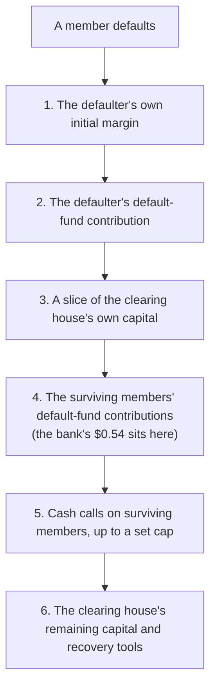
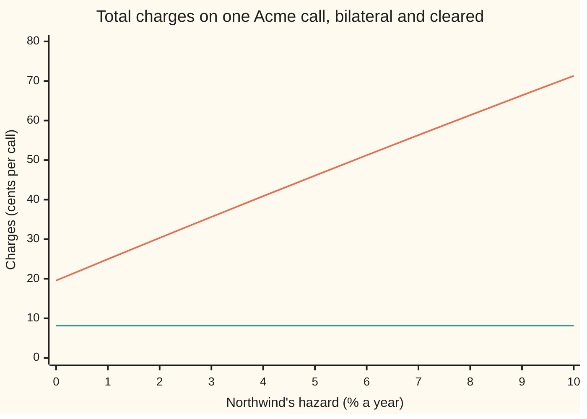

# Putting the adjustments together: clean price minus CVA plus DVA minus FVA, MVA and KVA, what overlaps, and who charges whom

[Syllabus](../../../SYLLABUS.md) → [Financial mathematics](../../../SYLLABUS.md#w12) → [Collateral, Funding and the Rest of the XVAs](../../../SYLLABUS.md#w12-s47) → Putting the adjustments together

---

## General Overview

A bank buys a one-year call option on Acme shares from Northwind, a company that can fail. Acme trades at \$100 and the strike is \$100. In the house market the call is worth **\$9.23** if the seller is certain to pay and nothing about the trade costs the bank money to carry. That number is the **clean price**.

Three earlier cards each took a slice off it. Northwind might fail before paying: the credit charge is about 11 cents ([CVA](../46-Counterparty%20Risk%20and%20CVA/03-cva.md)). The bank borrows the \$9.23 premium at its own unsecured rate, above the rate the clean price assumes: the funding charge is about 9 cents ([FVA](02-fva.md)). Regulators make the bank hold shareholders' money against the trade, and shareholders want a return on it: the capital charge is about 10 cents ([KVA](04-kva.md)). Put together, the bank should pay no more than **\$8.92**.

This card does the assembly. It lines the pieces up in one formula, finds the two places where pieces count the same money twice, and prices the same call a second way: facing a clearing house instead of Northwind. There, the credit and funding charges all but vanish, and two new ones take their place: the cost of margin posted up front, and a contribution to the clearing house's shared loss fund. The cleared call costs the bank 8 cents in charges; the bilateral one costs 30.

**The price a desk quotes is the clean price minus one charge for each real cost the clean price ignores, credit, funding, margin and capital, with each cost counted exactly once and charged by the part of the bank that bears it.**

**What kind of fact this is:** a convention: the additive stack is how desks and accounts organise these costs, not a theorem. Each piece inside it is a model with its own card; the one identity this card proves, that one's own credit spread shows up in both DVA and the funding benefit, is proved in Why it works.

### The picture: from clean price to desk price

```
Charges on one Acme call, dollars (each █ = $0.01)
bilateral, facing Northwind
  CVA            ███████████                       $0.1096
  FVA            █████████                         $0.0914
  KVA            ██████████                        $0.1023
  total          ██████████████████████████████    $0.3033
cleared, facing a clearing house
  MVA            ███                               $0.0272
  default fund   █████                             $0.0544
  total          ████████                          $0.0816
```

DVA and MVA are zero on the bilateral trade, and CVA and FVA near zero on the cleared one, so they draw no bar. The bilateral charges are three near-equal slices. That is no coincidence: Step 2 shows all three are a rate times the same number.

---

## The formula

Notation first, in words. Each adjustment has a three-letter name ending in VA, "valuation adjustment", and the family is called **XVA**. The **exposure** $\mathrm{EE}(t)$ is the average amount Northwind would owe the bank at date $t$, and $D(t) = e^{-rt}$ shrinks a dollar at $t$ back to today. $Q(t)$ is the chance Northwind is still alive at $t$. Their product, added up over the year, is the **exposure annuity** $A_E$: the average amount at stake, in today's dollars, over the days the trade is alive.

$$V_{\text{adj}} = C_0 - \mathrm{CVA} + \mathrm{DVA} - \mathrm{FVA} - \mathrm{MVA} - \mathrm{KVA}$$

**Read it aloud:** the desk price is the clean price, less the expected loss from the other side's default, plus the expected saving from the bank's own, less the costs of funding the trade, funding its margin, and holding capital against it.

For the uncollateralised call bought from Northwind, three of the charges are a rate times one annuity, and two are zero:

$$A_E = \int_0^T D(t)\,\mathrm{EE}(t)\,Q(t)\,dt, \qquad \mathrm{CVA} = (1-R)\,\lambda\,A_E, \quad \mathrm{FVA} = s_F\,A_E, \quad \mathrm{KVA} = h\,k\,A_E.$$

DVA is zero because the bank never owes Northwind anything: it paid the whole premium on day one. MVA is zero because no initial margin changes hands on an uncollateralised trade.

Cleared, the stack keeps only the costs a clearing house brings:

$$V_{\text{clr}} = C_0 - \mathrm{MVA} - \mathrm{DFC}, \qquad \mathrm{MVA} = s_{IM}\,\mathrm{IM}\,T, \quad \mathrm{DFC} = h\,f\,\mathrm{IM}\,T.$$

| Symbol | Plain meaning | In our example | Push it up and the desk price… |
| --- | --- | --- | --- |
| $C_0$ | the clean price: Black–Scholes, riskless counterparty, funded at the riskless rate | \$9.227006 | rises one for one |
| $V_{\text{adj}}$, $V_{\text{clr}}$ | the desk price, bilateral and cleared | \$8.923712; \$9.145418 | — |
| $\mathrm{CVA}$, $\mathrm{DVA}$ | credit valuation adjustment (the other side's default); debit valuation adjustment (the bank's own) | 0.109624; 0 | falls with CVA, rises with DVA |
| $\mathrm{FVA}$, $s_F$ | funding valuation adjustment; the bank's unsecured funding spread over the riskless rate | 0.091353; 1% | falls |
| $\mathrm{MVA}$, $\mathrm{IM}$, $s_{IM}$ | margin valuation adjustment; initial margin, cash posted up front and held for the trade's life; the spread paid to fund it | 0.027196; \$5.439166; 0.5% | falls |
| $\mathrm{KVA}$, $h$, $k$ | capital valuation adjustment; the **hurdle rate** shareholders demand on capital; capital held per dollar of exposure | 0.102316; 10%; 0.112 | falls |
| $A_E$, $D(t)$, $\mathrm{EE}(t)$ | the exposure annuity; the discount factor; the expected exposure at $t$ | 9.135348; $e^{-0.05t}$; $D(t)\,\mathrm{EE}(t) = C_0$ for a bought call | the charges rise in proportion |
| $\lambda$, $Q(t)$ | Northwind's **hazard**, its yearly default rate among survivors ("lambda"); its survival chance $e^{-\lambda t}$ | 2% | falls: more CVA, slightly less FVA and KVA per year alive |
| $R$ | recovery: the fraction of a claim collected after a default | 40% | rises: less lost |
| $\mathrm{DFC}$, $f$ | cost of the default-fund contribution; the contribution as a share of initial margin | 0.054392; 10% | falls |
| $\lambda_B$, $\tau_B$, $\mathrm{FBA}$ | the bank's own hazard; its default date; funding benefit adjustment, the saving from holding a liability instead of borrowing | 1/60; 0.091505 on the sold call | — |
| $S$, $K$, $r$, $q$, $\sigma$, $T$, $t$, $\Delta$, $z_{99}$ | Acme's price, the strike, riskless rate, dividend yield, volatility, expiry, a date; the call's **delta** (dollars of value per dollar of Acme); the 99% point of the bell curve | \$100, \$100, 5%, 2%, 20%, 1 year; 0.586851; 2.326348 | through $C_0$ and $\mathrm{IM}$ |

The capital per dollar is $k = 8\% \times 100\% \times 1.4$: the regulatory minimum of 8% of risk-weighted assets, a 100% risk weight for a corporate like Northwind, and the multiplier 1.4 that turns expected exposure into **exposure at default**, the amount the rules count. The margin is a 99% ten-day move priced by delta:

$$\mathrm{IM} = \Delta\,S\,\sigma\,\sqrt{10/252}\;z_{99}.$$

In words: how far the call's value could fall in ten trading days, 99 times out of 100.

### When it holds

- **The pieces add.** The stack treats each cost as separate. Where two pieces price the same money, adding them double counts; Step 3 finds the two places this happens and says which one to drop.
- **Defaults independent of Acme.** Every charge multiplies average exposure by a default or survival chance. If Northwind tends to fail when the call is worth most, CVA is larger ([Wrong-way risk](../46-Counterparty%20Risk%20and%20CVA/05-wrong-way-risk.md)).
- **Flat rates and a simple capital rule.** Hazard, spreads and hurdle are constants and capital is proportional to exposure. Real capital rules have floors, netting and a separate charge for CVA swings; the stack keeps its shape, the numbers move.
- **Margin fixed at its opening size.** The cleared MVA holds initial margin at \$5.44 for the whole year. In fact it shrinks and grows with the call's delta; [MVA](03-mva.md) prices the full profile.

---

## Why it works

### Step 0: each charge is the price of a cost the clean price assumed away

Black–Scholes prices the call as if the seller always pays, the bank borrows at the riskless rate, and the trade uses no one's capital. None is true for a bank. Each false assumption has a price, and each adjustment removes one. The stack is the clean price corrected, one broken assumption at a time.

### Step 1: one number carries most of the stack

Every bilateral charge accrues on the amount at stake while the trade is alive. Credit loss accrues at rate $(1-R)\lambda$ on what Northwind owes. Funding costs $s_F$ a year on the premium borrowed, which is the call's value. Capital costs $h$ a year on $k$ times the exposure. Each is a rate times the same running amount, weighted by survival and discounted. That weighted, discounted sum is $A_E$.

For a bought call, $D(t)\,\mathrm{EE}(t)$ does not change with $t$: the average value of the call at any date, discounted back, is today's price, because the pricing world makes discounted prices drift neither up nor down ([CVA](../46-Counterparty%20Risk%20and%20CVA/03-cva.md), Step 3). So

$$A_E = C_0\int_0^T e^{-\lambda t}\,dt = C_0\,\frac{1-e^{-\lambda T}}{\lambda} = 9.135348.$$

The checks confirm it a second way: 52 weeks, each week's discounted exposure found by averaging the call's value over every price Acme could have that week (800 Simpson slices across the bell curve), then added. They get 9.135347.

### Step 2: the bilateral stack is one rate times one annuity

With the common annuity in hand:

$$C_0 - V_{\text{adj}} = \bigl[(1-R)\lambda + s_F + h\,k\bigr]\,A_E = (0.012 + 0.010 + 0.0112)\times 9.135348 = 0.303294.$$

Credit costs 1.2% a year on the amount at stake, funding 1%, capital 1.12%. Three near-equal rates make the overview's three near-equal bars. An all-in spread on the exposure annuity shows at a glance which charge dominates.

### Step 3: the two overlaps

**DVA against the funding benefit.** Turn the trade round: Northwind buys the call and the bank sells it. The bank now owes, and takes in \$9.23 of premium that it need not borrow. Two adjustments claim that position.

- **DVA**: the bank may fail and pay only 40 cents in the dollar of what it owes. Priced like a CVA from the other side, it is worth $(1-R)\,\lambda_B\,A_E^B$, where $A_E^B$ uses the bank's own survival ([DVA](../46-Counterparty%20Risk%20and%20CVA/04-dva-and-bilateral-cva.md)).
- **FBA**: the premium replaces borrowing at spread $s_F$, a saving of $s_F\,A_E^B$.

The bank's unsecured spread is the market's price of its default: lenders charge $s_F = (1-R)\lambda_B$ to be paid for the chance of losing $1-R$. With $s_F = 1\%$ and $R = 40\%$ that makes $\lambda_B = 1/60$ a year, and the two formulas are the same number:

$$\mathrm{DVA} = (1-R)\,\lambda_B\,A_E^B = s_F\,A_E^B = \mathrm{FBA} = 0.091505.$$

The checks reach it by two weightings in the 52-week grid, one by the chance the bank defaults in each week, one by its chance of surviving to mid-week, and both print 0.091505. Counting both, a desk would credit itself 0.183011 for a single benefit: the bank's credit spread, collected once when it borrows less.

<details>
<summary>Detailed proof: DVA and FBA are the same money</summary>

Let the bank owe $V(t) \ge 0$ to Northwind at each date and let its default time be $\tau_B$, with constant hazard $\lambda_B$. DVA is the average, discounted, of the fraction it fails to pay: $(1-R)\,\mathbb{E}[D(\tau_B)V(\tau_B);\ \tau_B \le T] = (1-R)\int_0^T D(t)\,\mathbb{E}[V(t)]\,\lambda_B e^{-\lambda_B t}\,dt$, using independence.

FBA is the spread saved on each dollar not borrowed, for as long as the bank is alive to borrow: $s_F\int_0^T D(t)\,\mathbb{E}[V(t)]\,e^{-\lambda_B t}\,dt$.

Both integrals are the same annuity $A_E^B$, times $(1-R)\lambda_B$ and $s_F$. A lender to the bank breaks even when the spread pays for the expected loss: over a short stretch of time the lender earns the spread for that stretch and loses $1-R$ with chance $\lambda_B$ times its length, so $s_F = (1-R)\lambda_B$. Then DVA = FBA exactly. When the bank's spread also carries a liquidity part above its default risk, FBA exceeds DVA by that part alone, and only that part is new.

</details>

The fix in practice: count the bank's own spread once. Accounting fair value keeps DVA; a desk that also books a funding benefit takes it net of the own-credit part.

**KVA against CVA capital.** Capital comes in two layers. One covers Northwind defaulting outright: that is the $k$ on this card. The other covers the CVA itself swinging in value as Northwind's credit spread moves, a separate regulatory charge (the basic and standardised approaches, BA-CVA and SA-CVA, [CVA risk numbers](../46-Counterparty%20Risk%20and%20CVA/06-cva-risk-numbers-and-hedging.md)). When the CVA desk buys credit protection on Northwind to hedge its CVA, that second layer shrinks. The overlap has two edges:

- The CVA desk pays for the hedge, and that payment is inside what it charges as CVA. KVA must then be charged on capital *after* the hedge. Charging KVA on unhedged CVA capital and also paying for the hedge prices the same risk twice.
- CVA already books the expected default loss. Capital is for the unexpected part. Basel's default-risk rules let a bank reduce the exposure it holds capital against by CVA already written off, so the same dollar is not both reserved and capitalised.

### Step 4: clearing moves the costs, it does not remove them

Now the same call faces a **clearing house** (a central counterparty, CCP: an institution that stands between the two sides of every trade, buying from each seller and selling to each buyer). Three things change.

- **Variation margin** moves every day by the change in the call's value, so the clearing house never owes the bank more than a day's move. Under futures-style margining, no premium changes hands at the start either: the call's value arrives as margin. So there is almost nothing to lose in a default, and nothing to fund. CVA and FVA go to near zero.
- **Initial margin** is posted by the bank and held against a ten-day adverse move. The bank must borrow it: $\mathrm{MVA} = 0.005 \times 5.439166 = 0.027196$. The clearing house is treated as unable to fail, so no survival weight applies; facing Northwind, [MVA](03-mva.md) weights the same margin by survival and gets 0.026926.
- **Default-fund contribution**: every member pays into a shared pool that absorbs losses beyond a defaulter's own margin. The bank's share here is taken as 10% of its initial margin, \$0.543917, and is charged at the hurdle rate because it is capital at risk: $\mathrm{DFC} = 0.054392$.

The pool sits in a fixed order of who loses first, the **default waterfall**:



The bank's contribution is lost only after the defaulter's resources and the clearing house's own slice are gone. That order is why the contribution is priced as capital at a hurdle rate, not as expected loss: losses reach it rarely, but when they do they arrive in a crisis.

The cleared charges total 0.081587, the bilateral 0.303294. Cleared, the call is worth 0.221706 more to the bank. The gap widens with Northwind's hazard, because CVA grows with it and the cleared charges do not:



Orange, rising: bilateral CVA + FVA + KVA. Even a counterparty that cannot fail leaves 19.56 cents of funding and capital charges. Green, flat at 8.16: cleared MVA plus the default-fund cost, which do not depend on Northwind at all.

### Step 5: reading a bank's XVA disclosure

A bank's annual report shows the adjustments as reserves against the clean value of its derivatives, and the year's changes as profit or loss. Three readings follow from the steps above.

- **A reserve is a stock, a charge is a flow.** The CVA line on the balance sheet is the sum over all trades of numbers like 0.109624. The income-statement line is how much that sum moved in the year, from new trades, ageing trades and moving spreads.
- **DVA rises when the bank gets riskier.** On the sold call, if the bank's own spread widens from 100 to 200 basis points, DVA rises from 0.091505 to 0.181498: a gain of 0.089993 per call, booked because the bank became more likely to fail. Reports usually show it separately for that reason, and regulators strip it out of capital.
- **Not every adjustment is in the accounts.** CVA, DVA and, at most large dealers, FVA sit in reported fair value. KVA is rarely booked; it lives in trade pricing and in return-on-capital figures. A disclosure that shows no KVA does not mean the desk charged none.

Conventions verified 2026-09-28 against the Sources: DVA sits in accounting fair value and is removed from regulatory capital; CVA-risk capital uses BA-CVA or SA-CVA (Basel revisions of July 2020); the default-waterfall order follows the CPMI–IOSCO principles, and each clearing house's rulebook sets its own details.

The alternative route to the whole stack is one pricing equation with every cost written in as a cash flow, solved at once (Burgard and Kjaer's replication approach). It gives the same pieces when they do not interact; this card keeps the pieces separate because each is charged by a different desk.

---

## Worked numbers, by hand

The bilateral trade: Acme call, $S = K = 100$, $r = 5\%$, $q = 2\%$, $\sigma = 20\%$, $T = 1$; Northwind $\lambda = 2\%$, $R = 40\%$; $s_F = 1\%$, $h = 10\%$, $k = 0.112$.

| Step | Arithmetic | Value |
| --- | --- | --- |
| clean price $C_0$ | Black–Scholes | 9.227006 |
| exposure annuity $A_E$ | $9.227006 \times (1 - e^{-0.02})/0.02$ | 9.135348 |
| CVA | $0.6 \times 0.02 \times 9.135348$ | 0.109624 |
| DVA | the bank owes nothing | 0 |
| FVA | $0.01 \times 9.135348$ | 0.091353 |
| MVA | no initial margin | 0 |
| KVA | $0.10 \times 0.112 \times 9.135348$ | 0.102316 |
| total charges | $0.0332 \times 9.135348$ | 0.303294 |
| **desk price, bilateral** | $9.227006 - 0.303294$ | **\$8.923712** |
| initial margin | $0.586851 \times 100 \times 0.20 \times \sqrt{10/252} \times 2.326348$ | 5.439166 |
| MVA, cleared | $0.005 \times 5.439166$ | 0.027196 |
| default-fund cost | $0.10 \times (0.10 \times 5.439166)$ | 0.054392 |
| **desk price, cleared** | $9.227006 - 0.027196 - 0.054392$ | **\$9.145418** |

In round figures, $9.227 - 0.110 + 0 - 0.091 - 0 - 0.10 \approx 8.93$; at full precision the rounding of KVA falls away and the price is \$8.92. Northwind should be quoted no more than that for a call whose textbook price is \$9.23: 30 cents of real costs, each owed to a different part of the bank. The same call through a clearing house costs 8 cents.

### What breaks when a piece is dropped

| Mistake | Comes out at | What went wrong |
| --- | --- | --- |
| Count DVA and FBA both, on the sold call | benefit 0.183011, not 0.091505 | the bank's own credit spread credited twice |
| Put the 6% funding rate into Black–Scholes | 9.728524, above the clean 9.227006 | funding is a cost, but a higher rate in the pricing world raises Acme's drift and makes the call dearer |
| Charge credit, funding and capital for the full year regardless of survival | 8.920669, not 8.923712 | charges run after Northwind has gone; small here, large for long trades with weak counterparties |
| Use full revaluation for margin but delta for MVA, or the reverse | margin 4.558428 or 5.439166 | two margin models, two MVAs; a bought call's curvature cushions its fall |

---

## Code, from first principles, and it actually runs

The script prices the call by the Black–Scholes formula and again as an average payoff over the bell curve. It builds the exposure annuity two ways, closed form and 52 weekly buckets with each week's exposure integrated over Acme's price, and assembles the desk price on both roads. It finds the 99% ten-day move by bisection on its own normal CDF and again from 200,000 simulated draws, and prices the margin by delta and by full revaluation. It prices the mirror trade's DVA and funding benefit on both roads to show they coincide. Every number on the card is printed.

### Python

```python
# The XVA desk view -- the check behind the card.  Standard library only.
# One Acme call (S = K = 100, r 5%, q 2%, vol 20%, 1 year) bought from Northwind
# (hazard 2%, recovery 40%), uncollateralised; then the same call cleared.
# Road 1: closed forms on the exposure annuity.  Road 2: 52 weekly buckets, each
# week's exposure found by integrating the call's value over Acme's price (Simpson).
# Margin: the 99% ten-day move by bisection, and again by simulation.
from math import exp, log, sqrt, pi, cos

S0, K, r, q, sig, T = 100.0, 100.0, 0.05, 0.02, 0.20, 1.0
lam, R, sF, hurdle, kcap = 0.02, 0.40, 0.01, 0.10, 0.08 * 1.00 * 1.4   # 8% of a 100% weight on 1.4 x exposure
sIM, hday, fdf = 0.005, 10.0 / 252.0, 0.10                              # margin spread, ten days, fund share of IM

def phi(x): return exp(-0.5 * x * x) / sqrt(2.0 * pi)
def ncdf(x):                                  # 1/2 + phi(x) (x + x^3/3 + x^5/(3*5) + ...)
    if x > 10.0: return 1.0
    if x < -10.0: return 0.0
    term, total, n = x, x, 0
    while abs(term) > 1e-17 * abs(total):
        n += 1; term *= x * x / (2 * n + 1); total += term
    return 0.5 + phi(x) * total
def call(S, t, rr=r):                         # Black-Scholes value with t years left
    if t <= 0: return max(S - K, 0.0)
    v = sig * sqrt(t); d1 = (log(S / K) + (rr - q + 0.5 * sig * sig) * t) / v
    return S * exp(-q * t) * ncdf(d1) - K * exp(-rr * t) * ncdf(d1 - v)
def simpson(f, a, b, n):
    h = (b - a) / n
    return h / 3 * (f(a) + f(b) + sum((4 if i % 2 else 2) * f(a + i * h) for i in range(1, n)))
def dee(t, m=800):                            # discounted expected exposure at t, by brute force
    g = lambda z: call(S0 * exp((r - q - 0.5 * sig * sig) * t + sig * sqrt(t) * z), T - t) * phi(z)
    return exp(-r * t) * simpson(g, -8.0, 8.0, m)
def Q(t, h=lam): return exp(-h * t)          # survival chance to t

# ---- road 1: every charge is a rate times one exposure annuity ----
C0 = call(S0, T)
AE1 = C0 * (1 - exp(-lam * T)) / lam          # D(t)EE(t) is flat at C0 for a bought option
cva1, fva1, kva1 = (1 - R) * lam * AE1, sF * AE1, hurdle * kcap * AE1
V1 = C0 - cva1 + 0.0 - fva1 - 0.0 - kva1
# ---- road 2: 52 weekly buckets, exposure integrated week by week ----
n, dt = 52, T / 52
wk = [dee((i + 0.5) * dt) for i in range(n)]
cva2 = (1 - R) * sum(w * (Q(i * dt) - Q((i + 1) * dt)) for i, w in enumerate(wk))
AE2 = sum(w * Q((i + 0.5) * dt) * dt for i, w in enumerate(wk))
fva2, kva2 = sF * AE2, hurdle * kcap * AE2
V2 = C0 - cva2 - fva2 - kva2
C0int = dee(T, 20000)                          # the clean price itself, as a payoff average

# ---- cleared: initial margin, MVA, default-fund contribution ----
d1 = (log(S0 / K) + (r - q + 0.5 * sig * sig) * T) / (sig * sqrt(T))
delta = exp(-q * T) * ncdf(d1)
lo, hi = 0.0, 5.0
for _ in range(60):                           # bisection: N(z) = 0.99
    mid = 0.5 * (lo + hi)
    lo, hi = (mid, hi) if ncdf(mid) < 0.99 else (lo, mid)
z99 = 0.5 * (lo + hi)
IM1 = delta * S0 * sig * sqrt(hday) * z99
state = 88172645463325252
def unif():                                   # xorshift64, then scale to (0, 1)
    global state
    state ^= (state << 13) & 0xFFFFFFFFFFFFFFFF; state ^= state >> 7
    state ^= (state << 17) & 0xFFFFFFFFFFFFFFFF
    return ((state >> 11) + 0.5) / 9007199254740992.0
zs = sorted(sqrt(-2 * log(unif())) * cos(2 * pi * unif()) for _ in range(200000))
zmc = -zs[1999]                                # 1% of 200,000 draws lie below minus this
dfd = (call(S0 + 0.01, T) - call(S0 - 0.01, T)) / 0.02     # delta by bumping Acme a cent
IM1b = dfd * S0 * sig * sqrt(hday) * zmc       # delta-normal margin, second road
Sdn = S0 * exp((r - q - 0.5 * sig * sig) * hday + sig * sqrt(hday) * -zmc)
IM2 = C0 - call(Sdn, T - hday)                 # full revaluation after the bad ten days
mva = sIM * IM1 * T
dfund = fdf * IM1
dfc = hurdle * dfund * T
Vclr = C0 - mva - dfc

# ---- the overlap: the mirror trade, bank sells the call, own spread 100 bp ----
lamB = sF / (1 - R)
dva1 = (1 - R) * C0 * (1 - exp(-lamB * T))
fba1 = sF * C0 * (1 - exp(-lamB * T)) / lamB
dva2 = (1 - R) * sum(w * (Q(i * dt, lamB) - Q((i + 1) * dt, lamB)) for i, w in enumerate(wk))
fba2 = sF * sum(w * Q((i + 0.5) * dt, lamB) * dt for i, w in enumerate(wk))
dva200 = (1 - R) * C0 * (1 - exp(-0.02 / (1 - R) * T))

rows = [
    ("clean price, formula", C0), ("clean price, payoff integral", C0int),
    ("exposure annuity A_E, road 1", AE1), ("exposure annuity A_E, road 2", AE2),
    ("CVA, road 1", cva1), ("CVA, road 2", cva2), ("FVA, road 1", fva1), ("FVA, road 2", fva2),
    ("KVA, road 1", kva1), ("KVA, road 2", kva2),
    ("bilateral charges, total", cva1 + fva1 + kva1),
    ("adjusted price, road 1", V1), ("adjusted price, road 2", V2),
    ("z99 by bisection", z99), ("z99 by simulation", zmc), ("delta", delta), ("delta by bump", dfd),
    ("IM, delta-normal", IM1), ("IM, delta-normal, simulated", IM1b), ("IM, full revaluation", IM2),
    ("MVA", mva), ("default-fund contribution", dfund), ("default-fund cost", dfc),
    ("cleared charges, total", mva + dfc), ("cleared price", Vclr),
    ("cleared minus bilateral", Vclr - V1),
    ("mirror: bank hazard", lamB), ("mirror: DVA, road 1", dva1), ("mirror: FBA, road 1", fba1),
    ("mirror: DVA, road 2", dva2), ("mirror: FBA, road 2", fba2),
    ("mirror: DVA + FBA, double counted", dva1 + fba1),
    ("mirror: DVA at 200 bp own spread", dva200), ("mirror: DVA gain, 100 -> 200 bp", dva200 - dva1),
    ("wrong: Black-Scholes at 6% funding", call(S0, T, 0.06)),
    ("wrong: no survival weighting", C0 - ((1 - R) * lam + sF + hurdle * kcap) * C0 * T),
    ("try: FVA at 200 bp", 0.02 * AE1), ("try: cleared charges, fund share 20%", mva + hurdle * 0.20 * IM1 * T),
]
for name, v in rows:
    print(f"{name:<36} {v:>12.6f}")
print()
print("chart, hazard %      " + " ".join(f"{h:6d}" for h in range(11)))
line = []
for h in range(11):
    lm = h / 100.0
    A = C0 * T if h == 0 else C0 * (1 - exp(-lm * T)) / lm
    line.append(100 * ((1 - R) * lm + sF + hurdle * kcap) * A)
print("chart, bilateral c   " + " ".join(f"{v:6.2f}" for v in line))
print("chart, cleared c     " + " ".join(f"{100 * (mva + dfc):6.2f}" for _ in range(11)))

assert abs(C0int - C0) < 1e-6, "payoff integral must land on the formula"
assert abs(AE2 - AE1) < 1e-5, "weekly exposures must rebuild the closed-form annuity"
assert abs(V2 - V1) < 1e-5, "bucket road and closed-form road must agree on the adjusted price"
assert abs(dva2 - fba2) < 1e-6 and abs(dva2 - dva1) < 1e-5, "DVA and FBA are one amount when spread = (1-R) x hazard"
assert abs(IM1b - IM1) < 0.03, "simulated delta-normal margin near the bisection one"
assert 0 < IM2 < IM1, "curvature cushions a bought call: full revaluation loses less than delta says"
assert abs(line[2] / 100 - (C0 - V2)) < 1e-5, "chart at a 2% hazard must equal the bucket road's charges"
assert abs(mva - 0.027) < 5e-4 and abs(IM1 - 5.4) < 0.05, "margin and MVA must land on the house example"
print("ALL CHECKS PASS")
```

**Ran 2026-09-28 on macOS, Python 3.14.6, standard library only. All checks passed. Output, pasted from the run:**

```
clean price, formula                     9.227006
clean price, payoff integral             9.227006
exposure annuity A_E, road 1             9.135348
exposure annuity A_E, road 2             9.135347
CVA, road 1                              0.109624
CVA, road 2                              0.109624
FVA, road 1                              0.091353
FVA, road 2                              0.091353
KVA, road 1                              0.102316
KVA, road 2                              0.102316
bilateral charges, total                 0.303294
adjusted price, road 1                   8.923712
adjusted price, road 2                   8.923712
z99 by bisection                         2.326348
z99 by simulation                        2.316530
delta                                    0.586851
delta by bump                            0.586851
IM, delta-normal                         5.439166
IM, delta-normal, simulated              5.416210
IM, full revaluation                     4.558428
MVA                                      0.027196
default-fund contribution                0.543917
default-fund cost                        0.054392
cleared charges, total                   0.081587
cleared price                            9.145418
cleared minus bilateral                  0.221706
mirror: bank hazard                      0.016667
mirror: DVA, road 1                      0.091505
mirror: FBA, road 1                      0.091505
mirror: DVA, road 2                      0.091505
mirror: FBA, road 2                      0.091505
mirror: DVA + FBA, double counted        0.183011
mirror: DVA at 200 bp own spread         0.181498
mirror: DVA gain, 100 -> 200 bp          0.089993
wrong: Black-Scholes at 6% funding       9.728524
wrong: no survival weighting             8.920669
try: FVA at 200 bp                       0.182707
try: cleared charges, fund share 20%     0.135979

chart, hazard %           0      1      2      3      4      5      6      7      8      9     10
chart, bilateral c    19.56  24.97  30.33  35.63  40.88  46.08  51.23  56.32  61.36  66.36  71.30
chart, cleared c       8.16   8.16   8.16   8.16   8.16   8.16   8.16   8.16   8.16   8.16   8.16
ALL CHECKS PASS
```

### Rust

```rust
// The XVA desk view -- the same check as the_xva_desk_view_check.py, in Rust.
// Standard library only, no crates.  Road 1: closed forms on the exposure annuity.
// Road 2: 52 weekly buckets, each week's exposure integrated over Acme's price.
// Margin: the 99% ten-day move by bisection, and again by simulation.
use std::f64::consts::PI;

const S0: f64 = 100.0; const K: f64 = 100.0; const R_: f64 = 0.05; const QD: f64 = 0.02;
const SIG: f64 = 0.20; const T: f64 = 1.0;
const LAM: f64 = 0.02; const REC: f64 = 0.40; const SF: f64 = 0.01; const HURDLE: f64 = 0.10;
const KCAP: f64 = 0.08 * 1.00 * 1.4; // 8% of a 100% weight on 1.4 x exposure
const SIM: f64 = 0.005; const FDF: f64 = 0.10;

fn phi(x: f64) -> f64 { (-0.5 * x * x).exp() / (2.0 * PI).sqrt() }
fn ncdf(x: f64) -> f64 { // 1/2 + phi(x) (x + x^3/3 + x^5/(3*5) + ...)
    if x > 10.0 { return 1.0; }
    if x < -10.0 { return 0.0; }
    let (mut term, mut total, mut n) = (x, x, 0.0);
    while term.abs() > 1e-17 * total.abs() {
        n += 1.0; term *= x * x / (2.0 * n + 1.0); total += term;
    }
    0.5 + phi(x) * total
}
fn call_r(s: f64, t: f64, rr: f64) -> f64 { // Black-Scholes value with t years left
    if t <= 0.0 { return (s - K).max(0.0); }
    let v = SIG * t.sqrt();
    let d1 = ((s / K).ln() + (rr - QD + 0.5 * SIG * SIG) * t) / v;
    s * (-QD * t).exp() * ncdf(d1) - K * (-rr * t).exp() * ncdf(d1 - v)
}
fn call(s: f64, t: f64) -> f64 { call_r(s, t, R_) }
fn simpson<F: Fn(f64) -> f64>(f: F, a: f64, b: f64, n: usize) -> f64 {
    let h = (b - a) / n as f64;
    let mut s = 0.0;
    for i in 1..n { s += if i % 2 == 1 { 4.0 } else { 2.0 } * f(a + i as f64 * h); }
    h / 3.0 * (f(a) + f(b) + s)
}
fn dee(t: f64, m: usize) -> f64 { // discounted expected exposure at t, by brute force
    let g = |z: f64| call(S0 * ((R_ - QD - 0.5 * SIG * SIG) * t + SIG * t.sqrt() * z).exp(), T - t) * phi(z);
    (-R_ * t).exp() * simpson(g, -8.0, 8.0, m)
}
fn q(t: f64, h: f64) -> f64 { (-h * t).exp() } // survival chance to t

fn main() {
    // ---- road 1: every charge is a rate times one exposure annuity ----
    let c0 = call(S0, T);
    let ae1 = c0 * (1.0 - (-LAM * T).exp()) / LAM;
    let (cva1, fva1, kva1) = ((1.0 - REC) * LAM * ae1, SF * ae1, HURDLE * KCAP * ae1);
    let v1 = c0 - cva1 + 0.0 - fva1 - 0.0 - kva1;
    // ---- road 2: 52 weekly buckets ----
    let n = 52; let dt = T / n as f64;
    let wk: Vec<f64> = (0..n).map(|i| dee((i as f64 + 0.5) * dt, 800)).collect();
    let bucket_pd = |h: f64| -> f64 { (0..n).map(|i| wk[i] * (q(i as f64 * dt, h) - q((i as f64 + 1.0) * dt, h))).sum() };
    let bucket_q = |h: f64| -> f64 { (0..n).map(|i| wk[i] * q((i as f64 + 0.5) * dt, h) * dt).sum() };
    let cva2 = (1.0 - REC) * bucket_pd(LAM);
    let ae2 = bucket_q(LAM);
    let (fva2, kva2) = (SF * ae2, HURDLE * KCAP * ae2);
    let v2 = c0 - cva2 - fva2 - kva2;
    let c0int = dee(T, 20000);

    // ---- cleared: initial margin, MVA, default-fund contribution ----
    let hday: f64 = 10.0 / 252.0;
    let d1 = ((S0 / K).ln() + (R_ - QD + 0.5 * SIG * SIG) * T) / (SIG * T.sqrt());
    let delta = (-QD * T).exp() * ncdf(d1);
    let (mut lo, mut hi) = (0.0_f64, 5.0_f64);
    for _ in 0..60 { // bisection: N(z) = 0.99
        let mid = 0.5 * (lo + hi);
        if ncdf(mid) < 0.99 { lo = mid; } else { hi = mid; }
    }
    let z99 = 0.5 * (lo + hi);
    let im1 = delta * S0 * SIG * hday.sqrt() * z99;
    let mut state: u64 = 88172645463325252;
    let mut unif = || { // xorshift64, then scale to (0, 1)
        state ^= state << 13; state ^= state >> 7; state ^= state << 17;
        ((state >> 11) as f64 + 0.5) / 9007199254740992.0
    };
    let mut zs: Vec<f64> = (0..200000).map(|_| { let u1 = unif(); let u2 = unif();
        (-2.0 * u1.ln()).sqrt() * (2.0 * PI * u2).cos() }).collect();
    zs.sort_by(|a, b| a.partial_cmp(b).unwrap());
    let zmc = -zs[1999]; // 1% of 200,000 draws lie below minus this
    let dfd = (call(S0 + 0.01, T) - call(S0 - 0.01, T)) / 0.02;
    let im1b = dfd * S0 * SIG * hday.sqrt() * zmc;
    let sdn = S0 * ((R_ - QD - 0.5 * SIG * SIG) * hday + SIG * hday.sqrt() * -zmc).exp();
    let im2 = c0 - call(sdn, T - hday);
    let mva = SIM * im1 * T;
    let dfund = FDF * im1;
    let dfc = HURDLE * dfund * T;
    let vclr = c0 - mva - dfc;

    // ---- the overlap: the mirror trade, bank sells the call, own spread 100 bp ----
    let lamb = SF / (1.0 - REC);
    let dva1 = (1.0 - REC) * c0 * (1.0 - (-lamb * T).exp());
    let fba1 = SF * c0 * (1.0 - (-lamb * T).exp()) / lamb;
    let dva2 = (1.0 - REC) * bucket_pd(lamb);
    let fba2 = SF * bucket_q(lamb);
    let dva200 = (1.0 - REC) * c0 * (1.0 - (-0.02 / (1.0 - REC) * T).exp());

    let rows: Vec<(&str, f64)> = vec![
        ("clean price, formula", c0), ("clean price, payoff integral", c0int),
        ("exposure annuity A_E, road 1", ae1), ("exposure annuity A_E, road 2", ae2),
        ("CVA, road 1", cva1), ("CVA, road 2", cva2), ("FVA, road 1", fva1), ("FVA, road 2", fva2),
        ("KVA, road 1", kva1), ("KVA, road 2", kva2),
        ("bilateral charges, total", cva1 + fva1 + kva1),
        ("adjusted price, road 1", v1), ("adjusted price, road 2", v2),
        ("z99 by bisection", z99), ("z99 by simulation", zmc), ("delta", delta), ("delta by bump", dfd),
        ("IM, delta-normal", im1), ("IM, delta-normal, simulated", im1b), ("IM, full revaluation", im2),
        ("MVA", mva), ("default-fund contribution", dfund), ("default-fund cost", dfc),
        ("cleared charges, total", mva + dfc), ("cleared price", vclr),
        ("cleared minus bilateral", vclr - v1),
        ("mirror: bank hazard", lamb), ("mirror: DVA, road 1", dva1), ("mirror: FBA, road 1", fba1),
        ("mirror: DVA, road 2", dva2), ("mirror: FBA, road 2", fba2),
        ("mirror: DVA + FBA, double counted", dva1 + fba1),
        ("mirror: DVA at 200 bp own spread", dva200), ("mirror: DVA gain, 100 -> 200 bp", dva200 - dva1),
        ("wrong: Black-Scholes at 6% funding", call_r(S0, T, 0.06)),
        ("wrong: no survival weighting", c0 - ((1.0 - REC) * LAM + SF + HURDLE * KCAP) * c0 * T),
        ("try: FVA at 200 bp", 0.02 * ae1), ("try: cleared charges, fund share 20%", mva + HURDLE * 0.20 * im1 * T),
    ];
    for (name, v) in &rows { println!("{:<36} {:>12.6}", name, v); }
    println!();
    let hz: Vec<String> = (0..11).map(|h| format!("{:6}", h)).collect();
    println!("chart, hazard %      {}", hz.join(" "));
    let line: Vec<f64> = (0..11).map(|h| {
        let lm = h as f64 / 100.0;
        let a = if h == 0 { c0 * T } else { c0 * (1.0 - (-lm * T).exp()) / lm };
        100.0 * ((1.0 - REC) * lm + SF + HURDLE * KCAP) * a
    }).collect();
    let bil: Vec<String> = line.iter().map(|v| format!("{:6.2}", v)).collect();
    println!("chart, bilateral c   {}", bil.join(" "));
    let clr: Vec<String> = (0..11).map(|_| format!("{:6.2}", 100.0 * (mva + dfc))).collect();
    println!("chart, cleared c     {}", clr.join(" "));

    assert!((c0int - c0).abs() < 1e-6, "payoff integral must land on the formula");
    assert!((ae2 - ae1).abs() < 1e-5, "weekly exposures must rebuild the closed-form annuity");
    assert!((v2 - v1).abs() < 1e-5, "bucket road and closed-form road must agree on the adjusted price");
    assert!((dva2 - fba2).abs() < 1e-6 && (dva2 - dva1).abs() < 1e-5, "DVA and FBA are one amount when spread = (1-R) x hazard");
    assert!((im1b - im1).abs() < 0.03, "simulated delta-normal margin near the bisection one");
    assert!(0.0 < im2 && im2 < im1, "curvature cushions a bought call: full revaluation loses less than delta says");
    assert!((line[2] / 100.0 - (c0 - v2)).abs() < 1e-5, "chart at a 2% hazard must equal the bucket road's charges");
    assert!((mva - 0.027).abs() < 5e-4 && (im1 - 5.4).abs() < 0.05, "margin and MVA must land on the house example");
    println!("ALL CHECKS PASS");
}
```

**Ran 2026-09-28 on macOS, rustc 1.98.1, no crates. All checks passed. Output, pasted from the run:**

```
clean price, formula                     9.227006
clean price, payoff integral             9.227006
exposure annuity A_E, road 1             9.135348
exposure annuity A_E, road 2             9.135347
CVA, road 1                              0.109624
CVA, road 2                              0.109624
FVA, road 1                              0.091353
FVA, road 2                              0.091353
KVA, road 1                              0.102316
KVA, road 2                              0.102316
bilateral charges, total                 0.303294
adjusted price, road 1                   8.923712
adjusted price, road 2                   8.923712
z99 by bisection                         2.326348
z99 by simulation                        2.316530
delta                                    0.586851
delta by bump                            0.586851
IM, delta-normal                         5.439166
IM, delta-normal, simulated              5.416210
IM, full revaluation                     4.558428
MVA                                      0.027196
default-fund contribution                0.543917
default-fund cost                        0.054392
cleared charges, total                   0.081587
cleared price                            9.145418
cleared minus bilateral                  0.221706
mirror: bank hazard                      0.016667
mirror: DVA, road 1                      0.091505
mirror: FBA, road 1                      0.091505
mirror: DVA, road 2                      0.091505
mirror: FBA, road 2                      0.091505
mirror: DVA + FBA, double counted        0.183011
mirror: DVA at 200 bp own spread         0.181498
mirror: DVA gain, 100 -> 200 bp          0.089993
wrong: Black-Scholes at 6% funding       9.728524
wrong: no survival weighting             8.920669
try: FVA at 200 bp                       0.182707
try: cleared charges, fund share 20%     0.135979

chart, hazard %           0      1      2      3      4      5      6      7      8      9     10
chart, bilateral c    19.56  24.97  30.33  35.63  40.88  46.08  51.23  56.32  61.36  66.36  71.30
chart, cleared c       8.16   8.16   8.16   8.16   8.16   8.16   8.16   8.16   8.16   8.16   8.16
ALL CHECKS PASS
```

The two outputs agree line for line, including the simulated margin: both languages run the same xorshift generator from the same seed.

> [!TIP]
> **Try changing**
> - **Double the funding spread.** Guess first: does the desk price fall by 9 cents or by 18? Set the funding spread to 0.02. FVA becomes 0.182707, double: funding scales one for one with the spread.
> - **A weaker Northwind.** Guess first: at a 5% hazard, do the bilateral charges more than double? Read the chart: 46.08 cents against 30.33. CVA grows with hazard; funding and capital shrink slightly, because a dead counterparty needs no funding.
> - **A bigger default fund.** Guess first: does doubling the fund share to 20% of margin make clearing lose to bilateral? Set `fdf = 0.20`. Cleared charges become 0.135979, still far under 0.303294.

---

## The usual mistake

> [!warning]
> **Adding every adjustment that has a name.** The stack is not a checklist. DVA and the funding benefit are one number seen from two desks; KVA on unhedged CVA capital and the cost of the CVA hedge are one risk paid twice. Counting both sides of an overlap on the sold call credits 0.183011 where 0.091505 is right.
>
> - **Putting the funding rate into Black–Scholes as $r$ instead of adding FVA.** A 6% rate moves Acme's drift as well as the discounting, and gives 9.728524 for the call, above the clean 9.227006: the wrong sign for a cost.
> - **Charging bilateral CVA on a cleared trade.** Daily variation margin leaves at most a day's move at risk. The charges that replace CVA are MVA and the default-fund cost, 0.081587 together here.
> - **Reading a DVA gain as good news.** On the sold call, DVA rises by 0.089993 when the bank's own spread doubles. The bank is worth less, not more.
> - **Mixing margin models.** Delta says 5.439166, full revaluation 4.558428. Pick one and use it for both the margin posted and the MVA charged.

---

## Where you meet it in real life

- **The XVA desk.** Large dealers run one desk that charges each trading desk for credit, funding and capital, hedges what it can, and holds the rest. The trader quoting Northwind sees one all-in number.
- **Treasury's funding curve.** The bank's treasury lends to trading desks at its unsecured rate and charges the spread, which is where FVA and MVA end up.
- **Clearing mandates.** Standard interest-rate swaps and index credit swaps between banks must be cleared in the major markets. The bilateral-versus-cleared comparison above is the one each bank runs when it chooses where a trade goes.
- **Annual reports.** Valuation-adjustment notes list CVA, DVA and FVA reserves and their yearly change. Step 5 reads them.
- **Margin for uncleared trades.** Between large banks, even bilateral trades now carry initial margin computed by an industry model, so MVA appears outside clearing too ([MVA](03-mva.md)).
- **Collateral agreements.** A threshold and a margin period shrink CVA without removing it ([Collateral](01-collateral-and-the-residual-exposure.md)).

> **Say it back**
> The clean price assumes the seller always pays, the bank borrows at the riskless rate and no capital is used. Each false assumption has a price: CVA, FVA and KVA for the Acme call bought from Northwind, together 30 cents, each a rate times the same exposure annuity. The bank's own spread appears twice, as DVA and as a funding benefit, and must be counted once; capital for CVA swings must be charged after the CVA hedge, not before. Cleared, the credit and funding charges fall away and margin funding plus a default-fund contribution take their place, 8 cents here. The desk price is the clean price less each real cost, charged once, by the part of the bank that bears it.

---

## What this builds on

- [KVA](04-kva.md): the last piece of the stack, capital held against the trade and charged at a hurdle rate; this card adds it to the others and marks where it overlaps CVA.

## Where this goes next

- [CVA risk numbers](../46-Counterparty%20Risk%20and%20CVA/06-cva-risk-numbers-and-hedging.md): how the CVA desk hedges with credit protection, which is what cuts the CVA capital the KVA charges on.
- [Parametric VaR](../39-Value%20at%20Risk%20and%20Expected%20Shortfall/02-parametric-var-and-delta-normal.md): the initial margin here is a ten-day 99% value at risk, and this card shows why the delta shortcut and full revaluation disagree.

The stack assumes each piece is a constant rate on a known exposure; what a desk still has to settle is how the whole stack moves when Northwind's spread, the bank's own spread and Acme move together, which is a question of hedging the adjustments, not pricing them.

---

## Sources

Verified 2026-09-28: every link below resolves to the publisher's page.

- Andersen, Leif, Darrell Duffie, and Yang Song. "Funding Value Adjustments." NBER Working Paper 23680, 2017. [NBER page](https://www.nber.org/papers/w23680). Why the funding benefit and DVA overlap, and whose value an FVA protects.
- Green, Andrew, and Chris Kenyon. "KVA: Capital Valuation Adjustment." 2014. [arXiv:1405.0515](https://arxiv.org/abs/1405.0515). Capital charged at a hurdle rate over the trade's life, alongside CVA and FVA.
- Basel Committee on Banking Supervision. "Targeted revisions to the credit valuation adjustment risk framework." Bank for International Settlements, 2020. [BIS page](https://www.bis.org/bcbs/publ/d507.htm). The capital charge for CVA swings, BA-CVA and SA-CVA, and how hedges reduce it.
- Basel Committee on Banking Supervision. "Capital requirements for bank exposures to central counterparties." Bank for International Settlements, 2014. [BIS page](https://www.bis.org/publ/bcbs282.htm). Capital on cleared trades and on default-fund contributions.
- CPMI and IOSCO. "Principles for financial market infrastructures." Bank for International Settlements, 2012. [BIS page](https://www.bis.org/cpmi/publ/d101a.htm). How a clearing house sizes margin and its default fund, and the order in which losses are absorbed.
