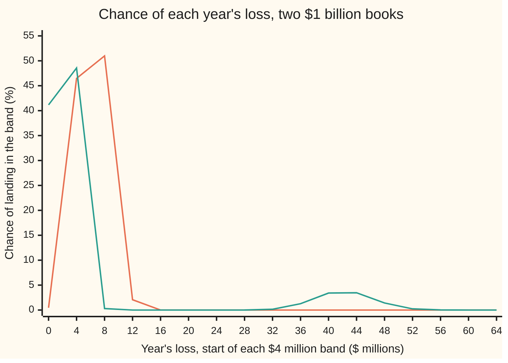

# Expected and unexpected loss: provisions cover the average, capital covers the surprise

[Syllabus](../../../SYLLABUS.md) → [Financial mathematics](../README.md) → [Regulatory Capital in Outline](../README.md#s48) → Expected and unexpected loss

---

## General Overview

A bank has lent out $1 billion as 1,000 loans of $1 million each. Each borrower has a 2 in 100 chance of failing to repay within the year. When one fails, the bank sells what it can and loses 40 cents on each dollar owed.

On average the bank loses 2% of 40% of $1 billion: **$8 million a year**. That number is steady enough to plan around. The bank adds it to the interest it charges, and it sets aside an allowance for it in the accounts, called a **provision**. A year that loses $8 million is a normal year, paid for in advance.

But the average is not the year. The economy has bad years. In this book, one year in ten is a recession in which 11 borrowers in 100 fail instead of 1 in 100. Such a year loses $44.00 million on average; a normal year loses $4.00 million. The provision does not cover it. Something else has to: the owners' own money, which the bank holds so that a loss beyond the provision falls on the owners rather than on depositors. That cushion is **capital**.

So a credit loss has two parts. The **expected loss**, EL, is the long-run average: a cost of doing business. The **unexpected loss**, UL, is how far a bad year can run past that average, up to a line the bank chooses: here, the loss exceeded only one year in a thousand. For this book that line sits at $53.60 million, so the unexpected loss is $53.60 − $8.00 = **$45.60 million**.

**Expected loss is chance of default times fraction lost times amount at stake, added over the loans; unexpected loss is a high-percentile loss minus the expected loss; the first is covered by pricing and provisions, the second by capital.**

**What kind of fact this is:** two definitions (expected loss and unexpected loss), one theorem (the average adds up loan by loan whatever the loans do together, proved in Why it works), and a regulatory convention: the split of provisions for the average and capital for the surprise.

### The picture: same average, different tail

Two books, each $1 billion, 1,000 loans, 2% default chance, 40% lost in a default. Loss runs left to right in $4 million bands; up the page is the chance the year's loss lands in that band.



Orange line: book B, where each borrower fails or not on its own. Every year lands between $0 and $16 million. Green line: book C, the same loans with one year in ten a recession. Most years are quieter than book B's, and then a small second hump sits out at $32 million to $56 million. Both books average exactly $8 million. The average cannot tell them apart. The tail can.

---

## The formula

Notation first, in words. $L$ is the bank's credit loss over the year, in dollars: a random amount, not yet known. $\mathbb{E}[L]$ is its expectation, the long-run average over many such years ([Default probability, recovery and expected loss](../41-Default%2C%20Survival%20and%20the%20Hazard%20Rate/01-default-probability-recovery-and-expected-loss.md) builds it for one loan). $P(L \le x)$ is the chance the loss is at most $x$ dollars. PD, LGD and EAD are a loan's probability of default, loss given default and exposure at default, as on that card. $\alpha$ (alpha) is a confidence level the bank chooses, such as 99.9%. The capital sigma, $\sum$, means "add up over the loans", numbered $i = 1$ to $n$.

$$\text{EL} = \mathbb{E}[L] = \sum_{i=1}^{n} \text{PD}_i \times \text{LGD}_i \times \text{EAD}_i$$

**Read it aloud:** the expected loss is, for each loan, its chance of default times the fraction lost in a default times the money at stake, added up over the book.

$$q_\alpha = \text{the smallest } x \text{ with } P(L \le x) \ge \alpha, \qquad \text{UL}_\alpha = q_\alpha - \text{EL}$$

**Read it aloud:** find the smallest loss that the year stays at or below with chance at least $\alpha$; the unexpected loss is that loss minus the average.

The line $q_\alpha$ is called the **$\alpha$-quantile** of the loss, or the loss at confidence level $\alpha$. At $\alpha = 99.9\%$ it is the loss exceeded at most one year in a thousand.

| Symbol | Plain meaning | In our example | Push it up and the answer… |
| --- | --- | --- | --- |
| $L$, $L_i$ | the year's credit loss in dollars, not yet known; $L_i$ is loan $i$'s part of it | $0 to $400 million | — |
| $n$, $i$, $\sum$ | number of loans in the book; $i$ numbers them 1 to $n$; $\sum$ adds over them | 1,000 (book A: 10) | UL falls if loans fail independently; EL unchanged |
| $\text{PD}_i$ | probability of default: chance loan $i$ fails within the year | 2% | EL and UL both rise |
| $\text{LGD}_i$ | loss given default: fraction of the exposure lost if loan $i$ fails | 40% | EL and UL rise in proportion |
| $\text{EAD}_i$ | exposure at default: money owed on loan $i$ when it fails | $1 million (book A: $100 million) | EL and UL rise in proportion |
| $\text{EL}$ | expected loss, the long-run average of $L$ | $8.00 million | — |
| $\alpha$ | confidence level: how rare a year the bank plans to survive | 99.9% | $q_\alpha$ and UL rise |
| $q_\alpha$ | the $\alpha$-quantile: the loss exceeded with chance at most $1 - \alpha$ | $53.60 million (book C) | UL rises one for one |
| $\text{UL}_\alpha$ | unexpected loss at level $\alpha$: $q_\alpha$ minus EL | $45.60 million (book C) | capital needed rises |
| $D_i$ | default flag: 1 if loan $i$ fails in the year, 0 if not | 1 with chance 2% | — |
| $N$, $k$ | number of loans that fail in the year; $k$ is one possible value of it | 20 on average | loss rises by LGD × EAD per default |
| $K$ | capital: the owners' money held against losses beyond the provision | $45.60 million (book C) | survives rarer years |

When all loans share one PD, LGD and EAD, the sum collapses to $n \times \text{PD} \times \text{LGD} \times \text{EAD}$: 1,000 × 0.02 × 0.40 × $1 million = $8 million.

### When it holds

- **One horizon, fixed in advance.** EL and UL here are one-year numbers. Change the horizon and PD, the quantile and UL all change; a two-year PD is not twice the one-year PD.
- **LGD and EAD are fixed amounts.** If recoveries fall in the same bad years that defaults rise, the loss in a default is larger exactly when defaults cluster, and PD × LGD × EAD with average LGD understates both EL and UL. Regulators answer with a "downturn" LGD, measured in bad years.
- **The EL formula needs no assumption about how defaults move together.** The quantile does. Two books with identical PD, LGD and EAD can have unexpected losses of $6.00 million and $392.00 million (books B and D below). Get the joint behaviour wrong and UL is wrong, however exact the inputs.
- **UL is a statistic of a model, not a fact about the world.** It is only as good as the loss distribution behind it, and a 99.9% quantile is estimated from far fewer than a thousand years of data.

---

## Why it works

### Step 0: the average of a sum is the sum of the averages

The book's loss is the sum of the loans' losses. Averages add: the average of a total is the total of the averages, whatever the parts do together. That one fact makes EL easy and makes it blind to the thing that matters most for the tail. UL has no such shortcut: a quantile of a sum is not the sum of the quantiles.

### Step 1: one loan's average loss

Loan $i$ either fails or it does not. Write its default flag $D_i$: 1 if it fails, 0 if not. Its loss is then

$$L_i = \text{EAD}_i \times \text{LGD}_i \times D_i.$$

The average of a 0-or-1 flag is the chance it is 1, so the average of $D_i$ is $\text{PD}_i$. With EAD and LGD fixed, the average loss is $\text{EAD}_i \times \text{LGD}_i \times \text{PD}_i$. For a $1 million loan: $1,000,000 × 0.40 × 0.02 = $8,000.

### Step 2: add the loans

$L = L_1 + L_2 + \dots + L_n$. By Step 0,

$$\mathbb{E}[L] = \sum_{i=1}^n \mathbb{E}[L_i] = \sum_{i=1}^n \text{PD}_i \times \text{LGD}_i \times \text{EAD}_i.$$

Nothing here asked whether defaults are independent. So every book on this card, from ten $100 million loans to a book where all 1,000 loans fail together, has EL = $8.00 million. The code checks this for each book by averaging over its full loss distribution, a second road that never uses the formula.

### Step 3: the tail needs the whole distribution

A quantile asks where the chance piles up, so it needs the chance of every possible loss. Take book A, ten loans of $100 million, failing independently. Each default costs 0.40 × $100 million = $40 million. The number of defaults $N$ follows the binomial rule: the chance that exactly $k$ of the ten fail is the number of ways to pick the $k$ failures times $0.02^k \times 0.98^{10-k}$.

- No default: $0.98^{10} = 0.817073$.
- One: $10 \times 0.02 \times 0.98^9 = 0.166750$.
- Two: $45 \times 0.02^2 \times 0.98^8 = 0.015314$.

Chance of at most one default: 0.983822, short of 99%. At most two: 0.999136, past both 99% and 99.9%. So the 99% and the 99.9% quantile are both two defaults, $80 million, and UL = $80 − $8 = $72 million at either level. The loss comes in $40 million steps, so the quantile jumps rather than slides.

For book C the same idea is a mixture: with chance 0.9 a normal year (each loan 1% PD), with chance 0.1 a recession (each loan 11% PD). The average PD is 0.9 × 1% + 0.1 × 11% = 2%, which is why EL is unchanged. The year's distribution is 0.9 times one binomial plus 0.1 times another; its 99.9% point is 134 defaults, $53.60 million.

### Step 4: why capital is set at the quantile minus the average

The bank wants to survive every year except the worst $1 - \alpha$ of them. It has two layers of protection. Provisions and pricing already absorb EL. Capital $K$ absorbs anything beyond that. The bank survives the year when

$$L \le \text{EL} + K.$$

The chance of surviving must be at least $\alpha$. The smallest amount $\text{EL} + K$ that the loss stays at or below with chance at least $\alpha$ is, by definition, $q_\alpha$. So the smallest capital that does the job is

$$K = q_\alpha - \text{EL} = \text{UL}_\alpha.$$

That is the reason for the subtraction. Capital does not need to cover the average, because the average is already paid for. Holding $q_\alpha$ in capital on top of the provisions would count the $8 million twice.

<details>
<summary>Detailed proof</summary>

**EL.** Each $L_i$ takes two values, 0 and $\text{EAD}_i \times \text{LGD}_i$, so its average is $0 \times (1 - \text{PD}_i) + \text{EAD}_i \times \text{LGD}_i \times \text{PD}_i$. For finitely many random amounts with finite averages, $\mathbb{E}[L_1 + \dots + L_n] = \mathbb{E}[L_1] + \dots + \mathbb{E}[L_n]$: write each average as a sum over the joint outcomes, weighted by their chances, and swap the order of the two sums. The swap uses the joint chances but never factors them, so no independence is needed.

**The quantile exists and is attained.** The function $F(x) = P(L \le x)$ never decreases, runs from 0 (below the smallest loss) to 1 (at the largest), and is continuous from the right: it jumps up at each possible loss and is flat between. For $0 < \alpha < 1$ the set of $x$ with $F(x) \ge \alpha$ is non-empty and bounded below, and right-continuity puts its lowest point inside the set. So $q_\alpha$ is a real loss with $P(L \le q_\alpha) \ge \alpha$, and every smaller $x$ has $P(L \le x) < \alpha$.

**Capital.** The bank survives when $L \le \text{EL} + K$. Requiring $P(L \le \text{EL} + K) \ge \alpha$ means $\text{EL} + K$ lies in the set above, so $\text{EL} + K \ge q_\alpha$, with equality possible. The least such $K$ is $q_\alpha - \text{EL}$.

**UL can be negative.** If a loss of 0 already has chance at least $\alpha$, then $q_\alpha = 0$ and $\text{UL}_\alpha = -\text{EL}$. Book D at 95% shows it: $0 - 8 = -8$ million. A capital rule floors this at zero; that floor is a convention, not part of the definition.

</details>

### Step 5: why many small loans help, and why bad years undo it

Split $1 billion into more, smaller loans that fail independently and the losses average out: some fail, most do not, and a year far from the average needs many unlucky draws at once. Book A (10 loans) has UL $72.00 million; book B (1,000 loans) has $6.00 million. A shared cause of default, such as a recession, does not average out, because it hits every loan in the same year. Book C has book B's loans and book B's EL, and UL of $45.60 million.

The regulatory formula for credit capital builds exactly this: one shared economic factor, a 99.9% quantile, minus EL. It is taken apart in [The Basel credit formula](03-vasicek-asrf-and-credit-capital.md). How defaults move together in general is [Default correlation](../45-Portfolio%20Credit%20-%20Correlation%2C%20Copulas%2C%20Indices%20and%20Tranches/01-default-correlation-and-joint-default.md).

---

## Worked numbers, by hand

Book A: ten loans of $100 million, $1 billion in all, each with PD 2% and LGD 40%, failing independently. Confidence level 99.9%.

| Step | Arithmetic | Value |
| --- | --- | --- |
| loss per default | 0.40 × $100 million | $40 million |
| EL per loan | 0.02 × 0.40 × $100 million | $0.80 million |
| EL of the book | 10 × $0.80 million | $8.00 million |
| chance of no default | $0.98^{10}$ | 0.817073 |
| chance of one default | $10 \times 0.02 \times 0.98^{9}$ | 0.166750 |
| chance of two defaults | $45 \times 0.02^2 \times 0.98^{8}$ | 0.015314 |
| chance of at most one | 0.817073 + 0.166750 | 0.983822, below 99.9% |
| chance of at most two | 0.983822 + 0.015314 | 0.999136, reaches 99.9% |
| $q_{99.9\%}$ | 2 defaults × $40 million | $80 million |
| **UL at 99.9%** | $80 million − $8 million | **$72.00 million** |

A bank with this book prices in and provisions $8 million a year, and holds $72 million of capital so that only a year with three or more defaults, chance 0.000864, eats through both.

### What breaks if you drop a piece

Same $1 billion, PD 2%, LGD 40%, 99.9% level. Right answers: EL $8.00 million; UL $45.60 million for book C.

| Mistake | Comes out at | What went wrong |
| --- | --- | --- |
| Forget LGD: EL = PD × EAD | $20.00 million | Counts every default as a total loss; the bank recovers 60 cents on the dollar |
| Hold the quantile as capital, book C | $53.60 million | Covers the $8.00 million average twice: once in provisions, once in capital |
| Add up 1,000 one-loan ULs | $392.00 million | Treats every loan as failing in the same year; this is book D's UL exactly |
| Use independent book B's UL for book C | $6.00 million | Ignores the bad years: $6.00 million held against a $45.60 million need |

The third row is not an accident. One loan's 99.9% quantile is its whole $0.4 million loss, because 2% is more than 0.1%. Adding 1,000 such quantiles gives the loss of a book in which all loans fail together. Summing stand-alone numbers assumes the worst possible dependence.

---

## How it moves: concentration and bad years

The average never moved on this card. Every book has EL = $8.00 million. The unexpected loss ran from $6.00 million to $392.00 million. Two forces did it.

### Force one: how finely the book is cut

Same $1 billion, same PD and LGD, loans failing independently. Only the number of loans changes.

```
UL at 99.9%, in $ millions, independent loans
     1 loan    ████████████████████████████████████████  $392.00
    10 loans   ███████                                   $72.00
   100 loans   ██                                        $20.00
  1000 loans   █                                         $6.00
```

One $1 billion loan either fails or it does not: at 99.9% it must be assumed to fail, $400 million, minus the $8 million average. Cut it into 1,000 pieces and the 99.9% year has 35 defaults instead of the average 20.

### Force two: how bad the bad year is

Now fix 1,000 loans and let one year in ten be a recession. Raise the recession PD and lower the normal-year PD so the average stays at 2%.

```
UL at 99.9%, in $ millions, 1,000 loans, average PD held at 2%
  recession PD  2%  (no recession)   ████                              $6.00
  recession PD  5%, normal 1.67%     ████████████                      $18.80
  recession PD  8%, normal 1.33%     █████████████████████             $32.40
  recession PD 11%, normal 1.00%     █████████████████████████████     $45.60
  recession PD 14%, normal 0.67%     ██████████████████████████████████████  $58.40
  recession PD 20%, normal 0%        ██████████████████████████████████████████████████████  $84.00
```

EL is the same $8.00 million in every row. The capital a bank needs rose from $6.00 million to $84.00 million. Diversification removes the risk of individual borrowers; it cannot remove a risk they share.

---

## Code, from first principles, and it actually runs

The check builds four $1 billion books and reaches EL and UL by three independent roads: the formula, added loan by loan; the full loss distribution (Python adds one loan at a time to the distribution; Rust uses the ratio between neighbouring binomial terms and, for book A, lists all 1,024 default patterns); and 200,000 simulated years from a random-number generator written out in the script, with each year's defaults found by jumping from one default to the next. It asserts that the distribution's average equals the formula for every book, that book A's closed-form chances match the pattern count, that quantiles found by hand from those chances match the quantile routine, that the sum of one-loan ULs equals the all-or-none book's UL, and that the simulated average and quantiles land within a few defaults of the exact ones. Both scripts use the same generator and seed, so both print the same simulated numbers.

### Python

```python
# Expected and unexpected loss -- the check behind the card.  Standard library only.
# A $1 billion loan book, 2% chance of default per loan, 40% lost in a default.
# Road 1: the formula EL = PD x LGD x EAD, loan by loan.
# Road 2: the whole loss distribution, built by adding one loan at a time.
# Road 3: simulated years, with a random-number generator written out below.
# Money is printed in $ millions.
from math import comb, log, sqrt

BOOK, PD, LGD = 1000.0, 0.02, 0.40                   # $ millions, chance, fraction

def book_pmf(n, p):
    # dist[k] = chance of exactly k defaults among the loans added so far
    dist = [1.0]
    for _ in range(n):
        new = [0.0] * (len(dist) + 1)
        for k, w in enumerate(dist):
            new[k] += w * (1.0 - p)
            new[k + 1] += w * p
        dist = new
    return dist

def mixed_pmf(n, good, bad, p_bad=0.10):             # a bad year one time in ten
    g, b = book_pmf(n, good), book_pmf(n, bad)
    return [(1.0 - p_bad) * x + p_bad * y for x, y in zip(g, b)]

def mean_sd(dist, a):                                # a = dollars lost per default
    m = sum(k * a * w for k, w in enumerate(dist))
    v = sum((k * a - m) ** 2 * w for k, w in enumerate(dist))
    return m, sqrt(v)

def quantile(dist, a, alpha):                        # smallest loss x with P(L <= x) >= alpha
    cum = 0.0
    for k, w in enumerate(dist):
        cum += w
        if cum >= alpha:
            return k * a
    return (len(dist) - 1) * a

def formula_el(n, pd, lgd):                          # road 1: add PD x LGD x EAD over the loans
    return sum(pd * lgd * (BOOK / n) for _ in range(n))

# the four books: same $1 billion, same 2% PD, same 40% LGD
books = {
    "A 10 loans, independent": (book_pmf(10, PD), BOOK / 10 * LGD, 10),
    "B 1000 loans, independent": (book_pmf(1000, PD), BOOK / 1000 * LGD, 1000),
    "C 1000 loans, bad years": (mixed_pmf(1000, 0.01, 0.11), BOOK / 1000 * LGD, 1000),
    "D 1000 loans, all-or-none": ([0.98] + [0.0] * 999 + [0.02], BOOK / 1000 * LGD, 1000),
}
res = {}
print(f"{'book':<27}{'EL':>8}{'formula':>8}{'sd':>8}{'q95':>8}{'UL95':>8}"
      f"{'q99':>8}{'UL99':>8}{'q99.9':>8}{'UL99.9':>8}")
for name, (dist, a, n) in books.items():
    el, sd = mean_sd(dist, a)
    qs = [quantile(dist, a, al) for al in (0.95, 0.99, 0.999)]
    res[name[0]] = (el, sd, qs, dist, a)
    assert abs(sum(dist) - 1.0) < 1e-12
    assert abs(el - formula_el(n, PD, LGD)) < 1e-9   # distribution mean = formula
    cells = [el, formula_el(n, PD, LGD), sd] + [x for q in qs for x in (q, q - el)]
    print(f"{name:<27}" + "".join(f"{c:8.2f}" for c in cells))

# hand check of book A: P(N <= 1) and P(N <= 2) in closed form
pA = res["A"][3]
p0, p1, p2 = 0.98 ** 10, 10 * 0.02 * 0.98 ** 9, 45 * 0.02 ** 2 * 0.98 ** 8
assert abs(pA[0] + pA[1] - (p0 + p1)) < 1e-14 and abs(pA[2] - p2) < 1e-14
cumA = [p0, p0 + p1, p0 + p1 + p2]                   # closed-form CDF of book A
for al, q in ((0.99, res["A"][2][1]), (0.999, res["A"][2][2])):
    assert q == 40.0 * next(k for k in range(3) if cumA[k] >= al)   # quantile by hand
kB = next(k for k in range(1001) if sum(comb(1000, j) * 0.02 ** j * 0.98 ** (1000 - j) for j in range(k + 1)) >= 0.999)
assert abs(res["B"][2][2] - 0.4 * kB) < 1e-9       # B's 99.9% point from binomial coefficients
print(f"A by hand: P(0)={p0:.6f} P(1)={p1:.6f} P(2)={p2:.6f} P(<=1)={p0+p1:.6f} P(<=2)={p0+p1+p2:.6f}")

g, b = book_pmf(1000, 0.01), book_pmf(1000, 0.11)
print(f"C: normal-year EL {mean_sd(g, 0.4)[0]:.2f}, recession-year EL {mean_sd(b, 0.4)[0]:.2f}")
print(f"per loan: A loss/default {BOOK / 10 * LGD:.2f}, EL {PD * LGD * BOOK / 10:.2f}; "
      f"B loss/default {BOOK / 1000 * LGD:.2f}, EL {PD * LGD * BOOK / 1000:.4f}")
print(f"defaults at q99.9: B {round(res['B'][2][2] / 0.4)}, C {round(res['C'][2][2] / 0.4)}; "
      f"average {round(res['B'][0] / 0.4)}; A P(>=3)={1 - (p0 + p1 + p2):.6f}")

# what breaks
elC, sdC, qC = res["C"][0], res["C"][1], res["C"][2]
standalone = 1000 * (quantile([0.98, 0.02], 0.4, 0.999) - PD * LGD * 1.0)
assert abs(standalone - (res["D"][2][2] - res["D"][0])) < 1e-9   # sum of one-loan ULs = all-or-none book
print(f"wrong: forgot LGD, PD x EAD       {PD * BOOK:8.2f}")
print(f"wrong: capital = q99.9 of C       {qC[2]:8.2f}  right UL {qC[2] - elC:8.2f}")
print(f"wrong: sum of 1000 one-loan UL99.9 {standalone:7.2f}")
print(f"wrong: C read with B's UL99.9     {res['B'][2][2] - res['B'][0]:8.2f}")
print(f"wrong: UL = one sd, book C        {sdC:8.2f}")

# how it moves: concentration (independent loans) and bad years (1000 loans)
for n in (1, 10, 100, 1000):
    d = book_pmf(n, PD)
    print(f"move: {n:>4} loans, UL99.9 {quantile(d, BOOK / n * LGD, 0.999) - PD * LGD * BOOK:8.2f}")
for bad in (0.02, 0.05, 0.08, 0.11, 0.14, 0.20):
    good = max(0.0, (PD - 0.10 * bad) / 0.90)
    d = mixed_pmf(1000, good, bad)
    print(f"move: bad-year PD {bad:.2f}, good {good:.4f}, UL99.9 {quantile(d, 0.4, 0.999) - 8.0:8.2f}")

# chart: chance of each $4 million band of loss, books B and C, in percent
for key in ("B", "C"):
    d = res[key][3]
    bands = [100 * sum(d[10 * j:10 * j + 10]) for j in range(17)]
    print(f"chart {key}: " + ", ".join(f"{x:.2f}" for x in bands))

# road 3: simulated years (splitmix64; defaults found by jumping geometric gaps)
state = 20260928
def rand():
    global state
    state = (state + 0x9E3779B97F4A7C15) & 0xFFFFFFFFFFFFFFFF
    z = state
    z = ((z ^ (z >> 30)) * 0xBF58476D1CE4E5B9) & 0xFFFFFFFFFFFFFFFF
    z = ((z ^ (z >> 27)) * 0x94D049BB133111EB) & 0xFFFFFFFFFFFFFFFF
    z ^= z >> 31
    return ((z >> 11) + 1) * 2.0 ** -53              # in (0, 1]

def defaults(n, p):
    count, pos = 0, -1
    while True:
        pos += 1 + int(log(rand()) / log(1.0 - p))
        if pos >= n:
            return count
        count += 1

def simulate(n, a, years, mixed):
    hist = [0] * (n + 1)
    for _ in range(years):
        p = (0.11 if rand() < 0.10 else 0.01) if mixed else PD
        hist[defaults(n, p)] += 1
    dist = [h / years for h in hist]
    return mean_sd(dist, a)[0], quantile(dist, a, 0.99), quantile(dist, a, 0.999)

YEARS = 200_000
for key, n, a, mixed in (("A", 10, 40.0, False), ("C", 1000, 0.4, True)):
    el, q99, q999 = simulate(n, a, YEARS, mixed)
    print(f"sim {key}, {YEARS} years: EL {el:8.2f}  q99 {q99:8.2f}  q99.9 {q999:8.2f}")
    assert abs(el - res[key][0]) < 0.02 * res[key][0]              # mean within 2%
    assert abs(q99 - res[key][2][1]) <= 2 * a                      # 99% point within 2 defaults
    assert abs(q999 - res[key][2][2]) <= 3 * a                     # 99.9% point within 3 defaults
```

**Ran 2026-09-28 on macOS, Python 3.14.6, standard library only. All checks passed. Output, pasted from the run:**

```
book                             EL formula      sd     q95    UL95     q99    UL99   q99.9  UL99.9
A 10 loans, independent        8.00    8.00   17.71   40.00   32.00   80.00   72.00   80.00   72.00
B 1000 loans, independent      8.00    8.00    1.77   11.20    3.20   12.40    4.40   14.00    6.00
C 1000 loans, bad years        8.00    8.00   12.12   44.00   36.00   49.20   41.20   53.60   45.60
D 1000 loans, all-or-none      8.00    8.00   56.00    0.00   -8.00  400.00  392.00  400.00  392.00
A by hand: P(0)=0.817073 P(1)=0.166750 P(2)=0.015314 P(<=1)=0.983822 P(<=2)=0.999136
C: normal-year EL 4.00, recession-year EL 44.00
per loan: A loss/default 40.00, EL 0.80; B loss/default 0.40, EL 0.0080
defaults at q99.9: B 35, C 134; average 20; A P(>=3)=0.000864
wrong: forgot LGD, PD x EAD          20.00
wrong: capital = q99.9 of C          53.60  right UL    45.60
wrong: sum of 1000 one-loan UL99.9  392.00
wrong: C read with B's UL99.9         6.00
wrong: UL = one sd, book C           12.12
move:    1 loans, UL99.9   392.00
move:   10 loans, UL99.9    72.00
move:  100 loans, UL99.9    20.00
move: 1000 loans, UL99.9     6.00
move: bad-year PD 0.02, good 0.0200, UL99.9     6.00
move: bad-year PD 0.05, good 0.0167, UL99.9    18.80
move: bad-year PD 0.08, good 0.0133, UL99.9    32.40
move: bad-year PD 0.11, good 0.0100, UL99.9    45.60
move: bad-year PD 0.14, good 0.0067, UL99.9    58.40
move: bad-year PD 0.20, good 0.0000, UL99.9    84.00
chart B: 0.47, 46.47, 50.99, 2.07, 0.00, 0.00, 0.00, 0.00, 0.00, 0.00, 0.00, 0.00, 0.00, 0.00, 0.00, 0.00, 0.00
chart C: 41.16, 48.55, 0.30, 0.00, 0.00, 0.00, 0.00, 0.01, 0.16, 1.27, 3.41, 3.47, 1.42, 0.24, 0.02, 0.00, 0.00
sim A, 200000 years: EL     8.02  q99    80.00  q99.9    80.00
sim C, 200000 years: EL     8.02  q99    49.20  q99.9    53.20
```

### Rust

```rust
// Expected and unexpected loss -- the check behind the card.  Rust std only.
// A $1 billion loan book, 2% chance of default per loan, 40% lost in a default.
// Road 1: the formula EL = PD x LGD x EAD.
// Road 2: the loss distribution, from the ratio of neighbouring binomial terms
//         (and, for the ten-loan book, all 1024 default patterns listed).
// Road 3: simulated years, same generator as the Python check.
// Money is printed in $ millions.
const BOOK: f64 = 1000.0;
const PD: f64 = 0.02;
const LGD: f64 = 0.40;

fn book_pmf(n: usize, p: f64) -> Vec<f64> {
    let mut d = vec![0.0; n + 1];
    if p == 0.0 { d[0] = 1.0; return d; }
    d[0] = (1.0 - p).powi(n as i32);
    for k in 0..n {
        d[k + 1] = d[k] * (n - k) as f64 / (k + 1) as f64 * p / (1.0 - p);
    }
    d
}

fn mixed_pmf(n: usize, good: f64, bad: f64) -> Vec<f64> {
    let (g, b) = (book_pmf(n, good), book_pmf(n, bad));
    g.iter().zip(b.iter()).map(|(x, y)| 0.9 * x + 0.1 * y).collect()
}

fn mean_sd(d: &[f64], a: f64) -> (f64, f64) {
    let m: f64 = d.iter().enumerate().map(|(k, w)| k as f64 * a * w).sum();
    let v: f64 = d.iter().enumerate().map(|(k, w)| (k as f64 * a - m).powi(2) * w).sum();
    (m, v.sqrt())
}

fn quantile(d: &[f64], a: f64, alpha: f64) -> f64 {
    let mut cum = 0.0;
    for (k, w) in d.iter().enumerate() {
        cum += w;
        if cum >= alpha { return k as f64 * a; }
    }
    (d.len() - 1) as f64 * a
}

struct Rng(u64);
impl Rng {
    fn next(&mut self) -> f64 {
        self.0 = self.0.wrapping_add(0x9E3779B97F4A7C15);
        let mut z = self.0;
        z = (z ^ (z >> 30)).wrapping_mul(0xBF58476D1CE4E5B9);
        z = (z ^ (z >> 27)).wrapping_mul(0x94D049BB133111EB);
        z ^= z >> 31;
        ((z >> 11) + 1) as f64 * (2.0f64).powi(-53)
    }
    fn defaults(&mut self, n: usize, p: f64) -> usize {
        let (mut count, mut pos) = (0usize, -1i64);
        loop {
            pos += 1 + (self.next().ln() / (1.0 - p).ln()) as i64;
            if pos >= n as i64 { return count; }
            count += 1;
        }
    }
}

fn main() {
    let a_big = BOOK / 1000.0 * LGD;
    let mut d_all = vec![0.0; 1001];
    d_all[0] = 0.98;
    d_all[1000] = 0.02;
    let books: Vec<(&str, Vec<f64>, f64, usize)> = vec![
        ("A 10 loans, independent", book_pmf(10, PD), BOOK / 10.0 * LGD, 10),
        ("B 1000 loans, independent", book_pmf(1000, PD), a_big, 1000),
        ("C 1000 loans, bad years", mixed_pmf(1000, 0.01, 0.11), a_big, 1000),
        ("D 1000 loans, all-or-none", d_all, a_big, 1000),
    ];
    println!("{:<27}{:>8}{:>8}{:>8}{:>8}{:>8}{:>8}{:>8}{:>8}{:>8}",
             "book", "EL", "formula", "sd", "q95", "UL95", "q99", "UL99", "q99.9", "UL99.9");
    let mut res = Vec::new();
    for (name, d, a, n) in &books {
        let (el, sd) = mean_sd(d, *a);
        let formula = PD * LGD * (BOOK / *n as f64) * *n as f64;
        let qs: Vec<f64> = [0.95, 0.99, 0.999].iter().map(|al| quantile(d, *a, *al)).collect();
        assert!((d.iter().sum::<f64>() - 1.0).abs() < 1e-12);
        assert!((el - formula).abs() < 1e-9);
        let mut line = format!("{:<27}{:8.2}{:8.2}{:8.2}", name, el, formula, sd);
        for q in &qs { line += &format!("{:8.2}{:8.2}", q, q - el); }
        println!("{}", line);
        res.push((el, sd, qs));
    }

    // book A again, by listing all 1024 default patterns of ten loans
    let mut pat = [0.0f64; 11];
    for mask in 0u32..1024 {
        let k = mask.count_ones() as usize;
        pat[k] += PD.powi(k as i32) * (1.0 - PD).powi(10 - k as i32);
    }
    let da = &books[0].1;
    for k in 0..11 { assert!((pat[k] - da[k]).abs() < 1e-14); }
    for (al, qi) in [(0.99, 1usize), (0.999, 2)] {
        let (mut k, mut c) = (0usize, pat[0]);
        while c < al { k += 1; c += pat[k]; }
        assert!(res[0].2[qi] == 40.0 * k as f64);   // quantile from the pattern count
    }
    println!("A by hand: P(0)={:.6} P(1)={:.6} P(2)={:.6} P(<=1)={:.6} P(<=2)={:.6}",
             pat[0], pat[1], pat[2], pat[0] + pat[1], pat[0] + pat[1] + pat[2]);

    let (g, b) = (book_pmf(1000, 0.01), book_pmf(1000, 0.11));
    println!("C: normal-year EL {:.2}, recession-year EL {:.2}", mean_sd(&g, 0.4).0, mean_sd(&b, 0.4).0);
    println!("per loan: A loss/default {:.2}, EL {:.2}; B loss/default {:.2}, EL {:.4}",
             BOOK / 10.0 * LGD, PD * LGD * BOOK / 10.0, BOOK / 1000.0 * LGD, PD * LGD * BOOK / 1000.0);
    println!("defaults at q99.9: B {}, C {}; average {}; A P(>=3)={:.6}",
             (res[1].2[2] / 0.4).round() as i64, (res[2].2[2] / 0.4).round() as i64,
             (res[1].0 / 0.4).round() as i64, 1.0 - (pat[0] + pat[1] + pat[2]));

    // what breaks
    let (el_c, sd_c, q_c) = (res[2].0, res[2].1, res[2].2.clone());
    let standalone = 1000.0 * (quantile(&[0.98, 0.02], 0.4, 0.999) - PD * LGD);
    assert!((standalone - (res[3].2[2] - res[3].0)).abs() < 1e-9);
    println!("wrong: forgot LGD, PD x EAD       {:8.2}", PD * BOOK);
    println!("wrong: capital = q99.9 of C       {:8.2}  right UL {:8.2}", q_c[2], q_c[2] - el_c);
    println!("wrong: sum of 1000 one-loan UL99.9 {:7.2}", standalone);
    println!("wrong: C read with B's UL99.9     {:8.2}", res[1].2[2] - res[1].0);
    println!("wrong: UL = one sd, book C        {:8.2}", sd_c);

    // how it moves
    for n in [1usize, 10, 100, 1000] {
        let d = book_pmf(n, PD);
        println!("move: {:>4} loans, UL99.9 {:8.2}", n, quantile(&d, BOOK / n as f64 * LGD, 0.999) - PD * LGD * BOOK);
    }
    for bad in [0.02f64, 0.05, 0.08, 0.11, 0.14, 0.20] {
        let good = ((PD - 0.10 * bad) / 0.90).max(0.0);
        let d = mixed_pmf(1000, good, bad);
        println!("move: bad-year PD {:.2}, good {:.4}, UL99.9 {:8.2}", bad, good, quantile(&d, 0.4, 0.999) - 8.0);
    }

    // chart bands, percent per $4 million of loss
    for (key, i) in [("B", 1usize), ("C", 2)] {
        let d = &books[i].1;
        let bands: Vec<String> = (0..17).map(|j| format!("{:.2}", 100.0 * d[10 * j..10 * j + 10].iter().sum::<f64>())).collect();
        println!("chart {}: {}", key, bands.join(", "));
    }

    // road 3: simulated years
    let mut rng = Rng(20260928);
    let years = 200_000usize;
    for (key, i, n, a, mixed) in [("A", 0usize, 10usize, 40.0, false), ("C", 2, 1000, 0.4, true)] {
        let mut hist = vec![0usize; n + 1];
        for _ in 0..years {
            let p = if mixed { if rng.next() < 0.10 { 0.11 } else { 0.01 } } else { PD };
            hist[rng.defaults(n, p)] += 1;
        }
        let d: Vec<f64> = hist.iter().map(|h| *h as f64 / years as f64).collect();
        let (el, _) = mean_sd(&d, a);
        let (q99, q999) = (quantile(&d, a, 0.99), quantile(&d, a, 0.999));
        println!("sim {}, {} years: EL {:8.2}  q99 {:8.2}  q99.9 {:8.2}", key, years, el, q99, q999);
        assert!((el - res[i].0).abs() < 0.02 * res[i].0);
        assert!((q99 - res[i].2[1]).abs() <= 2.0 * a);
        assert!((q999 - res[i].2[2]).abs() <= 3.0 * a);
    }
}
```

**Ran 2026-09-28 on macOS, rustc 1.98.1, no crates. All checks passed. Output, pasted from the run:**

```
book                             EL formula      sd     q95    UL95     q99    UL99   q99.9  UL99.9
A 10 loans, independent        8.00    8.00   17.71   40.00   32.00   80.00   72.00   80.00   72.00
B 1000 loans, independent      8.00    8.00    1.77   11.20    3.20   12.40    4.40   14.00    6.00
C 1000 loans, bad years        8.00    8.00   12.12   44.00   36.00   49.20   41.20   53.60   45.60
D 1000 loans, all-or-none      8.00    8.00   56.00    0.00   -8.00  400.00  392.00  400.00  392.00
A by hand: P(0)=0.817073 P(1)=0.166750 P(2)=0.015314 P(<=1)=0.983822 P(<=2)=0.999136
C: normal-year EL 4.00, recession-year EL 44.00
per loan: A loss/default 40.00, EL 0.80; B loss/default 0.40, EL 0.0080
defaults at q99.9: B 35, C 134; average 20; A P(>=3)=0.000864
wrong: forgot LGD, PD x EAD          20.00
wrong: capital = q99.9 of C          53.60  right UL    45.60
wrong: sum of 1000 one-loan UL99.9  392.00
wrong: C read with B's UL99.9         6.00
wrong: UL = one sd, book C           12.12
move:    1 loans, UL99.9   392.00
move:   10 loans, UL99.9    72.00
move:  100 loans, UL99.9    20.00
move: 1000 loans, UL99.9     6.00
move: bad-year PD 0.02, good 0.0200, UL99.9     6.00
move: bad-year PD 0.05, good 0.0167, UL99.9    18.80
move: bad-year PD 0.08, good 0.0133, UL99.9    32.40
move: bad-year PD 0.11, good 0.0100, UL99.9    45.60
move: bad-year PD 0.14, good 0.0067, UL99.9    58.40
move: bad-year PD 0.20, good 0.0000, UL99.9    84.00
chart B: 0.47, 46.47, 50.99, 2.07, 0.00, 0.00, 0.00, 0.00, 0.00, 0.00, 0.00, 0.00, 0.00, 0.00, 0.00, 0.00, 0.00
chart C: 41.16, 48.55, 0.30, 0.00, 0.00, 0.00, 0.00, 0.01, 0.16, 1.27, 3.41, 3.47, 1.42, 0.24, 0.02, 0.00, 0.00
sim A, 200000 years: EL     8.02  q99    80.00  q99.9    80.00
sim C, 200000 years: EL     8.02  q99    49.20  q99.9    53.20
```

Columns are in $ millions. "formula" is road 1; "EL" is road 2, the average over the distribution; the "sim" lines are road 3. The simulated 99.9% point for book C is one default off the exact one ($53.20 million against $53.60 million): only 200 of the 200,000 simulated years lie beyond it, so it carries sampling noise.

> [!TIP]
> **Try changing**
> - **Cut book A into 100 loans of $10 million.** Guess first: does UL at 99.9% fall to a tenth? It falls from $72.00 million to $20.00 million, well short of a tenth: diversification pays roughly like a square root of the number of loans, not in proportion to it.
> - **Make the recession PD 20% and the normal year default-free.** Guess first. UL at 99.9% is $84.00 million, with EL still $8.00 million.
> - **Lower the confidence level for book C from 99.9% to 99%.** Guess first. UL falls from $45.60 million to $41.20 million: the recession hump is the whole tail, so the level matters less than the hump.
> - **Book D at 95%.** Guess first. UL is −$8.00 million: in 98 years out of 100 nothing fails, so the 95% quantile is $0.

---

## The usual mistake

> [!warning]
> **Treating the expected loss as the risk.** EL is a cost, not a risk. It is the same $8.00 million for all four books on this card, including the one that loses $400 million one year in fifty. Two banks with identical PD, LGD and EAD can need $6.00 million or $392.00 million of capital. Capital answers a question EL cannot see: how far a bad year runs past the average, which depends on how defaults cluster.
>
> - **Holding the quantile, not the excess, as capital.** For book C that is $53.60 million instead of $45.60 million: the average is paid for twice.
> - **Adding up stand-alone ULs.** 1,000 one-loan ULs sum to $392.00 million, the capital for a book whose loans all fail together. Quantiles do not add; averages do.
> - **Reading UL as a standard deviation.** Some older credit texts call one standard deviation of loss the "unexpected loss". For book C that is $12.12 million against a 99.9% UL of $45.60 million, and it hides the recession hump completely. Say which definition is in use.
> - **Multiplying averages of things that move together.** If LGD rises in the years PD rises, average PD × average LGD × EAD understates EL. Take the average of the product, or use a downturn LGD.

---

## Where you meet it in real life

- **Loan pricing.** A bank's lending rate carries the expected-loss rate, PD × LGD, as a charge on top of its funding cost, plus a return on the capital the loan uses up. The first part pays for EL; the second pays the owners for carrying UL.
- **Provisions in the accounts.** Accounting rules for loan losses, IFRS 9 internationally and CECL in the United States, make banks book an allowance for expected credit losses. That allowance is the EL side of this card, measured under accounting rules rather than the regulatory ones.
- **Basel credit capital.** The Basel rules set capital for loans as the 99.9% one-year loss under a one-shared-factor model, minus EL. Since Basel II, EL is compared with provisions separately, and a shortfall is deducted from capital. See [The Basel credit formula](03-vasicek-asrf-and-credit-capital.md) for the formula and [Basel capital](02-basel-capital-and-risk-weighted-assets.md) for how that capital becomes a ratio.
- **Concentration limits.** Regulators cap how much a bank may lend to one borrower or one group. Force one above is why: a book of a few large loans needs far more capital for the same EL.
- **Market risk.** The trading book asks the same question of price moves instead of defaults, with a different tail measure: [Market-risk capital](04-frtb-and-the-shift-to-expected-shortfall.md).

> **Say it back**
> A loan book's expected loss is each loan's chance of default times the fraction lost times the money at stake, added up; averages add, so this needs no view on how defaults move together. The unexpected loss is a high quantile of the year's loss minus that average. Pricing and provisions pay for the average; capital covers the unexpected loss, so the bank survives every year but the rarest. The average is blind to clustering; the tail is ruled by it. Same $8 million EL, and UL anywhere from $6 million to $392 million.

---

## What this builds on

- [Default probability, recovery and expected loss](../41-Default%2C%20Survival%20and%20the%20Hazard%20Rate/01-default-probability-recovery-and-expected-loss.md): PD, LGD, EAD and the expected loss of one loan. This card adds them over a book and asks what the average leaves out.

## Where this goes next

- [Basel capital](02-basel-capital-and-risk-weighted-assets.md): turns a capital amount into risk-weighted assets and the ratios a regulator checks.
- [The Basel credit formula](03-vasicek-asrf-and-credit-capital.md): replaces this card's recession mixture with the one-factor model behind the Basel formula.

This card says capital should cover the unexpected loss; it leaves open how a regulator turns that amount into a rule every bank can be held to, which is the job of risk-weighted assets.

---

## Sources

Verified 2026-09-28: every link below resolves to the publisher's page.

- Basel Committee on Banking Supervision. *An Explanatory Note on the Basel II IRB Risk Weight Functions*. Bank for International Settlements, July 2005. [bis.org](https://www.bis.org/publications/explanatory-note-basel-ii-irb-risk-weight-functions.pdf). The regulator's own account of EL versus UL, why capital covers UL only, and the 99.9% level.
- Gordy, Michael B. "A Risk-Factor Model Foundation for Ratings-Based Bank Capital Rules." *Journal of Financial Intermediation* 12, no. 3 (2003): 199–232. [doi:10.1016/S1042-9573(03)00040-8](https://doi.org/10.1016/S1042-9573(03)00040-8). Why a quantile of a many-loan book reduces to a shared factor, the basis of Step 5.
- McNeil, Alexander J., Rüdiger Frey and Paul Embrechts. *Quantitative Risk Management: Concepts, Techniques and Tools*, revised edition. Princeton University Press, 2015. [Publisher page](https://press.princeton.edu/books/hardcover/9780691166278/quantitative-risk-management). Loss distributions, quantiles, and mixture models for portfolio credit risk.
