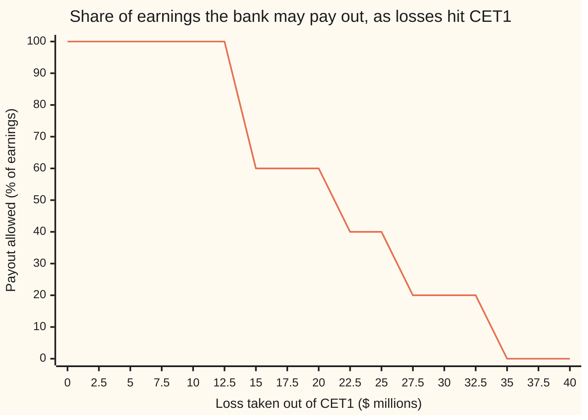

# Basel capital: risk-weighted assets, the ratios, and the buffers on top

Financial mathematics → Regulatory Capital in Outline → Capital ratios and buffers → Basel capital

---

## General Overview

Take one bank. It has lent $1 billion: $400 million as home mortgages, $400 million to companies, $200 million to households and small firms. It also runs a trading book, a $100 million inventory of bonds and shares bought to sell on. Its owners' own money in the business, after the regulator's deductions, is $120 million. Everything else is borrowed, mostly from depositors.

That $120 million stands between a bad year and the depositors. Is it enough? Dividing it by the $1.1 billion on the books gives 10.91 percent, and treats a mortgage on a house worth far more than the loan as just as risky as an unsecured loan to a company. The rules of the Basel Committee on Banking Supervision, the international body of bank supervisors that meets in Basel, divide instead by a risk-adjusted size of the bank. Each loan counts at a fraction of its face value, set by how much it could lose in a bad year. That adjusted size is the bank's **risk-weighted assets**, RWA for short. Here it comes to $1,000 million.

The capital that counts first is **Common Equity Tier 1**, CET1: ordinary shares plus profits kept in the business, minus items that would be worthless in a failure, such as goodwill (the premium paid for past acquisitions). The bank's CET1 ratio is $120 million over $1,000 million: 12 percent. Because this bank holds no other kind of capital, the rules ask it for 10.5 percent. It has 1.5 percentage points, $15 million, to spare. A loss of $15 million or more does not close the bank or even break a minimum. It does something more precise: it caps the dividends, share buybacks and bonuses the bank may pay until the capital is rebuilt.

**Weight every exposure by its riskiness, divide the owners' loss-absorbing capital by the weighted total, and compare that ratio with a stack of minimums plus a buffer whose shortfall limits payouts step by step.**

**What kind of fact this is:** a convention: rules agreed by the Basel Committee and written into national law. The arithmetic that follows from them is proved on this card in Why it works; the percentages themselves are choices, not theorems.

### The picture: what the $120 million is doing

The ratio requirement is a stack. Each layer is a percentage of the $1,000 million RWA. The bank fills every layer with CET1, because CET1 is all it has.

```
The bank's $120.00m of CET1, layer by layer (each █ = 2.5 million dollars)
  CET1 minimum, 4.5%                 ██████████████████      $45.00m
  fills the empty AT1 slot, 1.5%     ██████                  $15.00m
  fills the empty Tier 2 slot, 2.0%  ████████                $20.00m
  conservation buffer, 2.5%          ██████████              $25.00m
  cushion above the 10.5% need       ██████                  $15.00m
```

The first three layers are hard floors: break one and the bank is below a minimum. The fourth is the **conservation buffer**: using it is allowed, but it limits payouts. The fifth is slack.

---

## The formula

Notation first. A small $i$ written below a letter labels the bank's loan groups, and the sign Σ in front means "add up over every group". Money is in millions of dollars; rates are written as percent here and as decimals in the code.

$$R \;=\; \sum_i w_i\,E_i \;+\; 12.5\,(K_M + K_O)$$

**Read it aloud:** risk-weighted assets are each loan group times its risk weight, all added up, plus twelve and a half times the capital the market and operational calculations already ask for.

$$\frac{C}{R} \;\ge\; \frac{F + bR}{R}, \qquad F \;=\; \max\!\big(4.5\%\,R,\;\; 6\%\,R - A_1,\;\; 8\%\,R - A_1 - T_2\big)$$

**Read it aloud:** CET1 over RWA must cover the CET1 needed to prop up the three minimums, plus the buffer.

The first ratio, $C/R$, is the **CET1 ratio**. The Tier 1 ratio is $(C + A_1)/R$ and the total capital ratio is $(C + A_1 + T_2)/R$; their minimums are 4.5, 6 and 8 percent.

| Symbol | Plain meaning | In our example | Push it up and the CET1 ratio… |
| --- | --- | --- | --- |
| $E_i$, $i$ | exposure: the amount lent in loan group $i$ | $400m, $400m, $200m | falls: more to cover |
| $w_i$ | risk weight: the fraction of $E_i$ that counts, set by the rulebook | 30%, 100%, 75% | falls |
| $K_M$ | market-risk capital charge on the trading book, from its own calculation | $12m | falls |
| $K_O$ | operational-risk charge: losses from failed processes, fraud, outages | $14.40m | falls |
| $R$ | risk-weighted assets, RWA | $1,000m | falls: same capital, bigger base |
| $C$ | Common Equity Tier 1: shares plus retained profit, after deductions | $120m | rises |
| $A_1$ | Additional Tier 1: perpetual bonds that convert to shares or are written off under stress | $0m | leaves it alone, but lowers what CET1 must cover |
| $T_2$ | Tier 2: long subordinated debt, repaid only after depositors | $0m | same as $A_1$, total ratio only |
| $F$ | the CET1 used up meeting the three minimums | $80m | — |
| $b$ | the buffer rate: 2.5% conservation, plus any countercyclical rate | 2.5% | raises the need |
| $q$ | the CET1 ratio the payout table reads, after the minimums are met | 8.5% | more payout allowed |
| $L$ | a loss that comes straight out of CET1 | $0 to $40m | lowers it |

The helper $q$ has its own formula:

$$q \;=\; 4.5\% \;+\; \frac{C - F}{R}$$

In words: start at the bare CET1 minimum, then add whatever CET1 is left after all three minimums are propped up. A bank with only CET1 has $q$ equal to its CET1 ratio minus 3.5 points.

**Conventions verified 28 Sep 2026** against the Basel Committee's texts in Sources: the 4.5, 6 and 8 percent minimums, the 2.5 percent conservation buffer and its payout table, the rule that CET1 meets the minimums first, the 12.5 multiplier, and the 30, 75 and 100 percent weights used here. National law can add to all of them.

### When it holds

This is a convention: it holds wherever a supervisor has written it into law, and nowhere else. The arithmetic on this card also assumes three things.

- **The weights and charges are given.** The card takes the 30, 75 and 100 percent weights, the $12m market charge and the $14.40m operational charge as inputs. Where they come from is the work of other cards; get one wrong and RWA is wrong by that group's share.
- **One snapshot.** RWA is held fixed while losses hit CET1. In a real downturn loans also get riskier and RWA rises, so the ratio falls faster than the loss alone says.
- **No add-ons.** No countercyclical buffer, no surcharge for systemically important banks, no supervisor-specific extra. Each one raises $b$ or the minimums, and the whole calculation shifts with it.

---

## Why it works

### Step 0: capital is what absorbs a loss before anyone else does

A bank's balance sheet is loans on one side and, on the other, what it owes plus what its owners put in. A loss writes down a loan. The other side must shrink by the same amount, and the owners' claim ranks last, so it shrinks first. So owners' capital is a cushion: it absorbs losses in full until it is gone, and then depositors are exposed.

The question "is there enough cushion?" needs a yardstick. The earlier card [expected-versus-unexpected-loss](01-expected-versus-unexpected-loss.md) split a loan book's losses in two: the **expected loss**, the ordinary cost of lending that prices and provisions already cover, and the **unexpected loss**, the extra a bad year can bring. Capital is for the second. So the yardstick should grow with how much a bad year could cost, not with the face value of the loans.

### Step 1: weight each loan by how much a bad year could cost

A dollar lent against a house worth well more than the loan can lose far less than a dollar lent to an unrated company, because the house can be sold. The rulebook turns that into a **risk weight**: the fraction of the loan that counts towards the yardstick. The mortgages here count at 30 percent, the retail loans at 75, the corporate loans at 100.

$$\text{credit RWA} = 0.30 \times 400 + 1.00 \times 400 + 0.75 \times 200 = 120 + 400 + 150 = 670$$

The weights are not guessed. Under the internal-ratings route, a bank's own default probabilities go into a formula that asks how much of a loan could be lost in a year as bad as one in a thousand; [vasicek-loss-distribution-and-basel-capital](../45-Portfolio%20Credit%20-%20Correlation%2C%20Copulas%2C%20Indices%20and%20Tranches/03-vasicek-loss-distribution-and-basel-capital.md) derives it. The standardised weights used here are fixed values the Committee sets for each kind of loan: a simpler stand-in for that formula.

### Step 2: the 12.5 turns a capital charge into risk-weighted assets

Market risk and operational risk are not measured loan by loan. Their calculations produce a capital charge directly: dollars of capital the bank must hold. The market-risk charge on the trading book comes from [frtb-and-the-shift-to-expected-shortfall](04-frtb-and-the-shift-to-expected-shortfall.md); here it is $12m. The operational charge for a bank this size (business indicator up to €1 billion) is 12 percent of its **business indicator**, a measure of income from lending, fees and trading; a $120m indicator gives $14.40m.

To put those charges on the same scale as credit RWA, ask: what RWA would need exactly this much capital at the 8 percent total minimum? The answer is the charge divided by 8 percent, and dividing by 0.08 is multiplying by 12.5.

$$150 = 12.5 \times 12, \qquad 180 = 12.5 \times 14.40, \qquad R = 670 + 150 + 180 = 1{,}000$$

This gives a second road to $R$. Work in charges instead: 8 percent of the credit RWA is $53.60m; add $12m and $14.40m and the total 8 percent charge is $80m. Scale up by 12.5 and the answer is again $1,000m. The code takes both roads.

### Step 3: CET1 meets the minimums first

There are three minimums, one for each ring of capital. CET1 alone must be at least 4.5 percent of RWA. CET1 plus Additional Tier 1 must be at least 6 percent. All capital, adding Tier 2, must be at least 8 percent. Better capital can always stand in for worse, never the reverse. So a bank short of $A_1$ or $T_2$ fills the gap with CET1.

The CET1 needed is the largest of three shortfalls, which is $F$. For this bank $A_1 = T_2 = 0$, so $F = \max(45, 60, 80) = 80$: the total-capital floor binds, and all $80m comes from CET1.

A bank that did hold $15m of Additional Tier 1 and $20m of Tier 2 would face $F = \max(45, 45, 45) = 45$. Its CET1 need, with the buffer, would be 7 percent, not 10.5.

<details>
<summary>Detailed proof: why $F$ is the least CET1 that clears all three minimums</summary>

The three conditions are $C \ge 4.5\%\,R$, $C + A_1 \ge 6\%\,R$ and $C + A_1 + T_2 \ge 8\%\,R$. Rearranged, each is a lower bound on $C$ alone: $C \ge 4.5\%\,R$, $C \ge 6\%\,R - A_1$, $C \ge 8\%\,R - A_1 - T_2$. A number clears several lower bounds exactly when it clears the largest, so the least such $C$ is their maximum, $F$.

The conservation buffer is defined as CET1 held **above** what the minimums use, so the full requirement is $C \ge F + b\,R$. Divide by $R$, which is positive: $C/R \ge (F + b\,R)/R$. With $F = 80$, $b = 2.5\%$ and $R = 1{,}000$ that is 10.5 percent.

The code checks $F$ a second way: it counts CET1 upward a thousand dollars at a time until all three conditions hold, and lands on the same value for both banks.

</details>

### Step 4: the buffer is a slope, not a cliff

The minimums are floors: a bank below one is in breach, and the supervisor steps in. The buffer works differently. A bank may dip into it, which is the point of having it in a bad year, but while it is inside the buffer it must keep a share of its earnings instead of paying them out. The share depends on how deep it has gone. The Basel table reads the ratio $q$:

| $q$, the CET1 ratio after minimums | Share of earnings that must be kept |
| --- | --- |
| 4.5% to 5.125% | 100% |
| above 5.125% to 5.75% | 80% |
| above 5.75% to 6.375% | 60% |
| above 6.375% to 7.0% | 40% |
| above 7.0% | 0% |

The bands are the four quarters of the 2.5-point buffer. So the same rule can be stated in dollars: of the $25m buffer, how many $6.25m quarters are still full? Full buffer, no limit. Top quarter partly used, keep 40 percent of earnings. Bottom quarter partly used, keep everything.

<details>
<summary>Detailed proof: the percent table and the dollar quarters are the same rule</summary>

Count quarters with a whole number n, which is 1, 2, 3 or 4. The table's band edges are 4.5 percent plus n times 0.625 percent, and 0.625 percent is a quarter of $b = 2.5\%$. Now $q \le 4.5\% + n\,b/4$ holds exactly when $(C - F)/R \le n\,b/4$, which, multiplying by the positive $R$, is $C - F \le n \times b\,R/4$. The left side is the dollars of CET1 left above the minimums; the right side is n quarters of the dollar buffer. So each row of the table is the matching dollar statement, edge for edge, including which side of each edge belongs to which row.

The code runs both statements on every loss from $0 to $40m in steps of $0.1m and requires the same answer each time.

</details>

Notice the top edge. The table says "above 7.0%" for no limit. At exactly $q = 7.0\%$, which is a CET1 ratio of exactly 10.5 percent for this bank, the 40 percent row applies. Meeting the requirement exactly is already inside the buffer.

### Step 5: two ways to break the buffer

The requirement $C \ge F + b\,R$ can fail from either side.

**The numerator falls.** A loss $L$ comes straight out of CET1. The buffer is breached once $C - L \le F + bR$, that is once $L \ge C - F - bR = 120 - 80 - 25 = 15$. The minimum itself breaks only past $L = C - F = 40$.

**The denominator rises.** If the bank lends more, or its loans are downgraded, RWA grows. With a CET1-only bank, $F + bR$ is 10.5 percent of $R$, so the buffer is breached once $R \ge C / 10.5\%$: RWA up by 14.29 percent. No money was lost.

The code finds each breaking point twice: from the formula, and by bisection (halving an interval until it pins the point) on the payout rule itself.

### Other routes

Banks approved to use their own models compute credit RWA from the internal-ratings formula instead of fixed weights; [vasicek-asrf-and-credit-capital](03-vasicek-asrf-and-credit-capital.md) does that route properly. Their RWA may not fall below 72.5 percent of the standardised figure, a rule called the output floor. Everything after $R$ on this card is unchanged by the choice.

---

## Worked numbers, by hand

The bank: loans of $400m at 30%, $400m at 100%, $200m at 75%; a $100m trading book with a $12m market charge; a $120m business indicator; CET1 $120m, no other capital.

| Step | Arithmetic | Value |
| --- | --- | --- |
| credit RWA | 0.30 × 400 + 1.00 × 400 + 0.75 × 200 | $670m |
| market RWA | 12.5 × 12 | $150m |
| operational charge | 12% × 120 | $14.40m |
| operational RWA | 12.5 × 14.40 | $180m |
| total RWA, $R$ | 670 + 150 + 180 | $1,000m |
| CET1 ratio | 120 ÷ 1,000 | 12.00% |
| CET1 used by minimums, $F$ | max(45, 60 − 0, 80 − 0 − 0) | $80m |
| buffer, $b\,R$ | 2.5% × 1,000 | $25m |
| CET1 need | (80 + 25) ÷ 1,000 | 10.50% |
| cushion | 120 − 80 − 25 | **$15m** |
| payout table ratio, $q$ | 4.5% + (120 − 80) ÷ 1,000 | 8.50%, no limit |

The bank clears its requirement by $15m. Any loss of that size or more, or 14.29 percent more RWA, puts it inside the buffer and caps what it may pay out.

### What breaks if you drop a piece

Correct CET1 ratio: 12.00 percent against a 10.50 percent need.

| Mistake | Comes out at | What went wrong |
| --- | --- | --- |
| Divide by loans plus trading book, $1,100m | 10.91% | Unweighted size: looks like a breach. That is a leverage measure, a different rule. |
| Count credit RWA only | 17.91% | Market and operational risk left out: $150m and $180m of RWA missing |
| Add the charges without the 12.5 | 17.23% | A capital charge added to an asset measure: units mixed |
| Take 7% (4.5 + 2.5) as this bank's need | cushion $50m, not $15m | Forgot that CET1 must also fill the empty Tier 1 and Tier 2 slots |

---

## When losses arrive: the ratio falls and the payout limit steps down

The mystery: a bank loses $20m, stays above every minimum by $20m, and is still told it may pay out only 60 percent of its earnings. Nothing failed. The buffer was used, and using it has a price.

### One story, loss by loss

Hold RWA at $1,000m and let losses come straight out of CET1.

| Loss | CET1 | CET1 ratio | $q$ | Must keep | May pay out |
| --- | --- | --- | --- | --- | --- |
| $0m | $120m | 12.00% | 8.500% | 0% | 100% |
| $10m | $110m | 11.00% | 7.500% | 0% | 100% |
| $15m | $105m | 10.50% | 7.000% | 40% | 60% |
| $20m | $100m | 10.00% | 6.500% | 40% | 60% |
| $25m | $95m | 9.50% | 6.000% | 60% | 40% |
| $30m | $90m | 9.00% | 5.500% | 80% | 20% |
| $35m | $85m | 8.50% | 5.000% | 100% | 0% |
| $40m | $80m | 8.00% | 4.500% | 100% | 0% |

After a $20m loss, with $10m of earnings in the next year, the bank may pay out at most $6m. At $40m the bank sits exactly on its 8 percent total minimum; one more dollar and it is below a minimum, which is a matter for the supervisor, not the payout table.

### Force one: losses shrink the numerator

```
CET1 ratio as losses come out of CET1, RWA fixed at $1,000m (each █ = 0.25 points)
  loss  $0m   ████████████████████████████████████████████████  12.00%
  loss $10m   ████████████████████████████████████████████      11.00%
  loss $20m   ████████████████████████████████████████          10.00%
  loss $30m   ████████████████████████████████████              9.00%
  loss $40m   ████████████████████████████████                  8.00%
```

Every $10m of loss costs one percentage point, because RWA is $1,000m.

### Force two: growth stretches the denominator

Freeze CET1 at $120m and let RWA grow. At 14.29 percent more RWA the ratio reaches 10.5 percent and the buffer is breached with no loss at all. The two forces add: a $10m loss together with 5 percent RWA growth gives 10.48 percent, already inside the buffer, though neither alone would be.

### Both together: the payout staircase



The single line is the payout limit. It is flat at 100 percent while the $15m cushion absorbs losses, drops to 60 percent the moment the buffer is touched, and then steps down by 20 points for each further $6.25m quarter of the buffer used. At $40m it reaches zero with the bank still exactly at its minimum. Steps rather than a cliff are the design: a bank is never pushed from "pay everything" to "pay nothing" by one dollar of loss.

---

## Code, from first principles, and it actually runs

Three independent roads to the CET1 ratio: weights plus 12.5 times the charges; the 8 percent charges added up; and exact whole-number arithmetic in thousands of dollars. Two roads each to the CET1 need (the max formula, and counting up), to the payout limit (the percent table, and the dollar quarters, required to agree on 401 losses), and to each breaking point (formula, and bisection). Every number on the card is printed, including every chart value.

### Python

```python
# Basel capital -- the check behind the card.  Standard library only.
# Every number quoted on the card is printed here.  Three roads to the CET1 ratio,
# two to the payout limit, two to each breaking point, two to the CET1 a bank needs.
# Money in millions of dollars; ratios as decimals inside, percent when printed.

LOANS = [(400.0, 0.30),   # mortgages, loan-to-value 60-80%: 30% weight
         (400.0, 1.00),   # unrated corporate loans: 100% weight
         (200.0, 0.75)]   # regulatory retail loans: 75% weight
K_M = 12.0                # market-risk capital charge on the 100m trading book
K_O = 0.12 * 120.0        # operational-risk charge: 12% of a 120m business indicator
CET1, AT1, T2 = 120.0, 0.0, 0.0
MIN_C, MIN_T1, MIN_TOT, CCB = 0.045, 0.06, 0.08, 0.025
TABLE = [(0.05125, 1.00), (0.0575, 0.80), (0.06375, 0.60), (0.07, 0.40)]   # buffer-table CET1 up to, share kept

def rwa(loans, km, ko):                          # road 1: weight each loan, turn charges into RWA
    return sum(e * w for e, w in loans) + 12.5 * (km + ko)

def ratio_by_charges(c, loans, km, ko):          # road 2: add the 8% charges, then compare
    charge = sum(MIN_TOT * e * w for e, w in loans) + km + ko
    return MIN_TOT * c / charge

def exact_bp(c_k, loans_k, charges_k):           # road 3: whole thousands of dollars, whole-percent weights
    r_k = sum(e * w for e, w in loans_k) // 100 + charges_k * 25 // 2
    return c_k * 10000 // r_k, c_k * 10000 % r_k, r_k

def cet1_for_minima(r, a1, t2):                  # CET1 must fill whatever the other tiers leave empty
    return max(MIN_C * r, MIN_T1 * r - a1, MIN_TOT * r - a1 - t2)

def cet1_for_minima_scan(r_k, a1_k, t2_k):       # second road: count up a thousand dollars at a time
    c = 0
    while not (1000 * c >= 45 * r_k and 1000 * (c + a1_k) >= 60 * r_k and 1000 * (c + a1_k + t2_k) >= 80 * r_k):
        c += 1
    return c

def keep_by_table(c, r, a1=0.0, t2=0.0):         # payout rule, road A: the Basel table on CET1 ratios
    q = MIN_C + (c - cet1_for_minima(r, a1, t2)) / r
    if q < MIN_C - 1e-12: return None             # below a minimum: not a buffer question any more
    for top, keep in TABLE:
        if q <= top + 1e-12: return keep
    return 0.0

def keep_by_dollars(c_k, r_k):                    # payout rule, road B: which quarter of the buffer is still full
    excess, buf = c_k - 80 * r_k // 1000, 25 * r_k // 1000
    if excess < 0: return None
    for j, keep in ((1, 1.00), (2, 0.80), (3, 0.60), (4, 0.40)):
        if 4 * excess <= j * buf: return keep
    return 0.0

def bisect(f, lo, hi, n=200):                     # root finder: f(lo) < 0 <= f(hi)
    for _ in range(n):
        mid = 0.5 * (lo + hi)
        lo, hi = (mid, hi) if f(mid) < 0 else (lo, mid)
    return hi

R = rwa(LOANS, K_M, K_O)
credit = sum(e * w for e, w in LOANS)
ratio1 = CET1 / R
ratio2 = ratio_by_charges(CET1, LOANS, K_M, K_O)
bp, rem, r_k = exact_bp(120000, [(400000, 30), (400000, 100), (200000, 75)], 12000 + 14400)
need = (cet1_for_minima(R, AT1, T2) + CCB * R) / R
loss_formula = CET1 - need * R
lo, hi = 0, 120000
while lo < hi:
    mid = (lo + hi) // 2
    lo, hi = (mid + 1, hi) if keep_by_dollars(120000 - mid, r_k) == 0.0 else (lo, mid)
loss_bisect = lo / 1000.0
grow_formula = CET1 / (need * R) - 1.0
grow_bisect = bisect(lambda g: keep_by_table(CET1, R * (1 + g)) - 0.2, 0.0, 0.4)
mixed_a1, mixed_t2 = 15.0, 20.0
mixed_need = (cet1_for_minima(R, mixed_a1, mixed_t2) + CCB * R) / R
mixed_scan = (cet1_for_minima_scan(r_k, 15000, 20000) + 25 * r_k // 1000) / r_k

assert rem == 0 and abs(100 * ratio1 - bp / 100) < 1e-12, "road 1 against the exact integer road"
assert abs(ratio2 - ratio1) < 1e-12, "charges road against the weights road"
assert abs(mixed_need - mixed_scan) < 1e-12, "CET1 need, mixed bank: max formula against the scan"
assert abs(need - (cet1_for_minima_scan(r_k, 0, 0) + 25 * r_k // 1000) / r_k) < 1e-12, "CET1 need, CET1-only bank"
assert abs(loss_formula - loss_bisect) < 1e-9, "breach loss: formula against bisection on the dollar rule"
assert abs(grow_formula - grow_bisect) < 1e-9, "RWA growth: formula against bisection on the table rule"
for tenth in range(0, 401):                        # the two payout roads agree on every loss, 0 to 40m by 0.1m
    assert keep_by_table(CET1 - tenth / 10, R) == keep_by_dollars(120000 - 100 * tenth, r_k), tenth

rows = [
    ("credit RWA, sum of E w", credit), ("market RWA, 12.5 K_M", 12.5 * K_M),
    ("operational charge K_O", K_O), ("operational RWA, 12.5 K_O", 12.5 * K_O),
    ("CET1, C", CET1), ("Tier 1 floor, 6% of RWA", MIN_T1 * R), ("total RWA R, weights", R), ("credit charge, 8% of credit RWA", MIN_TOT * credit),
    ("  8% charges added up", MIN_TOT * R),
    ("CET1 ratio %, road 1 weights", 100 * ratio1), ("CET1 ratio %, road 2 charges", 100 * ratio2),
    ("CET1 ratio %, road 3 exact bp", bp / 100 + rem / r_k / 100),
    ("stack: CET1 minimum 4.5%", MIN_C * R), ("stack: fills AT1 slot 1.5%", (MIN_T1 - MIN_C) * R),
    ("stack: fills Tier 2 slot 2.0%", (MIN_TOT - MIN_T1) * R), ("stack: conservation buffer", CCB * R),
    ("buffer quarter", CCB * R / 4),
    ("stack: cushion above need", CET1 - need * R),
    ("CET1 need %, CET1-only bank", 100 * need), ("CET1 need %, mixed bank, formula", 100 * mixed_need),
    ("CET1 need %, mixed bank, scan", 100 * mixed_scan),
    ("buffer-breach loss, formula", loss_formula), ("buffer-breach loss, bisection", loss_bisect),
    ("minimum-breach loss", CET1 - MIN_TOT * R),
    ("RWA growth to breach %, formula", 100 * grow_formula), ("RWA growth to breach %, bisection", 100 * grow_bisect),
    ("payout at 20m loss, of 10m earnings", 10.0 * (1 - keep_by_table(CET1 - 20, R))),
    ("wrong: divide by loans + book %", 100 * CET1 / 1100.0), ("wrong: credit RWA only %", 100 * CET1 / credit),
    ("wrong: charges not times 12.5 %", 100 * CET1 / (credit + K_M + K_O)),
    ("wrong: 7% read as need, cushion", CET1 - (MIN_C + CCB) * R),
    ("try: CCyB 1%, need %", 100 * (need + 0.01)), ("try: CCyB 1%, cushion", CET1 - (need + 0.01) * R),
    ("try: loss 10 and RWA +5%, ratio %", 100 * (CET1 - 10) / (1.05 * R)),
    ("try: corporates at 75%, ratio %", 100 * CET1 / (R - 100.0)),
]
for name, v in rows:
    print(f"{name:<38} {v:>12.4f}")

print()
print("  loss   CET1   ratio%  table%  keep%  payout%")
for loss in range(0, 45, 5):
    c = CET1 - loss
    k = keep_by_table(c, R)
    q = MIN_C + (c - cet1_for_minima(R, AT1, T2)) / R
    kept = "below min" if k is None else f"{100 * k:5.0f}  {100 * (1 - k):7.0f}"
    print(f"{loss:6d} {c:6.0f} {100 * c / R:8.2f} {100 * q:7.3f}  {kept}")
chart = [keep_by_table(CET1 - 2.5 * i, R) for i in range(17)]
print("chart, loss 0..40 by 2.5 ", " ".join(f"{2.5 * i:g}" for i in range(17)))
print("chart, payout % of earnings", " ".join(f"{100 * (1 - k):.0f}" for k in chart))

print("ALL CHECKS PASS")
```

**Ran 2026-09-28 on macOS, Python 3.14.6, standard library only. All checks passed. Output, pasted from the run:**

```
credit RWA, sum of E w                     670.0000
market RWA, 12.5 K_M                       150.0000
operational charge K_O                      14.4000
operational RWA, 12.5 K_O                  180.0000
CET1, C                                    120.0000
Tier 1 floor, 6% of RWA                     60.0000
total RWA R, weights                      1000.0000
credit charge, 8% of credit RWA             53.6000
  8% charges added up                       80.0000
CET1 ratio %, road 1 weights                12.0000
CET1 ratio %, road 2 charges                12.0000
CET1 ratio %, road 3 exact bp               12.0000
stack: CET1 minimum 4.5%                    45.0000
stack: fills AT1 slot 1.5%                  15.0000
stack: fills Tier 2 slot 2.0%               20.0000
stack: conservation buffer                  25.0000
buffer quarter                               6.2500
stack: cushion above need                   15.0000
CET1 need %, CET1-only bank                 10.5000
CET1 need %, mixed bank, formula             7.0000
CET1 need %, mixed bank, scan                7.0000
buffer-breach loss, formula                 15.0000
buffer-breach loss, bisection               15.0000
minimum-breach loss                         40.0000
RWA growth to breach %, formula             14.2857
RWA growth to breach %, bisection           14.2857
payout at 20m loss, of 10m earnings          6.0000
wrong: divide by loans + book %             10.9091
wrong: credit RWA only %                    17.9104
wrong: charges not times 12.5 %             17.2315
wrong: 7% read as need, cushion             50.0000
try: CCyB 1%, need %                        11.5000
try: CCyB 1%, cushion                        5.0000
try: loss 10 and RWA +5%, ratio %           10.4762
try: corporates at 75%, ratio %             13.3333

  loss   CET1   ratio%  table%  keep%  payout%
     0    120    12.00   8.500      0      100
     5    115    11.50   8.000      0      100
    10    110    11.00   7.500      0      100
    15    105    10.50   7.000     40       60
    20    100    10.00   6.500     40       60
    25     95     9.50   6.000     60       40
    30     90     9.00   5.500     80       20
    35     85     8.50   5.000    100        0
    40     80     8.00   4.500    100        0
chart, loss 0..40 by 2.5  0 2.5 5 7.5 10 12.5 15 17.5 20 22.5 25 27.5 30 32.5 35 37.5 40
chart, payout % of earnings 100 100 100 100 100 100 60 60 60 40 40 20 20 20 0 0 0
ALL CHECKS PASS
```

### Rust

Same bank, same roads, same labels. No crates.

```rust
// Basel capital -- the same check as basel_capital_and_risk_weighted_assets_check.py, in Rust.
// Standard library only, no crates.  Three roads to the CET1 ratio, two to the payout
// limit, two to each breaking point, two to the CET1 a bank needs.
// Money in millions of dollars; ratios as decimals inside, percent when printed.

const LOANS: [(f64, f64); 3] = [(400.0, 0.30), (400.0, 1.00), (200.0, 0.75)]; // mortgages, corporates, retail
const K_M: f64 = 12.0;                       // market-risk capital charge on the 100m trading book
const MIN_C: f64 = 0.045;
const MIN_T1: f64 = 0.06;
const MIN_TOT: f64 = 0.08;
const CCB: f64 = 0.025;
const TABLE: [(f64, f64); 4] = [(0.05125, 1.00), (0.0575, 0.80), (0.06375, 0.60), (0.07, 0.40)];

fn rwa(km: f64, ko: f64) -> f64 {           // road 1: weight each loan, turn charges into RWA
    LOANS.iter().map(|(e, w)| e * w).sum::<f64>() + 12.5 * (km + ko)
}

fn ratio_by_charges(c: f64, km: f64, ko: f64) -> f64 {   // road 2: add the 8% charges, then compare
    let charge = LOANS.iter().map(|(e, w)| MIN_TOT * e * w).sum::<f64>() + km + ko;
    MIN_TOT * c / charge
}

fn exact_bp(c_k: i64, loans_k: &[(i64, i64)], charges_k: i64) -> (i64, i64, i64) {   // road 3: integers
    let r_k = loans_k.iter().map(|(e, w)| e * w).sum::<i64>() / 100 + charges_k * 25 / 2;
    (c_k * 10000 / r_k, c_k * 10000 % r_k, r_k)
}

fn cet1_for_minima(r: f64, a1: f64, t2: f64) -> f64 {   // CET1 fills whatever the other tiers leave empty
    (MIN_C * r).max(MIN_T1 * r - a1).max(MIN_TOT * r - a1 - t2)
}

fn cet1_for_minima_scan(r_k: i64, a1_k: i64, t2_k: i64) -> i64 {   // count up a thousand dollars at a time
    let mut c = 0;
    while !(1000 * c >= 45 * r_k && 1000 * (c + a1_k) >= 60 * r_k && 1000 * (c + a1_k + t2_k) >= 80 * r_k) {
        c += 1;
    }
    c
}

fn keep_by_table(c: f64, r: f64) -> Option<f64> {   // payout rule, road A: the Basel table on CET1 ratios
    let q = MIN_C + (c - cet1_for_minima(r, 0.0, 0.0)) / r;
    if q < MIN_C - 1e-12 { return None; }
    for (top, keep) in TABLE.iter() {
        if q <= top + 1e-12 { return Some(*keep); }
    }
    Some(0.0)
}

fn keep_by_dollars(c_k: i64, r_k: i64) -> Option<f64> {   // road B: which quarter of the buffer is still full
    let (excess, buf) = (c_k - 80 * r_k / 1000, 25 * r_k / 1000);
    if excess < 0 { return None; }
    for (j, keep) in [(1, 1.00), (2, 0.80), (3, 0.60), (4, 0.40)] {
        if 4 * excess <= j * buf { return Some(keep); }
    }
    Some(0.0)
}

fn bisect<F: Fn(f64) -> f64>(f: F, mut lo: f64, mut hi: f64) -> f64 {   // root finder: f(lo) < 0 <= f(hi)
    for _ in 0..200 {
        let mid = 0.5 * (lo + hi);
        if f(mid) < 0.0 { lo = mid; } else { hi = mid; }
    }
    hi
}

fn main() {
    let (cet1, at1, t2) = (120.0_f64, 0.0_f64, 0.0_f64);
    let k_o = 0.12 * 120.0;                  // operational-risk charge: 12% of a 120m business indicator
    let r = rwa(K_M, k_o);
    let credit: f64 = LOANS.iter().map(|(e, w)| e * w).sum();
    let ratio1 = cet1 / r;
    let ratio2 = ratio_by_charges(cet1, K_M, k_o);
    let (bp, rem, r_k) = exact_bp(120000, &[(400000, 30), (400000, 100), (200000, 75)], 12000 + 14400);
    let need = (cet1_for_minima(r, at1, t2) + CCB * r) / r;
    let loss_formula = cet1 - need * r;
    let (mut lo, mut hi) = (0_i64, 120000_i64);   // smallest whole-thousand loss at which earnings must be kept
    while lo < hi {
        let mid = (lo + hi) / 2;
        if keep_by_dollars(120000 - mid, r_k) == Some(0.0) { lo = mid + 1; } else { hi = mid; }
    }
    let loss_bisect = lo as f64 / 1000.0;
    let grow_formula = cet1 / (need * r) - 1.0;
    let grow_bisect = bisect(|g| keep_by_table(cet1, r * (1.0 + g)).unwrap() - 0.2, 0.0, 0.4);
    let mixed_need = (cet1_for_minima(r, 15.0, 20.0) + CCB * r) / r;
    let mixed_scan = (cet1_for_minima_scan(r_k, 15000, 20000) + 25 * r_k / 1000) as f64 / r_k as f64;

    assert!(rem == 0 && (100.0 * ratio1 - bp as f64 / 100.0).abs() < 1e-12, "road 1 against the exact integer road");
    assert!((ratio2 - ratio1).abs() < 1e-12, "charges road against the weights road");
    assert!((mixed_need - mixed_scan).abs() < 1e-12, "CET1 need, mixed bank: max formula against the scan");
    let only_scan = (cet1_for_minima_scan(r_k, 0, 0) + 25 * r_k / 1000) as f64 / r_k as f64;
    assert!((need - only_scan).abs() < 1e-12, "CET1 need, CET1-only bank");
    assert!((loss_formula - loss_bisect).abs() < 1e-9, "breach loss: formula against bisection on the dollar rule");
    assert!((grow_formula - grow_bisect).abs() < 1e-9, "RWA growth: formula against bisection on the table rule");
    for tenth in 0..401_i64 {                // the two payout roads agree on every loss, 0 to 40m by 0.1m
        assert!(keep_by_table(cet1 - tenth as f64 / 10.0, r) == keep_by_dollars(120000 - 100 * tenth, r_k), "{}", tenth);
    }

    let rows: Vec<(&str, f64)> = vec![
        ("credit RWA, sum of E w", credit), ("market RWA, 12.5 K_M", 12.5 * K_M),
        ("operational charge K_O", k_o), ("operational RWA, 12.5 K_O", 12.5 * k_o),
        ("CET1, C", cet1), ("Tier 1 floor, 6% of RWA", MIN_T1 * r), ("total RWA R, weights", r), ("credit charge, 8% of credit RWA", MIN_TOT * credit),
        ("  8% charges added up", MIN_TOT * r),
        ("CET1 ratio %, road 1 weights", 100.0 * ratio1), ("CET1 ratio %, road 2 charges", 100.0 * ratio2),
        ("CET1 ratio %, road 3 exact bp", bp as f64 / 100.0 + rem as f64 / r_k as f64 / 100.0),
        ("stack: CET1 minimum 4.5%", MIN_C * r), ("stack: fills AT1 slot 1.5%", (MIN_T1 - MIN_C) * r),
        ("stack: fills Tier 2 slot 2.0%", (MIN_TOT - MIN_T1) * r), ("stack: conservation buffer", CCB * r),
        ("buffer quarter", CCB * r / 4.0),
        ("stack: cushion above need", cet1 - need * r),
        ("CET1 need %, CET1-only bank", 100.0 * need), ("CET1 need %, mixed bank, formula", 100.0 * mixed_need),
        ("CET1 need %, mixed bank, scan", 100.0 * mixed_scan),
        ("buffer-breach loss, formula", loss_formula), ("buffer-breach loss, bisection", loss_bisect),
        ("minimum-breach loss", cet1 - MIN_TOT * r),
        ("RWA growth to breach %, formula", 100.0 * grow_formula), ("RWA growth to breach %, bisection", 100.0 * grow_bisect),
        ("payout at 20m loss, of 10m earnings", 10.0 * (1.0 - keep_by_table(cet1 - 20.0, r).unwrap())),
        ("wrong: divide by loans + book %", 100.0 * cet1 / 1100.0), ("wrong: credit RWA only %", 100.0 * cet1 / credit),
        ("wrong: charges not times 12.5 %", 100.0 * cet1 / (credit + K_M + k_o)),
        ("wrong: 7% read as need, cushion", cet1 - (MIN_C + CCB) * r),
        ("try: CCyB 1%, need %", 100.0 * (need + 0.01)), ("try: CCyB 1%, cushion", cet1 - (need + 0.01) * r),
        ("try: loss 10 and RWA +5%, ratio %", 100.0 * (cet1 - 10.0) / (1.05 * r)),
        ("try: corporates at 75%, ratio %", 100.0 * cet1 / (r - 100.0)),
    ];
    for (name, v) in &rows { println!("{:<38} {:>12.4}", name, v); }

    println!();
    println!("  loss   CET1   ratio%  table%  keep%  payout%");
    for loss in (0..45).step_by(5) {
        let c = cet1 - loss as f64;
        let q = MIN_C + (c - cet1_for_minima(r, at1, t2)) / r;
        let kept = match keep_by_table(c, r) {
            None => "below min".to_string(),
            Some(k) => format!("{:5.0}  {:7.0}", 100.0 * k, 100.0 * (1.0 - k)),
        };
        println!("{:6} {:6.0} {:8.2} {:7.3}  {}", loss, c, 100.0 * c / r, 100.0 * q, kept);
    }
    let xs: Vec<String> = (0..17).map(|i| format!("{}", 2.5 * i as f64)).collect();
    let ys: Vec<String> = (0..17)
        .map(|i| format!("{:.0}", 100.0 * (1.0 - keep_by_table(cet1 - 2.5 * i as f64, r).unwrap())))
        .collect();
    println!("chart, loss 0..40 by 2.5  {}", xs.join(" "));
    println!("chart, payout % of earnings {}", ys.join(" "));

    println!("ALL CHECKS PASS");
}
```

**Ran 2026-09-28 on macOS, rustc 1.98.1, no crates. All checks passed. Output, pasted from the run:**

```
credit RWA, sum of E w                     670.0000
market RWA, 12.5 K_M                       150.0000
operational charge K_O                      14.4000
operational RWA, 12.5 K_O                  180.0000
CET1, C                                    120.0000
Tier 1 floor, 6% of RWA                     60.0000
total RWA R, weights                      1000.0000
credit charge, 8% of credit RWA             53.6000
  8% charges added up                       80.0000
CET1 ratio %, road 1 weights                12.0000
CET1 ratio %, road 2 charges                12.0000
CET1 ratio %, road 3 exact bp               12.0000
stack: CET1 minimum 4.5%                    45.0000
stack: fills AT1 slot 1.5%                  15.0000
stack: fills Tier 2 slot 2.0%               20.0000
stack: conservation buffer                  25.0000
buffer quarter                               6.2500
stack: cushion above need                   15.0000
CET1 need %, CET1-only bank                 10.5000
CET1 need %, mixed bank, formula             7.0000
CET1 need %, mixed bank, scan                7.0000
buffer-breach loss, formula                 15.0000
buffer-breach loss, bisection               15.0000
minimum-breach loss                         40.0000
RWA growth to breach %, formula             14.2857
RWA growth to breach %, bisection           14.2857
payout at 20m loss, of 10m earnings          6.0000
wrong: divide by loans + book %             10.9091
wrong: credit RWA only %                    17.9104
wrong: charges not times 12.5 %             17.2315
wrong: 7% read as need, cushion             50.0000
try: CCyB 1%, need %                        11.5000
try: CCyB 1%, cushion                        5.0000
try: loss 10 and RWA +5%, ratio %           10.4762
try: corporates at 75%, ratio %             13.3333

  loss   CET1   ratio%  table%  keep%  payout%
     0    120    12.00   8.500      0      100
     5    115    11.50   8.000      0      100
    10    110    11.00   7.500      0      100
    15    105    10.50   7.000     40       60
    20    100    10.00   6.500     40       60
    25     95     9.50   6.000     60       40
    30     90     9.00   5.500     80       20
    35     85     8.50   5.000    100        0
    40     80     8.00   4.500    100        0
chart, loss 0..40 by 2.5  0 2.5 5 7.5 10 12.5 15 17.5 20 22.5 25 27.5 30 32.5 35 37.5 40
chart, payout % of earnings 100 100 100 100 100 100 60 60 60 40 40 20 20 20 0 0 0
ALL CHECKS PASS
```

The two outputs agree line for line.

> [!TIP]
> **Try changing**
> Guess the direction first.
> - **Switch on a 1 percent countercyclical buffer**, the extra buffer supervisors add when credit is booming. The need rises to **11.50 percent** and the cushion shrinks from $15m to **$5m**.
> - **Give the bank $15m of Additional Tier 1 and $20m of Tier 2** (`cet1_for_minima(R, 15.0, 20.0)`). Its CET1 need falls from 10.5 to **7.00 percent**, because the cheaper capital now fills the Tier 1 and Tier 2 slots.
> - **Lose $10m and grow RWA by 5 percent at once.** The ratio is **10.48 percent**: inside the buffer, 40 percent of earnings kept, though neither change alone would do it.
> - **Reweight the corporate loans at 75 percent**, as for a company rated BBB. RWA falls and the ratio rises to **13.33 percent** with no new capital.

---

## The usual mistake

> [!warning]
> **Reading 10.5 percent as the CET1 minimum.** It is not. The CET1 minimum is 4.5 percent. The 10.5 percent is this bank's need because it holds no other capital, so CET1 must fill the 6 and 8 percent floors and then carry the 2.5 percent buffer on top. A bank with $15m of Additional Tier 1 and $20m of Tier 2 on the same RWA needs only 7.00 percent of CET1. And falling below 10.5 percent is not a breach of a minimum: it caps payouts, and the minimum is still $25m further down.
>
> Smaller traps:
> - **Dividing by total assets.** $120m over the $1,100m of loans and trading book is 10.91 percent, which looks like a breach. The risk-based rule divides by RWA; an unweighted ratio is the separate leverage rule.
> - **Forgetting market and operational RWA.** Credit alone gives 17.91 percent, a cushion that does not exist.
> - **Adding a capital charge to RWA without the 12.5.** Gives 17.23 percent. A charge is dollars of capital; RWA is dollars of risk-adjusted assets. The 12.5 converts one into the other.
> - **Thinking exactly 10.5 percent is safe.** At exactly the need the table's 40 percent row applies. The ratio must be above it.

---

## Where you meet it in real life

- **A bank's results day.** The CET1 ratio is the headline capital number in a large bank's quarterly results, shown next to its requirement and the margin the bank chooses to hold above it so that a bad quarter does not trigger the payout table.
- **Dividends and buybacks.** When a bank announces a buyback, it is spending CET1 above its requirement. The payout table on this card is why banks keep a margin: in the EU the cap it sets is called the maximum distributable amount.
- **Additional Tier 1 coupons.** Interest on Additional Tier 1 bonds counts as a distribution, so a bank inside its buffer may have to skip those coupons. Investors in these bonds watch the cushion closely.
- **Stress tests.** Supervisors project losses and RWA growth over a severe scenario, the numerator and denominator forces on this card, and check the ratio stays above its floor at the worst point.
- **Countercyclical buffers.** National authorities raise the buffer rate when credit grows fast and cut it in a crisis, releasing capital for lending.
- **Leverage and liquidity.** A second rule, [liquidity-and-leverage-ratios](05-liquidity-and-leverage-ratios.md), divides capital by unweighted exposure, a backstop in case the weights are wrong.

> **Say it back**
> A bank's owners' capital absorbs losses before depositors do. The Basel rules measure it against risk-weighted assets: each loan times its weight, plus 12.5 times the capital charges for market and operational risk, $1,000m here. CET1 must first cover the 4.5, 6 and 8 percent minimums wherever other capital is missing, then carry a 2.5 percent buffer, so this bank needs 10.5 percent and holds 12. A loss of $15m or more puts it inside the buffer, which does not close it but limits its payouts in steps as the buffer is used.

---

## What this builds on

- [expected-versus-unexpected-loss](01-expected-versus-unexpected-loss.md): why capital covers the unexpected part of a year's losses, and provisions the expected part.
- [vasicek-loss-distribution-and-basel-capital](../45-Portfolio%20Credit%20-%20Correlation%2C%20Copulas%2C%20Indices%20and%20Tranches/03-vasicek-loss-distribution-and-basel-capital.md): the credit-capital formula behind the risk weights, a one-in-a-thousand bad year for a whole loan book.

## Where this goes next

- [vasicek-asrf-and-credit-capital](03-vasicek-asrf-and-credit-capital.md): the third card on this shelf, where a bank's own default probabilities replace the fixed 30, 75 and 100 percent weights.
- [liquidity-and-leverage-ratios](05-liquidity-and-leverage-ratios.md): the unweighted leverage ratio and the cash tests that sit beside the risk-based ratio.

This card took the risk weights as given; the open question is where a weight such as 100 percent for a corporate loan comes from, and the internal-ratings formula answers it.

---

## Sources

Verified 28 Sep 2026: every link below resolves to the publisher's page.

- Basel Committee on Banking Supervision. *Basel III: A global regulatory framework for more resilient banks and banking systems*, revised June 2011. Bank for International Settlements. [Publisher page](https://www.bis.org/publ/bcbs189.htm). The 4.5, 6 and 8 percent minimums, the 2.5 percent conservation buffer and its payout table, the rule that CET1 meets the minimums first, and the countercyclical buffer.
- Basel Committee on Banking Supervision. *Basel III: Finalising post-crisis reforms*, December 2017. Bank for International Settlements. [Publisher page](https://www.bis.org/bcbs/publ/d424.htm). The standardised risk weights used here (30 percent for mortgages at 60 to 80 percent loan-to-value, 75 percent regulatory retail, 100 percent unrated corporates), the operational-risk business indicator at 12 percent, and RWA as 12.5 times a capital charge.
- Basel Committee on Banking Supervision. *The Basel Framework*, standard RBC "Risk-based capital requirements", chapter 30 "Buffers above the regulatory minimum". Bank for International Settlements. [Publisher page](https://www.bis.org/basel_framework/chapter/RBC/30.htm). The consolidated rulebook: the conservation and countercyclical buffers and the payout limits.
