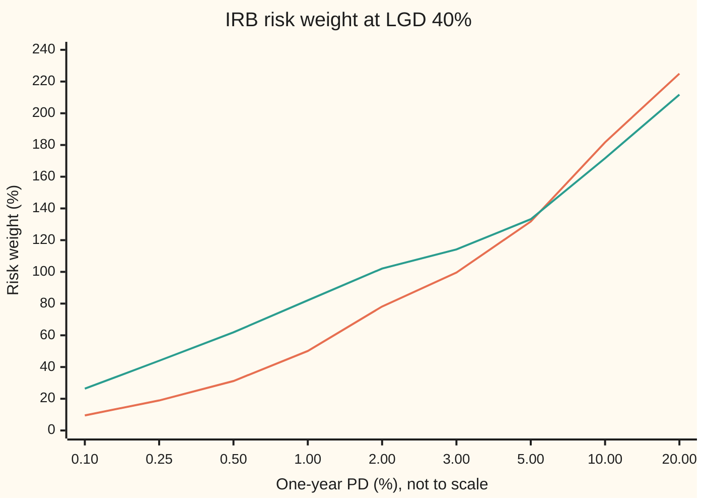

# The Basel credit formula: one-factor Vasicek behind the risk weights

Financial mathematics → Regulatory Capital in Outline → Risk weights from a bad year → The Basel credit formula

---

## General Overview

A bank lends a family $200,000 to buy a house. The bank's own models say the family has a 2% chance of defaulting within a year. If they do, the bank sells the house and loses 40 cents in the dollar: $80,000 on this loan.

The regulator wants to know how much of the bank's own money must stand behind this one loan. The answer comes from a formula the Basel Committee on Banking Supervision wrote down in 2004 and still uses. For this loan it says the loan counts as **78.16%** of its size, $156,328.94, of "risk-weighted assets". At the 8% minimum ratio, that is **$12,506.32** of capital. A different loan with the same 2% default chance can count for 25.71% or 126.89%, depending on what kind of borrower it is.

Where does 78.16% come from? From one bad year. Families default together when the economy turns, so the regulator asks: in the worst year out of a thousand, what share of loans like this one go bad? The answer, 17.63%, is Vasicek's large-pool formula. Subtract the 2% that goes bad in an average year, multiply by the 40% lost per default, and scale to fit the 8% ratio. The regulator fixes every piece of that recipe except the loan's own numbers.

**The Basel credit formula sets a loan's capital to its loss in the one-in-a-thousand economy minus its average loss, using the loan's own default chance and loss rate, a correlation and confidence level the regulator fixes, and a maturity factor for loans to companies; because one shared economy drives every loan, these loan-by-loan charges add up exactly to the capital of the whole book.**

**What kind of fact this is:** a convention, a formula a regulator chose and can change; it rests on a model (one shared economy, a very large pool), and inside that model the adding-up property is a theorem, proved on this card in Why it works.

### The picture: the same 2% default chance, seven different weights

Every bar below is a $200,000 loan with a 2% default chance and 40% loss per default. Only the kind of borrower changes, and with it the correlation and maturity the rules prescribe.

```
risk weight (%) for PD 2%, LGD 40%, by the kind of borrower
credit card (QRRE), R 4%          ████████                          25.71
other retail                      ████████████████                  51.54
small company, sales €5m, M 2.5   █████████████████████████         78.71
home loan, R 15%                  █████████████████████████         78.16
large company, 1-year loan        ███████████████████████████       85.13
large company, M 2.5              ████████████████████████████████  102.09
large bank, M 2.5                 ████████████████████████████████████████  126.89
```

The home loan and the small company land on nearly the same weight by different routes: a lower correlation for the company, then a maturity factor that lifts it back.

---

## The formula

Notation first, in words. $N(x)$ is the bell-curve area to the left of $x$: the chance a standard normal draw comes out below $x$ ([normal-distribution](../../09-Probability%20and%20statistics/04-Continuous%20Distributions/04-normal-distribution.md)). $N^{-1}(u)$ runs it backwards: the point with area $u$ to its left ([normal-quantile](../../09-Probability%20and%20statistics/04-Continuous%20Distributions/05-normal-quantile.md)). $\ln$ is the natural logarithm.

The capital requirement per dollar lent, $K$:

$$K = \mathrm{LGD}\left[\,N\!\left(\frac{N^{-1}(\mathrm{PD}) + \sqrt{R}\;N^{-1}(0.999)}{\sqrt{1-R}}\right) - \mathrm{PD}\right] \times \frac{1 + (M - 2.5)\,b}{1 - 1.5\,b}$$

**Read it aloud:** the loss rate in the one-in-a-thousand economy, minus the average loss rate, stretched by a factor that grows with the loan's maturity.

The maturity slope, and the step from capital to risk-weighted assets:

$$b = \big(0.11852 - 0.05478\,\ln \mathrm{PD}\big)^2, \qquad \mathrm{RW} = 12.5 \times K, \qquad \mathrm{RWA} = \mathrm{RW} \times \mathrm{EAD}$$

**Read it aloud:** twelve and a half times the capital rate is the risk weight; the weight times the amount owed is the loan's risk-weighted assets.

The loans to households (home loans, credit cards, other retail) drop the maturity factor entirely. For the home loan, $K$ is the square bracket times LGD, and nothing more.

| Symbol | Plain meaning | In our example | Push it up and the risk weight… |
| --- | --- | --- | --- |
| $\mathrm{PD}$ | **probability of default**: the bank's estimate of the chance the borrower defaults within one year | 2% | rises, but far less than in proportion: 0.5% gives 31.18%, 10% gives 181.70% |
| $\mathrm{LGD}$ | **loss given default**: the share of the loan lost if the borrower defaults, measured for bad times | 40% | rises in proportion: 20% gives 39.08% |
| $\mathrm{EAD}$ | **exposure at default**: the amount owed when default happens | $200,000 | unchanged; the dollar amounts rise in proportion |
| $R$, $w$, $S$ | **asset correlation**: the share of each borrower's ups and downs that comes from the shared economy, fixed by the rules; $w$ is the weight in the company schedule below; $S$ is a small firm's annual sales in millions of euros | 15% for a home loan; $w = 0.6321$ at 2% | rises steeply: 25% gives 129.25% |
| $\alpha$ | the **confidence level**: the share of years the capital must survive, fixed at 99.9% | 99.9% | rises: 99.97% gives 97.96% |
| $N$, $N^{-1}$ | bell-curve area to the left, and its inverse | $N^{-1}(0.999) = 3.0902$ | — |
| $q$, $m$ | $q$ is the default rate in the bad year; $m$ is the economy's state for the year, a bell-curve draw, low is bad | 17.63%; $m = -3.09$ | — |
| $\mathrm{EL}$ | **expected loss**: $\mathrm{PD} \times \mathrm{LGD}$, the average loss rate | 0.8%, $1,600 | subtracted: counted elsewhere |
| $M$, $b$ | **effective maturity** in years, and the maturity slope that sets how much each extra year adds | companies only; $M = 2.5$, $b = 0.1108$ at 2% | rises: factor 1.1993 at 2.5 years, 1.5314 at 5 |
| $K$ | **capital requirement**: capital per dollar lent | 6.2532% | — |
| $\mathrm{RW}$, $\mathrm{RWA}$ | **risk weight**, $12.5K$; **risk-weighted assets**, weight times EAD | 78.16%; $156,328.94 | — |
| $E_i$, $g_i$, $p_i$, $R_i$, $q_i$, $L$, $i$ | in the detailed proof: loan $i$'s exposure, LGD, PD, correlation and bad-year default rate; $L$ is the whole book's loss | the $1bn book | — |

### The prescribed inputs

The rules fix the correlation by kind of borrower. The Basel Committee took these from supervisors' default data and from banks' own capital models ([Explanatory Note](https://www.bis.org/publications/explanatory-note-basel-ii-irb-risk-weight-functions.pdf), sections 5.2 and 5.3):

| Kind of exposure | Correlation $R$ | Maturity factor |
| --- | --- | --- |
| home loans (residential mortgages) | 15%, fixed | none |
| credit cards and similar revolving lines (qualifying revolving retail, QRRE) | 4%, fixed | none |
| other retail | from 16% at PD near 0 down to 3% at high PD | none |
| companies, banks, governments | from 24% at PD near 0 down to 12% at high PD | yes |
| small companies (sales under €50 million) | the company value minus up to 4 points | yes |
| large or unregulated financial firms | the company value times 1.25 | yes |

The company schedule, where $w$ slides from 0 for the safest borrowers to 1 for the riskiest:

$$R = 0.12\,w + 0.24\,(1 - w), \qquad w = \frac{1 - e^{-50\,\mathrm{PD}}}{1 - e^{-50}}$$

At a 2% PD, $w = 0.6321$ and $R = 16.41\%$. Other retail uses the same shape with 0.03, 0.16 and 35 in place of 0.12, 0.24 and 50. The small-company cut is $0.04 \times (1 - (S - 5)/45)$, with $S$ the firm's annual sales in millions of euros, held between 5 and 50.

Conventions verified 28 Sep 2026 against the Basel Framework, chapters CRE31 and CRE99, in the version in force from 1 January 2023. National rules implement them with local changes.

### When it holds

- **One shared economy.** Every borrower responds to the same single factor. A bank lending to one region or one industry has a second risk the formula never sees; supervisors handle it in the separate review known as Pillar 2.
- **A very large book of small loans.** Private luck averages out only when no loan is big. One borrower owing a tenth of the book breaks the adding-up, and large-exposure limits exist for that reason.
- **Honest PD and LGD.** A PD estimated at half its true value cuts the home loan's weight from 78.16% to 50.13%, the chart's value at 1%.
- **Bell-curve health.** Defaults cluster more in real crashes than the bell curve allows, so the true one-in-a-thousand loss can be higher. The high 99.9% level is partly a cushion for this.
- **Losses counted at one year.** A loan that is downgraded without defaulting loses market value too. The maturity factor is Basel's patch for that, fitted from a separate model, not derived.

---

## Why it works

### Step 0: capital per loan only makes sense if loans add up

A regulator cannot run every bank's portfolio model. It wants a price tag for each loan, set from that loan's own numbers, that adds up across the book. That works only if a loan's contribution to the book's bad year does not depend on what else is in the book: **portfolio invariance**. Michael Gordy showed in 2003 which model has it: one shared risk factor and a very large pool of small loans. That is the **asymptotic single risk factor** model, ASRF for short: "asymptotic" because the pool is taken as infinitely large. Vasicek's one-factor model is its engine.

### Step 1: the bad-year default rate, from Vasicek

The one-factor model gives each borrower a health score, a bell-curve draw that is part shared economy and part private luck. The borrower defaults when the score falls below $N^{-1}(\mathrm{PD})$, the **default threshold**, which a bell-curve draw falls below with chance PD. With the economy at $m$, a very large pool of borrowers with default chance PD and correlation $R$ sees a default rate

$$q(m) = N\!\left(\frac{N^{-1}(\mathrm{PD}) - \sqrt{R}\,m}{\sqrt{1-R}}\right).$$

The derivation lives on [vasicek-loss-distribution-and-basel-capital](../45-Portfolio%20Credit%20-%20Correlation%2C%20Copulas%2C%20Indices%20and%20Tranches/03-vasicek-loss-distribution-and-basel-capital.md), which also shows that the pool's worst 0.1% of years are its worst 0.1% of economies. The one-in-a-thousand economy is $m = -N^{-1}(0.999) = -3.0902$. Put it in and the minus sign turns into the plus sign of the Basel formula. For the home loan the bad-year default rate is 17.63%.

### Step 2: the book's bad year is the sum of the loans' bad years

Take any book of loans, each with its own PD, LGD, correlation and size. Given the economy $m$, each loan's pool loses its size times its LGD times its own $q(m)$. Every one of those falls as $m$ rises: a better economy means fewer defaults everywhere. A sum of falling functions falls too. So the book's worst 0.1% of years is the same stretch of economies for every loan, the stretch below $-3.0902$. The book's 99.9% loss is the sum of each loan's loss at that one economy.

That is portfolio invariance, and it is why the capital of a book can be added loan by loan. The checks test it without the formula. The house bank holds $1 billion of loans: $600 million of home loans like the one above and $400 million of one-year company loans, same 2% PD and 40% LGD, company correlation 16.41%. They draw two million economies, compute the whole book's loss in each, sort, and read off the 99.9% point. Book capital from the simulation: $64,855,052.74. Loan by loan from the formula: $64,760,388.75. The gap is 0.15%, the noise of the simulation.

<details>
<summary>Detailed proof: portfolio invariance in a one-factor book</summary>

Let loan $i$ have size $E_i$, loss rate $g_i$ and conditional default rate $q_i(m) = N\big((N^{-1}(p_i) - \sqrt{R_i}\,m)/\sqrt{1-R_i}\big)$, with $0 < p_i < 1$ and $0 < R_i < 1$. In the large-pool limit the book's loss is $L(M) = \sum_i E_i g_i q_i(M)$, where $M$ is a standard normal draw. Each $q_i$ is continuous and strictly decreasing in $m$, since $N$ is strictly increasing and $-\sqrt{R_i} < 0$. So $L$ is continuous and strictly decreasing.

For a strictly decreasing $L$, the event $L(M) > L(m)$ is exactly the event $M < m$. Its chance is $N(m)$. Setting $N(m) = 0.001$ gives $m^\ast = N^{-1}(0.001) = -N^{-1}(0.999)$, so the 99.9% point of the book's loss is $L(m^\ast) = \sum_i E_i g_i q_i(m^\ast)$. Each term depends only on loan $i$'s own inputs. Subtracting the book's average loss, $\sum_i E_i g_i p_i$, which is also a sum over loans, gives capital as a sum of loan charges.

With two factors the argument fails: one loan's pool may do badly when the other does well, the worst years of the book are not the worst years of each loan, and the 99.9% point of the sum is usually less than the sum of the 99.9% points. The sum of per-loan charges then tends to overstate diversified capital. With a finite pool, private luck adds noise that the sum leaves out, which understates it.

</details>

### Step 3: subtract the average, because interest and provisions already cover it

In an average year the home loan loses $\mathrm{PD} \times \mathrm{LGD} = 0.8\%$, $1,600. The bank prices that into its interest rate and sets aside provisions for it. Capital is for the loss nobody can budget for: bad-year loss minus average loss. The Basel text says it directly: risk-weighted assets "are designed to address unexpected losses" (CRE31.1), and expected losses are compared with provisions under separate rules. For the home loan: $0.40 \times 17.63\% = 7.05\%$ in the bad year, minus 0.80%, is $K = 6.25\%$.

### Step 4: why 99.9%, and why the regulator fixes it

A 99.9% level means a bank holding exactly the minimum expects losses to exceed its capital about once in a thousand years. The Basel Committee chose it high on purpose: part of the capital that counts, the layer called Tier 2, absorbs losses less well than shareholders' equity, and the extra margin covers errors in the banks' own PD, LGD and EAD estimates. Fixing it matters. The level moves the answer a lot:

```
home loan risk weight (%) by the confidence level
99%     █████████████████                   42.79
99.5%   █████████████████████               53.00
99.9%   ███████████████████████████████     78.16
99.97%  ███████████████████████████████████████  97.96
```

A bank allowed to choose would choose low.

### Step 5: why the regulator fixes the correlation

Correlation is a strong lever: from 15% to 25% lifts the home loan's weight from 78.16% to 129.25%, close to what raising PD from 2% to 5% does (131.75%). It is also the hardest input to estimate, needing decades of defaults across several recessions. So the rules set it by the kind of borrower, from supervisors' data.

The company schedule falls as PD rises: a risky company tends to fail for its own reasons, a safe one mainly when the economy does. A small firm's fate is likewise more its own. The 1.25 multiplier for large financial firms reflects the 2008 lesson that banks fail together.

### Step 6: the maturity factor, a patch from a different model

The one-year model counts only defaults. A five-year company loan can also be downgraded, and its market value falls even if it never defaults. To charge for that, the Basel Committee ran a mark-to-market credit model at the same 99.9% level and the same correlations, recorded capital for each PD and maturity, divided by the capital at 2.5 years, and fitted a smooth formula to the ratios. The result is the factor $(1 + (M - 2.5)b)/(1 - 1.5b)$.

Three properties were built in. It equals 1 at one year, so a one-year loan gets exactly the ASRF capital: put $M = 1$ and the top becomes $1 - 1.5b$. It rises in a straight line with maturity. And the slope $b$ falls as PD rises: a safe borrower has further to fall, so time adds more to its risk. At 2% PD, $b = 0.1108$; a 2.5-year loan carries 1.1993 times the one-year capital, a 5-year loan 1.5314 times. The company bar in the picture above rises from 85.13% at one year to 102.09% at the standard 2.5 years. Household loans have no factor at all (CRE31.13); their correlations were fitted to banks' own capital figures and historical losses for those products, not to the company model.

### Step 7: 12.5 turns capital into a risk weight

The headline rule is capital of at least 8% of risk-weighted assets ([basel-capital-and-risk-weighted-assets](02-basel-capital-and-risk-weighted-assets.md)). If a loan needs capital $K \times \mathrm{EAD}$, its risk-weighted assets must be $K \times \mathrm{EAD} / 0.08 = 12.5 \times K \times \mathrm{EAD}$. The factor 12.5 is only 1 divided by 8%. It lets credit risk, market risk and operational risk share one denominator.

So the bank estimates PD for every loan, and under the advanced approach LGD and EAD too. The rules fix the confidence level, the correlations, the maturity factor, the 12.5, and floors under the bank's estimates: the numbers that move capital most and are easiest to shade.

The other route is the **standardised approach**, which skips the model and reads weights from a table; banks' own multi-factor models capture concentration but cannot be added loan by loan.

---

## Worked numbers, by hand

The home loan: PD 2%, LGD 40%, EAD $200,000, correlation 15%, no maturity factor.

| Step | Arithmetic | Value |
| --- | --- | --- |
| default threshold | $N^{-1}(0.02)$ | −2.0537 |
| bad economy | $N^{-1}(0.999)$ | 3.0902 |
| shared and private weights | $\sqrt{0.15}$, $\sqrt{0.85}$ | 0.3873, 0.9220 |
| position in the bad year | $(-2.0537 + 0.3873 \times 3.0902) / 0.9220$ | −0.9294 |
| bad-year default rate $q$ | $N(-0.9294)$ | 17.63% |
| bad-year loss rate | $0.40 \times 0.1763$ | 7.05% |
| expected loss rate | $0.40 \times 0.02$ | 0.80% |
| capital rate $K$ | $7.05\% - 0.80\%$ | 6.2532% |
| **risk weight** | $12.5 \times 6.2532\%$ | **78.16%** |
| risk-weighted assets | $0.7816 \times 200{,}000$ | $156,328.94 |
| **capital at 8%** | $0.08 \times 156{,}328.94$ | **$12,506.32** |
| the house bank's $600m of such loans | $600\text{m} \times 6.2532\%$ | $37,518,945.40 |

The bank must fund $12,506.32 of this loan with its own money rather than deposits, on top of the $1,600 a year it expects to lose. Across the house bank's $1 billion book, company loans included, capital is $64,760,388.75 and risk-weighted assets $809,504,859.31.

### The weight across default chances

Risk weight against PD, LGD 40%: home loans with no maturity factor, and large-company loans at the standard 2.5 years.



First line (orange): home loans, correlation 15%. Second line (green): large companies, correlation falling from 24% to 12% as PD rises, maturity 2.5 years. The company line is above for safe borrowers, where its correlation is higher and the maturity factor bites hardest, and below for risky ones. Every point on the company line matches the Basel Committee's published table (CRE99) to two decimals. Both curves bend over: doubling PD adds less than double the weight, because the bad year already assumes many defaults.

### What breaks if you drop a piece

Correct answer: 78.16%, $12,506.32 of capital on the loan.

| Mistake | Comes out at | What went wrong |
| --- | --- | --- |
| Expected loss left in | 88.16% | The $1,600 average loss is priced and provisioned; counting it again charges twice |
| Maturity factor at 2.5 years applied to the home loan | 93.74% | Household formulas have no maturity factor; it belongs to loans to companies, banks and governments |
| $K$ read as the risk weight | 6.25% | $K$ is capital per dollar; the weight is 12.5 times it |
| $N^{-1}(0.001)$ used for the bad economy | −$1,583.11 of capital | That is the one-in-a-thousand *good* year: almost nobody defaults |

---

## Code, from first principles, and it actually runs

Both programs build the bell-curve area themselves (Python from `math.erf`, Rust from a power series and a continued fraction), invert it by bisection, and generate their own random numbers. The 78.16% is reached **three independent ways**. Road 1 is the formula. Road 2 is the Basel Committee's own published table (CRE99, Table 1): the formula must reproduce six of its printed weights at PD 2%, and since the weight is proportional to LGD, three-quarters of the way from the table's 25% LGD column to its 45% column gives the weight at 40% without the formula. Road 3 simulates two million economies for the house bank's book and reads the 99.9% loss straight off the sorted results, which uses neither the quantile shortcut nor the adding-up.

### Python

```python
# The Basel credit formula (IRB risk weight from one-factor Vasicek) -- the check behind the card.
# Standard library only: N(x) from math.erf, its inverse by bisection, hand-written random numbers.
# Three roads to the 78% mortgage risk weight: the formula, the Basel Committee's own published
# table (CRE99), and a simulation of a whole loan book over two million economies.
from math import erf, exp, log, sqrt, cos, pi

def N(x): return 0.5 * (1.0 + erf(x / sqrt(2.0)))            # bell-curve area left of x
def Ninv(u):                                                  # its inverse, by bisection
    lo, hi = -40.0, 40.0
    for _ in range(200):
        mid = 0.5 * (lo + hi)
        if N(mid) < u: lo = mid
        else: hi = mid
    return 0.5 * (lo + hi)

Z999 = Ninv(0.999)                                            # the 1-in-1000 bad economy
def q_stress(pd, r, z=Z999):                                  # default rate in that economy
    return N((Ninv(pd) + sqrt(r) * z) / sqrt(1.0 - r))
def b_slope(pd): return (0.11852 - 0.05478 * log(pd)) ** 2
def mat_adj(pd, m): return (1.0 + (m - 2.5) * b_slope(pd)) / (1.0 - 1.5 * b_slope(pd))
def K(pd, lgd, r, m=None, z=Z999):                            # capital per dollar lent
    k = lgd * (q_stress(pd, r, z) - pd)
    return k if m is None else k * mat_adj(pd, m)
def RW(*a, **kw): return 100.0 * 12.5 * K(*a, **kw)          # risk weight, percent
def r_corp(pd):                                               # 24% for the safest, 12% for the riskiest
    w = (1.0 - exp(-50.0 * pd)) / (1.0 - exp(-50.0))
    return 0.12 * w + 0.24 * (1.0 - w)
def r_other(pd):                                              # other retail: 16% down to 3%
    w = (1.0 - exp(-35.0 * pd)) / (1.0 - exp(-35.0))
    return 0.03 * w + 0.16 * (1.0 - w)
def r_sme(pd, sales): return r_corp(pd) - 0.04 * (1.0 - (min(max(sales, 5.0), 50.0) - 5.0) / 45.0)

PD, LGD, EAD, R_MORT = 0.02, 0.40, 200000.0, 0.15            # the home loan on the card
c = Ninv(PD)
q = q_stress(PD, R_MORT)
k = K(PD, LGD, R_MORT)
rw = RW(PD, LGD, R_MORT)
rows = [("threshold N^-1(PD)", c, 6), ("bad economy N^-1(0.999)", Z999, 6),
        ("shared weight sqrt(R)", sqrt(R_MORT), 6), ("private weight sqrt(1-R)", sqrt(1 - R_MORT), 6),
        ("stress argument", (c + sqrt(R_MORT) * Z999) / sqrt(1 - R_MORT), 6),
        ("bad-year default rate q", q, 6), ("expected loss rate PD*LGD", PD * LGD, 6),
        ("bad-year loss rate LGD*q", LGD * q, 6), ("K, capital per dollar", k, 6),
        ("1 risk weight by formula %", rw, 4), ("RWA on the $200,000 loan", EAD * rw / 100, 2),
        ("capital at 8% $", 0.08 * EAD * rw / 100, 2), ("expected loss $", EAD * PD * LGD, 2),
        ("loss if the family defaults $", EAD * LGD, 2)]

# ---- road 2: the Basel Committee's published illustrative risk weights, CRE99 Table 1, PD 2% ----
table = [("mortgage, LGD 25%", 48.85, RW(PD, 0.25, R_MORT)), ("mortgage, LGD 45%", 87.94, RW(PD, 0.45, R_MORT)),
         ("corporate, LGD 40%, M 2.5", 102.09, RW(PD, 0.40, r_corp(PD), 2.5)),
         ("SME sales 5m, LGD 40%, M 2.5", 78.71, RW(PD, 0.40, r_sme(PD, 5.0), 2.5)),
         ("other retail, LGD 45%", 57.99, RW(PD, 0.45, r_other(PD))), ("QRRE, LGD 85%", 54.63, RW(PD, 0.85, 0.04))]
interp = 0.25 * 48.85 + 0.75 * 87.94                          # LGD 40% sits 3/4 of the way from 25% to 45%
rows += [("2 risk weight from the table %", interp, 4)]

# ---- road 3: simulate the economy for the house bank's $1bn book, loss by loss, no quantile formula ----
MORT, CORP = 600e6, 400e6                                     # mortgages as above; one-year corporate loans
r_c = r_corp(PD)
state = 0x2545F4914F6CDD1D
def unif():
    global state
    state ^= state >> 12; state ^= (state << 25) & 0xFFFFFFFFFFFFFFFF; state ^= state >> 27
    return (((state * 0x2545F4914F6CDD1D) & 0xFFFFFFFFFFFFFFFF) >> 11) / 9007199254740992.0 + 1e-17
DRAWS = 2000000
mort_rate, book = [], []
for _ in range(DRAWS):
    m = sqrt(-2.0 * log(unif())) * cos(2.0 * pi * unif())    # this year's economy
    qm = N((c - sqrt(R_MORT) * m) / sqrt(1 - R_MORT))
    qc = N((c - sqrt(r_c) * m) / sqrt(1 - r_c))
    mort_rate.append(qm)
    book.append(LGD * (MORT * qm + CORP * qc))
mort_rate.sort(); book.sort()
idx = int(0.999 * DRAWS)
sim_rw = 100.0 * 12.5 * LGD * (mort_rate[idx] - PD)
sim_cap = book[idx] - LGD * PD * (MORT + CORP)
loan_cap = MORT * K(PD, LGD, R_MORT) + CORP * K(PD, LGD, r_c)
rows += [("3 simulated risk weight %", sim_rw, 4),
         ("$1bn book: mortgages alone, capital", MORT * k, 2), ("$1bn book: capital, loan by loan", loan_cap, 2),
         ("$1bn book: capital, simulated", sim_cap, 2), ("  simulated / loan by loan - 1", sim_cap / loan_cap - 1, 6), ("$1bn book: RWA, loan by loan", 12.5 * loan_cap, 2)]

# ---- the prescribed inputs, one at a time ----
rows += [("maturity slope b(2%)", b_slope(PD), 6), 
         ("maturity adj M = 2.5", mat_adj(PD, 2.5), 6), ("maturity adj M = 5", mat_adj(PD, 5.0), 6),
         ("corporate weight w at 2%", (1 - exp(-50 * PD)) / (1 - exp(-50)), 6), ("corporate correlation at 2%", r_c, 6), ("bars: QRRE, R 4%", RW(PD, LGD, 0.04), 2),
         ("bars: other retail", RW(PD, LGD, r_other(PD)), 2), ("bars: SME, M 2.5", RW(PD, LGD, r_sme(PD, 5.0), 2.5), 2),
         ("bars: mortgage, R 15%", rw, 2), ("bars: corporate, M 1", RW(PD, LGD, r_c, 1.0), 2),
         ("bars: corporate, M 2.5", RW(PD, LGD, r_c, 2.5), 2), ("bars: large bank, M 2.5", RW(PD, LGD, 1.25 * r_c, 2.5), 2)]
for a in (0.99, 0.995, 0.999, 0.9997):
    rows += [(f"conf {100 * a:g}%: risk weight", RW(PD, LGD, R_MORT, z=Ninv(a)), 2)]
rows += [("wrong: expected loss left in %", 100 * 12.5 * LGD * q, 2),
         ("wrong: M 2.5 adjustment on a mortgage %", RW(PD, LGD, R_MORT, 2.5), 2),
         ("wrong: N^-1(0.001), capital $", EAD * K(PD, LGD, R_MORT, z=-Z999), 2),
         ("try: LGD 20% %", RW(PD, 0.20, R_MORT), 2), ("try: PD 0.5% %", RW(0.005, LGD, R_MORT), 2),
         ("try: PD 10% %", RW(0.10, LGD, R_MORT), 2), ("try: R 25% %", RW(PD, LGD, 0.25), 2)]
for name, v, d in rows:
    print(f"{name:<40} {v:>16.{d}f}")
print("CRE99 Table 1, PD 2%                    published    formula")
for name, pub, mine in table:
    print(f"  {name:<36} {pub:>9.2f} {mine:>10.4f}")
pds = (0.001, 0.0025, 0.005, 0.01, 0.02, 0.03, 0.05, 0.10, 0.20)
print("chart, PD %        " + " ".join(f"{100 * p:6.2f}" for p in pds))
print("chart, mortgage    " + " ".join(f"{RW(p, LGD, R_MORT):6.2f}" for p in pds))
print("chart, corporate   " + " ".join(f"{RW(p, LGD, r_corp(p), 2.5):6.2f}" for p in pds))

for name, pub, mine in table:
    assert abs(mine - pub) < 0.006, "formula must reproduce the Basel Committee's published weight: " + name
assert abs(interp - rw) < 0.01,              "table road vs formula road"
assert abs(sim_rw - rw) < 1.5,                "simulated 99.9% mortgage weight within noise of the formula"
assert abs(sim_cap / loan_cap - 1.0) < 0.02,  "book capital from the simulated loss equals the loan-by-loan sum"
print("ALL CHECKS PASS")
```

**Ran 2026-09-28 on macOS, Python 3.14.6, standard library only. All checks passed. Output, pasted from the run:**

```
threshold N^-1(PD)                              -2.053749
bad economy N^-1(0.999)                          3.090232
shared weight sqrt(R)                            0.387298
private weight sqrt(1-R)                         0.921954
stress argument                                 -0.929446
bad-year default rate q                          0.176329
expected loss rate PD*LGD                        0.008000
bad-year loss rate LGD*q                         0.070532
K, capital per dollar                            0.062532
1 risk weight by formula %                        78.1645
RWA on the $200,000 loan                        156328.94
capital at 8% $                                  12506.32
expected loss $                                   1600.00
loss if the family defaults $                    80000.00
2 risk weight from the table %                    78.1675
3 simulated risk weight %                         78.2780
$1bn book: mortgages alone, capital           37518945.40
$1bn book: capital, loan by loan              64760388.75
$1bn book: capital, simulated                 64855052.74
  simulated / loan by loan - 1                   0.001462
$1bn book: RWA, loan by loan                 809504859.31
maturity slope b(2%)                             0.110770
maturity adj M = 2.5                             1.199263
maturity adj M = 5                               1.531367
corporate weight w at 2%                         0.632121
corporate correlation at 2%                      0.164146
bars: QRRE, R 4%                                    25.71
bars: other retail                                  51.54
bars: SME, M 2.5                                    78.71
bars: mortgage, R 15%                               78.16
bars: corporate, M 1                                85.13
bars: corporate, M 2.5                             102.09
bars: large bank, M 2.5                            126.89
conf 99%: risk weight                               42.79
conf 99.5%: risk weight                             53.00
conf 99.9%: risk weight                             78.16
conf 99.97%: risk weight                            97.96
wrong: expected loss left in %                      88.16
wrong: M 2.5 adjustment on a mortgage %             93.74
wrong: N^-1(0.001), capital $                    -1583.11
try: LGD 20% %                                      39.08
try: PD 0.5% %                                      31.18
try: PD 10% %                                      181.70
try: R 25% %                                       129.25
CRE99 Table 1, PD 2%                    published    formula
  mortgage, LGD 25%                        48.85    48.8528
  mortgage, LGD 45%                        87.94    87.9350
  corporate, LGD 40%, M 2.5               102.09   102.0926
  SME sales 5m, LGD 40%, M 2.5             78.71    78.7072
  other retail, LGD 45%                    57.99    57.9864
  QRRE, LGD 85%                            54.63    54.6322
chart, PD %          0.10   0.25   0.50   1.00   2.00   3.00   5.00  10.00  20.00
chart, mortgage      9.50  18.93  31.18  50.13  78.16  99.54 131.75 181.70 224.99
chart, corporate    26.36  43.97  61.88  82.06 102.09 114.17 133.20 171.63 211.76
ALL CHECKS PASS
```

Three roads, one weight. The formula gives 78.1645%, the published table 78.1675% (its entries are rounded to 0.01), the simulation 78.2780%. The simulation's error comes from reading one point out of two million; its book capital lands 0.15% above the loan-by-loan sum.

### Rust

Same checks, same inputs, same random-number generator, so the simulation sees the same two million economies.

```rust
// The Basel credit formula (IRB risk weight from one-factor Vasicek) -- the same check in Rust.
// Std only, no crates. Rust has no erf, so N(x) is a power series in the middle and a continued
// fraction in the tails; its inverse is bisection; the random numbers are hand-written.
use std::f64::consts::PI;

fn erf_series(t: f64) -> f64 {
    let (mut term, mut sum, mut n) = (t, t, 0.0);
    while term.abs() > 1e-17 * sum.abs().max(1e-300) {
        n += 1.0;
        term *= -t * t / n;
        sum += term / (2.0 * n + 1.0);
    }
    2.0 / PI.sqrt() * sum
}
fn erfc_cf(t: f64) -> f64 {                                   // t > 2.5
    let mut k = t;
    for i in (1..=80).rev() { k = t + (i as f64 / 2.0) / k; }
    (-t * t).exp() / (PI.sqrt() * k)
}
fn n_cdf(x: f64) -> f64 {
    let t = x / 2f64.sqrt();
    if t.abs() < 2.5 { 0.5 * (1.0 + erf_series(t)) }
    else if t > 0.0 { 1.0 - 0.5 * erfc_cf(t) } else { 0.5 * erfc_cf(-t) }
}
fn ninv(u: f64) -> f64 {
    let (mut lo, mut hi) = (-40.0_f64, 40.0_f64);
    for _ in 0..200 {
        let mid = 0.5 * (lo + hi);
        if n_cdf(mid) < u { lo = mid } else { hi = mid }
    }
    0.5 * (lo + hi)
}
fn q_stress(pd: f64, r: f64, z: f64) -> f64 { n_cdf((ninv(pd) + r.sqrt() * z) / (1.0 - r).sqrt()) }
fn b_slope(pd: f64) -> f64 { (0.11852 - 0.05478 * pd.ln()).powi(2) }
fn mat_adj(pd: f64, m: f64) -> f64 { (1.0 + (m - 2.5) * b_slope(pd)) / (1.0 - 1.5 * b_slope(pd)) }
fn k_cap(pd: f64, lgd: f64, r: f64, m: Option<f64>, z: f64) -> f64 {
    let k = lgd * (q_stress(pd, r, z) - pd);
    match m { Some(mm) => k * mat_adj(pd, mm), None => k }
}
fn r_corp(pd: f64) -> f64 {
    let w = (1.0 - (-50.0 * pd).exp()) / (1.0 - (-50.0_f64).exp());
    0.12 * w + 0.24 * (1.0 - w)
}
fn r_other(pd: f64) -> f64 {
    let w = (1.0 - (-35.0 * pd).exp()) / (1.0 - (-35.0_f64).exp());
    0.03 * w + 0.16 * (1.0 - w)
}
fn r_sme(pd: f64, sales: f64) -> f64 { r_corp(pd) - 0.04 * (1.0 - (sales.max(5.0).min(50.0) - 5.0) / 45.0) }

fn main() {
    let z999 = ninv(0.999);
    let rw = |pd: f64, lgd: f64, r: f64, m: Option<f64>, z: f64| 100.0 * 12.5 * k_cap(pd, lgd, r, m, z);
    let (pd, lgd, ead, r_mort) = (0.02_f64, 0.40_f64, 200000.0_f64, 0.15_f64);
    let c = ninv(pd);
    let q = q_stress(pd, r_mort, z999);
    let k = k_cap(pd, lgd, r_mort, None, z999);
    let w = rw(pd, lgd, r_mort, None, z999);
    let mut rows: Vec<(String, f64, usize)> = Vec::new();
    let mut add = |n: &str, v: f64, d: usize| rows.push((n.to_string(), v, d));
    add("threshold N^-1(PD)", c, 6); add("bad economy N^-1(0.999)", z999, 6);
    add("shared weight sqrt(R)", r_mort.sqrt(), 6); add("private weight sqrt(1-R)", (1.0 - r_mort).sqrt(), 6);
    add("stress argument", (c + r_mort.sqrt() * z999) / (1.0 - r_mort).sqrt(), 6);
    add("bad-year default rate q", q, 6); add("expected loss rate PD*LGD", pd * lgd, 6);
    add("bad-year loss rate LGD*q", lgd * q, 6); add("K, capital per dollar", k, 6);
    add("1 risk weight by formula %", w, 4); add("RWA on the $200,000 loan", ead * w / 100.0, 2);
    add("capital at 8% $", 0.08 * ead * w / 100.0, 2); add("expected loss $", ead * pd * lgd, 2);
    add("loss if the family defaults $", ead * lgd, 2);

    // ---- road 2: the Basel Committee's published illustrative risk weights, CRE99 Table 1, PD 2% ----
    let table = [("mortgage, LGD 25%", 48.85, rw(pd, 0.25, r_mort, None, z999)),
        ("mortgage, LGD 45%", 87.94, rw(pd, 0.45, r_mort, None, z999)),
        ("corporate, LGD 40%, M 2.5", 102.09, rw(pd, 0.40, r_corp(pd), Some(2.5), z999)),
        ("SME sales 5m, LGD 40%, M 2.5", 78.71, rw(pd, 0.40, r_sme(pd, 5.0), Some(2.5), z999)),
        ("other retail, LGD 45%", 57.99, rw(pd, 0.45, r_other(pd), None, z999)),
        ("QRRE, LGD 85%", 54.63, rw(pd, 0.85, 0.04, None, z999))];
    let interp = 0.25 * 48.85 + 0.75 * 87.94;
    add("2 risk weight from the table %", interp, 4);

    // ---- road 3: simulate the economy for the house bank's $1bn book, loss by loss ----
    let (mort, corp) = (600e6_f64, 400e6_f64);
    let r_c = r_corp(pd);
    let mut state: u64 = 0x2545F4914F6CDD1D;
    let mut unif = || {
        state ^= state >> 12; state ^= state << 25; state ^= state >> 27;
        (state.wrapping_mul(0x2545F4914F6CDD1D) >> 11) as f64 / 9007199254740992.0 + 1e-17
    };
    let draws: usize = 2000000;
    let (mut mort_rate, mut book) = (Vec::with_capacity(draws), Vec::with_capacity(draws));
    for _ in 0..draws {
        let (u1, u2) = (unif(), unif());
        let m = (-2.0 * u1.ln()).sqrt() * (2.0 * PI * u2).cos();
        let qm = n_cdf((c - r_mort.sqrt() * m) / (1.0 - r_mort).sqrt());
        let qc = n_cdf((c - r_c.sqrt() * m) / (1.0 - r_c).sqrt());
        mort_rate.push(qm);
        book.push(lgd * (mort * qm + corp * qc));
    }
    mort_rate.sort_by(|a, b| a.partial_cmp(b).unwrap());
    book.sort_by(|a, b| a.partial_cmp(b).unwrap());
    let idx = (0.999 * draws as f64) as usize;
    let sim_rw = 100.0 * 12.5 * lgd * (mort_rate[idx] - pd);
    let sim_cap = book[idx] - lgd * pd * (mort + corp);
    let loan_cap = mort * k + corp * k_cap(pd, lgd, r_c, None, z999);
    add("3 simulated risk weight %", sim_rw, 4);
    add("$1bn book: mortgages alone, capital", mort * k, 2); add("$1bn book: capital, loan by loan", loan_cap, 2);
    add("$1bn book: capital, simulated", sim_cap, 2); add("  simulated / loan by loan - 1", sim_cap / loan_cap - 1.0, 6);
    add("$1bn book: RWA, loan by loan", 12.5 * loan_cap, 2);

    // ---- the prescribed inputs, one at a time ----
    add("maturity slope b(2%)", b_slope(pd), 6);
    add("maturity adj M = 2.5", mat_adj(pd, 2.5), 6); add("maturity adj M = 5", mat_adj(pd, 5.0), 6);
    add("corporate weight w at 2%", (1.0 - (-50.0 * pd).exp()) / (1.0 - (-50.0_f64).exp()), 6);
    add("corporate correlation at 2%", r_c, 6); add("bars: QRRE, R 4%", rw(pd, lgd, 0.04, None, z999), 2);
    add("bars: other retail", rw(pd, lgd, r_other(pd), None, z999), 2);
    add("bars: SME, M 2.5", rw(pd, lgd, r_sme(pd, 5.0), Some(2.5), z999), 2);
    add("bars: mortgage, R 15%", w, 2); add("bars: corporate, M 1", rw(pd, lgd, r_c, Some(1.0), z999), 2);
    add("bars: corporate, M 2.5", rw(pd, lgd, r_c, Some(2.5), z999), 2);
    add("bars: large bank, M 2.5", rw(pd, lgd, 1.25 * r_c, Some(2.5), z999), 2);
    for (lab, a) in [("99", 0.99), ("99.5", 0.995), ("99.9", 0.999), ("99.97", 0.9997)] {
        add(&format!("conf {}%: risk weight", lab), rw(pd, lgd, r_mort, None, ninv(a)), 2);
    }
    add("wrong: expected loss left in %", 100.0 * 12.5 * lgd * q, 2);
    add("wrong: M 2.5 adjustment on a mortgage %", rw(pd, lgd, r_mort, Some(2.5), z999), 2);
    add("wrong: N^-1(0.001), capital $", ead * k_cap(pd, lgd, r_mort, None, -z999), 2);
    add("try: LGD 20% %", rw(pd, 0.20, r_mort, None, z999), 2); add("try: PD 0.5% %", rw(0.005, lgd, r_mort, None, z999), 2);
    add("try: PD 10% %", rw(0.10, lgd, r_mort, None, z999), 2); add("try: R 25% %", rw(pd, lgd, 0.25, None, z999), 2);
    for (name, v, d) in &rows { println!("{:<40} {:>16.*}", name, *d, v); }
    println!("CRE99 Table 1, PD 2%                    published    formula");
    for (name, publ, mine) in &table { println!("  {:<36} {:>9.2} {:>10.4}", name, publ, mine); }
    let pds = [0.001, 0.0025, 0.005, 0.01, 0.02, 0.03, 0.05, 0.10, 0.20];
    let line = |f: &dyn Fn(f64) -> f64| pds.iter().map(|&p| format!("{:6.2}", f(p))).collect::<Vec<_>>().join(" ");
    println!("chart, PD %        {}", line(&|p| 100.0 * p));
    println!("chart, mortgage    {}", line(&|p| rw(p, lgd, r_mort, None, z999)));
    println!("chart, corporate   {}", line(&|p| rw(p, lgd, r_corp(p), Some(2.5), z999)));

    for (name, publ, mine) in &table {
        assert!((mine - publ).abs() < 0.006, "formula must reproduce the published weight: {}", name);
    }
    assert!((interp - w).abs() < 0.01, "table road vs formula road");
    assert!((sim_rw - w).abs() < 1.5, "simulated 99.9% mortgage weight within noise of the formula");
    assert!((sim_cap / loan_cap - 1.0).abs() < 0.02, "book capital from the simulated loss equals the loan-by-loan sum");
    println!("ALL CHECKS PASS");
}
```

**Ran 2026-09-28 on macOS, rustc 1.98.1, no crates. All checks passed. Output, pasted from the run:**

```
threshold N^-1(PD)                              -2.053749
bad economy N^-1(0.999)                          3.090232
shared weight sqrt(R)                            0.387298
private weight sqrt(1-R)                         0.921954
stress argument                                 -0.929446
bad-year default rate q                          0.176329
expected loss rate PD*LGD                        0.008000
bad-year loss rate LGD*q                         0.070532
K, capital per dollar                            0.062532
1 risk weight by formula %                        78.1645
RWA on the $200,000 loan                        156328.94
capital at 8% $                                  12506.32
expected loss $                                   1600.00
loss if the family defaults $                    80000.00
2 risk weight from the table %                    78.1675
3 simulated risk weight %                         78.2780
$1bn book: mortgages alone, capital           37518945.40
$1bn book: capital, loan by loan              64760388.75
$1bn book: capital, simulated                 64855052.74
  simulated / loan by loan - 1                   0.001462
$1bn book: RWA, loan by loan                 809504859.31
maturity slope b(2%)                             0.110770
maturity adj M = 2.5                             1.199263
maturity adj M = 5                               1.531367
corporate weight w at 2%                         0.632121
corporate correlation at 2%                      0.164146
bars: QRRE, R 4%                                    25.71
bars: other retail                                  51.54
bars: SME, M 2.5                                    78.71
bars: mortgage, R 15%                               78.16
bars: corporate, M 1                                85.13
bars: corporate, M 2.5                             102.09
bars: large bank, M 2.5                            126.89
conf 99%: risk weight                               42.79
conf 99.5%: risk weight                             53.00
conf 99.9%: risk weight                             78.16
conf 99.97%: risk weight                            97.96
wrong: expected loss left in %                      88.16
wrong: M 2.5 adjustment on a mortgage %             93.74
wrong: N^-1(0.001), capital $                    -1583.11
try: LGD 20% %                                      39.08
try: PD 0.5% %                                      31.18
try: PD 10% %                                      181.70
try: R 25% %                                       129.25
CRE99 Table 1, PD 2%                    published    formula
  mortgage, LGD 25%                        48.85    48.8528
  mortgage, LGD 45%                        87.94    87.9350
  corporate, LGD 40%, M 2.5               102.09   102.0926
  SME sales 5m, LGD 40%, M 2.5             78.71    78.7072
  other retail, LGD 45%                    57.99    57.9864
  QRRE, LGD 85%                            54.63    54.6322
chart, PD %          0.10   0.25   0.50   1.00   2.00   3.00   5.00  10.00  20.00
chart, mortgage      9.50  18.93  31.18  50.13  78.16  99.54 131.75 181.70 224.99
chart, corporate    26.36  43.97  61.88  82.06 102.09 114.17 133.20 171.63 211.76
ALL CHECKS PASS
```

The two outputs agree line for line at the printed precision, from two different constructions of the bell-curve area.

> [!TIP]
> **Try changing**
> Guess the direction first. Each answer is a `try:` or `conf` row in the output above; change the inputs in the `rows` list to see others.
> - **Halve the loss per default.** LGD 20% instead of 40%. The weight halves exactly, to **39.08%**: LGD multiplies everything else in the formula.
> - **Make the family riskier.** PD 10% instead of 2%. The weight climbs to **181.70%**, not five times 78.16%. At PD 0.5% it is **31.18%**.
> - **Raise the correlation.** 25% instead of 15%. The weight jumps to **129.25%**, close to the home-loan chart's 131.75% at PD 5%.
> - **Loosen the confidence level.** 99% instead of 99.9%. The weight falls to **42.79%**, almost halving the capital.

---

## The usual mistake

> [!warning]
> **Reading the 99.9% as "the bank fails once in a thousand years".** It is the model's answer under its own assumptions: one factor, bell-curve health, a huge pool, and PD and LGD estimated correctly. Real books have concentrations, several factors and estimation error. The 99.9% is a calibration choice, set high partly to absorb those gaps, not a measured failure rate.
>
> Three smaller traps:
> - **Taking the risk weight as a loss forecast.** 78.16% does not mean the bank expects to lose 78% of anything. The expected loss is 0.80%; the bad-year loss is 7.05%; the weight is capital scaled by 12.5.
> - **Using a through-the-cycle average LGD.** The formula wants a downturn LGD, the loss rate in bad times, because the bad year is when defaults happen. An average of good and bad years understates it.
> - **Putting default correlation where asset correlation belongs.** $R$ is the correlation between borrowers' health scores. The correlation between their default events is far smaller; putting that in cuts capital to a fraction of the right number.

---

## Where you meet it in real life

- **Bank annual reports.** The credit-risk tables in the Pillar 3 disclosures list exposures by PD band with average PD, average LGD and average risk weight. Each row is this formula applied and summed.
- **Mortgage pricing.** The capital a home loan ties up is set by this weight, so two loans at the same interest rate can earn very different returns on capital.
- **Expected and unexpected loss.** The subtraction in Step 3 is the split taught on [expected-versus-unexpected-loss](01-expected-versus-unexpected-loss.md).
- **The output floor.** Since the 2017 reforms, a bank's modelled risk-weighted assets cannot fall below a fixed share of what the standardised tables give, so a low PD can only cut capital so far.
- **Market risk and the leverage backstop.** Trading books are charged differently, on [frtb-and-the-shift-to-expected-shortfall](04-frtb-and-the-shift-to-expected-shortfall.md); a crude ratio with no risk weights at all sits beside both, on [liquidity-and-leverage-ratios](05-liquidity-and-leverage-ratios.md).

> **Say it back**
> The Basel credit formula charges each loan its loss in the one-in-a-thousand economy minus its average loss. The bad-year default rate comes from Vasicek's one-factor model, with the economy set to its 99.9% worst. Because one shared economy drives every loan, these charges add up exactly to the book's capital, which is what lets a regulator set capital loan by loan. The bank supplies PD and LGD; the rules fix the confidence level, the correlation, the maturity factor and the 12.5 that turns capital into risk-weighted assets. A $200,000 home loan with a 2% PD and 40% LGD comes out at 78.16%, $12,506.32 of capital.

---

## What this builds on

- [basel-capital-and-risk-weighted-assets](02-basel-capital-and-risk-weighted-assets.md): risk-weighted assets and the 8% minimum ratio that the 12.5 converts into.
- [vasicek-loss-distribution-and-basel-capital](../45-Portfolio%20Credit%20-%20Correlation%2C%20Copulas%2C%20Indices%20and%20Tranches/03-vasicek-loss-distribution-and-basel-capital.md): the one-factor loss curve, the large-pool limit, and the 99.9% default rate that sits inside the square bracket.

## Where this goes next

- [frtb-and-the-shift-to-expected-shortfall](04-frtb-and-the-shift-to-expected-shortfall.md): capital for the trading book, where Basel moved from a single quantile to the average loss beyond it.

This card measured credit risk at one point of the loss curve, the 99.9% quantile; the trading book asks whether one point is enough, and what the tail beyond it should cost.

---

## Sources

Verified 2026-09-28: every link below resolves to the publisher's page.

- Basel Committee on Banking Supervision. *Basel Framework*, chapter CRE31, "IRB approach: risk weight functions", version in force from 1 January 2023. [BIS page](https://www.bis.org/committees/bcbs/basel-framework/standard/cre/31/inforce/2023-01-01/published/2020-03-27). The rule text: unexpected loss only (31.1), the financial-firm multiplier (31.7), the small-company adjustment (31.8), no maturity factor for retail (31.13).
- Basel Committee on Banking Supervision. *Basel Framework*, chapter CRE99, "Application guidance", Table 1. [BIS page](https://www.bis.org/committees/bcbs/basel-framework/standard/cre/99/inforce/2023-01-01/published/2020-03-27). The published illustrative risk weights that road 2 of the checks reproduces.
- Basel Committee on Banking Supervision. *An Explanatory Note on the Basel II IRB Risk Weight Functions*, July 2005. [BIS PDF](https://www.bis.org/publications/explanatory-note-basel-ii-irb-risk-weight-functions.pdf). Why 99.9%, where the correlations and the maturity factor came from, downturn LGD, and the 12.5.
- Gordy, Michael B. "A Risk-Factor Model Foundation for Ratings-Based Bank Capital Rules." *Journal of Financial Intermediation* 12, no. 3 (2003): 199–232. [doi:10.1016/S1042-9573(03)00040-8](https://doi.org/10.1016/S1042-9573(03)00040-8). Portfolio invariance: why one factor and a large pool are what loan-by-loan capital needs.
