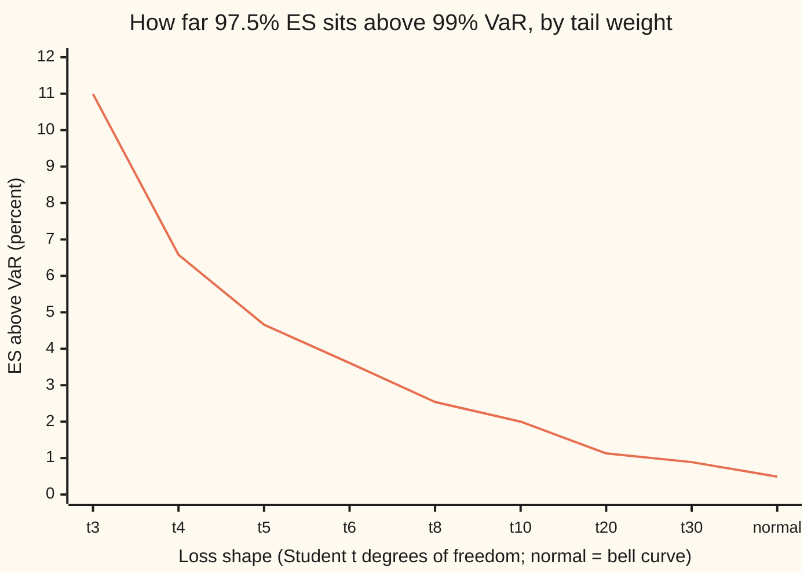

# Market-risk capital: from 99 percent VaR to 97.5 percent expected shortfall, and liquidity horizons

Financial mathematics → Regulatory Capital in Outline → Trading-book tail measures → Market-risk capital

---

## General Overview

A bank holds $1 billion of loans and a $100 million trading book: shares, corporate bonds and credit positions it buys and sells from day to day. The loans are charged capital by the credit formula ([vasicek-asrf-and-credit-capital](03-vasicek-asrf-and-credit-capital.md)). The trading book is charged separately, for **market risk**: the risk that prices move against it before it can sell or hedge.

For two decades the charge rested on **value at risk** (VaR): the loss over ten trading days that is exceeded only one time in a hundred. Its one number is a line on the loss axis. It says nothing about how far past the line the bad outcomes run. In 2016 the Basel Committee, the body that writes the world's bank capital standards, replaced it in its **Fundamental Review of the Trading Book** (FRTB), in force in the Basel standards from 2023, with **expected shortfall** (ES) at 97.5 percent: the average loss over the worst 2.5 percent of outcomes ([expected-shortfall-and-coherence](../39-Value%20at%20Risk%20and%20Expected%20Shortfall/05-expected-shortfall-and-coherence.md)).

Take the $100 million book with a ten-day loss whose typical swing, the standard deviation, is $3 million. If the loss follows the bell curve, the old measure gives $6.98 million and the new one $7.01 million: the same capital, to half a percent. Give the same book fat tails, where rare large losses are more common than the bell curve allows, and the old measure gives $7.87 million while the new one gives $8.73 million, 11 percent more. Push the worst 1 percent of losses twice as far out and the old measure does not move at all; the new one jumps to $13.58 million.

FRTB made one more change. Some positions take weeks to sell in a crisis, so the ten-day loss is stretched, factor by factor, to a **liquidity horizon** of 10 to 120 days. For this book that lifts $7.01 million to $11.92 million.

**The 97.5 percent level was picked so that expected shortfall charges a bell-curve book almost exactly what 99 percent VaR did; the switch changes nothing for a book with thin tails and charges more for a book whose worst days are worse than the bell curve predicts, and the liquidity horizons then stretch each risk to the time it takes to exit.**

**What kind of fact this is:** a convention: the measure, the 97.5 percent level and the horizons are Basel's rules, not laws; that 97.5 percent ES and 99 percent VaR nearly coincide on a bell curve is a theorem, proved on this card in Why it works.

### The picture: the old and new measures on three versions of the book

```
10-day loss, $ million      99% VaR (old)                          97.5% ES (new)
normal book           ████████████████          $6.979     ████████████████          $7.013
fat-tailed book       ██████████████████        $7.865     ████████████████████      $8.729
fat tail, worst 1%    ██████████████████        $7.865     ███████████████████████████████  $13.581
pushed twice as far
```

On the bell curve the two columns agree. With fat tails the right column is longer. When only the losses past the VaR line change, only the right column sees it.

---

## The formula

Notation first, in words. $L$ is the book's loss over ten trading days, in dollars, with a gain counted as a negative loss. $\alpha$ is a confidence level, such as 0.99. $\mathrm{VaR}_\alpha$ is the loss line that $L$ stays at or below with chance $\alpha$. $\mathrm{ES}_\alpha$ is the average of $L$ over the worst fraction $1-\alpha$ of outcomes. The prerequisite card defines both in full; this card compares them.

For a bell-curve (normal) loss with zero average and standard deviation $\sigma$, both measures are a multiple of $\sigma$. Write $z_\alpha$ for the point of the standard bell curve with chance $\alpha$ below it, and $\varphi$ for the bell curve's height, $\varphi(x)=e^{-x^2/2}/\sqrt{2\pi}$:

$$\mathrm{VaR}_{0.99}=z_{0.99}\,\sigma=2.326\,\sigma,\qquad \mathrm{ES}_{0.975}=\frac{\varphi(z_{0.975})}{0.025}\,\sigma=2.338\,\sigma$$

**Read it aloud:** the old line sits 2.326 standard deviations out; the new average sits 2.338 standard deviations out; the two differ by half a percent.

The second formula is the liquidity rule, Basel paragraph MAR33.4:

$$\mathrm{ES}_{LH}=\sqrt{\mathrm{ES}_T(P)^2+\sum_{j=2}^{5}\Big(\mathrm{ES}_T(P,j)\sqrt{\tfrac{LH_j-LH_{j-1}}{T}}\Big)^2}$$

**Read it aloud:** take the ten-day ES of the whole book, squared; add, for each longer horizon, the squared ten-day ES of the risks that take at least that long to exit, times that step's extra days divided by 10; take the square root.

| Symbol | Plain meaning | In our example | Push it up and the answer… |
| --- | --- | --- | --- |
| $L$ | loss on the book over 10 trading days; a gain is negative | typical swing $3 million | both measures rise |
| $\alpha$ | confidence level | 0.99 old, 0.975 new | the line moves further out |
| $\mathrm{VaR}_\alpha$ | value at risk: the loss line exceeded with chance $1-\alpha$ | $6.98 million, normal book | — |
| $\mathrm{ES}_\alpha$ | expected shortfall: average loss over the worst $1-\alpha$ | $7.01 million, normal book | — |
| $\sigma$, $s_i$ | standard deviation of the 10-day loss; the same for risk factor number i alone | $3 million; $2, $2 and $1 million | both measures rise in proportion |
| $z_\alpha$, $\varphi$, $q$ | the standard bell curve's $\alpha$ point; its height; the standard t curve's $\alpha$ point | $z_{0.99}=2.326$; $\varphi(1.960)=0.05845$; $q=4.541$ at 99% | — |
| $\nu$ | degrees of freedom of a fat-tailed (Student t) loss; smaller means fatter tails | 3 | ES and VaR draw together |
| $T$, $LH_j$, $h_i$ | base horizon of 10 days; the ladder 10, 20, 40, 60, 120 days, $j=1$ to 5; factor i's own horizon | $T=10$; $h_i$ = 10, 40, 60 | longer horizons raise the charge |
| $P$, $Q(P,j)$ | the book's positions; the risk factors whose horizon is at least $LH_j$ days | $Q(P,3)$ = both credit factors | — |
| $\mathrm{ES}_T(P,j)$ | 10-day ES when only the factors in $Q(P,j)$ move | $5.23 million for $j=2$ | raises the charge |
| $\mathrm{ES}_{LH}$ | liquidity-adjusted ES | $11.92 million | — |

### When it holds

- **The comparison needs a bell-curve loss.** The near-match of 2.326 and 2.338 is a fact about the bell curve. For a Student t loss with 3 degrees of freedom the new measure is 11 percent above the old.
- **Zero average loss.** A book that drifts adds its expected loss to both measures; the gap between them is unchanged.
- **The square-root weights assume independent days.** The rule scales squared ES by extra days, which is exact only when losses on separate days are independent and add their variances. Momentum or mean reversion in prices makes the rule too low or too high, respectively.
- **Factors mapped to the right bucket.** The horizon comes from a table of risk-factor categories. A high-yield bond mapped as investment-grade gets 40 days instead of 60.

Conventions verified 28 Sep 2026 against Basel MAR33, in force from 1 January 2023: 97.5 percent one-tailed ES, a 10-day base horizon, horizons of 10, 20, 40, 60 and 120 days, large-cap equity at 10, investment-grade corporate credit spreads at 40, high-yield at 60, and a multiplier of 1.5 on the capital figure. The superseded MAR30 set 99 percent VaR over ten days with multipliers of at least 3.

---

## Why it works

### Step 0: pick the new level so that ordinary books see no jump

A regulator changing the measure faces a practical constraint. Banks hold capital sized to the old rule. A new rule that raised everyone's capital overnight would be a policy change dressed as a technical one. So the level of the new measure was chosen to match the old one on the book everyone agrees is well behaved, the bell-curve book. Wherever the two then disagree, the disagreement comes from the shape of the tail, which is what the switch was meant to catch.

### Step 1: VaR cannot see past its own line

Take the fat-tailed book, with its 99 percent line at $7.87 million. Double every loss beyond that line. The ordering of outcomes does not change, and neither does the chance of landing below the line. So the 99 percent VaR is still $7.87 million.

Expected shortfall averages those outcomes. The worst 2.5 percent now contain the doubled 1 percent, and ES rises from $8.73 million to $13.58 million. The old measure would have let a desk write deep out-of-the-money options, collecting small premiums on 99 days in 100 for a large loss on the hundredth, without any charge for the size of that loss. The Basel 2016 announcement names this directly: the switch is to capture tail risk.

ES has a second advantage, proved on the prerequisite card: it never charges a merged book more than the sum of its parts, where VaR can.

### Step 2: on a bell curve, 97.5 percent ES lands on 99 percent VaR

Write the loss as $L=\sigma Z$, with $Z$ a standard bell-curve draw. ES at level $\alpha$ is the average of $Z$ over the region past $z_\alpha$, times $\sigma$:

$$\mathrm{ES}_\alpha=\frac{\sigma}{1-\alpha}\int_{z_\alpha}^{\infty}x\,\varphi(x)\,dx$$

The bell curve has a special property: its slope is $-x\,\varphi(x)$. So $x\,\varphi(x)$ is minus the derivative of $\varphi$, and the integral is $\varphi(z_\alpha)$. That gives $\mathrm{ES}_\alpha=\sigma\,\varphi(z_\alpha)/(1-\alpha)$.

At 97.5 percent, $z_{0.975}=1.960$ and $\varphi(1.960)=0.05845$. Divided by 0.025 that is 2.338. The 99 percent line is 2.326. The two differ by 0.49 percent. Solving for the exact confidence at which bell-curve ES equals 99 percent VaR gives 97.42 percent. Basel rounded to 97.5, a hair on the conservative side.

### Step 3: fat tails pull the average away from the line

A Student t loss with $\nu$ degrees of freedom has tails that thin like a power of the loss rather than like $e^{-x^2/2}$. With $\nu=3$ it is a common textbook model for daily market returns. Scaled to the same $3 million standard deviation, its 99 percent line is $7.87 million and its 97.5 percent ES $8.73 million: 10.99 percent apart. The integral that gave $\varphi(z_\alpha)$ on the bell curve has a closed form here too (proof below).

As $\nu$ grows the t loss approaches the bell curve and the gap closes: 6.58 percent at $\nu=4$, 2.00 at $\nu=10$, 0.89 at $\nu=30$, down to the bell curve's 0.49.



The single line is the percentage by which 97.5 percent ES exceeds 99 percent VaR, for the same standard deviation. Fatter tails sit on the left.

<details>
<summary>Detailed proof: expected shortfall of a Student t loss</summary>

The standard t density with $\nu$ degrees of freedom is $f(x)=c_\nu\,(1+x^2/\nu)^{-(\nu+1)/2}$, where $c_\nu$ is the constant that makes its area 1. Its logarithm has slope $-(\nu+1)x/(\nu+x^2)$, so $(\nu+x^2)f'(x)=-(\nu+1)\,x\,f(x)$.

Let $g(x)=\dfrac{\nu+x^2}{\nu-1}\,f(x)$. Then $g'(x)=\dfrac{2x\,f(x)+(\nu+x^2)f'(x)}{\nu-1}=\dfrac{2x-(\nu+1)x}{\nu-1}f(x)=-x\,f(x)$.

So $\int_q^\infty x\,f(x)\,dx=g(q)-0=\dfrac{(\nu+q^2)f(q)}{\nu-1}$ for $\nu>1$, and the standard t's ES at level $\alpha$ is that divided by $1-\alpha$, with $q$ the t's $\alpha$ point. For $\nu=3$ the 97.5 percent point is 3.182 and the 99 percent point 4.541.

The standard t has variance $\nu/(\nu-2)$. To give the loss a standard deviation $\sigma$, multiply by $\sigma\sqrt{(\nu-2)/\nu}$; both measures scale by the same factor, so their ratio does not depend on $\sigma$. With $\sigma = 3$ and $\nu=3$ the factor is $3/\sqrt3$, giving the $7.87 million and $8.73 million above.

Doubling the losses past the 99 percent line adds to the 97.5 percent tail the integral of $L$ over that 1 percent once more. That is the same integral started at the 99 percent point: $\sigma\sqrt{(\nu-2)/\nu}\,(\nu+q^2)f(q)/(\nu-1)$ with $q=4.541$, divided by 0.025. The ES becomes $13.58 million.

</details>

### Step 4: the liquidity horizon stretches each risk to its exit time

Ten days is short for a high-yield bond in a crisis. The rule sorts each risk factor into a horizon bucket and stretches its ten-day ES accordingly. The stretch uses the square root of time: over $h_i$ days, independent daily moves add their variances, so a ten-day standard deviation grows by $\sqrt{h_i/10}$.

The book here has three independent risk factors, with ten-day standard deviations in dollars: large-cap equity $2 million (horizon 10 days), investment-grade corporate credit $2 million (40 days), high-yield corporate credit $1 million (60 days). Together the ten-day standard deviation is $\sqrt{4+4+1}=3$ million, the book above.

The rule's nested subsets are: all three factors for $j=1$; the two credit factors for $j=2$ (horizon at least 20) and $j=3$ (at least 40); high-yield only for $j=4$ (at least 60); nothing for $j=5$ (120). Each subset's ten-day ES, squared and weighted by its extra days, goes under the square root. The result is $11.92 million.

A second road reaches the same number: scale each factor by the square root of its own horizon over ten, then take ES of the sum. For independent normal factors the two agree exactly, because the extra-day weights telescope (proof below). For correlated or fat-tailed factors they differ, and the rule, not the second road, is what the regulator asks for.

<details>
<summary>Detailed proof: the cascade equals factor-by-factor stretching</summary>

For independent normal factors with ten-day standard deviations $s_i$ and horizons $h_i$, the ten-day ES of any subset is $k\sqrt{\sum s_i^2}$ over that subset, with $k=2.338$. So the rule's squared total is $k^2$ times
$$\sum_i s_i^2\Big(1+\sum_{j\ge2,\;LH_j\le h_i}\frac{LH_j-LH_{j-1}}{T}\Big).$$
The inner sum telescopes: it adds the day gaps from $LH_1=10$ up to $h_i$, which total $h_i-10$. So the bracket is $1+(h_i-10)/10=h_i/10$, and the squared total is $k^2\sum_i s_i^2 h_i/T$: each factor's variance stretched to its own horizon. On the book, $4\cdot1+4\cdot4+1\cdot6=26$, and $k\sqrt{26}=11.92$.

</details>

The same answer comes from simulation: draw each factor over its own horizon 200,000 times and average the worst 2.5 percent. The code does all three.

Two further FRTB pieces sit outside this card's arithmetic. The ES must be calibrated to a period of stress, using a reduced set of risk factors scaled up by the ratio of full to reduced ES in current data. Risk factors with too few real price observations are charged separately by stress scenarios. [extreme-value-theory-and-tails](../39-Value%20at%20Risk%20and%20Expected%20Shortfall/07-extreme-value-theory-and-tails.md) models the tail shape that Step 3 took as a t distribution.

---

## Worked numbers, by hand

The $100 million trading book, ten-day loss standard deviation $3 million, first as a bell curve, then stretched by liquidity horizons.

| Step | Arithmetic | Value |
| --- | --- | --- |
| old line, $z_{0.99}$ | bell-curve table | 2.326 |
| 99% VaR | $2.326 \times 3$ million | $6.98 million |
| new level's point, $z_{0.975}$ | bell-curve table | 1.960 |
| bell height there, $\varphi(1.960)$ | $e^{-1.960^2/2}/\sqrt{2\pi}$ | 0.05845 |
| ES per $1 of standard deviation | $0.05845 / 0.025$ | 2.338 |
| 97.5% ES | $2.338 \times 3$ million | $7.01 million |
| variances by horizon bucket | equity 4, IG credit 4, HY credit 1 ($ million squared) | total 9 |
| stretched variances | $4\cdot\tfrac{10}{10}+4\cdot\tfrac{40}{10}+1\cdot\tfrac{60}{10}$ | 26 |
| **liquidity-adjusted ES** | $2.338\times\sqrt{26}$ million | **$11.92 million** |

The rule sizes the book's modelled tail loss at $11.92 million, against a ten-day ES of $7.01 million, because two of its three risk factors are credit positions that take 40 and 60 days to exit.

The same squares, piece by piece, as the rule adds them ($ million squared):

```
piece of the Basel sum            squared ES x extra days / 10
j=1  all factors, 10 days     ██████████████████                 49.188
j=2  credit, days 10 to 20    ██████████                         27.327
j=3  credit, days 20 to 40    ████████████████████               54.653
j=4  HY only, days 40 to 60   ████                               10.931
j=5  nothing at 120 days                                          0.000
```

The square root of their sum is 11.92.

### What breaks if you drop a piece

| Mistake | Comes out at | What went wrong |
| --- | --- | --- |
| Bell-curve formula on the fat-tailed book | $7.013 million (right: $8.729 million) | The formula assumed thin tails; the book does not have them |
| ES at 99% instead of 97.5% | $7.996 million (right: $7.013 million) | Well above the old VaR of $6.979 million: an average at 99 sits further out than the line at 99 |
| No liquidity horizons | $7.013 million (right: $11.921 million) | Every position assumed sold in ten days |
| Whole book stretched to 120 days | $24.295 million | The longest horizon applied to risks that exit in ten days |
| Pieces added, not squared | $22.940 million | Square roots of the pieces summed: independent risks add variances, not sizes |

Every number in the table is printed by both programs below.

---

## Code, from first principles, and it actually runs

The programs compute both measures on the normal and fat-tailed books by three independent roads: the closed forms of Steps 2 and 3; a direct integral of the loss beyond the line, by Simpson's rule after the change of variable $x=q/u$ that turns the infinite tail into a finite interval; and a Monte Carlo simulation of 200,000 ten-day losses from a generator written in the file. They build their own normal CDF (a series due to Marsaglia), the t density with its constant from a Gamma recurrence, and quantiles by bisection; the t quantile is checked against the closed-form t CDF for three degrees of freedom. The liquidity rule is computed three ways: the Basel cascade, the factor-by-factor stretch, and a simulation. Six asserts compare roads that share no arithmetic; a seventh integrates $x^2$ against the t density to confirm the fat-tailed book really has a $3 million standard deviation.

### Python

```python
# Market-risk capital: 99% VaR against 97.5% expected shortfall, and the Basel
# liquidity-horizon rule.  Standard library only: the normal CDF, the t density,
# the quantiles, the tail integrals and the random numbers are all written here.
from math import sqrt, exp, log, cos, pi, atan

A_OLD, A_NEW, SD, N_MC = 0.99, 0.975, 3.0, 200_000   # confidences; 10-day loss sd in $m
def gamma_half(k):                     # Gamma(k/2) for a whole number k, by recurrence
    return sqrt(pi) if k == 1 else 1.0 if k == 2 else (k / 2 - 1) * gamma_half(k - 2)
def dens(x, nu):                       # nu = 0 is the bell curve; otherwise Student t
    if nu == 0:
        return exp(-x * x / 2) / sqrt(2 * pi)
    c = gamma_half(nu + 1) / (sqrt(nu * pi) * gamma_half(nu))
    return c * (1 + x * x / nu) ** (-(nu + 1) / 2)
def simpson(f, a, b, n=2000):
    h = (b - a) / n
    s = f(a) + f(b)
    for i in range(1, n):
        s += (4 if i % 2 else 2) * f(a + i * h)
    return s * h / 3
def cdf(x, nu):
    if nu == 0:                        # Marsaglia: 1/2 + phi(x)(x + x^3/3 + x^5/15 + ...)
        if x > 9:
            return 1.0
        s = t = x
        for k in range(1, 200):
            t *= x * x / (2 * k + 1)
            s += t
        return 0.5 + dens(x, 0) * s
    return 0.5 + simpson(lambda u: dens(u, nu), 0.0, x)
def quantile(p, nu):                   # bisection: the loss line with chance p below it
    lo, hi = 0.0, 50.0
    for _ in range(80):
        mid = (lo + hi) / 2
        lo, hi = (mid, hi) if cdf(mid, nu) < p else (lo, mid)
    return (lo + hi) / 2
def unit(nu):                          # rescales a standard t to standard deviation 1
    return 1.0 if nu == 0 else sqrt((nu - 2) / nu)
def var_es(nu, a):                     # road 1: closed forms, per $1 of standard deviation
    q = quantile(a, nu)
    tail = dens(q, 0) if nu == 0 else dens(q, nu) * (nu + q * q) / (nu - 1)
    return q * unit(nu), tail / (1 - a) * unit(nu)
def es_integral(nu, a):                # road 2: average loss beyond the line, x = q/u
    q = quantile(a, nu)
    g = lambda u: 0.0 if u == 0 else dens(q / u, nu) / u ** 3
    return q * q * simpson(g, 0.0, 1.0) / (1 - a) * unit(nu)
state = 20260928                       # road 3: Monte Carlo from a 64-bit LCG
def unif():
    global state
    state = (6364136223846793005 * state + 1442695040888963407) % 2 ** 64
    return ((state >> 11) + 0.5) / 2 ** 53
def normal():                          # Box-Muller
    u1, u2 = unif(), unif()
    return sqrt(-2 * log(u1)) * cos(2 * pi * u2)
def mc_var_es(losses):                 # the 99% line, and the mean of the worst 2.5%
    s, n, tail = sorted(losses), len(losses), 0.0
    for x in s[n - n * 25 // 1000:]: tail += x
    return s[n * 99 // 100 - 1], tail / (n * 25 // 1000)
def row(label, *vals):
    print(f"{label:<40}" + "".join(f"{v:>11.3f}" for v in vals))

z99, k99 = var_es(0, A_OLD)
k975 = var_es(0, A_NEW)[1]
lo, hi = 0.95, 0.99                    # the confidence where normal ES meets 99% VaR
for _ in range(50):
    mid = (lo + hi) / 2
    lo, hi = (mid, hi) if var_es(0, mid)[1] < z99 else (lo, mid)
print("standard normal, per $1 of standard deviation")
print(f"  VaR99 = z(0.99)                         {z99:.6f}")
print(f"  ES97.5 = phi(z(0.975)) / 0.025          {k975:.6f}")
print(f"  z(0.975), phi(z(0.975))                 {quantile(A_NEW, 0):.6f}  {dens(quantile(A_NEW, 0), 0):.6f}")
print(f"  ES99                                    {k99:.6f}")
print(f"  ES97.5 / VaR99                          {k975 / z99:.6f}")
print(f"  confidence where ES equals VaR99        {lo:.6f}")
norm_mc, t3_mc = [SD * normal() for _ in range(N_MC)], []
for _ in range(N_MC):
    z = normal()
    chi = normal() ** 2 + normal() ** 2 + normal() ** 2
    t3_mc.append(SD * unit(3) * z / sqrt(chi / 3))
nv, ne = z99 * SD, k975 * SD
tv, te = var_es(3, A_OLD)[0] * SD, var_es(3, A_NEW)[1] * SD
q3 = quantile(A_OLD, 3)                # t3 has a closed-form CDF: check the quantile
f3 = 0.5 + ((q3 / sqrt(3)) / (1 + q3 * q3 / 3) + atan(q3 / sqrt(3))) / pi
beyond = SD * unit(3) * dens(q3, 3) * (3 + q3 * q3) / 2 / (1 - A_NEW)
line = mc_var_es(t3_mc)[0]
stretched = [2 * x if x > line else x for x in t3_mc]
print(f"\nbooks, $100m trading book, 10-day loss sd $3m    VaR99     ES97.5")
row("normal book, formula", nv, ne)
row("normal book, tail integral", nv, es_integral(0, A_NEW) * SD)
row("normal book, Monte Carlo 200,000", *mc_var_es(norm_mc))
row("fat-tailed t3 book, formula", tv, te)
row("fat-tailed t3 book, tail integral", tv, es_integral(3, A_NEW) * SD)
row("fat-tailed t3 book, Monte Carlo 200,000", *mc_var_es(t3_mc))
row("t3, losses past VaR99 doubled, formula", tv, te + beyond)
row("t3, losses past VaR99 doubled, MC", *mc_var_es(stretched))
print(f"  t3 CDF at its VaR99 line, closed form   {f3:.9f}")
print(f"  t3 standard lines z(0.99), z(0.975)     {q3:.6f}  {quantile(A_NEW, 3):.6f}")
print("\nchart, percent by which ES97.5 exceeds VaR99, by tail weight")
ratios = {}
for nu in (3, 4, 5, 6, 8, 10, 20, 30, 0):
    ratios[nu] = var_es(nu, A_NEW)[1] / var_es(nu, A_OLD)[0]
    print(f"  chart, {'normal' if nu == 0 else 't' + str(nu):<8}{100 * (ratios[nu] - 1):>10.2f}")

# Liquidity horizons: three independent factors, 10-day sd in $m, horizon in days
factors = [("large-cap equity", 2.0, 10), ("IG corporate credit", 2.0, 40), ("HY corporate credit", 1.0, 60)]
LH, T = [10, 20, 40, 60, 120], 10
def es_subset(j):                      # ES_T(P, j): only factors with horizon >= LH_j move
    return k975 * sqrt(sum(s * s for _, s, h in factors if h >= LH[j]))
parts = [es_subset(0) ** 2] + [es_subset(j) ** 2 * (LH[j] - LH[j - 1]) / T for j in range(1, 5)]
cascade = sqrt(sum(parts))
per_factor = k975 * sqrt(sum(s * s * h / T for _, s, h in factors))
lh_mc = []
for _ in range(N_MC):
    x = 0.0
    for _, s, h in factors:
        x += s * sqrt(h / T) * normal()
    lh_mc.append(x)
print("\nliquidity horizons, normal book, $m")
for j in range(5):
    print(f"  squared piece j={j + 1}, LH {LH[j]:>3}, ES_T(P,j) {es_subset(j):6.3f}   {parts[j]:8.3f}")
row("liquidity-adjusted ES, Basel cascade", cascade)
row("liquidity-adjusted ES, factor by factor", per_factor)
row("liquidity-adjusted ES, Monte Carlo", mc_var_es(lh_mc)[1])
row("  squared total over ES97.5 per $1 squared", (cascade / k975) ** 2)
row("wrong: normal formula on the t3 book", ne)
row("wrong: ES at 99% on the normal book", k99 * SD)
row("wrong: no liquidity horizons", es_subset(0))
row("wrong: whole book at 120 days", es_subset(0) * sqrt(12))
row("wrong: pieces added, not squared", sum(sqrt(p) for p in parts))
factors[2] = ("HY corporate credit", 1.0, 120)
row("try: HY credit at 120 days", k975 * sqrt(sum(s * s * h / T for _, s, h in factors)))

assert abs(es_integral(0, A_NEW) * SD - ne) < 1e-6 and abs(es_integral(3, A_NEW) * SD - te) < 1e-6
assert abs(f3 - A_OLD) < 1e-9,                            "t3 quantile against the closed-form CDF"
assert abs(mc_var_es(norm_mc)[1] / ne - 1) < 0.02 and abs(mc_var_es(t3_mc)[1] / te - 1) < 0.05
assert abs(cascade - per_factor) < 1e-9,                  "Basel cascade against factor-by-factor horizons"
assert abs(mc_var_es(lh_mc)[1] / cascade - 1) < 0.02,     "simulated horizons against the formula"
assert abs(2 * simpson(lambda u: 0.0 if u == 1 else (u / (1 - u)) ** 2 * dens(u / (1 - u), 3) / (1 - u) ** 2, 0.0, 1.0)
           * unit(3) ** 2 - 1) < 1e-3,                     "t3 book: variance integral gives sd 1 per $1"
assert ratios[0] < 1.01 and ratios[3] > 1.1,              "normal ratio near 1, t3 ratio well above"
print("ALL CHECKS PASS")
```

**Ran 2026-09-28 on macOS, Python 3.14.6, standard library only. All checks passed. Output, pasted from the run:**

```
standard normal, per $1 of standard deviation
  VaR99 = z(0.99)                         2.326348
  ES97.5 = phi(z(0.975)) / 0.025          2.337803
  z(0.975), phi(z(0.975))                 1.959964  0.058445
  ES99                                    2.665214
  ES97.5 / VaR99                          1.004924
  confidence where ES equals VaR99        0.974232

books, $100m trading book, 10-day loss sd $3m    VaR99     ES97.5
normal book, formula                          6.979      7.013
normal book, tail integral                    6.979      7.013
normal book, Monte Carlo 200,000              6.993      7.018
fat-tailed t3 book, formula                   7.865      8.729
fat-tailed t3 book, tail integral             7.865      8.729
fat-tailed t3 book, Monte Carlo 200,000       7.917      8.786
t3, losses past VaR99 doubled, formula        7.865     13.581
t3, losses past VaR99 doubled, MC             7.917     13.709
  t3 CDF at its VaR99 line, closed form   0.990000000
  t3 standard lines z(0.99), z(0.975)     4.540703  3.182446

chart, percent by which ES97.5 exceeds VaR99, by tail weight
  chart, t3           10.99
  chart, t4            6.58
  chart, t5            4.66
  chart, t6            3.61
  chart, t8            2.54
  chart, t10           2.00
  chart, t20           1.13
  chart, t30           0.89
  chart, normal        0.49

liquidity horizons, normal book, $m
  squared piece j=1, LH  10, ES_T(P,j)  7.013     49.188
  squared piece j=2, LH  20, ES_T(P,j)  5.227     27.327
  squared piece j=3, LH  40, ES_T(P,j)  5.227     54.653
  squared piece j=4, LH  60, ES_T(P,j)  2.338     10.931
  squared piece j=5, LH 120, ES_T(P,j)  0.000      0.000
liquidity-adjusted ES, Basel cascade         11.921
liquidity-adjusted ES, factor by factor      11.921
liquidity-adjusted ES, Monte Carlo           11.964
  squared total over ES97.5 per $1 squared     26.000
wrong: normal formula on the t3 book          7.013
wrong: ES at 99% on the normal book           7.996
wrong: no liquidity horizons                  7.013
wrong: whole book at 120 days                24.295
wrong: pieces added, not squared             22.940
try: HY credit at 120 days                   13.225
ALL CHECKS PASS
```

### Rust

Same numbers, same labels, built with `rustc --edition 2021 -O`.

```rust
// Market-risk capital: 99% VaR against 97.5% expected shortfall, and the Basel
// liquidity-horizon rule.  Rust std only: the normal CDF, the t density, the
// quantiles, the tail integrals and the random numbers are all written here.
use std::f64::consts::PI;

const A_OLD: f64 = 0.99; const A_NEW: f64 = 0.975; // old and new confidence levels
const SD: f64 = 3.0; const N_MC: usize = 200_000;   // 10-day loss sd in $m; draws

fn gamma_half(k: u32) -> f64 { // Gamma(k/2) for a whole number k, by recurrence
    if k == 1 { PI.sqrt() } else if k == 2 { 1.0 } else { (k as f64 / 2.0 - 1.0) * gamma_half(k - 2) }
}
fn dens(x: f64, nu: u32) -> f64 { // nu = 0 is the bell curve; otherwise Student t
    if nu == 0 { return (-x * x / 2.0).exp() / (2.0 * PI).sqrt(); }
    let n = nu as f64;
    let c = gamma_half(nu + 1) / ((n * PI).sqrt() * gamma_half(nu));
    c * (1.0 + x * x / n).powf(-(n + 1.0) / 2.0)
}
fn simpson<F: Fn(f64) -> f64>(f: F, a: f64, b: f64) -> f64 {
    let n = 2000;
    let h = (b - a) / n as f64;
    let mut s = f(a) + f(b);
    for i in 1..n { s += (if i % 2 == 1 { 4.0 } else { 2.0 }) * f(a + i as f64 * h); }
    s * h / 3.0
}
fn cdf(x: f64, nu: u32) -> f64 {
    if nu == 0 { // Marsaglia: 1/2 + phi(x)(x + x^3/3 + x^5/15 + ...)
        if x > 9.0 { return 1.0; }
        let (mut s, mut t) = (x, x);
        for k in 1..200 { t *= x * x / (2 * k + 1) as f64; s += t; }
        return 0.5 + dens(x, 0) * s;
    }
    0.5 + simpson(|u| dens(u, nu), 0.0, x)
}
fn quantile(p: f64, nu: u32) -> f64 { // bisection: the loss line with chance p below it
    let (mut lo, mut hi) = (0.0, 50.0);
    for _ in 0..80 { let mid = (lo + hi) / 2.0; if cdf(mid, nu) < p { lo = mid } else { hi = mid } }
    (lo + hi) / 2.0
}
fn unit(nu: u32) -> f64 { if nu == 0 { 1.0 } else { ((nu as f64 - 2.0) / nu as f64).sqrt() } }
fn var_es(nu: u32, a: f64) -> (f64, f64) { // road 1: closed forms, per $1 of standard deviation
    let q = quantile(a, nu);
    let n = nu as f64;
    let tail = if nu == 0 { dens(q, 0) } else { dens(q, nu) * (n + q * q) / (n - 1.0) };
    (q * unit(nu), tail / (1.0 - a) * unit(nu))
}
fn es_integral(nu: u32, a: f64) -> f64 { // road 2: average loss beyond the line, x = q/u
    let q = quantile(a, nu);
    let g = |u: f64| if u == 0.0 { 0.0 } else { dens(q / u, nu) / u.powf(3.0) };
    q * q * simpson(g, 0.0, 1.0) / (1.0 - a) * unit(nu)
}
struct Lcg(u64); // road 3: Monte Carlo from a 64-bit LCG
impl Lcg {
    fn unif(&mut self) -> f64 {
        self.0 = self.0.wrapping_mul(6364136223846793005).wrapping_add(1442695040888963407);
        ((self.0 >> 11) as f64 + 0.5) / 9007199254740992.0
    }
    fn normal(&mut self) -> f64 { // Box-Muller
        let (u1, u2) = (self.unif(), self.unif());
        (-2.0 * u1.ln()).sqrt() * (2.0 * PI * u2).cos()
    }
}
fn mc_var_es(losses: &[f64]) -> (f64, f64) { // the 99% line, and the mean of the worst 2.5%
    let mut s = losses.to_vec();
    s.sort_by(|a, b| a.partial_cmp(b).unwrap());
    let (n, mut tail) = (s.len(), 0.0);
    for x in &s[n - n * 25 / 1000..] { tail += x; }
    (s[n * 99 / 100 - 1], tail / (n * 25 / 1000) as f64)
}
fn row(label: &str, vals: &[f64]) {
    let mut line = format!("{:<40}", label);
    for v in vals { line += &format!("{:>11.3}", v); }
    println!("{}", line);
}
fn main() {
    let (z99, k99) = var_es(0, A_OLD);
    let k975 = var_es(0, A_NEW).1;
    let (mut lo, mut hi) = (0.95, 0.99); // the confidence where normal ES meets 99% VaR
    for _ in 0..50 { let mid = (lo + hi) / 2.0; if var_es(0, mid).1 < z99 { lo = mid } else { hi = mid } }
    println!("standard normal, per $1 of standard deviation");
    println!("  VaR99 = z(0.99)                         {:.6}", z99);
    println!("  ES97.5 = phi(z(0.975)) / 0.025          {:.6}", k975);
    println!("  z(0.975), phi(z(0.975))                 {:.6}  {:.6}", quantile(A_NEW, 0), dens(quantile(A_NEW, 0), 0));
    println!("  ES99                                    {:.6}", k99);
    println!("  ES97.5 / VaR99                          {:.6}", k975 / z99);
    println!("  confidence where ES equals VaR99        {:.6}", lo);
    let mut rng = Lcg(20260928);
    let norm_mc: Vec<f64> = (0..N_MC).map(|_| SD * rng.normal()).collect();
    let mut t3_mc = Vec::with_capacity(N_MC);
    for _ in 0..N_MC {
        let z = rng.normal();
        let (a, b, c) = (rng.normal(), rng.normal(), rng.normal());
        let chi = a.powf(2.0) + b.powf(2.0) + c.powf(2.0);
        t3_mc.push(SD * unit(3) * z / (chi / 3.0).sqrt());
    }
    let (nv, ne) = (z99 * SD, k975 * SD);
    let (tv, te) = (var_es(3, A_OLD).0 * SD, var_es(3, A_NEW).1 * SD);
    let q3 = quantile(A_OLD, 3); // t3 has a closed-form CDF: check the quantile
    let f3 = 0.5 + ((q3 / 3f64.sqrt()) / (1.0 + q3 * q3 / 3.0) + (q3 / 3f64.sqrt()).atan()) / PI;
    let beyond = SD * unit(3) * dens(q3, 3) * (3.0 + q3 * q3) / 2.0 / (1.0 - A_NEW);
    let line = mc_var_es(&t3_mc).0;
    let stretched: Vec<f64> = t3_mc.iter().map(|&x| if x > line { 2.0 * x } else { x }).collect();
    let (mcn, mct, mcs) = (mc_var_es(&norm_mc), mc_var_es(&t3_mc), mc_var_es(&stretched));
    println!("\nbooks, $100m trading book, 10-day loss sd $3m    VaR99     ES97.5");
    row("normal book, formula", &[nv, ne]);
    row("normal book, tail integral", &[nv, es_integral(0, A_NEW) * SD]);
    row("normal book, Monte Carlo 200,000", &[mcn.0, mcn.1]);
    row("fat-tailed t3 book, formula", &[tv, te]);
    row("fat-tailed t3 book, tail integral", &[tv, es_integral(3, A_NEW) * SD]);
    row("fat-tailed t3 book, Monte Carlo 200,000", &[mct.0, mct.1]);
    row("t3, losses past VaR99 doubled, formula", &[tv, te + beyond]);
    row("t3, losses past VaR99 doubled, MC", &[mcs.0, mcs.1]);
    println!("  t3 CDF at its VaR99 line, closed form   {:.9}", f3);
    println!("  t3 standard lines z(0.99), z(0.975)     {:.6}  {:.6}", q3, quantile(A_NEW, 3));
    println!("\nchart, percent by which ES97.5 exceeds VaR99, by tail weight");
    let mut ratios = Vec::new();
    for nu in [3u32, 4, 5, 6, 8, 10, 20, 30, 0] {
        let r = var_es(nu, A_NEW).1 / var_es(nu, A_OLD).0;
        ratios.push(r);
        let name = if nu == 0 { "normal".to_string() } else { format!("t{}", nu) };
        println!("  chart, {:<8}{:>10.2}", name, 100.0 * (r - 1.0));
    }

    // Liquidity horizons: three independent factors, 10-day sd in $m, horizon in days
    let mut factors: Vec<(f64, u32)> = vec![(2.0, 10), (2.0, 40), (1.0, 60)];
    let (lh, t) = ([10u32, 20, 40, 60, 120], 10.0);
    let es_subset = |f: &Vec<(f64, u32)>, j: usize| -> f64 { // only factors with horizon >= LH_j move
        let mut v = 0.0;
        for &(s, h) in f { if h >= lh[j] { v += s * s; } }
        k975 * v.sqrt()
    };
    let per_factor_of = |f: &Vec<(f64, u32)>| -> f64 {
        let mut v = 0.0;
        for &(s, h) in f { v += s * s * h as f64 / t; }
        k975 * v.sqrt()
    };
    let mut parts = vec![es_subset(&factors, 0).powf(2.0)];
    for j in 1..5 { parts.push(es_subset(&factors, j).powf(2.0) * (lh[j] - lh[j - 1]) as f64 / t); }
    let (cascade, per_factor) = (parts.iter().sum::<f64>().sqrt(), per_factor_of(&factors));
    let mut lh_mc = Vec::with_capacity(N_MC);
    for _ in 0..N_MC {
        let mut x = 0.0;
        for &(s, h) in &factors { x += s * (h as f64 / t).sqrt() * rng.normal(); }
        lh_mc.push(x);
    }
    let mclh = mc_var_es(&lh_mc).1;
    println!("\nliquidity horizons, normal book, $m");
    for j in 0..5 {
        println!("  squared piece j={}, LH {:>3}, ES_T(P,j) {:6.3}   {:8.3}", j + 1, lh[j], es_subset(&factors, j), parts[j]);
    }
    row("liquidity-adjusted ES, Basel cascade", &[cascade]);
    row("liquidity-adjusted ES, factor by factor", &[per_factor]);
    row("liquidity-adjusted ES, Monte Carlo", &[mclh]);
    row("  squared total over ES97.5 per $1 squared", &[(cascade / k975).powf(2.0)]);
    row("wrong: normal formula on the t3 book", &[ne]);
    row("wrong: ES at 99% on the normal book", &[k99 * SD]);
    row("wrong: no liquidity horizons", &[es_subset(&factors, 0)]);
    row("wrong: whole book at 120 days", &[es_subset(&factors, 0) * 12f64.sqrt()]);
    row("wrong: pieces added, not squared", &[parts.iter().map(|p| p.sqrt()).sum::<f64>()]);
    factors[2] = (1.0, 120);
    row("try: HY credit at 120 days", &[per_factor_of(&factors)]);

    assert!((es_integral(0, A_NEW) * SD - ne).abs() < 1e-6 && (es_integral(3, A_NEW) * SD - te).abs() < 1e-6);
    assert!((f3 - A_OLD).abs() < 1e-9, "t3 quantile against the closed-form CDF");
    assert!((mcn.1 / ne - 1.0).abs() < 0.02 && (mct.1 / te - 1.0).abs() < 0.05);
    assert!((cascade - per_factor).abs() < 1e-9, "Basel cascade against factor-by-factor horizons");
    assert!((mclh / cascade - 1.0).abs() < 0.02, "simulated horizons against the formula");
    assert!((2.0 * simpson(|u| if u == 1.0 { 0.0 } else { (u / (1.0 - u)).powi(2) * dens(u / (1.0 - u), 3) / (1.0 - u).powi(2) }, 0.0, 1.0) * unit(3).powi(2) - 1.0).abs() < 1e-3, "t3 book: variance integral gives sd 1 per $1");
    assert!(ratios[8] < 1.01 && ratios[0] > 1.1, "normal ratio near 1, t3 ratio well above");
    println!("ALL CHECKS PASS");
}
```

**Ran 2026-09-28 on macOS, rustc 1.98.1, no crates. All checks passed. Output, pasted from the run:**

```
standard normal, per $1 of standard deviation
  VaR99 = z(0.99)                         2.326348
  ES97.5 = phi(z(0.975)) / 0.025          2.337803
  z(0.975), phi(z(0.975))                 1.959964  0.058445
  ES99                                    2.665214
  ES97.5 / VaR99                          1.004924
  confidence where ES equals VaR99        0.974232

books, $100m trading book, 10-day loss sd $3m    VaR99     ES97.5
normal book, formula                          6.979      7.013
normal book, tail integral                    6.979      7.013
normal book, Monte Carlo 200,000              6.993      7.018
fat-tailed t3 book, formula                   7.865      8.729
fat-tailed t3 book, tail integral             7.865      8.729
fat-tailed t3 book, Monte Carlo 200,000       7.917      8.786
t3, losses past VaR99 doubled, formula        7.865     13.581
t3, losses past VaR99 doubled, MC             7.917     13.709
  t3 CDF at its VaR99 line, closed form   0.990000000
  t3 standard lines z(0.99), z(0.975)     4.540703  3.182446

chart, percent by which ES97.5 exceeds VaR99, by tail weight
  chart, t3           10.99
  chart, t4            6.58
  chart, t5            4.66
  chart, t6            3.61
  chart, t8            2.54
  chart, t10           2.00
  chart, t20           1.13
  chart, t30           0.89
  chart, normal        0.49

liquidity horizons, normal book, $m
  squared piece j=1, LH  10, ES_T(P,j)  7.013     49.188
  squared piece j=2, LH  20, ES_T(P,j)  5.227     27.327
  squared piece j=3, LH  40, ES_T(P,j)  5.227     54.653
  squared piece j=4, LH  60, ES_T(P,j)  2.338     10.931
  squared piece j=5, LH 120, ES_T(P,j)  0.000      0.000
liquidity-adjusted ES, Basel cascade         11.921
liquidity-adjusted ES, factor by factor      11.921
liquidity-adjusted ES, Monte Carlo           11.964
  squared total over ES97.5 per $1 squared     26.000
wrong: normal formula on the t3 book          7.013
wrong: ES at 99% on the normal book           7.996
wrong: no liquidity horizons                  7.013
wrong: whole book at 120 days                24.295
wrong: pieces added, not squared             22.940
try: HY credit at 120 days                   13.225
ALL CHECKS PASS
```

The two outputs match line for line; the Monte Carlo rows agree too, because both programs use the same generator and seed.

> [!TIP]
> **Try changing**
> Guess first, then run it.
> - **A thinner fat tail.** Guess the gap between ES and VaR with four degrees of freedom instead of three. It is 6.58 percent, from the chart rows: most of the gap belongs to the fattest tails.
> - **Keep 99 percent.** Change `A_NEW` to 0.99 on a bell curve. ES becomes 2.665 per dollar of standard deviation, $7.996 million on the book, against the old VaR of $6.979 million; an assert then stops the run.
> - **Lock up the high-yield bonds longer.** Change the high-yield horizon from 60 to 120 days. The liquidity-adjusted ES rises from $11.92 million to $13.22 million (the `try` row).
> - **Find the exact matching level.** The bisection in the program reports 0.974232: at 97.42 percent a bell-curve ES equals 99 percent VaR exactly.

---

## The usual mistake

> [!warning]
> **Reading 97.5 as a lower bar than 99.** The number is smaller, so the new rule looks looser. It is not. The two numbers measure different things: 99 percent VaR is a line, 97.5 percent ES an average past a nearer line. On a bell curve they land within half a percent ($6.98 million against $7.01 million); on a fat-tailed book the new measure is higher ($8.73 million against $7.87 million).
>
> - **Bell-curve formulas on a fat-tailed book.** $2.338 \times 3$ gives $7.01 million; the t book's true ES is $8.73 million. The formula is only as good as the loss shape behind it.
> - **Forgetting the horizons.** The ten-day ES of $7.01 million stands where the rule asks for $11.92 million.
> - **Stretching everything to the longest horizon.** 120 days for the whole book gives $24.30 million, about twice the rule's answer.
> - **Thinking VaR has left the rulebook.** Backtesting still counts days when the one-day loss beats the 97.5 and 99 percent VaR lines, and the separate default-risk charge is a one-year 99.9 percent VaR.

---

## Where you meet it in real life

- **The daily capital figure.** A bank using internal models computes ES every day for each trading desk. The capital figure is the larger of yesterday's number and 1.5 times a 60-day average, with the stress-scenario charges for thinly traded risk factors added; the old rule used at least 3 times the 60-day averages of VaR and of stressed VaR (VaR measured on a year of crisis data). Capital is converted to risk-weighted assets by multiplying by 12.5, the bridge to the ratio on [basel-capital-and-risk-weighted-assets](02-basel-capital-and-risk-weighted-assets.md).
- **Selling options for small premiums.** A desk short deep out-of-the-money options has the shape of Step 1: calm 99 days in 100, a large loss on the hundredth. ES charges for the size of that loss; 99 percent VaR did not.
- **Desk-level backtesting.** Each desk's one-day VaR at 97.5 and 99 percent is compared with its actual profit and loss; too many breaches and the desk loses its model approval ([backtesting-var](../39-Value%20at%20Risk%20and%20Expected%20Shortfall/08-backtesting-var.md)).
- **Credit capital beside it.** The same bank's $1 billion of loans is charged by a one-year 99.9 percent quantile ([vasicek-asrf-and-credit-capital](03-vasicek-asrf-and-credit-capital.md)), and both charges sit on top of expected losses the bank prices in ([expected-versus-unexpected-loss](01-expected-versus-unexpected-loss.md)).

> **Say it back**
> Value at risk is a line on the loss axis and cannot see how far the losses beyond it run. Expected shortfall averages those losses. On a bell curve, 97.5 percent ES and 99 percent VaR differ by half a percent, which is why Basel chose 97.5 percent: ordinary books keep their capital. Fat-tailed books, and books whose worst days get worse, pay more. The ten-day ES is then stretched, risk factor by risk factor, to the 10 to 120 days it takes to exit each one.

---

## What this builds on

- [vasicek-asrf-and-credit-capital](03-vasicek-asrf-and-credit-capital.md): the credit charge on the same bank's loans, a quantile at 99.9 percent, which this card sets beside the market-risk charge.
- [expected-shortfall-and-coherence](../39-Value%20at%20Risk%20and%20Expected%20Shortfall/05-expected-shortfall-and-coherence.md): the definition of expected shortfall, its handling of ties at the line, and the proof that it never penalises merging books.

## Where this goes next

- [liquidity-and-leverage-ratios](05-liquidity-and-leverage-ratios.md): liquidity in the funding sense, cash to survive outflows, and a capital floor that ignores risk weights.
- [extreme-value-theory-and-tails](../39-Value%20at%20Risk%20and%20Expected%20Shortfall/07-extreme-value-theory-and-tails.md): estimating the tail shape that decides how far ES sits above VaR.

This card sized the capital for prices moving against the book; a bank with ample capital can still fail when depositors and lenders withdraw cash faster than assets can be sold, and [liquidity-and-leverage-ratios](05-liquidity-and-leverage-ratios.md) measures that.

---

## Sources

Verified 2026-09-28: every link below resolves to the publisher's page.

- Basel Committee on Banking Supervision. *MAR33: Internal models approach, capital requirements calculation*, version in force from 1 January 2023. [BIS page](https://www.bis.org/committees/bcbs/basel-framework/standard/mar/33/inforce/2023-01-01/published/2020-06-05). The 97.5 percent level (33.3), the liquidity rule (33.4), the horizon table (33.12), the multiplier of 1.5 (33.42) and the 12.5 conversion (33.46).
- Basel Committee on Banking Supervision. *MAR30: Internal models approach*, superseded version of 15 December 2019. [BIS page](https://www.bis.org/committees/bcbs/basel-framework/standard/mar/30/inforce/2019-12-15/published/2019-12-15). The old rule: 99 percent VaR over ten days, multipliers of at least 3.
- Bank for International Settlements. "Revised framework for market risk capital requirements issued by the Basel Committee", 14 January 2016. [Press release](https://www.bis.org/media-releases/20160114-revised-framework-market-risk-capital-requirements-issued-basel-committee). States the reasons: tail risk under stress and market illiquidity.
- Artzner, P., F. Delbaen, J.-M. Eber and D. Heath. "Coherent Measures of Risk." *Mathematical Finance* 9 (1999), 203–228. [DOI](https://doi.org/10.1111/1467-9965.00068). The axioms VaR fails and tail averages satisfy.
- Acerbi, C., and D. Tasche. "On the coherence of expected shortfall." *Journal of Banking & Finance* 26 (2002), 1487–1503. [DOI](https://doi.org/10.1016/S0378-4266(02)00283-2). Expected shortfall defined for any loss shape, and proved coherent.
