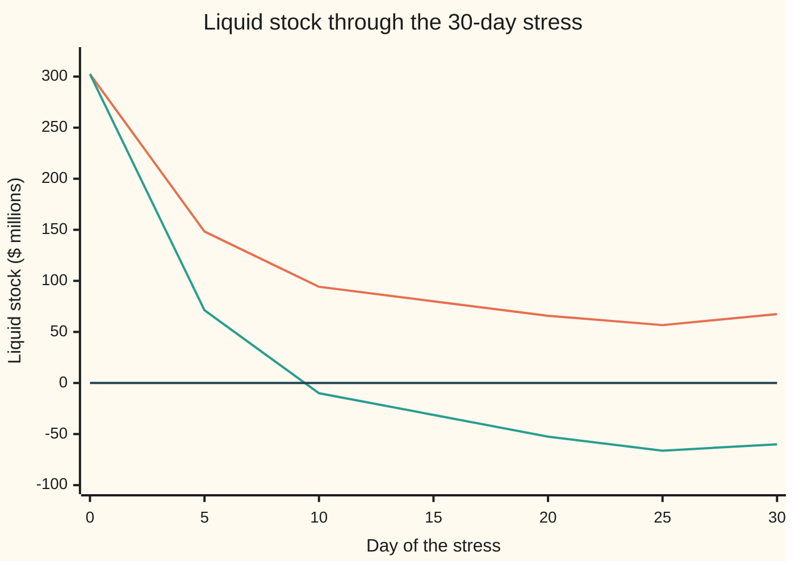

# Liquidity and leverage: LCR, NSFR and the leverage ratio, and what each guards against

[Syllabus](../../../SYLLABUS.md) → [Financial mathematics](../../../SYLLABUS.md#w12) → [Regulatory Capital in Outline](../../../SYLLABUS.md#w12-s48) → Liquidity and leverage

---

## General Overview

A mid-sized bank holds $1 billion of loans and a $100 million trading book. Its balance sheet totals $1.45 billion. Its capital ratio is a healthy 12%. On a Monday a rumour spreads. Other banks that lent it $100 million for a week decline to lend again. Companies start moving deposits elsewhere. Households drift out more slowly. None of this is a loss. The loans are still good. The bank can still fail, because it has run out of cash before the loans pay back.

Capital answers one question: can the bank absorb losses? This card adds three more rules, each a different question. The **Liquidity Coverage Ratio** (LCR) asks: can the bank pay out everything a severe 30-day run would take, from assets it can sell at once? The **Net Stable Funding Ratio** (NSFR) asks: over a year, is the bank's funding as long-lived as its assets? The **leverage ratio** asks: however safe the risk models say the assets are, is the bank borrowing too much in total?

The Basel Committee (the group of bank regulators that writes the international rulebook) published all three between 2013 and 2017, after the 2008 crisis.

### The picture: the 30-day run against the bank's liquid stock

The rulebook's run, applied to this bank. Each bar is one source of cash leaving, in millions of dollars. The last two bars are the total run and what the bank holds to meet it.

```
30-day stress        one block = $10 million
interbank lenders   ██████████                       $100.00
corporate deposits  ████████                         $80.00
less stable retail  ███                              $30.00
stable retail       ██▌                              $25.00
credit lines drawn  ██                               $20.00
total run           █████████████████████████▌       $255.00
liquid stock        ██████████████████████████████▎  $302.50
```

The liquid stock is longer than the run: the LCR passes. The other two ratios ask about what this picture cannot show: the next year, and the balance sheet's total size.

**Each ratio is a stress test folded into one fraction: what the bank holds against one named danger, divided by what that danger would take, and the rule is that the fraction clears a fixed floor of 100%, 100% or 3%.**

**What kind of fact this is:** a convention: the three definitions and every factor inside them are set by the Basel Committee and adopted, with local changes, by each country's regulator; the arithmetic is exact, the factors are judgement. Conventions verified 28 Sep 2026 against the Basel texts in Sources.

---

## The formula

Three fractions. The sign Σ means "add up over every row of the balance sheet". A **run-off rate** is the share of a funding source assumed to leave during the stress. A **haircut** is the share of an asset's price assumed lost when it is sold in a hurry.

$$\text{LCR} = \frac{H}{O - \min(I,\ 0.75\,O)} \ \ge\ 100\%, \qquad O = \sum_i r_i D_i, \qquad I = \sum_j n_j C_j$$

**Read it aloud:** the liquid stock, divided by 30 days of stressed outflows net of the inflows the bank may count, must be at least one.

$$\text{NSFR} = \frac{\text{available stable funding}}{\text{required stable funding}} = \frac{\sum_i a_i F_i}{\sum_j s_j A_j} \ \ge\ 100\%$$

**Read it aloud:** the funding that will still be there in a year must cover the part of the assets that cannot be turned into cash within a year.

$$\text{Leverage ratio} = \frac{T_1}{E} \ \ge\ 3\%, \qquad E = \text{on-balance-sheet assets} + \sum_k c_k U_k$$

**Read it aloud:** the bank's best capital, divided by everything it has lent or promised to lend with no allowance for risk, must be at least 3%.

| Symbol | Plain meaning | In our example | Push it up and the answer… |
| --- | --- | --- | --- |
| $H$ | stock of **high-quality liquid assets** (HQLA): cash and bonds sellable in a day, after haircuts and caps | $302.50m | LCR rises |
| $L_1$, $L_{2A}$, $L_{2B}$, $L_2$ | the three grades of liquid asset, after haircuts of 0%, 15% and 50%; $L_2$ is the two level-2 grades together | $250.00m, $42.50m, $10.00m | $H$ rises, until the caps bite |
| $D_i$, $r_i$ | one source of funding (or an undrawn credit line) and its 30-day run-off rate | interbank $100m at 100% | LCR falls |
| $O$ | total stressed outflows over 30 days | $255.00m | LCR falls |
| $C_j$, $n_j$, $I$ | cash contractually due in, the share the rule lets the bank count, and the counted total | $40m at 50%: $20.00m | LCR rises, up to the 75% cap |
| $F_i$, $a_i$ | one source of funding and its **available stable funding** (ASF) factor: the share assumed to stay a year | stable retail $500m at 95% | NSFR rises |
| $A_j$, $s_j$ | one asset (or undrawn line) and its **required stable funding** (RSF) factor: the share that cannot be turned into cash within a year | mortgages $600m at 65% | NSFR falls |
| $T_1$ | **Tier 1 capital**: shareholders' equity and the instruments that absorb losses as well as equity does | $60m | leverage ratio rises |
| $E$ | the **exposure measure**: every asset at face value plus converted promises | $1,530.00m | leverage ratio falls |
| $U_k$, $c_k$ | an undrawn commitment and its **credit conversion factor** (CCF): the share treated as already lent | $200m at 40% | $E$ rises |
| $\lambda$, $x$ | two stress dials: $\lambda$ scales the whole run (1 is the rulebook's run); $x$ is a loss, taken from equity and assets alike | 1; none | either one pushes the bank toward its floor |
| $a$, $b$ | in the proof of Step 2: how much level 2A and level 2B the bank chooses to count | $42.50m, $10.00m | $H$ rises, until a cap binds |

The liquid stock has a helper formula. Level 2 assets may be at most 40% of the stock, and level 2B at most 15%. When a bank holds too much of them, the excess is cut:

$$H = L_1 + L_{2A} + L_{2B} - \text{cut}_{15} - \text{cut}_{40}$$

$$\text{cut}_{15} = \max\!\Big(L_{2B} - \tfrac{15}{85}(L_1 + L_{2A}),\ L_{2B} - \tfrac{15}{60}L_1,\ 0\Big), \qquad \text{cut}_{40} = \max\!\Big(L_{2A} + L_{2B} - \text{cut}_{15} - \tfrac{2}{3}L_1,\ 0\Big)$$

In words: count level 2 only up to two-thirds of level 1, and level 2B only up to fifteen eighty-fifths of the rest. Step 2 below derives those fractions from the 40% and 15% caps.

### When it holds

These are definitions, so they hold by construction; what can fail is the fit between the rulebook's stress and a real one.

- **The run-off rates match the run.** In March 2023 one US bank lost about a quarter of its deposits in a day, far faster than a 10% or 40% rate over a month. When a run is faster than the table, a passing LCR can still run dry; this bank at 1.5 times the rulebook's run is dry by day 10.
- **Liquid assets sell at the haircut.** A 0% haircut assumes government bonds hold their price. If rates have risen, selling them realises a loss the stock $H$ did not show.
- **Timing within the month does not matter.** The LCR adds up 30 days. If the outflows come early and the inflows late, the stock dips lower before day 30 than on it.
- **Risk weights may be too low.** The leverage ratio exists for that case; when the weights are right it rarely binds.

---

## Why it works

### Step 0: a ratio above a floor is a stress test that the bank survives

Each rule picks one danger and states its size: a 30-day run, a year of doubt that drains short-term funding, a loss that eats capital. The bank must hold enough of the matching resource. Written as holdings over the stressed need, "enough" becomes "the fraction is at least the floor".

### Step 1: the LCR is the 30-day run, added up

Start the stress with liquid stock $H$. Each day some funding leaves and some loan repayments arrive. The stock on any day is $H$ minus the outflows so far plus the inflows so far. On day 30 every outflow in the rulebook has happened:

$$\text{stock on day 30} = H - O + I.$$

The bank survives the month when that is at least zero. Rearranged, $H \ge O - I$, which is the LCR at least 100% (here $I$ is under its cap and counts in full; Step 3 covers the cap). The fraction is the survival test in a different shape.

The same line answers a sharper question: how much worse could the run be? Scale every outflow by $\lambda$ and keep the inflows fixed. The day-30 stock stays at or above zero while $\lambda O - I \le H$, so the largest run the test passes is

$$\lambda^{*} = \frac{H + I}{O} = \frac{302.50 + 20.00}{255.00} = 1.2647.$$

That is the largest run the ratio passes, not the largest the bank lives through. The repayments arrive on day 30, so the stock is lowest on day 29, and the bank stays above zero every day only up to 1.1949 times the rulebook's run (derived in the 30-day section below). The checks find both numbers twice: by formula, and by running the month day by day and searching for the break point with bisection (halving the interval that contains the answer, again and again).

### Step 2: haircuts price the fire sale; the caps stop the stock being built from second-grade assets

A covered bond (a bond backed by a pool of mortgages) sells easily in calm markets and less easily in a panic. The haircuts count only the cash a hurried sale would raise. The caps stop a bank building its whole stock from level 2. Write the level-2 total as $L_2 = L_{2A} + L_{2B}$. The 40% cap says $L_2 \le 0.4\,(L_1 + L_2)$. Move the $L_2$ terms to one side: $0.6\,L_2 \le 0.4\,L_1$, so

$$L_2 \le \tfrac{2}{3}\,L_1.$$

The 15% cap says $L_{2B} \le 0.15\,(L_1 + L_{2A} + L_{2B})$. The same move gives $0.85\,L_{2B} \le 0.15\,(L_1 + L_{2A})$, so

$$L_{2B} \le \tfrac{15}{85}\,(L_1 + L_{2A}).$$

Those are the two fractions in the helper formula. When the 40% cap also binds, the whole stock is $\tfrac{5}{3}L_1$, and 15% of that is $\tfrac{15}{60}L_1$: the third fraction. This bank's level 2 is well under both limits, so no cut applies and $H = 302.50$.

<details>
<summary>Detailed proof: the cut formula counts the largest stock the caps allow</summary>

Fix $L_1$, $L_{2A}$, $L_{2B}$ after haircuts. The bank may count any $a \le L_{2A}$ of level 2A and $b \le L_{2B}$ of level 2B, provided $a + b \le \tfrac23 L_1$ and $b \le \tfrac{15}{85}(L_1 + a)$. It wants the largest $L_1 + a + b$.

**Case 1: the 40% limit does not bind.** Take $a = L_{2A}$. Then $b$ is limited by $L_{2B}$ and by $\tfrac{15}{85}(L_1 + L_{2A})$. The amount of $L_{2B}$ left out is $\max(L_{2B} - \tfrac{15}{85}(L_1 + L_{2A}), 0)$, the first term of $\text{cut}_{15}$.

**Case 2: the 40% limit binds**, so $a + b = \tfrac23 L_1$ and the stock is $\tfrac53 L_1$. The 15% limit becomes $b \le 0.15 \times \tfrac53 L_1 = \tfrac{15}{60} L_1$. Any level 2B above that is cut: the second term of $\text{cut}_{15}$. Level 2A fills the rest of the two-thirds.

Each term is the excess of $L_{2B}$ over one legal bound on $b$; the larger excess is the one that must go. After that, $\text{cut}_{40}$ removes whatever level 2 still exceeds $\tfrac23 L_1$, and what remains is the maximum.

**The checks' test case.** $L_1 = 100$, $L_{2A} = 100$, $L_{2B} = 60$. $\text{cut}_{15} = \max(60 - \tfrac{15}{85} \times 200,\ 60 - \tfrac{15}{60} \times 100,\ 0) = 35.00$. $\text{cut}_{40} = 100 + 60 - 35 - \tfrac23 \times 100 = 58.33$. $H = 166.67$. A search over every countable pair $(a, b)$ in 5-cent steps finds 166.65, a grid step short of the exact value.

</details>

### Step 3: the 75% inflow cap forces a real liquid stock

Without a cap, a bank could count next week's loan repayments against next week's withdrawals and hold nothing. Inflows count only up to 75% of outflows, so the net outflow is at least $O - 0.75\,O = 0.25\,O$. With the LCR at 100% or more, $H \ge 0.25\,O$: at least a quarter of the run must be met from the stock, whatever the inflows. This bank's counted inflows of $20.00m are far below the cap of 75% of $255.00m, so the cap does not bite.

The inflow rate $n_j$ is 50% for loans to companies and households: a bank that wants to stay in business keeps lending to good borrowers, so half of what they repay goes back out.

### Step 4: the NSFR matches the life of the funding to the life of the assets

The LCR covers a month. A bank can pass it and still fund 25-year mortgages with 3-month borrowing, rolled over four times a year. The NSFR looks a year ahead.

Each funding source gets a factor $a_i$, the share assumed to stay through a year of stress: 100% for capital and bonds with over a year to run, 95% for insured household deposits, 50% for company deposits, 0% for money from other banks due within six months. Each asset gets a factor $s_j$, the share that cannot be turned into cash within a year without a large loss: 0% for cash, 5% for government bonds, 65% for low-risk mortgages, 85% for other loans over a year. Undrawn credit lines take 5%, since some will be drawn.

A second road through the same numbers uses the balance sheet identity: total assets equal total funding. Write $\text{Total}$ for either. The funding that is not stable is $\sum_i (1 - a_i) F_i$, and the part of the assets that is liquid within a year is $\sum_j (1 - s_j) A_j$. Then

$$\text{NSFR} = \frac{\text{Total} - \sum_i (1 - a_i) F_i}{\text{Total} - \sum_j (1 - s_j) A_j + 0.05 \times \text{undrawn lines}}.$$

Funding that may leave comes off the top; assets that could be sold come off the bottom. The checks compute both forms. They agree at 130.61%.

### Step 5: the leverage ratio ignores risk on purpose

Risk weights (from [Basel capital](02-basel-capital-and-risk-weighted-assets.md)) let a bank hold less capital against safer assets. Government bonds carry a 0% weight, and a bank's own models set many others. If the weights are too low, the risk-based ratio looks strong while the balance sheet grows without limit.

The leverage ratio counts every dollar the same. An undrawn credit line is not yet a loan, but a company in trouble draws it, so the 40% conversion factor counts part of it as lent already.

What 3% means as a loss: a loss $x$ comes off capital and off assets together. The ratio stays at or above 3% while

$$\frac{T_1 - x}{E - x} \ge 0.03 \quad\Longleftrightarrow\quad x \le \frac{T_1 - 0.03\,E}{0.97}.$$

For this bank that is $(60 - 0.03 \times 1{,}530)/0.97 = 14.54$ million. A loss of about 1% of the balance sheet takes the bank to the floor. The leverage ratio is also a multiple: $1{,}530/60 = 25.50$ dollars of assets per dollar of Tier 1 capital. The 3% floor caps that multiple at about 33.

### Step 6: three ratios, because each catches a failure the others pass

Three changes to the bank, each chosen to break one rule. The table gives all three ratios after each change.

| Change | LCR | NSFR | Leverage | Fails |
| --- | --- | --- | --- | --- |
| A: replace $200m of 2-year bonds with 1-week interbank money | 69.54% | 106.97% | 3.92% | LCR |
| B: add $400m of mortgages funded with 90-day interbank money | 128.72% | 99.91% | 3.11% | NSFR |
| C: buy $500m of government bonds with new 2-year bonds | 341.49% | 184.27% | 2.96% | leverage |

Change A funds the bank with money that can leave in a week: a run problem. Change B funds long mortgages with borrowing that falls due after day 30, so the LCR never sees it. Change C adds only zero-risk-weight assets, so the risk-based capital ratio does not move; only the leverage ratio notices.

---

## Worked numbers, by hand

The bank, in millions of dollars:

| Assets | $m | Funding | $m |
| --- | --- | --- | --- |
| cash and central bank reserves | 80 | stable retail deposits (insured) | 500 |
| government bonds (level 1) | 170 | less stable retail deposits | 300 |
| covered bonds (level 2A) | 50 | company deposits | 200 |
| lower-rated corporate bonds (level 2B) | 20 | 1-week interbank borrowing | 100 |
| mortgages, over a year | 600 | bonds issued, over a year to run | 200 |
| company loans, under a year | 100 | other liabilities | 90 |
| company loans, over a year | 300 | equity (all Tier 1) | 60 |
| trading book (shares, non-HQLA bonds) | 100 | | |
| other assets | 30 | | |
| **total** | **1,450** | **total** | **1,450** |

Off the balance sheet: $200m of undrawn committed credit lines to companies. Company loans repay $40m within the month. Risk-weighted assets are $500m, set by the bank's own risk models, which gives the 12% capital ratio. The bank on [Basel capital](02-basel-capital-and-risk-weighted-assets.md) holds the same loans at the standard weights: $1,000m of risk-weighted assets and $120m of capital for the same 12%. Low model weights let this bank run on half the capital, the case the leverage ratio exists for.

| Step | Arithmetic | Value |
| --- | --- | --- |
| level 1 | $80 + 170$ | $250.00 |
| level 2A after 15% haircut | $0.85 \times 50$ | $42.50 |
| level 2B after 50% haircut | $0.50 \times 20$ | $10.00 |
| liquid stock $H$ (no cap binds) | $250 + 42.50 + 10$ | $302.50 |
| outflows $O$ | $100\% \times 100 + 40\% \times 200 + 10\% \times 300 + 5\% \times 500 + 10\% \times 200$ | $255.00 |
| counted inflows $I$ | $50\% \times 40$ | $20.00 |
| net outflows | $255 - 20$ | $235.00 |
| **LCR** | $302.50 / 235$ | **128.72%** |
| stable funding: capital and long bonds | $100\% \times (60 + 200)$ | $260.00 |
| stable funding: deposits | $95\% \times 500 + 90\% \times 300 + 50\% \times 200$ | $475.00 + 270.00 + 100.00 |
| available stable funding | sum | $1,105.00 |
| required: liquid assets | $0\% \times 80 + 5\% \times 170 + 15\% \times 50 + 50\% \times 20$ | $26.00 |
| required: mortgages | $65\% \times 600$ | $390.00 |
| required: company loans | $50\% \times 100 + 85\% \times 300$ | $305.00 |
| required: trading book and other | $85\% \times 100 + 100\% \times 30$ | $115.00 |
| required: credit lines | $5\% \times 200$ | $10.00 |
| required stable funding | sum | $846.00 |
| **NSFR** | $1{,}105 / 846$ | **130.61%** |
| exposure $E$ | $1{,}450 + 40\% \times 200$ | $1,530.00 |
| **leverage ratio** | $60 / 1{,}530$ | **3.92%** |

The bank passes all three. It would end the rulebook's month-long run with $67.50m of liquid stock to spare. Its stable funding exceeds what its assets need by about 31%. Its leverage ratio is the tightest: a $14.54m loss would take it to the floor.

### What breaks if you drop a piece

| Mistake | Comes out at | What went wrong |
| --- | --- | --- |
| Level 2 counted at market price, no haircuts | LCR 136.17% (right: 128.72%) | A panic sale does not fetch the calm-market price |
| Loan repayments counted at 100%, not 50% | LCR 140.70% | Half of the repayments are lent straight back out to keep good clients |
| Undrawn credit lines left out of the exposure | leverage 4.14% (right: 3.92%) | A promise to lend becomes a loan in exactly the stress that matters |
| Change B's 90-day interbank money given the 50% factor of company deposits | NSFR 117.99% (right: 99.91%) | Short money from other banks is the first to leave; it gets 0% |

---

## The 30 days, one day at a time

The LCR is a single number computed on day 0. The stress it describes happens over a month, and the month has a shape. Here the interbank money leaves over the first 5 days, the company deposits over the first 10, the credit lines are drawn over 20, household deposits leave evenly over all 30, and the loan repayments arrive on day 30.

| Day | Liquid stock, rulebook run ($m) | Liquid stock, run 1.5 times as bad ($m) |
| --- | --- | --- |
| 0 | 302.50 | 302.50 |
| 5 | 148.33 | 71.25 |
| 10 | 94.17 | −10.00 |
| 15 | 80.00 | −31.25 |
| 20 | 65.83 | −52.50 |
| 25 | 56.67 | −66.25 |
| 30 | 67.50 | −60.00 |

Half the stock is gone within 5 days, because the fastest money is also the largest outflow. And the stock is lowest on day 29, at $49.33m, not on day 30, because the loan repayments arrive last. The ratio measures day 30: 302.50 − 235.00 = 67.50. Everything that leaves by day 29 totals $253.17m, so a run $\lambda$ times the rulebook's keeps the stock above zero every day only while $253.17\,\lambda \le 302.50$, that is $\lambda \le 1.1949$. The Basel text itself asks banks to watch for mismatches inside the 30 days.



Orange: the rulebook's run. The stock falls fast, levels off and ends at $67.50m. Green: the same run 1.5 times as strong. The stock crosses zero on day 10, when the bank can no longer pay. Dark: zero. The day-30 test passes runs up to 1.2647 times the rulebook's; the stock stays above zero every day only up to 1.1949. A run of 1.5 is past both.

---

## Code, from first principles, and it actually runs

Both scripts build the balance sheet above and print every number on the card, each reached by two roads: the LCR by formula and by living through the 30 days; the largest run passing on day 30, and on every day, each in closed form and by bisection; the capped stock by the Basel formula and by search; the NSFR by factor sums and by the balance sheet identity; the exposure from the asset side and the funding side; the breach loss in closed form and by bisection. Then three changes to the bank, each of which must fail its own rule.

### Python

```python
# Liquidity and leverage ratios -- the check behind the card.  Standard library only.
# One bank, money in millions of dollars.  Every number quoted on the card is printed here.
# Factors: Basel LCR (2013), NSFR (2014), leverage ratio (2017 revision), verified 28 Sep 2026.
ASSETS = {"cash": 80.0, "gov": 170.0, "l2a": 50.0, "l2b": 20.0, "mortgage": 600.0,
          "corp_short": 100.0, "corp_long": 300.0, "trading": 100.0, "other": 30.0}
FUNDING = {"stable": 500.0, "less_stable": 300.0, "corporate": 200.0, "interbank": 100.0,
           "bonds": 200.0, "other": 90.0, "equity": 60.0}
UNDRAWN, LOAN_DUE, RWA = 200.0, 40.0, 500.0     # committed credit lines; loan repayments due in 30 days
RUNOFF = {"stable": 0.05, "less_stable": 0.10, "corporate": 0.40, "interbank": 1.00}
SPREAD = {"stable": 30, "less_stable": 30, "corporate": 10, "interbank": 5}   # days each run takes
ASF = {"stable": 0.95, "less_stable": 0.90, "corporate": 0.50, "interbank": 0.0, "bonds": 1.0,
       "other": 0.0, "equity": 1.0, "interbank_90": 0.0}
RSF = {"cash": 0.0, "gov": 0.05, "l2a": 0.15, "l2b": 0.50, "mortgage": 0.65, "corp_short": 0.50,
       "corp_long": 0.85, "trading": 0.85, "other": 1.0}

def hqla(l1, l2a, l2b):                  # road 1: the Basel formula for the 15% and 40% caps
    adj15 = max(l2b - 15 / 85 * (l1 + l2a), l2b - 15 / 60 * l1, 0.0)
    adj40 = max(l2a + l2b - adj15 - 2 / 3 * l1, 0.0)
    return l1 + l2a + l2b - adj15 - adj40

def hqla_search(l1, l2a, l2b, h=0.05):   # road 2: try every countable amount, keep the largest legal one
    best = 0.0
    for i in range(int(round(l2a / h)) + 1):
        for j in range(int(round(l2b / h)) + 1):
            a, b = i * h, j * h
            tot = l1 + a + b
            if a + b <= 0.40 * tot + 1e-12 and b <= 0.15 * tot + 1e-12:
                best = max(best, tot)
    return best

def ratios(A, F):                        # all three ratios, straight from the definitions
    H = hqla(A["cash"] + A["gov"], 0.85 * A["l2a"], 0.50 * A["l2b"])
    out = sum(RUNOFF.get(k, 0.0) * v for k, v in F.items()) + 0.10 * UNDRAWN
    inflow = 0.50 * LOAN_DUE
    lcr = H / (out - min(inflow, 0.75 * out))
    nsfr = sum(ASF[k] * v for k, v in F.items()) / (sum(RSF[k] * v for k, v in A.items()) + 0.05 * UNDRAWN)
    lev = F["equity"] / (sum(A.values()) + 0.40 * UNDRAWN)
    return H, out, inflow, lcr, nsfr, lev

def stress_path(H, mult):                # road 2 for the LCR: live through the 30 days one day at a time
    stock = [H]
    for d in range(1, 31):
        out = sum(mult * RUNOFF[k] * FUNDING[k] / SPREAD[k] for k in RUNOFF if d <= SPREAD[k])
        out += mult * 0.10 * UNDRAWN / 20 if d <= 20 else 0.0      # credit lines drawn over 20 days
        stock.append(stock[-1] - out + (0.50 * LOAN_DUE if d == 30 else 0.0))   # loans repay on day 30
    return stock

def bisect(f, lo, hi):                   # root finder written out: f(lo) and f(hi) differ in sign
    for _ in range(200):
        mid = 0.5 * (lo + hi)
        if (f(lo) > 0) == (f(mid) > 0): lo = mid
        else: hi = mid
    return 0.5 * (lo + hi)

H, out, inflow, lcr, nsfr, lev = ratios(ASSETS, FUNDING)
path = stress_path(H, 1.0)
lcr_sim = H / (H - path[30])
lam_closed = (H + inflow) / out
lam_bisect = bisect(lambda m: stress_path(H, m)[30], 0.5, 3.0)
lam_day = H / (sum(RUNOFF[k] * FUNDING[k] * min(29, SPREAD[k]) / SPREAD[k] for k in RUNOFF) + 0.10 * UNDRAWN)
lam_day_b = bisect(lambda m: min(stress_path(H, m)), 0.5, 3.0)   # every day, not just day 30
hard = stress_path(H, 1.5)
dry_day = next(d for d, s in enumerate(hard) if s < 0)
asf = sum(ASF[k] * v for k, v in FUNDING.items())
rsf = sum(RSF[k] * v for k, v in ASSETS.items()) + 0.05 * UNDRAWN
total = sum(FUNDING.values())            # road 2 for the NSFR: start from the whole balance sheet
unstable = sum((1 - ASF[k]) * v for k, v in FUNDING.items())
free = sum((1 - RSF[k]) * v for k, v in ASSETS.items())
nsfr2 = (total - unstable) / (total - free + 0.05 * UNDRAWN)
exp_assets = sum(ASSETS.values()) + 0.40 * UNDRAWN
exp_funding = total + 0.40 * UNDRAWN     # road 2 for the leverage exposure: the funding side
T1 = FUNDING["equity"]
x_closed = (T1 - 0.03 * exp_assets) / 0.97
x_bisect = bisect(lambda x: (T1 - x) / (exp_assets - x) - 0.03, 0.0, T1)

def scen(dA, dF):
    A2, F2 = dict(ASSETS), dict(FUNDING)
    for k, v in dA.items(): A2[k] = A2.get(k, 0.0) + v
    for k, v in dF.items(): F2[k] = F2.get(k, 0.0) + v
    return ratios(A2, F2)

sA = scen({}, {"bonds": -200.0, "interbank": 200.0})                # 1-week money replaces 2-year bonds
sB = scen({"mortgage": 400.0}, {"interbank_90": 400.0})            # mortgages on 90-day interbank money
sC = scen({"gov": 500.0}, {"bonds": 500.0})                         # government bonds bought with bonds

L1, L2A, L2B = ASSETS["cash"] + ASSETS["gov"], 0.85 * ASSETS["l2a"], 0.50 * ASSETS["l2b"]
print(f"{'HQLA: level 1, level 2A, level 2B':<42}{L1:9.2f}{L2A:9.2f}{L2B:9.2f}")
print(f"{'HQLA, cap formula / cap search':<42}{H:9.2f}{hqla_search(L1, L2A, L2B):9.2f}")
a15 = max(60.0 - 15 / 85 * 200.0, 60.0 - 15 / 60 * 100.0, 0.0)
print(f"{'caps bite (100, 100, 60): cuts':<42}{a15:9.2f}{max(160.0 - a15 - 200 / 3, 0.0):9.2f}")
print(f"{'caps bite (100, 100, 60): formula':<42}{hqla(100.0, 100.0, 60.0):9.2f}{hqla_search(100.0, 100.0, 60.0):9.2f}")
names = {"interbank": "interbank", "corporate": "corporate", "less_stable": "less stable retail", "stable": "stable retail"}
for k, v in [(names[k], RUNOFF[k] * FUNDING[k]) for k in names] + [("credit lines", 0.10 * UNDRAWN)]:
    print(f"{'  30-day outflow, ' + k:<42}{v:9.2f}")
print(f"{'outflows, inflows, net':<42}{out:9.2f}{inflow:9.2f}{out - min(inflow, 0.75 * out):9.2f}")
print(f"{'LCR % formula / day-by-day':<42}{100 * lcr:9.2f}{100 * lcr_sim:9.2f}")
print("stress day      " + "".join(f"{d:9d}" for d in range(0, 31, 5)))
print("stock, 1.0x run " + "".join(f"{path[d]:9.2f}" for d in range(0, 31, 5)))
print("stock, 1.5x run " + "".join(f"{hard[d]:9.2f}" for d in range(0, 31, 5)))
print(f"{'lowest stock, day':<42}{min(path):9.2f}{path.index(min(path)):9d}")
print(f"{'largest run: day 30 x2, every day x2':<42}{lam_closed:9.4f}{lam_bisect:9.4f}{lam_day:9.4f}{lam_day_b:9.4f}")
print(f"{'1.5x run: stock day 29, 30; dry day':<42}{hard[29]:9.2f}{hard[30]:9.2f}{dry_day:9d}")
F, A = FUNDING, ASSETS
print(f"{'ASF: long-term, stable, less, corporate':<42}{F['equity'] + F['bonds']:9.2f}{0.95 * F['stable']:9.2f}"
      f"{0.90 * F['less_stable']:9.2f}{0.50 * F['corporate']:9.2f}")
print(f"{'RSF: liquid, mortgage, corp, rest, lines':<42}{0.05 * A['gov'] + 0.15 * A['l2a'] + 0.5 * A['l2b']:9.2f}"
      f"{0.65 * A['mortgage']:9.2f}{0.5 * A['corp_short'] + 0.85 * A['corp_long']:9.2f}"
      f"{0.85 * A['trading'] + A['other']:9.2f}{0.05 * UNDRAWN:9.2f}")
print(f"{'ASF, RSF':<42}{asf:9.2f}{rsf:9.2f}")
print(f"{'NSFR % by factors / by identity':<42}{100 * nsfr:9.2f}{100 * nsfr2:9.2f}")
print(f"{'exposure: on balance sheet, credit lines':<42}{sum(A.values()):9.2f}{0.40 * UNDRAWN:9.2f}")
print(f"{'exposure: asset side / funding side':<42}{exp_assets:9.2f}{exp_funding:9.2f}")
print(f"{'leverage %, CET1 % on RWA 500':<42}{100 * lev:9.2f}{100 * T1 / RWA:9.2f}")
print(f"{'assets per dollar of Tier 1':<42}{exp_assets / T1:9.2f}")
print(f"{'loss that breaches 3%, closed / bisect':<42}{x_closed:9.2f}{x_bisect:9.2f}")
print("scenario: LCR %, NSFR %, leverage %")
for name, s in (("A, 1-week money", sA), ("B, 90-day mortgages", sB), ("C, bonds for bonds", sC)):
    print(f"{'  ' + name:<42}{100 * s[3]:9.2f}{100 * s[4]:9.2f}{100 * s[5]:9.2f}")
wrong = [("wrong: no haircuts on level 2", 100 * (L1 + ASSETS["l2a"] + ASSETS["l2b"]) / (out - inflow)),
         ("wrong: loan inflows at 100%", 100 * H / (out - LOAN_DUE)),
         ("wrong: credit lines left out of lev.", 100 * T1 / sum(ASSETS.values())),
         ("wrong: 90-day money as 50% ASF (B)", 100 * scen({"mortgage": 400.0}, {"corporate": 400.0})[4])]
for name, v in wrong:
    print(f"{name:<42}{v:9.2f}")
tA = scen({}, {"less_stable": -100.0, "stable": 100.0})
tB = scen({"trading": -100.0, "gov": 100.0}, {})
tC = scen({"other": -15.0}, {"equity": -15.0})
print(f"{'try: 100 made stable, LCR NSFR %':<42}{100 * tA[3]:9.2f}{100 * tA[4]:9.2f}")
print(f"{'try: trading into gov, LCR NSFR lev %':<42}{100 * tB[3]:9.2f}{100 * tB[4]:9.2f}{100 * tB[5]:9.2f}")
print(f"{'try: 15 lost, leverage %':<42}{100 * tC[5]:9.2f}")

assert abs(sum(ASSETS.values()) - total) < 1e-9, "balance sheet must balance"
assert abs(lcr - lcr_sim) < 1e-9, "LCR formula vs the day-by-day stress"
assert abs(lam_closed - lam_bisect) < 1e-9, "largest run passing day 30: closed form vs bisection"
assert abs(lam_day - lam_day_b) < 1e-9 and lam_day < lam_closed, "every-day survival: closed vs bisection"
assert abs(hqla(100.0, 100.0, 60.0) - hqla_search(100.0, 100.0, 60.0)) < 0.06, "cap formula vs search"
assert abs(nsfr - nsfr2) < 1e-12, "NSFR: factor sums vs the balance-sheet identity"
assert abs(x_closed - x_bisect) < 1e-9, "breach loss: closed form vs bisection"
for s, i in ((sA, 3), (sB, 4), (sC, 5)): assert [s[3] < 1, s[4] < 1, s[5] < 0.03] == [j == i for j in (3, 4, 5)], "each change fails only its own rule"
print("ALL CHECKS PASS")
```

**Ran 2026-09-28 on macOS, Python 3.14.6, standard library only. All checks passed. Output, pasted from the run:**

```
HQLA: level 1, level 2A, level 2B            250.00    42.50    10.00
HQLA, cap formula / cap search               302.50   302.50
caps bite (100, 100, 60): cuts                35.00    58.33
caps bite (100, 100, 60): formula            166.67   166.65
  30-day outflow, interbank                  100.00
  30-day outflow, corporate                   80.00
  30-day outflow, less stable retail          30.00
  30-day outflow, stable retail               25.00
  30-day outflow, credit lines                20.00
outflows, inflows, net                       255.00    20.00   235.00
LCR % formula / day-by-day                   128.72   128.72
stress day              0        5       10       15       20       25       30
stock, 1.0x run    302.50   148.33    94.17    80.00    65.83    56.67    67.50
stock, 1.5x run    302.50    71.25   -10.00   -31.25   -52.50   -66.25   -60.00
lowest stock, day                             49.33       29
largest run: day 30 x2, every day x2         1.2647   1.2647   1.1949   1.1949
1.5x run: stock day 29, 30; dry day          -77.25   -60.00       10
ASF: long-term, stable, less, corporate      260.00   475.00   270.00   100.00
RSF: liquid, mortgage, corp, rest, lines      26.00   390.00   305.00   115.00    10.00
ASF, RSF                                    1105.00   846.00
NSFR % by factors / by identity              130.61   130.61
exposure: on balance sheet, credit lines    1450.00    80.00
exposure: asset side / funding side         1530.00  1530.00
leverage %, CET1 % on RWA 500                  3.92    12.00
assets per dollar of Tier 1                   25.50
loss that breaches 3%, closed / bisect        14.54    14.54
scenario: LCR %, NSFR %, leverage %
  A, 1-week money                             69.54   106.97     3.92
  B, 90-day mortgages                        128.72    99.91     3.11
  C, bonds for bonds                         341.49   184.27     2.96
wrong: no haircuts on level 2                136.17
wrong: loan inflows at 100%                  140.70
wrong: credit lines left out of lev.           4.14
wrong: 90-day money as 50% ASF (B)           117.99
try: 100 made stable, LCR NSFR %             131.52   131.21
try: trading into gov, LCR NSFR lev %        171.28   144.26     3.92
try: 15 lost, leverage %                       2.97
ALL CHECKS PASS
```

### Rust

The same checks in Rust. The balance sheet is a sorted map, so the sums run in a fixed order.

```rust
// Liquidity and leverage ratios -- the same check as liquidity_and_leverage_ratios_check.py, in Rust.
// Standard library only, no crates.  One bank, money in millions of dollars.
// Compile: rustc --edition 2021 -O liquidity_and_leverage_ratios_check.rs -o /tmp/liq_check
use std::collections::BTreeMap;

type Book = BTreeMap<&'static str, f64>;
const UNDRAWN: f64 = 200.0; const LOAN_DUE: f64 = 40.0; const RWA: f64 = 500.0;   // credit lines, loans due

fn book(items: &[(&'static str, f64)]) -> Book { items.iter().cloned().collect() }
fn assets() -> Book {
    book(&[("cash", 80.0), ("gov", 170.0), ("l2a", 50.0), ("l2b", 20.0), ("mortgage", 600.0),
           ("corp_short", 100.0), ("corp_long", 300.0), ("trading", 100.0), ("other", 30.0)])
}
fn funding() -> Book {
    book(&[("stable", 500.0), ("less_stable", 300.0), ("corporate", 200.0), ("interbank", 100.0),
           ("bonds", 200.0), ("other", 90.0), ("equity", 60.0)])
}
fn runoff(k: &str) -> f64 {
    match k { "stable" => 0.05, "less_stable" => 0.10, "corporate" => 0.40, "interbank" => 1.0, _ => 0.0 }
}
fn spread(k: &str) -> usize { match k { "corporate" => 10, "interbank" => 5, _ => 30 } }
fn asf_f(k: &str) -> f64 {
    match k { "stable" => 0.95, "less_stable" => 0.90, "corporate" => 0.50, "bonds" | "equity" => 1.0, _ => 0.0 }
}
fn rsf_f(k: &str) -> f64 {
    match k {
        "cash" => 0.0, "gov" => 0.05, "l2a" => 0.15, "l2b" | "corp_short" => 0.50, "mortgage" => 0.65,
        "corp_long" | "trading" => 0.85, _ => 1.0,
    }
}
fn g(b: &Book, k: &str) -> f64 { *b.get(k).unwrap_or(&0.0) }
fn total(b: &Book) -> f64 { b.values().sum() }

fn hqla(l1: f64, l2a: f64, l2b: f64) -> f64 {           // road 1: the Basel cap formula
    let adj15 = (l2b - 15.0 / 85.0 * (l1 + l2a)).max(l2b - 15.0 / 60.0 * l1).max(0.0);
    let adj40 = (l2a + l2b - adj15 - 2.0 / 3.0 * l1).max(0.0);
    l1 + l2a + l2b - adj15 - adj40
}
fn hqla_search(l1: f64, l2a: f64, l2b: f64, h: f64) -> f64 {   // road 2: largest legal count, by search
    let mut best = 0.0_f64;
    for i in 0..=((l2a / h).round() as usize) {
        for j in 0..=((l2b / h).round() as usize) {
            let (a, b) = (i as f64 * h, j as f64 * h);
            let tot = l1 + a + b;
            if a + b <= 0.40 * tot + 1e-12 && b <= 0.15 * tot + 1e-12 { best = best.max(tot); }
        }
    }
    best
}
// returns (HQLA, outflows, inflows, LCR, NSFR, leverage)
fn ratios(a: &Book, f: &Book) -> (f64, f64, f64, f64, f64, f64) {
    let h = hqla(g(a, "cash") + g(a, "gov"), 0.85 * g(a, "l2a"), 0.50 * g(a, "l2b"));
    let out: f64 = f.iter().map(|(k, v)| runoff(k) * v).sum::<f64>() + 0.10 * UNDRAWN;
    let inflow = 0.50 * LOAN_DUE;
    let lcr = h / (out - inflow.min(0.75 * out));
    let (asf, rsf) = (f.iter().map(|(k, v)| asf_f(k) * v).sum::<f64>(),
                      a.iter().map(|(k, v)| rsf_f(k) * v).sum::<f64>() + 0.05 * UNDRAWN);
    (h, out, inflow, lcr, asf / rsf, g(f, "equity") / (total(a) + 0.40 * UNDRAWN))
}
fn stress_path(h: f64, mult: f64) -> Vec<f64> {         // road 2 for the LCR: day by day
    let f = funding();
    let mut stock = vec![h];
    for d in 1..=30usize {
        let mut out: f64 = ["stable", "less_stable", "corporate", "interbank"].iter()
            .filter(|k| d <= spread(k)).map(|k| mult * runoff(k) * g(&f, k) / spread(k) as f64).sum();
        if d <= 20 { out += mult * 0.10 * UNDRAWN / 20.0; }
        stock.push(stock[d - 1] - out + if d == 30 { 0.50 * LOAN_DUE } else { 0.0 });   // loans repay day 30
    }
    stock
}
fn bisect<F: Fn(f64) -> f64>(f: F, mut lo: f64, mut hi: f64) -> f64 {
    for _ in 0..200 {
        let mid = 0.5 * (lo + hi);
        if (f(lo) > 0.0) == (f(mid) > 0.0) { lo = mid; } else { hi = mid; }
    }
    0.5 * (lo + hi)
}
fn scen(da: &[(&'static str, f64)], df: &[(&'static str, f64)]) -> (f64, f64, f64, f64, f64, f64) {
    let (mut a, mut f) = (assets(), funding());
    for (k, v) in da { *a.entry(k).or_insert(0.0) += v; }
    for (k, v) in df { *f.entry(k).or_insert(0.0) += v; }
    ratios(&a, &f)
}
fn row(label: &str, vals: &[f64], dp: usize) {
    let s: String = vals.iter().map(|v| format!("{:9.*}", dp, v)).collect();
    println!("{:<42}{}", label, s);
}

fn main() {
    let (a, f) = (assets(), funding());
    let (h, out, inflow, lcr, nsfr, lev) = ratios(&a, &f);
    let path = stress_path(h, 1.0);
    let lcr_sim = h / (h - path[30]);
    let lam_closed = (h + inflow) / out;
    let lam_bisect = bisect(|m| stress_path(h, m)[30], 0.5, 3.0);
    let lam_day = h / (["stable", "less_stable", "corporate", "interbank"].iter().map(|k| runoff(k) * g(&f, k) * spread(k).min(29) as f64 / spread(k) as f64).sum::<f64>() + 0.10 * UNDRAWN);
    let lam_day_b = bisect(|m| stress_path(h, m).iter().cloned().fold(f64::MAX, f64::min), 0.5, 3.0);   // every day
    let hard = stress_path(h, 1.5);
    let dry_day = hard.iter().position(|s| *s < 0.0).unwrap();
    let tot = total(&f);                                  // road 2 for the NSFR: whole balance sheet
    let unstable: f64 = f.iter().map(|(k, v)| (1.0 - asf_f(k)) * v).sum();
    let free: f64 = a.iter().map(|(k, v)| (1.0 - rsf_f(k)) * v).sum();
    let nsfr2 = (tot - unstable) / (tot - free + 0.05 * UNDRAWN);
    let asf: f64 = f.iter().map(|(k, v)| asf_f(k) * v).sum();
    let rsf: f64 = a.iter().map(|(k, v)| rsf_f(k) * v).sum::<f64>() + 0.05 * UNDRAWN;
    let exp_assets = total(&a) + 0.40 * UNDRAWN;
    let exp_funding = tot + 0.40 * UNDRAWN;               // road 2 for the exposure: the funding side
    let t1 = g(&f, "equity");
    let x_closed = (t1 - 0.03 * exp_assets) / 0.97;
    let x_bisect = bisect(|x| (t1 - x) / (exp_assets - x) - 0.03, 0.0, t1);
    let s_a = scen(&[], &[("bonds", -200.0), ("interbank", 200.0)]);
    let s_b = scen(&[("mortgage", 400.0)], &[("interbank_90", 400.0)]);
    let s_c = scen(&[("gov", 500.0)], &[("bonds", 500.0)]);

    let (l1, l2a, l2b) = (g(&a, "cash") + g(&a, "gov"), 0.85 * g(&a, "l2a"), 0.50 * g(&a, "l2b"));
    row("HQLA: level 1, level 2A, level 2B", &[l1, l2a, l2b], 2);
    row("HQLA, cap formula / cap search", &[h, hqla_search(l1, l2a, l2b, 0.05)], 2);
    let a15 = (60.0_f64 - 15.0 / 85.0 * 200.0).max(60.0 - 15.0 / 60.0 * 100.0).max(0.0);
    row("caps bite (100, 100, 60): cuts", &[a15, (160.0_f64 - a15 - 200.0 / 3.0).max(0.0)], 2);
    row("caps bite (100, 100, 60): formula", &[hqla(100.0, 100.0, 60.0), hqla_search(100.0, 100.0, 60.0, 0.05)], 2);
    for (k, name) in [("interbank", "interbank"), ("corporate", "corporate"), ("less_stable", "less stable retail"), ("stable", "stable retail")] {
        row(&format!("  30-day outflow, {}", name), &[runoff(k) * g(&f, k)], 2);
    }
    row("  30-day outflow, credit lines", &[0.10 * UNDRAWN], 2);
    row("outflows, inflows, net", &[out, inflow, out - inflow.min(0.75 * out)], 2);
    row("LCR % formula / day-by-day", &[100.0 * lcr, 100.0 * lcr_sim], 2);
    println!("stress day      {}", (0..=30).step_by(5).map(|d| format!("{:9}", d)).collect::<String>());
    println!("stock, 1.0x run {}", (0..=30).step_by(5).map(|d| format!("{:9.2}", path[d])).collect::<String>());
    println!("stock, 1.5x run {}", (0..=30).step_by(5).map(|d| format!("{:9.2}", hard[d])).collect::<String>());
    let (lo_day, lo) = path.iter().enumerate().fold((0, f64::MAX), |b, (d, s)| if *s < b.1 { (d, *s) } else { b });
    println!("{:<42}{:9.2}{:9}", "lowest stock, day", lo, lo_day);
    row("largest run: day 30 x2, every day x2", &[lam_closed, lam_bisect, lam_day, lam_day_b], 4);
    println!("{:<42}{:9.2}{:9.2}{:9}", "1.5x run: stock day 29, 30; dry day", hard[29], hard[30], dry_day);
    row("ASF: long-term, stable, less, corporate", &[g(&f, "equity") + g(&f, "bonds"), 0.95 * g(&f, "stable"),
        0.90 * g(&f, "less_stable"), 0.50 * g(&f, "corporate")], 2);
    row("RSF: liquid, mortgage, corp, rest, lines", &[0.05 * g(&a, "gov") + 0.15 * g(&a, "l2a") + 0.5 * g(&a, "l2b"),
        0.65 * g(&a, "mortgage"), 0.5 * g(&a, "corp_short") + 0.85 * g(&a, "corp_long"),
        0.85 * g(&a, "trading") + g(&a, "other"), 0.05 * UNDRAWN], 2);
    row("ASF, RSF", &[asf, rsf], 2);
    row("NSFR % by factors / by identity", &[100.0 * nsfr, 100.0 * nsfr2], 2);
    row("exposure: on balance sheet, credit lines", &[total(&a), 0.40 * UNDRAWN], 2);
    row("exposure: asset side / funding side", &[exp_assets, exp_funding], 2);
    row("leverage %, CET1 % on RWA 500", &[100.0 * lev, 100.0 * t1 / RWA], 2);
    row("assets per dollar of Tier 1", &[exp_assets / t1], 2);
    row("loss that breaches 3%, closed / bisect", &[x_closed, x_bisect], 2);
    println!("scenario: LCR %, NSFR %, leverage %");
    for (name, s) in [("A, 1-week money", s_a), ("B, 90-day mortgages", s_b), ("C, bonds for bonds", s_c)] {
        row(&format!("  {}", name), &[100.0 * s.3, 100.0 * s.4, 100.0 * s.5], 2);
    }
    row("wrong: no haircuts on level 2", &[100.0 * (l1 + g(&a, "l2a") + g(&a, "l2b")) / (out - inflow)], 2);
    row("wrong: loan inflows at 100%", &[100.0 * h / (out - LOAN_DUE)], 2);
    row("wrong: credit lines left out of lev.", &[100.0 * t1 / total(&a)], 2);
    row("wrong: 90-day money as 50% ASF (B)", &[100.0 * scen(&[("mortgage", 400.0)], &[("corporate", 400.0)]).4], 2);
    let t_a = scen(&[], &[("less_stable", -100.0), ("stable", 100.0)]);
    let t_b = scen(&[("trading", -100.0), ("gov", 100.0)], &[]);
    let t_c = scen(&[("other", -15.0)], &[("equity", -15.0)]);
    row("try: 100 made stable, LCR NSFR %", &[100.0 * t_a.3, 100.0 * t_a.4], 2);
    row("try: trading into gov, LCR NSFR lev %", &[100.0 * t_b.3, 100.0 * t_b.4, 100.0 * t_b.5], 2);
    row("try: 15 lost, leverage %", &[100.0 * t_c.5], 2);

    assert!((total(&a) - tot).abs() < 1e-9, "balance sheet must balance");
    assert!((lcr - lcr_sim).abs() < 1e-9, "LCR formula vs the day-by-day stress");
    assert!((lam_closed - lam_bisect).abs() < 1e-9, "largest run passing day 30: closed form vs bisection");
    assert!((lam_day - lam_day_b).abs() < 1e-9 && lam_day < lam_closed, "every-day survival: closed vs bisection");
    assert!((hqla(100.0, 100.0, 60.0) - hqla_search(100.0, 100.0, 60.0, 0.05)).abs() < 0.06, "cap formula vs search");
    assert!((nsfr - nsfr2).abs() < 1e-12, "NSFR: factor sums vs the balance-sheet identity");
    assert!((x_closed - x_bisect).abs() < 1e-9, "breach loss: closed form vs bisection");
    for (s, i) in [(s_a, 3), (s_b, 4), (s_c, 5)] { assert!([s.3 < 1.0, s.4 < 1.0, s.5 < 0.03] == [i == 3, i == 4, i == 5], "each change fails only its own rule"); }
    println!("ALL CHECKS PASS");
}
```

**Ran 2026-09-28 on macOS, rustc 1.98.1, no crates. All checks passed. Output, pasted from the run:**

```
HQLA: level 1, level 2A, level 2B            250.00    42.50    10.00
HQLA, cap formula / cap search               302.50   302.50
caps bite (100, 100, 60): cuts                35.00    58.33
caps bite (100, 100, 60): formula            166.67   166.65
  30-day outflow, interbank                  100.00
  30-day outflow, corporate                   80.00
  30-day outflow, less stable retail          30.00
  30-day outflow, stable retail               25.00
  30-day outflow, credit lines                20.00
outflows, inflows, net                       255.00    20.00   235.00
LCR % formula / day-by-day                   128.72   128.72
stress day              0        5       10       15       20       25       30
stock, 1.0x run    302.50   148.33    94.17    80.00    65.83    56.67    67.50
stock, 1.5x run    302.50    71.25   -10.00   -31.25   -52.50   -66.25   -60.00
lowest stock, day                             49.33       29
largest run: day 30 x2, every day x2         1.2647   1.2647   1.1949   1.1949
1.5x run: stock day 29, 30; dry day          -77.25   -60.00       10
ASF: long-term, stable, less, corporate      260.00   475.00   270.00   100.00
RSF: liquid, mortgage, corp, rest, lines      26.00   390.00   305.00   115.00    10.00
ASF, RSF                                    1105.00   846.00
NSFR % by factors / by identity              130.61   130.61
exposure: on balance sheet, credit lines    1450.00    80.00
exposure: asset side / funding side         1530.00  1530.00
leverage %, CET1 % on RWA 500                  3.92    12.00
assets per dollar of Tier 1                   25.50
loss that breaches 3%, closed / bisect        14.54    14.54
scenario: LCR %, NSFR %, leverage %
  A, 1-week money                             69.54   106.97     3.92
  B, 90-day mortgages                        128.72    99.91     3.11
  C, bonds for bonds                         341.49   184.27     2.96
wrong: no haircuts on level 2                136.17
wrong: loan inflows at 100%                  140.70
wrong: credit lines left out of lev.           4.14
wrong: 90-day money as 50% ASF (B)           117.99
try: 100 made stable, LCR NSFR %             131.52   131.21
try: trading into gov, LCR NSFR lev %        171.28   144.26     3.92
try: 15 lost, leverage %                       2.97
ALL CHECKS PASS
```

The two outputs agree line for line.

> [!TIP]
> **Try changing**
> Guess the direction first.
> - **Move $100m of deposits from less stable to stable** (insured, long-standing customers). Guess which ratios move. LCR rises to **131.52%** and NSFR to **131.21%**; leverage does not move, because the balance sheet is the same size.
> - **Swap the $100m trading book for government bonds.** LCR jumps to **171.28%** and NSFR to **144.26%**. Leverage stays at **3.92%**: it counts a government bond and a share alike.
> - **Take a $15m loss on the other assets.** Leverage falls to **2.97%**, just below the floor: 15 is more than the $14.54m the bank could absorb.
> - **Set the run to 1.5 times the rulebook's.** The stock ends at **−60.00** and first goes below zero on day **10**.

---

## The usual mistake

> [!warning]
> **Treating a strong capital ratio as proof the bank is safe.** Capital absorbs losses. A run needs no loss: good loans cannot be sold in a week, and depositors want cash now. Solvency, liquidity and the plain size of the borrowing are three different questions, and Step 6 breaks each one while the others pass.
>
> Smaller traps:
> - **Reading an LCR of 100% as "survives every day of the month".** It is a day-30 total. This bank's stock is lowest on day 29, at $49.33m against $67.50m on day 30; a run 1.2647 times the rulebook's passes the test, yet the stock is below zero for days before the repayments arrive.
> - **Treating 90-day interbank money as stable because it is not due this month.** In change B that turns a failing NSFR of 99.91% into a passing 117.99%.

---

## Where you meet it in real life

- **Northern Rock, 2007.** A UK mortgage lender funded long mortgages with short market borrowing. When those markets froze it could not roll the borrowing over, and depositors queued outside branches. Change B in miniature.
- **Silicon Valley Bank, March 2023.** Depositors asked for about $42 billion in one day. Its liquid assets were largely bonds that had fallen in price as rates rose. It sat below the size at which the full US liquidity rule applied, and its run outpaced any run-off table.
- **The 2008 crisis.** Several large banks entered 2008 meeting their risk-based capital rules with balance sheets 30 or more times their equity. A small fall in asset values erased their capital. The leverage ratio is the direct response.
- **Quarterly disclosures.** Large banks publish all three ratios in their risk reports, beside the risk-based ratios from [Basel capital](02-basel-capital-and-risk-weighted-assets.md).
- **The rest of the shelf.** Losses that capital must absorb are split into average and surprise on [Expected and unexpected loss](01-expected-versus-unexpected-loss.md); the trading book's own capital charge is on [Market-risk capital](04-frtb-and-the-shift-to-expected-shortfall.md).

> **Say it back**
> A bank can be solvent and still fail, by running out of cash or by borrowing too much for its capital to cover a small fall in value. The LCR asks whether liquid assets, after haircuts, cover a prescribed 30-day run net of capped inflows. The NSFR asks whether funding that stays a year covers the assets that cannot be sold within a year. The leverage ratio asks whether Tier 1 capital is at least 3% of everything lent or promised, with no risk weights. Each catches a failure the other two pass.

---

## What this builds on

- [Basel capital](02-basel-capital-and-risk-weighted-assets.md): Tier 1 capital, risk weights and the risk-based ratio that these three rules sit beside.

## Where this goes next

- [The Basel credit formula](03-vasicek-asrf-and-credit-capital.md): where the risk weights that the leverage ratio distrusts come from, derived from a model of loan defaults.
- [Market-risk capital](04-frtb-and-the-shift-to-expected-shortfall.md): the capital charge on the trading book, whose liquidity horizons are the market-risk cousin of this card's run-off rates.

The rulebook's run is a fixed table; how fast a real run moves, and what the bank should hold against a run it has never seen, is the question these ratios leave to stress testing and judgement.

---

## Sources

Verified 28 Sep 2026: every link below resolves to the publisher's page.

- Basel Committee on Banking Supervision. *Basel III: The Liquidity Coverage Ratio and liquidity risk monitoring tools.* Bank for International Settlements, January 2013. [Publisher page](https://www.bis.org/publications/201301-standards-basel-iii-liquidity-coverage-ratio-and-liquidity-risk-monitoring-tools). The LCR: run-off and inflow rates, haircuts, the caps and their formula (Annex 1), the 75% inflow cap.
- Basel Committee on Banking Supervision. *Basel III: the net stable funding ratio.* Bank for International Settlements, October 2014. [Publisher page](https://www.bis.org/publications/201410-standards-basel-iii-net-stable-funding-ratio). The NSFR: the ASF and RSF factor tables used here.
- Basel Committee on Banking Supervision. *Basel III leverage ratio framework and disclosure requirements.* Bank for International Settlements, January 2014. [Publisher page](https://www.bis.org/publications/201401-standards-basel-iii-leverage-ratio-framework-and-disclosure-requirements). The leverage ratio's definition and its exposure measure.
- Basel Committee on Banking Supervision. *Basel III: Finalising post-crisis reforms.* Bank for International Settlements, December 2017. [Publisher page](https://www.bis.org/publications/201712-standards-basel-iii-finalising-post-crisis-reforms). The revised leverage ratio: the 3% minimum at all times, the G-SIB buffer, and the 40% conversion factor for commitments.
