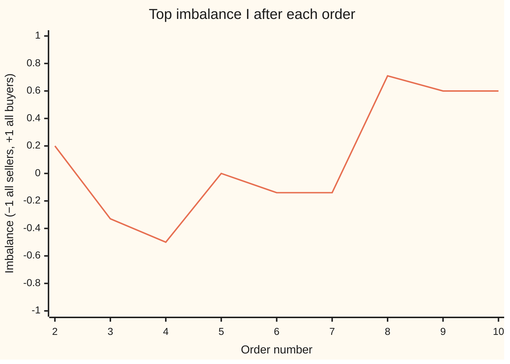
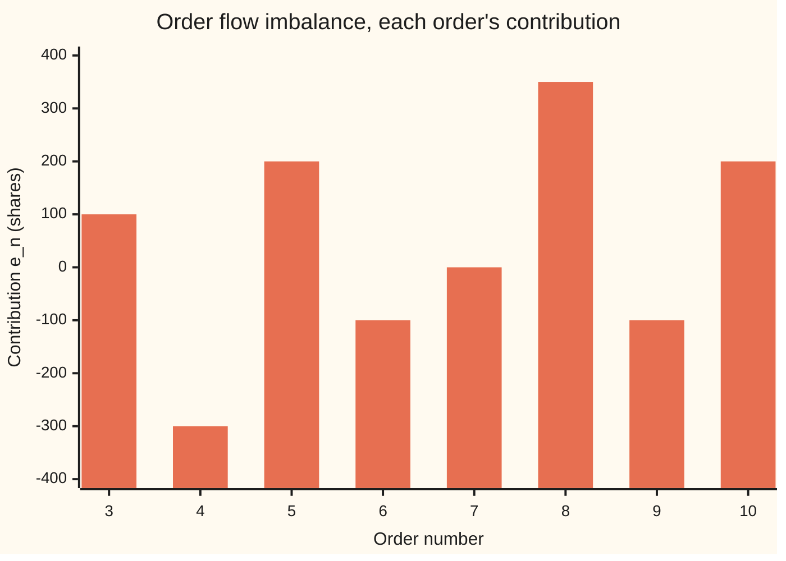

# The order book: bids, asks, queues and the matching rule

Financial mathematics → Microstructure and Execution → Matching resting orders → The order book

---

## General Overview

Acme shares trade on an exchange. Just after the opening, ten orders arrive, one after another. Some say "buy 300 shares, but pay no more than $99.98". Some say "sell 200 shares, but take no less than $100.02". One says "buy 350 shares now, at whatever price is on offer". By the tenth order, three trades have taken place.

An order that names a price is a **limit order**. If nobody will meet that price yet, it waits. The waiting orders form a list, sorted by price, with the buyers on one side and the sellers on the other. That list is the **order book**. A waiting buy is a **bid**; a waiting sell is an **ask** (also called an offer). An order that names no price, "fill me now", is a **market order**.

When a new order can trade against a waiting one, the exchange decides who trades first by a fixed **matching rule**. The common one is **price-time priority**: the best price goes first, and among orders at the same price, the one that arrived earliest goes first. The trade happens at the waiting order's price.

From the book alone three readings follow. The **spread** is the gap between the cheapest ask and the dearest bid: what buying and then selling at once costs per share. The **depth** is how many shares wait near the top of the book. The **imbalance** says which side of the top holds more shares.

**An order book is two queues of waiting orders sorted by price and then by arrival time; each new order trades against the front of the opposite queue while prices cross, at the waiting order's price; spread, depth and imbalance are read straight off what remains.**

**What kind of fact this is:** a convention. Price-time priority is a rule exchanges choose, and some markets choose another. Spread, depth and imbalance are definitions. What Why it works proves follows from the rule alone: the book never ends up crossed, and two very different ways of running the rule give the same trades.

### The picture: Acme's book after seven orders

Each row is a price level. Asks sit above, bids below, best prices nearest the middle. Within a level, the order that arrived first is on the left. One block is 50 shares.

```
Acme's book after order 7, one block = 50 shares, oldest order first
  ask  $100.03   ████████          400         order 7
  ask  $100.02   ████              200         order 2
  ask  $100.01   ██████ ██         300 + 100   orders 4, then 6
       ----------- spread $0.02, mid $100.00 -----------
  bid   $99.99   ██ ████           100 + 200   orders 3, then 5
  bid   $99.98   ██████            300         order 1
```

Nothing has traded yet: every buyer wants to pay less than every seller will take. Order 8, a market buy of 350, will take all of order 4 and part of order 6; orders 2 and 7 wait behind them at worse prices.

---

## The formula

Notation first, in words. At any moment $b$ is the **best bid**: the highest price any waiting buyer will pay. $a$ is the **best ask**: the lowest price any waiting seller will take. $Q_b$ and $Q_a$ count the shares waiting at exactly those two prices.

**The matching rule.** Give every waiting order a key: its price, then its arrival number. An incoming buy meets the waiting sells in order of the smallest key, and keeps trading while the ask it meets is at or below its own limit (a market buy has no limit). An incoming sell meets the waiting buys highest price first, then earliest, while the bid is at or above its limit. Each trade happens at the **waiting** order's price. Whatever is left of a limit order joins the back of the queue at its price; whatever is left of a market order is dropped.

The readings:

$$s = a - b, \qquad m = \frac{a + b}{2}, \qquad I = \frac{Q_b - Q_a}{Q_b + Q_a}$$

**Read it aloud:** the spread is the best ask minus the best bid; the mid is halfway between them; the imbalance is the bid queue minus the ask queue, as a fraction of both.

While both sides hold orders, $I$ lies strictly between −1 (the ask queue dwarfs the bid queue) and +1 (the reverse). If either side is empty, $b$ or $a$ does not exist and $s$, $m$ and $I$ are undefined. $I$ leans the fair value toward the side that is about to run out:

$$m_w = \frac{a\,Q_b + b\,Q_a}{Q_b + Q_a} = m + I\,\frac{s}{2}$$

**Read it aloud:** the size-weighted mid weights each price by the *other* side's queue, and that is the same as the mid pushed toward the ask by the imbalance times half the spread.

Depth adds up more than the top level:

$$D_b = \text{shares at the 3 best bid prices}, \qquad D_a = \text{shares at the 3 best ask prices}$$

The flow version of imbalance watches the best queues change, one order at a time. For order number $n$, its contribution $e_n$ is a bid part minus an ask part:

| What the best bid did after order n | Bid part |
| --- | --- |
| rose to a new price | + shares now waiting at the new best bid |
| stayed put | + change in shares at the best bid |
| fell | − shares that were waiting at the old best bid |

The ask part is the same table read on the ask side, with "fell" and "rose" swapped. Adding the $e_n$ over a stretch of orders gives the **order flow imbalance**, written OFI:

$$\text{OFI} = \sum_{n} e_n$$

**Read it aloud:** buying pressure is shares added to the best bid or taken from the best ask; selling pressure is the mirror; OFI is the first minus the second.

| Symbol | Plain meaning | In our example, after order 10 | Push it up and the answer… |
| --- | --- | --- | --- |
| $b$ | best bid: highest price a waiting buyer will pay | $100.00 | spread narrows |
| $a$ | best ask: lowest price a waiting seller will take | $100.01 | spread widens |
| $s$ | spread, $a - b$ | $0.01 | trading at once costs more |
| $m$ | mid, halfway between $b$ and $a$ | $100.005 | the quoted fair value rises |
| $Q_b$ | shares waiting at the best bid | 200 | imbalance moves toward +1 |
| $Q_a$ | shares waiting at the best ask | 50 | imbalance moves toward −1 |
| $I$ | top imbalance, between −1 and +1 | 0.600 | weighted mid moves toward $a$ |
| $D_b$, $D_a$ | depth: shares at the three best prices on each side | 700 and 650 | a large order moves the price less |
| $m_w$ | size-weighted mid | $100.008 | — |
| $n$, $e_n$ | an order's number, and what it did to the two best queues, in shares | order 10: +200 | OFI rises |
| $p$, $r$ | an incoming order's limit price, and the shares of it left to wait | order 10: $100.00, 200 | a higher bid is more likely to set a new best |

### When it holds

- **Continuous trading.** The rule runs order by order during the day. Opening and closing auctions instead collect orders and clear them all at one price; there the book is read differently.
- **Price-time priority.** Some futures markets split each incoming order across everyone at the best price in proportion to size (pro-rata). Under that rule order 9 would share its 100 shares between orders 3 and 5, and arriving first earns less.
- **One venue, visible orders.** The same stock trades on several exchanges, each with its own book, and some orders are hidden. The depth shown on one screen then understates what is really there.
- **Conventions as of 2026-09-28** (Gould et al. 2013 in Sources): price-time priority is the usual rule in continuous stock trading; pro-rata and hybrid rules exist on some futures markets. The one-cent tick in the example is illustrative.
- **No cancellations in the story.** Real books see orders withdrawn all the time. A cancel is a removal from a queue; it changes depth and imbalance, and it counts in OFI exactly like a fill, but it prints no trade.

---

## Why it works

### Step 0: the book is a sorting machine, and the rule rewards commitment

Every waiting order has a place in line fixed by two things: how good its price is, and how early it came. Nothing else counts: not size, not who sent it. That makes the outcome of any stream of orders a pure function of the stream. Two exchanges running the same rule on the same ten orders must print the same three trades.

The rule also sets incentives. Price priority rewards a better price. Time priority rewards committing early: order 3 reached $99.99 before order 5, so order 9 filled order 3 and not order 5. Posting first carries the longest exposure, and first place in line pays for it.

### Step 1: the book never ends up crossed

A book is **crossed** when the best bid is at or above the best ask. The rule makes that impossible after any order finishes.

Suppose the book is uncrossed, $b < a$, when an incoming buy with limit $p$ arrives. It trades while the best ask is at or below $p$, and removing asks can only raise $a$. It stops for one of two reasons. Either it is used up and nothing new rests, so $b$ is unchanged and still below $a$. Or the best ask is now above $p$; the rest joins the bids at $p$, below the new $a$, and the old $b$ was already below it. Either way $b < a$ afterwards. A sell is the mirror, and by induction (one order at a time) the book is never crossed. The random test in the code runs 2032 orders and counts crossed books after each one: zero.

### Step 2: queues by level and one big sort give the same trades

The code runs the rule two ways. The first keeps one queue per price and takes the front of the best level. The second keeps one flat list with no levels; for each incoming order it sorts the eligible waiting orders by (price, arrival number) and fills down the list. They must agree. Within a level, the queue only ever grows at the back, so its front is the earliest arrival there: the smallest arrival number at that price. Across levels, the best price comes first in both. So the first engine always takes the order with the smallest key, which is exactly the order the second engine's sort puts first. Filling it changes only its own size, so the same argument repeats until the incoming order stops. On the ten orders and on the random run, the two engines print identical trades and identical books.

### Step 3: every share is accounted for

A share that enters the book ends in one of three places: still waiting, traded, or dropped as the unfilled end of a market order. Each trade uses one share from each side, so traded shares count twice. For the ten orders, 2250 shares were submitted, 1350 still wait and 450 traded: 2250 = 1350 + 2 × 450.

That gives an independent road to the book. Start each order at its full size, subtract every trade it took part in, and add up what is left by price. This uses only the list of trades, called the **tape**, never the engine's queues. It rebuilds the final book exactly.

### Step 4: the weighted mid is the mid, pushed by imbalance

Write $m_w$ with $a = m + s/2$ and $b = m - s/2$:

$$m_w = \frac{(m + s/2)\,Q_b + (m - s/2)\,Q_a}{Q_b + Q_a} = m + \frac{s}{2}\cdot\frac{Q_b - Q_a}{Q_b + Q_a} = m + I\,\frac{s}{2}.$$

The weights look backwards at first: the ask price gets the *bid* queue. The reason is what happens next. With 200 shares waiting to buy at $100.00 and only 50 waiting to sell at $100.01, a few small buys will empty the ask queue and the best ask moves up; the bid queue will take much longer to clear. The next mid move is more likely up, so the fair value sits closer to the ask.

### Step 5: OFI can be read from the book or from the orders

The table in The formula reads OFI from two snapshots of the top of the book. The same number can be read from each order's own action. A buy adds the shares it takes from the old best ask, plus whatever it leaves waiting at or above the old best bid. A sell subtracts the mirror amounts. Everything else counts zero: an order placed behind the best, or a fill deeper than the old best level.

<details>
<summary>Detailed proof: the two roads to $e_n$ agree</summary>

Take a buy (a sell is the mirror). A buy never removes bids and never adds asks.

**Ask side.** If it takes some but not all of the old best ask queue, $a$ stays put and the queue shrinks by the shares taken: the table's ask part is minus that, so $e_n$ gains plus that. If it empties the old best level, $a$ rises; the table's ask part for a rise is minus the old queue, so $e_n$ gains the whole old queue, which is exactly what the buy took at that price. Shares it takes at deeper prices appear in neither road. If it takes nothing, the ask side is unchanged in both.

**Bid side.** If nothing rests, the bids are unchanged: zero in both. If $r$ shares rest at limit $p$: when $p$ is above the old $b$, the bid rises and the table gives $+r$, the whole new queue; when $p$ equals the old $b$, the queue grows by $r$: $+r$; when $p$ is below the old $b$, nothing at the top changes: zero, and the order road also gives zero because the rest sits behind the best.

Every case matches, so the sums match. The code checks both roads on the ten orders (350 each) and on the random run (18500 each).

</details>

A second route models the book instead of replaying it: each price level becomes a queue with orders arriving and leaving at random rates, the approach of the Smith–Farmer model in Sources.

---

## Worked numbers, by hand

The book after order 10: asks 50 at $100.01, 200 at $100.02, 400 at $100.03; bids 200 at $100.00, 200 at $99.99, 300 at $99.98.

| Step | Arithmetic | Value |
| --- | --- | --- |
| best bid $b$, best ask $a$ | top of each side | $100.00, $100.01 |
| spread $s$ | 100.01 − 100.00 | $0.01 |
| mid $m$ | (100.01 + 100.00) / 2 | $100.005 |
| top queues $Q_b$, $Q_a$ | shares at those two prices | 200, 50 |
| imbalance $I$ | (200 − 50) / (200 + 50) | 0.600 |
| depth $D_b$ | 200 + 200 + 300 | 700 |
| depth $D_a$ | 50 + 200 + 400 | 650 |
| depth imbalance | (700 − 650) / (700 + 650) | 0.037 |
| weighted mid, by weights | (100.01 × 200 + 100.00 × 50) / 250 | $100.008 |
| weighted mid, by $m + I s/2$ | 100.005 + 0.600 × 0.005 | **$100.008** |

The top of the book leans hard toward buyers, 0.600; the three levels together are close to even, 0.037. Both are true. The top says the next tick is more likely up; the depth says a large order in either direction meets about the same wall.

The three trades, by hand: order 8, the market buy of 350, takes 300 from order 4 and 50 from order 6, both at $100.01. Order 9, a sell with limit $99.98, meets order 3 first in line at $99.99: 100 shares at $99.99, the waiting order's price.

### What breaks if you drop a piece

| Mistake | Comes out at | What went wrong |
| --- | --- | --- |
| Newest order first within a level | order 9 fills order 5 (right: order 3) | Time priority reversed. Order 3 committed first and loses its place. |
| Trade at the incoming order's limit | order 9 receives $9998.00 (right: $9999.00) | The waiting buyer offered $99.99; the seller is owed the better price. |
| Spread from the last two trade prices | $0.02 (right: $0.01) | Trades are history. The spread is read from the waiting orders now. |
| Weight each price by its own queue | $100.008 flipped to $100.002 | The fair value leans toward the side about to run out, not the side with more shares. |

---

## How the book moves, one order at a time

The mystery: from order 7 to order 9 the top prices never move. Best bid $99.99, best ask $100.01, spread $0.02 throughout, yet two orders traded. The queues under those prices moved, and that is where the pressure shows.

| Order | What arrived | Bid | Ask | Spread | $Q_b$ | $Q_a$ | $I$ | $e_n$ |
| --- | --- | --- | --- | --- | --- | --- | --- | --- |
| 1 | buy 300 at $99.98 | $99.98 | none | — | 300 | — | — | — |
| 2 | sell 200 at $100.02 | $99.98 | $100.02 | $0.04 | 300 | 200 | 0.200 | — |
| 3 | buy 100 at $99.99 | $99.99 | $100.02 | $0.03 | 100 | 200 | −0.333 | +100 |
| 4 | sell 300 at $100.01 | $99.99 | $100.01 | $0.02 | 100 | 300 | −0.500 | −300 |
| 5 | buy 200 at $99.99 | $99.99 | $100.01 | $0.02 | 300 | 300 | 0.000 | +200 |
| 6 | sell 100 at $100.01 | $99.99 | $100.01 | $0.02 | 300 | 400 | −0.143 | −100 |
| 7 | sell 400 at $100.03 | $99.99 | $100.01 | $0.02 | 300 | 400 | −0.143 | 0 |
| 8 | market buy 350 | $99.99 | $100.01 | $0.02 | 300 | 50 | 0.714 | +350 |
| 9 | sell 100, limit $99.98 | $99.99 | $100.01 | $0.02 | 200 | 50 | 0.600 | −100 |
| 10 | buy 200 at $100.00 | $100.00 | $100.01 | $0.01 | 200 | 50 | 0.600 | +200 |

Order 7 changed nothing at the top: 400 shares at $100.03 sit behind the best ask, so $e_n$ is 0 and so is the change in $I$. Order 8 emptied most of the ask queue: $I$ jumped from −0.143 to 0.714. Order 10 posted inside the spread, became the new best bid, and halved the spread from $0.02 to $0.01.



The line is the top imbalance $I$ after each order, from order 2, the first moment both sides exist. Sellers dominate the top through order 7; the market buy flips it.



Each bar is one order's $e_n$: above zero is pressure to buy, below is pressure to sell. Over orders 3 to 10 they add to OFI = +350 shares, and the mid rose half a cent, from $100.000 after order 2 to $100.005 after order 10. On real data, Cont, Kukanov and Stoikov found that over short intervals the mid moves roughly in proportion to OFI divided by depth: a thin book moves further for the same pressure.

---

## Code, from first principles, and it actually runs

The scripts run the ten orders through the matching rule and print every number on this card, by four roads. **Road 1** keeps a queue per price level. **Road 2** sorts one flat list for every incoming order; the two must print the same trades and the same book after every order. **Road 3** rebuilds the final book from the trade tape alone. **Road 4** is a random stress test: 500 seconds of orders, the count each second drawn from a Poisson distribution with mean 4 by the script's own random number generator, run through both engines and checked for a crossed book after every order. OFI is computed from snapshots and from the orders, on the ten orders and on the random run.

### Python

```python
# The order book -- the check behind the card.  Standard library only.
# Prices are whole cents (10001 = $100.01); sizes are shares.  Two matching
# engines, built differently, must give the same trades and the same book.
from math import exp
def canon(entries):                      # entries: (side, price, id, shares), queue order kept
    out = {"B": {}, "S": {}}
    for side, px, oid, q in entries: out[side].setdefault(px, []).append((oid, q))
    return sorted(out["B"].items(), reverse=True), sorted(out["S"].items())
def engine_a(orders, newest_first=False):
    # Road 1: one queue per price level, oldest order at the front.
    book, tape, snaps = {"B": {}, "S": {}}, [], []
    for oid, side, px, qty in orders:
        opp = book["S" if side == "B" else "B"]
        while qty and opp:
            best = min(opp) if side == "B" else max(opp)
            if px is not None and (best > px if side == "B" else best < px): break
            head = opp[best][-1 if newest_first else 0]
            fill = min(qty, head[1]); head[1] -= fill; qty -= fill
            tape.append((oid, head[0], best, fill))
            if head[1] == 0: opp[best].remove(head)
            if not opp[best]: del opp[best]
        if qty and px is not None: book[side].setdefault(px, []).append([oid, qty])
        snaps.append(canon((s, p, o, q) for s in "BS" for p in book[s] for o, q in book[s][p]))
    return tape, snaps
def engine_b(orders):
    # Road 2: no levels.  One flat list, sorted by (price, arrival) for every incoming order.
    rest, tape, snaps = [], [], []
    for seq, (oid, side, px, qty) in enumerate(orders):
        sgn = 1 if side == "B" else -1   # a buy wants the lowest ask, a sell the highest bid
        cands = sorted((r for r in rest if r[2] != side and (px is None or sgn * (px - r[3]) >= 0)),
                       key=lambda r: (sgn * r[3], r[0]))
        for r in cands:
            if not qty: break
            fill = min(qty, r[4]); r[4] -= fill; qty -= fill
            tape.append((oid, r[1], r[3], fill))
        rest = [r for r in rest if r[4]]
        if qty and px is not None: rest.append([seq, oid, side, px, qty])
        snaps.append(canon((r[2], r[3], r[1], r[4]) for r in rest))
    return tape, snaps
def tops(snap):                          # best bid, its shares, best ask, its shares, 3-level depths
    bids, asks = snap
    if not bids or not asks: return None
    qs = lambda lv: sum(q for _, q in lv[1])
    return bids[0][0], qs(bids[0]), asks[0][0], qs(asks[0]), sum(map(qs, bids[:3])), sum(map(qs, asks[:3]))
def ofi_book(prev, cur):                 # OFI road A: compare two snapshots of the best queues
    b0, qb0, a0, qa0 = prev[:4]; b1, qb1, a1, qa1 = cur[:4]
    return (qb1 if b1 >= b0 else 0) - (qb0 if b1 <= b0 else 0) - (qa1 if a1 <= a0 else 0) + (qa0 if a1 >= a0 else 0)
def ofi_order(order, prev, tape):        # OFI road B: what this one order did to the best queues
    oid, side, px, qty = order
    fills = [f for f in tape if f[0] == oid]
    rested = qty - sum(f[3] for f in fills) if px is not None else 0
    if side == "B": return sum(f[3] for f in fills if f[2] == prev[2]) + (rested if rested and px >= prev[0] else 0)
    return -sum(f[3] for f in fills if f[2] == prev[0]) - (rested if rested and px <= prev[2] else 0)
def audit(orders, tape, snaps):          # OFI both roads, and count crossed books
    tot_a = tot_b = crossed = 0
    for n in range(1, len(orders)):
        p, c = tops(snaps[n - 1]), tops(snaps[n])
        if c and c[0] >= c[2]: crossed += 1
        if p and c: tot_a += ofi_book(p, c); tot_b += ofi_order(orders[n], p, tape)
    return tot_a, tot_b, crossed

d = lambda c: f"{c / 100:.2f}"
TEN = [(1, "B", 9998, 300), (2, "S", 10002, 200), (3, "B", 9999, 100), (4, "S", 10001, 300),
       (5, "B", 9999, 200), (6, "S", 10001, 100), (7, "S", 10003, 400), (8, "B", None, 350),
       (9, "S", 9998, 100), (10, "B", 10000, 200)]
(tape, snaps), (tape_b, snaps_b) = engine_a(TEN), engine_b(TEN)
print("event  order          bid     ask  spread      mid  Qbid  Qask  imbal   OFI-A OFI-B")
for n, (oid, side, px, qty) in enumerate(TEN):
    t = tops(snaps[n]); p = tops(snaps[n - 1]) if n else None
    what = f"{side} {'mkt' if px is None else d(px)} x{qty}"
    if not t: print(f"{n + 1:>5}  {what:<14}   (one side empty)"); continue
    fa, fb = (ofi_book(p, t), ofi_order(TEN[n], p, tape)) if p else ("-", "-")
    print(f"{n + 1:>5}  {what:<14} {d(t[0]):>6} {d(t[2]):>7} {d(t[2] - t[0]):>7} {(t[0] + t[2]) / 200:8.3f}"
          f" {t[1]:>5} {t[3]:>5} {(t[1] - t[3]) / (t[1] + t[3]):6.3f} {fa:>7} {fb:>5}")
for oid, maker, px, q in tape: print(f"trade: order {oid} takes {q} shares from order {maker} at {d(px)}")
for label, n in (("after order 7:", 6), ("after order 10:", 9)):
    side = lambda lvs: "  ".join(f"{d(p)}:{'+'.join(str(q) for _, q in lv)}" for p, lv in lvs)
    print(f"{label:<16}asks {side(snaps[n][1])}  |  bids {side(snaps[n][0])}")
b, qb, a, qa, db, da = tops(snaps[-1])
imb = (qb - qa) / (qb + qa); s = (a - b) / 100; m = (a + b) / 200
wmid_w = (a * qb + b * qa) / (qb + qa) / 100          # weight each price by the OTHER side's queue
wmid_i = m + imb * s / 2                              # mid plus imbalance times half the spread
left = {o[0]: o[3] for o in TEN}                      # Road 3: rebuild the book from the trade tape alone
for oid, maker, px, q in tape: left[oid] -= q; left[maker] -= q
rebuilt = {}
for oid, side, px, qty in TEN:
    if px is not None and left[oid]: rebuilt[(side, px)] = rebuilt.get((side, px), 0) + left[oid]
engine_lv = {(sd, p): sum(q for _, q in lv) for sd, lvs in zip("BS", snaps[-1]) for p, lv in lvs}
ofi_a, ofi_b, _ = audit(TEN, tape, snaps)
m2 = (tops(snaps[1])[0] + tops(snaps[1])[2]) / 200
print(f"spread {s:.2f}   mid {m:.3f}   top imbalance {imb:.3f}   depth, 3 levels: bids {db} asks {da}"
      f"   depth imbalance {(db - da) / (db + da):.3f}")
print(f"weighted mid, by weights {wmid_w:.3f}   by mid + I*s/2 {wmid_i:.3f}")
print(f"OFI orders 3-10: road A {ofi_a}   road B {ofi_b}   mid moved {m - m2:+.3f} since order 2")
print(f"book rebuilt from tape equals engine book: {rebuilt == engine_lv}   engines agree: {tape == tape_b and snaps == snaps_b}")
sub, rest_sh, traded = sum(o[3] for o in TEN), sum(engine_lv.values()), sum(f[3] for f in tape)
print(f"shares: submitted {sub} = resting {rest_sh} + 2 x traded {traded}")
wrong_lifo = engine_a(TEN, newest_first=True)[0][2]
print(f"wrong: newest first at a level, order 9 fills order {wrong_lifo[1]} (right: order {tape[2][1]})")
got9 = sum(f[3] for f in tape if f[0] == 9)
print(f"wrong: order 9 priced at its own limit ${got9 * 9998 / 100:.2f} (right: ${sum(f[2] * f[3] for f in tape if f[0] == 9) / 100:.2f})")
print(f"wrong: spread from last two trade prices {abs(tape[1][2] - tape[2][2]) / 100:.2f} (right: {s:.2f})")
print(f"wrong: weight each price by its own queue {(b * qb + a * qa) / (qb + qa) / 100:.3f} (right: {wmid_w:.3f})")
for label, ords in (("try: order 5 before order 3", [TEN[i] for i in (0, 1, 4, 3, 2, 5, 6, 7, 8, 9)]),
                    ("try: market buy of 450", TEN[:7] + [(8, "B", None, 450)] + TEN[8:]),
                    ("try: order 10 bids 100.01", TEN[:9] + [(10, "B", 10001, 200)])):
    tp, sn = engine_a(ords); t = tops(sn[-1])
    print(f"{label}: {len(tp)} trades, order 9 fills order {[f[1] for f in tp if f[0] == 9][0]}, "
          f"bid {d(t[0])} x{t[1]}, ask {d(t[2])} x{t[3]}, spread {d(t[2] - t[0])}")

x = 20260928                                          # Road 4: a random stress test, own generator
def rnd():
    global x
    x = (x * 6364136223846793005 + 1442695040888963407) % 2 ** 64
    return (x >> 11) / 2 ** 53
orders, counts = [], []
for sec in range(500):                                # orders per second ~ Poisson(4), Knuth's method
    k, p = 0, rnd()
    while p > exp(-4.0): k += 1; p *= rnd()
    counts.append(k)
    for _ in range(k):
        side = "B" if rnd() < 0.5 else "S"
        px = None if rnd() < 0.2 else 9995 + int(rnd() * 11)
        orders.append((len(orders) + 1, side, px, 100 * (1 + int(rnd() * 5))))
mean = sum(counts) / len(counts); var = sum((c - mean) ** 2 for c in counts) / len(counts)
(ta, sa), (tb, sb) = engine_a(orders), engine_b(orders); ra, rb, crossed = audit(orders, ta, sa)
print(f"random: {len(orders)} orders in 500 s, per second mean {mean:.3f} variance {var:.3f}")
print(f"random: {len(ta)} trades, {sum(f[3] for f in ta)} shares, engines agree: {ta == tb and sa == sb}, crossed books {crossed}")
print(f"random: OFI road A {ra}   road B {rb}")

assert tape == tape_b and snaps == snaps_b, "two engines, same ten orders"
assert ([(f[2], f[3]) for f in tape], tops(snaps[-1]), ofi_a) == ([(10001, 300), (10001, 50), (9999, 100)],
        (10000, 200, 10001, 50, 700, 650), 350), "the hand-worked tape, top of book, depths and OFI"
assert rebuilt == engine_lv, "book rebuilt from the tape must equal the engine's book"
assert abs(wmid_w - wmid_i) < 1e-9, "weighted mid = mid + imbalance x half-spread"
assert ofi_a == ofi_b, "order flow imbalance, snapshot road vs order road"
assert ta == tb and sa == sb, "random stress test: two engines, same trades, same books"
assert ra == rb, "random stress test: OFI by snapshots vs by orders"
assert crossed == 0, "random stress test: best bid always below best ask"
print("ALL CHECKS PASS")
```

**Ran 2026-09-28 on macOS, Python 3.14.6, standard library only. All checks passed. Output, pasted from the run:**

```
event  order          bid     ask  spread      mid  Qbid  Qask  imbal   OFI-A OFI-B
    1  B 99.98 x300     (one side empty)
    2  S 100.02 x200   99.98  100.02    0.04  100.000   300   200  0.200       -     -
    3  B 99.99 x100    99.99  100.02    0.03  100.005   100   200 -0.333     100   100
    4  S 100.01 x300   99.99  100.01    0.02  100.000   100   300 -0.500    -300  -300
    5  B 99.99 x200    99.99  100.01    0.02  100.000   300   300  0.000     200   200
    6  S 100.01 x100   99.99  100.01    0.02  100.000   300   400 -0.143    -100  -100
    7  S 100.03 x400   99.99  100.01    0.02  100.000   300   400 -0.143       0     0
    8  B mkt x350      99.99  100.01    0.02  100.000   300    50  0.714     350   350
    9  S 99.98 x100    99.99  100.01    0.02  100.000   200    50  0.600    -100  -100
   10  B 100.00 x200  100.00  100.01    0.01  100.005   200    50  0.600     200   200
trade: order 8 takes 300 shares from order 4 at 100.01
trade: order 8 takes 50 shares from order 6 at 100.01
trade: order 9 takes 100 shares from order 3 at 99.99
after order 7:  asks 100.01:300+100  100.02:200  100.03:400  |  bids 99.99:100+200  99.98:300
after order 10: asks 100.01:50  100.02:200  100.03:400  |  bids 100.00:200  99.99:200  99.98:300
spread 0.01   mid 100.005   top imbalance 0.600   depth, 3 levels: bids 700 asks 650   depth imbalance 0.037
weighted mid, by weights 100.008   by mid + I*s/2 100.008
OFI orders 3-10: road A 350   road B 350   mid moved +0.005 since order 2
book rebuilt from tape equals engine book: True   engines agree: True
shares: submitted 2250 = resting 1350 + 2 x traded 450
wrong: newest first at a level, order 9 fills order 5 (right: order 3)
wrong: order 9 priced at its own limit $9998.00 (right: $9999.00)
wrong: spread from last two trade prices 0.02 (right: 0.01)
wrong: weight each price by its own queue 100.002 (right: 100.008)
try: order 5 before order 3: 3 trades, order 9 fills order 5, bid 100.00 x200, ask 100.01 x50, spread 0.01
try: market buy of 450: 4 trades, order 9 fills order 3, bid 100.00 x200, ask 100.02 x150, spread 0.02
try: order 10 bids 100.01: 4 trades, order 9 fills order 3, bid 100.01 x150, ask 100.02 x200, spread 0.01
random: 2032 orders in 500 s, per second mean 4.064 variance 4.140
random: 1610 trades, 292900 shares, engines agree: True, crossed books 0
random: OFI road A 18500   road B 18500
ALL CHECKS PASS
```

A Poisson count has mean equal to variance; the random stream shows 4.064 and 4.140. Across 2032 orders the engines agree trade for trade, the book never crosses, and both OFI roads give 18500.

### Rust

Same orders, roads and labels. The first engine keeps each side in an ordered map from price to queue; the second sorts a flat vector.

```rust
// The order book -- the same check as the_limit_order_book_check.py, in Rust.
// Standard library only, no crates.  Prices are whole cents, sizes are shares.
// Compile: rustc --edition 2021 -O the_limit_order_book_check.rs -o /tmp/lob_check
use std::collections::BTreeMap;

type Order = (usize, bool, Option<i64>, i64);            // id, is it a buy, limit (None = market), shares
type Fill = (usize, usize, i64, i64);                    // taker id, maker id, price, shares
type Side = Vec<(i64, Vec<(usize, i64)>)>;               // price levels, each a queue of (id, shares)
type Snap = (Side, Side);                                // bids best first, asks best first
fn canon(entries: &[(bool, i64, usize, i64)]) -> Snap {   // (is bid, price, id, shares), queue order kept
    let (mut b, mut a): (BTreeMap<i64, Vec<(usize, i64)>>, BTreeMap<i64, Vec<(usize, i64)>>) = (BTreeMap::new(), BTreeMap::new());
    for &(bid, px, id, q) in entries { if bid { &mut b } else { &mut a }.entry(px).or_default().push((id, q)); }
    (b.into_iter().rev().collect(), a.into_iter().collect())
}
fn engine_a(orders: &[Order], newest_first: bool) -> (Vec<Fill>, Vec<Snap>) {
    // Road 1: one queue per price level, oldest order at the front.
    let mut book: [BTreeMap<i64, Vec<(usize, i64)>>; 2] = [BTreeMap::new(), BTreeMap::new()]; // [bids, asks]
    let (mut tape, mut snaps) = (vec![], vec![]);
    for &(id, buy, px, mut qty) in orders {
        let opp = &mut book[if buy { 1 } else { 0 }];
        while qty > 0 && !opp.is_empty() {
            let best = if buy { *opp.keys().next().unwrap() } else { *opp.keys().next_back().unwrap() };
            if let Some(p) = px { if if buy { best > p } else { best < p } { break; } }
            let lv = opp.get_mut(&best).unwrap();
            let i = if newest_first { lv.len() - 1 } else { 0 };
            let fill = qty.min(lv[i].1); lv[i].1 -= fill; qty -= fill;
            tape.push((id, lv[i].0, best, fill));
            if lv[i].1 == 0 { lv.remove(i); }
            if lv.is_empty() { opp.remove(&best); }
        }
        if let (true, Some(p)) = (qty > 0, px) { book[if buy { 0 } else { 1 }].entry(p).or_default().push((id, qty)); }
        let mut e = vec![];
        for (k, bid) in [(0, true), (1, false)] { for (&p, lv) in &book[k] { for &(o, q) in lv { e.push((bid, p, o, q)); } } }
        snaps.push(canon(&e));
    }
    (tape, snaps)
}
fn engine_b(orders: &[Order]) -> (Vec<Fill>, Vec<Snap>) {
    // Road 2: no levels.  One flat list, sorted by (price, arrival) for every incoming order.
    let mut rest: Vec<(usize, usize, bool, i64, i64)> = vec![];   // seq, id, is buy, price, shares
    let (mut tape, mut snaps) = (vec![], vec![]);
    for (seq, &(id, buy, px, mut qty)) in orders.iter().enumerate() {
        let sgn = if buy { 1 } else { -1 };
        let mut c: Vec<usize> = (0..rest.len())
            .filter(|&i| rest[i].2 != buy && px.map_or(true, |p| sgn * (p - rest[i].3) >= 0)).collect();
        c.sort_by_key(|&i| (sgn * rest[i].3, rest[i].0));
        for i in c {
            if qty == 0 { break; }
            let fill = qty.min(rest[i].4); rest[i].4 -= fill; qty -= fill;
            tape.push((id, rest[i].1, rest[i].3, fill));
        }
        rest.retain(|r| r.4 > 0);
        if let (true, Some(p)) = (qty > 0, px) { rest.push((seq, id, buy, p, qty)); }
        snaps.push(canon(&rest.iter().map(|r| (r.2, r.3, r.1, r.4)).collect::<Vec<_>>()));
    }
    (tape, snaps)
}
fn tops(s: &Snap) -> Option<(i64, i64, i64, i64, i64, i64)> {   // best bid, shares, best ask, shares, depths
    if s.0.is_empty() || s.1.is_empty() { return None; }
    let qs = |lv: &(i64, Vec<(usize, i64)>)| lv.1.iter().map(|x| x.1).sum::<i64>();
    let dep = |side: &Side| side.iter().take(3).map(|lv| qs(lv)).sum::<i64>();
    Some((s.0[0].0, qs(&s.0[0]), s.1[0].0, qs(&s.1[0]), dep(&s.0), dep(&s.1)))
}
fn ofi_book(p: (i64, i64, i64, i64, i64, i64), c: (i64, i64, i64, i64, i64, i64)) -> i64 {  // OFI road A
    (if c.0 >= p.0 { c.1 } else { 0 }) - (if c.0 <= p.0 { p.1 } else { 0 })
        - (if c.2 <= p.2 { c.3 } else { 0 }) + (if c.2 >= p.2 { p.3 } else { 0 })
}
fn ofi_order(o: &Order, p: (i64, i64, i64, i64, i64, i64), tape: &[Fill]) -> i64 {         // OFI road B
    let (id, buy, px, qty) = *o;
    let fills: Vec<&Fill> = tape.iter().filter(|f| f.0 == id).collect();
    let rested = if px.is_some() { qty - fills.iter().map(|f| f.3).sum::<i64>() } else { 0 };
    let at = |lvl: i64| fills.iter().filter(|f| f.2 == lvl).map(|f| f.3).sum::<i64>();
    if buy { at(p.2) + if rested > 0 && px.unwrap() >= p.0 { rested } else { 0 } }
    else { -at(p.0) - if rested > 0 && px.unwrap() <= p.2 { rested } else { 0 } }
}
fn audit(orders: &[Order], tape: &[Fill], snaps: &[Snap]) -> (i64, i64, usize) {
    let (mut ta, mut tb, mut crossed) = (0, 0, 0);
    for n in 1..orders.len() {
        let (p, c) = (tops(&snaps[n - 1]), tops(&snaps[n]));
        if let Some(c) = c { if c.0 >= c.2 { crossed += 1; } }
        if let (Some(p), Some(c)) = (p, c) { ta += ofi_book(p, c); tb += ofi_order(&orders[n], p, tape); }
    }
    (ta, tb, crossed)
}
fn d(c: i64) -> String { format!("{:.2}", c as f64 / 100.0) }
fn side_str(s: &Side) -> String {
    s.iter().map(|(p, lv)| format!("{}:{}", d(*p), lv.iter().map(|x| x.1.to_string()).collect::<Vec<_>>().join("+")))
        .collect::<Vec<_>>().join("  ")
}
fn main() {
    let ten: Vec<Order> = vec![(1, true, Some(9998), 300), (2, false, Some(10002), 200), (3, true, Some(9999), 100),
        (4, false, Some(10001), 300), (5, true, Some(9999), 200), (6, false, Some(10001), 100), (7, false, Some(10003), 400),
        (8, true, None, 350), (9, false, Some(9998), 100), (10, true, Some(10000), 200)];
    let ((tape, snaps), (tape_b, snaps_b)) = (engine_a(&ten, false), engine_b(&ten));
    println!("event  order          bid     ask  spread      mid  Qbid  Qask  imbal   OFI-A OFI-B");
    for (n, o) in ten.iter().enumerate() {
        let what = format!("{} {} x{}", if o.1 { "B" } else { "S" }, o.2.map_or("mkt".to_string(), d), o.3);
        let t = match tops(&snaps[n]) { Some(t) => t, None => { println!("{:>5}  {:<14}   (one side empty)", n + 1, what); continue; } };
        let (fa, fb) = match if n > 0 { tops(&snaps[n - 1]) } else { None } {
            Some(p) => (ofi_book(p, t).to_string(), ofi_order(o, p, &tape).to_string()), None => ("-".into(), "-".into()) };
        println!("{:>5}  {:<14} {:>6} {:>7} {:>7} {:8.3} {:>5} {:>5} {:6.3} {:>7} {:>5}", n + 1, what, d(t.0), d(t.2), d(t.2 - t.0),
            (t.0 + t.2) as f64 / 200.0, t.1, t.3, (t.1 - t.3) as f64 / (t.1 + t.3) as f64, fa, fb);
    }
    for f in &tape { println!("trade: order {} takes {} shares from order {} at {}", f.0, f.3, f.1, d(f.2)); }
    for (label, n) in [("after order 7:", 6), ("after order 10:", 9)] { println!("{:<16}asks {}  |  bids {}", label, side_str(&snaps[n].1), side_str(&snaps[n].0)); }
    let (b, qb, a, qa, db, da) = tops(&snaps[9]).unwrap();
    let (imb, s, m) = ((qb - qa) as f64 / (qb + qa) as f64, (a - b) as f64 / 100.0, (a + b) as f64 / 200.0);
    let wmid_w = (a * qb + b * qa) as f64 / (qb + qa) as f64 / 100.0;   // weight each price by the OTHER queue
    let wmid_i = m + imb * s / 2.0;                                      // mid plus imbalance times half-spread
    let mut left: BTreeMap<usize, i64> = ten.iter().map(|o| (o.0, o.3)).collect();   // Road 3: rebuild from tape
    for f in &tape { *left.get_mut(&f.0).unwrap() -= f.3; *left.get_mut(&f.1).unwrap() -= f.3; }
    let mut rebuilt: BTreeMap<(bool, i64), i64> = BTreeMap::new();
    for o in &ten { if let (Some(p), true) = (o.2, left[&o.0] > 0) { *rebuilt.entry((o.1, p)).or_default() += left[&o.0]; } }
    let engine_lv: BTreeMap<(bool, i64), i64> = [(true, &snaps[9].0), (false, &snaps[9].1)].iter()
        .flat_map(|(bid, side)| side.iter().map(move |(p, lv)| ((*bid, *p), lv.iter().map(|x| x.1).sum::<i64>()))).collect();
    let (ofi_a, ofi_b, _) = audit(&ten, &tape, &snaps);
    let t2 = tops(&snaps[1]).unwrap(); let m2 = (t2.0 + t2.2) as f64 / 200.0;
    println!("spread {:.2}   mid {:.3}   top imbalance {:.3}   depth, 3 levels: bids {} asks {}   depth imbalance {:.3}",
        s, m, imb, db, da, (db - da) as f64 / (db + da) as f64);
    println!("weighted mid, by weights {:.3}   by mid + I*s/2 {:.3}", wmid_w, wmid_i);
    println!("OFI orders 3-10: road A {}   road B {}   mid moved {:+.3} since order 2", ofi_a, ofi_b, m - m2);
    let agree = tape == tape_b && snaps == snaps_b;
    println!("book rebuilt from tape equals engine book: {}   engines agree: {}", if rebuilt == engine_lv { "True" } else { "False" }, if agree { "True" } else { "False" });
    let traded: i64 = tape.iter().map(|f| f.3).sum();
    println!("shares: submitted {} = resting {} + 2 x traded {}", ten.iter().map(|o| o.3).sum::<i64>(), engine_lv.values().sum::<i64>(), traded);
    println!("wrong: newest first at a level, order 9 fills order {} (right: order {})", engine_a(&ten, true).0[2].1, tape[2].1);
    let f9: Vec<&Fill> = tape.iter().filter(|f| f.0 == 9).collect();
    println!("wrong: order 9 priced at its own limit ${} (right: ${})", d(f9.iter().map(|f| f.3).sum::<i64>() * 9998),
        d(f9.iter().map(|f| f.2 * f.3).sum::<i64>()));
    println!("wrong: spread from last two trade prices {:.2} (right: {:.2})", (tape[1].2 - tape[2].2).abs() as f64 / 100.0, s);
    println!("wrong: weight each price by its own queue {:.3} (right: {:.3})", (b * qb + a * qa) as f64 / (qb + qa) as f64 / 100.0, wmid_w);
    let swap: Vec<Order> = [0, 1, 4, 3, 2, 5, 6, 7, 8, 9].iter().map(|&i| ten[i]).collect();
    let mut big = ten.clone(); big[7] = (8, true, None, 450);
    let mut up = ten.clone(); up[9] = (10, true, Some(10001), 200);
    for (label, ords) in [("try: order 5 before order 3", swap), ("try: market buy of 450", big), ("try: order 10 bids 100.01", up)] {
        let (tp, sn) = engine_a(&ords, false); let t = tops(sn.last().unwrap()).unwrap();
        println!("{}: {} trades, order 9 fills order {}, bid {} x{}, ask {} x{}, spread {}", label, tp.len(),
            tp.iter().find(|f| f.0 == 9).unwrap().1, d(t.0), t.1, d(t.2), t.3, d(t.2 - t.0));
    }

    let mut x: u64 = 20260928;                                     // Road 4: a random stress test, own generator
    let mut rnd = move || { x = x.wrapping_mul(6364136223846793005).wrapping_add(1442695040888963407); (x >> 11) as f64 / (1u64 << 53) as f64 };
    let (mut orders, mut counts): (Vec<Order>, Vec<f64>) = (vec![], vec![]);
    for _sec in 0..500 {                                           // orders per second ~ Poisson(4), Knuth's method
        let (mut k, mut p) = (0, rnd());
        while p > (-4.0f64).exp() { k += 1; p *= rnd(); }
        counts.push(k as f64);
        for _ in 0..k {
            let buy = rnd() < 0.5;
            let px = if rnd() < 0.2 { None } else { Some(9995 + (rnd() * 11.0) as i64) };
            let id = orders.len() + 1; orders.push((id, buy, px, 100 * (1 + (rnd() * 5.0) as i64)));
        }
    }
    let mean = counts.iter().sum::<f64>() / counts.len() as f64; let var = counts.iter().map(|c| (c - mean) * (c - mean)).sum::<f64>() / counts.len() as f64;
    let ((ta, sa), (tb, sb)) = (engine_a(&orders, false), engine_b(&orders)); let (ra, rb, crossed) = audit(&orders, &ta, &sa);
    println!("random: {} orders in 500 s, per second mean {:.3} variance {:.3}", orders.len(), mean, var);
    println!("random: {} trades, {} shares, engines agree: {}, crossed books {}", ta.len(), ta.iter().map(|f| f.3).sum::<i64>(),
        if ta == tb && sa == sb { "True" } else { "False" }, crossed);
    println!("random: OFI road A {}   road B {}", ra, rb);
    assert!(tape == tape_b && snaps == snaps_b, "two engines, same ten orders");
    assert!((tape.iter().map(|f| (f.2, f.3)).collect::<Vec<_>>(), tops(&snaps[9]), ofi_a) == (vec![(10001, 300), (10001, 50), (9999, 100)],
        Some((10000, 200, 10001, 50, 700, 650)), 350), "the hand-worked tape, top of book, depths and OFI");
    assert!(rebuilt == engine_lv, "book rebuilt from the tape must equal the engine's book");
    assert!((wmid_w - wmid_i).abs() < 1e-9, "weighted mid = mid + imbalance x half-spread");
    assert!(ofi_a == ofi_b, "order flow imbalance, snapshot road vs order road");
    assert!(ta == tb && sa == sb, "random stress test: two engines, same trades, same books");
    assert!(ra == rb, "random stress test: OFI by snapshots vs by orders");
    assert!(crossed == 0, "random stress test: best bid always below best ask");
    println!("ALL CHECKS PASS");
}
```

**Ran 2026-09-28 on macOS, rustc 1.98.1, no crates. All checks passed. Output, pasted from the run:**

```
event  order          bid     ask  spread      mid  Qbid  Qask  imbal   OFI-A OFI-B
    1  B 99.98 x300     (one side empty)
    2  S 100.02 x200   99.98  100.02    0.04  100.000   300   200  0.200       -     -
    3  B 99.99 x100    99.99  100.02    0.03  100.005   100   200 -0.333     100   100
    4  S 100.01 x300   99.99  100.01    0.02  100.000   100   300 -0.500    -300  -300
    5  B 99.99 x200    99.99  100.01    0.02  100.000   300   300  0.000     200   200
    6  S 100.01 x100   99.99  100.01    0.02  100.000   300   400 -0.143    -100  -100
    7  S 100.03 x400   99.99  100.01    0.02  100.000   300   400 -0.143       0     0
    8  B mkt x350      99.99  100.01    0.02  100.000   300    50  0.714     350   350
    9  S 99.98 x100    99.99  100.01    0.02  100.000   200    50  0.600    -100  -100
   10  B 100.00 x200  100.00  100.01    0.01  100.005   200    50  0.600     200   200
trade: order 8 takes 300 shares from order 4 at 100.01
trade: order 8 takes 50 shares from order 6 at 100.01
trade: order 9 takes 100 shares from order 3 at 99.99
after order 7:  asks 100.01:300+100  100.02:200  100.03:400  |  bids 99.99:100+200  99.98:300
after order 10: asks 100.01:50  100.02:200  100.03:400  |  bids 100.00:200  99.99:200  99.98:300
spread 0.01   mid 100.005   top imbalance 0.600   depth, 3 levels: bids 700 asks 650   depth imbalance 0.037
weighted mid, by weights 100.008   by mid + I*s/2 100.008
OFI orders 3-10: road A 350   road B 350   mid moved +0.005 since order 2
book rebuilt from tape equals engine book: True   engines agree: True
shares: submitted 2250 = resting 1350 + 2 x traded 450
wrong: newest first at a level, order 9 fills order 5 (right: order 3)
wrong: order 9 priced at its own limit $9998.00 (right: $9999.00)
wrong: spread from last two trade prices 0.02 (right: 0.01)
wrong: weight each price by its own queue 100.002 (right: 100.008)
try: order 5 before order 3: 3 trades, order 9 fills order 5, bid 100.00 x200, ask 100.01 x50, spread 0.01
try: market buy of 450: 4 trades, order 9 fills order 3, bid 100.00 x200, ask 100.02 x150, spread 0.02
try: order 10 bids 100.01: 4 trades, order 9 fills order 3, bid 100.01 x150, ask 100.02 x200, spread 0.01
random: 2032 orders in 500 s, per second mean 4.064 variance 4.140
random: 1610 trades, 292900 shares, engines agree: True, crossed books 0
random: OFI road A 18500   road B 18500
ALL CHECKS PASS
```

The two outputs are identical line for line: both languages run the same integer generator and the same Poisson draw.

> [!TIP]
> **Try changing**
> Guess the answer first. Each case is printed in the output above.
> - **Swap the arrival of orders 3 and 5.** Who does order 9 fill? Answer: order 5, now first in line at $99.99. Still 3 trades, final spread still $0.01.
> - **Make order 8 a market buy of 450.** It clears all 400 shares at $100.01 and takes 50 from order 2 at $100.02. Answer: 4 trades, best ask $100.02 with 150 left, spread back to $0.02.
> - **Let order 10 bid $100.01 instead of $100.00.** It takes the 50 shares waiting at $100.01 and rests the other 150 as the new best bid. Answer: 4 trades, bid $100.01 × 150, ask $100.02 × 200, spread $0.01.

---

## The usual mistake

> [!warning]
> **Reading the last trade as "the price".** A stock has no single price. It has a best bid, a best ask, and a history of trades. After order 10 the last trade printed at $99.99, below the best bid of $100.00: a buyer now pays $100.01, a seller now receives $100.00, and neither happens at $99.99. The mid, $100.005, and the weighted mid, $100.008, describe the book as it stands; the last trade describes a moment that has passed.
>
> Smaller traps:
> - **Time priority is per price, not overall.** Order 10 arrived last, at $100.00, and went straight to the front of the bids ahead of order 5, which had waited longer at $99.99. A better price beats an earlier arrival.
> - **Top imbalance is not depth imbalance.** At the end the top reads 0.600 and three levels read 0.037. The top queue alone says nothing about how far a large order will push the price.

---

## Where you meet it in real life

- **A brokerage "depth of market" screen.** It shows the ladder in the overview picture: prices, shares at each, bids below, asks above.
- **A market order walking the book.** In the Try changing case, a market buy of 450 took all of $100.01 and part of $100.02. An order to sell 100,000 shares of a stock that trades 1 million a day is a tenth of the day's volume, far more than any visible book holds, so it must be sliced over time; how to slice it is [optimal-execution-almgren-chriss](04-optimal-execution-almgren-chriss.md), and how much each slice moves the price is [kyle-model-and-price-impact](03-kyle-model-and-price-impact.md).
- **Market makers.** Firms that post both a bid and an ask and earn the spread when both fill. Where to set the two quotes is [market-making-avellaneda-stoikov](05-market-making-avellaneda-stoikov.md).
- **The race for the front of the queue.** Under price-time priority, arriving first at a price is worth money: it is order 3's fill and order 5's miss. Much of the speed race in trading is a race for queue position, and imbalance and OFI are standard inputs to the models that predict the next tick.
- **Grading a trade afterwards.** The mid at the moment an order is sent is the usual yardstick for what the fill cost: [transaction-cost-analysis](06-transaction-cost-analysis.md). Spread and depth are two of the measures on [liquidity-measures](07-liquidity-measures.md).

> **Say it back**
> An order book is two queues of waiting limit orders, bids below and asks above, each sorted by price and then by arrival time. A new order trades against the front of the opposite queue while prices cross, always at the waiting order's price, and whatever is left of it waits in line. The spread is best ask minus best bid, the mid is halfway, depth counts shares near the top, and imbalance says which top queue is bigger. The rule guarantees the book never crosses, and two very different engines running it print the same trades. Order flow imbalance adds up, order by order, what was added to or taken from the best queues, and the mid tends to move with it.

---

## What this builds on

- [poisson](../../09-Probability%20and%20statistics/03-Discrete%20Distributions/04-poisson.md): the standard model for how many orders arrive in a second. The random test on this card draws its order counts from it, and its signature, mean equal to variance, shows in the output.

## Where this goes next

- [bid-ask-spread-and-adverse-selection](02-bid-ask-spread-and-adverse-selection.md): why the spread exists at all, and why it widens when some traders know more than others.
- [kyle-model-and-price-impact](03-kyle-model-and-price-impact.md): how much an order moves the price, when the market cannot tell informed traders from the rest.
- [market-making-avellaneda-stoikov](05-market-making-avellaneda-stoikov.md): the traders who fill the book's two sides, and how they choose their prices.

This card reads a spread of one cent off the book; it does not say why anyone posts a bid and an ask a gap apart, or what sets the size of the gap. The spread card answers that.

---

## Sources

Verified 2026-09-28: every link below resolves to the publisher's page.

- Gould, Martin D., Mason A. Porter, Stacy Williams, Mark McDonald, Daniel J. Fenn, and Sam D. Howison. "Limit order books." *Quantitative Finance* 13, no. 11 (2013): 1709–1742. [doi:10.1080/14697688.2013.803148](https://doi.org/10.1080/14697688.2013.803148). The survey: definitions of the book, bids, asks, spread and depth, and the priority rules exchanges use.
- Cont, Rama, Arseniy Kukanov, and Sasha Stoikov. "The Price Impact of Order Book Events." *Journal of Financial Econometrics* 12, no. 1 (2014): 47–88. [doi:10.1093/jjfinec/nbt003](https://doi.org/10.1093/jjfinec/nbt003). Order flow imbalance as defined on this card, and its link to short-term price moves.
- Smith, Eric, J. Doyne Farmer, László Gillemot, and Supriya Krishnamurthy. "Statistical theory of the continuous double auction." *Quantitative Finance* 3, no. 6 (2003): 481–514. [doi:10.1088/1469-7688/3/6/307](https://doi.org/10.1088/1469-7688/3/6/307). Random order flow with Poisson arrivals fed through the matching rule: the model behind this card's stress test.
- Bouchaud, Jean-Philippe, Julius Bonart, Jonathan Donier, and Martin Gould. *Trades, Quotes and Prices: Financial Markets Under the Microscope*. Cambridge University Press, 2018. [Publisher page](https://www.cambridge.org/core/books/trades-quotes-and-prices/029A71078EE4C41C0D5D4574211AB1B5). The book-length treatment: queues, imbalance, and how the book feeds into price impact.
