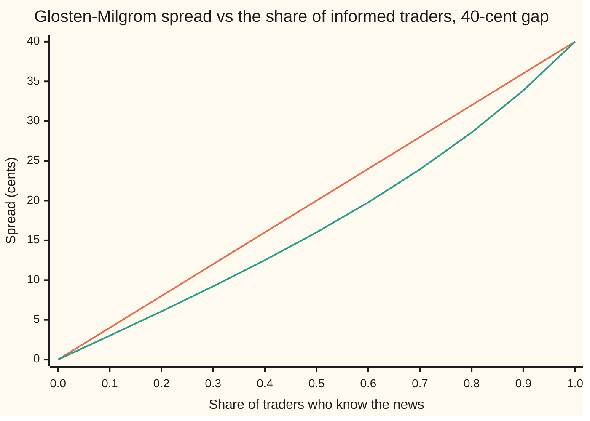
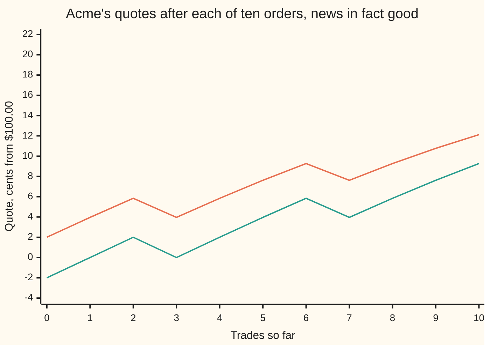

# The spread: what it costs to trade now, and why informed traders make it wider

Financial mathematics → Microstructure and Execution → Quotes under hidden information → The spread

---

## General Overview

Acme, the library's house stock, trades at about $100. A dealer stands ready to trade one share with anyone, right now. The dealer posts two prices. The **bid** is what the dealer pays a seller: $99.98. The **ask** is what the dealer charges a buyer: $100.02. The gap between them, 4 cents, is the **bid-ask spread**. Buy and sell back at once and those 4 cents are lost. It is the price of trading immediately instead of waiting for someone on the other side ([the-limit-order-book](01-the-limit-order-book.md) shows where these quotes sit in the book).

Why 4 cents and not zero? Tomorrow morning Acme reports earnings. After the report the share will be worth $99.80 or $100.20, equally likely as far as the dealer can tell. One trader in ten has already worked out which. These **informed traders** buy when the news is good and sell when it is bad. The other nine trade for their own reasons, such as paying a bill, and are as likely to buy as to sell. The dealer cannot tell the two kinds apart.

So every buy order is a small piece of evidence that the news is good. A dealer who charged $100.00 to every buyer would sell too cheaply to exactly the people who know better. The ask has to be the value of Acme *given that someone just chose to buy*, and the bid the value *given that someone just chose to sell*. Lawrence Glosten and Paul Milgrom worked this out in 1985; Bayes' rule gives $100.02 and $99.98. The risk that the other side of a trade knows more is called **adverse selection**, the term used from here on.

The reverse question: given only trade prices, how wide was the spread? Richard Roll answered it in 1984. Prices bounce between bid and ask, so successive changes tend to reverse, and the strength of the reversal gives the spread back.

**The spread is the dealer's charge for trading against people who may know more: set each quote to the value implied by the order that hits it, and with one trader in ten informed on a 40-cent gap, the spread is 4 cents.**

**What kind of fact this is:** a model: who trades, and why, are assumptions, not laws. Inside the model, the spread formula and Roll's covariance are theorems, proved on this card in Why it works.

### The picture: more informed traders, wider spread

The share of informed traders runs across; the spread runs up. The gap between the two values stays 40 cents.



Orange, the straight line: good and bad news equally likely. The spread is the informed share times the gap: 10 percent of 40 cents is 4 cents. Green, below it: the dealer is already 75 percent sure the news is good, so there is less to learn, and at 10 percent informed the spread is 3.01 cents. Both reach 40 cents when everyone is informed: a buy then proves the news is good.

---

## The formula

Notation first. $E[V \mid \text{buy}]$ is the average of the value over the situations in which a buy arrives, each weighted by how likely it is; read "the expected value given a buy" ([bayes-rule](../../09-Probability%20and%20statistics/01-Chance%20and%20Events/06-bayes-rule.md) supplies the conditioning).

$$A = E[V \mid \text{buy}] = v_L + \Delta\,h_B, \qquad B = E[V \mid \text{sell}] = v_L + \Delta\,h_S$$

$$s = A - B = \Delta\,\frac{4\mu\,\pi(1-\pi)}{1-\mu^2(2\pi-1)^2}$$

**Read it aloud:** the ask is the value expected once a buyer shows up, the bid the value expected once a seller shows up, and the spread is the gap between the two values scaled by how far one order moves the odds.

With even odds, $\pi = 1/2$, the bottom of the fraction is 1 and the top is $\mu$, so the spread is just $s = \mu\Delta$.

The two probabilities after an order come from Bayes' rule:

$$h_B = \frac{\pi(1+\mu)}{1+\mu(2\pi-1)}, \qquad h_S = \frac{\pi(1-\mu)}{1-\mu(2\pi-1)}$$

Roll's reverse formula reads the spread from trade prices alone. Cov is covariance: the average product of two quantities' deviations from their averages; negative means they tend to move opposite ways.

$$\gamma_1 = \operatorname{Cov}(R_t, R_{t-1}) = -c^2, \qquad s = 2c = 2\sqrt{-\gamma_1}$$

**Read it aloud:** the covariance of successive price changes is minus the square of the half-spread, so twice the square root of its size is the spread.
| Symbol | Plain meaning | In our example | Push it up and the answer… |
| --- | --- | --- | --- |
| $V$ | Acme's value once the news is out | $99.80 or $100.20 | — |
| $v_L$, $v_H$ | the two possible values | 9,980 and 10,020 cents | both up together: spread unchanged |
| $\Delta$ | the gap $v_H - v_L$ | 40 cents | spread grows in proportion |
| $\pi$ | the dealer's chance of good news, before the order | 0.5 | spread shrinks as $\pi$ moves from 0.5 toward 0 or 1 |
| $\mu$ | the share of traders who know $V$ (Greek "mu") | 0.10 | spread widens, up to $\Delta$ at $\mu = 1$ |
| $A$, $B$ | the ask and the bid, the dealer's two quotes | $100.02 and $99.98 | — |
| $s$, $c$ | the spread $A - B$, and the half-spread $c = s/2$ | 4 cents and 2 cents | — |
| $h_B$, $h_S$ | the probability of good news after a buy, after a sell | 0.55 and 0.45 | — |
| $P_t$, $R_t$ | price of trade number t, and its change from the trade before | a string of trades | — |
| $M_t$, $\varepsilon_t$ | the unseen fair price midway between quotes, and its news step | news of 1 cent a trade | noisier prices, same covariance |
| $Q_t$ | the side of trade t: +1 at the ask, −1 at the bid | ±1 | — |
| $\gamma_1$ | the lag-one covariance of price changes (Greek "gamma") | −4 square cents | more negative: wider implied spread |

### When it holds

- **A competitive dealer, neutral to risk.** Rivals drive expected profit to zero. A dealer with market power, or one who dislikes holding stock, quotes wider; the inventory side is [market-making-avellaneda-stoikov](05-market-making-avellaneda-stoikov.md).
- **One share per order.** When informed traders can choose their size, the question becomes price impact: [kyle-model-and-price-impact](03-kyle-model-and-price-impact.md).
- **Uninformed traders who ignore the price.** If a wide spread scares them off, the informed share rises and the spread widens again; at the extreme the market shuts.
- **No fee, cost or tick.** Real spreads add costs and round to a tick, the minimum price step set by exchange and regulator rules.
- **For Roll: trade sides unrelated to news.** If orders carry news, as in Glosten-Milgrom, Roll misses that part of the spread (Step 7).

---

## Why it works

### Step 0: an order is evidence

The dealer does not know the news, but knows who tends to buy when it is good. So the side of an order changes the odds. A quote is a promise to trade with whoever arrives, and must be priced for the crowd that actually arrives at it.

### Step 1: competition pins each quote to a conditional value

An ask above $E[V \mid \text{buy}]$ expects a profit on every sale, and a rival undercuts it. An ask below expects a loss, and the dealer raises it. Only one ask survives:

$$A = E[V \mid \text{buy}].$$

The same argument gives $B = E[V \mid \text{sell}]$. The dealer still loses on every sale to an informed buyer; the uninformed pay for it (Step 4).

### Step 2: Bayes' rule turns an order into odds

With good news, an informed trader always buys, and an uninformed trader buys half the time:

$$P(\text{buy} \mid \text{good}) = \mu + \tfrac12(1-\mu) = \tfrac12(1+\mu).$$

With bad news only the uninformed buy: $\tfrac12(1-\mu)$. For Acme these are 0.55 and 0.45. Bayes' rule weighs each by its prior and divides by the total chance of a buy, $\tfrac12[1 + \mu(2\pi-1)]$. That gives $h_B$ and $h_S$ in The formula. For Acme, $h_B = 0.5 \times 0.55 / 0.50 = 0.55$.

A value that is $v_H$ with some probability and $v_L$ otherwise averages $v_L$ plus the gap times that probability. So the ask is $99.80 + 0.40 \times 0.55 = \$100.02$ and the bid is $99.80 + 0.40 \times 0.45 = \$99.98$.

### Step 3: subtract

$$s = A - B = \Delta\,(h_B - h_S).$$

Over a common bottom, the top collapses to $4\mu\pi(1-\pi)$: the formula. With no informed traders, $\mu = 0$, an order says nothing and the spread is 0. With the news already certain, $\pi = 0$ or 1, the spread is 0. With even odds it is $\mu\Delta$.

<details>
<summary>Detailed proof: the spread formula, and the boundary cases</summary>

Write $d = 2\pi - 1$. The chance of a buy is $\tfrac12(1 + \mu d)$ and of a sell $\tfrac12(1 - \mu d)$. Both are positive whenever $\mu d$ lies strictly between −1 and 1.

Then
$$h_B - h_S = \frac{\pi[(1+\mu)(1-\mu d) - (1-\mu)(1+\mu d)]}{(1+\mu d)(1-\mu d)}.$$
Expand the bracket: $(1 + \mu - \mu d - \mu^2 d) - (1 - \mu + \mu d - \mu^2 d) = 2\mu(1 - d) = 4\mu(1-\pi)$. The bottom is $1 - \mu^2 d^2$. So $h_B - h_S = 4\mu\pi(1-\pi)/(1-\mu^2 d^2)$, which is never negative: the ask is never below the bid.

It rises with $\mu$. For $0 < \pi < 1$ the size of $d$ is below 1. The slope of $\mu/(1 - \mu^2 d^2)$ is $(1 + \mu^2 d^2)/(1 - \mu^2 d^2)^2$, which is positive.

At $\mu = 1$ with $0 < \pi < 1$, buys come only under good news and sells only under bad, so $A = v_H$, $B = v_L$ and $s = \Delta$.

At $\mu = 1$ with $\pi = 0$ nobody ever buys; with $\pi = 1$ nobody ever sells. The quote on the missing side is a value "given an event of probability zero", which is undefined, not zero. Everywhere else the formula holds.

</details>

### Step 4: the books balance

The same answer falls out of the dealer's accounts, with no Bayes. Take even odds and quotes half a spread either side of the average value. An informed trader buys only at the high value and sells only at the low one, so each informed trade costs the dealer half the gap minus half the spread; informed traders are a fraction $\mu$ of arrivals. An uninformed trade says nothing about the value, so the dealer gains half the spread, $s/2$, on average.

Zero profit means the two flows match:

$$\mu\left(\frac{\Delta}{2} - \frac{s}{2}\right) = (1-\mu)\,\frac{s}{2} \quad\Longrightarrow\quad s = \mu\Delta.$$

For Acme: informed traders take $0.10 \times 18 = 1.8$ cents per trade, and uninformed traders pay $0.90 \times 2 = 1.8$. The spread is a transfer from traders who do not know to traders who do, with the dealer as a zero-profit go-between.

### Step 5: after the trade, the odds carry forward

After a buy, the chance of good news is 0.55; the next order is judged from there, with $h_B$ as the new $\pi$. The dealer learns the news trade by trade, as the section after the worked numbers shows.

Each trade happens at the dealer's best estimate of the value given everything seen so far. So trade prices form a **martingale** (a sequence whose expected next value is its current value): their changes do not reverse on average.

### Step 6: Roll's reverse question

Now look only at trade prices. Roll writes each as a fair price plus half a spread in the direction of the trade:

$$P_t = M_t + c\,Q_t, \qquad M_t = M_{t-1} + \varepsilon_t.$$

The side $Q_t$ is a fresh coin flip each trade, unrelated to the news steps $\varepsilon_t$. Take differences:

$$R_t = \varepsilon_t + c\,(Q_t - Q_{t-1}).$$

Two successive changes share one coin flip, $Q_{t-1}$: plus in $R_{t-1}$, minus in $R_t$. Everything else is independent, so the covariance is $-c^2$. A trade at the ask tends to be followed by one at the bid: the price bounces.

**The inverse, before solving it.** Existence: a spread comes back only if $\gamma_1 \le 0$; a positive covariance has no real square root. Uniqueness: the spread is not negative, so $c = \sqrt{-\gamma_1}$ is the only answer. Boundary: $\gamma_1 = 0$ gives $s = 0$. For Acme, $c = 2$ cents gives $\gamma_1 = -4$ square cents and back $s = 4$ cents; a simulated record of 200,000 trades in the code gives back 3.99 cents.

<details>
<summary>Detailed proof: Roll's covariance</summary>

Assume the news steps have average zero, finite variance, and are independent of each other and of every trade side. Assume the sides are independent fair ±1 flips. Then every change has average zero, and
$$\operatorname{Cov}(R_t, R_{t-1}) = E\big[(\varepsilon_t + cQ_t - cQ_{t-1})(\varepsilon_{t-1} + cQ_{t-1} - cQ_{t-2})\big].$$
Multiply out the nine products. A product of two different news steps averages zero. A product of a news step and a side averages zero, by independence. A product of two different sides averages zero. The only survivor is $(-cQ_{t-1})(cQ_{t-1}) = -c^2 Q_{t-1}^2 = -c^2$, since $Q_{t-1}^2 = 1$.

The same count gives $\operatorname{Var}(R_t) = \operatorname{Var}(\varepsilon_t) + 2c^2$: news makes prices noisier but leaves the lag-one covariance alone. That is why the spread can be read off through any amount of news, given enough trades.

</details>

### Step 7: why Roll cannot see adverse selection

Roll's covariance comes from the part of the spread that reverses. In Glosten-Milgrom nothing reverses: a buy raises the fair value for good, because it was evidence. Trade prices are a martingale, their changes have zero covariance, and Roll reports a spread of 0 against a quoted 4 cents. The code checks the zero over every three-trade history.

So Roll measures the **transitory** part of a spread, the bounce that pays for costs and inventory. Glosten-Milgrom explains the **permanent** part, the move an order causes because it carries news. A real spread holds both.

The other road to informed trading lets the informed trader pick the order's size and hide it in the noise; price then moves with total order flow. That is [kyle-model-and-price-impact](03-kyle-model-and-price-impact.md).

---

## Worked numbers, by hand

Acme after earnings: $v_L = \$99.80$, $v_H = \$100.20$, even odds $\pi = 0.5$, informed share $\mu = 0.10$.

| Step | Arithmetic | Value |
| --- | --- | --- |
| chance of a buy, good news | $0.10 + 0.90 \times 0.5$ | 0.55 |
| chance of a buy, bad news | $0.90 \times 0.5$ | 0.45 |
| chance of a buy overall | $0.5 \times 0.55 + 0.5 \times 0.45$ | 0.50 |
| good news, given a buy, $h_B$ | $0.5 \times 0.55 / 0.50$ | 0.55 |
| good news, given a sell, $h_S$ | $0.5 \times 0.45 / 0.50$ | 0.45 |
| ask $A$ | $99.80 + 0.40 \times 0.55$ | $100.02 |
| bid $B$ | $99.80 + 0.40 \times 0.45$ | $99.98 |
| spread from the quotes | $100.02 - 99.98$ | 4 cents |
| spread from the formula | $40 \times 4 \times 0.10 \times 0.25 / 1$ | 4 cents |
| informed take, per trade | $0.10 \times (20 - 2)$ cents | 1.8 cents |
| uninformed pay, per trade | $0.90 \times 2$ cents | 1.8 cents |
| Roll: half-spread $c$ | $4 / 2$ | 2 cents |
| Roll: covariance $\gamma_1$ | $-c^2$ | −4 square cents |
| **Roll: spread back** | $2\sqrt{4}$ | **4 cents** |

An uninformed round trip in Acme costs 4 cents, and all of it ends up with the traders who read the earnings first.

### What breaks if you drop a piece

Same Acme, correct spread 4 cents:

| Mistake | Comes out at | What went wrong |
| --- | --- | --- |
| Quote $100.00 on both sides | the dealer loses 2.00 cents a trade (2.01 in simulation) | informed traders take 20 cents on one trade in ten; nobody pays for it |
| Assume every trader is informed | 40.00 cents | a buy would then prove good news; the spread is the whole gap |
| Roll without the 2: $\sqrt{-\gamma_1}$ | 2.00 cents | that is the half-spread $c$, not the spread |
| Roll on prices that are pure noise, no spread at all | a "spread" of 2.00 cents | noisy prices also reverse; the covariance −1 came from noise, not a bounce |
| Roll on Glosten-Milgrom trade prices | 0.00 cents | adverse selection is permanent, not a bounce: the covariance is 0 |

Every number in that table is printed by the code below.

---

## The quotes move with every trade

Each order moves the odds, so each order moves both quotes. As the dealer learns, there is less left to fear, and the spread narrows.

### One sequence of ten orders

The news is in fact good: Acme is worth $100.20. Ten orders arrive: buy, buy, sell, buy, buy, buy, sell, buy, buy, buy. Quotes are in cents from $100.00, standing after each trade.

| After trade | Order | Bid | Ask | Spread | Chance of good news |
| --- | --- | --- | --- | --- | --- |
| 0 | — | −2.00 | +2.00 | 4.00 | 0.5000 |
| 1 | buy | 0.00 | +3.96 | 3.96 | 0.5500 |
| 2 | buy | +2.00 | +5.84 | 3.84 | 0.5990 |
| 3 | sell | 0.00 | +3.96 | 3.96 | 0.5500 |
| 4 | buy | +2.00 | +5.84 | 3.84 | 0.5990 |
| 5 | buy | +3.96 | +7.62 | 3.66 | 0.6461 |
| 6 | buy | +5.84 | +9.27 | 3.42 | 0.6905 |
| 7 | sell | +3.96 | +7.62 | 3.66 | 0.6461 |
| 8 | buy | +5.84 | +9.27 | 3.42 | 0.6905 |
| 9 | buy | +7.62 | +10.77 | 3.15 | 0.7317 |
| 10 | buy | +9.27 | +12.12 | 2.85 | 0.7692 |

After one buy the new bid is exactly $100.00, the old midpoint: a buy and a sell cancel as evidence. The sell at trade 3 returns every number to the row after trade 1: only buys minus sells matters. The spread narrows from 4.00 to 2.85 cents as the chance of good news climbs to 0.77.



Orange, upper: the ask. Green, lower: the bid. Both climb toward the true value, 20 cents above $100.00, step back at each sell, and draw closer as they climb.

### The spread shrinks as the dealer learns

Average over every possible sequence of orders, news still good. The code computes it exactly, from the probability of every count of buys minus sells, and by simulating 2,000 trading days:

```
trades so far   expected spread, cents (exact; simulated beside it)
      0   ████████████████████████████████████████  4.00  (4.00)
     25   ████████████████████████████████          3.18  (3.20)
     50   ██████████████████████████                2.60  (2.56)
    100   ██████████████████                        1.80  (1.78)
    200   █████████                                 0.92  (0.95)
    400   ███                                       0.27  (0.30)
```

After 100 trades the spread is under half its opening width; after 400 the news is nearly all in the price. Each informed trader profits once, and in doing so gives the news away.

---

## Code, from first principles, and it actually runs

The programs price Acme's spread four independent ways: the formula; Bayes' rule summed over the four cells of news and order side; the dealer's books balanced; and 200,000 simulated one-trade rounds. They trace the ten-order sequence, compute the expected spread at each checkpoint exactly and by simulation, check Roll's covariance over all 32 equally likely cases and in a 200,000-trade simulation, and reproduce every "what breaks" number. Random numbers come from splitmix64, a short generator written out in both languages.

### Python

```python
# The spread -- the check behind the card.  Standard library only.
# Glosten-Milgrom: quotes from Bayes' rule.  Roll: a spread read off trade prices.
# Money in cents.  Acme is worth 9980 or 10020 cents; 10% of traders know which.
from math import sqrt

LO, HI, PRIOR, MU, M64 = 9980.0, 10020.0, 0.5, 0.10, (1 << 64) - 1

def closed(prior, mu, gap=HI - LO):                 # road 1: the formula on the card
    d = 2 * prior - 1
    return gap * 4 * mu * prior * (1 - prior) / (1 - mu * mu * d * d)

def quotes(prior, mu, lo=LO, hi=HI):                # road 2: add up the four cells
    cell = {}
    for state, w in (("H", prior), ("L", 1 - prior)):
        for side in ("buy", "sell"):
            knows = (state == "H") == (side == "buy")
            cell[state, side] = w * (mu * knows + (1 - mu) / 2)
    pb, ps = cell["H", "buy"] + cell["L", "buy"], cell["H", "sell"] + cell["L", "sell"]
    ask = (hi * cell["H", "buy"] + lo * cell["L", "buy"]) / pb
    bid = (hi * cell["H", "sell"] + lo * cell["L", "sell"]) / ps
    return bid, ask, cell["H", "buy"] / pb, cell["H", "sell"] / ps

class Rng:                                           # splitmix64, written out
    def __init__(self, seed): self.s = seed
    def u(self):
        self.s = (self.s + 0x9E3779B97F4A7C15) & M64
        z = self.s
        z = ((z ^ (z >> 30)) * 0xBF58476D1CE4E5B9) & M64
        z = ((z ^ (z >> 27)) * 0x94D049BB133111EB) & M64
        return ((z ^ (z >> 31)) >> 11) / 9007199254740992.0

def show(label, *vals):
    print(f"{label:<34}" + "".join(f"{v:>13.6f}" for v in vals))

(bid, ask, hb, hs), s1 = quotes(PRIOR, MU), closed(PRIOR, MU)
show("1 formula: spread", s1)
show("2 Bayes cells: bid, ask", bid, ask)
show("  P(high | buy), P(high | sell)", hb, hs)
take, pay = MU * ((HI - LO) / 2 - s1 / 2), (1 - MU) * s1 / 2
show("3 informed take, uninformed pay", take, pay)
assert abs((ask - bid) - s1) < 1e-9, "Bayes cells must match the formula"
assert abs(take - pay) < 1e-12, "the books must balance at the formula's spread"
rng, n, prof, naive, vbuy, nbuy = Rng(2026), 200_000, 0.0, 0.0, 0.0, 0
for _ in range(n):                                   # road 4: simulate one-trade rounds
    high = rng.u() < PRIOR
    v = HI if high else LO
    buy = high if rng.u() < MU else rng.u() < 0.5
    if buy: prof += ask - v; naive += 10000 - v; vbuy += v; nbuy += 1
    else:   prof += v - bid; naive += v - 10000
show("4 simulated E[V | buy], profit", vbuy / nbuy, prof / n)
assert abs(vbuy / nbuy - ask) < 0.3, "simulated E[V | buy] must land on the ask"
show("wrong: quote 10000 both, sim/exact", naive / n, -MU * (HI - LO) / 2)
show("wrong: everyone informed", closed(PRIOR, 1.0))
b2, a2, hb2, hs2 = quotes(0.75, 0.2)
show("try: prior 3/4, 20% informed", b2, a2, a2 - b2)
show("try: 50% informed; gap 100", closed(PRIOR, 0.5), closed(PRIOR, MU, 100.0))
mus = [i / 10 for i in range(11)]
print("chart, informed share      " + " ".join(f"{m:5.1f}" for m in mus))
for p in (0.5, 0.75):
    print(f"chart, spread, prior {p:<5}  " + " ".join(f"{closed(p, m):5.2f}" for m in mus))
for p10 in range(1, 10):                             # grid: formula = cells, rises with mu
    last = -1.0
    for m in mus:
        b, a, _, _ = quotes(p10 / 10, m)
        assert abs((a - b) - closed(p10 / 10, m)) < 1e-9, "cells must match the formula"
        assert a - b > last, "spread must rise with the informed share"
        last = a - b

print("path: trade, side, bid-10000, ask-10000, spread, P(high)")
prior = PRIOR
for k, side in enumerate(" BBSBBBSBBB"):
    if side != " ":
        prior = hb if side == "B" else hs
    b, a, hb, hs = quotes(prior, MU)
    print(f"  {k:>2} {side} {b - 10000:9.2f} {a - 10000:9.2f} {a - b:9.2f} {prior:9.4f}")

def belief(d):                                       # P(high) after d more buys than sells
    x = 1.0
    for _ in range(abs(d)): x *= 9.0 / 11.0
    return 1.0 / (1.0 + x) if d >= 0 else x / (1.0 + x)
assert abs(belief(6) - prior) < 1e-12, "net buys must match trade-by-trade Bayes"
checks, T = (0, 25, 50, 100, 200, 400), 400
dist, exact = {0: 1.0}, {}
for t in range(T + 1):                               # exact: walk the distribution of d
    if t in checks: exact[t] = sum(p * closed(belief(d), MU) for d, p in dist.items())
    nxt = {}
    for d, p in dist.items():
        nxt[d + 1] = nxt.get(d + 1, 0.0) + p * (1 + MU) / 2
        nxt[d - 1] = nxt.get(d - 1, 0.0) + p * (1 - MU) / 2
    dist = nxt
days, sim = 2000, {t: 0.0 for t in checks}
for _ in range(days):                                # simulated: true value high, 2000 days
    d = 0
    for t in range(T + 1):
        if t in checks: sim[t] += closed(belief(d), MU) / days
        buy = True if rng.u() < MU else rng.u() < 0.5
        d += 1 if buy else -1
print("expected spread after n trades, value high: exact, simulated")
for t in checks:
    print(f"  after {t:>3} trades {exact[t]:9.2f} {sim[t]:9.2f}")
    assert abs(exact[t] - sim[t]) < 0.1, "walk and simulation must agree"

for c in range(5):                                   # Roll, exact: 32 equally likely cases
    tot = 0
    for e1 in (-1, 1):
        for e0 in (-1, 1):
            for q2 in (-1, 1):
                for q1 in (-1, 1):
                    for q0 in (-1, 1):
                        tot += (e1 + c * (q2 - q1)) * (e0 + c * (q1 - q0))
    assert tot == -32 * c * c, "Roll: lag covariance must be -c^2"
    if c == 2: show("Roll exact, c = 2: covariance", tot / 32)
m, p_prev, r, w = 10000.0, 10002.0, [], sqrt(3.0)
for _ in range(200_000):                             # Roll, simulated: c = 2, 1-cent news
    m += w * (2 * rng.u() - 1)
    q = 1 if rng.u() < 0.5 else -1
    p = m + 2 * q
    r.append(p - p_prev); p_prev = p
mean = sum(r) / len(r)
g = sum((r[t] - mean) * (r[t - 1] - mean) for t in range(1, len(r))) / (len(r) - 1)
show("Roll simulated: covariance, spread", g, 2 * sqrt(-g))
assert abs(2 * sqrt(-g) - 4.0) < 0.1, "Roll estimate must land near the 4-cent spread"
show("wrong: forgot the 2", sqrt(-g))
ch = [-2, -2, 2, 2]                                   # a short record: covariance positive
show("short record: sample covariance", sum(ch[t] * ch[t - 1] for t in range(1, 4)) / 3)
noise = sum((z2 - z1) * (z1 - z0) for z2 in (-1, 1) for z1 in (-1, 1) for z0 in (-1, 1)) / 8
show("no spread: cov, fake spread", noise, 2 * sqrt(-noise))
e2 = e3 = e23 = 0.0                                  # Roll on Glosten-Milgrom trade prices
for high in (True, False):
    for h in range(8):
        sides, pr, prob, path = [(h >> k) & 1 for k in range(3)], PRIOR, 0.5, [10000.0]
        for sd in sides:
            b, a, hb, hs = quotes(pr, MU)
            prob *= (1 + MU) / 2 if (sd == 1) == high else (1 - MU) / 2
            path.append(a if sd else b); pr = hb if sd else hs
        d2, d3 = path[2] - path[1], path[3] - path[2]
        e2 += prob * d2; e3 += prob * d3; e23 += prob * d2 * d3
show("GM trade prices: lag covariance", round(e23 - e2 * e3, 9) + 0.0)
assert abs(e23 - e2 * e3) < 1e-9, "Glosten-Milgrom trade prices must not bounce"
print("ALL CHECKS PASS")
```

**Ran 2026-09-28 on macOS, Python 3.14.6, standard library only. All checks passed. Output, pasted from the run:**

```
1 formula: spread                      4.000000
2 Bayes cells: bid, ask             9998.000000 10002.000000
  P(high | buy), P(high | sell)        0.550000     0.450000
3 informed take, uninformed pay        1.800000     1.800000
4 simulated E[V | buy], profit     10002.011726    -0.009000
wrong: quote 10000 both, sim/exact    -2.009000    -2.000000
wrong: everyone informed              40.000000
try: prior 3/4, 20% informed       10006.666667 10012.727273     6.060606
try: 50% informed; gap 100            20.000000    10.000000
chart, informed share        0.0   0.1   0.2   0.3   0.4   0.5   0.6   0.7   0.8   0.9   1.0
chart, spread, prior 0.5     0.00  4.00  8.00 12.00 16.00 20.00 24.00 28.00 32.00 36.00 40.00
chart, spread, prior 0.75    0.00  3.01  6.06  9.21 12.50 16.00 19.78 23.93 28.57 33.86 40.00
path: trade, side, bid-10000, ask-10000, spread, P(high)
   0       -2.00      2.00      4.00    0.5000
   1 B      0.00      3.96      3.96    0.5500
   2 B      2.00      5.84      3.84    0.5990
   3 S      0.00      3.96      3.96    0.5500
   4 B      2.00      5.84      3.84    0.5990
   5 B      3.96      7.62      3.66    0.6461
   6 B      5.84      9.27      3.42    0.6905
   7 S      3.96      7.62      3.66    0.6461
   8 B      5.84      9.27      3.42    0.6905
   9 B      7.62     10.77      3.15    0.7317
  10 B      9.27     12.12      2.85    0.7692
expected spread after n trades, value high: exact, simulated
  after   0 trades      4.00      4.00
  after  25 trades      3.18      3.20
  after  50 trades      2.60      2.56
  after 100 trades      1.80      1.78
  after 200 trades      0.92      0.95
  after 400 trades      0.27      0.30
Roll exact, c = 2: covariance         -4.000000
Roll simulated: covariance, spread    -3.980857     3.990417
wrong: forgot the 2                    1.995209
short record: sample covariance        1.333333
no spread: cov, fake spread           -1.000000     2.000000
GM trade prices: lag covariance        0.000000
ALL CHECKS PASS
```

### Rust

```rust
// The spread -- the check behind the card.  Rust std only, no crates.
// Glosten-Milgrom: quotes from Bayes' rule.  Roll: a spread read off trade prices.
// Money in cents.  Acme is worth 9980 or 10020 cents; 10% of traders know which.
use std::collections::HashMap;

const LO: f64 = 9980.0; const HI: f64 = 10020.0; const PRIOR: f64 = 0.5; const MU: f64 = 0.10;

fn closed(prior: f64, mu: f64, gap: f64) -> f64 { // road 1: the formula on the card
    let d = 2.0 * prior - 1.0;
    gap * 4.0 * mu * prior * (1.0 - prior) / (1.0 - mu * mu * d * d)
}

// road 2: add up the four cells (value high or low) x (buy or sell)
fn quotes(prior: f64, mu: f64) -> (f64, f64, f64, f64) {
    let cell = |w: f64, knows: bool| w * ((if knows { mu } else { 0.0 }) + (1.0 - mu) / 2.0);
    let (hbuy, hsell) = (cell(prior, true), cell(prior, false));
    let (lbuy, lsell) = (cell(1.0 - prior, false), cell(1.0 - prior, true));
    let (pb, ps) = (hbuy + lbuy, hsell + lsell);
    let ask = (HI * hbuy + LO * lbuy) / pb;
    let bid = (HI * hsell + LO * lsell) / ps;
    (bid, ask, hbuy / pb, hsell / ps)
}

struct Rng(u64); // splitmix64, written out
impl Rng {
    fn u(&mut self) -> f64 {
        self.0 = self.0.wrapping_add(0x9E3779B97F4A7C15);
        let mut z = self.0;
        z = (z ^ (z >> 30)).wrapping_mul(0xBF58476D1CE4E5B9);
        z = (z ^ (z >> 27)).wrapping_mul(0x94D049BB133111EB);
        ((z ^ (z >> 31)) >> 11) as f64 / 9007199254740992.0
    }
}

fn show(label: &str, vals: &[f64]) {
    let mut s = format!("{:<34}", label);
    for v in vals { s += &format!("{:>13.6}", v); }
    println!("{}", s);
}

fn belief(d: i64) -> f64 { // P(high) after d more buys than sells
    let mut x = 1.0;
    for _ in 0..d.abs() { x *= 9.0 / 11.0; }
    if d >= 0 { 1.0 / (1.0 + x) } else { x / (1.0 + x) }
}

fn main() {
    let (gap, (bid, ask, hb, hs)) = (HI - LO, quotes(PRIOR, MU));
    let s1 = closed(PRIOR, MU, gap);
    show("1 formula: spread", &[s1]);
    show("2 Bayes cells: bid, ask", &[bid, ask]);
    show("  P(high | buy), P(high | sell)", &[hb, hs]);
    let (take, pay) = (MU * (gap / 2.0 - s1 / 2.0), (1.0 - MU) * s1 / 2.0);
    show("3 informed take, uninformed pay", &[take, pay]);
    assert!(((ask - bid) - s1).abs() < 1e-9, "Bayes cells must match the formula");
    assert!((take - pay).abs() < 1e-12, "the books must balance at the formula's spread");
    let (mut rng, n) = (Rng(2026), 200_000);
    let (mut prof, mut naive, mut vbuy, mut nbuy) = (0.0, 0.0, 0.0, 0u64);
    for _ in 0..n { // road 4: simulate one-trade rounds
        let high = rng.u() < PRIOR; let v = if high { HI } else { LO };
        let buy = if rng.u() < MU { high } else { rng.u() < 0.5 };
        if buy { prof += ask - v; naive += 10000.0 - v; vbuy += v; nbuy += 1; }
        else { prof += v - bid; naive += v - 10000.0; }
    }
    show("4 simulated E[V | buy], profit", &[vbuy / nbuy as f64, prof / n as f64]);
    assert!((vbuy / nbuy as f64 - ask).abs() < 0.3, "simulated E[V | buy] must land on the ask");
    show("wrong: quote 10000 both, sim/exact", &[naive / n as f64, -MU * gap / 2.0]);
    show("wrong: everyone informed", &[closed(PRIOR, 1.0, gap)]);
    let (b2, a2, _, _) = quotes(0.75, 0.2);
    show("try: prior 3/4, 20% informed", &[b2, a2, a2 - b2]);
    show("try: 50% informed; gap 100", &[closed(PRIOR, 0.5, gap), closed(PRIOR, MU, 100.0)]);
    let mus: Vec<f64> = (0..11).map(|i| i as f64 / 10.0).collect();
    let row = |f: &dyn Fn(f64) -> String| mus.iter().map(|&m| f(m)).collect::<Vec<_>>().join(" ");
    println!("chart, informed share      {}", row(&|m| format!("{:5.1}", m)));
    for p in [0.5, 0.75] {
        println!("chart, spread, prior {:<5}  {}", p, row(&|m| format!("{:5.2}", closed(p, m, gap))));
    }
    for p10 in 1..10 { // grid: formula = cells, rises with mu
        let mut last = -1.0;
        for &m in &mus {
            let (b, a, _, _) = quotes(p10 as f64 / 10.0, m);
            assert!(((a - b) - closed(p10 as f64 / 10.0, m, gap)).abs() < 1e-9, "cells must match the formula");
            assert!(a - b > last, "spread must rise with the informed share");
            last = a - b;
        }
    }
    println!("path: trade, side, bid-10000, ask-10000, spread, P(high)");
    let (mut prior, mut hb, mut hs) = (PRIOR, hb, hs);
    for (k, side) in " BBSBBBSBBB".chars().enumerate() {
        if side != ' ' { prior = if side == 'B' { hb } else { hs }; }
        let (b, a, nb, ns) = quotes(prior, MU);
        hb = nb; hs = ns;
        println!("  {:>2} {} {:9.2} {:9.2} {:9.2} {:9.4}", k, side, b - 10000.0, a - 10000.0, a - b, prior);
    }
    assert!((belief(6) - prior).abs() < 1e-12, "net buys must match trade-by-trade Bayes");
    let (checks, t_max) = ([0usize, 25, 50, 100, 200, 400], 400usize);
    let (mut dist, mut exact): (HashMap<i64, f64>, [f64; 6]) = (HashMap::from([(0, 1.0)]), [0.0; 6]);
    for t in 0..=t_max { // exact: walk the distribution of d
        if let Some(i) = checks.iter().position(|&c| c == t) {
            exact[i] = dist.iter().map(|(&d, &p)| p * closed(belief(d), MU, gap)).sum();
        }
        let mut nxt: HashMap<i64, f64> = HashMap::new();
        for (&d, &p) in &dist {
            *nxt.entry(d + 1).or_insert(0.0) += p * (1.0 + MU) / 2.0;
            *nxt.entry(d - 1).or_insert(0.0) += p * (1.0 - MU) / 2.0;
        }
        dist = nxt;
    }
    let (days, mut sim) = (2000, [0.0f64; 6]);
    for _ in 0..days { // simulated: true value high, 2000 days
        let mut d: i64 = 0;
        for t in 0..=t_max {
            if let Some(i) = checks.iter().position(|&c| c == t) { sim[i] += closed(belief(d), MU, gap) / days as f64; }
            let buy = if rng.u() < MU { true } else { rng.u() < 0.5 };
            d += if buy { 1 } else { -1 };
        }
    }
    println!("expected spread after n trades, value high: exact, simulated");
    for i in 0..6 {
        println!("  after {:>3} trades {:9.2} {:9.2}", checks[i], exact[i], sim[i]);
        assert!((exact[i] - sim[i]).abs() < 0.1, "walk and simulation must agree");
    }

    for c in 0i64..5 { // Roll, exact: 32 equally likely cases
        let (mut tot, pm) = (0i64, [-1i64, 1]);
        for e1 in pm { for e0 in pm { for q2 in pm { for q1 in pm { for q0 in pm {
            tot += (e1 + c * (q2 - q1)) * (e0 + c * (q1 - q0));
        } } } } }
        assert_eq!(tot, -32 * c * c, "Roll: lag covariance must be -c^2");
        if c == 2 { show("Roll exact, c = 2: covariance", &[tot as f64 / 32.0]); }
    }
    let (mut m, mut p_prev, w) = (10000.0f64, 10002.0f64, 3.0f64.sqrt());
    let mut r: Vec<f64> = Vec::with_capacity(200_000);
    for _ in 0..200_000 { // Roll, simulated: c = 2, 1-cent news
        m += w * (2.0 * rng.u() - 1.0);
        let q = if rng.u() < 0.5 { 1.0 } else { -1.0 };
        let p = m + 2.0 * q;
        r.push(p - p_prev); p_prev = p;
    }
    let mean = r.iter().sum::<f64>() / r.len() as f64;
    let g = (1..r.len()).map(|t| (r[t] - mean) * (r[t - 1] - mean)).sum::<f64>() / (r.len() - 1) as f64;
    show("Roll simulated: covariance, spread", &[g, 2.0 * (-g).sqrt()]);
    assert!((2.0 * (-g).sqrt() - 4.0).abs() < 0.1, "Roll estimate must land near the 4-cent spread");
    show("wrong: forgot the 2", &[(-g).sqrt()]);
    let ch = [-2.0f64, -2.0, 2.0, 2.0]; // a short record: covariance positive
    show("short record: sample covariance", &[(1..4).map(|t| ch[t] * ch[t - 1]).sum::<f64>() / 3.0]);
    let mut noise = 0i64; // no spread at all, prices pure noise
    for z2 in [-1i64, 1] { for z1 in [-1i64, 1] { for z0 in [-1i64, 1] { noise += (z2 - z1) * (z1 - z0); } } }
    let noise = noise as f64 / 8.0;
    show("no spread: cov, fake spread", &[noise, 2.0 * (-noise).sqrt()]);
    let (mut e2, mut e3, mut e23) = (0.0, 0.0, 0.0); // Roll on Glosten-Milgrom trade prices
    for high in [true, false] {
        for h in 0..8 {
            let (mut pr, mut prob, mut path) = (PRIOR, 0.5, vec![10000.0]);
            for k in 0..3 {
                let sd = (h >> k) & 1 == 1;
                let (b, a, nb, ns) = quotes(pr, MU);
                prob *= if sd == high { (1.0 + MU) / 2.0 } else { (1.0 - MU) / 2.0 };
                path.push(if sd { a } else { b });
                pr = if sd { nb } else { ns };
            }
            let (d2, d3) = (path[2] - path[1], path[3] - path[2]);
            e2 += prob * d2; e3 += prob * d3; e23 += prob * d2 * d3;
        }
    }
    show("GM trade prices: lag covariance", &[(((e23 - e2 * e3) * 1e9).round() / 1e9) + 0.0]);
    assert!((e23 - e2 * e3).abs() < 1e-9, "Glosten-Milgrom trade prices must not bounce");
    println!("ALL CHECKS PASS");
}
```

**Ran 2026-09-28 on macOS, rustc 1.98.1, no crates. All checks passed. Output, pasted from the run:**

```
1 formula: spread                      4.000000
2 Bayes cells: bid, ask             9998.000000 10002.000000
  P(high | buy), P(high | sell)        0.550000     0.450000
3 informed take, uninformed pay        1.800000     1.800000
4 simulated E[V | buy], profit     10002.011726    -0.009000
wrong: quote 10000 both, sim/exact    -2.009000    -2.000000
wrong: everyone informed              40.000000
try: prior 3/4, 20% informed       10006.666667 10012.727273     6.060606
try: 50% informed; gap 100            20.000000    10.000000
chart, informed share        0.0   0.1   0.2   0.3   0.4   0.5   0.6   0.7   0.8   0.9   1.0
chart, spread, prior 0.5     0.00  4.00  8.00 12.00 16.00 20.00 24.00 28.00 32.00 36.00 40.00
chart, spread, prior 0.75    0.00  3.01  6.06  9.21 12.50 16.00 19.78 23.93 28.57 33.86 40.00
path: trade, side, bid-10000, ask-10000, spread, P(high)
   0       -2.00      2.00      4.00    0.5000
   1 B      0.00      3.96      3.96    0.5500
   2 B      2.00      5.84      3.84    0.5990
   3 S      0.00      3.96      3.96    0.5500
   4 B      2.00      5.84      3.84    0.5990
   5 B      3.96      7.62      3.66    0.6461
   6 B      5.84      9.27      3.42    0.6905
   7 S      3.96      7.62      3.66    0.6461
   8 B      5.84      9.27      3.42    0.6905
   9 B      7.62     10.77      3.15    0.7317
  10 B      9.27     12.12      2.85    0.7692
expected spread after n trades, value high: exact, simulated
  after   0 trades      4.00      4.00
  after  25 trades      3.18      3.20
  after  50 trades      2.60      2.56
  after 100 trades      1.80      1.78
  after 200 trades      0.92      0.95
  after 400 trades      0.27      0.30
Roll exact, c = 2: covariance         -4.000000
Roll simulated: covariance, spread    -3.980857     3.990417
wrong: forgot the 2                    1.995209
short record: sample covariance        1.333333
no spread: cov, fake spread           -1.000000     2.000000
GM trade prices: lag covariance        0.000000
ALL CHECKS PASS
```

The two outputs agree byte for byte: the same generator and seed drive the same simulated trades.

> [!TIP]
> **Try changing**
> Guess the direction first. Then run it.
> - **Tilt the odds and double the informed.** Call `quotes(0.75, 0.2)`. Bid $100.07, ask $100.13 (10006.67 and 10012.73 cents): a spread of 6.06 cents.
> - **Half the traders informed.** Call `closed(PRIOR, 0.5)`. The spread is 20 cents: informed share times gap.
> - **Bigger news.** Make the two values $99.50 and $100.50, a gap of 100 cents: `closed(PRIOR, MU, 100.0)`. The spread is 10 cents.
> - **Shorten Roll's record.** Four price changes of −2, −2, +2, +2 cents give a sample covariance of +1.33 square cents, though the model's true covariance is negative. No spread comes back.

---

## The usual mistake

> [!warning]
> **Treating the spread as the dealer's profit.** Here the dealer earns nothing on average. The 4 cents is a transfer, 1.8 cents per trade from uninformed to informed traders. A wide spread signals what others might know, not a greedy dealer; cutting it by rule makes the dealer lose money until the dealer leaves.
>
> Smaller traps:
> - **Reading Roll's estimate as the quoted spread.** Roll measures only the bounce: 0 cents on pure Glosten-Milgrom prices against a quoted 4.
> - **Reading a negative covariance as proof of a spread.** Prices that are pure noise around a fixed value reverse too: covariance −1 square cent, and Roll's formula reports a 2-cent spread that does not exist.
> - **Taking the square root of a positive estimate.** A short record can give a positive covariance, +1.33 on the four-change record. Writing a zero spread is a convention, not the model's answer.
> - **Quoting the average value on both sides.** At $100.00 each way the dealer loses 2 cents a trade.

---

## Where you meet it in real life

- **Before earnings and other scheduled news.** Market makers widen quotes ahead of announcements, when the next order is likeliest to know something and the gap between outcomes is largest.
- **Payment for order flow.** Wholesale market makers pay brokers for small retail orders, which rarely know the next few seconds' news. This card says why that flow can be filled inside the posted spread at a profit.
- **Stocks with little coverage.** Small companies followed by few analysts tend to carry wider spreads: an order is likelier to come from someone who has worked out the news.
- **Estimating spreads without quotes.** Studies with only trade prices use Roll's estimator and its descendants: [liquidity-measures](07-liquidity-measures.md).
- **Measuring what a trade cost.** The effective spread, twice the distance from midpoint to fill, opens any execution report: [transaction-cost-analysis](06-transaction-cost-analysis.md).

> **Say it back**
> The spread is the cost of trading at once: buy at the ask, sell at the bid. A dealer who may be trading against someone better informed must set each quote to the value implied by the order that hits it. Bayes' rule turns the informed share and the news gap into those two values; with even odds the spread is the informed share times the gap, 4 cents for Acme. Uninformed traders pay it and informed traders collect it, and each trade teaches the dealer, so the spread narrows as the news gets into the price. Roll's covariance reads the bouncing part of a spread from trade prices, but it cannot see the part that comes from news.

---

## What this builds on

- [the-limit-order-book](01-the-limit-order-book.md): where the bid and the ask sit, and what trading at them means.
- [bayes-rule](../../09-Probability%20and%20statistics/01-Chance%20and%20Events/06-bayes-rule.md): turning an observed order into new odds, the engine of every quote on this card.

## Where this goes next

- [kyle-model-and-price-impact](03-kyle-model-and-price-impact.md): the informed trader chooses how much to trade and hides in the noise; price moves in proportion to order flow.
- [market-making-avellaneda-stoikov](05-market-making-avellaneda-stoikov.md): the dealer's other worry, holding too much stock, and how it tilts the quotes.
- [liquidity-measures](07-liquidity-measures.md): Roll's estimator among other ways to measure how costly a market is to trade.

This card priced one share at a time; what happens when an informed trader can choose the size of the order, and spread it out so the dealer learns slowly, is the question Kyle's model answers.

---

## Sources

Verified 2026-09-28: every DOI below resolves to the publisher's page, and its registered record names the paper.

- Glosten, Lawrence R., and Paul R. Milgrom. "Bid, Ask and Transaction Prices in a Specialist Market with Heterogeneously Informed Traders." *Journal of Financial Economics* 14, no. 1 (1985): 71–100. [doi:10.1016/0304-405X(85)90044-3](https://doi.org/10.1016/0304-405X(85)90044-3). The model: quotes as conditional expected values, and trade prices as a martingale.
- Roll, Richard. "A Simple Implicit Measure of the Effective Bid-Ask Spread in an Efficient Market." *Journal of Finance* 39, no. 4 (1984): 1127–1139. [doi:10.1111/j.1540-6261.1984.tb03897.x](https://doi.org/10.1111/j.1540-6261.1984.tb03897.x). The bounce and the covariance $-c^2$, and the distinction between effective and quoted spread.
- Bagehot, Walter (pseudonym of Jack Treynor). "The Only Game in Town." *Financial Analysts Journal* 27, no. 2 (1971): 12–14. [doi:10.2469/faj.v27.n2.12](https://doi.org/10.2469/faj.v27.n2.12). The first statement that a market maker loses to informed traders and recovers it from the uninformed.
