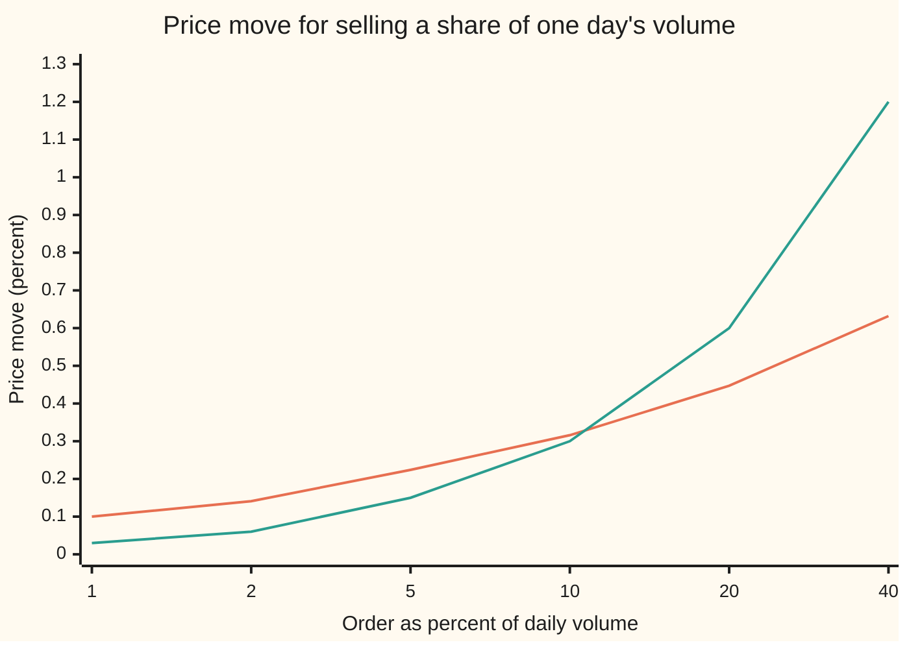
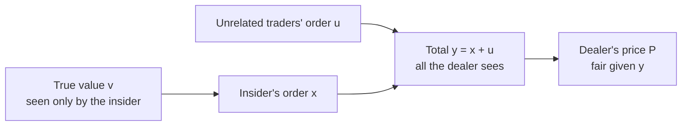

# Kyle's model: how much a trade moves the price, and the square-root law seen in data

[Syllabus](../../../SYLLABUS.md) → [Financial mathematics](../README.md) → [Microstructure and Execution](../README.md#s49) → Kyle's model

---

## General Overview

A fund holds a large block of a stock priced at $100. The stock trades about 1,000,000 shares a day. The fund decides to sell 100,000 shares: a tenth of a normal day's volume. By the time the sale is done, the price has fallen about 30 cents, or 0.3 percent, on a sale that changed nothing about the company.

Why should selling move the price at all? The buyers on the other side cannot see inside the seller's head. Some sellers know something bad about the company. Most do not. A buyer who cannot tell them apart must pay a little less to everyone who sells, or be ruined by the ones who know. That shading of the price, in response to the size and direction of orders, is **price impact**: the change in price caused by trading itself, measured in dollars per share or as a percentage.

In 1985 Albert Kyle built the smallest market in which this can be worked out exactly. One trader knows the true value. Others trade for reasons unrelated to value. A dealer sees only the total and sets a fair price. Out comes a single number, **Kyle's lambda**: dollars of price change per share of net selling or buying. Lambda makes impact a straight line: twice the order, twice the move.

Data disagree about the straight line. Across stocks, futures and other markets, the impact of a large order worked through a day grows like the **square root** of its size: four times the order moves the price only twice as far. This card derives Kyle's lambda, then sets it beside the square-root law and shows where each comes from.

**Price impact is the market's rational guess about what an order reveals; in Kyle's one-shot market the guess is a straight line with slope lambda = (standard deviation of value) / (2 × standard deviation of unrelated order flow), while real orders worked over a day follow a square root of their share of volume.**

**What kind of fact this is:** a model: Kyle's market is an assumption, and inside it the formula for lambda is a theorem proved in Why it works; the square-root law is an approximation fitted to data, with its exponent and constant estimated, not derived from Kyle.

### The picture: straight line against square root

Price move against the order's share of a day's volume. Both curves pass close to 0.3 percent at 10 percent of volume, the example. Everywhere else they disagree.



The orange line is the square-root law with 1 percent daily volatility: 0.100 percent at 1 percent of volume, 0.632 percent at 40. The green line is Kyle's straight line for this card's numbers: 0.030 percent at 1 percent of volume, 1.200 at 40. The x-axis is not evenly spaced. For small orders the square root lies above the line: the first shares cost the most. For large orders the line overshoots.

---

## The formula

Notation first, in words. A random quantity's **standard deviation**, written with the Greek letter sigma, σ, is the typical size of its move either way. Orders are **signed**: a buy is a positive number of shares, a sale a negative one. The dealer's price is a **conditional expectation**: the average value of the stock given what the dealer has seen ([Bivariate normal](../../09-Probability%20and%20statistics/05-Transformations%20and%20Joint%20Laws/05-bivariate-normal-and-conditioning.md)).

Kyle's market has one auction. The insider sees the value $v$ and sends an order $x$. Unrelated traders send $u$. The dealer sees only the total $y = x + u$ and sets the price $P$. In the only straight-line equilibrium:

$$x = \beta\,(v - p_0), \qquad P = p_0 + \lambda\, y, \qquad \lambda = \frac{\sigma_v}{2\,\sigma_u}, \qquad \beta = \frac{\sigma_u}{\sigma_v}.$$

**Read it aloud:** the insider trades in proportion to how wrong the price is; the dealer moves the price in proportion to the net order; the price moves, per share, by the standard deviation of value divided by twice that of unrelated flow.

The square-root law, for a large order $Q$ worked through a day:

$$I = Y\,\sigma_d\,\sqrt{\frac{\lvert Q\rvert}{V_d}}$$

**Read it aloud:** the price move, as a fraction of the price, is a constant near one, times the daily volatility, times the square root of the order's share of daily volume.

| Symbol | Plain meaning | In our example | Push it up and the answer… |
| --- | --- | --- | --- |
| $p_0$ | the price before the auction: everyone's average guess of value | $100.00 | — |
| $v$, $w$ | the stock's true value, known to the insider only; $w = v - p_0$, its gap from the price | $99.40 in the story | insider buys more |
| $\sigma_v$ | standard deviation of $v$ around $p_0$: how much there is to know | $1.20 | $\lambda$ rises in step |
| $u$, $\sigma_u$ | unrelated traders' net order, and its standard deviation | $\sigma_u$ = 200,000 shares | $\lambda$ falls: more cover for the insider |
| $x$, $y$ | the insider's order; the total the dealer sees | −100,000; −100,000 if $u = 0$ | price rises |
| $\beta$ | shares the insider trades per dollar of mispricing | 166,667 | — |
| $P$ | the dealer's price after the auction | $99.70 | — |
| $\lambda$ | Kyle's lambda: dollars of price move per share of net flow | $3.00 per million shares | bigger move per share |
| $Q$, $V_d$ | the large order, and the day's volume, in shares | 100,000 and 1,000,000 | impact rises as a square root |
| $\sigma_d$, $Y$ | daily volatility as a fraction; a fitted constant near 1 | 0.01 and 1 | impact rises in step |
| $I$, $\delta$ | square-root impact, as a fraction of price; $\delta$, the power of size it grows with | 0.3162 percent; one half | — |
| $L$, $\Delta$ | how fast depth grows away from the price; the price fall | 2,000,000 shares per $ per $; $0.32 | — |

The reciprocal $1/\lambda$ is the market's **depth**: shares needed to move the price one dollar, here 333,333.

### When it holds

- **Normal value and normal noise.** Kyle's straight lines rely on bell-curve uncertainty. With fat tails (occasional huge surprises) the dealer's best price is no longer linear in flow.
- **One auction, one insider, a competitive dealer.** Kyle's full paper extends to many auctions, where the insider trades slowly; the one-shot slope here is the building block. A dealer with market power, or one worried about inventory, charges more than lambda.
- **Impact is information only.** Lambda treats every price move as learning. Real impact also carries inventory costs, and part of it fades after trading stops.
- **The square-root law applies to large orders cut into pieces over hours or a day**, typically a fraction of a percent to a few tens of percent of volume. It is a fit, not a law of nature: exponents between roughly 0.4 and 0.7 are reported, and tiny or giant orders fall outside it.
- **Volatility and volume from the same day.** Plugging in yearly volatility, or volume from a quiet week, gives an impact off by several times.

---

## Why it works

### Step 0: the dealer cannot tell the insider from the crowd

The whole model is one picture.



A big sell might be the insider with bad news, or a pension fund rebalancing. The dealer cannot know which, so the dealer shades the price by what a sale of that size tells on average. The insider knows this and holds back, so as not to give too much away. The unrelated traders are the cover: without them, any order would reveal the insider's information completely. Each side's best choice depends on the other's. The equilibrium is the pair of straight lines that are best responses to each other.

### Step 1: the dealer prices at the average value given the flow

Suppose the insider uses a straight-line rule $x = \beta(v - p_0)$. Then total flow is $y = \beta(v - p_0) + u$, a mix of the value and noise. For bell-curve quantities, the average of one given the other is a straight line whose slope is how much they move together divided by how much the observed one varies:

$$\lambda = \frac{\text{covariance of } v \text{ and } y}{\text{variance of } y} = \frac{\beta\,\sigma_v^2}{\beta^2\sigma_v^2 + \sigma_u^2}.$$

This is the conditioning rule of the bivariate normal, and it is also what a line fitted through many past auctions would find. The dealer, competing with other dealers, sets exactly this price, so on average makes nothing.

### Step 2: the insider's best order, given lambda

Take the price rule $P = p_0 + \lambda(x + u)$ as fixed. The insider buys $x$ shares worth $v$ each at price $P$. Averaged over the noise $u$, which is zero on average and unseen, the profit is

$$x\,(v - p_0 - \lambda x).$$

This is a hill in $x$. The first term rewards trading on the mispricing. The second is the insider's own impact: each extra share pushes the price against every share already bought. The top of the hill is where the slope is zero, $x = (v - p_0)/(2\lambda)$. So the insider's rule is a straight line with $\beta = 1/(2\lambda)$. The 2 is there because the insider's own order moves the price paid on the whole order.

### Step 3: make the two rules agree

Put $\beta = 1/(2\lambda)$ into the dealer's slope from Step 1 and ask that the dealer's slope be $\lambda$ again. The equation collapses to $4\lambda^2\sigma_u^2 = \sigma_v^2$. Keeping the positive root:

$$\lambda = \frac{\sigma_v}{2\sigma_u}, \qquad \beta = \frac{1}{2\lambda} = \frac{\sigma_u}{\sigma_v}.$$

Lambda is proportional to how much there is to know, $\sigma_v$, and inversely proportional to how much unrelated flow hides it, $\sigma_u$. A stock with a busy crowd of unrelated traders is deep; a stock where most orders are informed is shallow.

<details>
<summary>Detailed proof: the equilibrium, and why it is the only straight-line one</summary>

Write $w = v - p_0$, with average 0 and variance $\sigma_v^2$; $u$ has average 0 and variance $\sigma_u^2$, independent of $w$.

**Dealer.** If $x = \beta w$, then $y = \beta w + u$ is a combination of independent normals, so $(w, y)$ is bivariate normal with covariance $\beta\sigma_v^2$ and $\operatorname{Var}(y) = \beta^2\sigma_v^2 + \sigma_u^2$. The bivariate-normal conditioning rule gives $E[v \mid y] = p_0 + a\,y$ with $a = \beta\sigma_v^2/(\beta^2\sigma_v^2 + \sigma_u^2)$. Competition forces the dealer to price at $E[v \mid y]$, so $\lambda = a$.

**Insider.** Given $v$ and a fixed rule with $\lambda > 0$, an order $x$ earns on average $E[x(v - p_0 - \lambda x - \lambda u)] = x(w - \lambda x)$, because $u$ averages to zero and the insider cannot see it. This equals $w^2/(4\lambda) - \lambda(x - w/(2\lambda))^2$: a constant minus a square. It is largest, uniquely, at $x = w/(2\lambda)$. So $\beta = 1/(2\lambda)$.

**Fixed point.** Substitute: $\lambda\,(\sigma_v^2/(4\lambda^2) + \sigma_u^2) = \sigma_v^2/(2\lambda)$. Multiply by $4\lambda$: $\sigma_v^2 + 4\lambda^2\sigma_u^2 = 2\sigma_v^2$, so $\lambda^2 = \sigma_v^2/(4\sigma_u^2)$. A negative $\lambda$ would make the insider's hill a valley with no best order, so $\lambda = \sigma_v/(2\sigma_u)$ and $\beta = \sigma_u/\sigma_v$ is the only straight-line equilibrium. Kyle restricts attention to straight-line rules; whether other, curved equilibria exist is a separate question.

**What is learned.** $\operatorname{Var}(v \mid y) = \sigma_v^2 - (\beta\sigma_v^2)^2/\operatorname{Var}(y)$. With $\beta^2\sigma_v^2 = \sigma_u^2$, $\operatorname{Var}(y) = 2\sigma_u^2$ and the leftover variance is $\sigma_v^2/2$.

**Who pays.** The insider's average profit is $E[w^2]/(4\lambda) = \sigma_v\sigma_u/2$. The unrelated traders' average result is $E[u(v - P)] = -\lambda\sigma_u^2 = -\sigma_v\sigma_u/2$. The dealer's is zero. The insider's gain is exactly the crowd's loss.

</details>

### Step 4: what the auction reveals, and who pays for it

Three consequences fall out, each checked in the code.

**The price moves halfway.** The insider's own order moves the average price by $\lambda x = \lambda\beta(v - p_0) = (v - p_0)/2$. Whatever the numbers, the auction closes half the gap between the old price and the truth. In variance terms, half of $\sigma_v^2$ is revealed and half remains.

**The crowd pays the insider.** Unrelated traders' orders push the price against themselves: a crowd buy raises the price the crowd pays. Their expected loss, $\lambda\sigma_u^2$, equals the insider's expected gain, $\sigma_v\sigma_u/2$. The dealer breaks even. Lambda is the toll the uninformed pay for trading next to the informed.

**More noise does not reveal less.** Doubling $\sigma_u$ halves lambda, but the insider doubles the order size, so the price still closes half the gap. The insider's profit doubles instead.

### Step 5: from a straight line to a square root

Kyle's dealer stands ready to absorb $1/\lambda$ shares for each dollar the price moves, the same at every price. Picture that as an order book: a list of resting orders at each price level ([The order book](01-the-limit-order-book.md)). A flat book, the same depth at every cent, makes a sale of $Q$ shares move the price by $\lambda Q$. A straight line.

Now let the depth grow with distance from the price: at $d$ dollars away, $L\,d$ shares per dollar. Selling $Q$ shares eats the book down to a fall $\Delta$ where the shares consumed add up to $Q$. That total is the area of a triangle with base $\Delta$ and height $L\Delta$:

$$Q = \tfrac{1}{2}\,L\,\Delta^2 \quad\Longrightarrow\quad \Delta = \sqrt{2Q/L}.$$

The impact curve is the depth profile turned inside out. Flat depth gives a line. Depth rising linearly gives a square root. The general rule: whatever shape the resting shares take, the impact is the price at which their running total reaches $Q$.

Why would depth rise with distance? Tóth and coauthors argued in 2011 that most of the liquidity in a real market is **latent**: buyers and sellers who would trade at some price but do not show orders until the price comes near. Prices diffuse (wander randomly), and a random wanderer leaves the density of these latent orders thinnest right at the current price, growing linearly with distance. A large order worked slowly meets that V-shaped latent book and its impact is a square root. This is an explanation, argued and simulated, not a proof about any particular market.

### Step 6: seeing the square root in data

The exponent is measured the same way the code measures it. Collect many large orders. For each, record its share of daily volume and the price move from first fill to last, divided by daily volatility. Plot the logarithm of impact against the logarithm of size. A power law $I \propto Q^{\delta}$ becomes a straight line with slope $\delta$. Studies of equities, futures, options and other markets find $\delta$ close to one half, with most estimates between about 0.4 and 0.7, and $Y$ of order one.

The code does this on the two model books. Walking the V-shaped book at six sizes and fitting the log-log slope gives 0.5022; the flat book gives 1.0000. The fit recovers the shape of the book from its impact curve, which is exactly what empirical studies claim to do for real markets.

An alternative road to Kyle's lambda is the **many-auction** version of the same paper, where the insider trades gradually and lambda becomes constant through time; [Almgren-Chriss](04-optimal-execution-almgren-chriss.md) takes the execution side of that problem.

---

## Worked numbers, by hand

Kyle's market, one auction standing for one trading day. Prior price $p_0 = \$100$. Value standard deviation $\sigma_v = \$1.20$. Unrelated-flow standard deviation $\sigma_u = 200{,}000$ shares, a fifth of a day's volume.

| Step | Arithmetic | Value |
| --- | --- | --- |
| lambda | 1.20 / (2 × 200,000) | $3.00 per million shares |
| depth | 1 / lambda | 333,333 shares per $1 |
| insider's intensity beta | 200,000 / 1.20 | 166,667 shares per $ |
| value that makes the insider sell 100,000 | 100 − 100,000 / 166,667 | $99.40 |
| price after the sale, noise at zero | 100 − 3.00 per million × 100,000 | $99.70 |
| move | (99.70 − 100) / 100 | **−0.30 percent** |
| standard deviation of value left after the auction | 1.20 / √2 | $0.85 |
| insider's average profit per auction | 1.20 × 200,000 / 2 | $120,000 |
| insider's average profit on this sale | 100,000 × (0.60 − 0.30) | $30,000 |
| square-root law, 10 percent of volume | 1 × 0.01 × √0.1 | **0.3162 percent** |
| in dollars | 0.003162 × $100 | $0.3162 a share |

The two roads agree near the example: Kyle says 0.30 percent, the square-root law says 0.32. They agree by construction here, because $\sigma_v$ and $\sigma_u$ were chosen to make them meet at 10 percent. Their disagreement at 1 and 40 percent is the finding.

### What breaks if you drop a piece

| Mistake | Comes out at | What went wrong |
| --- | --- | --- |
| Drop the 2: lambda = $\sigma_v/\sigma_u$ | −0.60 percent | treats all flow as if the insider traded without restraint |
| Scale Kyle's line from 10 to 40 percent of volume | 1.20 percent | the square-root law says 0.6325; a line overstates big orders |
| Participation in percent: √10 instead of √0.1 | 3.1623 percent | ten times too big |
| Annual volatility 16 percent where daily belongs | 5.0596 percent | sixteen times too big |

---

## Code, from first principles, and it actually runs

The script takes four independent roads to Kyle's lambda: the closed form, a bisection root finder on the two best responses, a brute-force search over the insider's orders, and 200,000 simulated auctions in which the dealer fits a line. It then walks two order books, flat and V-shaped, and fits the log-log exponent of each impact curve, which is the second road to the square-root law. The random numbers come from a hand-written generator.

### Python

```python
# Kyle's lambda and the square-root law -- the check behind the card.  Standard library only.
# A stock at $100 that trades 1,000,000 shares a day; a sale of 100,000 shares (10% of the day).
# Nothing imported knows the answer: the random numbers, the root finder and the fits are written here.
from math import sqrt, log, cos, pi

p0, sv, su = 100.0, 1.20, 200_000.0        # prior price $; sd of value $; sd of noise flow, shares
Q, Vd, sd, Y = 100_000.0, 1_000_000.0, 0.01, 1.0   # sale, daily volume, daily volatility, fitted constant

# ---- road 1: the closed form ----
lam = sv / (2.0 * su)                        # dollars per share, per share of net flow
beta = su / sv                               # shares the insider trades per dollar of mispricing
v_ins = p0 - Q / beta                        # the value at which the insider sells exactly 100,000
x_ins = beta * (v_ins - p0)
p_after = p0 + lam * x_ins                   # price if the noise traders happen to net to zero

# ---- road 2: the two best responses as an equation, solved by bisection ----
def dealer_slope(l):                         # insider answers l with 1/(2l); dealer regresses value on flow
    b = 1.0 / (2.0 * l)
    return b * sv * sv / (b * b * sv * sv + su * su)
lo, hi = 1e-9, 1e-3                          # g(l) = dealer_slope(l) - l changes sign on [lo, hi]
for _ in range(200):
    mid = 0.5 * (lo + hi)
    if dealer_slope(mid) - mid > 0: lo = mid
    else: hi = mid
lam_bis = 0.5 * (lo + hi)

# ---- road 3: the insider's best order by brute force, with lambda held fixed ----
best_x, best_pay = 0.0, -1e18
for k in range(-400, 401):                   # orders from -200,000 to +200,000 in 500-share steps
    x = 500.0 * k
    pay = x * (v_ins - p0 - lam * x)         # expected profit: noise averages to zero
    if pay > best_pay: best_x, best_pay = x, pay

# ---- road 4: simulate 200,000 auctions and let the dealer fit a line ----
state = 20260928
def unif():
    global state
    state = (state + 0x9E3779B97F4A7C15) & 0xFFFFFFFFFFFFFFFF
    z = state
    z = ((z ^ (z >> 30)) * 0xBF58476D1CE4E5B9) & 0xFFFFFFFFFFFFFFFF
    z = ((z ^ (z >> 27)) * 0x94D049BB133111EB) & 0xFFFFFFFFFFFFFFFF
    z ^= z >> 31
    return ((z >> 11) + 0.5) / 9007199254740992.0
def normal():
    return sqrt(-2.0 * log(unif())) * cos(2.0 * pi * unif())
n = 200_000
sy = syy = sv_y = s_ins = s_noise = s_deal = s_res = 0.0
for _ in range(n):
    w = sv * normal()                        # value minus prior price
    u = su * normal()                        # noise traders' net order
    x = beta * w
    y = x + u
    price_move = lam * y
    sy += y; syy += y * y; sv_y += w * y
    s_ins += x * (w - price_move); s_noise += u * (w - price_move); s_deal += y * (price_move - w)
    s_res += (w - price_move) ** 2
lam_mc = (sv_y / n) / (syy / n - (sy / n) ** 2)

# ---- the square-root law, and a latent order book that produces it ----
I_sqrt = Y * sd * sqrt(Q / Vd)               # fraction of the price
L = 2.0 * Q / (I_sqrt * p0) ** 2             # shares per dollar per dollar, so the book walk agrees
def walk(q, depth_at):                       # sell q shares into a book, one-cent levels; return price fall
    k, left = 0, q
    while left > 1e-9:
        k += 1
        left -= depth_at(k)
    return 0.01 * k
vshape = lambda k: L * (0.01 * k) * 0.01     # depth grows with distance from the price
flat = lambda k: 0.01 / lam                  # Kyle's dealer: the same depth at every cent
sizes = [10_000.0, 20_000.0, 50_000.0, 100_000.0, 200_000.0, 400_000.0]
def fit_exponent(depth_at):                  # least-squares slope of log(price fall) on log(size)
    xs = [log(q) for q in sizes]; ys = [log(walk(q, depth_at)) for q in sizes]
    mx, my = sum(xs) / len(xs), sum(ys) / len(ys)
    return sum((a - mx) * (b - my) for a, b in zip(xs, ys)) / sum((a - mx) ** 2 for a in xs)
exp_v, exp_f = fit_exponent(vshape), fit_exponent(flat)

rows = [
    ("kyle: lambda, $ per million shares of flow", lam * 1e6),
    ("kyle: lambda by bisection", lam_bis * 1e6),
    ("kyle: lambda from 200,000 auctions", lam_mc * 1e6),
    ("kyle: depth 1/lambda, shares per $1", 1.0 / lam),
    ("kyle: beta, shares per $ of mispricing", beta),
    ("kyle: value that makes insider sell 100k", v_ins),
    ("kyle: best order, brute force", best_x),
    ("kyle: price after the sale, noise = 0", p_after),
    ("kyle: move in percent", 100.0 * (p_after - p0) / p0),
    ("kyle: sd of value before, $", sv),
    ("kyle: sd of value after, formula", sv / sqrt(2.0)),
    ("kyle: sd of value after, simulated", sqrt(s_res / n)),
    ("kyle: insider profit per auction, formula", sv * su / 2.0),
    ("kyle: insider profit, simulated", s_ins / n),
    ("kyle: noise traders' result, simulated", s_noise / n),
    ("kyle: dealer result, simulated", s_deal / n),
    ("kyle: insider profit on this sale", x_ins * (v_ins - p0 - lam * x_ins)),
    ("sqrt: impact of 10% of volume, percent", 100.0 * I_sqrt),
    ("sqrt: in dollars per share", I_sqrt * p0),
    ("sqrt: book walk, dollars per share", walk(Q, vshape)),
    ("sqrt: book slope L, shares per $ per $", L),
    ("fit: exponent, V-shaped book", exp_v),
    ("fit: exponent, Kyle's flat book", exp_f),
    ("wrong: no factor 2, move in percent", -100.0 * (sv / su) * Q / p0),
    ("wrong: participation in percent, not fraction", 100.0 * sd * sqrt(10.0)),
    ("wrong: annual vol 16% for daily", 100.0 * 0.16 * sqrt(0.1)),
    ("try: noise sd doubled, kyle move %", -100.0 * sv / (4.0 * su) * Q / p0),
    ("try: value sd doubled, kyle move %", -100.0 * 2.0 * sv / (2.0 * su) * Q / p0),
    ("try: 40% of volume, sqrt percent", 100.0 * sd * sqrt(0.4)),
    ("try: Y = 0.5, sqrt percent", 100.0 * 0.5 * sd * sqrt(0.1)),
]
for name, v in rows:
    print(f"{name:<46} {v:>16.4f}")
print()
print("chart: percent of daily volume      1      2      5     10     20     40")
parts = [0.01, 0.02, 0.05, 0.10, 0.20, 0.40]
print("chart: sqrt law, % move        " + "".join(f"{100 * sd * sqrt(p):7.3f}" for p in parts))
print("chart: kyle line, % move       " + "".join(f"{100 * lam * p * Vd / p0:7.3f}" for p in parts))
print("chart: sqrt book walk, $       " + "".join(f"{walk(p * Vd, vshape):7.2f}" for p in parts))

assert abs(lam_bis - lam) < 1e-12 * lam * 1e3, "bisection must land on sigma_v / (2 sigma_u)"
assert abs(lam_mc - lam) < 0.02 * lam,          "the dealer's fitted slope on simulated auctions"
assert abs(best_x - x_ins) < 1e-6,               "brute-force best order equals beta times mispricing"
assert abs(s_ins / n - sv * su / 2.0) < 0.03 * sv * su / 2.0, "simulated insider profit vs formula"
assert abs(sqrt(s_res / n) - sv / sqrt(2.0)) < 0.01 * sv, "half the value variance is left after the auction"
assert abs(s_noise / n + sv * su / 2.0) < 0.03 * sv * su / 2.0, "the crowd loses what the insider gains"
assert abs(s_deal / n) < 0.03 * sv * su / 2.0,  "the dealer breaks even"
assert abs(walk(Q, vshape) - I_sqrt * p0) <= 0.01, "book walk within one cent of the square-root formula"
assert abs(exp_v - 0.5) < 0.05,                 "fitted exponent of the V-shaped book is one half"
assert abs(exp_f - 1.0) < 0.02,                 "fitted exponent of the flat book is one"
print("ALL CHECKS PASS")
```

**Ran 2026-09-28 on macOS, Python 3.14.6, standard library only. All checks passed. Output, pasted from the run:**

```
kyle: lambda, $ per million shares of flow               3.0000
kyle: lambda by bisection                                3.0000
kyle: lambda from 200,000 auctions                       3.0057
kyle: depth 1/lambda, shares per $1                 333333.3333
kyle: beta, shares per $ of mispricing              166666.6667
kyle: value that makes insider sell 100k                99.4000
kyle: best order, brute force                      -100000.0000
kyle: price after the sale, noise = 0                   99.7000
kyle: move in percent                                   -0.3000
kyle: sd of value before, $                              1.2000
kyle: sd of value after, formula                         0.8485
kyle: sd of value after, simulated                       0.8493
kyle: insider profit per auction, formula           120000.0000
kyle: insider profit, simulated                     120451.4454
kyle: noise traders' result, simulated             -120004.0026
kyle: dealer result, simulated                        -447.4428
kyle: insider profit on this sale                    30000.0000
sqrt: impact of 10% of volume, percent                   0.3162
sqrt: in dollars per share                               0.3162
sqrt: book walk, dollars per share                       0.3200
sqrt: book slope L, shares per $ per $             2000000.0000
fit: exponent, V-shaped book                             0.5022
fit: exponent, Kyle's flat book                          1.0000
wrong: no factor 2, move in percent                     -0.6000
wrong: participation in percent, not fraction            3.1623
wrong: annual vol 16% for daily                          5.0596
try: noise sd doubled, kyle move %                      -0.1500
try: value sd doubled, kyle move %                      -0.6000
try: 40% of volume, sqrt percent                         0.6325
try: Y = 0.5, sqrt percent                               0.1581

chart: percent of daily volume      1      2      5     10     20     40
chart: sqrt law, % move          0.100  0.141  0.224  0.316  0.447  0.632
chart: kyle line, % move         0.030  0.060  0.150  0.300  0.600  1.200
chart: sqrt book walk, $          0.10   0.14   0.22   0.32   0.45   0.63
ALL CHECKS PASS
```

### Rust

```rust
// Kyle's lambda and the square-root law -- the check behind the card.  Rust std only.
// A stock at $100 that trades 1,000,000 shares a day; a sale of 100,000 shares (10% of the day).
// The random numbers, the root finder and the fits are written here.
use std::f64::consts::PI;

struct Rng(u64);
impl Rng {
    fn unif(&mut self) -> f64 {
        self.0 = self.0.wrapping_add(0x9E3779B97F4A7C15);
        let mut z = self.0;
        z = (z ^ (z >> 30)).wrapping_mul(0xBF58476D1CE4E5B9);
        z = (z ^ (z >> 27)).wrapping_mul(0x94D049BB133111EB);
        z ^= z >> 31;
        ((z >> 11) as f64 + 0.5) / 9007199254740992.0
    }
    fn normal(&mut self) -> f64 {
        let a = self.unif();
        let b = self.unif();
        (-2.0 * a.ln()).sqrt() * (2.0 * PI * b).cos()
    }
}

// sell q shares into a book with one-cent levels; return the price fall in dollars
fn walk(q: f64, depth_at: &dyn Fn(f64) -> f64) -> f64 {
    let (mut k, mut left) = (0.0, q);
    while left > 1e-9 {
        k += 1.0;
        left -= depth_at(k);
    }
    0.01 * k
}

// least-squares slope of log(price fall) on log(size)
fn fit_exponent(sizes: &[f64], depth_at: &dyn Fn(f64) -> f64) -> f64 {
    let xs: Vec<f64> = sizes.iter().map(|q| q.ln()).collect();
    let ys: Vec<f64> = sizes.iter().map(|&q| walk(q, depth_at).ln()).collect();
    let m = xs.len() as f64;
    let mx = xs.iter().sum::<f64>() / m;
    let my = ys.iter().sum::<f64>() / m;
    let num: f64 = xs.iter().zip(&ys).map(|(a, b)| (a - mx) * (b - my)).sum();
    let den: f64 = xs.iter().map(|a| (a - mx) * (a - mx)).sum();
    num / den
}

fn main() {
    let (p0, sv, su) = (100.0_f64, 1.20_f64, 200_000.0_f64);
    let (q, vd, sd, y_const) = (100_000.0_f64, 1_000_000.0_f64, 0.01_f64, 1.0_f64);

    // road 1: the closed form
    let lam = sv / (2.0 * su);
    let beta = su / sv;
    let v_ins = p0 - q / beta;
    let x_ins = beta * (v_ins - p0);
    let p_after = p0 + lam * x_ins;

    // road 2: the two best responses as an equation, solved by bisection
    let dealer_slope = |l: f64| {
        let b = 1.0 / (2.0 * l);
        b * sv * sv / (b * b * sv * sv + su * su)
    };
    let (mut lo, mut hi) = (1e-9_f64, 1e-3_f64);
    for _ in 0..200 {
        let mid = 0.5 * (lo + hi);
        if dealer_slope(mid) - mid > 0.0 { lo = mid } else { hi = mid }
    }
    let lam_bis = 0.5 * (lo + hi);

    // road 3: the insider's best order by brute force, lambda held fixed
    let (mut best_x, mut best_pay) = (0.0_f64, -1e18_f64);
    for k in -400..=400 {
        let x = 500.0 * k as f64;
        let pay = x * (v_ins - p0 - lam * x);
        if pay > best_pay { best_x = x; best_pay = pay; }
    }

    // road 4: simulate 200,000 auctions and let the dealer fit a line
    let mut rng = Rng(20260928);
    let n = 200_000;
    let (mut sy, mut syy, mut sv_y, mut s_ins, mut s_noise, mut s_deal, mut s_res) = (0.0, 0.0, 0.0, 0.0, 0.0, 0.0, 0.0);
    for _ in 0..n {
        let w = sv * rng.normal();
        let u = su * rng.normal();
        let x = beta * w;
        let y = x + u;
        let price_move = lam * y;
        sy += y; syy += y * y; sv_y += w * y;
        s_ins += x * (w - price_move); s_noise += u * (w - price_move); s_deal += y * (price_move - w);
        s_res += (w - price_move) * (w - price_move);
    }
    let nf = n as f64;
    let lam_mc = (sv_y / nf) / (syy / nf - (sy / nf) * (sy / nf));

    // the square-root law, and a latent order book that produces it
    let i_sqrt = y_const * sd * (q / vd).sqrt();
    let l_slope = 2.0 * q / ((i_sqrt * p0) * (i_sqrt * p0));
    let vshape = move |k: f64| l_slope * (0.01 * k) * 0.01;
    let flat = move |k: f64| { let _ = k; 0.01 / lam };
    let sizes = [10_000.0, 20_000.0, 50_000.0, 100_000.0, 200_000.0, 400_000.0];
    let exp_v = fit_exponent(&sizes, &vshape);
    let exp_f = fit_exponent(&sizes, &flat);

    let rows: Vec<(&str, f64)> = vec![
        ("kyle: lambda, $ per million shares of flow", lam * 1e6),
        ("kyle: lambda by bisection", lam_bis * 1e6),
        ("kyle: lambda from 200,000 auctions", lam_mc * 1e6),
        ("kyle: depth 1/lambda, shares per $1", 1.0 / lam),
        ("kyle: beta, shares per $ of mispricing", beta),
        ("kyle: value that makes insider sell 100k", v_ins),
        ("kyle: best order, brute force", best_x),
        ("kyle: price after the sale, noise = 0", p_after),
        ("kyle: move in percent", 100.0 * (p_after - p0) / p0),
        ("kyle: sd of value before, $", sv),
        ("kyle: sd of value after, formula", sv / 2.0_f64.sqrt()),
        ("kyle: sd of value after, simulated", (s_res / nf).sqrt()),
        ("kyle: insider profit per auction, formula", sv * su / 2.0),
        ("kyle: insider profit, simulated", s_ins / nf),
        ("kyle: noise traders' result, simulated", s_noise / nf),
        ("kyle: dealer result, simulated", s_deal / nf),
        ("kyle: insider profit on this sale", x_ins * (v_ins - p0 - lam * x_ins)),
        ("sqrt: impact of 10% of volume, percent", 100.0 * i_sqrt),
        ("sqrt: in dollars per share", i_sqrt * p0),
        ("sqrt: book walk, dollars per share", walk(q, &vshape)),
        ("sqrt: book slope L, shares per $ per $", l_slope),
        ("fit: exponent, V-shaped book", exp_v),
        ("fit: exponent, Kyle's flat book", exp_f),
        ("wrong: no factor 2, move in percent", -100.0 * (sv / su) * q / p0),
        ("wrong: participation in percent, not fraction", 100.0 * sd * 10.0_f64.sqrt()),
        ("wrong: annual vol 16% for daily", 100.0 * 0.16 * 0.1_f64.sqrt()),
        ("try: noise sd doubled, kyle move %", -100.0 * sv / (4.0 * su) * q / p0),
        ("try: value sd doubled, kyle move %", -100.0 * 2.0 * sv / (2.0 * su) * q / p0),
        ("try: 40% of volume, sqrt percent", 100.0 * sd * 0.4_f64.sqrt()),
        ("try: Y = 0.5, sqrt percent", 100.0 * 0.5 * sd * 0.1_f64.sqrt()),
    ];
    for (name, v) in &rows {
        println!("{:<46} {:>16.4}", name, v);
    }
    println!();
    println!("chart: percent of daily volume      1      2      5     10     20     40");
    let parts = [0.01, 0.02, 0.05, 0.10, 0.20, 0.40];
    let line = |f: &dyn Fn(f64) -> String| parts.iter().map(|&p| f(p)).collect::<String>();
    println!("chart: sqrt law, % move        {}", line(&|p| format!("{:7.3}", 100.0 * sd * p.sqrt())));
    println!("chart: kyle line, % move       {}", line(&|p| format!("{:7.3}", 100.0 * lam * p * vd / p0)));
    println!("chart: sqrt book walk, $       {}", line(&|p| format!("{:7.2}", walk(p * vd, &vshape))));

    assert!((lam_bis - lam).abs() < 1e-12 * lam * 1e3, "bisection must land on sigma_v / (2 sigma_u)");
    assert!((lam_mc - lam).abs() < 0.02 * lam, "the dealer's fitted slope on simulated auctions");
    assert!((best_x - x_ins).abs() < 1e-6, "brute-force best order equals beta times mispricing");
    assert!((s_ins / nf - sv * su / 2.0).abs() < 0.03 * sv * su / 2.0, "simulated insider profit vs formula");
    assert!(((s_res / nf).sqrt() - sv / 2.0_f64.sqrt()).abs() < 0.01 * sv, "half the value variance is left after the auction");
    assert!((s_noise / nf + sv * su / 2.0).abs() < 0.03 * sv * su / 2.0, "the crowd loses what the insider gains");
    assert!((s_deal / nf).abs() < 0.03 * sv * su / 2.0, "the dealer breaks even");
    assert!((walk(q, &vshape) - i_sqrt * p0).abs() <= 0.01, "book walk within one cent of the square-root formula");
    assert!((exp_v - 0.5).abs() < 0.05, "fitted exponent of the V-shaped book is one half");
    assert!((exp_f - 1.0).abs() < 0.02, "fitted exponent of the flat book is one");
    println!("ALL CHECKS PASS");
}
```

**Ran 2026-09-28 on macOS, rustc 1.98.1, no crates. All checks passed. Output, pasted from the run:**

```
kyle: lambda, $ per million shares of flow               3.0000
kyle: lambda by bisection                                3.0000
kyle: lambda from 200,000 auctions                       3.0057
kyle: depth 1/lambda, shares per $1                 333333.3333
kyle: beta, shares per $ of mispricing              166666.6667
kyle: value that makes insider sell 100k                99.4000
kyle: best order, brute force                      -100000.0000
kyle: price after the sale, noise = 0                   99.7000
kyle: move in percent                                   -0.3000
kyle: sd of value before, $                              1.2000
kyle: sd of value after, formula                         0.8485
kyle: sd of value after, simulated                       0.8493
kyle: insider profit per auction, formula           120000.0000
kyle: insider profit, simulated                     120451.4454
kyle: noise traders' result, simulated             -120004.0026
kyle: dealer result, simulated                        -447.4428
kyle: insider profit on this sale                    30000.0000
sqrt: impact of 10% of volume, percent                   0.3162
sqrt: in dollars per share                               0.3162
sqrt: book walk, dollars per share                       0.3200
sqrt: book slope L, shares per $ per $             2000000.0000
fit: exponent, V-shaped book                             0.5022
fit: exponent, Kyle's flat book                          1.0000
wrong: no factor 2, move in percent                     -0.6000
wrong: participation in percent, not fraction            3.1623
wrong: annual vol 16% for daily                          5.0596
try: noise sd doubled, kyle move %                      -0.1500
try: value sd doubled, kyle move %                      -0.6000
try: 40% of volume, sqrt percent                         0.6325
try: Y = 0.5, sqrt percent                               0.1581

chart: percent of daily volume      1      2      5     10     20     40
chart: sqrt law, % move          0.100  0.141  0.224  0.316  0.447  0.632
chart: kyle line, % move         0.030  0.060  0.150  0.300  0.600  1.200
chart: sqrt book walk, $          0.10   0.14   0.22   0.32   0.45   0.63
ALL CHECKS PASS
```

The two outputs agree line for line: the same generator gives the same random numbers in both languages. The simulated rows wander from the formula by sampling error: lambda 3.0057 against 3.0000, the insider's profit 120,451 against 120,000, the dealer's result −447 against zero.

> [!TIP]
> **Try changing**
> - **Double the unrelated flow**, $\sigma_u = 400{,}000$. Guess first: does the price move more or less? For the same 100,000-share sale the move halves to −0.15 percent. An insider with the same news would now sell twice as much, and the price would still close half the gap.
> - **Double the value standard deviation**, $\sigma_v = 2.40$, keeping the order at 100,000 shares. Guess first. The move doubles to −0.60 percent: the same flow now signals more.
> - **Sell 40 percent of volume.** Guess first: four times 0.3 percent? The square-root law says 0.6325 percent, twice, not four times.
> - **Set $Y = 0.5$**, a more liquid market than the fit assumed. The square-root impact halves to 0.1581 percent.

---

## The usual mistake

> [!warning]
> **Treating Kyle's lambda and the square-root law as the same object.** They measure different things. Lambda is the price response to one auction's net flow, from everyone, informed and not. The square-root law is the average price move over the life of one large order, cut into pieces and worked through hours. Feeding a **metaorder** (one large order cut into many pieces) into lambda as if it were one auction's flow gives a straight line that is far too small for modest orders and far too large for big ones, as the chart shows. Turning a fitted lambda into $Y$ needs extra assumptions about how the order was worked.
>
> Smaller traps:
> - **Dropping the 2.** Lambda is $\sigma_v/(2\sigma_u)$. Without the 2 the example's move doubles to −0.60 percent. The 2 is the insider holding back because of the insider's own impact.
> - **Units in the square root.** Participation is a fraction: $\sqrt{0.1}$, not $\sqrt{10}$. The wrong one gives 3.1623 percent.
> - **Annual volatility.** $\sigma_d$ is daily. Using 16 percent a year gives 5.0596 percent, sixteen times too big.
> - **Impact is not all permanent.** Part of the move fades after the order finishes. Kyle's move is permanent because it is all information; a square-root estimate measured at the last fill includes a temporary part.

---

## Where you meet it in real life

- **Pre-trade cost estimates.** Before a fund sends a large order, its broker quotes an expected cost, usually a square-root formula with $Y$ and the exponent fitted to the broker's own history. The fund decides whether to trade and how fast.
- **Measuring execution afterwards.** The price moves recorded against the square-root prediction are the raw material of [Measuring execution](06-transaction-cost-analysis.md).
- **Splitting an order over time.** Impact that grows with speed is one half of the trade-off in [Almgren-Chriss](04-optimal-execution-almgren-chriss.md); the risk of waiting is the other.
- **Market makers.** A dealer who quotes both sides must shade prices after one-sided flow, the same learning as in Kyle, alongside managing inventory: [Market making](05-market-making-avellaneda-stoikov.md).
- **Liquidity rankings.** Regressing price changes on signed order flow estimates lambda stock by stock; a small lambda means a deep market. See [Liquidity](07-liquidity-measures.md).
- **Insider-trading policy.** Kyle's result that the insider's gain is exactly the crowd's loss makes precise one argument for banning trading on private information: it is a cost to everyone else in the market.

> **Say it back**
> Trading moves prices because the other side cannot tell who knows something. In Kyle's one-auction market the dealer's fair price is a straight line in net flow, with slope lambda equal to the standard deviation of value over twice that of unrelated flow. The insider holds back, the price closes only half the gap to the truth, and the crowd pays the insider's profit. Real large orders worked over a day follow a square root instead: four times the size, twice the move. A book whose depth grows with distance from the price turns a straight line into that square root.

---

## What this builds on

- [The spread](02-bid-ask-spread-and-adverse-selection.md): the same fear of informed traders, charged as a spread on each trade. Kyle turns it into a price response to order size.
- [Bivariate normal](../../09-Probability%20and%20statistics/05-Transformations%20and%20Joint%20Laws/05-bivariate-normal-and-conditioning.md): the average of one normal quantity given another is a straight line with slope covariance over variance. That rule is the dealer's price.

## Where this goes next

- [Almgren-Chriss](04-optimal-execution-almgren-chriss.md): takes impact as given and asks how to split the 100,000 shares over the day, trading the cost of moving fast against the risk of the price drifting while waiting.

This card says what a trade costs; it leaves open how fast to trade when going slowly cuts impact but leaves the seller exposed to the market for longer.

---

## Sources

Verified 2026-09-28: every link below resolves to the publisher's page.

- Kyle, Albert S. "Continuous Auctions and Insider Trading." *Econometrica* 53, no. 6 (1985): 1315–1335. [doi:10.2307/1913210](https://doi.org/10.2307/1913210). The model, the one-auction equilibrium on this card, and its many-auction extension.
- Tóth, Bence, Yves Lempérière, Cyril Deremble, Joachim de Lataillade, Julien Kockelkoren, and Jean-Philippe Bouchaud. "Anomalous Price Impact and the Critical Nature of Liquidity in Financial Markets." *Physical Review X* 1 (2011): 021006. [doi:10.1103/PhysRevX.1.021006](https://doi.org/10.1103/PhysRevX.1.021006), open copy at [arXiv:1105.1694](https://arxiv.org/abs/1105.1694). The square-root law in futures metaorders and the latent-liquidity explanation of Step 5.
- Bouchaud, Jean-Philippe, Julius Bonart, Jonathan Donier, and Martin Gould. *Trades, Quotes and Prices: Financial Markets Under the Microscope*. Cambridge University Press, 2018. [Publisher page](https://doi.org/10.1017/9781316659335). Kyle's model and the empirical square-root law side by side, with the measured exponents.
