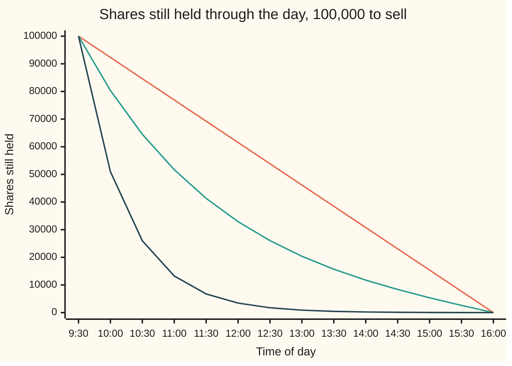
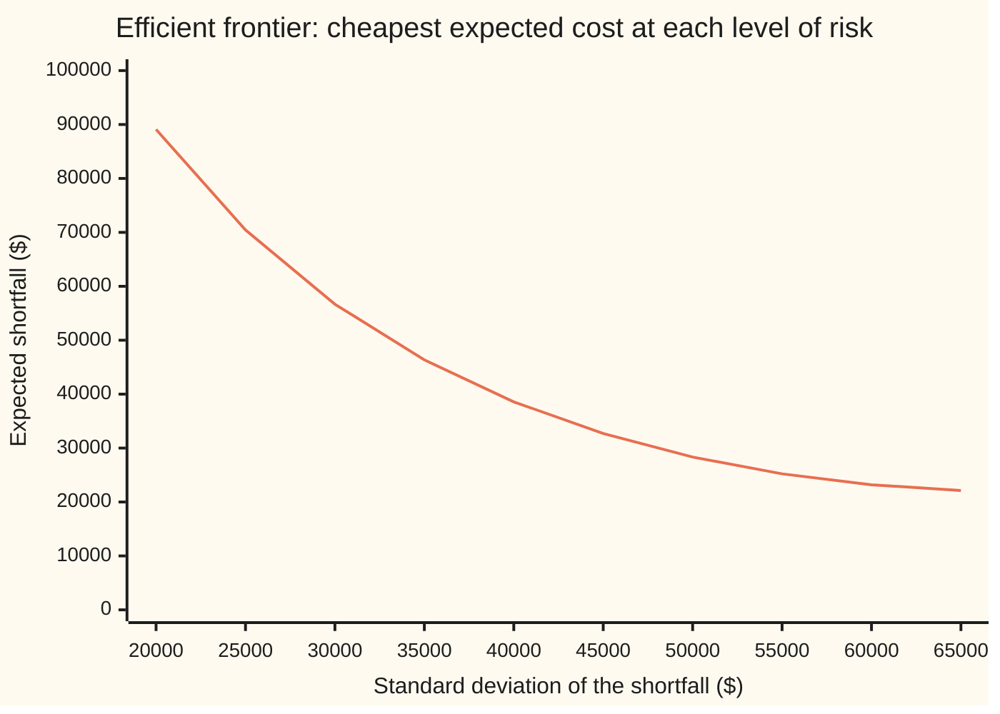

# Almgren-Chriss: trading a large order over time, balancing impact against risk

[Syllabus](../../../SYLLABUS.md) → [Financial mathematics](../../../SYLLABUS.md#w12) → [Microstructure and Execution](../../../SYLLABUS.md#w12-s49) → Almgren-Chriss

---

## General Overview

A fund must sell 100,000 Acme shares today. Acme trades at $100, and about 1,000,000 of its shares change hands on a normal day. The order is a tenth of the day's volume. The market opens at 9:30 and closes at 16:00.

*Conventions verified 2026-09-28: US equity regular session 9:30 to 16:00 Eastern; annual volatility converted to daily over 252 trading days.*

Selling everything at the open is expensive. Buyers at good prices run out, and each further block goes cheaper: in this card's model, dumping the lot in the first half-hour costs $261,000.00 against the opening price. Selling evenly through the day, 7,692 shares each half-hour, costs far less on average: $21,923.08. But the shares still held are exposed to Acme's price all day. The spread of outcomes around that average, its standard deviation, is $68,528.52.

So speed costs money for sure, and slowness costs money perhaps. A trader who dislikes the uncertainty sells faster early, while the unsold pile is biggest, and eases off later. For the trader on this card, that means 64,509 shares still held at 10:30 instead of 84,615. The expected cost rises to $31,296.45; the standard deviation falls to $46,443.35.

Robert Almgren and Neil Chriss turned that trade-off into one optimisation, published in 2001. Its answer is a formula for the whole schedule, and a curve, the **efficient frontier**, showing the cheapest expected cost for each level of risk.

**Minimise expected cost plus a price per unit of variance, and the best schedule holds shares that decay like a hyperbolic sine: fast at first when risk matters more than impact, and exactly even when risk costs nothing.**

**What kind of fact this is:** a model: straight-line price impact and a randomly wandering price are assumptions that fit a single day's trading well enough, not laws; inside the model, the optimal schedule is a theorem, proved on this card in Why it works.

### The picture: three traders, one order



The straight line (orange) ignores risk and sells evenly. The middle curve (green) is this card's trader, with risk aversion $10^{-5}$ per dollar. The steepest curve (dark blue) is a trader ten times more risk-averse, who has sold three quarters of the order by 10:30.

---

## The formula

Notation first, in words. The day is cut into $N$ equal slices. A subscript $k$ counts slices: $x_k$ is the number of shares still held after slice $k$, and $n_k = x_{k-1} - x_k$ is the number sold during it. A tilde marks a close cousin of a symbol: $\tilde\eta$ is a corrected $\eta$. Time on this card is counted in **trading days**, not years, because the whole job lasts one day.

The optimal holdings are

$$x_k = X\,\frac{\sinh\big(\kappa\,(T - t_k)\big)}{\sinh(\kappa T)}, \qquad t_k = k\tau,$$

where the **urgency** $\kappa$ solves

$$\frac{2}{\tau^2}\big(\cosh(\kappa\tau) - 1\big) = \tilde\kappa^2 = \frac{\lambda\,\sigma^2}{\tilde\eta}.$$

Here sinh and cosh are the hyperbolic sine and cosine, $\sinh(y) = (e^{y} - e^{-y})/2$ and $\cosh(y) = (e^{y} + e^{-y})/2$. For a large argument both are close to $e^{y}/2$, so the ratio in $x_k$ behaves like $e^{-\kappa t_k}$ early in the day: exponential decay at rate $\kappa$.

**Read it aloud:** the shares left fall away like a decaying exponential, bent so they reach zero exactly at the close; how fast they fall is set by the square root of risk aversion times variance over impact.

The schedule minimises the trader's objective, expected cost plus a price on variance:

$$U = E + \lambda V, \qquad E = \tfrac12\gamma X^2 + \epsilon X + \frac{\tilde\eta}{\tau}\sum_{k=1}^{N} n_k^2, \qquad V = \sigma^2 \tau \sum_{k=1}^{N} x_k^2 .$$

The cost is measured as **implementation shortfall**: the order's value at the opening price, $X S_0$, minus the cash the sales actually bring in.

| Symbol | Plain meaning | In our example | Push it up and the answer… |
| --- | --- | --- | --- |
| $X$ | shares to sell | 100,000 | every cost scales up; impact grows as its square |
| $T$, $N$, $\tau$, $k$, $t_k$ | the horizon; the number of slices; one slice, $\tau = T/N$; a slice counter, 1 to $N$; the clock after slice $k$ | 1 day; 13; half an hour, 1/13 day; —; $k$ half-hours after 9:30 | more slices: a smoother schedule, nearly the same cost |
| $x_k$, $n_k$ | shares still held after slice $k$; shares sold in slice $k$ | 80,361 held at 10:00; 19,639 sold from 9:30 to 10:00 | — |
| $S_0$, $\sigma$ | the opening price; the volatility in dollars per share per square-root day | $100; 1.259882 (20% a year) | higher $\sigma$: more risk in waiting, sell faster |
| $\xi_k$ | the random shock to the price in slice $k$, a standard bell-curve draw | mean 0, spread 1 | — |
| $\epsilon$ | half the bid-ask spread, paid on every share | $0.01 | adds $\epsilon X$ to cost, schedule unchanged |
| $\gamma$ | permanent impact: how far each share sold lowers the price for good | $2 \times 10^{-7}$ dollars per share | adds to cost, barely moves the schedule |
| $\eta$, $\tilde\eta$ | temporary impact: the discount per share for selling at a rate of one share a day; and $\tilde\eta = \eta - \tfrac12\gamma\tau$ | $2 \times 10^{-6}$; $1.992308 \times 10^{-6}$ | higher: speed costs more, sell more evenly |
| $\lambda$ | risk aversion: dollars of cost accepted per dollar-squared of variance | $10^{-5}$ | sell faster, higher $E$, lower $V$ |
| $\tilde\kappa$, $\kappa$ | urgency: the decay rate of the holdings, in continuous and in sliced time | 2.822614 and 2.817099 per day | a steeper front-load |
| $E$, $V$ | expected shortfall; its variance, whose square root is the standard deviation | $31,296.45; sd $46,443.35 | — |
| $U$ | the objective $E + \lambda V$ | $52,866.30 | — |

### When it holds

- **Impact is a straight line in trading speed.** Measured impact tends to grow more like a square root of speed. With a concave impact the schedule changes shape and has no sinh formula; Almgren's 2003 paper solves the power-law case numerically.
- **Temporary impact is gone by the next slice.** If the order book refills slowly, selling now also cheapens the next slice, and the model understates the cost of speed.
- **The price wanders with no drift.** A trader who expects Acme to fall should sell faster than this schedule; one who expects a rise, slower. The schedule has no view.
- **Volatility and liquidity are flat through the day.** Real volume is heavy at the open and close and thin at lunch, so desks bend the schedule toward volume.
- **The schedule is fixed at 9:30.** Among schedules fixed in advance this one is optimal; a rule that reacts to the price as the day unfolds can do somewhat better on the same objective.

---

## Why it works

### Step 0: two costs that pull in opposite directions

Selling fast pushes the price down while the shares go out: a cost that is certain and grows with speed. Selling slowly leaves shares exposed to the price wandering: a cost that is uncertain and grows with the number of shares held and the time held. Both costs turn out to be sums of squares. A sum of squares minimised under straight-line constraints has straight-line conditions for its minimum, and those can be solved exactly.

### Step 1: the price model

Acme starts at $S_0$. In slice $k$ the trader sells $n_k$ shares, a rate of $n_k/\tau$ shares a day. Two things happen to the price.

- **The fill.** The shares go at $S_{k-1} - \epsilon - \eta\,n_k/\tau$: last slice's price, less half the spread, less a temporary discount proportional to the selling rate. The discount is the price of eating through the buyers in the book ([The order book](01-the-limit-order-book.md)). It is paid and then forgotten.
- **The drift of the price.** After the slice, $S_k = S_{k-1} + \sigma\sqrt{\tau}\,\xi_k - \gamma n_k$. The first term is the random wander: over a slice of length $\tau$ its standard deviation is $\sigma\sqrt{\tau}$. The second is the permanent dent: other traders read the selling as information and mark Acme down for good, as in [Kyle's model](03-kyle-model-and-price-impact.md). That card calls its impact slope λ; on this card λ is risk aversion, and the impact slopes are $\gamma$ and $\eta$.

### Step 2: the expected cost

The shortfall is $X S_0$ minus the sum of $n_k$ times each fill price. Each fill price is $S_0$ plus the random wander so far, minus the permanent dents from earlier slices, minus $\epsilon$, minus $\eta n_k/\tau$. The wander has average zero, so the expected shortfall collects three pieces.

- **Spread:** $\epsilon$ on every share, $\epsilon X$.
- **Temporary:** $\eta n_k/\tau$ on each of $n_k$ shares, $(\eta/\tau)\sum n_k^2$.
- **Permanent:** each share sold in slice $k$ suffers the dents of all shares sold before it, $\gamma\sum_k n_k \sum_{j<k} n_j$.

The permanent sum counts every pair of slices once. The square of the total, $X^2 = (\sum n_k)^2$, counts every pair twice plus every slice with itself. So the permanent piece is $\tfrac12\gamma(X^2 - \sum n_k^2)$. Its main term $\tfrac12\gamma X^2$ is the same for every schedule; only the small $-\tfrac12\gamma\sum n_k^2$ depends on timing, and it folds into the temporary term as $\tilde\eta = \eta - \tfrac12\gamma\tau$. That gives the $E$ on the formula line.

### Step 3: the variance

The random part of the shortfall is minus the sum, over trades, of shares sold times the wander before the sale. Regroup it by shock instead of by trade. The shock $\xi_k$ in slice $k$ hits every share sold after slice $k$, which is exactly the $x_k$ shares still held after slice $k$. So the random part is $-\sigma\sqrt{\tau}\sum_k x_k \xi_k$. The shocks are independent with variance 1, so

$$V = \sigma^2\tau\sum_{k=1}^{N} x_k^2 .$$

**Risk is charged on shares held, cost on shares sold.** That asymmetry is the whole model.

<details>
<summary>Detailed proof: regrouping the random part</summary>

The fill in slice $k$ carries the wander $\sigma\sqrt{\tau}\sum_{j<k}\xi_j$. Summed over trades, the random part of the cash received is $\sigma\sqrt{\tau}\sum_{k=1}^{N} n_k \sum_{j=1}^{k-1}\xi_j$. Swap the order: for each shock, collect every later trade. The inner sum becomes $\sum_{k>j} n_k = x_j - x_N = x_j$, since the order ends empty. So the random cash is $\sigma\sqrt{\tau}\sum_{j} \xi_j x_j$, and the shortfall carries minus that. The terms are independent with variances $\sigma^2\tau x_j^2$, and variances of independent terms add. This swap is summation by parts, the discrete cousin of integration by parts.

</details>

### Step 4: why add $\lambda V$, and what $\lambda$ means

The honest question is: for a chosen level of risk, what is the lowest expected cost? That is "minimise $E$ subject to $V$ equal to a target". The method of [Lagrange multipliers](../../06-Calculus%20and%20analysis/07-Several%20Variables/08-lagrange-multipliers.md) turns it into "minimise $E + \lambda V$" with $\lambda$ the multiplier. So $\lambda$ has a second life. Read as a preference, it is how many dollars of expected cost the trader pays to remove one dollar-squared of variance. Read on the frontier, it is minus the slope: $dE/dV = -\lambda$. The check measures that slope at $\lambda = 10^{-5}$ and gets exactly $-\lambda$ to six figures.

For this trader the risk charge $\lambda V$ is $21,569.85, on top of $E$ = $31,296.45$, so $U$ = $52,866.30.

### Step 5: the best schedule is a sinh

Hold every $x$ fixed except one, $x_k$. It appears in two trades, $n_k$ and $n_{k+1}$, and in one variance term. Setting the slope of $U$ in $x_k$ to zero gives

$$\frac{x_{k-1} - 2x_k + x_{k+1}}{\tau^2} = \tilde\kappa^2\,x_k, \qquad \tilde\kappa^2 = \frac{\lambda\sigma^2}{\tilde\eta}.$$

The left side is the discrete second derivative, the bend of the holdings curve. The equation says: bend in proportion to what is still held. A bend of zero is a straight line, which is why $\lambda = 0$ gives the even schedule.

Solutions of this recurrence are powers: try powers of one number, $x_k = r^k$, and that number must satisfy $r + 1/r = 2 + \tilde\kappa^2\tau^2$. Write $r = e^{\kappa\tau}$; then $r + 1/r = 2\cosh(\kappa\tau)$, which is the urgency equation on the formula line. The two roots, $e^{\pm\kappa\tau}$, give solutions $e^{\pm\kappa t_k}$, which combine into sinh. Holding $X$ at the open and zero at the close fixes the combination: $x_k = X\sinh(\kappa(T - t_k))/\sinh(\kappa T)$.

<details>
<summary>Detailed proof: the slope in one holding, and the boundary fit</summary>

$U$ contains $x_k$ in $(\tilde\eta/\tau)\big[(x_{k-1} - x_k)^2 + (x_k - x_{k+1})^2\big] + \lambda\sigma^2\tau x_k^2$. The derivative in $x_k$ is $(2\tilde\eta/\tau)(2x_k - x_{k-1} - x_{k+1}) + 2\lambda\sigma^2\tau x_k$. Setting it to zero and dividing by $2\tilde\eta\tau$ gives the recurrence. The general solution is $A e^{\kappa t_k} + B e^{-\kappa t_k}$, which can be rewritten as $C\sinh(\kappa(T - t_k)) + D\sinh(\kappa t_k)$. At $t_N = T$ the first term is zero, so $x_N = 0$ forces $D = 0$. At $t_0 = 0$, $x_0 = X$ forces $C = X/\sinh(\kappa T)$.

</details>

### Step 6: why the answer is the only one

A stationary point could be a maximum or a saddle. It is neither here. The second derivatives of $U$ in the twelve interior holdings form a matrix with $2(2\tilde\eta/\tau + \lambda\sigma^2\tau)$ on the diagonal and $-2\tilde\eta/\tau$ beside it. Its eigenvalues, from [Eigenvalues and eigenvectors](../../03-Algebra/07-Eigenvalues%20and%20Symmetric%20Matrices/02-eigenvalues-and-eigenvectors.md), are $(2\tilde\eta/\tau)(2 - 2\cos(j\pi/N)) + 2\lambda\sigma^2\tau$ for $j = 1, \dots, N-1$. Every one is positive, so $U$ is a bowl with a single bottom. The smallest, at $j = 1$, is $5.452430 \times 10^{-6}$; the check confirms this a second way: every leading minor of the matrix is positive, and the product of the eigenvalues equals its determinant. Even at $\lambda = 0$ the bowl has a bottom, since $2 - 2\cos(j\pi/N) > 0$.

The boundary cases follow. At $\lambda = 0$ the urgency is zero and the schedule is even. As $\lambda$ grows without limit, $\kappa$ does too, and the whole order goes in the first slice: zero variance, $261,000.00 of expected cost.

### Step 7: the efficient frontier

Sweep $\lambda$ and each value gives one schedule, one $E$ and one standard deviation. To draw the frontier at round risk levels, the check runs the sweep backwards: for each target standard deviation it finds $\lambda$ by bisection (halving an interval until it pins the root). A root exists for every target strictly between zero and the even schedule's $68,528.52, and it is unique, because the standard deviation falls steadily as $\lambda$ rises. The ends are limits: $68,528.52 itself is $\lambda = 0$, and zero is reached only as $\lambda$ grows without bound.



The single line is the frontier: no schedule sits below it. Its right end continues to the even schedule at $21,923.08. Near that end the curve is almost flat. Cutting the standard deviation from $68,529 to $65,000 raises the expected cost by only $212.88. At the left the curve is steep: the last dollars of risk are bought at great expense.

The flat end is the frontier's slope, $-\lambda$, at $\lambda = 0$. **The first bit of risk reduction is almost free,** so any trader with the slightest aversion to risk should front-load a little. The even schedule is optimal only for a trader who is exactly indifferent to risk.

The same problem can be posed in continuous time, trading at a rate rather than in blocks. The recurrence becomes $x'' = \tilde\kappa^2 x$ and the urgency becomes $\tilde\kappa$ itself. On thirteen slices the two agree closely: the continuous urgency 2.822614 against the sliced 2.817099.

---

## Worked numbers, by hand

This card's trader: $X$ = 100,000, $N$ = 13, $\tau$ = 1/13 day, $\epsilon$ = $0.01, $\gamma = 2 \times 10^{-7}$, $\eta = 2 \times 10^{-6}$, $\lambda = 10^{-5}$.

| Step | Arithmetic | Value |
| --- | --- | --- |
| daily volatility in dollars, $\sigma$ | $100 \times 0.20 / \sqrt{252}$ | 1.259882 |
| $\sigma^2$ | $1.259882^2$ | 1.587302 |
| corrected impact, $\tilde\eta$ | $2 \times 10^{-6} - \tfrac12 \times 2 \times 10^{-7} / 13$ | $1.992308 \times 10^{-6}$ |
| $\tilde\kappa^2 = \lambda\sigma^2/\tilde\eta$ | $10^{-5} \times 1.587302 / (1.992308 \times 10^{-6})$ | 7.967151 |
| $\tilde\kappa$ | $\sqrt{7.967151}$ | 2.822614 per day |
| $\cosh(\kappa\tau)$ | $1 + \tfrac12 \times 7.967151 / 169$ | 1.023571 |
| $\kappa\tau$ | the number whose cosh is 1.023571 | 0.216700 |
| $\kappa$ | $0.216700 \times 13$ | 2.817099 per day |
| held at 10:00 | $100{,}000 \times \sinh(2.817099 \times 12/13) / \sinh(2.817099)$ | 80,361 |
| held at 10:30 | $100{,}000 \times \sinh(2.817099 \times 11/13) / \sinh(2.817099)$ | 64,509 |
| permanent cost | $\tfrac12 \times 2 \times 10^{-7} \times 100{,}000^2$ | $1,000.00 |
| spread cost | $0.01 \times 100{,}000$ | $1,000.00 |
| temporary cost | $(\tilde\eta/\tau) \times$ the sum of the 13 squared trades | $29,296.45 |
| **expected shortfall $E$** | $1{,}000.00 + 1{,}000.00 + 29{,}296.45$ | **$31,296.45** |
| standard deviation | $\sqrt{V}$ | $46,443.35 |

Early in the day the holdings shrink by a factor of about $e^{-\kappa\tau}$ = 0.805172 per half-hour. Half the order is gone just after 11:00.

The trades, in shares per half-hour, one bar per slice (the even schedule sells 7,692 in every slice):

```
slice   shares sold, lambda = 1e-5
 9:30   ████████████████████████████████████████  19639
10:00   ████████████████████████████████          15851
10:30   ██████████████████████████                12810
11:00   █████████████████████                     10373
11:30   █████████████████                          8424
12:00   ██████████████                             6873
12:30   ███████████                                5646
13:00   ██████████                                 4685
13:30   ████████                                   3945
14:00   ███████                                    3391
14:30   ██████                                     2997
15:00   ██████                                     2744
15:30   █████                                      2621
```

Against selling evenly, this trader pays $9,373.37 more on average and carries $22,085.17 less standard deviation. By the trader's own yardstick $U$, that is a saving of $16,018.36.

### What breaks if you drop a piece

Every row is scored by the true model with $\lambda = 10^{-5}$; the optimum scores $U$ = $52,866.30.

| Mistake | Comes out at | What went wrong |
| --- | --- | --- |
| Sell evenly, ignoring risk | $E$ $21,923.08, sd $68,528.52, $U$ $68,884.66 | Cheapest on average, but carries the most risk; the frontier's flat end says a little front-loading was nearly free. |
| Sell it all in the first half-hour | $E$ $261,000.00, sd $0.00, $U$ $261,000.00 | Temporary impact grows with the square of the block: one slice of 100,000 costs 13 times as much impact as 13 slices of 7,692. The zero risk is the model's convention that a slice fills at its opening price. |
| Feed $\sigma$ per year (20) into a model in days | $E$ $226,017.94, sd $2,537.36, $U$ $226,082.32 | Variance is overstated 252 times, so the schedule panics and dumps almost everything at the open. |
| Use the continuous urgency $\tilde\kappa$ for $\kappa$ | $U$ $52,866.38 | Eight cents worse: on 13 slices the sliced correction barely matters. |
| Use $\eta$ in place of $\tilde\eta$ | $U$ $52,866.38 | Also eight cents: the permanent-impact correction is small here, but it matters for coarse slices or large $\gamma$. |

---

## Code, from first principles, and it actually runs

The scripts compute the schedule and its costs by five roads. Road 1 is the sinh formula. Road 2 minimises $U$ one holding at a time, repeatedly, with no sinh anywhere. Road 3 trades the schedule against the price model itself, once with the noise switched off, which must reproduce $E$ exactly, and then over 200,000 simulated days, whose average and spread must match $E$ and $V$. Road 4 nudges the optimum 2,000 times at random and checks no nudge scores better. Road 5 measures the frontier's slope and checks it equals $-\lambda$. Both scripts then sweep the frontier, score the mistakes, and run the experiments below. The random numbers come from a hand-written splitmix64 generator and the Box-Muller transform (two uniform draws turned into one bell-curve draw), identical in both languages, so the two outputs agree line for line.

### Python

```python
# Almgren-Chriss optimal execution -- the check behind the card.  Standard library only.
# Sell 100,000 Acme shares ($100, 1,000,000 traded a day) over one day in 13 half-hour slices.
# Roads: the sinh formula; coordinate descent on E + lambda V; a Monte Carlo of the trades
# themselves; random nudges that must never do better; the frontier's slope equal to -lambda.
from math import sqrt, sinh, acosh, log, cos, pi, exp, prod

X, N, T, S0 = 100_000.0, 13, 1.0, 100.0  # shares, slices, days, starting price
tau = T / N                              # one slice, in days
sig = S0 * 0.20 / sqrt(252.0)            # $ per share per sqrt(day): 20% a year on a $100 stock
eps, gam, eta = 0.01, 2e-7, 2e-6         # half-spread; permanent and temporary impact slopes
eta_t = eta - 0.5 * gam * tau            # temporary slope net of the permanent correction
LAM = 1e-5                               # the risk-averse trader: dollars of cost per dollar^2 of variance

def EV(x, s=sig, g=gam, e=eps, et=eta_t):          # expected cost and variance of a schedule
    n = [x[k - 1] - x[k] for k in range(1, N + 1)]
    E = 0.5 * g * X * X + e * X + et / tau * sum(v * v for v in n)
    V = s * s * tau * sum(v * v for v in x[1:])
    return E, V

def U(x, lam=LAM):
    E, V = EV(x)
    return E + lam * V

def kappas(lam, s=sig, et=eta_t):
    kt = sqrt(lam * s * s / et)                      # continuous-time urgency, per day
    return kt, acosh(1.0 + 0.5 * (kt * tau) ** 2) / tau  # and its discrete version

def closed_form(lam, s=sig, et=eta_t, discrete=True):  # road 1: holdings X sinh(k(T-t))/sinh(kT)
    if lam == 0: return [X * (1 - k / N) for k in range(N + 1)]
    kt, kap = kappas(lam, s, et)
    if not discrete: kap = kt
    return [X * sinh(kap * (T - k * tau)) / sinh(kap * T) for k in range(N + 1)]

def coordinate_descent(lam):   # road 2: set each holding to its best value given its neighbours, repeat
    x = [X * (1 - k / N) for k in range(N + 1)]
    a, b = eta_t / tau, lam * sig * sig * tau
    for sweep in range(1, 100001):
        change = 0.0
        for k in range(1, N):
            new = a * (x[k - 1] + x[k + 1]) / (2 * a + b)
            change, x[k] = max(change, abs(new - x[k])), new
        if change < 1e-9: return x, sweep

M64, st = (1 << 64) - 1, [20260928]
def uniform():                                      # splitmix64, written out
    st[0] = (st[0] + 0x9E3779B97F4A7C15) & M64
    z = st[0]
    z = ((z ^ (z >> 30)) * 0xBF58476D1CE4E5B9) & M64
    z = ((z ^ (z >> 27)) * 0x94D049BB133111EB) & M64
    return (((z ^ (z >> 31)) >> 11) + 0.5) / 9007199254740992.0
def normal(): return sqrt(-2.0 * log(uniform())) * cos(2.0 * pi * uniform())  # Box-Muller

def simulate(x, paths=200000, noise=1.0):  # road 3: trade the schedule against random prices, add up the cash
    n = [x[k - 1] - x[k] for k in range(1, N + 1)]
    tot = tot2 = 0.0
    for _ in range(paths):
        S, cash = S0, 0.0
        for k in range(N):
            cash += n[k] * (S - eps - eta * n[k] / tau)          # half-spread and temporary impact
            S += noise * sig * sqrt(tau) * normal() - gam * n[k]  # the price wanders, keeps the dent
        short = X * S0 - cash
        tot, tot2 = tot + short, tot2 + short * short
    m = tot / paths
    return m, sqrt(tot2 / paths - m * m)

def fmt(x): return " ".join(f"{v:.0f}" for v in x)
kt, kap = kappas(LAM)
x_opt, x_cd = closed_form(LAM), coordinate_descent(LAM)
E, V = EV(x_opt)
print(f"sigma {sig:.6f}  eta_tilde (millionths) {eta_t * 1e6:.6f}  kappa_tilde {kt:.6f}  kappa {kap:.6f}")
print(f"sigma^2 {sig * sig:.6f}  kappa_tilde^2 {kt * kt:.6f}  cosh(kappa*tau) {1 + 0.5 * (kt * tau) ** 2:.6f}")
print(f"kappa*tau {kap * tau:.6f}  holdings fall by e^-kappa*tau = {exp(-kap * tau):.6f} a slice at first")
for lab, lam in (("0", 0.0), ("1e-5", LAM), ("1e-4", 1e-4)):
    print(f"holdings lambda={lab}: {fmt(closed_form(lam))}")
print("trades lambda=1e-5:", fmt([x_opt[k - 1] - x_opt[k] for k in range(1, N + 1)]))
gap = max(abs(a - b) for a, b in zip(x_opt, x_cd[0]))
print(f"road 2 coordinate descent: {x_cd[1]} sweeps, largest gap to sinh schedule {gap:.9f} shares")
perm, spread = 0.5 * gam * X * X, eps * X
print(f"E parts: permanent {perm:.2f}  spread {spread:.2f}  temporary {E - perm - spread:.2f}")
print(f"optimal  E {E:.2f}  sd {sqrt(V):.2f}  lambda*V {LAM * V:.2f}  U {E + LAM * V:.2f}")
m0 = simulate(x_opt, paths=1, noise=0.0)[0]
print(f"road 3, the same trades with the noise switched off: shortfall {m0:.2f}")
m, sd = simulate(x_opt)
print(f"road 3 Monte Carlo, 200000 days: mean {m:.2f}  sd {sd:.2f}  (standard error of mean {sd / sqrt(200000):.2f})")
worse, best = 0, float("inf")
for _ in range(2000):                   # road 4: nudge every interior holding by up to 2,000 shares
    y = [x_opt[0]] + [x_opt[k] + 4000.0 * (uniform() - 0.5) for k in range(1, N)] + [0.0]
    worse, best = worse + (U(y) > U(x_opt)), min(best, U(y))
print(f"road 4: {worse} of 2000 nudged schedules cost more; cheapest is {best - U(x_opt):.2f} above the optimum")
h = 1e-8
(E1, V1), (E2, V2) = EV(closed_form(LAM - h)), EV(closed_form(LAM + h))
slope = (E2 - E1) / (V2 - V1)
print(f"road 5: frontier slope dE/dV at lambda=1e-5, divided by -lambda: {slope / -LAM:.6f}")
a, b = eta_t / tau, LAM * sig * sig * tau
D0, D1, ok = 1.0, 2 * (2 * a + b), True  # leading minors of the Hessian, which is tridiagonal
for k in range(2, N):
    D0, D1 = D1, 2 * (2 * a + b) * D1 - 4 * a * a * D0
    ok = ok and D1 > 0
print(f"smallest Hessian eigenvalue (millionths) {(2 * a * (2 - 2 * cos(pi / N)) + 2 * b) * 1e6:.6f}; leading minors positive: {'yes' if ok else 'no'}")

def lam_for_sd(target):                 # sd falls as lambda rises: bisect on log lambda
    lo, hi = log(1e-10), log(1e-2)
    for _ in range(200):
        mid = 0.5 * (lo + hi)
        lo, hi = (mid, hi) if sqrt(EV(closed_form(exp(mid)))[1]) > target else (lo, mid)
    return exp(lo)
E0, V0 = EV(closed_form(0.0))
print(f"frontier end, sell evenly: E {E0:.2f}  sd {sqrt(V0):.2f}")
for t in range(20000, 65001, 5000):
    L = lam_for_sd(t)
    print(f"frontier sd {t}  lambda (x1e-5) {L * 1e5:.4f}  E {EV(closed_form(L))[0]:.0f}")
print(f"versus selling evenly: E +{E - E0:.2f}  sd -{sqrt(V0) - sqrt(V):.2f}  U saved {E0 + LAM * V0 - E - LAM * V:.2f}")
print(f"first step off the even end, sd {sqrt(V0):.0f} -> 65000: E +{EV(closed_form(lam_for_sd(65000)))[0] - E0:.2f}")

def report(name, x):
    e, v = EV(x)
    print(f"{name:<34} E {e:>10.2f}  sd {sqrt(v):>9.2f}  U {e + LAM * v:>10.2f}")
report("optimal", x_opt)
report("wrong: sell evenly, ignore risk", closed_form(0.0))
report("wrong: sell it all in slice one", [X] + [0.0] * N)
report("wrong: sigma per year as per day", closed_form(LAM, s=S0 * 0.20))
report("wrong: continuous kappa", closed_form(LAM, discrete=False))
report("wrong: eta in place of eta_tilde", closed_form(LAM, et=eta))
for name, kw, et in (("try: sigma doubled", {"s": 2 * sig}, eta_t), ("try: eta halved", {}, 0.5 * eta - 0.5 * gam * tau),
                     ("try: gamma doubled", {"g": 2 * gam}, eta - gam * tau), ("try: eps doubled", {"e": 2 * eps}, eta_t)):
    x = closed_form(LAM, s=kw.get("s", sig), et=et)
    e, v = EV(x, et=et, **kw)
    print(f"{name:<20} E {e:.2f}  sd {sqrt(v):.2f}  held at 10:30 {x[2]:.0f}")

assert gap < 1e-3                                   # sinh formula and coordinate descent agree
assert abs(m0 - E) < 1e-6                                # the trades, noise off, cost exactly E
assert abs(m - E) < 4 * sd / sqrt(200000)                # the trades cost, on average, what E says
assert abs(sd / sqrt(V) - 1) < 0.01                      # and spread as widely as V says
assert worse == 2000                                # no nudge beats the optimum
assert abs(slope / -LAM - 1) < 1e-4                 # lambda is the price of variance on the frontier
assert ok and abs(prod(2 * a * (2 - 2 * cos(j * pi / N)) + 2 * b for j in range(1, N)) / D1 - 1) < 1e-9  # eigenvalues vs determinant
assert min(U(closed_form(0.0)), U(closed_form(LAM, s=S0 * 0.20)), U(closed_form(LAM, discrete=False)), U(closed_form(LAM, et=eta))) > U(x_opt)  # every mistake scores worse
```

**Ran 2026-09-28 on macOS, Python 3.14.6, standard library only. All checks passed. Output, pasted from the run:**

```
sigma 1.259882  eta_tilde (millionths) 1.992308  kappa_tilde 2.822614  kappa 2.817099
sigma^2 1.587302  kappa_tilde^2 7.967151  cosh(kappa*tau) 1.023571
kappa*tau 0.216700  holdings fall by e^-kappa*tau = 0.805172 a slice at first
holdings lambda=0: 100000 92308 84615 76923 69231 61538 53846 46154 38462 30769 23077 15385 7692 0
holdings lambda=1e-5: 100000 80361 64509 51700 41327 32903 26029 20383 15698 11753 8362 5365 2621 0
holdings lambda=1e-4: 100000 50977 25987 13247 6753 3443 1755 894 456 231 116 56 23 0
trades lambda=1e-5: 19639 15851 12810 10373 8424 6873 5646 4685 3945 3391 2997 2744 2621
road 2 coordinate descent: 273 sweeps, largest gap to sinh schedule 0.000000009 shares
E parts: permanent 1000.00  spread 1000.00  temporary 29296.45
optimal  E 31296.45  sd 46443.35  lambda*V 21569.85  U 52866.30
road 3, the same trades with the noise switched off: shortfall 31296.45
road 3 Monte Carlo, 200000 days: mean 31387.15  sd 46388.74  (standard error of mean 103.73)
road 4: 2000 of 2000 nudged schedules cost more; cheapest is 109.65 above the optimum
road 5: frontier slope dE/dV at lambda=1e-5, divided by -lambda: 1.000000
smallest Hessian eigenvalue (millionths) 5.452430; leading minors positive: yes
frontier end, sell evenly: E 21923.08  sd 68528.52
frontier sd 20000  lambda (x1e-5) 10.8146  E 89083
frontier sd 25000  lambda (x1e-5) 6.3734  E 70461
frontier sd 30000  lambda (x1e-5) 3.9546  E 56676
frontier sd 35000  lambda (x1e-5) 2.5504  E 46358
frontier sd 40000  lambda (x1e-5) 1.6871  E 38571
frontier sd 45000  lambda (x1e-5) 1.1255  E 32697
frontier sd 50000  lambda (x1e-5) 0.7402  E 28335
frontier sd 55000  lambda (x1e-5) 0.4628  E 25226
frontier sd 60000  lambda (x1e-5) 0.2549  E 23198
frontier sd 65000  lambda (x1e-5) 0.0936  E 22136
versus selling evenly: E +9373.37  sd -22085.17  U saved 16018.36
first step off the even end, sd 68529 -> 65000: E +212.88
optimal                            E   31296.45  sd  46443.35  U   52866.30
wrong: sell evenly, ignore risk    E   21923.08  sd  68528.52  U   68884.66
wrong: sell it all in slice one    E  261000.00  sd      0.00  U  261000.00
wrong: sigma per year as per day   E  226017.94  sd   2537.36  U  226082.32
wrong: continuous kappa            E   31340.75  sd  46395.73  U   52866.38
wrong: eta in place of eta_tilde   E   31253.12  sd  46490.06  U   52866.38
try: sigma doubled   E 56973.51  sd 59749.88  held at 10:30 42237
try: eta halved      E 21736.67  sd 37868.71  held at 10:30 54132
try: gamma doubled   E 32226.80  sd 46396.44  held at 10:30 64458
try: eps doubled     E 32296.45  sd 46443.35  held at 10:30 64509
```

### Rust

```rust
// Almgren-Chriss optimal execution -- the check behind the card.  Rust std only.
// Sell 100,000 Acme shares ($100, 1,000,000 traded a day) over one day in 13 half-hour slices.
// Roads: the sinh formula; coordinate descent on E + lambda V; a Monte Carlo of the trades
// themselves; random nudges that must never do better; the frontier's slope equal to -lambda.
const X: f64 = 100_000.0; const N: usize = 13; const T: f64 = 1.0; const S0: f64 = 100.0; // shares, slices, days, price
const EPS: f64 = 0.01; const GAM: f64 = 2e-7; const ETA: f64 = 2e-6; // half-spread; permanent and temporary impact slopes
const LAM: f64 = 1e-5;                    // the risk-averse trader: dollars of cost per dollar^2 of variance
fn tau() -> f64 { T / N as f64 }
fn sig() -> f64 { S0 * 0.20 / 252f64.sqrt() }
fn eta_t() -> f64 { ETA - 0.5 * GAM * tau() }

// expected cost and variance of a schedule x[0..N]
fn ev(x: &[f64], s: f64, g: f64, e: f64, et: f64) -> (f64, f64) {
    let mut sn = 0.0;
    for k in 1..=N { let n = x[k - 1] - x[k]; sn += n * n; }
    let sx: f64 = x[1..].iter().map(|v| v * v).sum();
    (0.5 * g * X * X + e * X + et / tau() * sn, s * s * tau() * sx)
}
fn ev0(x: &[f64]) -> (f64, f64) { ev(x, sig(), GAM, EPS, eta_t()) }
fn u(x: &[f64]) -> f64 { let (e, v) = ev0(x); e + LAM * v }

fn kappas(lam: f64, s: f64, et: f64) -> (f64, f64) {
    let kt = (lam * s * s / et).sqrt();                        // continuous-time urgency, per day
    (kt, (1.0 + 0.5 * (kt * tau()).powi(2)).acosh() / tau())   // and its discrete version
}
// road 1: holdings X sinh(k(T-t))/sinh(kT)
fn closed_form(lam: f64, s: f64, et: f64, discrete: bool) -> Vec<f64> {
    if lam == 0.0 { return (0..=N).map(|k| X * (1.0 - k as f64 / N as f64)).collect(); }
    let (kt, kd) = kappas(lam, s, et);
    let kap = if discrete { kd } else { kt };
    (0..=N).map(|k| X * (kap * (T - k as f64 * tau())).sinh() / (kap * T).sinh()).collect()
}
fn cf(lam: f64) -> Vec<f64> { closed_form(lam, sig(), eta_t(), true) }

// road 2: set each holding to its best value given its neighbours, repeat
fn coordinate_descent(lam: f64) -> (Vec<f64>, usize) {
    let mut x: Vec<f64> = (0..=N).map(|k| X * (1.0 - k as f64 / N as f64)).collect();
    let (a, b) = (eta_t() / tau(), lam * sig() * sig() * tau());
    for sweep in 1..=100000 {
        let mut change: f64 = 0.0;
        for k in 1..N {
            let new = a * (x[k - 1] + x[k + 1]) / (2.0 * a + b);
            change = change.max((new - x[k]).abs());
            x[k] = new;
        }
        if change < 1e-9 { return (x, sweep); }
    }
    panic!("no convergence");
}

struct Rng(u64);
impl Rng {
    fn uniform(&mut self) -> f64 {                          // splitmix64, written out
        self.0 = self.0.wrapping_add(0x9E3779B97F4A7C15);
        let mut z = self.0;
        z = (z ^ (z >> 30)).wrapping_mul(0xBF58476D1CE4E5B9);
        z = (z ^ (z >> 27)).wrapping_mul(0x94D049BB133111EB);
        (((z ^ (z >> 31)) >> 11) as f64 + 0.5) / 9007199254740992.0
    }
    fn normal(&mut self) -> f64 {                           // Box-Muller
        let r = (-2.0 * self.uniform().ln()).sqrt();
        r * (2.0 * std::f64::consts::PI * self.uniform()).cos()
    }
}
// road 3: trade the schedule against random prices, add up the cash
fn simulate(x: &[f64], paths: usize, noise: f64, rng: &mut Rng) -> (f64, f64) {
    let n: Vec<f64> = (1..=N).map(|k| x[k - 1] - x[k]).collect();
    let (mut tot, mut tot2) = (0.0, 0.0);
    for _ in 0..paths {
        let (mut s, mut cash) = (S0, 0.0);
        for k in 0..N {
            cash += n[k] * (s - EPS - ETA * n[k] / tau());      // half-spread and temporary impact
            s += noise * sig() * tau().sqrt() * rng.normal() - GAM * n[k]; // the price wanders, keeps the dent
        }
        let short = X * S0 - cash;
        tot += short; tot2 += short * short;
    }
    let m = tot / paths as f64;
    (m, (tot2 / paths as f64 - m * m).sqrt())
}
fn fmt(x: &[f64]) -> String { x.iter().map(|v| format!("{:.0}", v)).collect::<Vec<_>>().join(" ") }
fn report(name: &str, x: &[f64]) {
    let (e, v) = ev0(x);
    println!("{:<34} E {:>10.2}  sd {:>9.2}  U {:>10.2}", name, e, v.sqrt(), e + LAM * v);
}

fn main() {
    let (tau, sig, eta_t) = (tau(), sig(), eta_t());
    let mut rng = Rng(20260928);
    let (kt, kap) = kappas(LAM, sig, eta_t);
    let (x_opt, (x_cd, sweeps)) = (cf(LAM), coordinate_descent(LAM));
    let (e, v) = ev0(&x_opt);
    println!("sigma {:.6}  eta_tilde (millionths) {:.6}  kappa_tilde {:.6}  kappa {:.6}", sig, eta_t * 1e6, kt, kap);
    println!("sigma^2 {:.6}  kappa_tilde^2 {:.6}  cosh(kappa*tau) {:.6}", sig * sig, kt * kt, 1.0 + 0.5 * (kt * tau).powi(2));
    println!("kappa*tau {:.6}  holdings fall by e^-kappa*tau = {:.6} a slice at first", kap * tau, (-kap * tau).exp());
    for (lab, lam) in [("0", 0.0), ("1e-5", LAM), ("1e-4", 1e-4)] {
        println!("holdings lambda={}: {}", lab, fmt(&cf(lam)));
    }
    let trades: Vec<f64> = (1..=N).map(|k| x_opt[k - 1] - x_opt[k]).collect();
    println!("trades lambda=1e-5: {}", fmt(&trades));
    let gap = x_opt.iter().zip(&x_cd).map(|(a, b)| (a - b).abs()).fold(0.0, f64::max);
    println!("road 2 coordinate descent: {} sweeps, largest gap to sinh schedule {:.9} shares", sweeps, gap);
    let (perm, spread) = (0.5 * GAM * X * X, EPS * X);
    println!("E parts: permanent {:.2}  spread {:.2}  temporary {:.2}", perm, spread, e - perm - spread);
    println!("optimal  E {:.2}  sd {:.2}  lambda*V {:.2}  U {:.2}", e, v.sqrt(), LAM * v, e + LAM * v);
    let m0 = simulate(&x_opt, 1, 0.0, &mut rng).0;
    println!("road 3, the same trades with the noise switched off: shortfall {:.2}", m0);
    let (m, sd) = simulate(&x_opt, 200000, 1.0, &mut rng);
    println!("road 3 Monte Carlo, 200000 days: mean {:.2}  sd {:.2}  (standard error of mean {:.2})", m, sd, sd / 200000f64.sqrt());
    let (mut worse, mut best) = (0, f64::INFINITY);
    for _ in 0..2000 {                          // road 4: nudge every interior holding by up to 2,000 shares
        let mut y = vec![x_opt[0]];
        for k in 1..N { y.push(x_opt[k] + 4000.0 * (rng.uniform() - 0.5)); }
        y.push(0.0);
        if u(&y) > u(&x_opt) { worse += 1; }
        best = best.min(u(&y));
    }
    println!("road 4: {} of 2000 nudged schedules cost more; cheapest is {:.2} above the optimum", worse, best - u(&x_opt));
    let h = 1e-8; let ((e1, v1), (e2, v2)) = (ev0(&cf(LAM - h)), ev0(&cf(LAM + h)));
    let slope = (e2 - e1) / (v2 - v1);
    println!("road 5: frontier slope dE/dV at lambda=1e-5, divided by -lambda: {:.6}", slope / -LAM);
    let (a, b) = (eta_t / tau, LAM * sig * sig * tau);
    let (mut d0, mut d1, mut ok) = (1.0, 2.0 * (2.0 * a + b), true); // leading minors of the tridiagonal Hessian
    for _ in 2..N {
        let d2 = 2.0 * (2.0 * a + b) * d1 - 4.0 * a * a * d0;
        d0 = d1; d1 = d2; ok = ok && d1 > 0.0;
    }
    let lmin = 2.0 * a * (2.0 - 2.0 * (std::f64::consts::PI / N as f64).cos()) + 2.0 * b;
    println!("smallest Hessian eigenvalue (millionths) {:.6}; leading minors positive: {}", lmin * 1e6, if ok { "yes" } else { "no" });

    let lam_for_sd = |target: f64| -> f64 {     // sd falls as lambda rises: bisect on log lambda
        let (mut lo, mut hi) = (1e-10f64.ln(), 1e-2f64.ln());
        for _ in 0..200 {
            let mid = 0.5 * (lo + hi);
            if ev0(&cf(mid.exp())).1.sqrt() > target { lo = mid; } else { hi = mid; }
        }
        lo.exp()
    };
    let (e0, v0) = ev0(&cf(0.0));
    println!("frontier end, sell evenly: E {:.2}  sd {:.2}", e0, v0.sqrt());
    for t in (20000..=65000).step_by(5000) {
        let l = lam_for_sd(t as f64);
        println!("frontier sd {}  lambda (x1e-5) {:.4}  E {:.0}", t, l * 1e5, ev0(&cf(l)).0);
    }
    println!("versus selling evenly: E +{:.2}  sd -{:.2}  U saved {:.2}", e - e0, v0.sqrt() - v.sqrt(), e0 + LAM * v0 - e - LAM * v);
    println!("first step off the even end, sd {:.0} -> 65000: E +{:.2}", v0.sqrt(), ev0(&cf(lam_for_sd(65000.0))).0 - e0);
    report("optimal", &x_opt);
    report("wrong: sell evenly, ignore risk", &cf(0.0));
    let mut dump = vec![X]; dump.extend(vec![0.0; N]); report("wrong: sell it all in slice one", &dump);
    report("wrong: sigma per year as per day", &closed_form(LAM, S0 * 0.20, eta_t, true));
    report("wrong: continuous kappa", &closed_form(LAM, sig, eta_t, false));
    report("wrong: eta in place of eta_tilde", &closed_form(LAM, sig, ETA, true));
    let tries = [("try: sigma doubled", 2.0 * sig, GAM, EPS, eta_t), ("try: eta halved", sig, GAM, EPS, 0.5 * ETA - 0.5 * GAM * tau),
                 ("try: gamma doubled", sig, 2.0 * GAM, EPS, ETA - GAM * tau), ("try: eps doubled", sig, GAM, 2.0 * EPS, eta_t)];
    for (name, s, g, ep, et) in tries {
        let x = closed_form(LAM, s, et, true);
        let (e, v) = ev(&x, s, g, ep, et);
        println!("{:<20} E {:.2}  sd {:.2}  held at 10:30 {:.0}", name, e, v.sqrt(), x[2]);
    }

    assert!(gap < 1e-3);                                                   // sinh formula and coordinate descent agree
    assert!((m0 - e).abs() < 1e-6);                                        // the trades, noise off, cost exactly E
    assert!((m - e).abs() < 4.0 * sd / 200000f64.sqrt());                 // the trades cost, on average, what E says
    assert!((sd / v.sqrt() - 1.0).abs() < 0.01);                           // and spread as widely as V says
    assert!(worse == 2000);                                                // no nudge beats the optimum
    assert!((slope / -LAM - 1.0).abs() < 1e-4);                            // lambda is the price of variance on the frontier
    assert!(ok && ((1..N).map(|j| 2.0 * a * (2.0 - 2.0 * (j as f64 * std::f64::consts::PI / N as f64).cos()) + 2.0 * b).product::<f64>() / d1 - 1.0).abs() < 1e-9); // eigenvalues vs determinant
    assert!([cf(0.0), closed_form(LAM, S0 * 0.20, eta_t, true), closed_form(LAM, sig, eta_t, false), closed_form(LAM, sig, ETA, true)].iter().all(|y| u(y) > u(&x_opt))); // every mistake scores worse
}
```

**Ran 2026-09-28 on macOS, rustc 1.98.1, no crates. All checks passed. Output, pasted from the run:**

```
sigma 1.259882  eta_tilde (millionths) 1.992308  kappa_tilde 2.822614  kappa 2.817099
sigma^2 1.587302  kappa_tilde^2 7.967151  cosh(kappa*tau) 1.023571
kappa*tau 0.216700  holdings fall by e^-kappa*tau = 0.805172 a slice at first
holdings lambda=0: 100000 92308 84615 76923 69231 61538 53846 46154 38462 30769 23077 15385 7692 0
holdings lambda=1e-5: 100000 80361 64509 51700 41327 32903 26029 20383 15698 11753 8362 5365 2621 0
holdings lambda=1e-4: 100000 50977 25987 13247 6753 3443 1755 894 456 231 116 56 23 0
trades lambda=1e-5: 19639 15851 12810 10373 8424 6873 5646 4685 3945 3391 2997 2744 2621
road 2 coordinate descent: 273 sweeps, largest gap to sinh schedule 0.000000009 shares
E parts: permanent 1000.00  spread 1000.00  temporary 29296.45
optimal  E 31296.45  sd 46443.35  lambda*V 21569.85  U 52866.30
road 3, the same trades with the noise switched off: shortfall 31296.45
road 3 Monte Carlo, 200000 days: mean 31387.15  sd 46388.74  (standard error of mean 103.73)
road 4: 2000 of 2000 nudged schedules cost more; cheapest is 109.65 above the optimum
road 5: frontier slope dE/dV at lambda=1e-5, divided by -lambda: 1.000000
smallest Hessian eigenvalue (millionths) 5.452430; leading minors positive: yes
frontier end, sell evenly: E 21923.08  sd 68528.52
frontier sd 20000  lambda (x1e-5) 10.8146  E 89083
frontier sd 25000  lambda (x1e-5) 6.3734  E 70461
frontier sd 30000  lambda (x1e-5) 3.9546  E 56676
frontier sd 35000  lambda (x1e-5) 2.5504  E 46358
frontier sd 40000  lambda (x1e-5) 1.6871  E 38571
frontier sd 45000  lambda (x1e-5) 1.1255  E 32697
frontier sd 50000  lambda (x1e-5) 0.7402  E 28335
frontier sd 55000  lambda (x1e-5) 0.4628  E 25226
frontier sd 60000  lambda (x1e-5) 0.2549  E 23198
frontier sd 65000  lambda (x1e-5) 0.0936  E 22136
versus selling evenly: E +9373.37  sd -22085.17  U saved 16018.36
first step off the even end, sd 68529 -> 65000: E +212.88
optimal                            E   31296.45  sd  46443.35  U   52866.30
wrong: sell evenly, ignore risk    E   21923.08  sd  68528.52  U   68884.66
wrong: sell it all in slice one    E  261000.00  sd      0.00  U  261000.00
wrong: sigma per year as per day   E  226017.94  sd   2537.36  U  226082.32
wrong: continuous kappa            E   31340.75  sd  46395.73  U   52866.38
wrong: eta in place of eta_tilde   E   31253.12  sd  46490.06  U   52866.38
try: sigma doubled   E 56973.51  sd 59749.88  held at 10:30 42237
try: eta halved      E 21736.67  sd 37868.71  held at 10:30 54132
try: gamma doubled   E 32226.80  sd 46396.44  held at 10:30 64458
try: eps doubled     E 32296.45  sd 46443.35  held at 10:30 64509
```

The Monte Carlo average, $31,387.15, sits within one standard error ($103.73) of $E$; the noise-free run hits $E$ to the cent.

> [!TIP]
> **Try changing**
> - **Double the volatility.** Guess first: more risk, so faster. The trader holds 42,237 shares at 10:30, down from 64,509; $E$ rises to $56,973.51 and the standard deviation to $59,749.88. Set `s` to twice `sig`.
> - **Halve the temporary impact $\eta$**, a more liquid stock. Guess first: cheaper speed, so faster again. The trader holds 54,132 at 10:30, $E$ falls to $21,736.67 and the standard deviation to $37,868.71: better on both counts.
> - **Double the spread cost $\epsilon$.** Guess first: does the schedule change? No. Every schedule pays $\epsilon X$, so $E$ rises by exactly $1,000.00 to $32,296.45 and the holding at 10:30 stays 64,509.
> - **Double the permanent impact $\gamma$.** $E$ rises to $32,226.80: the fixed $\tfrac12\gamma X^2$ adds $1,000.00 and the smaller $\tilde\eta$ trims $69.65 back. The holding at 10:30 moves only to 64,458, through the small change in $\tilde\eta$.

---

## The usual mistake

> [!warning]
> **Thinking permanent impact is a reason to sell slowly.** It is not. The permanent dent $\tfrac12\gamma X^2$ is the same for every schedule that sells the whole order: the price ends $\gamma X$ lower whether the shares went at 9:30 or 15:30. Only temporary impact, which depends on speed, pushes toward patience, and only risk pushes toward haste.
>
> Four smaller traps:
> - **Mixing time units.** $\sigma$, $\eta$ and $\kappa$ must all use the same clock. Feeding 20% a year into a model counted in days gives $226,017.94 of expected cost instead of $31,296.45.
> - **Charging risk on shares sold.** Risk sits on the shares still held, $x_k$, not on the trades $n_k$. A schedule that sells little early looks safe if risk is charged on trades, and is the riskiest schedule there is.
> - **Reading $\lambda$ as a percentage.** It is dollars of cost per dollar-squared of variance, so it depends on the order's size. $10^{-5}$ for 100,000 shares is not the same attitude as $10^{-5}$ for a million.
> - **Trusting the model's impact numbers without measuring them.** $\gamma$ and $\eta$ are sized here by a rule of thumb: selling a tenth of a day's volume moves the price by one spread for good, and selling at a rate of a hundredth of a day's volume costs one spread on each share. Real desks fit them to their own fills ([Measuring execution](06-transaction-cost-analysis.md)).

---

## Where you meet it in real life

- **"Implementation shortfall" algorithms.** Broker trading algorithms sold under this name are built on this model or its descendants. Their "urgency" or "aggressiveness" setting is $\lambda$ under another name.
- **TWAP.** The time-weighted average price algorithm sells evenly through the day: the $\lambda = 0$ end of the frontier.
- **Index rebalances and fund liquidations.** When a fund must sell a position several times a day's volume, the same trade-off is run over days instead of half-hours.
- **Pre-trade cost estimates.** Before a large order, desks quote the expected cost and its spread from this kind of model, then measure the real fills against it ([Measuring execution](06-transaction-cost-analysis.md)).
- **The other side of the book.** The dealers absorbing the order face the mirror problem: inventory that is risky to hold and costly to unload ([Market making](05-market-making-avellaneda-stoikov.md)).
- **How thin the book is.** Whether $\eta$ is large or small is a question about the stock's liquidity ([Liquidity](07-liquidity-measures.md)) and its spread ([The spread](02-bid-ask-spread-and-adverse-selection.md)).

> **Say it back**
> Selling a large order fast costs impact for certain; selling slowly leaves the unsold shares exposed to the price. Almgren and Chriss price both: expected cost is a sum of squared trades, variance a sum of squared holdings. Minimising expected cost plus $\lambda$ times variance gives holdings that decay like a sinh, with urgency the square root of risk aversion times variance over impact. At $\lambda = 0$ the schedule is even; as $\lambda$ grows it front-loads, and the efficient frontier traces cost against risk. That frontier is flat at the even end, so a little front-loading is almost free.

---

## What this builds on

- [Kyle's model](03-kyle-model-and-price-impact.md): why selling moves the price for good, and why the move is proportional to the amount sold. That is $\gamma$ here.
- [Lagrange multipliers](../../06-Calculus%20and%20analysis/07-Several%20Variables/08-lagrange-multipliers.md): turning "cheapest cost at a given risk" into "minimise cost plus $\lambda$ times risk", and why $\lambda$ is then the frontier's slope.
- [Eigenvalues and eigenvectors](../../03-Algebra/07-Eigenvalues%20and%20Symmetric%20Matrices/02-eigenvalues-and-eigenvectors.md): the positive eigenvalues that make the objective a bowl with one bottom, so the sinh schedule is the only optimum.

## Where this goes next

- [Market making](05-market-making-avellaneda-stoikov.md): the dealer's side, where the inventory is not chosen but arrives at random, and the dealer sets prices to shed it.
- [Measuring execution](06-transaction-cost-analysis.md): measuring the shortfall actually paid, and fitting $\gamma$ and $\eta$ from it.

This card chooses the schedule before the first trade; what it leaves open is how to judge, after the close, whether the $31,296.45 it expected is what the order really cost.

---

## Sources

Verified 2026-09-28: every link below resolves to the publisher's page.

- Almgren, Robert, and Neil Chriss. "Optimal Execution of Portfolio Transactions." *The Journal of Risk* 3, no. 2 (2001): 5–39. [doi:10.21314/JOR.2001.041](https://doi.org/10.21314/JOR.2001.041). The model on this card: the discrete schedule, the sinh solution and the efficient frontier.
- Almgren, Robert. "Optimal Execution with Nonlinear Impact Functions and Trading-Enhanced Risk." *Applied Mathematical Finance* 10, no. 1 (2003): 1–18. [doi:10.1080/135048602100056](https://doi.org/10.1080/135048602100056). What changes when impact is not a straight line.
- Bertsimas, Dimitris, and Andrew W. Lo. "Optimal Control of Execution Costs." *Journal of Financial Markets* 1, no. 1 (1998): 1–50. [doi:10.1016/S1386-4181(97)00012-8](https://doi.org/10.1016/S1386-4181(97)00012-8). The risk-neutral forerunner: minimise expected cost alone, and the answer is to sell evenly.
- Kyle, Albert S. "Continuous Auctions and Insider Trading." *Econometrica* 53, no. 6 (1985): 1315–1335. [doi:10.2307/1913210](https://doi.org/10.2307/1913210). Where permanent, straight-line price impact comes from.
- Perold, André F. "The Implementation Shortfall: Paper versus Reality." *The Journal of Portfolio Management* 14, no. 3 (1988): 4–9. [doi:10.3905/jpm.1988.409150](https://doi.org/10.3905/jpm.1988.409150). The cost measure used here: paper value at the start minus cash actually received.
