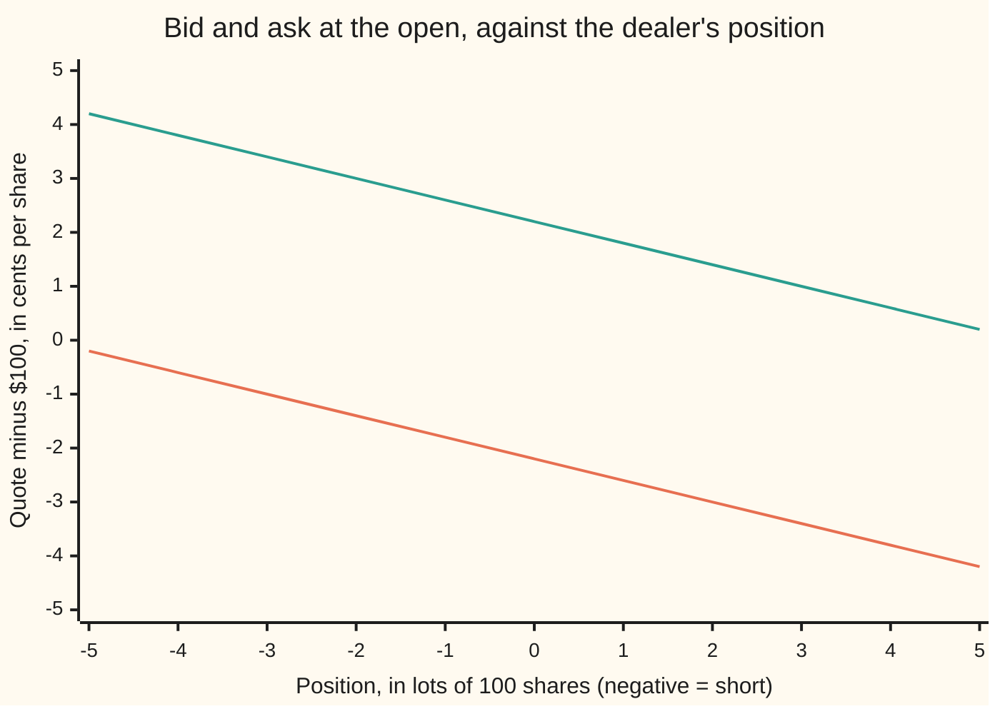
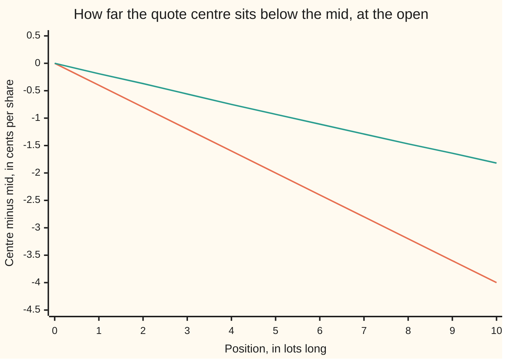
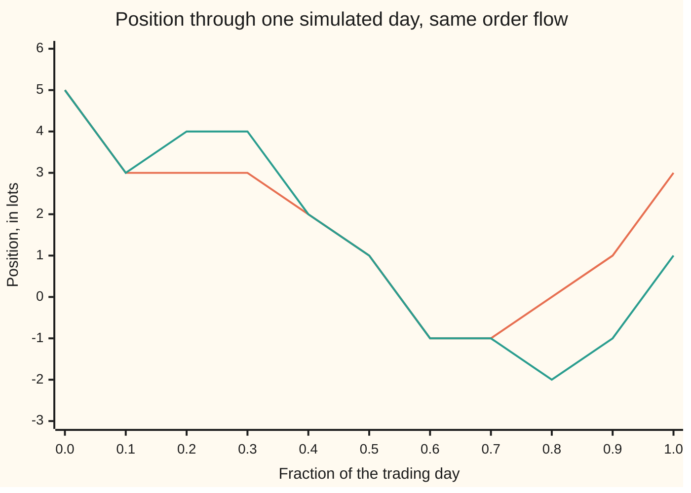

# Market making: quoting both sides, skewing for inventory

Financial mathematics → Microstructure and Execution → Dealer inventory risk → Market making

---

## General Overview

A dealer in Acme shares stands ready to trade all day. At every moment it shows two prices on the screen: a **bid**, the price at which it will buy, and a higher **ask**, the price at which it will sell. The gap between them is the **spread**. One customer buying and another selling leave the dealer with the spread as income and no shares.

The trouble is that customers do not arrive in tidy pairs. At the open Acme's mid-price, halfway between the best bid and ask in the market, is $100.00 a share, and the dealer is already **long 500 shares**: it owns them, bought from sellers earlier. If Acme falls before those shares are sold, the dealer loses on every one of them, and a small fall costs more than a day of spreads. Holding shares is a risk the dealer did not set out to take.

The fix is to move both quotes down. With the numbers used on this card, a dealer holding nothing quotes $99.9780 to buy and $100.0220 to sell. Long 500 shares, it quotes $99.9580 and $100.0020. The lower ask draws buyers, who take shares off its hands. The lower bid puts off sellers, who would add to the pile. Both quotes shift by the same 2.00 cents; the spread stays the same width. Shading both quotes one way to shed a position is called **skewing**, and the price the pair is centred on is the dealer's **reservation price**: what one more share is worth to this dealer, holding what it holds.

Marco Avellaneda and Sasha Stoikov turned this into two formulas in 2008: one for where the centre goes, one for how wide the spread should be.

**A dealer's quotes centre on a reservation price that sits below the mid when it is long, by an amount that grows with the position, the price's jumpiness and the time left, and the spread around it balances the margin earned on each trade against the trades lost by quoting wider.**

**What kind of fact this is:** a model: it assumes how prices move and how orders arrive, a useful description, not a law. Inside the model the reservation price is a theorem, proved on this card in Why it works; the familiar quote formulas are an approximation, and this card measures its error against the full solution.

### The picture: where the quotes sit, position by position



The lower line is the bid, the upper the ask. Flat, they sit 2.20 cents either side of the mid. Each lot long pushes both down 0.40 cents. Long 5 lots, the ask is 0.20 cents above the mid, so it is hit often, and the bid 4.20 cents below, so it is hit rarely.

---

## The formula

Three notes on notation. Here $r$ is a price and $q$ a position, not the house market's interest rate and dividend yield. A small letter written high after a symbol is a label here, not a power: $\delta^a$ is "the distance for the ask" and $\delta^b$ "the distance for the bid". And $\ln$ is the natural logarithm. Prices are per **lot** of 100 shares, since the dealer trades a lot at a time: $10,000 a lot is $100.00 a share, and a dollar a lot is a cent a share. Time runs in trading days, not years, since the dealer's horizon is the close.

$$r = S - q\,\gamma\,\sigma^2\,\tau \qquad\qquad w = \gamma\,\sigma^2\,\tau + \frac{2}{\gamma}\ln\!\Big(1 + \frac{\gamma}{k}\Big)$$

$$\text{bid} = r - \tfrac12 w, \qquad \text{ask} = r + \tfrac12 w$$

**Read it aloud:** centre the quotes on the mid, moved against the position by the risk of carrying it to the close; make the spread the risk of one lot plus twice the price of being filled less often.

| Symbol | Plain meaning | In our example | Push it up and the quotes… |
| --- | --- | --- | --- |
| $S$ | the mid-price of one lot of 100 shares | $10,000 | both rise one for one |
| $q$, $X$, $W$ | the position in lots (positive = long); the dealer's cash, and its wealth, in dollars | 5 lots | both fall, 0.40 a lot per lot at the open |
| $\gamma$ | risk aversion: how much the dealer dislikes an uncertain dollar, per dollar. Say "gamma". | 0.001 | skew further and widen |
| $\sigma$ | volatility of the mid: dollars per lot per square root of a day | $20 | skew further and widen, as its square |
| $T$, $t$, $\tau$ | the close, now, and time left $\tau = T - t$, in days | 1, 0, 1 | skew further and widen |
| $A$, $k$, $\lambda$ | fill rate $\lambda = A e^{-k\delta}$: $A$ fills a day at the mid, falling by a factor e for every $1/k$ dollars of distance | 30 a day; 0.5 per dollar | $A$ leaves the closed form alone; larger $k$ narrows the spread |
| $\delta^a$, $\delta^b$ | how far the ask sits above the mid, and the bid below | $0.198003, $4.198003 | — |
| $r$, $r^a$, $r^b$ | reservation centre; least the dealer takes to sell a lot, most it pays to buy one | $9,998.00; $9,998.20, $9,997.80 | — |
| $w$ | the full spread, ask minus bid | $4.396005 | — |
| $c$ | the **concession**: what each side gives up for being hit less often, $\ln(1+\gamma/k)/\gamma$ | $1.998003 | — |
| $h_q$, $v_q$ | the dollar value of the future, beyond marking the position at the mid; $v_q = e^{k h_q}$ | used in the full solve | — |
| $\alpha$, $\eta$ | the two constants of the full solve: $\alpha = k\gamma\sigma^2/2$, $\eta = A(1+\gamma/k)^{-(1+k/\gamma)}$ | set by the inputs above | — |

The spread has two halves: $\gamma\sigma^2\tau$, the risk one extra lot adds, and $2c$, the markup. For small $\gamma$, $c$ is close to $1/k$.

### When it holds

- **The mid wanders with no drift and a fixed jumpiness.** Over time left $\tau$ it moves by a bell-curve amount of spread $\sigma\sqrt{\tau}$. If volatility doubles and the dealer keeps yesterday's $\sigma$, it skews a quarter as much as it should.
- **Orders arrive at random, at a rate that falls exponentially with distance, and tell nothing about the price.** If customers who hit the bid know the price is about to fall, fills lose money on average: adverse selection, the subject of [bid-ask-spread-and-adverse-selection](02-bid-ask-spread-and-adverse-selection.md), and this model leaves it out.
- **Whatever is left at the close is valued at the mid, free.** With $\tau$ near zero the skew fades, so the dealer stops pushing its position to zero just when a real desk would push hardest. The simulated day below ends 3 lots long for that reason.
- **The dealer's dislike of risk is exponential.** That makes cash drop out of the quotes; other preferences do not.
- **The closed form is an approximation.** It prices the position as though it were frozen until the close. At 5 lots long it skews the centre 2.00 cents; the full solution skews it 0.93 cents.

---

## Why it works

### Step 0: two questions, answered one at a time

Where to centre the quotes is a question about **risk**: how much worse off the dealer is for holding the position. How wide to quote is a question about **trade**: a quote further from the mid earns more when hit and is hit less often. The first is answered with a certainty equivalent (a sure amount of money the dealer rates as equal to a risky one), the second with a one-line maximisation.

### Step 1: what the position costs to carry

Freeze the position: the dealer holds $q$ lots, posts no quotes, and marks them at the mid at the close. The mid then is $S + \sigma\sqrt{\tau}\,Z$, where $Z$ is a standard bell-curve draw. A dealer with exponential dislike of risk rates this gamble as worth, for certain,

$$qS - \tfrac12\,\gamma\,q^2\sigma^2\tau .$$

The first term is the position at today's mid. The second is the discount for risk. It grows with the **square** of the position, because the swing in the position's value is $q$ times the swing in price, and risk is measured in squared dollars.

<details>
<summary>The algebra behind this</summary>

Exponential utility scores wealth $W$ as $-e^{-\gamma W}$. The certainty equivalent is the sure amount with the same score: $-\tfrac1\gamma \ln \mathbb{E}\big[e^{-\gamma W}\big]$. Here $W = q(S + \sigma\sqrt\tau Z)$. For a standard bell-curve draw, completing the square in the integral gives $\mathbb{E}[e^{bZ}] = e^{b^2/2}$ for any number b. With $b = -\gamma q \sigma\sqrt\tau$:
$$-\tfrac1\gamma \ln\Big(e^{-\gamma q S}\, e^{\gamma^2 q^2\sigma^2\tau/2}\Big) = qS - \tfrac12\gamma q^2\sigma^2\tau .$$
The code checks this by adding up thin slices of the bell curve instead (Simpson's rule), never using the formula.

</details>

### Step 2: the reservation prices are differences of that cost

The most the dealer would pay for one more lot is what the extra lot adds to the certainty equivalent. The least it would take to part with one is what losing it removes:

$$r^b = S - \gamma\sigma^2\tau\,(q + \tfrac12), \qquad r^a = S - \gamma\sigma^2\tau\,(q - \tfrac12).$$

At 5 lots and a full day, $\gamma\sigma^2\tau = 0.001 \times 20^2 \times 1 = 0.40$, so $r^b = \$9{,}997.80$ and $r^a = \$9{,}998.20$. Their midpoint is the reservation centre, $r = S - q\gamma\sigma^2\tau = \$9{,}998.00$, 2.00 cents a share under the mid. Their gap, 0.40, is the risk of one lot. Both follow from Step 1 by subtraction: the quadratic term's differences are $(q+1)^2 - q^2 = 2q + 1$ and $q^2 - (q-1)^2 = 2q - 1$.

Quoting exactly at $r^b$ and $r^a$ would leave the dealer indifferent to every fill: no profit.

### Step 3: how far out to quote, one side at a time

Now let fills happen. A quote at distance $\delta$ from the mid is hit at rate $\lambda = A e^{-k\delta}$ fills a day. Each hit on the ask sells a lot for $S + \delta$ and moves the position to $q - 1$. Choosing both distances at every moment to make the close as good as possible is a stochastic control problem. Its value obeys a Hamilton–Jacobi–Bellman equation, the HJB of [stochastic-control-and-the-hjb-equation](../../11-Stochastic%20processes%20and%20calculus/09-Beyond%20Brownian/03-stochastic-control-and-the-hjb-equation.md): drift in time, plus the price's wiggle, plus the best expected gain from each side's fills, adds to zero.

Write the dealer's value as marked wealth $X + qS$ plus an adjustment $h_q$ that depends on the position and the time left. Let $d$ be how much a fill on the side in question changes that adjustment. For the ask, $d = h_{q-1} - h_q$. The side's contribution to the equation is, per unit of time,

$$\frac{A}{\gamma}\,e^{-k\delta}\,\Big(1 - e^{-\gamma(\delta + d)}\Big).$$

The first factor is how often the side is hit. The second is how much each hit is worth, in the dealer's units of utility. Push $\delta$ out and the second grows while the first shrinks. Setting the slope to zero gives one answer, the only maximum:

$$\delta^* = c - d, \qquad c = \frac1\gamma \ln\Big(1 + \frac\gamma k\Big) = \$1.998003 \text{ a lot}.$$

The concession $c$ is the same on both sides and does not depend on the position. Everything about the position enters through $d$.

<details>
<summary>Detailed proof: the HJB, the adjustment, and the unique best distance</summary>

The value $u(t, S, X, q)$ of the best quoting policy satisfies
$$0 = \partial_t u + \tfrac12\sigma^2\partial_{SS}u + \max_{\delta^a} \lambda(\delta^a)\,\big[u(X + S + \delta^a, q - 1) - u\big] + \max_{\delta^b} \lambda(\delta^b)\,\big[u(X - S + \delta^b, q + 1) - u\big],$$
with $u = -e^{-\gamma(X + qS)}$ at the close. Try $u = -e^{-\gamma(X + qS + h_q(t))}$ with $h_q = 0$ at the close. Then $\partial_t u = -\gamma h_q' u$, $\partial_{SS}u = \gamma^2 q^2 u$, and after an ask fill $u$ becomes $u\,e^{-\gamma(\delta^a + h_{q-1} - h_q)}$. Divide the equation by $-\gamma u$, which is positive:
$$0 = h_q' - \tfrac12\gamma\sigma^2 q^2 + \max_{\delta}\,\tfrac{A}{\gamma}e^{-k\delta}\big(1 - e^{-\gamma(\delta + h_{q-1} - h_q)}\big) + \max_{\delta}\,\tfrac{A}{\gamma}e^{-k\delta}\big(1 - e^{-\gamma(\delta + h_{q+1} - h_q)}\big).$$
The price $S$ has dropped out, so the adjustment depends only on position and time. For one side, the slope of $\tfrac{A}{\gamma}e^{-k\delta}(1 - e^{-\gamma(\delta+d)})$ in $\delta$ is $\tfrac{A}{\gamma}e^{-k\delta}\big[(k + \gamma)e^{-\gamma(\delta + d)} - k\big]$. The bracket falls steadily from very large to $-k$ as $\delta$ grows, so it crosses zero exactly once, where $e^{-\gamma(\delta+d)} = k/(k+\gamma)$: that is $\delta = c - d$. Left of it the slope is positive, right of it negative, so it is the one global maximum. The value there is $\tfrac{A}{k+\gamma}(1 + \gamma/k)^{-k/\gamma}\,e^{kd}$.

</details>

### Step 4: the closed form, by pricing the future as frozen

The best distances need $h_q$, and $h_q$ comes from solving the whole equation. Avellaneda and Stoikov approximate it: they expand the solution in the position to second order, linearise the fill terms, and keep the leading terms. The result is the frozen-inventory cost of Step 1,

$$h_q \approx -\tfrac12\gamma\sigma^2 q^2\tau.$$

Put it into Step 3. For the ask, $d = h_{q-1} - h_q = \gamma\sigma^2\tau(q - \tfrac12)$, so the ask sits at $S + c - \gamma\sigma^2\tau(q - \tfrac12) = r^a + c$. For the bid, the same algebra gives $r^b - c$. So:

**Each quote is its reservation price, moved outward by the concession.** The centre is $r$. The spread is $r^a - r^b + 2c = \gamma\sigma^2\tau + 2c$. That is the formula.

At the open, long 5 lots, the ask is $9,998.20 plus $1.998003, which puts it $0.198003 above the mid. The bid is $9,997.80 minus $1.998003, $4.198003 below the mid. Per share, $100.0020 and $99.9580.

### Step 5: how good the approximation is

The frozen-inventory cost ignores that future fills let the dealer shed the position, so the full solution should skew less.

It can be computed. Setting $v_q = e^{k h_q}$ turns the HJB of Step 3 into a set of linear equations, one per position, which the code steps backward from the close. The exact distances are then $\delta^a = c + \tfrac1k \ln(v_q / v_{q-1})$ and $\delta^b = c + \tfrac1k\ln(v_q/v_{q+1})$.



The steeper line is the closed form, 0.40 cents per lot. The shallower line is the full solution, a little under 0.19 cents per lot. At 5 lots the full solution puts the ask $1.159193 above the mid and the bid $3.019775 below: a centre 0.93 cents under the mid and a spread of $4.178968 a lot, against the closed form's 2.00 cents and $4.396005. The closed form over-skews by about a factor of two here and quotes slightly too wide. Its shape, close to a straight line in the position, is right.

Two checks that the solver is sound. Switch the fills off, $A$ near zero, and it must price the position as frozen: it returns $0.198003 and $4.198003, the closed form's distances to six decimals. With fills on, golden-section search on the solved $h_q$ returns the same distances, and the solved $h_q$ satisfies the HJB to six decimals.

<details>
<summary>Detailed proof: the linear equations behind the full solve</summary>

At the best distances each side contributes $\tfrac{A}{k+\gamma}(1+\gamma/k)^{-k/\gamma}e^{kd}$ (Step 3). Measure time backward from the close, so $\tau$ grows. The equation for $h_q$ becomes
$$\frac{dh_q}{d\tau} = -\tfrac12\gamma\sigma^2q^2 + \tfrac{\eta}{k}\Big(e^{k(h_{q-1}-h_q)} + e^{k(h_{q+1}-h_q)}\Big).$$
Multiply by $k\,v_q$ with $v_q = e^{kh_q}$: the exponentials become ratios of neighbouring $v_q$ and the equation turns linear:
$$\frac{dv_q}{d\tau} = -\alpha q^2 v_q + \eta\,(v_{q-1} + v_{q+1}), \qquad v_q = 1 \text{ at the close}.$$
This is linear, so it has one solution for each starting point. The code keeps positions from −30 to 30 lots (a fill that would cross the edge is not allowed) and steps it with the fourth-order Runge–Kutta method, 2,000 steps over the day. Guéant, Lehalle and Fernandez-Tapia found this change of variable and solved the capped problem exactly.

</details>

---

## Worked numbers, by hand

Long 5 lots at the open: $S = 10{,}000$, $q = 5$, $\gamma = 0.001$, $\sigma = 20$, $\tau = 1$, $k = 0.5$.

| Step | Arithmetic | Value |
| --- | --- | --- |
| risk of one lot to the close, $\gamma\sigma^2\tau$ | $0.001 \times 20^2 \times 1$ | 0.40 |
| skew, $q\gamma\sigma^2\tau$ | $5 \times 0.40$ | $2.00 a lot |
| reservation centre, $r$ | $10{,}000 - 2.00$ | $9,998.00 |
| concession, $c$ | $\ln(1.002)/0.001$ | $1.998003 |
| spread, $w$ | $0.40 + 2 \times 1.998003$ | $4.396005 |
| ask above the mid, $r^a + c - S$ | $9{,}998.20 + 1.998003 - 10{,}000$ | $0.198003 |
| bid below the mid, $S - (r^b - c)$ | $10{,}000 - 9{,}997.80 + 1.998003$ | $4.198003 |
| **per share** | $(10{,}000 - 4.198003)/100$ and $(10{,}000 + 0.198003)/100$ | **$99.9580 bid, $100.0020 ask** |
| fills a day at those distances | $30e^{-0.5 \times 0.198}$ and $30e^{-0.5 \times 4.198}$ | 27.17 on the ask, 3.68 on the bid |

The dealer expects to sell about seven times as often as it buys while the position lasts, and each fill still earns the concession $c$ beyond its reservation price.

### What breaks if you drop a piece

Same dealer, 5 lots long at the open; the right centre is $99.9800 a share.

| Mistake | Centre comes out at | What went wrong |
| --- | --- | --- |
| Skew added instead of subtracted | $100.0200 | Quotes go up: the dealer sells less and buys more, growing the position it wanted to shed |
| $\sigma$ in place of $\sigma^2$ | $99.9990 | Risk is measured in squared dollars; with $\sigma = 20$ the skew shrinks twentyfold |
| Time left stuck at 1 when 0.1 of the day remains | $99.9800 (right: $99.9980) | The risk of carrying a lot to the close shrinks as the close nears |
| Quoting at the reservation prices themselves | bid $9,997.80, ask $9,998.20 a lot | A spread of 0.40 only pays for the risk; the concession $c$ is the margin |

---

## How the quotes move through a day

Nothing trades, the mid stays at $100.00, and by the afternoon the long dealer's quotes have climbed back toward it. The clock did that: less time left, less risk in carrying the position.

| Time left | Long 5 lots: bid, ask | Flat: bid, ask |
| --- | --- | --- |
| full day | $99.9580, $100.0020 | $99.9780, $100.0220 |
| half a day | $99.9690, $100.0110 | $99.9790, $100.0210 |
| a tenth of a day | $99.9778, $100.0182 | $99.9798, $100.0202 |

Both spreads narrow toward the concession alone, $2c$, as the risk half shrinks.

### One simulated day

The code runs a day of 1,000 steps. In each step the ask is hit with probability $\lambda(\delta^a)$ times the step length, the bid likewise, and then the mid takes a bell-curve step of size $\sigma$ times the square root of the step length. Two dealers see the same random numbers: one skews, one centres its quotes on the mid with the same spread.



The first line is the skewing dealer, the second the centred one. The skewing dealer sells two lots in the first tenth of the day and is short six-tenths of the way through. Late in the day its skew is small, and it drifts back to 3 lots long at the close: the fading skew of "When it holds", seen in one path. Marked at the closing mid, it made $51.81 and the centred dealer $38.18.

One day proves little. Over 400 simulated days:

| Dealer | Mean profit | Spread of profit (standard deviation) | Mean position at the close, either side |
| --- | --- | --- | --- |
| skews for inventory | $40.18 | $57.64 | 2.50 lots |
| centres on the mid | $37.99 | $110.86 | 5.04 lots |

The skewing dealer earns about the same and carries half the risk. That is the point of the model.

---

## Code, from first principles, and it actually runs

Three roads to the quotes. Road 1 is the closed form. Road 2 prices the frozen position by adding up thin slices of the bell curve, and finds each side's best distance by golden-section search, a bracketing search that never uses the slope. Road 3 solves the full HJB backward from the close; with fills switched off it must land on the closed form, and with them on it must satisfy the HJB. Then two dealers trade 400 simulated days on the same random numbers, from a written-out generator shared by both languages, so the days agree to the cent.

### Python

```python
# Market making, Avellaneda-Stoikov -- the check behind the card.  Standard library only.
# Units: one lot = 100 shares; prices, sigma, distances in dollars per lot; time in trading days;
# gamma per dollar.  The normal average, maximiser, ODE solver and random numbers are written here.
from math import exp, log, sqrt, cos, pi

S0, SIG, GAM, K, A, Q0, T = 10000.0, 20.0, 0.001, 0.5, 30.0, 5, 1.0
STEPS, QCAP, QM = 1000, 10, 30               # time steps a day, inventory cap, exact-solve range

def conc(g, k): return log(1.0 + g / k) / g  # c: the price of being filled less often

def quotes(s, q, tau, g=GAM, sig=SIG, k=K, skew=True):   # road 1: the closed form
    risk = g * sig * sig * tau
    r = s - q * risk if skew else s          # reservation centre
    w = risk + 2.0 * conc(g, k)              # full spread
    return r - w / 2, r + w / 2, r, w

def cert_equiv(q, tau):                      # road 2: frozen inventory, averaged over the bell curve
    f = lambda z: exp(-GAM * q * SIG * sqrt(tau) * z - z * z / 2) / sqrt(2 * pi)
    n, a, b = 4000, -12.0, 12.0
    h = (b - a) / n
    m = (f(a) + f(b) + sum((4 if i % 2 else 2) * f(a + i * h) for i in range(1, n))) * h / 3
    return q * S0 - log(m) / GAM             # dollars for sure that the dealer rates as equal

def gain(delta, d, a=A):                     # expected utility gain rate from one side
    return a / GAM * exp(-K * delta) * (1.0 - exp(-GAM * (delta + d)))

def golden_max(f, lo, hi):                   # road 2 to the best distance: golden-section search
    g = (sqrt(5.0) - 1.0) / 2.0
    for _ in range(120):
        x1, x2 = hi - g * (hi - lo), lo + g * (hi - lo)
        if f(x1) < f(x2): lo = x1
        else: hi = x2
    return (lo + hi) / 2

def exact_v(tau, a=A, n=2000):               # road 3: full HJB, linear after v = e^{k h}; RK4
    eta = a * (1 + GAM / K) ** -(1 + K / GAM)
    alf = K * GAM * SIG * SIG / 2
    qs = range(-QM, QM + 1)
    def rhs(v):
        return [-alf * q * q * v[i] + eta * ((v[i - 1] if i > 0 else 0.0) + (v[i + 1] if i < 2 * QM else 0.0))
                for i, q in enumerate(qs)]
    v, h = [1.0] * (2 * QM + 1), tau / n
    for _ in range(n):
        k1 = rhs(v); k2 = rhs([x + h / 2 * y for x, y in zip(v, k1)])
        k3 = rhs([x + h / 2 * y for x, y in zip(v, k2)]); k4 = rhs([x + h * y for x, y in zip(v, k3)])
        v = [x + h / 6 * (p + 2 * r + 2 * s + t) for x, p, r, s, t in zip(v, k1, k2, k3, k4)]
    return v

def exact_quotes(v, q):                      # distances from mid: ask, bid
    i = q + QM
    return conc(GAM, K) + log(v[i] / v[i - 1]) / K, conc(GAM, K) + log(v[i] / v[i + 1]) / K

class Lcg:                                   # 32-bit linear congruential generator
    def __init__(self, seed): self.state = seed
    def uniform(self):
        self.state = (1664525 * self.state + 1013904223) & 0xFFFFFFFF
        return (self.state + 0.5) / 4294967296.0
    def normal(self):                        # Box-Muller
        u1, u2 = self.uniform(), self.uniform()
        return sqrt(-2.0 * log(u1)) * cos(2.0 * pi * u2)

def day(seed, skew):                         # one day: at most one fill per step, then the mid moves
    rng, s, q, cash, path, dt = Lcg(seed), S0, Q0, 0.0, [], T / STEPS
    for i in range(STEPS):
        if i % 100 == 0: path.append(q)
        bid, ask, _, _ = quotes(s, q, T - i * dt, skew=skew)
        ra = A * exp(-K * (ask - s)) if q > -QCAP else 0.0
        rb = A * exp(-K * (s - bid)) if q < QCAP else 0.0
        u = rng.uniform()
        if u < ra * dt: cash += ask; q -= 1
        elif u < (ra + rb) * dt: cash -= bid; q += 1
        s += SIG * sqrt(dt) * rng.normal()
    path.append(q)
    return cash + q * s - Q0 * S0, q, path

def show(label, *vals, fmt="{:.6f}"): print(f"{label:<48}" + "  ".join(fmt.format(v) for v in vals))

bid, ask, r, w = quotes(S0, Q0, T)
rb_q = cert_equiv(Q0 + 1, T) - cert_equiv(Q0, T)      # most the dealer pays for one more lot
ra_q = cert_equiv(Q0, T) - cert_equiv(Q0 - 1, T)      # least the dealer takes for one lot fewer
risk = GAM * SIG * SIG * T
da_g = golden_max(lambda x: gain(x, risk * (Q0 - 0.5)), -50.0, 50.0)
db_g = golden_max(lambda x: gain(x, -risk * (Q0 + 0.5)), -50.0, 50.0)
v_full, v_none = exact_v(T), exact_v(T, a=1e-9)       # with fills, and with none at all
(ea, eb), (ta, tb) = exact_quotes(v_full, Q0), exact_quotes(v_none, Q0)
hs = [[log(x) / K for x in v] for v in (exact_v(T - 1e-3), v_full, exact_v(T + 1e-3))]   # h_q = ln(v_q)/k
i5 = Q0 + QM; da_x, db_x = [golden_max(lambda x: gain(x, hs[1][j] - hs[1][i5]), -50.0, 50.0) for j in (i5 - 1, i5 + 1)]
hjb = -GAM * SIG * SIG * Q0 * Q0 / 2 + gain(da_x, hs[1][i5 - 1] - hs[1][i5]) + gain(db_x, hs[1][i5 + 1] - hs[1][i5])
show("concession c = ln(1 + gamma/k)/gamma", conc(GAM, K))
show("risk per lot gamma sigma^2 T", risk)
show("1 closed form: centre r = S - q gamma sigma^2 T", r)
show("2 bell-curve average: reservation bid, ask", rb_q, ra_q)
show("2 bell-curve average: centre, gap", (rb_q + ra_q) / 2, ra_q - rb_q)
show("spread w = gamma sigma^2 T + 2c", w)
show("quotes per share, long 5 lots: bid, ask", bid / 100, ask / 100, fmt="{:.4f}")
fb, fa, _, _ = quotes(S0, 0, T)
show("quotes per share, flat: bid, ask", fb / 100, fa / 100, fmt="{:.4f}")
show("ask distance: closed form, golden search", ask - S0, da_g)
show("bid distance: closed form, golden search", S0 - bid, db_g)
show("fills per day at those distances: ask, bid", A * exp(-K * (ask - S0)), A * exp(-K * (S0 - bid)), fmt="{:.2f}")
show("3 full HJB solve: ask distance, bid distance", ea, eb)
show("3 full HJB: centre shift, spread", (ea - eb) / 2, ea + eb)
show("3 full HJB with no fills: ask, bid distance", ta, tb)
show("3 golden search on solved h: ask, bid distance", da_x, db_x)
show("3 dh/dtau: finite difference, HJB right side", (hs[2][i5] - hs[0][i5]) / 2e-3, hjb)
cents = lambda x: x - S0                     # dollars per lot from $10,000 = cents per share from $100
line = lambda name, xs, f="6.2f": print(f"{name:<32}" + " ".join(format(x, f) for x in xs))
line("chart, inventory q (lots)", range(-5, 6), "6d")
line("chart, bid, cents from $100", [cents(quotes(S0, q, T)[0]) for q in range(-5, 6)])
line("chart, ask, cents from $100", [cents(quotes(S0, q, T)[1]) for q in range(-5, 6)])
line("chart, inventory q (lots)", range(0, 11), "6d")
line("chart, closed-form centre shift", [cents(quotes(S0, q, T)[2]) for q in range(0, 11)])
line("chart, full-HJB centre shift", [(lambda a, b: (a - b) / 2)(*exact_quotes(v_full, q)) for q in range(0, 11)])
for tau in (1.0, 0.5, 0.1):
    b5, a5, _, _ = quotes(S0, 5, tau); b0, a0, _, _ = quotes(S0, 0, tau)
    show(f"time left {tau:.1f}: long bid, ask; flat bid, ask", b5 / 100, a5 / 100, b0 / 100, a0 / 100, fmt="{:.4f}")
for name, cen in (("wrong: skew added, not subtracted", S0 + Q0 * risk), ("wrong: sigma for sigma^2", S0 - Q0 * GAM * SIG),
                  ("wrong: tau left at 1 when 0.1 remains", S0 - Q0 * risk), ("  right at tau = 0.1", quotes(S0, Q0, 0.1)[2])):
    show(name + ", centre", cen / 100, fmt="{:.4f}")
(pnl_s, _, path_s), (pnl_m, _, path_m) = day(20260928, True), day(20260928, False)
line("story, fraction of the day", [i / 10 for i in range(11)])
line("story, lots, skewed quotes", path_s, "6d")
line("story, lots, centred quotes", path_m, "6d")
show("story P&L: skewed, centred", pnl_s, pnl_m, fmt="{:.2f}")
stats = {}
for skew in (True, False):
    runs = [day(1000 + j, skew) for j in range(400)]
    mean = sum(p for p, _, _ in runs) / 400
    sd = sqrt(sum((p - mean) ** 2 for p, _, _ in runs) / 399)
    stats[skew] = (mean, sd, sum(abs(q) for _, q, _ in runs) / 400)
    show(("400 days skewed" if skew else "400 days centred") + ": mean P&L, sd, mean |q| end", *stats[skew], fmt="{:.2f}")
show("try: gamma 0.002: centre, spread per share", quotes(S0, Q0, T, g=0.002)[2] / 100, quotes(S0, Q0, T, g=0.002)[3] / 100, fmt="{:.4f}")
show("try: k 0.25: spread per share", quotes(S0, Q0, T, k=0.25)[3] / 100, fmt="{:.4f}")
show("try: sigma 40: centre, spread per share", quotes(S0, Q0, T, sig=40.0)[2] / 100, quotes(S0, Q0, T, sig=40.0)[3] / 100, fmt="{:.4f}")
assert abs((rb_q + ra_q) / 2 - r) < 1e-6 and abs(ra_q - rb_q - risk) < 1e-6, "quadrature vs closed form"
assert abs(da_g - (ask - S0)) < 1e-5 and abs(db_g - (S0 - bid)) < 1e-5, "golden search vs c - d"
assert abs(ta - (ask - S0)) < 1e-6 and abs(tb - (S0 - bid)) < 1e-6, "HJB with no fills = frozen inventory"
assert abs(da_x - ea) < 1e-5 and abs(db_x - eb) < 1e-5 and abs((hs[2][i5] - hs[0][i5]) / 2e-3 - hjb) < 1e-4, "full solve satisfies the HJB"
assert stats[True][1] < stats[False][1] and stats[True][2] < stats[False][2], "skew cuts risk and inventory"
print("ALL CHECKS PASS")
```

**Ran 2026-09-28 on macOS, Python 3.14.6, standard library only. All checks passed. Output, pasted from the run:**

```
concession c = ln(1 + gamma/k)/gamma            1.998003
risk per lot gamma sigma^2 T                    0.400000
1 closed form: centre r = S - q gamma sigma^2 T 9998.000000
2 bell-curve average: reservation bid, ask      9997.800000  9998.200000
2 bell-curve average: centre, gap               9998.000000  0.400000
spread w = gamma sigma^2 T + 2c                 4.396005
quotes per share, long 5 lots: bid, ask         99.9580  100.0020
quotes per share, flat: bid, ask                99.9780  100.0220
ask distance: closed form, golden search        0.198003  0.198002
bid distance: closed form, golden search        4.198003  4.198003
fills per day at those distances: ask, bid      27.17  3.68
3 full HJB solve: ask distance, bid distance    1.159193  3.019775
3 full HJB: centre shift, spread                -0.930291  4.178968
3 full HJB with no fills: ask, bid distance     0.198003  4.198003
3 golden search on solved h: ask, bid distance  1.159193  3.019775
3 dh/dtau: finite difference, HJB right side    41.770016  41.770016
chart, inventory q (lots)           -5     -4     -3     -2     -1      0      1      2      3      4      5
chart, bid, cents from $100      -0.20  -0.60  -1.00  -1.40  -1.80  -2.20  -2.60  -3.00  -3.40  -3.80  -4.20
chart, ask, cents from $100       4.20   3.80   3.40   3.00   2.60   2.20   1.80   1.40   1.00   0.60   0.20
chart, inventory q (lots)            0      1      2      3      4      5      6      7      8      9     10
chart, closed-form centre shift   0.00  -0.40  -0.80  -1.20  -1.60  -2.00  -2.40  -2.80  -3.20  -3.60  -4.00
chart, full-HJB centre shift      0.00  -0.19  -0.37  -0.56  -0.75  -0.93  -1.11  -1.29  -1.47  -1.64  -1.82
time left 1.0: long bid, ask; flat bid, ask     99.9580  100.0020  99.9780  100.0220
time left 0.5: long bid, ask; flat bid, ask     99.9690  100.0110  99.9790  100.0210
time left 0.1: long bid, ask; flat bid, ask     99.9778  100.0182  99.9798  100.0202
wrong: skew added, not subtracted, centre       100.0200
wrong: sigma for sigma^2, centre                99.9990
wrong: tau left at 1 when 0.1 remains, centre   99.9800
  right at tau = 0.1, centre                    99.9980
story, fraction of the day        0.00   0.10   0.20   0.30   0.40   0.50   0.60   0.70   0.80   0.90   1.00
story, lots, skewed quotes           5      3      3      3      2      1     -1     -1      0      1      3
story, lots, centred quotes          5      3      4      4      2      1     -1     -1     -2     -1      1
story P&L: skewed, centred                      51.81  38.18
400 days skewed: mean P&L, sd, mean |q| end     40.18  57.64  2.50
400 days centred: mean P&L, sd, mean |q| end    37.99  110.86  5.04
try: gamma 0.002: centre, spread per share      99.9600  0.0479
try: k 0.25: spread per share                   0.0838
try: sigma 40: centre, spread per share         99.9200  0.0560
ALL CHECKS PASS
```

### Rust

Same roads, same seeds, same labels, built with `rustc --edition 2021 -O`.

```rust
// Market making, Avellaneda-Stoikov -- the same check as the Python, in Rust.  No crates.
// Units: one lot = 100 shares; prices, sigma, distances in dollars per lot; time in trading days;
// gamma per dollar.  The normal average, maximiser, ODE solver and random numbers are written here.
use std::f64::consts::PI;

const S0: f64 = 10000.0; const SIG: f64 = 20.0; const GAM: f64 = 0.001; const K: f64 = 0.5;
const A: f64 = 30.0; const Q0: i32 = 5; const T: f64 = 1.0; const STEPS: usize = 1000; const QCAP: i32 = 10; const QM: i32 = 30;

fn conc(g: f64, k: f64) -> f64 { (1.0 + g / k).ln() / g }        // c: the price of being filled less often

fn quotes(s: f64, q: i32, tau: f64, g: f64, sig: f64, k: f64, skew: bool) -> (f64, f64, f64, f64) {
    let risk = g * sig * sig * tau;                                  // road 1: the closed form
    let r = if skew { s - q as f64 * risk } else { s };             // reservation centre
    let w = risk + 2.0 * conc(g, k);                                 // full spread
    (r - w / 2.0, r + w / 2.0, r, w)
}
fn qt(q: i32, tau: f64) -> (f64, f64, f64, f64) { quotes(S0, q, tau, GAM, SIG, K, true) }

fn cert_equiv(q: i32, tau: f64) -> f64 {                              // road 2: frozen inventory, bell-curve average
    let f = |z: f64| (-GAM * q as f64 * SIG * tau.sqrt() * z - z * z / 2.0).exp() / (2.0 * PI).sqrt();
    let (n, a, b, mut acc) = (4000, -12.0, 12.0, 0.0);
    let h = (b - a) / n as f64;
    for i in 1..n { acc += if i % 2 == 1 { 4.0 } else { 2.0 } * f(a + i as f64 * h); }
    let m = (f(a) + f(b) + acc) * h / 3.0;
    q as f64 * S0 - m.ln() / GAM
}

fn gain(delta: f64, d: f64) -> f64 { A / GAM * (-K * delta).exp() * (1.0 - (-GAM * (delta + d)).exp()) }
fn golden_max<F: Fn(f64) -> f64>(f: F, mut lo: f64, mut hi: f64) -> f64 {   // road 2 to the best distance
    let g = (5.0_f64.sqrt() - 1.0) / 2.0;
    for _ in 0..120 {
        let (x1, x2) = (hi - g * (hi - lo), lo + g * (hi - lo));
        if f(x1) < f(x2) { lo = x1 } else { hi = x2 }
    }
    (lo + hi) / 2.0
}

fn exact_v(tau: f64, a: f64) -> Vec<f64> {                           // road 3: full HJB, linear after v = e^{k h}; RK4
    let eta = a * (1.0 + GAM / K).powf(-(1.0 + K / GAM));
    let alf = K * GAM * SIG * SIG / 2.0;
    let m = (2 * QM + 1) as usize;
    let rhs = |v: &Vec<f64>| -> Vec<f64> {
        (0..m).map(|i| {
            let q = i as f64 - QM as f64;
            let (lo, hi) = (if i > 0 { v[i - 1] } else { 0.0 }, if i < m - 1 { v[i + 1] } else { 0.0 });
            -alf * q * q * v[i] + eta * (lo + hi)
        }).collect()
    };
    let (n, mut v) = (2000, vec![1.0; m]);
    let h = tau / n as f64;
    let step = |v: &Vec<f64>, k: &Vec<f64>, c: f64| -> Vec<f64> { v.iter().zip(k).map(|(x, y)| x + c * y).collect() };
    for _ in 0..n {
        let k1 = rhs(&v); let k2 = rhs(&step(&v, &k1, h / 2.0));
        let k3 = rhs(&step(&v, &k2, h / 2.0)); let k4 = rhs(&step(&v, &k3, h));
        v = (0..m).map(|i| v[i] + h / 6.0 * (k1[i] + 2.0 * k2[i] + 2.0 * k3[i] + k4[i])).collect();
    }
    v
}

fn exact_quotes(v: &[f64], q: i32) -> (f64, f64) {                   // distances from mid: ask, bid
    let i = (q + QM) as usize;
    (conc(GAM, K) + (v[i] / v[i - 1]).ln() / K, conc(GAM, K) + (v[i] / v[i + 1]).ln() / K)
}

struct Lcg { state: u64 }                                            // 32-bit linear congruential generator
impl Lcg {
    fn uniform(&mut self) -> f64 {
        self.state = (1664525 * self.state + 1013904223) & 0xFFFF_FFFF;
        (self.state as f64 + 0.5) / 4294967296.0
    }
    fn normal(&mut self) -> f64 {                                    // Box-Muller
        let (u1, u2) = (self.uniform(), self.uniform());
        (-2.0 * u1.ln()).sqrt() * (2.0 * PI * u2).cos()
    }
}

fn day(seed: u64, skew: bool) -> (f64, i32, Vec<i32>) {              // at most one fill per step, then the mid moves
    let (mut rng, mut s, mut q, mut cash, mut path) = (Lcg { state: seed }, S0, Q0, 0.0, Vec::new());
    let dt = T / STEPS as f64;
    for i in 0..STEPS {
        if i % 100 == 0 { path.push(q) }
        let (bid, ask, _, _) = quotes(s, q, T - i as f64 * dt, GAM, SIG, K, skew);
        let ra = if q > -QCAP { A * (-K * (ask - s)).exp() } else { 0.0 };
        let rb = if q < QCAP { A * (-K * (s - bid)).exp() } else { 0.0 };
        let u = rng.uniform();
        if u < ra * dt { cash += ask; q -= 1 } else if u < (ra + rb) * dt { cash -= bid; q += 1 }
        s += SIG * dt.sqrt() * rng.normal();
    }
    path.push(q);
    (cash + q as f64 * s - Q0 as f64 * S0, q, path)
}

fn show(label: &str, vals: &[f64], dp: usize) {
    let body: Vec<String> = vals.iter().map(|v| format!("{:.*}", dp, v)).collect();
    println!("{:<48}{}", label, body.join("  "));
}
fn line(name: &str, xs: &[f64]) { println!("{:<32}{}", name, xs.iter().map(|x| format!("{:6.2}", x)).collect::<Vec<_>>().join(" ")) }
fn line_i(name: &str, xs: &[i32]) { println!("{:<32}{}", name, xs.iter().map(|x| format!("{:6}", x)).collect::<Vec<_>>().join(" ")) }

fn main() {
    let (bid, ask, r, w) = qt(Q0, T);
    let rb_q = cert_equiv(Q0 + 1, T) - cert_equiv(Q0, T);           // most the dealer pays for one more lot
    let ra_q = cert_equiv(Q0, T) - cert_equiv(Q0 - 1, T);           // least the dealer takes for one lot fewer
    let risk = GAM * SIG * SIG * T;
    let da_g = golden_max(|x| gain(x, risk * (Q0 as f64 - 0.5)), -50.0, 50.0);
    let db_g = golden_max(|x| gain(x, -risk * (Q0 as f64 + 0.5)), -50.0, 50.0);
    let (v_full, v_none) = (exact_v(T, A), exact_v(T, 1e-9));      // with fills, and with none at all
    let ((ea, eb), (ta, tb)) = (exact_quotes(&v_full, Q0), exact_quotes(&v_none, Q0));
    let hs: Vec<Vec<f64>> = [exact_v(T - 1e-3, A), v_full.clone(), exact_v(T + 1e-3, A)].iter().map(|v| v.iter().map(|x| x.ln() / K).collect()).collect();
    let i5 = (Q0 + QM) as usize; let (d_a, d_b) = (hs[1][i5 - 1] - hs[1][i5], hs[1][i5 + 1] - hs[1][i5]);   // h_q = ln(v_q)/k
    let (da_x, db_x) = (golden_max(|x| gain(x, d_a), -50.0, 50.0), golden_max(|x| gain(x, d_b), -50.0, 50.0));
    let (hjb, fd) = (-GAM * SIG * SIG * (Q0 * Q0) as f64 / 2.0 + gain(da_x, d_a) + gain(db_x, d_b), (hs[2][i5] - hs[0][i5]) / 2e-3);
    show("concession c = ln(1 + gamma/k)/gamma", &[conc(GAM, K)], 6);
    show("risk per lot gamma sigma^2 T", &[risk], 6);
    show("1 closed form: centre r = S - q gamma sigma^2 T", &[r], 6);
    show("2 bell-curve average: reservation bid, ask", &[rb_q, ra_q], 6);
    show("2 bell-curve average: centre, gap", &[(rb_q + ra_q) / 2.0, ra_q - rb_q], 6);
    show("spread w = gamma sigma^2 T + 2c", &[w], 6);
    show("quotes per share, long 5 lots: bid, ask", &[bid / 100.0, ask / 100.0], 4);
    let (fb, fa, _, _) = qt(0, T);
    show("quotes per share, flat: bid, ask", &[fb / 100.0, fa / 100.0], 4);
    show("ask distance: closed form, golden search", &[ask - S0, da_g], 6);
    show("bid distance: closed form, golden search", &[S0 - bid, db_g], 6);
    show("fills per day at those distances: ask, bid", &[A * (-K * (ask - S0)).exp(), A * (-K * (S0 - bid)).exp()], 2);
    show("3 full HJB solve: ask distance, bid distance", &[ea, eb], 6);
    show("3 full HJB: centre shift, spread", &[(ea - eb) / 2.0, ea + eb], 6);
    show("3 full HJB with no fills: ask, bid distance", &[ta, tb], 6);
    show("3 golden search on solved h: ask, bid distance", &[da_x, db_x], 6);
    show("3 dh/dtau: finite difference, HJB right side", &[fd, hjb], 6);
    let cents = |x: f64| x - S0;                                     // dollars per lot from $10,000 = cents per share from $100
    let (qs1, qs2): (Vec<i32>, Vec<i32>) = ((-5..6).collect(), (0..11).collect());
    line_i("chart, inventory q (lots)", &qs1);
    line("chart, bid, cents from $100", &qs1.iter().map(|&q| cents(qt(q, T).0)).collect::<Vec<_>>());
    line("chart, ask, cents from $100", &qs1.iter().map(|&q| cents(qt(q, T).1)).collect::<Vec<_>>());
    line_i("chart, inventory q (lots)", &qs2);
    line("chart, closed-form centre shift", &qs2.iter().map(|&q| cents(qt(q, T).2)).collect::<Vec<_>>());
    line("chart, full-HJB centre shift", &qs2.iter().map(|&q| { let (a, b) = exact_quotes(&v_full, q); (a - b) / 2.0 }).collect::<Vec<_>>());
    for tau in [1.0, 0.5, 0.1] {
        let (b5, a5, _, _) = qt(5, tau); let (b0, a0, _, _) = qt(0, tau);
        show(&format!("time left {:.1}: long bid, ask; flat bid, ask", tau), &[b5 / 100.0, a5 / 100.0, b0 / 100.0, a0 / 100.0], 4);
    }
    for (name, cen) in [("wrong: skew added, not subtracted", S0 + Q0 as f64 * risk), ("wrong: sigma for sigma^2", S0 - Q0 as f64 * GAM * SIG),
                        ("wrong: tau left at 1 when 0.1 remains", S0 - Q0 as f64 * risk), ("  right at tau = 0.1", qt(Q0, 0.1).2)] {
        show(&format!("{}, centre", name), &[cen / 100.0], 4);
    }
    let ((pnl_s, _, path_s), (pnl_m, _, path_m)) = (day(20260928, true), day(20260928, false));
    line("story, fraction of the day", &(0..11).map(|i| i as f64 / 10.0).collect::<Vec<_>>());
    line_i("story, lots, skewed quotes", &path_s);
    line_i("story, lots, centred quotes", &path_m);
    show("story P&L: skewed, centred", &[pnl_s, pnl_m], 2);
    let mut stats = Vec::new();
    for skew in [true, false] {
        let runs: Vec<(f64, i32, Vec<i32>)> = (0..400).map(|j| day(1000 + j, skew)).collect();
        let mean = runs.iter().map(|x| x.0).sum::<f64>() / 400.0;
        let sd = (runs.iter().map(|x| (x.0 - mean).powi(2)).sum::<f64>() / 399.0).sqrt();
        stats.push([mean, sd, runs.iter().map(|x| x.1.abs() as f64).sum::<f64>() / 400.0]);
        show(&format!("400 days {}: mean P&L, sd, mean |q| end", if skew { "skewed" } else { "centred" }), &stats[stats.len() - 1], 2);
    }
    let g2 = quotes(S0, Q0, T, 0.002, SIG, K, true);
    show("try: gamma 0.002: centre, spread per share", &[g2.2 / 100.0, g2.3 / 100.0], 4);
    show("try: k 0.25: spread per share", &[quotes(S0, Q0, T, GAM, SIG, 0.25, true).3 / 100.0], 4);
    let s40 = quotes(S0, Q0, T, GAM, 40.0, K, true);
    show("try: sigma 40: centre, spread per share", &[s40.2 / 100.0, s40.3 / 100.0], 4);
    assert!(((rb_q + ra_q) / 2.0 - r).abs() < 1e-6 && (ra_q - rb_q - risk).abs() < 1e-6, "quadrature vs closed form");
    assert!((da_g - (ask - S0)).abs() < 1e-5 && (db_g - (S0 - bid)).abs() < 1e-5, "golden search vs c - d");
    assert!((ta - (ask - S0)).abs() < 1e-6 && (tb - (S0 - bid)).abs() < 1e-6, "HJB with no fills = frozen inventory");
    assert!((da_x - ea).abs() < 1e-5 && (db_x - eb).abs() < 1e-5 && (fd - hjb).abs() < 1e-4, "full solve satisfies the HJB");
    assert!(stats[0][1] < stats[1][1] && stats[0][2] < stats[1][2], "skew cuts risk and inventory");
    println!("ALL CHECKS PASS");
}
```

**Ran 2026-09-28 on macOS, rustc 1.98.1, no crates. All checks passed. Output, pasted from the run:**

```
concession c = ln(1 + gamma/k)/gamma            1.998003
risk per lot gamma sigma^2 T                    0.400000
1 closed form: centre r = S - q gamma sigma^2 T 9998.000000
2 bell-curve average: reservation bid, ask      9997.800000  9998.200000
2 bell-curve average: centre, gap               9998.000000  0.400000
spread w = gamma sigma^2 T + 2c                 4.396005
quotes per share, long 5 lots: bid, ask         99.9580  100.0020
quotes per share, flat: bid, ask                99.9780  100.0220
ask distance: closed form, golden search        0.198003  0.198002
bid distance: closed form, golden search        4.198003  4.198003
fills per day at those distances: ask, bid      27.17  3.68
3 full HJB solve: ask distance, bid distance    1.159193  3.019775
3 full HJB: centre shift, spread                -0.930291  4.178968
3 full HJB with no fills: ask, bid distance     0.198003  4.198003
3 golden search on solved h: ask, bid distance  1.159193  3.019775
3 dh/dtau: finite difference, HJB right side    41.770016  41.770016
chart, inventory q (lots)           -5     -4     -3     -2     -1      0      1      2      3      4      5
chart, bid, cents from $100      -0.20  -0.60  -1.00  -1.40  -1.80  -2.20  -2.60  -3.00  -3.40  -3.80  -4.20
chart, ask, cents from $100       4.20   3.80   3.40   3.00   2.60   2.20   1.80   1.40   1.00   0.60   0.20
chart, inventory q (lots)            0      1      2      3      4      5      6      7      8      9     10
chart, closed-form centre shift   0.00  -0.40  -0.80  -1.20  -1.60  -2.00  -2.40  -2.80  -3.20  -3.60  -4.00
chart, full-HJB centre shift      0.00  -0.19  -0.37  -0.56  -0.75  -0.93  -1.11  -1.29  -1.47  -1.64  -1.82
time left 1.0: long bid, ask; flat bid, ask     99.9580  100.0020  99.9780  100.0220
time left 0.5: long bid, ask; flat bid, ask     99.9690  100.0110  99.9790  100.0210
time left 0.1: long bid, ask; flat bid, ask     99.9778  100.0182  99.9798  100.0202
wrong: skew added, not subtracted, centre       100.0200
wrong: sigma for sigma^2, centre                99.9990
wrong: tau left at 1 when 0.1 remains, centre   99.9800
  right at tau = 0.1, centre                    99.9980
story, fraction of the day        0.00   0.10   0.20   0.30   0.40   0.50   0.60   0.70   0.80   0.90   1.00
story, lots, skewed quotes           5      3      3      3      2      1     -1     -1      0      1      3
story, lots, centred quotes          5      3      4      4      2      1     -1     -1     -2     -1      1
story P&L: skewed, centred                      51.81  38.18
400 days skewed: mean P&L, sd, mean |q| end     40.18  57.64  2.50
400 days centred: mean P&L, sd, mean |q| end    37.99  110.86  5.04
try: gamma 0.002: centre, spread per share      99.9600  0.0479
try: k 0.25: spread per share                   0.0838
try: sigma 40: centre, spread per share         99.9200  0.0560
ALL CHECKS PASS
```

The two outputs match line for line. Golden-section search stops a millionth of a dollar short of the closed form on the ask side; the assert allows a hundred-thousandth.

> [!TIP]
> **Try changing**
> Guess the direction first. Each change is made in the inputs on the script's first line of numbers, and the try rows already print the answer without the edit.
> - **Double the risk aversion.** Set `GAM = 0.002`. The centre falls to $99.9600 a share and the spread widens to $0.0479: twice the skew, and twice the risk half of the spread.
> - **Make fills fall off twice as slowly.** Set `K = 0.25`. The spread widens to $0.0838 a share. When distance costs fewer fills, the dealer asks for more margin.
> - **Double the volatility.** Set `SIG = 40.0`. The centre drops to $99.9200, four times the skew, and the spread is $0.0560.

---

## The usual mistake

> [!warning]
> **Reading the reservation price as a forecast.** A dealer long 5 lots centres its quotes at $99.98, but the model gives the mid no drift at all: it expects $100.00 at the close. The reservation price is what a lot is worth *to this dealer*, holding what it holds. Two dealers with opposite positions quote on opposite sides of the mid at the same moment, and both are right.
>
> - **Mixing units.** $\sigma$ must be per lot if $q$ counts lots; per-share $\sigma$ with lots understates the skew ten-thousandfold, since it enters squared.
> - **Treating the closed form as exact.** At 5 lots it skews 2.00 cents where the full solution skews 0.93. It is a good first policy, not the optimum.
> - **Expecting the dealer to be flat at the close.** The model values leftovers at the mid, so the skew fades as the day ends: across 400 days the skewing dealer still closes 2.50 lots from flat on average. A desk that must be flat adds a closing penalty.

---

## Where you meet it in real life

- **Electronic market makers.** Firms quoting thousands of stocks centre their quotes on a fair value moved against the position and widen them with volatility. The book they post into is [the-limit-order-book](01-the-limit-order-book.md).
- **Currency and bond dealers.** A bank that has bought euros from a client shades its euro price down to attract a buyer, rather than paying a spread to sell.
- **Why spreads widen in a storm.** The risk half of the spread grows with $\sigma^2$, so quoted spreads widen when volatility jumps, even with the same traders. Adverse selection widens them further: [bid-ask-spread-and-adverse-selection](02-bid-ask-spread-and-adverse-selection.md).
- **The other side of an execution.** An institution selling a large block on the pattern of [optimal-execution-almgren-chriss](04-optimal-execution-almgren-chriss.md) is selling into dealers like this one, whose bids fall as they fill up. That falling bid is part of the price impact modelled in [kyle-model-and-price-impact](03-kyle-model-and-price-impact.md).

> **Say it back**
> A dealer quotes a bid and an ask and earns the spread, but fills leave it holding a position whose price can move. Carrying $q$ lots to the close costs, in certain money, half of $\gamma q^2\sigma^2\tau$, so each extra lot is worth less to a long dealer: its quotes centre on $S - q\gamma\sigma^2\tau$. Around that centre each side sits one concession $c$ out, the distance that best trades margin for fills. The closed form prices the position as if it could not be sold before the close, so it over-skews; the full solution skews about half as much here. Over many days, skewing keeps the income and halves the risk.

---

## What this builds on

- [optimal-execution-almgren-chriss](04-optimal-execution-almgren-chriss.md): the same trade-off between cost and the risk of holding a position through time, there for a seller who must finish, here for a dealer who must keep quoting.
- [stochastic-control-and-the-hjb-equation](../../11-Stochastic%20processes%20and%20calculus/09-Beyond%20Brownian/03-stochastic-control-and-the-hjb-equation.md): the equation of Step 3, and why the best policy can be chosen moment by moment.

## Where this goes next

- [transaction-cost-analysis](06-transaction-cost-analysis.md): measuring what fills actually cost against a benchmark, the ledger in which a dealer's spread shows up as someone else's cost.
- [liquidity-measures](07-liquidity-measures.md): the numbers used to say how cheaply a stock trades, which the dealer's spread and its willingness to hold a position both feed.

---

## Sources

Verified 28 Sep 2026: every DOI below resolves, and its Crossref record names the paper; the author-hosted copy was downloaded and its first page read.

- Avellaneda, Marco, and Sasha Stoikov. "High-frequency trading in a limit order book." *Quantitative Finance* 8, no. 3 (2008): 217–224. [doi:10.1080/14697680701381228](https://doi.org/10.1080/14697680701381228); [author-hosted copy](https://people.orie.cornell.edu/sfs33/LimitOrderBook.pdf). The model, the reservation prices, and the closed-form quotes.
- Guéant, Olivier, Charles-Albert Lehalle, and Joaquin Fernandez-Tapia. "Dealing with the inventory risk: a solution to the market making problem." *Mathematics and Financial Economics* 7, no. 4 (2013): 477–507. [doi:10.1007/s11579-012-0087-0](https://doi.org/10.1007/s11579-012-0087-0). The change of variable that makes the full problem linear, the capped solution, and the long-horizon quotes.
- Ho, Thomas, and Hans R. Stoll. "Optimal dealer pricing under transactions and return uncertainty." *Journal of Financial Economics* 9, no. 1 (1981): 47–73. [doi:10.1016/0304-405X(81)90020-9](https://doi.org/10.1016/0304-405X(81)90020-9). The earlier dealer model in which inventory skews both quotes.
