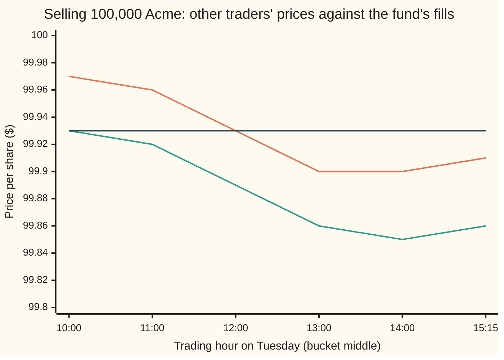

# Measuring execution: implementation shortfall, VWAP and arrival-price benchmarks

[Syllabus](../../../SYLLABUS.md) → [Financial mathematics](../../../SYLLABUS.md#w12) → [Microstructure and Execution](../../../SYLLABUS.md#w12-s49) → Measuring execution

---

## General Overview

Monday, 4:00 pm. Acme shares close at $100.00. A fund manager decides to sell 100,000 of them. Acme trades about 1 million shares a day, so this order is a tenth of a normal day.

The order reaches the trading desk overnight. Tuesday's market opens with Acme at $99.96. The desk sells in six pieces, one per trading hour (the last covers the final ninety minutes), and by the close every share is gone. The fund received $9,988,000, an average of $99.88 a share. Had every share sold at Monday's $100.00, it would have received $10,000,000.

The missing $12,000 is the cost of turning a decision into a trade. It is called the **implementation shortfall**. Trading desks quote it in **basis points** (bp): hundredths of a percent, so 1 bp of a $100 price is one cent. Here 1 bp across 100,000 shares is $1,000, and the shortfall is 12 bp.

Twelve basis points of what, though? The price fell 4 bp overnight, before the desk touched the order. That part is **timing**. The other 8 bp arrived while the desk was selling: the price at which the order reached the market, $99.96, against the $99.88 received. Desks label that part **impact**. A third yardstick asks how the fills compare with the average price everyone else got that Tuesday; it says 5 bp.

**Transaction cost analysis picks a reference price, compares the average price actually received against it, and reads the gap as a cost: the decision price gives the whole shortfall, 12 bp, which splits exactly into 4 bp of timing and 8 bp of impact, and the market's average price gives a narrower 5 bp.**

**What kind of fact this is:** a definition. The three benchmarks are measurement conventions; the split 12 = 4 + 8 is an accounting identity, proved on this card in Why it works. Calling the 8 bp "impact" is a label: the numbers alone cannot prove the order caused it.

### The picture: Tuesday, hour by hour



Top line: the average price of other traders' shares in each hour. Middle line: the price of the fund's own fill in that hour, always 4 or 5 cents lower. Flat line: the day's volume-weighted average price of other traders, $99.93. Not drawn: Monday's decision price, $100.00, the chart's top edge, and Tuesday's open, $99.96.

---

## The formula

Notation first, in words. The order is $Q$ shares. The desk fills it in pieces: piece $i$ is $q_i$ shares at price $p_i$. A sum sign, Σ, adds over every piece. The market's own trades in the same window are indexed by $j$: $v_j$ shares at price $m_j$, with $V$ shares in total.

Two averages, each weighted by shares:

$$\bar p = \frac{\sum_i q_i\,p_i}{Q}, \qquad p_V = \frac{\sum_j v_j\,m_j}{V}$$

**Read it aloud:** the order's average price is the cash it raised divided by the shares it sold; the market's average, the VWAP (volume-weighted average price), is the same thing for everyone else's trades.

Then one cost for any reference price $B$:

$$c(B) = 10{,}000 \times \frac{s\,(\bar p - B)}{p_D}$$

**Read it aloud:** the gap between the average price and the reference, signed so that a worse price counts as a cost, divided by the decision price, and multiplied by 10,000 to turn it into basis points.

The three benchmarks are three choices of $B$: the decision price $p_D$, the arrival price $p_A$, the VWAP $p_V$. The first gives the implementation shortfall, and it splits:

$$\mathrm{IS} = c(p_D) = \underbrace{10{,}000 \times \frac{s\,(p_A - p_D)}{p_D}}_{\text{timing}} \;+\; \underbrace{c(p_A)}_{\text{impact}}$$

**Read it aloud:** the whole shortfall is what the market did before the order arrived, plus what the order got against the price when it arrived.

| Symbol | Plain meaning | In our example | Push it up and the answer… |
| --- | --- | --- | --- |
| $Q$ | shares in the order | 100,000 | dollar cost grows with it; bp cost grows if the order pushes the price |
| $i$, $q_i$, $p_i$ | fill number $i$, its shares and its price | 10,000 at $99.93, …, 15,000 at $99.86 | a higher fill price lowers a sale's cost |
| $\bar p$ | the order's share-weighted average price | $99.88 | a sale's cost falls |
| $s$ | the side: +1 for a buy, −1 for a sale | −1 | flipping it flips every cost's sign |
| $p_D$ | **decision price**: the price when the manager decided | $100.00 (Monday's close) | a sale's shortfall rises |
| $p_A$ | **arrival price**: the price when the order reached the market | $99.96 (Tuesday's open) | timing cost falls, impact rises |
| $p_V$ | **VWAP**: other traders' share-weighted average price in the window | $99.93 | a sale's VWAP cost rises |
| $j$, $v_j$, $m_j$, $V$ | market trade number $j$, its shares and price; total market shares | 200,000 at $99.97, …; 900,000 | — |
| $B$, $B_1$, $B_2$, $c(B)$ | any reference price, and the cost against it in bp | $B = p_V$ gives 5 bp | a sale's cost rises with $B$ |
| $\mathrm{IS}$ | implementation shortfall: $c(p_D)$ | 12 bp, $12,000 | — |
| $k$, $w_k$, $t_k$, $t_j$ | a fill number, that fill's share of the order, and its time as a fraction of the day | each fill's shares ÷ 100,000; its bucket's middle hour ÷ 6.5 | — |
| $\sigma$ | one day's random wander of the price, in dollars | $1.26 (20% a year) | the noise in one order's cost grows in proportion |

Dividing every cost by the same $p_D$ keeps the bp numbers addable: 4 + 8 is exactly 12 because all three share one denominator. Some desks divide each cost by its own benchmark instead; the parts then stop adding exactly to the whole.

### When it holds

A definition has no assumptions to fail, but each benchmark answers its question only under conditions:

- **The order finished.** The formula counts only shares that traded. If 15,000 shares go unsold, dividing by the 85,000 that did sell hides a cost; a missed-shares term is needed (Step 5).
- **Clean timestamps.** The decision time and the arrival time must be recorded when they happen. Move the recorded arrival and cost slides between timing and impact, one for one.
- **A declared tape for VWAP.** "The market's trades" needs a venue list, hours, and a rule for the order's own fills. This fund is 10% of the day's volume; counting its own fills pulls VWAP 0.5 bp toward itself.
- **Nothing else moved the price.** No dividend, split or currency change in the window. If one occurs, adjust every price to one basis first, or the gap is not a trading cost.

---

## Why it works

### Step 0: compare the real trade with a paper trade

The idea is André Perold's, from 1988. Imagine a paper portfolio that sells all 100,000 shares the instant the decision is made, at $100.00, for free. It is not achievable, and that is the point: it is the result the decision deserved. The real portfolio sold later, in pieces, at worse prices. Implementation shortfall is paper minus real. Every other benchmark swaps the $100.00 for a different reference and asks a narrower question.

### Step 1: the ledger forces a weighted average

The paper sale raises $Q\,p_D$ = $10,000,000. The real sale raises $\sum_i q_i\,p_i$ = $9,988,000. The shortfall in dollars is the difference, $12,000.

Divide the real proceeds by $Q$ and out comes $\bar p$, so the shortfall is $Q\,(p_D - \bar p)$. The average price has to be weighted by shares because the cash is. A plain average of the six fill prices weights the 10,000-share fill as heavily as the 20,000-share ones and gives 11.5 bp instead of 12.

A purchase runs the other way: paying more than the paper price is the cost, so the gap is $\bar p - p_D$. The side $s$ folds both cases into one formula: $s\,(\bar p - p_D)$ is $p_D - \bar p$ for a sale and $\bar p - p_D$ for a buy. Divide by the paper price $p_D$ and multiply by 10,000 for basis points.

### Step 2: add and subtract the arrival price

Insert $p_A$ and take it away again:

$$p_D - \bar p = (p_D - p_A) + (p_A - \bar p).$$

Nothing was assumed; the right side equals the left for any three numbers. The first bracket is how far the price moved before the order could trade: $100.00 − $99.96 = 4 cents, 4 bp. The second is how the fills did against the price at the start of trading: $99.96 − $99.88 = 8 cents, 8 bp. That is the whole proof of 12 = 4 + 8.

The split matters because the two parts have different owners. Timing belongs to whoever sat on the decision overnight: the manager, the order routing, the calendar. Impact belongs to the trading: how fast the desk sold, where, and at what price. A desk judged on the full 12 bp is blamed for 4 bp it never controlled.

### Step 3: the VWAP benchmark removes the day's drift

The impact leg still mixes two things. Acme drifted down all Tuesday; other traders' shares averaged $99.93, 3 bp below the open. A second add-and-subtract, this time of $p_V$, splits the 8 bp:

$$p_A - \bar p = (p_A - p_V) + (p_V - \bar p): \qquad 8 = 3 + 5.$$

The 3 bp is the market's drift from the open to the day's average. The 5 bp is how the fund's fills did against other traders over the same hours: the **VWAP cost**. A desk that matches VWAP exactly scores zero, whatever the market did.

The 5 bp itself has two parts. Price each of the fund's fills at the hour's market price instead, and its average would have been $99.9235. Against that, the fills lost 4.35 bp: what each hour's selling gave up to that hour's other traders. The remaining 0.65 bp is the schedule. The market traded 200,000 shares in the high-priced first hour; the fund sold only 10,000 there. VWAP rewards trading when the market trades.

<details>
<summary>Detailed proof: the ledger for any order, either side, with fees</summary>

Let the paper trade happen at reference price $B$ with no fees, and let F be the commission paid, in dollars. For a purchase, paper cash out is $Q\,B$; real cash out is $\sum_i q_i\,p_i + F$. Real minus paper is $Q(\bar p - B) + F$. For a sale, paper cash in is $Q\,B$; real cash in is $\sum_i q_i\,p_i - F$. Paper minus real is $-Q(\bar p - B) + F$. Both cases are $s\,Q(\bar p - B) + F$ with $s = +1$ or $-1$.

Divide by the decision notional $Q\,p_D$, which is positive, and multiply by 10,000. The fee adds $10{,}000\,F/(Q\,p_D)$ to every benchmark alike: a $2,000 commission on this order adds 2 bp, and the shortfall becomes 14.

For any two references $B_1$ and $B_2$, the fills and the fee cancel in the difference: $c(B_1) - c(B_2) = 10{,}000\,s\,(B_2 - B_1)/p_D$. Put $B_1 = p_D$, $B_2 = p_A$ for the timing leg; put $B_1 = p_A$, $B_2 = p_V$ for the drift. Nothing requires the prices to fall in any order: every leg may be negative.

</details>

### Step 4: one order is mostly noise

The 8 bp is a measurement, not a cause. Acme would have wandered on Tuesday with or without the fund. How big is that wander? A 20% yearly volatility, spread over 252 trading days, is $100 × 0.20 / √252 = $1.26 of random movement in one day. The fund's fills are spread across the day, so their average carries part of that wander.

Over one day, a random walk in dollars ([Brownian motion](../../11-Stochastic%20processes%20and%20calculus/05-Brownian%20Motion/01-brownian-motion.md)) is close enough to the geometric one, and it says exactly how much. The price moves at times $t_j$ and $t_k$ share all their wander up to the earlier time, so their covariance is $\sigma^2 \min(t_j, t_k)$. The average fill weights the moves by $w_k$, the share of the order sold at time $t_k$. Its spread, in basis points, is

$$\text{spread of one order's cost} = \frac{10{,}000}{p_D}\;\sigma\,\sqrt{\sum_j \sum_k w_j\,w_k\,\min(t_j, t_k)} = 75.36 \text{ bp}.$$

So one order that truly costs 8 bp reports a number drawn from a bell curve with centre 8 and spread 75. The code simulates 20,000 such Tuesdays, each fill landing 8 cents below that hour's wandering price:

```
arrival cost of 20,000 simulated orders, true cost 8 bp; one █ = about 130 orders
    below -150 bp   ██                                          325
  -150 to -100 bp   █████████                                  1151
   -100 to -50 bp   ██████████████████████                     2798
      -50 to 0 bp   █████████████████████████████████████      4835
       0 to 50 bp   ████████████████████████████████████████   5210
     50 to 100 bp   ███████████████████████████                3468
    100 to 150 bp   ████████████                               1593
    150 bp and up   █████                                       620
```

The simulated spread is 74.58 bp against 75.36 exact; the simulated mean is 8.51 bp against the 8 built in, with a standard error of 0.53. And 45.55% of the simulated orders report a *negative* cost: they look as if the desk made money. Telling 8 bp from zero at two standard errors takes (2 × 75.36 / 8)^2 ≈ 355 orders like this one. That is why transaction cost analysis is done on hundreds of orders, and why one order's 12 bp is evidence of almost nothing.

### Step 5: an order that does not finish

Suppose the desk stops after 14:30 and 15,000 shares go unsold; Acme closes at $99.80. Counting only the 85,000 sold shares gives 11.65 bp on their own value. But the paper portfolio sold all 100,000. The unsold shares are still held, and they are now worth $99.80, not $100.00: $3,000 lost in all. Perold called this the **opportunity cost**. Added in, over the full $10,000,000 decision value, the shortfall is 12.90 bp. Leaving out the missed shares makes the order that stopped early look cheaper than the one that finished.

A different route to the same identities is the market-maker's view: every trade crosses some spread, and the cost is the spread paid plus the price move during the trade. That route measures cost from quotes rather than benchmarks, and belongs to [Liquidity](07-liquidity-measures.md).

---

## Worked numbers, by hand

The house order: sell 100,000 Acme, decided at $100.00, arriving at $99.96, filled in six hourly pieces.

| Step | Arithmetic | Value |
| --- | --- | --- |
| cash raised | 10,000 × 99.93 + 15,000 × 99.92 + 20,000 × 99.89 + 20,000 × 99.86 + 20,000 × 99.85 + 15,000 × 99.86 | $9,988,000 |
| average fill $\bar p$ | 9,988,000 / 100,000 | $99.88 |
| market VWAP $p_V$ | (200,000 × 99.97 + 120,000 × 99.96 + 100,000 × 99.93 + 90,000 × 99.90 + 110,000 × 99.90 + 280,000 × 99.91) / 900,000 | $99.93 |
| one basis point | 1 cent × 100,000 shares | $1,000 |
| timing | (100.00 − 99.96) / 100 × 10,000 | 4 bp, $4,000 |
| impact (arrival cost) | (99.96 − 99.88) / 100 × 10,000 | 8 bp, $8,000 |
| drift, open to VWAP | (99.96 − 99.93) / 100 × 10,000 | 3 bp |
| VWAP cost | (99.93 − 99.88) / 100 × 10,000 | 5 bp, $5,000 |
| **implementation shortfall** | 4 + 8 | **12 bp, $12,000** |

The fund paid $12,000 to turn Monday's decision into Tuesday's cash: $4,000 to the overnight move and $8,000 during the selling, of which $5,000 was measured against other traders on the same day.

```
the 12 bp, one piece at a time; one █ = 0.25 bp
  timing: close to open            ████████████████                                   4.00
  drift: open to day's VWAP        ████████████                                       3.00
  fills vs their own hour          █████████████████                                  4.35
  schedule vs volume curve         ███                                                0.65
  implementation shortfall         ████████████████████████████████████████████████  12.00
```

### What breaks if you drop a piece

| Mistake | Comes out at | What went wrong |
| --- | --- | --- |
| Score the sale with the buy sign | −12 bp | A $12,000 cost reads as a $12,000 gain |
| Plain average of the six fill prices | 11.5 bp | The 10,000-share fill counted as much as a 20,000-share one |
| VWAP tape includes the fund's own fills | 4.5 bp (right: 5) | The fund is 10% of the day's volume and pulled the benchmark toward its own prices |
| The fund is the whole tape | 0 bp | Its VWAP is its own average: any execution scores perfect |
| 15,000 shares unsold, cost on sold shares only | 11.65 bp (right: 12.90) | The missed shares lost 20 cents each and vanished from the bill |

Every number in this table is printed by both checks below.

---

## Code, from first principles, and it actually runs

The code builds the order from its fills and reaches the shortfall by **five independent roads**: the benchmark formula on the average price; a fill-by-fill cash ledger in whole cents; the timing and impact legs, each from its own prices; VWAP by a direct sum and by a running update; and the noise in one order's cost, computed exactly and then by simulating 20,000 Tuesdays with a hand-written random-number generator (splitmix64) and bell-curve sampler (Box–Muller). It also prints every number from the what-breaks table and the charts.

### Python

```python
# Transaction cost analysis -- the check behind the card.  Standard library only.
# One sell order: 100,000 Acme shares, decided at Monday's close, worked all Tuesday.
# Roads: (1) the benchmark formula on the average price; (2) a fill-by-fill cash
# ledger in whole cents; (3) timing + impact built from price legs alone; (4) VWAP by
# a direct sum and by a running update; (5) the noise in one order's cost, exact
# variance against a 20,000-order simulation with a hand-written random generator.
from math import sqrt, log, cos, pi

SIDE = -1                                    # -1 = sell, +1 = buy
Q, P_D, P_A = 100_000, 100.00, 99.96         # shares; decision price; arrival price
FILLS = [(10_000, 99.93), (15_000, 99.92), (20_000, 99.89),     # our six child fills,
         (20_000, 99.86), (20_000, 99.85), (15_000, 99.86)]     # one per trading hour
TAPE = [(200_000, 99.97), (120_000, 99.96), (100_000, 99.93),   # everyone else's trades,
        (90_000, 99.90), (110_000, 99.90), (280_000, 99.91)]    # same six buckets
HOURS = [0.5, 1.5, 2.5, 3.5, 4.5, 5.75]      # middle of each bucket, hours after the open
DAY = 6.5                                    # hours in the trading day

def average(trades):                         # size-weighted average price
    return sum(q * p for q, p in trades) / sum(q for q, _ in trades)

def cost_bp(bench, pbar):                    # signed cost against a benchmark, in bp of decision notional
    return 1e4 * SIDE * (pbar - bench) / P_D

# ---- road 1: formula on the average fill price ----
pbar, p_v = average(FILLS), average(TAPE)
IS, arrival, vwap = cost_bp(P_D, pbar), cost_bp(P_A, pbar), cost_bp(p_v, pbar)

# ---- road 2: cash ledger in whole cents, fill by fill ----
paper = Q * round(P_D * 100)                              # cents the decision price promised
actual = sum(q * round(p * 100) for q, p in FILLS)        # cents the fills raised
IS_ledger = 1e4 * SIDE * (actual - paper) / paper

# ---- road 3: timing leg + impact leg, each from its own prices ----
timing = 1e4 * SIDE * (P_A - P_D) / P_D
impact = sum(1e4 * SIDE * q * (p - P_A) for q, p in FILLS) / (Q * P_D)
drift = 1e4 * SIDE * (p_v - P_A) / P_D                    # arrival -> market VWAP

# ---- road 4: VWAP by a running update, one bucket at a time ----
run_v, run_vol = 0.0, 0
for v, m in TAPE:
    run_vol += v
    run_v += v / run_vol * (m - run_v)

# ---- inside the 5 bp against VWAP: each hour's fill vs that hour, and the schedule ----
own_sched = sum(q * m for (q, _), (_, m) in zip(FILLS, TAPE)) / Q
slices, schedule = cost_bp(own_sched, pbar), 1e4 * SIDE * (own_sched - p_v) / P_D
V = sum(v for v, _ in TAPE)                               # hour by hour, no averages used:
slices_hr = sum(1e4 * SIDE * q * (p - m) for (q, p), (_, m) in zip(FILLS, TAPE)) / (Q * P_D)
sched_w = sum(1e4 * SIDE * (q / Q - v / V) * m for (q, _), (v, m) in zip(FILLS, TAPE)) / P_D

# ---- what breaks ----
as_buy = -IS
unweighted = cost_bp(P_D, sum(p for _, p in FILLS) / len(FILLS))
with_own = cost_bp(average(TAPE + FILLS), pbar)
only_us = cost_bp(average(FILLS), pbar) + 0.0          # + 0.0 turns -0.0 into 0.0
done = FILLS[:-1]; unfilled = Q - sum(q for q, _ in done); P_CLOSE = 99.80
filled_only = cost_bp(P_D, average(done))
with_opp = (sum(1e4 * SIDE * q * (p - P_D) for q, p in done)
            + 1e4 * SIDE * unfilled * (P_CLOSE - P_D)) / (Q * P_D)
fee_2000 = IS + 1e4 * 2000 / (Q * P_D)

rows = [("decision price", P_D), ("arrival price", P_A), ("closing price, partial case", P_CLOSE),
        ("paper proceeds ($)", paper / 100), ("cash raised ($)", actual / 100),
        ("average fill price", pbar), ("market VWAP, others only", p_v), ("  VWAP, running update", run_v),
        ("1 shortfall, formula (bp)", IS), ("2 shortfall, cents ledger (bp)", IS_ledger),
        ("3 timing leg (bp)", timing), ("3 impact leg (bp)", impact), ("  timing + impact (bp)", timing + impact),
        ("arrival cost, formula (bp)", arrival), ("VWAP cost (bp)", vwap), ("  arrival -> VWAP drift (bp)", drift),
        ("  own-schedule market price", own_sched), ("  slices vs their hour (bp)", slices),
        ("  schedule vs volume curve (bp)", schedule), ("shortfall ($)", IS * Q * P_D / 1e4),
        ("timing ($)", timing * Q * P_D / 1e4), ("impact ($)", impact * Q * P_D / 1e4),
        ("VWAP cost ($)", vwap * Q * P_D / 1e4), ("share of day's volume", Q / (Q + sum(v for v, _ in TAPE))),
        ("wrong: scored as a buy (bp)", as_buy), ("wrong: unweighted fill average (bp)", unweighted),
        ("wrong: VWAP with our own fills (bp)", with_own), ("wrong: we are the whole tape (bp)", only_us),
        ("partial: filled shares only (bp)", filled_only), ("partial: with missed shares (bp)", with_opp),
        ("partial: missed shares' loss ($)", unfilled * (P_D - P_CLOSE)), ("try: $2,000 commission (bp)", fee_2000)]
for name, v in rows:
    print(f"{name:<38}{v:>12.4f}")

# ---- road 5: how noisy is one order's arrival cost? ----
SIGMA_DAY = P_D * 0.20 / sqrt(252.0)          # dollars of wander in one day at 20% a year
IMPACT = 0.08                                 # each fill lands 8 cents below the mid of its hour
t = [h / DAY for h in HOURS]
w = [q / Q for q, _ in FILLS]
var = SIGMA_DAY ** 2 * sum(w[j] * w[k] * min(t[j], t[k]) for j in range(6) for k in range(6))
sd_exact = 1e4 * sqrt(var) / P_D

state = 20260928
def uniform():                                # splitmix64, written out; returns a number in (0, 1]
    global state
    state = (state + 0x9E3779B97F4A7C15) & 0xFFFFFFFFFFFFFFFF
    z = state
    z = ((z ^ (z >> 30)) * 0xBF58476D1CE4E5B9) & 0xFFFFFFFFFFFFFFFF
    z = ((z ^ (z >> 27)) * 0x94D049BB133111EB) & 0xFFFFFFFFFFFFFFFF
    return ((z ^ (z >> 31)) >> 11) / 9007199254740992.0 + 1.0 / 9007199254740992.0

def normal():                                 # Box-Muller, one draw per pair
    u1, u2 = uniform(), uniform()
    return sqrt(-2.0 * log(u1)) * cos(2.0 * pi * u2)

N_SIM, EDGES = 20_000, [-150, -100, -50, 0, 50, 100, 150]
costs, bins = [], [0] * (len(EDGES) + 1)
for _ in range(N_SIM):
    mid, prev, pb = P_A, 0.0, 0.0
    for tk, wk in zip(t, w):
        mid += SIGMA_DAY * sqrt(tk - prev) * normal()
        prev = tk
        pb += wk * (mid - IMPACT)
    c = cost_bp(P_A, pb)
    costs.append(c)
    bins[sum(1 for e in EDGES if c >= e)] += 1
mean = sum(costs) / N_SIM
sd = sqrt(sum((c - mean) ** 2 for c in costs) / (N_SIM - 1))
print()
for name, v in (("sim: one day's wander ($)", SIGMA_DAY), ("sim: true impact (bp)", 1e4 * IMPACT / P_D), ("sim: mean arrival cost (bp)", mean),
                ("sim: standard error of mean (bp)", sd / sqrt(N_SIM)), ("sd, exact (bp)", sd_exact),
                ("sd, simulated (bp)", sd), ("sim: share looking like a gain", sum(1 for c in costs if c < 0) / N_SIM),
                ("orders to see 8 bp at 2 sd", (2 * sd_exact / 8) ** 2)):
    print(f"{name:<38}{v:>12.4f}")
labels = ["below -150"] + [f"{a} to {b}" for a, b in zip(EDGES, EDGES[1:])] + ["150 and up"]
for lab, n in zip(labels, bins):
    print(f"histogram {lab:<14}{n:>8d}")
print("chart, others' hourly price  " + " ".join(f"{m:.2f}" for _, m in TAPE))
print("chart, our hourly fill       " + " ".join(f"{p:.2f}" for _, p in FILLS))

assert abs(IS - IS_ledger) < 1e-9,            "formula road vs cents ledger"
assert abs(timing + impact - IS) < 1e-9,      "legs built from their own prices must rebuild the shortfall"
assert abs(run_v - p_v) < 1e-9,               "running VWAP vs direct VWAP"
assert abs(slices - slices_hr) < 1e-9,       "fills vs their hour: average road vs hour-by-hour road"
assert abs(schedule - sched_w) < 1e-9,       "schedule: average road vs volume-weight road"
assert abs(slices_hr + sched_w - vwap) < 1e-9, "hour-by-hour split vs the VWAP cost"
assert [round(x, 9) for x in (IS, timing, impact, vwap)] == [12, 4, 8, 5], "the card's 12 = 4 + 8 and 5"
assert abs(mean - 8.0) < 4 * sd / sqrt(N_SIM), "simulated mean vs the 8 bp built in"
assert abs(sd / sd_exact - 1.0) < 0.03,       "simulated noise vs exact variance"
print("ALL CHECKS PASS")
```

**Ran 2026-09-28 on macOS, Python 3.14.6, standard library only. All checks passed. Output, pasted from the run:**

```
decision price                            100.0000
arrival price                              99.9600
closing price, partial case                99.8000
paper proceeds ($)                    10000000.0000
cash raised ($)                       9988000.0000
average fill price                         99.8800
market VWAP, others only                   99.9300
  VWAP, running update                     99.9300
1 shortfall, formula (bp)                  12.0000
2 shortfall, cents ledger (bp)             12.0000
3 timing leg (bp)                           4.0000
3 impact leg (bp)                           8.0000
  timing + impact (bp)                     12.0000
arrival cost, formula (bp)                  8.0000
VWAP cost (bp)                              5.0000
  arrival -> VWAP drift (bp)                3.0000
  own-schedule market price                99.9235
  slices vs their hour (bp)                 4.3500
  schedule vs volume curve (bp)             0.6500
shortfall ($)                           12000.0000
timing ($)                               4000.0000
impact ($)                               8000.0000
VWAP cost ($)                            5000.0000
share of day's volume                       0.1000
wrong: scored as a buy (bp)               -12.0000
wrong: unweighted fill average (bp)        11.5000
wrong: VWAP with our own fills (bp)         4.5000
wrong: we are the whole tape (bp)           0.0000
partial: filled shares only (bp)           11.6471
partial: with missed shares (bp)           12.9000
partial: missed shares' loss ($)         3000.0000
try: $2,000 commission (bp)                14.0000

sim: one day's wander ($)                   1.2599
sim: true impact (bp)                       8.0000
sim: mean arrival cost (bp)                 8.5107
sim: standard error of mean (bp)            0.5274
sd, exact (bp)                             75.3603
sd, simulated (bp)                         74.5798
sim: share looking like a gain              0.4555
orders to see 8 bp at 2 sd                354.9489
histogram below -150         325
histogram -150 to -100      1151
histogram -100 to -50       2798
histogram -50 to 0          4835
histogram 0 to 50           5210
histogram 50 to 100         3468
histogram 100 to 150        1593
histogram 150 and up         620
chart, others' hourly price  99.97 99.96 99.93 99.90 99.90 99.91
chart, our hourly fill       99.93 99.92 99.89 99.86 99.85 99.86
ALL CHECKS PASS
```

### Rust

Same order, same roads, same generator, bit for bit, so the simulated histogram matches row for row. No crates.

```rust
// Transaction cost analysis -- the same check as transaction_cost_analysis_check.py, in Rust.
// Standard library only, no crates.  Same order, same six fills, same five roads,
// same hand-written random generator, same printed rows.
// Compile: rustc --edition 2021 -O transaction_cost_analysis_check.rs -o /tmp/tca_check
use std::f64::consts::PI;

const SIDE: f64 = -1.0; // -1 = sell, +1 = buy
const Q: f64 = 100_000.0;
const P_D: f64 = 100.00; // decision price, Monday's close
const P_A: f64 = 99.96; // arrival price, Tuesday's open
const FILLS: [(f64, f64); 6] = [(10_000.0, 99.93), (15_000.0, 99.92), (20_000.0, 99.89),
                                (20_000.0, 99.86), (20_000.0, 99.85), (15_000.0, 99.86)];
const TAPE: [(f64, f64); 6] = [(200_000.0, 99.97), (120_000.0, 99.96), (100_000.0, 99.93),
                               (90_000.0, 99.90), (110_000.0, 99.90), (280_000.0, 99.91)];
const HOURS: [f64; 6] = [0.5, 1.5, 2.5, 3.5, 4.5, 5.75]; // middle of each bucket
const DAY: f64 = 6.5;

fn average(trades: &[(f64, f64)]) -> f64 {
    let mut cash = 0.0;
    let mut size = 0.0;
    for &(q, p) in trades { cash += q * p; size += q; }
    cash / size
}
fn cost_bp(bench: f64, pbar: f64) -> f64 { 1e4 * SIDE * (pbar - bench) / P_D }

struct Rng(u64);
impl Rng {
    fn uniform(&mut self) -> f64 { // splitmix64, written out; a number in (0, 1]
        self.0 = self.0.wrapping_add(0x9E3779B97F4A7C15);
        let mut z = self.0;
        z = (z ^ (z >> 30)).wrapping_mul(0xBF58476D1CE4E5B9);
        z = (z ^ (z >> 27)).wrapping_mul(0x94D049BB133111EB);
        ((z ^ (z >> 31)) >> 11) as f64 / 9007199254740992.0 + 1.0 / 9007199254740992.0
    }
    fn normal(&mut self) -> f64 { // Box-Muller, one draw per pair
        let u1 = self.uniform();
        let u2 = self.uniform();
        (-2.0 * u1.ln()).sqrt() * (2.0 * PI * u2).cos()
    }
}

fn main() {
    // road 1: formula on the average fill price
    let pbar = average(&FILLS);
    let p_v = average(&TAPE);
    let (is, arrival, vwap) = (cost_bp(P_D, pbar), cost_bp(P_A, pbar), cost_bp(p_v, pbar));
    // road 2: cash ledger in whole cents, fill by fill
    let paper = 100_000i64 * (P_D * 100.0).round() as i64;
    let actual: i64 = FILLS.iter().map(|&(q, p)| q as i64 * (p * 100.0).round() as i64).sum();
    let is_ledger = 1e4 * SIDE * (actual - paper) as f64 / paper as f64;
    // road 3: timing leg + impact leg, each from its own prices
    let timing = 1e4 * SIDE * (P_A - P_D) / P_D;
    let mut imp = 0.0;
    for &(q, p) in FILLS.iter() { imp += 1e4 * SIDE * q * (p - P_A); }
    let impact = imp / (Q * P_D);
    let drift = 1e4 * SIDE * (p_v - P_A) / P_D;
    // road 4: VWAP by a running update
    let (mut run_v, mut run_vol) = (0.0f64, 0.0f64);
    for &(v, m) in TAPE.iter() { run_vol += v; run_v += v / run_vol * (m - run_v); }
    // inside the VWAP cost: each hour's fill vs that hour, and the schedule
    let mut os = 0.0;
    for k in 0..6 { os += FILLS[k].0 * TAPE[k].1; }
    let own_sched = os / Q;
    let (slices, schedule) = (cost_bp(own_sched, pbar), 1e4 * SIDE * (own_sched - p_v) / P_D);
    let vol: f64 = TAPE.iter().map(|x| x.0).sum(); // hour by hour, no averages used:
    let (mut slices_hr, mut sched_w) = (0.0, 0.0);
    for k in 0..6 {
        slices_hr += 1e4 * SIDE * FILLS[k].0 * (FILLS[k].1 - TAPE[k].1) / (Q * P_D);
        sched_w += 1e4 * SIDE * (FILLS[k].0 / Q - TAPE[k].0 / vol) * TAPE[k].1 / P_D;
    }
    // what breaks
    let unweighted = cost_bp(P_D, FILLS.iter().map(|x| x.1).sum::<f64>() / 6.0);
    let both: Vec<(f64, f64)> = TAPE.iter().chain(FILLS.iter()).cloned().collect();
    let with_own = cost_bp(average(&both), pbar);
    let only_us = cost_bp(average(&FILLS), pbar) + 0.0;
    let done = &FILLS[..5];
    let unfilled = Q - done.iter().map(|x| x.0).sum::<f64>();
    let p_close = 99.80;
    let filled_only = cost_bp(P_D, average(done));
    let mut opp = 0.0;
    for &(q, p) in done { opp += 1e4 * SIDE * q * (p - P_D); }
    let with_opp = (opp + 1e4 * SIDE * unfilled * (p_close - P_D)) / (Q * P_D);
    let fee_2000 = is + 1e4 * 2000.0 / (Q * P_D);
    let tape_vol: f64 = TAPE.iter().map(|x| x.0).sum();

    let rows: [(&str, f64); 32] = [("decision price", P_D), ("arrival price", P_A),
        ("closing price, partial case", p_close), ("paper proceeds ($)", paper as f64 / 100.0),
        ("cash raised ($)", actual as f64 / 100.0), ("average fill price", pbar), ("market VWAP, others only", p_v),
        ("  VWAP, running update", run_v), ("1 shortfall, formula (bp)", is),
        ("2 shortfall, cents ledger (bp)", is_ledger), ("3 timing leg (bp)", timing),
        ("3 impact leg (bp)", impact), ("  timing + impact (bp)", timing + impact),
        ("arrival cost, formula (bp)", arrival), ("VWAP cost (bp)", vwap),
        ("  arrival -> VWAP drift (bp)", drift), ("  own-schedule market price", own_sched),
        ("  slices vs their hour (bp)", slices), ("  schedule vs volume curve (bp)", schedule),
        ("shortfall ($)", is * Q * P_D / 1e4), ("timing ($)", timing * Q * P_D / 1e4),
        ("impact ($)", impact * Q * P_D / 1e4), ("VWAP cost ($)", vwap * Q * P_D / 1e4),
        ("share of day's volume", Q / (Q + tape_vol)), ("wrong: scored as a buy (bp)", -is),
        ("wrong: unweighted fill average (bp)", unweighted), ("wrong: VWAP with our own fills (bp)", with_own),
        ("wrong: we are the whole tape (bp)", only_us), ("partial: filled shares only (bp)", filled_only),
        ("partial: with missed shares (bp)", with_opp),
        ("partial: missed shares' loss ($)", unfilled * (P_D - p_close)), ("try: $2,000 commission (bp)", fee_2000)];
    for (name, v) in rows.iter() { println!("{:<38}{:>12.4}", name, v); }

    // road 5: how noisy is one order's arrival cost?
    let sigma_day = P_D * 0.20 / 252.0f64.sqrt();
    let impact_c = 0.08;
    let t: Vec<f64> = HOURS.iter().map(|h| h / DAY).collect();
    let w: Vec<f64> = FILLS.iter().map(|x| x.0 / Q).collect();
    let mut dsum = 0.0;
    for j in 0..6 { for k in 0..6 { dsum += w[j] * w[k] * t[j].min(t[k]); } }
    let sd_exact = 1e4 * (sigma_day.powi(2) * dsum).sqrt() / P_D;

    let mut rng = Rng(20260928);
    let n_sim = 20_000usize;
    let edges = [-150.0, -100.0, -50.0, 0.0, 50.0, 100.0, 150.0];
    let mut costs = Vec::with_capacity(n_sim);
    let mut bins = [0usize; 8];
    for _ in 0..n_sim {
        let (mut mid, mut prev, mut pb) = (P_A, 0.0, 0.0);
        for k in 0..6 {
            mid += sigma_day * (t[k] - prev).sqrt() * rng.normal();
            prev = t[k];
            pb += w[k] * (mid - impact_c);
        }
        let c = cost_bp(P_A, pb);
        costs.push(c);
        bins[edges.iter().filter(|&&e| c >= e).count()] += 1;
    }
    let mut total = 0.0;
    for c in &costs { total += *c; }
    let mean = total / n_sim as f64;
    let mut ss = 0.0;
    for c in &costs { ss += (c - mean).powi(2); }
    let sd = (ss / (n_sim - 1) as f64).sqrt();
    let gains = costs.iter().filter(|&&c| c < 0.0).count() as f64 / n_sim as f64;
    println!();
    let sim_rows = [("sim: one day's wander ($)", sigma_day), ("sim: true impact (bp)", 1e4 * impact_c / P_D), ("sim: mean arrival cost (bp)", mean),
        ("sim: standard error of mean (bp)", sd / (n_sim as f64).sqrt()), ("sd, exact (bp)", sd_exact),
        ("sd, simulated (bp)", sd), ("sim: share looking like a gain", gains),
        ("orders to see 8 bp at 2 sd", (2.0 * sd_exact / 8.0).powi(2))];
    for (name, v) in sim_rows.iter() { println!("{:<38}{:>12.4}", name, v); }
    let labels = ["below -150", "-150 to -100", "-100 to -50", "-50 to 0", "0 to 50", "50 to 100",
                  "100 to 150", "150 and up"];
    for (lab, n) in labels.iter().zip(bins.iter()) { println!("histogram {:<14}{:>8}", lab, n); }
    let fmt = |v: Vec<String>| v.join(" ");
    println!("chart, others' hourly price  {}", fmt(TAPE.iter().map(|x| format!("{:.2}", x.1)).collect()));
    println!("chart, our hourly fill       {}", fmt(FILLS.iter().map(|x| format!("{:.2}", x.1)).collect()));

    assert!((is - is_ledger).abs() < 1e-9, "formula road vs cents ledger");
    assert!((timing + impact - is).abs() < 1e-9, "legs built from their own prices must rebuild the shortfall");
    assert!((run_v - p_v).abs() < 1e-9, "running VWAP vs direct VWAP");
    assert!((slices - slices_hr).abs() < 1e-9, "fills vs their hour: average road vs hour-by-hour road");
    assert!((schedule - sched_w).abs() < 1e-9, "schedule: average road vs volume-weight road");
    assert!((slices_hr + sched_w - vwap).abs() < 1e-9, "hour-by-hour split vs the VWAP cost");
    let r9 = |x: f64| (x * 1e9).round() / 1e9;
    assert!([r9(is), r9(timing), r9(impact), r9(vwap)] == [12.0, 4.0, 8.0, 5.0], "the card's 12 = 4 + 8 and 5");
    assert!((mean - 8.0).abs() < 4.0 * sd / (n_sim as f64).sqrt(), "simulated mean vs the 8 bp built in");
    assert!((sd / sd_exact - 1.0).abs() < 0.03, "simulated noise vs exact variance");
    println!("ALL CHECKS PASS");
}
```

**Ran 2026-09-28 on macOS, rustc 1.98.1, no crates. All checks passed. Output, pasted from the run:**

```
decision price                            100.0000
arrival price                              99.9600
closing price, partial case                99.8000
paper proceeds ($)                    10000000.0000
cash raised ($)                       9988000.0000
average fill price                         99.8800
market VWAP, others only                   99.9300
  VWAP, running update                     99.9300
1 shortfall, formula (bp)                  12.0000
2 shortfall, cents ledger (bp)             12.0000
3 timing leg (bp)                           4.0000
3 impact leg (bp)                           8.0000
  timing + impact (bp)                     12.0000
arrival cost, formula (bp)                  8.0000
VWAP cost (bp)                              5.0000
  arrival -> VWAP drift (bp)                3.0000
  own-schedule market price                99.9235
  slices vs their hour (bp)                 4.3500
  schedule vs volume curve (bp)             0.6500
shortfall ($)                           12000.0000
timing ($)                               4000.0000
impact ($)                               8000.0000
VWAP cost ($)                            5000.0000
share of day's volume                       0.1000
wrong: scored as a buy (bp)               -12.0000
wrong: unweighted fill average (bp)        11.5000
wrong: VWAP with our own fills (bp)         4.5000
wrong: we are the whole tape (bp)           0.0000
partial: filled shares only (bp)           11.6471
partial: with missed shares (bp)           12.9000
partial: missed shares' loss ($)         3000.0000
try: $2,000 commission (bp)                14.0000

sim: one day's wander ($)                   1.2599
sim: true impact (bp)                       8.0000
sim: mean arrival cost (bp)                 8.5107
sim: standard error of mean (bp)            0.5274
sd, exact (bp)                             75.3603
sd, simulated (bp)                         74.5798
sim: share looking like a gain              0.4555
orders to see 8 bp at 2 sd                354.9489
histogram below -150         325
histogram -150 to -100      1151
histogram -100 to -50       2798
histogram -50 to 0          4835
histogram 0 to 50           5210
histogram 50 to 100         3468
histogram 100 to 150        1593
histogram 150 and up         620
chart, others' hourly price  99.97 99.96 99.93 99.90 99.90 99.91
chart, our hourly fill       99.93 99.92 99.89 99.86 99.85 99.86
ALL CHECKS PASS
```

The two outputs are identical.

> [!TIP]
> **Try changing**
> Guess the direction first. Then run it.
> - **Add a commission.** The `try:` row adds $2,000 of fees. Guess: does it land in timing or in impact? Neither: it adds 2 bp to every benchmark alike, and the shortfall becomes **14 bp**.
> - **Forget the side.** Set `SIDE = 1` without touching the prices. The shortfall comes out at **−12 bp**: the same fills, scored as a purchase, look like a triumph.
> - **Count the fund in its own benchmark.** Build the VWAP from `TAPE + FILLS` instead of `TAPE`. The VWAP cost drops from 5 to **4.5 bp**: a tenth of the day's volume drags the yardstick toward the fund's own prices.
> - **Demand a finer answer.** Telling 8 bp from zero took about **355** orders. Telling 4 bp from zero takes four times as many, since the count grows with one over the effect squared.

---

## The usual mistake

> [!warning]
> **Reading one order's cost as the desk's skill.** Tuesday's 8 bp of impact sits inside 75 bp of random wander. In the simulation, 45.55% of orders that truly cost 8 bp report a gain. One order's number is a draw, not a verdict; only the average over hundreds of comparable orders says anything about the trading.
>
> Smaller traps:
> - **Calling the 8 bp caused by the order.** It is the gap from the arrival price, and it includes the market's own 3 bp drift that day. Separating what the order did from what the market did needs a model of impact, such as [Kyle's model](03-kyle-model-and-price-impact.md), or many orders.
> - **Grading a large order by VWAP alone.** VWAP cost was 5 bp; the shortfall was 12. A desk that waits for a falling market to come to it can match VWAP perfectly and still cost the fund a lot. And an order that is most of the day's volume makes VWAP its own average: 0 bp by construction.
> - **Dropping unfilled shares.** An order cut short on a falling day reports 11.65 bp on what sold; the paper portfolio says 12.90.
> - **Mixing denominators.** Quoting timing over the decision price and impact over the arrival price makes the parts fail to add to the whole, by a small amount that looks like an arithmetic error.

---

## Where you meet it in real life

- **Broker scorecards.** Fund managers send brokers quarterly tables of shortfall, arrival cost and VWAP cost, averaged over thousands of orders and sorted by size, urgency and stock. The averaging in Step 4 is why the tables are over thousands.
- **Execution algorithms.** Brokers sell "VWAP" and "arrival price" algorithms by name. Each is built to score well on its own benchmark: the VWAP algorithm follows the market's volume curve; the arrival algorithm trades faster, accepting more impact for less timing risk, which is the balance [Almgren-Chriss](04-optimal-execution-almgren-chriss.md) chooses.
- **Best-execution rules.** Regulators require firms to show that client orders were executed well. Transaction cost reports are the evidence.
- **Fund performance.** A strategy that trades often and pays 12 bp each time can lose several percent a year to execution. Perold's paper portfolio was built to show that gap between a strategy on paper and in reality.
- **Pre-trade estimates.** Before trading, desks forecast the shortfall from the order's share of daily volume, 10% here, the spread ([The spread](02-bid-ask-spread-and-adverse-selection.md)) and volatility; afterwards, the measured cost is compared with the forecast.

> **Say it back**
> Implementation shortfall compares a real trade with a paper trade done at the decision price for free; for the 100,000-share Acme sale it is 12 bp, $12,000. Adding and subtracting the arrival price splits it exactly into 4 bp of timing before the order arrived and 8 bp during the trading. The VWAP benchmark compares the fills with other traders' average price the same day and gives a narrower 5 bp. Every cost is a share-weighted average price minus a reference, signed for the side, over one denominator. One order's number sits inside 75 bp of noise, so conclusions need hundreds of orders.

---

## What this builds on

- [Almgren-Chriss](04-optimal-execution-almgren-chriss.md): the plan before the trade. It picks a schedule balancing expected impact against the variance of price wander; this card is the bill after the trade, and Step 4's 75 bp is that variance, measured.
- The random walk, [Brownian motion](../../11-Stochastic%20processes%20and%20calculus/05-Brownian%20Motion/01-brownian-motion.md): where the covariance $\sigma^2 \min(t_j, t_k)$ in Step 4 comes from.

## Where this goes next

- [Liquidity](07-liquidity-measures.md): spread, depth and the price response per share traded, the quantities that predict what an order like this one will cost before it is sent.

This card measures what an execution cost after the fact; what it cannot say is how much of the cost the market's liquidity made unavoidable, and that is the question liquidity measures answer.

---

## Sources

Verified 2026-09-28: every link below resolves to the publisher's page.

- Perold, André F. "The Implementation Shortfall: Paper versus Reality." *Journal of Portfolio Management* 14, no. 3 (1988): 4–9. [doi:10.3905/jpm.1988.409150](https://doi.org/10.3905/jpm.1988.409150). The paper portfolio, the shortfall, and the opportunity cost of unfilled shares.
- Berkowitz, Stephen A., Dennis E. Logue, and Eugene A. Noser. "The Total Cost of Transactions on the NYSE." *Journal of Finance* 43, no. 1 (1988): 97–112. [doi:10.1111/j.1540-6261.1988.tb02591.x](https://doi.org/10.1111/j.1540-6261.1988.tb02591.x). The day's volume-weighted average price as the benchmark for execution.
- Almgren, Robert, and Neil Chriss. "Optimal Execution of Portfolio Transactions." *Journal of Risk* 3, no. 2 (2001): 5–39. [doi:10.21314/JOR.2001.041](https://doi.org/10.21314/JOR.2001.041). Expected cost and its variance for a schedule: the model behind Step 4's noise.
- CFA Institute. "Trading Costs and Electronic Markets." Refresher reading, 2026. [Publisher page](https://www.cfainstitute.org/insights/professional-learning/refresher-readings/2026/trading-costs-and-electronic-markets). Explicit and implicit costs, the implementation shortfall approach, and why VWAP estimates run lower.
