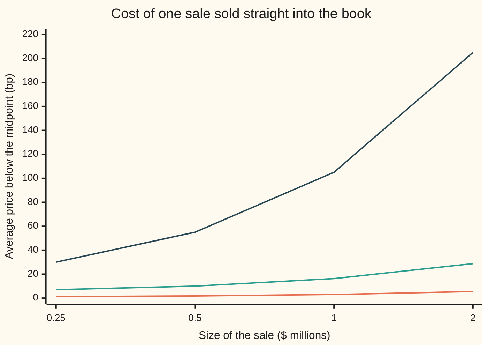
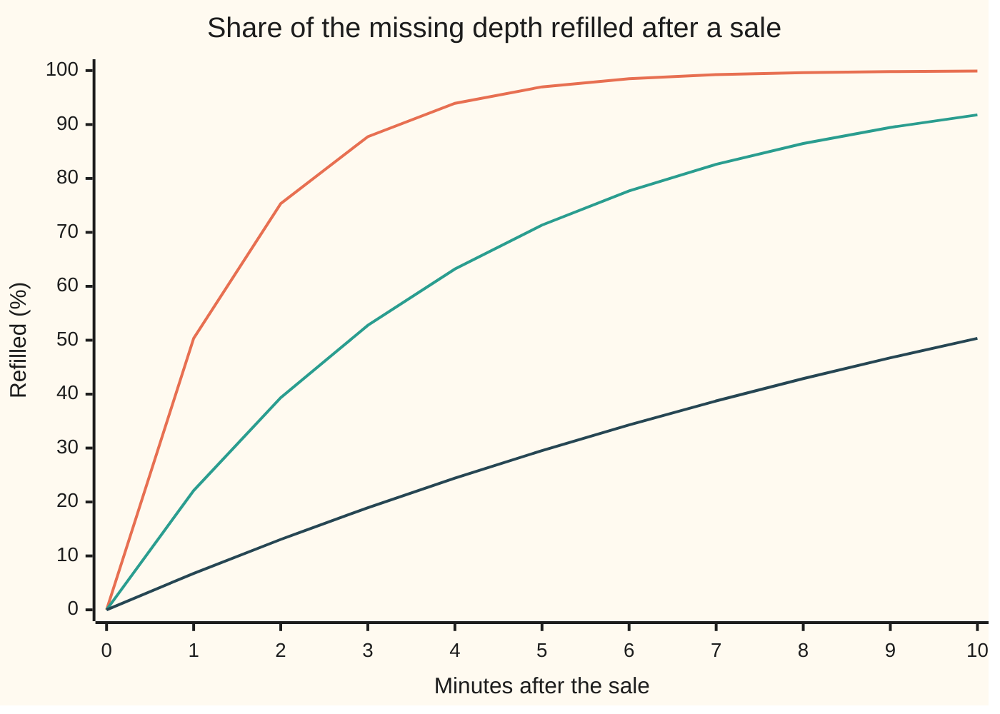

# Liquidity: effective spread, Amihud illiquidity and the depth-resilience picture

[Syllabus](../../../SYLLABUS.md) → [Financial mathematics](../README.md) → [Microstructure and Execution](../README.md#s49) → Liquidity

---

## General Overview

Two stocks trade about a million shares a day. Acme is a large company at $100 a share. Cobble is a small one at $10. Share counts make them look equally easy to trade. They are not.

A buyer of Acme pays about a cent above the fair price. A buyer of Cobble pays about a cent too, but a cent on a $10 share is ten times as much of the price. A day of $100 million in Acme trades moves its price about as much as $10 million in Cobble. A $1 million sale eats five price levels of Acme's order book and twenty of Cobble's. After the sale, Acme's book is half refilled in about a minute, Cobble's in about ten.

That is **liquidity**: how cheaply, how much, and how quickly a stock can be traded without moving its price. No single number captures it. This card computes the standard ones from trade data and ranks three fictional stocks, with Beacon, a mid-sized company at $40, between the two.

The **effective spread** is twice what a trade actually paid against the fair price, in basis points (hundredths of a percent). The **Amihud illiquidity** ratio is how far the price moves per million dollars traded, from daily data alone. **Depth** is the dollars of orders waiting near the price; **resilience** is how fast they come back after a big trade eats them.

**Liquidity has three faces, tightness, depth and resilience, and each measure on this card reads one of them: the effective spread reads tightness, Amihud's ratio reads price movement per dollar traded, and the order book read before and after a large sale shows depth and resilience.**

**What kind of fact this is:** definitions: the effective spread and Amihud's ratio are measures fixed by convention, not laws. Inside two stated models, Roll's spread estimate and the half-life of the book are theorems, proved on this card in Why it works.

### The picture: what a sale costs, by size

Each line is one stock. Size of a single sale, sold straight into the displayed bids, runs across. The average price received, measured below the midpoint, runs up.



Bottom line (orange), Acme: 3 bp for a $1 million sale. Middle line (green), Beacon: 16.25 bp. Top line (dark blue), Cobble: 105 bp, 35 times Acme's, against ten times on the spread. The gap widens with size, which is why one number never settles the ranking.

---

## The formula

Notation first, in words. A subscript names which trade or day a quantity belongs to: $p_j$ is the price of trade number $j$. The large sigma in $\sum_j q_j$ adds up that quantity over every trade, or every day. Bars, as in $\lvert r_d \rvert$, drop the sign of a number, so a fall of 150 bp counts as 150.

The effective spread of one trade, in basis points:

$$E_j = 2\, s_j\, \frac{p_j - m_j}{m_j} \times 10{,}000$$

**Read it aloud:** twice the distance from the trade price to the midpoint, signed so that paying up counts as a cost for a buyer and selling down counts as a cost for a seller, as a fraction of the midpoint, in basis points.

For a stock over many trades, weight each trade by its shares:

$$E = \frac{\sum_j q_j E_j}{\sum_j q_j}$$

**Read it aloud:** the share-weighted average effective spread.

Amihud's illiquidity ratio over a window of days:

$$I = \frac{1}{D} \sum_{d=1}^{D} \frac{\lvert r_d \rvert}{V_d}$$

**Read it aloud:** on each day, the size of the price move divided by the dollars traded; then the plain average of those daily ratios.

| Symbol | Plain meaning | In our example | Push it up and the answer… |
| --- | --- | --- | --- |
| $s_j$, $s_k$, $j$, $\rho_1$ | sign of a trade: +1 for a buy, −1 for a sale; $j$ counts trades; $\rho_1$ is the correlation of consecutive signs | Acme's first trade, a buy: +1 | flips which side of the midpoint counts as cost |
| $q_j$ | shares in trade $j$ | 500 | that trade weighs more in the average |
| $p_j$ | trade price | $100.01 | a buyer's spread grows, a seller's shrinks |
| $m_j$ | quote midpoint when the order arrived: halfway between best bid and best ask | $100.00 | same move in cents is fewer bp |
| $E$ | effective spread, bp, share-weighted | Acme 1.6, Cobble 16 | the stock is costlier to trade in small size |
| $r_d$, $d$ | close-to-close return on day $d$, bp | Acme day 1: +80 | $I$ rises |
| $V_d$ | dollars traded on day $d$, $ millions | Acme day 1: 100 | $I$ falls |
| $I$, $D$ | Amihud ratio, bp per $1 million; $D$ days in the window | Acme 1.0, Cobble 10.0; 5 days | the price is more fragile per dollar |
| $h$ | half-spread actually paid, in dollars or cents | Acme: 0.8 bp of the price | Roll's estimate rises with it |
| $\Delta p_k$, $u_k$, $k$ | change in trade price from trade $k-1$ to trade $k$; $u_k$ is the fair price's own step; in a book walk, $k$ counts levels down from the best bid | cents, either sign | — |
| $\delta$, $n$ | shares shown at each one-cent level; levels a sale walks | Acme 2,000; 5 levels for $1 million | deeper book, cheaper large sale |
| $\kappa$, $t$ | refill rate of missing depth, per minute; minutes since the sale | Acme 0.7, Cobble 0.07 | the book heals faster |

Three helper results, each proved below.

Roll's estimate of the spread from trade prices alone, with no quotes:

$$2h = 2\sqrt{-\operatorname{Cov}(\Delta p_k,\ \Delta p_{k-1})}$$

In words: the price bounces between bid side and ask side, so each move tends to reverse the last one; the size of that reversal reveals the spread.

The cost of selling $n$ full levels of $\delta$ shares, the first level $h$ cents below the midpoint and each later level one cent lower:

$$\text{average cents below the midpoint} = h + \frac{n-1}{2}$$

In words: the first share gets the best bid, the last gets the bid $n-1$ cents lower, and the average sits halfway.

The half-life of the book after a sale, with depth refilling at rate $\kappa$:

$$t_{1/2} = \frac{\ln 2}{\kappa}$$

In words: the missing depth shrinks by the same fraction every minute, and the half-life is the time to halve it.

### When it holds

- **The midpoint stands in for the fair price.** Stale or crossed quotes make it a poor stand-in, and the effective spread then measures quote noise, not cost.
- **The quote is the one in force when the order arrived.** Match a trade to the quote after the trade has moved it, and a buyer paying the old ask can show a spread near zero.
- **Price moves come from trading, for Amihud.** A news day moves the close with little volume and inflates the ratio; the ratio is a proxy, not a causal price impact. A day with zero volume has no ratio and needs a stated rule, such as dropping it.
- **Trade signs are independent, for Roll.** When a large order is split into many same-side trades, the reversals weaken and the estimate falls: 0.64 bp against a true 1.60 bp in the code.
- **The book is what it shows, for depth and resilience.** Hidden orders add depth nobody sees; displayed orders can cancel before a sale reaches them. The refill rate is a model assumption, not a measured constant.

---

## Why it works

### Step 0: liquidity is the cost of trading now instead of waiting

A seller who can wait gets roughly the fair price. A seller who must sell now pays for it, and the payment has three parts: the gap between bid and ask (**tightness**), the price levels a large order eats through (**depth**), and the time before the book recovers (**resiliency**). Albert Kyle named these three in 1985 ([Kyle's model](03-kyle-model-and-price-impact.md)). Each measure below reads one of them from data.

### Step 1: why twice the distance, and why the sign

Buy one Acme share at the ask of $100.01 and sell it at once at the bid of $99.99. The round trip loses 2 cents, twice the 1-cent gap between each trade and the $100.00 midpoint. The effective spread states one trade's cost on that round-trip scale, so it compares directly with the quoted spread, the ask minus the bid.

The sign makes both sides count as cost. A buy at $100.01 gives $+1 \times (100.01 - 100.00)$, a sale at $99.99 gives $-1 \times (99.99 - 100.00)$: both are +1 cent. A trade at the midpoint costs zero. A buy below the midpoint, an improvement on the quote, gives a negative number, which the sign keeps honest.

Dividing by the midpoint turns cents into a fraction of the price. That is what lets a $100 stock and a $10 stock be compared at all: a cent is 1 bp of Acme and 10 bp of Cobble.

### Step 2: why the effective spread sits below the quoted one

The quoted spread assumes every trade pays the full half-spread. Real trades sometimes execute inside the quotes, at the midpoint or better, against hidden orders or a broker's own inventory. The share-weighted average of what was actually paid is the effective spread. On Acme's tape, 800 of 1,000 shares paid the full 2 bp and 200 paid nothing, so the effective spread is 1.6 bp against a quoted 2 bp.

### Step 3: the spread without quotes, from prices alone (Roll)

Richard Roll showed in 1984 that trade prices carry the spread in their bounce. Model the fair price as a random walk: each trade it moves by an independent step with average zero. Each trade is a buy or a sale with equal chance, independent of everything else, and trades at the fair price plus $h$ for a buy or minus $h$ for a sale.

Then a price change is a fair-price step plus a bounce term. Two consecutive changes both contain the sign of the trade between them, once with a minus and once with a plus, and nothing else in them is related. So consecutive price changes move against each other on average, by exactly $h^2$.

<details>
<summary>Detailed proof: Roll's covariance</summary>

Write the fair price as $m_k = m_{k-1} + u_k$, with the steps $u_k$ independent, average zero. Write the trade price as $p_k = m_k + h s_k$, with each sign $s_k$ equal to +1 or −1 with chance one half, independent of the steps and of the other signs. Then

$\Delta p_k = u_k + h s_k - h s_{k-1}$ and $\Delta p_{k-1} = u_{k-1} + h s_{k-1} - h s_{k-2}$.

Covariance is linear in each argument, and any two independent terms have covariance zero. The only pair that is not independent is $-h s_{k-1}$ with $+h s_{k-1}$, which contributes $-h^2$ times the variance of $s_{k-1}$. A sign that is +1 or −1 with equal chance has average zero and variance 1. So

$\operatorname{Cov}(\Delta p_k, \Delta p_{k-1}) = -h^2$, and $2h = 2\sqrt{-\operatorname{Cov}}$.

Now let each sign repeat the last one with chance 0.8 instead of one half, as when a large order is split. Consecutive signs then have correlation $\rho_1$, signs two apart $\rho_1^2$, with $\rho_1 = 2 \times 0.8 - 1$. The same bookkeeping gives $\operatorname{Cov} = h^2(2\rho_1 - \rho_1^2 - 1) = -h^2(1-\rho_1)^2$, so Roll reads $2h(1-\rho_1)$: four tenths of the true spread. The code finds a ratio of 0.40.

</details>

On a simulated tape of 20,000 Acme trades that each pay the tape's 1.6 bp, Roll's estimate from prices alone reads 1.58 bp against 1.61 bp measured directly with quotes. That is the second road to the spread.

### Step 4: Amihud's ratio, price movement per dollar

Yakov Amihud's 2002 measure needs only daily closes and daily dollar volume, which exist for decades where quotes do not. Each day's absolute return over dollars traded asks how far the price travelled for each dollar that changed hands. A price that lurches on thin trading scores high.

The absolute value matters. Up days and down days both show fragility; signed returns would cancel and leave a number near zero for any stock.

The average is of daily ratios, not a ratio of totals. Each day gets one vote, however large its volume. That is Amihud's definition, and the two differ: for Acme, 1.0 against 1.0096.

The ratio scales inversely with dollars. Divide every day's volume by ten and every daily ratio rises tenfold, so the average does too. Cobble's daily moves are similar in size to Acme's while its dollars are about a tenth, and its ratio comes out ten times Acme's: 10.0 against 1.0.

### Step 5: depth, walking the book

A sale sold straight into the book takes the best bid first, then the next level down, and so on. With $\delta$ shares at each one-cent level and the best bid $h$ cents under the midpoint, level $k$ (counting from zero) sits $h + k$ cents below it. Selling $n$ full levels collects

$$\delta\left(nh + (0 + 1 + \dots + (n-1))\right) = \delta\left(nh + \frac{n(n-1)}{2}\right)$$

cents below the midpoint in total. Dividing by the $n\delta$ shares sold gives the average, $h + (n-1)/2$ cents. The code walks the book level by level as one road and uses this series as the second; they agree to the share, including a sale of 99,999 shares that ends partway into a level.

The cost grows with the number of levels, and the number of levels grows with size. That is why the picture's lines bend apart.

### Step 6: resilience, the half-life of the book

After a sale empties some levels, new orders arrive to refill them. The simplest model, used by Anna Obizhaeva and Jiang Wang, has the missing depth shrink at rate $\kappa$: each minute a fixed fraction of what is still missing comes back. Then the missing part after $t$ minutes is $e^{-\kappa t}$ of what was taken, and it halves when $e^{-\kappa t} = 1/2$, that is $t_{1/2} = \ln 2 / \kappa$.

The second road looks at single orders. If each missing order returns after its own random waiting time, with a constant chance per minute of $\kappa$, then the fraction not yet back after $t$ minutes is again $e^{-\kappa t}$. The half-life is the median waiting time. The code draws 20,001 waiting times per stock and takes their median: 0.98 minutes for Acme against 0.99 from the formula, 9.87 for Cobble against 9.90.

A different road to the spread runs through adverse selection, the loss a market maker suffers to better-informed traders: [The spread](02-bid-ask-spread-and-adverse-selection.md) explains why the spread exists at all; this card measures how big it is.

---

## Worked numbers, by hand

Each stock has a three-trade tape and five days of daily data. Acme's quotes are $99.99 and $100.01; Beacon's $39.98 and $40.02; Cobble's $9.99 and $10.01. Each tape is a 500-share buy at the ask, a 300-share sale at the bid, and a 200-share buy at the midpoint.

| Step | Arithmetic | Value |
| --- | --- | --- |
| Acme buy at the ask | $2 \times (+1) \times 0.01 / 100 \times 10{,}000$ | 2 bp |
| Acme sale at the bid | $2 \times (-1) \times (-0.01) / 100 \times 10{,}000$ | 2 bp |
| Acme buy at the midpoint | zero distance | 0 bp |
| Acme effective spread | $(500 \times 2 + 300 \times 2 + 200 \times 0) / 1{,}000$ | **1.6 bp** |
| Cobble, same pattern | each full-spread trade is $2 \times 0.01 / 10 \times 10{,}000$ = 20 bp | **16 bp** |
| Acme daily ratios, bp per $1 million | 80/100, 150/120, 60/100, 100/100, 135/100 | 0.8, 1.25, 0.6, 1.0, 1.35 |
| Acme Amihud | $(0.8 + 1.25 + 0.6 + 1.0 + 1.35) / 5$ | **1.0** |
| Cobble daily ratios | 120/10, 200/16, 70/10, 90/12, 110/10 | 12, 12.5, 7, 7.5, 11 |
| Cobble Amihud | $(12 + 12.5 + 7 + 7.5 + 11) / 5$ | **10.0** |
| Acme, $1 million sale | 10,000 shares = 5 levels of 2,000; $1 + (5-1)/2$ cents on $100 | **3 bp** |
| Cobble, $1 million sale | 100,000 shares = 20 levels of 5,000; $1 + (20-1)/2$ cents on $10 | **105 bp** |
| half-lives | $\ln 2 / 0.7$ and $\ln 2 / 0.07$ minutes | **0.99 and 9.90** |

Beacon lands between on every row: 8 bp effective spread, Amihud 4.0, 16.25 bp for a $1 million sale, a half-life of 2.77 minutes. The ranking, most liquid first, is Acme, Beacon, Cobble on every measure.

Cobble is ten times less liquid than Acme on the spread, on Amihud's ratio and on the half-life. It is 35 times costlier for a $1 million sale, and Acme shows 40.02 times the dollars within 20 bp of its midpoint: $3,995,800 against $99,850.

The shelf's house order is a sale of 100,000 Acme shares, about a tenth of its 1.04 million shares a day. Sold at once into this book, it walks 50 levels and receives 25.5 bp below the midpoint on average: $25,500 less than 100,000 shares at the midpoint. Slicing it, and letting the book refill between slices, is the job of [Almgren-Chriss](04-optimal-execution-almgren-chriss.md).

### What breaks if you drop a piece

| Mistake | Comes out at | What went wrong |
| --- | --- | --- |
| Quoted spread in place of effective | Acme 2 bp, not 1.6 | ignores the 200 shares that traded at the midpoint |
| Reporting the half-spread | Acme 0.8 bp, Cobble 8 | one-way distance, not the round-trip scale; off by a factor of two |
| Amihud as total moves over total dollars | Acme 1.0096, Cobble 10.1724 | lets high-volume days dominate; not Amihud's definition |
| Signed returns in Amihud | Beacon 0.0 | up and down days cancel; a fragile stock reads perfectly liquid |
| Roll on a tape of split orders | 0.64 bp against a true 1.60 | same-side runs weaken the bounce the estimate relies on |
| Share volume as the liquidity gauge | Cobble 1.16 million shares a day, Acme 1.04 million | a share of Cobble is a tenth of the dollars |

Every number in that table is printed by both programs below.

---

## How the book refills

The sale is over. The damage is not. For some minutes the best bids stand lower, and the next seller pays for the first one's haste.

### One sale, followed minute by minute

Each stock takes a sale that empties part of its bid side. The table follows the share of the missing depth back in place.

| Minutes after the sale | Acme | Beacon | Cobble |
| --- | --- | --- | --- |
| 1 | 50.34% | 22.12% | 6.76% |
| 2 | 75.34% | 39.35% | 13.06% |
| 5 | 96.98% | 71.35% | 29.53% |
| 10 | 99.91% | 91.79% | 50.34% |

Cobble needs ten minutes to recover what Acme recovers in one: 50.34% in both cases. That is the refill rate at a tenth, 0.07 per minute against 0.7.

### One force: the refill rate

Share of the missing depth back after two minutes, one block = 5 percentage points:

```
Acme    ███████████████ 75.34%
Beacon  ████████ 39.35%
Cobble  ███ 13.06%
```

### The whole recovery in one picture



Top line (orange), Acme: half back inside a minute. Middle line (green), Beacon: half back in 2.77 minutes. Bottom line (dark blue), Cobble: half back only at the ten-minute mark. A seller slicing a large order into Cobble must wait ten times as long between slices to face the same book.

---

## Code, from first principles, and it actually runs

The programs compute every measure on the card for all three stocks, each by two roads. The spread: quote-matched trades, and Roll's bounce on a simulated 20,000-trade tape. Amihud: the hand table, and its scaling law. A sale's cost: walking the book, and the arithmetic series. The half-life: the formula, and the median of 20,001 simulated refill times. A small random generator is written out in both languages, so Python and Rust draw the same sequence.

### Python

```python
"""Liquidity of three stocks: effective spread, Amihud illiquidity, depth, resilience."""
from math import sqrt, log, exp

M64 = (1 << 64) - 1
class Rng:                                     # splitmix64, written out so Rust can match it bit for bit
    def __init__(self, seed): self.x = seed
    def u(self):                               # uniform on [0, 1)
        self.x = (self.x + 0x9E3779B97F4A7C15) & M64
        z = self.x
        z = ((z ^ (z >> 30)) * 0xBF58476D1CE4E5B9) & M64
        z = ((z ^ (z >> 27)) * 0x94D049BB133111EB) & M64
        return ((z ^ (z >> 31)) >> 11) / 9007199254740992.0

NAMES = ("Acme", "Beacon", "Cobble")
MID = (10000, 4000, 1000)                      # quote midpoint, cents
HALF = (1, 2, 1)                               # quoted half-spread, cents: bid = mid - half, ask = mid + half
DEPTH = (2000, 2500, 5000)                     # shares shown at each one-cent bid level
KAPPA = (0.7, 0.25, 0.07)                      # refill rate of the missing depth, per minute
DAYS = (  # (close-to-close return in bp, dollar volume in $ millions), five days each
    ((80, 100), (-150, 120), (60, 100), (-100, 100), (135, 100)),
    ((100, 25), (-160, 20), (60, 20), (-50, 25), (45, 15)),
    ((120, 10), (-200, 16), (70, 10), (-90, 12), (110, 10)))

def tape(i):                                   # (side: +1 buy, -1 sell; shares; price in cents)
    m, h = MID[i], HALF[i]
    return ((1, 500, m + h), (-1, 300, m - h), (1, 200, m))

def effective(i):                              # share-weighted 2 s (p - m) / m, in bp
    num = den = 0.0
    for s, q, p in tape(i):
        num += q * 2.0 * s * (p - MID[i]) / MID[i] * 1e4
        den += q
    return num / den

def amihud(i, scale=1.0, signed=False):        # mean over days of |r| / V, bp per $1 million
    tot = 0.0
    for r, v in DAYS[i]:
        tot += (r if signed else abs(r)) / (v * scale)
    return tot / len(DAYS[i])

def ratio_of_sums(i):                          # the wrong aggregation
    sr = sv = 0.0
    for r, v in DAYS[i]: sr += abs(r); sv += v
    return sr / sv

def sim(mid, h, keep, seed, n=20000):          # road 2 for the spread: a long tape, then Roll
    g, m, s, direct, psum, prices = Rng(seed), mid, 1, 0.0, 0.0, []
    for _ in range(n):
        m += h * (2.0 * g.u() - 1.0)           # the fair price wanders
        if g.u() >= keep: s = -s               # keep = 0.5 means independent buy/sell signs
        p = m + s * h
        direct += 2.0 * s * (p - m) / m * 1e4
        psum += p; prices.append(p)
    sx = sy = sxy = 0.0                        # covariance of each price change with the one before
    for k in range(1, n - 1):
        a, b = prices[k + 1] - prices[k], prices[k] - prices[k - 1]
        sx += a; sy += b; sxy += a * b
    c = n - 2; cov = sxy / c - (sx / c) * (sy / c)
    return direct / n, 2.0 * sqrt(-cov) / (psum / n) * 1e4

def walk(i, shares):                           # road 1 for depth: take the bid levels one by one
    left, k, cost = shares, 0, 0
    while left > 0:
        take = min(DEPTH[i], left)
        cost += take * (HALF[i] + k)           # cents below the midpoint at level k
        left -= take; k += 1
    return cost

def closed(i, shares):                         # road 2: the arithmetic series in one line
    d, h = DEPTH[i], HALF[i]
    n, r = divmod(shares, d)
    return d * (n * h + n * (n - 1) // 2) + r * (h + n)

def cost_bp(i, dollars_m, road=walk):
    shares = int(dollars_m * 1e6 * 100) // MID[i]
    return road(i, shares) / shares / MID[i] * 1e4

def depth_dollars(i, band_bp=20):              # dollars bid within band_bp of the midpoint
    tot, k = 0, 0
    while (HALF[i] + k) * 10000 <= band_bp * MID[i]:
        tot += DEPTH[i] * (MID[i] - HALF[i] - k); k += 1
    return tot / 100.0

def median_refill(kappa, seed, n=20001):       # road 2 for resilience: each gap refills at a random time
    g = Rng(seed)
    t = sorted(-log(1.0 - g.u()) / kappa for _ in range(n))
    return t[n // 2]

R = range(3)
eff = [effective(i) for i in R]
sims = [sim(MID[i] / 100.0, eff[i] / 2e4 * MID[i] / 100.0, 0.5, 11 + i) for i in R]
split = sim(100.0, eff[0] / 2e4 * 100.0, 0.8, 99)
ami = [amihud(i) for i in R]
hl = [log(2.0) / KAPPA[i] for i in R]
hl_mc = [median_refill(KAPPA[i], 21 + i) for i in R]
cost1 = [cost_bp(i, 1.0) for i in R]
dep = [depth_dollars(i) for i in R]

def row(label, vals, d=4):
    print(f"{label:<40}" + "".join(f"{v:>11.{d}f}" for v in vals))
print(f"{'measure':<40}" + "".join(f"{n:>11}" for n in NAMES))
row("quoted spread, bp", [2e4 * HALF[i] / MID[i] for i in R])
for i in (0, 2):
    row(f"{NAMES[i]} tape, each trade, bp", [2.0 * s * (p - MID[i]) / MID[i] * 1e4 for s, q, p in tape(i)])
row("effective spread, 3-trade tape, bp", eff)
row("long tape: effective, direct, bp", [s[0] for s in sims])
row("long tape: Roll, prices only, bp", [s[1] for s in sims])
for i in (0, 2):
    row(f"{NAMES[i]} days, |r| / V", [abs(r) / v for r, v in DAYS[i]])
row("Amihud, bp per $1m", ami)
row("depth within 20 bp of mid, $", dep, 2)
for m in (0.25, 0.5, 1.0, 2.0):
    row(f"sell ${m:.2f}m, walk the book, bp", [cost_bp(i, m) for i in R], 2)
row("sell $1.00m, closed form, bp", [cost_bp(i, 1.0, closed) for i in R], 2)
row("$1m sale: shares; then levels walked", [10**8 // MID[i] for i in R] + [10**8 // MID[i] / DEPTH[i] for i in R], 0)
row("half-life ln2/kappa, minutes", hl)
row("half-life, median of 20001 gaps", hl_mc)
for t in range(11):
    row(f"refilled %, minute {t}", [100.0 * (1.0 - exp(-KAPPA[i] * t)) for i in R], 2)
row("shares a day, millions", [sum(v for _, v in DAYS[i]) / 5 / (MID[i] / 100.0) for i in R])
row("wrong: Amihud as ratio of sums", [ratio_of_sums(i) for i in R])
row("wrong: Amihud with signed returns", [amihud(i, signed=True) for i in R])
row("wrong: half-spread reported, bp", [e / 2 for e in eff])
row("wrong: split orders: true, Roll, ratio", [split[0], split[1], split[1] / split[0]])
row("Amihud with volumes x10", [amihud(i, 10.0) for i in R])
row("house: sell 100,000 Acme: bp, $, levels", [walk(0, 100000) / 100000 / MID[0] * 1e4,
                                              walk(0, 100000) / 100.0, 100000 / DEPTH[0]], 2)
row("Cobble/Acme: eff, Amihud, $1m sell", [eff[2] / eff[0], ami[2] / ami[0], cost1[2] / cost1[0]], 2)
row("half-life C/A, sim C/A; depth A/C", [hl[2] / hl[0], hl_mc[2] / hl_mc[0], dep[0] / dep[2]], 2)

assert all(abs(a - b) < 1e-9 for a, b in zip(eff, (1.6, 8.0, 16.0))), "tape vs the hand table"
assert all(abs(s[1] / s[0] - 1.0) < 0.05 for s in sims), "Roll from prices alone within 5% of the direct spread"
assert all(abs(a - b) < 1e-12 for a, b in zip(ami, (1.0, 4.0, 10.0))), "Amihud vs the hand table"
assert all(abs(amihud(i, 10.0) * 10.0 - ami[i]) < 1e-12 for i in R), "ten times the dollars, a tenth the measure"
assert all(walk(i, s) == closed(i, s) for i in R for s in (2500, 6250, 25000, 99999, 200000)), "book walk vs series"
assert all(abs(hl_mc[i] / hl[i] - 1.0) < 0.04 for i in R), "simulated median refill vs ln2/kappa"
assert abs(split[1] / split[0] - 0.4) < 0.08, "split orders: theory says Roll reads 2h sqrt(0.16) = 0.4 of the truth"
assert eff[0] < eff[1] < eff[2] and ami[0] < ami[1] < ami[2] and dep[0] > dep[1] > dep[2], "one ranking"
print("ranking, most liquid first: Acme, Beacon, Cobble on every measure")
print("ALL CHECKS PASS")
```

**Ran 2026-09-28 on macOS, Python 3.14.6, standard library only. All checks passed. Output, pasted from the run:**

```
measure                                        Acme     Beacon     Cobble
quoted spread, bp                            2.0000    10.0000    20.0000
Acme tape, each trade, bp                    2.0000     2.0000     0.0000
Cobble tape, each trade, bp                 20.0000    20.0000     0.0000
effective spread, 3-trade tape, bp           1.6000     8.0000    16.0000
long tape: effective, direct, bp             1.6079     8.1169    15.6547
long tape: Roll, prices only, bp             1.5776     8.0622    15.8156
Acme days, |r| / V                           0.8000     1.2500     0.6000     1.0000     1.3500
Cobble days, |r| / V                        12.0000    12.5000     7.0000     7.5000    11.0000
Amihud, bp per $1m                           1.0000     4.0000    10.0000
depth within 20 bp of mid, $             3995800.00  699125.00   99850.00
sell $0.25m, walk the book, bp                 1.20       7.00      30.00
sell $0.50m, walk the book, bp                 1.80      10.00      55.00
sell $1.00m, walk the book, bp                 3.00      16.25     105.00
sell $2.00m, walk the book, bp                 5.50      28.75     205.00
sell $1.00m, closed form, bp                   3.00      16.25     105.00
$1m sale: shares; then levels walked          10000      25000     100000          5         10         20
half-life ln2/kappa, minutes                 0.9902     2.7726     9.9021
half-life, median of 20001 gaps              0.9771     2.7899     9.8656
refilled %, minute 0                           0.00       0.00       0.00
refilled %, minute 1                          50.34      22.12       6.76
refilled %, minute 2                          75.34      39.35      13.06
refilled %, minute 3                          87.75      52.76      18.94
refilled %, minute 4                          93.92      63.21      24.42
refilled %, minute 5                          96.98      71.35      29.53
refilled %, minute 6                          98.50      77.69      34.30
refilled %, minute 7                          99.26      82.62      38.74
refilled %, minute 8                          99.63      86.47      42.88
refilled %, minute 9                          99.82      89.46      46.74
refilled %, minute 10                         99.91      91.79      50.34
shares a day, millions                       1.0400     0.5250     1.1600
wrong: Amihud as ratio of sums               1.0096     3.9524    10.1724
wrong: Amihud with signed returns            0.1000     0.0000     2.0000
wrong: half-spread reported, bp              0.8000     4.0000     8.0000
wrong: split orders: true, Roll, ratio       1.6022     0.6449     0.4025
Amihud with volumes x10                      0.1000     0.4000     1.0000
house: sell 100,000 Acme: bp, $, levels       25.50   25500.00      50.00
Cobble/Acme: eff, Amihud, $1m sell            10.00      10.00      35.00
half-life C/A, sim C/A; depth A/C             10.00      10.10      40.02
ranking, most liquid first: Acme, Beacon, Cobble on every measure
ALL CHECKS PASS
```

### Rust

```rust
//! Liquidity of three stocks: effective spread, Amihud illiquidity, depth, resilience.

struct Rng { x: u64 }                          // splitmix64, the same generator as the Python
impl Rng {
    fn u(&mut self) -> f64 {                   // uniform on [0, 1)
        self.x = self.x.wrapping_add(0x9E3779B97F4A7C15);
        let mut z = self.x;
        z = (z ^ (z >> 30)).wrapping_mul(0xBF58476D1CE4E5B9);
        z = (z ^ (z >> 27)).wrapping_mul(0x94D049BB133111EB);
        ((z ^ (z >> 31)) >> 11) as f64 / 9007199254740992.0
    }
}
const NAMES: [&str; 3] = ["Acme", "Beacon", "Cobble"];
const MID: [i64; 3] = [10000, 4000, 1000];     // quote midpoint, cents
const HALF: [i64; 3] = [1, 2, 1];              // quoted half-spread, cents
const DEPTH: [i64; 3] = [2000, 2500, 5000];    // shares shown at each one-cent bid level
const KAPPA: [f64; 3] = [0.7, 0.25, 0.07];     // refill rate of the missing depth, per minute
const DAYS: [[(f64, f64); 5]; 3] = [           // (return in bp, dollar volume in $ millions)
    [(80.0, 100.0), (-150.0, 120.0), (60.0, 100.0), (-100.0, 100.0), (135.0, 100.0)],
    [(100.0, 25.0), (-160.0, 20.0), (60.0, 20.0), (-50.0, 25.0), (45.0, 15.0)],
    [(120.0, 10.0), (-200.0, 16.0), (70.0, 10.0), (-90.0, 12.0), (110.0, 10.0)],
];
fn tape(i: usize) -> [(f64, f64, f64); 3] {    // (side, shares, price in cents)
    let (m, h) = (MID[i] as f64, HALF[i] as f64);
    [(1.0, 500.0, m + h), (-1.0, 300.0, m - h), (1.0, 200.0, m)]
}
fn effective(i: usize) -> f64 {                // share-weighted 2 s (p - m) / m, in bp
    let m = MID[i] as f64;
    let (mut num, mut den) = (0.0, 0.0);
    for (s, q, p) in tape(i) {
        num += q * 2.0 * s * (p - m) / m * 1e4; den += q;
    }
    num / den
}
fn amihud(i: usize, scale: f64, signed: bool) -> f64 {
    let mut tot = 0.0;
    for &(r, v) in DAYS[i].iter() { tot += (if signed { r } else { r.abs() }) / (v * scale); }
    tot / DAYS[i].len() as f64
}
fn ratio_of_sums(i: usize) -> f64 {
    let (mut sr, mut sv) = (0.0, 0.0);
    for &(r, v) in DAYS[i].iter() { sr += r.abs(); sv += v; }
    sr / sv
}
fn sim(mid: f64, h: f64, keep: f64, seed: u64) -> (f64, f64) {
    let (n, mut g) = (20000usize, Rng { x: seed });
    let (mut m, mut s) = (mid, 1.0f64);
    let (mut direct, mut psum) = (0.0, 0.0);
    let mut prices = Vec::with_capacity(n);
    for _ in 0..n {
        m += h * (2.0 * g.u() - 1.0);          // the fair price wanders
        if g.u() >= keep { s = -s; }           // keep = 0.5 means independent signs
        let p = m + s * h;
        direct += 2.0 * s * (p - m) / m * 1e4; psum += p; prices.push(p);
    }
    let (mut sx, mut sy, mut sxy) = (0.0, 0.0, 0.0);
    for k in 1..n - 1 {
        let (a, b) = (prices[k + 1] - prices[k], prices[k] - prices[k - 1]);
        sx += a; sy += b; sxy += a * b;
    }
    let c = (n - 2) as f64;
    let cov = sxy / c - (sx / c) * (sy / c);
    (direct / n as f64, 2.0 * (-cov).sqrt() / (psum / n as f64) * 1e4)
}
fn walk(i: usize, shares: i64) -> i64 {        // road 1: take the bid levels one by one
    let (mut left, mut k, mut cost) = (shares, 0i64, 0i64);
    while left > 0 {
        let take = DEPTH[i].min(left);
        cost += take * (HALF[i] + k); left -= take; k += 1;
    }
    cost
}
fn closed(i: usize, shares: i64) -> i64 {      // road 2: the arithmetic series
    let (d, h) = (DEPTH[i], HALF[i]); let (n, r) = (shares / d, shares % d);
    d * (n * h + n * (n - 1) / 2) + r * (h + n)
}
fn cost_bp(i: usize, dollars_m: f64, road: fn(usize, i64) -> i64) -> f64 {
    let shares = (dollars_m * 1e6 * 100.0) as i64 / MID[i];
    road(i, shares) as f64 / shares as f64 / MID[i] as f64 * 1e4
}
fn depth_dollars(i: usize) -> f64 {            // dollars bid within 20 bp of the midpoint
    let (mut tot, mut k) = (0i64, 0i64);
    while (HALF[i] + k) * 10000 <= 20 * MID[i] {
        tot += DEPTH[i] * (MID[i] - HALF[i] - k); k += 1;
    }
    tot as f64 / 100.0
}
fn median_refill(kappa: f64, seed: u64) -> f64 {
    let (n, mut g) = (20001usize, Rng { x: seed });
    let mut t: Vec<f64> = (0..n).map(|_| -(1.0 - g.u()).ln() / kappa).collect();
    t.sort_by(|a, b| a.partial_cmp(b).unwrap());
    t[n / 2]
}
fn row(label: &str, vals: &[f64], d: usize) {
    let mut line = format!("{:<40}", label);
    for v in vals { line += &format!("{:>11.*}", d, v); }
    println!("{}", line);
}
fn main() {
    let eff: Vec<f64> = (0..3).map(effective).collect();
    let sims: Vec<(f64, f64)> = (0..3)
        .map(|i| sim(MID[i] as f64 / 100.0, eff[i] / 2e4 * MID[i] as f64 / 100.0, 0.5, 11 + i as u64))
        .collect();
    let split = sim(100.0, eff[0] / 2e4 * 100.0, 0.8, 99);
    let ami: Vec<f64> = (0..3).map(|i| amihud(i, 1.0, false)).collect();
    let hl: Vec<f64> = (0..3).map(|i| 2f64.ln() / KAPPA[i]).collect();
    let hl_mc: Vec<f64> = (0..3).map(|i| median_refill(KAPPA[i], 21 + i as u64)).collect();
    let cost1: Vec<f64> = (0..3).map(|i| cost_bp(i, 1.0, walk)).collect();
    let dep: Vec<f64> = (0..3).map(depth_dollars).collect();
    let all = |f: &dyn Fn(usize) -> f64| -> Vec<f64> { (0..3).map(|i| f(i)).collect() };
    let mut head = format!("{:<40}", "measure");
    for n in NAMES { head += &format!("{:>11}", n); }
    println!("{}", head);
    row("quoted spread, bp", &all(&|i| 2e4 * HALF[i] as f64 / MID[i] as f64), 4);
    for i in [0usize, 2] {
        let v: Vec<f64> = tape(i).iter().map(|&(s, _, p)| 2.0 * s * (p - MID[i] as f64) / MID[i] as f64 * 1e4).collect();
        row(&format!("{} tape, each trade, bp", NAMES[i]), &v, 4);
    }
    row("effective spread, 3-trade tape, bp", &eff, 4);
    row("long tape: effective, direct, bp", &all(&|i| sims[i].0), 4);
    row("long tape: Roll, prices only, bp", &all(&|i| sims[i].1), 4);
    for i in [0usize, 2] {
        let v: Vec<f64> = DAYS[i].iter().map(|&(r, v)| r.abs() / v).collect();
        row(&format!("{} days, |r| / V", NAMES[i]), &v, 4);
    }
    row("Amihud, bp per $1m", &ami, 4);
    row("depth within 20 bp of mid, $", &dep, 2);
    for m in [0.25, 0.5, 1.0, 2.0] {
        row(&format!("sell ${:.2}m, walk the book, bp", m), &all(&|i| cost_bp(i, m, walk)), 2);
    }
    row("sell $1.00m, closed form, bp", &all(&|i| cost_bp(i, 1.0, closed)), 2);
    let sh: Vec<f64> = (0..3).map(|i| (100_000_000 / MID[i]) as f64).collect();
    row("$1m sale: shares; then levels walked", &[sh[0], sh[1], sh[2], sh[0] / DEPTH[0] as f64, sh[1] / DEPTH[1] as f64, sh[2] / DEPTH[2] as f64], 0);
    row("half-life ln2/kappa, minutes", &hl, 4);
    row("half-life, median of 20001 gaps", &hl_mc, 4);
    for t in 0..11 {
        row(&format!("refilled %, minute {}", t), &all(&|i| 100.0 * (1.0 - (-KAPPA[i] * t as f64).exp())), 2);
    }
    row("shares a day, millions", &all(&|i| {
        let mut v = 0.0;
        for d in DAYS[i] { v += d.1; }
        v / 5.0 / (MID[i] as f64 / 100.0) }), 4);
    row("wrong: Amihud as ratio of sums", &all(&ratio_of_sums), 4);
    row("wrong: Amihud with signed returns", &all(&|i| amihud(i, 1.0, true)), 4);
    row("wrong: half-spread reported, bp", &all(&|i| eff[i] / 2.0), 4);
    row("wrong: split orders: true, Roll, ratio", &[split.0, split.1, split.1 / split.0], 4);
    row("Amihud with volumes x10", &all(&|i| amihud(i, 10.0, false)), 4);
    row("house: sell 100,000 Acme: bp, $, levels",
        &[walk(0, 100000) as f64 / 100000.0 / MID[0] as f64 * 1e4,
          walk(0, 100000) as f64 / 100.0, 100000.0 / DEPTH[0] as f64], 2);
    row("Cobble/Acme: eff, Amihud, $1m sell", &[eff[2] / eff[0], ami[2] / ami[0], cost1[2] / cost1[0]], 2);
    row("half-life C/A, sim C/A; depth A/C", &[hl[2] / hl[0], hl_mc[2] / hl_mc[0], dep[0] / dep[2]], 2);
    let (hand_eff, hand_ami) = ([1.6, 8.0, 16.0], [1.0, 4.0, 10.0]);
    for i in 0..3 {
        assert!((eff[i] - hand_eff[i]).abs() < 1e-9, "tape vs the hand table");
        assert!((sims[i].1 / sims[i].0 - 1.0).abs() < 0.05, "Roll within 5% of the direct spread");
        assert!((ami[i] - hand_ami[i]).abs() < 1e-12, "Amihud vs the hand table");
        assert!((amihud(i, 10.0, false) * 10.0 - ami[i]).abs() < 1e-12, "ten times the dollars");
        for s in [2500i64, 6250, 25000, 99999, 200000] {
            assert_eq!(walk(i, s), closed(i, s), "book walk vs series");
        }
        assert!((hl_mc[i] / hl[i] - 1.0).abs() < 0.04, "simulated median refill vs ln2/kappa");
    }
    assert!((split.1 / split.0 - 0.4).abs() < 0.08, "split orders: Roll reads about 0.4 of the truth");
    assert!(eff[0] < eff[1] && eff[1] < eff[2], "spread ranking");
    assert!(ami[0] < ami[1] && ami[1] < ami[2], "Amihud ranking");
    assert!(dep[0] > dep[1] && dep[1] > dep[2], "depth ranking");
    println!("ranking, most liquid first: Acme, Beacon, Cobble on every measure");
    println!("ALL CHECKS PASS");
}
```

**Ran 2026-09-28 on macOS, rustc 1.98.1, no crates. All checks passed. Output, pasted from the run:**

```
measure                                        Acme     Beacon     Cobble
quoted spread, bp                            2.0000    10.0000    20.0000
Acme tape, each trade, bp                    2.0000     2.0000     0.0000
Cobble tape, each trade, bp                 20.0000    20.0000     0.0000
effective spread, 3-trade tape, bp           1.6000     8.0000    16.0000
long tape: effective, direct, bp             1.6079     8.1169    15.6547
long tape: Roll, prices only, bp             1.5776     8.0622    15.8156
Acme days, |r| / V                           0.8000     1.2500     0.6000     1.0000     1.3500
Cobble days, |r| / V                        12.0000    12.5000     7.0000     7.5000    11.0000
Amihud, bp per $1m                           1.0000     4.0000    10.0000
depth within 20 bp of mid, $             3995800.00  699125.00   99850.00
sell $0.25m, walk the book, bp                 1.20       7.00      30.00
sell $0.50m, walk the book, bp                 1.80      10.00      55.00
sell $1.00m, walk the book, bp                 3.00      16.25     105.00
sell $2.00m, walk the book, bp                 5.50      28.75     205.00
sell $1.00m, closed form, bp                   3.00      16.25     105.00
$1m sale: shares; then levels walked          10000      25000     100000          5         10         20
half-life ln2/kappa, minutes                 0.9902     2.7726     9.9021
half-life, median of 20001 gaps              0.9771     2.7899     9.8656
refilled %, minute 0                           0.00       0.00       0.00
refilled %, minute 1                          50.34      22.12       6.76
refilled %, minute 2                          75.34      39.35      13.06
refilled %, minute 3                          87.75      52.76      18.94
refilled %, minute 4                          93.92      63.21      24.42
refilled %, minute 5                          96.98      71.35      29.53
refilled %, minute 6                          98.50      77.69      34.30
refilled %, minute 7                          99.26      82.62      38.74
refilled %, minute 8                          99.63      86.47      42.88
refilled %, minute 9                          99.82      89.46      46.74
refilled %, minute 10                         99.91      91.79      50.34
shares a day, millions                       1.0400     0.5250     1.1600
wrong: Amihud as ratio of sums               1.0096     3.9524    10.1724
wrong: Amihud with signed returns            0.1000     0.0000     2.0000
wrong: half-spread reported, bp              0.8000     4.0000     8.0000
wrong: split orders: true, Roll, ratio       1.6022     0.6449     0.4025
Amihud with volumes x10                      0.1000     0.4000     1.0000
house: sell 100,000 Acme: bp, $, levels       25.50   25500.00      50.00
Cobble/Acme: eff, Amihud, $1m sell            10.00      10.00      35.00
half-life C/A, sim C/A; depth A/C             10.00      10.10      40.02
ranking, most liquid first: Acme, Beacon, Cobble on every measure
ALL CHECKS PASS
```

The two outputs agree line for line. The simulated rows agree too, because both programs run the same generator and add in the same order.

> [!TIP]
> **Try changing**
> Guess first, then run.
> - **Give Cobble ten times the dollars.** Multiply its daily volumes by ten. Guess its Amihud ratio. It falls from 10.0 to 1.0, level with Acme's: the ratio only knows moves per dollar.
> - **Split the orders.** In the call that builds Acme's long tape, change `keep` from 0.5 to 0.8, so each trade repeats the last one's side four times in five. Guess Roll's reading. It falls to 0.64 bp while the true spread stays 1.60; the `split` line already runs this case.
> - **Let Cobble's book heal like Acme's.** Set Cobble's refill rate to 0.7. Its half-life drops from 9.90 minutes to 0.99.
> - **Average the wrong way.** Replace the mean of daily ratios by total moves over total dollars. Cobble reads 10.1724 instead of 10.0; the ranking survives, the number does not.

---

## The usual mistake

> [!warning]
> **Ranking liquidity with one number, for every order size.** The spread describes a small trade. A large order also meets depth and resilience, and those can widen a gap far beyond what the spread shows. Cobble is ten times costlier than Acme on the spread and 35 times costlier on a $1 million sale sold at once. A fund that ranks its holdings by spread alone will badly misjudge what it costs to sell a large position in a hurry.
>
> Smaller traps:
> - **Quoted for effective.** The quoted spread assumes every trade pays the full gap. Acme's quoted 2 bp overstates its effective 1.6 bp.
> - **Half or full.** Some reports give the one-way cost, half the effective spread. Acme's 1.6 bp becomes 0.8 bp; state which scale is used.
> - **Share volume for dollar volume.** Cobble trades 1.16 million shares a day to Acme's 1.04 million, yet about a tenth of the dollars.
> - **Signed returns in Amihud.** Beacon's up and down days cancel exactly and it reads 0.0: perfectly liquid, which it is not.

---

## Where you meet it in real life

- **Execution-quality reports.** In the United States, market centres and larger brokers publish monthly execution statistics under the SEC's Rule 605. The average effective spread is among them: share-weighted, double the distance to the midpoint at order receipt. Brokers use them to choose where to send orders. Conventions verified 2026-09-28 against 17 CFR 242.600 and 242.605.
- **Asset pricing research.** Amihud's ratio needs only daily closes and volume, so it reaches back decades. His 2002 paper found that less liquid stocks earn higher average returns, as payment for the cost of trading them.
- **Fund liquidity rules.** Funds sort their holdings by how quickly each could be sold without moving the price much. Depth and daily dollar volume carry that sorting; the spread alone does not.
- **Execution algorithms.** A trading desk caps its share of each minute's volume so the book can refill between slices. The half-life sets how long to wait: [Almgren-Chriss](04-optimal-execution-almgren-chriss.md).
- **Market makers.** The effective spread is their gross pay for standing in the book: [Market making](05-market-making-avellaneda-stoikov.md).
- **The order book itself.** Depth is read straight off the price levels described in [The order book](01-the-limit-order-book.md).

> **Say it back**
> Liquidity is the cost of trading now, and it has three faces: tightness, depth and resilience. The effective spread reads tightness: twice the signed distance from trade price to midpoint, share-weighted. Amihud's ratio reads price movement per dollar traded, as an average of daily absolute returns over daily dollar volume. The order book, walked level by level and watched as it refills, gives depth and a half-life. Cobble is ten times less liquid than Acme on the spread, on Amihud and on the half-life, and 35 times costlier for a $1 million sale sold at once.

---

## What this builds on

- [Measuring execution](06-transaction-cost-analysis.md): signed costs against a midpoint, basis points, and the gap between what a trade paid and what it caused. This card turns those per-order costs into per-stock measures.

## Where this goes next

- [Kyle's model](03-kyle-model-and-price-impact.md): the model counterpart of Amihud's ratio. Kyle's lambda is the price move per unit of order flow, derived from informed trading rather than measured.
- [Almgren-Chriss](04-optimal-execution-almgren-chriss.md): how to slice the 100,000-share Acme sale when each slice pays depth and the book refills in between.
- [Market making](05-market-making-avellaneda-stoikov.md): the other side of the spread, where the quotes come from.

---

## Sources

Verified 2026-09-28: every link below resolves to the publisher's page.

- Amihud, Yakov. "Illiquidity and stock returns: cross-section and time-series effects." *Journal of Financial Markets* 5, no. 1 (2002): 31–56. [doi:10.1016/S1386-4181(01)00024-6](https://doi.org/10.1016/S1386-4181(01)00024-6). The illiquidity ratio as defined on this card, and the finding that illiquid stocks earn more.
- Roll, Richard. "A Simple Implicit Measure of the Effective Bid-Ask Spread in an Efficient Market." *Journal of Finance* 39, no. 4 (1984): 1127–1139. [doi:10.1111/j.1540-6261.1984.tb03897.x](https://doi.org/10.1111/j.1540-6261.1984.tb03897.x). The spread from the covariance of consecutive price changes, Step 3.
- Kyle, Albert S. "Continuous Auctions and Insider Trading." *Econometrica* 53, no. 6 (1985): 1315–1335. [doi:10.2307/1913210](https://doi.org/10.2307/1913210). Names tightness, depth and resiliency as the dimensions of liquidity.
- Obizhaeva, Anna A., and Jiang Wang. "Optimal trading strategy and supply/demand dynamics." *Journal of Financial Markets* 16, no. 1 (2013): 1–32. [doi:10.1016/j.finmar.2012.09.001](https://doi.org/10.1016/j.finmar.2012.09.001). The order book that refills at a constant rate, Step 6.
- Hasbrouck, Joel. *Empirical Market Microstructure*. Oxford University Press, 2007. [doi:10.1093/oso/9780195301649.001.0001](https://doi.org/10.1093/oso/9780195301649.001.0001). Effective spreads, the Roll model and depth, measured from real data.
- U.S. Securities and Exchange Commission. Rule 605, 17 CFR 242.605, with definitions in 17 CFR 242.600(b). [eCFR text](https://www.ecfr.gov/current/title-17/section-242.605). Monthly execution reports and the average effective spread, measured from the midpoint at order receipt.
