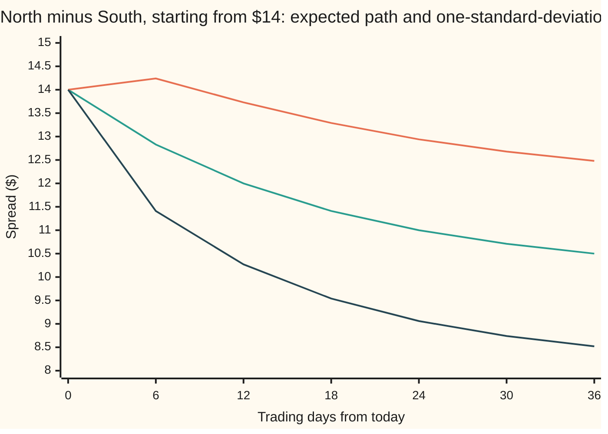

# Mean reversion: fitting an Ornstein-Uhlenbeck spread and trading its z-score

[Syllabus](../../../SYLLABUS.md) → [Financial mathematics](../README.md) → [Signals, Mean Reversion and Backtesting](../README.md#s50) → Mean reversion

---

## General Overview

Two petrol retailers, here called North Fuel and South Fuel, sell the same fuel from similar forecourts at similar margins. When crude oil jumps, both share prices jump. North's price minus South's price is the **spread**. Over years of trading days it has hovered around $10, rarely straying past $6 or $14.

Today it reads $14. North looks expensive against South. A trader can **short the spread**: sell a North share and buy a South share. If the spread falls back to $10, the pair of positions gains $4, whatever the oil price does. Three questions decide the trade. Where is "back"? How fast does the spread come back? How far away is far enough to act?

The method answers all three from the price record alone. Regress each day's spread on the day before, a straight-line fit. The line's slope and intercept convert into three numbers: the level the spread is pulled toward, the speed of the pull, and the size of the everyday noise. The speed becomes a **half-life**, the days for the expected gap to halve: 12 here. The noise becomes a yardstick, the spread's usual distance from its level: $2 here. Today's gap of $4 is 2 yardsticks, a **z-score** of 2. The rule on this card enters at 2 and exits at 0.

**Fit a line of tomorrow's spread against today's, read the pull speed and the usual scatter off the line, and trade the spread when it sits two scatters from its level.**

**What kind of fact this is:** a method resting on a model. That the spread is pulled back in proportion to its gap is an assumption, not a law; the conversions from the fitted line to half-life, level and scatter are proved on this card in Why it works.

### The picture: what the model expects after a $14 reading



Middle line (teal): the expected spread. It falls from $14 to $12 at day 12 and to $11 at day 24: half the gap goes each 12 days. Top line (orange) and bottom line (dark blue): the expected spread plus and minus one standard deviation of where it may actually be. The band opens fast, because fresh noise arrives every day, while the middle line only creeps toward $10. The spread may touch $10 well before day 36 or long after it.

---

## The formula

Notation first, in words. The model is written as a stochastic differential equation ([Mean reversion](../../11-Stochastic%20processes%20and%20calculus/06-Ito%20Calculus/05-ornstein-uhlenbeck-and-cir-processes.md)): $\mathrm{d}X_t$ is the spread's change over a sliver of time $\mathrm{d}t$, and $\mathrm{d}W_t$ is a random kick from Brownian motion over that sliver. Time runs in trading days. A hat over a letter marks a value fitted from data. "sd" is standard deviation.

$$\mathrm{d}X_t = \kappa\,(\theta - X_t)\,\mathrm{d}t + \sigma\,\mathrm{d}W_t$$

**Read it aloud:** each instant, the spread is nudged toward its level by the pull speed times the gap, and kicked at random by a fixed amount of noise.

This is the Ornstein-Uhlenbeck (OU) process. Sampled once a day, it becomes a straight line plus noise:

$$X_{t+1} = \alpha + \beta\,X_t + \varepsilon_{t+1}, \qquad \beta = e^{-\kappa}, \qquad \alpha = (1-\beta)\,\theta$$

**Read it aloud:** tomorrow's spread is a fixed amount, plus a fixed share of today's spread, plus fresh noise.

Fit that line by least squares and run the map backwards:

$$\kappa = -\ln\beta, \qquad h = \frac{\ln 2}{\kappa}, \qquad \theta = \frac{\alpha}{1-\beta}, \qquad s = \frac{\operatorname{sd}(\varepsilon)}{\sqrt{1-\beta^2}}, \qquad z_t = \frac{X_t - \theta}{s}$$

**Read it aloud:** the pull speed is minus the log of the slope; the half-life is log 2 over the pull speed; the level is the intercept over one minus the slope; the long-run scatter is the daily noise stretched by one over the root of one minus the slope squared; the z-score is today's gap in scatters.

The trading rule: short the spread when $z$ reaches +2, buy it when $z$ reaches −2, close either position when $z$ crosses 0.

| Symbol | Plain meaning | In our example | Push it up and the trade… |
| --- | --- | --- | --- |
| $X_t$ | the spread on day t: North's share price minus South's | $14 today | a bigger gap, a bigger z |
| $t$ | time, in trading days | 0 is today | the expected gap shrinks |
| $\theta$ | "theta": the level the spread is pulled toward | $10.00 | entry and exit levels shift up with it |
| $\kappa$ | "kappa": pull speed, the share of the gap closed per day, compounding continuously | 0.057762 per day | shorter waits, more trades |
| $\sigma$ | "sigma": the noise per square-root day | 0.679778 | wider scatter, bigger gains per trade |
| $W_t$ | Brownian motion: the source of the random kicks | — | — |
| $\beta$ | "beta": the share of today's gap still there tomorrow; the fitted slope | 0.943874 | slower pull, longer half-life |
| $\alpha$ | "alpha": the fitted intercept | 0.561257 | a higher level |
| $\varepsilon$ | "epsilon": one day's fresh noise, the fit's leftover | sd $0.660610 | wider scatter |
| $s$ | the spread's long-run standard deviation, its usual distance from the level | $2.00 | a given gap reads as a smaller z |
| $h$ | the half-life: days for the expected gap to halve | 12 days | trades take longer |
| $z$ | the z-score: today's gap measured in units of s | 2 today | nearer an entry |

One helper fact: $\ln 2 = 0.693147$, so the half-life is 0.693147 divided by the pull speed.

### When it holds

- **The spread has a fixed level to return to.** If North and South stop being alike (one is bought out, one loses its refinery contract), the level moves or vanishes, and the fit keeps reporting a half-life for a relationship that no longer exists. Whether a pair has a level at all is tested on [Pairs trading](02-pairs-trading-and-cointegration.md).
- **The pull is proportional to the gap and its speed is constant.** If the pull weakens in a crisis, the half-life fitted in calm years is too short and positions are held far longer than planned.
- **The noise is bell-shaped with a steady size.** Fat tails or bursts of volatility make a z of 2 far more common than the bell curve's 4.55% of days, so entries fire more often and some of them never come back.
- **The spread's recipe is fixed.** This card takes one North share against one South share. A drifting hedge ratio changes the spread itself: [A moving hedge ratio](07-kalman-filter-for-dynamic-hedge-ratios.md).
- **The fit uses only the past.** Parameters fitted on the same days that are traded make the rule look better than it is: [Backtesting](05-backtesting-pitfalls.md).

---

## Why it works

### Step 0: a pull proportional to the gap makes the gap shrink by a fixed share each day

Ignore the noise for a moment. If the spread is $4 above its level and the pull closes a fixed share of whatever gap remains, the gap shrinks like money under steady negative interest: $4, then 0.943874 of that, then 0.943874 of that again. A fixed share per day means tomorrow is a straight-line function of today. That is why an ordinary regression, a tool for straight lines, can fit a continuous-time model at all.

### Step 1: sampled daily, the OU process is exactly a line plus noise

The OU card solves the equation ([Mean reversion](../../11-Stochastic%20processes%20and%20calculus/06-Ito%20Calculus/05-ornstein-uhlenbeck-and-cir-processes.md)). One day after any reading, the spread is

$$X_{t+1} = \theta + e^{-\kappa}(X_t - \theta) + \varepsilon_{t+1},$$

where $\varepsilon$ is bell-shaped, centred on zero, independent of everything before, with variance $\sigma^2(1 - e^{-2\kappa})/(2\kappa)$. Multiply out: the slope is $\beta = e^{-\kappa}$ and the intercept is $\alpha = (1-\beta)\theta$. This is a first-order autoregression, AR(1), a series where each value is a fixed share of the last plus fresh noise ([Autoregression](../../09-Probability%20and%20statistics/12-Time%20Series/02-ar-models.md)). It is exact, not an approximation: no small-time-step shortcut was taken.

### Step 2: least squares recovers the line, and the line maps back to the model

Pair each day with the next: (today, tomorrow). Least squares picks the slope as the co-movement of today and tomorrow divided by the scatter of today, and the intercept so the line passes through the two averages. Then invert Step 1: $\beta = e^{-\kappa}$ gives $\kappa = -\ln\beta$, and $\alpha = (1-\beta)\theta$ gives $\theta = \alpha/(1-\beta)$.

The inverse exists and is unique only when the fitted slope lies strictly between 0 and 1. Boundary cases:

- **Slope 1 or above.** No pull: the spread is a random walk or drifts away. $-\ln\beta$ is zero or negative, the half-life is infinite or meaningless, and at exactly 1 the level divides by zero. The right conclusion is "no mean reversion", not "a very long half-life".
- **Slope 0 or below.** At 0, today says nothing about tomorrow; below 0, the gap flips side of the level each day. No finite positive pull speed produces either, so no OU fits it at this sampling.
- **Slope near 1.** The level $\alpha/(1-\beta)$ divides by a small, noisy number, so the fitted level wanders badly between samples.

<details>
<summary>The algebra behind the fit</summary>

Write the pairs as $(a_i, b_i)$, today then tomorrow, with averages $\bar a$ and $\bar b$. Least squares minimises the sum of squared misses $\sum (b_i - \alpha - \beta a_i)^2$. Setting the derivative in $\alpha$ to zero gives $\alpha = \bar b - \beta\bar a$. Substituting and setting the derivative in $\beta$ to zero gives
$$\hat\beta = \frac{\sum (a_i - \bar a)(b_i - \bar b)}{\sum (a_i - \bar a)^2}.$$
The leftover misses $b_i - \hat\alpha - \hat\beta a_i$ estimate the daily noise; their mean square estimates its variance. With bell-shaped noise, these are also the maximum-likelihood values given the first reading: the likelihood's log is minus half the sum of squared misses over the variance, plus terms free of the line.

</details>

### Step 3: the half-life is where the expected gap halves

Take expectations in Step 1 and repeat for t days: the noise averages to zero each day, so the expected gap is the starting gap times $e^{-\kappa t}$. Set that factor to one half: $e^{-\kappa h} = 1/2$, so $h = \ln 2/\kappa$. In terms of the fitted slope, $h = \ln 2 / (-\ln\beta)$. With a slope of 0.943874, $-\ln\beta = 0.057762$ and the half-life is 0.693147/0.057762 = 12.0000 days.

### Step 4: the long-run scatter balances shrinkage against fresh noise

If the spread has settled into a steady scatter, its variance is the same today and tomorrow. Tomorrow's variance is today's times $\beta^2$, since only a share $\beta$ of today's gap survives, plus the variance of the fresh noise, which is independent. So $s^2 = \beta^2 s^2 + \operatorname{sd}(\varepsilon)^2$, which gives $s = \operatorname{sd}(\varepsilon)/\sqrt{1-\beta^2}$. Here 0.660610 over the root of 0.109101 is $2.0000.

Putting the noise variance from Step 1 into the same balance gives $s^2 = \sigma^2/(2\kappa)$: noise pumps scatter in, the pull drains it, and the level where they balance is the long-run spread. In that steady state the spread is bell-shaped with centre $\theta$ and standard deviation $s$, so $z$ is a standard bell-curve draw.

### Step 5: a z-score threshold is a bell-curve tail, and the exit takes longer than the half-life

Since $z$ is a standard bell-curve draw in the steady state, the share of days with $z$ beyond ±2 is twice the tail beyond 2, or $2(1 - N(2)) = 4.55\%$, where $N(x)$ is the bell-curve area to the left of $x$. An entry at 2 fires rarely, and when it does the spread sits $4 from its level. If it reaches the level, the trade gains $4 per share pair before costs.

How long until it gets there? Not 12 days. The half-life follows the *average* path, which halves its gap every 12 days and never actually reaches $10. The trade closes when the *real* path first touches $10, and that is a first-passage time (the first moment a random path hits a level). Its average, starting from a z-score of 2, is

$$\frac{1}{\kappa}\int_0^{2} \frac{1 - N(u)}{\varphi(u)}\,du,$$

where $\varphi(u)$ is the bell curve's height at $u$. The ratio inside is the Mills ratio (the tail area over the height). The integral gives 24.67 days: two half-lives, not one. A trader who only checks closing prices waits longer still, 29.60 days on average in the simulation below, because paths that dip under $10 during the day and bounce back are missed.

<details>
<summary>Detailed proof: the mean wait from z to 0</summary>

Work in z units, where the model reads $\mathrm{d}z = -\kappa z\,\mathrm{d}t + \sqrt{2\kappa}\,\mathrm{d}W_t$. Let $T(z)$ be the mean wait to reach 0 from $z > 0$. Over a sliver of time, the wait is that sliver plus the mean wait from wherever the path lands. Expanding to second order (Itô's lemma) gives $\kappa\,T''(z) - \kappa z\,T'(z) = -1$, with $T(0) = 0$.

Put $g = T'$. Then $g' - z g = -1/\kappa$. Multiply by $e^{-z^2/2}$: the left side becomes the derivative of $g\,e^{-z^2/2}$. Integrate from $z$ to infinity, choosing the solution that does not blow up far from the level, where the pull is strong:
$$T'(z) = \frac{1}{\kappa}\,e^{z^2/2}\int_z^\infty e^{-u^2/2}\,du = \frac{1}{\kappa}\,\frac{1 - N(z)}{\varphi(z)}.$$
Integrate from 0 to the starting z-score with $T(0) = 0$ to get the formula in the body, with 2 as the upper limit. Ricciardi and Sato (1988) derive this and the higher moments of the same wait.

</details>

Maximum likelihood on the exact daily step is the other standard route to the parameters. With bell-shaped noise it returns the same slope and intercept as least squares, and differs only in how the first reading is treated. Choosing thresholds by maximising expected profit net of costs, rather than by convention, is the optimal-stopping route of Leung and Li, listed in Sources.

---

## Worked numbers, by hand

Suppose the regression of tomorrow's spread on today's returned slope 0.943874, intercept 0.561257, and leftover noise with standard deviation 0.660610.

| Step | Arithmetic | Value |
| --- | --- | --- |
| pull speed, $-\ln\beta$ | $-\ln 0.943874$ | 0.057762 per day |
| half-life, $\ln 2/\kappa$ | $0.693147 / 0.057762$ | **12.0000 days** |
| level, $\alpha/(1-\beta)$ | $0.561257 / 0.056126$ | **$10.0000** |
| $1-\beta^2$ | $1 - 0.943874^2$ | 0.109101 |
| long-run scatter, $s$ | $0.660610 / \sqrt{0.109101}$ | **$2.0000** |
| noise per root day, $\sigma = s\sqrt{2\kappa}$ | $2 \times \sqrt{2 \times 0.057762}$ | 0.679778 |
| short entry, $\theta + 2s$ | $10 + 2 \times 2$ | $14.00 |
| long entry, $\theta - 2s$ | $10 - 2 \times 2$ | $6.00 |
| exit | the level | $10.00 |
| expected spread 12 days after $14 | $10 + 4 \times 0.5$ | $12.0000 |
| its standard deviation | $2 \times \sqrt{1 - 0.5^2}$ | $1.7321 |
| gain if it reaches the level | $14 - 10$ | **$4.00 per share pair** |

At $14 the spread is 2 scatters rich. Twelve days on, the model expects $12, give or take $1.7321: most of the gap is still there, and the trade is a wait measured in weeks, not days.

### Setting the thresholds

Entry and exit are choices, not outputs of the fit. The check fits the model on the first 1260 days of a simulated 2520-day record and trades the last 1260 with those fitted numbers, charging $1.00 per round trip (open and close together) for fees and the bid-ask spread. Results, in dollars per share pair:

| Enter at z | Trades | Mean hold, days | Gain per trade | Total | After $1.00 a trade |
| --- | --- | --- | --- | --- | --- |
| 1.0 | 37 | 18.92 | $2.82 | $104.50 | $67.50 |
| 1.5 | 17 | 22.47 | $3.89 | $66.14 | $49.14 |
| 2.0 | 7 | 24.14 | $4.68 | $32.79 | $25.79 |
| 2.5 | 2 | 37.50 | $6.06 | $12.12 | $10.12 |
| 3.0 | 1 | 54.00 | $6.72 | $6.72 | $5.72 |

```
Total after costs, entry thresholds on the left, $2 per block
z 1.0   ██████████████████████████████████  $67.50
z 1.5   █████████████████████████           $49.14
z 2.0   █████████████                       $25.79
z 2.5   █████                               $10.12
z 3.0   ███                                 $5.72
```

Inside a perfect OU world, a lower entry wins: more trades, each still expected to profit. The conventional 2 buys other things. Each trade carries a gap big enough to survive costs several times over, and fewer trades are exposed if the relationship breaks, which a real pair can do and a simulated one cannot. A low threshold is the first casualty when the level itself moves.

### What breaks if you drop a piece

| Mistake | Comes out at | What went wrong |
| --- | --- | --- |
| Half-life from the differencing slope, $\ln 2/(1-\beta)$ | 12.35 days, right 12 | $-\ln\beta$ was replaced by its first-order stand-in $1-\beta$ |
| z-score scaled by one day's noise | a $4 gap reads 6.06, right 2 | 0.6606 is one day's kick, not the long-run scatter of $2 |
| Half-life read as the holding period | 12 days; the mean wait is 24.67, or 29.60 checked at each close | the half-life tracks the average path, not the first touch |
| One five-year fit taken as the truth | 12.51 days by road 1, 10.95 by road 2 | 90% of five-year records give between 8.89 and 14.82 days |

---

## Code, from first principles, and it actually runs

The scripts simulate the North-minus-South spread from the true model, writing their own random numbers, bell-curve area and integrals, then fit it blind. The half-life is fitted by two roads: road 1 regresses tomorrow on today; road 2 regresses the spread 12 days on against today, a slope that should be one half. Fits to 300 fresh five-year records show how far one record can be trusted; on one 1,000,000-day record both roads must land within 0.2 days of 12 and 0.15 days of each other. Each promise of the model is then checked against simulation: the spread 12 days after $14 against 20,000 paths, the 4.55% tail by power series and by Simpson's rule against 200,000 days, the Mills-ratio wait against simulated waits. Every asserted pair is formula against simulation, series against integral, or road against road.

### Python

```python
# Mean reversion -- the check behind the card.  Standard library only.
# A spread between two petrol retailers is simulated from a known Ornstein-
# Uhlenbeck model, then fitted blind.  The random numbers, the bell-curve area
# and both integrals are written here; nothing imported knows the answer.
from math import log, exp, sqrt, cos, pi

MASK = (1 << 64) - 1
state = 20260928
def uniform():                                  # splitmix64, top 53 bits into (0, 1)
    global state
    state = (state + 0x9E3779B97F4A7C15) & MASK
    z = state
    z = ((z ^ (z >> 30)) * 0xBF58476D1CE4E5B9) & MASK
    z = ((z ^ (z >> 27)) * 0x94D049BB133111EB) & MASK
    z ^= z >> 31
    return ((z >> 11) + 0.5) / 9007199254740992.0
def normal():                                   # Box-Muller: two uniforms, one bell-curve draw
    u1, u2 = uniform(), uniform()
    return sqrt(-2.0 * log(u1)) * cos(2.0 * pi * u2)
def ncdf(x):                                    # bell-curve area left of x, by its power series
    term, total, k = x, x, 1
    while abs(term) > 1e-17 * (1.0 + abs(total)):
        term *= x * x / (2 * k + 1); total += term; k += 1
    return 0.5 + exp(-0.5 * x * x) / sqrt(2.0 * pi) * total
def simpson(f, a, b, n):
    h = (b - a) / n
    return (f(a) + f(b) + sum((4 if i % 2 else 2) * f(a + i * h) for i in range(1, n))) * h / 3.0

# ---- the true model: dollars and trading days ----
theta, sd, half = 10.0, 2.0, 12.0               # long-run mean, long-run spread, half-life
kappa = log(2.0) / half                         # pull speed per day
beta = exp(-kappa)                              # share of a gap left after one day
alpha = (1.0 - beta) * theta
eps_sd = sd * sqrt(1.0 - beta * beta)           # one day's fresh noise
sigma = sqrt(2.0 * kappa) * sd                  # noise per square-root day
def step(x): return alpha + beta * x + eps_sd * normal()
def slope(a, b):                                # least-squares slope and intercept of b on a
    n = len(a); ma, mb = sum(a) / n, sum(b) / n
    sab = sum((p - ma) * (q - mb) for p, q in zip(a, b))
    saa = sum((p - ma) * (p - ma) for p in a)
    return sab / saa, mb - sab / saa * ma
def fit(xs):                                    # road 1: tomorrow on today, then map to OU
    b, a = slope(xs[:-1], xs[1:])
    q = sum((y - a - b * x) * (y - a - b * x) for x, y in zip(xs[:-1], xs[1:])) / (len(xs) - 1)
    k = -log(b)
    return b, a, sqrt(q), k, log(2.0) / k, a / (1.0 - b), sqrt(q / (1.0 - b * b))
def trade(xs, th, s, enter):                    # short at z >= +enter, long at z <= -enter, out at 0
    pos, x0, t0, gains, holds = 0, 0.0, 0, [], []
    for t, x in enumerate(xs):
        z = (x - th) / s
        if pos == 0 and abs(z) >= enter:
            pos, x0, t0 = (-1 if z > 0 else 1), x, t
        elif pos != 0 and pos * z >= 0.0:
            gains.append(pos * (x - x0)); holds.append(t - t0); pos = 0
    return gains, holds

print(f"hand: beta {beta:.6f}  alpha {alpha:.6f}  one-day noise {eps_sd:.6f}  ln 2 {log(2.0):.6f}")
print(f"hand: 1 - beta {1 - beta:.6f}  -ln beta {kappa:.6f}  1 - beta^2 {1 - beta * beta:.6f}")
print(f"hand: half-life {log(2.0) / -log(beta):.4f}  mean {alpha / (1 - beta):.4f}  "
      f"long-run sd {eps_sd / sqrt(1 - beta * beta):.4f}  sigma {sigma:.6f}")
print(f"hand: enter short at {theta + 2 * sd:.2f}  enter long at {theta - 2 * sd:.2f}  exit at {theta:.2f}  gain to the mean {2 * sd:.2f}")
e12 = exp(-12.0 * kappa)
print(f"hand: from 14, day 12 mean {theta + 4.0 * e12:.4f}  sd {sd * sqrt(1.0 - e12 * e12):.4f}")
for name, f in (("day", lambda t: t), ("expected", lambda t: theta + 4.0 * exp(-kappa * t)),
                ("plus one sd", lambda t: theta + 4.0 * exp(-kappa * t) + sd * sqrt(1.0 - exp(-2.0 * kappa * t))),
                ("minus one sd", lambda t: theta + 4.0 * exp(-kappa * t) - sd * sqrt(1.0 - exp(-2.0 * kappa * t)))):
    print(f"chart, {name:<12}" + "".join(f"{f(float(t)):7.2f}" for t in range(0, 37, 6)))

# ---- road 1 and road 2 on one ten-year record, fitted on the first five ----
xs = [theta + sd * normal()]
for _ in range(2520): xs.append(step(xs[-1]))
train, test = xs[:1261], xs[1260:]
bh, ah, qh, kh, hh, th, sdh = fit(train)
print(f"record: {len(xs) - 1} days; fitted on the first {len(train) - 1}, traded on the last {len(test) - 1}")
b12, _ = slope(train[:-12], train[12:])
h12 = 12.0 * log(2.0) / -log(b12)
print(f"fit, 1260 days: beta {bh:.6f}  alpha {ah:.6f}  one-day noise {qh:.6f}  kappa {kh:.6f}")
print(f"fit, 1260 days: half-life {hh:.2f} d  mean {th:.4f}  long-run sd {sdh:.4f}")
print(f"road 2, 12-day slope {b12:.4f}  half-life from it {h12:.2f} d")
hs = []
for _ in range(300):
    ys = [theta + sd * normal()]
    for _ in range(1260): ys.append(step(ys[-1]))
    hs.append(fit(ys)[4])
hs.sort()
print(f"300 records of 1260 days: fitted half-life 5th pct {hs[14]:.2f}  median {hs[149]:.2f}  95th pct {hs[284]:.2f}")

# ---- the model's promises, checked against simulation ----
ends = []
for _ in range(20000):
    x = 14.0
    for _ in range(12): x = step(x)
    ends.append(x)
mc_mean = sum(ends) / 20000
mc_sd = sqrt(sum((e - mc_mean) * (e - mc_mean) for e in ends) / 19999)
print(f"from 14, day 12, 20000 paths: mean {mc_mean:.4f}  sd {mc_sd:.4f}")
tail = 2.0 * (1.0 - ncdf(2.0))
tail_int = 1.0 - simpson(lambda u: exp(-0.5 * u * u) / sqrt(2.0 * pi), -2.0, 2.0, 2000)
x, far = theta + sd * normal(), 0
for _ in range(200000):
    x = step(x); far += abs(x - theta) >= 2.0 * sd
print(f"share of days |z| >= 2: series {tail:.6f}  integral {tail_int:.6f}  200000 days {far / 200000:.4f}")
def mills(s): return (1.0 - ncdf(s)) * sqrt(2.0 * pi) * exp(0.5 * s * s)
wait = simpson(mills, 0.0, 2.0, 400) / kappa     # mean wait from z = 2 down to 0, watched always
def sim_wait(sub, trials, bridge):              # the same wait, simulated in `sub` slices a day
    bs = exp(-kappa / sub); es = sd * sqrt(1.0 - bs * bs); tot = 0.0
    for _ in range(trials):
        x, k = 14.0, 0
        while True:
            y = theta + bs * (x - theta) + es * normal(); k += 1
            if y <= theta: break
            if bridge and uniform() < exp(-2.0 * (x - theta) * (y - theta) / (es * es)): break
            x = y
        tot += k - (0.5 if bridge else 0.0)
    return tot / trials / sub
w4, w1 = sim_wait(4, 10000, True), sim_wait(1, 20000, False)
print(f"wait z 2 -> 0: formula {wait:.2f} d  simulated, watched always {w4:.2f} d  checked at each close {w1:.2f} d")
xs = [theta + sd * normal()]                      # one long record: both roads should land on 12
for _ in range(1000000): xs.append(step(xs[-1]))
r1, r2 = fit(xs)[4], 12.0 * log(2.0) / -log(slope(xs[:-12], xs[12:])[0])
print(f"1000000 days: half-life by road 1 {r1:.2f} d  by road 2 {r2:.2f} d")

# ---- thresholds: fitted on years 1-5, traded on years 6-10, $1.00 cost a round trip ----
print("enter  trades  hold d  gain/trade $  total $  after 1.00 a trade $")
for e in (1.0, 1.5, 2.0, 2.5, 3.0):
    g, hd = trade(test, th, sdh, e)
    print(f"{e:5.1f}  {len(g):6d}  {sum(hd) / len(g):6.2f}  {sum(g) / len(g):12.2f}  {sum(g):7.2f}  {sum(g) - len(g):20.2f}")

# ---- what breaks ----
print(f"wrong: half-life from the Euler slope, ln 2 / (1 - beta) = {log(2.0) / (1.0 - beta):.2f} d")
print(f"wrong: z from one-day noise, 4 / {eps_sd:.4f} = {4.0 / eps_sd:.2f}")

assert abs(mc_mean - (theta + 4.0 * e12)) < 0.05          # simulated mean vs the transition formula
assert abs(mc_sd - sd * sqrt(1.0 - e12 * e12)) < 0.04    # simulated spread vs the transition formula
assert abs(tail - tail_int) < 1e-9                       # series vs integral for the bell-curve tail
assert abs(far / 200000 - tail) < 0.01                   # time beyond 2 sd vs the long-run bell curve
assert abs(w4 - wait) < 1.0                              # simulated wait vs the Mills-ratio integral
assert hs[14] < half < hs[284] and abs(hs[149] - half) < 1.5   # the regression recovers 12 days
assert abs(r1 - half) < 0.2 and abs(r2 - half) < 0.2 and abs(r1 - r2) < 0.15  # two roads, one answer
print("ALL CHECKS PASS")
```

**Ran 2026-09-28 on macOS, Python 3.14.6, standard library only. All checks passed. Output, pasted from the run:**

```
hand: beta 0.943874  alpha 0.561257  one-day noise 0.660610  ln 2 0.693147
hand: 1 - beta 0.056126  -ln beta 0.057762  1 - beta^2 0.109101
hand: half-life 12.0000  mean 10.0000  long-run sd 2.0000  sigma 0.679778
hand: enter short at 14.00  enter long at 6.00  exit at 10.00  gain to the mean 4.00
hand: from 14, day 12 mean 12.0000  sd 1.7321
chart, day            0.00   6.00  12.00  18.00  24.00  30.00  36.00
chart, expected      14.00  12.83  12.00  11.41  11.00  10.71  10.50
chart, plus one sd   14.00  14.24  13.73  13.29  12.94  12.68  12.48
chart, minus one sd  14.00  11.41  10.27   9.54   9.06   8.74   8.52
record: 2520 days; fitted on the first 1260, traded on the last 1260
fit, 1260 days: beta 0.946092  alpha 0.518217  one-day noise 0.651247  kappa 0.055415
fit, 1260 days: half-life 12.51 d  mean 9.6131  long-run sd 2.0107
road 2, 12-day slope 0.4679  half-life from it 10.95 d
300 records of 1260 days: fitted half-life 5th pct 8.89  median 11.36  95th pct 14.82
from 14, day 12, 20000 paths: mean 12.0064  sd 1.7372
share of days |z| >= 2: series 0.045500  integral 0.045500  200000 days 0.0434
wait z 2 -> 0: formula 24.67 d  simulated, watched always 24.90 d  checked at each close 29.60 d
1000000 days: half-life by road 1 11.88 d  by road 2 11.92 d
enter  trades  hold d  gain/trade $  total $  after 1.00 a trade $
  1.0      37   18.92          2.82   104.50                 67.50
  1.5      17   22.47          3.89    66.14                 49.14
  2.0       7   24.14          4.68    32.79                 25.79
  2.5       2   37.50          6.06    12.12                 10.12
  3.0       1   54.00          6.72     6.72                  5.72
wrong: half-life from the Euler slope, ln 2 / (1 - beta) = 12.35 d
wrong: z from one-day noise, 4 / 0.6606 = 6.06
ALL CHECKS PASS
```

### Rust

Same random numbers, same order, same labels. Python's `sum()` adds floats with a compensated sum, so the Rust program uses the same one.

```rust
// Mean reversion -- the same check as the Python, in Rust.  No crates.
// A spread between two petrol retailers is simulated from a known Ornstein-
// Uhlenbeck model, then fitted blind.  The random numbers, the bell-curve area
// and both integrals are written here; nothing imported knows the answer.
use std::f64::consts::PI;

struct Rng(u64);
impl Rng {
    fn uniform(&mut self) -> f64 {              // splitmix64, top 53 bits into (0, 1)
        self.0 = self.0.wrapping_add(0x9E3779B97F4A7C15);
        let mut z = self.0;
        z = (z ^ (z >> 30)).wrapping_mul(0xBF58476D1CE4E5B9);
        z = (z ^ (z >> 27)).wrapping_mul(0x94D049BB133111EB);
        z ^= z >> 31;
        ((z >> 11) as f64 + 0.5) / 9007199254740992.0
    }
    fn normal(&mut self) -> f64 {               // Box-Muller: two uniforms, one bell-curve draw
        let (u1, u2) = (self.uniform(), self.uniform());
        (-2.0 * u1.ln()).sqrt() * (2.0 * PI * u2).cos()
    }
}
fn psum(v: impl Iterator<Item = f64>) -> f64 { // compensated sum, as Python's sum() adds floats
    let (mut s, mut c) = (0.0f64, 0.0f64);
    for x in v {
        let t = s + x;
        if s.abs() >= x.abs() { c += (s - t) + x } else { c += (x - t) + s }
        s = t;
    }
    if c != 0.0 && c.is_finite() { s + c } else { s }
}
fn ncdf(x: f64) -> f64 {                        // bell-curve area left of x, by its power series
    let (mut term, mut total, mut k) = (x, x, 1.0);
    while term.abs() > 1e-17 * (1.0 + total.abs()) {
        term *= x * x / (2.0 * k + 1.0); total += term; k += 1.0;
    }
    0.5 + (-0.5 * x * x).exp() / (2.0 * PI).sqrt() * total
}
fn simpson(f: &dyn Fn(f64) -> f64, a: f64, b: f64, n: usize) -> f64 {
    let h = (b - a) / n as f64;
    (f(a) + f(b) + psum((1..n).map(|i| (if i % 2 == 1 { 4.0 } else { 2.0 }) * f(a + i as f64 * h)))) * h / 3.0
}
fn slope(a: &[f64], b: &[f64]) -> (f64, f64) { // least-squares slope and intercept of b on a
    let n = a.len() as f64;
    let (ma, mb) = (psum(a.iter().copied()) / n, psum(b.iter().copied()) / n);
    let sab = psum(a.iter().zip(b).map(|(p, q)| (p - ma) * (q - mb)));
    let saa = psum(a.iter().map(|p| (p - ma) * (p - ma)));
    (sab / saa, mb - sab / saa * ma)
}
fn fit(xs: &[f64]) -> (f64, f64, f64, f64, f64, f64, f64) { // road 1: tomorrow on today, then map to OU
    let (b, a) = slope(&xs[..xs.len() - 1], &xs[1..]);
    let q = psum(xs.windows(2).map(|w| (w[1] - a - b * w[0]) * (w[1] - a - b * w[0]))) / (xs.len() - 1) as f64;
    let k = -b.ln();
    (b, a, q.sqrt(), k, 2f64.ln() / k, a / (1.0 - b), (q / (1.0 - b * b)).sqrt())
}
fn trade(xs: &[f64], th: f64, s: f64, enter: f64) -> (Vec<f64>, Vec<usize>) {
    let (mut pos, mut x0, mut t0, mut gains, mut holds) = (0.0f64, 0.0, 0usize, vec![], vec![]);
    for (t, &x) in xs.iter().enumerate() {      // short at z >= +enter, long at z <= -enter, out at 0
        let z = (x - th) / s;
        if pos == 0.0 && z.abs() >= enter {
            pos = if z > 0.0 { -1.0 } else { 1.0 }; x0 = x; t0 = t;
        } else if pos != 0.0 && pos * z >= 0.0 {
            gains.push(pos * (x - x0)); holds.push(t - t0); pos = 0.0;
        }
    }
    (gains, holds)
}
fn main() {
    let mut rng = Rng(20260928);
    let (theta, sd, half) = (10.0f64, 2.0f64, 12.0f64);
    let kappa = 2f64.ln() / half;
    let beta = (-kappa).exp();
    let alpha = (1.0 - beta) * theta;
    let eps_sd = sd * (1.0 - beta * beta).sqrt();
    let sigma = (2.0 * kappa).sqrt() * sd;
    let step = |x: f64, r: &mut Rng| alpha + beta * x + eps_sd * r.normal();
    println!("hand: beta {:.6}  alpha {:.6}  one-day noise {:.6}  ln 2 {:.6}", beta, alpha, eps_sd, 2f64.ln());
    println!("hand: 1 - beta {:.6}  -ln beta {:.6}  1 - beta^2 {:.6}", 1.0 - beta, kappa, 1.0 - beta * beta);
    println!("hand: half-life {:.4}  mean {:.4}  long-run sd {:.4}  sigma {:.6}",
             2f64.ln() / -beta.ln(), alpha / (1.0 - beta), eps_sd / (1.0 - beta * beta).sqrt(), sigma);
    println!("hand: enter short at {:.2}  enter long at {:.2}  exit at {:.2}  gain to the mean {:.2}", theta + 2.0 * sd, theta - 2.0 * sd, theta, 2.0 * sd);
    let e12 = (-12.0 * kappa).exp();
    println!("hand: from 14, day 12 mean {:.4}  sd {:.4}", theta + 4.0 * e12, sd * (1.0 - e12 * e12).sqrt());
    let mean_t = |t: f64| theta + 4.0 * (-kappa * t).exp();
    let sd_t = |t: f64| sd * (1.0 - (-2.0 * kappa * t).exp()).sqrt();
    let rows: [(&str, Box<dyn Fn(f64) -> f64>); 4] = [("day", Box::new(|t| t)), ("expected", Box::new(mean_t)),
        ("plus one sd", Box::new(move |t| mean_t(t) + sd_t(t))), ("minus one sd", Box::new(move |t| mean_t(t) - sd_t(t)))];
    for (name, f) in rows.iter() {
        let cells: String = (0..7).map(|i| format!("{:7.2}", f(6.0 * i as f64))).collect();
        println!("chart, {:<12}{}", name, cells);
    }
    // ---- road 1 and road 2 on one ten-year record, fitted on the first five ----
    let mut xs = vec![theta + sd * rng.normal()];
    for _ in 0..2520 { let x = step(*xs.last().unwrap(), &mut rng); xs.push(x) }
    let (train, test) = (&xs[..1261], &xs[1260..]);
    let (bh, ah, qh, kh, hh, th, sdh) = fit(train);
    println!("record: {} days; fitted on the first {}, traded on the last {}", xs.len() - 1, train.len() - 1, test.len() - 1);
    let (b12, _) = slope(&train[..train.len() - 12], &train[12..]);
    let h12 = 12.0 * 2f64.ln() / -b12.ln();
    println!("fit, 1260 days: beta {:.6}  alpha {:.6}  one-day noise {:.6}  kappa {:.6}", bh, ah, qh, kh);
    println!("fit, 1260 days: half-life {:.2} d  mean {:.4}  long-run sd {:.4}", hh, th, sdh);
    println!("road 2, 12-day slope {:.4}  half-life from it {:.2} d", b12, h12);
    let mut hs = vec![];
    for _ in 0..300 {
        let mut ys = vec![theta + sd * rng.normal()];
        for _ in 0..1260 { let y = step(*ys.last().unwrap(), &mut rng); ys.push(y) }
        hs.push(fit(&ys).4);
    }
    hs.sort_by(|a, b| a.partial_cmp(b).unwrap());
    println!("300 records of 1260 days: fitted half-life 5th pct {:.2}  median {:.2}  95th pct {:.2}", hs[14], hs[149], hs[284]);
    // ---- the model's promises, checked against simulation ----
    let mut ends = vec![];
    for _ in 0..20000 {
        let mut x = 14.0;
        for _ in 0..12 { x = step(x, &mut rng) }
        ends.push(x);
    }
    let mc_mean = psum(ends.iter().copied()) / 20000.0;
    let mc_sd = (psum(ends.iter().map(|e| (e - mc_mean) * (e - mc_mean))) / 19999.0).sqrt();
    println!("from 14, day 12, 20000 paths: mean {:.4}  sd {:.4}", mc_mean, mc_sd);
    let tail = 2.0 * (1.0 - ncdf(2.0));
    let tail_int = 1.0 - simpson(&|u: f64| (-0.5 * u * u).exp() / (2.0 * PI).sqrt(), -2.0, 2.0, 2000);
    let (mut x, mut far) = (theta + sd * rng.normal(), 0u32);
    for _ in 0..200000 { x = step(x, &mut rng); if (x - theta).abs() >= 2.0 * sd { far += 1 } }
    let frac = far as f64 / 200000.0;
    println!("share of days |z| >= 2: series {:.6}  integral {:.6}  200000 days {:.4}", tail, tail_int, frac);
    let mills = |s: f64| (1.0 - ncdf(s)) * (2.0 * PI).sqrt() * (0.5 * s * s).exp();
    let wait = simpson(&mills, 0.0, 2.0, 400) / kappa;  // mean wait from z = 2 down to 0, watched always
    let mut sim_wait = |sub: f64, trials: usize, bridge: bool| {
        let bs = (-kappa / sub).exp();
        let es = sd * (1.0 - bs * bs).sqrt();
        let mut tot = 0.0;
        for _ in 0..trials {
            let (mut x, mut k) = (14.0f64, 0.0f64);
            loop {
                let y = theta + bs * (x - theta) + es * rng.normal(); k += 1.0;
                if y <= theta { break }
                if bridge && rng.uniform() < (-2.0 * (x - theta) * (y - theta) / (es * es)).exp() { break }
                x = y;
            }
            tot += k - if bridge { 0.5 } else { 0.0 };
        }
        tot / trials as f64 / sub
    };
    let (w4, w1) = (sim_wait(4.0, 10000, true), sim_wait(1.0, 20000, false));
    println!("wait z 2 -> 0: formula {:.2} d  simulated, watched always {:.2} d  checked at each close {:.2} d", wait, w4, w1);
    let mut xs = vec![theta + sd * rng.normal()];   // one long record: both roads should land on 12
    for _ in 0..1000000 { let x = step(*xs.last().unwrap(), &mut rng); xs.push(x) }
    let (r1, r2) = (fit(&xs).4, 12.0 * 2f64.ln() / -slope(&xs[..xs.len() - 12], &xs[12..]).0.ln());
    println!("1000000 days: half-life by road 1 {:.2} d  by road 2 {:.2} d", r1, r2);
    // ---- thresholds: fitted on years 1-5, traded on years 6-10, $1.00 cost a round trip ----
    println!("enter  trades  hold d  gain/trade $  total $  after 1.00 a trade $");
    for e in [1.0, 1.5, 2.0, 2.5, 3.0] {
        let (g, hd) = trade(test, th, sdh, e);
        let (n, tg) = (g.len(), psum(g.iter().copied()));
        println!("{:5.1}  {:6}  {:6.2}  {:12.2}  {:7.2}  {:20.2}", e, n,
                 hd.iter().sum::<usize>() as f64 / n as f64, tg / n as f64, tg, tg - n as f64);
    }
    // ---- what breaks ----
    println!("wrong: half-life from the Euler slope, ln 2 / (1 - beta) = {:.2} d", 2f64.ln() / (1.0 - beta));
    println!("wrong: z from one-day noise, 4 / {:.4} = {:.2}", eps_sd, 4.0 / eps_sd);
    assert!((mc_mean - (theta + 4.0 * e12)).abs() < 0.05);         // simulated mean vs the transition formula
    assert!((mc_sd - sd * (1.0 - e12 * e12).sqrt()).abs() < 0.04); // simulated spread vs the transition formula
    assert!((tail - tail_int).abs() < 1e-9);                       // series vs integral for the bell-curve tail
    assert!((frac - tail).abs() < 0.01);                           // time beyond 2 sd vs the long-run bell curve
    assert!((w4 - wait).abs() < 1.0);                              // simulated wait vs the Mills-ratio integral
    assert!(hs[14] < half && half < hs[284] && (hs[149] - half).abs() < 1.5); // the regression recovers 12 days
    assert!((r1 - half).abs() < 0.2 && (r2 - half).abs() < 0.2 && (r1 - r2).abs() < 0.15); // two roads, one answer
    println!("ALL CHECKS PASS");
}
```

**Ran 2026-09-28 on macOS, rustc 1.98.1, no crates. All checks passed. Output, pasted from the run:**

```
hand: beta 0.943874  alpha 0.561257  one-day noise 0.660610  ln 2 0.693147
hand: 1 - beta 0.056126  -ln beta 0.057762  1 - beta^2 0.109101
hand: half-life 12.0000  mean 10.0000  long-run sd 2.0000  sigma 0.679778
hand: enter short at 14.00  enter long at 6.00  exit at 10.00  gain to the mean 4.00
hand: from 14, day 12 mean 12.0000  sd 1.7321
chart, day            0.00   6.00  12.00  18.00  24.00  30.00  36.00
chart, expected      14.00  12.83  12.00  11.41  11.00  10.71  10.50
chart, plus one sd   14.00  14.24  13.73  13.29  12.94  12.68  12.48
chart, minus one sd  14.00  11.41  10.27   9.54   9.06   8.74   8.52
record: 2520 days; fitted on the first 1260, traded on the last 1260
fit, 1260 days: beta 0.946092  alpha 0.518217  one-day noise 0.651247  kappa 0.055415
fit, 1260 days: half-life 12.51 d  mean 9.6131  long-run sd 2.0107
road 2, 12-day slope 0.4679  half-life from it 10.95 d
300 records of 1260 days: fitted half-life 5th pct 8.89  median 11.36  95th pct 14.82
from 14, day 12, 20000 paths: mean 12.0064  sd 1.7372
share of days |z| >= 2: series 0.045500  integral 0.045500  200000 days 0.0434
wait z 2 -> 0: formula 24.67 d  simulated, watched always 24.90 d  checked at each close 29.60 d
1000000 days: half-life by road 1 11.88 d  by road 2 11.92 d
enter  trades  hold d  gain/trade $  total $  after 1.00 a trade $
  1.0      37   18.92          2.82   104.50                 67.50
  1.5      17   22.47          3.89    66.14                 49.14
  2.0       7   24.14          4.68    32.79                 25.79
  2.5       2   37.50          6.06    12.12                 10.12
  3.0       1   54.00          6.72     6.72                  5.72
wrong: half-life from the Euler slope, ln 2 / (1 - beta) = 12.35 d
wrong: z from one-day noise, 4 / 0.6606 = 6.06
ALL CHECKS PASS
```

The two outputs match line for line. Roads 1 and 2 give 12.51 and 10.95 days because five years of one spread carry little information, not because a road is wrong: both sit inside the 300-record range. On 1,000,000 days the roads give 11.88 and 11.92. The median of 11.36, a little under 12, is the known downward lean of a least-squares slope on a short autoregression.

> [!TIP]
> **Try changing**
> Guess the direction first. Then run it.
> - **Halve the half-life.** Set `half = 6.0`. Every wait roughly halves, entries at 2 nearly double in number, and all asserts still pass: the method has no special tie to 12 days.
> - **Watch only at the ends of slices.** In the line that sets `w4, w1`, change `True` to `False` in the first call. The simulated wait jumps above the formula and the wait assert stops the run: touches between checks go unseen, the same effect that separates 24.67 from 29.60.
> - **Forget the transition's variance.** In the spread assert, replace `sd * sqrt(1.0 - e12 * e12)` with `sd`. The run stops: 12 days after a reading, the spread has not yet forgotten where it started, so its scatter is still below the long-run $2.

---

## The usual mistake

> [!warning]
> **Reading the half-life as the holding period.** A 12-day half-life means the *expected* gap halves in 12 days. It does not say the trade closes in 12 days, or ever. Starting from z = 2, the mean wait to touch the level is 24.67 days, and 29.60 when only closing prices count. Size positions and funding for the wait, not the half-life.
>
> - **The differencing shortcut.** Regressing the day's *change* on yesterday's level gives slope $\beta - 1$, and $\ln 2/(1-\beta)$ is the common shortcut. It reports 12.35 days for a true 12, and the error grows as the pull strengthens.
> - **The wrong yardstick.** Dividing the gap by the daily noise, 0.6606, instead of the long-run scatter, $2, makes a z of 2 read 6.06: every ordinary day looks like a signal.
> - **Fitting on the days being traded.** The level and scatter must come from earlier data. Fitting on the whole record, then trading it, uses tomorrow's prices to decide today: [Backtesting](05-backtesting-pitfalls.md).
> - **Trusting one half-life.** Five years of daily data put the fitted half-life anywhere from 8.89 to 14.82 days for a true 12. Quote a range, and treat a fitted slope near 1 as "no reversion found".

---

## Where you meet it in real life

- **Pairs trading desks.** The classic rule of Gatev, Goetzmann and Rouwenhorst opens a pair when the normalised price gap passes two standard deviations and closes it when prices cross: this card's rule, with the pair chosen as on [Pairs trading](02-pairs-trading-and-cointegration.md).
- **Refining margins.** The crack spread, petrol and diesel prices minus the crude oil they are made from, is pulled back by refiners switching output on and off. Traders fit its half-life the same way.
- **Interest rates.** The Vasicek short-rate model is the same equation, with the rate pulled toward a long-run level. Fitting it on daily data is Step 2.
- **The opposite bet.** A signal that expects moves to continue rather than reverse lives on [Momentum and factor signals](03-momentum-and-factor-signals.md). Trying many thresholds and keeping the best one inflates the result: [Trying many strategies](06-deflated-sharpe-and-multiple-testing.md).

> **Say it back**
> A mean-reverting spread is modelled as an OU process: pulled toward a level in proportion to its gap, kicked by steady noise. Sampled daily, it is exactly a straight line of tomorrow on today, so least squares fits it. The slope gives the pull speed and the half-life, log 2 over that speed; the intercept gives the level; the leftover noise, stretched by one over the root of one minus the slope squared, gives the long-run scatter. The z-score measures today's gap in scatters, and the rule enters at 2 and exits at 0. The half-life is how fast the average gap shrinks, not how long a trade lasts: from z = 2 the wait averages about two half-lives.

---

## What this builds on

- [Mean reversion](../../11-Stochastic%20processes%20and%20calculus/06-Ito%20Calculus/05-ornstein-uhlenbeck-and-cir-processes.md): the OU equation, its exact solution and its steady bell curve. Step 1 samples that solution once a day.
- [Autoregression](../../09-Probability%20and%20statistics/12-Time%20Series/02-ar-models.md): the first-order autoregression, and why a slope strictly between 0 and 1 means a series with a steady level and scatter.

## Where this goes next

- [Pairs trading](02-pairs-trading-and-cointegration.md): how to choose the pair, estimate the hedge ratio, and test whether the spread has a level at all.

This card took North minus South as given and fitted its pull; whether a spread of two prices deserves an OU fit in the first place is the question that card answers.

---

## Sources

Verified 2026-09-28: every link below resolves to the publisher's page.

- Uhlenbeck, G. E., and L. S. Ornstein. "On the Theory of the Brownian Motion." *Physical Review* 36, no. 5 (1930): 823–841. [doi:10.1103/PhysRev.36.823](https://doi.org/10.1103/PhysRev.36.823). The process itself, first written down for the velocity of a particle.
- Gatev, Evan, William N. Goetzmann, and K. Geert Rouwenhorst. "Pairs Trading: Performance of a Relative-Value Arbitrage Rule." *Review of Financial Studies* 19, no. 3 (2006): 797–827. [doi:10.1093/rfs/hhj020](https://doi.org/10.1093/rfs/hhj020). The two-standard-deviation entry and cross-to-exit rule, tested on decades of US shares.
- Chan, Ernest P. *Algorithmic Trading: Winning Strategies and Their Rationale*. Wiley, 2013. [Publisher page](https://www.wiley.com/en-us/Algorithmic+Trading%3A+Winning+Strategies+and+Their+Rationale-p-9781118460146). The practitioner's half-life by regression and the z-score rule, in its chapters on mean reversion.
- Leung, Tim, and Xin Li. *Optimal Mean Reversion Trading*. World Scientific, 2015. [doi:10.1142/9839](https://doi.org/10.1142/9839). Likelihood fitting of the OU spread and entry and exit levels chosen by optimal stopping.
- Ricciardi, Luigi M., and Shunsuke Sato. "First-Passage-Time Density and Moments of the Ornstein-Uhlenbeck Process." *Journal of Applied Probability* 25, no. 1 (1988): 43–57. [doi:10.2307/3214232](https://doi.org/10.2307/3214232). The mean wait to reach the level, used in Step 5.
