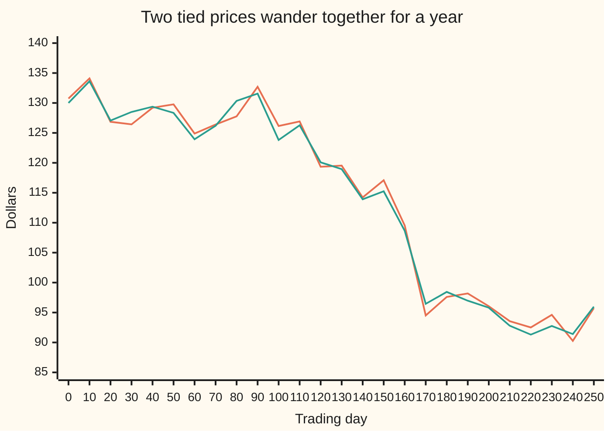
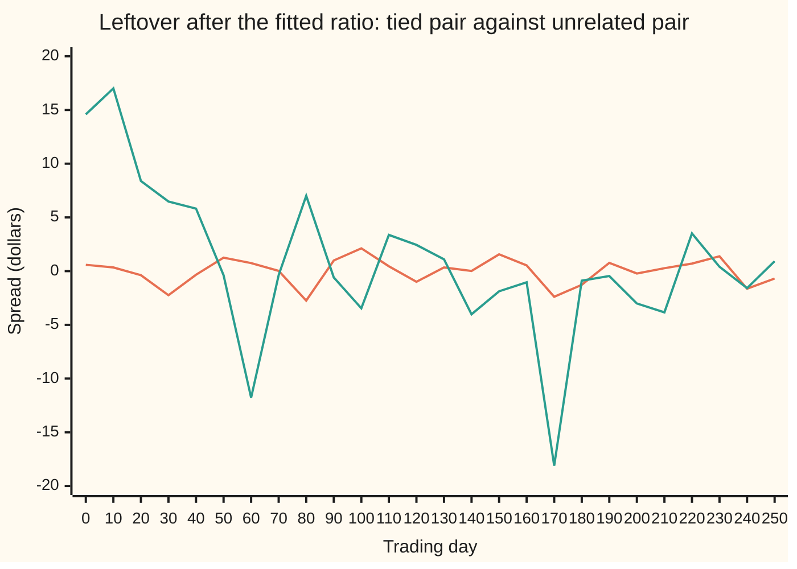

# Pairs trading: two prices tied by cointegration, and the hedge ratio between them

[Syllabus](../../../SYLLABUS.md) → [Financial mathematics](../../../SYLLABUS.md#w12) → [Signals, Mean Reversion and Backtesting](../../../SYLLABUS.md#w12-s50) → Pairs trading

---

## General Overview

Two petrol retailers trade on the same exchange. Call them A and B. On one Monday, A closes at $128.00 a share and B at $100.00. Both sell the same fuel from similar forecourts, so when crude oil or road traffic moves, both share prices move. Neither price settles anywhere: each wanders, like a walker with no home.

Yet over years, one A share has tracked 1.3 B shares. When A runs ahead of 1.3 B shares, it tends to fall back; when it lags, it tends to catch up. The two walkers are on a leash. The leash has a length that varies, but it never lets them drift apart for good.

From here on the leash has its real name: cointegration. Two wandering prices are **cointegrated** when some fixed mix of them, here one A share minus 1.3 B shares, stops wandering and keeps returning to a steady level. That mix is the **spread**. The 1.3 is the **hedge ratio**: B shares held short against each A share owned. A **pairs trade** buys the spread when it is low and sells it when it is high, betting on the tie, not on the fuel market.

The card estimates the hedge ratio from past prices, tests whether the tie is real by the Engle–Granger two-step method (Robert Engle and Clive Granger, 1987), and builds the position: 100 A shares against 130 B shares, where the short sale pays for the purchase.

**Fit the ratio that makes the combined price stop wandering, check that the leftover spread really does return, with a cutoff built for fitted spreads, then hold the two shares in that ratio and profit only from the spread.**

**What kind of fact this is:** a method — the Engle–Granger two-step test — built on a definition (cointegration). The one piece of theory it rests on, that least squares finds the tying ratio, is proved on this card in Why it works; the test's cutoffs are simulated in the code and matched to published tables, not proved.

### The picture: one simulated year of the two retailers

The code builds a year of 251 trading days in which B wanders and A is 1.3 times B plus a spread that keeps returning. A's price and 1.3 times B's price, every tenth day:



Orange: one A share. Teal: 1.3 B shares. Both fall about $35 over the year; neither price alone says where it will be next month. The gap between the lines is the spread, and it never gets far from zero.

---

## The formula

Notation first. A small $t$ under a price names the day: $A_t$ is A's closing price on day $t$. A bar means an average over the window: $\bar B$ is B's average price. A capital sigma, Σ, adds up over all days in the window. $\Delta$ means "change since yesterday". A hat marks a value fitted from data: $\hat\beta$ is the fitted ratio, $\beta$ the true one.

**Step one, the tie and the fitted ratio.** The model says

$$A_t = c + \beta B_t + s_t,$$

where the spread $s_t$ does not wander. Least squares, which picks the line with the smallest total squared miss, fits

$$\hat\beta = \frac{\sum_t (B_t - \bar B)(A_t - \bar A)}{\sum_t (B_t - \bar B)^2}, \qquad \hat c = \bar A - \hat\beta\,\bar B, \qquad s_t = A_t - \hat c - \hat\beta B_t .$$

**Read it aloud:** the hedge ratio is how far A moves together with B, divided by how far B moves on its own; the spread is what is left of A after the fitted share of B is taken away.

**Step two, the test.** Regress each day's change in the spread on yesterday's spread:

$$\Delta s_t = \rho\, s_{t-1} + e_t, \qquad \tau = \frac{\hat\rho}{\operatorname{se}(\hat\rho)} .$$

**Read it aloud:** if yesterday's spread was above its level, does today's change push it back down, and how many standard errors is that push away from zero?

The standard error, $\operatorname{se}$, is the typical size of the fitting error in $\hat\rho$. Here $m$ is the number of daily changes, $\hat e_t$ the fitted misses, and $\operatorname{se}(\hat\rho) = \sqrt{\big(\sum \hat e_t^2/(m-1)\big) \big/ \sum s_{t-1}^2}$. The claim "no tie" is rejected when $\tau$ falls below the 5% cutoff: the value that pairs with no tie fall below only 5% of the time. For two prices and a fitted ratio it is **−3.36** for about 250 days of data. The ordinary cutoff for one series, −2.87, is the wrong one.

**Step three, the position.** Hold $N_A$ shares of A and short $N_B = \hat\beta N_A$ shares of B:

$$\text{value}_t = N_A A_t - N_B B_t = N_A\,(s_t + \hat c), \qquad \text{profit from day } a \text{ to day } b = N_A\,(s_b - s_a).$$

**Read it aloud:** the position is worth the spread times the number of A shares, so it gains exactly when the spread moves the way it was bet.

| Symbol | Plain meaning | In our example | Push it up and the answer… |
| --- | --- | --- | --- |
| $A_t$, $B_t$ | close price of one A share, one B share, on day $t$; $\bar A$, $\bar B$ their window averages | $128.00 and $100.00 on date 3 | a rise in both, in ratio, leaves the spread alone |
| $t$, $n$, $m$ | day number; days in the window; daily changes, $n - 1$ | dates 0 to 5, $n$ = 6, $m$ = 5; the year has 251 days | more days: a sharper ratio and a fairer test |
| $\beta$, $b$ | hedge ratio: B shares short per A share owned; $\hat\beta$ is its fitted value, $b$ any trial value | 1.3 | more B shares short per A share |
| $c$ | intercept: the level the spread returns to, in dollars | 0 on the table, $1.30 in the year | shifts the centre, not the pull-back |
| $s_t$ | spread: A's price less $c$ less $\beta$ B prices | −2.00 on date 3 | A is rich against B |
| $\Delta s_t$, $e_t$ | spread change since yesterday; the part of it the pull-back does not explain | +2.00 from date 3 to 4 | — |
| $\rho$ | fitted pull-back: share of yesterday's spread removed today, with a minus sign | −0.105 in the year | more negative: a stronger pull-back |
| $\phi$ | share of the gap still there tomorrow, 1 + $\rho$ | built at 0.9, fitted 0.895 | towards 1: a weaker pull-back, slower return |
| $\tau$ | test statistic: $\hat\rho$ over its standard error | −3.71 in the year | more negative: stronger evidence of a tie |
| $\tau_{5\%}$ | the cutoff $\tau$ must fall below | −3.36, two prices, 250 days | — |
| $N_A$, $N_B$ | shares held long of A, short of B | 100 and 130 | a bigger bet, same ratio |
| $\eta$, $v$, $w$ | in the folded proof only: B's daily change, its variance, the spread's variance | — | — |

### When it holds

- **Each price wanders on its own.** The test is built for two prices with unit roots: each price's daily change is steady noise, but its level drifts without a home ([Unit roots](../../09-Probability%20and%20statistics/12-Time%20Series/04-differencing-and-unit-roots.md)). If one price is already steady, the regression pairs a walker with a post and the cutoffs no longer apply.
- **The tie is fixed over the window.** One ratio, one level. If a merger or a new business line changes the ratio mid-window, the fitted 1.3 is an average of two different truths and the spread inherits a wander. A ratio that moves is a different model: [A moving hedge ratio](07-kalman-filter-for-dynamic-hedge-ratios.md).
- **The cutoff matches the recipe.** −3.36 is for two prices, an intercept in step one, no extra lags in step two, and about 250 days. Use the one-series cutoff instead and about 14% of unrelated pairs pass, not 5%.
- **The spread's daily noise has no pattern of its own.** If today's noise echoes yesterday's, step two needs extra lagged changes (the augmented version) and a matching cutoff.
- **B can be shorted cheaply.** Borrowing fees, dividends owed on the short shares and trading costs are left out; any of them can eat a spread that returns by a dollar.

---

## Why it works

### Step 0: a shared wander cancels only at one ratio

Both retailers ride one common wander: the fuel market. A carries 1.3 times as much of it as B. Subtract 1.3 B shares from each A share and the common wander cancels, leaving only the part of A that keeps returning.

Subtract any other number of B shares and a slice of the wander survives. Hold 1.28 B shares per A share and 0.02 of B's wander is still in the mix. A slice of a wander still wanders, without limit. So exactly one ratio turns two walkers into something steady, and that is why a pairs trade can exist.

<details>
<summary>Detailed proof: the ratio is unique, and least squares finds it</summary>

Model B as a random walk: $B_t = B_0 + \eta_1 + \dots + \eta_t$, with independent daily changes $\eta$ of variance $v$. Then the variance of $B_t$ is $t v$, growing with $t$. Let $A_t = c + \beta B_t + s_t$, with $s_t$ steady (its variance is a fixed number $w$) and independent of the changes $\eta$.

For any trial ratio $b$: $A_t - b B_t = c + (\beta - b) B_t + s_t$. Its variance is $(\beta - b)^2 t v + w$. When $b \neq \beta$ this grows without limit, so the mix wanders. Only at $b = \beta$ is it $c + s_t$, which is steady. The ratio is unique.

Least squares minimises the misfit $\sum_t \big((A_t - \bar A) - b(B_t - \bar B)\big)^2$. Split each term into the wandering part, $(\beta - b)(B_t - \bar B)$, and the steady part, $s_t - \bar s$, where $\bar s$ is the spread's window average. The wandering part's sum of squares, $(\beta-b)^2 \sum_t (B_t - \bar B)^2$, grows like $n^2$, because each of $n$ terms has size growing with $n$. The steady part's grows only like $n$. A wrong $b$ is punished $n$ times harder than any noise can reward it, so, in outline (Engle and Granger give the full argument), the fitted ratio's error shrinks like $1/n$, faster than the $1/\sqrt n$ of ordinary estimates. Econometricians call this **superconsistency**. Setting the derivative of the misfit in $b$ to zero gives the formula for $\hat\beta$ above.

</details>

### Step 1: least squares finds the ratio

A wrong ratio leaves a wandering leftover whose squares pile up fast, so the ratio with the smallest misfit (sum of squared leftovers) is the tying ratio. The simulated year was built with 1.3; least squares returns 1.289.

The formula for $\hat\beta$ has a second reading. Take every two dates, note how far B moved between them and how far A moved, and pool all those pairs of moves. The pooled slope, weighted by B's squared moves, equals $\hat\beta$. The code computes it both ways, and a third way, by searching trial ratios for the smallest misfit.

<details>
<summary>Why pooling pairs of dates gives the same ratio</summary>

For any numbers, $\sum_{i<j} (B_i - B_j)(A_i - A_j) = n \sum_t (B_t - \bar B)(A_t - \bar A)$, and the same with A's prices swapped for B's. The factor $n$ cancels in the ratio. On the six-date table below, both sums give 1.3 exactly.

</details>

### Step 2: test the leftover for a pull-back

A steady spread is pulled back towards its level. If the spread is $2 above its level today, tomorrow's change is, on average, a fall. So regress each day's change on the day before's spread. A tie shows up as a negative slope $\rho$: a fraction of each gap is closed each day. No tie shows up as $\rho$ near zero: yesterday's gap tells nothing about today's change.

The simulated year was built with $\phi$ = 0.9, so 10% of each gap closes each day, and $\rho$ = −0.1. The fit returns $\hat\rho$ = −0.105, so $\phi$ = 0.895. A gap then halves in about 6.26 days, against 6.58 days if $\phi$ were exactly 0.9. The half-life is the natural clock for a trade, and the mean-reversion card turns it into entry and exit rules ([Mean reversion](01-ornstein-uhlenbeck-mean-reversion-trading.md)).

Size is judged against noise. The statistic $\tau$ divides $\hat\rho$ by its standard error. For the year, $\tau$ = −3.71.

### Step 3: why fitted spreads need their own cutoff

Step one chose the ratio that makes the leftover as small and tidy as possible. It does that for any two prices, tied or not, so two unrelated walkers give a leftover that looks steadier than either walker. The test must be judged against what fitting alone produces.

The code measures that directly. It generates 4,000 pairs of unrelated random walks of 251 days, runs both steps on each, and records $\tau$. The value that only 5% of them fall below is the honest 5% cutoff: −3.36 from the simulation, matching the −3.36 in MacKinnon's published table. For a single known series, which needs no fitting, the same simulation gives −2.92 with a constant (published −2.87) and −1.97 without one (published −1.94).

Judge the 4,000 unrelated pairs with the wrong cutoffs and the false alarms pile up:

```
share of 4,000 unrelated pairs wrongly declared tied, in percent
Engle-Granger cutoff −3.36     ███                                  5.00%
one-series cutoff, constant    ██████████                          14.20%
one-series cutoff, bare        ████████████████████████████████████ 54.95%
```

The same fitting that fools the test also fools the eye. Regress one unrelated walk on another and least squares finds a line that seems to explain a real share of the movement. Across the 4,000 unrelated pairs, the median $R^2$ (the share of A's variation the line appears to explain) is 0.17. This is **spurious regression**, named by Granger and Newbold in 1974.

The code's own unrelated pair shows it at its worst. Share C, a third wanderer built independently of A, explains 83% of A's movement ($R^2$ = 0.83) with a ratio of −1.76. Its $\tau$ is −3.30: past the one-series cutoff, short of the Engle–Granger one. The leftover spreads, side by side:



Orange: the tied pair's spread, within $3 of zero all year. Teal: A against the unrelated share C, swinging from $17.01 to −$18.11 and spending months on one side. Holding the teal spread means waiting for a return that has no reason to come.

### Step 4: build the position in the fitted ratio

Buy $N_A$ A shares, short $\hat\beta N_A$ B shares. The common wander cancels in the position, as it did in the spread, so the position's value moves only with the spread: value equals $N_A$ times $(s_t + \hat c)$. Every dollar of profit or loss is $N_A$ times the spread's change.

**Dollar neutral** means the long leg and the short leg are worth the same, so the short sale pays for the purchase. In the fitted ratio that happens exactly when $s_t + \hat c$ is zero: the spread sits at its level. A trade is entered when the spread is away from its level, so the legs differ by $N_A$ times the gap. That difference is the bet itself, and it is small: at a $2 gap on a $128 share it is under 2% of a leg. It sits in cash.

Forcing equal dollars by shorting fewer B shares breaks the hedge: the position then carries a slice of the common wander the pair was built to remove.

A second road is the Johansen procedure, which tests several prices at once, needs no price chosen as the left-hand side, and counts the independent ties. It uses matrix tools; [Cointegration](../../09-Probability%20and%20statistics/12-Time%20Series/07-cointegration-in-outline.md) places it.

---

## Worked numbers, by hand

Six closing prices, built so the arithmetic stays visible. The spread column uses the ratio 1.3.

| Date | B, dollars | A, dollars | A − 1.3 B |
| --- | --- | --- | --- |
| 0 | 100 | 130.0 | 0 |
| 1 | 101 | 132.3 | 1 |
| 2 | 99 | 129.7 | 1 |
| 3 | 100 | 128.0 | −2 |
| 4 | 102 | 132.6 | 0 |
| 5 | 101 | 131.3 | 0 |

| Step | Arithmetic | Value |
| --- | --- | --- |
| averages $\bar B$, $\bar A$ | 603 ÷ 6 and 783.9 ÷ 6 | 100.5 and 130.65 |
| B's own movement, $\sum (B_t - \bar B)^2$ | 0.25 + 0.25 + 2.25 + 0.25 + 2.25 + 0.25 | 5.5 |
| joint movement, $\sum (B_t - \bar B)(A_t - \bar A)$ | pair each B gap with its A gap, add | 7.15 |
| hedge ratio $\hat\beta$ | 7.15 ÷ 5.5 | **1.3** |
| intercept $\hat c$ | 130.65 − 1.3 × 100.5 | 0 |
| spread $s_t$ | A − 1.3 B, date by date | 0, 1, 1, −2, 0, 0 |
| yesterday's spread, today's change | dates 1 to 5 | (0, 1), (1, 0), (1, −3), (−2, 2), (0, 0) |
| $\hat\rho$ | (0 + 0 − 3 − 4 + 0) ÷ (0 + 1 + 1 + 4 + 0) | −7/6 = −1.166667 |
| unexplained changes, squared and summed | 1 + (7/6)^2 + (11/6)^2 + (1/3)^2 + 0 | 35/6 |
| standard error of $\hat\rho$ | √((35/6 ÷ (5 − 1)) ÷ 6): 5 changes less 1 fitted slope, then ÷ Σ $s_{t-1}^2$ | √35/12 = 0.49 |
| $\tau$ | −7/6 ÷ (√35/12) | **−2.366432** |
| position at date 3 | long 100 A at $128.00, short 130 B at $100.00 | $12,800.00 against $13,000.00 |
| profit, date 3 to 4, leg by leg | 100 × (132.6 − 128.0) − 130 × (102 − 100) | **$200.00** |
| profit, from the spread | 100 × (0 − (−2)) | $200.00 |

The hedge ratio says: hold 130 B shares short against every 100 A shares. The trade entered at a spread of −2, A cheap against B, and made $200.00 when the spread closed the next day, whatever the fuel market did.

Six dates are far too few to test anything. The table is for the arithmetic; the 251-day year is for the test.

### What breaks if you drop a piece

| Mistake | Comes out at | What went wrong |
| --- | --- | --- |
| Judge the fitted spread by the one-series cutoff | 14.20% of unrelated pairs pass, not 5% | Fitting already made the leftover look tidy; the cutoff must allow for that |
| Regress B on A and turn the slope upside down | ratio 2.14 on the table, not 1.3 | Least squares minimises misses in the left-hand price only; the two directions agree only when the fit is perfect |
| Trust a high $R^2$ | median $R^2$ of 0.17 for unrelated pairs; 0.83 for the unrelated share C | Two walkers can share a direction by chance for a year; $R^2$ does not see the tie |
| Force equal dollars: 128 B shares instead of 130 | $20.00 of profit or loss from a $10 move in B that the spread never saw | 2 B shares of the common wander are left unhedged |

---

## Code, from first principles, and it actually runs

The scripts write their own random numbers (the splitmix64 generator and the Box–Muller turn to bell-curve draws), their own least squares, their own Dickey–Fuller regression and their own critical values by simulation. They take five roads. The hedge ratio on the table is found three ways: the least-squares formula, the pooled slopes between every two dates, and a golden-section search on the misfit. The hand-worked $\hat\rho$ = −7/6 and $\tau$ = −14/√35 are checked exactly. The trade's profit is found leg by leg and from the spread. A simulated year checks that the fit recovers the 1.3 and 0.9 it was built with. And 4,000 unrelated pairs produce the cutoffs, checked against MacKinnon's published values.

### Python

```python
# Pairs trading and cointegration -- the check behind the card.  Standard library only.
# Own random numbers (splitmix64 + Box-Muller), own least squares, own Dickey-Fuller
# regression, own critical values by simulation.  Nothing imported knows the answer.
from math import log, sqrt, cos, pi

M64 = (1 << 64) - 1
class Rng:
    def __init__(self, seed): self.s = seed
    def u(self):                                   # uniform on (0, 1), splitmix64
        self.s = (self.s + 0x9E3779B97F4A7C15) & M64
        z = self.s
        z = ((z ^ (z >> 30)) * 0xBF58476D1CE4E5B9) & M64
        z = ((z ^ (z >> 27)) * 0x94D049BB133111EB) & M64
        return (((z ^ (z >> 31)) >> 11) + 0.5) / 9007199254740992.0
    def z(self):                                   # one bell-curve draw, Box-Muller
        a = self.u()
        return sqrt(-2.0 * log(a)) * cos(2.0 * pi * self.u())

def ols(x, y):                                     # fit y = c + b x; return b, c, R^2
    n = len(x); mx = sum(x) / n; my = sum(y) / n
    sxx = sum((a - mx) ** 2 for a in x)
    sxy = sum((a - mx) * (b - my) for a, b in zip(x, y))
    syy = sum((b - my) ** 2 for b in y)
    return sxy / sxx, my - sxy / sxx * mx, sxy * sxy / (sxx * syy)

def df_t(u, const=False):                          # Dickey-Fuller: change on lagged level
    lag = u[:-1]; d = [u[i + 1] - u[i] for i in range(len(u) - 1)]
    if const:
        b, c, _ = ols(lag, d); m = sum(lag) / len(lag)
        sxx = sum((a - m) ** 2 for a in lag); k = 2
    else:
        sxx = sum(a * a for a in lag); b = sum(a * e for a, e in zip(lag, d)) / sxx; c = 0.0; k = 1
    rss = sum((e - c - b * a) ** 2 for a, e in zip(lag, d))
    return b, b / sqrt(rss / (len(d) - k) / sxx)

def walk(r, n, start, sd):
    w = [start]
    for _ in range(n - 1): w.append(w[-1] + sd * r.z())
    return w

def year(seed, phi, n=251):                       # B wanders; A = 1.3 B + a spread pulled back by phi
    r = Rng(seed); B = walk(r, n, 100.0, 1.0)
    u = [0.5 / sqrt(1.0 - phi * phi) * r.z()]
    for _ in range(n - 1): u.append(phi * u[-1] + 0.5 * r.z())
    return r, B, [1.3 * b + e for b, e in zip(B, u)], walk(r, n, 100.0, 1.0)

def show(lab, v, f=".6f"): print(f"{lab:<34}{v:>12{f}}")
def tidy(v): return 0.0 if abs(v) < 1e-9 else v

# ---- road 1: the six-date table, retailer B and retailer A, dollars per share ----
B = [100.0, 101.0, 99.0, 100.0, 102.0, 101.0]
A = [130.0, 132.3, 129.7, 128.0, 132.6, 131.3]
beta, c, _ = ols(B, A)
pairs = [(i, j) for i in range(6) for j in range(i + 1, 6)]   # road 2: slopes between every two dates
beta_pw = sum((B[i] - B[j]) * (A[i] - A[j]) for i, j in pairs) / sum((B[i] - B[j]) ** 2 for i, j in pairs)
mB, mA = sum(B) / 6, sum(A) / 6
rss = lambda b: sum(((y - mA) - b * (x - mB)) ** 2 for x, y in zip(B, A))
lo, hi, g = 0.0, 5.0, (sqrt(5.0) - 1.0) / 2.0                 # road 3: golden-section search on the misfit
for _ in range(80):
    m1, m2 = hi - g * (hi - lo), lo + g * (hi - lo)
    if rss(m1) < rss(m2): hi = m2
    else: lo = m1
beta_gs = (lo + hi) / 2.0
res = [y - c - beta * x for x, y in zip(B, A)]
rho, t6 = df_t(res)
show("table: beta, least squares", beta); show("table: beta, pairwise slopes", beta_pw)
show("table: beta, golden-section search", beta_gs); show("table: intercept c", tidy(c))
print(f"{'table: spread A - 1.3 B':<34}" + " ".join(f"{tidy(v):.2f}" for v in res))
show("table: misfit, sum of squares", sum(v * v for v in res))
show("table: rho", rho); show("table: t = rho / its std error", t6)
show("wrong: regress B on A, invert", 1.0 / ols(A, B)[0])

# ---- the trade: buy 100 A at date 3, short 130 B, close at date 4 ----
nA, nB = 100, 130
pnl_legs = nA * (A[4] - A[3]) - nB * (B[4] - B[3])
pnl_spread = nA * (res[4] - res[3])
show("trade: long leg at entry", nA * A[3], ".2f"); show("trade: short leg at entry", nB * B[3], ".2f")
show("trade: P&L, leg by leg", pnl_legs, ".2f"); show("trade: P&L, 100 x spread change", pnl_spread, ".2f")
show("wrong: 128 B, both prices drift", nA * 1.3 * 10.0 - 128 * 10.0, ".2f")

# ---- road 4: a simulated year of 251 days, pull-back 0.9 a day, and an unrelated third share C ----
phi = 0.9
r, Bs, As, Cs = year(2030, phi)
bs, cs, r2s = ols(Bs, As)
sp = [y - cs - bs * x for x, y in zip(Bs, As)]
rho_s, t_s = df_t(sp)
bc, cc, r2c = ols(Cs, As)
spc = [y - cc - bc * x for x, y in zip(Cs, As)]
t_c = df_t(spc)[1]
for lab, v in (("sim: beta", bs), ("sim: intercept c", cs), ("sim: R^2", r2s), ("sim: rho", rho_s),
               ("sim: 1 + rho, true 0.9", 1 + rho_s), ("sim: half-life, days", log(0.5) / log(1.0 + rho_s)),
               ("  half-life if 0.9 exactly", log(0.5) / log(phi)), ("sim: t", t_s),
               ("unrelated: beta", bc), ("unrelated: R^2", r2c), ("unrelated: t", t_c)):
    show(lab, v)

# ---- road 5, the referee: 4000 pairs of unrelated walks; what t does fitting alone produce? ----
R, n = 4000, 251
teg, tdc, td0, r2n = [], [], [], []
for _ in range(R):
    x = walk(r, n, 100.0, 1.0); y = walk(r, n, 100.0, 1.0)
    b, c0, q = ols(x, y)
    teg.append(df_t([v - c0 - b * w for w, v in zip(x, y)])[1])
    tdc.append(df_t(y, True)[1]); td0.append(df_t([v - y[0] for v in y])[1]); r2n.append(q)
k = int(0.05 * R)
q_eg, q_dc, q_d0 = sorted(teg)[k], sorted(tdc)[k], sorted(td0)[k]
for lab, v in (("5% cut, Engle-Granger (MK -3.36)", q_eg), ("5% cut, 1 series+const (MK -2.87)", q_dc),
               ("5% cut, 1 series bare (MK -1.94)", q_d0),
               ("false alarms %, E-G cutoff", 100 * sum(t < q_eg for t in teg) / R),
               ("false alarms %, 1 series+const", 100 * sum(t < q_dc for t in teg) / R),
               ("false alarms %, 1 series bare", 100 * sum(t < q_d0 for t in teg) / R),
               ("unrelated pairs: median R^2", sorted(r2n)[R // 2])):
    show(lab, v)

# ---- try changing: a slower pull-back, and another year from another seed ----
for lab, (s, p) in (("try: phi = 0.995", (2030, 0.995)), ("try: seed 2026", (2026, 0.9))):
    _, x, y, _ = year(s, p); b, c0, _ = ols(x, y)
    print(f"{lab + ': beta, t':<34}{b:>12.6f}{df_t([v - c0 - b * w for w, v in zip(x, y)])[1]:>12.6f}")

# ---- chart points, every 10th day ----
idx = range(0, n, 10)
print("chart, day   " + " ".join(f"{i}" for i in idx))
print("chart, A     " + " ".join(f"{As[i]:.2f}" for i in idx))
print("chart, 1.3B  " + " ".join(f"{1.3 * Bs[i]:.2f}" for i in idx))
print("chart, sprd  " + " ".join(f"{sp[i]:.2f}" for i in idx))
print("chart, unrel " + " ".join(f"{spc[i]:.2f}" for i in idx))

assert abs(beta - 1.3) < 1e-12 and abs(beta_pw - 1.3) < 1e-12, "table built as A = 1.3 B + (0,1,1,-2,0,0)"
assert abs(beta_gs - beta_pw) < 1e-6,           "search and pairwise slopes agree"
assert abs(rho - (-7.0 / 6.0)) < 1e-12,         "hand-worked rho = -7/6"
assert abs(t6 - (-14.0 / sqrt(35.0))) < 1e-9,   "hand-worked t = -14/sqrt(35)"
assert abs(pnl_legs - pnl_spread) < 1e-9,       "leg-by-leg P&L equals shares x spread change"
assert abs(bs - 1.3) < 0.03,                    "fitted ratio near the 1.3 the year was built with"
assert abs((1 + rho_s) - phi) < 0.08,           "fitted pull-back near the 0.9 it was built with"
assert abs(q_eg - (-3.36)) < 0.15,              "Engle-Granger 5% cutoff vs MacKinnon 2010, two series, T=250"
assert abs(q_dc - (-2.87)) < 0.12,              "Dickey-Fuller 5% cutoff with constant vs MacKinnon 2010"
assert abs(q_d0 - (-1.94)) < 0.12,              "Dickey-Fuller 5% cutoff, no constant, vs MacKinnon 2010"
assert t_s < q_eg < t_c,                        "the tied pair passes, the unrelated pair does not"
print("ALL CHECKS PASS")
```

**Ran 2026-09-28 on macOS, Python 3.14.6, standard library only. All checks passed. Output, pasted from the run:**

```
table: beta, least squares            1.300000
table: beta, pairwise slopes          1.300000
table: beta, golden-section search    1.300000
table: intercept c                    0.000000
table: spread A - 1.3 B           0.00 1.00 1.00 -2.00 0.00 0.00
table: misfit, sum of squares         6.000000
table: rho                           -1.166667
table: t = rho / its std error       -2.366432
wrong: regress B on A, invert         2.139161
trade: long leg at entry              12800.00
trade: short leg at entry             13000.00
trade: P&L, leg by leg                  200.00
trade: P&L, 100 x spread change         200.00
wrong: 128 B, both prices drift          20.00
sim: beta                             1.288606
sim: intercept c                      1.297344
sim: R^2                              0.994543
sim: rho                             -0.104867
sim: 1 + rho, true 0.9                0.895133
sim: half-life, days                  6.256804
  half-life if 0.9 exactly            6.578813
sim: t                               -3.707638
unrelated: beta                      -1.764775
unrelated: R^2                        0.832982
unrelated: t                         -3.304387
5% cut, Engle-Granger (MK -3.36)     -3.360909
5% cut, 1 series+const (MK -2.87)    -2.915708
5% cut, 1 series bare (MK -1.94)     -1.973902
false alarms %, E-G cutoff            5.000000
false alarms %, 1 series+const       14.200000
false alarms %, 1 series bare        54.950000
unrelated pairs: median R^2           0.170905
try: phi = 0.995: beta, t             1.175718   -2.945662
try: seed 2026: beta, t               1.340909   -4.602371
chart, day   0 10 20 30 40 50 60 70 80 90 100 110 120 130 140 150 160 170 180 190 200 210 220 230 240 250
chart, A     130.74 134.10 126.86 126.43 129.20 129.77 124.90 126.40 127.76 132.70 126.16 126.92 119.34 119.54 114.23 117.09 109.54 94.51 97.60 98.19 96.05 93.55 92.51 94.61 90.26 95.74
chart, 1.3B  130.00 133.63 127.06 128.50 129.38 128.34 123.94 126.19 130.35 131.56 123.82 126.28 120.09 118.95 113.92 115.25 108.66 96.45 98.44 96.97 95.81 92.79 91.31 92.75 91.40 95.98
chart, sprd  0.59 0.34 -0.38 -2.24 -0.34 1.25 0.75 0.02 -2.74 0.99 2.12 0.45 -0.99 0.34 0.02 1.56 0.53 -2.39 -1.27 0.77 -0.22 0.27 0.70 1.38 -1.64 -0.69
chart, unrel 14.59 17.01 8.39 6.48 5.82 -0.38 -11.78 -0.37 7.01 -0.59 -3.46 3.37 2.44 1.10 -4.02 -1.88 -1.04 -18.11 -0.89 -0.46 -3.01 -3.84 3.51 0.40 -1.58 0.92
ALL CHECKS PASS
```

The simulated cutoffs sit within 0.05 of the published ones, which come from far larger simulations smoothed across sample sizes.

### Rust

The same checks, the same generator, the same seeds. No crates.

```rust
// Pairs trading and cointegration -- the same check as the Python, std only, no crates.
// Own random numbers (splitmix64 + Box-Muller), least squares, Dickey-Fuller, critical values.
// Compile: rustc --edition 2021 -O pairs_trading_and_cointegration_check.rs -o /tmp/pairs_check
use std::f64::consts::PI;

struct Rng { s: u64 }
impl Rng {
    fn u(&mut self) -> f64 {
        self.s = self.s.wrapping_add(0x9E3779B97F4A7C15);
        let mut z = self.s;
        z = (z ^ (z >> 30)).wrapping_mul(0xBF58476D1CE4E5B9);
        z = (z ^ (z >> 27)).wrapping_mul(0x94D049BB133111EB);
        (((z ^ (z >> 31)) >> 11) as f64 + 0.5) / 9007199254740992.0
    }
    fn z(&mut self) -> f64 { let a = self.u(); (-2.0 * a.ln()).sqrt() * (2.0 * PI * self.u()).cos() }
}

fn mean(v: &[f64]) -> f64 { v.iter().sum::<f64>() / v.len() as f64 }

// fit y = c + b x; return (b, c, R^2)
fn ols(x: &[f64], y: &[f64]) -> (f64, f64, f64) {
    let (mx, my) = (mean(x), mean(y));
    let (mut sxx, mut sxy, mut syy) = (0.0, 0.0, 0.0);
    for i in 0..x.len() {
        sxx += (x[i] - mx) * (x[i] - mx);
        sxy += (x[i] - mx) * (y[i] - my);
        syy += (y[i] - my) * (y[i] - my);
    }
    (sxy / sxx, my - sxy / sxx * mx, sxy * sxy / (sxx * syy))
}

// Dickey-Fuller: regress the change on the lagged level; return (slope rho, its t)
fn df_t(u: &[f64], constant: bool) -> (f64, f64) {
    let lag = &u[..u.len() - 1];
    let d: Vec<f64> = (0..u.len() - 1).map(|i| u[i + 1] - u[i]).collect();
    let (b, c, sxx, k) = if constant {
        let (b, c, _) = ols(lag, &d);
        let m = mean(lag);
        (b, c, lag.iter().map(|a| (a - m) * (a - m)).sum::<f64>(), 2.0)
    } else {
        let sxx: f64 = lag.iter().map(|a| a * a).sum();
        let b = lag.iter().zip(&d).map(|(a, e)| a * e).sum::<f64>() / sxx;
        (b, 0.0, sxx, 1.0)
    };
    let rss: f64 = lag.iter().zip(&d).map(|(a, e)| (e - c - b * a).powi(2)).sum();
    (b, b / (rss / (d.len() as f64 - k) / sxx).sqrt())
}

fn walk(r: &mut Rng, n: usize, start: f64, sd: f64) -> Vec<f64> {
    let mut w = vec![start];
    for _ in 1..n { let next = w[w.len() - 1] + sd * r.z(); w.push(next); }
    w
}

// B wanders; A = 1.3 B + a spread pulled back by phi; C is an unrelated third share
fn year(seed: u64, phi: f64, n: usize) -> (Rng, Vec<f64>, Vec<f64>, Vec<f64>) {
    let mut r = Rng { s: seed };
    let b = walk(&mut r, n, 100.0, 1.0);
    let mut u = vec![0.5 / (1.0 - phi * phi).sqrt() * r.z()];
    for _ in 1..n { let next = phi * u[u.len() - 1] + 0.5 * r.z(); u.push(next); }
    let a: Vec<f64> = (0..n).map(|i| 1.3 * b[i] + u[i]).collect();
    let c = walk(&mut r, n, 100.0, 1.0);
    (r, b, a, c)
}

fn tidy(v: f64) -> f64 { if v.abs() < 1e-9 { 0.0 } else { v } }
fn show(lab: &str, v: f64) { println!("{:<34}{:>12.6}", lab, v); }
fn money(lab: &str, v: f64) { println!("{:<34}{:>12.2}", lab, v); }
fn row(lab: &str, v: &[f64]) {
    let s: Vec<String> = v.iter().map(|x| format!("{:.2}", tidy(*x))).collect();
    println!("{}{}", lab, s.join(" "));
}
fn q5(v: &[f64]) -> f64 { let mut s = v.to_vec(); s.sort_by(|a, b| a.partial_cmp(b).unwrap()); s[v.len() / 20] }
fn resid(x: &[f64], y: &[f64], b: f64, c: f64) -> Vec<f64> { (0..x.len()).map(|i| y[i] - c - b * x[i]).collect() }

fn main() {
    // ---- road 1: the six-date table, retailer B and retailer A, dollars per share ----
    let b = [100.0, 101.0, 99.0, 100.0, 102.0, 101.0];
    let a = [130.0, 132.3, 129.7, 128.0, 132.6, 131.3];
    let (beta, c, _) = ols(&b, &a);
    let (mut num, mut den) = (0.0, 0.0); // road 2: slopes between every two dates, pooled
    for i in 0..6 { for j in i + 1..6 { num += (b[i] - b[j]) * (a[i] - a[j]); den += (b[i] - b[j]).powi(2); } }
    let beta_pw = num / den;
    let (mb, ma) = (mean(&b), mean(&a)); // road 3: golden-section search on the misfit
    let rss = |s: f64| -> f64 { (0..6).map(|i| ((a[i] - ma) - s * (b[i] - mb)).powi(2)).sum() };
    let (mut lo, mut hi, g) = (0.0_f64, 5.0_f64, (5.0_f64.sqrt() - 1.0) / 2.0);
    for _ in 0..80 {
        let (m1, m2) = (hi - g * (hi - lo), lo + g * (hi - lo));
        if rss(m1) < rss(m2) { hi = m2 } else { lo = m1 }
    }
    let beta_gs = (lo + hi) / 2.0;
    let res = resid(&b, &a, beta, c);
    let (rho, t6) = df_t(&res, false);
    show("table: beta, least squares", beta); show("table: beta, pairwise slopes", beta_pw);
    show("table: beta, golden-section search", beta_gs); show("table: intercept c", tidy(c));
    row(&format!("{:<34}", "table: spread A - 1.3 B"), &res);
    show("table: misfit, sum of squares", res.iter().map(|v| v * v).sum());
    show("table: rho", rho); show("table: t = rho / its std error", t6);
    show("wrong: regress B on A, invert", 1.0 / ols(&a, &b).0);

    // ---- the trade: buy 100 A at date 3, short 130 B, close at date 4 ----
    let (na, nb) = (100.0, 130.0);
    let pnl_legs = na * (a[4] - a[3]) - nb * (b[4] - b[3]);
    let pnl_spread = na * (res[4] - res[3]);
    money("trade: long leg at entry", na * a[3]); money("trade: short leg at entry", nb * b[3]);
    money("trade: P&L, leg by leg", pnl_legs); money("trade: P&L, 100 x spread change", pnl_spread);
    money("wrong: 128 B, both prices drift", na * 1.3 * 10.0 - 128.0 * 10.0);

    // ---- road 4: a simulated year of 251 days, pull-back 0.9 a day, and an unrelated third share C ----
    let phi = 0.9;
    let (mut r, bs_p, as_p, cs_p) = year(2030, phi, 251);
    let (bs, cs, r2s) = ols(&bs_p, &as_p);
    let sp = resid(&bs_p, &as_p, bs, cs);
    let (rho_s, t_s) = df_t(&sp, false);
    let (bc, cc, r2c) = ols(&cs_p, &as_p);
    let spc = resid(&cs_p, &as_p, bc, cc);
    let t_c = df_t(&spc, false).1;
    for (lab, v) in [("sim: beta", bs), ("sim: intercept c", cs), ("sim: R^2", r2s), ("sim: rho", rho_s),
                     ("sim: 1 + rho, true 0.9", 1.0 + rho_s), ("sim: half-life, days", 0.5_f64.ln() / (1.0 + rho_s).ln()),
                     ("  half-life if 0.9 exactly", 0.5_f64.ln() / phi.ln()), ("sim: t", t_s),
                     ("unrelated: beta", bc), ("unrelated: R^2", r2c), ("unrelated: t", t_c)] { show(lab, v); }

    // ---- road 5, the referee: 4000 pairs of unrelated walks; what t does fitting alone produce? ----
    let (reps, n) = (4000, 251);
    let (mut teg, mut tdc, mut td0, mut r2n) = (vec![], vec![], vec![], vec![]);
    for _ in 0..reps {
        let (x, y) = (walk(&mut r, n, 100.0, 1.0), walk(&mut r, n, 100.0, 1.0));
        let (bb, c0, q) = ols(&x, &y);
        teg.push(df_t(&resid(&x, &y, bb, c0), false).1);
        tdc.push(df_t(&y, true).1); td0.push(df_t(&y.iter().map(|v| v - y[0]).collect::<Vec<f64>>(), false).1);
        r2n.push(q);
    }
    let (q_eg, q_dc, q_d0) = (q5(&teg), q5(&tdc), q5(&td0));
    let pct = |cut: f64| 100.0 * teg.iter().filter(|t| **t < cut).count() as f64 / reps as f64;
    let mut sr = r2n.clone(); sr.sort_by(|a, b| a.partial_cmp(b).unwrap());
    for (lab, v) in [("5% cut, Engle-Granger (MK -3.36)", q_eg), ("5% cut, 1 series+const (MK -2.87)", q_dc),
                     ("5% cut, 1 series bare (MK -1.94)", q_d0), ("false alarms %, E-G cutoff", pct(q_eg)),
                     ("false alarms %, 1 series+const", pct(q_dc)), ("false alarms %, 1 series bare", pct(q_d0)),
                     ("unrelated pairs: median R^2", sr[reps / 2])] { show(lab, v); }

    // ---- try changing: a slower pull-back, and another year from another seed ----
    for (lab, s, p) in [("try: phi = 0.995", 2030, 0.995), ("try: seed 2026", 2026, 0.9)] {
        let (_, x, y, _) = year(s, p, 251);
        let (bb, c0, _) = ols(&x, &y);
        println!("{:<34}{:>12.6}{:>12.6}", format!("{}: beta, t", lab), bb, df_t(&resid(&x, &y, bb, c0), false).1);
    }

    // ---- chart points, every 10th day ----
    let idx: Vec<usize> = (0..n).step_by(10).collect();
    let days: Vec<String> = idx.iter().map(|i| i.to_string()).collect();
    println!("chart, day   {}", days.join(" "));
    row("chart, A     ", &idx.iter().map(|&i| as_p[i]).collect::<Vec<f64>>());
    row("chart, 1.3B  ", &idx.iter().map(|&i| 1.3 * bs_p[i]).collect::<Vec<f64>>());
    row("chart, sprd  ", &idx.iter().map(|&i| sp[i]).collect::<Vec<f64>>());
    row("chart, unrel ", &idx.iter().map(|&i| spc[i]).collect::<Vec<f64>>());

    assert!((beta - 1.3).abs() < 1e-12 && (beta_pw - 1.3).abs() < 1e-12, "table built as A = 1.3 B + (0,1,1,-2,0,0)");
    assert!((beta_gs - beta_pw).abs() < 1e-6, "search and pairwise slopes agree");
    assert!((rho - (-7.0 / 6.0)).abs() < 1e-12, "hand-worked rho = -7/6");
    assert!((t6 - (-14.0 / 35.0_f64.sqrt())).abs() < 1e-9, "hand-worked t = -14/sqrt(35)");
    assert!((pnl_legs - pnl_spread).abs() < 1e-9, "leg-by-leg P&L equals shares x spread change");
    assert!((bs - 1.3).abs() < 0.03, "fitted ratio near the 1.3 the year was built with");
    assert!(((1.0 + rho_s) - phi).abs() < 0.08, "fitted pull-back near the 0.9 it was built with");
    assert!((q_eg - (-3.36)).abs() < 0.15, "Engle-Granger 5% cutoff vs MacKinnon 2010, two series, T=250");
    assert!((q_dc - (-2.87)).abs() < 0.12, "Dickey-Fuller 5% cutoff with constant vs MacKinnon 2010");
    assert!((q_d0 - (-1.94)).abs() < 0.12, "Dickey-Fuller 5% cutoff, no constant, vs MacKinnon 2010");
    assert!(t_s < q_eg && q_eg < t_c, "the tied pair passes, the unrelated pair does not");
    println!("ALL CHECKS PASS");
}
```

**Ran 2026-09-28 on macOS, rustc 1.98.1, no crates. All checks passed. Output, pasted from the run:**

```
table: beta, least squares            1.300000
table: beta, pairwise slopes          1.300000
table: beta, golden-section search    1.300000
table: intercept c                    0.000000
table: spread A - 1.3 B           0.00 1.00 1.00 -2.00 0.00 0.00
table: misfit, sum of squares         6.000000
table: rho                           -1.166667
table: t = rho / its std error       -2.366432
wrong: regress B on A, invert         2.139161
trade: long leg at entry              12800.00
trade: short leg at entry             13000.00
trade: P&L, leg by leg                  200.00
trade: P&L, 100 x spread change         200.00
wrong: 128 B, both prices drift          20.00
sim: beta                             1.288606
sim: intercept c                      1.297344
sim: R^2                              0.994543
sim: rho                             -0.104867
sim: 1 + rho, true 0.9                0.895133
sim: half-life, days                  6.256804
  half-life if 0.9 exactly            6.578813
sim: t                               -3.707638
unrelated: beta                      -1.764775
unrelated: R^2                        0.832982
unrelated: t                         -3.304387
5% cut, Engle-Granger (MK -3.36)     -3.360909
5% cut, 1 series+const (MK -2.87)    -2.915708
5% cut, 1 series bare (MK -1.94)     -1.973902
false alarms %, E-G cutoff            5.000000
false alarms %, 1 series+const       14.200000
false alarms %, 1 series bare        54.950000
unrelated pairs: median R^2           0.170905
try: phi = 0.995: beta, t             1.175718   -2.945662
try: seed 2026: beta, t               1.340909   -4.602371
chart, day   0 10 20 30 40 50 60 70 80 90 100 110 120 130 140 150 160 170 180 190 200 210 220 230 240 250
chart, A     130.74 134.10 126.86 126.43 129.20 129.77 124.90 126.40 127.76 132.70 126.16 126.92 119.34 119.54 114.23 117.09 109.54 94.51 97.60 98.19 96.05 93.55 92.51 94.61 90.26 95.74
chart, 1.3B  130.00 133.63 127.06 128.50 129.38 128.34 123.94 126.19 130.35 131.56 123.82 126.28 120.09 118.95 113.92 115.25 108.66 96.45 98.44 96.97 95.81 92.79 91.31 92.75 91.40 95.98
chart, sprd  0.59 0.34 -0.38 -2.24 -0.34 1.25 0.75 0.02 -2.74 0.99 2.12 0.45 -0.99 0.34 0.02 1.56 0.53 -2.39 -1.27 0.77 -0.22 0.27 0.70 1.38 -1.64 -0.69
chart, unrel 14.59 17.01 8.39 6.48 5.82 -0.38 -11.78 -0.37 7.01 -0.59 -3.46 3.37 2.44 1.10 -4.02 -1.88 -1.04 -18.11 -0.89 -0.46 -3.01 -3.84 3.51 0.40 -1.58 0.92
ALL CHECKS PASS
```

The two outputs agree line for line. Same seeds and the same integer generator give the same random prices in both languages.

> [!TIP]
> **Try changing**
> Guess first, then run.
> - **Weaken the pull-back.** In the "try" line, a pull-back of $\phi$ = 0.995 keeps 99.5% of each gap each day, so a gap takes months to halve. Guess: does one year still pass the test? It does not: the ratio comes out at 1.18 and $\tau$ at −2.95, above −3.36. The tie is real, but a year is too short to see it.
> - **Another year, same recipe.** Seed 2026 builds a second year with the same 1.3 and 0.9. Guess the fitted ratio. It is 1.34, with $\tau$ = −4.60. The ratio from one year is good to a few hundredths, not exactly.
> - **Turn the regression round.** Swap `ols(B, A)` for `ols(A, B)` on the table and invert. The ratio jumps to 2.14, the "wrong" line printed above, and the first assert fails.
> - **Cut the referee.** Set `R = 400`. Guess how much noisier the cutoffs get. With a tenth of the draws, their sampling error grows by about √10, roughly three times: enough to move a borderline pair like share C to either side.

---

## The usual mistake

> [!warning]
> **Treating two prices that move together as tied.** Correlation of price levels says nothing about a tie. Two unrelated walkers routinely share a direction for a year: across 4,000 simulated unrelated pairs the median $R^2$ is 0.17, and the code's share C reaches 0.83 with no tie at all. Cointegration is a claim about the leftover — that it returns — not about how well a line fits.
>
> Smaller traps:
> - **The ordinary cutoff.** Judging a fitted spread by the one-series Dickey–Fuller cutoff (−2.87 published, −2.92 simulated) passes about 14% of unrelated pairs instead of 5%. Use the Engle–Granger cutoff, −3.36 for two prices and about 250 days.
> - **Regressing the wrong way.** Regressing B on A and inverting gives 2.14 on the six-date table instead of 1.3. With plenty of data the two directions draw closer, but they are different estimates. Pick one and keep it for the test and the trade.
> - **Log prices.** A regression of log A on log B gives a slope that is an elasticity (percent moves in A per percent move in B), not a count of shares. It prescribes 1.3 shares only by coincidence.
> - **Searching many pairs.** Test 100 unrelated pairs at 5% and about five pass by luck. The cutoff needs the correction for many trials in [Trying many strategies](06-deflated-sharpe-and-multiple-testing.md).
> - **Fitting and trading on the same days.** A ratio fitted on the whole history, then used to trade that history, knows the future. Fit on one window, trade the next: [Backtesting](05-backtesting-pitfalls.md).

---

## Where you meet it in real life

- **Statistical arbitrage desks.** Hedge funds run hundreds of pairs at once: two banks, two oil majors, two retailers. Gatev, Goetzmann and Rouwenhorst tested a simpler rule on US shares from 1962 to 2002; its excess returns beat conservative cost estimates but shrank in later years.
- **Share classes and dual listings.** One company's two share classes are tied almost exactly; the spread is small, returns fast, and the trade is crowded.
- **Commodities and their producers.** Gold against gold miners: a looser tie that breaks when a producer hedges or has a bad year.
- **Economics.** Cointegration was built for economic series: household spending tied to income, short interest rates tied to long ones. Granger's share of the 2003 Nobel memorial prize in economics was awarded for it.
- **Trading rules on the spread.** Once the test passes, the spread is modelled as a mean-reverting process and traded when it strays: [Mean reversion](01-ornstein-uhlenbeck-mean-reversion-trading.md).
- **Judging a pairs book.** How much skill a book of many pairs needs to pay: [The fundamental law](04-information-coefficient-and-the-fundamental-law.md).

> **Say it back**
> Two prices that each wander can still be tied, if one fixed mix of them stops wandering; that is cointegration. Least squares finds the mixing ratio, because every wrong ratio leaves a wander whose squares pile up. The Engle–Granger test then asks whether the leftover spread is pulled back, and judges the answer against cutoffs built for fitted spreads, since fitting alone makes unrelated pairs look tidy. The trade holds the shares in the fitted ratio, 130 B against 100 A, so its profit is the number of A shares times the spread's change and nothing else.

---

## What this builds on

- [Mean reversion](01-ornstein-uhlenbeck-mean-reversion-trading.md): the model of a quantity pulled back to a level, its half-life, and trading rules for it; this card supplies the spread to feed it.
- [Cointegration](../../09-Probability%20and%20statistics/12-Time%20Series/07-cointegration-in-outline.md): the definition in general, for many series, and the error-correction form that says which price does the returning.
- [Unit roots](../../09-Probability%20and%20statistics/12-Time%20Series/04-differencing-and-unit-roots.md): what it means for a price to wander, and the Dickey–Fuller regression reused here in step two.

## Where this goes next

- [Momentum and factor signals](03-momentum-and-factor-signals.md): the opposite bet. Pairs trading bets a gap closes; momentum bets a move continues.
- [A moving hedge ratio](07-kalman-filter-for-dynamic-hedge-ratios.md): lets the 1.3 drift from day to day and re-estimates it as each price arrives.

---

## Sources

Verified 2026-09-28: every link below resolves to the publisher's page.

- Engle, Robert F., and C. W. J. Granger. "Co-Integration and Error Correction: Representation, Estimation, and Testing." *Econometrica* 55, no. 2 (1987): 251–276. [doi:10.2307/1913236](https://doi.org/10.2307/1913236). The definition, the two-step method and the reason the residual test needs its own cutoffs.
- MacKinnon, James G. "Critical Values for Cointegration Tests." Queen's Economics Department Working Paper No. 1227, 2010. [Working paper](https://www.econ.queensu.ca/sites/econ.queensu.ca/files/wpaper/qed_wp_1227.pdf). Table 1 gives the −3.36, −2.87 and −1.94 cutoffs the code's simulation is checked against.
- Dickey, David A., and Wayne A. Fuller. "Distribution of the Estimators for Autoregressive Time Series with a Unit Root." *Journal of the American Statistical Association* 74, no. 366 (1979): 427–431. [doi:10.1080/01621459.1979.10482531](https://doi.org/10.1080/01621459.1979.10482531). The regression of a change on a lagged level used in step two.
- Granger, C. W. J., and P. Newbold. "Spurious Regressions in Econometrics." *Journal of Econometrics* 2, no. 2 (1974): 111–120. [doi:10.1016/0304-4076(74)90034-7](https://doi.org/10.1016/0304-4076(74)90034-7). Why two unrelated wandering series show a high $R^2$.
- Gatev, Evan, William N. Goetzmann, and K. Geert Rouwenhorst. "Pairs Trading: Performance of a Relative-Value Arbitrage Rule." *Review of Financial Studies* 19, no. 3 (2006): 797–827. [doi:10.1093/rfs/hhj020](https://doi.org/10.1093/rfs/hhj020). The long-run test of pairs trading on US shares.
