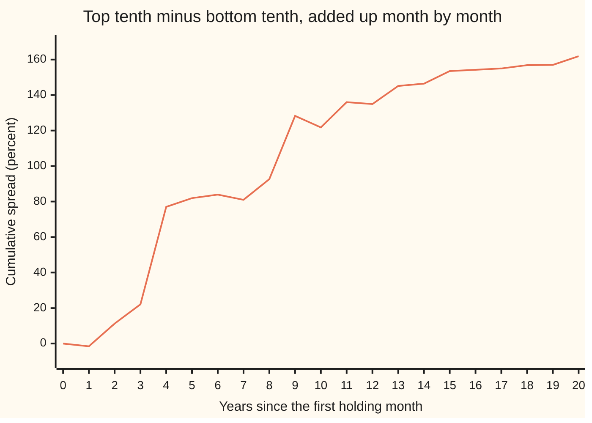

# Momentum and factor signals: sorting stocks and reading the spread

[Syllabus](../../../SYLLABUS.md) → [Financial mathematics](../../../SYLLABUS.md#w12) → [Signals, Mean Reversion and Backtesting](../../../SYLLABUS.md#w12-s50) → Momentum and factor signals

---

## General Overview

Take 300 stocks and twenty years of month-end prices. At the end of every month, rank the stocks by how much they rose over the past year, leaving out the latest month. Buy the top tenth, the 30 biggest risers. Sell short the bottom tenth, the 30 biggest fallers: borrow those shares and sell them, to buy back later. Hold for one month, then rank again.

In the market on this card, the top tenth beat the bottom tenth by **8.10 percent a year** on average over 240 months. That gap is the **spread**. The ranking rule is a **signal**: a number computed from information known today, used to predict which stocks will do better next month. Ranking on past winners is called **momentum**, and it is one of the most tested signals in finance. Narasimhan Jegadeesh and Sheridan Titman documented it on American stocks in 1993.

The market here is invented: every stock is given a slowly wandering drift that nobody can see. Inventing it buys one thing a real market cannot give. The hidden drifts are known, so the card can check whether the sort found them. It did: the hidden drift gap between the two tenths was 8.34 percent a year.

Two questions do all the work. How is the signal built and the spread measured? And is 8.10 percent real, or luck? The second needs care, because good and bad months for momentum come in runs, and a standard error that ignores runs claims too much certainty. The fix is the **Newey-West** standard error, which counts the runs.

**Rank stocks on a signal, hold the top tenth against the bottom tenth, and judge the average monthly spread by a standard error that allows neighbouring months to lean on each other.**

**What kind of fact this is:** a method: a recipe for testing whether a signal predicts returns. The Newey-West error it reports rests on a theorem about long samples, sketched in Why it works; the momentum premium itself is an empirical finding about markets, not a law.

### The picture: twenty years of winners minus losers



The single line is the running total of the monthly spreads, in percentage points: 161.91 after 20 years, 8.10 a year on average. It does not climb evenly. Between year 3 and year 4 the total jumped from 22.09 to 77.00; over the next four years it crept from 77.00 to 92.60. Money made in bursts is the reason the plain standard error is too confident.

---

## The formula

Notation first, in words. A subscript $i$ names the stock and a subscript $t$ the month. $P_{i,t}$ is stock $i$'s price at the end of month $t$. The signal is formed at the end of month $t$ and the stocks are held through month $t+1$.

$$s_{i,t} = \frac{P_{i,t-1}}{P_{i,t-12}} - 1$$

**Read it aloud:** the signal is the stock's return from the end of month $t-12$ to the end of month $t-1$: a year back, stopping one month short of today.

That window covers eleven monthly returns. Finance calls it "12-1": look back twelve months, skip the most recent one. Sort the $N$ stocks by $s_{i,t}$ and cut them into ten equal groups called **deciles**, each holding $n = N/10$ stocks. Decile 1 holds the losers, decile 10 the winners. With $r_{i,t+1}$ the stock's return in the holding month, the spread is

$$x_{t+1} = \frac{1}{n}\sum_{i \in \text{top}} r_{i,t+1} \;-\; \frac{1}{n}\sum_{i \in \text{bottom}} r_{i,t+1}$$

**Read it aloud:** next month's spread is the average return of the winners minus the average return of the losers.

Over $T$ holding months the spread averages $\bar x$. The **autocovariance** $\hat\gamma_j$ measures how a month's spread moves with the spread $j$ months earlier: $\hat\gamma_j = \frac{1}{T}\sum_{k=j+1}^{T}(x_k - \bar x)(x_{k-j} - \bar x)$. At $j = 0$ it is the variance. Divided by $\hat\gamma_0$ it becomes the **autocorrelation**, a number between −1 and 1. The standard error of $\bar x$, allowing for runs, is

$$\hat\sigma^2 = \hat\gamma_0 + 2\sum_{j=1}^{L}\Big(1 - \frac{j}{L+1}\Big)\hat\gamma_j, \qquad \text{SE} = \sqrt{\hat\sigma^2 / T}, \qquad t\text{-stat} = \bar x / \text{SE}$$

**Read it aloud:** take the spread's variance, add twice each of its first $L$ autocovariances with weights that fade to zero, divide by the number of months, take the square root; the t-statistic is the average spread in units of that error.

| Symbol | Plain meaning | In our example | Push it up and the answer… |
| --- | --- | --- | --- |
| $i$, $t$, $j$, $k$, $s$ | stock, month, lag in months, a running month, a window's first month | the example stock; any of the 240 holding months | — |
| $P_{i,t}$ | price at the end of month $t$ | $50.00 a year back, $61.00 a month back | — |
| $s_{i,t}$ | the 12-1 signal: past-year return, latest month skipped | 0.22 for the example stock | the stock moves toward decile 10 |
| $r_{i,t+1}$, $m_t$ | the stock's return in the holding month; the whole market's return in a month | — | — |
| $N$, $n$ | stocks in the market; stocks per decile | 300; 30 | more stocks per decile, less noise |
| $x_t$ | the spread in one month: winners minus losers | 0.67 percent a month on average | — |
| $\bar x$ | the average monthly spread | 0.6746 percent a month, 8.10 a year | t-stat rises |
| $T$ | holding months in the sample | 240 | SE falls like one over root $T$ |
| $\hat\gamma_j$ | autocovariance at lag $j$; $\hat\gamma_0$ is the variance | lag 1 autocorrelation 0.3709 | positive values raise the SE |
| $L$ | how many lags the error counts | 4 | the error counts slower runs |
| $\hat\sigma^2$ | the **long-run variance**: variance plus weighted autocovariances | 1.8610 times the variance | SE rises |
| SE, $t$-stat | standard error of $\bar x$, and $\bar x$ divided by it | 0.2517 percent a month; 2.68 | — |

Annual figures on this card are twelve times the monthly average, not compounded, the usual convention for spreads. The lag rule used is Newey and West's 1994 suggestion, $L = \lfloor 4\,(T/100)^{2/9} \rfloor$, where the floor brackets mean "round down". For $T = 240$ it gives 4.

### When it holds

- **The signal uses only prices known at formation.** Let the window include the holding month and the spread becomes 99.79 percent a year: the sort is reading the answer.
- **Enough stocks in each decile.** Each decile's average carries the noise of its members divided by the square root of $n$. With a handful of stocks a decile the spread is mostly noise.
- **Runs die out within $L$ months.** If the spread's months lean on each other for longer than $L$, the error still undercounts. Here $L = 12$ gives t = 2.58 against 2.68 at $L = 4$: the runs are mostly over by month four.
- **The premium is stable across the sample.** The standard error treats the 240 months as draws from one unchanging process. Real momentum has crashed hard, as in the rebound of spring 2009, and twenty years holds few such episodes.
- **Costs are ignored.** The spread is before trading costs and the cost of borrowing shares to short. Momentum replaces much of each decile every few months, so costs take a real bite.

---

## Why it works

### Step 0: a sort asks the question without a model

The claim to test is loose: stocks that went up tend to keep going up. No formula for returns is needed to test it. If the signal carries information about next month, stocks at its top should beat stocks at its bottom; if it carries none, the two ends should match up to noise. Sorting turns "does the signal predict" into one number a month, the spread, and one question, whether its average is far from zero.

### Step 1: the long-short spread removes the market

Every stock's return contains the whole market's return for that month, a shared tide. Write $r_{i,t} = m_t + u_{i,t}$, with $m_t$ the market's return and $u_{i,t}$ the stock's own part. Averaging over the top $n$ stocks gives $m_t$ plus the average of their own parts; the same for the bottom. Subtracting cancels the market's return exactly:

$$x_t = \frac{1}{n}\sum_{\text{top}} u_{i,t} - \frac{1}{n}\sum_{\text{bottom}} u_{i,t}.$$

Ignoring margin and borrowing fees, money from shorting the losers pays for the winners, so the position costs nothing net to set up. The spread is a return per dollar held on each side, driven only by differences between stocks. Both deciles carry the market's return; the spread carries none of it.

### Step 2: why skip the latest month

Individual stocks partly reverse over one month. A stock that jumped last month on a burst of buying tends to give some back, because prices overshoot and bid-ask bounce (trades landing alternately at the buying and selling price) adds noise that undoes itself. In the invented market each stock gives back 5 percent of last month's own shock: $u$ contains $-0.05\,e_{i,t-1}$, where $e_{i,t-1}$ is the stock's own surprise last month.

A signal that includes the latest month ranks on that surprise. Stocks with a big positive surprise land in decile 10 and hand 5 percent of it back; the losers claw some back. That reversal works against the winners, and it is why the 12-0 window, which includes the latest month, earns 5.88 percent a year where 12-1 earns 8.10. Ranked on the latest month alone, the spread turns negative: −6.88 percent a year. Skipping one month keeps the slow drift and drops the fast reversal.

### Step 3: what the average spread estimates

Each month's spread is the hidden drift gap between the two deciles plus fresh noise. The invented market records the drift part of every return, the piece that was set before the month began: the stock's slow drift, the predictable part of a shared style tide (Step 4), and the reversal of last month's shock. Averaged over the deciles the sort chose, the hidden drift gap was 8.34 percent a year. The measured 8.10 sits within the noise of it: the sort found real drift, not luck. On real data the drift is never visible, and the only guard against luck is the standard error.

### Step 4: the variance of an average when months lean on each other

For independent months, the variance of an average of $T$ numbers is their variance over $T$. That gives the **plain** standard error, $\sqrt{\hat\gamma_0/T}$, which here is 0.1845 percent a month and a t-statistic of 3.66.

Months are not independent here. A momentum spread depends on which kind of stock is in fashion, and fashions last: in the invented market each stock carries a fixed loading on a style tide that persists from month to month, so the winners of a good run hold the stocks that keep riding it. The spread's lag-1 autocorrelation is 0.3709.

Expand the variance of the average. It is the sum of every pair's covariance, over $T^2$:

$$\operatorname{Var}(\bar x) = \frac{1}{T^2}\sum_{s=1}^{T}\sum_{k=1}^{T}\operatorname{Cov}(x_s, x_k) = \frac{1}{T}\Big[\gamma_0 + 2\sum_{j=1}^{T-1}\Big(1 - \frac{j}{T}\Big)\gamma_j\Big].$$

Pairs $j$ months apart occur $T - j$ times, which gives the weight $1 - j/T$. The plain error keeps only the first term. With positive autocovariances it is too small, and the t-statistic too large.

### Step 5: why Newey-West truncates and tapers

The exact formula needs every autocovariance up to lag $T - 1$, and the far ones are estimated from few pairs, mostly noise. Newey-West keeps the first $L$ and tapers their weights from $1 - 1/(L+1)$ down toward zero: 0.8, 0.6, 0.4, 0.2 when $L = 4$. These are **Bartlett weights**, named for the statistician Maurice Bartlett.

The taper is not cosmetic. Cut the autocovariances off without it and the estimated variance can come out negative, which is meaningless. With it, the long-run variance equals an average of squared sums over windows $L + 1$ months long, and a square cannot be negative. The folded proof below shows the identity; the code computes the error both ways and they agree to the last digit printed.

<details>
<summary>Detailed proof: the Bartlett-weighted variance is an average of squared window sums</summary>

Let $d_k = x_k - \bar x$ for $k = 1, \dots, T$, and $d_k = 0$ outside that range. For each start $s$ from $1 - L$ to $T$, form the window sum $W_s = d_s + d_{s+1} + \dots + d_{s+L}$.

Square and add over all starts: $\sum_s W_s^2 = \sum_s \sum_{a=0}^{L}\sum_{b=0}^{L} d_{s+a} d_{s+b}$. Group the terms by the gap $j = |a - b|$. For a fixed gap, the pair $(a, b)$ can sit in $L + 1 - j$ positions inside a window, and each product $d_k d_{k+j}$ is met once per position as $s$ runs over every start. So

$\sum_s W_s^2 = (L+1)\sum_k d_k^2 + 2\sum_{j=1}^{L}(L + 1 - j)\sum_k d_k d_{k+j} = (L+1)\,T\Big[\hat\gamma_0 + 2\sum_{j=1}^{L}\Big(1 - \frac{j}{L+1}\Big)\hat\gamma_j\Big].$

Divide by $(L+1)T$: the Newey-West long-run variance is the average squared window sum, scaled by the window length. Every term is a square, so the estimate is never negative. Newey and West proved that it converges to the true long-run variance when $L$ grows with $T$, but more slowly; that part is stated here, not proved.

</details>

In the invented market the long-run variance is 1.8610 times the plain variance. The error grows by the square root of that, from 0.1845 to 0.2517 percent a month, and the t-statistic falls from 3.66 to 2.68. Still clear of zero, but by less than the plain error claimed.

### Step 6: the spread is a factor

A monthly winners-minus-losers return is a tradable portfolio with zero net cost, which is exactly what a factor is in [Factor models](../37-Portfolio%20Theory/05-factor-models-and-apt.md). Mark Carhart added it in 1997 as a fourth factor beside the market, size and value. Data libraries publish it as UMD, "up minus down", or WML, "winners minus losers". Any signal can be tested the same way: book-to-price, profitability, low volatility. Each becomes a factor once sorted into a spread.

A second route to momentum ranks each stock against its own past rather than against other stocks. **Time-series momentum**, studied by Tobias Moskowitz, Yao Hua Ooi and Lasse Pedersen in 2012, holds an asset long if its own past-year return is positive and short if negative. The 12-1 version earns 1.23 percent a year in the invented market: the drift here lives in the differences between stocks, which the sort isolates and the own-past rule mixes with the market's direction. Moskowitz, Ooi and Pedersen found it strong across futures on stock indices, bonds, currencies and commodities.

A third route skips the deciles: each month, measure the rank correlation between signal and next month's return, and average it. That correlation is the information coefficient, the subject of [The fundamental law](04-information-coefficient-and-the-fundamental-law.md).

---

## Worked numbers, by hand

One stock's signal, then the spread and its error from the printed summary of 240 months.

| Step | Arithmetic | Value |
| --- | --- | --- |
| signal, example stock | $61.00 / $50.00 − 1 | 0.22 |
| the skipped month | $58.00 / $61.00 − 1, left out of the signal | −0.0492 |
| decile 10 average, decile 1 average | read from the sort, percent a year | 8.94 and 0.85 |
| spread | 12 × 0.6746 percent a month | 8.10 percent a year |
| plain SE | 2.8581 / √240 | 0.1845 percent a month |
| plain t | 0.6746 / 0.1845 | 3.66 |
| long-run over plain variance | 1 + 2 × (0.8 × 0.3709 + 0.6 × 0.1843 + 0.4 × 0.0801 − 0.2 × 0.0445) | 1.8610 |
| Newey-West SE | 0.1845 × √1.8610 | 0.2517 percent a month |
| **Newey-West t** | 0.6746 / 0.2517 | **2.68** |

Here 2.8581 is the standard deviation of the monthly spread in percent, and 0.3709, 0.1843, 0.0801 and −0.0445 are its autocorrelations at lags 1 to 4. A t of 2.68 says the average spread sits 2.68 standard errors above zero: strong evidence on one test, weaker than the 3.66 the plain error claimed.

### The ten deciles, percent a year

```
decile   average return, percent a year (one block = 0.25 points)
   1   ███                                    0.85
   2   ██████████                             2.46
   3   █████████████                          3.23
   4   ███████████████████████████            6.86
   5   ██████████████████████                 5.43
   6   ███████████████████████████████████    8.74
   7   ██████████████████                     4.55
   8   █████████████████████████              6.34
   9   █████████████████████████████          7.31
  10   ████████████████████████████████████   8.94
```

Each decile carries the market's return, so every bar is positive. The ends are what the spread uses: 8.94 − 0.85 = 8.10 up to rounding. The middle deciles wobble, because thirty stocks over twenty years leave a lot of noise and the signal sorts the middle only weakly. A rise from decile 1 to decile 10 that is not perfectly smooth is normal in real data too.

### What breaks if you drop a piece

| Mistake | Comes out at | What went wrong |
| --- | --- | --- |
| No skip month: rank on the full 12 months (12-0) | 5.88 percent a year | the latest month's reversal works against the winners |
| The window includes the holding month | 99.79 percent a year | look-ahead: the signal contains next month's return |
| Plain standard error | t = 3.66 instead of 2.68 | positive autocorrelation ignored; certainty overstated |

---

## Code, from first principles, and it actually runs

The code builds the invented market from its own random numbers (splitmix64 for uniform draws, Box-Muller for bell-curve draws), then forms the 12-1 signal, sorts, and measures the spread and its error. It reaches each answer by independent roads. The signal is computed as a price ratio and again by chaining eleven monthly returns. The deciles are cut once by sorting and once by bisection on a cut-off value with no sort at all; they must pick the same stocks. The Newey-West error is computed from autocovariances, from squared window sums, and by a moving-block bootstrap (redrawing 12-month blocks of the spread 2,000 times and measuring how the average scatters). Finally the measured spread is compared with the hidden drift gap that only an invented market can reveal.

### Python

```python
# Momentum 12-1 decile sort, spread and Newey-West error -- the check behind the card.
# Standard library only. The market is invented, so its hidden drifts are known.
from math import sqrt, log, cos, pi
M64 = (1 << 64) - 1
state = 20260928
def unif():                                   # splitmix64 -> a number in (0, 1)
    global state
    state = (state + 0x9E3779B97F4A7C15) & M64
    z = state
    z = ((z ^ (z >> 30)) * 0xBF58476D1CE4E5B9) & M64
    z = ((z ^ (z >> 27)) * 0x94D049BB133111EB) & M64
    return (((z ^ (z >> 31)) >> 11) + 0.5) / 2.0 ** 53
def gauss():                                  # Box-Muller, one draw per pair
    u1, u2 = unif(), unif()
    return sqrt(-2.0 * log(u1)) * cos(2.0 * pi * u2)

# ---- the invented market: 300 stocks, 252 months ----
N, TT, SMU = 300, 252, 0.0063
mu = [SMU * gauss() for _ in range(N)]        # each stock's slow drift, per month
b = [gauss() for _ in range(N)]               # each stock's loading on a style tide
eprev, f = [0.0] * N, 0.0
R, DRIFT = [], []                             # returns; the part that is not a fresh shock
for t in range(TT):
    m = 0.005 + 0.045 * gauss()               # the whole market this month
    fold = f
    f = 0.7 * f + sqrt(1 - 0.49) * 0.015 * gauss()
    row, dr = [], []
    for i in range(N):
        mu[i] = 0.97 * mu[i] + sqrt(1 - 0.97 ** 2) * SMU * gauss()
        e = 0.08 * gauss()
        dr.append(mu[i] + b[i] * 0.7 * fold - 0.05 * eprev[i])
        row.append(m + mu[i] + b[i] * f - 0.05 * eprev[i] + e)
        eprev[i] = e
    R.append(row); DRIFT.append(dr)
P = [[100.0] * N]                             # P[k] = prices at the end of month k-1
for row in R:
    P.append([p * (1 + r) for p, r in zip(P[-1], row)])

def cut(s, n, top):                           # road B: find the decile edge by bisection, no sorting
    lo, hi = min(s) - 1.0, max(s) + 1.0
    while True:
        mid = 0.5 * (lo + hi)
        k = sum(1 for v in s if (v >= mid if top else v <= mid))
        if k == n: return {i for i, v in enumerate(s) if (v >= mid if top else v <= mid)}
        if (k > n) == top: lo = mid
        else: hi = mid
def avg(rets, grp): return sum(rets[i] for i in grp) / len(grp)
def sorts(sig, nd=10, check=False):           # road A: sort, cut into nd groups, hold next month
    D, x, xd, bad, xb = [[] for _ in range(nd)], [], [], 0, []
    for t in range(11, TT - 1):               # form at the end of month t, hold month t+1
        s = sig(t); n = N // nd
        order = sorted(range(N), key=lambda i: s[i])
        for d in range(nd): D[d].append(avg(R[t + 1], order[d * n:(d + 1) * n]))
        x.append(D[-1][-1] - D[0][-1])
        xd.append(avg(DRIFT[t + 1], order[-n:]) - avg(DRIFT[t + 1], order[:n]))
        if check:
            hi, lo = cut(s, n, True), cut(s, n, False)
            bad += len(hi ^ set(order[-n:])) + len(lo ^ set(order[:n]))
            xb.append(avg(R[t + 1], sorted(hi)) - avg(R[t + 1], sorted(lo)))
    return D, x, xd, bad, xb
mom = lambda t: [P[t][i] / P[t - 11][i] - 1 for i in range(N)]    # 12-1: months t-11 .. t-1
def mom_compound(t):                          # road 2 for the signal: chain the monthly returns
    out = []
    for i in range(N):
        g = 1.0
        for k in range(t - 11, t): g *= 1 + R[k][i]
        out.append(g - 1)
    return out
sgap = max(abs(a - c) for t in range(11, TT - 1) for a, c in zip(mom(t), mom_compound(t)))

D, x, xd, bad, xb = sorts(mom, check=True)
T = len(x); xbar = sum(x) / T
def gam(j): return sum((x[k] - xbar) * (x[k - j] - xbar) for k in range(j, T)) / T
def nw(L): return gam(0) + 2 * sum((1 - j / (L + 1)) * gam(j) for j in range(1, L + 1))
L = 4; assert L == int(4 * (T / 100) ** (2 / 9))   # Newey-West 1994 lag rule, T = 240
dev = [v - xbar for v in x]                   # road 2 for Newey-West: squared window sums
win = sum(sum(dev[max(0, s):min(T, s + L + 1)]) ** 2 for s in range(-L, T)) / ((L + 1) * T)
reps = []                                      # road 3: moving-block bootstrap, blocks of 12
for _ in range(2000):
    tot = 0.0
    for _ in range(T // 12):
        s0 = int(unif() * (T - 11)); tot += sum(x[s0:s0 + 12])
    reps.append(tot / T)
rbar = sum(reps) / len(reps)
se_boot = sqrt(sum((v - rbar) ** 2 for v in reps) / len(reps))
se_plain, se_nw = sqrt(gam(0) / T), sqrt(nw(L) / T)
noise = [a - c for a, c in zip(x, xd)]
nbar = sum(noise) / T
se_noise = sqrt(sum((v - nbar) ** 2 for v in noise) / T / T)

A = lambda v: 1200 * v                         # monthly decimal -> percent a year (x 12)
spread = lambda sig, nd=10: A(sum(sorts(sig, nd)[1]) / T)
ts = sum(sum((1 if P[t][i] > P[t - 11][i] else -1) * R[t + 1][i] for i in range(N)) / N
         for t in range(11, TT - 1)) / T
rows = [("example: signal 61/50 - 1", 61 / 50 - 1), ("example: skipped month 58/61 - 1", 58 / 61 - 1),
        ("signal roads, largest gap", sgap), ("decile roads, stocks disagreeing", bad),
        ("holding months T", T), ("spread, percent a month", 100 * xbar), ("spread, percent a year", A(xbar)),
        ("spread road B, percent a year", A(sum(xb) / T)), ("drift-part spread, percent a year", A(sum(xd) / T)),
        ("sd of monthly spread, percent", 100 * sqrt(gam(0)))]
rows += [(f"autocorrelation lag {j}", gam(j) / gam(0)) for j in range(1, L + 1)]
rows += [("plain SE, percent a month", 100 * se_plain), ("plain t", xbar / se_plain),
         ("NW long-run var / plain var", nw(L) / gam(0)), ("NW SE (L=4), percent a month", 100 * se_nw),
         ("NW SE by window sums", 100 * sqrt(win / T)), ("NW SE by block bootstrap", 100 * se_boot),
         ("NW t (L=4)", xbar / se_nw), ("NW t (L=12)", xbar / sqrt(nw(12) / T)),
         ("wrong: no skip (12-0), percent a year", spread(lambda t: [P[t + 1][i] / P[t - 11][i] - 1 for i in range(N)])),
         ("wrong: peeks at holding month", spread(lambda t: [P[t + 2][i] / P[t - 10][i] - 1 for i in range(N)])),
         ("try: last month only (1-0)", spread(lambda t: [P[t + 1][i] / P[t][i] - 1 for i in range(N)])),
         ("try: quintiles, top minus bottom", spread(mom, 5)), ("try: time-series momentum", A(ts))]
for name, v in rows:
    print(f"{name:<38} {v:>12.6f}")
print("decile, percent a year: " + ", ".join(f"{A(sum(d) / T):.2f}" for d in D))
print("cumulative spread by year, percent: " + ", ".join(f"{100 * sum(x[:12 * y]):.2f}" for y in range(21)))

assert sgap < 1e-9                             # price ratio == chained monthly returns
assert bad == 0 and abs(A(sum(xb) / T) - A(xbar)) < 1e-9   # bisection cut == sorted cut
assert abs(sqrt(win / T) - se_nw) < 1e-12 * se_nw + 1e-15       # autocovariances == window sums
assert abs(se_boot / se_nw - 1) < 0.25         # resampling agrees with the formula
assert abs(xbar - sum(xd) / T) < 2 * se_noise  # the sort found the hidden drift
```

**Ran 2026-09-28 on macOS, Python 3.14.6, standard library only. All checks passed. Output, pasted from the run:**

```
example: signal 61/50 - 1                  0.220000
example: skipped month 58/61 - 1          -0.049180
signal roads, largest gap                  0.000000
decile roads, stocks disagreeing           0.000000
holding months T                         240.000000
spread, percent a month                    0.674644
spread, percent a year                     8.095731
spread road B, percent a year              8.095731
drift-part spread, percent a year          8.343272
sd of monthly spread, percent              2.858127
autocorrelation lag 1                      0.370937
autocorrelation lag 2                      0.184327
autocorrelation lag 3                      0.080084
autocorrelation lag 4                     -0.044500
plain SE, percent a month                  0.184491
plain t                                    3.656781
NW long-run var / plain var                1.860959
NW SE (L=4), percent a month               0.251677
NW SE by window sums                       0.251677
NW SE by block bootstrap                   0.262843
NW t (L=4)                                 2.680591
NW t (L=12)                                2.575656
wrong: no skip (12-0), percent a year      5.879735
wrong: peeks at holding month             99.791431
try: last month only (1-0)                -6.883598
try: quintiles, top minus bottom           6.471557
try: time-series momentum                  1.230810
decile, percent a year: 0.85, 2.46, 3.23, 6.86, 5.43, 8.74, 4.55, 6.34, 7.31, 8.94
cumulative spread by year, percent: 0.00, -1.58, 11.24, 22.09, 77.00, 81.93, 83.90, 80.98, 92.60, 128.27, 121.78, 135.97, 134.91, 145.13, 146.42, 153.51, 154.22, 154.99, 156.85, 156.98, 161.91
```

### Rust

```rust
// Momentum 12-1 decile sort, spread and Newey-West error -- the check behind the card.
// Rust std only. The market is invented, so its hidden drifts are known.
use std::collections::BTreeSet;
use std::f64::consts::PI;

struct Rng(u64);
impl Rng {
    fn unif(&mut self) -> f64 { // splitmix64 -> a number in (0, 1)
        self.0 = self.0.wrapping_add(0x9E3779B97F4A7C15);
        let mut z = self.0;
        z = (z ^ (z >> 30)).wrapping_mul(0xBF58476D1CE4E5B9);
        z = (z ^ (z >> 27)).wrapping_mul(0x94D049BB133111EB);
        (((z ^ (z >> 31)) >> 11) as f64 + 0.5) / 2f64.powi(53)
    }
    fn gauss(&mut self) -> f64 { // Box-Muller, one draw per pair
        let (u1, u2) = (self.unif(), self.unif());
        (-2.0 * u1.ln()).sqrt() * (2.0 * PI * u2).cos()
    }
}

const N: usize = 300;
const TT: usize = 252;

struct Mkt { r: Vec<Vec<f64>>, drift: Vec<Vec<f64>>, p: Vec<Vec<f64>> }
type Sig<'a> = &'a dyn Fn(usize) -> Vec<f64>;

fn avg(rets: &[f64], grp: &[usize]) -> f64 { grp.iter().map(|&i| rets[i]).sum::<f64>() / grp.len() as f64 }

fn cut(s: &[f64], n: usize, top: bool) -> BTreeSet<usize> { // road B: decile edge by bisection
    let inside = |v: f64, mid: f64| if top { v >= mid } else { v <= mid };
    let mut lo = s.iter().cloned().fold(f64::INFINITY, f64::min) - 1.0;
    let mut hi = s.iter().cloned().fold(f64::NEG_INFINITY, f64::max) + 1.0;
    loop {
        let mid = 0.5 * (lo + hi);
        let k = s.iter().filter(|&&v| inside(v, mid)).count();
        if k == n { return (0..s.len()).filter(|&i| inside(s[i], mid)).collect(); }
        if (k > n) == top { lo = mid } else { hi = mid }
    }
}

// road A: sort, cut into nd groups, hold next month
fn sorts(mk: &Mkt, sig: Sig, nd: usize, check: bool) -> (Vec<Vec<f64>>, Vec<f64>, Vec<f64>, usize, Vec<f64>) {
    let (mut d, mut x, mut xd, mut bad, mut xb) = (vec![vec![]; nd], vec![], vec![], 0usize, vec![]);
    for t in 11..TT - 1 {
        let s = sig(t);
        let n = N / nd;
        let mut order: Vec<usize> = (0..N).collect();
        order.sort_by(|&a, &b| s[a].partial_cmp(&s[b]).unwrap());
        for k in 0..nd { d[k].push(avg(&mk.r[t + 1], &order[k * n..(k + 1) * n])); }
        x.push(d[nd - 1].last().unwrap() - d[0].last().unwrap());
        xd.push(avg(&mk.drift[t + 1], &order[N - n..]) - avg(&mk.drift[t + 1], &order[..n]));
        if check {
            let (hi, lo) = (cut(&s, n, true), cut(&s, n, false));
            let a: BTreeSet<usize> = order[N - n..].iter().cloned().collect();
            let c: BTreeSet<usize> = order[..n].iter().cloned().collect();
            bad += hi.symmetric_difference(&a).count() + lo.symmetric_difference(&c).count();
            let hv: Vec<usize> = hi.into_iter().collect();
            let lv: Vec<usize> = lo.into_iter().collect();
            xb.push(avg(&mk.r[t + 1], &hv) - avg(&mk.r[t + 1], &lv));
        }
    }
    (d, x, xd, bad, xb)
}

fn main() {
    let mut g = Rng(20260928);
    let smu = 0.0063;
    let mut mu: Vec<f64> = (0..N).map(|_| smu * g.gauss()).collect();
    let b: Vec<f64> = (0..N).map(|_| g.gauss()).collect();
    let (mut eprev, mut f) = (vec![0.0f64; N], 0.0f64);
    let (mut r, mut drift) = (vec![], vec![]);
    for _t in 0..TT {
        let m = 0.005 + 0.045 * g.gauss();
        let fold = f;
        f = 0.7 * f + (1.0f64 - 0.49).sqrt() * 0.015 * g.gauss();
        let (mut row, mut dr) = (vec![], vec![]);
        for i in 0..N {
            mu[i] = 0.97 * mu[i] + (1.0 - 0.97 * 0.97f64).sqrt() * smu * g.gauss();
            let e = 0.08 * g.gauss();
            dr.push(mu[i] + b[i] * 0.7 * fold - 0.05 * eprev[i]);
            row.push(m + mu[i] + b[i] * f - 0.05 * eprev[i] + e);
            eprev[i] = e;
        }
        r.push(row); drift.push(dr);
    }
    let mut p = vec![vec![100.0f64; N]];
    for row in &r {
        let next: Vec<f64> = p.last().unwrap().iter().zip(row).map(|(q, x)| q * (1.0 + x)).collect();
        p.push(next);
    }
    let mk = Mkt { r, drift, p };
    let (pp, rr) = (&mk.p, &mk.r);
    let mom = |t: usize| (0..N).map(|i| pp[t][i] / pp[t - 11][i] - 1.0).collect::<Vec<f64>>();
    let mut sgap = 0.0f64; // road 2 for the signal: chain the monthly returns
    for t in 11..TT - 1 {
        let s = mom(t);
        for i in 0..N {
            let mut c = 1.0;
            for k in t - 11..t { c *= 1.0 + rr[k][i]; }
            sgap = sgap.max((s[i] - (c - 1.0)).abs());
        }
    }
    let (d, x, xd, bad, xb) = sorts(&mk, &mom, 10, true);
    let tn = x.len();
    let tf = tn as f64;
    let xbar = x.iter().sum::<f64>() / tf;
    let gam = |j: usize| (j..tn).map(|k| (x[k] - xbar) * (x[k - j] - xbar)).sum::<f64>() / tf;
    let nw = |l: usize| gam(0) + 2.0 * (1..=l).map(|j| (1.0 - j as f64 / (l as f64 + 1.0)) * gam(j)).sum::<f64>();
    let l = 4usize; assert_eq!(l, (4.0 * (tf / 100.0).powf(2.0 / 9.0)) as usize); // NW 1994 lag rule
    let dev: Vec<f64> = x.iter().map(|v| v - xbar).collect(); // road 2: squared window sums
    let mut win = 0.0;
    for s in -(l as i64)..tn as i64 {
        let (a, e) = (s.max(0) as usize, ((s + l as i64 + 1) as usize).min(tn));
        win += dev[a..e].iter().sum::<f64>().powi(2);
    }
    win /= (l as f64 + 1.0) * tf;
    let mut reps = vec![]; // road 3: moving-block bootstrap, blocks of 12
    for _ in 0..2000 {
        let mut tot = 0.0;
        for _ in 0..tn / 12 {
            let s0 = (g.unif() * (tn - 11) as f64) as usize;
            tot += x[s0..s0 + 12].iter().sum::<f64>();
        }
        reps.push(tot / tf);
    }
    let rbar = reps.iter().sum::<f64>() / reps.len() as f64;
    let se_boot = (reps.iter().map(|v| (v - rbar).powi(2)).sum::<f64>() / reps.len() as f64).sqrt();
    let (se_plain, se_nw) = ((gam(0) / tf).sqrt(), (nw(l) / tf).sqrt());
    let noise: Vec<f64> = x.iter().zip(&xd).map(|(a, c)| a - c).collect();
    let nbar = noise.iter().sum::<f64>() / tf;
    let se_noise = (noise.iter().map(|v| (v - nbar).powi(2)).sum::<f64>() / tf / tf).sqrt();

    let ann = |v: f64| 1200.0 * v; // monthly decimal -> percent a year (x 12)
    let spread = |sig: Sig, nd: usize| ann(sorts(&mk, sig, nd, false).1.iter().sum::<f64>() / tf);
    let mut ts = 0.0;
    for t in 11..TT - 1 {
        ts += (0..N).map(|i| (if pp[t][i] > pp[t - 11][i] { 1.0 } else { -1.0 }) * rr[t + 1][i]).sum::<f64>() / N as f64;
    }
    ts /= tf;
    let xdm = xd.iter().sum::<f64>() / tf;
    let xbm = xb.iter().sum::<f64>() / tf;
    let mut rows: Vec<(String, f64)> = vec![
        ("example: signal 61/50 - 1".into(), 61.0 / 50.0 - 1.0), ("example: skipped month 58/61 - 1".into(), 58.0 / 61.0 - 1.0),
        ("signal roads, largest gap".into(), sgap), ("decile roads, stocks disagreeing".into(), bad as f64),
        ("holding months T".into(), tf), ("spread, percent a month".into(), 100.0 * xbar), ("spread, percent a year".into(), ann(xbar)),
        ("spread road B, percent a year".into(), ann(xbm)), ("drift-part spread, percent a year".into(), ann(xdm)),
        ("sd of monthly spread, percent".into(), 100.0 * gam(0).sqrt())];
    for j in 1..=l { rows.push((format!("autocorrelation lag {}", j), gam(j) / gam(0))); }
    let rows2: Vec<(&str, f64)> = vec![
        ("plain SE, percent a month", 100.0 * se_plain), ("plain t", xbar / se_plain),
        ("NW long-run var / plain var", nw(l) / gam(0)), ("NW SE (L=4), percent a month", 100.0 * se_nw),
        ("NW SE by window sums", 100.0 * (win / tf).sqrt()), ("NW SE by block bootstrap", 100.0 * se_boot),
        ("NW t (L=4)", xbar / se_nw), ("NW t (L=12)", xbar / (nw(12) / tf).sqrt()),
        ("wrong: no skip (12-0), percent a year", spread(&|t| (0..N).map(|i| pp[t + 1][i] / pp[t - 11][i] - 1.0).collect(), 10)),
        ("wrong: peeks at holding month", spread(&|t| (0..N).map(|i| pp[t + 2][i] / pp[t - 10][i] - 1.0).collect(), 10)),
        ("try: last month only (1-0)", spread(&|t| (0..N).map(|i| pp[t + 1][i] / pp[t][i] - 1.0).collect(), 10)),
        ("try: quintiles, top minus bottom", spread(&mom, 5)), ("try: time-series momentum", ann(ts))];
    for (n, v) in rows2 { rows.push((n.to_string(), v)); }
    for (name, v) in &rows { println!("{:<38} {:>12.6}", name, v); }
    let dec: Vec<String> = d.iter().map(|c| format!("{:.2}", ann(c.iter().sum::<f64>() / tf))).collect();
    println!("decile, percent a year: {}", dec.join(", "));
    let cum: Vec<String> = (0..21).map(|y| format!("{:.2}", 100.0 * x[..12 * y].iter().sum::<f64>() + 0.0)).collect();
    println!("cumulative spread by year, percent: {}", cum.join(", "));

    assert!(sgap < 1e-9); // price ratio == chained monthly returns
    assert!(bad == 0 && (ann(xbm) - ann(xbar)).abs() < 1e-9); // bisection cut == sorted cut
    assert!(((win / tf).sqrt() - se_nw).abs() < 1e-12 * se_nw + 1e-15); // autocovariances == window sums
    assert!((se_boot / se_nw - 1.0).abs() < 0.25); // resampling agrees with the formula
    assert!((xbar - xdm).abs() < 2.0 * se_noise); // the sort found the hidden drift
}
```

**Ran 2026-09-28 on macOS, rustc 1.98.1, no crates. All checks passed. Output, pasted from the run:**

```
example: signal 61/50 - 1                  0.220000
example: skipped month 58/61 - 1          -0.049180
signal roads, largest gap                  0.000000
decile roads, stocks disagreeing           0.000000
holding months T                         240.000000
spread, percent a month                    0.674644
spread, percent a year                     8.095731
spread road B, percent a year              8.095731
drift-part spread, percent a year          8.343272
sd of monthly spread, percent              2.858127
autocorrelation lag 1                      0.370937
autocorrelation lag 2                      0.184327
autocorrelation lag 3                      0.080084
autocorrelation lag 4                     -0.044500
plain SE, percent a month                  0.184491
plain t                                    3.656781
NW long-run var / plain var                1.860959
NW SE (L=4), percent a month               0.251677
NW SE by window sums                       0.251677
NW SE by block bootstrap                   0.262843
NW t (L=4)                                 2.680591
NW t (L=12)                                2.575656
wrong: no skip (12-0), percent a year      5.879735
wrong: peeks at holding month             99.791431
try: last month only (1-0)                -6.883598
try: quintiles, top minus bottom           6.471557
try: time-series momentum                  1.230810
decile, percent a year: 0.85, 2.46, 3.23, 6.86, 5.43, 8.74, 4.55, 6.34, 7.31, 8.94
cumulative spread by year, percent: 0.00, -1.58, 11.24, 22.09, 77.00, 81.93, 83.90, 80.98, 92.60, 128.27, 121.78, 135.97, 134.91, 145.13, 146.42, 153.51, 154.22, 154.99, 156.85, 156.98, 161.91
```

The two outputs agree line for line. The block bootstrap gives 0.2628 against the formula's 0.2517: a resampling estimate, close but not equal, which is what the 25 percent tolerance in its assert allows for. Both signal roads print a largest gap of 0.000000, and no stock is picked differently by the two decile roads.

> [!TIP]
> **Try changing**
> - **Count twelve lags instead of four.** Guess first: does the t-statistic move much? Change `L = 4` to `L = 12`. The line `NW t (L=12)` already prints the answer: 2.58 against 2.68: the runs are mostly over within four months.
> - **Rank on last month alone (1-0).** Guess first: winners or losers? The spread is −6.88 percent a year. Last month's winners lose next month: the reversal that Step 2 skips.
> - **Quintiles instead of deciles.** Guess first: bigger or smaller spread? Top fifth minus bottom fifth earns 6.47 percent a year: wider groups hold milder signals.
> - **Own past instead of other stocks.** Time-series momentum earns 1.23 percent a year here, because this market's drift lives in the differences between stocks.

---

## The usual mistake

> [!warning]
> **Reading a t-statistic from the plain standard error.** Momentum pays in runs. Months in a good run lean on each other, so 240 months carry less independent evidence than 240 coin tosses. The plain error ignores that and reported t = 3.66; counting the runs gives 2.68. The gap is larger for overlapping holding periods, where each month shares most of its stocks with the next.
>
> - **Peeking.** A signal built with any price from the holding month is not a signal. The invented market returns 99.79 percent a year that way. Subtler peeks, such as using a company's year-end accounts before they were published, do the same thing more quietly.
> - **Forgetting the skip.** Ranking on the full twelve months gives 5.88 percent a year instead of 8.10, because the most recent month reverses.
> - **Trusting one test.** A t of 2.68 is strong for one signal chosen in advance. It is weak for the best of fifty signals tried: see [Trying many strategies](06-deflated-sharpe-and-multiple-testing.md).
> - **Ignoring costs and the short leg.** The spread assumes the losers can be borrowed and sold at the quoted price. Small, falling stocks are often the hardest and dearest to borrow.

---

## Where you meet it in real life

- **Fund performance reports.** A fund's return is regressed on the market, size, value and momentum factors. A manager whose excess return disappears once momentum is added was riding the tide, not picking stocks.
- **The factor zoo.** Hundreds of published signals have been tested by exactly this recipe: sort, spread, Newey-West t. Because so many have been tried, a new factor now has to clear a higher bar than a t-statistic that would satisfy a single test.
- **Momentum and trend funds.** Funds sold as "momentum" hold the top of a 12-1 sort. Managed-futures funds run time-series momentum across bond, currency and commodity futures.
- **The opposite trade.** [Pairs trading](02-pairs-trading-and-cointegration.md) and [Mean reversion](01-ornstein-uhlenbeck-mean-reversion-trading.md) bet on reversal over days and weeks. Momentum bets on continuation over months. The one-month reversal on this card is where the two meet.
- **Backtests in general.** Every pitfall here, from look-ahead to overlapping months, recurs in [Backtesting](05-backtesting-pitfalls.md).

> **Say it back**
> A signal is a number known today that ranks stocks for next month. Momentum ranks on the past year's return, skipping the latest month because single months reverse. Sorting into deciles and holding the top against the bottom removes the market and leaves the signal's value as one monthly spread: 8.10 percent a year here. Whether that is real depends on its standard error, and because momentum's good months come in runs, the error must count the runs: Newey-West does, and turns a t of 3.66 into 2.68.

---

## What this builds on

- [Pairs trading](02-pairs-trading-and-cointegration.md): a long-short position that cancels a shared tide, and the habit of testing a trading rule with statistics.
- [Factor models](../37-Portfolio%20Theory/05-factor-models-and-apt.md): what a factor is, why a zero-cost spread is one, and how a fund's loadings on factors are measured.

## Where this goes next

- [The fundamental law](04-information-coefficient-and-the-fundamental-law.md): replaces the decile sort with the signal's correlation to next month's returns, and turns that correlation and the number of independent bets into an expected performance.

The decile spread says whether a signal works; it does not say how good the signal is per bet, or how much of it a portfolio can capture, and that is the question the information coefficient answers.

---

## Sources

Verified 2026-09-28: each DOI checked on Crossref for title and first author.

- Jegadeesh, Narasimhan, and Sheridan Titman. "Returns to Buying Winners and Selling Losers: Implications for Stock Market Efficiency." *Journal of Finance* 48, no. 1 (1993): 65–91. [doi:10.1111/j.1540-6261.1993.tb04702.x](https://doi.org/10.1111/j.1540-6261.1993.tb04702.x). The original decile sort on past returns, including versions with a gap between ranking and holding.
- Newey, Whitney K., and Kenneth D. West. "A Simple, Positive Semi-Definite, Heteroskedasticity and Autocorrelation Consistent Covariance Matrix." *Econometrica* 55, no. 3 (1987): 703–708. [doi:10.2307/1913610](https://doi.org/10.2307/1913610). The Bartlett-weighted error and its never-negative property.
- Newey, Whitney K., and Kenneth D. West. "Automatic Lag Selection in Covariance Matrix Estimation." *Review of Economic Studies* 61, no. 4 (1994): 631–653. [doi:10.2307/2297912](https://doi.org/10.2307/2297912). The rule for choosing the lag $L$.
- Carhart, Mark M. "On Persistence in Mutual Fund Performance." *Journal of Finance* 52, no. 1 (1997): 57–82. [doi:10.1111/j.1540-6261.1997.tb03808.x](https://doi.org/10.1111/j.1540-6261.1997.tb03808.x). Momentum as a fourth factor in fund attribution, built from eleven-month returns lagged one month: the 12-1 signal.
- Moskowitz, Tobias J., Yao Hua Ooi, and Lasse Heje Pedersen. "Time Series Momentum." *Journal of Financial Economics* 104, no. 2 (2012): 228–250. [doi:10.1016/j.jfineco.2011.11.003](https://doi.org/10.1016/j.jfineco.2011.11.003). The own-past version across futures markets.
