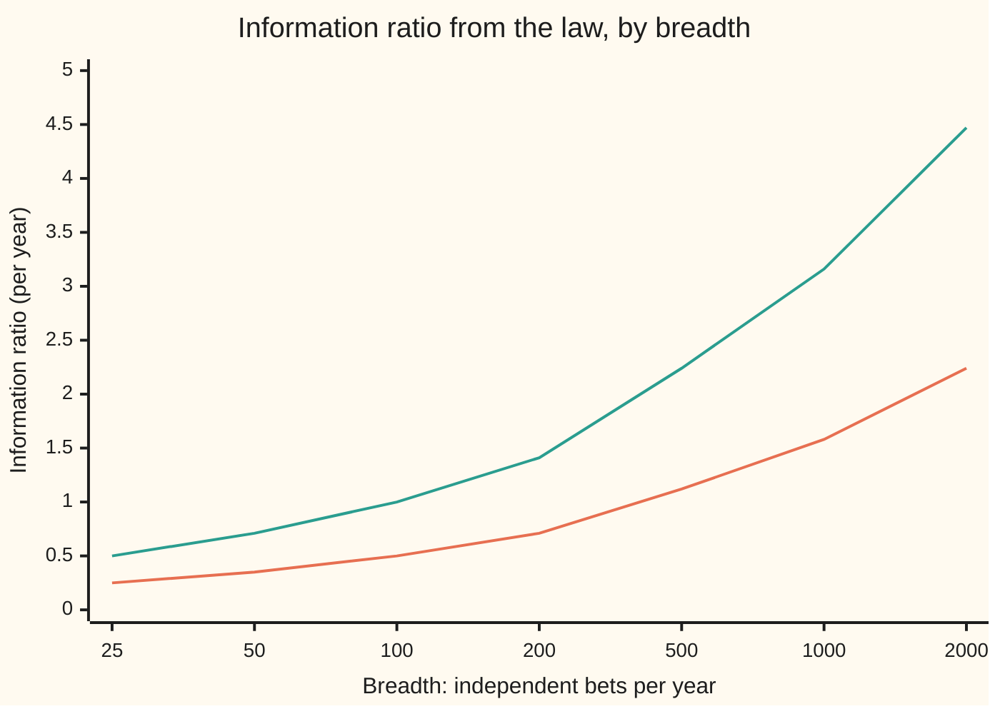
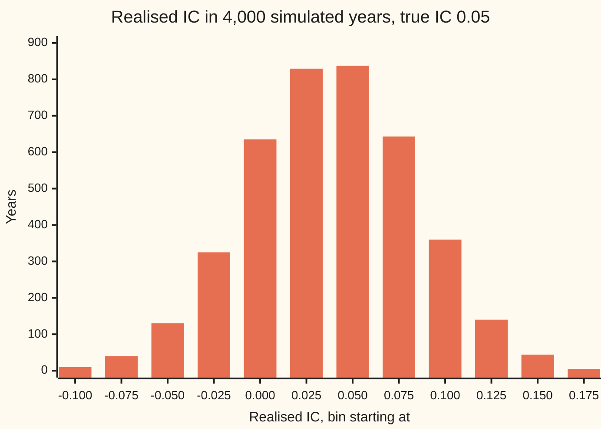

# The fundamental law: skill times breadth, and the information coefficient that measures skill

Financial mathematics → Signals, Mean Reversion and Backtesting → Grading a stock forecast → The fundamental law

---

## General Overview

A fund is measured against an index of 500 stocks. Once a year its analysts give every stock a score: above zero means "will beat the index", below zero means "will trail it". A year later the scores are lined up against what each stock actually did, after stripping out the part explained by the market as a whole. What is left is the stock's **residual return**: its own news, good or bad.

The correlation between the scores and the residual returns is the **information coefficient**, IC. It runs from −1 to +1. A perfect forecaster scores 1. A coin scores 0. Good real forecasters score around 0.05. That sounds like nothing. A 0.05 correlation explains 0.25 percent of the variation in a stock's residual return, and it calls the direction right 51.6 percent of the time.

Yet a fund with that skill, spread over 500 independent bets a year, earns about 1.12 percent of expected extra return for every 1 percent of extra risk. That ratio is the **information ratio**, IR, and 1.1 is a number most managers never reach. The trick is the same one a casino uses. A small edge on one bet is noise. The same edge on many independent bets adds up faster than the noise does.

Richard Grinold wrote this down in 1989. His **fundamental law of active management** says the information ratio is roughly skill times the square root of breadth, where **breadth** is the number of independent bets per year.

**The information ratio a forecaster can reach is about the information coefficient times the square root of the number of independent bets: 0.05 times the square root of 500 is 1.1.**

**What kind of fact this is:** an approximation, with its error stated. Inside a stated model the exact answer is proved on this card in Why it works, and the law drops one small factor from it: 1.1180 against 1.1194 here. Outside the model it is a rule of thumb, and When it holds says where it bends. The information coefficient itself is a definition.

### The picture: skill and breadth trade one for the other



Lower line: IC 0.05. Upper line: IC 0.10. Doubling skill doubles the ratio. Quadrupling breadth does the same: IC 0.05 on 2,000 bets and IC 0.10 on 500 bets both reach 2.24. The curves bend because breadth enters through a square root.

---

## The formula

$$\mathrm{IR} \;\approx\; \mathrm{IC}\times\sqrt{\mathrm{BR}}$$

**Read it aloud:** the information ratio is the information coefficient times the square root of the breadth.

The information coefficient is a correlation, measured on one date across the stocks. Number the stocks i = 1 to 500. Line up stock i's score $z_i$ and its later residual return $\theta_i$. Subtract each list's average. Then

$$\mathrm{IC} \;=\; \frac{\sum_i (z_i-\bar z)(\theta_i-\bar\theta)}{\sqrt{\sum_i (z_i-\bar z)^2}\;\sqrt{\sum_i (\theta_i-\bar\theta)^2}}$$

In words: add up score times return, after centring both, and divide by the size of each list so the answer has no units. The sign $\sum_i$ means "add over every stock". A bar, as in $\bar z$, means the average across stocks. If either list is constant, IC is undefined.

A score is a forecast in its own units. Grinold's rule turns it into a forecast in percent, the stock's expected residual return:

$$\alpha_i \;=\; \mathrm{IC}\times\omega\times z_i$$

Here the scores are rescaled to average 0 and standard deviation 1, and $\omega$ is the **residual volatility**: the standard deviation of $\theta_i$. In words: forecast equals skill times the stock's own wobble times its score. With IC 0.05 and ω of 25 percent a year, a stock scored one standard deviation above average is forecast to beat the index by 1.25 percent.

The information ratio grades a whole portfolio. Its **active return** $A$ is its return minus the index's. Its **active risk** $\sigma_A$ (also called tracking error) is the standard deviation of that difference:

$$\mathrm{IR} \;=\; \frac{\mathrm{E}[A]}{\sigma_A}$$

| Symbol | Plain meaning | In our example | Push it up and the answer… |
| --- | --- | --- | --- |
| $\mathrm{IC}$ | information coefficient: correlation of scores with later residual returns | 0.05 | IR rises in proportion |
| $\mathrm{BR}$ | breadth: independent bets per year | 500 | IR rises with its square root |
| $\mathrm{IR}$ | information ratio: expected active return per unit of active risk, per year | 1.118 | — |
| $z_i$ | stock i's score, rescaled so the scores average 0 with spread 1 | +1 for a stock one spread above average | bigger bet on that stock |
| $\theta_i$ | stock i's residual return over the year: its return with the market's part removed | toy list −2, 0, 1, −1, 2 percent | — |
| $\sum_i$, $\bar z$, $\bar\theta$ | add over every stock; averages across the stocks | both averages 0 in the toy | — |
| $\omega$, $s$, $s_i$ | residual volatility, the standard deviation of $\theta_i$; $s$ is what is left after the forecast, $\omega\sqrt{1-\mathrm{IC}^2}$ | 25% a year | forecasts grow in percent, IR unchanged |
| $\alpha_i$ | the forecast of $\theta_i$ in percent | 1.25% for a score of +1 | — |
| $h_i$ | active weight: the fund's weight in stock i minus the index's | in proportion to $\alpha_i$ | — |
| $A$, $\sigma_A$ | active return, and its standard deviation (active risk) | 4.47% expected at 4% risk | — |
| $\mathrm{TC}$ | transfer coefficient: how faithfully the weights follow the forecasts | 1 unconstrained, 0.80 for a half-and-half sort | IR rises in proportion |
| $\mathrm{E}[\cdot]$, $\mathrm{Var}(\cdot)$ | expected value and variance, as on [joint-distributions-and-covariance](../../09-Probability%20and%20statistics/02-Random%20Variables/04-joint-distributions-and-covariance.md) | — | — |

### When it holds

- **Bets are independent.** The law counts bets whose surprises are unrelated. If the 500 stocks move in 50 lockstep groups of 10, and the scores follow the groups, there are 50 bets, not 500, and IR falls to 0.354.
- **Weights follow the forecasts.** A fund that cannot short, or caps its positions, holds weights that only partly match the forecasts. The law then gains a factor, IR ≈ TC × IC × √BR. Sorting stocks into a top half held long and a bottom half held short has TC 0.80, and IR drops from 1.118 to about 0.89.
- **Skill is steady.** The law treats IC as the same every year and on every stock. Real IC wanders; the wander adds risk the formula leaves out, and it can matter more than breadth.
- **Skill is small.** The exact model answer is the law divided by $\sqrt{1-\mathrm{IC}^2}$. At IC 0.05 that moves 1.1180 to 1.1194. The gap grows with IC, but stays small for any IC a stock forecaster reaches.
- **Before costs, before the fact.** The IR is an expectation about next year, before trading costs. A realised IR from one year of history is a noisy estimate of it.

---

## Why it works

### Step 0: gains add, independent noise adds in squares

Take 500 bets. Each has a small expected gain and a lot of noise. Put the same stake on each. The expected gains add: 500 of them. The noises do not add. Independent risks add their **variances** (squared standard deviations), so the total standard deviation grows only like the square root of 500. Expected gain over standard deviation therefore grows like $500/\sqrt{500} = \sqrt{500}$. That is the whole idea. The rest of this section turns "a small expected gain" into IC and checks that no better way of placing the stakes exists.

### Step 1: turn a score into a forecast

A score says "better" or "worse". A portfolio needs a forecast in percent. The best straight-line forecast of one quantity from another has slope covariance over variance (the regression slope; covariance is on [joint-distributions-and-covariance](../../09-Probability%20and%20statistics/02-Random%20Variables/04-joint-distributions-and-covariance.md)).

A correlation is a covariance divided by both standard deviations. So the covariance of score and residual return is IC × 1 × ω, the score's spread being 1. The score's variance is 1. The slope is IC × ω, and the forecast is

$$\alpha_i = \mathrm{IC}\,\omega\,z_i .$$

The forecast explains a share $\mathrm{IC}^2$ of the return's variance: 0.25 percent here. What it cannot explain has standard deviation $\omega\sqrt{1-\mathrm{IC}^2}$. That leftover is the risk of each bet.

### Step 2: one stock is a tiny portfolio with its own ratio

Hold stock i alone, against the index. Expected active return: $\alpha_i$. Risk: $\omega\sqrt{1-\mathrm{IC}^2}$. Its own information ratio is

$$\frac{\alpha_i}{\omega\sqrt{1-\mathrm{IC}^2}} = \frac{\mathrm{IC}\,z_i}{\sqrt{1-\mathrm{IC}^2}} \approx \mathrm{IC}\,z_i .$$

A stock scored +1 has a ratio of about 0.05. Alone, that is worthless.

### Step 3: the best combination adds the ratios in squares

Now hold all 500 with active weights $h_i$. Write $s = \omega\sqrt{1-\mathrm{IC}^2}$ for each bet's leftover risk. With independent surprises,

$$\mathrm{E}[A] = \sum_i h_i\alpha_i, \qquad \mathrm{Var}(A) = \sum_i h_i^2 s^2 .$$

The best ratio of the first to the square root of the second comes from weights in proportion to the forecasts, $h_i \propto \alpha_i$, and equals

$$\mathrm{IR}^2 = \sum_i \left(\frac{\alpha_i}{s}\right)^2 .$$

The portfolio's squared ratio is the sum of the stocks' squared ratios. Independent bets combine like the sides of a right-angled triangle: the long side is the square root of the sum of squares.

<details>
<summary>Detailed proof: no other weights do better</summary>

The Cauchy–Schwarz inequality says that for any two lists, $\left(\sum_i a_ib_i\right)^2 \le \sum_i a_i^2 \sum_i b_i^2$, with equality exactly when one list is a multiple of the other. Take $a_i = h_i s$ and $b_i = \alpha_i/s$. Then $\sum_i a_ib_i = \sum_i h_i\alpha_i = \mathrm{E}[A]$ and $\sum_i a_i^2 = \mathrm{Var}(A)$. So
$$\mathrm{E}[A]^2 \le \mathrm{Var}(A)\sum_i \left(\frac{\alpha_i}{s}\right)^2 ,$$
and dividing by $\mathrm{Var}(A)$ gives $\mathrm{IR}^2 \le \sum_i (\alpha_i/s)^2$. Equality needs $h_i s$ to be a multiple of $\alpha_i/s$: $h_i = c\,\alpha_i/s^2$ for some positive number c. Any positive c works, because doubling every weight doubles both expected return and risk. The fund picks c to hit its risk budget: at 4 percent active risk, expected active return is 1.118 × 4 percent, 4.47 percent.

Where the stocks have different leftover risks $s_i$, the same proof gives $\mathrm{IR}^2 = \sum_i (\alpha_i/s_i)^2$ and weights $h_i \propto \alpha_i/s_i^2$: bet more where the forecast is big and the stock is calm.

</details>

### Step 4: sum the squares

Put Step 1's forecast into Step 3:

$$\mathrm{IR}^2 = \sum_i \frac{\mathrm{IC}^2\,\omega^2 z_i^2}{\omega^2(1-\mathrm{IC}^2)} = \frac{\mathrm{IC}^2}{1-\mathrm{IC}^2}\sum_i z_i^2 .$$

The scores were rescaled to average 0 with spread 1, so their squares add to the number of stocks. With one independent bet per stock a year, $\sum_i z_i^2 = \mathrm{BR} = 500$. Take the square root:

$$\mathrm{IR} = \frac{\mathrm{IC}\sqrt{\mathrm{BR}}}{\sqrt{1-\mathrm{IC}^2}} \;\approx\; \mathrm{IC}\sqrt{\mathrm{BR}} .$$

The left form is exact inside the model: 1.119434. Grinold's law measures risk with the full wobble ω instead of the leftover $\omega\sqrt{1-\mathrm{IC}^2}$, and gets the right form: 1.118034. They differ by a factor $1/\sqrt{1-\mathrm{IC}^2}$: 0.13 percent at IC 0.05, 0.5 percent at IC 0.10 (2.236 against 2.247).

### Step 5: bell curves are not needed

Nothing above used a bell curve. To see that, rebuild the model from coins. Each stock's score is +1 or −1, half of each. Each stock's surprise is an independent fair coin, +1 or −1. Its standardised residual return is IC × score plus $\sqrt{1-\mathrm{IC}^2}$ × surprise; the correlation of score with return is then exactly IC.

With weights equal to the scores, the active return is IC × 500 plus $\sqrt{1-\mathrm{IC}^2}$ times a sum of 500 fair coins. That sum takes 501 possible values, with binomial chances. The check adds up all 501, exactly, and lands on 1.119434, the exact model value. It also counts the chance that the active return comes out negative: 13.2 percent. A fund with this skill loses to its index in about 13 years out of 100.

Grinold's own route, and its extensions to many factors and to skill that changes over time, are in the sources. What the law hides when IC itself is estimated from a backtest is the job of [backtesting-pitfalls](05-backtesting-pitfalls.md) and [deflated-sharpe-and-multiple-testing](06-deflated-sharpe-and-multiple-testing.md).

---

## Worked numbers, by hand

First the information coefficient, on a toy of five stocks small enough to do by hand. Scores −2, −1, 0, 1, 2. Residual returns a year later −2, 0, 1, −1, 2 percent. Both lists already average zero.

| Step | Arithmetic | Value |
| --- | --- | --- |
| score times return, added | 4 + 0 + 0 − 1 + 4 | 7 |
| squared scores, added | 4 + 1 + 0 + 1 + 4 | 10 |
| squared returns, added | 4 + 0 + 1 + 1 + 4 | 10 |
| toy IC | 7 / √(10 × 10) | **0.70** |
| rank IC: the same with each list replaced by its ranks | ranks 1 to 5 against 1, 3, 4, 2, 5 | 0.70 |

Five stocks with an IC of 0.70 is a toy; one year of five stocks proves nothing. Now the fund.

| Step | Arithmetic | Value |
| --- | --- | --- |
| the law | 0.05 × √500 | 1.118 |
| exact model | 1.118 / √(1 − 0.0025) | 1.1194 |
| forecast for a score of +1 | 0.05 × 25% × 1 | 1.25% |
| share of return explained | 0.05 × 0.05 | 0.25% |
| expected active return at 4% active risk | 1.118 × 4% | **4.47%** |

A fund that runs 4 percent of active risk with this skill should expect to beat its index by about 4.47 percent a year, before costs, and to trail it in about 13 years out of 100.

### One year of IC 0.05 looks like noise

The simulation in the checks runs the fund for 4,000 years. Each year it draws 500 bell-curve scores and 500 bell-curve surprises, builds each stock's return from the model, and measures that year's IC.



Each bar counts the years whose realised IC fell in a band 0.025 wide, starting at the value shown. The average realised IC was 0.0508, close to the true 0.05. The spread from year to year was 0.045, matching $1/\sqrt{500}$ = 0.0447: a correlation measured on 500 pairs wobbles by about one over the square root of 500. The years left of zero are the years the fund lost to its index (one fell off the chart's left edge): 12.65 percent of years in the simulation, against 13.2 percent counted exactly in the coin model and 13.1 percent from the bell curve. A year's IC and a year's active return always share their sign, because both are driven by the same sum of score times return.

The spread of one year's IC is almost as large as the IC itself. No single year can say whether a forecaster has skill 0.05 or none.

### What breaks if you drop a piece

| Mistake | Comes out at | What went wrong |
| --- | --- | --- |
| Counting 500 stocks as 500 bets when they move in 50 lockstep groups of 10 | claims 1.118; the truth is 0.354 | breadth counts independent bets, and there are 50 |
| Dropping the square root: IC × 500 | 25.0 | noise grows with the bets too; only the ratio's square root survives |
| Monthly forecasts, IR 1.118 a month, annualised by × 12 | 13.42; right is 3.87 | risk grows with the square root of time, so a monthly IR scales by √12 |
| Sorting into a long half and a short half, instead of weighting by score | 0.89 by the law with TC 0.80; 0.91 simulated | the weights ignore how strong each forecast is |

The monthly row is the same as breadth 12 × 500 = 6,000 bets a year: 0.05 × √6000 = 3.87. It assumes each month's 500 forecasts are fresh and independent of last month's. Real monthly signals overlap, which is why no fund reports 3.87.

---

## Code, from first principles, and it actually runs

The checks reach the information ratio by three independent roads. Road one is the formula. Road two counts every one of the 501 outcomes of the coin model exactly. Road three simulates 4,000 years of a 500-stock fund with bell-curve scores and surprises, drawn from a random number generator written in the script (splitmix64, turned into bell-curve draws by the Box–Muller method). The bell-curve area is built by Simpson's rule. The checks also measure the toy IC, the hit rate, the sort portfolio's ratio, and every what-breaks number. Both programs use the same seed and the same generator, so they print the same simulated values.

### Python

```python
# Information coefficient and the fundamental law -- the check behind the card.
# Standard library only. Every number quoted on the card is printed here.
# Own random numbers (splitmix64 + Box-Muller), own normal CDF (Simpson), own sums.
from math import sqrt, log, cos, sin, pi, exp, asin, floor
from fractions import Fraction

M64 = (1 << 64) - 1
state = 20260928
def uniform():                                    # splitmix64, then 53 bits into (0, 1)
    global state
    state = (state + 0x9E3779B97F4A7C15) & M64
    z = state
    z = ((z ^ (z >> 30)) * 0xBF58476D1CE4E5B9) & M64
    z = ((z ^ (z >> 27)) * 0x94D049BB133111EB) & M64
    z ^= z >> 31
    return ((z >> 11) + 0.5) / 9007199254740992.0
def normal_pair():                                # Box-Muller: two bell-curve draws
    r, a = sqrt(-2.0 * log(uniform())), 2.0 * pi * uniform()
    return r * cos(a), r * sin(a)
def normals(n):
    out = []
    while len(out) < n:
        out.extend(normal_pair())
    return out[:n]
def N(x):                                         # bell-curve area left of x, Simpson on [0, |x|]
    n, h = 2000, abs(x) / 2000
    f = lambda t: exp(-0.5 * t * t) / sqrt(2.0 * pi)
    s = f(0.0) + f(abs(x)) + sum((4 if i % 2 else 2) * f(i * h) for i in range(1, n))
    area = s * h / 3.0
    return 0.5 + area if x >= 0 else 0.5 - area
def pearson(x, y):
    n = len(x); mx, my = sum(x) / n, sum(y) / n
    sxy = sum((a - mx) * (b - my) for a, b in zip(x, y))
    sxx = sum((a - mx) ** 2 for a in x); syy = sum((b - my) ** 2 for b in y)
    return sxy / sqrt(sxx * syy)
def ranks(v):
    order = sorted(range(len(v)), key=lambda i: v[i])
    r = [0.0] * len(v)
    for k, i in enumerate(order): r[i] = k + 1.0
    return r

# ---- 1. the toy: five stocks, scores and next-year residual returns (percent) ----
score, ret = [-2, -1, 0, 1, 2], [-2, 0, 1, -1, 2]
ic_toy, ric_toy = pearson(score, ret), pearson(ranks(score), ranks(ret))
by_hand = Fraction(sum(a * b for a, b in zip(score, ret)), 10)   # 7 / sqrt(10 x 10), in integers

# ---- 2. the law, and its exact form inside the model ----
IC, B, omega = 0.05, 500, 0.25
law = IC * sqrt(B)
exact = law / sqrt(1 - IC * IC)

# ---- 3. coin-flip model, every outcome counted: A = IC*B + sqrt(1-IC^2)*(2k - B), k ~ Binomial(B, 1/2) ----
lp, mean_a, sq_a, lose = B * log(0.5), 0.0, 0.0, 0.0   # log of each chance: no underflow at B = 2000
for k in range(B + 1):
    a = IC * B + sqrt(1 - IC * IC) * (2 * k - B)
    p = exp(lp); mean_a += p * a; sq_a += p * a * a
    if a < 0: lose += p
    lp += log(max(B - k, 1) / (k + 1))
ir_coin = mean_a / sqrt(sq_a - mean_a * mean_a)

# ---- 4. simulation: 4000 years, 500 stocks, bell-curve scores and shocks ----
YEARS = 4000
act, act_sort, ics, hits = [], [], [], 0
bins = [0] * 12                                   # realised IC from -0.10 to 0.20 in steps of 0.025
for _ in range(YEARS):
    z = normals(B)
    mz = sum(z) / B; sz = sqrt(sum((v - mz) ** 2 for v in z) / B)
    z = [(v - mz) / sz for v in z]                # standardise: mean 0, spread 1 across stocks
    eps = normals(B)
    th = [omega * (IC * zi + sqrt(1 - IC * IC) * e) for zi, e in zip(z, eps)]
    act.append(sum(zi * t for zi, t in zip(z, th)))                          # weights in proportion to score
    act_sort.append(sum((1.0 if zi > 0 else -1.0) * t for zi, t in zip(z, th)))  # long top half, short bottom half
    ic_y = pearson(z, th); ics.append(ic_y)
    hits += sum(1 for zi, t in zip(z, th) if (zi > 0) == (t > 0))
    j = floor((ic_y + 0.10) / 0.025)
    if 0 <= j < 12: bins[j] += 1
def ir_of(xs):
    m = sum(xs) / len(xs)
    return m / sqrt(sum((x - m) ** 2 for x in xs) / (len(xs) - 1))
ir_sim, ir_sort_sim = ir_of(act), ir_of(act_sort)
ic_mean = sum(ics) / YEARS
ic_sd = sqrt(sum((c - ic_mean) ** 2 for c in ics) / (YEARS - 1))
lose_sim = sum(1 for a in act if a < 0) / YEARS
hit_sim = hits / (YEARS * B)
tc_sort = sqrt(2 / pi)                            # correlation of sign(z) with z for a bell curve

rows = [
    ("toy: sum of score x return", sum(a * b for a, b in zip(score, ret))),
    ("toy: sum of squared scores", sum(a * a for a in score)),
    ("toy: sum of squared returns", sum(b * b for b in ret)),
    ("toy: Pearson IC, five stocks", ic_toy), ("toy: rank IC, five stocks", ric_toy),
    ("law: IC x sqrt(500)", law), ("exact model: law / sqrt(1 - IC^2)", exact),
    ("coin-flip model, all 501 outcomes", ir_coin), ("simulation, 4000 years: IR", ir_sim),
    ("simulation: mean realised IC", ic_mean), ("simulation: spread of realised IC", ic_sd),
    ("theory: spread 1/sqrt(500)", 1 / sqrt(B)),
    ("coin-flip: chance of a losing year", lose), ("bell curve: N(-exact IR)", N(-exact)),
    ("simulation: share of losing years", lose_sim),
    ("hit rate: 1/2 + asin(IC)/pi", 0.5 + asin(IC) / pi), ("simulation: hit rate", hit_sim),
    ("R-squared: IC^2", IC * IC), ("residual volatility omega", omega), ("forecast alpha, score +1", IC * omega * 1.0),
    ("expected active return at 4% risk", law * 0.04),
    ("sort portfolio: TC sqrt(2/pi)", tc_sort), ("sort portfolio: TC x law", tc_sort * law),
    ("sort portfolio: simulation", ir_sort_sim),
    ("wrong: 50 lockstep groups, IC sqrt(50)", IC * sqrt(50)), ("wrong: no square root, IC x 500", IC * B),
    ("monthly bets: IC sqrt(12 x 500)", IC * sqrt(12 * B)), ("wrong: monthly IR x 12", law * 12),
    ("right: monthly IR x sqrt(12)", law * sqrt(12)),
    ("timing, breadth 1: IC for the same IR", law / sqrt(1 + law * law)),
]
for name, v in rows:
    print(f"{name:<40} {v:>11.6f}")
print("chart, breadth      " + " ".join(f"{b:>6d}" for b in (25, 50, 100, 200, 500, 1000, 2000)))
for ic in (0.05, 0.10):
    print(f"chart, IC {ic:.2f}     " + " ".join(f"{ic * sqrt(b):6.2f}" for b in (25, 50, 100, 200, 500, 1000, 2000)))
print("histogram, IC from  " + " ".join(f"{-0.10 + 0.025 * j:6.3f}" for j in range(12)))
print("histogram, years    " + " ".join(f"{c:6d}" for c in bins))

assert abs(ic_toy - float(by_hand)) < 1e-12,  "toy IC vs the integer count by hand, 7/10"
assert abs(ir_coin - exact) < 1e-9,          "every-outcome count must land on the exact model"
assert abs(ir_sim - exact) < 4 * sqrt((1 + exact ** 2 / 2) / YEARS), "simulated IR within 4 standard errors"
assert abs(ic_mean - IC) < 4 * (1 / sqrt(B)) / sqrt(YEARS), "mean realised IC within 4 standard errors"
assert abs(lose - N(-exact)) < 0.01,         "binomial losing-year chance vs bell curve"
assert abs(hit_sim - (0.5 + asin(IC) / pi)) < 0.002, "simulated hit rate vs Sheppard's formula"
assert abs(ir_sort_sim - tc_sort * exact) < 0.08, "sort portfolio IR shrinks by the transfer coefficient"
assert ir_sort_sim < ir_sim,                  "score-weighted beats sign-weighted"
print("ALL CHECKS PASS")
```

**Ran 2026-09-28 on macOS, Python 3.14.6, standard library only. All checks passed. Output, pasted from the run:**

```
toy: sum of score x return                  7.000000
toy: sum of squared scores                 10.000000
toy: sum of squared returns                10.000000
toy: Pearson IC, five stocks                0.700000
toy: rank IC, five stocks                   0.700000
law: IC x sqrt(500)                         1.118034
exact model: law / sqrt(1 - IC^2)           1.119434
coin-flip model, all 501 outcomes           1.119434
simulation, 4000 years: IR                  1.128848
simulation: mean realised IC                0.050780
simulation: spread of realised IC           0.044960
theory: spread 1/sqrt(500)                  0.044721
coin-flip: chance of a losing year          0.131766
bell curve: N(-exact IR)                    0.131477
simulation: share of losing years           0.126500
hit rate: 1/2 + asin(IC)/pi                 0.515922
simulation: hit rate                        0.516503
R-squared: IC^2                             0.002500
residual volatility omega                   0.250000
forecast alpha, score +1                    0.012500
expected active return at 4% risk           0.044721
sort portfolio: TC sqrt(2/pi)               0.797885
sort portfolio: TC x law                    0.892062
sort portfolio: simulation                  0.914179
wrong: 50 lockstep groups, IC sqrt(50)      0.353553
wrong: no square root, IC x 500            25.000000
monthly bets: IC sqrt(12 x 500)             3.872983
wrong: monthly IR x 12                     13.416408
right: monthly IR x sqrt(12)                3.872983
timing, breadth 1: IC for the same IR       0.745356
chart, breadth          25     50    100    200    500   1000   2000
chart, IC 0.05       0.25   0.35   0.50   0.71   1.12   1.58   2.24
chart, IC 0.10       0.50   0.71   1.00   1.41   2.24   3.16   4.47
histogram, IC from  -0.100 -0.075 -0.050 -0.025  0.000  0.025  0.050  0.075  0.100  0.125  0.150  0.175
histogram, years        10     40    130    325    635    829    837    643    360    140     44      5
ALL CHECKS PASS
```

The exact model and the coin count agree to six decimals, 1.119434. The simulation lands at 1.129, well inside its own sampling noise; the assert allows four standard errors. The hit rate agrees with the bell-curve formula $1/2 + \arcsin(\mathrm{IC})/\pi$, Sheppard's formula, to within a thousandth.

### Rust

```rust
// Information coefficient and the fundamental law -- the same check in Rust.
// Standard library only, no crates. Own random numbers (splitmix64 + Box-Muller),
// own normal CDF (Simpson), own sums. Prints the same rows as the Python check.
use std::f64::consts::PI;

struct Rng { state: u64 }
impl Rng {
    fn uniform(&mut self) -> f64 {                  // splitmix64, then 53 bits into (0, 1)
        self.state = self.state.wrapping_add(0x9E3779B97F4A7C15);
        let mut z = self.state;
        z = (z ^ (z >> 30)).wrapping_mul(0xBF58476D1CE4E5B9);
        z = (z ^ (z >> 27)).wrapping_mul(0x94D049BB133111EB);
        z ^= z >> 31;
        ((z >> 11) as f64 + 0.5) / 9007199254740992.0
    }
    fn normals(&mut self, n: usize) -> Vec<f64> {   // Box-Muller, two draws per pair
        let mut out = Vec::with_capacity(n + 1);
        while out.len() < n {
            let r = (-2.0 * self.uniform().ln()).sqrt();
            let a = 2.0 * PI * self.uniform();
            out.push(r * a.cos());
            out.push(r * a.sin());
        }
        out.truncate(n);
        out
    }
}

fn big_n(x: f64) -> f64 {                           // bell-curve area left of x, Simpson on [0, |x|]
    let n = 2000;
    let h = x.abs() / n as f64;
    let f = |t: f64| (-0.5 * t * t).exp() / (2.0 * PI).sqrt();
    let mut s = f(0.0) + f(x.abs());
    for i in 1..n { s += (if i % 2 == 1 { 4.0 } else { 2.0 }) * f(i as f64 * h); }
    let area = s * h / 3.0;
    if x >= 0.0 { 0.5 + area } else { 0.5 - area }
}

fn pearson(x: &[f64], y: &[f64]) -> f64 {
    let n = x.len() as f64;
    let mx = x.iter().sum::<f64>() / n;
    let my = y.iter().sum::<f64>() / n;
    let (mut sxy, mut sxx, mut syy) = (0.0, 0.0, 0.0);
    for (a, b) in x.iter().zip(y) {
        sxy += (a - mx) * (b - my);
        sxx += (a - mx) * (a - mx);
        syy += (b - my) * (b - my);
    }
    sxy / (sxx * syy).sqrt()
}

fn ranks(v: &[f64]) -> Vec<f64> {
    let mut order: Vec<usize> = (0..v.len()).collect();
    order.sort_by(|&i, &j| v[i].partial_cmp(&v[j]).unwrap());
    let mut r = vec![0.0; v.len()];
    for (k, &i) in order.iter().enumerate() { r[i] = k as f64 + 1.0; }
    r
}

fn ir_of(xs: &[f64]) -> f64 {
    let n = xs.len() as f64;
    let m = xs.iter().sum::<f64>() / n;
    let v = xs.iter().map(|x| (x - m) * (x - m)).sum::<f64>() / (n - 1.0);
    m / v.sqrt()
}

fn main() {
    // ---- 1. the toy: five stocks, scores and next-year residual returns (percent) ----
    let score = [-2.0, -1.0, 0.0, 1.0, 2.0];
    let ret = [-2.0, 0.0, 1.0, -1.0, 2.0];
    let ic_toy = pearson(&score, &ret);
    let ric_toy = pearson(&ranks(&score), &ranks(&ret));
    let by_hand = [-2i64, -1, 0, 1, 2].iter().zip([-2i64, 0, 1, -1, 2]).map(|(a, b)| a * b).sum::<i64>() as f64 / 10.0;

    // ---- 2. the law, and its exact form inside the model ----
    let (ic, b, omega) = (0.05_f64, 500usize, 0.25_f64);
    let law = ic * (b as f64).sqrt();
    let exact = law / (1.0 - ic * ic).sqrt();

    // ---- 3. coin-flip model, every outcome counted ----
    let (mut lp, mut mean_a, mut sq_a, mut lose) = (b as f64 * 0.5_f64.ln(), 0.0, 0.0, 0.0); // log chances
    for k in 0..=b {
        let a = ic * b as f64 + (1.0 - ic * ic).sqrt() * (2.0 * k as f64 - b as f64);
        let p = lp.exp();
        mean_a += p * a;
        sq_a += p * a * a;
        if a < 0.0 { lose += p; }
        lp += ((b - k).max(1) as f64 / (k + 1) as f64).ln();
    }
    let ir_coin = mean_a / (sq_a - mean_a * mean_a).sqrt();

    // ---- 4. simulation: 4000 years, 500 stocks, bell-curve scores and shocks ----
    let years = 4000usize;
    let mut rng = Rng { state: 20260928 };
    let (mut act, mut act_sort, mut ics) = (Vec::new(), Vec::new(), Vec::new());
    let (mut hits, mut bins) = (0usize, [0usize; 12]);
    for _ in 0..years {
        let mut z = rng.normals(b);
        let mz = z.iter().sum::<f64>() / b as f64;
        let sz = (z.iter().map(|v| (v - mz) * (v - mz)).sum::<f64>() / b as f64).sqrt();
        for v in z.iter_mut() { *v = (*v - mz) / sz; }
        let eps = rng.normals(b);
        let th: Vec<f64> = z.iter().zip(&eps).map(|(zi, e)| omega * (ic * zi + (1.0 - ic * ic).sqrt() * e)).collect();
        act.push(z.iter().zip(&th).map(|(zi, t)| zi * t).sum::<f64>());
        act_sort.push(z.iter().zip(&th).map(|(zi, t)| if *zi > 0.0 { *t } else { -*t }).sum::<f64>());
        let ic_y = pearson(&z, &th);
        ics.push(ic_y);
        hits += z.iter().zip(&th).filter(|(zi, t)| (**zi > 0.0) == (**t > 0.0)).count();
        let j = ((ic_y + 0.10) / 0.025).floor();
        if j >= 0.0 && j < 12.0 { bins[j as usize] += 1; }
    }
    let (ir_sim, ir_sort_sim) = (ir_of(&act), ir_of(&act_sort));
    let ic_mean = ics.iter().sum::<f64>() / years as f64;
    let ic_sd = (ics.iter().map(|c| (c - ic_mean) * (c - ic_mean)).sum::<f64>() / (years - 1) as f64).sqrt();
    let lose_sim = act.iter().filter(|a| **a < 0.0).count() as f64 / years as f64;
    let hit_sim = hits as f64 / (years * b) as f64;
    let tc_sort = (2.0 / PI).sqrt();
    let bf = b as f64;

    let rows: Vec<(&str, f64)> = vec![
        ("toy: sum of score x return", score.iter().zip(&ret).map(|(a, r)| a * r).sum::<f64>()),
        ("toy: sum of squared scores", score.iter().map(|a| a * a).sum::<f64>()),
        ("toy: sum of squared returns", ret.iter().map(|r| r * r).sum::<f64>()),
        ("toy: Pearson IC, five stocks", ic_toy), ("toy: rank IC, five stocks", ric_toy),
        ("law: IC x sqrt(500)", law), ("exact model: law / sqrt(1 - IC^2)", exact),
        ("coin-flip model, all 501 outcomes", ir_coin), ("simulation, 4000 years: IR", ir_sim),
        ("simulation: mean realised IC", ic_mean), ("simulation: spread of realised IC", ic_sd),
        ("theory: spread 1/sqrt(500)", 1.0 / bf.sqrt()),
        ("coin-flip: chance of a losing year", lose), ("bell curve: N(-exact IR)", big_n(-exact)),
        ("simulation: share of losing years", lose_sim),
        ("hit rate: 1/2 + asin(IC)/pi", 0.5 + ic.asin() / PI), ("simulation: hit rate", hit_sim),
        ("R-squared: IC^2", ic * ic), ("residual volatility omega", omega), ("forecast alpha, score +1", ic * omega * 1.0),
        ("expected active return at 4% risk", law * 0.04),
        ("sort portfolio: TC sqrt(2/pi)", tc_sort), ("sort portfolio: TC x law", tc_sort * law),
        ("sort portfolio: simulation", ir_sort_sim),
        ("wrong: 50 lockstep groups, IC sqrt(50)", ic * 50f64.sqrt()), ("wrong: no square root, IC x 500", ic * bf),
        ("monthly bets: IC sqrt(12 x 500)", ic * (12.0 * bf).sqrt()), ("wrong: monthly IR x 12", law * 12.0),
        ("right: monthly IR x sqrt(12)", law * 12f64.sqrt()),
        ("timing, breadth 1: IC for the same IR", law / (1.0 + law * law).sqrt()),
    ];
    for (name, v) in &rows { println!("{:<40} {:>11.6}", name, v); }
    let breadths = [25usize, 50, 100, 200, 500, 1000, 2000];
    println!("chart, breadth      {}", breadths.iter().map(|x| format!("{:>6}", x)).collect::<Vec<_>>().join(" "));
    for icc in [0.05_f64, 0.10] {
        println!("chart, IC {:.2}     {}", icc, breadths.iter().map(|x| format!("{:6.2}", icc * (*x as f64).sqrt())).collect::<Vec<_>>().join(" "));
    }
    println!("histogram, IC from  {}", (0..12).map(|j| format!("{:6.3}", -0.10 + 0.025 * j as f64)).collect::<Vec<_>>().join(" "));
    println!("histogram, years    {}", bins.iter().map(|c| format!("{:6}", c)).collect::<Vec<_>>().join(" "));

    assert!((ic_toy - by_hand).abs() < 1e-12, "toy IC vs the integer count by hand, 7/10");
    assert!((ir_coin - exact).abs() < 1e-9, "every-outcome count must land on the exact model");
    assert!((ir_sim - exact).abs() < 4.0 * ((1.0 + exact * exact / 2.0) / years as f64).sqrt(), "simulated IR within 4 standard errors");
    assert!((ic_mean - ic).abs() < 4.0 * (1.0 / bf.sqrt()) / (years as f64).sqrt(), "mean realised IC within 4 standard errors");
    assert!((lose - big_n(-exact)).abs() < 0.01, "binomial losing-year chance vs bell curve");
    assert!((hit_sim - (0.5 + ic.asin() / PI)).abs() < 0.002, "simulated hit rate vs Sheppard's formula");
    assert!((ir_sort_sim - tc_sort * exact).abs() < 0.08, "sort portfolio IR shrinks by the transfer coefficient");
    assert!(ir_sort_sim < ir_sim, "score-weighted beats sign-weighted");
    println!("ALL CHECKS PASS");
}
```

**Ran 2026-09-28 on macOS, rustc 1.98.1, no crates. All checks passed. Output, pasted from the run:**

```
toy: sum of score x return                  7.000000
toy: sum of squared scores                 10.000000
toy: sum of squared returns                10.000000
toy: Pearson IC, five stocks                0.700000
toy: rank IC, five stocks                   0.700000
law: IC x sqrt(500)                         1.118034
exact model: law / sqrt(1 - IC^2)           1.119434
coin-flip model, all 501 outcomes           1.119434
simulation, 4000 years: IR                  1.128848
simulation: mean realised IC                0.050780
simulation: spread of realised IC           0.044960
theory: spread 1/sqrt(500)                  0.044721
coin-flip: chance of a losing year          0.131766
bell curve: N(-exact IR)                    0.131477
simulation: share of losing years           0.126500
hit rate: 1/2 + asin(IC)/pi                 0.515922
simulation: hit rate                        0.516503
R-squared: IC^2                             0.002500
residual volatility omega                   0.250000
forecast alpha, score +1                    0.012500
expected active return at 4% risk           0.044721
sort portfolio: TC sqrt(2/pi)               0.797885
sort portfolio: TC x law                    0.892062
sort portfolio: simulation                  0.914179
wrong: 50 lockstep groups, IC sqrt(50)      0.353553
wrong: no square root, IC x 500            25.000000
monthly bets: IC sqrt(12 x 500)             3.872983
wrong: monthly IR x 12                     13.416408
right: monthly IR x sqrt(12)                3.872983
timing, breadth 1: IC for the same IR       0.745356
chart, breadth          25     50    100    200    500   1000   2000
chart, IC 0.05       0.25   0.35   0.50   0.71   1.12   1.58   2.24
chart, IC 0.10       0.50   0.71   1.00   1.41   2.24   3.16   4.47
histogram, IC from  -0.100 -0.075 -0.050 -0.025  0.000  0.025  0.050  0.075  0.100  0.125  0.150  0.175
histogram, years        10     40    130    325    635    829    837    643    360    140     44      5
ALL CHECKS PASS
```

The two outputs agree line for line, the simulated rows included, since both programs draw the same random numbers.

> [!TIP]
> **Try changing**
> - **Double the skill.** Guess first: what does IC 0.10 on 500 bets give? Set `IC = 0.10`. The law gives 2.24, the upper line's value at 500 on the chart.
> - **Quadruple the breadth instead.** Keep IC 0.05 and set `B = 2000`. The law again gives 2.24. Four times the bets buys what twice the skill buys.
> - **Remove the skill.** Set `IC = 0.0`. Guess first: how often does the fund lose? The law, the exact model and the coin count all give zero, and the simulated IR lands near zero. The run then stops at the losing-year assert: with no skill a tie at exactly zero counts as not losing, so the coin model's chance sits just under a coin toss and no longer matches the bell curve. That assert is written for a fund with some skill.
> - **Shorten the history.** Set `YEARS = 40`. The simulated IR now reads 1.21, missing the exact value by nearly a tenth. Forty years of a real fund is a long record, and it still cannot pin IR to one decimal.

---

## The usual mistake

> [!warning]
> **Counting stocks instead of bets.** Breadth is the number of independent bets, not the number of names in the portfolio. A signal that is really one call on oil prices, spread over every oil stock in the index, is one bet made many times. Stocks in the same industry share news; forecasts refreshed monthly but built from a 12-month window overlap. Counting 500 lockstep-in-tens stocks as 500 bets turns a true ratio of 0.354 into a claimed 1.118.
>
> - **Dismissing IC 0.05 as no skill.** It calls direction right 51.6 percent of the time and explains 0.25 percent of the variance. Over 500 independent bets that is an IR of 1.1, which is excellent.
> - **Grading a forecaster on one year's IC.** One year's IC on 500 stocks has a spread of 0.045. A realised IC of 0 sits well inside one year's wobble around a true 0.05.
> - **Annualising a monthly IR by 12.** It scales by √12, if the monthly bets are independent: 3.87, not 13.42.
> - **Confusing the information ratio with the Sharpe ratio.** The Sharpe ratio measures return above cash per unit of total risk. The information ratio measures return above the index per unit of active risk. A fund that holds the index has a high Sharpe ratio in a rising market and no active return at all.

---

## Where you meet it in real life

- **Quantitative equity funds.** Research teams report a candidate signal's IC month by month, and its average and spread, before anyone asks about returns. The IC of a momentum score is the first number reported on [momentum-and-factor-signals](03-momentum-and-factor-signals.md).
- **Hiring and firing managers.** Consultants and funds of funds rank managers by realised information ratio. The law explains why a stock picker with a few concentrated positions needs far more skill than a quant with 500 small ones to reach the same IR.
- **Statistical arbitrage.** Pairs desks run hundreds of small, roughly independent trades, each with a thin edge, and rely on breadth to smooth the result: [pairs-trading-and-cointegration](02-pairs-trading-and-cointegration.md).
- **Long-only mandates.** A fund barred from shorting cannot underweight a stock by more than its index weight, so most negative forecasts go unused. The transfer coefficient measures the loss; for many long-only funds it sits well below 1.
- **Market timing.** One call a year on whether the whole market rises has breadth 1. To match IR 1.118 the law asks for IC 1.118, more than any correlation can be. The exact form asks for IC 0.75: a direction call right about three times in four. That arithmetic is the argument for picking many stocks over timing one market.

> **Say it back**
> The information coefficient is the correlation between a forecaster's scores and what the stocks then did, after removing the market. Each independent bet contributes a small expected gain, and the gains add while the independent noise adds only in squares. So the best achievable information ratio is about the IC times the square root of the number of independent bets. IC 0.05 on 500 bets gives 1.1. Breadth means independent bets, not stock count, and constraints, costs and a wandering IC all pull the real number below the law's.

---

## What this builds on

- [momentum-and-factor-signals](03-momentum-and-factor-signals.md): what a cross-sectional score is and how a signal ranks stocks; this card grades such a score.
- [joint-distributions-and-covariance](../../09-Probability%20and%20statistics/02-Random%20Variables/04-joint-distributions-and-covariance.md): covariance, correlation, and why independent variances add, which is Step 0 and Step 3.

## Where this goes next

- [backtesting-pitfalls](05-backtesting-pitfalls.md): how an IC measured on history gets inflated by look-ahead, survivorship and costs, before the law is ever applied.

The law turns an IC into a ratio, but it takes the IC as given; what remains open is whether an IC measured on past data is real, which is the question backtesting has to answer.

---

## Sources

Verified 2026-09-28: every link below resolves to the publisher's page or the author's paper; each DOI's registered record names the work cited.

- Grinold, Richard C. "The Fundamental Law of Active Management." *Journal of Portfolio Management* 15, no. 3 (1989): 30–37. [doi:10.3905/jpm.1989.409211](https://doi.org/10.3905/jpm.1989.409211). The law itself, IR ≈ IC × √BR.
- Grinold, Richard C. "Alpha is Volatility Times IC Times Score." *Journal of Portfolio Management* 20, no. 4 (1994): 9–16. [doi:10.3905/jpm.1994.409482](https://doi.org/10.3905/jpm.1994.409482). The forecast rule alpha = IC × volatility × score.
- Clarke, Roger, Harindra de Silva, and Steven Thorley. "Portfolio Constraints and the Fundamental Law of Active Management." *Financial Analysts Journal* 58, no. 5 (2002): 48–66. [doi:10.2469/faj.v58.n5.2468](https://doi.org/10.2469/faj.v58.n5.2468). The transfer coefficient, and how constraints such as no shorting shrink it.
- Ding, Zhuanxin. "The Fundamental Law of Active Management: Time Series Dynamics and Cross-Sectional Properties." Working paper, revised February 2010. [PDF](https://math.nyu.edu/inmemoriam/avellaneda/FundamentalLawFT.pdf). A generalised law in which IC varies over time, and why that variation can outweigh breadth.
- Box, G. E. P., and Mervin E. Muller. "A Note on the Generation of Random Normal Deviates." *Annals of Mathematical Statistics* 29, no. 2 (1958): 610–611. [doi:10.1214/aoms/1177706645](https://doi.org/10.1214/aoms/1177706645). The method the checks use to turn uniform random numbers into bell-curve draws.
