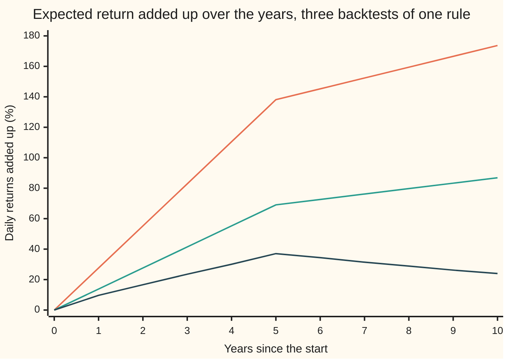

# Backtesting: look-ahead, survivorship, costs and regime change, and how each flatters a strategy

[Syllabus](../../../SYLLABUS.md) → [Financial mathematics](../README.md) → [Signals, Mean Reversion and Backtesting](../README.md#s50) → Backtesting

---

## General Overview

A rule for trading 50 small companies: every evening, look at each stock's last 20 trading days. If it rose, sell it short (borrow shares and sell them, to buy back later). If it fell, buy it. Every bet is the same size, 1/50 of the book. The rule bets that recent moves partly undo themselves: **short-term reversal**.

Ten years of daily prices go through a **backtest**: a replay of the rule on past data, as if it had been traded. The replay reports a **Sharpe ratio** of 2.1. The Sharpe ratio is the average return divided by how much the return wobbles, scaled to a year. Sustained for a decade, 2.1 would look like a discovery.

Run the same replay honestly and it reports 0.6. The rule did not change. Two things did: the companies that went bust are put back into the data, and every trade pays 5 **basis points** (a basis point, bp, is 0.01 percent). A common coding slip, filling trades at a price never on offer, would have pushed the number to 4.1. And splitting the ten years in two shows 1.6 in the first half, −0.7 in the second.

The prices come from a stated model market, not a real exchange, so the truth is known and each pitfall can be measured. Every number is reached two ways: from the model's formulas, and by simulating 400 years of trading.

**A backtest estimates an average return; each pitfall adds to that average a slice the live strategy can never collect, and because the Sharpe ratio divides the average by a wobble the pitfalls barely touch, a phantom basis point a day becomes most of a Sharpe point a year.**

**What kind of fact this is:** a method: a backtest is a procedure, the Sharpe ratio it reports is a definition, and the size of each pitfall on this card comes from a stated model market, computed from its formulas in Why it works and confirmed by simulation.

### The picture: one rule, five backtests

```
Sharpe ratio over the ten years, one block = 0.1
look-ahead fills           █████████████████████████████████████████  4.12
survivors, no costs        █████████████████████                      2.08
survivors, with costs      █████████████                              1.35
all firms, no costs        █████████████                              1.30
honest: all firms, costs   ██████                                     0.57
```

Read it from the bottom. The honest backtest keeps the failed firms and charges costs: 0.57. Drop either fix and it more than doubles. Drop both: 2.08, the careless number. Fill at the close the signal was computed from as well: 4.12.

---

## The formula

The Sharpe ratio, for a strategy measured day by day:

$$\mathrm{SR} = \sqrt{252}\;\frac{\bar R}{s}$$

**Read it aloud:** the Sharpe ratio is the average daily return divided by the spread of daily returns, times the square root of 252, the number of trading days in a year.

The model market pays no interest, so $\bar R$ is already the return above cash; with a real cash rate, subtract it first. The square root turns a daily ratio into a yearly one: over a year the average grows 252-fold, the spread only $\sqrt{252}$-fold ([The fundamental law](04-information-coefficient-and-the-fundamental-law.md) uses the same scaling for breadth).

A backtest's average is the live average plus whatever the replay credits that trading could not earn. Call each such slice a **phantom gain**, $G$, with a subscript naming the pitfall:

$$\bar R_{\text{backtest}} = \bar R_{\text{live}} + G_{\text{look}} + G_{\text{surv}} + G_{\text{cost}}$$

**Read it aloud:** the average a backtest reports is the average a live strategy earns, plus the look-ahead gain, the survivor gain and the costs never charged.

Since the pitfalls leave the spread $s$ almost unchanged, each phantom gain moves the Sharpe ratio by itself:

$$\mathrm{SR}_{\text{backtest}} - \mathrm{SR}_{\text{live}} \;\approx\; \frac{\sqrt{252}}{s}\,\bigl(G_{\text{look}} + G_{\text{surv}} + G_{\text{cost}}\bigr)$$

Here $s$ is 26.35 bp a day, so $\sqrt{252}/s$ is 0.60: **every phantom basis point a day adds 0.60 to the Sharpe ratio.** Costs never charged are worth 1.21 bp a day, 0.73 of Sharpe. Firms deleted from the data are worth 1.28 bp a day, 0.77 of Sharpe. Together, 2.08 falls to 0.57.

Regime change is not a phantom gain. It is the live average itself moving: the ten-year $\bar R$ blends a regime that paid with one that does not.

| Symbol | Plain meaning | In our example | Push it up and the backtest's Sharpe ratio… |
| --- | --- | --- | --- |
| $\mathrm{SR}$ | Sharpe ratio: average return per unit of wobble, per year | 2.08 careless, 0.57 honest | — |
| $\bar R$ | average daily return of the book | 3.45 bp careless, 0.95 bp honest | rises in proportion |
| $s$ | spread (standard deviation) of the daily return | 26.35 bp | falls |
| $G$ | phantom gain: daily return credited that trading cannot earn | 1.21 bp costs, 1.28 bp survivors | rises 0.60 per bp a day |
| $e$ | edge: expected daily gain of one bet | 5.48 bp, years 1–5 | rises |
| $\gamma$ | covariance of the signal with the return its bet collects (gamma) | −0.480 %^2, years 1–5 | a larger negative value, a larger edge |
| $S$ | the signal: a stock's change in log price over its last 20 trading days | centred on 0 for a healthy stock | — |
| $\sigma_S$ | spread of the 20-day signal (sigma S) | 6.99% | falls: the edge is diluted |
| $b$ | carry-over: the share of a mispricing still there the next day | 0.5 | rises here: 0.8 gives 1.22 honest |
| $\mu$ | daily drift of a failing firm in its last 250 trading days (mu) | −0.5% | a steeper fall (more negative) grows the survivor gain |
| $p$ | chance a bet flips from long to short, or back, on a given day | 0.1325, years 1–5 | falls, once costs are charged |
| $N(x)$ | bell-curve area to the left of $x$, a probability | $N(-1.431) = 0.0762$ | — |

A %^2 is a percent times a percent: the unit of a variance of returns quoted in percent.

### When it holds

- **Daily returns roughly independent.** The $\sqrt{252}$ scaling assumes it; returns that trend or reverse from day to day make the yearly figure wrong, and Lo (2002) gives the correction.
- **The spread barely moves between backtests.** Here it is 26.340 bp careless, 26.352 bp honest, so the ledger adds up. A pitfall that also changes the risk breaks the simple sum.
- **The sizes belong to this model market.** Real pitfalls differ in size, not in direction: each makes the replay look better than trading would.
- **The past average describes the future.** Regime change is where this fails: the ten-year 0.57 describes neither half.

---

## Why it works

### Step 0: a backtest measures an average, and a tiny leak in an average is a large leak in a ratio

A backtest averages what the rule would have earned each day. Anything the replay credits that trading could not collect lands in that average, every day.

One phantom basis point is invisible in any single day, against a daily spread of 26 bp. But the average is small too, 3.45 bp a day in the careless replay, and the Sharpe ratio is the average over the spread. At 0.60 of Sharpe per basis point, a leak of a fraction of a basis point a day separates excellent from useless.

### Step 1: where the edge comes from

Each company's log price (the natural log of its price, so daily changes are close to percentage returns) is two parts added together. Its **fundamental value** wanders at random, 1.5 percent a day, with no memory. Its **mispricing** keeps half of itself each day, $b = 0.5$, and takes a fresh random shock of 1.2 percent a day. This is the discrete version of the pull-back process on [Mean reversion](01-ornstein-uhlenbeck-mean-reversion-trading.md).

A stock that rose over 20 days is, on average, carrying some upward mispricing. The mispricing then decays, so the price tends to fall back. The rule bets on that: short after a rise, long after a fall. The **signal** $S$ is the 20-day change in log price; each bet is minus the sign of $S$, times the return the bet then collects.

For two quantities that each follow a bell curve, an exact identity gives the average of such a sign bet:

$$e = \sqrt{2/\pi}\;\frac{\lvert\gamma\rvert}{\sigma_S}$$

In words: the edge is the covariance between signal and return (how much the two move together), divided by the signal's spread, times $\sqrt{2/\pi} = 0.798$. The covariance is negative: a high signal comes before a low return.

For years 1 to 5 the covariance is $\gamma = -0.480$ %^2 and the signal's spread is $\sigma_S = 6.99$ percent. The edge is 5.48 bp per bet per day.

<details>
<summary>Detailed proof: the sign-bet identity and the covariance</summary>

**The identity.** The signal $S$ follows a bell curve with some centre and spread $\sigma_S$; the return the bet collects follows a bell curve centred on zero. Split the return into two parts: $\gamma/\sigma_S^2$ times the signal's distance from its centre, plus a leftover unrelated to the signal. The leftover averages to zero against anything that depends only on the signal. So the average of $\operatorname{sign}(S)$ times the return is $\gamma/\sigma_S^2$ times the average of $\operatorname{sign}(S)$ times the distance from the centre.

Write the signal as its centre plus $\sigma_S z$, with $z$ a standard bell-curve draw. The sign switches where $z$ crosses a cut point. The average needed is $\sigma_S$ times the integral of $z$ times the bell-curve height, counted with a plus sign above the cut and a minus sign below. The height's slope is minus $z$ times the height, so each side integrates to the height at the cut: the total is $2\sigma_S$ times that height. The average of $\operatorname{sign}(S)$ times the return is therefore $2\gamma/\sigma_S$ times the height at the cut. For a healthy stock the signal is centred on zero, the cut is at zero, the height there is $1/\sqrt{2\pi}$, and $2/\sqrt{2\pi} = \sqrt{2/\pi}$. The bet is minus the sign and $\gamma$ is negative, so $e = \sqrt{2/\pi}\,\lvert\gamma\rvert/\sigma_S$. For a failing firm the return has a negative centre of its own, which gives Step 3's drift part, and the signal's centre sits below zero, which moves the cut and gives its edge part.

**The covariance.** The mispricing's steady variance is the shock's variance divided by $1 - b^2$: $1.2^2 / 0.75 = 1.920$ %^2. Its covariance with itself some days apart is that variance times $b$ raised to the number of days. The fundamental has no memory, so only the mispricing links the 20-day signal to a later day's return. Writing the signal and the return as differences of mispricings leaves four covariances, and they collapse to $-1.920 \times b(1-b)(1 - b^{20})$ for a return collected two days after the signal: $-1.920 \times 0.5 \times 0.5 = -0.480$ %^2. For a return collected the next day one factor of $b$ is missing: $-0.960$ %^2.

**The signal's spread.** Twenty days of fundamental moves add $20 \times 1.5^2$ %^2 to the signal's variance. The mispricing at the two ends adds $2 \times 1.920 \times (1 - b^{20})$. The root of the sum is 6.99 percent.

</details>

### Step 2: look-ahead, or filling at a price that was never on offer

The signal needs Monday's closing price, which exists only once the market has shut. In this one-price-a-day model, the first price a trade decided on Monday evening can get is Tuesday's close. The bet then collects the return from Tuesday's close to Wednesday's.

A replay that fills at Monday's close collects Monday-to-Tuesday instead. That day is closer to the signal, so more of the mispricing is still there to decay. The covariance loses one factor of $b$ and doubles: $-0.960$ %^2 against $-0.480$. The edge doubles too, to 10.96 bp. The Sharpe ratio of the careless replay goes from 2.08 to 4.12.

That is **look-ahead bias**: using, at the moment of a decision, information or prices only available later. This version is mild, one day's slip in the fill; a replay whose signal sees the return it trades does far worse. The fix is the same: for every trade, record when each input was known and when the fill happened.

### Step 3: survivorship, or the firms that were deleted

The careless replay uses today's list of 50 companies, with histories filled in backwards. Fifteen of the 50 slots had held a company that failed during the ten years and was replaced. Failed companies are not on today's list, so the replay never trades them. That is **survivorship bias**: testing only on what survived.

In the model, a failing company falls 0.5 percent a day, $\mu = -0.005$, for its last 250 trading days. Once the fall fills the 20-day window, the signal's centre is $20 \times (-0.5\%) = -10$ percent, which is 1.431 signal spreads below zero. The chance the signal reads "up" is then $N(-1.431) = 0.0762$. So the rule is long on 92.38 percent of days, buying a stock that falls 0.5 percent a day.

The expected loss per day on that bet is the fall times how lopsided the positions are: $0.5\% \times (0.9238 - 0.0762)$, a drift part of −42.38 bp. The usual reversal edge adds back 1.97 bp. Net: −40.41 bp a day, against +5.48 bp for a healthy stock.

<details>
<summary>Why a reversal rule is hurt most</summary>

A rule that buys what fell is, by design, buying companies on their way down. Most recover a little. The ones on their way to zero do not, and a survivor-only database has removed exactly those. The replay sees a rule that buys dips which always bounce, because every dip that did not bounce was deleted.

</details>

Spread over the whole book and the ten years, deleting the failures adds a phantom 1.281 bp a day. At 0.60 of Sharpe per basis point, that is 0.771 of Sharpe. The simulation measures 1.291 bp.

### Step 4: costs, or paying to change sides

A bet stays on its side until the 20-day signal crosses zero. The chance that today's signal and yesterday's have opposite signs is

$$p = \frac{1}{\pi}\arccos(\text{correlation of today's signal with yesterday's})$$

This is Sheppard's rule for two bell-curve quantities: the chance their signs differ is the angle between them, as a share of a half-turn. Today's and yesterday's signal share 19 of their 20 days, so $p$ is small: 0.1325 in years 1 to 5, 0.1103 in years 6 to 10.

Each flip closes a 1/50 position and opens one on the other side: 2/50 of the book traded. Across 50 stocks the book trades $2p$ of itself a day, 0.2428 on average over the ten years; the simulation counts 0.2423. At 5 bp per unit traded, that is 1.214 bp a day, worth 0.731 of Sharpe when a replay skips it. Against a ten-year edge of 3.45 bp a day, a rule that trades a quarter of its book daily lives or dies on its cost.

A flat 5 bp is the simplest cost model. Real costs rise with trade size, because large orders move the price against themselves (**market impact**). So the net Sharpe ratio also falls as more money runs the rule; the size at which the net edge reaches zero is the rule's **capacity**.

### Step 5: regime change, or the average of two different markets

In year 6, the model's mispricing shock halves, from 1.2 to 0.6 percent a day: more traders have found the reversal and now compete for it. The edge depends roughly on the square of the shock, so it falls to about a quarter: 5.48 bp becomes 1.41 bp.

The honest backtest scores 1.616 on years 1 to 5 and −0.703 on years 6 to 10. The ten-year figure, 0.574, describes neither.



Top line: look-ahead fills. Middle: survivors, no costs. Bottom: honest. All three bend at year 5. The honest line peaks at 37.05 percent and then loses money every year; the careless ones keep climbing, more slowly, which hides the change.

A **walk-forward test** exposes it: decide on the rule using only an early window, score it only on the window after, and roll forward. Here: 1.616 in the window used for the decision, −0.703 in the window after.

### The other road: simulate the market

Every figure above comes from formulas, with one shortcut: failing firms are charged the healthy flip rate, which overcharges the honest backtest by about 0.02 bp a day, 0.01 of Sharpe. The second road ignores the formulas: it generates 40 ten-year histories of the 50 companies and 15 failures, runs all five backtests on each, and pools 400 years of daily returns. It never uses $\gamma$, $\sigma_S$, $N(x)$ or the arccos rule, and the exact road never draws a random number. They agree within the simulation's noise.

---

## Worked numbers, by hand

Years 1 to 5 of the careless replay (survivors, no costs), then the ten years, then the fixes.

| Step | Arithmetic | Value |
| --- | --- | --- |
| mispricing's steady variance | $1.2^2 \div (1 - 0.5^2)$ | 1.920 %^2 |
| covariance $\gamma$, signal with the return two days on | $-1.920 \times 0.5 \times 0.5$ | −0.480 %^2 |
| signal spread $\sigma_S$ | $\sqrt{20 \times 1.5^2 + 2 \times 1.920}$ | 6.99% |
| edge per bet $e$ | $0.798 \times 0.480 \div 6.99$ percent | 5.48 bp |
| one bet's daily spread | $\sqrt{1.5^2 + 2 \times 1.920 \times 0.5}$ percent | 2.04% |
| the book's daily spread $s$ | $2.04\% \div \sqrt{50}$ | 28.9 bp |
| Sharpe ratio, years 1–5 | $15.87 \times 5.48 \div 28.9$ | 3.01 |
| years 6–10, same steps with a 0.6% shock | edge 1.41 bp, spread 23.4 bp | 0.96 |
| ten-year average $\bar R$ | $(5.48 + 1.41) \div 2$ | 3.45 bp |
| ten-year spread $s$ | both halves' spreads, plus the gap between their averages | 26.34 bp |
| **careless Sharpe ratio** | $15.87 \times 3.446 \div 26.34$ | **2.08** |
| costs, $G_{\text{cost}}$ | $0.2428 \times 5$ bp | 1.21 bp |
| survivors, $G_{\text{surv}}$ | from Step 3 | 1.28 bp |
| honest average | $3.446 - 1.214 - 1.281$ | 0.95 bp |
| **honest Sharpe ratio** | $15.87 \times 0.952 \div 26.35$ | **0.57** |

Here 15.87 is $\sqrt{252}$. An honest 0.57 over ten years, from a rule that reported 2.08, and only 1.62 then −0.70 once the ten years are split.

### What breaks if you drop a piece

The pitfalls themselves are the ledger above. These are mistakes in reading the ratio, each on the honest backtest (right answer 0.57):

| Mistake | Comes out at | What went wrong |
| --- | --- | --- |
| Annualise with 365 days | 0.69 | Markets trade 252 days a year; $\sqrt{365}$ inflates the ratio by a fifth |
| Multiply the daily ratio by 252, not its root | 9.11 | The average grows with time, the spread only with its square root |
| Report only years 1–5 | 1.62 | The years that paid are over; years 6–10 score −0.70 |

---

## Code, from first principles, and it actually runs

Both programs run the five backtests by two independent roads. Road 1 simulates 40 ten-year histories with a hand-written generator (splitmix64 for uniform numbers, Box–Muller for bell-curve draws). Road 2 computes each day's expected return and variance from the model's formulas, with a hand-written bell-curve area. The asserts compare them: three Sharpe ratios within three standard errors, counted turnover within 1 percent of the arccos rule, the survivor gain within 5 percent.

### Python

```python
# Backtesting pitfalls -- the check behind the card.  Standard library only.
# A model market of 50 stock slots over ten years, one reversal strategy, five backtests
# that each drop one pitfall.  Road 1 simulates 40 ten-year histories with a home-made
# random number generator; road 2 computes every Sharpe ratio exactly from the model.
from math import sqrt, log, exp, cos, sin, pi, acos

SF, SE1, SE2, B, K = 0.015, 0.012, 0.006, 0.5, 20  # fundamental wobble, mispricing shock (yrs 1-5, 6-10), carry-over, lookback
M, FAIL, L, MU, C = 50, 15, 250, -0.005, 0.0005     # slots, failures, days of decline, daily decline, cost per unit traded
N, W, H, BP = 2520, K + 2, 40, 1e4                  # days in ten years, warm-up days, simulated histories, bp
NAMES = ("look-ahead", "survivors, no costs", "survivors, costs", "all firms, no costs", "honest")
FLAGS = ((1, 0, 0), (2, 0, 0), (2, 0, 1), (2, 1, 0), (2, 1, 1))  # (lag, failures kept, costs charged)

def pdf(x): return exp(-0.5 * x * x) / sqrt(2 * pi)
def ncdf(x):                                          # bell-curve area left of x, by its power series
    term = total = x; k = 1
    while abs(term) > 1e-17: term *= x * x / (2 * k + 1); total += term; k += 1
    return 0.5 + pdf(x) * total
def deaths(fail): return [int(L + (N - L) * (j + 1) / fail) for j in range(fail)]

def regime(se, b):                                    # model pieces for one stretch of years
    vz = se * se / (1 - b * b)                        # steady spread^2 of the mispricing
    vr = SF * SF + 2 * vz * (1 - b)                   # spread^2 of one day's return
    sS = sqrt(K * SF * SF + 2 * vz * (1 - b ** K))    # spread of the 20-day signal
    g2 = -vz * b * (1 - b) * (1 - b ** K)             # covariance: signal with the return two days on
    rho = ((K - 1) * SF * SF + vz * (2 * b - b ** (K + 1) - b ** (K - 1))) / sS ** 2
    return vr, sS, g2, g2 / b, acos(rho) / pi         # last two: look-ahead covariance, flip chance

def bet(vr, sS, g, j, mu):                            # mean and variance of one bet: -sign(signal) x return
    m = j * mu / sS
    e = -mu * (2 * ncdf(m) - 1) - g / sS * 2 * pdf(m)
    return e, vr + mu * mu - e * e
def sharpe_parts(ms, vs):
    mean = sum(ms) / len(ms)
    s = sqrt(sum(vs) / len(vs) + sum((x - mean) ** 2 for x in ms) / len(ms))
    return mean / s * sqrt(252), mean, s

def exact(c=C, b=B, se2=SE2):                         # road 2: every day's mean and variance, from the model
    R = [regime(SE1, b), regime(se2, b)]; dd = deaths(FAIL); out = {}
    for name, (lag, dead, cost) in zip(NAMES, FLAGS):
        ms, vs = [], []
        for t in range(N):
            vr, sS, g2, g1, p = R[t >= N // 2]; g = g1 if lag == 1 else g2
            e0, v0 = bet(vr, sS, g, 0, 0.0); tot, var = e0 * M, v0 * M
            for d in dd if dead else []:
                if d - L <= t < d:
                    j = max(0, t - lag - max(t - lag - K + 1, d - L) + 1)   # declining days inside the signal
                    e, v = bet(vr, sS, g, j, MU); tot += e - e0; var += v - v0
            ms.append(tot / M - (2 * p * c if cost and t > 0 else 0.0)); vs.append(var / M / M)
        out[name] = [sharpe_parts(ms[a:z], vs[a:z]) for a, z in ((0, N), (0, N // 2), (N // 2, N))], ms
    return out, R
class Rng:                                            # splitmix64 uniforms, Box-Muller bell-curve draws
    def __init__(self, seed): self.x, self.spare = seed, None
    def u(self):
        self.x = (self.x + 0x9E3779B97F4A7C15) & (2 ** 64 - 1); z = self.x
        z = ((z ^ (z >> 30)) * 0xBF58476D1CE4E5B9) & (2 ** 64 - 1)
        z = ((z ^ (z >> 27)) * 0x94D049BB133111EB) & (2 ** 64 - 1)
        return ((z ^ (z >> 31)) >> 11) / 9007199254740992.0
    def n(self):
        if self.spare is not None: v, self.spare = self.spare, None; return v
        r, a = sqrt(-2 * log(1.0 - self.u())), 2 * pi * self.u(); self.spare = r * sin(a); return r * cos(a)

def path(g, end):                                     # one firm's log price: fundamental plus mispricing
    f, z = 0.0, g.n() * SE1 / sqrt(1 - B * B); p = [f + z]
    for i in range(1, N + W):
        t = i - W
        f += (MU if end is not None and end - L <= t < end else 0.0) + SF * g.n()
        z = B * z + (SE1 if t < N // 2 else SE2) * g.n(); p.append(f + z)
    return p

def history(seed):                                    # road 1: run the five backtests on one history
    g, dd = Rng(seed), deaths(FAIL)
    surv = [path(g, None) for _ in range(M)]; doom = [path(g, d) for d in dd]
    out, pos_n, pos_h, turn = [[] for _ in NAMES], [0.0] * M, [0.0] * M, 0.0
    for t in range(N):
        i, day, tn, th = t + W, [0.0] * 3, 0.0, 0.0
        for s in range(M):
            p = surv[s]; q = doom[s] if s < FAIL and t < dd[s] else p
            wl = -1.0 if p[i - 1] > p[i - 1 - K] else 1.0          # decided at the close it fills at
            wn = -1.0 if p[i - 2] > p[i - 2 - K] else 1.0          # decided a day before the fill
            wh = -1.0 if q[i - 2] > q[i - 2 - K] else 1.0
            day[0] += wl * (p[i] - p[i - 1]); day[1] += wn * (p[i] - p[i - 1]); day[2] += wh * (q[i] - q[i - 1])
            tn += abs(wn - pos_n[s]); th += abs(wh - pos_h[s]); pos_n[s], pos_h[s] = wn, wh
        cn, ch = (C * tn / M, C * th / M) if t > 0 else (0.0, 0.0)
        turn += tn / M if t > 0 else 0.0
        for k, v in enumerate((day[0] / M, day[1] / M, day[1] / M - cn, day[2] / M, day[2] / M - ch)): out[k].append(v)
    return out, turn / (N - 1)

def sim_sharpe(x): mean = sum(x) / len(x); return mean / sqrt(sum((v - mean) ** 2 for v in x) / len(x)) * sqrt(252), mean

ex, R = exact()
pool, halves, turns = [[] for _ in NAMES], [([], []) for _ in NAMES], 0.0
for h in range(H):
    runs, tv = history(2026 + h); turns += tv / H
    if h == 0: one = [sim_sharpe(x)[0] for x in runs]
    for k, x in enumerate(runs): pool[k] += x; halves[k][0].extend(x[:N // 2]); halves[k][1].extend(x[N // 2:])
sim = [[sim_sharpe(pool[k]), sim_sharpe(halves[k][0]), sim_sharpe(halves[k][1])] for k in range(5)]

print(f"model: {M} slots, 10 years, {FAIL} failures falling {-MU * 100:.2f}% a day for {L} days, lookback {K} days, cost {C * BP:.1f} bp")
print(f"model: fundamental {SF * 100:.2f}% a day, carry-over b {B:.2f}; {H} histories = {10 * H} years; sqrt(2/pi) {sqrt(2 / pi):.3f}, sqrt(252) {sqrt(252):.2f}")
for lab, (vr, sS, g2, g1, p), sh in (("years 1-5 ", R[0], SE1), ("years 6-10", R[1], SE2)):
    e, e1 = bet(vr, sS, g2, 0, 0.0)[0], bet(vr, sS, g1, 0, 0.0)[0]
    print(f"{lab}: shock {sh * 100:.2f}%  v_z {sh * sh / (1 - B * B) * BP:.3f} %^2  sigma_S {sS * 100:.2f}%  "
          f"gamma {g2 * BP:.3f} %^2  look-ahead {g1 * BP:.3f} %^2  p {p:.4f}")
    print(f"{lab}: edge e {e * BP:.2f} bp  look-ahead {e1 * BP:.2f} bp  one bet {sqrt(vr) * 100:.2f}%  "
          f"s {sqrt((vr - e * e) / M) * BP:.1f} bp")
turn_exact, fac = R[0][4] + R[1][4], sqrt(252) / (ex[NAMES[4]][0][0][2] * BP)   # fac: Sharpe per bp a day
print(f"turnover per day: exact {turn_exact:.4f}, simulated {turns:.4f}; cost per day {turn_exact * C * BP:.3f} bp "
      f"= {turn_exact * C * BP * fac:.3f} Sharpe")
vr, sS, g2 = R[0][:3]; mf = K * MU / sS
print(f"failing firm, fully in decline (years 1-5): signal mean {K * MU * 100:.1f}% = {mf:.3f} spreads, "
      f"N {ncdf(mf):.4f}, long {1 - ncdf(mf):.4f}")
print(f"failing firm: drift part {-MU * (2 * ncdf(mf) - 1) * BP:.2f} bp, "
      f"edge part {-g2 / sS * 2 * pdf(mf) * BP:.2f} bp, total {bet(vr, sS, g2, K, MU)[0] * BP:.2f} bp")
gain_x, gain_s = (sum(ex[NAMES[1]][1]) - sum(ex[NAMES[3]][1])) / N * BP, (sim[1][0][1] - sim[3][0][1]) * BP
print(f"survivor gain per day: exact {gain_x:.3f} bp = {gain_x * fac:.3f} Sharpe, simulated {gain_s:.3f} bp")
print("Sharpe ratio           exact: 10y  yrs1-5 yrs6-10 | simulated 400y: 10y  yrs1-5 yrs6-10")
for k, name in enumerate(NAMES):
    a = ex[name][0]
    print(f"{name:<21} {a[0][0]:9.3f} {a[1][0]:7.3f} {a[2][0]:7.3f} | {sim[k][0][0]:12.3f} {sim[k][1][0]:7.3f} {sim[k][2][0]:7.3f}")
for k in (1, 4):
    sr, mean, s = ex[NAMES[k]][0][0]
    print(f"{NAMES[k]:<21} 10y daily mean {mean * BP:.3f} bp, spread s {s * BP:.3f} bp, 1 bp a day = {sqrt(252) / (s * BP):.3f} Sharpe")
print("one 10-year history:   " + "  ".join(f"{v:.2f}" for v in one) + "; one decade's standard error: "
      + ", ".join(f"{sqrt((1 + x * x / 2) / 10):.3f}" for x in (ex[NAMES[1]][0][0][0], ex[NAMES[4]][0][0][0])))
print(f"wrong: 365 days a year {(hon := ex[NAMES[4]][0][0][0]) * sqrt(365 / 252):.3f}; "
      f"wrong: times 252, not its root {hon * sqrt(252):.3f}; "
      f"wrong: years 1-5 only {ex[NAMES[4]][0][1][0]:.3f}")
tries = (("cost 2.5 bp", exact(c=0.00025)), ("cost 10 bp", exact(c=0.001)),
         ("carry-over b 0.8", exact(b=0.8)), ("no regime change", exact(se2=SE1)))
print("try, honest 10y: " + "; ".join(f"{lab} {o[0][NAMES[4]][0][0][0]:.3f}" for lab, o in tries))
print(f"chart, {'year':<20}" + " ".join(f"{y:6d}" for y in range(11)))
for k in (0, 1, 4):
    ms = ex[NAMES[k]][1]
    print(f"chart, {NAMES[k]:<20}" + " ".join(f"{sum(ms[:252 * y]) * 100:6.2f}" for y in range(11)))

se = lambda sr: 3 * sqrt((1 + sr * sr / 2) / (10 * H))           # three standard errors, 400 years
for k in (0, 1, 4): assert abs(sim[k][0][0] - ex[NAMES[k]][0][0][0]) < se(ex[NAMES[k]][0][0][0]), NAMES[k]
assert abs(turns - turn_exact) < 0.01 * turn_exact, "flip chance from arccos vs counted flips"
assert abs(gain_s - gain_x) < 0.05 * gain_x, "survivor gain, simulated vs exact"
print("ALL CHECKS PASS")
```

**Ran 2026-09-28 on macOS, Python 3.14.6, standard library only. All checks passed. Output, pasted from the run:**

```
model: 50 slots, 10 years, 15 failures falling 0.50% a day for 250 days, lookback 20 days, cost 5.0 bp
model: fundamental 1.50% a day, carry-over b 0.50; 40 histories = 400 years; sqrt(2/pi) 0.798, sqrt(252) 15.87
years 1-5 : shock 1.20%  v_z 1.920 %^2  sigma_S 6.99%  gamma -0.480 %^2  look-ahead -0.960 %^2  p 0.1325
years 1-5 : edge e 5.48 bp  look-ahead 10.96 bp  one bet 2.04%  s 28.9 bp
years 6-10: shock 0.60%  v_z 0.480 %^2  sigma_S 6.78%  gamma -0.120 %^2  look-ahead -0.240 %^2  p 0.1103
years 6-10: edge e 1.41 bp  look-ahead 2.82 bp  one bet 1.65%  s 23.4 bp
turnover per day: exact 0.2428, simulated 0.2423; cost per day 1.214 bp = 0.731 Sharpe
failing firm, fully in decline (years 1-5): signal mean -10.0% = -1.431 spreads, N 0.0762, long 0.9238
failing firm: drift part -42.38 bp, edge part 1.97 bp, total -40.41 bp
survivor gain per day: exact 1.281 bp = 0.771 Sharpe, simulated 1.291 bp
Sharpe ratio           exact: 10y  yrs1-5 yrs6-10 | simulated 400y: 10y  yrs1-5 yrs6-10
look-ahead                4.120   6.033   1.919 |        4.080   5.980   1.903
survivors, no costs       2.077   3.013   0.960 |        2.090   3.002   1.011
survivors, costs          1.346   2.285   0.210 |        1.358   2.273   0.263
all firms, no costs       1.304   2.344   0.045 |        1.305   2.317   0.081
honest                    0.574   1.616  -0.703 |        0.589   1.605  -0.653
survivors, no costs   10y daily mean 3.446 bp, spread s 26.340 bp, 1 bp a day = 0.603 Sharpe
honest                10y daily mean 0.952 bp, spread s 26.352 bp, 1 bp a day = 0.602 Sharpe
one 10-year history:   4.15  1.83  1.09  1.10  0.36; one decade's standard error: 0.562, 0.341
wrong: 365 days a year 0.690; wrong: times 252, not its root 9.107; wrong: years 1-5 only 1.616
try, honest 10y: cost 2.5 bp 0.939; cost 10 bp -0.157; carry-over b 0.8 1.216; no regime change 1.564
chart, year                     0      1      2      3      4      5      6      7      8      9     10
chart, look-ahead            0.00  27.62  55.24  82.86 110.48 138.10 145.22 152.34 159.45 166.57 173.69
chart, survivors, no costs   0.00  13.81  27.62  41.43  55.24  69.05  72.61  76.17  79.73  83.29  86.85
chart, honest                0.00   9.65  16.63  23.53  30.07  37.05  34.41  31.41  28.86  26.21  24.00
ALL CHECKS PASS
```

The exact and simulated columns differ by amounts the simulation's noise explains; the asserts allow three standard errors. The "one 10-year history" line, in the order of the five backtests, is what a single researcher would have seen: 1.83 careless and 0.36 honest, against exact values of 2.08 and 0.57. One decade of data carries a standard error of 0.562 on the careless figure and 0.341 on the honest one.

### Rust

Same model, same generator, same labels. Built with `rustc --edition 2021 -O`.

```rust
// Backtesting pitfalls -- the same check as the Python, in Rust.  No crates.  Road 1 simulates
// 40 ten-year histories of a 50-slot model market with a home-made random number generator;
// road 2 computes every Sharpe ratio exactly from the model, with a home-made bell-curve area.
use std::f64::consts::PI;

const SF: f64 = 0.015; const SE1: f64 = 0.012; const SE2: f64 = 0.006; const B: f64 = 0.5; const K: usize = 20;
const M: usize = 50; const FAIL: usize = 15; const L: usize = 250; const MU: f64 = -0.005; const C: f64 = 0.0005;
const N: usize = 2520; const W: usize = K + 2; const H: usize = 40; const BP: f64 = 1e4;
const NAMES: [&str; 5] = ["look-ahead", "survivors, no costs", "survivors, costs", "all firms, no costs", "honest"];
const FLAGS: [(usize, bool, bool); 5] = [(1, false, false), (2, false, false), (2, false, true), (2, true, false), (2, true, true)];

fn pdf(x: f64) -> f64 { (-0.5 * x * x).exp() / (2.0 * PI).sqrt() }
fn ncdf(x: f64) -> f64 {                              // bell-curve area left of x, by its power series
    let (mut term, mut total, mut k) = (x, x, 1.0);
    while term.abs() > 1e-17 { term *= x * x / (2.0 * k + 1.0); total += term; k += 1.0; }
    0.5 + pdf(x) * total
}
fn deaths() -> Vec<usize> { (0..FAIL).map(|j| (L as f64 + ((N - L) * (j + 1)) as f64 / FAIL as f64) as usize).collect() }

// model pieces for one stretch of years: (vr, sS, g2, g1, p)
fn regime(se: f64, b: f64) -> (f64, f64, f64, f64, f64) {
    let vz = se * se / (1.0 - b * b);
    let vr = SF * SF + 2.0 * vz * (1.0 - b);
    let ss = (K as f64 * SF * SF + 2.0 * vz * (1.0 - b.powf(K as f64))).sqrt();
    let g2 = -vz * b * (1.0 - b) * (1.0 - b.powf(K as f64));
    let rho = ((K - 1) as f64 * SF * SF + vz * (2.0 * b - b.powf((K + 1) as f64) - b.powf((K - 1) as f64))) / ss.powf(2.0);
    (vr, ss, g2, g2 / b, rho.acos() / PI)
}
fn bet(vr: f64, ss: f64, g: f64, j: f64, mu: f64) -> (f64, f64) {   // one bet: -sign(signal) x return
    let m = j * mu / ss;
    let e = -mu * (2.0 * ncdf(m) - 1.0) - g / ss * 2.0 * pdf(m);
    (e, vr + mu * mu - e * e)
}
fn sharpe_parts(ms: &[f64], vs: &[f64]) -> (f64, f64, f64) {
    let n = ms.len() as f64;
    let mean = ms.iter().fold(0.0, |a, x| a + x) / n;
    let s = (vs.iter().fold(0.0, |a, x| a + x) / n + ms.iter().fold(0.0, |a, x| a + (x - mean).powf(2.0)) / n).sqrt();
    (mean / s * 252f64.sqrt(), mean, s)
}
type Exact = Vec<([(f64, f64, f64); 3], Vec<f64>)>;
fn exact(c: f64, b: f64, se2: f64) -> (Exact, [(f64, f64, f64, f64, f64); 2]) {   // road 2
    let (r, dd, mut out) = ([regime(SE1, b), regime(se2, b)], deaths(), Vec::new());
    for &(lag, dead, cost) in FLAGS.iter() {
        let (mut ms, mut vs) = (Vec::new(), Vec::new());
        for t in 0..N {
            let (vr, ss, g2, g1, p) = r[(t >= N / 2) as usize]; let g = if lag == 1 { g1 } else { g2 };
            let (e0, v0) = bet(vr, ss, g, 0.0, 0.0);
            let (mut tot, mut var) = (e0 * M as f64, v0 * M as f64);
            if dead {
                for &d in &dd {
                    if d - L <= t && t < d {
                        let (ti, lg, ki, di) = (t as i64, lag as i64, K as i64, (d - L) as i64);
                        let j = 0.max(ti - lg - (ti - lg - ki + 1).max(di) + 1);   // declining days inside the signal
                        let (e, v) = bet(vr, ss, g, j as f64, MU); tot += e - e0; var += v - v0;
                    }
                }
            }
            ms.push(tot / M as f64 - if cost && t > 0 { 2.0 * p * c } else { 0.0 }); vs.push(var / M as f64 / M as f64);
        }
        let parts = [sharpe_parts(&ms, &vs), sharpe_parts(&ms[..N / 2], &vs[..N / 2]), sharpe_parts(&ms[N / 2..], &vs[N / 2..])];
        out.push((parts, ms));
    }
    (out, r)
}

struct Rng { x: u64, spare: Option<f64> }            // splitmix64 uniforms, Box-Muller bell-curve draws
impl Rng {
    fn u(&mut self) -> f64 {
        self.x = self.x.wrapping_add(0x9E3779B97F4A7C15); let mut z = self.x;
        z = (z ^ (z >> 30)).wrapping_mul(0xBF58476D1CE4E5B9);
        z = (z ^ (z >> 27)).wrapping_mul(0x94D049BB133111EB);
        ((z ^ (z >> 31)) >> 11) as f64 / 9007199254740992.0
    }
    fn n(&mut self) -> f64 {
        if let Some(v) = self.spare.take() { return v; }
        let r = (-2.0 * (1.0 - self.u()).ln()).sqrt(); let a = 2.0 * PI * self.u();
        self.spare = Some(r * a.sin()); r * a.cos()
    }
}
fn path(g: &mut Rng, end: Option<usize>) -> Vec<f64> {   // one firm's log price: fundamental plus mispricing
    let (mut f, mut z) = (0.0, g.n() * SE1 / (1.0 - B * B).sqrt()); let mut p = vec![f + z];
    for i in 1..N + W {
        let t = i as i64 - W as i64;
        let mu = match end { Some(e) if e as i64 - L as i64 <= t && t < e as i64 => MU, _ => 0.0 };
        f += mu + SF * g.n();
        z = B * z + if t < (N / 2) as i64 { SE1 } else { SE2 } * g.n(); p.push(f + z);
    }
    p
}
fn history(seed: u64) -> (Vec<Vec<f64>>, f64) {       // road 1: run the five backtests on one history
    let (mut g, dd) = (Rng { x: seed, spare: None }, deaths());
    let surv: Vec<Vec<f64>> = (0..M).map(|_| path(&mut g, None)).collect();
    let doom: Vec<Vec<f64>> = dd.iter().map(|&d| path(&mut g, Some(d))).collect();
    let (mut out, mut pos_n, mut pos_h, mut turn) = (vec![Vec::new(); 5], vec![0.0; M], vec![0.0; M], 0.0);
    let sign = |a: f64, b: f64| if a > b { -1.0 } else { 1.0 };
    for t in 0..N {
        let (i, mut day, mut tn, mut th) = (t + W, [0.0f64; 3], 0.0, 0.0);
        for s in 0..M {
            let p = &surv[s]; let q = if s < FAIL && t < dd[s] { &doom[s] } else { p };
            let wl = sign(p[i - 1], p[i - 1 - K]);                       // decided at the close it fills at
            let wn = sign(p[i - 2], p[i - 2 - K]);                       // decided a day before the fill
            let wh = sign(q[i - 2], q[i - 2 - K]);
            day[0] += wl * (p[i] - p[i - 1]); day[1] += wn * (p[i] - p[i - 1]); day[2] += wh * (q[i] - q[i - 1]);
            tn += (wn - pos_n[s]).abs(); th += (wh - pos_h[s]).abs(); pos_n[s] = wn; pos_h[s] = wh;
        }
        let m = M as f64; let (cn, ch) = if t > 0 { (C * tn / m, C * th / m) } else { (0.0, 0.0) };
        turn += if t > 0 { tn / m } else { 0.0 };
        for (k, v) in [day[0] / m, day[1] / m, day[1] / m - cn, day[2] / m, day[2] / m - ch].iter().enumerate() { out[k].push(*v); }
    }
    (out, turn / (N - 1) as f64)
}
fn sim_sharpe(x: &[f64]) -> (f64, f64) {
    let n = x.len() as f64; let mean = x.iter().fold(0.0, |a, v| a + v) / n;
    (mean / (x.iter().fold(0.0, |a, v| a + (v - mean).powf(2.0)) / n).sqrt() * 252f64.sqrt(), mean)
}
fn main() {
    let (ex, r) = exact(C, B, SE2);
    let (mut pool, mut h1, mut h2, mut turns, mut one) = (vec![Vec::new(); 5], vec![Vec::new(); 5], vec![Vec::new(); 5], 0.0, Vec::new());
    for h in 0..H {
        let (runs, tv) = history(2026 + h as u64); turns += tv / H as f64;
        if h == 0 { one = runs.iter().map(|x| sim_sharpe(x).0).collect(); }
        for (k, x) in runs.iter().enumerate() { pool[k].extend_from_slice(x); h1[k].extend_from_slice(&x[..N / 2]); h2[k].extend_from_slice(&x[N / 2..]); }
    }
    let sim: Vec<[(f64, f64); 3]> = (0..5).map(|k| [sim_sharpe(&pool[k]), sim_sharpe(&h1[k]), sim_sharpe(&h2[k])]).collect();

    println!("model: {} slots, 10 years, {} failures falling {:.2}% a day for {} days, lookback {} days, cost {:.1} bp", M, FAIL, -MU * 100.0, L, K, C * BP);
    println!("model: fundamental {:.2}% a day, carry-over b {:.2}; {} histories = {} years; sqrt(2/pi) {:.3}, sqrt(252) {:.2}",
             SF * 100.0, B, H, 10 * H, (2.0 / PI).sqrt(), 252f64.sqrt());
    for (lab, &(vr, ss, g2, g1, p), sh) in [("years 1-5 ", &r[0], SE1), ("years 6-10", &r[1], SE2)] {
        let (e, e1) = (bet(vr, ss, g2, 0.0, 0.0).0, bet(vr, ss, g1, 0.0, 0.0).0);
        println!("{}: shock {:.2}%  v_z {:.3} %^2  sigma_S {:.2}%  gamma {:.3} %^2  look-ahead {:.3} %^2  p {:.4}",
                 lab, sh * 100.0, sh * sh / (1.0 - B * B) * BP, ss * 100.0, g2 * BP, g1 * BP, p);
        println!("{}: edge e {:.2} bp  look-ahead {:.2} bp  one bet {:.2}%  s {:.1} bp", lab, e * BP, e1 * BP, vr.sqrt() * 100.0, ((vr - e * e) / M as f64).sqrt() * BP);
    }
    let (turn_exact, fac) = (r[0].4 + r[1].4, 252f64.sqrt() / (ex[4].0[0].2 * BP));   // fac: Sharpe per bp a day
    println!("turnover per day: exact {:.4}, simulated {:.4}; cost per day {:.3} bp = {:.3} Sharpe", turn_exact, turns, turn_exact * C * BP, turn_exact * C * BP * fac);
    let (vr, ss, g2, mf) = (r[0].0, r[0].1, r[0].2, K as f64 * MU / r[0].1);
    println!("failing firm, fully in decline (years 1-5): signal mean {:.1}% = {:.3} spreads, N {:.4}, long {:.4}",
             K as f64 * MU * 100.0, mf, ncdf(mf), 1.0 - ncdf(mf));
    println!("failing firm: drift part {:.2} bp, edge part {:.2} bp, total {:.2} bp",
             -MU * (2.0 * ncdf(mf) - 1.0) * BP, -g2 / ss * 2.0 * pdf(mf) * BP, bet(vr, ss, g2, K as f64, MU).0 * BP);
    let sum = |v: &Vec<f64>| v.iter().fold(0.0, |a, x| a + x);
    let (gain_x, gain_s) = ((sum(&ex[1].1) - sum(&ex[3].1)) / N as f64 * BP, (sim[1][0].1 - sim[3][0].1) * BP);
    println!("survivor gain per day: exact {:.3} bp = {:.3} Sharpe, simulated {:.3} bp", gain_x, gain_x * fac, gain_s);
    println!("Sharpe ratio           exact: 10y  yrs1-5 yrs6-10 | simulated 400y: 10y  yrs1-5 yrs6-10");
    for k in 0..5 {
        let a = &ex[k].0; println!("{:<21} {:9.3} {:7.3} {:7.3} | {:12.3} {:7.3} {:7.3}", NAMES[k], a[0].0, a[1].0, a[2].0, sim[k][0].0, sim[k][1].0, sim[k][2].0);
    }
    for k in [1usize, 4] {
        let (_sr, mean, s) = ex[k].0[0]; println!("{:<21} 10y daily mean {:.3} bp, spread s {:.3} bp, 1 bp a day = {:.3} Sharpe", NAMES[k], mean * BP, s * BP, 252f64.sqrt() / (s * BP));
    }
    println!("one 10-year history:   {}; one decade's standard error: {}", one.iter().map(|v| format!("{:.2}", v)).collect::<Vec<_>>().join("  "),
             [ex[1].0[0].0, ex[4].0[0].0].iter().map(|x| format!("{:.3}", ((1.0 + x * x / 2.0) / 10.0).sqrt())).collect::<Vec<_>>().join(", "));
    let hon = ex[4].0[0].0;
    println!("wrong: 365 days a year {:.3}; wrong: times 252, not its root {:.3}; wrong: years 1-5 only {:.3}",
             hon * (365.0f64 / 252.0).sqrt(), hon * 252f64.sqrt(), ex[4].0[1].0);
    let tries = [("cost 2.5 bp", exact(0.00025, B, SE2)), ("cost 10 bp", exact(0.001, B, SE2)),
                 ("carry-over b 0.8", exact(C, 0.8, SE2)), ("no regime change", exact(C, B, SE1))];
    println!("try, honest 10y: {}", tries.iter().map(|(lab, o)| format!("{} {:.3}", lab, o.0[4].0[0].0)).collect::<Vec<_>>().join("; "));
    println!("chart, {:<20}{}", "year", (0..11).map(|y| format!("{:6}", y)).collect::<Vec<_>>().join(" "));
    for k in [0usize, 1, 4] {                                          // expected return added up, year by year
        let row: Vec<String> = (0..11).map(|y| format!("{:6.2}", ex[k].1[..252 * y].iter().fold(0.0, |a, x| a + x) * 100.0)).collect();
        println!("chart, {:<20}{}", NAMES[k], row.join(" ")); }

    let se = |sr: f64| 3.0 * ((1.0 + sr * sr / 2.0) / (10 * H) as f64).sqrt();   // three standard errors, 400 years
    for k in [0usize, 1, 4] { assert!((sim[k][0].0 - ex[k].0[0].0).abs() < se(ex[k].0[0].0), "{}", NAMES[k]); }
    assert!((turns - turn_exact).abs() < 0.01 * turn_exact, "flip chance from arccos vs counted flips");
    assert!((gain_s - gain_x).abs() < 0.05 * gain_x, "survivor gain, simulated vs exact");
    println!("ALL CHECKS PASS");
}
```

**Ran 2026-09-28 on macOS, rustc 1.98.1, no crates. All checks passed. Output, pasted from the run:**

```
model: 50 slots, 10 years, 15 failures falling 0.50% a day for 250 days, lookback 20 days, cost 5.0 bp
model: fundamental 1.50% a day, carry-over b 0.50; 40 histories = 400 years; sqrt(2/pi) 0.798, sqrt(252) 15.87
years 1-5 : shock 1.20%  v_z 1.920 %^2  sigma_S 6.99%  gamma -0.480 %^2  look-ahead -0.960 %^2  p 0.1325
years 1-5 : edge e 5.48 bp  look-ahead 10.96 bp  one bet 2.04%  s 28.9 bp
years 6-10: shock 0.60%  v_z 0.480 %^2  sigma_S 6.78%  gamma -0.120 %^2  look-ahead -0.240 %^2  p 0.1103
years 6-10: edge e 1.41 bp  look-ahead 2.82 bp  one bet 1.65%  s 23.4 bp
turnover per day: exact 0.2428, simulated 0.2423; cost per day 1.214 bp = 0.731 Sharpe
failing firm, fully in decline (years 1-5): signal mean -10.0% = -1.431 spreads, N 0.0762, long 0.9238
failing firm: drift part -42.38 bp, edge part 1.97 bp, total -40.41 bp
survivor gain per day: exact 1.281 bp = 0.771 Sharpe, simulated 1.291 bp
Sharpe ratio           exact: 10y  yrs1-5 yrs6-10 | simulated 400y: 10y  yrs1-5 yrs6-10
look-ahead                4.120   6.033   1.919 |        4.080   5.980   1.903
survivors, no costs       2.077   3.013   0.960 |        2.090   3.002   1.011
survivors, costs          1.346   2.285   0.210 |        1.358   2.273   0.263
all firms, no costs       1.304   2.344   0.045 |        1.305   2.317   0.081
honest                    0.574   1.616  -0.703 |        0.589   1.605  -0.653
survivors, no costs   10y daily mean 3.446 bp, spread s 26.340 bp, 1 bp a day = 0.603 Sharpe
honest                10y daily mean 0.952 bp, spread s 26.352 bp, 1 bp a day = 0.602 Sharpe
one 10-year history:   4.15  1.83  1.09  1.10  0.36; one decade's standard error: 0.562, 0.341
wrong: 365 days a year 0.690; wrong: times 252, not its root 9.107; wrong: years 1-5 only 1.616
try, honest 10y: cost 2.5 bp 0.939; cost 10 bp -0.157; carry-over b 0.8 1.216; no regime change 1.564
chart, year                     0      1      2      3      4      5      6      7      8      9     10
chart, look-ahead            0.00  27.62  55.24  82.86 110.48 138.10 145.22 152.34 159.45 166.57 173.69
chart, survivors, no costs   0.00  13.81  27.62  41.43  55.24  69.05  72.61  76.17  79.73  83.29  86.85
chart, honest                0.00   9.65  16.63  23.53  30.07  37.05  34.41  31.41  28.86  26.21  24.00
ALL CHECKS PASS
```

The two outputs match line for line: the same generator gives both programs the same 400 years.

> [!TIP]
> **Try changing**
> Guess the direction first. The `tries` line in both programs prints each answer from road 2.
> - **Halve the cost.** Set `C = 0.00025`, 2.5 bp. The honest Sharpe ratio rises from 0.57 to **0.94**.
> - **Double the cost.** Set `C = 0.001`, 10 bp. It falls to **−0.16**: the rule loses money after paying to trade.
> - **Let mispricings linger.** Set `B = 0.8`. Honest Sharpe **1.22**. A day's delay in the fill costs less of a slow mispricing, and the book flips side less often.
> - **Remove the regime change.** Set `SE2 = SE1`. Honest Sharpe **1.56**: the rule is sound in a market that does not change, and the ten-year number was dragged down by the second half.

---

## The usual mistake

> [!warning]
> **Reading a backtest's Sharpe ratio as the strategy's.** A backtest is an estimate built from choices: which firms were in the data, what price each fill got, what trading cost. Each careless choice adds a phantom gain, and two ordinary ones turned 0.57 into 2.08 here.
>
> - **Using today's list of companies.** It has deleted every failure: worth 0.771 of Sharpe here.
> - **Filling at the price the signal was made from.** The close that defines the signal cannot also be the fill. Here a one-day slip doubles the edge and lifts 2.08 to 4.12.
> - **Charging no costs, or one side only.** Each flip is two trades, a close and an open; skipping both is worth 0.731 of Sharpe here.
> - **Trusting a ten-year average across a regime change.** 0.57 over ten years hid 1.62 then −0.70.

---

## Where you meet it in real life

- **Research on stock-return patterns.** Academic databases keep delisted firms and their final returns so that studies are not run on survivors only. Brown, Goetzmann, Ibbotson and Ross (1992) showed that survivorship alone can make fund performance look persistent when it is not.
- **Short-term reversal.** Jegadeesh (1990) found that US stocks' monthly returns partly reverse the month after. Rules that trade on it turn over much of the book, which is why the cost line decides them, as it does here.
- **Pairs and factor desks.** The same four pitfalls apply to a pairs trade ([Pairs trading](02-pairs-trading-and-cointegration.md)) and to momentum and factor scores ([Momentum and factor signals](03-momentum-and-factor-signals.md)). A hedge ratio fitted on the whole sample and then traded on it is look-ahead ([A moving hedge ratio](07-kalman-filter-for-dynamic-hedge-ratios.md) estimates it day by day instead).
- **Walk-forward testing.** Systematic funds fit on one window, trade the next, and roll forward, so every score comes from data the decision did not see.

> **Say it back**
> A backtest replays a rule on past data and averages what it would have earned. Each pitfall adds a phantom slice to that average: look-ahead fills at prices never on offer, survivorship deletes the firms that failed, and skipped costs ignore the price of trading. The Sharpe ratio divides the average by a spread the pitfalls hardly change, so here each phantom basis point a day adds 0.60, and two of them turned an honest 0.57 into 2.08. Regime change is different: the average itself mixes a market that paid with one that no longer does, and only a test on later data shows it.

---

## What this builds on

- [The fundamental law](04-information-coefficient-and-the-fundamental-law.md): a ratio of average return to spread, and why many independent bets scale it by a square root; the Sharpe ratio here is that ratio measured against cash.
- [Mean reversion](01-ornstein-uhlenbeck-mean-reversion-trading.md): the pull-back process whose daily version is this card's mispricing.

## Where this goes next

- [Trying many strategies](06-deflated-sharpe-and-multiple-testing.md): the fifth pitfall, trying many rules and keeping the best, and how much to discount the winner's Sharpe ratio for it.

An honest backtest of one rule still carries noise, a standard error of 0.341 on a decade here; what remains open is how far to trust the best of many honest backtests, which is what the deflated Sharpe ratio measures.

---

## Sources

Verified 2026-09-28: every link below resolves to the publisher's page, and each DOI's registered record names the work cited.

- Sharpe, William F. "The Sharpe Ratio." *Journal of Portfolio Management* 21, no. 1 (1994): 49–58. [doi:10.3905/jpm.1994.409501](https://doi.org/10.3905/jpm.1994.409501). The ratio defined by its author, as average excess return over its spread.
- Lo, Andrew W. "The Statistics of Sharpe Ratios." *Financial Analysts Journal* 58, no. 4 (2002): 36–52. [doi:10.2469/faj.v58.n4.2453](https://doi.org/10.2469/faj.v58.n4.2453). The standard error used in the asserts, and when the square-root-of-time scaling fails.
- Brown, Stephen J., William Goetzmann, Roger G. Ibbotson, and Stephen A. Ross. "Survivorship Bias in Performance Studies." *Review of Financial Studies* 5, no. 4 (1992): 553–580. [doi:10.1093/rfs/5.4.553](https://doi.org/10.1093/rfs/5.4.553). How deleting failures manufactures apparent skill.
- Jegadeesh, Narasimhan. "Evidence of Predictable Behavior of Security Returns." *Journal of Finance* 45, no. 3 (1990): 881–898. [doi:10.1111/j.1540-6261.1990.tb05110.x](https://doi.org/10.1111/j.1540-6261.1990.tb05110.x). The short-term reversal this card's rule trades.
- Chan, Ernest P. *Quantitative Trading: How to Build Your Own Algorithmic Trading Business*, 2nd ed. Wiley, 2021. [Publisher page](https://www.wiley.com/en-us/Quantitative+Trading%3A+How+to+Build+Your+Own+Algorithmic+Trading+Business%2C+2nd+Edition-p-9781119800064). The backtesting chapter: look-ahead, survivorship-free data and transaction costs in practice.
