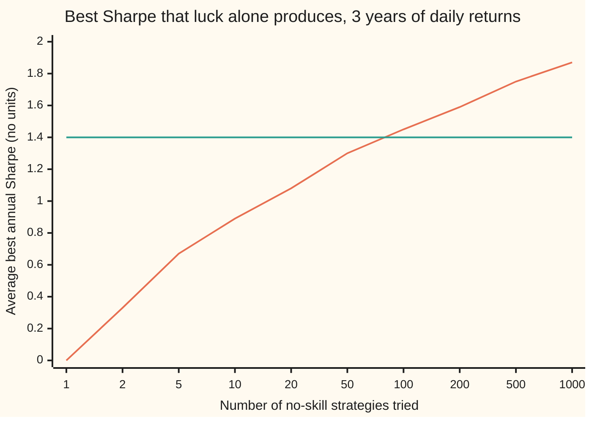

# Trying many strategies: the deflated Sharpe ratio and the probability of backtest overfitting

[Syllabus](../../../SYLLABUS.md) → [Financial mathematics](../../../SYLLABUS.md#w12) → [Signals, Mean Reversion and Backtesting](../../../SYLLABUS.md#w12-s50) → Trying many strategies

---

## General Overview

A research desk writes 100 trading strategies. Each one decides every day whether to be long or short a stock index, and each one is, in truth, a coin toss: no strategy knows anything. The desk runs all 100 over the same three years of daily prices, 756 trading days, and keeps the one with the best record.

The winner's **Sharpe ratio** is 1.4. The Sharpe ratio is a strategy's average return above cash divided by how much its returns swing, scaled to a year; above 1 counts as very good. Tested alone, a Sharpe of 1.4 over three years would clear the usual significance bar with room to spare: a strategy with no skill reaches it by luck less than one time in a hundred.

But the winner was not tested alone. It was the best of 100. The best of 100 coin tosses is not a typical coin toss, and the best of 100 no-skill strategies over three years has a Sharpe of about 1.45 on average. The desk's 1.4 is what luck alone delivers.

This card does two things. It moves the bar the winner must clear from zero up to the Sharpe that the best of 100 lucky strategies would show: the **deflated Sharpe ratio**. And it checks, by cutting the history into pieces, how often a strategy picked as best on one part of the history lands in the bottom half on the rest: the **probability of backtest overfitting**.

**Judge the winner of a search against the best that luck alone would produce in a search of the same size, not against zero.**

**What kind of fact this is:** a method, built on an approximation with its error stated; the exact law it approximates, the spread of the best of many bell-curve draws, is a theorem proved on this card in Why it works.

### The picture: the more strategies tried, the higher luck's best

Each point is the average best annual Sharpe among that many no-skill strategies, each run over three years of daily returns. The flat line is the desk's 1.4.



The rising curve is luck's best; it crosses the flat line at 1.4, the winner's Sharpe, between 50 and 100 strategies. The horizontal axis is not evenly spaced: each step multiplies the count by 2 to 2.5. Luck's best keeps rising, a little less with each doubling, and never levels off: it grows roughly like the square root of twice the natural logarithm of the count.

---

## The formula

Notation first, in words. $N(x)$ is the bell-curve area to the left of $x$, as on the [Normal](../../09-Probability%20and%20statistics/04-Continuous%20Distributions/04-normal-distribution.md) card, and $N^{-1}$ runs it backwards: given an area, it returns the point with that much area to its left. A hat marks a number measured from data. Everything inside the formula is **per period**, here per trading day; a yearly Sharpe is the daily one times $\sqrt{252}$.

The bar the winner must clear:

$$SR_0 = \sqrt{V}\,\Big[(1-\gamma)\,N^{-1}\!\big(1-\tfrac{1}{M}\big) + \gamma\,N^{-1}\!\big(1-\tfrac{1}{Me}\big)\Big]$$

**Read it aloud:** the Sharpe that the best of $M$ no-skill strategies shows on average, written as the no-skill spread times a number of spreads read off the bell curve.

The deflated Sharpe ratio:

$$\mathrm{DSR} = N\!\left(\frac{(\widehat{SR} - SR_0)\,\sqrt{T-1}}{\sqrt{1 - \gamma_3\,\widehat{SR} + \tfrac{\gamma_4 - 1}{4}\,\widehat{SR}^2}}\right)$$

**Read it aloud:** how many standard errors the winner stands above luck's best, turned into a number between 0 and 1.

The probability of backtest overfitting, from combinatorially symmetric cross-validation (CSCV: every way of splitting the history into two equal halves):

$$\mathrm{PBO} = \frac{1}{\binom{S}{S/2}} \sum_{c} \mathbf{1}\{\,r_c \le M/2\,\}$$

**Read it aloud:** over every split, the share of splits in which the strategy that won on one half ranks in the bottom half on the other.

| Symbol | Plain meaning | In our example | Push it up and the DSR… |
| --- | --- | --- | --- |
| $M$ | number of strategies tried, including the abandoned ones | 100 | falls: luck's best rises |
| $T$ | number of return observations behind each Sharpe | 756 trading days | rises: luck's spread shrinks |
| $\widehat{SR}$ | the winner's measured Sharpe, per period | 0.088192 a day, 1.4 a year | rises |
| $SR_0$ | the bar: luck's average best Sharpe, per period | 0.092098 a day, 1.46 a year | falls |
| $V$ | variance of a no-skill Sharpe across trials, taken as $1/(T-1)$ | spread $\sqrt{V}$ = 0.036394 a day | falls: a wider spread lifts the bar |
| $\gamma$, $e$ | Euler's constant and Euler's number | 0.5772 and 2.71828 | fixed |
| $\gamma_3$, $\gamma_4$ | skewness (lopsidedness) and kurtosis (fat tails) of the winner's daily returns | 0 and 3, the bell-curve values | either one: the DSR moves toward 0.5 when the pair widens the standard error |
| $N(x)$, $N^{-1}$, $\phi$ | bell-curve area left of $x$, its inverse, and $\phi$, the curve's height | $N^{-1}(0.99)$ = 2.326348 | — |
| $S$ | number of equal time blocks CSCV cuts the history into; $\binom{S}{S/2}$ ways to choose half of them | 6 blocks of 126 days; 20 splits | more splits, finer estimate |
| $a$, $b$ | location and width of the Gumbel curve for luck's best, in no-skill spreads | $a$ = 2.326348, $a + b$ = 2.680210 | — |
| $r_c$, $c$ | out-of-sample rank of split $c$'s in-sample winner, 1 = worst, $M$ = best | from 1 to 100 | — |
| $\lambda_c$ | the paper's logit, $\ln\big(\omega_c/(1-\omega_c)\big)$ with $\omega_c = r_c/(M+1)$; below zero exactly when $r_c \le M/2$ | — | — |

### When it holds

- **Trials independent, or $M$ replaced by an effective count.** The maximum law multiplies probabilities, which needs independence. Strategies that are small variations of one another behave like fewer trials; counting each as a full trial sets the bar too high.
- **Every trial counted.** $M$ must include the strategies that were dropped along the way. Report 10 of 100 and the DSR comes out at 0.80 instead of 0.46.
- **Sharpe estimates roughly bell-shaped, with no-skill variance $1/(T-1)$.** True for a few hundred observations of returns without extreme tails. In practice $V$ is estimated from the spread of the trials' own Sharpe ratios.
- **One clock throughout.** $\widehat{SR}$, $SR_0$, $T$ and the moments must be on the same period. The annual 1.4 fed into the daily formula gives a DSR of 1.000, a meaningless certainty.
- **CSCV: returns fixed before the splitting, blocks long enough to hold a Sharpe.** CSCV chooses among fixed return columns; it does not retrain strategies, and it cannot repair a column built with future information.

---

## Why it works

### Step 0: selection turns a fair test into a rigged one

A test of one strategy asks: could luck have produced a Sharpe this high? A search of 100 asks a different question: could luck have produced a *best* Sharpe this high? The first question has a small answer, 0.0078. The second has a large one, 0.54. Every step below is about replacing the first question with the second.

### Step 1: a no-skill Sharpe is a bell curve of known width

A daily return with no edge has true mean zero. Its measured Sharpe over $T$ days is the sample average divided by the sample spread. Averages of many independent returns follow a bell curve, and dividing by the spread leaves a bell curve centred on zero with standard deviation $1/\sqrt{T-1}$, up to a small correction ([Lo 2002](https://doi.org/10.2469/faj.v58.n4.2453)).

For 756 days that width is 0.036394 a day, or $\sqrt{252/755}$ = 0.577732 a year. Three years is not long: a no-skill strategy lands above 0.58 about one time in six.

### Step 2: the best of M draws has an exact law

Divide each of $M$ independent no-skill Sharpes by that width. The results $Z_1, \dots, Z_M$ are standard bell-curve draws. The best is at most $z$ exactly when every one is at most $z$. Independence multiplies the chances:

$$P(\max_j Z_j \le z) = N(z)^M.$$

Its average follows by integrating $z$ against the slope of that curve: 2.507594 widths for $M = 100$. Times the annual width 0.577732, the best of 100 lucky strategies averages a Sharpe of 1.448718. The chance that the best reaches 1.4 or more is $1 - N(1.4/0.577732)^{100}$ = 0.537937: more often than not.

<details>
<summary>Detailed proof: the maximum law and two routes to its average</summary>

**The law.** The event "$\max_j Z_j \le z$" is the event "$Z_1 \le z$ and … and $Z_M \le z$". For independent events the probability of all of them is the product, and each factor is $N(z)$. So the maximum has distribution function $F(z) = N(z)^M$.

**Route one, the density.** Differentiate: $F'(z) = M\,\phi(z)\,N(z)^{M-1}$, where $\phi$ is the bell curve's height. The average is $\int z\,M\,\phi(z)\,N(z)^{M-1}\,dz$ over the whole line.

**Route two, the tails.** For any quantity with a finite average, the average is the area of its upper tail beyond zero minus the area of its lower tail below zero. For the best of $M$, with $P(\max_j Z_j \le z) = N(z)^M$, this is $\int_0^\infty \big(1 - N(z)^M\big)\,dz - \int_{-\infty}^0 N(z)^M\,dz$.

The two routes share no integrand. The checks compute both with Simpson's rule on $[-12, 12]$; they agree to within one part in a hundred million, at 2.507594. The average exists because $|\max_j Z_j| \le |Z_1| + \dots + |Z_M|$, which has a finite average.

**Why independence matters.** If the $M$ strategies are variations of one idea, their scores move together and the best reaches less far. For positively correlated scores, Slepian's inequality gives $P(\max_j Z_j \le z) \ge N(z)^M$: the independent case is the furthest luck can reach, so the true bar is lower.

</details>

### Step 3: the shortcut, luck's best as a Gumbel curve

The integral has no closed form, so the paper uses a shortcut from extreme-value theory (the study of maxima). For large $M$, the best of $M$ bell-curve draws follows a **Gumbel** curve, whose distribution function is $\exp(-e^{-(x-a)/b})$ with a location $a$ and a width $b$.

Match two points. At $a = N^{-1}(1 - 1/M)$, the chance that one draw exceeds it is $1/M$, and the chance that none of $M$ does is about $e^{-1}$, the Gumbel value at $x = a$. At $a + b = N^{-1}(1 - 1/(Me))$, the chance that none exceeds it is about $e^{-1/e}$, the Gumbel value at $x = a + b$.

A Gumbel curve's average is its location plus $\gamma$ widths, where $\gamma$ is Euler's constant 0.5772. So the average best is $a + \gamma b = (1-\gamma)\,a + \gamma\,(a + b)$, which is the bracket in the formula. For $M = 100$: $a$ = 2.326348, $a + b$ = 2.680210, and the bracket is 2.530603. The exact value is 2.507594; the shortcut overshoots by 0.9 percent, which makes the bar slightly strict.

### Step 4: stand the winner against the bar

The measured Sharpe itself has a standard error. For returns with skewness $\gamma_3$ and kurtosis $\gamma_4$, its variance is about $\big(1 - \gamma_3\,SR + \tfrac{\gamma_4 - 1}{4}\,SR^2\big)/(T-1)$. This card states that result without proof; it comes from a first-order Taylor expansion of the ratio (the delta method), carried out in Lo's paper for bell-curve returns; Bailey and López de Prado use the version for skewed, fat-tailed ones.

The distance from the bar in standard errors is the fraction inside $N(\cdot)$. Pushing it through $N$ turns a number of standard errors into a number between 0 and 1: 0.5 means the winner sits exactly on luck's average best, 0.95 or more is the level the paper treats as evidence.

Negative skew and fat tails raise the denominator: a strategy that earns small gains and suffers rare large losses has a less trustworthy Sharpe, and its DSR moves toward 0.5, which for a winner above the bar means down.

### Step 5: CSCV, and why pure luck gives one half

The DSR needs $M$ and assumes the trials are independent. CSCV needs neither. Cut the 756 days into $S = 6$ blocks of 126 days. Choose 3 blocks as the **in-sample** half, the part used to pick the winner; the other 3 are the **out-of-sample** half, used to judge it. There are $\binom{6}{3} = 20$ such choices. In each, pick the strategy with the best in-sample Sharpe, then rank all 100 on the out-of-sample half. PBO is the share of the 20 splits in which the pick ranks 50 or worse.


For pure noise the answer is exactly one half, by symmetry.

<details>
<summary>Detailed proof: PBO is one half when no strategy has skill</summary>

Suppose every column of returns is independent noise with the same distribution. The in-sample and out-of-sample halves use different days, so they are independent. The identity of the in-sample winner depends only on the in-sample days. Given that identity, the out-of-sample scores of all 100 strategies are still independent and identically distributed, so the winner is equally likely to hold any of the 100 out-of-sample ranks. The chance its rank is 50 or less is $50/100 = 1/2$.

The 20 splits share days, so they are not 20 independent tests; the fraction for one history can land well away from one half. Its average over many histories is one half. The simulation in the checks averages 500 histories and gets 0.5039.

</details>

A family with real skill behaves differently. Give the 100 strategies true annual Sharpes spread evenly from 0 to 2, and CSCV's PBO drops to 0.2132: the in-sample winner is usually one of the genuinely good strategies, and they stay good out of sample.

The same question has a classical answer on the [Many tests](../../09-Probability%20and%20statistics/08-Confidence%20Intervals%20and%20Tests/08-multiple-testing.md) card: Bonferroni multiplies the single-test p-value by the number of tests. Here 100 × 0.0078 = 0.78, far above 0.05. Same verdict, cruder tool: Bonferroni asks only whether to reject, while the DSR says by how much the winner falls short.

---

## Worked numbers, by hand

The winner: annual Sharpe 1.4 from 756 daily returns, best of $M = 100$, bell-curve returns ($\gamma_3 = 0$, $\gamma_4 = 3$).

| Step | Arithmetic | Value |
| --- | --- | --- |
| winner's Sharpe per day | $1.4 / \sqrt{252}$ | 0.088192 |
| no-skill spread per day | $1 / \sqrt{755}$ | 0.036394 |
| first quantile | $N^{-1}(1 - 1/100)$ | 2.326348 |
| second quantile | $N^{-1}(1 - 1/(100e))$ | 2.680210 |
| bracket | $0.4228 \times 2.326348 + 0.5772 \times 2.680210$ | 2.530603 |
| bar per day, $SR_0$ | $2.530603 \times 0.036394$ | 0.092098 |
| bar per year | $0.092098 \times \sqrt{252}$ | 1.462012 |
| gap | $0.088192 - 0.092098$ | −0.003906 |
| denominator | $\sqrt{1 + \tfrac{2}{4} \times 0.088192^2}$ | 1.001943 |
| standard errors above the bar | $-0.003906 \times 27.477263 / 1.001943$ | −0.107128 |
| **DSR** | $N(-0.107128)$ | **0.457344** |

The winner sits a tenth of a standard error *below* the Sharpe that the best of 100 coin tosses shows on average. Nothing in the record separates it from luck.

The same 1.4, earned over ten years of monthly returns ($T = 120$), faces a bar of 0.803602 a year and scores a DSR of 0.964526. Ten years of daily returns give 0.970757. Evidence accumulates mainly with the years a record covers, not with how often it is sampled.

### CSCV by hand: four rules, four blocks

Four rules, A to D, each recording profit per block in four blocks: A is (8, 8, −2, −2), B is (2, 2, 2, 2), C is (−2, −2, 8, 8), D is (1, 1, 1, 1). The score on a half is the mean profit per block. Two blocks of four go in-sample, so there are $\binom{4}{2} = 6$ splits. Ties go to the earlier rule. Rank 1 is worst, 4 is best.

| In-sample blocks | In-sample means A B C D | Winner | Out-of-sample means A B C D | Winner's rank |
| --- | --- | --- | --- | --- |
| 1, 2 | 8, 2, −2, 1 | A | −2, 2, 8, 1 | 1 |
| 3, 4 | −2, 2, 8, 1 | C | 8, 2, −2, 1 | 1 |
| 1, 3 | 3, 2, 3, 1 | A | 3, 2, 3, 1 | 4 |
| 1, 4 | 3, 2, 3, 1 | A | 3, 2, 3, 1 | 4 |
| 2, 3 | 3, 2, 3, 1 | A | 3, 2, 3, 1 | 4 |
| 2, 4 | 3, 2, 3, 1 | A | 3, 2, 3, 1 | 4 |
| **PBO** | two ranks of 2 or worse, out of six | | | **2/6 = 1/3** |

A and C were built to shine in opposite halves of the history. Whenever the split separates the two regimes, the in-sample star is the out-of-sample dud.

### What breaks if you drop a piece

Correct answer for the desk's winner: DSR 0.457.

| Mistake | DSR comes out at | What went wrong |
| --- | --- | --- |
| Compare with zero, as if one strategy had been tried | 0.992 | The search disappeared; this is the probabilistic Sharpe ratio (the same formula with the bar at zero), and it calls noise a discovery |
| Count only the 10 strategies that made it into the report | 0.802 | The 90 abandoned strategies were trials too; luck's best is lower for 10 |
| Put the annual 1.4 into the daily formula | 1.000 | Two clocks mixed: a yearly Sharpe against daily standard errors is too big by a factor of the square root of 252 |

---

## Code, from first principles, and it actually runs

The code reaches luck's best by four roads: the density integral, the tail integral, the paper's two-quantile shortcut, and a simulation of 500 searches, each of 100 no-skill strategies over 756 days from a random-number generator written in the script. The simulation also runs CSCV on every search, for pure noise and for a family with real skill, and checks the noise result against the symmetry answer of one half. The normal CDF is a power series checked against Simpson's rule, and its inverse is bisection. The four-rule CSCV is enumerated split by split, and the ten-year monthly case matches an earlier independent run.

### Python

```python
# Deflated Sharpe ratio and CSCV overfitting check. Standard library only: the normal CDF,
# its inverse, the integrals and the random numbers are all written here.
from math import exp, log, sqrt, pi, cos, sin

def phi(x): return exp(-0.5 * x * x) / sqrt(2 * pi)      # bell-curve height
def ncdf(x):                                              # N(x): bell-curve area left of x
    if x < -9: return 0.0
    if x > 9: return 1.0
    term, total, k = x, x, 1                              # x + x^3/3 + x^5/15 + ...
    while abs(term) > 1e-17 * abs(total):
        term *= x * x / (2 * k + 1); total += term; k += 1
    return 0.5 + phi(x) * total
def simpson(f, a, b, n=4000):
    h = (b - a) / n
    s = f(a) + f(b)
    for i in range(1, n): s += (4 if i % 2 else 2) * f(a + i * h)
    return s * h / 3
def ninv(p, lo=-9.0, hi=9.0):                             # N^-1(p) by bisection
    for _ in range(80): lo, hi = ((lo + hi) / 2, hi) if ncdf((lo + hi) / 2) < p else (lo, (lo + hi) / 2)
    return (lo + hi) / 2
def row(name, v, f=".6f"): print(f"{name:<34}{v:>12{f}}")

G = 0.5772156649015329                                    # Euler's constant
def emax_density(M): return simpson(lambda z: z * M * phi(z) * ncdf(z) ** (M - 1), -12, 12)
def emax_tail(M):    return simpson(lambda z: 1 - ncdf(z) ** M, 0, 12) - simpson(lambda z: ncdf(z) ** M, -12, 0)
def emax_approx(M):  return (1 - G) * ninv(1 - 1 / M) + G * ninv(1 - 1 / (M * exp(1)))
def dsr(sr_ann, ppy, T, M, skew=0.0, kurt=3.0, per_period=True):
    sr = sr_ann / sqrt(ppy) if per_period else sr_ann     # per_period=False is the clock-mixing mistake
    s0 = emax_approx(M) / sqrt(T - 1) if M > 1 else 0.0
    den = sqrt(1 - skew * sr + (kurt - 1) / 4 * sr * sr)
    return s0 * sqrt(ppy), ncdf((sr - s0) * sqrt(T - 1) / den)

# ---- the example: best of 100 random strategies, 3 years of daily returns, Sharpe 1.4 ----
M, T, PPY, SR = 100, 756, 252, 1.4
sd_ann = sqrt(PPY / (T - 1))                              # spread of a no-skill annual Sharpe
e_exact, e_tail, e_apx = emax_density(M), emax_tail(M), emax_approx(M)
s0_ann, d = dsr(SR, PPY, T, M)
psr0 = dsr(SR, PPY, T, 1)[1]
p_one, p_max = 1 - psr0, 1 - ncdf(SR / sd_ann) ** M
sr_d, s0_d = SR / sqrt(PPY), e_apx / sqrt(T - 1)          # the hand chain, per day
den = sqrt(1 + 2 / 4 * sr_d * sr_d)
print(f"{'N(1.5): series, Simpson':<34}{ncdf(1.5):>12.8f}{0.5 + simpson(phi, 0, 1.5):>12.8f}")
row("observed best annual Sharpe", SR); row("winner's Sharpe per day", sr_d)
row("no-skill Sharpe spread per day", 1 / sqrt(T - 1)); row("no-skill annual Sharpe spread", sd_ann)
row("E[max of 100 z], density integral", e_exact); row("E[max of 100 z], tail integral", e_tail)
row("N^-1(1 - 1/100)", ninv(1 - 1 / M)); row("N^-1(1 - 1/(100e))", ninv(1 - 1 / (M * exp(1))))
row("E[max of 100 z], two-quantile", e_apx); row("expected best annual Sharpe, exact", e_exact * sd_ann)
row("SR0 per day", s0_d); row("SR0 annual (deflation bar)", s0_ann)
row("gap per day", sr_d - s0_d); row("sqrt(T - 1)", sqrt(T - 1)); row("denominator", den)
row("z", (sr_d - s0_d) * sqrt(T - 1) / den); row("DSR", d)
row("PSR against zero (naive)", psr0); row("one-test p-value", p_one)
row("Bonferroni 100 x p", 100 * p_one); row("P(best of 100 >= 1.4 | no skill)", p_max)
print("chart: M, expected best annual Sharpe")
for m in (1, 2, 5, 10, 20, 50, 100, 200, 500, 1000):
    print(f"  M={m:<5}{max(emax_density(m) * sd_ann, 0.0):>10.2f}")   # clamp round-off: E[max] >= 0
# ---- the same 1.4 on ten years of monthly returns (independent reference run) ----
s0_m, d_m = dsr(SR, 12, 120, M)
row("monthly 10y: SR0 annual", s0_m); row("monthly 10y: DSR", d_m)
# ---- what breaks, and try changing ----
row("wrong: count 10 trials, not 100", dsr(SR, PPY, T, 10)[1])
row("wrong: annual Sharpe, daily clock", dsr(SR, PPY, T, M, per_period=False)[1])
row("try: M = 1000, DSR", dsr(SR, PPY, T, 1000)[1]); row("try: 10 years daily, DSR", dsr(SR, PPY, 2520, M)[1])
row("try: monthly, skew -1 kurt 6, DSR", dsr(SR, 12, 120, M, -1.0, 6.0)[1])

# ---- road 3: simulate the search itself, and run CSCV on every matrix ----
M64, state = (1 << 64) - 1, 20260928
def pair():                                               # two normals by Box-Muller from a 64-bit LCG
    global state
    state = (6364136223846793005 * state + 1442695040888963407) & M64; u1 = ((state >> 11) + 0.5) / 2 ** 53
    state = (6364136223846793005 * state + 1442695040888963407) & M64; u2 = ((state >> 11) + 0.5) / 2 ** 53
    r = sqrt(-2 * log(u1)); return r * cos(2 * pi * u2), r * sin(2 * pi * u2)
def sharpe(s, q, n):                                      # annual Sharpe from sum, sum of squares, count
    return s / n / sqrt((q - s * s / n) / (n - 1)) * sqrt(PPY)
def cscv(st, blocks, L):                                  # st[j][b] = (sum, sumsq); counts splits below the middle
    splits = [c for c in range(1 << blocks) if bin(c).count("1") == blocks // 2]
    below = 0
    for c in splits:
        def score(j, want):
            s = sum(st[j][b][0] for b in range(blocks) if (c >> b & 1) == want)
            q = sum(st[j][b][1] for b in range(blocks) if (c >> b & 1) == want)
            return sharpe(s, q, L * blocks // 2)
        best = max(range(len(st)), key=lambda j: score(j, 1))
        oos = [score(j, 0) for j in range(len(st))]
        rank = 1 + sum(o < oos[best] for o in oos)        # rank 1 = worst out of sample
        below += rank <= len(st) // 2
    return below, len(splits)

REPS, BLOCKS = 500, 6
L = T // BLOCKS
tot_max = hits = below_n = below_s = count = 0
for rep in range(REPS):
    noise, skill = [], []
    for j in range(M):
        mu = 2.0 * j / (M - 1) / sqrt(PPY)                # skill family: true annual Sharpe 0 to 2
        z = [v for _ in range(T // 2) for v in pair()]
        blk = [z[b * L:(b + 1) * L] for b in range(BLOCKS)]
        noise.append([(sum(x), sum(v * v for v in x)) for x in blk])
        skill.append([(s + mu * L, q + 2 * mu * s + mu * mu * L) for s, q in noise[-1]])
    best = max(sharpe(sum(b[0] for b in st), sum(b[1] for b in st), T) for st in noise)
    tot_max += best; hits += best >= SR
    bn, count = cscv(noise, BLOCKS, L); below_n += bn
    below_s += cscv(skill, BLOCKS, L)[0]
mc_max, mc_hit, pbo_n, pbo_s = tot_max / REPS, hits / REPS, below_n / (REPS * count), below_s / (REPS * count)
row("simulated mean best Sharpe", mc_max, ".4f"); row("simulated P(best >= 1.4)", mc_hit, ".4f")
row("CSCV splits per matrix", count, "d")
row("PBO, 100 random strategies", pbo_n, ".4f"); row("PBO, family with real skill", pbo_s, ".4f")

# ---- CSCV by hand: four rules, four blocks, mean P&L per block (reference case) ----
cols = ((8, 8, -2, -2), (2, 2, 2, 2), (-2, -2, 8, 8), (1, 1, 1, 1))
ranks = []
for c in (3, 12, 5, 9, 6, 10):                            # in-sample halves {1,2},{3,4},{1,3},{1,4},{2,3},{2,4}
    isc = [sum(col[b] for b in range(4) if c >> b & 1) // 2 for col in cols]
    osc = [sum(col[b] for b in range(4) if not c >> b & 1) // 2 for col in cols]
    pick = max(range(4), key=lambda j: (isc[j], -j))      # ties go to the earlier rule
    ranks.append(1 + sum(osc[j] < osc[pick] or (osc[j] == osc[pick] and j > pick) for j in range(4)))
    print(f"  IS {''.join(str(b + 1) for b in range(4) if c >> b & 1)}: means", *isc, "->", "ABCD"[pick],
          "| OOS means", *osc, "| rank", ranks[-1])
print(f"hand CSCV: PBO {sum(r <= 2 for r in ranks)}/{len(ranks)}")

assert abs(ncdf(1.5) - (0.5 + simpson(phi, 0, 1.5))) < 1e-12       # series vs integral
assert abs(e_exact - e_tail) < 1e-8                                  # two different integrals
assert abs(e_apx - e_exact) < 0.03                                   # the paper's shortcut is close
assert abs(mc_max - e_exact * sd_ann) < 0.08                         # simulation vs integral
assert abs(mc_hit - p_max) < 0.15                                    # simulation vs max law
assert abs(pbo_n - 0.5) < 0.05                                       # symmetry says 1/2 for noise
assert pbo_s < 0.35                                                  # real skill travels
assert abs(d_m - 0.964526) < 1e-5                                    # independent earlier run
assert ranks == [1, 1, 4, 4, 4, 4]                                   # the hand enumeration
print("all checks passed")
```

**Ran 2026-09-28 on macOS, Python 3.14.6, standard library only. All checks passed. Output, pasted from the run:**

```
N(1.5): series, Simpson             0.93319280  0.93319280
observed best annual Sharpe           1.400000
winner's Sharpe per day               0.088192
no-skill Sharpe spread per day        0.036394
no-skill annual Sharpe spread         0.577732
E[max of 100 z], density integral     2.507594
E[max of 100 z], tail integral        2.507594
N^-1(1 - 1/100)                       2.326348
N^-1(1 - 1/(100e))                    2.680210
E[max of 100 z], two-quantile         2.530603
expected best annual Sharpe, exact    1.448718
SR0 per day                           0.092098
SR0 annual (deflation bar)            1.462012
gap per day                          -0.003906
sqrt(T - 1)                          27.477263
denominator                           1.001943
z                                    -0.107128
DSR                                   0.457344
PSR against zero (naive)              0.992209
one-test p-value                      0.007791
Bonferroni 100 x p                    0.779085
P(best of 100 >= 1.4 | no skill)      0.537937
chart: M, expected best annual Sharpe
  M=1          0.00
  M=2          0.33
  M=5          0.67
  M=10         0.89
  M=20         1.08
  M=50         1.30
  M=100        1.45
  M=200        1.59
  M=500        1.75
  M=1000       1.87
monthly 10y: SR0 annual               0.803602
monthly 10y: DSR                      0.964526
wrong: count 10 trials, not 100       0.801509
wrong: annual Sharpe, daily clock     1.000000
try: M = 1000, DSR                    0.203201
try: 10 years daily, DSR              0.970757
try: monthly, skew -1 kurt 6, DSR     0.930687
simulated mean best Sharpe              1.4559
simulated P(best >= 1.4)                0.5520
CSCV splits per matrix                      20
PBO, 100 random strategies              0.5039
PBO, family with real skill             0.2132
  IS 12: means 8 2 -2 1 -> A | OOS means -2 2 8 1 | rank 1
  IS 34: means -2 2 8 1 -> C | OOS means 8 2 -2 1 | rank 1
  IS 13: means 3 2 3 1 -> A | OOS means 3 2 3 1 | rank 4
  IS 14: means 3 2 3 1 -> A | OOS means 3 2 3 1 | rank 4
  IS 23: means 3 2 3 1 -> A | OOS means 3 2 3 1 | rank 4
  IS 24: means 3 2 3 1 -> A | OOS means 3 2 3 1 | rank 4
hand CSCV: PBO 2/6
all checks passed
```

### Rust

```rust
// Deflated Sharpe ratio and CSCV overfitting check. Rust std only: the normal CDF,
// its inverse, the integrals and the random numbers are all written here.
use std::f64::consts::PI;

fn phi(x: f64) -> f64 { (-0.5 * x * x).exp() / (2.0 * PI).sqrt() }
fn ncdf(x: f64) -> f64 { // N(x): bell-curve area left of x
    if x < -9.0 { return 0.0; }
    if x > 9.0 { return 1.0; }
    let (mut term, mut total, mut k) = (x, x, 1.0);  // x + x^3/3 + x^5/15 + ...
    while term.abs() > 1e-17 * total.abs() {
        term *= x * x / (2.0 * k + 1.0); total += term; k += 1.0;
    }
    0.5 + phi(x) * total
}
fn simpson(f: &dyn Fn(f64) -> f64, a: f64, b: f64) -> f64 {
    let (n, mut s) = (4000, f(a) + f(b));
    let h = (b - a) / n as f64;
    for i in 1..n { s += (if i % 2 == 1 { 4.0 } else { 2.0 }) * f(a + i as f64 * h); }
    s * h / 3.0
}
fn ninv(p: f64) -> f64 { // N^-1(p) by bisection
    let (mut lo, mut hi) = (-9.0, 9.0);
    for _ in 0..80 { let mid = (lo + hi) / 2.0; if ncdf(mid) < p { lo = mid; } else { hi = mid; } }
    (lo + hi) / 2.0
}
const G: f64 = 0.5772156649015329; // Euler's constant
fn emax_density(m: f64) -> f64 { simpson(&|z| z * m * phi(z) * ncdf(z).powf(m - 1.0), -12.0, 12.0) }
fn emax_tail(m: f64) -> f64 { simpson(&|z| 1.0 - ncdf(z).powf(m), 0.0, 12.0) - simpson(&|z| ncdf(z).powf(m), -12.0, 0.0) }
fn emax_approx(m: f64) -> f64 { (1.0 - G) * ninv(1.0 - 1.0 / m) + G * ninv(1.0 - 1.0 / (m * 1f64.exp())) }
// returns (SR0 annual, DSR); per_period = false is the clock-mixing mistake
fn dsr(sr_ann: f64, ppy: f64, t: f64, m: f64, skew: f64, kurt: f64, per_period: bool) -> (f64, f64) {
    let sr = if per_period { sr_ann / ppy.sqrt() } else { sr_ann };
    let s0 = if m > 1.0 { emax_approx(m) / (t - 1.0).sqrt() } else { 0.0 };
    let den = (1.0 - skew * sr + (kurt - 1.0) / 4.0 * sr * sr).sqrt();
    (s0 * ppy.sqrt(), ncdf((sr - s0) * (t - 1.0).sqrt() / den))
}
fn row(name: &str, v: f64) { println!("{:<34}{:>12.6}", name, v); }
fn row4(name: &str, v: f64) { println!("{:<34}{:>12.4}", name, v); }

struct Lcg(u64);
impl Lcg {
    fn unif(&mut self) -> f64 {
        self.0 = self.0.wrapping_mul(6364136223846793005).wrapping_add(1442695040888963407);
        ((self.0 >> 11) as f64 + 0.5) / 9007199254740992.0
    }
    fn pair(&mut self) -> (f64, f64) { // two normals by Box-Muller
        let (u1, u2) = (self.unif(), self.unif());
        let r = (-2.0 * u1.ln()).sqrt();
        (r * (2.0 * PI * u2).cos(), r * (2.0 * PI * u2).sin())
    }
}
const PPY: f64 = 252.0;
fn sharpe(s: f64, q: f64, n: f64) -> f64 { s / n / ((q - s * s / n) / (n - 1.0)).sqrt() * PPY.sqrt() }

// st[j][b] = (sum, sumsq); returns (splits where the in-sample winner lands below the middle, splits)
fn cscv(st: &Vec<Vec<(f64, f64)>>, blocks: usize, l: usize) -> (usize, usize) {
    let splits: Vec<usize> = (0..1usize << blocks).filter(|c| c.count_ones() as usize == blocks / 2).collect();
    let score = |c: usize, j: usize, want: usize| {
        let (mut s, mut q) = (0.0, 0.0);
        for b in 0..blocks { if (c >> b & 1) == want { s += st[j][b].0; q += st[j][b].1; } }
        sharpe(s, q, (l * blocks / 2) as f64)
    };
    let mut below = 0;
    for &c in &splits {
        let best = (1..st.len()).fold(0, |b, j| if score(c, j, 1) > score(c, b, 1) { j } else { b });
        let oos: Vec<f64> = (0..st.len()).map(|j| score(c, j, 0)).collect();
        let rank = 1 + oos.iter().filter(|&&o| o < oos[best]).count(); // rank 1 = worst out of sample
        if rank <= st.len() / 2 { below += 1; }
    }
    (below, splits.len())
}

fn main() {
    // ---- the example: best of 100 random strategies, 3 years of daily returns, Sharpe 1.4 ----
    let (m, t, sr) = (100.0, 756.0, 1.4);
    let sd_ann = (PPY / (t - 1.0)).sqrt(); // spread of a no-skill annual Sharpe
    let (e_exact, e_tail, e_apx) = (emax_density(m), emax_tail(m), emax_approx(m));
    let (s0_ann, d) = dsr(sr, PPY, t, m, 0.0, 3.0, true);
    let psr0 = dsr(sr, PPY, t, 1.0, 0.0, 3.0, true).1;
    let (p_one, p_max) = (1.0 - psr0, 1.0 - ncdf(sr / sd_ann).powf(m));
    let (sr_d, s0_d) = (sr / PPY.sqrt(), e_apx / (t - 1.0).sqrt()); // the hand chain, per day
    let den = (1.0 + 2.0 / 4.0 * sr_d * sr_d).sqrt();
    let simp = 0.5 + simpson(&phi, 0.0, 1.5);
    println!("{:<34}{:>12.8}{:>12.8}", "N(1.5): series, Simpson", ncdf(1.5), simp);
    row("observed best annual Sharpe", sr); row("winner's Sharpe per day", sr_d);
    row("no-skill Sharpe spread per day", 1.0 / (t - 1.0).sqrt()); row("no-skill annual Sharpe spread", sd_ann);
    row("E[max of 100 z], density integral", e_exact); row("E[max of 100 z], tail integral", e_tail);
    row("N^-1(1 - 1/100)", ninv(1.0 - 1.0 / m)); row("N^-1(1 - 1/(100e))", ninv(1.0 - 1.0 / (m * 1f64.exp())));
    row("E[max of 100 z], two-quantile", e_apx); row("expected best annual Sharpe, exact", e_exact * sd_ann);
    row("SR0 per day", s0_d); row("SR0 annual (deflation bar)", s0_ann);
    row("gap per day", sr_d - s0_d); row("sqrt(T - 1)", (t - 1.0).sqrt()); row("denominator", den);
    row("z", (sr_d - s0_d) * (t - 1.0).sqrt() / den); row("DSR", d);
    row("PSR against zero (naive)", psr0); row("one-test p-value", p_one);
    row("Bonferroni 100 x p", 100.0 * p_one); row("P(best of 100 >= 1.4 | no skill)", p_max);
    println!("chart: M, expected best annual Sharpe");
    for k in [1, 2, 5, 10, 20, 50, 100, 200, 500, 1000] {
        println!("  M={:<5}{:>10.2}", k, (emax_density(k as f64) * sd_ann).max(0.0)); // clamp round-off: E[max] >= 0
    }
    // ---- the same 1.4 on ten years of monthly returns (independent reference run) ----
    let (s0_m, d_m) = dsr(sr, 12.0, 120.0, m, 0.0, 3.0, true);
    row("monthly 10y: SR0 annual", s0_m); row("monthly 10y: DSR", d_m);
    // ---- what breaks, and try changing ----
    row("wrong: count 10 trials, not 100", dsr(sr, PPY, t, 10.0, 0.0, 3.0, true).1);
    row("wrong: annual Sharpe, daily clock", dsr(sr, PPY, t, m, 0.0, 3.0, false).1);
    row("try: M = 1000, DSR", dsr(sr, PPY, t, 1000.0, 0.0, 3.0, true).1);
    row("try: 10 years daily, DSR", dsr(sr, PPY, 2520.0, m, 0.0, 3.0, true).1);
    row("try: monthly, skew -1 kurt 6, DSR", dsr(sr, 12.0, 120.0, m, -1.0, 6.0, true).1);

    // ---- road 3: simulate the search itself, and run CSCV on every matrix ----
    let (reps, blocks, tt, mm) = (500, 6, 756usize, 100usize);
    let (l, mut rng) = (tt / blocks, Lcg(20260928));
    let (mut tot_max, mut hits, mut below_n, mut below_s, mut count) = (0.0, 0, 0, 0, 0);
    for _ in 0..reps {
        let (mut noise, mut skill) = (Vec::new(), Vec::new());
        for j in 0..mm {
            let mu = 2.0 * j as f64 / (mm - 1) as f64 / PPY.sqrt(); // skill family: true annual Sharpe 0 to 2
            let mut z = Vec::with_capacity(tt);
            for _ in 0..tt / 2 { let (a, b) = rng.pair(); z.push(a); z.push(b); }
            let st: Vec<(f64, f64)> = (0..blocks).map(|b| {
                let x = &z[b * l..(b + 1) * l];
                (x.iter().fold(0.0, |a, v| a + v), x.iter().fold(0.0, |a, v| a + v * v))
            }).collect();
            skill.push(st.iter().map(|&(s, q)| (s + mu * l as f64, q + 2.0 * mu * s + mu * mu * l as f64)).collect());
            noise.push(st);
        }
        let mut best = f64::NEG_INFINITY;
        for st in &noise {
            let (s, q) = st.iter().fold((0.0, 0.0), |a, b| (a.0 + b.0, a.1 + b.1));
            best = best.max(sharpe(s, q, tt as f64));
        }
        tot_max += best; hits += (best >= sr) as usize;
        let (bn, c) = cscv(&noise, blocks, l); below_n += bn; count = c;
        below_s += cscv(&skill, blocks, l).0;
    }
    let (mc_max, mc_hit) = (tot_max / reps as f64, hits as f64 / reps as f64);
    let (pbo_n, pbo_s) = (below_n as f64 / (reps * count) as f64, below_s as f64 / (reps * count) as f64);
    row4("simulated mean best Sharpe", mc_max); row4("simulated P(best >= 1.4)", mc_hit);
    println!("{:<34}{:>12}", "CSCV splits per matrix", count);
    row4("PBO, 100 random strategies", pbo_n); row4("PBO, family with real skill", pbo_s);

    // ---- CSCV by hand: four rules, four blocks, mean P&L per block (reference case) ----
    let cols = [[8, 8, -2, -2], [2, 2, 2, 2], [-2, -2, 8, 8], [1, 1, 1, 1]];
    let mut ranks = Vec::new();
    for c in [3usize, 12, 5, 9, 6, 10] { // in-sample halves {1,2},{3,4},{1,3},{1,4},{2,3},{2,4}
        let half = |w: usize| -> Vec<i32> { cols.iter().map(|col| (0..4).filter(|b| c >> b & 1 == w).map(|b| col[b]).sum::<i32>() / 2).collect() };
        let (isc, osc) = (half(1), half(0));
        let mut pick = 0;
        for j in 1..4 { if isc[j] > isc[pick] { pick = j; } } // ties go to the earlier rule
        ranks.push(1 + (0..4).filter(|&j| osc[j] < osc[pick] || (osc[j] == osc[pick] && j > pick)).count());
        let lab: String = (0..4).filter(|b| c >> b & 1 == 1).map(|b| char::from(b'1' + b as u8)).collect();
        let join = |v: &Vec<i32>| v.iter().map(|x| x.to_string()).collect::<Vec<_>>().join(" ");
        println!("  IS {}: means {} -> {} | OOS means {} | rank {}", lab, join(&isc), &"ABCD"[pick..pick + 1], join(&osc), ranks[ranks.len() - 1]);
    }
    println!("hand CSCV: PBO {}/{}", ranks.iter().filter(|&&r| r <= 2).count(), ranks.len());

    assert!((ncdf(1.5) - simp).abs() < 1e-12); // series vs integral
    assert!((e_exact - e_tail).abs() < 1e-8); // two different integrals
    assert!((e_apx - e_exact).abs() < 0.03); // the paper's shortcut is close
    assert!((mc_max - e_exact * sd_ann).abs() < 0.08); // simulation vs integral
    assert!((mc_hit - p_max).abs() < 0.15); // simulation vs max law
    assert!((pbo_n - 0.5).abs() < 0.05); // symmetry says 1/2 for noise
    assert!(pbo_s < 0.35); // real skill travels
    assert!((d_m - 0.964526).abs() < 1e-5); // independent earlier run
    assert_eq!(ranks, vec![1, 1, 4, 4, 4, 4]); // the hand enumeration
    println!("all checks passed");
}
```

**Ran 2026-09-28 on macOS, rustc 1.98.1, no crates. All checks passed. Output, pasted from the run:**

```
N(1.5): series, Simpson             0.93319280  0.93319280
observed best annual Sharpe           1.400000
winner's Sharpe per day               0.088192
no-skill Sharpe spread per day        0.036394
no-skill annual Sharpe spread         0.577732
E[max of 100 z], density integral     2.507594
E[max of 100 z], tail integral        2.507594
N^-1(1 - 1/100)                       2.326348
N^-1(1 - 1/(100e))                    2.680210
E[max of 100 z], two-quantile         2.530603
expected best annual Sharpe, exact    1.448718
SR0 per day                           0.092098
SR0 annual (deflation bar)            1.462012
gap per day                          -0.003906
sqrt(T - 1)                          27.477263
denominator                           1.001943
z                                    -0.107128
DSR                                   0.457344
PSR against zero (naive)              0.992209
one-test p-value                      0.007791
Bonferroni 100 x p                    0.779085
P(best of 100 >= 1.4 | no skill)      0.537937
chart: M, expected best annual Sharpe
  M=1          0.00
  M=2          0.33
  M=5          0.67
  M=10         0.89
  M=20         1.08
  M=50         1.30
  M=100        1.45
  M=200        1.59
  M=500        1.75
  M=1000       1.87
monthly 10y: SR0 annual               0.803602
monthly 10y: DSR                      0.964526
wrong: count 10 trials, not 100       0.801509
wrong: annual Sharpe, daily clock     1.000000
try: M = 1000, DSR                    0.203201
try: 10 years daily, DSR              0.970757
try: monthly, skew -1 kurt 6, DSR     0.930687
simulated mean best Sharpe              1.4559
simulated P(best >= 1.4)                0.5520
CSCV splits per matrix                      20
PBO, 100 random strategies              0.5039
PBO, family with real skill             0.2132
  IS 12: means 8 2 -2 1 -> A | OOS means -2 2 8 1 | rank 1
  IS 34: means -2 2 8 1 -> C | OOS means 8 2 -2 1 | rank 1
  IS 13: means 3 2 3 1 -> A | OOS means 3 2 3 1 | rank 4
  IS 14: means 3 2 3 1 -> A | OOS means 3 2 3 1 | rank 4
  IS 23: means 3 2 3 1 -> A | OOS means 3 2 3 1 | rank 4
  IS 24: means 3 2 3 1 -> A | OOS means 3 2 3 1 | rank 4
hand CSCV: PBO 2/6
all checks passed
```

The two outputs are identical: both scripts use the same generator, the same Box-Muller transform and the same order of additions.

The simulated average best Sharpe, 1.4559, sits just above the exact 1.448718. Part of the gap is sampling (500 searches), part is that a measured Sharpe is only close to a bell curve. The simulated chance of a best of 1.4 or more, 0.5520, sits beside the exact 0.537937.

> [!TIP]
> **Try changing**
> - **Try 1,000 strategies instead of 100.** Guess first: does the DSR halve? The output row `try: M = 1000` answers it. Luck's best rises to 1.87 and the DSR falls to 0.203201.
> - **Give the same 1.4 ten years of daily data.** Guess first. The row `try: 10 years daily` has T set to 2,520. The DSR jumps to 0.970757: luck's spread shrinks with the square root of the years, which lowers the bar and tightens the standard error together.
> - **Make the ten-year monthly winner's returns lopsided.** Skew −1 and kurtosis 6, the shape of a strategy that sells insurance. Guess first. The row `try: monthly, skew -1 kurt 6` gives the answer: the DSR falls from 0.964526 to 0.930687, below the 0.95 evidence line.

---

## The usual mistake

> [!warning]
> **Judging the winner of a search as if it were the only strategy tried.** The winner's p-value of 0.0078 answers "could one lucky strategy do this?" The honest question is "could the luckiest of 100 do this?", and the answer is yes, 54 percent of the time. The deflated Sharpe ratio exists to ask the second question.
>
> Smaller traps:
> - **Leaving abandoned strategies out of the count.** Every variant tried on the data is a trial, including the ones deleted. Counting 10 of 100 turns a DSR of 0.46 into 0.80.
> - **Reading a DSR of 0.96 as a 96 percent chance of skill.** It is a count of standard errors pushed through the bell curve, under the stated model. It is not the probability that the strategy works.
> - **Mixing clocks.** An annual Sharpe in the daily formula gives a DSR of 1.000 for any search.
> - **Treating the 20 CSCV splits as 20 independent experiments.** They share days. The fraction from one history carries no binomial error bar.

---

## Where you meet it in real life

- **Fund due diligence.** Allocators ask how many variants were tried before the backtest they are shown. A manager who cannot answer has a Sharpe that cannot be deflated.
- **The factor zoo.** Hundreds of published return factors were found on the same few decades of data. Harvey and Liu show how to haircut a Sharpe ratio for the number of tests behind it, and argue that a new factor needs a higher bar than a single test's for the same reason. See [Momentum and factor signals](03-momentum-and-factor-signals.md).
- **Pair screening.** Testing thousands of stock pairs for a stable spread and trading the best is a search of thousands: [Pairs trading](02-pairs-trading-and-cointegration.md).
- **Threshold sweeps.** Trying every entry and exit level for a mean-reversion trade counts every level as a trial: [Mean reversion](01-ornstein-uhlenbeck-mean-reversion-trading.md).
- **Signal research.** A forecast's correlation with later returns, measured after screening many forecasts, is inflated in the same way: [The fundamental law](04-information-coefficient-and-the-fundamental-law.md).
- **Machine-learning model tuning.** Choosing the best of many settings on one validation set is the same maximum, and the same deflation applies.

> **Say it back**
> The best of many no-skill strategies has a high Sharpe by construction: the best of 100 over three years averages 1.45. The deflated Sharpe ratio moves the bar from zero to that level, using the exact law for the best of many bell-curve draws, or its Gumbel shortcut. The desk's 1.4 then scores 0.46, indistinguishable from luck; the same 1.4 over ten years scores 0.96. CSCV checks the search from a second side, by picking winners on half the history and ranking them on the other half; pure noise lands in the bottom half half the time. Both tools need an honest count of everything tried.

---

## What this builds on

- [Backtesting](05-backtesting-pitfalls.md): the honest record this card assumes, with no look-ahead, surviving-stocks-only bias or missing costs, and the rule of logging every trial.
- [Many tests](../../09-Probability%20and%20statistics/08-Confidence%20Intervals%20and%20Tests/08-multiple-testing.md): why many tests inflate false discoveries, and the Bonferroni correction this card compares against.

## Where this goes next

- [A moving hedge ratio](07-kalman-filter-for-dynamic-hedge-ratios.md): a hedge ratio that updates itself; each tuning of its noise settings tried on the same history is one more trial in $M$.
- [Momentum and factor signals](03-momentum-and-factor-signals.md): signals chosen from a crowded field, where the deflation here decides which survive.

---

## Sources

Verified 2026-09-28: every link below resolves to the publisher's page or to the authors' own copy of the paper.

- Bailey, David H., and Marcos López de Prado. "The Deflated Sharpe Ratio: Correcting for Selection Bias, Backtest Overfitting, and Non-Normality." *Journal of Portfolio Management* 40, no. 5 (2014): 94–107. [doi:10.3905/jpm.2014.40.5.094](https://doi.org/10.3905/jpm.2014.40.5.094); [authors' copy](https://www.davidhbailey.com/dhbpapers/deflated-sharpe.pdf). The DSR, the two-quantile bar and the skew and kurtosis correction.
- Bailey, David H., Jonathan M. Borwein, Marcos López de Prado, and Qiji Jim Zhu. "The Probability of Backtest Overfitting." *Journal of Computational Finance*, published online 2016. [doi:10.21314/JCF.2016.322](https://doi.org/10.21314/JCF.2016.322); [authors' copy](https://www.davidhbailey.com/dhbpapers/backtest-prob.pdf). CSCV, the out-of-sample rank and its logit.
- Lo, Andrew W. "The Statistics of Sharpe Ratios." *Financial Analysts Journal* 58, no. 4 (2002): 36–52. [doi:10.2469/faj.v58.n4.2453](https://doi.org/10.2469/faj.v58.n4.2453). The standard error of a measured Sharpe ratio used in Steps 1 and 4.
- Harvey, Campbell R., and Yan Liu. "Backtesting." *Journal of Portfolio Management* 42, no. 1 (2015): 13–28. [doi:10.3905/jpm.2015.42.1.013](https://doi.org/10.3905/jpm.2015.42.1.013). Multiple-testing haircuts for Sharpe ratios, and the case for a higher bar in factor research.
