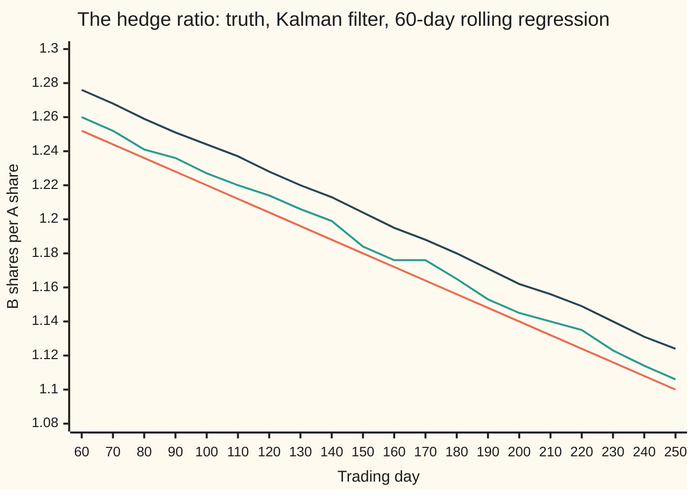
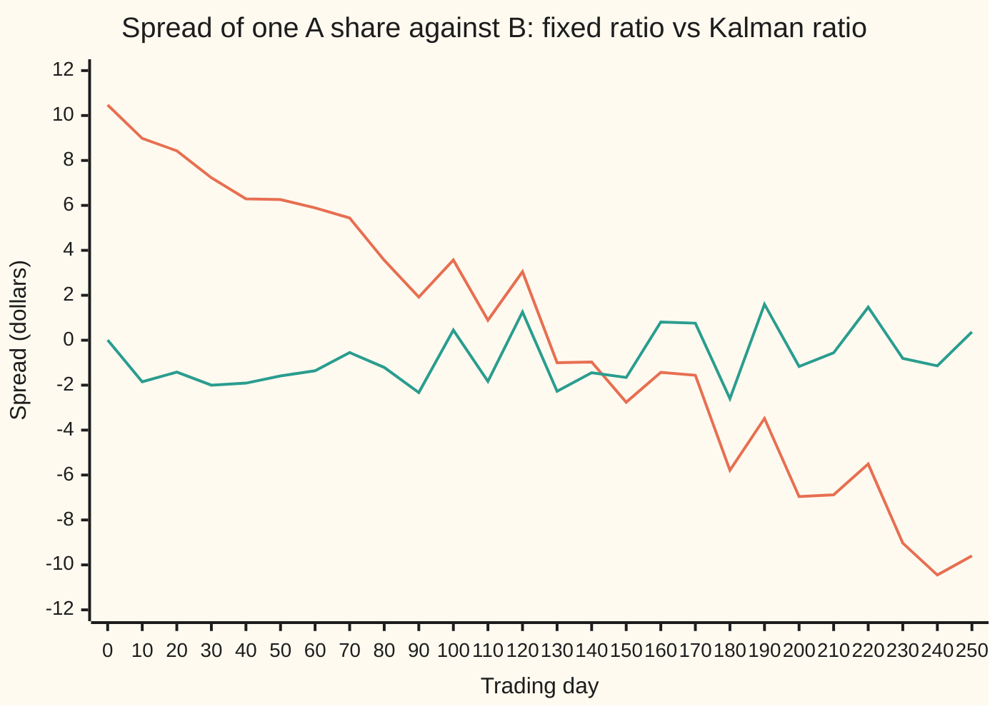

# A moving hedge ratio: the Kalman filter as a regression that updates

[Syllabus](../../../SYLLABUS.md) → [Financial mathematics](../../../SYLLABUS.md#w12) → [Signals, Mean Reversion and Backtesting](../../../SYLLABUS.md#w12-s50) → A moving hedge ratio

---

## General Overview

Two petrol retailers, A and B, trade on the same exchange. Last year one A share tracked 1.3 B shares, so a pairs trader held 1.3 B shares short against each A share owned ([Pairs trading](02-pairs-trading-and-cointegration.md)). That 1.3 is the **hedge ratio**.

This year the tie loosens. A opens more forecourts that sell coffee; B sells more fuel. Over 250 trading days the true ratio slides from 1.30 to 1.10. A trader who fixes one ratio for the whole year, the best single number being 1.20, watches the spread (A's price minus the ratio times B's price) start at $10.47 and end at −$9.60. It looks like a huge trading signal. It is only the wrong ratio.

The ratio has to be re-estimated as prices arrive. The obvious fix is a **rolling regression**: fit the ratio on the last 60 days, drop the oldest day each morning, fit again. It works, but it lags, and it treats day 61 as worthless and day 60 as fully trusted.

A **Kalman filter**, named after Rudolf Kalman's 1960 paper, does it differently. It keeps two numbers: today's best guess of the ratio and how unsure that guess is. Each morning it admits the ratio may have moved a little, so the uncertainty grows. Each evening the new pair of closing prices pulls the guess toward what they imply, by an amount the two uncertainties fix. No window, no cliff.

**The Kalman filter treats the hedge ratio as a hidden number that drifts, and updates one regression coefficient each day by a weighted average of yesterday's estimate and today's prices, with weights set by how much the ratio is allowed to move and how noisy prices are.**

**What kind of fact this is:** a method, built on a model (the ratio takes small random steps and prices carry independent noise, an assumption about markets, not a law). Inside that model, that the filter gives the best estimate is a theorem, proved on this card in Why it works.

### The picture: three estimates of a sliding ratio

The code simulates the year. B wanders from $100; the true ratio falls in a straight line; A equals the ratio times B plus a dollar or so of noise. Every tenth day from day 60, when the rolling window first fills:



Orange: the true ratio. Teal: the Kalman filter's estimate. Dark blue: the 60-day rolling regression. Both estimates sit above the truth because both look backwards at a falling number. On day 250 the filter reads 1.106 against a true 1.100; the rolling fit reads 1.124.

---

## The formula

Notation first. A small $t$ under a letter names the trading day. The filter's **state**, the hidden number it tracks, is the hedge ratio. Its law is written as two lines: how the hidden ratio moves, and how the prices seen depend on it. Together they are a **state-space model**:

$$\beta_t = \beta_{t-1} + w_t, \qquad A_t = \beta_t\,B_t + v_t$$

**Read it aloud:** today's ratio is yesterday's plus a small random step; A's price is today's ratio times B's price, plus noise.

The filter runs four lines each day. Predict, measure the surprise, weigh it, update:

$$e_t = A_t - m_{t-1}B_t, \qquad S_t = B_t^2\,(P_{t-1}+Q) + R$$

$$K_t = \frac{(P_{t-1}+Q)\,B_t}{S_t}, \qquad m_t = m_{t-1} + K_t\,e_t, \qquad P_t = \frac{(P_{t-1}+Q)\,R}{S_t}$$

**Read it aloud:** the surprise is A's price minus the price yesterday's ratio predicted; move the ratio by the gain times the surprise; the gain is large when the ratio is uncertain and prices are clean, small the other way round.

| Symbol | Plain meaning | In our example | Push it up and the answer… |
| --- | --- | --- | --- |
| $A_t$, $B_t$ (day $t$) | closing prices of the two retailers on trading day $t$, dollars | A $130.01 to $122.95, B $100.00 to $110.90 | — |
| $\beta_t$, $\beta_0$ | the true hedge ratio: B shares per A share. Say "beta". Hidden. | 1.30 sliding to 1.10 | — |
| $m_t$ | the filter's estimate of $\beta_t$ after day $t$'s prices | 1.105739 on day 250 | — |
| $P_t$ | the variance (average squared error) of that estimate | error band $\pm 2\sqrt{P_t}$: ±0.005792 on day 250 | wider error band |
| $m_0$, $P_0$ | the starting belief: last year's ratio and its variance | 1.30 and 0.0001 | a surer start moves less at first |
| $Q$ | variance of the ratio's daily step: how far it may drift | 0.000001 | the filter forgets old days faster |
| $R$ | variance of the noise on A's price, dollars squared | 1 | the filter trusts each new day less |
| $w_t$, $v_t$ | the ratio's random step and the price noise: bell curves with mean 0 and variances $Q$ and $R$ | — | — |
| $e_t$ | the surprise: A's price minus the predicted price; it is also the spread, hedged with yesterday's ratio | average −0.8169 dollars | — |
| $S_t$ | the surprise's variance: ratio uncertainty scaled by $B_t^2$, plus price noise | — | smaller gain |
| $K_t$, $K_tB_t$, $k$ | the **gain**: ratio change per dollar of surprise. $K_tB_t$ is the **weight** on today's reading; $k$ is the weight once it settles | weight 0.103134 on day 250 | faster, noisier estimate |
| $a$, $b$, $p$ | shorthand in the detailed proof: yesterday's estimate, a candidate value of the ratio, the prediction variance | — | — |

$P_{t-1}+Q$ is the **prediction variance**: yesterday's uncertainty plus the room the ratio had to move overnight. The best guess itself does not move overnight, since the step $w_t$ averages zero.

### When it holds

- **The ratio moves in small random steps.** Here it moves in a straight line instead. A random-walk model has no notion of trend, so the filter lags: on this path by about 0.006957, and the surprise averages −0.8169 dollars instead of zero.
- **Price noise is fresh each day, with one variance $R$.** A spread that wanders for weeks before returning, as in [Mean reversion](01-ornstein-uhlenbeck-mean-reversion-trading.md), looks to the filter like the ratio moving. The filter then bends the ratio toward the spread and erases part of the very signal a pairs trade lives on.
- **$Q$ and $R$ are known.** They never are. Set $Q$ to zero and the error over days 60 to 250 is 0.064414; the right-sized $Q$ gives 0.007755. The table in Worked numbers has the rest.
- **The spread's level is zero.** The model has no constant term. A pair whose spread sits at $5 needs a second hidden number for the level; the filter then carries two numbers and a two-by-two table of uncertainties, with the same four steps.
- **B's price is not zero.** A reading with $B_t = 0$ carries no information about the ratio, and the formulas give it zero weight.

---

## Why it works

### Step 0: yesterday's belief plus one noisy reading

The filter's belief about the ratio is a bell curve: centre $m_{t-1}$, variance $P_{t-1}$. Each day brings one new reading of the ratio: today's price pair. When a bell-curve belief meets a bell-curve reading, the combined belief is again a bell curve, and its centre is a weighted average of the two, each weighted by its **precision** (one over its variance) ([Normal-normal](../../09-Probability%20and%20statistics/10-Bayesian%20Inference/03-normal-normal.md)). The Kalman filter is that one step, repeated every day, with one extra move: before each reading, the belief is widened because the ratio may have drifted.

### Step 1: predict, by widening the belief

Overnight the ratio takes a step $w_t$ with mean zero and variance $Q$. The best guess stays at $m_{t-1}$. The uncertainty grows: independent variances add, so the prediction variance is $P_{t-1}+Q$.

Without this step the filter would grow ever more certain and ignore new data. With it, uncertainty can never fall below a floor, so every day keeps some weight.

### Step 2: today's prices are a reading of the ratio

Divide the price equation by $B_t$: $A_t/B_t = \beta_t + v_t/B_t$. The observed price ratio is the true ratio plus noise of variance $R/B_t^2$. A $1 error on a $100 share is a 0.01 error on the ratio.

### Step 3: combine by precision

Two bell curves for one number: the prediction, centre $m_{t-1}$ and variance $P_{t-1}+Q$; the reading, centre $A_t/B_t$ and variance $R/B_t^2$. The combined centre puts on the reading the weight

$$\frac{P_{t-1}+Q}{(P_{t-1}+Q) + R/B_t^2} = \frac{(P_{t-1}+Q)B_t^2}{S_t} = K_tB_t.$$

So $m_t = m_{t-1} + K_tB_t\,(A_t/B_t - m_{t-1})$, which is $m_{t-1} + K_t e_t$. Precisions add: $1/P_t = 1/(P_{t-1}+Q) + B_t^2/R$, which rearranges to $P_t = (P_{t-1}+Q)R/S_t$. Those are the four lines.

<details>
<summary>Detailed proof: the update is the exact posterior</summary>

Write $p = P_{t-1}+Q$ and $a = m_{t-1}$. Given all prices to day $t-1$, the ratio $\beta_t$ has a bell-curve law with centre $a$ and variance $p$: by induction the day-$(t-1)$ law is a bell curve, and adding an independent bell-curve step keeps it one. Today's price gives a likelihood proportional to $\exp[-(A_t - B_t b)^2/(2R)]$ in the unknown ratio $b$. Multiply by the prior density and collect the exponent:
$$\frac{(b-a)^2}{p} + \frac{(A_t - B_tb)^2}{R} = \Big(\frac1p + \frac{B_t^2}{R}\Big)(b - m_t)^2 + \text{terms without } b.$$
Matching the $b^2$ terms gives $1/P_t = 1/p + B_t^2/R$, so $P_t = pR/(B_t^2p+R) = pR/S_t$. Matching the $b$ terms gives $m_t/P_t = a/p + A_tB_t/R$; substituting $P_t$ and simplifying gives $m_t = a + (pB_t/S_t)(A_t - aB_t)$, which is $m_{t-1} + K_te_t$. The posterior is a bell curve with that centre and variance, which closes the induction. Its centre is the estimate with the smallest average squared error, so the filter is optimal inside the model. Kalman's 1960 paper proves the same for any number of hidden values, with matrices in place of these numbers.

</details>

### Step 4: the filter is a regression

Write out every day's ratio, $\beta_0$ to $\beta_t$, as unknowns, and choose them all at once to minimise

$$\frac{(\beta_0 - m_0)^2}{P_0} + \sum_{j=1}^{t}\frac{(\beta_j-\beta_{j-1})^2}{Q} + \sum_{j=1}^{t}\frac{(A_j-\beta_jB_j)^2}{R}.$$

The last sum is ordinary least squares, one coefficient per day. The middle sum charges for every change in the coefficient: small $Q$, dear changes. The first sum anchors the start. The last unknown of that minimiser, $\beta_t$, is exactly $m_t$: the exponent in the detailed proof, summed over every day, is this sum. The code solves this whole-path regression from scratch for every day and finds the filter's estimate each time, to within about $10^{-14}$.

Two edge cases make the title literal. With $Q = 0$ the coefficient is not allowed to move, and the filter becomes an **expanding regression**: least squares on every day so far, plus the prior. On the simulated year both give 1.195701567. With $Q > 0$ old days count for less. With $B_t$ held fixed, the weight settles to a constant $k$ and each day's reading carries $(1-k)$ times the weight of the next: an exponentially weighted regression.

### Step 5: why the rolling window lags more

A 60-day rolling regression puts equal weight on the last 60 days and none before. Its average day is 29.5 days old. The ratio falls 0.0008 a day, so the window lags by about 0.023600. The filter's weights decay geometrically; with weight 0.103134 on the latest day, its average day is $(1-k)/k$ days old, a lag of 0.006957. Over days 60 to 250 the measured errors are 0.023788 for the window and 0.007755 for the filter. The lag rule explains almost all of the window's error.

A 20-day window does nearly as well as the filter here, 0.008386. The filter's advantage is not magic accuracy. It is a weighting set by stated variances instead of a calendar, an error band that comes with every estimate, and a gain that adapts when $B_t$ moves.

---

## Worked numbers, by hand

Four days, arranged so the arithmetic is visible. B stays at $100. Start at $m_0 = 1.30$ with $P_0 = Q = 0.0001$ and $R = 1$, so the reading's variance $R/B^2$ is also 0.0001. Counting variances in units of 0.0001 makes the weights small fractions.

| Step | Arithmetic | Value |
| --- | --- | --- |
| day 1: weight | prediction 1 + 1 = 2 units, reading 1 unit: 2/(2 + 1) | 2/3 = 0.666667 |
| day 1: surprise | $129 − 1.30 × $100 | −1.0000 |
| day 1: estimate | 1.30 + (2/3)(−1.0000)/100 | 1.293333 |
| day 1: variance | weight × reading variance, as every day: (2/3)(0.0001) | 0.00006667 |
| day 2: weight | (2/3 + 1)/(2/3 + 1 + 1) | 5/8 = 0.625000 |
| day 2: surprise | $127 − 1.293333 × $100 | −2.3333 |
| day 2: estimate | 1.293333 + (5/8)(−2.3333)/100 | 1.278750 |
| day 3: weight | (5/8 + 1)/(5/8 + 2) | 13/21 = 0.619048 |
| day 3: estimate | 1.278750 + (13/21)(−1.8750)/100 | 1.267143 |
| day 4: weight | (13/21 + 1)/(13/21 + 2) | 34/55 = 0.618182 |
| day 4: estimate | 1.267143 + (34/55)(−2.7143)/100 | **1.250364** |

After four readings of 1.29, 1.27, 1.26 and 1.24, the filter says 1.250364. A two-day rolling window, the average of the last two readings, says 1.2500. Solving the whole-path regression of Step 4 on the same four days gives 1.250364 again.

The weights are ratios of Fibonacci numbers: 2/3, 5/8, 13/21, 34/55. With $Q$ equal to the reading variance, each weight $k$ produces the next as $(k+1)/(k+2)$, and that map's fixed point solves $k^2 + k - 1 = 0$: $k = (\sqrt5-1)/2$. By day 20 the weight is 0.618033989, the golden ratio's fractional part to nine places. The steady weight depends only on $Q$ relative to $R/B^2$, never on A's prices.

### What breaks if you drop a piece

Same simulated year; error is the root mean square gap from the true ratio over days 60 to 250.

| Mistake | Comes out at | What went wrong |
| --- | --- | --- |
| One fixed ratio for the year | 1.195343; spread runs from $10.47 to −$9.60 | the drift shows up as a fake signal |
| $Q = 0$ in the filter | error 0.064414; ends at 1.195701567 | a ratio forbidden to move is one expanding regression |
| $Q$ ten times too small, 0.0000001 | error 0.022530 | the filter forgets too slowly and lags like a 60-day window |
| 60-day rolling window | error 0.023788 | its average day is 29.5 days old |
| $Q$ a hundred times larger, 0.0001 | error 0.006783 | noisier, but on a moving ratio still better than too small |

---

## How the estimate moves through the year

### The spread, hedged two ways

A pairs trader watches the spread, not the ratio. Hedge with the one fixed ratio and the spread drifts. Hedge each day with yesterday's filtered ratio and the spread is the filter's surprise $e_t$:



Orange: A minus 1.195343 B, the one fixed ratio. It says "A is rich" all spring and "A is cheap" all autumn, and both are the drift. Teal: A minus yesterday's filtered ratio times B. On every day of the year it stays within $3.80 of zero. It leans below zero, averaging −0.8169 dollars, because the filter trails a falling ratio.

### How much to let the ratio move

The one input that decides everything is $Q$. Error against the true ratio, days 60 to 250, one block per 0.005 of error:

```
error of each estimate, root mean square, days 60 to 250
Kalman, Q = 0            █████████████  0.064414
rolling 120-day          █████████      0.043832
rolling 60-day           █████          0.023788
Kalman, Q = 0.0000001    █████          0.022530
rolling 20-day           ██             0.008386
Kalman, Q = 0.000001     ██             0.007755
Kalman, Q = 0.0001       █              0.006783
Kalman, Q = 0.00001      █              0.004862
```

Too small a $Q$ and the filter is a slow regression. Too large and it chases every day's noise. In between is a best $Q$, 0.00001 on this path. It is best only because the path is known; in real trading $Q$ is fitted on past data and judged on later data, or the choice itself becomes a source of false confidence ([Trying many strategies](06-deflated-sharpe-and-multiple-testing.md)).

---

## Code, from first principles, and it actually runs

Nothing imported contains the answer: random numbers come from a hand-written generator, and the regressions and solver are loops. The filter's estimate is reached by **three independent roads**. Road 1 is the four-line recursion. Road 2 solves the whole-path penalised regression of Step 4 for every day, by elimination on its three-band system of equations (the Thomas algorithm), and never uses a gain. Road 3 draws 2,000 worlds from the model itself and checks that the filter's own variance $P_t$ matches its real squared error. The hand example is checked against Fibonacci integers and the golden ratio, and the $Q = 0$ case against the expanding regression written in closed form.

### Python

```python
# A moving hedge ratio -- the check behind the card.  Standard library only.
# Nothing imported knows the answer: the random numbers, the filter, the rolling
# regression and the tridiagonal solver are all written out below.
from math import log, cos, sqrt, pi

MASK = (1 << 64) - 1

class Rng:                                   # splitmix64, then Box-Muller for bell-curve draws
    def __init__(self, seed): self.s = seed
    def uniform(self):
        self.s = (self.s + 0x9E3779B97F4A7C15) & MASK
        z = self.s
        z = ((z ^ (z >> 30)) * 0xBF58476D1CE4E5B9) & MASK
        z = ((z ^ (z >> 27)) * 0x94D049BB133111EB) & MASK
        return ((z ^ (z >> 31)) >> 11) / 9007199254740992.0
    def normal(self):
        u1, u2 = 1.0 - self.uniform(), self.uniform()
        return sqrt(-2.0 * log(u1)) * cos(2.0 * pi * u2)

def kalman(A, B, m0, P0, Q, R):              # road 1: predict, then update, one day at a time
    m, P, out = m0, P0, []
    for a, b in zip(A, B):
        Pp = P + Q                           # predict: the ratio may have taken a step of variance Q
        S = b * b * Pp + R                   # variance of today's price surprise
        K = Pp * b / S                       # gain: change in the ratio per dollar of surprise
        e = a - m * b                        # surprise: A's price minus the A price predicted
        m, P = m + K * e, Pp * R / S
        out.append((m, P, K * b, e))
    return out

def batch(A, B, m0, P0, Q, R):               # road 2: one penalised regression over the whole path
    n = len(A)                               # unknowns beta_0 .. beta_n, tridiagonal normal equations
    diag = [1 / P0 + 1 / Q] + [2 / Q + b * b / R for b in B[:-1]] + [1 / Q + B[-1] ** 2 / R]
    rhs = [m0 / P0] + [a * b / R for a, b in zip(A, B)]
    off = -1 / Q
    for i in range(1, n + 1):                # Thomas algorithm: eliminate downwards,
        f = off / diag[i - 1]
        diag[i] -= f * off
        rhs[i] -= f * rhs[i - 1]
    return rhs[n] / diag[n]                  # and the last unknown is today's ratio

def rolling(A, B, w, t):                     # least squares through zero on the last w days, from day 1
    days = range(max(1, t - w + 1), t + 1)
    return sum(A[j] * B[j] for j in days) / sum(B[j] ** 2 for j in days)

# ---- hand example: B at $100 every day, prior 1.30, P0 = Q = 0.0001, R = 1 ----
hA, hB = [129.0, 127.0, 126.0, 124.0], [100.0] * 4
hand = kalman(hA, hB, 1.30, 1e-4, 1e-4, 1.0)
fib = [0, 1]
for _ in range(60): fib.append(fib[-1] + fib[-2])
print("hand example: B = $100 every day, prior 1.30, P0 = Q = 0.0001, R = 1")
for d, (a, (m, P, w, e)) in enumerate(zip(hA, hand), 1):
    r2 = sum(hA[max(0, d - 2):d]) / (100 * len(hA[max(0, d - 2):d]))
    print(f"  day {d}  A {a:6.2f}  surprise {e:+.4f}  weight {w:.6f} = {fib[2*d+1]}/{fib[2*d+2]}  estimate {m:.6f}  P {P:.8f}  2-day {r2:.4f}")
hand_batch = batch(hA, hB, 1.30, 1e-4, 1e-4, 1.0)
w20 = kalman([130.0] * 20, [100.0] * 20, 1.30, 1e-4, 1e-4, 1.0)[-1][2]
golden = (sqrt(5.0) - 1.0) / 2.0
print(f"  day 4 by batch regression {hand_batch:.6f}")
print(f"  weight on day 20 {w20:.9f};  (sqrt 5 - 1)/2 = {golden:.9f}")

# ---- the simulated year: B wanders from $100, true ratio slides 1.30 -> 1.10, A = ratio x B + $1 noise ----
rng = Rng(20260928)
N, M0, P0, Q, R = 250, 1.30, 1e-4, 1e-6, 1.0
beta = [1.3 - 0.2 * t / N for t in range(N + 1)]
B = [100.0]
for t in range(N): B.append(B[-1] + rng.normal())
A = [beta[t] * B[t] + rng.normal() for t in range(N + 1)]
kf = kalman(A[1:], B[1:], M0, P0, Q, R)
est = [M0] + [row[0] for row in kf]          # est[t] uses prices up to and including day t
road2 = max(abs(batch(A[1:t + 1], B[1:t + 1], M0, P0, Q, R) - est[t]) for t in range(1, N + 1))
static = kalman(A[1:], B[1:], M0, P0, 0.0, R)[-1][0]
closed = (M0 / P0 + sum(a * b for a, b in zip(A[1:], B[1:])) / R) / (1 / P0 + sum(b * b for b in B[1:]) / R)
fixed = sum(a * b for a, b in zip(A[1:], B[1:])) / sum(b * b for b in B[1:])
roll = {w: [rolling(A, B, w, t) for t in range(60, N + 1)] for w in (20, 60, 120)}

def rmse(path): return sqrt(sum((p - beta[t]) ** 2 for t, p in zip(range(60, N + 1), path)) / (N - 59))
print(f"simulated year: prior {M0:.2f}, P0 {P0:.4f}, Q {Q:.6f}, R {R:.0f}; B steps and A noise have sd $1")
print(f"  seed 20260928: B starts {B[0]:.2f}, ends {B[N]:.2f}; A starts {A[0]:.2f}, ends {A[N]:.2f}")
print(f"  true ratio day 250           {beta[N]:.6f}")
print(f"  Kalman estimate day 250      {est[N]:.6f}  plus or minus {2 * sqrt(kf[-1][1]):.6f} (two sd)")
print(f"  Kalman weight on day 250     {kf[-1][2]:.6f}")
print(f"  rolling 60-day, day 250      {roll[60][-1]:.6f}")
print(f"  one fixed ratio, whole year  {fixed:.6f}")
k, mean_e = kf[-1][2], sum(row[3] for row in kf) / N
print(f"  lag rule, drift {0.2 / N:.4f} a day: rolling 60 lags {0.2 / N * 59 / 2:.6f}; Kalman lags {0.2 / N * (1 - k) / k:.6f}")
print(f"  Kalman surprise, mean over days 1 to 250: {mean_e:.4f}; shrink factor 1 - weight = {1 - k:.6f}")
print(f"  road 2, batch regression vs filter, worst day: {road2 * 1e15:.2f} x 10^-15")
print(f"  Q = 0 filter {static:.9f};  expanding regression with prior {closed:.9f}")
print("accuracy against the true ratio, days 60 to 250 (root mean square error)")
kf_rmse = {}
for q, label in ((0.0, "0"), (1e-7, "0.0000001"), (1e-6, "0.000001"), (1e-5, "0.00001"), (1e-4, "0.0001")):
    path = [M0] + [row[0] for row in kalman(A[1:], B[1:], M0, P0, q, R)]
    kf_rmse[q] = rmse(path[60:])
    print(f"  Kalman, Q = {label:<10}      {kf_rmse[q]:.6f}")
for w in (20, 60, 120):
    print(f"  rolling {w:>3}-day             {rmse(roll[w]):.6f}")

# ---- road 3: does the filter's own P match its real error?  2,000 worlds drawn from the model ----
mc, sq = Rng(7), 0.0
for _ in range(2000):
    b_true = M0 + sqrt(P0) * mc.normal()
    As = []
    for t in range(1, 51):
        b_true += sqrt(Q) * mc.normal()
        As.append(b_true * B[t] + sqrt(R) * mc.normal())
    sq += (kalman(As, B[1:51], M0, P0, Q, R)[-1][0] - b_true) ** 2
print(f"road 3: filter's P on day 50 {kf[49][1]:.10f};  mean squared error over 2,000 simulated worlds {sq / 2000:.10f}")

days = list(range(60, N + 1, 10))
print("chart, day            " + " ".join(f"{t:6d}" for t in days))
print("chart, true ratio     " + " ".join(f"{beta[t]:6.3f}" for t in days))
print("chart, Kalman         " + " ".join(f"{est[t]:6.3f}" for t in days))
print("chart, rolling 60     " + " ".join(f"{roll[60][t - 60]:6.3f}" for t in days))
sdays = list(range(0, N + 1, 10))
print("chart, spread day     " + " ".join(f"{t:6d}" for t in sdays))
print("chart, fixed ratio $  " + " ".join(f"{A[t] - fixed * B[t]:6.2f}" for t in sdays))
print("chart, Kalman $       " + " ".join(f"{A[t] - est[max(t - 1, 0)] * B[t]:6.2f}" for t in sdays))

assert all(abs(w - fib[2 * d + 1] / fib[2 * d + 2]) < 1e-12 for d, (_, _, w, _) in enumerate(hand, 1))
assert abs(hand_batch - hand[-1][0]) < 1e-9 and abs(w20 - golden) < 1e-12
assert road2 < 1e-9, "the filter must equal the end point of the whole-path regression"
assert abs(static - closed) < 1e-12, "with Q = 0 the filter is an expanding regression"
assert abs(sq / 2000 / kf[49][1] - 1) < 0.10, "the filter's P must match its real squared error"
assert kf_rmse[1e-6] < rmse(roll[60]) and kf_rmse[1e-6] < kf_rmse[0.0]
print("ALL CHECKS PASS")
```

**Ran 2026-09-28 on macOS, Python 3.14.6, standard library only. All checks passed. Output, pasted from the run:**

```
hand example: B = $100 every day, prior 1.30, P0 = Q = 0.0001, R = 1
  day 1  A 129.00  surprise -1.0000  weight 0.666667 = 2/3  estimate 1.293333  P 0.00006667  2-day 1.2900
  day 2  A 127.00  surprise -2.3333  weight 0.625000 = 5/8  estimate 1.278750  P 0.00006250  2-day 1.2800
  day 3  A 126.00  surprise -1.8750  weight 0.619048 = 13/21  estimate 1.267143  P 0.00006190  2-day 1.2650
  day 4  A 124.00  surprise -2.7143  weight 0.618182 = 34/55  estimate 1.250364  P 0.00006182  2-day 1.2500
  day 4 by batch regression 1.250364
  weight on day 20 0.618033989;  (sqrt 5 - 1)/2 = 0.618033989
simulated year: prior 1.30, P0 0.0001, Q 0.000001, R 1; B steps and A noise have sd $1
  seed 20260928: B starts 100.00, ends 110.90; A starts 130.01, ends 122.95
  true ratio day 250           1.100000
  Kalman estimate day 250      1.105739  plus or minus 0.005792 (two sd)
  Kalman weight on day 250     0.103134
  rolling 60-day, day 250      1.123775
  one fixed ratio, whole year  1.195343
  lag rule, drift 0.0008 a day: rolling 60 lags 0.023600; Kalman lags 0.006957
  Kalman surprise, mean over days 1 to 250: -0.8169; shrink factor 1 - weight = 0.896866
  road 2, batch regression vs filter, worst day: 9.10 x 10^-15
  Q = 0 filter 1.195701567;  expanding regression with prior 1.195701567
accuracy against the true ratio, days 60 to 250 (root mean square error)
  Kalman, Q = 0               0.064414
  Kalman, Q = 0.0000001       0.022530
  Kalman, Q = 0.000001        0.007755
  Kalman, Q = 0.00001         0.004862
  Kalman, Q = 0.0001          0.006783
  rolling  20-day             0.008386
  rolling  60-day             0.023788
  rolling 120-day             0.043832
road 3: filter's P on day 50 0.0000088829;  mean squared error over 2,000 simulated worlds 0.0000088519
chart, day                60     70     80     90    100    110    120    130    140    150    160    170    180    190    200    210    220    230    240    250
chart, true ratio      1.252  1.244  1.236  1.228  1.220  1.212  1.204  1.196  1.188  1.180  1.172  1.164  1.156  1.148  1.140  1.132  1.124  1.116  1.108  1.100
chart, Kalman          1.260  1.252  1.241  1.236  1.227  1.220  1.214  1.206  1.199  1.184  1.176  1.176  1.165  1.153  1.145  1.140  1.135  1.123  1.114  1.106
chart, rolling 60      1.276  1.268  1.259  1.251  1.244  1.237  1.228  1.220  1.213  1.204  1.195  1.188  1.180  1.171  1.162  1.156  1.149  1.140  1.131  1.124
chart, spread day          0     10     20     30     40     50     60     70     80     90    100    110    120    130    140    150    160    170    180    190    200    210    220    230    240    250
chart, fixed ratio $   10.47   8.98   8.43   7.23   6.29   6.26   5.89   5.44   3.56   1.92   3.57   0.89   3.05  -1.00  -0.97  -2.76  -1.43  -1.56  -5.79  -3.48  -6.96  -6.88  -5.51  -9.03 -10.45  -9.60
chart, Kalman $         0.01  -1.85  -1.42  -2.00  -1.91  -1.59  -1.36  -0.55  -1.21  -2.33   0.45  -1.83   1.26  -2.27  -1.45  -1.66   0.81   0.76  -2.60   1.60  -1.17  -0.56   1.47  -0.81  -1.14   0.37
ALL CHECKS PASS
```

### Rust

Same draws, same roads, same labels, built with `rustc --edition 2021 -O`.

```rust
// A moving hedge ratio -- the same check as the Python, in Rust.  No crates.
// The random numbers, the filter, the rolling regression and the tridiagonal
// solver are all written out below.
// Compile: rustc --edition 2021 -O kalman_filter_for_dynamic_hedge_ratios_check.rs
use std::f64::consts::PI;

struct Rng { s: u64 }                        // splitmix64, then Box-Muller for bell-curve draws
impl Rng {
    fn uniform(&mut self) -> f64 {
        self.s = self.s.wrapping_add(0x9E3779B97F4A7C15);
        let mut z = self.s;
        z = (z ^ (z >> 30)).wrapping_mul(0xBF58476D1CE4E5B9);
        z = (z ^ (z >> 27)).wrapping_mul(0x94D049BB133111EB);
        ((z ^ (z >> 31)) >> 11) as f64 / 9007199254740992.0
    }
    fn normal(&mut self) -> f64 {
        let u1 = 1.0 - self.uniform();
        let u2 = self.uniform();
        (-2.0 * u1.ln()).sqrt() * (2.0 * PI * u2).cos()
    }
}

// road 1: predict, then update, one day at a time.  Rows are (estimate, P, weight, surprise).
fn kalman(a: &[f64], b: &[f64], m0: f64, p0: f64, q: f64, r: f64) -> Vec<(f64, f64, f64, f64)> {
    let (mut m, mut p) = (m0, p0);
    let mut out = Vec::new();
    for (&av, &bv) in a.iter().zip(b) {
        let pp = p + q;                      // predict: the ratio may have taken a step of variance Q
        let s = bv * bv * pp + r;            // variance of today's price surprise
        let k = pp * bv / s;                 // gain: change in the ratio per dollar of surprise
        let e = av - m * bv;                 // surprise: A's price minus the A price predicted
        m += k * e;
        p = pp * r / s;
        out.push((m, p, k * bv, e));
    }
    out
}

// road 2: one penalised regression over the whole path, tridiagonal normal equations
fn batch(a: &[f64], b: &[f64], m0: f64, p0: f64, q: f64, r: f64) -> f64 {
    let n = a.len();
    let mut diag = vec![1.0 / p0 + 1.0 / q];
    for bv in &b[..n - 1] { diag.push(2.0 / q + bv * bv / r); }
    diag.push(1.0 / q + b[n - 1].powi(2) / r);
    let mut rhs = vec![m0 / p0];
    for (av, bv) in a.iter().zip(b) { rhs.push(av * bv / r); }
    let off = -1.0 / q;
    for i in 1..=n {                         // Thomas algorithm: eliminate downwards,
        let f = off / diag[i - 1];
        diag[i] -= f * off;
        rhs[i] -= f * rhs[i - 1];
    }
    rhs[n] / diag[n]                         // and the last unknown is today's ratio
}

fn rolling(a: &[f64], b: &[f64], w: usize, t: usize) -> f64 {   // through zero, last w days, from day 1
    let first = if t + 1 > w { (t + 1 - w).max(1) } else { 1 };
    let num: f64 = (first..=t).map(|j| a[j] * b[j]).sum();
    let den: f64 = (first..=t).map(|j| b[j] * b[j]).sum();
    num / den
}

fn row(label: &str, vals: Vec<String>) { println!("{:<22}{}", label, vals.join(" ")); }

fn main() {
    // ---- hand example: B at $100 every day, prior 1.30, P0 = Q = 0.0001, R = 1 ----
    let (ha, hb) = ([129.0, 127.0, 126.0, 124.0], [100.0; 4]);
    let hand = kalman(&ha, &hb, 1.30, 1e-4, 1e-4, 1.0);
    let mut fib: Vec<u64> = vec![0, 1];
    for _ in 0..60 { let n = fib.len(); fib.push(fib[n - 1] + fib[n - 2]); }
    println!("hand example: B = $100 every day, prior 1.30, P0 = Q = 0.0001, R = 1");
    for (i, (&av, &(m, p, w, e))) in ha.iter().zip(hand.iter()).enumerate() {
        let d = i + 1;
        let win = &ha[d.saturating_sub(2)..d];
        let r2 = win.iter().sum::<f64>() / (100.0 * win.len() as f64);
        println!("  day {}  A {:6.2}  surprise {:+.4}  weight {:.6} = {}/{}  estimate {:.6}  P {:.8}  2-day {:.4}",
                 d, av, e, w, fib[2 * d + 1], fib[2 * d + 2], m, p, r2);
    }
    let hand_batch = batch(&ha, &hb, 1.30, 1e-4, 1e-4, 1.0);
    let w20 = kalman(&[130.0; 20], &[100.0; 20], 1.30, 1e-4, 1e-4, 1.0)[19].2;
    let golden = (5.0_f64.sqrt() - 1.0) / 2.0;
    println!("  day 4 by batch regression {:.6}", hand_batch);
    println!("  weight on day 20 {:.9};  (sqrt 5 - 1)/2 = {:.9}", w20, golden);

    // ---- the simulated year: B wanders from $100, true ratio slides 1.30 -> 1.10, A = ratio x B + $1 noise ----
    let mut rng = Rng { s: 20260928 };
    let (n, m0, p0, q, r) = (250usize, 1.30, 1e-4, 1e-6, 1.0);
    let beta: Vec<f64> = (0..=n).map(|t| 1.3 - 0.2 * t as f64 / n as f64).collect();
    let mut b = vec![100.0];
    for _ in 0..n { let last = b[b.len() - 1]; b.push(last + rng.normal()); }
    let a: Vec<f64> = (0..=n).map(|t| beta[t] * b[t] + rng.normal()).collect();
    let kf = kalman(&a[1..], &b[1..], m0, p0, q, r);
    let mut est = vec![m0];
    est.extend(kf.iter().map(|x| x.0));
    let road2 = (1..=n).map(|t| (batch(&a[1..t + 1], &b[1..t + 1], m0, p0, q, r) - est[t]).abs()).fold(0.0, f64::max);
    let stat = kalman(&a[1..], &b[1..], m0, p0, 0.0, r)[n - 1].0;
    let sab: f64 = a[1..].iter().zip(&b[1..]).map(|(x, y)| x * y).sum();
    let sbb: f64 = b[1..].iter().map(|y| y * y).sum();
    let closed = (m0 / p0 + sab / r) / (1.0 / p0 + sbb / r);
    let fixed = sab / sbb;
    let roll = |w: usize| -> Vec<f64> { (60..=n).map(|t| rolling(&a, &b, w, t)).collect() };
    let rmse = |path: &[f64]| -> f64 {
        (path.iter().enumerate().map(|(i, p)| (p - beta[60 + i]).powi(2)).sum::<f64>() / (n - 59) as f64).sqrt()
    };
    let roll60 = roll(60);
    println!("simulated year: prior {:.2}, P0 {:.4}, Q {:.6}, R {:.0}; B steps and A noise have sd $1", m0, p0, q, r);
    println!("  seed 20260928: B starts {:.2}, ends {:.2}; A starts {:.2}, ends {:.2}", b[0], b[n], a[0], a[n]);
    println!("  true ratio day 250           {:.6}", beta[n]);
    println!("  Kalman estimate day 250      {:.6}  plus or minus {:.6} (two sd)", est[n], 2.0 * kf[n - 1].1.sqrt());
    println!("  Kalman weight on day 250     {:.6}", kf[n - 1].2);
    println!("  rolling 60-day, day 250      {:.6}", roll60[roll60.len() - 1]);
    println!("  one fixed ratio, whole year  {:.6}", fixed);
    let (k, mean_e) = (kf[n - 1].2, kf.iter().map(|x| x.3).sum::<f64>() / n as f64);
    let drift = 0.2 / n as f64;
    println!("  lag rule, drift {:.4} a day: rolling 60 lags {:.6}; Kalman lags {:.6}", drift, drift * 59.0 / 2.0, drift * (1.0 - k) / k);
    println!("  Kalman surprise, mean over days 1 to 250: {:.4}; shrink factor 1 - weight = {:.6}", mean_e, 1.0 - k);
    println!("  road 2, batch regression vs filter, worst day: {:.2} x 10^-15", road2 * 1e15);
    println!("  Q = 0 filter {:.9};  expanding regression with prior {:.9}", stat, closed);
    println!("accuracy against the true ratio, days 60 to 250 (root mean square error)");
    let mut kf_rmse = Vec::new();
    for (qq, label) in [(0.0, "0"), (1e-7, "0.0000001"), (1e-6, "0.000001"), (1e-5, "0.00001"), (1e-4, "0.0001")] {
        let mut path = vec![m0];
        path.extend(kalman(&a[1..], &b[1..], m0, p0, qq, r).iter().map(|x| x.0));
        kf_rmse.push(rmse(&path[60..]));
        println!("  Kalman, Q = {:<10}      {:.6}", label, kf_rmse[kf_rmse.len() - 1]);
    }
    for w in [20usize, 60, 120] { println!("  rolling {:>3}-day             {:.6}", w, rmse(&roll(w))); }

    // ---- road 3: does the filter's own P match its real error?  2,000 worlds drawn from the model ----
    let (mut mc, mut sq) = (Rng { s: 7 }, 0.0);
    for _ in 0..2000 {
        let mut b_true = m0 + p0.sqrt() * mc.normal();
        let mut as_ = Vec::new();
        for t in 1..=50 {
            b_true += q.sqrt() * mc.normal();
            as_.push(b_true * b[t] + r.sqrt() * mc.normal());
        }
        sq += (kalman(&as_, &b[1..51], m0, p0, q, r)[49].0 - b_true).powi(2);
    }
    println!("road 3: filter's P on day 50 {:.10};  mean squared error over 2,000 simulated worlds {:.10}", kf[49].1, sq / 2000.0);

    let days: Vec<usize> = (60..=n).step_by(10).collect();
    row("chart, day", days.iter().map(|t| format!("{:6}", t)).collect());
    row("chart, true ratio", days.iter().map(|&t| format!("{:6.3}", beta[t])).collect());
    row("chart, Kalman", days.iter().map(|&t| format!("{:6.3}", est[t])).collect());
    row("chart, rolling 60", days.iter().map(|&t| format!("{:6.3}", roll60[t - 60])).collect());
    let sdays: Vec<usize> = (0..=n).step_by(10).collect();
    row("chart, spread day", sdays.iter().map(|t| format!("{:6}", t)).collect());
    row("chart, fixed ratio $", sdays.iter().map(|&t| format!("{:6.2}", a[t] - fixed * b[t])).collect());
    row("chart, Kalman $", sdays.iter().map(|&t| format!("{:6.2}", a[t] - est[t.max(1) - 1] * b[t])).collect());

    for (i, h) in hand.iter().enumerate() {
        assert!((h.2 - fib[2 * i + 3] as f64 / fib[2 * i + 4] as f64).abs() < 1e-12);
    }
    assert!((hand_batch - hand[3].0).abs() < 1e-9 && (w20 - golden).abs() < 1e-12);
    assert!(road2 < 1e-9, "the filter must equal the end point of the whole-path regression");
    assert!((stat - closed).abs() < 1e-12, "with Q = 0 the filter is an expanding regression");
    assert!((sq / 2000.0 / kf[49].1 - 1.0).abs() < 0.10, "the filter's P must match its real squared error");
    assert!(kf_rmse[2] < rmse(&roll60) && kf_rmse[2] < kf_rmse[0]);
    println!("ALL CHECKS PASS");
}
```

**Ran 2026-09-28 on macOS, rustc 1.98.1, no crates. All checks passed. Output, pasted from the run:**

```
hand example: B = $100 every day, prior 1.30, P0 = Q = 0.0001, R = 1
  day 1  A 129.00  surprise -1.0000  weight 0.666667 = 2/3  estimate 1.293333  P 0.00006667  2-day 1.2900
  day 2  A 127.00  surprise -2.3333  weight 0.625000 = 5/8  estimate 1.278750  P 0.00006250  2-day 1.2800
  day 3  A 126.00  surprise -1.8750  weight 0.619048 = 13/21  estimate 1.267143  P 0.00006190  2-day 1.2650
  day 4  A 124.00  surprise -2.7143  weight 0.618182 = 34/55  estimate 1.250364  P 0.00006182  2-day 1.2500
  day 4 by batch regression 1.250364
  weight on day 20 0.618033989;  (sqrt 5 - 1)/2 = 0.618033989
simulated year: prior 1.30, P0 0.0001, Q 0.000001, R 1; B steps and A noise have sd $1
  seed 20260928: B starts 100.00, ends 110.90; A starts 130.01, ends 122.95
  true ratio day 250           1.100000
  Kalman estimate day 250      1.105739  plus or minus 0.005792 (two sd)
  Kalman weight on day 250     0.103134
  rolling 60-day, day 250      1.123775
  one fixed ratio, whole year  1.195343
  lag rule, drift 0.0008 a day: rolling 60 lags 0.023600; Kalman lags 0.006957
  Kalman surprise, mean over days 1 to 250: -0.8169; shrink factor 1 - weight = 0.896866
  road 2, batch regression vs filter, worst day: 9.10 x 10^-15
  Q = 0 filter 1.195701567;  expanding regression with prior 1.195701567
accuracy against the true ratio, days 60 to 250 (root mean square error)
  Kalman, Q = 0               0.064414
  Kalman, Q = 0.0000001       0.022530
  Kalman, Q = 0.000001        0.007755
  Kalman, Q = 0.00001         0.004862
  Kalman, Q = 0.0001          0.006783
  rolling  20-day             0.008386
  rolling  60-day             0.023788
  rolling 120-day             0.043832
road 3: filter's P on day 50 0.0000088829;  mean squared error over 2,000 simulated worlds 0.0000088519
chart, day                60     70     80     90    100    110    120    130    140    150    160    170    180    190    200    210    220    230    240    250
chart, true ratio      1.252  1.244  1.236  1.228  1.220  1.212  1.204  1.196  1.188  1.180  1.172  1.164  1.156  1.148  1.140  1.132  1.124  1.116  1.108  1.100
chart, Kalman          1.260  1.252  1.241  1.236  1.227  1.220  1.214  1.206  1.199  1.184  1.176  1.176  1.165  1.153  1.145  1.140  1.135  1.123  1.114  1.106
chart, rolling 60      1.276  1.268  1.259  1.251  1.244  1.237  1.228  1.220  1.213  1.204  1.195  1.188  1.180  1.171  1.162  1.156  1.149  1.140  1.131  1.124
chart, spread day          0     10     20     30     40     50     60     70     80     90    100    110    120    130    140    150    160    170    180    190    200    210    220    230    240    250
chart, fixed ratio $   10.47   8.98   8.43   7.23   6.29   6.26   5.89   5.44   3.56   1.92   3.57   0.89   3.05  -1.00  -0.97  -2.76  -1.43  -1.56  -5.79  -3.48  -6.96  -6.88  -5.51  -9.03 -10.45  -9.60
chart, Kalman $         0.01  -1.85  -1.42  -2.00  -1.91  -1.59  -1.36  -0.55  -1.21  -2.33   0.45  -1.83   1.26  -2.27  -1.45  -1.66   0.81   0.76  -2.60   1.60  -1.17  -0.56   1.47  -0.81  -1.14   0.37
ALL CHECKS PASS
```

The two outputs match line for line. On day 50 the filter's variance is 0.0000088829 and the real squared error across 2,000 simulated worlds is 0.0000088519: the error band the filter reports is the error it makes, when the model is true.

> [!TIP]
> **Try changing**
> Guess first, then run it.
> - **A ratio allowed to move ten times more.** The table already runs `Q = 1e-5`: error 0.004862, the best of the five. Put it in the main filter and the day-250 estimate moves closer to 1.100.
> - **A shorter window.** The rolling 20-day fit scores 0.008386, close to the filter. A window can be tuned to match; it still comes with no error band.
> - **Forbid movement.** Set `Q = 0.0` in the main filter and the Python stops: road 2 charges $1/Q$ for each change and divides by zero. The table's `Q = 0` line already runs the filter that way and ends at 1.195701567, the closed-form whole-year regression with a prior.

---

## The usual mistake

> [!warning]
> **Believing the filter finds the true ratio.** It finds the ratio implied by its $Q$ and $R$. On one path, $Q$ = 0 gives an error of 0.064414 and $Q$ = 0.00001 gives 0.004862, from the same prices. The filter is exact arithmetic on assumptions; the assumptions carry the risk.
>
> - **Hedging today with a ratio that saw today's price.** The filtered $m_t$ has already used $A_t$. The spread $A_t - m_tB_t$ equals the surprise times $1 - K_tB_t$, 0.896866 of it on day 250: mechanically smaller, and a backtest built on it trades on information not yet available ([Backtesting](05-backtesting-pitfalls.md)). Hedge day $t$ with $m_{t-1}$.
> - **Reading a filtered spread as proof of a tie.** A ratio that may move can fit almost any pair. The cointegration test belongs to a fixed ratio; a moving one needs its surprises checked on later data.
> - **Letting the ratio swallow the spread.** If the spread wanders for weeks, a large $Q$ lets the ratio follow it and the trade signal vanishes into the hedge.
> - **Reading the moving spread as profit.** When the ratio moves from $m_{t-1}$ to $m_t$, the hedge buys or sells $(m_t - m_{t-1})$ B shares at $B_t$. That cash belongs in the ledger. The day-to-day change in $A_t - m_tB_t$ is not what a held position earned.
> - **Units.** $Q$ is in squared ratio units per day, $R$ in squared dollars. Move from daily to weekly prices and $Q$ must grow about fivefold.

---

## Where you meet it in real life

- **Pairs and basket trading desks.** A filtered hedge ratio for two shares, or a few, rebalanced daily, is a standard replacement for a fixed ratio in statistical arbitrage.
- **Hedging a fund against an index.** A fund's beta to the market, its sensitivity to index moves, drifts as holdings change; the same one-number filter tracks it.
- **Where it began.** Navigation: the Apollo guidance computer ran a Kalman filter to estimate position from noisy measurements. The ratio here is a position that drifts; prices are the noisy radar.
- **Signals on this shelf.** A filtered spread feeds the mean-reversion rules of [Mean reversion](01-ornstein-uhlenbeck-mean-reversion-trading.md), and its predictive power is scored as in [The fundamental law](04-information-coefficient-and-the-fundamental-law.md).

> **Say it back**
> A pair's hedge ratio can drift, and a fixed ratio then shows the drift as a fake spread. The Kalman filter treats the ratio as a hidden number that takes small random steps. Each day it widens its uncertainty by $Q$, then moves toward the ratio today's prices imply, by a weight set by its uncertainty against the price noise $R$. That is a least-squares regression in which the coefficient may change at a price, updated one day at a time. Its answer is only as good as $Q$ and $R$.

---

## What this builds on

- [Pairs trading](02-pairs-trading-and-cointegration.md): the hedge ratio, the spread, and the fixed-ratio regression this card lets move.
- [Normal-normal](../../09-Probability%20and%20statistics/10-Bayesian%20Inference/03-normal-normal.md): a bell-curve belief updated by a bell-curve reading, by precision weighting. Step 3 is that card, once a day.

## Where this goes next

- [Backtesting](05-backtesting-pitfalls.md): why hedging day $t$ with $m_t$ is look-ahead, and how to test a filtered pair honestly.
- [Trying many strategies](06-deflated-sharpe-and-multiple-testing.md): what trying five values of $Q$ does to the apparent quality of the best one.
- [Mean reversion](01-ornstein-uhlenbeck-mean-reversion-trading.md): the entry and exit rules the filtered spread feeds.

The filter says where the ratio is and how sure it is; whether a strategy built on it earns anything after the choice of $Q$ is tested on data it never saw is the question the backtesting cards answer.

---

## Sources

Verified 2026-09-28: every link below resolves to the publisher's page.

- Kalman, R. E. "A New Approach to Linear Filtering and Prediction Problems." *Journal of Basic Engineering* 82, no. 1 (1960): 35–45. [doi:10.1115/1.3662552](https://doi.org/10.1115/1.3662552). The original predict-and-update recursion, for any number of hidden values.
- Harvey, Andrew C. *Forecasting, Structural Time Series Models and the Kalman Filter*. Cambridge University Press, 1990. [Publisher page](https://www.cambridge.org/core/books/forecasting-structural-time-series-models-and-the-kalman-filter/CE5E112570A56960601760E786A5E631). Regression with coefficients that drift as random walks, filtered this way.
- Chan, Ernest P. *Algorithmic Trading: Winning Strategies and Their Rationale*. Wiley, 2013. [Publisher page](https://www.wiley.com/en-us/Algorithmic+Trading%3A+Winning+Strategies+and+Their+Rationale-p-9781118460146). The Kalman filter as a dynamic regression for a pair's hedge ratio, in trading practice.
- Engle, Robert F., and C. W. J. Granger. "Co-Integration and Error Correction: Representation, Estimation, and Testing." *Econometrica* 55, no. 2 (1987): 251–276. [doi:10.2307/1913236](https://doi.org/10.2307/1913236). The fixed-ratio tie this card relaxes.
