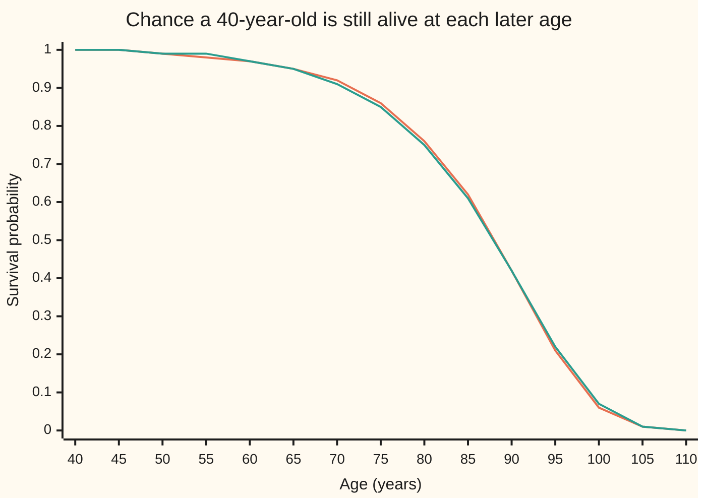
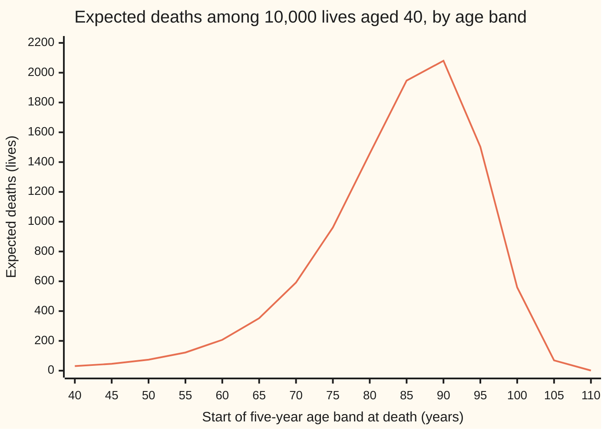

# Life tables: survival by age, and the force of mortality that is a hazard rate by another name

Financial mathematics → Insurance and Actuarial Mathematics → Mortality by age → Life tables

---

## General Overview

A life office sells pensions that start at 65. Today it holds 10,000 policies on people aged exactly 40. Before it can price a single pension, it needs one number: how many of the 10,000 will still be alive in 25 years to collect.

On the mortality basis used on this card, the expected answer is 9,520.98 of them, a chance of 0.9521 for each person. The number comes from a **life table**: a column of ages, and next to each age the number still alive out of a starting group. Divide the count at 65 by the count at 40 and the chance falls out.

Behind every life table sits a rate. At age 40 the death rate among those alive, measured at an instant, runs at about 0.05% a year. By 65 it is 11 times that; by 90 it is 10% a year. Credit markets call that rate a **hazard rate** ([hazard-rate-and-survival-probability](../41-Default%2C%20Survival%20and%20the%20Hazard%20Rate/02-hazard-rate-and-survival-probability.md)). Actuaries met it first, in the 1820s, and call it the **force of mortality**. Benjamin Gompertz noticed that it climbs by a roughly fixed percentage for each year of age. That observation turns a table of a hundred numbers into a formula with two or three.

The card reads a life table, turns it into survival chances and life expectancy, links it to the force of mortality, and fits Gompertz's law to it.

**A life table counts survivors by age; the chance of reaching a later age is the ratio of two counts, which equals e raised to minus the force of mortality added up over the years between, and after about 30 that force grows by a near-fixed percentage each year.**

**What kind of fact this is:** a model. The table is an assumed pattern of deaths for a group, not a law of nature. Inside it, the ratio-of-counts rule and the life-expectancy sums are identities, proved on this card in Why it works.

### The picture: how the 10,000 thin out



Orange: the life table used on this card. Green: a two-number Gompertz curve fitted to that table in Step 4. The two nearly coincide. Survival barely moves for 25 years, then falls fast after 75: this is not a straight line and not the exponential decay of a constant rate.

---

## The formula

Notation first, in words. Actuaries hang the age on the letter as a small subscript on the right: $l_x$ is "the l-number at age x". A count of years ahead goes as a small subscript on the left: ${}_tp_x$ reads "t p x", the chance that someone aged x lives t more years. So ${}_{25}p_{40}$ is the number this card is after.

The life table's columns, for each whole age $x$:

$$l_{x+1} = l_x\,p_x, \qquad d_x = l_x - l_{x+1} = l_x\,q_x, \qquad p_x = 1 - q_x.$$

**Read it aloud:** of the people alive at age x, a fraction p_x reach the next birthday; the rest, d_x of them, die in the year.

Survival over many years, two ways:

$${}_tp_x \;=\; \frac{l_{x+t}}{l_x} \;=\; \exp\!\Big(-\int_0^t \mu_{x+s}\,ds\Big).$$

**Read it aloud:** the chance of lasting t more years is the survivors at the later age over the survivors now, which is also e to the minus the force of mortality piled up over those t years.

The force of mortality is the slope of the log of the survivor count, with its sign turned:

$$\mu_x \;=\; -\frac{1}{l_x}\,\frac{dl_x}{dx} \;=\; -\frac{d}{dx}\ln l_x.$$

Life expectancy, two versions:

$$e_x = \sum_{k=1}^{\infty} {}_kp_x, \qquad \mathring{e}_x = \int_0^{\infty} {}_tp_x\,dt.$$

The first counts only whole years lived (the **curtate** expectation); the second counts fractions of a year too (the **complete** expectation).

Makeham's law, the shape used for this card's table, and Gompertz's law inside it:

$$\mu_x = A + B\,c^{\,x}, \qquad {}_tp_x = \exp\!\Big(-A\,t - \frac{B}{\ln c}\,c^{\,x}\big(c^{\,t}-1\big)\Big).$$

Set $A$ to 0 and it is Gompertz's law.

| Symbol | Plain meaning | In our example | Push it up and the answer… |
| --- | --- | --- | --- |
| $x$ | age now, in whole years | 40 | survival over the next 25 years falls |
| $t$, $n$, $k$, $s$ | years ahead ($t$, $s$ any number; $n$, $k$ whole) | 25 | survival falls |
| $l_x$ | survivors at exact age x, out of a chosen starting count (the **radix**) | 10,000 at 40; 9,520.98 at 65 | a bigger radix scales every count, never a chance |
| $d_x$ | deaths between age x and x + 1 | 56.31 at 65 | — |
| $q_x$ | chance of dying before the next birthday, given alive at x | 0.005915 at 65 | survival falls |
| $p_x$ | chance of reaching the next birthday, 1 − q_x | one minus the above | survival rises |
| ${}_tp_x$ | chance of living t more years, given alive at x | 0.952098 for 40 to 65 | — |
| $\mu_x$ | force of mortality: deaths per year per survivor, at an instant | 0.000510 at 40; 0.005605 at 65 | survival falls |
| $e_x$, $\mathring{e}_x$ | curtate and complete life expectancy, in years | 45.78 and 46.28 at 40 | — |
| $A$ | Makeham's constant: the part of the force that does not age (accidents, infections) | 0.00022 per year | survival falls at every age |
| $B$, $c$ | Gompertz's level and growth factor: the ageing part is $B c^{\,x}$ | 0.0000027 and 1.124 | survival falls, sharply at old ages |
| $E_j$ | the event "alive at age x + j", used in the detailed proof; $E[\,\cdot\,]$ alone means an average | — | — |

The mortality basis is the Standard Ultimate Survival Model from Dickson, Hardy and Waters (Sources): a published teaching table, not any one country's data. With $c = 1.124$, the ageing part of the force grows 12.4% for every year of age.

### When it holds

- **One homogeneous group.** The table assumes everyone of an age faces the same chance. Mix smokers and non-smokers and the table's q_x is an average that fits neither; a group just medically checked for insurance dies less for a few years (**select** mortality).
- **Mortality that depends on age only.** A **period** table freezes one calendar year's death rates at every age. If death rates keep falling, today's 40-year-olds will face lower rates at 80 than today's 80-year-olds, and a period table understates their survival. A **cohort** table follows one birth year and projects the improvement.
- **Gompertz between about 30 and 95.** Below 30 accidents dominate and the force does not grow with age; Makeham's A covers that. Past 95 or so, measured death rates rise more slowly than Gompertz says, so the formula understates survival at the very oldest ages.
- **Deaths independent of one another.** The expected count, 9,520.98, needs no independence; the spread around it does. A pandemic kills many policyholders in the same year and widens that spread far beyond the coin-flip version in the code.

---

## Why it works

### Step 0: reaching 65 is 25 birthdays in a row

Nobody reaches 65 without first reaching 41, then 42, and so on. Each birthday is a hurdle cleared by the people who cleared the one before. So the chance of clearing all 25 is the product of 25 conditional chances: each one counted only among those still in the race ([survival-functions-and-hazards](../../09-Probability%20and%20statistics/13-Survival%2C%20Design%20and%20Causality/01-survival-functions-and-hazards.md)). No independence between years is assumed; the chaining comes from the conditioning.

### Step 1: the table is that product, written as counts

Start the table with $l_{40} = 10{,}000$. Each year's survivors are last year's times that year's survival chance: $l_{x+1} = l_x p_x$. Chain it:

$$l_{65} = l_{40}\,p_{40}\,p_{41}\cdots p_{64}.$$

Divide both sides by $l_{40} = 10{,}000$ and the product of 25 chances is left: ${}_{25}p_{40} = l_{65}/l_{40}$. The radix cancels. Choosing 10,000, or 100,000 as published tables often do, changes every count and no chance.

Here are some rows of this card's table, starting from the 10,000 policyholders.

| age $x$ | $q_x$ | $l_x$ | $d_x$ | $\mu_x$ |
| --- | --- | --- | --- | --- |
| 40 | 0.000527 | 10,000.00 | 5.27 | 0.000510 |
| 50 | 0.001209 | 9,923.30 | 11.99 | 0.001153 |
| 60 | 0.003398 | 9,727.79 | 33.06 | 0.003222 |
| 65 | 0.005915 | 9,520.98 | 56.31 | 0.005605 |
| 80 | 0.032658 | 7,616.12 | 248.73 | 0.031313 |
| 90 | 0.100917 | 4,211.98 | 425.06 | 0.100296 |
| 100 | 0.289584 | 628.98 | 182.14 | 0.322323 |

Counts in the table are not whole people. They are expected values: 5.27 deaths in the year after 40 means that is the average over many offices like this one.

### Step 2: from whole years to the instant

A yearly table answers only yearly questions. Shrink the year to a short stretch of length h. The chance of dying in it, among survivors at x, is $(l_x - l_{x+h})/l_x$. Divide by h and let h shrink: that limit is the force of mortality: the hazard rate from credit, under an actuarial name.

$$\mu_x = \lim_{h\to 0}\frac{l_x - l_{x+h}}{h\,l_x} = -\frac{1}{l_x}\frac{dl_x}{dx} = -\frac{d}{dx}\ln l_x.$$

The last form is the useful one. Integrate the slope of $\ln l$ from $x$ to $x+t$ and the change in $\ln l$ comes back:

$$\ln l_{x+t} - \ln l_x = -\int_0^t \mu_{x+s}\,ds, \qquad\text{so}\qquad {}_tp_x = \exp\!\Big(-\int_0^t \mu_{x+s}\,ds\Big).$$

The table carries the force inside it. A central difference on the log counts estimates it: $(\ln l_{64} - \ln l_{66})/2$ gives 0.005617 per year, against the formula's 0.005605 at 65. The small gap is the curvature of $\ln l$ over two years.

The force $\mu_x$ is a rate, not a chance. At 65 it is 0.005605 per year while the chance of dying before 66 is 0.005915. The chance is larger because the force keeps rising through the year; for one year, $q_x = 1 - \exp(-\int_0^1 \mu_{x+s}\,ds)$.

### Step 3: life expectancy is a sum of survival chances

Call K the number of whole further years a 40-year-old lives. K counts the birthdays reached: it is 1 for each k with "alive at 40 + k" true, added up. The average of a sum is the sum of averages, and the average of a yes-or-no count is its chance. So

$$e_{40} = E[K] = \sum_{k\ge1} {}_kp_{40} = \frac{l_{41} + l_{42} + \cdots}{l_{40}} = 45.78 \text{ years.}$$

A second road averages K directly: K equals k exactly when the death falls between 40 + k and 41 + k, which has chance $d_{40+k}/l_{40}$. Weighting each k by that chance gives 45.78 again, the same to the six decimals printed.

The complete expectation adds the part-year lived in the year of death. Integrating the survival curve gives 46.28 years. Deaths spread evenly across each year would add exactly half a year to the curtate figure; here the gap is half a year to four decimal places, because this table's deaths are close to even within each year.

Where do the deaths fall? Here are the 10,000 policyholders' deaths, grouped by five-year band of age at death.



One line: expected deaths per five-year band, from the table's d_x. Deaths peak in the band 90 to 94, while the average age at death is 86.28: the long thin left tail of early deaths drags the average below the peak.

<details>
<summary>Detailed proof: the two identities</summary>

**Ratio of counts.** For each whole j, write $E_j$ for the event "alive at x + j". The events shrink, $E_{j+1} \subseteq E_j$: being alive later means being alive earlier. The multiplication rule for conditional chances gives $P(E_n \mid E_0) = \prod_{j=0}^{n-1} P(E_{j+1}\mid E_j) = \prod_{j=0}^{n-1} p_{x+j}$. The table's recursion $l_{x+j+1} = l_{x+j}\,p_{x+j}$ telescopes to the same product times $l_x$. Nothing about independence was used.

**Tail sum.** K is a whole number at least 0, and for every outcome $K = \sum_{k\ge1}\mathbf{1}[K \ge k]$, where the bracket is 1 when true and 0 when false. All terms are non-negative, so the expectation passes inside the sum: $E[K] = \sum_{k\ge1} P(K\ge k) = \sum_{k\ge1} {}_kp_x$. For the complete lifetime R, the same move with an integral: $R = \int_0^\infty \mathbf{1}[R > t]\,dt$, so $E[R] = \int_0^\infty {}_tp_x\,dt$. Since $K \le R < K+1$, the complete expectation lies within one year above the curtate one; if deaths are spread evenly within each year, $E[R - K] = 1/2$ exactly.

</details>

### Step 4: Gompertz's law, and fitting it

Gompertz's 1825 idea: the power to resist death wears out by a fixed fraction each year. Then the force grows by a fixed factor c per year of age: $\mu_x = B c^{\,x}$. Take logs and it is a straight line in age: $\ln \mu_x = \ln B + x \ln c$.

The force of mortality at every tenth year, per 1,000 lives per year:

```
age   force of mortality, deaths per 1,000 lives per year (bar scale: log)
 40   ██                                    0.51
 50   ██████                                1.15
 60   ████████████                          3.22
 70   █████████████████                     9.88
 80   ███████████████████████               31.31
 90   ██████████████████████████████        100.30
100   ████████████████████████████████████  322.32
```

The bars are drawn on a log scale, so equal steps mean equal multiples. From 60 on each decade multiplies the force by close to $c^{10}$ = 3.2186, Gompertz's growth per decade. From 40 to 50 it only a little more than doubles: Makeham's constant, 0.22 per 1,000, is 43% of the total at 40 and does not age.

To fit Gompertz to a table, turn each year's survival into its integrated force: $-\ln p_x$ is the force added up across the year from x to x + 1, close to the force at the year's midpoint. Take the log of that, and fit a straight line through the points for ages 40 to 99 by least squares (the line that makes the squared vertical misses smallest). The slope is $\ln c$ and the intercept is $\ln B$.

The fit gives B = 4.646040 × 10^-6 and c = 1.116802. The force doubles every $\ln 2/\ln c$ = 6.27 years. The fitted curve gives ${}_{25}p_{40}$ = 0.949563 against the table's 0.952098: close, as the overview chart shows. The fitted force at 40 is 0.000386 against the table's 0.000510. A pure Gompertz line cannot bend to take in the flat accident term, so it tilts: it lowers c from 1.124 to 1.1168 and raises B to make up. That is why Makeham added A in 1860.

The other road to Gompertz goes through data, not a model: estimate q_x from recorded deaths and the years people were watched, smooth the rough rates (**graduation**), then fit. The fitting step is the same.

---

## Worked numbers, by hand

The 10,000 policyholders aged 40, on Makeham's law with A = 0.00022, B = 0.0000027, c = 1.124. The chance each reaches 65, using the closed form:

| Step | Arithmetic | Value |
| --- | --- | --- |
| $\ln c$ | $\ln 1.124$ | 0.116894 |
| $B/\ln c$ | $0.0000027 / 0.116894$ | 2.309790 × 10^-5 |
| $c^{40}$ | $1.124^{40}$ | 107.3130 |
| $c^{25} - 1$ | $1.124^{25} - 1$ | 17.5848 |
| ageing part of the piled-up force | $2.309790\times10^{-5} \times 107.3130 \times 17.5848$ | 0.043588 |
| accident part | $0.00022 \times 25$ | 0.005500 |
| total force over the 25 years | $0.043588 + 0.005500$ | 0.049088 |
| **chance of reaching 65** | $\exp(-0.049088)$ | **0.952098** |
| expected survivors of 10,000 | $10{,}000 \times 0.952098$ | 9,520.98 |

The table road gives the same number: 9,520.98 alive at 65 out of 10,000 at 40. Of every 10,000 pensions the office writes at 40, it should expect to pay about 9,521.

### What breaks if you drop a piece

Right answers: 0.952098 for 40 to 65; 0.421198 for 40 to 90.

| Mistake | Comes out at | What went wrong |
| --- | --- | --- |
| Add the yearly death chances, 40 to 64, and subtract from 1 | 0.950984 | Each year's chance applies only to those still alive. Close here because deaths are rare |
| Same, 40 to 89 | 0.156461 (right: 0.421198) | Adding counts the already-dead again. Over long spans the error is huge |
| Hold the force at its age-40 level for 25 years | 0.987337 | The force at 65 is 11.00 times the force at 40. Mortality is not a constant rate |
| Drop Makeham's constant A | 0.957349 | Leaves out accidents and illness that strike at any age |
| Quote the curtate expectation, 45.78, as life expectancy | half a year short of 46.28 | Curtate counts whole years only and throws away the year of death |

---

## Code, from first principles, and it actually runs

The code builds the life table from 10,000 lives at 40, integrating the force of mortality year by year with its own Simpson's rule. It reaches the chance of living from 40 to 65 by three independent roads: the closed-form exponent, the table's ratio of counts, and a month-by-month simulation of the 10,000 lives that uses nothing but the definition of the force (each month, a life dies with chance force times one month). Life expectancy comes by two sums, one integral and the simulation. The force at 65 is recovered from the table's log slope. Then Gompertz is fitted by least squares, and every "what breaks" number is reproduced. The random numbers come from a splitmix64 generator written into both programs, so Python and Rust simulate the same 10,000 lives and print identical output.

### Python

```python
# Life tables and the force of mortality -- the check behind the card.  Standard library only.
# Mortality basis: Makeham's law mu(x) = A + B c^x with the Standard Ultimate Survival Model
# parameters.  The 10,000 policyholders aged 40 are the shelf's life office.
from math import exp, log

A, B, C = 0.00022, 2.7e-6, 1.124
X0, N0, TOP = 40, 10000.0, 130                 # start age, radix (lives at 40), last age in the table

def mu(x): return A + B * C ** x               # force of mortality at exact age x, per year

def simpson(f, a, b, n=200):                   # our own integrator; n must be even
    h = (b - a) / n
    s = f(a) + f(b) + sum((4 if i % 2 else 2) * f(a + i * h) for i in range(1, n))
    return s * h / 3.0

def surv_closed(x, t, a=A, b=B, c=C):          # road 1: the exponent integrated by hand
    return exp(-a * t - b / log(c) * c ** x * (c ** t - 1.0))

# road 2: build the life table year by year, integrating mu numerically inside each year
l = {X0: N0}
for x in range(X0, TOP):
    l[x + 1] = l[x] * exp(-simpson(mu, x, x + 1, 20))
p = {x: l[x + 1] / l[x] for x in range(X0, TOP)}
q = {x: 1.0 - p[x] for x in p}
d = {x: l[x] - l[x + 1] for x in p}

# road 3: simulate the 10,000 lives month by month using only the definition of mu
state = 20260928
def rnd():                                     # splitmix64, top 53 bits -> [0, 1)
    global state
    state = (state + 0x9E3779B97F4A7C15) & 0xFFFFFFFFFFFFFFFF
    z = state
    z = ((z ^ (z >> 30)) * 0xBF58476D1CE4E5B9) & 0xFFFFFFFFFFFFFFFF
    z = ((z ^ (z >> 27)) * 0x94D049BB133111EB) & 0xFFFFFFFFFFFFFFFF
    return ((z ^ (z >> 31)) >> 11) * 2.0 ** -53
DT = 1.0 / 12.0
lives = []
for i in range(int(N0)):
    m = 0
    while m < 12 * (TOP - X0) and rnd() >= mu(X0 + (m + 0.5) * DT) * DT:
        m += 1
    lives.append((m + 0.5) * DT)
alive65 = sum(1 for t in lives if t > 25.0)

p25 = surv_closed(40, 25)
print("chance a 40-year-old reaches 65")
print(f"  1 closed form exp(-integral)     {p25:.6f}")
print(f"  2 life table l65 / l40           {l[65] / l[40]:.6f}")
print(f"  3 simulated, of 10,000 at 40     {alive65 / N0:.6f}  ({alive65} lives)")
print(f"  expected survivors of 10,000     {N0 * p25:.2f}")
g = B / log(C) * C ** 40 * (C ** 25 - 1.0)
print(f"  by hand: ln c {log(C):.6f}   B / ln c, times 10^5 {1e5 * B / log(C):.6f}")
print(f"  by hand: c^40 {C ** 40:.4f}   c^25 - 1 {C ** 25 - 1:.4f}")
print(f"  by hand: Gompertz part {g:.6f}   Makeham part {A * 25:.6f}   total {g + A * 25:.6f}")
print("life table, radix 10,000 at age 40")
print("  age      q_x        l_x       d_x     mu_x")
for x in (40, 50, 60, 64, 65, 66, 80, 90, 100):
    print(f"  {x:>3} {q[x]:>10.6f} {l[x]:>10.2f} {d[x]:>9.2f} {mu(x):>8.6f}")
e_curt = sum(l[X0 + k] for k in range(1, TOP - X0 + 1)) / N0
e_curt_d = sum(k * d[X0 + k] for k in range(TOP - X0)) / N0
e_comp = simpson(lambda t: surv_closed(40, t), 0.0, 90.0, 2000)
e_sim = sum(lives) / N0
se_sim = (sum((t - e_sim) ** 2 for t in lives) / (N0 - 1) / N0) ** 0.5
print("life expectancy at 40, years")
print(f"  curtate, sum of l(40+k)/l40      {e_curt:.6f}")
print(f"  curtate, sum of k d(40+k)/l40    {e_curt_d:.6f}")
print(f"  complete, integral of survival   {e_comp:.6f}")
print(f"  curtate + 1/2                    {e_curt + 0.5:.6f}")
print(f"  expected age at death, 40 + e    {40 + e_comp:.6f}")
print(f"  complete, simulated mean         {e_sim:.6f}  (standard error {se_sim:.6f})")
mu65_tab = (log(l[64]) - log(l[66])) / 2.0
print("force of mortality at 65, per year")
print(f"  formula A + B c^65               {mu(65):.6f}")
print(f"  from table (ln l64 - ln l66)/2   {mu65_tab:.6f}")
print(f"  q65 for comparison               {q[65]:.6f}")
print(f"  ratio mu65 / mu40 {mu(65) / mu(40):.2f}   c^10, growth per decade {C ** 10:.4f}")
# Gompertz fit: least squares of ln(-ln p_x) on the year's midpoint, ages 40..99
xs = [x + 0.5 for x in range(40, 100)]
ys = [log(-log(p[x])) for x in range(40, 100)]
mx, my = sum(xs) / len(xs), sum(ys) / len(ys)
slope = sum((u - mx) * (v - my) for u, v in zip(xs, ys)) / sum((u - mx) ** 2 for u in xs)
cg, bg = exp(slope), exp(my - slope * mx)
pg = surv_closed(40, 25, 0.0, bg, cg)
print("Gompertz fit to the table, ages 40 to 99")
print(f"  fitted B, times 10^6 {1e6 * bg:.6f}   fitted c {cg:.6f}")
print(f"  doubling time ln2 / ln c, years  {log(2) / log(cg):.6f}")
print(f"  25p40 under the fit              {pg:.6f}")
print(f"  mu40 fit {bg * cg ** 40:.6f}   table {mu(40):.6f}")
print("what breaks")
print(f"  1 - sum of q, ages 40-64         {1 - sum(q[x] for x in range(40, 65)):.6f}")
print(f"  1 - sum of q, ages 40-89         {1 - sum(q[x] for x in range(40, 90)):.6f}")
print(f"  right: l90 / l40                 {l[90] / l[40]:.6f}")
print(f"  flat hazard at mu40 for 25 years {exp(-25 * mu(40)):.6f}")
print(f"  Gompertz, Makeham constant A = 0 {surv_closed(40, 25, 0.0):.6f}")
ages = list(range(40, 115, 5))
print("chart ages   " + " ".join(f"{a}" for a in ages))
print("chart table  " + " ".join(f"{surv_closed(40, a - 40):.2f}" for a in ages))
print("chart fit    " + " ".join(f"{surv_closed(40, a - 40, 0.0, bg, cg):.2f}" for a in ages))
print("chart deaths " + " ".join(f"{sum(d[a + j] for j in range(5)):.0f}" for a in ages))
print("bars mu per 1,000 at 40..100 by 10  " + " ".join(f"{1000 * mu(a):.2f}" for a in range(40, 101, 10)))
print("try changing")
print(f"  c = 1.10: 25p40                  {surv_closed(40, 25, A, B, 1.10):.6f}")
print(f"  from 60 to 85: 25p60             {surv_closed(60, 25):.6f}")
print(f"  A doubled to 0.00044: 25p40      {surv_closed(40, 25, 2 * A):.6f}")

assert abs(l[65] / l[40] - p25) < 1e-10                                # table vs closed form
assert abs(alive65 / N0 - p25) < 4.0 * (p25 * (1 - p25) / N0) ** 0.5   # simulation within 4 sd
assert abs(e_curt - e_curt_d) < 1e-8                                   # two curtate sums agree
assert abs(e_comp - e_curt - 0.5) < 0.01                                # complete is curtate + 1/2
assert abs(e_sim - e_comp) < 4.0 * se_sim                              # simulated mean near complete
assert abs(mu65_tab - mu(65)) < 1e-4                                   # slope of ln l is mu
assert abs(pg - p25) < 0.01                                            # the fit lands near
assert abs(log(cg) - log(C)) < 0.01                                    # and recovers the ageing rate
print("all checks passed")
```

**Ran 2026-09-28 on macOS, Python 3.14.6, standard library only. All checks passed. Output, pasted from the run:**

```
chance a 40-year-old reaches 65
  1 closed form exp(-integral)     0.952098
  2 life table l65 / l40           0.952098
  3 simulated, of 10,000 at 40     0.952700  (9527 lives)
  expected survivors of 10,000     9520.98
  by hand: ln c 0.116894   B / ln c, times 10^5 2.309790
  by hand: c^40 107.3130   c^25 - 1 17.5848
  by hand: Gompertz part 0.043588   Makeham part 0.005500   total 0.049088
life table, radix 10,000 at age 40
  age      q_x        l_x       d_x     mu_x
   40   0.000527   10000.00      5.27 0.000510
   50   0.001209    9923.30     11.99 0.001153
   60   0.003398    9727.79     33.06 0.003222
   64   0.005288    9571.59     50.61 0.005011
   65   0.005915    9520.98     56.31 0.005605
   66   0.006619    9464.66     62.64 0.006273
   80   0.032658    7616.12    248.73 0.031313
   90   0.100917    4211.98    425.06 0.100296
  100   0.289584     628.98    182.14 0.322323
life expectancy at 40, years
  curtate, sum of l(40+k)/l40      45.777665
  curtate, sum of k d(40+k)/l40    45.777665
  complete, integral of survival   46.277622
  curtate + 1/2                    46.277665
  expected age at death, 40 + e    86.277622
  complete, simulated mean         46.171867  (standard error 0.107895)
force of mortality at 65, per year
  formula A + B c^65               0.005605
  from table (ln l64 - ln l66)/2   0.005617
  q65 for comparison               0.005915
  ratio mu65 / mu40 11.00   c^10, growth per decade 3.2186
Gompertz fit to the table, ages 40 to 99
  fitted B, times 10^6 4.646040   fitted c 1.116802
  doubling time ln2 / ln c, years  6.274592
  25p40 under the fit              0.949563
  mu40 fit 0.000386   table 0.000510
what breaks
  1 - sum of q, ages 40-64         0.950984
  1 - sum of q, ages 40-89         0.156461
  right: l90 / l40                 0.421198
  flat hazard at mu40 for 25 years 0.987337
  Gompertz, Makeham constant A = 0 0.957349
chart ages   40 45 50 55 60 65 70 75 80 85 90 95 100 105 110
chart table  1.00 1.00 0.99 0.98 0.97 0.95 0.92 0.86 0.76 0.62 0.42 0.21 0.06 0.01 0.00
chart fit    1.00 1.00 0.99 0.99 0.97 0.95 0.91 0.85 0.75 0.61 0.42 0.22 0.07 0.01 0.00
chart deaths 31 46 74 122 207 352 592 961 1457 1947 2080 1503 559 69 1
bars mu per 1,000 at 40..100 by 10  0.51 1.15 3.22 9.88 31.31 100.30 322.32
try changing
  c = 1.10: 25p40                  0.982054
  from 60 to 85: 25p60             0.633160
  A doubled to 0.00044: 25p40      0.946876
all checks passed
```

### Rust

```rust
// Life tables and the force of mortality -- the check behind the card.  Rust std only.
// Mortality basis: Makeham's law mu(x) = A + B c^x with the Standard Ultimate Survival Model
// parameters.  The 10,000 policyholders aged 40 are the shelf's life office.
const A: f64 = 0.00022;
const B: f64 = 2.7e-6;
const C: f64 = 1.124;
const X0: usize = 40;
const N0: f64 = 10000.0;
const TOP: usize = 130;

fn mu(x: f64) -> f64 { A + B * C.powf(x) }

fn simpson<F: Fn(f64) -> f64>(f: F, a: f64, b: f64, n: usize) -> f64 {
    let h = (b - a) / n as f64;
    let mut s = f(a) + f(b);
    for i in 1..n { s += if i % 2 == 1 { 4.0 } else { 2.0 } * f(a + i as f64 * h); }
    s * h / 3.0
}

fn surv(x: f64, t: f64, a: f64, b: f64, c: f64) -> f64 {   // road 1: exponent integrated by hand
    (-a * t - b / c.ln() * c.powf(x) * (c.powf(t) - 1.0)).exp()
}

struct Rng(u64);
impl Rng {
    fn next(&mut self) -> f64 {                               // splitmix64, top 53 bits -> [0, 1)
        self.0 = self.0.wrapping_add(0x9E3779B97F4A7C15);
        let mut z = self.0;
        z = (z ^ (z >> 30)).wrapping_mul(0xBF58476D1CE4E5B9);
        z = (z ^ (z >> 27)).wrapping_mul(0x94D049BB133111EB);
        ((z ^ (z >> 31)) >> 11) as f64 * 2f64.powi(-53)
    }
}

fn main() {
    // road 2: the life table, year by year, integrating mu numerically inside each year
    let mut l = vec![0.0f64; TOP + 1];
    l[X0] = N0;
    for x in X0..TOP { l[x + 1] = l[x] * (-simpson(mu, x as f64, x as f64 + 1.0, 20)).exp(); }
    let p = |x: usize| l[x + 1] / l[x];
    let q = |x: usize| 1.0 - p(x);
    let d = |x: usize| l[x] - l[x + 1];

    // road 3: simulate the 10,000 lives month by month using only the definition of mu
    let mut rng = Rng(20260928);
    let dt = 1.0 / 12.0;
    let mut lives = Vec::new();
    for _ in 0..N0 as usize {
        let mut m = 0usize;
        while m < 12 * (TOP - X0) && rng.next() >= mu(X0 as f64 + (m as f64 + 0.5) * dt) * dt { m += 1; }
        lives.push((m as f64 + 0.5) * dt);
    }
    let alive65 = lives.iter().filter(|&&t| t > 25.0).count();

    let p25 = surv(40.0, 25.0, A, B, C);
    println!("chance a 40-year-old reaches 65");
    println!("  1 closed form exp(-integral)     {:.6}", p25);
    println!("  2 life table l65 / l40           {:.6}", l[65] / l[40]);
    println!("  3 simulated, of 10,000 at 40     {:.6}  ({} lives)", alive65 as f64 / N0, alive65);
    println!("  expected survivors of 10,000     {:.2}", N0 * p25);
    let g = B / C.ln() * C.powf(40.0) * (C.powf(25.0) - 1.0);
    println!("  by hand: ln c {:.6}   B / ln c, times 10^5 {:.6}", C.ln(), 1e5 * B / C.ln());
    println!("  by hand: c^40 {:.4}   c^25 - 1 {:.4}", C.powf(40.0), C.powf(25.0) - 1.0);
    println!("  by hand: Gompertz part {:.6}   Makeham part {:.6}   total {:.6}", g, A * 25.0, g + A * 25.0);
    println!("life table, radix 10,000 at age 40");
    println!("  age      q_x        l_x       d_x     mu_x");
    for x in [40usize, 50, 60, 64, 65, 66, 80, 90, 100] {
        println!("  {:>3} {:>10.6} {:>10.2} {:>9.2} {:>8.6}", x, q(x), l[x], d(x), mu(x as f64));
    }
    let e_curt: f64 = (1..=TOP - X0).map(|k| l[X0 + k]).sum::<f64>() / N0;
    let e_curt_d: f64 = (0..TOP - X0).map(|k| k as f64 * d(X0 + k)).sum::<f64>() / N0;
    let e_comp = simpson(|t| surv(40.0, t, A, B, C), 0.0, 90.0, 2000);
    let e_sim: f64 = lives.iter().sum::<f64>() / N0;
    let se_sim = (lives.iter().map(|t| (t - e_sim).powi(2)).sum::<f64>() / (N0 - 1.0) / N0).sqrt();
    println!("life expectancy at 40, years");
    println!("  curtate, sum of l(40+k)/l40      {:.6}", e_curt);
    println!("  curtate, sum of k d(40+k)/l40    {:.6}", e_curt_d);
    println!("  complete, integral of survival   {:.6}", e_comp);
    println!("  curtate + 1/2                    {:.6}", e_curt + 0.5);
    println!("  expected age at death, 40 + e    {:.6}", 40.0 + e_comp);
    println!("  complete, simulated mean         {:.6}  (standard error {:.6})", e_sim, se_sim);
    let mu65_tab = (l[64].ln() - l[66].ln()) / 2.0;
    println!("force of mortality at 65, per year");
    println!("  formula A + B c^65               {:.6}", mu(65.0));
    println!("  from table (ln l64 - ln l66)/2   {:.6}", mu65_tab);
    println!("  q65 for comparison               {:.6}", q(65));
    println!("  ratio mu65 / mu40 {:.2}   c^10, growth per decade {:.4}", mu(65.0) / mu(40.0), C.powi(10));
    // Gompertz fit: least squares of ln(-ln p_x) on the year's midpoint, ages 40..99
    let xs: Vec<f64> = (40..100).map(|x| x as f64 + 0.5).collect();
    let ys: Vec<f64> = (40..100usize).map(|x| (-p(x).ln()).ln()).collect();
    let n = xs.len() as f64;
    let (mx, my) = (xs.iter().sum::<f64>() / n, ys.iter().sum::<f64>() / n);
    let num: f64 = xs.iter().zip(&ys).map(|(u, v)| (u - mx) * (v - my)).sum();
    let den: f64 = xs.iter().map(|u| (u - mx).powi(2)).sum();
    let slope = num / den;
    let (cg, bg) = (slope.exp(), (my - slope * mx).exp());
    let pg = surv(40.0, 25.0, 0.0, bg, cg);
    println!("Gompertz fit to the table, ages 40 to 99");
    println!("  fitted B, times 10^6 {:.6}   fitted c {:.6}", 1e6 * bg, cg);
    println!("  doubling time ln2 / ln c, years  {:.6}", 2f64.ln() / cg.ln());
    println!("  25p40 under the fit              {:.6}", pg);
    println!("  mu40 fit {:.6}   table {:.6}", bg * cg.powf(40.0), mu(40.0));
    println!("what breaks");
    println!("  1 - sum of q, ages 40-64         {:.6}", 1.0 - (40..65).map(|x| q(x)).sum::<f64>());
    println!("  1 - sum of q, ages 40-89         {:.6}", 1.0 - (40..90).map(|x| q(x)).sum::<f64>());
    println!("  right: l90 / l40                 {:.6}", l[90] / l[40]);
    println!("  flat hazard at mu40 for 25 years {:.6}", (-25.0 * mu(40.0)).exp());
    println!("  Gompertz, Makeham constant A = 0 {:.6}", surv(40.0, 25.0, 0.0, B, C));
    let ages: Vec<usize> = (40..115).step_by(5).collect();
    let row = |f: &dyn Fn(usize) -> String| ages.iter().map(|&a| f(a)).collect::<Vec<_>>().join(" ");
    println!("chart ages   {}", row(&|a| format!("{}", a)));
    println!("chart table  {}", row(&|a| format!("{:.2}", surv(40.0, a as f64 - 40.0, A, B, C))));
    println!("chart fit    {}", row(&|a| format!("{:.2}", surv(40.0, a as f64 - 40.0, 0.0, bg, cg))));
    println!("chart deaths {}", row(&|a| format!("{:.0}", (0..5).map(|j| d(a + j)).sum::<f64>())));
    let bars: Vec<String> = (40..101).step_by(10).map(|a| format!("{:.2}", 1000.0 * mu(a as f64))).collect();
    println!("bars mu per 1,000 at 40..100 by 10  {}", bars.join(" "));
    println!("try changing");
    println!("  c = 1.10: 25p40                  {:.6}", surv(40.0, 25.0, A, B, 1.10));
    println!("  from 60 to 85: 25p60             {:.6}", surv(60.0, 25.0, A, B, C));
    println!("  A doubled to 0.00044: 25p40      {:.6}", surv(40.0, 25.0, 2.0 * A, B, C));

    assert!((l[65] / l[40] - p25).abs() < 1e-10);                                // table vs closed form
    assert!((alive65 as f64 / N0 - p25).abs() < 4.0 * (p25 * (1.0 - p25) / N0).sqrt()); // simulation
    assert!((e_curt - e_curt_d).abs() < 1e-8);                                   // two curtate sums
    assert!((e_comp - e_curt - 0.5).abs() < 0.01);                               // complete = curtate + 1/2
    assert!((e_sim - e_comp).abs() < 4.0 * se_sim);                              // simulated mean
    assert!((mu65_tab - mu(65.0)).abs() < 1e-4);                                 // slope of ln l is mu
    assert!((pg - p25).abs() < 0.01);                                            // the fit lands near
    assert!((cg.ln() - C.ln()).abs() < 0.01);                                    // and recovers c
    println!("all checks passed");
}
```

**Ran 2026-09-28 on macOS, rustc 1.98.1, no crates. All checks passed. Output, pasted from the run:**

```
chance a 40-year-old reaches 65
  1 closed form exp(-integral)     0.952098
  2 life table l65 / l40           0.952098
  3 simulated, of 10,000 at 40     0.952700  (9527 lives)
  expected survivors of 10,000     9520.98
  by hand: ln c 0.116894   B / ln c, times 10^5 2.309790
  by hand: c^40 107.3130   c^25 - 1 17.5848
  by hand: Gompertz part 0.043588   Makeham part 0.005500   total 0.049088
life table, radix 10,000 at age 40
  age      q_x        l_x       d_x     mu_x
   40   0.000527   10000.00      5.27 0.000510
   50   0.001209    9923.30     11.99 0.001153
   60   0.003398    9727.79     33.06 0.003222
   64   0.005288    9571.59     50.61 0.005011
   65   0.005915    9520.98     56.31 0.005605
   66   0.006619    9464.66     62.64 0.006273
   80   0.032658    7616.12    248.73 0.031313
   90   0.100917    4211.98    425.06 0.100296
  100   0.289584     628.98    182.14 0.322323
life expectancy at 40, years
  curtate, sum of l(40+k)/l40      45.777665
  curtate, sum of k d(40+k)/l40    45.777665
  complete, integral of survival   46.277622
  curtate + 1/2                    46.277665
  expected age at death, 40 + e    86.277622
  complete, simulated mean         46.171867  (standard error 0.107895)
force of mortality at 65, per year
  formula A + B c^65               0.005605
  from table (ln l64 - ln l66)/2   0.005617
  q65 for comparison               0.005915
  ratio mu65 / mu40 11.00   c^10, growth per decade 3.2186
Gompertz fit to the table, ages 40 to 99
  fitted B, times 10^6 4.646040   fitted c 1.116802
  doubling time ln2 / ln c, years  6.274592
  25p40 under the fit              0.949563
  mu40 fit 0.000386   table 0.000510
what breaks
  1 - sum of q, ages 40-64         0.950984
  1 - sum of q, ages 40-89         0.156461
  right: l90 / l40                 0.421198
  flat hazard at mu40 for 25 years 0.987337
  Gompertz, Makeham constant A = 0 0.957349
chart ages   40 45 50 55 60 65 70 75 80 85 90 95 100 105 110
chart table  1.00 1.00 0.99 0.98 0.97 0.95 0.92 0.86 0.76 0.62 0.42 0.21 0.06 0.01 0.00
chart fit    1.00 1.00 0.99 0.99 0.97 0.95 0.91 0.85 0.75 0.61 0.42 0.22 0.07 0.01 0.00
chart deaths 31 46 74 122 207 352 592 961 1457 1947 2080 1503 559 69 1
bars mu per 1,000 at 40..100 by 10  0.51 1.15 3.22 9.88 31.31 100.30 322.32
try changing
  c = 1.10: 25p40                  0.982054
  from 60 to 85: 25p60             0.633160
  A doubled to 0.00044: 25p40      0.946876
all checks passed
```

> [!TIP]
> **Try changing**
> Guess the direction first. Then run it.
> - **Slow the ageing.** Set `c = 1.10` in the try-changing line. The chance of reaching 65 rises from 0.952098 to **0.982054**. At c = 1.10, $c^{40}$ is 45.26 instead of 107.31, so the ageing part is far smaller.
> - **Start at 60 instead.** The chance a 60-year-old reaches 85 is **0.633160**. The same 25 years, over a third of the group gone: the force at 60 is already 0.003222 a year, against 0.000510 at 40.
> - **Double the accident term.** Set A to 0.00044. The chance falls to **0.946876**. The flat term, small as it looks, is about a tenth of the whole 25-year force at these ages.
> - **Change the seed.** Set `state` to another number. The simulated count of 65-year-olds moves by a few lives either side of 9,520.98; the closed form and the table do not move at all.

---

## The usual mistake

> [!warning]
> **Reading life expectancy as the age people die.** A complete expectation of 46.28 at 40 means the average age at death for this group is 86.28. Most deaths do not happen there: the busiest band is 90 to 94, and deaths spread from the 40s to past 105. A pension paid from 65 lasts well beyond the average for some and not at all for others; pricing it by the average lifetime misprices it (see [life-annuities-and-insurance-values](02-life-annuities-and-insurance-values.md)).
>
> Smaller traps:
> - **Adding the q's.** One minus the sum of the yearly death chances from 40 to 89 gives 0.156461; the right survival is 0.421198. Multiply survival chances, never add death chances.
> - **Treating the force as a chance.** At 65 the force is 0.005605 per year and the one-year death chance is 0.005915. They are close when both are small and part company at old ages: at 100 the force is 0.322323 per year and q is 0.289584.
> - **Forgetting the condition.** ${}_{25}p_{40}$ is a chance for someone already alive at 40. The chance a newborn reaches 65 is a different, smaller number, from a different ratio of the same column.
> - **Using a period table as a forecast.** A period table assumes today's death rates hold for the rest of each life. With improving mortality, that understates how long today's 40-year-olds will draw a pension.

---

## Where you meet it in real life

- **Pensions and annuities.** Every payment a pension makes at age 65 + k is weighted by ${}_{25+k}p_{40}$ before it is discounted. [life-annuities-and-insurance-values](02-life-annuities-and-insurance-values.md) builds those values.
- **Life insurance premiums and reserves.** Term insurance pays on death, so it uses the deaths column; the premium and the money held back for later years come from the same table: [premiums-and-reserves](03-premiums-and-reserves.md).
- **National statistics.** Official offices, such as the US National Center for Health Statistics, publish annual period life tables with exactly these columns: q_x, l_x, d_x and life expectancy.
- **Longevity risk.** Pension funds and insurers watch the force of mortality fall year by year. A few percent less mortality at every age adds months of pension to every member.
- **Credit.** The same mathematics, with default in place of death: a bond's survival curve is built from a hazard rate exactly as the table is built from the force of mortality.
- **Reliability engineering.** The failure rate of a machine part is the same object again. Wear-out failures often rise like Gompertz's curve.

> **Say it back**
> A life table lists, age by age, how many of a starting group are still alive. The chance of reaching a later age is the later count over the earlier count, because survival is a chain of one-year hurdles. The force of mortality is the instant death rate among survivors, and survival is e to the minus that rate added up over the years. Life expectancy is the sum, or the integral, of the survival chances. After about 30 the force grows by a near-fixed percentage per year, which is Gompertz's law; Makeham adds a flat term for accidents.

---

## What this builds on

- [hazard-rate-and-survival-probability](../41-Default%2C%20Survival%20and%20the%20Hazard%20Rate/02-hazard-rate-and-survival-probability.md): the hazard rate and the proof that survival is e to the minus its area. The force of mortality is that hazard with death in place of default.
- [survival-functions-and-hazards](../../09-Probability%20and%20statistics/13-Survival%2C%20Design%20and%20Causality/01-survival-functions-and-hazards.md): survival functions, conditional survival and the density-hazard link in general, from which the life table is one discrete case.

## Where this goes next

- [life-annuities-and-insurance-values](02-life-annuities-and-insurance-values.md): combines the survival chances ${}_tp_x$ with discounting to value a pension or a life policy today.

The table says who will be alive to be paid; it does not say what a promise to pay them is worth today, and that is the question the annuity and insurance values answer.

---

## Sources

Verified 2026-09-28: every link below resolves to the publisher's page.

- Gompertz, Benjamin. "On the Nature of the Function Expressive of the Law of Human Mortality, and on a New Mode of Determining the Value of Life Contingencies." *Philosophical Transactions of the Royal Society of London* 115 (1825). [doi:10.1098/rstl.1825.0026](https://doi.org/10.1098/rstl.1825.0026). The force of mortality growing geometrically with age.
- Makeham, William Matthew. "On the Law of Mortality and the Construction of Annuity Tables." *Journal of the Institute of Actuaries* 8, no. 6 (1860): 301–310. [doi:10.1017/S204616580000126X](https://doi.org/10.1017/S204616580000126X). Adds the constant term A.
- Dickson, David C. M., Mary R. Hardy, and Howard R. Waters. *Actuarial Mathematics for Life Contingent Risks*, 3rd ed. Cambridge University Press, 2020. [Publisher page](https://www.cambridge.org/highereducation/books/actuarial-mathematics-for-life-contingent-risks/281DA4E8D523A6B23280ADC3D165AFDA). Survival models, life tables and the Standard Ultimate Survival Model whose parameters this card uses.
- National Center for Health Statistics. *United States Life Tables, 2023*. National Vital Statistics Reports 74, no. 6 (2025). [PDF](https://www.cdc.gov/nchs/data/nvsr/nvsr74/nvsr74-06.pdf). A real period life table, with its columns explained.
