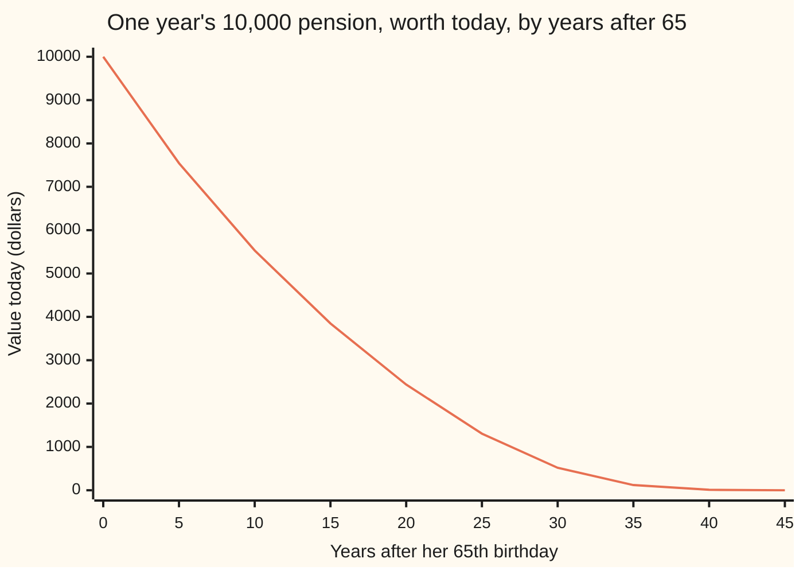
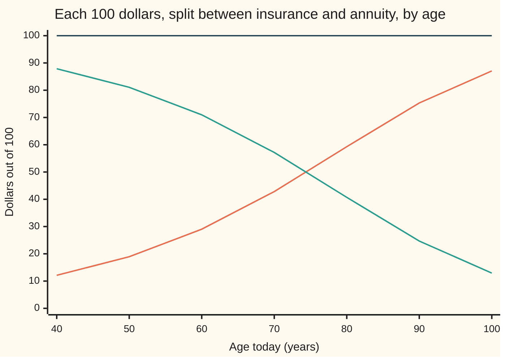

# Life annuities and insurance: paying while alive, paying at death, and the relation between them

[Syllabus](../../../SYLLABUS.md) → [Financial mathematics](../README.md) → [Insurance and Actuarial Mathematics](../README.md#s51) → Life annuities and insurance

---

## General Overview

A pension fund promises a retiree 10,000 dollars on her 65th birthday and on every birthday after that, for as long as she lives. She turns 65 today. The fund must set money aside now, and it has to know how much.

A bank loan would be easy. Its payments are certain and stop on a fixed date, so each one is discounted and the discounts are added ([Annuities](../01-Money%2C%20Dates%20and%20Discounting/03-annuities-and-loans.md)). The pension is different. Each payment happens only if she is alive on that birthday. So each one gets two reductions: one for waiting, one for the chance she is not there to collect it. Add up every birthday reduced both ways and the answer, on a standard life table and 5 percent interest, is 135,497.90 dollars.

A payment stream that lasts as long as a life is a **life annuity**, the term used from here on. Its mirror image is **whole-life insurance**: one payment, made when the life ends, whenever that is. The annuity pays for living, the insurance pays for dying, and between them they account for every year of the same life. That is why one number fixes the other: on the same table and interest, a death benefit of 100,000 dollars for her is worth 35,477.19 dollars today, and that figure falls straight out of the pension's 135,497.90.

**Price each payment as its discounted amount times the chance it is made, add them up, and the two values that result, one for paying while alive and one for paying at death, always sum to a single dollar once the annuity is scaled by the interest paid in advance.**

**What kind of fact this is:** the two values are definitions (expected discounted payments on a stated life table and interest rate); the identity joining them is a theorem, proved on this card in Why it works. The life table itself is a model, an assumption about how a group of people will die, not a law.

### The picture: what each birthday is worth today

Each point is one year's 10,000 dollars, discounted for waiting and weighted by the chance she is alive to collect it. The pension's value is the sum of all of them.



The single line is the value today of the payment due that many years after 65. The first is certain and undiscounted: 10,000.00. By year 20, age 85, interest and death together cut it to 2,438.15. Past age 100 almost nothing is left, so a table that stops at 130 loses nothing that shows.

---

## The formula

Notation first, in words. A life's age today is $x$. The chance that a life aged $x$ is still alive $k$ years later is written ${}_kp_x$, read "k-p-x", from the life-table card. The chance that someone alive at age $x+k$ dies before the next birthday is $q_{x+k}$. The yearly interest rate is $i$. Money due in one year is worth $v = 1/(1+i)$ today, so money due in $k$ years is worth $v^k$. Interest paid at the start of a year instead of the end is $d = i/(1+i)$, the **discount rate**: 1 dollar borrowed for a year costs $d$ up front.

The value of the pension per dollar of payment, first payment today, is the **life annuity-due**, written $\ddot a_x$ ("a-double-dot-x"; "due" means each payment falls at the start of its year):

$$\ddot a_x \;=\; \sum_{k=0}^{\infty} v^k\,{}_kp_x$$

**Read it aloud:** for every birthday from today on, the discount factor for that birthday times the chance of being alive on it, all added up.

The value of 1 dollar paid at the end of the year of death is the **whole-life insurance** value $A_x$:

$$A_x \;=\; \sum_{k=0}^{\infty} v^{k+1}\,{}_kp_x\,q_{x+k}$$

**Read it aloud:** for every year, the chance of surviving to its start and then dying inside it, times the discount to its end, all added up.

The relation between them:

$$A_x \;+\; d\,\ddot a_x \;=\; 1$$

**Read it aloud:** the insurance value plus the discount rate times the annuity value is exactly one dollar.

| Symbol | Plain meaning | In our example | Push it up and the answer… |
| --- | --- | --- | --- |
| $x$ | age today, in years | 65 | annuity falls, insurance rises: fewer birthdays, death nearer |
| $k$, $K$, $T$ | $k$ counts years from today; $T$ is the exact time she lives past $x$, unknown in advance; $K$ is $T$ rounded down to whole years | $k$ = 0, 1, 2, …; $K$ averages 22.24 | a longer life lifts the annuity |
| $i$, $\delta$ | yearly interest rate; the same rate compounded continuously, $\delta = \ln(1+i)$ | 5%; 0.048790 | both values fall: later money is worth less |
| $v$ | discount factor for one year, $1/(1+i)$ | 0.952381 | both values rise |
| $d$ | discount rate, interest paid in advance, $i/(1+i)$ | 0.047619 | the annuity falls |
| ${}_kp_x$ | chance a life aged $x$ is alive $k$ years later | 0.994085 for one year at 65 | annuity rises, insurance falls |
| $q_{x+k}$ | chance of dying within the year after age $x+k$ | 0.005915 at age 65 | insurance rises |
| $\mu$ | force of mortality: the death rate per year at one instant, $\mu(y) = 0.00022 + 0.0000027 \times 1.124^y$ at age y | 0.00022 + a term that grows 12.4% a year | annuity falls |
| $\ddot a_x$ | life annuity-due: value of 1 a year, first payment today, while alive | 13.549790 | — |
| $A_x$ | whole-life insurance: value of 1 at the end of the year of death | 0.354772 | — |
| $\bar A_x$ | the same insurance paid at the moment of death | 0.363520 | — |
| $Y$, $Z$ | what one life actually yields: $Y$ the annuity's payments, discounted; $Z = v^{K+1}$ the insurance payment, discounted | differ for every life | — |

The mortality in the example is **Makeham's law**: a constant background death rate plus a term that grows by a fixed percentage with each year of age. The constants above are those of the Standard Ultimate Life Table used in actuarial teaching, and the code reproduces that table's published 5 percent values, 13.5498 and 0.35477.

### When it holds

- **The life table fits the people.** The values are averages over the table. If the ageing term of mortality were twice as strong, the annuity would be 11.703588 per dollar, not 13.549790. Pensioners who outlive the table cost the fund money.
- **Interest is one fixed, known rate.** With a curve of rates, each $v^k$ becomes that date's discount factor $D(k)$ and the sums still work, but the identity in this form needs one flat $d$. At 3 percent the same annuity is worth 16.439658.
- **Payments fall on birthdays; the death benefit at the end of the year of death.** Paying at the moment of death is a different contract, worth 0.363520 per dollar here, not 0.354772.
- **Interest is positive.** At zero interest $d = 0$ and the insurance is worth exactly 1, so the identity reads 1 = 1 and says nothing about the annuity.

---

## Why it works

### Step 0: price each payment on its own, then add

A payment of 10,000 dollars due in five years, made only if she is alive then, is a small bet. Its value today is the amount, times the discount for five years, times the chance of being alive. Averages add: the average of a sum is the sum of the averages, whether or not the payments depend on each other. So a stream of uncertain payments is priced one payment at a time. The average of a random discounted amount is called its **actuarial present value**, the term used from here on.

Everything below is that one move, applied twice, and then a line of algebra that connects the two results.

### Step 1: the annuity is a sum over birthdays alive

Follow one life. If she lives $K$ more whole years, she collects on today's birthday and on $K$ more, so her payments discounted to today are

$$Y = 1 + v + v^2 + \dots + v^K.$$

Write $Y$ as a sum over every birthday $k$, each term $v^k$ switched on if she is alive at $x+k$ and off if not. The switch for birthday $k$ is on with probability ${}_kp_x$. Averaging term by term gives $\ddot a_x = \sum_k v^k\,{}_kp_x$, the first formula. For her, that sum is 13.549790, so the pension is worth 135,497.90 dollars.

### Step 2: the insurance is a sum over years of death

The same life pays the insurance once, at the end of year $K+1$, so its discounted value is $Z = v^{K+1}$. She dies in year $k+1$ exactly when she survives to age $x+k$ and then dies within the year. That has probability ${}_kp_x\,q_{x+k}$. Averaging over the possible death years gives $A_x = \sum_k v^{k+1}\,{}_kp_x\,q_{x+k}$, the second formula. For her it is 0.354772: a 100,000-dollar death benefit is worth 35,477.19 dollars.

Step 1 used only survival to birthdays. Step 2 used only the year of death. Neither borrowed from the other.

### Step 3: one life, one dollar, split two ways

Put 1 dollar in the bank today and ask what it can pay for. Each year it earns interest; taken at the start of the year, that interest is $d$. Take $d$ on every birthday while she is alive. When she dies, take back the dollar itself at the end of that year. The account runs to exactly zero. So, for every possible lifetime,

$$d\,Y + Z \;=\; d\,(1 + v + \dots + v^K) + v^{K+1} \;=\; 1.$$

The algebra is the finite geometric sum from the annuities card: $(1-v)(1 + v + \dots + v^K) = 1 - v^{K+1}$, and $1 - v = d$. Averaging both sides over all possible lives gives

$$A_x + d\,\ddot a_x = 1.$$

For her: 1 − 0.047619 × 13.549790 = 0.354772, the same number Step 2 reached from the years of death alone. The simulation in the code checks the pathwise version on each of 100,000 simulated lives.

A toy basis makes it checkable by hand. Suppose 90 percent of the living survive every year, forever. Then ${}_kp_x = 0.9^k$ and $0.9\,v = 0.9/1.05 = 6/7$. The annuity is a geometric series, $1/(1 - 6/7) = 7$. The insurance is $0.1\,v \times 7 = (2/21) \times 7 = 2/3$. And $2/3 + (1/21) \times 7 = 1$.



The rising line is 100 times the insurance value $A_x$. The falling line is 100 times $d\,\ddot a_x$, the annuity's share. The flat line is their sum, 100 at every age. At 40 death is far off and cheap to insure; at 100 it is near, and the annuity has little left to pay.

<details>
<summary>Detailed proof: the two sums and the identity</summary>

Let $K$ be the whole years lived past $x$, and assume the life ends with certainty, so the death-year probabilities ${}_kp_x\,q_{x+k}$ add to 1. For $0 < v < 1$ every quantity is bounded: $1 \le Y \le 1/d$ and $0 < Z \le v$.

**Annuity.** $Y = \sum_{k \ge 0} v^k\,\mathbf 1\{K \ge k\}$, where $\mathbf 1\{\cdot\}$ is 1 when the event happens and 0 otherwise. The terms are not negative, so the average of the infinite sum is the sum of the averages (monotone convergence). The average of $\mathbf 1\{K \ge k\}$ is the chance of being alive at $x+k$, which is ${}_kp_x$. So $\ddot a_x = \sum_k v^k\,{}_kp_x$.

**Insurance.** The events $\{K = k\}$ for $k = 0, 1, 2, \dots$ do not overlap and cover every outcome. $P(K = k) = {}_kp_x\,q_{x+k}$ by the chain rule of conditional chances (survive to $x+k$, then die within a year). So $A_x = \sum_k v^{k+1}\,{}_kp_x\,q_{x+k}$.

**Identity.** For every whole number $K$, $(1 - v)\sum_{j=0}^{K} v^j = 1 - v^{K+1}$: multiply out and all middle terms cancel. With $d = 1 - v$ this is $dY + Z = 1$ on every outcome. Both $Y$ and $Z$ are bounded, so averaging is legitimate and gives $A_x + d\,\ddot a_x = 1$. No independence between years was used, and no particular mortality law.

**Boundaries.** At $i = 0$, $v = 1$ and $d = 0$: the insurance is worth 1 and the annuity is the expected number of payments, which the identity cannot recover. For a fixed term the same cancellation gives term insurance plus a payment to survivors at the term's end plus $d$ times the annuity for the term equal to 1; dropping the survivors' payment breaks it.

</details>

### Step 4: a second road, one year at a time

Stand at age $x$. The annuity pays 1 now; then, with chance ${}_1p_x$, she reaches $x+1$ holding an annuity worth $\ddot a_{x+1}$ one year from now. So $\ddot a_x = 1 + v\,{}_1p_x\,\ddot a_{x+1}$. The insurance pays $v$ if she dies this year, otherwise it rolls on: $A_x = v\,q_x + v\,{}_1p_x\,A_{x+1}$. Starting from age 130, where nothing is left, and stepping back to 65 reproduces 13.549790 and 0.354772 without ever forming the long sums. This recursion is how reserves are computed year by year ([Premiums and reserves](03-premiums-and-reserves.md)).

### Step 5: a pension bought young

A 40-year-old buying the same pension, first payment at 65, needs the 65-year-old's value brought back 25 years. Two reductions again: discount $v^{25}$ and the chance of reaching 65, ${}_{25}p_{40}$ = 0.952098. Together they make 0.281157, so the deferred pension costs 0.281157 × 135,497.90 = 38,096.20 dollars. The code gets the same figure by summing the birthdays from 65 on, seen from 40.

<details>
<summary>Paying at the moment of death</summary>

Most real policies pay within weeks of death, not at the end of the year. Discounting from the exact time of death, $T$ years from now, gives $\bar A_x$, the average of $e^{-\delta T}$. With the force of mortality $\mu$, $\bar A_x = \int_0^\infty e^{-\delta t}\,{}_tp_x\,\mu(x+t)\,dt$: the chance of dying in each short stretch of time, discounted to today. Since death comes after the start of its year but before the end, $v\,\bar A_x < A_x < \bar A_x$: here 0.346209 < 0.354772 < 0.363520. The yearly table alone cannot give $\bar A_x$; it needs to know when inside each year deaths fall.

</details>

---

## Worked numbers, by hand

The retiree: 65 today, 10,000 dollars a year starting now, Standard Ultimate Life Table, 5 percent interest.

| Step | Arithmetic | Value |
| --- | --- | --- |
| discount factor $v$ | 1 / 1.05 | 0.952381 |
| discount rate $d$ | 0.05 / 1.05 | 0.047619 |
| payment today | certain, not discounted | 10,000.00 |
| chance of reaching 66 | ${}_1p_{65}$ from the table | 0.994085 |
| payment at 70, today's money | 10,000 × $v^5$ × chance alive at 70 | 7,545.53 |
| payment at 85, today's money | 10,000 × $v^{20}$ × chance alive at 85 | 2,438.15 |
| all birthdays added | $\ddot a_{65}$ = 13.549790 | **135,497.90** |
| 100,000 death benefit, from death years | 100,000 × $A_x$ at 65 | **35,477.19** |
| the same, from the annuity | 1 − 0.047619 × 13.549790 = 0.354772 | 35,477.19 |

The fund needs 135,497.90 dollars today, per retiree, to pay 10,000 a year for life, on average. It will pay out far more than that in total, since the average retiree collects about 23 payments; interest earned while waiting covers the gap.

### What breaks if you drop a piece

| Mistake | Comes out at | What went wrong |
| --- | --- | --- |
| Value 1 + 22.24 payments as certain, ignoring when death falls | 142,432.81 | The discount of the average lifetime is not the average of the discounts |
| First payment a year from now (annuity-immediate) | 125,497.90 | Today's 10,000 is missing: immediate = due − 1 |
| No interest | 232,420.84 | That is just the expected number of payments, 23.24, times 10,000 |
| Death benefit as 1 − $i$ × annuity | 32,251.05 (right: 35,477.19) | Interest paid at year-end, $i$, used where the in-advance rate $d$ belongs |
| Death benefit as 1 − $d$ × annuity-immediate | 40,239.10 | The identity needs the annuity-due; the immediate one is short one payment |

---

## Code, from first principles, and it actually runs

The code builds survival from Makeham's law and reaches the annuity and insurance by three independent roads: the two sums of the formula, the year-by-year backward recursion, and 100,000 simulated lives drawn with a home-made random number generator and a bisection root finder. The insurance is computed from death years alone, then compared with 1 − $d\ddot a_x$. Simpson's rule integrates the moment-of-death value, which the simulated lives check again. The deferred pension is found twice. The published table values are asserted, and so is the toy basis's 7 and 2/3.

### Python

```python
# Life annuities and insurance -- the check behind the card.  Standard library only.
# Mortality: Makeham's law, force mu(y) = A + B c^y, the law behind the Standard
# Ultimate Life Table.  Interest: 5 percent a year, effective.  Nothing imported
# knows an annuity: survival, sums, recursion, simulation and integral are all here.
from math import exp, log, sqrt

A, B, C = 0.00022, 2.7e-6, 1.124           # Makeham constants, per year
I = 0.05                                    # effective annual interest
TOP = 131                                   # nobody is followed past age 130
PAY, BEN = 10000.0, 100000.0                # the pension a year; a death benefit

def tp(x, t, b=B):                          # chance a life aged x is alive at x + t
    return exp(-A * t - b * C ** x * (C ** t - 1) / log(C))

def by_sums(x, v, p, top=TOP):              # road 1: add up birthdays alive, and years of death
    due = sum(v ** k * p(x, k) for k in range(top - x))
    ins = sum(v ** (k + 1) * p(x, k) * (1 - p(x + k, 1)) for k in range(top - x))
    return due, ins

def by_recursion(x, v, p):                  # road 2: work back from age 130 one year at a time
    due, ins = 0.0, 0.0
    for y in range(TOP - 1, x - 1, -1):
        py = p(y, 1)
        due, ins = 1 + v * py * due, v * (1 - py) + v * py * ins
    return due, ins

def rng(seed):                              # splitmix64: our own uniform numbers in (0, 1)
    s = seed
    while True:
        s = (s + 0x9E3779B97F4A7C15) & 0xFFFFFFFFFFFFFFFF
        z = s
        z = ((z ^ (z >> 30)) * 0xBF58476D1CE4E5B9) & 0xFFFFFFFFFFFFFFFF
        z = ((z ^ (z >> 27)) * 0x94D049BB133111EB) & 0xFFFFFFFFFFFFFFFF
        yield ((z ^ (z >> 31)) >> 11) * 2.0 ** -53 + 2.0 ** -54

def death_time(x, u):                       # solve tp(x, t) = u by bisection
    lo, hi = 0.0, float(TOP - x)
    for _ in range(60):
        mid = 0.5 * (lo + hi)
        if tp(x, mid) > u: lo = mid
        else: hi = mid
    return 0.5 * (lo + hi)

v, d, delta = 1 / (1 + I), I / (1 + I), log(1 + I)
due, ins = by_sums(65, v, tp)
due_r, ins_r = by_recursion(65, v, tp)
e65 = sum(tp(65, k) for k in range(1, TOP - 65))

N = 100000                                  # road 3: live 100,000 pensioners' lives
g = rng(20260928)
sy = syy = sz = sbar = sbb = 0.0
exact_paths = 0
for _ in range(N):
    t = death_time(65, next(g))
    k = int(t)
    y = sum(v ** j for j in range(k + 1))   # payments received, discounted
    z = v ** (k + 1)                        # benefit at the end of the death year
    if abs(d * y + z - 1) < 1e-12: exact_paths += 1
    e = exp(-delta * t)                     # benefit at the moment of death
    sy += y; syy += y * y; sz += z; sbar += e; sbb += e * e
due_mc, ins_mc, bar_mc = sy / N, sz / N, sbar / N
se_mc = sqrt((syy / N - due_mc ** 2) / N)
se_bar = sqrt((sbb / N - bar_mc ** 2) / N)

def f(t):                                   # payment at the moment of death: e^-dt t_p_65 mu(65+t)
    return exp(-delta * t) * tp(65, t) * (A + B * C ** (65 + t))
n, h = 6600, (TOP - 65) / 6600
bar = (f(0) + f(TOP - 65) + sum((4 if j % 2 else 2) * f(j * h) for j in range(1, n))) * h / 3

due40, ins40 = by_sums(40, v, tp)
e2540 = v ** 25 * tp(40, 25)
defer_direct = sum(v ** k * tp(40, k) for k in range(25, TOP - 40))
toy = lambda x, t: 0.9 ** t                 # a toy basis: 90 percent survive every year
toy_due, toy_ins = by_sums(65, v, toy, 465)  # followed 400 years

rows = [
    ("v = 1/(1+i)", v), ("d = i/(1+i)", d), ("delta = ln(1+i)", delta),
    ("1p65  alive at 66", tp(65, 1)), ("q65   dies before 66", 1 - tp(65, 1)),
    ("25p40 alive at 65, from 40", tp(40, 25)), ("e65   whole years still to live", e65),
    ("1 annuity-due, sum of survivals", due), ("2 annuity-due, backward recursion", due_r),
    ("3 annuity-due, 100000 lives", due_mc), ("  simulation standard error", se_mc),
    ("4 insurance, sum over death years", ins), ("5 insurance, backward recursion", ins_r),
    ("6 insurance, 100000 lives", ins_mc), ("  identity: 1 - d x annuity-due", 1 - d * due),
    ("  paths with dY + Z = 1", exact_paths),
    ("moment of death, integral", bar), ("moment of death, 100000 lives", bar_mc),
    ("  simulation standard error", se_bar),
    ("  v x moment of death", v * bar),
    ("pension 10,000 a year from 65", PAY * due), ("death benefit 100,000 at 65", BEN * ins),
    ("25E40 = v^25 x 25p40", e2540), ("pension bought at 40, deferred", PAY * e2540 * due),
    ("pension bought at 40, direct sum", PAY * defer_direct),
    ("annuity-due at 40", due40), ("insurance at 40", ins40),
    ("wrong: annuity-immediate", PAY * (due - 1)),
    ("wrong: certain, 1 + e65 payments", PAY * (1 - v ** (1 + e65)) / d),
    ("wrong: no interest", PAY * (1 + e65)),
    ("wrong: benefit as 1 - i x annuity", BEN * (1 - I * due)),
    ("wrong: benefit as 1 - d x immediate", BEN * (1 - d * (due - 1))),
    ("try: 3% interest, annuity-due", by_sums(65, 1 / 1.03, tp)[0]),
    ("try: age 75, annuity-due", by_sums(75, v, tp)[0]),
    ("try: ageing term doubled, annuity-due", by_sums(65, v, lambda x, t: tp(x, t, 2 * B))[0]),
    ("try: toy 0.9 survival, annuity-due", toy_due), ("try: toy 0.9 survival, insurance", toy_ins),
]
for name, val in rows:
    print(f"{name:<38} {val:>16.6f}")

print()
yrs = list(range(0, 50, 5))
print(f"{'chart, years after 65':<26}" + "".join(f"{k:>9d}" for k in yrs))
print(f"{'chart, 10,000 v^k kp65':<26}" + "".join(f"{PAY * v ** k * tp(65, k):>9.2f}" for k in yrs))
ages = list(range(40, 110, 10))
vals = [by_sums(x, v, tp) for x in ages]
print(f"{'chart, age':<26}" + "".join(f"{x:>9d}" for x in ages))
print(f"{'chart, 100 x A':<26}" + "".join(f"{100 * a:>9.2f}" for _, a in vals))
print(f"{'chart, 100 x d x due':<26}" + "".join(f"{100 * d * u:>9.2f}" for u, _ in vals))
print(f"{'chart, sum of the two':<26}" + "".join(f"{100 * (a + d * u):>9.2f}" for u, a in vals))

assert abs(due - 13.5498) < 5e-5, "published SULT annuity-due at 65, 5%"
assert abs(ins - 0.35477) < 5e-6, "published SULT insurance at 65, 5%"
assert abs(due_r - due) < 1e-9, "annuity: recursion road vs sum road"
assert abs(ins_r - ins) < 1e-9, "insurance: recursion road vs sum road"
assert abs(ins - (1 - d * due)) < 1e-12, "identity: death-year sum vs 1 - d x birthday sum"
assert abs(due_mc - due) < 4 * se_mc, "simulated lives within 4 standard errors"
assert exact_paths == N, "every simulated life satisfies dY + Z = 1"
assert abs(bar - bar_mc) < 4 * se_bar, "moment-of-death integral vs simulated lives"
assert v * bar < ins < bar, "end of death year sits between the two moment-of-death values"
assert abs(e2540 * due - defer_direct) < 1e-9, "deferral factor vs direct sum from 40"
assert abs(toy_due - 7) < 1e-9, "toy basis: 1/(1 - 0.9v) = 7 by hand"
assert abs(toy_ins - 2 / 3) < 1e-9, "toy basis: 0.1v/(1 - 0.9v) = 2/3 by hand"
print("ALL CHECKS PASS")
```

**Ran 2026-09-28 on macOS, Python 3.14.6, standard library only. All checks passed. Output, pasted from the run:**

```
v = 1/(1+i)                                    0.952381
d = i/(1+i)                                    0.047619
delta = ln(1+i)                                0.048790
1p65  alive at 66                              0.994085
q65   dies before 66                           0.005915
25p40 alive at 65, from 40                     0.952098
e65   whole years still to live               22.242084
1 annuity-due, sum of survivals               13.549790
2 annuity-due, backward recursion             13.549790
3 annuity-due, 100000 lives                   13.535973
  simulation standard error                    0.011214
4 insurance, sum over death years              0.354772
5 insurance, backward recursion                0.354772
6 insurance, 100000 lives                      0.355430
  identity: 1 - d x annuity-due                0.354772
  paths with dY + Z = 1                   100000.000000
moment of death, integral                      0.363520
moment of death, 100000 lives                  0.364202
  simulation standard error                    0.000547
  v x moment of death                          0.346209
pension 10,000 a year from 65             135497.900377
death benefit 100,000 at 65                35477.190296
25E40 = v^25 x 25p40                           0.281157
pension bought at 40, deferred             38096.198995
pension bought at 40, direct sum           38096.198995
annuity-due at 40                             18.457757
insurance at 40                                0.121059
wrong: annuity-immediate                  125497.900377
wrong: certain, 1 + e65 payments          142432.814824
wrong: no interest                        232420.839572
wrong: benefit as 1 - i x annuity          32251.049811
wrong: benefit as 1 - d x immediate        40239.095058
try: 3% interest, annuity-due                 16.439658
try: age 75, annuity-due                      10.317785
try: ageing term doubled, annuity-due         11.703588
try: toy 0.9 survival, annuity-due             7.000000
try: toy 0.9 survival, insurance               0.666667

chart, years after 65             0        5       10       15       20       25       30       35       40       45
chart, 10,000 v^k kp65     10000.00  7545.53  5530.52  3847.80  2438.15  1306.39   518.10   119.76    10.51     0.16
chart, age                       40       50       60       70       80       90      100
chart, 100 x A                12.11    18.93    29.03    42.82    59.29    75.32    87.07
chart, 100 x d x due          87.89    81.07    70.97    57.18    40.71    24.68    12.93
chart, sum of the two        100.00   100.00   100.00   100.00   100.00   100.00   100.00
ALL CHECKS PASS
```

The sums and the recursion agree to six decimals. The simulated annuity, 13.535973, sits 1.2 standard errors from 13.549790, the simulated moment-of-death value 1.2 from its integral, and every one of the 100,000 lives satisfies $dY + Z = 1$ on its own. The insurance from death years and 1 − $d\ddot a_{65}$ agree to all printed digits.

### Rust

Same roads, same random numbers, same labels. No crates.

```rust
// Life annuities and insurance -- the same check as life_annuities_and_insurance_values_check.py.
// Standard library only, no crates.  Makeham's law mu(y) = A + B c^y, 5 percent interest.
// Compile: rustc --edition 2021 -O life_annuities_and_insurance_values_check.rs -o /tmp/<dir>/chk

const A: f64 = 0.00022;
const B: f64 = 2.7e-6;
const C: f64 = 1.124;
const I: f64 = 0.05;
const TOP: usize = 131; // nobody is followed past age 130
const PAY: f64 = 10000.0;
const BEN: f64 = 100000.0;

fn tp_b(x: f64, t: f64, b: f64) -> f64 { // chance a life aged x is alive at x + t
    (-A * t - b * C.powf(x) * (C.powf(t) - 1.0) / C.ln()).exp()
}
fn tp(x: f64, t: f64) -> f64 { tp_b(x, t, B) }

// road 1: add up birthdays alive, and years of death
fn by_sums(x: usize, v: f64, p: &dyn Fn(f64, f64) -> f64, top: usize) -> (f64, f64) {
    let (mut due, mut ins) = (0.0, 0.0);
    for k in 0..(top - x) {
        let (xf, kf) = (x as f64, k as f64);
        due += v.powf(kf) * p(xf, kf);
        ins += v.powf(kf + 1.0) * p(xf, kf) * (1.0 - p(xf + kf, 1.0));
    }
    (due, ins)
}

// road 2: work back from age 130 one year at a time
fn by_recursion(x: usize, v: f64) -> (f64, f64) {
    let (mut due, mut ins) = (0.0, 0.0);
    for y in (x..TOP).rev() {
        let py = tp(y as f64, 1.0);
        let (nd, ni) = (1.0 + v * py * due, v * (1.0 - py) + v * py * ins);
        due = nd;
        ins = ni;
    }
    (due, ins)
}

struct Rng(u64); // splitmix64: our own uniform numbers in (0, 1)
impl Rng {
    fn next(&mut self) -> f64 {
        self.0 = self.0.wrapping_add(0x9E3779B97F4A7C15);
        let mut z = self.0;
        z = (z ^ (z >> 30)).wrapping_mul(0xBF58476D1CE4E5B9);
        z = (z ^ (z >> 27)).wrapping_mul(0x94D049BB133111EB);
        ((z ^ (z >> 31)) >> 11) as f64 * 2f64.powi(-53) + 2f64.powi(-54)
    }
}

fn death_time(x: f64, u: f64) -> f64 { // solve tp(x, t) = u by bisection
    let (mut lo, mut hi) = (0.0, TOP as f64 - x);
    for _ in 0..60 {
        let mid = 0.5 * (lo + hi);
        if tp(x, mid) > u { lo = mid; } else { hi = mid; }
    }
    0.5 * (lo + hi)
}

fn main() {
    let (v, d, delta) = (1.0 / (1.0 + I), I / (1.0 + I), (1.0 + I).ln());
    let (due, ins) = by_sums(65, v, &tp, TOP);
    let (due_r, ins_r) = by_recursion(65, v);
    let e65: f64 = (1..(TOP - 65)).map(|k| tp(65.0, k as f64)).sum();

    let n = 100000usize; // road 3: live 100,000 pensioners' lives
    let mut g = Rng(20260928);
    let (mut sy, mut syy, mut sz, mut sbar, mut sbb) = (0.0, 0.0, 0.0, 0.0, 0.0);
    let mut exact_paths = 0usize;
    for _ in 0..n {
        let t = death_time(65.0, g.next());
        let k = t as usize;
        let y: f64 = (0..=k).map(|j| v.powf(j as f64)).sum(); // payments received, discounted
        let z = v.powf(k as f64 + 1.0); // benefit at the end of the death year
        if (d * y + z - 1.0).abs() < 1e-12 { exact_paths += 1; }
        let e = (-delta * t).exp(); // benefit at the moment of death
        sy += y; syy += y * y; sz += z; sbar += e; sbb += e * e;
    }
    let nf = n as f64;
    let (due_mc, ins_mc, bar_mc) = (sy / nf, sz / nf, sbar / nf);
    let se_mc = ((syy / nf - due_mc * due_mc) / nf).sqrt();
    let se_bar = ((sbb / nf - bar_mc * bar_mc) / nf).sqrt();

    // payment at the moment of death: e^-dt t_p_65 mu(65+t), by Simpson's rule
    let f = |t: f64| (-delta * t).exp() * tp(65.0, t) * (A + B * C.powf(65.0 + t));
    let (m, span) = (6600usize, (TOP - 65) as f64);
    let h = span / m as f64;
    let mut s = f(0.0) + f(span);
    for j in 1..m { s += if j % 2 == 1 { 4.0 } else { 2.0 } * f(j as f64 * h); }
    let bar = s * h / 3.0;

    let (due40, ins40) = by_sums(40, v, &tp, TOP);
    let e2540 = v.powf(25.0) * tp(40.0, 25.0);
    let defer_direct: f64 = (25..(TOP - 40)).map(|k| v.powf(k as f64) * tp(40.0, k as f64)).sum();
    let toy = |_x: f64, t: f64| 0.9f64.powf(t); // a toy basis: 90 percent survive every year
    let (toy_due, toy_ins) = by_sums(65, v, &toy, 465); // followed 400 years

    let rows: Vec<(&str, f64)> = vec![
        ("v = 1/(1+i)", v), ("d = i/(1+i)", d), ("delta = ln(1+i)", delta),
        ("1p65  alive at 66", tp(65.0, 1.0)), ("q65   dies before 66", 1.0 - tp(65.0, 1.0)),
        ("25p40 alive at 65, from 40", tp(40.0, 25.0)), ("e65   whole years still to live", e65),
        ("1 annuity-due, sum of survivals", due), ("2 annuity-due, backward recursion", due_r),
        ("3 annuity-due, 100000 lives", due_mc), ("  simulation standard error", se_mc),
        ("4 insurance, sum over death years", ins), ("5 insurance, backward recursion", ins_r),
        ("6 insurance, 100000 lives", ins_mc), ("  identity: 1 - d x annuity-due", 1.0 - d * due),
        ("  paths with dY + Z = 1", exact_paths as f64),
        ("moment of death, integral", bar), ("moment of death, 100000 lives", bar_mc),
        ("  simulation standard error", se_bar),
        ("  v x moment of death", v * bar),
        ("pension 10,000 a year from 65", PAY * due), ("death benefit 100,000 at 65", BEN * ins),
        ("25E40 = v^25 x 25p40", e2540), ("pension bought at 40, deferred", PAY * e2540 * due),
        ("pension bought at 40, direct sum", PAY * defer_direct),
        ("annuity-due at 40", due40), ("insurance at 40", ins40),
        ("wrong: annuity-immediate", PAY * (due - 1.0)),
        ("wrong: certain, 1 + e65 payments", PAY * (1.0 - v.powf(1.0 + e65)) / d),
        ("wrong: no interest", PAY * (1.0 + e65)),
        ("wrong: benefit as 1 - i x annuity", BEN * (1.0 - I * due)),
        ("wrong: benefit as 1 - d x immediate", BEN * (1.0 - d * (due - 1.0))),
        ("try: 3% interest, annuity-due", by_sums(65, 1.0 / 1.03, &tp, TOP).0),
        ("try: age 75, annuity-due", by_sums(75, v, &tp, TOP).0),
        ("try: ageing term doubled, annuity-due", by_sums(65, v, &|x, t| tp_b(x, t, 2.0 * B), TOP).0),
        ("try: toy 0.9 survival, annuity-due", toy_due), ("try: toy 0.9 survival, insurance", toy_ins),
    ];
    for (name, val) in &rows { println!("{:<38} {:>16.6}", name, val); }

    println!();
    let yrs: Vec<usize> = (0..50).step_by(5).collect();
    let mut l1 = format!("{:<26}", "chart, years after 65");
    let mut l2 = format!("{:<26}", "chart, 10,000 v^k kp65");
    for &k in &yrs {
        l1.push_str(&format!("{:>9}", k));
        l2.push_str(&format!("{:>9.2}", PAY * v.powf(k as f64) * tp(65.0, k as f64)));
    }
    println!("{}\n{}", l1, l2);
    let ages: Vec<usize> = (40..110).step_by(10).collect();
    let vals: Vec<(f64, f64)> = ages.iter().map(|&x| by_sums(x, v, &tp, TOP)).collect();
    let mut la = format!("{:<26}", "chart, age");
    let mut lb = format!("{:<26}", "chart, 100 x A");
    let mut lc = format!("{:<26}", "chart, 100 x d x due");
    let mut ld = format!("{:<26}", "chart, sum of the two");
    for (x, (u, a)) in ages.iter().zip(vals.iter()) {
        la.push_str(&format!("{:>9}", x));
        lb.push_str(&format!("{:>9.2}", 100.0 * a));
        lc.push_str(&format!("{:>9.2}", 100.0 * d * u));
        ld.push_str(&format!("{:>9.2}", 100.0 * (a + d * u)));
    }
    println!("{}\n{}\n{}\n{}", la, lb, lc, ld);

    assert!((due - 13.5498).abs() < 5e-5, "published SULT annuity-due at 65, 5%");
    assert!((ins - 0.35477).abs() < 5e-6, "published SULT insurance at 65, 5%");
    assert!((due_r - due).abs() < 1e-9, "annuity: recursion road vs sum road");
    assert!((ins_r - ins).abs() < 1e-9, "insurance: recursion road vs sum road");
    assert!((ins - (1.0 - d * due)).abs() < 1e-12, "identity: death-year sum vs 1 - d x birthday sum");
    assert!((due_mc - due).abs() < 4.0 * se_mc, "simulated lives within 4 standard errors");
    assert!(exact_paths == n, "every simulated life satisfies dY + Z = 1");
    assert!((bar - bar_mc).abs() < 4.0 * se_bar, "moment-of-death integral vs simulated lives");
    assert!(v * bar < ins && ins < bar, "end of death year sits between the two moment-of-death values");
    assert!((e2540 * due - defer_direct).abs() < 1e-9, "deferral factor vs direct sum from 40");
    assert!((toy_due - 7.0).abs() < 1e-9, "toy basis: 1/(1 - 0.9v) = 7 by hand");
    assert!((toy_ins - 2.0 / 3.0).abs() < 1e-9, "toy basis: 0.1v/(1 - 0.9v) = 2/3 by hand");
    println!("ALL CHECKS PASS");
}
```

**Ran 2026-09-28 on macOS, rustc 1.98.1, no crates. All checks passed. Output, pasted from the run:**

```
v = 1/(1+i)                                    0.952381
d = i/(1+i)                                    0.047619
delta = ln(1+i)                                0.048790
1p65  alive at 66                              0.994085
q65   dies before 66                           0.005915
25p40 alive at 65, from 40                     0.952098
e65   whole years still to live               22.242084
1 annuity-due, sum of survivals               13.549790
2 annuity-due, backward recursion             13.549790
3 annuity-due, 100000 lives                   13.535973
  simulation standard error                    0.011214
4 insurance, sum over death years              0.354772
5 insurance, backward recursion                0.354772
6 insurance, 100000 lives                      0.355430
  identity: 1 - d x annuity-due                0.354772
  paths with dY + Z = 1                   100000.000000
moment of death, integral                      0.363520
moment of death, 100000 lives                  0.364202
  simulation standard error                    0.000547
  v x moment of death                          0.346209
pension 10,000 a year from 65             135497.900377
death benefit 100,000 at 65                35477.190296
25E40 = v^25 x 25p40                           0.281157
pension bought at 40, deferred             38096.198995
pension bought at 40, direct sum           38096.198995
annuity-due at 40                             18.457757
insurance at 40                                0.121059
wrong: annuity-immediate                  125497.900377
wrong: certain, 1 + e65 payments          142432.814824
wrong: no interest                        232420.839572
wrong: benefit as 1 - i x annuity          32251.049811
wrong: benefit as 1 - d x immediate        40239.095058
try: 3% interest, annuity-due                 16.439658
try: age 75, annuity-due                      10.317785
try: ageing term doubled, annuity-due         11.703588
try: toy 0.9 survival, annuity-due             7.000000
try: toy 0.9 survival, insurance               0.666667

chart, years after 65             0        5       10       15       20       25       30       35       40       45
chart, 10,000 v^k kp65     10000.00  7545.53  5530.52  3847.80  2438.15  1306.39   518.10   119.76    10.51     0.16
chart, age                       40       50       60       70       80       90      100
chart, 100 x A                12.11    18.93    29.03    42.82    59.29    75.32    87.07
chart, 100 x d x due          87.89    81.07    70.97    57.18    40.71    24.68    12.93
chart, sum of the two        100.00   100.00   100.00   100.00   100.00   100.00   100.00
ALL CHECKS PASS
```

The two outputs are identical line for line: the same generator seeds the same 100,000 lives in both languages.

> [!TIP]
> **Try changing**
> Guess the direction first. Then run it. The asserts pinned to the published 5 percent table then fail, as they should.
> - **Lower interest to 3 percent.** Set `I = 0.03` at the top. The annuity rises from 13.549790 to **16.439658**: later payments are discounted less, and a pension is a long promise.
> - **Price the pension at 75.** Ten fewer birthdays ahead. The annuity drops to **10.317785**, and the insurance rises by the identity.
> - **Double the ageing term of mortality.** Set `B = 5.4e-6`. The annuity falls to **11.703588**. Pensioners who outlive the table push it the other way, above 13.549790.
> - **The toy basis.** Replace the table with 90 percent survival every year. The annuity is exactly **7.000000** and the insurance **0.666667**, the numbers worked by hand in Step 3.

---

## The usual mistake

> [!warning]
> **Valuing a life annuity as a fixed-term annuity for the life expectancy.** A 65-year-old on this table lives 22.24 more whole years on average, so it is tempting to price 23.24 certain payments. That gives 142,432.81, not 135,497.90: 5 percent too much. Discounting bends: an extra year of life adds less value than a year lost takes away, because early payments are worth more than late ones. So the average of the annuity values over all lifetimes is below the annuity value at the average lifetime. Price every birthday by its own survival chance.
>
> Smaller traps:
> - **Due versus immediate.** An annuity-due pays today; an annuity-immediate starts in a year. They differ by exactly one payment: 135,497.90 versus 125,497.90.
> - **The wrong rate in the identity.** It is $d = i/(1+i)$, not $i$. Using $i$ turns the 35,477.19 death benefit into 32,251.05.
> - **Year-end versus moment of death.** The yearly formula assumes the benefit is paid at the end of the year of death, 0.354772 per dollar. Paid at death it is 0.363520. The table alone does not settle the difference.
> - **Treating the value as a premium.** 135,497.90 is the average cost with no expenses, profit or safety margin, and no allowance for the fund's own risk of a run of long lives. A quoted annuity price is higher.

---

## Where you meet it in real life

- **Buying an annuity at retirement.** An insurer quotes a lump sum for a lifetime income. The core of the quote is $\ddot a_x$ on the insurer's table and rates, plus expenses and margin.
- **Defined-benefit pension schemes.** A company's pension debt on its balance sheet is thousands of these values, one per member, each with its own age and deferral, as in the 40-year-old's 38,096.20.
- **Whole-life insurance.** The single premium for a death benefit is $A_x$; annual premiums spread it over a life annuity of payments, which is where [Premiums and reserves](03-premiums-and-reserves.md) starts.
- **A life office with 10,000 pensioners.** The expected liability is 10,000 times the single value, but the actual outcome scatters around it; how widely is a question about sums of random claims ([Aggregate claims](04-collective-risk-and-compound-poisson.md)).
- **History.** Edmond Halley priced life annuities from Breslau's birth and burial records in 1693, when governments sold them at one price for every age.

> **Say it back**
> A life annuity pays while a person is alive; whole-life insurance pays once, when they die. Each is priced by taking every possible payment, discounting it for time, weighting it by its chance, and adding. For any one life, the interest in advance on a dollar, paid each year while alive, plus the dollar returned at death, uses up exactly that dollar. Averaged, that gives $A_x + d\,\ddot a_x = 1$. For a 65-year-old at 5 percent, a 10,000 pension is worth 135,497.90 and a 100,000 death benefit 35,477.19, and each number follows from the other.

---

## What this builds on

- [Life tables](01-survival-life-tables-and-force-of-mortality.md): the chances ${}_kp_x$ and $q_{x+k}$, the force of mortality $\mu$, and Makeham's law that produces them.
- [Annuities](../01-Money%2C%20Dates%20and%20Discounting/03-annuities-and-loans.md): discount factors, the certain annuity, and the geometric sum that Step 3 reuses.

## Where this goes next

- [Premiums and reserves](03-premiums-and-reserves.md): sets a premium stream whose value matches the benefit's, and tracks what the insurer must hold each year.

These values say what a promise is worth on the day it is made; what the insurer charges for it, year by year, and what it must hold back as the life goes on is the open question.

---

## Sources

Verified 2026-09-28: every link below resolves to the publisher's page.

- Halley, Edmond. "An Estimate of the Degrees of the Mortality of Mankind…; with an Attempt to Ascertain the Price of Annuities upon Lives." *Philosophical Transactions of the Royal Society of London* 17 (1693): 596–610. [doi:10.1098/rstl.1693.0007](https://doi.org/10.1098/rstl.1693.0007). The first life-table valuation of an annuity: Step 1 done by hand.
- Gompertz, Benjamin. "On the Nature of the Function Expressive of the Law of Human Mortality, and on a New Mode of Determining the Value of Life Contingencies." *Philosophical Transactions of the Royal Society of London* (1825): 513–583. [doi:10.1098/rstl.1825.0026](https://doi.org/10.1098/rstl.1825.0026). The death rate growing by a fixed percentage a year: the ageing term of the example's law.
- Makeham, William M. "On the Law of Mortality and the Construction of Annuity Tables." *Assurance Magazine and Journal of the Institute of Actuaries* 8 (1860): 301–310. [doi:10.1017/S204616580000126X](https://doi.org/10.1017/S204616580000126X). Adds the constant background term.
- Dickson, David C. M., Mary R. Hardy, and Howard R. Waters. *Actuarial Mathematics for Life Contingent Risks*, 3rd ed. Cambridge University Press, 2020. [doi:10.1017/9781108784184](https://doi.org/10.1017/9781108784184). The Standard Ultimate Life Table whose values the code reproduces, and the annuity and insurance chapters in full.
