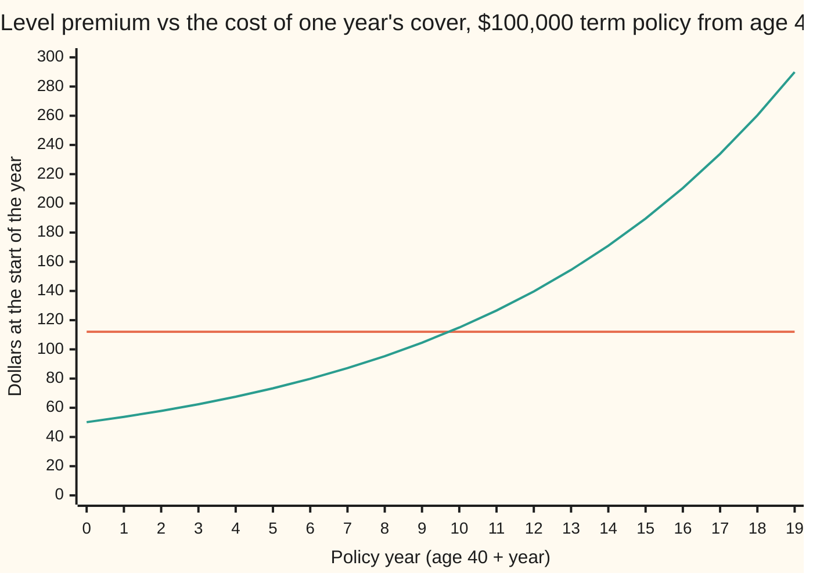
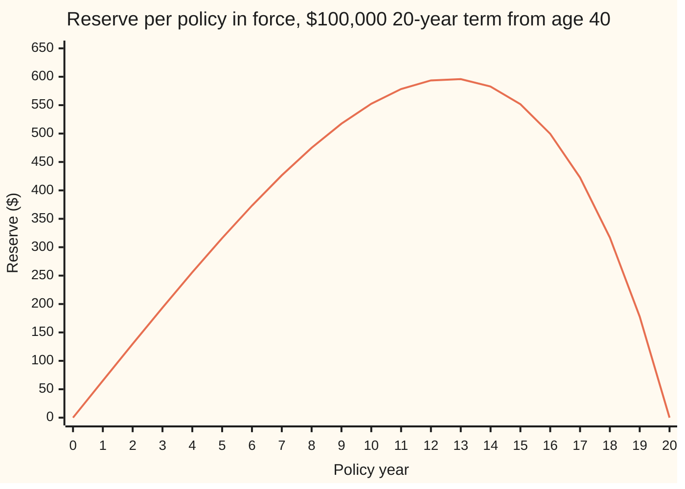

# Premiums and reserves: the equivalence principle and the money set aside as a policy ages

[Syllabus](../../../SYLLABUS.md) → [Financial mathematics](../README.md) → [Insurance and Actuarial Mathematics](../README.md#s51) → Premiums and reserves

---

## General Overview

A woman aged 40 buys a 20-year term policy. If she dies before 60, her family receives $100,000 at the end of the year she dies. If she is alive at 60, the cover ends and nothing is paid. She pays the same premium every year, at the start of the year, for as long as she is alive and the cover runs.

Her chance of dying is small at 40 and grows every year: 0.0005272 at 40, 0.0012085 at 50, 0.0030481 at 59. The price of each single year's cover grows with it, from $50.15 in the first year to $289.94 in the last. Yet the premium is flat: $112.06 a year, every year.

A flat premium over a rising cost means the early years overpay and the late years underpay. The overpayment cannot be spent. It is held, earning interest, to meet the late years. That held money is the **reserve** (the amount the insurer must set aside today for one policy still in force). At year 10, on her 50th birthday, it is $552.43.

Two questions carry the card. What premium is fair? The **equivalence principle** answers: the premium whose expected present value equals the expected present value of the benefit (present value: what money due later is worth today, after discounting). How much must be held at year 10? The **prospective reserve** answers: what the future benefits are worth, minus what the future premiums are worth. A one-line **recursion** (a rule that gets each year's value from the next one) then produces the reserve for every year at once.

**Set the premium so that, on average, the premiums pay for the benefit; the reserve at any later date is the gap between what the policy will still cost and what it will still bring in.**

**What kind of fact this is:** a method. The equivalence principle is a pricing convention, a choice about what "fair" means; the recursion, and the fact that the reserve equals the money a pool of such policies has built up, are theorems, proved on this card in Why it works.

### The picture: a flat premium over a rising cost



Flat line (orange): the level premium, $112.06. Rising line (green): the cost of that year's cover alone, the chance of dying that year times $100,000, discounted one year. The lines cross between year 9 ($104.59) and year 10 ($114.96). Before the crossing the policyholder overpays; after it, she underpays, and the reserve makes up the difference.

---

## The formula

Notation first, in words. The sibling card [Life annuities and insurance](02-life-annuities-and-insurance-values.md) builds two prices. $A_{x:n}$ is today's value of $1 paid at the end of the year of death, if death comes within $n$ years of age $x$. $\ddot a_{x:n}$, read "a double-dot", is today's value of $1 paid at the start of each year while alive, at most $n$ payments. Both are per dollar, so a benefit of $S$ dollars (the **sum insured**, here $100,000) is worth $S\,A_{x:n}$.

The premium, by equivalence:

$$P = \frac{S\,A_{x:n}}{\ddot a_{x:n}}$$

**Read it aloud:** the premium is the benefit's value spread evenly over the payments she is expected to make.

The reserve after $t$ years, looking forward:

$$V_t = S\,A_{x+t:\,n-t} \;-\; P\,\ddot a_{x+t:\,n-t}$$

**Read it aloud:** the reserve is what the remaining cover is worth, minus what the remaining premiums are worth, both valued for a life now aged $x + t$.

The recursion, one year at a time:

$$(V_t + P)\,e^{r} \;=\; q_{x+t}\,S \;+\; p_{x+t}\,V_{t+1}$$

Here $q_{x+t}$ is the chance a life aged $x + t$ dies within the year, $p_{x+t} = 1 - q_{x+t}$, and $e^{r}$ grows a dollar for one year at the rate $r$.

**Read it aloud:** the reserve plus this year's premium, grown for one year at interest, pays the death benefit to those who die and the next reserve to those who live.

| Symbol | Plain meaning | In our example | Push it up and the answer… |
| --- | --- | --- | --- |
| $S$ | the **sum insured**: paid at the end of the year of death | $100,000 | premium and reserve rise in proportion |
| $x$, $n$; $y$, $m$ | age at issue, years of cover; in the proof, age now, years left | 40, 20; 50, 10 | older or longer: dearer, bigger reserve |
| $t$, $k$ | years since issue; $k$ counts years inside a sum | 10 | the reserve rises, peaks at year 13, falls to 0 |
| $r$, $v$ | the interest rate, continuously compounded; one year's discount factor, $e^{-r}$ | 5%; 0.951229 | premium and reserve fall |
| $q_{x+k}$, $q_y$, $q$ | chance a life aged $x + k$ dies within the year | 0.0012085 at 50 | premium and reserve rise |
| $p_{x+k}$, $p_y$ | chance that life survives the year, $1 - q_{x+k}$ | one minus the row above | — |
| ${}_kp_x$ | chance a life aged $x$ survives $k$ years | — | — |
| $A_{x:n}$ | value of $1 paid at the end of the year of death, if within $n$ years | 0.014423 at 40 for 20 years | premium rises |
| $\ddot a_{x:n}$ | value of $1 paid at the start of each year while alive, $n$ at most | 12.870699 at 40 for 20 years | premium falls |
| $P$ | the level **net premium**: no expenses, no profit | $112.06 a year | reserve falls |
| $V_t$, $V_{10}$ | the **reserve** at year $t$, just before that year's premium | $552.43 at year 10 | — |
| $F_t$, $l_t$ | the office's fund per survivor, and its survivors, at year $t$ | $552.43 and 9,923.3 at year 10 | — |

The two prices, written out:

$$A_{x:n} = \sum_{k=0}^{n-1} v^{k+1}\,{}_kp_x\,q_{x+k}, \qquad \ddot a_{x:n} = \sum_{k=0}^{n-1} v^{k}\,{}_kp_x$$

In words: to pay a death benefit in year $k + 1$, she must survive $k$ years and then die; the money is paid a year after that year begins. A premium in year $k + 1$ needs only survival to its start.

The death rates come from Makeham's law (a formula for how the force of mortality, the instantaneous death rate, grows with age): force $= 0.00022 + 0.0000027 \times 1.124^{\text{age}}$. It is the formula behind the Standard Ultimate Life Table in Dickson, Hardy and Waters; the check reproduces that table's 0.000527 at 40 and 0.001209 at 50.

### When it holds

- **The death rates are right.** The whole price is built on $q$. If the insured group dies 10% faster than the table says, both the premium and the reserve are too small.
- **The interest is earned.** Money held is assumed to grow at 5%. If it earns less, the reserve falls short: earning 0% from year 10, the same $112.06 policy needs $857.77 at year 10, not $552.43.
- **Many independent policies.** Equivalence sets the average right. One policy on its own either costs $100,000 or nothing. Only a large pool of independent lives makes the average what the office actually pays.
- **Everyone pays until death or expiry.** Lapses (policyholders who stop paying and walk away) are ignored. A term policy that lapses leaves its reserve behind; pricing that counts on this is fragile.
- **Net, not gross.** Expenses and profit are left out. A gross premium adds loadings for them; the method is the same with more cash flows.

---

## Why it works

### Step 0: price the average, because a large pool pays the average

One policy is a gamble: it pays $100,000 or nothing. An office with 10,000 such policies is not. By the law of large numbers (the average of many independent outcomes settles near the expected value), the office's cost per policy lands close to the expected cost. So the fair premium is the one that makes the expected value of what comes in equal the expected value of what goes out, both measured in today's dollars. That is the equivalence principle.

Once the premium is fixed, the balance holds only on day one. A year later she is older, the cover left is dearer, and fewer premiums remain. The balance tips, and the reserve is the amount by which it tips.

### Step 1: value the benefit

The $100,000 is paid at the end of year $k + 1$ if she is alive at the start of it and dies during it. The chance of that is ${}_kp_x\,q_{x+k}$. Discounting from the payment date gives $v^{k+1}$. Add over the 20 years:

$$S\,A_{40:20} = 100{,}000 \times 0.014423 = \$1{,}442.34.$$

### Step 2: value the premiums

A premium of $P$ is paid at the start of year $k + 1$ if she is alive then, chance ${}_kp_x$, discounted by $v^k$. The first premium is certain and undiscounted. Adding the 20 years gives $P\,\ddot a_{40:20}$, with $\ddot a_{40:20} = 12.870699$. That is the expected discounted number of premiums: fewer than 20, because of discounting and because some lives stop paying at death.

### Step 3: set them equal

$$P\,\ddot a_{40:20} = S\,A_{40:20} \quad\Longrightarrow\quad P = \frac{1{,}442.34}{12.870699} = \$112.06.$$

### Step 4: stand at year 10 and look forward

She is alive at 50. What happened before is sunk: the premiums paid are in the fund, and no benefit is owed for past years. The future depends only on her present age, because the death rates depend only on age. So the rest of the policy is a fresh 10-year term policy on a life aged 50, still paying $112.06.

On that fresh policy the balance no longer holds. The cover is worth $S\,A_{50:10} = \$1{,}450.66$. The premiums are worth $P\,\ddot a_{50:10} = 112.06 \times 8.015347 = \$898.23$. The office expects to pay out $552.43 more than it takes in, in today's money. That is the reserve:

$$V_{10} = 1{,}450.66 - 898.23 = \$552.43.$$

The reserve is the expected present value of the office's future loss on this policy, given that the policy is still in force.

### Step 5: the recursion, by splitting off one year

Every year of cover looks the same from inside. At the start of year $t + 1$ the office holds $V_t$ and receives $P$. It grows for one year. At the end of the year, with chance $q_{x+t}$ the life has died and the office pays $S$; with chance $p_{x+t}$ she is alive and the office must hold $V_{t+1}$. On average the money in must match:

$$(V_t + P)\,e^{r} = q_{x+t}\,S + p_{x+t}\,V_{t+1}.$$

At year 10 both sides come to $698.57. The recursion runs backwards from a known end: when cover expires nothing more is owed, so $V_{20} = 0$. From there each earlier reserve follows in one line.

<details>
<summary>Detailed proof: the prospective reserve obeys the recursion</summary>

Split the first year off each price. For a life aged $y$ with $m$ years left, the benefit is either paid at the end of this year (chance $q_y$) or, if the life survives (chance $p_y$), the rest of the policy is worth a fresh $A_{y+1:m-1}$ a year from now:
$$A_{y:m} = v\,q_y + v\,p_y\,A_{y+1:m-1}, \qquad \ddot a_{y:m} = 1 + v\,p_y\,\ddot a_{y+1:m-1}.$$
Put $y = x + t$ and $m = n - t$, multiply the first by $S$ and the second by $P$, and subtract:
$$V_t = S\,A_{y:m} - P\,\ddot a_{y:m} = v\,q_y\,S + v\,p_y\,(S\,A_{y+1:m-1} - P\,\ddot a_{y+1:m-1}) - P = v\,q_y\,S + v\,p_y\,V_{t+1} - P.$$
Move $P$ across and multiply by $e^{r} = 1/v$. At the end, $A_{y:0} = \ddot a_{y:0} = 0$, so $V_n = 0$. Rearranged, $(V_t + P)e^r - V_{t+1} = q_y\,(S - V_{t+1})$: each year the survivors' money pays the death cost on the **sum at risk**, $S - V_{t+1}$, the part of the benefit the reserve does not already cover.

</details>

### Step 6: the reserve is the money the pool has saved

Run the office forward instead. Start 10,000 policies at 40 with an empty fund. Each year, the survivors pay the premium, the fund earns interest, and the expected deaths are paid. At year 10 the fund holds $5,481,963.30 for 9,923.3 expected survivors: $552.43 each. That is the reserve again, reached from the past rather than the future. It is called the **retrospective reserve**.

The two agree for a reason. Let $F_t$ be the fund per survivor and $l_t$ the survivors. One year of the office says $l_{t+1}F_{t+1} = (l_tF_t + l_tP)e^r - l_t\,q_{x+t}\,S$. Divide by $l_t$ and use $l_{t+1} = l_t\,p_{x+t}$: $(F_t + P)e^r = q_{x+t}\,S + p_{x+t}\,F_{t+1}$. That is the same recursion. The fund starts at 0; the reserve starts at 0 because the premium was set by equivalence. Two sequences that obey the same one-step rule from the same start are equal at every step. So equivalence is exactly the condition that makes "what the pool has saved" and "what the pool will need" the same number.

### The other door: continuous time

Shrink the year to an instant and the recursion becomes a differential equation, Thiele's equation: the reserve grows at the interest rate, gains the premium rate, and loses the force of mortality times the sum at risk. It is solved backwards from 0 at expiry, as here. Contracts with benefits paid at the moment of death, or several states such as healthy, disabled and dead, are valued that way.

---

## Worked numbers, by hand

The policy: $S$ = $100,000, issue age 40, 20 years, $r$ = 5%, death rates from Makeham's law.

| Step | Arithmetic | Value |
| --- | --- | --- |
| one year's discount, $v$ | $e^{-0.05}$ | 0.951229 |
| benefit per $1, 20 years from 40 | sum of $v^{k+1}\,{}_kp_{40}\,q_{40+k}$ | 0.014423 |
| premiums per $1, 20 years from 40 | sum of $v^{k}\,{}_kp_{40}$ | 12.870699 |
| value of the benefit | $100{,}000 \times 0.014423$ | $1,442.34 |
| net premium $P$ | $1{,}442.34 / 12.870699$ | $112.06 |
| benefit per $1, 10 years from 50 | same sum from 50 | 0.014507 |
| premiums per $1, 10 years from 50 | same sum from 50 | 8.015347 |
| value of the remaining cover | $100{,}000 \times 0.014507$ | $1,450.66 |
| value of the remaining premiums | $112.06 \times 8.015347$ | $898.23 |
| **reserve at year 10, $V_{10}$** | $1{,}450.66 - 898.23$ | **$552.43** |
| check by one step of the recursion | $(552.43 + 112.06)\,e^{0.05}$ vs $0.0012085 \times 100{,}000 + (1 - 0.0012085) \times 578.41$ | $698.57 both |

For every policy still in force at year 10, the office must hold $552.43, or it cannot meet the cover promised for ages 50 to 59 out of the $112.06 premiums still to come.

### What breaks if you drop a piece

Same policy, correct reserve $552.43:

| Mistake | Comes out at | What went wrong |
| --- | --- | --- |
| Leave out the premium due on the valuation day | $664.50 | The premium at year 10 is still to come; valuing only the nine later premiums overstates the reserve by one premium |
| Use the age-40 death rates for ages 50 to 59 | −$498.42 | The reserve exists because she is older now; freeze her age and the future looks cheaper than the premiums |
| Drop interest from the reserve, keep the 5% premium | $857.77 | Mixed bases: a premium priced with interest cannot be reserved without it |
| Charge the first year's cost, $50.15, every year | $796.86 short per policy at issue | A level premium must pay for the old-age years too; the young-age price leaves a hole that equivalence would have closed |

---

## How the reserve moves as the policy ages

The policy is the same every year. The reserve is not. It starts at zero, rises for thirteen years, then falls back to zero on the last day.



The single line is the reserve $V_t$, taken just before each year's premium. Three forces shape it.

- **Overpayment, years 0 to 9.** Each premium exceeds that year's cost: $112.06 against $50.15 in year 0. The excess piles up.
- **Interest, years 10 to 13.** From year 10 the year's cost, $114.96, exceeds the premium. The reserve still rises, to its peak of $595.81 at year 13, because the interest on more than $550 held is larger than the shortfall.
- **Spending down, years 14 to 20.** The yearly cost climbs to $289.94. Premium and interest no longer keep up, and the reserve is drawn down to exactly zero at expiry, when nothing more is owed.

A term policy's reserve is a hump. A policy that always pays out, such as whole-life cover or an endowment (which pays at death or at the end of the term, whichever comes first), has a reserve that climbs all the way to the sum insured, because the payment is certain.

### One office, one real decade

The reserve is an average. The check also simulates one office of 10,000 lives aged 40, one random draw each. In that run 78 died in the first ten years, against 76.7 expected. The fund per survivor at year 10 came to $526.73, a little under the $552.43 reserve. A death or two more than expected cost the office money that the pool, not the reserve, has to absorb. How large those swings get is the business of [Aggregate claims](04-collective-risk-and-compound-poisson.md) and [Ruin](06-ruin-theory-and-lundberg.md).

---

## Code, from first principles, and it actually runs

The scripts build the death rates from Makeham's law and reach the answer by **four independent roads**. The premium comes from the two sums, and again by bisection (halving an interval until it pins the answer) on the backward recursion, looking for the premium that leaves nothing owed at issue. The year-10 reserve comes from the prospective formula, from the recursion run back from year 20, from the forward fund of a 10,000-policy office, and from a simulation of 1,000,000 lives aged 50 with a random-number generator written out in both languages. Both scripts then reprint every chart point, the what-breaks numbers and the try-changing answers. Mutation tests were run on the Python: dropping the survival factor from the recursion, paying premiums in arrears in the annuity, earning 4% in the fund, and thinning the death rates by 10% in the survival count each made an assert fail.

### Python

```python
# Premiums and reserves -- the check behind the card.  Standard library only.
# Policy: 20-year term insurance on a life aged 40.  $100,000 paid at the end of
# the year of death; a level premium due at the start of each year while alive;
# money earns 5% a year, continuously compounded.  Nothing imported knows the answer.
from math import exp, log, sqrt

S, X, N, T, r = 100000.0, 40, 20, 10, 0.05    # sum insured, issue age, term, reserve year, rate
A_, B_, C_ = 0.00022, 2.7e-6, 1.124           # Makeham force of mortality: A + B c^age

def q(age):  # chance of dying within the year from `age`: 1 - e^-(the force, added up over the year)
    return 1.0 - exp(-A_ - B_ * C_ ** age * (C_ - 1.0) / log(C_))

def values(age, n, rate, freeze=None):
    # Road 1: add up the years.  Returns (A, a): insurance of $1 and annuity-due of $1 a year.
    v, ins, ann, alive = exp(-rate), 0.0, 0.0, 1.0
    for k in range(n):
        qk = q(age + k if freeze is None else freeze)
        ann += v ** k * alive
        ins += v ** (k + 1) * alive * qk
        alive *= 1.0 - qk
    return ins, ann

def premium(age=X, n=N, rate=r):
    ins, ann = values(age, n, rate)
    return S * ins / ann

def backward(P, age=X, n=N, rate=r):
    # Road 2: the recursion, run from the end of cover (reserve 0) back to the start.
    v, V = exp(-rate), [0.0] * (n + 1)
    for t in range(n - 1, -1, -1):
        V[t] = v * (q(age + t) * S + (1.0 - q(age + t)) * V[t + 1]) - P
    return V

def bisect_premium():  # the premium at which the backward recursion lands on 0 at issue
    lo, hi = 0.0, S
    for _ in range(200):
        mid = 0.5 * (lo + hi)
        lo, hi = (mid, hi) if backward(mid)[0] > 0.0 else (lo, mid)
    return 0.5 * (lo + hi)

def cohort(P, lives=10000.0):
    # Road 3: follow the office's 10,000 policies forward.  Fund per survivor = reserve.
    fund, l, per, alive = 0.0, lives, [], []
    for t in range(N):
        per.append(fund / l); alive.append(l)
        deaths = l * q(X + t)
        fund = (fund + l * P) * exp(r) - deaths * S
        l -= deaths
    per.append(fund / l); alive.append(l)
    return per, alive

MASK, st = (1 << 64) - 1, [0x9E3779B97F4A7C15]
def uniform():  # xorshift64*, written out, so Python and Rust draw the same numbers
    x = st[0]; x ^= x >> 12; x ^= (x << 25) & MASK; x ^= x >> 27; st[0] = x
    return (((x * 0x2545F4914F6CDD1D) & MASK) >> 11) / 9007199254740992.0

def death_table(age, n):  # chance of dying by the end of year k+1, k = 0..n-1
    cum, alive = [], 1.0
    for k in range(n):
        alive *= 1.0 - q(age + k); cum.append(1.0 - alive)
    return cum

P = premium(); P2 = bisect_premium()
A40, a40 = values(X, N, r); A50, a50 = values(X + T, N - T, r)
V_pro = S * A50 - P * a50
V = backward(P)
per, alive = cohort(P)
v = exp(-r)
# Road 4: simulate 1,000,000 lives aged 50 and average the office's future loss on each.
cum50 = death_table(X + T, N - T)
loss = [S * v ** (k + 1) - P * sum(v ** j for j in range(k + 1)) for k in range(N - T)]
tot = tot2 = 0.0
for _ in range(1000000):
    u = uniform()
    L = next((loss[k] for k in range(N - T) if u < cum50[k]), -P * a50)
    tot += L; tot2 += L * L
mc = tot / 1e6; se = sqrt((tot2 / 1e6 - mc * mc) / 1e6)
# One simulated office: 10,000 lives aged 40, one draw each, run for ten years.
cum40, died = death_table(X, T), [0] * T
for _ in range(10000):
    u = uniform()
    k = next((k for k in range(T) if u < cum40[k]), None)
    if k is not None: died[k] += 1
fund, l = 0.0, 10000
for t in range(T):
    fund = (fund + l * P) * exp(r) - died[t] * S; l -= died[t]
lhs = (V_pro + P) * exp(r); rhs = q(X + T) * S + (1.0 - q(X + T)) * V[T + 1]
# What breaks
A40f, a40f = values(X + T, N - T, r, freeze=X)
A50z, a50z = values(X + T, N - T, 0.0)
nat40 = v * q(X) * S
rows = [
    ("q(40), q(50), q(59)", f"{q(40):.7f} {q(50):.7f} {q(59):.7f}"),
    ("A 40:20 per $1, a-due 40:20", f"{A40:.6f} {a40:.6f}"),
    ("A 50:10 per $1, a-due 50:10", f"{A50:.6f} {a50:.6f}"),
    ("v = e^-r, S times A 40:20", f"{v:.6f} {S * A40:.6f}"), ("S times A 50:10", f"{S * A50:.6f}"),
    ("P times a-due 50:10", f"{P * a50:.6f}"),
    ("1 premium by the sums", f"{P:.6f}"), ("2 premium by bisection", f"{P2:.6f}"),
    ("1 reserve at 10, prospective", f"{V_pro:.6f}"), ("2 reserve at 10, backward recursion", f"{V[T]:.6f}"),
    ("3 reserve at 10, office fund per survivor", f"{per[T]:.6f}"),
    ("4 reserve at 10, simulated mean, std error", f"{mc:.6f} {se:.6f}"),
    ("size of reserve at 0 (recursion), at 20 (fund)", f"{abs(V[0]):.6f} {abs(per[N]):.6f}"),
    ("step 10->11: (V10+P)e^r, q S + p V11", f"{lhs:.6f} {rhs:.6f}"),
    ("office: survivors at 10, fund at 10", f"{alive[T]:.4f} {per[T] * alive[T]:.2f}"),
    ("simulated office: deaths by 10, fund per survivor", f"{sum(died)} {fund / l:.6f}"),
    ("expected deaths by 10", f"{10000 - alive[T]:.4f}"),
    ("largest reserve: year, value", f"{max(range(N + 1), key=lambda t: V[t])} {max(V):.6f}"),
]
for lab, val in rows: print(f"{lab:<50}{val}")
for a in range(0, N + 1, 7): print("reserve  t=%2d.." % a, " ".join(f"{V[t]:.2f}" for t in range(a, min(a + 7, N + 1))))
for a in range(0, N, 7): print("yr cost  t=%2d.." % a, " ".join(f"{v * q(X + t) * S:.2f}" for t in range(a, min(a + 7, N))))
brk = [("forgot the premium due at 10", V_pro + P), ("age-40 death rates at 50-59", S * A40f - P * a40f),
       ("no interest in the reserve", S * A50z - P * a50z),
       ("first year's cost as premium", nat40), ("  short at issue per policy", S * A40 - nat40 * a40)]
for lab, val in brk: print(f"break  {lab:<43}{val:.6f}")
P50 = premium(age=50); P0 = premium(rate=0.0)
tries = [("sum insured $200,000: premium, reserve", 2 * P, 2 * V_pro),
         ("issue age 50: premium, reserve", P50, backward(P50, age=50)[T]),
         ("rate 0%: premium, reserve", P0, backward(P0, rate=0.0)[T])]
for lab, a, b in tries: print(f"try    {lab:<43}{a:.6f} {b:.6f}")
assert abs(P - P2) < 1e-6                       # sums vs root finder on the recursion
assert abs(V_pro - V[T]) < 1e-6                 # prospective vs recursion
assert abs(V_pro - per[T]) < 1e-6               # prospective vs retrospective fund
assert abs(mc - V_pro) < 4 * se                 # simulation agrees within 4 standard errors
assert abs(lhs - rhs) < 1e-6                    # one step of the recursion, by hand
assert abs(V[0]) < 1e-6                         # equivalence: nothing owed at issue
print("All checks passed.")
```

**Ran 2026-09-28 on macOS, Python 3.14.6, standard library only. All checks passed. Output, pasted from the run:**

```
q(40), q(50), q(59)                               0.0005272 0.0012085 0.0030481
A 40:20 per $1, a-due 40:20                       0.014423 12.870699
A 50:10 per $1, a-due 50:10                       0.014507 8.015347
v = e^-r, S times A 40:20                         0.951229 1442.335376
S times A 50:10                                   1450.661059
P times a-due 50:10                               898.227774
1 premium by the sums                             112.063488
2 premium by bisection                            112.063488
1 reserve at 10, prospective                      552.433284
2 reserve at 10, backward recursion               552.433284
3 reserve at 10, office fund per survivor         552.433284
4 reserve at 10, simulated mean, std error        563.824992 10.412597
size of reserve at 0 (recursion), at 20 (fund)    0.000000 0.000000
step 10->11: (V10+P)e^r, q S + p V11              698.566251 698.566251
office: survivors at 10, fund at 10               9923.3038 5481963.30
simulated office: deaths by 10, fund per survivor 78 526.732425
expected deaths by 10                             76.6962
largest reserve: year, value                      13 595.807845
reserve  t= 0.. 0.00 65.12 129.81 193.58 255.86 315.98 373.16
reserve  t= 7.. 426.52 475.01 517.44 552.43 578.41 593.56 595.81
reserve  t=14.. 582.76 551.71 499.52 422.64 316.98 177.88 0.00
yr cost  t= 0.. 50.15 53.77 57.85 62.42 67.57 73.35 79.85
yr cost  t= 7.. 87.15 95.36 104.59 114.96 126.61 139.71 154.43
yr cost  t=14.. 170.97 189.56 210.45 233.92 260.30 289.94
break  forgot the premium due at 10               664.496772
break  age-40 death rates at 50-59                -498.421652
break  no interest in the reserve                 857.767044
break  first year's cost as premium               50.150760
break    short at issue per policy                796.860065
try    sum insured $200,000: premium, reserve     224.126977 1104.866568
try    issue age 50: premium, reserve             311.314958 1756.930815
try    rate 0%: premium, reserve                  137.328823 606.944212
All checks passed.
```

### Rust

```rust
// Premiums and reserves -- the check behind the card.  Rust std only.
// Policy: 20-year term insurance on a life aged 40.  $100,000 paid at the end of
// the year of death; a level premium due at the start of each year while alive;
// money earns 5% a year, continuously compounded.  Nothing imported knows the answer.
const S: f64 = 100000.0; // sum insured
const X: usize = 40; const N: usize = 20; const T: usize = 10; // issue age, term, reserve year
const R: f64 = 0.05; // rate
const MA: f64 = 0.00022; const MB: f64 = 2.7e-6; const MC: f64 = 1.124; // force: A + B c^age

fn q(age: usize) -> f64 {
    // chance of dying within the year: 1 - e^-(the force, added up over the year)
    1.0 - (-MA - MB * MC.powf(age as f64) * (MC - 1.0) / MC.ln()).exp()
}

// Road 1: add up the years.  Returns (A, a): insurance of $1 and annuity-due of $1 a year.
fn values(age: usize, n: usize, rate: f64, freeze: Option<usize>) -> (f64, f64) {
    let v = (-rate).exp();
    let (mut ins, mut ann, mut alive) = (0.0, 0.0, 1.0);
    for k in 0..n {
        let qk = q(freeze.unwrap_or(age + k));
        ann += v.powf(k as f64) * alive;
        ins += v.powf(k as f64 + 1.0) * alive * qk;
        alive *= 1.0 - qk;
    }
    (ins, ann)
}

fn premium(age: usize, n: usize, rate: f64) -> f64 {
    let (ins, ann) = values(age, n, rate, None);
    S * ins / ann
}

// Road 2: the recursion, run from the end of cover (reserve 0) back to the start.
fn backward(p: f64, age: usize, n: usize, rate: f64) -> Vec<f64> {
    let v = (-rate).exp();
    let mut vv = vec![0.0; n + 1];
    for t in (0..n).rev() {
        vv[t] = v * (q(age + t) * S + (1.0 - q(age + t)) * vv[t + 1]) - p;
    }
    vv
}

fn bisect_premium() -> f64 {
    // the premium at which the backward recursion lands on 0 at issue
    let (mut lo, mut hi) = (0.0, S);
    for _ in 0..200 {
        let mid = 0.5 * (lo + hi);
        if backward(mid, X, N, R)[0] > 0.0 { lo = mid } else { hi = mid }
    }
    0.5 * (lo + hi)
}

// Road 3: follow the office's 10,000 policies forward.  Fund per survivor = reserve.
fn cohort(p: f64) -> (Vec<f64>, Vec<f64>) {
    let (mut fund, mut l) = (0.0, 10000.0);
    let (mut per, mut alive) = (vec![], vec![]);
    for t in 0..N {
        per.push(fund / l); alive.push(l);
        let deaths = l * q(X + t);
        fund = (fund + l * p) * R.exp() - deaths * S;
        l -= deaths;
    }
    per.push(fund / l); alive.push(l);
    (per, alive)
}

struct Rng(u64);
impl Rng {
    // xorshift64*, written out, so Python and Rust draw the same numbers
    fn uniform(&mut self) -> f64 {
        let mut x = self.0;
        x ^= x >> 12;
        x ^= x << 25;
        x ^= x >> 27;
        self.0 = x;
        (x.wrapping_mul(0x2545F4914F6CDD1D) >> 11) as f64 / 9007199254740992.0
    }
}

fn death_table(age: usize, n: usize) -> Vec<f64> {
    // chance of dying by the end of year k+1, k = 0..n-1
    let mut alive = 1.0;
    (0..n).map(|k| { alive *= 1.0 - q(age + k); 1.0 - alive }).collect()
}

fn row(lab: &str, val: String) { println!("{:<50}{}", lab, val); }

fn main() {
    let (p, p2) = (premium(X, N, R), bisect_premium());
    let (a40i, a40) = values(X, N, R, None);
    let (a50i, a50) = values(X + T, N - T, R, None);
    let v_pro = S * a50i - p * a50;
    let vr = backward(p, X, N, R);
    let (per, alive) = cohort(p);
    let v = (-R).exp();
    // Road 4: simulate 1,000,000 lives aged 50 and average the office's future loss on each.
    let cum50 = death_table(X + T, N - T);
    let loss: Vec<f64> = (0..N - T)
        .map(|k| S * v.powf(k as f64 + 1.0) - p * (0..=k).map(|j| v.powf(j as f64)).sum::<f64>())
        .collect();
    let mut rng = Rng(0x9E3779B97F4A7C15);
    let (mut tot, mut tot2) = (0.0, 0.0);
    for _ in 0..1000000 {
        let u = rng.uniform();
        let l = (0..N - T).find(|&k| u < cum50[k]).map_or(-p * a50, |k| loss[k]);
        tot += l; tot2 += l * l;
    }
    let mc = tot / 1e6; let se = ((tot2 / 1e6 - mc * mc) / 1e6).sqrt();
    // One simulated office: 10,000 lives aged 40, one draw each, run for ten years.
    let cum40 = death_table(X, T);
    let mut died = vec![0usize; T];
    for _ in 0..10000 {
        let u = rng.uniform();
        if let Some(k) = (0..T).find(|&k| u < cum40[k]) { died[k] += 1; }
    }
    let (mut fund, mut l) = (0.0, 10000usize);
    for t in 0..T {
        fund = (fund + l as f64 * p) * R.exp() - died[t] as f64 * S;
        l -= died[t];
    }
    let (lhs, rhs) = ((v_pro + p) * R.exp(), q(X + T) * S + (1.0 - q(X + T)) * vr[T + 1]);
    // What breaks
    let (a40fi, a40f) = values(X + T, N - T, R, Some(X));
    let (a50zi, a50z) = values(X + T, N - T, 0.0, None);
    let nat40 = v * q(X) * S;
    row("q(40), q(50), q(59)", format!("{:.7} {:.7} {:.7}", q(40), q(50), q(59)));
    row("A 40:20 per $1, a-due 40:20", format!("{:.6} {:.6}", a40i, a40));
    row("A 50:10 per $1, a-due 50:10", format!("{:.6} {:.6}", a50i, a50));
    row("v = e^-r, S times A 40:20", format!("{:.6} {:.6}", v, S * a40i));
    row("S times A 50:10", format!("{:.6}", S * a50i));
    row("P times a-due 50:10", format!("{:.6}", p * a50));
    row("1 premium by the sums", format!("{:.6}", p));
    row("2 premium by bisection", format!("{:.6}", p2));
    row("1 reserve at 10, prospective", format!("{:.6}", v_pro));
    row("2 reserve at 10, backward recursion", format!("{:.6}", vr[T]));
    row("3 reserve at 10, office fund per survivor", format!("{:.6}", per[T]));
    row("4 reserve at 10, simulated mean, std error", format!("{:.6} {:.6}", mc, se));
    row("size of reserve at 0 (recursion), at 20 (fund)", format!("{:.6} {:.6}", vr[0].abs(), per[N].abs()));
    row("step 10->11: (V10+P)e^r, q S + p V11", format!("{:.6} {:.6}", lhs, rhs));
    row("office: survivors at 10, fund at 10", format!("{:.4} {:.2}", alive[T], per[T] * alive[T]));
    row("simulated office: deaths by 10, fund per survivor", format!("{} {:.6}", died.iter().sum::<usize>(), fund / l as f64));
    row("expected deaths by 10", format!("{:.4}", 10000.0 - alive[T]));
    let top = (0..=N).fold(0, |b, t| if vr[t] > vr[b] { t } else { b });
    row("largest reserve: year, value", format!("{} {:.6}", top, vr[top]));
    for a in (0..=N).step_by(7) {
        let s: Vec<String> = (a..(a + 7).min(N + 1)).map(|t| format!("{:.2}", vr[t])).collect();
        println!("reserve  t={:2}.. {}", a, s.join(" "));
    }
    for a in (0..N).step_by(7) {
        let s: Vec<String> = (a..(a + 7).min(N)).map(|t| format!("{:.2}", v * q(X + t) * S)).collect();
        println!("yr cost  t={:2}.. {}", a, s.join(" "));
    }
    let brk = [("forgot the premium due at 10", v_pro + p), ("age-40 death rates at 50-59", S * a40fi - p * a40f),
        ("no interest in the reserve", S * a50zi - p * a50z),
        ("first year's cost as premium", nat40), ("  short at issue per policy", S * a40i - nat40 * a40)];
    for (lab, val) in brk.iter() { println!("break  {:<43}{:.6}", lab, val); }
    let (p50, p0) = (premium(50, N, R), premium(X, N, 0.0));
    let tries = [("sum insured $200,000: premium, reserve", 2.0 * p, 2.0 * v_pro),
        ("issue age 50: premium, reserve", p50, backward(p50, 50, N, R)[T]),
        ("rate 0%: premium, reserve", p0, backward(p0, X, N, 0.0)[T])];
    for (lab, a, b) in tries.iter() { println!("try    {:<43}{:.6} {:.6}", lab, a, b); }
    assert!((p - p2).abs() < 1e-6); // sums vs root finder on the recursion
    assert!((v_pro - vr[T]).abs() < 1e-6); // prospective vs recursion
    assert!((v_pro - per[T]).abs() < 1e-6); // prospective vs retrospective fund
    assert!((mc - v_pro).abs() < 4.0 * se); // simulation agrees within 4 standard errors
    assert!((lhs - rhs).abs() < 1e-6); // one step of the recursion, by hand
    assert!(vr[0].abs() < 1e-6); // equivalence: nothing owed at issue
    println!("All checks passed.");
}
```

**Ran 2026-09-28 on macOS, rustc 1.98.1, no crates. All checks passed. Output, pasted from the run:**

```
q(40), q(50), q(59)                               0.0005272 0.0012085 0.0030481
A 40:20 per $1, a-due 40:20                       0.014423 12.870699
A 50:10 per $1, a-due 50:10                       0.014507 8.015347
v = e^-r, S times A 40:20                         0.951229 1442.335376
S times A 50:10                                   1450.661059
P times a-due 50:10                               898.227774
1 premium by the sums                             112.063488
2 premium by bisection                            112.063488
1 reserve at 10, prospective                      552.433284
2 reserve at 10, backward recursion               552.433284
3 reserve at 10, office fund per survivor         552.433284
4 reserve at 10, simulated mean, std error        563.824992 10.412597
size of reserve at 0 (recursion), at 20 (fund)    0.000000 0.000000
step 10->11: (V10+P)e^r, q S + p V11              698.566251 698.566251
office: survivors at 10, fund at 10               9923.3038 5481963.30
simulated office: deaths by 10, fund per survivor 78 526.732425
expected deaths by 10                             76.6962
largest reserve: year, value                      13 595.807845
reserve  t= 0.. 0.00 65.12 129.81 193.58 255.86 315.98 373.16
reserve  t= 7.. 426.52 475.01 517.44 552.43 578.41 593.56 595.81
reserve  t=14.. 582.76 551.71 499.52 422.64 316.98 177.88 0.00
yr cost  t= 0.. 50.15 53.77 57.85 62.42 67.57 73.35 79.85
yr cost  t= 7.. 87.15 95.36 104.59 114.96 126.61 139.71 154.43
yr cost  t=14.. 170.97 189.56 210.45 233.92 260.30 289.94
break  forgot the premium due at 10               664.496772
break  age-40 death rates at 50-59                -498.421652
break  no interest in the reserve                 857.767044
break  first year's cost as premium               50.150760
break    short at issue per policy                796.860065
try    sum insured $200,000: premium, reserve     224.126977 1104.866568
try    issue age 50: premium, reserve             311.314958 1756.930815
try    rate 0%: premium, reserve                  137.328823 606.944212
All checks passed.
```

The two outputs are identical line for line. The simulation agrees with the reserve well inside the four standard errors the assert allows: $563.82 against $552.43, with a standard error of $10.41. The spread is large because one policy's loss is either most of the $100,000 or a small gain; the office leans on numbers, not on any one policy.

> [!TIP]
> **Try changing**
> - **Double the sum insured to $200,000.** Guess first. Premium $224.13 and reserve $1,104.87: exactly double, since every benefit term scales with $S$.
> - **Issue at 50 instead of 40**, same 20 years. Guess first. Premium $311.31, reserve at year 10 $1,756.93. Deaths accelerate with age, so the gap between the level premium and the late years' cost is wider.
> - **Set the rate to 0%.** Guess first. Premium $137.33 and reserve $606.94. Without interest, the early overpayment has to be larger to carry the late years unaided.

---

## The usual mistake

> [!warning]
> **Treating the reserve as the policyholder's savings.** It is not hers. A term policy has no cash value: if she stops paying at year 10, she gets nothing back and the $552.43 stays with the pool. The reserve is the office's liability, the money it must hold so that everyone still covered can be paid. It exists because the premium is level while the risk rises, not because anything was deposited for her.
>
> Smaller traps:
> - **Valuing just after the premium instead of just before.** Reserves are quoted either side of the premium date. Mixing conventions shifts the answer by one premium: $664.50 against $552.43.
> - **Forgetting that she is older now.** The future is priced at her present age. Issue-age death rates give −$498.42, a negative reserve that would let the office spend money it needs.
> - **Mixing bases.** The premium and the reserve must use the same interest and the same deaths, or the reserve does not start at zero. Premium at 5%, reserve at 0% gives $857.77.
> - **Believing the net premium is what is charged.** Real premiums add expenses, commission and profit. The net premium is the floor, and the net reserve is the floor under what a regulator requires.

---

## Where you meet it in real life

- **Life insurers' balance sheets.** Policy reserves are usually the largest liability a life office reports. Regulators set the bases (death rates, interest) that must be used, and an actuary signs off the total.
- **Level-premium term cover.** Every quote for fixed monthly premiums over 10, 20 or 30 years is a level premium over a rising risk, and carries this hump-shaped reserve behind it.
- **Lapse-supported pricing.** Some products were priced expecting many policyholders to stop paying and leave their reserves behind. When fewer lapsed than planned, insurers lost money: the "Many independent policies" and "Everyone pays" assumptions failing in public.
- **The other "reserve".** A motor or home insurer's reserves are money held for claims already incurred but not yet settled, estimated from claim triangles: [Reserving](07-reserving-chain-ladder-and-bornhuetter-ferguson.md). Same word, different quantity.
- **Blending experience with the table.** When an office's own deaths run above or below the table, it adjusts the rates it prices with: [Credibility and reinsurance](08-credibility-and-reinsurance.md).
- **Where the death rates come from.** Every $q$ on this card is a row of a life table: [Life tables](01-survival-life-tables-and-force-of-mortality.md).

> **Say it back**
> A net premium is set by equivalence: expected present value in equals expected present value out, which is fair because a large pool pays close to the average. A level premium over a rising risk overpays early and underpays late. The reserve is the difference between the value of the remaining cover and the value of the remaining premiums, $552.43 at year 10 on the $100,000 policy. It obeys a one-year recursion, reserve plus premium grown at interest equals deaths paid plus the next reserve, run back from zero at expiry. The same recursion, run forward, is the pool's saved fund, and equivalence makes the two agree.

---

## What this builds on

- [Life annuities and insurance](02-life-annuities-and-insurance-values.md): the two prices, $A_{x:n}$ and $\ddot a_{x:n}$, and the one-year split that the recursion's proof uses.

## Where this goes next

- [Aggregate claims](04-collective-risk-and-compound-poisson.md): drops the average and models the whole spread of a portfolio's total claims.
- [Ruin](06-ruin-theory-and-lundberg.md): whether a fund that holds the average can survive the swings around it.

The reserve covers the expected future loss; the question left open is how far the real loss can stray from it, and how much capital that takes.

---

## Sources

Verified 2026-09-28: every link below resolves to the publisher's page.

- Dickson, David C. M., Mary R. Hardy, and Howard R. Waters. *Actuarial Mathematics for Life Contingent Risks*, 3rd ed. Cambridge University Press, 2019. [doi:10.1017/9781108784184](https://doi.org/10.1017/9781108784184). The equivalence principle, policy values and their recursion, Thiele's equation, and the Standard Ultimate Life Table whose Makeham rates this card uses.
- Society of Actuaries. *Standard Ultimate Life Table*. [PDF](https://www.soa.org/globalassets/assets/files/edu/2018/ltam-standard-ultimate-life-table.pdf). The table itself, at 5% effective annual interest (this card uses 5% continuously compounded, so its dollar values differ); its death rates at 40, 50 and 59 match the ones the checks compute.
- Makeham, William Matthew. "On the Law of Mortality and the Construction of Annuity Tables." *The Assurance Magazine, and Journal of the Institute of Actuaries* 8, no. 6 (1860): 301–310. [doi:10.1017/S204616580000126X](https://doi.org/10.1017/S204616580000126X). The age-free term added to Gompertz's law: the mortality formula behind every $q$ here.
