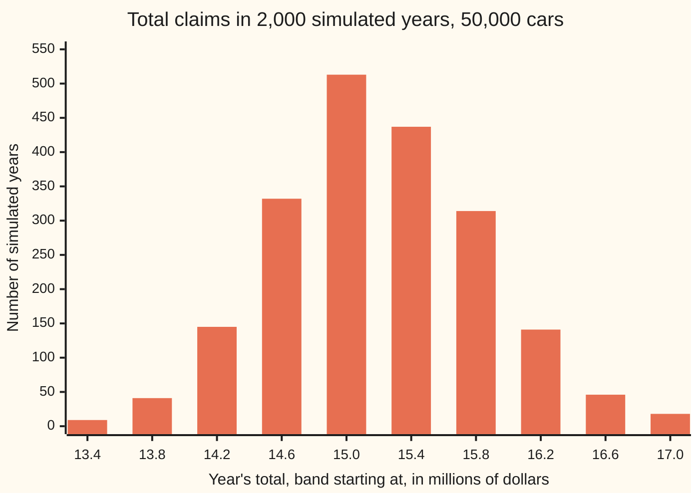

# Aggregate claims: random count times random size

[Syllabus](../../../SYLLABUS.md) → [Financial mathematics](../../../SYLLABUS.md#w12) → [Insurance and Actuarial Mathematics](../../../SYLLABUS.md#w12-s51) → Aggregate claims

---

## General Overview

A motor insurer covers 50,000 cars for one year. Past years say about 5 percent of cars make a claim, so the insurer expects around 2,500 claims. Most are small: a scraped door, a cracked windscreen. Half of all claims cost less than $3,000. A few are huge: a written-off car with an injured driver can cost $200,000.

The insurer cannot know the year's total in advance. Two things are random at once. How many claims arrive is random: a few dozen more or fewer than expected. How big each one is, is random too. The question every insurer must answer before it sets a price or holds capital is: what is the total likely to be, and how far could it stray?

The **collective risk model** answers it by splitting the total into those two random pieces. Draw a count. Then draw that many claim sizes and add them. When the count follows the Poisson law (the law of many rare, independent events), the total is called **compound Poisson**. For this book (the insurer's whole set of policies) the model gives an expected total of $15,408,249.08 and a standard deviation (the typical distance from that average) of $633,104.37. The big claims get their own treatment: a Pareto curve fitted to every claim above $25,000, because the tail is where an insurer's surprises live.

**The year's total is a random number of random claims; its average is the expected count times the average claim, and its variance is the expected count times the average squared claim.**

**What kind of fact this is:** a model: an assumption about how claims arrive and how large they are, not a law. Inside the model the mean and variance formulas are a theorem, proved on this card in Why it works; the Pareto fit is a method, maximum likelihood.

### The picture: 2,000 simulated years

The code below plays the year out 2,000 times, claim by claim. Each bar counts the simulated years whose total landed in a $400,000 band.



Each bar is one $400,000 band of the year's total; 4 of the 2,000 years fell outside the ten bands shown. The tallest bar is the band from $15.0 to $15.4 million, just below the formula's average of $15.4 million. Single claims are wildly lopsided, from a few hundred dollars to a few hundred thousand. Yet 2,500 of them added together give a total that is nearly bell-shaped and varies by only about 4 percent from year to year.

---

## The formula

Notation first, in words. $E[\,\cdot\,]$ is the expectation, the long-run average; $\operatorname{Var}(\cdot)$ is the variance, the average squared distance from that average. $N$ is the year's claim count, $X_1, X_2, \dots$ the claim sizes in order, and $\lambda$ (say "lambda") the expected count. When $N$ is zero the sum below is zero.

$$S = X_1 + X_2 + \dots + X_N, \qquad N \sim \text{Poisson}(\lambda)$$

**Read it aloud:** the year's total is the sum of a Poisson number of claims, each drawn from the same size law, independently.

Write $\mu = E[X]$ for the average claim and $\sigma_X^2 = \operatorname{Var}(X)$ for its variance. Two formulas follow:

$$E[S] = \lambda\,\mu, \qquad \operatorname{Var}(S) = \lambda\,E[X^2] = \lambda\,(\sigma_X^2 + \mu^2)$$

**Read it aloud:** the average total is the expected count times the average claim; the variance of the total is the expected count times the average of the squared claim.

The claim sizes are lognormal: the logarithm of a claim follows a bell curve with centre $m$ and spread $\sigma$ ([Normal](../../09-Probability%20and%20statistics/04-Continuous%20Distributions/04-normal-distribution.md)). Then

$$\mu = e^{m + \sigma^2/2}, \qquad E[X^2] = e^{2m + 2\sigma^2}$$

Above a threshold $u$ the large claims are fitted with a Pareto tail, where the chance a large claim exceeds $x$ is $(u/x)^{\alpha}$. The best-fitting tail index from $k$ large claims $x_1, \dots, x_k$ is

$$\hat\alpha = \frac{k}{\sum_{i=1}^{k} \ln(x_i / u)}$$

**Read it aloud:** the tail index is the number of large claims divided by the sum of their logarithmic distances above the threshold.

| Symbol | Plain meaning | In our example | Push it up and the answer… |
| --- | --- | --- | --- |
| $n$, $p$ | policies in the book, and the chance one of them claims in the year | 50,000 cars, 5 percent | more claims, higher total |
| $\lambda$ | expected number of claims, $n \times p$. Say "lambda". | 2,500 | mean and variance both rise in step; the spread relative to the mean falls |
| $N$ | the actual number of claims this year, random | around 2,500 | — |
| $X_i$, $X$ | the size of the i-th claim; $X$ is a typical one | median $3,000 | — |
| $S$ | the year's total claims | about $15.4 million | — |
| $m$ | centre of the bell curve of log size, $\ln 3000$ | 8.006368 | every claim scales up by the same factor |
| $\sigma$ | spread of the bell curve of log size | 1.2 | the mean rises, the variance rises much faster |
| $\mu$ | average claim size, $E[X]$ | $6,163.30 | — |
| $\sigma_X$ | standard deviation of one claim | $11,060.84 | — |
| $u$ | threshold above which a claim counts as large | $25,000 | fewer large claims to fit, noisier fit |
| $k$ | number of large claims the fit uses | 192,857 in 2,000 years; 98 in year 1 | smaller standard error |
| $\alpha$ | Pareto tail index: small means a heavy tail. Say "alpha". | 2.07 | the tail thins; huge claims get rarer |

The hat on $\hat\alpha$ marks an estimate from data, as opposed to the true value.

### When it holds

- **Count and sizes independent.** A hailstorm breaks this: it raises the number of claims and their sizes together, and the true variance is larger than $\lambda E[X^2]$.
- **Claims independent of each other.** One motorway pile-up is thirty claims from one event. Counts cluster, the count's variance exceeds its mean, and the formula understates the spread; a negative binomial count is the usual repair.
- **One size law for every claim.** If a new class of expensive cars joins mid-year, the mix changes and $\mu$ drifts.
- **Poisson counts.** With 50,000 cars each claiming at most once with chance 5 percent, the exact count is binomial, with variance 2,375 instead of 2,500. Poisson slightly overstates the spread, which errs on the safe side.
- **Finite claim moments.** The variance formula needs $E[X^2]$ finite. A claim law with a Pareto tail of index $\alpha \le 2$ breaks this: $\operatorname{Var}(S)$ is infinite, and the sd rows below mean nothing.
- **The Pareto fit describes only claims above $u$.** It says nothing about claims below the threshold, and its answer depends on where the threshold sits.

---

## Why it works

### Step 0: fix the count first, then let it vary

The trick is to average in two stages. Pretend for a moment the count is known, say exactly 2,500 claims. Then the total is a fixed-length sum, and fixed-length sums of independent pieces are easy: their averages add, and their variances add. Afterwards, let the count vary and average over it. This is the law of total expectation (average within each case, then across cases) and its partner for variance.

### Step 1: the average total

If exactly $N$ claims arrive, the total averages $N$ times the average claim, $N\mu$. Now average over the count. Since the count averages $\lambda$,

$$E[S] = E[N\mu] = \lambda\mu = 2{,}500 \times \$6{,}163.30 = \$15{,}408{,}249.08.$$

Nothing Poisson was used here. Any count with average $\lambda$, independent of the sizes, gives the same mean.

### Step 2: the spread of the total has two sources

The total can be high for two reasons. More claims than usual may have arrived. Or the usual number arrived, but they were bigger. The variance splits along exactly those lines:

$$\operatorname{Var}(S) = \underbrace{E[N]\,\sigma_X^2}_{\text{sizes vary}} \;+\; \underbrace{\operatorname{Var}(N)\,\mu^2}_{\text{count varies}}.$$

The first term: with $N$ claims fixed, independent sizes contribute $N\sigma_X^2$; average over $N$. The second term: the conditional average $N\mu$ itself moves as $N$ moves, and its variance is $\mu^2 \operatorname{Var}(N)$.

A Poisson count has variance equal to its mean, both $\lambda$. So the two terms merge:

$$\operatorname{Var}(S) = \lambda\sigma_X^2 + \lambda\mu^2 = \lambda E[X^2].$$

For the motor book, the size part is 76.3 percent of the variance and the count part 23.7 percent. Dropping either one is a real mistake with a real number attached (see What breaks, below).

<details>
<summary>Detailed proof: the variance split for any count</summary>

Condition on $N = n$. The sizes are independent of $N$ and of each other, so $E[S \mid N = n] = n\mu$ and $\operatorname{Var}(S \mid N = n) = n\sigma_X^2$. Hence $E[S^2 \mid N = n] = n\sigma_X^2 + n^2\mu^2$.

Average over $n$: $E[S^2] = E[N]\sigma_X^2 + E[N^2]\mu^2$ and $E[S] = E[N]\mu$.

Subtract the square of the mean: $\operatorname{Var}(S) = E[N]\sigma_X^2 + (E[N^2] - E[N]^2)\mu^2 = E[N]\sigma_X^2 + \operatorname{Var}(N)\mu^2$.

This needs $E[X^2]$ finite. For a Poisson count, $E[N] = \operatorname{Var}(N) = \lambda$, which gives $\lambda(\sigma_X^2 + \mu^2) = \lambda E[X^2]$. At $n = 0$ the empty sum is zero, and both conditional formulas give zero, so no case is missed.

</details>

### Step 3: why the count is Poisson

Each of 50,000 cars has a small chance, 5 percent, of claiming. The count of successes among many independent small chances is close to Poisson with the same mean ([Compound Poisson](../../11-Stochastic%20processes%20and%20calculus/04-Poisson%20and%20Jump%20Processes/04-compound-poisson.md)). The Poisson law also has a clock picture: claims arrive at random moments with gaps drawn from the exponential law, at an average rate of 2,500 a year. The simulation below builds its counts exactly that way. Across its 2,000 years the counts average 2,498.03 with variance 2,450.16: mean and variance agree, the Poisson signature.

### Step 4: the lognormal's moments

A lognormal claim is $X = e^{m + \sigma Z}$, where $Z$ is a standard bell-curve draw. Its median is $e^m = \$3{,}000$: half of claims fall below. Its mean is larger:

$$\mu = e^{m}\,e^{\sigma^2/2} = \$3{,}000 \times 2.054433 = \$6{,}163.30.$$

The factor $e^{\sigma^2/2}$ is the pull of the long right tail. A few large claims drag the average far above the typical claim. For the square, $X^2 = e^{2m + 2\sigma Z}$, so the same rule with $2\sigma$ in place of $\sigma$ gives $E[X^2] = e^{2m} e^{2\sigma^2} = 9{,}000{,}000 \times 17.814273$.

<details>
<summary>The algebra behind this</summary>

For any number t, $E[e^{tZ}] = \int e^{tz} \tfrac{1}{\sqrt{2\pi}} e^{-z^2/2}\,dz$. Complete the square: $tz - z^2/2 = t^2/2 - (z - t)^2/2$. The remaining integral is the area under a whole bell curve, shifted along by t, which is 1. So $E[e^{tZ}] = e^{t^2/2}$. Put $t = \sigma$ for the mean and $t = 2\sigma$ for the square.

</details>

### Step 5: fitting a Pareto to the large claims

A lognormal is a fair model of the typical claim. The insurer's worry is the tail: how often a $200,000 claim comes along. Tails are better studied on their own. Keep only the claims above $u = \$25{,}000$ and fit the Pareto law, whose survival (the chance of exceeding $x$, given the claim is above $u$) is $(u/x)^{\alpha}$ ([Heavy tails](../../09-Probability%20and%20statistics/04-Continuous%20Distributions/08-heavy-tails-pareto-and-cauchy.md)).

Maximum likelihood picks the $\alpha$ that makes the observed claims most probable. The Pareto density above $u$ is $\alpha u^{\alpha} x^{-\alpha - 1}$. Multiply it over the $k$ large claims and take logs:

$$\ell(\alpha) = k \ln\alpha - \alpha \sum_i \ln(x_i/u) - \sum_i \ln x_i.$$

Set its slope in $\alpha$ to zero: $k/\alpha - \sum_i \ln(x_i/u) = 0$. That gives $\hat\alpha$ as in The formula. The slope falls as $\alpha$ grows (its own slope is $-k/\alpha^2$), so this is the one peak. It exists when at least one claim exceeds $u$; with none, there is nothing to fit. The same estimate, as a tail-index tool, is known as the Hill estimator.

The Pareto's own moments explain why $\alpha$ matters. Its mean is finite only when $\alpha > 1$ and its variance only when $\alpha > 2$. Our fit over all 2,000 simulated years gives $\hat\alpha = 2.072422$: just above 2, meaning the large claims behave, near the threshold, like a law whose variance barely exists.

<details>
<summary>Why a lognormal book produces a Pareto answer that drifts</summary>

A true Pareto tail gives the same $\alpha$ at every threshold. A lognormal tail does not: it thins faster the further out it goes. Fit at $25,000 and endless data give 2.075264; fit at $50,000 and they give 2.471953. A fitted $\alpha$ that climbs as the threshold rises is the fingerprint of a tail lighter than Pareto. A flat $\alpha$ suggests the Pareto is right.

</details>

The other route to the whole distribution of $S$, not just its mean and variance, is Panjer's recursion, which builds the probabilities step by step on a grid of claim sizes: [Panjer's recursion](05-panjer-recursion-and-aggregate-claims.md).

---

## Worked numbers, by hand

50,000 cars, claim chance 5 percent, lognormal sizes with median $3,000 and log-spread 1.2.

| Step | Arithmetic | Value |
| --- | --- | --- |
| expected claims, $\lambda$ | $50{,}000 \times 0.05$ | 2,500 |
| log centre, $m$ | $\ln 3000$ | 8.006368 |
| tail pull, $e^{\sigma^2/2}$ | $e^{0.72}$ | 2.054433 |
| mean claim, $\mu$ | $3000 \times 2.054433$ | $6,163.30 |
| mean squared claim, $E[X^2]$ | $3000^2 \times e^{2.88} = 9{,}000{,}000 \times 17.814273$ | 160,328,458.62 dollars squared |
| sd of one claim, $\sigma_X$ | $\sqrt{160{,}328{,}458.62 - 6{,}163.30^2}$ | $11,060.84 |
| **expected total**, $E[S]$ | $2{,}500 \times 6{,}163.30$ | **$15,408,249.08** |
| **sd of the total** | $\sqrt{2{,}500 \times 160{,}328{,}458.62}$ | **$633,104.37** |
| relative spread | $633{,}104.37 / 15{,}408{,}249.08$ | 4.1 percent |
| pure premium per car | $15{,}408{,}249.08 / 50{,}000$ | $308.16 |

A car costs the insurer $308.16 a year on average, before expenses, profit or any safety margin. The year's total typically lands within about $633,000 of $15.4 million.

The large claims, over all 2,000 simulated years:

| Step | Arithmetic | Value |
| --- | --- | --- |
| threshold in bell-curve units | $(\ln 25000 - 8.006368)/1.2$ | 1.766886 |
| chance a claim is large | bell-curve area above 1.766886 | 0.038624 |
| large claims a year | $2{,}500 \times 0.038624$ | 96.56 |
| large claims in 2,000 years | simulated | 192,857 |
| **fitted tail index** | $192{,}857 / \sum \ln(x_i/25{,}000)$ | **2.072422** |
| its standard error | $2.072422 / \sqrt{192{,}857}$ | 0.004719 |
| one year's data only | 98 large claims | 2.574486, standard error 0.260062 |

One year of large claims, 98 of them, gives 2.574486 with standard error 0.260062, against 2.072422 from 2,000 years. A single year's tail fit is noisy, and in this example it made the tail look thinner than it is.

What the fit is for: the mean of a large claim. Under the fitted Pareto it is $\alpha u / (\alpha - 1) = \$48{,}311.73$; the lognormal truth is $45,541.52. That makes the large claims' expected cost a year $4,664,936.63 under the Pareto against $4,397,448.39 under the lognormal: the Pareto builds in extra caution. Further out the gap widens:

```
Expected claims a year above each size, lognormal (L) against fitted Pareto (P)
$25,000   L ████████████████████████████████████████  96.5591
          P ████████████████████████████████████████  96.5591
$50,000   L ██████████                                23.8152
          P ██████████                                22.9579
$100,000  L ██                                         4.3456
          P ██                                         5.4585
$200,000  L                                            0.5821
          P █                                          1.2978
$400,000  L                                            0.0569
          P                                            0.3086
```

At $400,000 the Pareto expects 0.3086 claims a year, several times the lognormal's 0.0569. Which to believe is a judgment about the real data, and it moves reinsurance prices ([Credibility and reinsurance](08-credibility-and-reinsurance.md)).

### What breaks if you drop a piece

Correct answers: expected total $15,408,249.08, sd of the total $633,104.37.

| Mistake | Comes out at | What went wrong |
| --- | --- | --- |
| Variance as $\lambda\sigma_X^2$, sizes only | sd $553,042.03 | Forgot that the count itself varies; too little spread |
| Every claim at its average size | sd $308,164.98 | Kept the count's randomness, dropped the sizes'; under half the true spread |
| Median $3,000 used as the average claim | mean $7,500,000.00 | The median ignores the long right tail; the book is underpriced by more than half |
| Adding standard deviations, $\lambda\sigma_X$ | sd $27,652,101.67 | Independent spreads add in variance, not in size; wildly too large |

---

## Code, from first principles, and it actually runs

The code reaches the answers by four roads. Road 1 is the closed-form moments and the compound Poisson formulas. Road 2 recomputes the lognormal moments, the tail chance and the endless-data tail index by Simpson's rule over the bell curve. Road 3 simulates 2,000 years claim by claim, with its own random-number generator (splitmix64), exponential gaps for arrival times and the Box-Muller method for bell-curve draws. Road 4 fits the Pareto twice: by the closed-form estimate and by a golden-section search that climbs the likelihood without using the formula. The asserts compare the roads to each other; mutations to the variance formula, the lognormal mean and the tail estimate each make an assert fail.

### Python

```python
# Aggregate claims: compound Poisson with lognormal sizes, and a Pareto fit to the large ones.
# Standard library only. Random numbers, integrals and the optimiser are written here.
from math import exp, log, sqrt, cos, sin, pi

POLICIES, RATE = 50_000, 0.05          # the motor book: 50,000 policies, 5% claim a year each
LAM = POLICIES * RATE                  # expected claims a year, lambda = 2,500
MED, SIG = 3000.0, 1.2                 # lognormal sizes: median $3,000, log-spread 1.2
M = log(MED)                           # mean of log size
U = 25_000.0                           # large-claim threshold for the Pareto fit
YEARS = 2000                           # simulated years

# ---- road 1: closed forms for the lognormal moments, then the compound Poisson formulas ----
mu = exp(M + SIG**2 / 2)               # E[X]
m2 = exp(2 * M + 2 * SIG**2)           # E[X^2]
var_x = m2 - mu**2
ES, VS = LAM * mu, LAM * m2            # E[S] = lambda E[X],  Var(S) = lambda E[X^2]
SD = sqrt(VS)

# ---- road 2: the same moments by Simpson's rule over the bell curve of log size ----
def simpson(f, a, b, n=20000):
    h = (b - a) / n
    acc = 0.0
    for k in range(1, n):
        acc += (4 if k % 2 else 2) * f(a + k * h)
    return (f(a) + f(b) + acc) * h / 3
phi = lambda z: exp(-z * z / 2) / sqrt(2 * pi)
size = lambda z: MED * exp(SIG * z)
mu_int = simpson(lambda z: size(z) * phi(z), -12, 12)
m2_int = simpson(lambda z: size(z) * size(z) * phi(z), -12, 14)
zu = (log(U) - M) / SIG                                   # threshold in bell-curve units
pu_int = simpson(phi, zu, 12)                             # P(X > u)
elog_int = simpson(lambda z: (M + SIG * z - log(U)) * phi(z), zu, 12) / pu_int
alpha_pop = 1 / elog_int                                  # what the Pareto fit tends to with endless data
big_mean_int = simpson(lambda z: size(z) * phi(z), zu, 14) / pu_int   # E[X | X > u]

# ---- road 3: simulate 2,000 years claim by claim (splitmix64, exponential gaps, Box-Muller) ----
state = 20260928
def unif():
    global state
    state = (state + 0x9E3779B97F4A7C15) & 0xFFFFFFFFFFFFFFFF
    z = state
    z = ((z ^ (z >> 30)) * 0xBF58476D1CE4E5B9) & 0xFFFFFFFFFFFFFFFF
    z = ((z ^ (z >> 27)) * 0x94D049BB133111EB) & 0xFFFFFFFFFFFFFFFF
    return ((z ^ (z >> 31)) >> 11) * 2.0**-53 + 2.0**-54   # strictly inside (0, 1)
totals, counts, big_n, big_logsum, big_sum = [], [], 0, 0.0, 0.0
y1_n, y1_logsum = 0, 0.0
for year in range(YEARS):
    n, t = 0, -log(unif()) / LAM           # claim times arrive with exponential gaps
    while t <= 1.0:
        n += 1
        t += -log(unif()) / LAM
    s, k = 0.0, 0
    while k < n:                            # Box-Muller: two bell-curve draws per pair of uniforms
        r, th = sqrt(-2 * log(unif())), 2 * pi * unif()
        for z in (r * cos(th), r * sin(th)):
            if k < n:
                x = MED * exp(SIG * z)
                s += x
                k += 1
                if x > U:
                    big_n += 1; big_logsum += log(x / U); big_sum += x
                    if year == 0: y1_n += 1; y1_logsum += log(x / U)
    totals.append(s); counts.append(n)
mean_sim = sum(totals) / YEARS
sd_sim = sqrt(sum((v - mean_sim)**2 for v in totals) / (YEARS - 1))
n_mean = sum(counts) / YEARS
n_var = sum((c - n_mean)**2 for c in counts) / (YEARS - 1)

# ---- road 4: the Pareto fit, closed form against a golden-section search on the likelihood ----
alpha_hat = big_n / big_logsum                        # maximum-likelihood alpha, all simulated years
alpha_y1 = y1_n / y1_logsum                           # one year's large claims only
def loglik(a, n, ls): return n * log(a) - a * ls      # log likelihood, terms without alpha dropped
lo, hi, g = 0.1, 20.0, (sqrt(5) - 1) / 2
for _ in range(200):
    a1, a2 = hi - g * (hi - lo), lo + g * (hi - lo)
    if loglik(a1, big_n, big_logsum) > loglik(a2, big_n, big_logsum): hi = a2
    else: lo = a1
alpha_gold = (lo + hi) / 2
pu_sim = big_n / sum(counts)
pareto_big_mean = alpha_hat * U / (alpha_hat - 1)     # E[X | X > u] under the fitted Pareto
def tail_ln(x): return simpson(phi, (log(x) - M) / SIG, 14, 4000)
def tail_par(x): return pu_int * (U / x)**alpha_hat

# ---- what breaks ----
sd_no_count = sqrt(LAM * var_x)                       # dropped the count's own randomness
sd_fixed_size = sqrt(LAM) * mu                        # dropped the size's randomness
es_median = LAM * MED                                 # used the median as the mean size
sd_added = LAM * sqrt(var_x)                          # added standard deviations, not variances

rows = [
    ("claims a year, lambda", LAM), ("log centre m = ln 3000", M), ("exp(sigma^2 / 2)", exp(SIG**2 / 2)),
    ("exp(2 sigma^2)", exp(2 * SIG**2)), ("threshold in bell-curve units", zu), ("mean claim E[X], formula", mu), ("mean claim E[X], integral", mu_int),
    ("E[X^2], formula", m2), ("E[X^2], integral", m2_int), ("sd of one claim", sqrt(var_x)),
    ("E[S], formula", ES), ("sd(S), formula", SD), ("pure premium per policy", ES / POLICIES),
    ("count part of Var(S), share", LAM * mu**2 / VS), ("size part of Var(S), share", LAM * var_x / VS),
    ("individual model: variance of count", POLICIES * RATE * (1 - RATE)),
    ("sim: mean claims a year", n_mean), ("sim: variance of claims a year", n_var),
    ("E[S], simulated", mean_sim), ("sd(S), simulated", sd_sim),
    ("P(X > 25,000), integral", pu_int), ("P(X > 25,000), simulated", pu_sim),
    ("large claims a year", LAM * pu_int), ("large claims, all years", big_n), ("large claims, year 1", y1_n),
    ("alpha, closed form, all years", alpha_hat), ("alpha, golden section", alpha_gold),
    ("alpha, year 1 only", alpha_y1), ("alpha, endless data (integral)", alpha_pop),
    ("alpha standard error, all years", alpha_hat / sqrt(big_n)), ("alpha standard error, year 1", alpha_y1 / sqrt(y1_n)),
    ("E[X | X > 25,000], lognormal", big_mean_int), ("E[X | X > 25,000], Pareto", pareto_big_mean),
    ("large-claim cost a year, lognormal", LAM * pu_int * big_mean_int),
    ("large-claim cost a year, Pareto", LAM * pu_int * pareto_big_mean),
    ("break: sd without count part", sd_no_count), ("break: sd with sizes fixed", sd_fixed_size),
    ("break: E[S] from median size", es_median), ("break: sd by adding sds", sd_added),
    ("sd(S) / E[S]", SD / ES), ("try: rate 10%, sd(S) / E[S]", sqrt(2 * LAM * m2) / (2 * LAM * mu)),
    ("try: log-spread 1.0, E[S]", LAM * exp(M + 0.5)), ("try: log-spread 1.0, sd(S)", sqrt(LAM * exp(2 * M + 2))),
    ("try: threshold 50,000, alpha endless", 1 / (simpson(lambda z: (M + SIG * z - log(5e4)) * phi(z), (log(5e4) - M) / SIG, 12)
                                                   / simpson(phi, (log(5e4) - M) / SIG, 12))),
]
for label, v in rows:
    print(f"{label:<38}{v:>18.6f}")
print("tail: claims a year above x, lognormal vs fitted Pareto")
for x in (25_000, 50_000, 100_000, 200_000, 400_000):
    print(f"  x = {x:>7}   lognormal {LAM * tail_ln(x):>10.4f}   Pareto {LAM * tail_par(x):>10.4f}")
edges = [13.4e6 + 0.4e6 * i for i in range(11)]
hist = [sum(1 for v in totals if edges[i] <= v < edges[i + 1]) for i in range(10)]
print("histogram, $M from:", " ".join(f"{e / 1e6:.1f}" for e in edges[:-1]))
print("histogram, years:  ", " ".join(str(h) for h in hist), " outside:", YEARS - sum(hist))

assert abs(mu_int / mu - 1) < 1e-9                                       # integral agrees with closed form
assert abs(m2_int / m2 - 1) < 1e-9                                       # and for the second moment
assert abs(mean_sim - ES) < 4 * SD / sqrt(YEARS)                        # simulation mean within 4 standard errors
assert abs(sd_sim / SD - 1) < 0.06                                       # simulated spread within 6%
assert abs(n_var / n_mean - 1) < 0.1                                     # Poisson counts: variance equals mean
assert abs(alpha_gold - alpha_hat) < 1e-6                                # optimiser finds the closed-form maximum
assert abs(alpha_hat - alpha_pop) < 4 * alpha_hat / sqrt(big_n)          # fit lands near its endless-data value
print("ALL CHECKS PASS")
```

**Ran 2026-09-28 on macOS, Python 3.14.6, standard library only. All checks passed. Output, pasted from the run:**

```
claims a year, lambda                        2500.000000
log centre m = ln 3000                          8.006368
exp(sigma^2 / 2)                                2.054433
exp(2 sigma^2)                                 17.814273
threshold in bell-curve units                   1.766886
mean claim E[X], formula                     6163.299632
mean claim E[X], integral                    6163.299632
E[X^2], formula                         160328458.616509
E[X^2], integral                        160328458.616508
sd of one claim                             11060.840667
E[S], formula                            15408249.079829
sd(S), formula                             633104.372549
pure premium per policy                       308.164982
count part of Var(S), share                     0.236928
size part of Var(S), share                      0.763072
individual model: variance of count          2375.000000
sim: mean claims a year                      2498.029000
sim: variance of claims a year               2450.158238
E[S], simulated                          15401936.466873
sd(S), simulated                           636933.593069
P(X > 25,000), integral                         0.038624
P(X > 25,000), simulated                        0.038602
large claims a year                            96.559094
large claims, all years                    192857.000000
large claims, year 1                           98.000000
alpha, closed form, all years                   2.072422
alpha, golden section                           2.072422
alpha, year 1 only                              2.574486
alpha, endless data (integral)                  2.075264
alpha standard error, all years                 0.004719
alpha standard error, year 1                    0.260062
E[X | X > 25,000], lognormal                45541.524954
E[X | X > 25,000], Pareto                   48311.727427
large-claim cost a year, lognormal        4397448.386958
large-claim cost a year, Pareto           4664936.627809
break: sd without count part               553042.033356
break: sd with sizes fixed                 308164.981597
break: E[S] from median size              7500000.000000
break: sd by adding sds                  27652101.667814
sd(S) / E[S]                                    0.041089
try: rate 10%, sd(S) / E[S]                     0.029054
try: log-spread 1.0, E[S]                12365409.530251
try: log-spread 1.0, sd(S)                 407742.274269
try: threshold 50,000, alpha endless            2.471953
tail: claims a year above x, lognormal vs fitted Pareto
  x =   25000   lognormal    96.5591   Pareto    96.5591
  x =   50000   lognormal    23.8152   Pareto    22.9579
  x =  100000   lognormal     4.3456   Pareto     5.4585
  x =  200000   lognormal     0.5821   Pareto     1.2978
  x =  400000   lognormal     0.0569   Pareto     0.3086
histogram, $M from: 13.4 13.8 14.2 14.6 15.0 15.4 15.8 16.2 16.6 17.0
histogram, years:   9 41 145 332 513 437 314 141 46 18  outside: 4
ALL CHECKS PASS
```

### Rust

```rust
// Aggregate claims: compound Poisson with lognormal sizes, and a Pareto fit to the large ones.
// Rust std only. Random numbers, integrals and the optimiser are written here.
use std::f64::consts::PI;

const POLICIES: f64 = 50_000.0;
const RATE: f64 = 0.05;
const MED: f64 = 3000.0; // lognormal sizes: median $3,000
const SIG: f64 = 1.2; // log-spread
const U: f64 = 25_000.0; // large-claim threshold
const YEARS: usize = 2000;

fn phi(z: f64) -> f64 { (-z * z / 2.0).exp() / (2.0 * PI).sqrt() }

// Simpson's rule, same slices as the Python road
fn simpson(f: &dyn Fn(f64) -> f64, a: f64, b: f64, n: usize) -> f64 {
    let h = (b - a) / n as f64;
    let mut acc = 0.0;
    for k in 1..n {
        let w = if k % 2 == 1 { 4.0 } else { 2.0 };
        acc += w * f(a + k as f64 * h);
    }
    (f(a) + f(b) + acc) * h / 3.0
}

struct SplitMix(u64);
impl SplitMix {
    fn unif(&mut self) -> f64 {
        self.0 = self.0.wrapping_add(0x9E3779B97F4A7C15);
        let mut z = self.0;
        z = (z ^ (z >> 30)).wrapping_mul(0xBF58476D1CE4E5B9);
        z = (z ^ (z >> 27)).wrapping_mul(0x94D049BB133111EB);
        ((z ^ (z >> 31)) >> 11) as f64 * 2f64.powi(-53) + 2f64.powi(-54) // strictly inside (0, 1)
    }
}

fn main() {
    let lam = POLICIES * RATE;
    let m = MED.ln();
    // road 1: closed forms
    let mu = (m + SIG * SIG / 2.0).exp();
    let m2 = (2.0 * m + 2.0 * SIG * SIG).exp();
    let var_x = m2 - mu * mu;
    let (es, vs) = (lam * mu, lam * m2);
    let sd = vs.sqrt();
    // road 2: Simpson over the bell curve of log size
    let size = |z: f64| MED * (SIG * z).exp();
    let mu_int = simpson(&|z| size(z) * phi(z), -12.0, 12.0, 20000);
    let m2_int = simpson(&|z| size(z) * size(z) * phi(z), -12.0, 14.0, 20000);
    let zu = (U.ln() - m) / SIG;
    let pu_int = simpson(&phi, zu, 12.0, 20000);
    let elog_int = simpson(&|z| (m + SIG * z - U.ln()) * phi(z), zu, 12.0, 20000) / pu_int;
    let alpha_pop = 1.0 / elog_int;
    let big_mean_int = simpson(&|z| size(z) * phi(z), zu, 14.0, 20000) / pu_int;
    // road 3: simulation
    let mut rng = SplitMix(20260928);
    let (mut totals, mut counts) = (Vec::new(), Vec::new());
    let (mut big_n, mut big_logsum) = (0usize, 0.0f64);
    let (mut y1_n, mut y1_logsum) = (0usize, 0.0f64);
    for year in 0..YEARS {
        let mut n = 0usize;
        let mut t = -rng.unif().ln() / lam;
        while t <= 1.0 { n += 1; t += -rng.unif().ln() / lam; }
        let (mut s, mut k) = (0.0f64, 0usize);
        while k < n {
            let r = (-2.0 * rng.unif().ln()).sqrt();
            let th = 2.0 * PI * rng.unif();
            for z in [r * th.cos(), r * th.sin()] {
                if k < n {
                    let x = MED * (SIG * z).exp();
                    s += x;
                    k += 1;
                    if x > U {
                        big_n += 1; big_logsum += (x / U).ln();
                        if year == 0 { y1_n += 1; y1_logsum += (x / U).ln(); }
                    }
                }
            }
        }
        totals.push(s); counts.push(n as f64);
    }
    let yf = YEARS as f64;
    let mean_sim = totals.iter().sum::<f64>() / yf;
    let sd_sim = (totals.iter().map(|v| (v - mean_sim) * (v - mean_sim)).sum::<f64>() / (yf - 1.0)).sqrt();
    let n_mean = counts.iter().sum::<f64>() / yf;
    let n_var = counts.iter().map(|c| (c - n_mean) * (c - n_mean)).sum::<f64>() / (yf - 1.0);
    // road 4: Pareto fit, closed form against golden section
    let bn = big_n as f64;
    let alpha_hat = bn / big_logsum;
    let alpha_y1 = y1_n as f64 / y1_logsum;
    let loglik = |a: f64| bn * a.ln() - a * big_logsum;
    let (mut lo, mut hi, g) = (0.1f64, 20.0f64, (5f64.sqrt() - 1.0) / 2.0);
    for _ in 0..200 {
        let (a1, a2) = (hi - g * (hi - lo), lo + g * (hi - lo));
        if loglik(a1) > loglik(a2) { hi = a2 } else { lo = a1 }
    }
    let alpha_gold = (lo + hi) / 2.0;
    let pu_sim = bn / counts.iter().sum::<f64>();
    let pareto_big_mean = alpha_hat * U / (alpha_hat - 1.0);
    let tail_ln = |x: f64| simpson(&phi, (x.ln() - m) / SIG, 14.0, 4000);
    let tail_par = |x: f64| pu_int * (U / x).powf(alpha_hat);
    // what breaks
    let z50 = (5e4f64.ln() - m) / SIG;
    let rows: Vec<(&str, f64)> = vec![
        ("claims a year, lambda", lam), ("log centre m = ln 3000", m), ("exp(sigma^2 / 2)", (SIG * SIG / 2.0).exp()),
        ("exp(2 sigma^2)", (2.0 * SIG * SIG).exp()), ("threshold in bell-curve units", zu), ("mean claim E[X], formula", mu), ("mean claim E[X], integral", mu_int),
        ("E[X^2], formula", m2), ("E[X^2], integral", m2_int), ("sd of one claim", var_x.sqrt()),
        ("E[S], formula", es), ("sd(S), formula", sd), ("pure premium per policy", es / POLICIES),
        ("count part of Var(S), share", lam * mu * mu / vs), ("size part of Var(S), share", lam * var_x / vs),
        ("individual model: variance of count", POLICIES * RATE * (1.0 - RATE)),
        ("sim: mean claims a year", n_mean), ("sim: variance of claims a year", n_var),
        ("E[S], simulated", mean_sim), ("sd(S), simulated", sd_sim),
        ("P(X > 25,000), integral", pu_int), ("P(X > 25,000), simulated", pu_sim),
        ("large claims a year", lam * pu_int), ("large claims, all years", bn), ("large claims, year 1", y1_n as f64),
        ("alpha, closed form, all years", alpha_hat), ("alpha, golden section", alpha_gold),
        ("alpha, year 1 only", alpha_y1), ("alpha, endless data (integral)", alpha_pop),
        ("alpha standard error, all years", alpha_hat / bn.sqrt()), ("alpha standard error, year 1", alpha_y1 / (y1_n as f64).sqrt()),
        ("E[X | X > 25,000], lognormal", big_mean_int), ("E[X | X > 25,000], Pareto", pareto_big_mean),
        ("large-claim cost a year, lognormal", lam * pu_int * big_mean_int),
        ("large-claim cost a year, Pareto", lam * pu_int * pareto_big_mean),
        ("break: sd without count part", (lam * var_x).sqrt()), ("break: sd with sizes fixed", lam.sqrt() * mu),
        ("break: E[S] from median size", lam * MED), ("break: sd by adding sds", lam * var_x.sqrt()),
        ("sd(S) / E[S]", sd / es), ("try: rate 10%, sd(S) / E[S]", (2.0 * lam * m2).sqrt() / (2.0 * lam * mu)),
        ("try: log-spread 1.0, E[S]", lam * (m + 0.5).exp()), ("try: log-spread 1.0, sd(S)", (lam * (2.0 * m + 2.0).exp()).sqrt()),
        ("try: threshold 50,000, alpha endless", 1.0 / (simpson(&|z| (m + SIG * z - 5e4f64.ln()) * phi(z), z50, 12.0, 20000)
                                                      / simpson(&phi, z50, 12.0, 20000))),
    ];
    for (label, v) in &rows { println!("{:<38}{:>18.6}", label, v); }
    println!("tail: claims a year above x, lognormal vs fitted Pareto");
    for x in [25_000.0f64, 50_000.0, 100_000.0, 200_000.0, 400_000.0] {
        println!("  x = {:>7}   lognormal {:>10.4}   Pareto {:>10.4}", x as u64, lam * tail_ln(x), lam * tail_par(x));
    }
    let edges: Vec<f64> = (0..11).map(|i| 13.4e6 + 0.4e6 * i as f64).collect();
    let hist: Vec<usize> = (0..10).map(|i| totals.iter().filter(|&&v| edges[i] <= v && v < edges[i + 1]).count()).collect();
    let e_s: Vec<String> = edges[..10].iter().map(|e| format!("{:.1}", e / 1e6)).collect();
    let h_s: Vec<String> = hist.iter().map(|h| h.to_string()).collect();
    println!("histogram, $M from: {}", e_s.join(" "));
    println!("histogram, years:   {}  outside: {}", h_s.join(" "), YEARS - hist.iter().sum::<usize>());

    assert!((mu_int / mu - 1.0).abs() < 1e-9); // integral agrees with closed form
    assert!((m2_int / m2 - 1.0).abs() < 1e-9); // and for the second moment
    assert!((mean_sim - es).abs() < 4.0 * sd / yf.sqrt()); // simulation mean within 4 standard errors
    assert!((sd_sim / sd - 1.0).abs() < 0.06); // simulated spread within 6%
    assert!((n_var / n_mean - 1.0).abs() < 0.1); // Poisson counts: variance equals mean
    assert!((alpha_gold - alpha_hat).abs() < 1e-6); // optimiser finds the closed-form maximum
    assert!((alpha_hat - alpha_pop).abs() < 4.0 * alpha_hat / bn.sqrt()); // fit lands near its endless-data value
    println!("ALL CHECKS PASS");
}
```

**Ran 2026-09-28 on macOS, rustc 1.98.1, no crates. All checks passed. Output, pasted from the run:**

```
claims a year, lambda                        2500.000000
log centre m = ln 3000                          8.006368
exp(sigma^2 / 2)                                2.054433
exp(2 sigma^2)                                 17.814273
threshold in bell-curve units                   1.766886
mean claim E[X], formula                     6163.299632
mean claim E[X], integral                    6163.299632
E[X^2], formula                         160328458.616509
E[X^2], integral                        160328458.616508
sd of one claim                             11060.840667
E[S], formula                            15408249.079829
sd(S), formula                             633104.372549
pure premium per policy                       308.164982
count part of Var(S), share                     0.236928
size part of Var(S), share                      0.763072
individual model: variance of count          2375.000000
sim: mean claims a year                      2498.029000
sim: variance of claims a year               2450.158238
E[S], simulated                          15401936.466873
sd(S), simulated                           636933.593069
P(X > 25,000), integral                         0.038624
P(X > 25,000), simulated                        0.038602
large claims a year                            96.559094
large claims, all years                    192857.000000
large claims, year 1                           98.000000
alpha, closed form, all years                   2.072422
alpha, golden section                           2.072422
alpha, year 1 only                              2.574486
alpha, endless data (integral)                  2.075264
alpha standard error, all years                 0.004719
alpha standard error, year 1                    0.260062
E[X | X > 25,000], lognormal                45541.524954
E[X | X > 25,000], Pareto                   48311.727427
large-claim cost a year, lognormal        4397448.386958
large-claim cost a year, Pareto           4664936.627809
break: sd without count part               553042.033356
break: sd with sizes fixed                 308164.981597
break: E[S] from median size              7500000.000000
break: sd by adding sds                  27652101.667814
sd(S) / E[S]                                    0.041089
try: rate 10%, sd(S) / E[S]                     0.029054
try: log-spread 1.0, E[S]                12365409.530251
try: log-spread 1.0, sd(S)                 407742.274269
try: threshold 50,000, alpha endless            2.471953
tail: claims a year above x, lognormal vs fitted Pareto
  x =   25000   lognormal    96.5591   Pareto    96.5591
  x =   50000   lognormal    23.8152   Pareto    22.9579
  x =  100000   lognormal     4.3456   Pareto     5.4585
  x =  200000   lognormal     0.5821   Pareto     1.2978
  x =  400000   lognormal     0.0569   Pareto     0.3086
histogram, $M from: 13.4 13.8 14.2 14.6 15.0 15.4 15.8 16.2 16.6 17.0
histogram, years:   9 41 145 332 513 437 314 141 46 18  outside: 4
ALL CHECKS PASS
```

The two outputs agree line for line. The simulation uses the same generator and seed in both, so the simulated rows match too; the formula and integral rows would match with any seed.

> [!TIP]
> **Try changing**
> Guess the direction first. Then run it.
> - **Double the claim rate to 10 percent.** The mean total doubles. The relative spread falls from 4.1 percent to 2.9 percent (0.029054): spread grows like the square root of the count, so more expected claims give a steadier total. This is why insurers want scale.
> - **Narrow the log-spread from 1.2 to 1.0.** The median stays $3,000, but the expected total drops to $12,365,409.53 and its sd to $407,742.27. The tail, not the typical claim, drives both.
> - **Raise the threshold to $50,000.** The endless-data tail index rises from 2.075264 to 2.471953. A true Pareto would not move; the lognormal thins as it goes out.

---

## The usual mistake

> [!warning]
> **Treating the total's spread as the sizes' spread alone.** The count is random too. Writing $\operatorname{Var}(S) = \lambda\sigma_X^2$ gives an sd of $553,042.03 instead of $633,104.37. The missing piece, $\lambda\mu^2$, is the spread that comes purely from getting more or fewer claims than expected; here it is 23.7 percent of the variance. It is exactly the piece that $E[X^2]$, rather than $\operatorname{Var}(X)$, remembers.
>
> - **Median for mean.** With lognormal sizes the median is $3,000 and the mean is $6,163.30. Price on the median and the expected total comes out at $7,500,000.00, less than half the true $15,408,249.08.
> - **Adding standard deviations.** 2,500 claims with sd $11,060.84 each do not give an sd of $27,652,101.67. Variances add; the sd grows like the square root of the count.
> - **Trusting one year's tail fit.** 98 large claims gave a tail index of 2.57 with standard error 0.26; the long-run value is 2.07. Report the standard error with the estimate.
> - **Reading the Pareto fit as the whole law.** It covers claims above $25,000 only. The chance a claim gets there, 0.038624, comes from elsewhere: here the lognormal, in practice the claim count above the threshold.

---

## Where you meet it in real life

- **Pricing a motor or home book.** The pure premium, $308.16 per car here, is the expected total divided by the policies. Loadings for expenses, profit and risk come on top ([Premiums and reserves](03-premiums-and-reserves.md)).
- **Capital.** Regulators ask how bad a 1-in-200 year could be. The mean and sd give a first answer by the normal approximation; the full distribution of the total gives a better one.
- **Reinsurance of large claims.** An excess-of-loss treaty pays the part of each claim above a retention. Its price is driven by the tail index; that is what the Pareto fit is for ([Credibility and reinsurance](08-credibility-and-reinsurance.md)).
- **Operational risk in banks.** Losses from fraud, errors and outages are modelled the same way: a Poisson count of events, each with a heavy-tailed size, called the loss distribution approach.
- **Survival of the insurer over time.** Premiums flow in steadily while compound Poisson claims flow out; the chance the reserve ever runs dry is ruin theory ([Ruin](06-ruin-theory-and-lundberg.md)).

> **Say it back**
> A year's claims are a random count of random sizes, and the collective risk model keeps the two apart. The average total is the expected count times the average claim. The variance of the total is the expected count times the average squared claim, because a Poisson count's variance equals its mean and the count's spread adds to the sizes' spread. For 50,000 cars that is $15.4 million, give or take $633,000. The large claims get a Pareto fit whose tail index, just above 2 here, says how heavy the tail is, and a year of data pins it down only roughly.

---

## What this builds on

- [Compound Poisson](../../11-Stochastic%20processes%20and%20calculus/04-Poisson%20and%20Jump%20Processes/04-compound-poisson.md): the compound Poisson process itself, a Poisson clock of jumps with random sizes. This card fixes the clock at one year and puts insurance claims on the jumps.
- [Heavy tails](../../09-Probability%20and%20statistics/04-Continuous%20Distributions/08-heavy-tails-pareto-and-cauchy.md): the Pareto law and why its mean and variance can fail to exist, which is what makes the fitted tail index worth estimating.

## Where this goes next

- [Panjer's recursion](05-panjer-recursion-and-aggregate-claims.md): the whole distribution of the total, exactly, by a recursion on a grid of claim sizes, so the 1-in-200 year can be read off rather than simulated.
- [Ruin](06-ruin-theory-and-lundberg.md): the same compound Poisson claims run over many years against steady premium income, and the chance the insurer's reserve is ever exhausted.

The mean and variance say where the total sits and how widely it wanders; they do not say how likely an extreme year is, and that tail probability is what Panjer's recursion computes.

---

## Sources

Verified 2026-09-28: every link below resolves to the publisher's page.

- Kaas, Rob, Marc Goovaerts, Jan Dhaene, and Michel Denuit. *Modern Actuarial Risk Theory*, 2nd ed. Springer, 2008. [doi:10.1007/978-3-540-70998-5](https://doi.org/10.1007/978-3-540-70998-5). The collective risk model, compound Poisson moments and the stop-loss view, chapter "Collective risk models".
- Klugman, Stuart A., Harry H. Panjer, and Gordon E. Willmot. *Loss Models: From Data to Decisions*, 5th ed. Wiley, 2019. [Publisher page](https://www.wiley.com/en-us/Loss+Models%3A+From+Data+to+Decisions%2C+5th+Edition-p-9781119523789). The actuarial standard for severity models, the lognormal and Pareto among them, and aggregate loss models.
- Frees, Edward W., and coauthors. *Loss Data Analytics*, chapter 5, "Aggregate Loss Models". Open text. [Chapter page](https://openacttexts.github.io/Loss-Data-Analytics/ChapAggLossModels.html). Collective against individual risk models and the aggregate mean and variance, worked in the open.
- Hill, Bruce M. "A Simple General Approach to Inference About the Tail of a Distribution." *Annals of Statistics* 3, no. 5 (1975): 1163–1174. [doi:10.1214/aos/1176343247](https://doi.org/10.1214/aos/1176343247). The tail-index estimate used for the Pareto fit.
- Embrechts, Paul, Claudia Klüppelberg, and Thomas Mikosch. *Modelling Extremal Events for Insurance and Finance*. Springer, 1997. [doi:10.1007/978-3-642-33483-2](https://doi.org/10.1007/978-3-642-33483-2). Heavy tails in insurance, the compound Poisson risk model, and why tail fits drift with the threshold.
