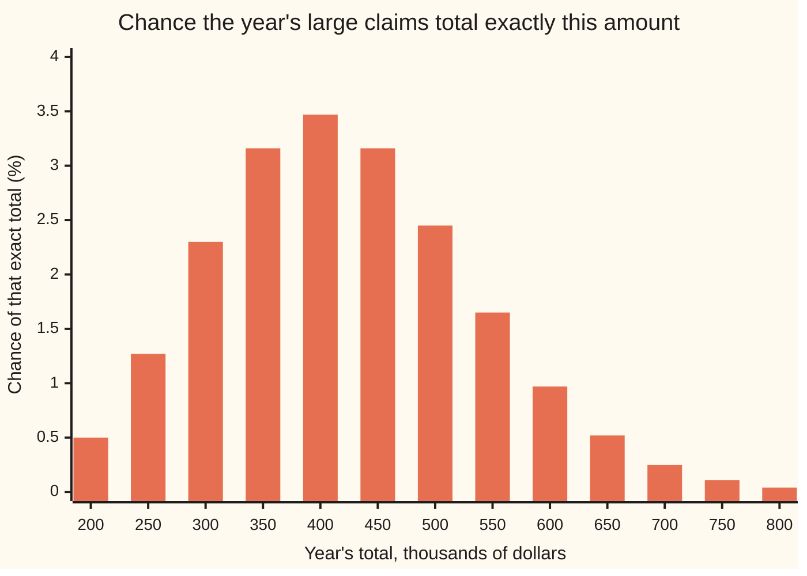
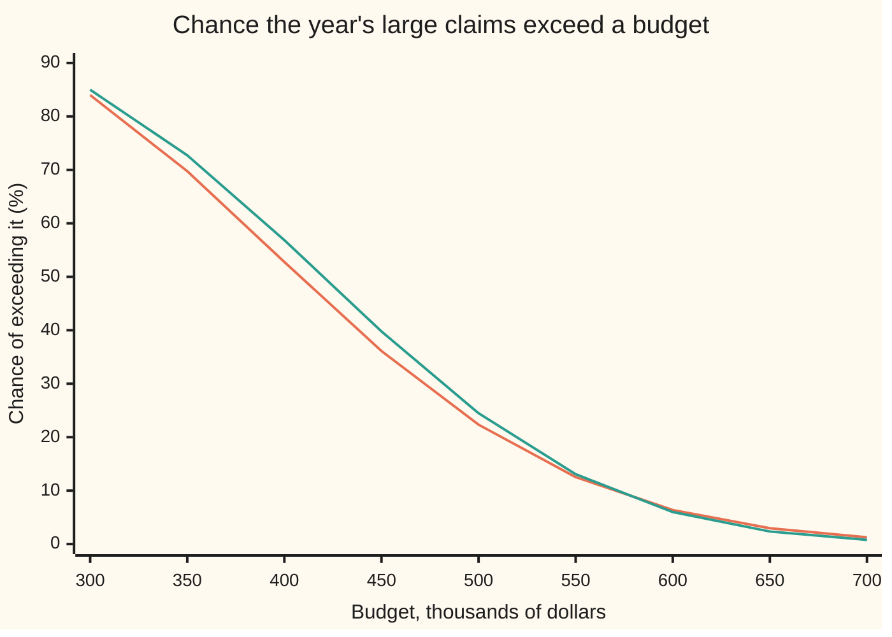

# Panjer's recursion: the aggregate claim distribution computed exactly

[Syllabus](../../../SYLLABUS.md) → [Financial mathematics](../../../SYLLABUS.md#w12) → [Insurance and Actuarial Mathematics](../../../SYLLABUS.md#w12-s51) → Panjer's recursion

---

## General Overview

A motor insurer covers 50,000 cars. Most of its claims are small. The ones that move its results are the large ones: write-offs and injury claims. They arrive at an average of 20 a year. For this calculation each is rounded to a whole multiple of $10,000 (a $10,000 grid): $10,000 half the time, $20,000 three times in ten, $50,000 one time in five.

The average large claim is $21,000, so the average year costs $420,000. The board budgets 120 percent of that: $504,000. The question is how often a year breaks the budget.

The average cannot answer it. The year's total is a random number of random amounts, and the chance of beating a line depends on the whole spread of that total, lumps and long right tail included. Adding up every possible year by brute force means every claim count times every mix of sizes. Harry Panjer showed in 1981 that the whole distribution comes out one grid step at a time, each step a short sum over the claim sizes, with nothing approximated. Here it gives **22.34 percent**: roughly one year in four and a half.

**The chance that the year's total is exactly k grid units is a short weighted sum of the chances already found for smaller totals, so the whole distribution, and any tail of it, is built in one pass from zero upwards.**

**What kind of fact this is:** a method, exact under the compound Poisson model (a random Poisson count of independent claims, from [Aggregate claims](04-collective-risk-and-compound-poisson.md)); the recursion itself is a theorem, proved on this card in Why it works.

### The picture: the whole distribution of the year's large claims



Each bar is the chance of one exact total on the $10,000 grid, sampled every $50,000. The peak sits just below the $420,000 mean. The right side falls away more slowly than the left: a few $50,000 claims in one year stretch the total much further than a quiet year shrinks it. The budget line at $504,000 cuts the tail that the recursion measures.

---

## The formula

Notation first, in words. Count money in grid units of $10,000, so every total is a whole number. Write $q_j$ for the chance that one claim is $j$ units, and $p_k$ for the chance that the year's total is exactly $k$ units. The claim count is Poisson (the standard law for independent arrivals) with mean $\lambda$.

$$p_0 = e^{-\lambda(1-q_0)}, \qquad p_k = \frac{\lambda}{k}\sum_{j=1}^{\min(k,\,m)} j\,q_j\,p_{k-j} \quad (k = 1, 2, 3, \dots)$$

**Read it aloud:** the chance of a total of k units is the claim rate over k, times a sum over claim sizes j of j, times the chance of a size-j claim, times the chance already found for the remaining k minus j units.

Once the $p_k$ are in hand, any tail is a subtraction. With the threshold at $t$ grid units, and $\lfloor t\rfloor$ meaning $t$ rounded down to a whole number:

$$P(S > t\,h) = 1 - \sum_{k=0}^{\lfloor t\rfloor} p_k$$

**Read it aloud:** the chance of beating the threshold is one minus the chances of every total at or below it.

| Symbol | Plain meaning | In our example | Push it up and the answer… |
| --- | --- | --- | --- |
| $S$ | the year's total large claims, in dollars | mean $420,000 | — |
| $K$ | the same total counted in grid units, so $S = hK$ | mean 42 | — |
| $N$, $n$ | the number of large claims in the year, and one particular value of it | mean 20 | — |
| $\lambda$ | the Poisson mean: expected number of claims | 20 | the tail at 120% of the mean falls: bigger books are relatively steadier |
| $h$ | the grid unit | $10,000 | a finer grid tracks the real sizes more closely but needs more steps |
| $X$, $q_j$, $q_0$ | one claim's size in units, the chance it equals $j$, and the chance it is zero | $q_1 = 0.5$, $q_2 = 0.3$, $q_5 = 0.2$, $q_0 = 0$ | more weight on big sizes fattens the tail |
| $p_k$, $p_0$ | chance the year's total is exactly $k$ units; $p_0$ is a total of zero | $p_0 = e^{-20}$ | — |
| $k$, $j$ | a total, and one claim's size, in units | $k$ up to 200 | — |
| $m$ | the largest claim size, in units | 5 | each step's sum gets longer |
| $t$ | the threshold, in units | 50.4, which is $504,000 | the tail shrinks |
| $a$, $b$ | the claim count's two constants in the Panjer family | $a = 0$, $b = 20$ for Poisson | $a > 0$ spreads the count and fattens the tail |
| $e^{-x}$ | the exponential of minus $x$ | $e^{-20}$ is 2.061154 in units of $10^{-9}$ | — |

Two helper facts. The mean total is $\lambda\,\mathrm{E}[X]$: 20 claims of 2.1 units, 42 units, $420,000. The variance (the average squared distance from the mean) is $\lambda\,\mathrm{E}[X^2]$, here 134 square units, a standard deviation of 11.58 units.

The recursion belongs to a family. Any claim count whose chances obey $P(N = n) = (a + b/n)\,P(N = n-1)$ gives

$$p_k = \frac{1}{1 - a\,q_0}\sum_{j=1}^{\min(k,\,m)}\Big(a + \frac{b\,j}{k}\Big)\,q_j\,p_{k-j}$$

**Read it aloud:** the same short sum, with the weight on each claim size split into a flat part a and a size-proportional part b j over k.

The family is called the (a, b, 0) class; the 0 says the rule starts from $P(N = 0)$. Apart from a count that is always zero, it holds exactly three members: Poisson ($a = 0$, $b = \lambda$), binomial ($a < 0$) and negative binomial ($a > 0$). The last one models a book where some drivers are more accident-prone than others.

### When it holds

- **A Poisson count, or another member of the (a, b, 0) class.** Claims that cluster, such as a hailstorm writing off a car park, make the count more spread out than Poisson. The Poisson answer then understates the tail: a negative binomial count with the same mean of 20 moves 22.34 percent to 28.45 percent.
- **Claim sizes independent of each other and of the count.** If a bad year brings both more claims and bigger ones, the recursion computes the distribution of a different book.
- **Sizes on a grid.** Real claims are not whole multiples of $10,000. Rounding them onto a grid is a separate approximation, with its own error; the recursion is exact for the gridded sizes and nothing else.
- **A starting value the computer can hold.** $p_0 = e^{-\lambda(1-q_0)}$ must not underflow. The insurer's whole book at 2,500 claims a year gives $p_0 = e^{-2500}$, far below about $e^{-744}$, the smallest positive number a standard 64-bit floating-point number can hold, so it is stored as 0 and every later $p_k$ follows it to 0.

---

## Why it works

### Step 0: count the total's units by the claim they came from

Take the quantity that equals the total when the total is exactly $k$, and zero otherwise. Its average is $k\,p_k$. That total is a sum of claim sizes, so it is also the sum, over the year's claims, of "this claim's size, if the total is k". A Poisson count has one special property: picking one of the year's claims is the same, on average, as adding one fresh claim to an independent year, with weight $\lambda$. The fresh claim has size $j$ with chance $q_j$, and the independent year must supply the other $k - j$ units, with chance $p_{k-j}$. That gives $k\,p_k = \lambda \sum_j j\,q_j\,p_{k-j}$.

The steps below make each of those sentences exact.

### Step 1: the Poisson ratio

The Poisson chance of $n$ claims is $e^{-\lambda}\lambda^n/n!$. Dividing by the chance of $n - 1$ claims leaves $\lambda/n$, so

$$n\,P(N = n) = \lambda\,P(N = n-1).$$

With $\lambda = 20$: 21 times the chance of 21 claims equals 20 times the chance of 20 claims. This is the "add a fresh claim, weight $\lambda$" of Step 0.

### Step 2: with the count fixed, each claim carries an equal share

Fix the count at $n$. The total $K$ is the sum of $n$ claim sizes, and the claims are interchangeable, so each contributes the same amount to the average of that quantity. That average is therefore $n$ times the first claim's share. The first claim is $j$ units with chance $q_j$, and the other $n - 1$ claims must then add to $k - j$:

$$\mathrm{E}\big[K\,\mathbf 1\{K = k\}\,\big|\,N = n\big] = n\sum_{j} j\,q_j\,P(\text{$n-1$ claims total } k - j).$$

The bold 1 with braces is an indicator: 1 when the event inside happens, 0 when it does not.

### Step 3: average over the count and let the ratio do the work

Weight Step 2 by the chance of $n$ claims and add over $n$. Step 1 turns each $n\,P(N = n)$ into $\lambda\,P(N = n-1)$. What is left, for each $j$, is the chance of $n - 1$ claims times the chance they total $k - j$, added over every $n$: that is exactly $p_{k-j}$. So

$$k\,p_k = \lambda\sum_{j=1}^{\min(k,\,m)} j\,q_j\,p_{k-j}.$$

Divide by $k$ and the recursion is proved. The sum starts at $j = 1$ because a size-zero claim contributes nothing to the total's units.

### Step 4: the starting value

A total of zero needs every claim to be zero units. With $n$ claims that has chance $q_0^n$; averaging over the Poisson count gives $e^{-\lambda}\sum_n (\lambda q_0)^n/n! = e^{-\lambda(1-q_0)}$. Here no claim is zero, $q_0 = 0$, and $p_0 = e^{-20}$: the chance of a year with no large claims at all.

### Step 5: why it is fast and exact

Each $p_k$ uses only earlier values, so the calculation runs forward from zero with no guessing and no truncation of the count. Each step is a sum of at most $m$ terms, here 5. Reaching total $k$ costs about $k$ times $m$ multiplications. Brute force over the count convolves the size distribution with itself once per claim count: about $k$ times more work, and the same answer.

<details>
<summary>Detailed proof: the generating-function route, and the (a, b, 0) family</summary>

**Generating functions.** Put $Q(z) = \sum_j q_j z^j$ for one claim and $P(z) = \sum_k p_k z^k$ for the year, for $0 \le z < 1$. Independent claims multiply generating functions, so $n$ claims give $Q(z)^n$. Averaging over a Poisson count gives $P(z) = \sum_n e^{-\lambda}\lambda^n Q(z)^n/n! = e^{\lambda(Q(z) - 1)}$. At $z = 0$ this is $p_0 = e^{\lambda(q_0 - 1)}$.

Differentiate: $P'(z) = \lambda\,Q'(z)\,P(z)$. On the left the coefficient of $z^{k-1}$ is $k\,p_k$. On the right, $Q'(z) = \sum_{j\ge1} j\,q_j z^{j-1}$ times $P(z) = \sum_\ell p_\ell z^\ell$ has coefficient $\sum_{j=1}^{k} j\,q_j\,p_{k-j}$ at $z^{k-1}$. Two power series that agree on an interval have equal coefficients, so $k\,p_k = \lambda\sum_j j\,q_j\,p_{k-j}$. Both series have non-negative coefficients adding to one, so they and their derivatives converge for $|z| < 1$.

**The (a, b, 0) family.** Suppose $P(N = n) = (a + b/n)\,P(N = n-1)$ for $n \ge 1$. Write $q^{*n}_k$ for the chance that $n$ claims total $k$. Two facts about $n$ interchangeable claims: $q^{*n}_k = \sum_j q_j\,q^{*(n-1)}_{k-j}$ (split off the first claim), and $\frac{1}{n}q^{*n}_k = \sum_j \frac{j}{k}\,q_j\,q^{*(n-1)}_{k-j}$ (each claim carries $1/n$ of the total on average, as in Step 2). Then for $k \ge 1$

$$p_k = \sum_{n\ge1}\Big(a + \frac{b}{n}\Big)P(N = n-1)\,q^{*n}_k = \sum_{j\ge0}\Big(a + \frac{b\,j}{k}\Big)q_j \sum_{n\ge1} P(N = n-1)\,q^{*(n-1)}_{k-j} = \sum_{j\ge0}\Big(a + \frac{b\,j}{k}\Big)q_j\,p_{k-j}.$$

The $j = 0$ term is $a\,q_0\,p_k$; moving it to the left gives the factor $1/(1 - a q_0)$. Poisson has $a = 0$, $b = \lambda$, which returns the card's formula. The negative binomial with mean 20 and variance 60 used in the checks has $a = 2/3$, $b = 6$, and its $p_0$ is its chance of no claims, $3^{-10}$.

</details>

A second road reaches the same numbers with no recursion. Split the 20 expected claims by size: a Poisson count of claims, sorted into bins independently, gives independent Poisson counts in each bin. So the year holds a Poisson(10) number of $10,000 claims, an independent Poisson(6) number of $20,000 claims and an independent Poisson(4) number of $50,000 claims, and the total is $n_1 + 2n_2 + 5n_5$ units. Adding the chances of every triple with a given total gives the distribution directly. The third road, summing over the claim count, is the definition of the compound distribution in [Aggregate claims](04-collective-risk-and-compound-poisson.md).

---

## Worked numbers, by hand

The insurer's large claims: $\lambda = 20$, grid $h = $10,000, sizes 1, 2 and 5 units with chances 0.5, 0.3 and 0.2.

| Step | Arithmetic | Value |
| --- | --- | --- |
| mean claim | 0.5 × 1 + 0.3 × 2 + 0.2 × 5 | 2.1 units, $21,000 |
| mean total | 20 × 2.1 | 42 units, $420,000 |
| threshold | 1.2 × 42 | 50.4 units, $504,000 |
| what counts as a breach | totals are whole units | 51 units or more |
| $p_0$ | $e^{-20}$ | 2.061154 × $10^{-9}$ |
| $p_1$ | (20 / 1) × (1 × 0.5 × $p_0$) | 10 $p_0$ |
| $p_2$ | (20 / 2) × (1 × 0.5 × 10 $p_0$ + 2 × 0.3 × $p_0$) | 56 $p_0$ |
| $p_2$, by the split | two $10,000 claims, 10 × 10 / 2 = 50 $p_0$; or one $20,000 claim, 6 $p_0$ | 56 $p_0$ |
| $p_3$ | (20 / 3) × (1 × 0.5 × 56 $p_0$ + 2 × 0.3 × 10 $p_0$) | 226.666667 $p_0$ |
| $p_4$ to $p_{50}$ | the same step 47 more times | chance of 50 units or less, 0.7765595112 |
| **the tail** | 1 − 0.7765595112 | **0.223440, or 22.34%** |

In $p_3$ the size-5 term is absent: a $50,000 claim cannot fit inside a $30,000 total. From a total of 5 units on, it joins the sum.

The large claims break a $504,000 budget in about 22 years out of 100. A budget broken only one year in twenty sits much higher: $600,000 is still beaten 6.38 percent of the time, and $630,000, 150 percent of the mean, 4.08 percent.

### What breaks if you drop a piece

| Mistake | Comes out at | What went wrong |
| --- | --- | --- |
| A bell curve with the right mean and spread, at 120% | 23.40% | Near the middle it is off by about a point; the real total is lumpy and skewed |
| The same bell curve at 150% of the mean | 3.48%, against 4.08% | The bell curve's tail is too thin, and the gap widens further out |
| $500,000 counted as breaking a $504,000 budget | 24.79% | The total sits on a $10,000 grid; 50 units does not beat 50.4 |
| The weight $j$ dropped from the sum | chances adding to 0.002029, not 1 | Without $j$ the recursion is no longer the Poisson ratio at work |
| The whole book at 2,500 claims a year | every chance 0.000000 | $e^{-2500}$ underflows; start from a smaller $\lambda$ and combine, or work in logarithms |

The code prints every number in this table.

### The tail, exact against the bell curve



The orange line is the exact tail from the recursion. The green line is the bell curve with mean $420,000 and standard deviation 11.58 units. They cross between $550,000 and $600,000. Left of the crossing the bell curve overstates the chance; right of it, where capital is set, it understates, and at $700,000 it gives 0.78 percent against a true 1.27 percent.

### One question, several answers

```
chance a year beats the budget, one block = 1 percentage point
Panjer, $504,000 budget      ██████████████████████         22.34
simulation, 200,000 years    ██████████████████████         22.29
bell curve, $504,000         ███████████████████████        23.40
$500,000 counted as breach   ████████████████████████▊      24.79
negative binomial count      ████████████████████████████▍  28.45
```

The first two agree to simulation noise. The next two are the mistakes above. The last is a different model of the count: same 20 claims on average, more spread.

---

## Code, from first principles, and it actually runs

Both programs build the distribution of the year's total four independent ways: the recursion; three independent Poisson counts, one per claim size; a sum over the claim count with the sizes convolved by hand; and a simulation of 200,000 years with a hand-written random number generator. The first three agree to ten decimal places, because each is exact. The checks then confirm that the distribution's own mean and variance equal $\lambda\,\mathrm{E}[X]$ and $\lambda\,\mathrm{E}[X^2]$, run the negative binomial member of the family against its closed-form count chances, confirm that 25 claims a year with one in five settling at zero reproduce both years (which tests every $q_0$ term), and print every mistake on the card. The bell curve's area is computed by Simpson's rule, not taken from a library.

### Python

```python
# Panjer's recursion -- the check behind the card.  Standard library only;
# nothing imported contains the answer.  A motor insurer's 50,000 policies
# give 20 large claims a year on average (Poisson).  Sizes on a $10,000 grid:
# 1 unit 50%, 2 units 30%, 5 units 20%.  Question: the chance that the year's
# total beats 120% of its expected value.  Four roads, then the mistakes.
from math import exp, sqrt

LAM, Q, KMAX = 20.0, [0.0, 0.5, 0.3, 0.0, 0.0, 0.2], 200

def panjer(a, b, p0, q, kmax):           # road 1: the (a, b, 0) recursion
    p = [p0] + [0.0] * kmax
    for k in range(1, kmax + 1):
        s = 0.0
        for j in range(1, min(k, len(q) - 1) + 1):
            s += (a + b * j / k) * q[j] * p[k - j]
        p[k] = s / (1.0 - a * q[0])
    return p

def poisson(mu, n):                      # e^-mu mu^n / n!, written out
    v = exp(-mu)
    for i in range(1, n + 1):
        v *= mu / i
    return v
def by_count(weight, q, kmax):           # road 3: sum over the claim count
    out, conv = [0.0] * (kmax + 1), [1.0] + [0.0] * kmax     # conv = q^{*n}
    for n in range(kmax + 1):            # every claim is >= 1 unit, so n <= kmax
        w = weight(n)
        for k in range(kmax + 1):
            out[k] += w * conv[k]
        new = [0.0] * (kmax + 1)
        for k in range(kmax + 1):
            for j in range(1, min(k, len(q) - 1) + 1):
                new[k] += q[j] * conv[k - j]
        conv = new
    return out
def row(label, v, d=6):                 # one labelled number per line
    print(f"{label:<38}{v:.{d}f}")
def normal_cdf(z):                       # 0.5 + Simpson's rule on the bell curve
    n, h = 2000, z / 2000
    s = 1.0 + exp(-z * z / 2)
    for i in range(1, n):
        s += (4 if i % 2 else 2) * exp(-(i * h) * (i * h) / 2)
    return 0.5 + s * h / 3 / sqrt(2 * 3.141592653589793)
state = 20260928                         # road 4: splitmix64, then Knuth's Poisson
def uniform():
    global state
    state = (state + 0x9E3779B97F4A7C15) & 0xFFFFFFFFFFFFFFFF
    z = state
    z = ((z ^ (z >> 30)) * 0xBF58476D1CE4E5B9) & 0xFFFFFFFFFFFFFFFF
    z = ((z ^ (z >> 27)) * 0x94D049BB133111EB) & 0xFFFFFFFFFFFFFFFF
    return ((z ^ (z >> 31)) >> 11) / 9007199254740992.0

p = panjer(0.0, LAM, exp(-LAM * (1 - Q[0])), Q, KMAX)
split = [0.0] * (KMAX + 1)               # road 2: 10 + 6 + 4 independent Poissons
c1, c2, c5 = ([poisson(mu, n) for n in range(KMAX + 1)] for mu in (10.0, 6.0, 4.0))
for n5 in range(KMAX // 5 + 1):
    for n2 in range((KMAX - 5 * n5) // 2 + 1):
        for n1 in range(KMAX - 5 * n5 - 2 * n2 + 1):
            split[n1 + 2 * n2 + 5 * n5] += c1[n1] * c2[n2] * c5[n5]
conv = by_count(lambda n: poisson(LAM, n), Q, KMAX)
ex = sum(j * x for j, x in enumerate(Q))
ex2 = sum(j * j * x for j, x in enumerate(Q))
mean, var = LAM * ex, LAM * ex2
t = int(1.2 * mean)                      # 50.4 units: beating it means K >= 51
tail = 1.0 - sum(p[:t + 1])
tail_split, tail_conv = 1.0 - sum(split[:t + 1]), 1.0 - sum(conv[:t + 1])
years, hits, limit = 200000, 0, exp(-LAM)
for _ in range(years):
    n, prod = 0, uniform()
    while prod > limit:
        n, prod = n + 1, prod * uniform()
    total = 0
    for _ in range(n):
        u = uniform()
        total += 1 if u < 0.5 else (2 if u < 0.8 else 5)
    hits += total > t
m_d = sum(k * x for k, x in enumerate(p))
v_d = sum(k * k * x for k, x in enumerate(p)) - m_d * m_d
t150 = int(1.5 * mean)                   # 63 units
tail150 = 1.0 - sum(p[:t150 + 1])
nb = panjer(2.0 / 3.0, 6.0, 3.0 ** -10, Q, KMAX)           # r = 10, beta = 2
def nb_weight(n):                        # C(n+9, 9) (1/3)^10 (2/3)^n, closed form
    c = 1
    for i in range(1, 10):
        c = c * (n + i) // i
    return c * (1.0 / 3.0) ** 10 * (2.0 / 3.0) ** n
nb_conv = by_count(nb_weight, Q, KMAX)
nb_tail = 1.0 - sum(nb[:t + 1])
Q0 = [0.2, 0.4, 0.24, 0.0, 0.0, 0.16]    # 25 claims a year, one in five settles at zero
thin = panjer(0.0, 25.0, exp(-25.0 * (1 - Q0[0])), Q0, KMAX)  # the same year as p
nb_thin = panjer(5.0 / 7.0, 45.0 / 7.0, 3.0 ** -10, Q0, KMAX)  # r = 10, beta = 2.5: same as nb
no_j = [exp(-LAM)] + [0.0] * KMAX        # mistake: weight j dropped from the sum
for k in range(1, KMAX + 1):
    no_j[k] = LAM / k * sum(Q[j] * no_j[k - j] for j in range(1, min(k, 5) + 1))
big = panjer(0.0, 2500.0, exp(-2500.0), Q, 50)
def tail120(lam, q):                     # try-changing runs: 120% of the new mean
    pp = panjer(0.0, lam, exp(-lam * (1 - q[0])), q, KMAX)
    return 1.0 - sum(pp[:int(1.2 * lam * sum(j * x for j, x in enumerate(q))) + 1])

row("mean claim, units of $10,000", ex)
row("mean total, units", mean)
row("sd of total, units", sqrt(var))
row("threshold 120% of mean, units", 1.2 * mean)
row("p0 = e^-20, times 10^9", p[0] * 1e9)
for k in (1, 2, 3):
    row(f"p{k} / p0, road 1 Panjer", p[k] / p[0])
row("P(K <= 50), road 1 Panjer", 1 - tail, 10)
row("P(K <= 50), road 2 Poisson split", 1 - tail_split, 10)
row("P(K <= 50), road 3 sum over count", 1 - tail_conv, 10)
row("tail, road 1 Panjer", tail)
row("tail, road 4 simulated 200,000 years", hits / years)
row("mean from the distribution, units", m_d)
row("variance from the distribution", v_d)
row("variance lambda E[X^2]", var)
row("p2 / p0, road 2 Poisson split", split[2] / split[0])
row("tail beyond 150% of mean (K > 63)", tail150)
row("negative binomial count, tail", nb_tail)
row("  same by closed-form count weights", 1.0 - sum(nb_conv[:t + 1]))
row("wrong: normal curve at 120%", 1 - normal_cdf((1.2 * mean - mean) / sqrt(var)))
row("wrong: normal curve at 150%", 1 - normal_cdf((1.5 * mean - mean) / sqrt(var)))
row("wrong: counted $500,000 as a breach", 1.0 - sum(p[:t]))
row("wrong: j dropped, total probability", sum(no_j))
row("wrong: lambda 2500, total of p0..p50", sum(big))
row("try: 25 claims a year, tail at 120%", tail120(25.0, Q))
row("try: $50,000 claims 30%, $10k 40%", tail120(LAM, [0.0, 0.4, 0.3, 0.0, 0.0, 0.3]))
row("try: sizes 1 unit only, tail at 120%", tail120(LAM, [0.0, 1.0]))
ks, xs = range(20, 81, 5), range(30, 71, 5)
print("chart, total $k   " + " ".join(f"{10 * k:6d}" for k in ks))
print("chart, p_k in %   " + " ".join(f"{100 * p[k]:6.2f}" for k in ks))
print("chart, over $k    " + " ".join(f"{10 * x:6d}" for x in xs))
print("chart, exact %    " + " ".join(f"{100 * (1 - sum(p[:x + 1])):6.2f}" for x in xs))
print("chart, normal %   " + " ".join(f"{100 * (1 - normal_cdf((x - mean) / sqrt(var))):6.2f}" for x in xs))

assert max(abs(a - b) for a, b in zip(p, split)) < 1e-15          # recursion vs split
assert abs(tail - tail_conv) < 1e-12 and abs(tail - tail_split) < 1e-12
assert abs(hits / years - tail) < 0.006                            # about 6 standard errors
assert abs(m_d - mean) < 1e-9 and abs(v_d - var) < 1e-6           # moments vs lambda E[X]
assert max(abs(a - b) for a, b in zip(nb, nb_conv)) < 1e-15       # (a, b, 0) vs closed form
assert max(abs(a - b) for a, b in zip(p + nb, thin + nb_thin)) < 1e-15  # q0 > 0 terms
print("ALL CHECKS PASS")
```

**Ran 2026-09-28 on macOS, Python 3.14.6, standard library only. All checks passed. Output, pasted from the run:**

```
mean claim, units of $10,000          2.100000
mean total, units                     42.000000
sd of total, units                    11.575837
threshold 120% of mean, units         50.400000
p0 = e^-20, times 10^9                2.061154
p1 / p0, road 1 Panjer                10.000000
p2 / p0, road 1 Panjer                56.000000
p3 / p0, road 1 Panjer                226.666667
P(K <= 50), road 1 Panjer             0.7765595112
P(K <= 50), road 2 Poisson split      0.7765595112
P(K <= 50), road 3 sum over count     0.7765595112
tail, road 1 Panjer                   0.223440
tail, road 4 simulated 200,000 years  0.222870
mean from the distribution, units     42.000000
variance from the distribution        134.000000
variance lambda E[X^2]                134.000000
p2 / p0, road 2 Poisson split         56.000000
tail beyond 150% of mean (K > 63)     0.040794
negative binomial count, tail         0.284510
  same by closed-form count weights   0.284510
wrong: normal curve at 120%           0.234027
wrong: normal curve at 150%           0.034829
wrong: counted $500,000 as a breach   0.247943
wrong: j dropped, total probability   0.002029
wrong: lambda 2500, total of p0..p50  0.000000
try: 25 claims a year, tail at 120%   0.193653
try: $50,000 claims 30%, $10k 40%     0.212228
try: sizes 1 unit only, tail at 120%  0.156773
chart, total $k      200    250    300    350    400    450    500    550    600    650    700    750    800
chart, p_k in %     0.50   1.27   2.30   3.16   3.47   3.16   2.45   1.65   0.97   0.52   0.25   0.11   0.04
chart, over $k       300    350    400    450    500    550    600    650    700
chart, exact %     83.99  69.76  52.77  36.12  22.34  12.52   6.38   2.97   1.27
chart, normal %    85.00  72.73  56.86  39.78  24.48  13.07   6.00   2.35   0.78
ALL CHECKS PASS
```

### Rust

Same numbers, same labels, built with `rustc --edition 2021 -O`.

```rust
// Panjer's recursion -- the same check as the Python, in Rust.  No crates;
// nothing imported contains the answer.  A motor insurer's 50,000 policies
// give 20 large claims a year on average (Poisson).  Sizes on a $10,000 grid:
// 1 unit 50%, 2 units 30%, 5 units 20%.  Question: the chance that the year's
// total beats 120% of its expected value.  Four roads, then the mistakes.
const LAM: f64 = 20.0;
const Q: [f64; 6] = [0.0, 0.5, 0.3, 0.0, 0.0, 0.2];
const KMAX: usize = 200;

fn panjer(a: f64, b: f64, p0: f64, q: &[f64], kmax: usize) -> Vec<f64> {  // road 1
    let mut p = vec![0.0; kmax + 1];
    p[0] = p0;
    for k in 1..=kmax {
        let mut s = 0.0;
        for j in 1..=k.min(q.len() - 1) {
            s += (a + b * j as f64 / k as f64) * q[j] * p[k - j];
        }
        p[k] = s / (1.0 - a * q[0]);
    }
    p
}

fn poisson(mu: f64, n: usize) -> f64 {           // e^-mu mu^n / n!, written out
    let mut v = (-mu).exp();
    for i in 1..=n { v *= mu / i as f64 }
    v
}

fn by_count(weight: &dyn Fn(usize) -> f64, q: &[f64], kmax: usize) -> Vec<f64> {  // road 3
    let (mut out, mut conv) = (vec![0.0; kmax + 1], vec![0.0; kmax + 1]);
    conv[0] = 1.0;                                // conv = q^{*n}
    for n in 0..=kmax {                           // every claim is >= 1 unit, so n <= kmax
        let w = weight(n);
        for k in 0..=kmax { out[k] += w * conv[k] }
        let mut new = vec![0.0; kmax + 1];
        for k in 0..=kmax {
            for j in 1..=k.min(q.len() - 1) { new[k] += q[j] * conv[k - j] }
        }
        conv = new;
    }
    out
}

fn row(label: &str, v: f64, d: usize) { println!("{:<38}{:.*}", label, d, v) }

fn normal_cdf(z: f64) -> f64 {                    // 0.5 + Simpson's rule on the bell curve
    let (n, h) = (2000, z / 2000.0);
    let mut s = 1.0 + (-z * z / 2.0).exp();
    for i in 1..n {
        let x = i as f64 * h;
        s += (if i % 2 == 1 { 4.0 } else { 2.0 }) * (-x * x / 2.0).exp();
    }
    0.5 + s * h / 3.0 / (2.0 * 3.141592653589793f64).sqrt()
}

struct SplitMix(u64);                             // road 4: splitmix64, then Knuth's Poisson
impl SplitMix {
    fn uniform(&mut self) -> f64 {
        self.0 = self.0.wrapping_add(0x9E3779B97F4A7C15);
        let mut z = self.0;
        z = (z ^ (z >> 30)).wrapping_mul(0xBF58476D1CE4E5B9);
        z = (z ^ (z >> 27)).wrapping_mul(0x94D049BB133111EB);
        ((z ^ (z >> 31)) >> 11) as f64 / 9007199254740992.0
    }
}

fn tail_upto(p: &[f64], x: usize) -> f64 { 1.0 - p[..=x].iter().sum::<f64>() }

fn tail120(lam: f64, q: &[f64]) -> f64 {          // try-changing runs: 120% of the new mean
    let pp = panjer(0.0, lam, (-lam * (1.0 - q[0])).exp(), q, KMAX);
    let m: f64 = q.iter().enumerate().map(|(j, x)| j as f64 * x).sum();
    tail_upto(&pp, (1.2 * lam * m) as usize)
}

fn main() {
    let p = panjer(0.0, LAM, (-LAM * (1.0 - Q[0])).exp(), &Q, KMAX);
    let mut split = vec![0.0; KMAX + 1];          // road 2: 10 + 6 + 4 independent Poissons
    let c: Vec<Vec<f64>> = [10.0, 6.0, 4.0].iter().map(|&mu| (0..=KMAX).map(|n| poisson(mu, n)).collect()).collect();
    for n5 in 0..=KMAX / 5 {
        for n2 in 0..=(KMAX - 5 * n5) / 2 {
            for n1 in 0..=KMAX - 5 * n5 - 2 * n2 {
                split[n1 + 2 * n2 + 5 * n5] += c[0][n1] * c[1][n2] * c[2][n5];
            }
        }
    }
    let conv = by_count(&|n| poisson(LAM, n), &Q, KMAX);
    let ex: f64 = Q.iter().enumerate().map(|(j, x)| j as f64 * x).sum();
    let ex2: f64 = Q.iter().enumerate().map(|(j, x)| (j * j) as f64 * x).sum();
    let (mean, var) = (LAM * ex, LAM * ex2);
    let t = (1.2 * mean) as usize;                // 50.4 units: beating it means K >= 51
    let (tail, tail_split, tail_conv) = (tail_upto(&p, t), tail_upto(&split, t), tail_upto(&conv, t));
    let (years, mut hits) = (200000, 0);
    let limit = (-LAM).exp();
    let mut rng = SplitMix(20260928);
    for _ in 0..years {
        let (mut n, mut prod) = (0, rng.uniform());
        while prod > limit { n += 1; prod *= rng.uniform() }
        let mut total = 0;
        for _ in 0..n {
            let u = rng.uniform();
            total += if u < 0.5 { 1 } else if u < 0.8 { 2 } else { 5 };
        }
        if total > t { hits += 1 }
    }
    let m_d: f64 = p.iter().enumerate().map(|(k, x)| k as f64 * x).sum();
    let v_d: f64 = p.iter().enumerate().map(|(k, x)| (k * k) as f64 * x).sum::<f64>() - m_d * m_d;
    let tail150 = tail_upto(&p, (1.5 * mean) as usize);     // 63 units
    let nb = panjer(2.0 / 3.0, 6.0, 3f64.powi(-10), &Q, KMAX);  // r = 10, beta = 2
    let nb_weight = |n: usize| -> f64 {           // C(n+9, 9) (1/3)^10 (2/3)^n, closed form
        let mut c: u64 = 1;
        for i in 1..10u64 { c = c * (n as u64 + i) / i }
        c as f64 * (1.0f64 / 3.0).powi(10) * (2.0f64 / 3.0).powi(n as i32)
    };
    let nb_conv = by_count(&nb_weight, &Q, KMAX);
    let nb_tail = tail_upto(&nb, t);
    let q0 = [0.2f64, 0.4, 0.24, 0.0, 0.0, 0.16]; // 25 claims a year, one in five settles at zero
    let thin = panjer(0.0, 25.0, (-25.0 * (1.0 - q0[0])).exp(), &q0, KMAX);  // the same year as p
    let nb_thin = panjer(5.0 / 7.0, 45.0 / 7.0, 3f64.powi(-10), &q0, KMAX); // r = 10, beta = 2.5: same as nb
    let mut no_j = vec![0.0; KMAX + 1];           // mistake: weight j dropped from the sum
    no_j[0] = (-LAM).exp();
    for k in 1..=KMAX {
        no_j[k] = LAM / k as f64 * (1..=k.min(5)).map(|j| Q[j] * no_j[k - j]).sum::<f64>();
    }
    let big = panjer(0.0, 2500.0, (-2500.0f64).exp(), &Q, 50);

    row("mean claim, units of $10,000", ex, 6);
    row("mean total, units", mean, 6);
    row("sd of total, units", var.sqrt(), 6);
    row("threshold 120% of mean, units", 1.2 * mean, 6);
    row("p0 = e^-20, times 10^9", p[0] * 1e9, 6);
    for k in 1..=3 { row(&format!("p{} / p0, road 1 Panjer", k), p[k] / p[0], 6) }
    row("P(K <= 50), road 1 Panjer", 1.0 - tail, 10);
    row("P(K <= 50), road 2 Poisson split", 1.0 - tail_split, 10);
    row("P(K <= 50), road 3 sum over count", 1.0 - tail_conv, 10);
    row("tail, road 1 Panjer", tail, 6);
    row("tail, road 4 simulated 200,000 years", hits as f64 / years as f64, 6);
    row("mean from the distribution, units", m_d, 6);
    row("variance from the distribution", v_d, 6);
    row("variance lambda E[X^2]", var, 6);
    row("p2 / p0, road 2 Poisson split", split[2] / split[0], 6);
    row("tail beyond 150% of mean (K > 63)", tail150, 6);
    row("negative binomial count, tail", nb_tail, 6);
    row("  same by closed-form count weights", tail_upto(&nb_conv, t), 6);
    row("wrong: normal curve at 120%", 1.0 - normal_cdf((1.2 * mean - mean) / var.sqrt()), 6);
    row("wrong: normal curve at 150%", 1.0 - normal_cdf((1.5 * mean - mean) / var.sqrt()), 6);
    row("wrong: counted $500,000 as a breach", tail_upto(&p, t - 1), 6);
    row("wrong: j dropped, total probability", no_j.iter().sum::<f64>(), 6);
    row("wrong: lambda 2500, total of p0..p50", big.iter().sum::<f64>(), 6);
    row("try: 25 claims a year, tail at 120%", tail120(25.0, &Q), 6);
    row("try: $50,000 claims 30%, $10k 40%", tail120(LAM, &[0.0, 0.4, 0.3, 0.0, 0.0, 0.3]), 6);
    row("try: sizes 1 unit only, tail at 120%", tail120(LAM, &[0.0, 1.0]), 6);
    let (ks, xs): (Vec<usize>, Vec<usize>) = ((20..=80).step_by(5).collect(), (30..=70).step_by(5).collect());
    let line = |label: &str, v: Vec<String>| println!("{:<18}{}", label, v.join(" "));
    line("chart, total $k", ks.iter().map(|k| format!("{:6}", 10 * k)).collect());
    line("chart, p_k in %", ks.iter().map(|&k| format!("{:6.2}", 100.0 * p[k])).collect());
    line("chart, over $k", xs.iter().map(|x| format!("{:6}", 10 * x)).collect());
    line("chart, exact %", xs.iter().map(|&x| format!("{:6.2}", 100.0 * tail_upto(&p, x))).collect());
    line("chart, normal %", xs.iter().map(|&x| format!("{:6.2}", 100.0 * (1.0 - normal_cdf((x as f64 - mean) / var.sqrt())))).collect());

    let gap = |a: &[f64], b: &[f64]| a.iter().zip(b).map(|(x, y)| (x - y).abs()).fold(0.0, f64::max);
    assert!(gap(&p, &split) < 1e-15);                                   // recursion vs split
    assert!((tail - tail_conv).abs() < 1e-12 && (tail - tail_split).abs() < 1e-12);
    assert!((hits as f64 / years as f64 - tail).abs() < 0.006);         // about 6 standard errors
    assert!((m_d - mean).abs() < 1e-9 && (v_d - var).abs() < 1e-6);     // moments vs lambda E[X]
    assert!(gap(&nb, &nb_conv) < 1e-15);                                // (a, b, 0) vs closed form
    assert!(gap(&p, &thin) < 1e-15 && gap(&nb, &nb_thin) < 1e-15);     // q0 > 0 terms
    println!("ALL CHECKS PASS");
}
```

**Ran 2026-09-28 on macOS, rustc 1.98.1, no crates. All checks passed. Output, pasted from the run:**

```
mean claim, units of $10,000          2.100000
mean total, units                     42.000000
sd of total, units                    11.575837
threshold 120% of mean, units         50.400000
p0 = e^-20, times 10^9                2.061154
p1 / p0, road 1 Panjer                10.000000
p2 / p0, road 1 Panjer                56.000000
p3 / p0, road 1 Panjer                226.666667
P(K <= 50), road 1 Panjer             0.7765595112
P(K <= 50), road 2 Poisson split      0.7765595112
P(K <= 50), road 3 sum over count     0.7765595112
tail, road 1 Panjer                   0.223440
tail, road 4 simulated 200,000 years  0.222870
mean from the distribution, units     42.000000
variance from the distribution        134.000000
variance lambda E[X^2]                134.000000
p2 / p0, road 2 Poisson split         56.000000
tail beyond 150% of mean (K > 63)     0.040794
negative binomial count, tail         0.284510
  same by closed-form count weights   0.284510
wrong: normal curve at 120%           0.234027
wrong: normal curve at 150%           0.034829
wrong: counted $500,000 as a breach   0.247943
wrong: j dropped, total probability   0.002029
wrong: lambda 2500, total of p0..p50  0.000000
try: 25 claims a year, tail at 120%   0.193653
try: $50,000 claims 30%, $10k 40%     0.212228
try: sizes 1 unit only, tail at 120%  0.156773
chart, total $k      200    250    300    350    400    450    500    550    600    650    700    750    800
chart, p_k in %     0.50   1.27   2.30   3.16   3.47   3.16   2.45   1.65   0.97   0.52   0.25   0.11   0.04
chart, over $k       300    350    400    450    500    550    600    650    700
chart, exact %     83.99  69.76  52.77  36.12  22.34  12.52   6.38   2.97   1.27
chart, normal %    85.00  72.73  56.86  39.78  24.48  13.07   6.00   2.35   0.78
ALL CHECKS PASS
```

The two outputs match line for line, the simulated years included: both languages run the same splitmix64 generator from the same seed.

> [!TIP]
> **Try changing**
> Guess first, then look at the `try:` lines in the output, which run each change with the budget reset to 120 percent of the new mean.
> - **A bigger book.** Raise the claim rate from 20 to 25 a year. Guess: more claims, more risk? The tail at 120 percent falls to 19.37 percent. Relative spread shrinks as a book grows, which is why insurers want scale.
> - **Heavier claims.** Move one chance in ten from $10,000 claims to $50,000 claims. The mean rises, the budget with it, and the tail at 120 percent is 21.22 percent: heavier claims, but the budget grew too.
> - **Every claim the same size.** Make every claim $10,000. The total is then just the claim count, Poisson with mean 20, and the tail at 120 percent is 15.68 percent. Variation in size adds spread, and spread feeds the tail.
> - **Break the recursion.** Change `b * j / k` to `b / k` in `panjer`. The first assert stops the run: the recursion no longer matches the three-Poisson split.

---

## The usual mistake

> [!warning]
> **Treating the year's total as a bell curve because it is a sum of many claims.** A sum of 20 claims on average, with a random count and a few $50,000 claims, is still lumpy and skewed to the right. The bell curve with the right mean and spread says 23.40 percent at the $504,000 budget, close to the true 22.34 percent, and that closeness is the trap: at 150 percent of the mean it says 3.48 percent where the truth is 4.08 percent, and at $700,000 it says 0.78 percent against 1.27 percent. Capital is set in exactly that far tail.
>
> - **Budget boundaries on a grid.** Totals move in $10,000 steps. Beating $504,000 means 51 units or more; counting 50 units as a breach gives 24.79 percent.
> - **Dropping the weight $j$.** The recursion without $j$ produces chances that add to 0.002029, not 1. Checking that the $p_k$ add to one catches it at once.
> - **Feeding the whole book in at once.** With 2,500 claims a year, $e^{-2500}$ is below the smallest positive double, so $p_0$ and every later $p_k$ come out 0. The fix is to compute for a fraction of the rate and combine, or to carry logarithms.
> - **Forgetting zero-size claims in $p_0$.** If some reported claims settle at nothing, $q_0 > 0$ and the start is $e^{-\lambda(1-q_0)}$, not $e^{-\lambda}$: a year with claims can still total zero.

---

## Where you meet it in real life

- **Setting capital for an insurer.** Solvency rules ask how much money covers a bad year at a stated confidence; for a line of business with a count and a size model, the recursion gives the tail exactly instead of by simulation.
- **Pricing stop-loss and excess-of-loss reinsurance.** A cover that pays the part of the year's total above a line is priced from the same $p_k$; see [Credibility and reinsurance](08-credibility-and-reinsurance.md).
- **Operational risk at banks.** Loss-distribution models for fraud and system failures pair a count with a size, and the aggregate is computed the same way.
- **Credit portfolio models.** CreditRisk+, a published portfolio credit model, uses a Panjer-type recursion to get the distribution of default losses on a grid of exposure bands.
- **Ruin over many years.** A single year's total feeds the question of whether surplus survives a run of years, the subject of [Ruin](06-ruin-theory-and-lundberg.md).

> **Say it back**
> The year's total is a random number of random claims, and its tail is what a budget or a capital figure needs. Put the claim sizes on a grid and the chance of each exact total is a short weighted sum of the chances for smaller totals. For a Poisson count the weight on a size-j claim is the rate times j over k, and the start is the chance of no claims. For the insurer's 20 large claims a year the chance of beating 120 percent of the mean is 22.34 percent, confirmed three other ways. A bell curve comes close in the middle and misses in the far tail.

---

## What this builds on

- [Aggregate claims](04-collective-risk-and-compound-poisson.md): the model of a Poisson count of independent claims, its mean and variance, and the sum over the count that the recursion replaces.

## Where this goes next

- [Reserving](07-reserving-chain-ladder-and-bornhuetter-ferguson.md): estimating how much of a year's claims is still to be paid, from the pattern of past payments.

This card treats the year's claims as settled the moment they happen; in practice large claims are paid over several years, and how much of this year's total is still owed at any date is the question reserving answers.

---

## Sources

Verified 2026-09-28: every link below resolves to the publisher's page.

- Panjer, Harry H. "Recursive evaluation of a family of compound distributions." *ASTIN Bulletin* 12(1), 1981, 22–26. [DOI 10.1017/S0515036100006796](https://doi.org/10.1017/S0515036100006796). The original paper: the recursion for the (a, b, 0) family, with a short algebraic proof.
- Klugman, Stuart A., Harry H. Panjer and Gordon E. Willmot. *Loss Models: From Data to Decisions*, 5th ed. Wiley, 2019. [Publisher page](https://www.wiley.com/en-us/Loss+Models%3A+From+Data+to+Decisions%2C+5th+Edition-p-9781119523789). The standard text: the (a, b, 0) class, the recursion, and discretising continuous claim sizes.
- Shi, Peng, and Lisa Gao, principal authors of the initial version. *Loss Data Analytics*, Chapter 5, "Aggregate Loss Models." [Open textbook chapter](https://openacttexts.github.io/Loss-Data-Analytics/ChapAggLossModels.html). Free: the collective risk model, the recursive method and its Poisson case, with worked examples.
