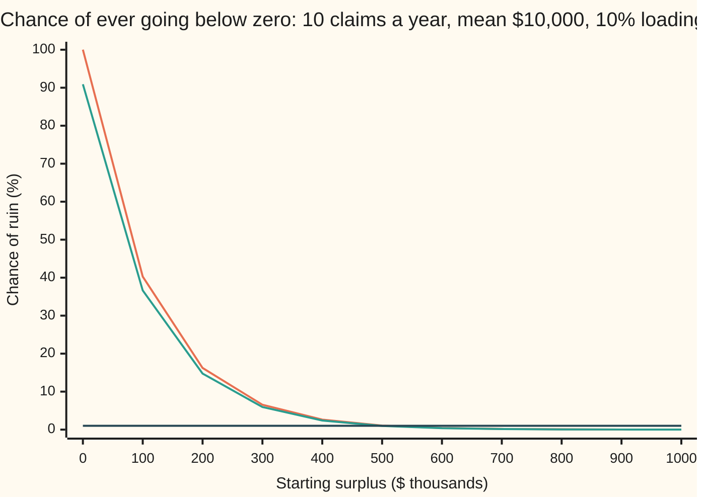
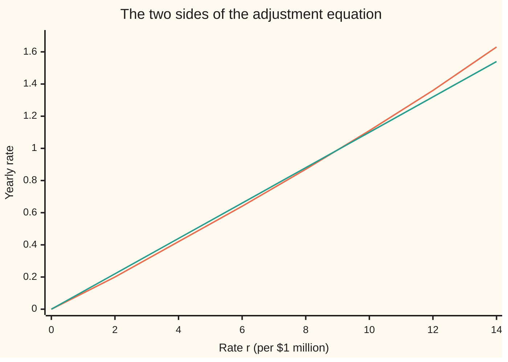

# Ruin: the chance an insurer's surplus ever goes below zero

Financial mathematics → Insurance and Actuarial Mathematics → Surviving the claims forever → Ruin

---

## General Overview

A small insurer opens its doors with \$1 million in the bank. It expects 10 claims a year, and a claim costs \$10,000 on average. So it expects to pay \$100,000 a year. It charges \$110,000 a year in premiums: 10% more than the claims it expects. That extra 10% is the **safety loading**.

On average, the bank balance climbs by \$10,000 a year. But claims do not arrive on average. They arrive at random, in random sizes. A bad run early on could empty the account before the loading has time to pile up. The question is how likely that is, with no end date: the chance the balance *ever*, in all future time, drops below zero.

That event is called **ruin**. The money in the bank, premiums in minus claims out, is the **surplus**. The answer for this insurer is about 0.01%: roughly one chance in ten thousand. The card derives a single number, the **adjustment coefficient**, from the claim pattern and the premium. Every extra \$110,000 of starting surplus then divides the chance of ruin by e, about 2.72. That exponential shield is **Lundberg's inequality**, found by Filip Lundberg in 1903 and made rigorous by Harald Cramér around 1930.

**The chance of ruin is at most e to the minus (adjustment coefficient times starting surplus), where the adjustment coefficient is the one rate at which exponential claim growth exactly balances premium income.**

**What kind of fact this is:** a model — claims are *taken* to arrive like a Poisson stream with independent sizes, an assumption that fits some portfolios well and storms badly — and, inside it, a theorem: Lundberg's inequality, proved on this card in Why it works.

### The picture: ruin chance against starting surplus



Top line, orange: Lundberg's upper bound. Middle line, green: the exact ruin chance, which this claim pattern allows in closed form. Flat line, dark: a 1% target. Both curves fall by the same factor for every \$100,000 added; the bound sits 10% above the exact value all the way along. The bound drops under 1% between \$500,000 and \$600,000 of surplus. At \$1 million both read 0.01%.

---

## The formula

Notation first, in words. The surplus at time $t$ years is $U_t$. The number of claims so far is $N_t$. The claims themselves are $X_1, X_2, \ldots$, each a random dollar amount. The **Cramér–Lundberg model** says

$$U_t = u + c\,t - \sum_{i=1}^{N_t} X_i .$$

**Read it aloud:** the surplus now is the starting money, plus premiums collected so far, minus every claim paid so far.

Between claims the surplus climbs in a straight line at $c$ dollars a year. At each claim it drops by that claim's size. Ruin happens at the first time $\tau$ that $U_t$ falls below zero. The **ruin probability** $\psi(u)$ ("psi of u") is the chance that $\tau$ ever arrives.

The adjustment coefficient $R$ is the positive number that solves

$$\lambda\,\bigl(M_X(R) - 1\bigr) = c\,R, \qquad M_X(r) = E\!\left[e^{rX}\right].$$

**Read it aloud:** at the rate $R$, the yearly growth that random claims give an exponential of the claim total exactly cancels the shrinkage that steady premiums give it.

Lundberg's inequality is then

$$\psi(u) \le e^{-R u}.$$

**Read it aloud:** the chance of ever being ruined is at most e raised to minus the adjustment coefficient times the starting surplus.

| Symbol | Plain meaning | In our example | Push it up and the ruin chance… |
| --- | --- | --- | --- |
| $U_t$, $t$, $s$ | surplus at time $t$ years; $s$ is an earlier time | starts at \$1,000,000 | — |
| $u$ | starting surplus, dollars | \$1,000,000 | falls, exponentially |
| $c$ | premium income, dollars a year | \$110,000 | falls |
| $\lambda$, $N_t$, $T_i$, $i$, $n$ | claims a year (say "lambda"); claims counted up to time $t$; arrival time of claim $i$; a claim count | 10 | rises, if premium stays fixed |
| $X$, $\mu$ | one claim's size; its average (say "mu") | exponential, mean \$10,000 | rises |
| $\theta$ | safety loading: $c = (1+\theta)\lambda\mu$ (say "theta") | 10% | falls |
| $\tau$ | time of ruin; infinite if ruin never comes (say "tau") | — | — |
| $\psi(u)$ | chance that ruin ever comes | 0.0102% exact | — |
| $M_X(r)$, $r$ | the claim's **moment generating function**: the average of $e^{rX}$, at a rate $r$ per dollar | $1/(1-\mu r)$ | — |
| $\kappa(r)$ | $\lambda(M_X(r)-1) - c\,r$: net yearly growth rate of the exponential score (say "kappa") | 0 at $r = R$ | — |
| $R$ | adjustment coefficient, per dollar | 1/110,000, or 9.0909 per \$1M | falls as $R$ rises |
| $Z_t$, $Z_s$ | $e^{-R U_t}$: the score that stays fair on average | $e^{-9.0909}$ at the start | — |

For exponential claims, the kind in the example, the equation solves by hand:

$$R = \frac{\theta}{(1+\theta)\,\mu}, \qquad \psi(u) = \frac{1}{1+\theta}\,e^{-R u}.$$

In words: the adjustment coefficient is the loading's share of the premium, per dollar of average claim. And the exact ruin chance is the bound times $1/(1+\theta)$.

### When it holds

- **Claims arrive as a Poisson stream, sizes independent of each other and of the timing.** A hurricane files thousands of linked claims in a day. Clustering like that raises the true ruin chance, and the bound computed from the unclustered model can fall below it.
- **Light tails: $M_X(r)$ is finite for some positive $r$, and far enough out for the claims side of the equation to overtake the premium side.** Claims with a power-law tail, such as a Pareto distribution, make $M_X(r)$ infinite for every positive $r$. There is no $R$, and ruin then fades like a power of $u$, far more slowly than any exponential.
- **A positive loading, $c > \lambda\mu$.** With no loading the surplus has no upward pull and ruin is certain: $\psi(u) = 1$ at every $u$.
- **Nothing else moves the money.** No interest earned, no expenses, no dividends paid out, premiums fixed forever. Interest on the surplus lowers ruin; paying out every dollar above a ceiling makes ruin certain.
- **Forever is the horizon.** The bound covers all future time, so it also caps the chance of ruin within any fixed number of years.

---

## Why it works

### Step 0: find a score that is fair, then a fair score rarely climbs high

The surplus drifts upward, so it is not a fair game. The trick is to find a transformation of it that *is* fair: a quantity whose expected future value always equals its value today. That kind of quantity is a **martingale** ([martingales](../../11-Stochastic%20processes%20and%20calculus/02-Martingales/01-martingales.md)). Take $Z_t = e^{-r U_t}$ for some rate $r$. When the surplus is high, $Z_t$ is tiny. When the surplus goes below zero, $Z_t$ exceeds 1. A fair, never-negative score that starts at $e^{-ru}$ can reach 1 with chance at most $e^{-ru}$: on average it cannot gain, and reaching 1 would be a gain. So the whole job is to find the $r$ that makes $Z_t$ fair.

### Step 1: how an exponential of the claims grows

Write the claims paid by time $t$ as a sum. For a fixed rate $r$, the average of $e^{r \times (\text{claims} - \text{premiums})}$ over $t$ years is

$$E\!\left[e^{\,r\left(\sum_{i \le N_t} X_i \,-\, c\,t\right)}\right] = e^{\,t\,\kappa(r)}, \qquad \kappa(r) = \lambda\bigl(M_X(r)-1\bigr) - c\,r .$$

Each claim multiplies the exponential by $e^{rX}$, whose average is $M_X(r)$. The number of claims is Poisson with mean $\lambda t$, and averaging a Poisson number of such factors gives $e^{\lambda t (M_X(r)-1)}$. The premiums contribute $e^{-crt}$ and are not random. Aggregate claims as a random sum are built on [collective-risk-and-compound-poisson](04-collective-risk-and-compound-poisson.md).

<details>
<summary>The algebra behind this</summary>

Given exactly $n$ claims, the sizes are independent, so the average of $e^{r(X_1 + \cdots + X_n)}$ is $M_X(r)^n$. The chance of $n$ claims is $e^{-\lambda t}(\lambda t)^n / n!$. Sum over $n$:
$$e^{-\lambda t}\sum_{n \ge 0}\frac{(\lambda t\, M_X(r))^n}{n!} = e^{-\lambda t}\,e^{\lambda t M_X(r)} = e^{\lambda t (M_X(r) - 1)}.$$
Multiply by $e^{-crt}$ for the premiums. The exponent is $t\,\kappa(r)$.

</details>

### Step 2: the adjustment coefficient is where the growth rate is zero

If $\kappa(r) = 0$, the exponential neither grows nor shrinks on average. That rate is $R$. Now check that exactly one positive $R$ exists. This is an inverse problem, so existence, uniqueness and the boundary cases come first.

- **At $r = 0$:** $M_X(0) = 1$, so $\kappa(0) = 0$. Zero is always a root, and it is useless: it gives the bound $e^0 = 1$.
- **Just above zero:** the slope of $\kappa$ at 0 is $\lambda\mu - c = -\theta\lambda\mu$, negative whenever there is a loading. So $\kappa$ dips below zero first.
- **Further out:** $M_X(r)$ curves upward faster and faster (it is **convex**: its slope only increases), so $\kappa$ does too. For exponential claims $M_X(r) = 1/(1-\mu r)$ shoots to infinity as $r$ nears $1/\mu$. So $\kappa$ comes back up through zero, once.
- **Boundaries:** with $\theta = 0$ the dip never happens and the only root is 0. With a heavy tail, $M_X(r)$ is infinite past 0 and there is nowhere for the second root to live. In between, some claim laws have $M_X$ finite only up to an edge where $\kappa$ is still negative; then no $R$ exists either. The general rule, given a loading: a positive $R$ exists when $\kappa(r) > 0$ at some $r$ where $M_X(r)$ is finite.

A convex curve that starts at zero, dips, and climbs to infinity crosses zero exactly once more. That crossing is $R$.



Orange: the claims side, $\lambda(M_X(r)-1)$, which bends upward. Green: the premium side, $c\,r$, a straight line. Both start at 0. The straight line is ahead at first, because premiums exceed expected claims. The curve catches it between 8 and 10 per million: at $R$ = 9.0909 per million, where both equal 1.

### Step 3: solve it for exponential claims

With $M_X(r) = 1/(1-\mu r)$ and $c = (1+\theta)\lambda\mu$, the equation reads $\lambda\mu r/(1-\mu r) = (1+\theta)\lambda\mu r$. Divide by $\lambda\mu r$, allowed since the root sought is not zero: $1/(1-\mu r) = 1+\theta$. So $\mu R = \theta/(1+\theta)$. With a 10% loading, $\mu R = 1/11$: the length $1/R$ is eleven average claims, \$110,000.

### Step 4: with that rate, the score is fair

Set $Z_t = e^{-R U_t}$. Over any stretch from time $s$ to time $t$, the new claims and premiums are independent of everything before $s$, because Poisson arrivals and independent sizes forget the past. So the expected $Z_t$, given all history to time $s$, is $Z_s$ times the growth factor from Step 1 over that stretch, which is $e^{(t-s)\kappa(R)} = 1$. The score is a martingale: fair, and never negative.

### Step 5: stop the game at ruin, and read off the bound

A fair game stays fair if it is stopped by a rule that looks only at the past and acts before a fixed deadline. That is the **optional stopping theorem** for bounded stopping times, from [martingales](../../11-Stochastic%20processes%20and%20calculus/02-Martingales/01-martingales.md). Stop at ruin or at year $t$, whichever comes first. Then

$$e^{-Ru} = E\bigl[Z_{\min(\tau, t)}\bigr] \ge E\bigl[Z_\tau \text{ on ruin by } t\bigr] \ge \Pr(\tau \le t).$$

The first inequality drops the paths not ruined by $t$, where $Z$ is still positive. The second uses that at ruin the surplus is below zero, so $Z_\tau > 1$. Let $t$ run to infinity: the chance of ruin by $t$ climbs to $\psi(u)$, and the bound holds at every step. So $\psi(u) \le e^{-Ru}$.

<details>
<summary>Detailed proof</summary>

Let $\mathcal{F}_s$ be the history of arrival times and claim sizes up to time $s$. The claim total over $(s, t]$ is a compound Poisson sum with count mean $\lambda(t-s)$, independent of $\mathcal{F}_s$. Hence
$$E[Z_t \mid \mathcal{F}_s] = Z_s\, E\!\left[e^{R\left(\sum_{s < T_i \le t} X_i \,-\, c(t-s)\right)}\right] = Z_s\, e^{(t-s)\kappa(R)} = Z_s,$$
where $T_i$ is the arrival time of claim $i$. Each $Z_t$ has finite mean $e^{-Ru}$, so $Z$ is a nonnegative martingale. Ruin can only happen at a claim, since premiums only raise the surplus, and paths have finitely many claims in any bounded interval, so $\tau$ is a stopping time and $Z$ is right-continuous. For fixed $t$, $\min(\tau, t)$ is a bounded stopping time, and optional stopping gives $E[Z_{\min(\tau,t)}] = Z_0 = e^{-Ru}$. Split this mean over the events $\{\tau \le t\}$ and $\{\tau > t\}$. The second part is nonnegative. On the first, $U_\tau < 0$ strictly, so $Z_\tau = e^{-RU_\tau} > 1$. Therefore $\Pr(\tau \le t) < E[Z_\tau;\ \tau \le t] \le e^{-Ru}$. The events $\{\tau \le t\}$ increase with $t$ to $\{\tau < \infty\}$, so by continuity of probability $\psi(u) = \lim_{t \to \infty}\Pr(\tau \le t) \le e^{-Ru}$.

</details>

### Step 6: why the bound is not the answer

The bound throws away one thing: how far below zero the surplus lands at ruin. That shortfall is the **overshoot**. If ruin always happened exactly at zero, the bound would be exact. It never does, so the bound is always a little high.

For exponential claims the exact answer is known: $\psi(u) = e^{-Ru}/(1+\theta)$. It comes from the **Pollaczek–Khinchine formula**. Each time the surplus sets a new low, the chance it ever sets another is $1/(1+\theta)$, and for exponential claims each new low is an exponential drop of mean $\mu$. Ruin is the event that these record drops add up past $u$. The code sums that series directly as its second road to $\psi$. The formula is stated here without proof; Asmussen and Albrecher prove it (Sources). For other claim laws, Cramér showed $\psi(u)$ behaves like a constant times $e^{-Ru}$ once $u$ is large, so $R$ sets the rate of decay in general, not just a ceiling.

A second road to the inequality itself: Gerber's induction on the number of claims. The chance of ruin within the first $n$ claims is at most $e^{-Ru}$ for every $n$, proved by conditioning on the first claim and using $\kappa(R) = 0$; let $n$ grow. It avoids martingales entirely and is the proof in Dickson (Sources).

---

## Worked numbers, by hand

The insurer: starting surplus \$1,000,000, 10 claims a year, exponential claims with mean \$10,000, loading 10%.

| Step | Arithmetic | Value |
| --- | --- | --- |
| expected claims a year | 10 × \$10,000 | \$100,000 |
| premium $c$ | 1.10 × \$100,000 | \$110,000 |
| adjustment equation | 10 × (1/(1 − 10,000 R) − 1) = 110,000 R | — |
| divide by 100,000 R (the root is not 0) | 1/(1 − 10,000 R) = 1.1 | — |
| solve | 10,000 R = 1/11 | R = 1/110,000 per dollar |
| same thing per million | 1,000,000/110,000 | 9.0909 |
| check: $M_X(R)$ | 1/(1 − 1/11) | 1.1 |
| exponent $R \times u$ | 1,000,000/110,000 | 9.0909 |
| Lundberg bound | $e^{-9.0909}$ | 0.000112686 |
| exact ruin chance | 0.000112686 / 1.1 | **0.000102441, about 0.0102%** |
| surplus for 1% by the bound | 110,000 × ln 100 | \$506,568.72 |
| surplus for 1% exactly | 110,000 × ln(100/1.1) | \$496,084.60 |

With \$1 million, the insurer's chance of ever being ruined is about one in ten thousand, well under 1%. About half that money, \$496,084.60, would already have met a 1% target. The bound is the safe side of the truth: planning with it asks for \$10,484.12 more than needed.

### What breaks if you drop a piece

Same insurer, right answer 0.0102% (bound 0.0113%):

| Mistake | Comes out at | What went wrong |
| --- | --- | --- |
| Take the root $R = 0$ | bound 1.000000000, i.e. 100% | Zero always solves the equation. It says ruin is at most certain: nothing. |
| Charge no loading, $\theta = 0$ | exact ruin 100% | No upward pull. The surplus wanders like a fair coin and hits zero eventually. |
| Use only the claims' mean and variance | R = 10 per \$1M; bound 0.0000454 | This "diffusion" shortcut, 2(c − λμ)/(λ E[X^2]), ignores the tail beyond the variance. The "bound" lands below the true 0.0102%: it is no longer a bound. |
| Same 10% loading, claims ten times bigger (\$100,000 mean) | bound 40.29%, exact 36.63% | The loading is a percentage; ruin depends on surplus measured in average claims. \$1M is now ten claims, not a hundred. |

Every number in that table is printed by the code below.

---

## Code, from first principles, and it actually runs

The code reaches the adjustment coefficient two ways: the closed form, and a bisection root finder on $\kappa$ with $M_X$ integrated numerically by Simpson's rule, so the hand-solved $1/(1-\mu r)$ never enters. It reaches the exact ruin chance two ways: the closed form, and the Pollaczek–Khinchine series summed term by term. For the \$100,000-claim case it adds a third road: 20,000 simulated surplus paths, claim by claim, driven by a hand-written random number generator. Each path stops at ruin or once the surplus passes \$11 million, where the chance of later ruin is below $e^{-10}$. Five asserts compare the roads. Each was mutation-tested: skewing the closed-form root, the series, the simulated claim size, or the exact formula makes an assert fail.

### Python

```python
# Ruin and Lundberg's inequality -- the check behind the card.  Standard library only.
# Nothing imported knows the answer: the integrator, the root finder, the series
# and the random numbers are all written out below.
from math import exp, log, sqrt

LAM, B, THETA, U = 10.0, 10_000.0, 0.10, 1_000_000.0   # claims a year, mean claim $, loading, surplus $
C = (1.0 + THETA) * LAM * B                            # premium income, $ a year

def mgf(r, b, n=20000):
    # Road 2 for M_X(r) = E[e^{rX}]: Simpson's rule on e^{rx} times the exponential density.
    k = 1.0 / b - r                                     # net decay rate of the integrand
    top = 60.0 / k                                      # e^{-60} of the mass lies beyond
    h = top / n
    f = lambda x: exp(r * x) * exp(-x / b) / b
    s = f(0.0) + f(top)
    for i in range(1, n):
        s += (4 if i % 2 else 2) * f(i * h)
    return s * h / 3.0

def kappa(r, lam, b, c):                                # claims side minus premium side
    return lam * (mgf(r, b) - 1.0) - c * r

def bisect(g, lo, hi, iters=80):                        # g(lo) < 0 < g(hi)
    for _ in range(iters):
        mid = 0.5 * (lo + hi)
        if g(mid) < 0.0: lo = mid
        else: hi = mid
    return 0.5 * (lo + hi)

def psi_exact(u, b, theta):                             # closed form, exponential claims
    return exp(-theta * u / ((1.0 + theta) * b)) / (1.0 + theta)

def psi_series(u, b, theta, nmax=3000):
    # Road 2 for psi: Pollaczek-Khinchine.  Ruin = the record drops add past u.
    # A record drop happens with chance p = 1/(1+theta); for exponential claims each
    # drop is exponential with mean b, so n drops exceed u with an Erlang tail.
    p, x = 1.0 / (1.0 + theta), u / b
    pois, tail, pn, total = exp(-x), 0.0, 1.0, 0.0
    for n in range(1, nmax + 1):
        tail += pois                                    # P(n drops > u) = sum_{k<n} e^-x x^k/k!
        pois *= x / n
        pn *= p
        total += (1.0 - p) * pn * tail
    return total

MASK = (1 << 64) - 1
def uniforms(seed):                                     # xorshift64*, written out
    s = seed
    while True:
        s ^= s >> 12; s ^= (s << 25) & MASK; s ^= s >> 27
        yield (((s * 0x2545F4914F6CDD1D) & MASK) >> 11) / 9007199254740992.0 + 0.5 / 9007199254740992.0

def psi_monte_carlo(u, lam, b, c, paths, cap, seed=20260928):
    # Road 3: run surplus paths claim by claim; stop at ruin or once surplus passes cap.
    g, ruined = uniforms(seed), 0
    for _ in range(paths):
        s = u
        while 0.0 <= s < cap:
            s += c * (-log(next(g)) / lam) + b * log(next(g))
        ruined += s < 0.0
    return ruined / paths

# ---- the adjustment coefficient, two roads ----
R1 = THETA / ((1.0 + THETA) * B)                        # closed form for exponential claims
R2 = bisect(lambda r: kappa(r, LAM, B, C), 1e-3 / B, 0.5 / B)
bound, exact, series = exp(-R1 * U), psi_exact(U, B, THETA), psi_series(U, B, THETA)
cap_bound = log(100.0) / R1
cap_exact = log(100.0 / (1.0 + THETA)) / R1
cap_series = bisect(lambda u: 0.01 - psi_series(u, B, THETA), 0.0, 2e6)

# ---- same 10% loading, claims ten times bigger ----
B2 = 100_000.0; C2 = (1.0 + THETA) * LAM * B2
bound2, exact2, series2 = exp(-THETA / ((1 + THETA) * B2) * U), psi_exact(U, B2, THETA), psi_series(U, B2, THETA)
N = 20000
mc2 = psi_monte_carlo(U, LAM, B2, C2, N, U + 10e6)
se2 = sqrt(mc2 * (1.0 - mc2) / N)

# ---- what breaks ----
R_diff = 2.0 * (C - LAM * B) / (LAM * 2.0 * B * B)     # mean-and-variance only: 2(c - lam mu)/(lam E[X^2])

assert abs(R2 / R1 - 1.0) < 1e-9, "root finder disagrees with closed form"
assert abs(series / exact - 1.0) < 1e-9 and abs(series2 / exact2 - 1.0) < 1e-9, "series disagrees"
assert abs(mc2 - exact2) < 4.0 * se2, "simulation disagrees with exact ruin chance"
assert exact < bound < 0.01 and exact2 < bound2, "Lundberg bound fails"
assert abs(cap_series / cap_exact - 1.0) < 1e-9, "capital by series disagrees"

rows = [
    ("R closed form, per $1M", R1 * 1e6), ("R bisection on Simpson MGF, per $1M", R2 * 1e6),
    ("1/R, dollars", 1.0 / R1), ("M_X(R)", mgf(R1, B)), ("R u", R1 * U),
    ("Lundberg bound e^-Ru", bound), ("exact psi, closed form", exact),
    ("exact psi, Pollaczek-Khinchine series", series), ("bound / exact", bound / exact),
    ("capital for 1%, by the bound $", cap_bound), ("capital for 1%, exact $", cap_exact),
    ("capital for 1%, series + bisection $", cap_series), ("extra capital, bound over exact $", cap_bound - cap_exact),
    ("mean $100k: R per $1M", THETA / ((1 + THETA) * B2) * 1e6), ("mean $100k: bound", bound2),
    ("mean $100k: exact, closed form", exact2), ("mean $100k: exact, series", series2),
    ("mean $100k: simulation, 20000 paths", mc2), ("mean $100k: simulation std error", se2),
    ("wrong: root R = 0, bound", exp(-0.0 * U)), ("wrong: no loading, exact psi", psi_exact(U, B, 0.0)),
    ("wrong: mean-variance R, per $1M", R_diff * 1e6), ("wrong: mean-variance bound", exp(-R_diff * U)),
    ("try: loading 20%, bound", exp(-0.2 / (1.2 * B) * U)), ("try: surplus $500k, bound", exp(-R1 * 500_000.0)),
    ("try: mean $50k, bound", exp(-THETA / ((1 + THETA) * 50_000.0) * U)),
    ("try: 20 claims/yr, premium x2, R per $1M", 1e6 * bisect(lambda r: kappa(r, 20.0, B, 2 * C), 1e-3 / B, 0.5 / B)),
]
for name, v in rows:
    print(f"{name:<42} {v:>16.9f}")

print()
print("chart: ruin chance in percent, surplus in $ thousands")
print(f"{'u':>6} {'bound %':>9} {'exact %':>9}")
for k in range(11):
    u = 100_000.0 * k
    print(f"{100 * k:>6} {100 * exp(-R1 * u):>9.2f} {100 * psi_exact(u, B, THETA):>9.2f}")
print()
print("chart: two sides of the adjustment equation, per year; r per $1M")
print(f"{'r':>6} {'claims':>9} {'premium':>9}")
for r in range(0, 15, 2):
    print(f"{r:>6} {LAM * (mgf(r / 1e6, B) - 1.0):>9.2f} {C * r / 1e6:>9.2f}")
```

**Ran 2026-09-28 on macOS, Python 3.14.6, standard library only. All checks passed. Output, pasted from the run:**

```
R closed form, per $1M                          9.090909091
R bisection on Simpson MGF, per $1M             9.090909090
1/R, dollars                               110000.000000000
M_X(R)                                          1.100000000
R u                                             9.090909091
Lundberg bound e^-Ru                            0.000112686
exact psi, closed form                          0.000102441
exact psi, Pollaczek-Khinchine series           0.000102441
bound / exact                                   1.100000000
capital for 1%, by the bound $             506568.720458690
capital for 1%, exact $                    496084.600680214
capital for 1%, series + bisection $       496084.600680214
extra capital, bound over exact $           10484.119778476
mean $100k: R per $1M                           0.909090909
mean $100k: bound                               0.402890322
mean $100k: exact, closed form                  0.366263929
mean $100k: exact, series                       0.366263929
mean $100k: simulation, 20000 paths             0.364100000
mean $100k: simulation std error                0.003402434
wrong: root R = 0, bound                        1.000000000
wrong: no loading, exact psi                    1.000000000
wrong: mean-variance R, per $1M                10.000000000
wrong: mean-variance bound                      0.000045400
try: loading 20%, bound                         0.000000058
try: surplus $500k, bound                       0.010615346
try: mean $50k, bound                           0.162320611
try: 20 claims/yr, premium x2, R per $1M        9.090909090

chart: ruin chance in percent, surplus in $ thousands
     u   bound %   exact %
     0    100.00     90.91
   100     40.29     36.63
   200     16.23     14.76
   300      6.54      5.95
   400      2.63      2.40
   500      1.06      0.97
   600      0.43      0.39
   700      0.17      0.16
   800      0.07      0.06
   900      0.03      0.03
  1000      0.01      0.01

chart: two sides of the adjustment equation, per year; r per $1M
     r    claims   premium
     0      0.00      0.00
     2      0.20      0.22
     4      0.42      0.44
     6      0.64      0.66
     8      0.87      0.88
    10      1.11      1.10
    12      1.36      1.32
    14      1.63      1.54
```

### Rust

```rust
// Ruin and Lundberg's inequality -- the check behind the card.  Rust std only.
// Nothing imported knows the answer: the integrator, the root finder, the series
// and the random numbers are all written out below.

const LAM: f64 = 10.0; // claims a year
const B: f64 = 10_000.0; // mean claim, dollars
const THETA: f64 = 0.10; // safety loading
const U: f64 = 1_000_000.0; // starting surplus, dollars

// Road 2 for M_X(r) = E[e^{rX}]: Simpson's rule on e^{rx} times the exponential density.
fn mgf(r: f64, b: f64) -> f64 {
    let n = 20000;
    let k = 1.0 / b - r; // net decay rate of the integrand
    let top = 60.0 / k; // e^{-60} of the mass lies beyond
    let h = top / n as f64;
    let f = |x: f64| (r * x).exp() * (-x / b).exp() / b;
    let mut s = f(0.0) + f(top);
    for i in 1..n {
        s += if i % 2 == 1 { 4.0 } else { 2.0 } * f(i as f64 * h);
    }
    s * h / 3.0
}

fn kappa(r: f64, lam: f64, b: f64, c: f64) -> f64 {
    lam * (mgf(r, b) - 1.0) - c * r // claims side minus premium side
}

fn bisect<G: Fn(f64) -> f64>(g: G, mut lo: f64, mut hi: f64) -> f64 {
    for _ in 0..80 {
        let mid = 0.5 * (lo + hi);
        if g(mid) < 0.0 { lo = mid; } else { hi = mid; }
    }
    0.5 * (lo + hi)
}

fn psi_exact(u: f64, b: f64, theta: f64) -> f64 {
    (-theta * u / ((1.0 + theta) * b)).exp() / (1.0 + theta) // closed form, exponential claims
}

// Road 2 for psi: Pollaczek-Khinchine. Ruin = the record drops add past u.
// A record drop happens with chance p = 1/(1+theta); for exponential claims each
// drop is exponential with mean b, so n drops exceed u with an Erlang tail.
fn psi_series(u: f64, b: f64, theta: f64) -> f64 {
    let (p, x) = (1.0 / (1.0 + theta), u / b);
    let (mut pois, mut tail, mut pn, mut total) = ((-x).exp(), 0.0, 1.0, 0.0);
    for n in 1..=3000 {
        tail += pois; // P(n drops > u) = sum_{k<n} e^-x x^k/k!
        pois *= x / n as f64;
        pn *= p;
        total += (1.0 - p) * pn * tail;
    }
    total
}

struct Rng(u64); // xorshift64*, written out
impl Rng {
    fn next(&mut self) -> f64 {
        let mut s = self.0;
        s ^= s >> 12; s ^= s << 25; s ^= s >> 27;
        self.0 = s;
        (s.wrapping_mul(0x2545F4914F6CDD1D) >> 11) as f64 / 9007199254740992.0 + 0.5 / 9007199254740992.0
    }
}

// Road 3: run surplus paths claim by claim; stop at ruin or once surplus passes cap.
fn psi_monte_carlo(u: f64, lam: f64, b: f64, c: f64, paths: u32, cap: f64) -> f64 {
    let mut g = Rng(20260928);
    let mut ruined = 0u32;
    for _ in 0..paths {
        let mut s = u;
        while s >= 0.0 && s < cap {
            let wait = -g.next().ln() / lam;
            s += c * wait + b * g.next().ln();
        }
        if s < 0.0 { ruined += 1; }
    }
    ruined as f64 / paths as f64
}

fn main() {
    let c = (1.0 + THETA) * LAM * B; // premium income, $ a year
    // ---- the adjustment coefficient, two roads ----
    let r1 = THETA / ((1.0 + THETA) * B); // closed form for exponential claims
    let r2 = bisect(|r| kappa(r, LAM, B, c), 1e-3 / B, 0.5 / B);
    let (bound, exact, series) = ((-r1 * U).exp(), psi_exact(U, B, THETA), psi_series(U, B, THETA));
    let cap_bound = 100.0_f64.ln() / r1;
    let cap_exact = (100.0 / (1.0 + THETA)).ln() / r1;
    let cap_series = bisect(|u| 0.01 - psi_series(u, B, THETA), 0.0, 2e6);

    // ---- same 10% loading, claims ten times bigger ----
    let b2 = 100_000.0;
    let c2 = (1.0 + THETA) * LAM * b2;
    let bound2 = (-THETA / ((1.0 + THETA) * b2) * U).exp();
    let (exact2, series2) = (psi_exact(U, b2, THETA), psi_series(U, b2, THETA));
    let n = 20000u32;
    let mc2 = psi_monte_carlo(U, LAM, b2, c2, n, U + 10e6);
    let se2 = (mc2 * (1.0 - mc2) / n as f64).sqrt();

    // ---- what breaks ----
    let r_diff = 2.0 * (c - LAM * B) / (LAM * 2.0 * B * B); // mean-and-variance only

    assert!((r2 / r1 - 1.0).abs() < 1e-9, "root finder disagrees with closed form");
    assert!((series / exact - 1.0).abs() < 1e-9 && (series2 / exact2 - 1.0).abs() < 1e-9, "series disagrees");
    assert!((mc2 - exact2).abs() < 4.0 * se2, "simulation disagrees with exact ruin chance");
    assert!(exact < bound && bound < 0.01 && exact2 < bound2, "Lundberg bound fails");
    assert!((cap_series / cap_exact - 1.0).abs() < 1e-9, "capital by series disagrees");

    let rows: Vec<(&str, f64)> = vec![
        ("R closed form, per $1M", r1 * 1e6), ("R bisection on Simpson MGF, per $1M", r2 * 1e6),
        ("1/R, dollars", 1.0 / r1), ("M_X(R)", mgf(r1, B)), ("R u", r1 * U),
        ("Lundberg bound e^-Ru", bound), ("exact psi, closed form", exact),
        ("exact psi, Pollaczek-Khinchine series", series), ("bound / exact", bound / exact),
        ("capital for 1%, by the bound $", cap_bound), ("capital for 1%, exact $", cap_exact),
        ("capital for 1%, series + bisection $", cap_series), ("extra capital, bound over exact $", cap_bound - cap_exact),
        ("mean $100k: R per $1M", THETA / ((1.0 + THETA) * b2) * 1e6), ("mean $100k: bound", bound2),
        ("mean $100k: exact, closed form", exact2), ("mean $100k: exact, series", series2),
        ("mean $100k: simulation, 20000 paths", mc2), ("mean $100k: simulation std error", se2),
        ("wrong: root R = 0, bound", (-0.0 * U).exp()), ("wrong: no loading, exact psi", psi_exact(U, B, 0.0)),
        ("wrong: mean-variance R, per $1M", r_diff * 1e6), ("wrong: mean-variance bound", (-r_diff * U).exp()),
        ("try: loading 20%, bound", (-0.2 / (1.2 * B) * U).exp()), ("try: surplus $500k, bound", (-r1 * 500_000.0).exp()),
        ("try: mean $50k, bound", (-THETA / ((1.0 + THETA) * 50_000.0) * U).exp()),
        ("try: 20 claims/yr, premium x2, R per $1M", 1e6 * bisect(|r| kappa(r, 20.0, B, 2.0 * c), 1e-3 / B, 0.5 / B)),
    ];
    for (name, v) in &rows {
        println!("{:<42} {:>16.9}", name, v);
    }

    println!();
    println!("chart: ruin chance in percent, surplus in $ thousands");
    println!("{:>6} {:>9} {:>9}", "u", "bound %", "exact %");
    for k in 0..11 {
        let u = 100_000.0 * k as f64;
        println!("{:>6} {:>9.2} {:>9.2}", 100 * k, 100.0 * (-r1 * u).exp(), 100.0 * psi_exact(u, B, THETA));
    }
    println!();
    println!("chart: two sides of the adjustment equation, per year; r per $1M");
    println!("{:>6} {:>9} {:>9}", "r", "claims", "premium");
    for r in (0..15).step_by(2) {
        let rr = r as f64 / 1e6;
        println!("{:>6} {:>9.2} {:>9.2}", r, LAM * (mgf(rr, B) - 1.0), c * rr);
    }
}
```

**Ran 2026-09-28 on macOS, rustc 1.98.1, no crates. All checks passed. Output, pasted from the run:**

```
R closed form, per $1M                          9.090909091
R bisection on Simpson MGF, per $1M             9.090909090
1/R, dollars                               110000.000000000
M_X(R)                                          1.100000000
R u                                             9.090909091
Lundberg bound e^-Ru                            0.000112686
exact psi, closed form                          0.000102441
exact psi, Pollaczek-Khinchine series           0.000102441
bound / exact                                   1.100000000
capital for 1%, by the bound $             506568.720458690
capital for 1%, exact $                    496084.600680214
capital for 1%, series + bisection $       496084.600680214
extra capital, bound over exact $           10484.119778476
mean $100k: R per $1M                           0.909090909
mean $100k: bound                               0.402890322
mean $100k: exact, closed form                  0.366263929
mean $100k: exact, series                       0.366263929
mean $100k: simulation, 20000 paths             0.364100000
mean $100k: simulation std error                0.003402434
wrong: root R = 0, bound                        1.000000000
wrong: no loading, exact psi                    1.000000000
wrong: mean-variance R, per $1M                10.000000000
wrong: mean-variance bound                      0.000045400
try: loading 20%, bound                         0.000000058
try: surplus $500k, bound                       0.010615346
try: mean $50k, bound                           0.162320611
try: 20 claims/yr, premium x2, R per $1M        9.090909090

chart: ruin chance in percent, surplus in $ thousands
     u   bound %   exact %
     0    100.00     90.91
   100     40.29     36.63
   200     16.23     14.76
   300      6.54      5.95
   400      2.63      2.40
   500      1.06      0.97
   600      0.43      0.39
   700      0.17      0.16
   800      0.07      0.06
   900      0.03      0.03
  1000      0.01      0.01

chart: two sides of the adjustment equation, per year; r per $1M
     r    claims   premium
     0      0.00      0.00
     2      0.20      0.22
     4      0.42      0.44
     6      0.64      0.66
     8      0.87      0.88
    10      1.11      1.10
    12      1.36      1.32
    14      1.63      1.54
```

The two outputs are identical to the last printed digit, including the simulation, since both programs run the same xorshift64* generator from the same seed.

The simulation reads 0.3641 against the exact 0.3663, within one standard error of 0.0034.

> [!TIP]
> **Try changing**
> - **Raise the loading to 20%.** Guess first: does ruin halve? Set the premium to \$120,000. The bound falls to 0.000000058, about 6 in 100 million: $R$ nearly doubles, and it sits in an exponent.
> - **Start with \$500,000 instead.** Guess first: comfortably under 1%? The bound reads 1.06%, just over. The exact chance is 0.97%, just under. Near a target, the gap between bound and truth decides.
> - **Make the average claim \$50,000,** premium scaled to keep the 10% loading. The bound jumps to 16.23%. Same money, same loading, fatter claims.
> - **Double the claim count to 20 a year and double the premium.** Guess first: more claims, more danger? $R$ stays 9.0909 per million. Scaling the business in time changes nothing about ruin that never ends.

---

## The usual mistake

> [!warning]
> **Believing the loading alone buys safety.** It does not. A 10% loading gives 0.0102% ruin when \$1 million covers a hundred average claims, and 36.63% when it covers ten. What matters is the surplus measured in units of $1/R$, and $R$ depends on the whole claim distribution through $M_X$, not on the percentage loading.
>
> - **Reading the bound as the ruin chance.** 0.0113% is a ceiling; the truth here is 0.0102%. Planning to the bound costs \$10,484.12 of spare capital for a 1% target.
> - **Keeping the root $R = 0$.** Every root finder started near zero will find it. It gives the bound 1. Bracket the search away from zero.
> - **Fitting only a mean and a variance.** The mean-variance rate of 10 per million produces a bound of 0.0000454, below the true 0.0102%. The tail of the claims is what ruins insurers.
> - **Using the bound on heavy-tailed claims.** Fire, liability and catastrophe losses often have Pareto-like tails. There $M_X(r)$ is infinite for every $r > 0$, and a positive $R$ computed from a fitted light-tailed model is an answer to a different portfolio.

---

## Where you meet it in real life

- **Setting capital.** A surplus of ln(1/target)/R caps the model's ruin chance at the target: \$506,568.72 for a 1% target here. Regulators work with one-year horizons instead, but the exponential logic of capital against tail risk is the same.
- **Choosing reinsurance.** Passing the largest claims to a reinsurer thins the tail, which raises $R$, but costs premium, which lowers it. The retention that maximises $R$ is a classic answer: [credibility-and-reinsurance](08-credibility-and-reinsurance.md).
- **Pricing the loading.** Inverting the equation gives the premium needed for a target $R$: $c = \lambda(M_X(R)-1)/R$. The premium principle that falls out is called the exponential principle.
- **Queues.** The Pollaczek–Khinchine formula first described waiting times at a single server. The ruin chance equals the chance a customer in the matching queue waits longer than $u$.
- **Next door on this shelf.** The distribution of one year's claim total is the job of [panjer-recursion-and-aggregate-claims](05-panjer-recursion-and-aggregate-claims.md). Ruin asks whether the path of surplus ever crosses zero, a question about all years at once.

> **Say it back**
> An insurer's surplus climbs with premiums and drops with each claim. Ruin is the surplus ever going below zero. The adjustment coefficient $R$ is the rate at which the exponential score $e^{-RU_t}$ is a fair game, found where claim growth $\lambda(M_X(R)-1)$ equals premium $c\,R$. A fair, nonnegative score starting at $e^{-Ru}$ reaches 1 with chance at most $e^{-Ru}$, and ruin forces it past 1: that is Lundberg's inequality. For a million dollars of surplus, 10 claims a year averaging ten thousand dollars and a 10% loading, the bound is 0.0113% and the truth 0.0102%.

---

## What this builds on

- [collective-risk-and-compound-poisson](04-collective-risk-and-compound-poisson.md): the claim total as a Poisson number of independent claims, and its moment generating function, which Step 1 turns into the growth rate $\kappa$.
- [martingales](../../11-Stochastic%20processes%20and%20calculus/02-Martingales/01-martingales.md): fair games and optional stopping, which turn the fair score into the bound in Step 5.

## Where this goes next

- [credibility-and-reinsurance](08-credibility-and-reinsurance.md): reinsurance reshapes the claim distribution, and with it $R$; this card's equation is how the trade-off is scored.
- [reserving-chain-ladder-and-bornhuetter-ferguson](07-reserving-chain-ladder-and-bornhuetter-ferguson.md): the surplus here assumes each claim is paid the moment it happens; reserving handles claims that are reported and settled years later.

Lundberg's inequality says how much surplus keeps a given claim stream survivable; what it leaves open is how an insurer changes the claim stream itself, by passing the tail to a reinsurer, and that is the credibility-and-reinsurance card's question.

---

## Sources

Verified 2026-09-28: every link below was opened and names the cited work; DOIs checked against Crossref.

- Dickson, David C. M. *Insurance Risk and Ruin*, 2nd ed. Cambridge University Press, 2016. [doi:10.1017/9781316650776](https://doi.org/10.1017/9781316650776). The Cramér–Lundberg model, the adjustment coefficient and Lundberg's inequality by induction on claims, with exponential-claim examples.
- Asmussen, Søren, and Hansjörg Albrecher. *Ruin Probabilities*, 2nd ed. World Scientific, 2010. [doi:10.1142/7431](https://doi.org/10.1142/7431). The martingale proof, the Pollaczek–Khinchine formula, Cramér's asymptotic, and heavy-tailed claims.
- Kovchegov, Yevgeniy. *MTH 467/567 Lectures 24–27: the adjustment coefficient, Lundberg inequality*. Oregon State University, 2018. [PDF](http://sites.science.oregonstate.edu/~kovchegy/math567spring2018/567_lecture24-27.pdf). A short lecture treatment of the adjustment-coefficient equation and the exponential example.
