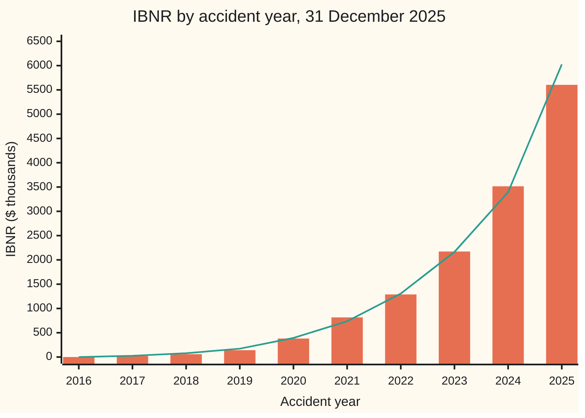
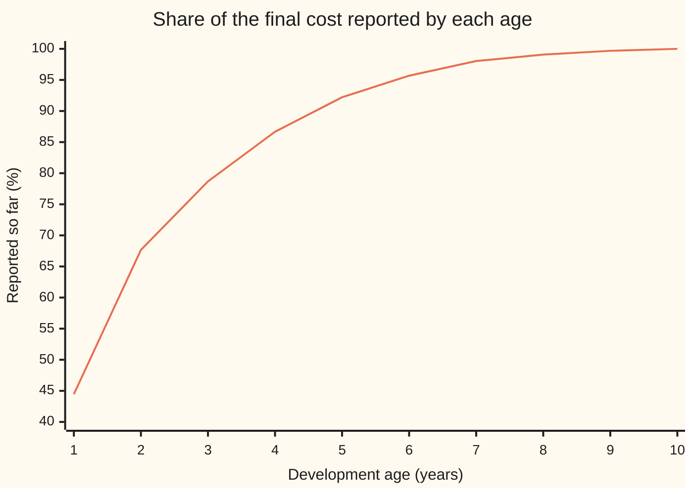

# Reserving: estimating claims not yet reported from a run-off triangle

[Syllabus](../../../SYLLABUS.md) → [Financial mathematics](../README.md) → [Insurance and Actuarial Mathematics](../README.md#s51) → Reserving

---

## General Overview

A motor insurer with 50,000 policies closes its books on 31 December 2025. A crash on 20 December has happened, but the driver has not phoned in yet. A crash in March was reported at $8,000 and will cost $30,000 once the surgeon's bill arrives. Both belong to 2025, and the insurer owes that money now.

So the accounts carry a sum for claims already incurred but not yet on the books: **IBNR**, "incurred but not reported". Here it covers both unreported claims and the growth still to come on reported ones.

The evidence is a **run-off triangle**. Each row is an **accident year**: all claims from accidents in that calendar year. Each column is a **development age**: age 1 is what was reported by the end of the accident year, age 2 a year later. Each cell is the **cumulative reported** amount, the running total of reported claims, in thousands of dollars.

| Accident year | Age 1 | 2 | 3 | 4 | 5 | 6 | 7 | 8 | 9 | 10 |
| --- | --- | --- | --- | --- | --- | --- | --- | --- | --- | --- |
| 2016 | 3,616 | 6,170 | 6,846 | 7,304 | 7,832 | 8,130 | 8,305 | 8,382 | 8,437 | 8,464 |
| 2017 | 3,533 | 4,868 | 5,650 | 6,167 | 6,581 | 6,875 | 7,053 | 7,133 | 7,174 | |
| 2018 | 3,476 | 4,613 | 5,100 | 5,596 | 5,869 | 6,038 | 6,189 | 6,259 | | |
| 2019 | 3,772 | 5,320 | 5,880 | 6,386 | 6,644 | 6,858 | 7,040 | | | |
| 2020 | 3,975 | 5,516 | 6,749 | 7,584 | 8,097 | 8,441 | | | | |
| 2021 | 4,171 | 6,842 | 7,869 | 8,959 | 9,658 | | | | | |
| 2022 | 3,918 | 6,369 | 7,638 | 8,379 | | | | | | |
| 2023 | 4,308 | 6,531 | 8,018 | | | | | | | |
| 2024 | 4,438 | 7,358 | | | | | | | | |
| 2025 | 4,486 | | | | | | | | | |

The triangle is invented, with a realistic shape. The last entry in each row, the **latest diagonal**, is each year's figure on 31 December 2025. The empty lower right is the future, not zero.

The old rows show how a year's total grows with age. The **chain ladder** applies that growth to the young rows: $14.00 million still to come. **Bornhuetter-Ferguson** (BF) applies the same pattern to an expected total set in advance from premiums: $14.30 million. **Mack's standard error** measures how uncertain the chain-ladder figure is: $1.30 million, 9.3 percent.

**Older accident years reveal what share of a year's claims is reported by each age; the chain ladder grows each young year's reported total by that pattern, Bornhuetter-Ferguson applies the unreported share to an expected total fixed in advance, and Mack's formula measures how far the chain-ladder answer can miss.**

**What kind of fact this is:** a method, two recipes for one estimate. Behind the error bar sits a model, Mack's three assumptions, stated in Step 5. Inside that model the chain-ladder forecast is proved on this card in Why it works; Mack's error formula is an approximation, derived in outline here and in full in Mack (1993).

### The picture: where the $14 million sits



Bars: chain-ladder IBNR. Line: BF IBNR. 2016 is fully developed. 2025 alone carries $5.60 million, 40 percent of the chain-ladder total. The methods agree on old years and part on young ones, where the data is thinnest.

---

## The formula

Notation first, in words. $C_{i,k}$ is the cumulative reported amount for accident year $i$ at age $k$. Years run 1 to $n$, oldest first: 2016 is year 1, 2025 is year 10. Year $i$'s latest figure is $C_{i,n+1-i}$; for 2025, $C_{10,1} = 4{,}486$. A hat marks an estimate made from the triangle; a letter without one is the true, unknown value. The sign Σ adds the rows named beneath and above it.

**The age-to-age factor** for age $k$: over the years seen at both ages, the total at age $k+1$ divided by the total at age $k$.

$$\hat f_k = \frac{\sum_{i=1}^{n-k} C_{i,k+1}}{\sum_{i=1}^{n-k} C_{i,k}}$$

**Chain ladder.** Multiply the latest figure by every factor still to come:

$$F_i = \hat f_{n+1-i}\,\hat f_{n+2-i}\cdots \hat f_{n-1}, \qquad \hat U_i = C_{i,n+1-i}\,F_i, \qquad \hat R_i^{\,CL} = C_{i,n+1-i}\,(F_i - 1)$$

For 2016 no factor remains, so $F_1 = 1$ and its reserve is zero.

**Bornhuetter-Ferguson.** Take an expected ultimate $E_i$, set before looking at the triangle, and keep the share still unreported:

$$\hat R_i^{\,BF} = E_i\,\Bigl(1 - \frac{1}{F_i}\Bigr)$$

**Read it aloud:** the chain ladder says "this year will grow the way older years grew from the same age"; BF says "this year still has the usual unreported share of what it was expected to cost".

**Mack's standard error.** The scatter of single years around the factor at age $k$:

$$\hat\sigma_k^2 = \frac{1}{n-k-1}\sum_{i=1}^{n-k} C_{i,k}\Bigl(\frac{C_{i,k+1}}{C_{i,k}} - \hat f_k\Bigr)^2$$

The last age has one year and no scatter to measure. Mack sets it to zero when the last factor is 1; here $\hat f_9 = 1.0032$, so he extends the series: $\hat\sigma_{n-1}^2 = \min\bigl(\hat\sigma_{n-2}^4/\hat\sigma_{n-3}^2,\ \hat\sigma_{n-3}^2,\ \hat\sigma_{n-2}^2\bigr)$. The mean squared error (the expected square of the miss) of year $i$'s reserve is estimated by

$$\widehat{\mathrm{mse}}(\hat R_i) = \hat U_i^{\,2}\sum_{k=n+1-i}^{n-1}\frac{\hat\sigma_k^2}{\hat f_k^{\,2}}\Bigl(\frac{1}{\hat C_{i,k}} + \frac{1}{S_k}\Bigr), \qquad S_k = \sum_{j=1}^{n-k} C_{j,k}$$

where $\hat C_{i,k}$ is year $i$'s projected figure at age $k$ (its observed figure at its latest age). The first fraction is the year's own randomness to come; the second, the error in the factors. The standard error, se, is the square root. For all years together, add a term for each pair of years, since they share the factors:

$$\widehat{\mathrm{mse}}(\hat R) = \sum_i \widehat{\mathrm{mse}}(\hat R_i) + 2\sum_{i<j} \hat U_i\,\hat U_j \sum_{k=n+1-i}^{n-1}\frac{\hat\sigma_k^2/\hat f_k^{\,2}}{S_k}$$

| Symbol | Plain meaning | In our example | Push it up and the IBNR… |
| --- | --- | --- | --- |
| $C_{i,k}$; $i$; $k$ | cumulative reported claims of accident year $i$ at development age $k$, thousands of dollars | $C_{10,1} = 4{,}486$ | a bigger latest figure raises chain-ladder IBNR in proportion; BF ignores it |
| $n$ | number of accident years, and of ages | 10 | more old years: firmer factors, smaller se |
| $\hat f_k$; $f_k$ | age-to-age factor, estimated or true: growth from age $k$ to $k+1$ | $\hat f_1 = 1.5221$ | rises, for every year still to pass age $k$ |
| $F_i$ | factor to ultimate: all the growth still to come for year $i$ | 2.2492 for 2025 | rises |
| $z_i$ | share reported so far, $1/F_i$ | 44.46% for 2025 | falls |
| $\hat U_i$ | estimated ultimate: the year's final total | 10,089.9 for 2025 | rises one for one |
| $\hat R_i$ | the reserve: ultimate minus reported, the IBNR | 5,603.87 for 2025 | — |
| $E_i$ | expected ultimate set in advance: premium times planning loss ratio | $0.70 \times 15{,}500 = 10{,}850$ for 2025 | BF rises; chain ladder does not move |
| $\hat\sigma_k^2$ | scatter of single years' growth around $\hat f_k$, in thousands of dollars | 78.7044 at age 1 | se rises |
| $S_k$ | total at age $k$ of the years that also have age $k+1$ | 35,207 at age 1 | se falls: more data behind the factor |
| $\widehat{\mathrm{mse}}$, se | estimated squared miss, and its square root | se 1,301.3 in total | — |

### When it holds

- **A stable pattern.** Young years must develop as old years did. If claims staff start setting case estimates higher, old factors overstate the growth to come and the IBNR is too high.
- **Nothing after the last age.** The method stops at age 10. If claims still surface later, as with industrial disease, the answer is short by a **tail factor** the triangle cannot show.
- **Independent years.** Mack treats each accident year as its own process. Inflation hits every year in the same calendar year, along a diagonal; the se then understates the risk.
- **An honest prior for BF.** $E_i$ must come from premiums and pricing. A prior copied from the chain ladder returns the chain ladder.
- **Mack's variance shape.** Scatter must grow in proportion to size, $\sigma_k^2 C_{i,k}$. If big years are steadier than that, the se is too wide; if wilder, too narrow.

---

## Why it works

### Step 0: yesterday's growth is today's forecast

Every accident year is reported the same way: most claims in the first year or two, a trickle after. The 2016 row went from 3,616 to 8,464. Nine other rows repeat the shape at other sizes. So the share of the final cost on the books at each age is a stable fact about the business, readable from the old rows. Apply it to the young rows and the empty corner fills in.



The line is one over the factor to ultimate at each age: the chain ladder's reporting pattern. A year shows 44.46 percent of its final cost at age 1 and 92.21 percent by age 5.

### Step 1: the volume-weighted factor is the best straight-line fit

Take age 1 to 2. Nine years have both figures. Their age-2 total is 53,587 and their age-1 total is 35,207, so $\hat f_1 = 1.5221$.

Why totals over totals, not the average of nine ratios? Suppose each year's next figure is this year's times a common factor, plus noise whose variance grows with this year's size, $\sigma_k^2 C_{i,k}$: Mack's assumption. Then weighted least squares (the factor making the size-weighted squared misses smallest) is exactly the ratio of totals. A small year's noisy ratio counts for little. The plain average gives every year one vote and yields $13.81 million of IBNR, not $14.00 million.

<details>
<summary>The algebra behind the ratio of totals</summary>

Minimise $\sum_i (C_{i,k+1} - g\,C_{i,k})^2 / C_{i,k}$ over a trial factor g; dividing by $C_{i,k}$ undoes the variance $\sigma_k^2 C_{i,k}$. The derivative in g is $-2\sum_i (C_{i,k+1} - g\,C_{i,k})$. Zero gives $\sum_i C_{i,k+1} = g \sum_i C_{i,k}$: the ratio of totals. The second derivative, $2\sum_i C_{i,k} > 0$, makes it the minimum.

</details>

### Step 2: chaining the factors gives the expected ultimate

Mack's first assumption: given a year's history, its expected next figure is today's times the true factor, $E[C_{i,k+1} \mid \text{history}] = f_k C_{i,k}$. Apply it twice and the expected age-3 figure is $f_2 f_1$ times the age-1 figure, since an average of averages is the average. Repeat to age 10: the expected ultimate is the latest figure times every factor still to come. Put in the estimates and that is the chain ladder.

For 2025, $F_{10} = 2.2492$, so 4,486 reported becomes 10,089.9 ultimate, with 5,603.87 to come. Mack (1993, Theorem 2) proves the estimated factors are uncorrelated, so the estimated ultimate is unbiased: right on average.

### Step 3: the same answer from row and column totals

A second road, with no ratios. Turn the triangle into **increments**: what was reported during each development year. Model each increment as $x_i\,y_k$: a size for accident year $i$ times the share of any year's cost that arrives at age $k$. Choose sizes and shares so every observed row total and column total is matched exactly, then fill each empty cell with its product.

That fit, the **marginal-totals method**, returns 14,000.2: the chain-ladder figure to the last digit printed. Its shares are the steps in the Step 0 picture.

<details>
<summary>Detailed proof: marginal totals reproduce the chain ladder</summary>

Take sizes $x_i = \hat U_i$, the chain-ladder ultimates, and shares $y_k = 1/F^{(k)} - 1/F^{(k-1)}$, where $F^{(k)} = \hat f_k \cdots \hat f_{n-1}$ is the factor to ultimate from age $k$, with $1/F^{(0)} = 0$. The shares add to $1/F^{(n)} = 1$.

**Rows.** Year $i$'s fitted increments up to its latest age, $n+1-i$, add to $\hat U_i / F^{(n+1-i)} = C_{i,n+1-i}$, its observed total.

**Columns.** Claim first that $\sum_{i \le n+1-k} \hat U_i / F^{(k)} = \sum_{i \le n+1-k} C_{i,k}$ for every age $k$. At $k = n$ only 2016 is summed and both sides are $C_{1,n}$. If it holds at $k+1$, then for the years $i \le n-k$, dividing by one more factor gives $\sum \hat U_i / F^{(k)} = \frac{1}{\hat f_k}\sum C_{i,k+1} = \sum C_{i,k}$, by the definition of $\hat f_k$. The one extra year $i = n+1-k$ has latest age $k$, so $\hat U_i / F^{(k)} = C_{i,k}$. Adding it keeps the claim true. The same step one age earlier gives $\sum_{i \le n+1-k} \hat U_i / F^{(k-1)} = \sum_{i \le n+1-k} C_{i,k-1}$. Subtract the two: the fitted column-$k$ increments equal the observed ones.

So the chain-ladder completion matches every row and column total. The marginal-totals fit is unique once the shares are pinned to add to one, so it is this one, and its reserves are the chain-ladder reserves.

</details>

### Step 4: Bornhuetter-Ferguson trusts the data by the share reported

The chain ladder's ultimate is the latest figure divided by the share reported, $z_i$. For 2025, at 44.46 percent, every dollar of first-year luck is multiplied by 2.2492. BF instead takes the unreported share, $1 - z_i$, of the expected ultimate $E_i$, and adds what is reported.

Rearranged, BF is a weighted average. Since the latest figure is $z_i \hat U_i$, BF's ultimate is $z_i\,\hat U_i + (1-z_i)\,E_i$. The weight on the data is the share of the data that exists: all of it for 2016, under half for 2025. Blending a year's own evidence with an outside expectation is the **credibility** idea.

BF also comes out of the second road: $E_i$ times the fitted shares for the ages year $i$ has not reached. That gives 14,295.9, as the formula does. Feeding BF's ultimate back in as the prior and running BF again is the **Benktander** method: 14,191.2, between the two.

### Step 5: Mack's error, two parts

Mack's model has three assumptions: the factor assumption of Step 2, the variance assumption of Step 1, and independent accident years. Under them the miss splits in two.

**Process error.** Even with true factors, each year's future is random. Variance builds a year at a time: next year's is the factor squared times this year's, plus new noise $\sigma_k^2$ times the expected size. Unrolled, that is the $1/\hat C_{i,k}$ term. The code runs this recursion as a second road, and simulates the model 40,000 times as a third: simulated spread 1,157.6, formula 1,155.7.

**Estimation error.** Given the earlier ages, $\hat f_k$ has variance $\sigma_k^2 / S_k$: more volume, steadier factor. That is the $1/S_k$ term. Every year still to pass age $k$ uses the same $\hat f_k$, so a factor too high pushes them all up together. That is the cross term: it adds 163,223.2 (square thousands of dollars) to the squared error, lifting the total se from 1,237.0 to 1,301.3.

<details>
<summary>Detailed proof: the process variance, and where Mack approximates</summary>

Given the triangle, let the mean and variance of year $i$'s figure at age $k$ be $(m_k, v_k)$, starting from its latest age $a = n+1-i$ with $m_a = C_{i,a}$ and $v_a = 0$. By the factor assumption and the rule "variance = average of the conditional variance + variance of the conditional mean",
$$m_{k+1} = f_k m_k, \qquad v_{k+1} = \sigma_k^2 m_k + f_k^2 v_k.$$
Unroll: $v_n = \sum_{k \ge a} \sigma_k^2 m_k \prod_{j > k} f_j^2$. Since $m_n = m_k f_k \prod_{j>k} f_j$, the product is $m_n^2 / (m_k^2 f_k^2)$, so $v_n = m_n^2 \sum_{k \ge a} \sigma_k^2 / (f_k^2 m_k)$: the first term of the formula.

The squared miss adds the square of $C_{i,a}\,(\prod f_k - \prod \hat f_k)$, which cannot be computed because the true factors are unknown. Mack writes the difference of products as a sum of one-factor differences, replaces each squared difference by its conditional average $\sigma_k^2 / S_k$ times the other factors squared, and drops the cross products, which average to zero. Substituting estimates gives the $1/S_k$ term. For two years the same expansion leaves only the factors both still need, which is the pair term of the total. This step is an approximation, not an identity; Mack (1993, Theorem 3 and its Corollary) sets it out in full.

</details>

Recursion and formula both give 1,301.3. The code also runs Mack's own example, the Taylor-Ashe triangle: Mack printed reserves of 18,681 thousand and an overall se of 13 percent; the code prints 18,680,855.6 (se 2,447,094.9) and 13.1.

---

## Worked numbers, by hand

2025, the youngest year, in thousands of dollars. Premium 15,500, planning loss ratio 70 percent.

| Step | Arithmetic | Value |
| --- | --- | --- |
| $\hat f_1$, age 1 to 2 | 53,587 / 35,207 | 1.5221 |
| factor to ultimate from age 2 | $\hat f_2 \times \cdots \times \hat f_9$ | 1.4777 |
| factor to ultimate from age 1 | 1.5221 × 1.4777 | 2.2492 |
| share reported | 1 / 2.2492 | 44.46% |
| chain-ladder ultimate | 4,486 × 2.2492 | 10,089.9 |
| chain-ladder IBNR, 2025 | 10,089.9 − 4,486 | 5,603.87 |
| expected ultimate | 0.70 × 15,500 | 10,850.0 |
| BF IBNR, 2025 | 10,850.0 × (1 − 1/2.2492) | 6,026.04 |
| Mack se, 2025 | formula above | 1,066.4 |
| **chain-ladder IBNR, all years** | sum of ten rows | **14,000.2** |
| **BF IBNR, all years** | sum of ten rows | **14,295.9** |
| **Mack se, all years** | with the cross term | **1,301.3**, 9.3% |

The insurer should hold about $14.0 million for claims incurred and not yet on its books. BF says $14.3 million. The gap is well inside one standard error of $1.3 million: the triangle cannot tell them apart.

2025 started light against plan. The chain ladder believes the light start; BF keeps the planned total's unreported share and reserves more. 2021 came in heavy, and there the chain ladder reserves more than BF.

### What breaks if you drop a piece

Same triangle, correct answer 14,000.2 (chain ladder) or 14,295.9 (BF), se 1,301.3:

| Mistake | Comes out at | What went wrong |
| --- | --- | --- |
| Plain average of each year's growth ratio | 13,813.5 | Small, noisy years get a full vote |
| Empty cells read as zero when forming factors | −49,821.4 | The missing next figure is the future, not nothing; late factors fall below 1 |
| BF with the reported share instead of the unreported | 78,454.1 | That is what should already be on the books, not what is to come |
| se from process error only | 1,155.7 | Forgets the factors are estimates |
| se without the cross term | 1,237.0 | Treats the years' factor errors as independent; they share the factors |
| Ten separate se's added | 2,138.8 | Treats the years' random futures as moving in lockstep |

---

## Code, from first principles, and it actually runs

The script computes the factors, the chain ladder, BF and Mack's error, then reaches each a second way: the marginal-totals fit for the chain ladder and BF; a variance recursion for Mack's total; a 40,000-path simulation, with its own random-number generator, for the process part. Last, it runs Mack's published example and asserts his printed tables: reserves by year to the thousand, se by year to the percent.

### Python

```python
# Reserving check: chain ladder, Bornhuetter-Ferguson and Mack's standard error.
# Standard library only.  Amounts in thousands of dollars.  Nothing imported knows
# the answer: the factors, the marginal-totals fit, the random numbers are all here.
from math import sqrt, log, cos, pi, prod

# Cumulative reported claims: accident years 2016..2025 down, development age 1..10 across.
TRI = [[3616, 6170, 6846, 7304, 7832, 8130, 8305, 8382, 8437, 8464],
       [3533, 4868, 5650, 6167, 6581, 6875, 7053, 7133, 7174],
       [3476, 4613, 5100, 5596, 5869, 6038, 6189, 6259],
       [3772, 5320, 5880, 6386, 6644, 6858, 7040],
       [3975, 5516, 6749, 7584, 8097, 8441],
       [4171, 6842, 7869, 8959, 9658],
       [3918, 6369, 7638, 8379], [4308, 6531, 8018],
       [4438, 7358], [4486]]
PREM = [11000.0 + 500.0 * i for i in range(10)]          # earned premium, $000
ELR = 0.70                                               # planning loss ratio
# Taylor & Ashe (1983), the triangle Mack (1993) used; his Tables 2 and 3 are checked below.
TA = [[357848, 1124788, 1735330, 2218270, 2745596, 3319994, 3466336, 3606286, 3833515, 3901463],
      [352118, 1236139, 2170033, 3353322, 3799067, 4120063, 4647867, 4914039, 5339085],
      [290507, 1292306, 2218525, 3235179, 3985995, 4132918, 4628910, 4909315],
      [310608, 1418858, 2195047, 3757447, 4029929, 4381982, 4588268],
      [443160, 1136350, 2128333, 2897821, 3402672, 3873311],
      [396132, 1333217, 2180715, 2985752, 3691712],
      [440832, 1288463, 2419861, 3483130], [359480, 1421128, 2864498],
      [376686, 1363294], [344014]]
def factors(t, how="volume"):                            # age-to-age factors f_1..f_9
    f = []
    for k in range(len(t) - 1):
        rows = [r for r in t if len(r) > k + 1]
        if how == "volume": f.append(sum(r[k + 1] for r in rows) / sum(r[k] for r in rows))
        if how == "simple": f.append(sum(r[k + 1] / r[k] for r in rows) / len(rows))
        if how == "zeros": f.append(sum(r[k + 1] for r in rows) / sum(r[k] for r in t if len(r) > k))
    return f
def to_ult(f, a): return prod(f[a:])                   # F: product of the factors still to come
def sigmas(t, f):                                        # Mack's sigma_k^2, last one extrapolated
    s2 = []
    for k in range(len(t) - 2):
        rows = [r for r in t if len(r) > k + 1]
        s2.append(sum(r[k] * (r[k + 1] / r[k] - f[k]) ** 2 for r in rows) / (len(rows) - 1))
    s2.append(min(s2[-1] ** 2 / s2[-2], s2[-2], s2[-1]))
    return s2
def mack(t, f, s2):                                      # road 1: Mack's closed formula
    n = len(t); S = [sum(r[k] for r in t if len(r) > k + 1) for k in range(n - 1)]
    U, mse, proc = [], [], []
    for r in t:
        c, a, pe, pa = float(r[-1]), len(r) - 1, 0.0, 0.0
        for k in range(a, n - 1):
            pe += s2[k] / f[k] ** 2 / c; pa += s2[k] / f[k] ** 2 / S[k]; c *= f[k]
        U.append(c); mse.append(c * c * (pe + pa)); proc.append(c * c * pe)
    cross = sum(2 * U[i] * U[j] * sum(s2[k] / f[k] ** 2 / S[k] for k in range(len(t[i]) - 1, n - 1))
                for i in range(n) for j in range(i + 1, n))
    return U, mse, proc, cross
def mack_recursive(t, f, s2):                            # road 2: carry the variance forward a year at a time
    n = len(t); S = [sum(r[k] for r in t if len(r) > k + 1) for k in range(n - 1)]
    total, grad = 0.0, [0.0] * (n - 1)                   # grad[k]: all years' sensitivity to f_k
    for r in t:
        c, v = float(r[-1]), 0.0
        for k in range(len(r) - 1, n - 1):
            v = f[k] ** 2 * v + s2[k] * c; c *= f[k]     # process variance, one year on
        total += v
        for k in range(len(r) - 1, n - 1): grad[k] += c / f[k]
    return total + sum(grad[k] ** 2 * s2[k] / S[k] for k in range(n - 1))  # plus factor error, shared
def marginal_totals(t, E=None):                          # road 2 for CL and BF: fit x_i * y_k to increments
    n = len(t); inc = [[r[0]] + [r[k] - r[k - 1] for k in range(1, len(r))] for r in t]
    rs = [sum(r) for r in inc]; cs = [sum(r[k] for r in inc if len(r) > k) for k in range(n)]
    y = [1.0 / n] * n
    for _ in range(4000):
        x = [rs[i] / sum(y[:len(inc[i])]) for i in range(n)]
        y = [cs[k] / sum(x[i] for i in range(n) if len(inc[i]) > k) for k in range(n)]
    y = [v / sum(y) for v in y]; x = [rs[i] / sum(y[:len(inc[i])]) for i in range(n)]
    base = x if E is None else E
    return [base[i] * sum(y[len(inc[i]):]) for i in range(n)]
def cl_bf(t, E):                                         # road 1: the chain-ladder and BF formulas
    f = factors(t)
    F = [to_ult(f, len(r) - 1) for r in t]
    return f, F, [r[-1] * (Fi - 1) for r, Fi in zip(t, F)], [e * (1 - 1 / Fi) for e, Fi in zip(E, F)]
E = [ELR * p for p in PREM]; f, F, R_cl, R_bf = cl_bf(TRI, E)
s2 = sigmas(TRI, f); U, mse, proc, cross = mack(TRI, f, s2)
R_cl2, R_bf2 = marginal_totals(TRI), marginal_totals(TRI, E)
mse_tot, mse_rec = sum(mse) + cross, mack_recursive(TRI, f, s2)
seed = 20260928                                          # road 3: simulate the process part (Mack's model, f fixed)
def unif():
    global seed
    seed = (6364136223846793005 * seed + 1442695040888963407) % 2 ** 64
    return ((seed >> 11) + 0.5) / 2 ** 53
N, s_sum, s_sq = 40000, 0.0, 0.0
for _ in range(N):
    tot = 0.0
    for r in TRI:
        c = float(r[-1])
        for k in range(len(r) - 1, 9):
            z = sqrt(-2 * log(unif())) * cos(2 * pi * unif())
            c = f[k] * c + sqrt(s2[k] * c) * z
        tot += c - r[-1]
    s_sum += tot; s_sq += tot * tot
sim_mean, sim_sd = s_sum / N, sqrt((s_sq - s_sum * s_sum / N) / (N - 1))

print("age   f_k      F to ult  % reported  sigma_k^2")
for k in range(10):
    Fk = to_ult(f, k)
    print(f"{k + 1:>3}  {f[k] if k < 9 else 1.0:7.4f}  {Fk:8.4f}  {100 / Fk:9.2f}  " + (f"{s2[k]:9.4f}" if k < 9 else "        -"))
print("year  latest   F      CL ult   CL IBNR   prior E   BF IBNR  Mack se")
for i, r in enumerate(TRI):
    print(f"{2016 + i}  {r[-1]:6d}  {F[i]:6.4f} {U[i]:8.1f}  {R_cl[i]:8.2f}  {E[i]:7.1f}  {R_bf[i]:8.2f}  {sqrt(mse[i]):6.1f}")
sd_proc = sqrt(sum(proc))
wrong = [sum(r[-1] * (to_ult(factors(TRI, how), len(r) - 1) - 1) for r in TRI) for how in ("simple", "zeros")]
shock = [r[:] for r in TRI]; shock[9][0] = round(1.2 * TRI[9][0])  # a large claim lands in 2025
_, _, Rc_s, Rb_s = cl_bf(shock, E); _, _, _, R_bk = cl_bf(TRI, [r[-1] + b for r, b in zip(TRI, R_bf)])  # Benktander
_, _, _, R_bf60 = cl_bf(TRI, [0.60 * p for p in PREM])
fT = factors(TA); UT, mT, _, cT = mack(TA, fT, sigmas(TA, fT))
ta_R, ta_se = sum(u - r[-1] for u, r in zip(UT, TA)), sqrt(sum(mT) + cT)
rows = [("f_1: age-2 total, 2016-2024", sum(r[1] for r in TRI[:9])), ("f_1: age-1 total, 2016-2024", sum(r[0] for r in TRI[:9])),
        ("CL IBNR, factors", sum(R_cl)), ("CL IBNR, marginal totals", sum(R_cl2)),
        ("BF IBNR, formula", sum(R_bf)), ("BF IBNR, marginal totals", sum(R_bf2)),
        ("Mack se total, closed form", sqrt(mse_tot)), ("Mack se total, recursion", sqrt(mse_rec)),
        ("  cross-year term in mse", cross), ("  process se, formula", sd_proc),
        ("  process se, 40000 sims", sim_sd), ("  mean reserve, 40000 sims", sim_mean),
        ("  se as % of CL IBNR", 100 * sqrt(mse_tot) / sum(R_cl)),
        ("wrong: simple-average factors", wrong[0]), ("wrong: empty cells as zeros", wrong[1]),
        ("wrong: BF with reported share", sum(e / Fi for e, Fi in zip(E, F))),
        ("wrong: se, process only", sd_proc), ("wrong: se, no cross term", sqrt(sum(mse))),
        ("wrong: se, ten se's added", sum(sqrt(m) for m in mse)),
        ("try: 2025 reported 5383, CL IBNR", sum(Rc_s)), ("try: 2025 reported 5383, BF IBNR", sum(Rb_s)),
        ("try: ELR 0.60, BF IBNR", sum(R_bf60)), ("try: Benktander IBNR", sum(R_bk)),
        ("Taylor-Ashe CL reserve", ta_R), ("Taylor-Ashe Mack se", ta_se), ("Taylor-Ashe se, % of reserve", 100 * ta_se / ta_R)]
for name, v in rows:
    print(f"{name:<34} {v:14.1f}")

assert abs(sum(R_cl) - sum(R_cl2)) < 1e-3,        "marginal totals must reproduce chain ladder"
assert abs(sum(R_bf) - sum(R_bf2)) < 1e-3,        "marginal-totals pattern must reproduce BF"
assert abs(mse_tot - mse_rec) < 1e-6 * mse_tot,   "recursion must reproduce Mack's closed form"
assert abs(sim_sd / sd_proc - 1) < 0.02,          "simulated process se within 2%"
assert abs(sim_mean / sum(R_cl) - 1) < 0.002,     "simulated mean reserve within 0.2%"
ta_k = [round((u - r[-1]) / 1000) for u, r in zip(UT[1:], TA[1:])]
ta_pct = [round(100 * sqrt(m) / (u - r[-1])) for m, u, r in zip(mT[1:], UT[1:], TA[1:])]
assert ta_k == [95, 470, 710, 985, 1419, 2178, 3920, 4279, 4626], "Mack (1993) Table 2, reserves in $000"
assert ta_pct == [80, 26, 19, 27, 29, 26, 22, 23, 29],            "Mack (1993) Table 3, se as % of reserve"
assert round(100 * ta_se / ta_R) == 13,                           "Mack (1993) Table 3, overall 13%"
assert abs(sum(Rb_s) - sum(R_bf)) < 1e-9,        "a 2025 surprise leaves BF where it was"
print("ALL CHECKS PASS")
```

**Ran 2026-09-28 on macOS, Python 3.14.6, standard library only. All checks passed. Output, pasted from the run:**

```
age   f_k      F to ult  % reported  sigma_k^2
  1   1.5221    2.2492      44.46    78.7044
  2   1.1627    1.4777      67.67    15.3760
  3   1.1015    1.2710      78.68     4.0874
  4   1.0639    1.1538      86.67     1.4552
  5   1.0377    1.0845      92.21     0.2930
  6   1.0246    1.0451      95.68     0.0384
  7   1.0105    1.0200      98.04     0.0108
  8   1.0062    1.0094      99.07     0.0026
  9   1.0032    1.0032      99.68     0.0006
 10   1.0000    1.0000     100.00          -
year  latest   F      CL ult   CL IBNR   prior E   BF IBNR  Mack se
2016    8464  1.0000   8464.0      0.00   7700.0      0.00     0.0
2017    7174  1.0032   7197.0     22.96   8050.0     25.68     2.8
2018    6259  1.0094   6317.9     58.88   8400.0     78.29     5.4
2019    7040  1.0200   7181.1    141.09   8750.0    171.92    11.7
2020    8441  1.0451   8821.9    380.87   9100.0    392.88    24.9
2021    9658  1.0845  10473.9    815.92   9450.0    736.16    68.6
2022    8379  1.1538   9667.8   1288.84   9800.0   1306.46   146.5
2023    8018  1.2710  10190.6   2172.56  10150.0   2163.91   272.3
2024    7358  1.4777  10873.2   3515.16  10500.0   3394.52   540.2
2025    4486  2.2492  10089.9   5603.87  10850.0   6026.04  1066.4
f_1: age-2 total, 2016-2024               53587.0
f_1: age-1 total, 2016-2024               35207.0
CL IBNR, factors                          14000.2
CL IBNR, marginal totals                  14000.2
BF IBNR, formula                          14295.9
BF IBNR, marginal totals                  14295.9
Mack se total, closed form                 1301.3
Mack se total, recursion                   1301.3
  cross-year term in mse                 163223.2
  process se, formula                      1155.7
  process se, 40000 sims                   1157.6
  mean reserve, 40000 sims                13993.1
  se as % of CL IBNR                          9.3
wrong: simple-average factors             13813.5
wrong: empty cells as zeros              -49821.4
wrong: BF with reported share             78454.1
wrong: se, process only                    1155.7
wrong: se, no cross term                   1237.0
wrong: se, ten se's added                  2138.8
try: 2025 reported 5383, CL IBNR          15120.7
try: 2025 reported 5383, BF IBNR          14295.9
try: ELR 0.60, BF IBNR                    12253.6
try: Benktander IBNR                      14191.2
Taylor-Ashe CL reserve                 18680855.6
Taylor-Ashe Mack se                     2447094.9
Taylor-Ashe se, % of reserve                 13.1
ALL CHECKS PASS
```

### Rust

Same inputs, same steps, same random numbers.

```rust
// Reserving check in Rust: chain ladder, Bornhuetter-Ferguson and Mack's standard error.
// Standard library only, no crates.  Amounts in thousands of dollars.
// Compile: rustc --edition 2021 -O reserving_chain_ladder_and_bornhuetter_ferguson_check.rs
type Tri = Vec<Vec<f64>>;
fn tri(rows: &[&[f64]]) -> Tri { rows.iter().map(|r| r.to_vec()).collect() }
// Age-to-age factors: "volume" (the chain ladder), "simple" and "zeros" (two mistakes).
fn factors(t: &Tri, how: &str) -> Vec<f64> {
    (0..t.len() - 1).map(|k| {
        let rows: Vec<&Vec<f64>> = t.iter().filter(|r| r.len() > k + 1).collect();
        match how {
            "simple" => rows.iter().map(|r| r[k + 1] / r[k]).sum::<f64>() / rows.len() as f64,
            "zeros" => rows.iter().map(|r| r[k + 1]).sum::<f64>()
                / t.iter().filter(|r| r.len() > k).map(|r| r[k]).sum::<f64>(),
            _ => rows.iter().map(|r| r[k + 1]).sum::<f64>() / rows.iter().map(|r| r[k]).sum::<f64>(),
        }
    }).collect()
}
fn to_ult(f: &[f64], a: usize) -> f64 { f[a..].iter().product() }
fn sigmas(t: &Tri, f: &[f64]) -> Vec<f64> {
    let mut s2: Vec<f64> = (0..t.len() - 2).map(|k| {
        let rows: Vec<&Vec<f64>> = t.iter().filter(|r| r.len() > k + 1).collect();
        rows.iter().map(|r| r[k] * (r[k + 1] / r[k] - f[k]).powi(2)).sum::<f64>() / (rows.len() - 1) as f64
    }).collect();
    let (a, b) = (s2[s2.len() - 2], s2[s2.len() - 1]);
    s2.push((b * b / a).min(a).min(b));                   // Mack's rule for the last age
    s2
}
fn col_sums(t: &Tri) -> Vec<f64> { (0..t.len() - 1).map(|k| t.iter().filter(|r| r.len() > k + 1).map(|r| r[k]).sum()).collect() }
// Road 1: Mack's closed formula.  Returns ultimates, mse by year, process variance by year, cross term.
fn mack(t: &Tri, f: &[f64], s2: &[f64]) -> (Vec<f64>, Vec<f64>, Vec<f64>, f64) {
    let (n, s) = (t.len(), col_sums(t));
    let (mut u, mut mse, mut proc) = (vec![], vec![], vec![]);
    for r in t {
        let (mut c, mut pe, mut pa) = (*r.last().unwrap(), 0.0, 0.0);
        for k in r.len() - 1..n - 1 { pe += s2[k] / f[k].powi(2) / c; pa += s2[k] / f[k].powi(2) / s[k]; c *= f[k]; }
        u.push(c); mse.push(c * c * (pe + pa)); proc.push(c * c * pe);
    }
    let mut cross = 0.0;
    for i in 0..n { for j in i + 1..n {          // pairs of years share the factors from the older one's age on
        cross += 2.0 * u[i] * u[j] * (t[i].len() - 1..n - 1).map(|k| s2[k] / f[k].powi(2) / s[k]).sum::<f64>();
    } }
    (u, mse, proc, cross)
}
// Road 2: process variance carried forward a year at a time, factor error from summed sensitivities.
fn mack_recursive(t: &Tri, f: &[f64], s2: &[f64]) -> f64 {
    let (n, s) = (t.len(), col_sums(t));
    let (mut total, mut grad) = (0.0, vec![0.0; n - 1]);
    for r in t {
        let (mut c, mut v) = (*r.last().unwrap(), 0.0);
        for k in r.len() - 1..n - 1 { v = f[k] * f[k] * v + s2[k] * c; c *= f[k]; }
        total += v;
        for k in r.len() - 1..n - 1 { grad[k] += c / f[k]; }
    }
    total + (0..n - 1).map(|k| grad[k] * grad[k] * s2[k] / s[k]).sum::<f64>()
}
// Road 2 for CL and BF: fit row level x_i times column share y_k to the increments.
fn marginal_totals(t: &Tri, e: Option<&[f64]>) -> Vec<f64> {
    let n = t.len();
    let inc: Tri = t.iter().map(|r| (0..r.len()).map(|k| if k == 0 { r[0] } else { r[k] - r[k - 1] }).collect()).collect();
    let rs: Vec<f64> = inc.iter().map(|r| r.iter().sum()).collect();
    let cs: Vec<f64> = (0..n).map(|k| inc.iter().filter(|r| r.len() > k).map(|r| r[k]).sum()).collect();
    let (mut y, mut x) = (vec![1.0 / n as f64; n], vec![0.0; n]);
    for _ in 0..4000 {
        x = (0..n).map(|i| rs[i] / y[..inc[i].len()].iter().sum::<f64>()).collect();
        y = (0..n).map(|k| cs[k] / (0..n).filter(|&i| inc[i].len() > k).map(|i| x[i]).sum::<f64>()).collect();
    }
    let ys: f64 = y.iter().sum(); y = y.iter().map(|v| v / ys).collect();
    for i in 0..n { x[i] = rs[i] / y[..inc[i].len()].iter().sum::<f64>(); }
    let base = e.unwrap_or(&x);
    (0..n).map(|i| base[i] * y[inc[i].len()..].iter().sum::<f64>()).collect()
}
// Road 1 for CL and BF: the formulas.
fn cl_bf(t: &Tri, e: &[f64]) -> (Vec<f64>, Vec<f64>, Vec<f64>, Vec<f64>) {
    let f = factors(t, "volume");
    let big_f: Vec<f64> = t.iter().map(|r| to_ult(&f, r.len() - 1)).collect();
    let cl = t.iter().zip(&big_f).map(|(r, fi)| r.last().unwrap() * (fi - 1.0)).collect();
    let bf = e.iter().zip(&big_f).map(|(ei, fi)| ei * (1.0 - 1.0 / fi)).collect();
    (f, big_f, cl, bf)
}
fn total(v: &[f64]) -> f64 { v.iter().sum() }
fn main() {
    let t = tri(&[&[3616., 6170., 6846., 7304., 7832., 8130., 8305., 8382., 8437., 8464.],
        &[3533., 4868., 5650., 6167., 6581., 6875., 7053., 7133., 7174.], &[3476., 4613., 5100., 5596., 5869., 6038., 6189., 6259.],
        &[3772., 5320., 5880., 6386., 6644., 6858., 7040.], &[3975., 5516., 6749., 7584., 8097., 8441.],
        &[4171., 6842., 7869., 8959., 9658.], &[3918., 6369., 7638., 8379.], &[4308., 6531., 8018.], &[4438., 7358.], &[4486.]]);
    let ta = tri(&[&[357848., 1124788., 1735330., 2218270., 2745596., 3319994., 3466336., 3606286., 3833515., 3901463.],
        &[352118., 1236139., 2170033., 3353322., 3799067., 4120063., 4647867., 4914039., 5339085.],
        &[290507., 1292306., 2218525., 3235179., 3985995., 4132918., 4628910., 4909315.],
        &[310608., 1418858., 2195047., 3757447., 4029929., 4381982., 4588268.],
        &[443160., 1136350., 2128333., 2897821., 3402672., 3873311.], &[396132., 1333217., 2180715., 2985752., 3691712.],
        &[440832., 1288463., 2419861., 3483130.], &[359480., 1421128., 2864498.], &[376686., 1363294.], &[344014.]]);
    let prem: Vec<f64> = (0..10).map(|i| 11000.0 + 500.0 * i as f64).collect();
    let e: Vec<f64> = prem.iter().map(|p| 0.70 * p).collect();
    let (f, big_f, r_cl, r_bf) = cl_bf(&t, &e);
    let s2 = sigmas(&t, &f); let (u, mse, proc, cross) = mack(&t, &f, &s2);
    let (r_cl2, r_bf2) = (marginal_totals(&t, None), marginal_totals(&t, Some(&e)));
    let (mse_tot, mse_rec) = (total(&mse) + cross, mack_recursive(&t, &f, &s2));
    // Road 3: simulate the process part of Mack's model, factors held fixed.
    let mut seed: u64 = 20260928;
    let mut unif = || {
        seed = seed.wrapping_mul(6364136223846793005).wrapping_add(1442695040888963407);
        ((seed >> 11) as f64 + 0.5) / 9007199254740992.0
    };
    let (n_sim, mut s_sum, mut s_sq) = (40000, 0.0, 0.0);
    for _ in 0..n_sim {
        let mut tot = 0.0;
        for r in &t {
            let mut c = *r.last().unwrap();
            for k in r.len() - 1..9 {
                let a = (-2.0 * unif().ln()).sqrt();
                let z = a * (2.0 * std::f64::consts::PI * unif()).cos();
                c = f[k] * c + (s2[k] * c).sqrt() * z;
            }
            tot += c - r.last().unwrap();
        }
        s_sum += tot; s_sq += tot * tot;
    }
    let nf = n_sim as f64; let (sim_mean, sim_sd) = (s_sum / nf, ((s_sq - s_sum * s_sum / nf) / (nf - 1.0)).sqrt());
    println!("age   f_k      F to ult  % reported  sigma_k^2");
    for k in 0..10 {
        let fk = to_ult(&f, k);
        let sig = if k < 9 { format!("{:9.4}", s2[k]) } else { "        -".to_string() };
        println!("{:>3}  {:7.4}  {:8.4}  {:9.2}  {}", k + 1, if k < 9 { f[k] } else { 1.0 }, fk, 100.0 / fk, sig);
    }
    println!("year  latest   F      CL ult   CL IBNR   prior E   BF IBNR  Mack se");
    for (i, r) in t.iter().enumerate() {
        println!("{}  {:6}  {:6.4} {:8.1}  {:8.2}  {:7.1}  {:8.2}  {:6.1}", 2016 + i, *r.last().unwrap() as i64,
            big_f[i], u[i], r_cl[i], e[i], r_bf[i], mse[i].sqrt());
    }
    let sd_proc = total(&proc).sqrt();
    let wrong: Vec<f64> = ["simple", "zeros"].iter().map(|how| {
        let fw = factors(&t, how);
        t.iter().map(|r| r.last().unwrap() * (to_ult(&fw, r.len() - 1) - 1.0)).sum()
    }).collect();
    let mut shock = t.clone(); shock[9][0] = (1.2 * t[9][0]).round();  // a large claim lands in 2025
    let (_, _, rc_s, rb_s) = cl_bf(&shock, &e);
    let (_, _, _, r_bf60) = cl_bf(&t, &prem.iter().map(|p| 0.60 * p).collect::<Vec<f64>>());
    let bk_prior: Vec<f64> = t.iter().zip(&r_bf).map(|(r, b)| r.last().unwrap() + b).collect();
    let (_, _, _, r_bk) = cl_bf(&t, &bk_prior);          // Benktander: BF ultimate as the prior
    let ft = factors(&ta, "volume"); let (ut, mt, _, ct) = mack(&ta, &ft, &sigmas(&ta, &ft));
    let (ta_r, ta_se) = (ut.iter().zip(&ta).map(|(x, r)| x - r.last().unwrap()).sum::<f64>(), (total(&mt) + ct).sqrt());
    let rows: Vec<(&str, f64)> = vec![("f_1: age-2 total, 2016-2024", t[..9].iter().map(|r| r[1]).sum()),
        ("f_1: age-1 total, 2016-2024", t[..9].iter().map(|r| r[0]).sum()), ("CL IBNR, factors", total(&r_cl)), ("CL IBNR, marginal totals", total(&r_cl2)),
        ("BF IBNR, formula", total(&r_bf)), ("BF IBNR, marginal totals", total(&r_bf2)),
        ("Mack se total, closed form", mse_tot.sqrt()), ("Mack se total, recursion", mse_rec.sqrt()),
        ("  cross-year term in mse", cross), ("  process se, formula", sd_proc),
        ("  process se, 40000 sims", sim_sd), ("  mean reserve, 40000 sims", sim_mean),
        ("  se as % of CL IBNR", 100.0 * mse_tot.sqrt() / total(&r_cl)),
        ("wrong: simple-average factors", wrong[0]), ("wrong: empty cells as zeros", wrong[1]),
        ("wrong: BF with reported share", e.iter().zip(&big_f).map(|(a, b)| a / b).sum()),
        ("wrong: se, process only", sd_proc), ("wrong: se, no cross term", total(&mse).sqrt()),
        ("wrong: se, ten se's added", mse.iter().map(|m| m.sqrt()).sum()),
        ("try: 2025 reported 5383, CL IBNR", total(&rc_s)), ("try: 2025 reported 5383, BF IBNR", total(&rb_s)),
        ("try: ELR 0.60, BF IBNR", total(&r_bf60)), ("try: Benktander IBNR", total(&r_bk)),
        ("Taylor-Ashe CL reserve", ta_r), ("Taylor-Ashe Mack se", ta_se), ("Taylor-Ashe se, % of reserve", 100.0 * ta_se / ta_r)];
    for (name, v) in &rows { println!("{:<34} {:14.1}", name, v); }
    assert!((total(&r_cl) - total(&r_cl2)).abs() < 1e-3, "marginal totals must reproduce chain ladder");
    assert!((total(&r_bf) - total(&r_bf2)).abs() < 1e-3, "marginal-totals pattern must reproduce BF");
    assert!((mse_tot - mse_rec).abs() < 1e-6 * mse_tot, "recursion must reproduce Mack's closed form");
    assert!((sim_sd / sd_proc - 1.0).abs() < 0.02, "simulated process se within 2%");
    assert!((sim_mean / total(&r_cl) - 1.0).abs() < 0.002, "simulated mean reserve within 0.2%");
    let ta_k: Vec<i64> = (1..10).map(|i| ((ut[i] - ta[i].last().unwrap()) / 1000.0).round() as i64).collect();
    let ta_pct: Vec<i64> = (1..10).map(|i| (100.0 * mt[i].sqrt() / (ut[i] - ta[i].last().unwrap())).round() as i64).collect();
    assert_eq!(ta_k, vec![95, 470, 710, 985, 1419, 2178, 3920, 4279, 4626], "Mack (1993) Table 2, reserves in $000");
    assert_eq!(ta_pct, vec![80, 26, 19, 27, 29, 26, 22, 23, 29], "Mack (1993) Table 3, se as % of reserve");
    assert_eq!((100.0 * ta_se / ta_r).round(), 13.0, "Mack (1993) Table 3, overall 13%");
    assert!((total(&rb_s) - total(&r_bf)).abs() < 1e-9, "a 2025 surprise leaves BF where it was");
    println!("ALL CHECKS PASS");
}
```

**Ran 2026-09-28 on macOS, rustc 1.98.1, no crates. All checks passed. Output, pasted from the run:**

```
age   f_k      F to ult  % reported  sigma_k^2
  1   1.5221    2.2492      44.46    78.7044
  2   1.1627    1.4777      67.67    15.3760
  3   1.1015    1.2710      78.68     4.0874
  4   1.0639    1.1538      86.67     1.4552
  5   1.0377    1.0845      92.21     0.2930
  6   1.0246    1.0451      95.68     0.0384
  7   1.0105    1.0200      98.04     0.0108
  8   1.0062    1.0094      99.07     0.0026
  9   1.0032    1.0032      99.68     0.0006
 10   1.0000    1.0000     100.00          -
year  latest   F      CL ult   CL IBNR   prior E   BF IBNR  Mack se
2016    8464  1.0000   8464.0      0.00   7700.0      0.00     0.0
2017    7174  1.0032   7197.0     22.96   8050.0     25.68     2.8
2018    6259  1.0094   6317.9     58.88   8400.0     78.29     5.4
2019    7040  1.0200   7181.1    141.09   8750.0    171.92    11.7
2020    8441  1.0451   8821.9    380.87   9100.0    392.88    24.9
2021    9658  1.0845  10473.9    815.92   9450.0    736.16    68.6
2022    8379  1.1538   9667.8   1288.84   9800.0   1306.46   146.5
2023    8018  1.2710  10190.6   2172.56  10150.0   2163.91   272.3
2024    7358  1.4777  10873.2   3515.16  10500.0   3394.52   540.2
2025    4486  2.2492  10089.9   5603.87  10850.0   6026.04  1066.4
f_1: age-2 total, 2016-2024               53587.0
f_1: age-1 total, 2016-2024               35207.0
CL IBNR, factors                          14000.2
CL IBNR, marginal totals                  14000.2
BF IBNR, formula                          14295.9
BF IBNR, marginal totals                  14295.9
Mack se total, closed form                 1301.3
Mack se total, recursion                   1301.3
  cross-year term in mse                 163223.2
  process se, formula                      1155.7
  process se, 40000 sims                   1157.6
  mean reserve, 40000 sims                13993.1
  se as % of CL IBNR                          9.3
wrong: simple-average factors             13813.5
wrong: empty cells as zeros              -49821.4
wrong: BF with reported share             78454.1
wrong: se, process only                    1155.7
wrong: se, no cross term                   1237.0
wrong: se, ten se's added                  2138.8
try: 2025 reported 5383, CL IBNR          15120.7
try: 2025 reported 5383, BF IBNR          14295.9
try: ELR 0.60, BF IBNR                    12253.6
try: Benktander IBNR                      14191.2
Taylor-Ashe CL reserve                 18680855.6
Taylor-Ashe Mack se                     2447094.9
Taylor-Ashe se, % of reserve                 13.1
ALL CHECKS PASS
```

The outputs agree line for line, the simulated rows included: both draw the same numbers from the same generator.

> [!TIP]
> **Try changing**
> Guess the direction first. Then run it.
> - **A large claim lands in 2025.** Raise 2025's first figure by 20 percent, from 4,486 to 5,383. The chain-ladder IBNR jumps from 14,000.2 to **15,120.7**: the extra is multiplied by 2.2492, less the part already reported. BF stays at **14,295.9** exactly: it never looks at 2025's reported figure when setting 2025's reserve.
> - **A gloomier plan.** Set the planning loss ratio to 0.60. BF falls to **12,253.6**; the chain ladder does not move. BF is only as good as its prior.
> - **Iterate BF.** Use each year's BF ultimate as the new prior and run BF again: the Benktander answer, **14,191.2**, between the two.

---

## The usual mistake

> [!warning]
> **Trusting the chain ladder on the youngest year.** 2025 has one data point, and the chain ladder multiplies it by 2.2492. A 20 percent jump in that one figure, from one large early claim, moves the whole book's IBNR from 14,000.2 to 15,120.7. That leverage is why BF exists, and why reserving actuaries use BF, or a blend, for the most recent years.
>
> Smaller traps:
> - **Reading the se as a worst case.** 1,301.3 is one standard deviation of the model's own noise. It says nothing about a wrong model: a changed claims process, a tail beyond age 10, a burst of inflation.
> - **Attaching Mack's se to BF.** The formula is for the chain ladder. BF's error also depends on how wrong the prior is, which the triangle cannot see.
> - **Adding the years' se's, or their squares.** Adding se's gives 2,138.8; adding squares without the cross term gives 1,237.0. The right total, 1,301.3, needs the shared-factor term.
> - **Mixing triangles.** A paid triangle (money actually paid) develops slower than a reported one, and its reserve covers reported claims not yet paid as well as IBNR. Label which triangle the factors came from.

---

## Where you meet it in real life

- **Year-end accounts.** Every general insurer holds a reserve for incurred claims; the chain ladder and BF are the first two methods run on each line of business.
- **US annual statements.** Property and casualty insurers publish ten-year loss triangles in Schedule P, so anyone can run the chain ladder on a company's figures.
- **Solvency capital.** Reserve risk, the chance the reserve proves too small, is part of an insurer's capital requirement; Mack's se is a common starting point.
- **Health insurance.** Doctors bill weeks after treatment. The same method, called **completion factors**, estimates the share of a month's claims still to arrive.
- **Reinsurance.** A reinsurer reruns the cedant's triangles before quoting. Weighting a record against a prior is the subject of [Credibility and reinsurance](08-credibility-and-reinsurance.md).
- **Other reserves.** A year's total claims as a distribution is [Aggregate claims](04-collective-risk-and-compound-poisson.md). A life policy's reserve, held against future payments on a running contract, is a different thing: [Premiums and reserves](03-premiums-and-reserves.md).

> **Say it back**
> Claims arrive late, so on any closing date the books show only part of what each accident year will cost. A run-off triangle lines the years up by age, and the old rows show how a year's total grows. The chain ladder multiplies each young year's latest figure by the growth still to come, measured as a ratio of totals; BF instead takes the unreported share of an expected total set in advance, which makes it steadier where data is thin. Mack's model adds a standard error with two parts, the future's randomness and the factors' estimation error, and the second is shared by all years. Here: $14.0 million by chain ladder, $14.3 million by BF, give or take $1.3 million.

---

## What this builds on

- [Panjer's recursion](05-panjer-recursion-and-aggregate-claims.md): the distribution of a year's total claims, computed before the year starts. This card asks the next question: after the year, how much of that total has shown up yet?

## Where this goes next

- [Credibility and reinsurance](08-credibility-and-reinsurance.md): how much weight a policy's or a year's own experience deserves against an outside expectation, and how to price the layer of a loss passed on to a reinsurer.

BF weights a year's own data by the share reported, a weight set by the development pattern alone; the open question is what weight the scatter of the data itself justifies, and the credibility card answers it.

---

## Sources

Verified 2026-09-28: every link below resolves to the publisher's page.

- Bornhuetter, Ronald L., and Ronald E. Ferguson. "The Actuary and IBNR." *Proceedings of the Casualty Actuarial Society* 59 (1972): 181–195. [Casualty Actuarial Society PDF](https://www.casact.org/sites/default/files/database/proceed_proceed72_72181.pdf). The original BF method: the expected loss ratio times the unreported share.
- Mack, Thomas. "Distribution-free Calculation of the Standard Error of Chain Ladder Reserve Estimates." *ASTIN Bulletin* 23, no. 2 (1993): 213–225. [doi:10.2143/AST.23.2.2005092](https://doi.org/10.2143/AST.23.2.2005092). The three assumptions, the error formulas, the last-age rule, and Tables 1 to 3 used as the published test in the code.
- Taylor, G. C., and F. R. Ashe. "Second Moments of Estimates of Outstanding Claims." *Journal of Econometrics* 23, no. 1 (1983): 37–61. [doi:10.1016/0304-4076(83)90074-X](https://doi.org/10.1016/0304-4076(83)90074-X). The source of Mack's example triangle.
- Mack, Thomas. "The Prediction Error of Bornhuetter/Ferguson." *ASTIN Bulletin* 38, no. 1 (2008): 87–103. [doi:10.2143/AST.38.1.2030404](https://doi.org/10.2143/AST.38.1.2030404). Why BF needs its own error formula, and what the prior's uncertainty adds.
