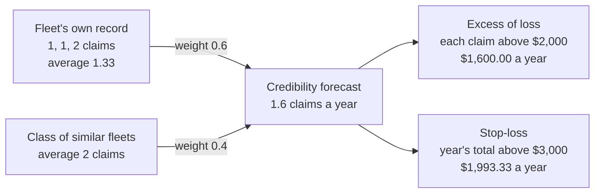
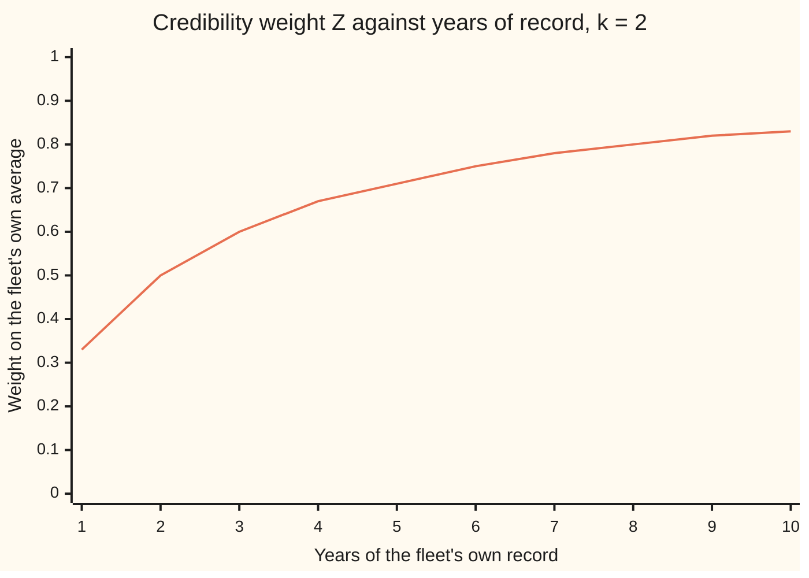
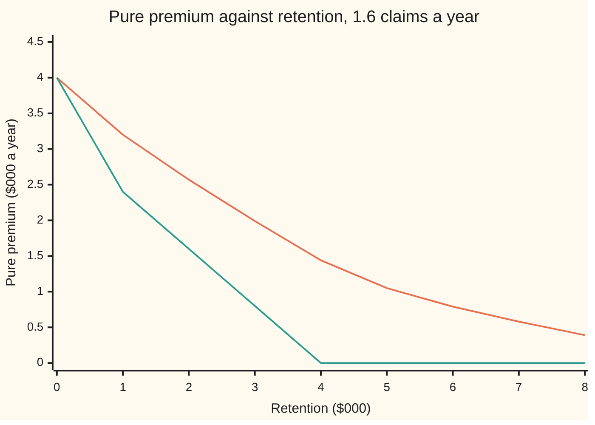

# Credibility and reinsurance: weighting a policy's own history, and laying off the tail

Financial mathematics → Insurance and Actuarial Mathematics → Experience rating and treaties → Credibility and reinsurance

---

## General Overview

A motor insurer with 50,000 policies covers a delivery company's fleet of vans. Over the last three years the fleet reported 1, 1 and 2 claims: an average of 1.33 claims a year. Comparable fleets in the insurer's book average 2 claims a year. Next year's premium needs one number for this fleet's expected claims.

Trusting the fleet's own three years alone gives 1.33. Three years is a short, noisy record: a lucky run looks like a safe fleet. Ignoring the record gives 2. That treats a careful operator like everyone else. The actuary's answer sits between: weight the fleet's own average 60 percent and the class average 40 percent, giving 1.6 claims a year. The 60 percent is not a judgement call. It comes out of a short calculation about two kinds of spread: how much fleets differ from each other, and how much one fleet's count jumps about from year to year. That weight is called the **credibility** of the fleet's record, the word used from here on.

The insurer then faces a second question. Most years are ordinary, but a bad year can hurt. It can pay another insurer, a **reinsurer**, to take the part of each claim above a threshold, or the part of the whole year's total above a threshold. The first contract is **excess of loss**; the second is **stop-loss**. Each has a fair price: the reinsurer's expected payment. With the fleet's claims costing $1,000 or $4,000, and 1.6 claims a year, the per-claim cover above $2,000 costs $1,600.00 a year, and the annual cover above $3,000 costs $1,993.33.

**Weight a policy's own average by the fraction of total spread that comes from real differences between policies, and price a reinsurance layer as the sum, over every dollar above the threshold, of the chance the loss reaches that dollar.**

**What kind of fact this is:** a model (fleets are assumed to have a fixed hidden risk level and independent years), and inside it two theorems proved on this card in Why it works: the 60 percent weight is the best straight-line blend, and a layer's price is an integral of tail chances.

### The picture: from three years of claims to two reinsurance prices



The forecast feeds both prices: the reinsurer prices the fleet at 1.6 claims a year, not 2.

---

## The formula

Notation first, in words. A bar over a letter is an average: $\bar X$ is the fleet's average yearly count. A hat marks an estimate: $\hat m$ is the forecast. The notation $(x)_+$ means "x if positive, otherwise zero", the same payoff shape as a call option. $E[\cdot]$ is expectation, the probability-weighted average, and $P(\cdot)$ is a probability.

**Credibility** (Bühlmann, 1967):

$$Z = \frac{n}{n + s/a}, \qquad \hat m = Z\,\bar X + (1 - Z)\,\mu$$

**Read it aloud:** the weight on the fleet's own record is its number of years, divided by that number plus the ratio of year-to-year noise to fleet-to-fleet difference; the forecast is that weighted blend of the fleet's average and the class average.

**Reinsurance**, per claim and per year:

$$E[(Y - d)_+] = \int_d^\infty P(Y > t)\,dt, \qquad \text{XL premium} = \lambda\,E[(Y-d)_+], \qquad \text{SL premium} = E[(S - D)_+] = \int_D^\infty P(S > t)\,dt$$

**Read it aloud:** a layer's fair price adds up, over every dollar above the retention, the chance the loss gets that far; excess of loss applies it to each claim and multiplies by the expected number of claims, stop-loss applies it once to the year's total.

| Symbol | Plain meaning | In our example | Push it up and the answer… |
| --- | --- | --- | --- |
| $\Theta$, $m(\Theta)$ | the fleet's hidden risk type, and its true long-run claims a year | 1 or 3, equally likely | — |
| $n$ | years of the fleet's own record | 3 | $Z$ rises: more years, less noise |
| $X_j$, $j$, $\bar X$ | claims in year $j$, and their average | 1, 1, 2; average 1.33 | forecast rises by $Z$ per claim |
| $\mu$ | class mean: average of $m(\Theta)$ over all fleets | 2 | forecast rises by $1 - Z$ |
| $a$ | variance of hypothetical means (VHM): how much fleets truly differ | 1 | $Z$ rises: the record says more |
| $s$ | expected process variance (EPV): one fleet's year-to-year jumpiness | 2 | $Z$ falls: the record is noisier |
| $Z$, $k$ | the credibility weight, and $k = s/a$, the years needed for 50 percent | 0.6; $k = 2$ | forecast moves toward the fleet's own average |
| $Y$, $d$, $t$ | one claim's cost, the per-claim retention (the insurer's share), and a dollar level above it | $1,000 or $4,000; $2,000 | $d$ up: premium falls |
| $N$, $\lambda$ | claims in a year, and their expected number | Poisson, $\lambda = 1.6$ | XL premium rises in proportion |
| $S$, $D$ | the year's total claims cost, and the annual retention | expected $4,000; $3,000 | $D$ up: premium falls |
| $(x)_+$ | positive part: $x$ if above zero, else zero | $(4 - 2)_+ = 2$ | — |
| $E[\cdot]$, $P(\cdot)$ | expectation and probability over the model | — | — |

Two helper quantities, both from the model's two-type class. The class mean is $\mu = (1 + 3)/2 = 2$. The fleet-to-fleet variance is $a = ((1-2)^2 + (3-2)^2)/2 = 1$. Year-to-year counts are Poisson, a count law whose variance equals its mean, so the average within-fleet variance is $s = \mu = 2$.

### When it holds

- **The risk type stays put.** Credibility assumes each fleet has one fixed $m(\Theta)$. If the fleet hires new drivers or changes routes, old years describe a different fleet and get too much weight.
- **Years are comparable.** Each year must carry the same exposure: roughly the same number of vans. A fleet that doubled in size has a less noisy claims rate in its larger years; the fix weights years by exposure (the Bühlmann-Straub model), and the plain average used here then overweights the small years.
- **The two variances are known.** Here $a$ and $s$ come from a stated model. In practice they are estimated from many peer fleets, and a bad estimate of $a$ moves $Z$ sharply (Try changing, below, shows 0.6 falling to 0.273). At the boundaries: fleets that do not differ ($a = 0$) give $Z = 0$; years with no noise ($s = 0$) give $Z = 1$.
- **Counts and sizes independent.** The excess-of-loss formula needs the number of claims independent of their sizes, and sizes independent of each other. A storm that causes many large claims at once breaks both.
- **A finite mean.** If claim sizes have a tail so heavy that their mean is infinite, an unlimited layer has no finite price; a capped layer always does.

---

## Why it works

### Step 0: two wrong answers with opposite faults

The class mean, 2, is steady but ignores this fleet. Its error is the spread between fleets: on average $a = 1$ in squared claims. The fleet's own mean, 1.33, is about the right fleet but noisy. Its error is the year-to-year noise averaged over three years: $s/n = 2/3$. Neither is best. A blend of the two can beat both, because their errors pull in unrelated directions. Credibility picks the blend with the smallest expected squared error.

### Step 1: measure how the fleet's average moves with its true level

Two facts about $\bar X$ drive everything. First, its total variance splits into the two sources: $\operatorname{Var}(\bar X) = a + s/n$. The first term is fleets differing; the second is noise around each fleet's own level. That is the law of total variance: variance of the conditional mean plus mean of the conditional variance.

Second, $\bar X$ tracks the true level exactly as much as fleets differ: $\operatorname{Cov}(m(\Theta), \bar X) = a$. The noise part is unrelated to the fleet's type, so it adds nothing to the covariance, the measure of how two quantities move together.

For the fleet class: $\operatorname{Var}(\bar X) = 1 + 2/3 = 5/3$, and the covariance is 1.

### Step 2: choose the weight that minimises the error

Any straight-line forecast is an intercept plus a slope times the fleet average: $c + z\bar X$. Its expected squared error is smallest at $c = (1-z)\mu$, so the forecast is always a blend of the class mean and the fleet mean. With that intercept, the error is

$$E\big[(m(\Theta) - \mu - z(\bar X - \mu))^2\big] = a - 2za + z^2(a + s/n).$$

This is a parabola in $z$. Its lowest point is at $z = a/(a + s/n)$, the covariance divided by the variance. Divide top and bottom by $a$ and multiply by $n$: $Z = n/(n + s/a)$. For the fleet, $Z = 1/(5/3) = 3/5$.

The error left over is $a(1 - Z) = 0.4$. Compare the two pure answers: 1 for the class mean, $2/3$ for the fleet mean. The blend beats both.

<details>
<summary>Detailed proof: the two moments and the minimum</summary>

Given $\Theta$, the years are independent with mean $m(\Theta)$ and variance $v(\Theta)$, so $E[\bar X \mid \Theta] = m(\Theta)$ and $\operatorname{Var}(\bar X \mid \Theta) = v(\Theta)/n$. Write $\bar X - \mu = (\bar X - m(\Theta)) + (m(\Theta) - \mu)$. The first bracket has conditional mean zero, so its product with the second has expectation zero, and $\operatorname{Var}(\bar X) = E[v(\Theta)]/n + \operatorname{Var}(m(\Theta)) = s/n + a$. For the covariance, condition on $\Theta$: $E[(m(\Theta) - \mu)(\bar X - \mu) \mid \Theta] = (m(\Theta) - \mu)^2$, whose expectation is $a$.

For a fixed $z$, the error of $c + z\bar X$ is its variance part plus $(E[m(\Theta)] - c - z\mu)^2$, which vanishes at $c = (1-z)\mu$. Expand the remaining square with the two moments: $a - 2za + z^2(a + s/n)$. Completing the square gives $(a + s/n)(z - Z)^2 + a - a^2/(a + s/n)$, least at $z = Z$ and equal there to $a \cdot (s/n)/(a + s/n) = a(1 - Z)$. The argument uses only means, variances and one covariance; it never needs the counts to be Poisson.

</details>

### Step 3: when the straight line is the whole answer

Credibility is the best *straight-line* forecast. The fully informed forecast is the Bayes posterior mean, $E[m(\Theta) \mid X_1, X_2, X_3]$: the average true level among all fleets that produced this exact record. It can bend.

For two fleet types, it does. The record 1, 1, 2 points strongly at the low type, and the posterior mean comes to 1.33, not 1.6. Its expected squared error across all records is 0.296, below credibility's 0.4. The price of the straight line is that gap.

When the risk levels follow a bell curve and each year is a bell-curve draw around the fleet's level, the Bayes answer is itself a straight line with exactly the weight $Z$ ([normal-normal](../../09-Probability%20and%20statistics/10-Bayesian%20Inference/03-normal-normal.md)). The code integrates that posterior numerically for a prior with mean 2 and variance 1 and years with variance 2. It lands on 1.6. The same exactness holds for Poisson counts with a gamma-distributed rate. Credibility is Bayes for those families, and the best available line for all others.

### Step 4: the reinsurer holds a call option on the loss

An excess-of-loss reinsurer pays $(Y - d)_+$ on a claim of size $Y$: nothing up to the retention $d$, then every dollar above it. The insurer keeps $\min(Y, d)$. The payoff has the shape of a call with strike $d$ ([black-scholes-call](../08-The%20Black-Scholes%20call%20and%20put/01-black-scholes-call.md)).

Its expected value is a tail integral. Write the payoff as a stack of one-dollar slices: $(y - d)_+ = \int_d^\infty \mathbf{1}\{y > t\}\,dt$, where $\mathbf{1}\{y > t\}$ is 1 when the claim passes the level $t$ and 0 otherwise. Take expectations inside the integral: each slice is worth the chance of reaching it. So $E[(Y-d)_+] = \int_d^\infty P(Y > t)\,dt$.

For the fleet with $d = \$2{,}000$: a claim passes every level between $2,000 and $4,000 with chance one half, and none above. The integral is $2{,}000 \times 0.5 = \$1{,}000$ per claim.

### Step 5: per claim factorises, per year does not

Excess of loss applies the cut to every claim, then adds: $\sum_{i=1}^{N} (Y_i - d)_+$. Given $N$ claims, the expected total is $N$ times the per-claim value. Average over $N$ and the premium is $\lambda E[(Y - d)_+] = 1.6 \times \$1{,}000 = \$1{,}600$.

Stop-loss adds first, then cuts: $(S - D)_+$ with $S = Y_1 + \dots + Y_N$. The cut after the sum cannot be pushed inside it. The whole law of $S$ is needed.

A short route exists when the retention is low. Since $(S - D)_+ = S - D + (D - S)_+$, the premium is $E[S] - D$ plus a correction from years that finish below $D$. With $D = \$3{,}000$ and claims of $1,000 or $4,000, only totals of 0, 1 or 2 thousand fall short: no claims, one small claim, or two small ones. Their chances are $e^{-1.6} = 0.2019$, $1.6e^{-1.6}/2 = 0.1615$ and $(1.6^2/2)e^{-1.6}/4 = 0.0646$, where the halves and quarters are the chance each claim is the small one. So the premium, in thousands, is $4.0 - 3 + 3(0.2019) + 2(0.1615) + 1(0.0646) = 1.9933$.

<details>
<summary>Detailed proof: the tail integral and the count factorisation</summary>

For $y \ge 0$, the indicator $\mathbf{1}\{y > t\}$ is 1 for $t < y$ and 0 after, so $\int_d^\infty \mathbf{1}\{y > t\}\,dt = \max(y - d, 0)$. The integrand is non-negative, so expectation and integral can swap (Tonelli's theorem), even when the answer is infinite. The same step with $S$ in place of $Y$ gives the stop-loss formula.

For excess of loss, condition on $N = j$: independence of the count from the sizes gives $E[\sum_{i \le j}(Y_i - d)_+] = j\,E[(Y - d)_+]$. Averaging over the count gives $E[N]\,E[(Y-d)_+]$. For stop-loss the positive part wraps the sum, and $E[(\sum Y_i - D)_+]$ is not $\sum E[(Y_i - D)_+]$: a year of four $1,000 claims pays nothing under a per-claim cut at $3,000, but $1,000 under an annual one.

</details>

The full law of $S$ for any claim-size table comes from [panjer-recursion-and-aggregate-claims](05-panjer-recursion-and-aggregate-claims.md); the code here builds it by counting how many claims are large.

---

## Worked numbers, by hand

Fleet record 1, 1, 2 over $n = 3$ years; class types 1 or 3 claims a year, equally likely. Claim sizes $1,000 or $4,000, equally likely; per-claim retention $2,000; annual retention $3,000.

| Step | Arithmetic | Value |
| --- | --- | --- |
| class mean $\mu$ | $(1 + 3)/2$ | 2 |
| between-fleet spread $a$ | $((1-2)^2 + (3-2)^2)/2$ | 1 |
| within-fleet noise $s$ | Poisson: equals the mean | 2 |
| $k = s/a$ | $2/1$ | 2 |
| credibility $Z$ | $3/(3 + 2)$ | **0.6** |
| fleet average $\bar X$ | $(1 + 1 + 2)/3$ | 1.3333 |
| forecast $\hat m$ | $0.6 \times 1.3333 + 0.4 \times 2$ | **1.6 claims a year** |
| per-claim layer value | $0.5 \times (4{,}000 - 2{,}000)$ | $1,000.00 |
| **excess-of-loss premium** | $1.6 \times 1{,}000$ | **$1,600.00** |
| expected yearly total $E[S]$ | $1.6 \times 2{,}500$ | $4,000.00 |
| $P(S = 0), P(S = 1), P(S = 2)$ | see Step 5 | 0.2019, 0.1615, 0.0646 |
| **stop-loss premium** | $4{,}000 - 3{,}000 + 1{,}000(3 \times 0.2019 + 2 \times 0.1615 + 0.0646)$ | **$1,993.33** |

The fleet's expected claims are 1.6 a year, and a reinsurer charging its expected payment asks $1,600.00 for the per-claim cover or $1,993.33 for the annual cover, before any loading for expenses, profit or capital.

### What breaks if you drop a piece

| Mistake | Comes out at | What went wrong |
| --- | --- | --- |
| Credibility with the ratio flipped, $n/(n + a/s)$ | $Z = 0.857$, forecast 1.43 | Noise and spread swapped: a noisier fleet would earn more trust |
| Stop-loss priced as $\lambda E[(Y - D)_+]$ | $800.00 (right: $1,993.33) | Cut each claim at $3,000 instead of the year's total |
| Stop-loss priced as $E[S] - D$ | $1,000.00 (right: $1,993.33) | Forgot the positive part: quiet years were counted as refunds |
| Reinsurance priced at the class mean, 2 claims | XL $2,000.00, SL $2,744.34 | Threw away the fleet's credible record before pricing its tail |

---

## How it moves: more years, higher retentions

The weight is not fixed. Each new year of record lowers the noise in $\bar X$, and $Z$ climbs toward 1 without reaching it. The years needed for a 50 percent weight is $k = s/a = 2$.



The single line is $Z = n/(n + 2)$: one third after one year, 0.6 after three, five sixths after ten.

The expected squared error of each forecast, in squared claims a year, from the enumeration in the code:

```
forecast                  expected squared error (each █ = 0.05)
class mean only     ████████████████████  1.000
fleet mean only     █████████████         0.667
credibility, Z=0.6  ████████              0.400
two-type Bayes      ██████                0.296
```

Reinsurance prices move with the retention. Raise the threshold and the reinsurer pays less.



Upper line: stop-loss on the year's total. Lower line: excess of loss on each claim. At a zero retention both pay everything, $4,000 a year. The per-claim line hits zero at $4,000, the largest claim. The annual line keeps a long tail, because several claims can pile up past any threshold.

---

## Code, from first principles, and it actually runs

The script takes three roads to the credibility weight and three to each reinsurance price. For credibility: the formula; an exact enumeration of every fleet type and every triple of yearly counts from 0 to 30, reading the weight off as a covariance over a variance; and a simulation of 100,000 fleets, regressing each fleet's fourth year on its first three. It also integrates the normal-normal posterior by Simpson's rule. For reinsurance: the closed forms; the exact law of the yearly total, built by counting large claims; the tail-probability sum; and a simulation of 200,000 years. Poisson probabilities, the integrator and the random-number generator are written out.

### Python

```python
# Credibility and reinsurance -- the check behind the card.  Standard library only.
# Every number quoted on the card is printed here.  Poisson probabilities, the
# integrator and the random numbers are all written out below.
from math import exp, sqrt

def pois(lam, K):                          # Poisson probabilities P(0..K), built by the ratio rule
    p = [exp(-lam)]
    for k in range(1, K + 1): p.append(p[-1] * lam / k)
    return p

class LCG:                                 # 64-bit linear congruential generator, uniform on [0, 1)
    def __init__(self, seed): self.s = seed
    def u(self):
        self.s = (self.s * 6364136223846793005 + 1442695040888963407) % 2**64
        return (self.s >> 11) / 2.0**53
    def poisson(self, lam):                # inversion: walk up the cumulative probabilities
        u, k, p = self.u(), 0, exp(-lam)
        c = p
        while u > c:
            k += 1; p *= lam / k; c += p
        return k

# ---- credibility: two equally likely fleet types, 1 or 3 claims a year on average ----
TYPES, YEARS, n = (1.0, 3.0), (1, 1, 2), 3
mu = sum(TYPES) / 2                                  # class mean
a = sum((t - mu) ** 2 for t in TYPES) / 2            # variance of hypothetical means
s = mu                                               # expected process variance (Poisson: variance = mean)
Z = n / (n + s / a)                                  # road 1: the formula
xbar = sum(YEARS) / n
cred = Z * xbar + (1 - Z) * mu
def Zof(n, a, s): return n / (n + s / a)

# road 2: enumerate the whole joint law of (type, three yearly counts), counts 0..30
K = 30; P = [pois(t, K) for t in TYPES]
Ex = Exx = Etx = m_cls = m_flt = m_crd = m_bay = 0.0
for i in range(K + 1):
    for j in range(K + 1):
        for k in range(K + 1):
            w = [0.5 * P[t][i] * P[t][j] * P[t][k] for t in (0, 1)]
            xb = (i + j + k) / 3.0
            post = (w[0] * TYPES[0] + w[1] * TYPES[1]) / (w[0] + w[1])
            for t in (0, 1):
                th = TYPES[t]
                Ex += w[t] * xb; Exx += w[t] * xb * xb; Etx += w[t] * th * xb
                m_cls += w[t] * (th - mu) ** 2; m_flt += w[t] * (th - xb) ** 2
                m_crd += w[t] * (th - Z * xb - (1 - Z) * mu) ** 2; m_bay += w[t] * (th - post) ** 2
Z_enum = (Etx - mu * Ex) / (Exx - Ex * Ex)           # least-squares slope from the joint law
lik = [t ** 4 * exp(-3 * t) for t in TYPES]          # likelihood of counts 1, 1, 2 (common factors cancel)
bayes = (lik[0] * TYPES[0] + lik[1] * TYPES[1]) / (lik[0] + lik[1])

# road 3: simulate 100,000 fleets for four years; regress year 4 on the first three
g = LCG(20260928); F = 100000; sx = sy = sxx = sxy = 0.0
for _ in range(F):
    th = TYPES[0] if g.u() < 0.5 else TYPES[1]
    xb = sum(g.poisson(th) for _ in range(3)) / 3.0; y = g.poisson(th)
    sx += xb; sy += y; sxx += xb * xb; sxy += xb * y
Z_sim = (sxy / F - sx / F * sy / F) / (sxx / F - (sx / F) ** 2)

# normal-normal: prior N(2, 1) for the fleet mean, years N(theta, 2); posterior mean by Simpson
def simpson(f, lo, hi, m=4000):
    h = (hi - lo) / m
    return h / 3 * sum((1 if i in (0, m) else 4 if i % 2 else 2) * f(lo + i * h) for i in range(m + 1))
dens = lambda th: exp(-(th - mu) ** 2 / (2 * a) - sum((x - th) ** 2 for x in YEARS) / (2 * s))
nn_post = simpson(lambda th: th * dens(th), -10, 14) / simpson(dens, -10, 14)

# ---- reinsurance: lam claims a year, each $1,000 or $4,000 with equal chance (money in $000) ----
lam, d, D, SEV = cred, 2.0, 3.0, (1.0, 4.0)
def xl_formula(lam, d): return lam * sum(max(y - d, 0.0) for y in SEV) / 2
def sl_formula(lam, D):                    # E(S-D)+ = E S - D + sum over totals below D of (D - k) P(S = k)
    p0 = exp(-lam); below = [p0, p0 * lam / 2, p0 * lam * lam / 8]    # S = 0, 1, 2 (only $1,000 claims fit)
    return lam * 2.5 - D + sum((D - k) * below[k] for k in range(3) if k < D)
def s_law(lam, NMAX=40):                   # exact law of the annual total S, by counts and binomial splits
    pn, law = pois(lam, NMAX), [0.0] * (4 * NMAX + 1)
    for nn in range(NMAX + 1):
        c = 1.0
        for b in range(nn + 1):            # b of the nn claims are $4,000 ones
            law[nn + 3 * b] += pn[nn] * c / 2 ** nn
            c = c * (nn - b) / (b + 1)
    return law
law = s_law(lam)
sl_enum = sum(max(k - D, 0.0) * p for k, p in enumerate(law))
surv = lambda t: sum(p for k, p in enumerate(law) if k > t)
sl_surv = sum(surv(t) for t in range(int(D), len(law)))              # integral of P(S > t) above D, unit steps
xl_surv = lam * sum(sum(0.5 for y in SEV if y > t) for t in range(int(d), 4))    # P(Y > t) above d, unit steps
g = LCG(7); Y = 200000; xs = ss = 0.0
for _ in range(Y):
    sizes = [1.0 if g.u() < 0.5 else 4.0 for _ in range(g.poisson(lam))]
    xs += sum(max(y - d, 0.0) for y in sizes); ss += max(sum(sizes) - D, 0.0)

rows = [("class mean mu", mu), ("VHM a", a), ("EPV s", s), ("k = s/a", s / a), ("1 Z formula", Z),
    ("2 Z from joint law", Z_enum), ("3 Z by simulation", Z_sim), ("fleet mean xbar", xbar),
    ("credibility forecast", cred), ("normal-normal posterior", nn_post), ("two-type Bayes posterior", bayes),
    ("MSE class mean only", m_cls), ("MSE fleet mean only", m_flt), ("MSE credibility", m_crd),
    ("  formula a(1-Z)", a * (1 - Z)), ("MSE two-type Bayes", m_bay),
    ("XL d=2 formula", xl_formula(lam, d)), ("XL d=2 survival sum", xl_surv), ("XL d=2 simulation", xs / Y),
    ("SL D=3 formula", sl_formula(lam, D)), ("SL D=3 exact law", sl_enum), ("SL D=3 survival sum", sl_surv),
    ("SL D=3 simulation", ss / Y), ("P(S=0)", law[0]), ("P(S=1)", law[1]), ("P(S=2)", law[2]), ("E S", lam * 2.5),
    ("layer 1 xs 2 per claim", lam * 0.5),
    ("wrong: Z = n/(n+a/s)", n / (n + a / s)), ("  its forecast", n / (n + a / s) * xbar + (1 - n / (n + a / s)) * mu),
    ("wrong: SL as lam*E(Y-D)+", xl_formula(lam, D)), ("wrong: SL as E S - D", lam * 2.5 - D),
    ("wrong: XL at class mean 2", xl_formula(mu, d)), ("wrong: SL at class mean 2", sl_formula(mu, D)),
    ("try: Z with n = 10", Zof(10, a, s)), ("try: Z with types 1.5, 2.5", Zof(3, 0.25, s)),
    ("try: SL D=5", sum(max(k - 5, 0.0) * p for k, p in enumerate(law)))]
for name, v in rows: print(f"{name:<28} {v:>12.6f}")
print("chart, years n      " + " ".join(f"{m:5d}" for m in range(1, 11)))
print("chart, Z            " + " ".join(f"{Zof(m, a, s):5.2f}" for m in range(1, 11)))
print("chart, retention    " + " ".join(f"{t:5d}" for t in range(0, 9)))
print("chart, SL premium   " + " ".join(f"{sum(max(k - t, 0.0) * p for k, p in enumerate(law)):5.2f}" for t in range(9)))
print("chart, XL premium   " + " ".join(f"{xl_formula(lam, t):5.2f}" for t in range(9)))

assert abs(Z_enum - Z) < 1e-9,                           "joint-law slope must equal the formula's Z"
assert abs(m_crd - a * (1 - Z)) < 1e-9,                  "enumerated error must equal a(1 - Z)"
assert abs(Z_sim - Z) < 0.02,                            "simulated slope near Z"
assert abs(nn_post - cred) < 1e-9,                       "normal-normal posterior equals the credibility forecast"
assert abs(sl_enum - sl_formula(lam, D)) < 1e-12,        "stop-loss: exact law vs formula"
assert abs(sl_surv - sl_enum) < 1e-12,                   "stop-loss: survival sum vs exact law"
assert abs(xl_surv - xl_formula(lam, d)) < 1e-12,        "excess of loss: survival sum vs formula"
assert abs(xs / Y - xl_formula(lam, d)) < 0.02,          "excess of loss: simulation"
assert abs(ss / Y - sl_enum) < 0.03,                     "stop-loss: simulation"
assert m_bay < m_crd,                                    "full Bayes beats the best straight line"
print("ALL CHECKS PASS")
```

**Ran 2026-09-28 on macOS, Python 3.14.6, standard library only. All checks passed. Output, pasted from the run:**

```
class mean mu                    2.000000
VHM a                            1.000000
EPV s                            2.000000
k = s/a                          2.000000
1 Z formula                      0.600000
2 Z from joint law               0.600000
3 Z by simulation                0.606182
fleet mean xbar                  1.333333
credibility forecast             1.600000
normal-normal posterior          1.600000
two-type Bayes posterior         1.334414
MSE class mean only              1.000000
MSE fleet mean only              0.666667
MSE credibility                  0.400000
  formula a(1-Z)                 0.400000
MSE two-type Bayes               0.296457
XL d=2 formula                   1.600000
XL d=2 survival sum              1.600000
XL d=2 simulation                1.593260
SL D=3 formula                   1.993331
SL D=3 exact law                 1.993331
SL D=3 survival sum              1.993331
SL D=3 simulation                1.984035
P(S=0)                           0.201897
P(S=1)                           0.161517
P(S=2)                           0.064607
E S                              4.000000
layer 1 xs 2 per claim           0.800000
wrong: Z = n/(n+a/s)             0.857143
  its forecast                   1.428571
wrong: SL as lam*E(Y-D)+         0.800000
wrong: SL as E S - D             1.000000
wrong: XL at class mean 2        2.000000
wrong: SL at class mean 2        2.744344
try: Z with n = 10               0.833333
try: Z with types 1.5, 2.5       0.272727
try: SL D=5                      1.048792
chart, years n          1     2     3     4     5     6     7     8     9    10
chart, Z             0.33  0.50  0.60  0.67  0.71  0.75  0.78  0.80  0.82  0.83
chart, retention        0     1     2     3     4     5     6     7     8
chart, SL premium    4.00  3.20  2.57  1.99  1.44  1.05  0.79  0.58  0.39
chart, XL premium    4.00  2.40  1.60  0.80  0.00  0.00  0.00  0.00  0.00
ALL CHECKS PASS
```

The exact roads agree to six decimals. The simulations land within $10 of the exact prices and within 0.01 of the weight, which is the noise expected at those sample sizes.

### Rust

The same checks, the same random-number generator and seeds, std only.

```rust
// Credibility and reinsurance -- the same check as credibility_and_reinsurance_check.py, in Rust.
// Standard library only, no crates.  Poisson probabilities, Simpson's rule and the
// random numbers are written out below.
fn pois(lam: f64, k: usize) -> Vec<f64> {                  // Poisson probabilities P(0..k), ratio rule
    let mut p = vec![(-lam).exp()];
    for i in 1..=k { let last = p[i - 1]; p.push(last * lam / i as f64); }
    p
}
struct Lcg { s: u64 }                                      // 64-bit linear congruential generator
impl Lcg {
    fn u(&mut self) -> f64 {
        self.s = self.s.wrapping_mul(6364136223846793005).wrapping_add(1442695040888963407);
        (self.s >> 11) as f64 / 9007199254740992.0
    }
    fn poisson(&mut self, lam: f64) -> u32 {               // inversion: walk up the cumulative probabilities
        let u = self.u();
        let (mut k, mut p) = (0u32, (-lam).exp());
        let mut c = p;
        while u > c { k += 1; p *= lam / k as f64; c += p; }
        k
    }
}
fn simpson<F: Fn(f64) -> f64>(f: F, lo: f64, hi: f64, m: usize) -> f64 {
    let h = (hi - lo) / m as f64;
    let mut s = 0.0;
    for i in 0..=m { s += (if i == 0 || i == m { 1.0 } else if i % 2 == 1 { 4.0 } else { 2.0 }) * f(lo + i as f64 * h); }
    h / 3.0 * s
}
fn zof(n: f64, a: f64, s: f64) -> f64 { n / (n + s / a) }
const SEV: [f64; 2] = [1.0, 4.0];                          // claim sizes in $000, equally likely
fn xl_formula(lam: f64, d: f64) -> f64 { lam * SEV.iter().map(|y| (y - d).max(0.0)).sum::<f64>() / 2.0 }
fn sl_formula(lam: f64, dd: f64) -> f64 {                  // E S - D + sum over totals below D of (D - k) P(S = k)
    let p0 = (-lam).exp();
    let below = [p0, p0 * lam / 2.0, p0 * lam * lam / 8.0];
    lam * 2.5 - dd + (0..3).filter(|&k| (k as f64) < dd).map(|k| (dd - k as f64) * below[k]).sum::<f64>()
}
fn s_law(lam: f64, nmax: usize) -> Vec<f64> {              // exact law of the annual total S
    let pn = pois(lam, nmax);
    let mut law = vec![0.0; 4 * nmax + 1];
    for nn in 0..=nmax {
        let mut c = 1.0;
        for b in 0..=nn {                                  // b of the nn claims are $4,000 ones
            law[nn + 3 * b] += pn[nn] * c / 2f64.powi(nn as i32);
            c = c * (nn - b) as f64 / (b + 1) as f64;
        }
    }
    law
}
fn sl_of(law: &[f64], dd: f64) -> f64 { law.iter().enumerate().map(|(k, p)| (k as f64 - dd).max(0.0) * p).sum() }
fn main() {
    let types = [1.0_f64, 3.0];
    let years = [1.0_f64, 1.0, 2.0];
    let n = 3.0;
    let mu = (types[0] + types[1]) / 2.0;
    let a = types.iter().map(|t| (t - mu).powi(2)).sum::<f64>() / 2.0;
    let s = mu;
    let z = n / (n + s / a);                               // road 1: the formula
    let xbar = years.iter().sum::<f64>() / n;
    let cred = z * xbar + (1.0 - z) * mu;
    // road 2: enumerate the joint law of (type, three yearly counts), counts 0..30
    let kk = 30;
    let p = [pois(types[0], kk), pois(types[1], kk)];
    let (mut ex, mut exx, mut etx) = (0.0, 0.0, 0.0);
    let (mut m_cls, mut m_flt, mut m_crd, mut m_bay) = (0.0, 0.0, 0.0, 0.0);
    for i in 0..=kk { for j in 0..=kk { for k in 0..=kk {
        let w = [0.5 * p[0][i] * p[0][j] * p[0][k], 0.5 * p[1][i] * p[1][j] * p[1][k]];
        let xb = (i + j + k) as f64 / 3.0;
        let post = (w[0] * types[0] + w[1] * types[1]) / (w[0] + w[1]);
        for t in 0..2 {
            let th = types[t];
            ex += w[t] * xb; exx += w[t] * xb * xb; etx += w[t] * th * xb;
            m_cls += w[t] * (th - mu).powi(2); m_flt += w[t] * (th - xb).powi(2);
            m_crd += w[t] * (th - z * xb - (1.0 - z) * mu).powi(2); m_bay += w[t] * (th - post).powi(2);
        }
    }}}
    let z_enum = (etx - mu * ex) / (exx - ex * ex);
    let lik: Vec<f64> = types.iter().map(|t| t.powi(4) * (-3.0 * t).exp()).collect();
    let bayes = (lik[0] * types[0] + lik[1] * types[1]) / (lik[0] + lik[1]);
    // road 3: simulate 100,000 fleets for four years; regress year 4 on the first three
    let mut g = Lcg { s: 20260928 };
    let f = 100000;
    let (mut sx, mut sy, mut sxx, mut sxy) = (0.0, 0.0, 0.0, 0.0);
    for _ in 0..f {
        let th = if g.u() < 0.5 { types[0] } else { types[1] };
        let xb = (0..3).map(|_| g.poisson(th) as f64).sum::<f64>() / 3.0;
        let y = g.poisson(th) as f64;
        sx += xb; sy += y; sxx += xb * xb; sxy += xb * y;
    }
    let ff = f as f64;
    let z_sim = (sxy / ff - sx / ff * sy / ff) / (sxx / ff - (sx / ff).powi(2));
    // normal-normal: prior N(2, 1), years N(theta, 2); posterior mean by Simpson
    let dens = |th: f64| (-(th - mu).powi(2) / (2.0 * a) - years.iter().map(|x| (x - th).powi(2)).sum::<f64>() / (2.0 * s)).exp();
    let nn_post = simpson(|th| th * dens(th), -10.0, 14.0, 4000) / simpson(dens, -10.0, 14.0, 4000);
    // ---- reinsurance at the credibility frequency ----
    let (lam, d, dd) = (cred, 2.0, 3.0);
    let law = s_law(lam, 40);
    let sl_enum = sl_of(&law, dd);
    let surv = |t: usize| law.iter().enumerate().filter(|(k, _)| *k > t).map(|(_, p)| p).sum::<f64>();
    let sl_surv: f64 = (dd as usize..law.len()).map(surv).sum();
    let xl_surv = lam * (d as usize..4).map(|t| SEV.iter().filter(|&&y| y > t as f64).map(|_| 0.5).sum::<f64>()).sum::<f64>();
    let mut g = Lcg { s: 7 };
    let yy = 200000;
    let (mut xs, mut ss) = (0.0, 0.0);
    for _ in 0..yy {
        let cnt = g.poisson(lam);
        let sizes: Vec<f64> = (0..cnt).map(|_| if g.u() < 0.5 { 1.0 } else { 4.0 }).collect();
        xs += sizes.iter().map(|y| (y - d).max(0.0)).sum::<f64>();
        ss += (sizes.iter().sum::<f64>() - dd).max(0.0);
    }
    let yf = yy as f64;
    let zw = n / (n + a / s);
    let rows: Vec<(&str, f64)> = vec![("class mean mu", mu), ("VHM a", a), ("EPV s", s), ("k = s/a", s / a), ("1 Z formula", z),
        ("2 Z from joint law", z_enum), ("3 Z by simulation", z_sim), ("fleet mean xbar", xbar),
        ("credibility forecast", cred), ("normal-normal posterior", nn_post), ("two-type Bayes posterior", bayes),
        ("MSE class mean only", m_cls), ("MSE fleet mean only", m_flt), ("MSE credibility", m_crd),
        ("  formula a(1-Z)", a * (1.0 - z)), ("MSE two-type Bayes", m_bay),
        ("XL d=2 formula", xl_formula(lam, d)), ("XL d=2 survival sum", xl_surv), ("XL d=2 simulation", xs / yf),
        ("SL D=3 formula", sl_formula(lam, dd)), ("SL D=3 exact law", sl_enum), ("SL D=3 survival sum", sl_surv),
        ("SL D=3 simulation", ss / yf), ("P(S=0)", law[0]), ("P(S=1)", law[1]), ("P(S=2)", law[2]), ("E S", lam * 2.5),
        ("layer 1 xs 2 per claim", lam * 0.5),
        ("wrong: Z = n/(n+a/s)", zw), ("  its forecast", zw * xbar + (1.0 - zw) * mu),
        ("wrong: SL as lam*E(Y-D)+", xl_formula(lam, dd)), ("wrong: SL as E S - D", lam * 2.5 - dd),
        ("wrong: XL at class mean 2", xl_formula(mu, d)), ("wrong: SL at class mean 2", sl_formula(mu, dd)),
        ("try: Z with n = 10", zof(10.0, a, s)), ("try: Z with types 1.5, 2.5", zof(3.0, 0.25, s)),
        ("try: SL D=5", sl_of(&law, 5.0))];
    for (name, v) in &rows { println!("{:<28} {:>12.6}", name, v); }
    let join = |v: Vec<String>| v.join(" ");
    println!("chart, years n      {}", join((1..=10).map(|m| format!("{:5}", m)).collect()));
    println!("chart, Z            {}", join((1..=10).map(|m| format!("{:5.2}", zof(m as f64, a, s))).collect()));
    println!("chart, retention    {}", join((0..9).map(|t| format!("{:5}", t)).collect()));
    println!("chart, SL premium   {}", join((0..9).map(|t| format!("{:5.2}", sl_of(&law, t as f64))).collect()));
    println!("chart, XL premium   {}", join((0..9).map(|t| format!("{:5.2}", xl_formula(lam, t as f64))).collect()));

    assert!((z_enum - z).abs() < 1e-9, "joint-law slope must equal the formula's Z");
    assert!((m_crd - a * (1.0 - z)).abs() < 1e-9, "enumerated error must equal a(1 - Z)");
    assert!((z_sim - z).abs() < 0.02, "simulated slope near Z");
    assert!((nn_post - cred).abs() < 1e-9, "normal-normal posterior equals the credibility forecast");
    assert!((sl_enum - sl_formula(lam, dd)).abs() < 1e-12, "stop-loss: exact law vs formula");
    assert!((sl_surv - sl_enum).abs() < 1e-12, "stop-loss: survival sum vs exact law");
    assert!((xl_surv - xl_formula(lam, d)).abs() < 1e-12, "excess of loss: survival sum vs formula");
    assert!((xs / yf - xl_formula(lam, d)).abs() < 0.02, "excess of loss: simulation");
    assert!((ss / yf - sl_enum).abs() < 0.03, "stop-loss: simulation");
    assert!(m_bay < m_crd, "full Bayes beats the best straight line");
    println!("ALL CHECKS PASS");
}
```

**Ran 2026-09-28 on macOS, rustc 1.98.1, no crates. All checks passed. Output, pasted from the run:**

```
class mean mu                    2.000000
VHM a                            1.000000
EPV s                            2.000000
k = s/a                          2.000000
1 Z formula                      0.600000
2 Z from joint law               0.600000
3 Z by simulation                0.606182
fleet mean xbar                  1.333333
credibility forecast             1.600000
normal-normal posterior          1.600000
two-type Bayes posterior         1.334414
MSE class mean only              1.000000
MSE fleet mean only              0.666667
MSE credibility                  0.400000
  formula a(1-Z)                 0.400000
MSE two-type Bayes               0.296457
XL d=2 formula                   1.600000
XL d=2 survival sum              1.600000
XL d=2 simulation                1.593260
SL D=3 formula                   1.993331
SL D=3 exact law                 1.993331
SL D=3 survival sum              1.993331
SL D=3 simulation                1.984035
P(S=0)                           0.201897
P(S=1)                           0.161517
P(S=2)                           0.064607
E S                              4.000000
layer 1 xs 2 per claim           0.800000
wrong: Z = n/(n+a/s)             0.857143
  its forecast                   1.428571
wrong: SL as lam*E(Y-D)+         0.800000
wrong: SL as E S - D             1.000000
wrong: XL at class mean 2        2.000000
wrong: SL at class mean 2        2.744344
try: Z with n = 10               0.833333
try: Z with types 1.5, 2.5       0.272727
try: SL D=5                      1.048792
chart, years n          1     2     3     4     5     6     7     8     9    10
chart, Z             0.33  0.50  0.60  0.67  0.71  0.75  0.78  0.80  0.82  0.83
chart, retention        0     1     2     3     4     5     6     7     8
chart, SL premium    4.00  3.20  2.57  1.99  1.44  1.05  0.79  0.58  0.39
chart, XL premium    4.00  2.40  1.60  0.80  0.00  0.00  0.00  0.00  0.00
ALL CHECKS PASS
```

The two outputs are identical line for line, simulations included, because both use the same generator and the same arithmetic order.

> [!TIP]
> **Try changing**
> Guess first, then run.
> - **Ten years of record.** Call `Zof` with `n` = 10. The weight rises from 0.6 to **0.833**: the record now carries five sixths of the forecast.
> - **Fleets that differ less.** Make the types 1.5 and 2.5, so $a = 0.25$. The weight falls to **0.273**: when fleets are nearly alike, a fleet's own record says little.
> - **A higher annual retention.** Set `D` to 5. The stop-loss premium drops from $1,993.33 to **$1,048.79**.
> - **A capped layer.** Pay only the $1,000 above $2,000 on each claim, not all of it. The premium halves to **$800.00**, because each $4,000 claim now pays $1,000 instead of $2,000.

---

## The usual mistake

> [!warning]
> **Reading the credibility weight as a confidence level.** It is not the chance the fleet's record is right. It is the weight that minimises expected squared error given how much fleets differ and how noisy years are. The same three years 1, 1, 2 earn 60 percent in this class and 27 percent in a class of near-identical fleets.
>
> Smaller traps:
> - **Flipping the ratio.** $Z = n/(n + s/a)$, noise over spread. Flipped, the weight is 0.857 and the forecast 1.43.
> - **Cutting the wrong thing.** A stop-loss cuts the year's total, not each claim. Priced per claim it comes out at $800.00 instead of $1,993.33.
> - **Dropping the positive part.** $E[S] - D$ treats quiet years as money back from the reinsurer: $1,000.00 instead of $1,993.33.
> - **Calling the pure premium a price.** The expected payment is the floor. A real treaty adds expenses, a margin for risk and capital, and terms such as reinstatements, the right to restore cover after a payout, for an extra premium.

---

## Where you meet it in real life

- **Commercial motor fleets.** Fleet premiums blend the fleet's claims record with the book's rates; larger fleets and longer records earn more weight.
- **Workers' compensation experience rating.** In the United States, an employer's own injury record adjusts its manual rate through a credibility-weighted modifier.
- **Group health insurance.** An employer group's own claims are blended with a pooled rate; small groups get little credibility.
- **Employer stop-loss.** Self-funded employer health plans buy stop-loss cover on each person's yearly claims and on the plan's annual total: close cousins of the two contracts here.
- **Property catastrophe treaties.** Insurers buy excess-of-loss layers above a retention per event; the layer's pure premium is the tail integral here, with the loss law coming from catastrophe models.
- **Solvency.** Reinsurance lowers the chance that a bad year exhausts capital ([ruin-theory-and-lundberg](06-ruin-theory-and-lundberg.md)).

> **Say it back**
> A short claims record is noisy and a class average ignores the fleet, so credibility blends them. The weight, $Z = n/(n + s/a)$, grows with years and with how much fleets truly differ, and shrinks with year-to-year noise. It is the best straight-line forecast, and the exact Bayes answer when risks and years follow bell curves. A reinsurance layer pays like a call on the loss, and its fair price adds up the chance of reaching each dollar above the retention. Per claim, that price multiplies by the expected count; on the year's total, it needs the whole law of the total.

---

## What this builds on

- [reserving-chain-ladder-and-bornhuetter-ferguson](07-reserving-chain-ladder-and-bornhuetter-ferguson.md): Bornhuetter-Ferguson already blends a claims-based estimate with a prior one; credibility supplies the optimal weight.
- [normal-normal](../../09-Probability%20and%20statistics/10-Bayesian%20Inference/03-normal-normal.md): the posterior mean as a precision-weighted blend of prior and data, which Step 3 shows is exactly the credibility formula.

The claim-count model and the compound total come from [collective-risk-and-compound-poisson](04-collective-risk-and-compound-poisson.md).

## Where this goes next

- [ruin-theory-and-lundberg](06-ruin-theory-and-lundberg.md): with a retention in place, the insurer's surplus faces only the retained claims; the ruin probability shows how much the treaty buys.
- [panjer-recursion-and-aggregate-claims](05-panjer-recursion-and-aggregate-claims.md): the full law of the yearly total for any claim-size table, which every stop-loss price needs.
- [black-scholes-call](../08-The%20Black-Scholes%20call%20and%20put/01-black-scholes-call.md): the same $(x - K)_+$ payoff priced in a market, where hedging replaces expectation under real-world odds.

The open question is how much retention to keep: a fair premium says what each layer costs, not which layer the insurer should buy, and that choice is a trade between premium paid and ruin risk avoided.

---

## Sources

Verified 2026-09-28: every link below resolves to the publisher's page.

- Bühlmann, Hans. "Experience Rating and Credibility." *ASTIN Bulletin* 4, no. 3 (1967): 199–207. [doi:10.1017/S0515036100008989](https://doi.org/10.1017/S0515036100008989). The original: the credibility weight as the best linear estimate.
- Frees, Edward W., and coauthors. *Loss Data Analytics*, Chapter 9, "Experience Rating Using Credibility Theory". [Open text](https://openacttexts.github.io/Loss-Data-Analytics/ChapCredibility.html). VHM, EPV, the Bühlmann weight and the Bühlmann-Straub extension for unequal exposure.
- Frees, Edward W., and coauthors. *Loss Data Analytics*, Chapter 10, "Insurance Portfolio Management including Reinsurance". [Open text](https://openacttexts.github.io/Loss-Data-Analytics/ChapPortMgt.html). Excess-of-loss and stop-loss contracts, retained and ceded payments.
- Klugman, Stuart A., Harry H. Panjer, and Gordon E. Willmot. *Loss Models: From Data to Decisions*, 5th ed. Wiley, 2019. [Publisher page](https://www.wiley.com/en-us/Loss+Models%3A+From+Data+to+Decisions%2C+5th+Edition-p-9781119523789). Limited expected values, stop-loss premiums and credibility, in the standard actuarial treatment.
