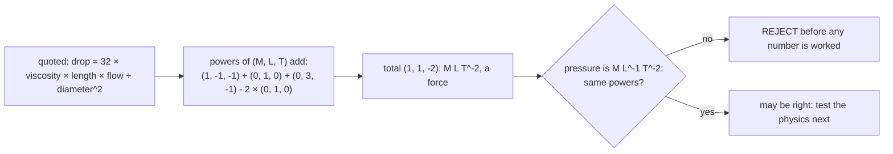
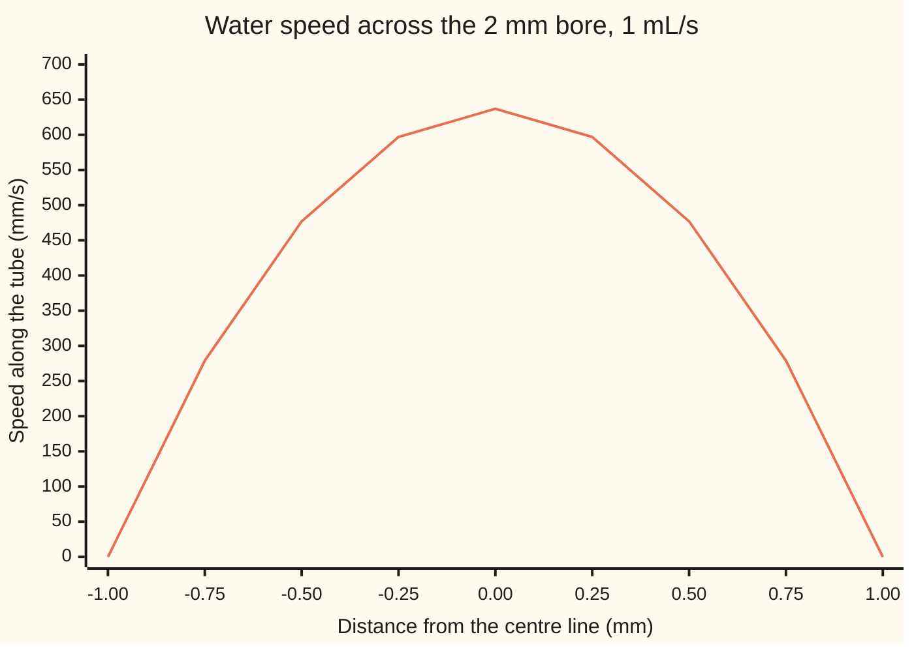

# Units and dimensions: seven base quantities every formula has to balance

Engineering mathematics → Units and Modelling → Dimension bookkeeping → Units and dimensions

---

## General Overview

A greenhouse feeds each plant through a plastic tube with a 2 mm bore, 1 m long. Each tube must carry 1 mL of water per second, at 20 °C. The engineer wants one number: how much pressure has to push the water through. That number sets the height of the header tank.

A handbook page, copied by hand, quotes the answer as "pressure drop = 32 × viscosity × length × flow rate ÷ diameter squared". Fed the tube's numbers in metres, kilograms and seconds, it gives 0.008013. Is that a pressure in pascals? It is not a pressure at all. The check that shows this takes one line and needs no fluid mechanics: write every quantity in terms of mass, length and time, add up the powers, and compare the two sides.

That bookkeeping is the subject here. Every measured quantity is built from seven base quantities, such as mass, length and time. A formula that describes the world must come out with the same recipe on both sides, and in every term it adds. The correct pipe formula passes, and gives 2,550.55 Pa: the tube's friction alone needs a header tank 26.06 cm above the outlet. The hand-copied one fails before any number is worked out.

**A physical law cannot depend on which units its user picked, so every term it adds or equates must carry the same powers of mass, length, time and the other base quantities; a formula that fails this is wrong, whatever numbers it prints.**

**What kind of fact this is:** a theorem about any equation that stays true when the units change, proved on this card in Why it works; the seven SI base units themselves are a convention, defined since 2019 by fixing the values of seven constants, such as the speed of light.

### The picture: the one-line check on the quoted formula



The pure number 32 adds nothing to the powers. The rejected formula has swapped the flow rate in for the mean speed; the version with mean speed passes.

---

## The formula

Notation first, in words. Square brackets around a quantity, $[X]$, mean "the dimension of X": its recipe in base quantities, with no number and no unit attached. Seven base dimensions exist, written $\mathsf{M}$ mass, $\mathsf{L}$ length, $\mathsf{T}$ time, $\mathsf{I}$ electric current, $\Theta$ temperature, $\mathsf{N}$ amount of substance, $\mathsf{J}$ luminous intensity. Later cards also write a base dimension in brackets, [M] for mass, [L] for length; the rest of this wing uses this notation freely. Written that way, the pressure drop's recipe is [Δp] = [M][L]^-1[T]^-2, also written [M L^-1 T^-2]: the same recipe as M L^-1 T^-2.

Every quantity's dimension is one product of powers of the seven:

$$[X] = \mathsf{M}^{a}\,\mathsf{L}^{b}\,\mathsf{T}^{c}\,\mathsf{I}^{e}\,\Theta^{f}\,\mathsf{N}^{g}\,\mathsf{J}^{h}, \qquad \mathbf{d}(X) = (a, b, c, e, f, g, h)$$

**Read it aloud:** the dimension of X is mass to some power, times length to some power, and so on; the list of seven powers is its exponent list.

The powers are whole numbers or fractions, and most are zero. Two rules follow from that form.

$$\mathbf{d}(X^{p}\,Y^{q}) = p\,\mathbf{d}(X) + q\,\mathbf{d}(Y), \qquad A = B + C \text{ is allowed only if } \mathbf{d}(A) = \mathbf{d}(B) = \mathbf{d}(C)$$

**Read it aloud:** multiplying quantities adds their exponent lists, and adding or equating quantities demands that their exponent lists be equal.

A pure number, such as 128, π or a count, has the exponent list of all zeros. It is "dimension one" and never changes a check. The argument of an exponential, a logarithm or a sine must also be dimension one.

The seven base units of the SI (the International System of Units) are the second, metre, kilogram, ampere, kelvin, mole and candela. A derived unit is **coherent** when it is a product of base units with no extra number: the newton is exactly kg m s^-2, the pascal is exactly a newton per square metre, kg m^-1 s^-2. A formula in coherent SI units needs no conversion constants.

The card's two pipe formulas, the right one (Hagen–Poiseuille, for smooth, slow flow) and the hand-copied one:

$$\Delta p = \frac{128\,\mu\,\ell\,Q}{\pi D^{4}} \qquad\text{against}\qquad \Delta p \overset{?}{=} \frac{32\,\mu\,\ell\,Q}{D^{2}}$$

**Read it aloud:** the pressure drop is 128 over π, times viscosity, times length, times flow rate, divided by the fourth power of the bore; the quoted version divides by only the square.

| Symbol | Plain meaning | In our example | Push it up and the answer… |
| --- | --- | --- | --- |
| $[X]$ | the dimension of a quantity X: its base-quantity recipe | pressure: M L^-1 T^-2 | — |
| $\mathsf{M}$, $\mathsf{L}$, $\mathsf{T}$, $\mathsf{I}$, $\Theta$, $\mathsf{N}$, $\mathsf{J}$ | the seven base dimensions: mass, length, time, current, temperature, amount, luminous intensity | this card uses M, L, T | — |
| $\mathbf{d}(X)$ | the exponent list of X, the seven powers in that order | viscosity: (1, -1, -1, 0, 0, 0, 0) | — |
| $\Delta p$ | pressure drop along the tube, in pascals (Pa) | 2,550.55 Pa | the header tank must stand higher |
| $\mu$ | dynamic viscosity: how hard the water resists sliding past itself, in Pa s | 1.0016 mPa s, water at 20 °C | drop rises in proportion |
| $\ell$ | tube length | 1.0 m | drop rises in proportion |
| $Q$ | volume flow rate, cubic metres per second | 1.0 mL/s, one millionth of a cubic metre per second | drop rises in proportion, until the flow turns turbulent |
| $D$, $R$ | bore diameter, and radius R = D/2 | 2.0 mm | drop falls with the fourth power of the bore |
| $r$ | distance from the tube's centre line, from 0 to R | 0 to 1.0 mm in the chart | the water slows, to zero at the wall |
| $v$ | mean speed, flow rate divided by the bore's area | 0.318310 m/s | — |
| $\rho$ | density of the water | 998.21 kg/m^3 | no change to the slow-flow drop; raises Re |
| $g_n$ | standard acceleration of gravity, a fixed value (NIST CODATA) | 9.80665 m/s^2 | a given drop needs a lower tank |
| $\mathrm{Re}$ | Reynolds number, ρ v D / μ: a pure number comparing the water's momentum with its viscosity | 634.4651 | past 2300 the formula stops applying |
| $\lambda$ | the size of a new unit of length, in metres | 0.0100 for the centimetre, 0.3048 for the foot | a homogeneous formula's answer does not move |
| $t$, $\tau$ | a time, and a fixed time it is measured against | only in the exp(-t/τ) trap in The usual mistake | — |

### When it holds

- **A quantity equation, not a number recipe.** The check applies to formulas whose symbols stand for quantities with their units. A recipe written for fixed units ("drop in kPa = 40.743665 × viscosity in mPa s × …") hides units inside its constant. This one has the Hagen–Poiseuille powers, so the check passes it; fed SI numbers it is still wrong by a factor of 1,000. That is a unit error, not a dimension error, and the check cannot see it.
- **A law meant to hold in every system of units.** A curve fitted to one data set, in one set of units, has no such duty. Its constants carry units, and the check does not apply until they are written in.
- **One relation, not two glued.** Adding two true laws with different dimensions gives a true but unbalanced equation. The theorem says each dimension group must balance separately.
- **Balanced is necessary, not sufficient.** The check is blind to pure numbers and to physics. The slow-flow formula balances at 10 mL/s too, and there it predicts 25,505.53 Pa against 89,525.62 Pa from the Blasius friction law for turbulent flow in a smooth tube.

---

## Why it works

### Step 0: the metre is a human choice, and nature does not know it

A length of tube is the same tube whether it is written in metres, centimetres or feet. Only the number changes. A law of nature relates the tube's length to its pressure drop, so the relation cannot depend on whether the engineer counted in metres or feet. Demanding that the law survive every change of units forces the powers to balance.

### Step 1: a new unit rescales each number by a power

Make the unit of length λ metres instead of one metre: λ = 0.0100 for the centimetre. A length of 1 m now reads 1/λ, so its number is multiplied by λ^-1. An area's number is multiplied by λ^-2, a flow rate's by λ^-3. In general, a quantity whose length power is b has its number multiplied by λ^(-b). Mass and time units rescale the same way, each with its own factor and its own power.

### Step 2: in a product, the powers add

Multiply two quantities, with length powers b1 and b2. Their numbers rescale by λ^(-b1) and λ^(-b2), so the product rescales by λ^(-(b1 + b2)). That is the rule "multiplying adds exponent lists". It is not an extra convention: it is how the numbers themselves behave when the unit changes. A pure number such as 128/π is never rescaled, which is why its exponent list is all zeros.

### Step 3: a sum survives every rescaling only if its terms rescale alike

Write the law with everything on one side: term 1 + term 2 + … = 0. Group the terms by their length power, say b1 for the first group and b2 for the second, and call the groups' summed numbers c1 and c2 in metres. After rescaling, the law reads

$$c_1\,\lambda^{-b_1} + c_2\,\lambda^{-b_2} = 0 \quad\text{for every } \lambda > 0.$$

If b1 differs from b2, the two powers of λ grow at different rates. No fixed numbers c1 and c2 can cancel them for every λ unless both are zero. So each group sums to zero on its own. A single law whose terms carry different powers is either false or is several laws stapled together. The same argument runs for the mass power, the time power and the rest, one base at a time.

<details>
<summary>Detailed proof</summary>

Claim: if the numbers c1, …, ck satisfy c1 λ^(-b1) + … + ck λ^(-bk) = 0 for every λ > 0, with distinct powers b1 < b2 < … < bk, then every c is zero.

Multiply through by λ^(bk), the largest power. The last term becomes ck. Every other term becomes ci λ^(bk - bi), with a positive power of λ. Let λ shrink toward zero: every other term vanishes, so ck = 0. Remove that term and repeat with the next largest power. After k rounds every c is zero.

Apply this to each base dimension in turn. Terms that share all seven powers form one group; the claim makes each group's sum zero. An equation that is true under every choice of the seven units therefore balances group by group: dimensional homogeneity. Rescaling mass, length and time together is just the three one-base rescalings done in a row.

</details>

### Step 4: the check, applied to the quoted formula

Viscosity is a pressure times a time: (1, -1, -2) + (0, 0, 1) = (1, -1, -1). Flow rate is a volume per second: (0, 3, -1). Then 32 μ ℓ Q / D^2 has the list (1, -1, -1) + (0, 1, 0) + (0, 3, -1) - 2 × (0, 1, 0) = (1, 1, -2). That is M L T^-2, a force. Pressure is M L^-1 T^-2. The formula is rejected. The right formula has D^4 in place of D^2, which subtracts two more lengths and gives (1, -1, -2), a pressure.

### Step 5: what the failure does to the numbers

Step 1 also forecasts how a wrong formula misbehaves. Its answer is "pressure times L^2". Change to centimetres and its answer, read as a pressure and converted back to pascals, is multiplied by λ^-2 = 10,000. The same tube now "needs" 80.128000 Pa instead of 0.008013 Pa. A real pressure drop cannot depend on the ruler. The code below takes this road as a second, independent test.

The general machinery of exponent lists — which combinations of quantities come out as pure numbers, and how many there are — belongs to [dimensional-analysis-and-buckingham-pi](02-dimensional-analysis-and-buckingham-pi.md).

---

## Worked numbers, by hand

The greenhouse tube: water at 20 °C, viscosity 1.0016 mPa s and density 998.21 kg/m^3 (NIST WebBook); bore 2.0 mm, length 1.0 m, flow 1.0 mL/s.

| Step | Arithmetic | Value |
| --- | --- | --- |
| exponent list of the quoted formula | (1, -1, -1) + (0, 1, 0) + (0, 3, -1) - 2 × (0, 1, 0) | (1, 1, -2): a force, **rejected** |
| exponent list of the right formula | (1, -1, -1) + (0, 1, 0) + (0, 3, -1) - 4 × (0, 1, 0) | (1, -1, -2): a pressure |
| bore area | π × (2.0 mm)^2 / 4 | 3.141593 mm^2 |
| mean speed | 1.0 × 10^-6 m^3/s ÷ area | 0.318310 m/s |
| Reynolds number | 998.21 × 0.318310 × 0.002 / 0.0010016 | 634.4651, below 2300: slow, smooth flow |
| viscosity × length × flow ÷ bore^4 | 0.0010016 × 1.0 × 10^-6 ÷ 0.002^4 | 62.600000 Pa |
| pressure drop | 62.6 Pa × 128/π, and 128/π = 40.743665 | **2,550.55 Pa** |
| tank height, friction only | 2,550.55 / (998.21 × 9.80665) m | 26.06 cm |

A header tank whose water surface stands 26.06 cm above the tube's outlet overcomes the friction of 1 mL/s flowing through each tube. That is the friction of fully developed flow in a long tube. The water also leaves the outlet carrying its motion: a head of 2 v^2/(2 g_n) = 1.03 cm for the curved profile below, twice the flat-profile value. The first 7.61 cm of tube (0.06 Re D), where that profile is still forming, adds a little more, so a real tank stands about 1 cm higher. The quoted formula's 0.008013 would have put the tank at a fraction of a millimetre, and no water would have reached the far end at the right rate.

### The picture: how the water moves across the bore



One line: the water's speed at each distance from the centre, computed by the force balance in the code. It is still at the wall and fastest, 637 mm/s, on the centre line: twice the mean speed. This curved profile is where the 128/π comes from.

### What breaks if you drop a piece

| Mistake | Comes out at | What went wrong |
| --- | --- | --- |
| flow rate in place of mean speed: 32 μ ℓ Q / D^2 | 0.008013, dimension M L T^-2 | a force, not a pressure; in centimetres it reads 80.128000 Pa |
| one power of the bore dropped: D^3 | 5.101107, dimension M T^-2 | not a pressure; drifts by 100 in centimetres |
| the mixed-unit recipe (constant 40.743665, kPa) fed SI numbers | 2,550.553456 "kPa" | balanced in form, but its constant hides units: 1,000 times too high |
| slow-flow formula at 10 mL/s, Re 6344.6508 | 25,505.53 Pa against 89,525.62 Pa | balanced and wrong: the flow is turbulent |

The first two fail the check. The last two pass it and are still wrong, which is the honest limit of the method.

---

## Code, from first principles, and it actually runs

The code builds each exponent list from its parts (force from mass and acceleration, pressure from force and area) and takes three roads. Road 1 adds exponent lists and compares each formula with a pressure. Road 2 never looks at exponents: it re-expresses the inputs in centimetres, grams and seconds, and in feet, pounds and minutes, with each input's unit written out by hand (the poise is 0.1 Pa s, a cubic centimetre per second is 10^-6 m^3/s, a pound per foot per minute is built from the pound, the foot and the minute), evaluates each formula, converts the answer back to pascals, and asks whether it moved. A right formula comes back unchanged; a wrong one drifts by exactly the factor road 1 forecasts. Road 3 rebuilds the pressure drop from a force balance: the push on a cylinder of water of radius r balances the drag on its skin, so the shear stress (sliding force per unit area) is (Δp/ℓ) × r/2. The code steps the speed in from the wall, adds up the flow ring by ring, and scales the pressure until the flow is 1 mL/s. It never uses 128/π.

### Python

```python
# Units and dimensions -- the check behind the card.  Python standard library only.
# Road 1: exponent arithmetic.  Road 2: change the units and see whether the answer moves.
# Road 3: rebuild the pressure drop from a force balance on rings of water, step by step.
from math import pi

BASE = ("M", "L", "T", "I", "Θ", "N", "J")      # mass, length, time, current, temperature, amount, luminous intensity
def dim(M=0, L=0, T=0): return (M, L, T, 0, 0, 0, 0)    # this card needs only the first three
def mul(*ds): return tuple(sum(c) for c in zip(*ds))
def pw(d, p): return tuple(p * c for c in d)
def show(d):
    s = " ".join(b if c == 1 else f"{b}^{c}" for b, c in zip(BASE, d) if c != 0)
    return s or "1 (pure number)"

ONE, MASS, LEN, TIME = dim(), dim(M=1), dim(L=1), dim(T=1)
accel    = mul(LEN, pw(TIME, -2))
force    = mul(MASS, accel)                       # newton = kg m s^-2
pressure = mul(force, pw(LEN, -2))                # pascal = newton per square metre
visc     = mul(pressure, TIME)                    # Pa s
flow     = mul(pw(LEN, 3), pw(TIME, -1))          # m^3 per s
speed    = mul(LEN, pw(TIME, -1))
density  = mul(MASS, pw(LEN, -3))
for name, d in (("force N", force), ("pressure Pa", pressure), ("viscosity Pa s", visc),
                ("flow rate m^3/s", flow), ("density kg/m^3", density)):
    print(f"dims {name:<22}{show(d)}")

# the drip tube: water at 20 C (NIST WebBook), 2 mm bore, 1 m long, 1 mL/s
mu, rho, ell, Q, D, gn = 1.0016e-3, 998.21, 1.0, 1.0e-6, 2.0e-3, 9.80665
RE_LAM, BL_LO, BL_HI = 2300.0, 4000.0, 1.0e5      # laminar limit; Blasius range (White)
print(f"inputs mu {1000 * mu:.4f} mPa s, rho {rho:.2f} kg/m^3, l {ell:.1f} m, D {1000 * D:.1f} mm, Q {1e6 * Q:.1f} mL/s, g_n {gn:.5f} m/s^2")
print(f"limits laminar below Re {RE_LAM:.0f}; Blasius for Re {BL_LO:.0f} to {BL_HI:.0f}")
ins = {"mu": visc, "l": LEN, "Q": flow, "D": LEN}
FORMULAS = {   # name: (number, {input: power})
    "128 mu l Q / (pi D^4)": (128 / pi, {"mu": 1, "l": 1, "Q": 1, "D": -4}),
    "32 mu l Q / D^2":       (32.0,     {"mu": 1, "l": 1, "Q": 1, "D": -2}),
    "128 mu l Q / (pi D^3)": (128 / pi, {"mu": 1, "l": 1, "Q": 1, "D": -3}),
}
def evaluate(f, vals):
    c, pows = FORMULAS[f]
    out = c
    for k, p in pows.items(): out *= vals[k] ** p
    return out

# road 1's forecast of the drift: other unit systems (metres, kilograms, seconds per new unit)
SYSTEMS = {"cm g s": (0.01, 0.001, 1.0), "ft lb min": (0.3048, 0.45359237, 60.0)}
def in_units(d, sysf): return sysf[0] ** d[1] * sysf[1] ** d[0] * sysf[2] ** d[2]   # SI size of one new unit
# road 2: each input's own unit, its SI size written out by hand; no exponent list is used
LB, FT, MIN = 0.45359237, 0.3048, 60.0
HAND = {"cm g s":    {"mu": 0.1, "l": 0.01, "Q": 1.0e-6, "D": 0.01, "p": 0.1},   # poise, cm, cm^3/s, cm, barye
        "ft lb min": {"mu": LB / (FT * MIN), "l": FT, "Q": FT * FT * FT / MIN, "D": FT, "p": LB / (FT * MIN * MIN)}}
si_vals = {"mu": mu, "l": ell, "Q": Q, "D": D}
for s, (a, b, c) in SYSTEMS.items(): print(f"system {s:<10} one unit = {a:.4f} m, {b:.8f} kg, {c:.0f} s")
ratios, verdicts = {}, []
for f in FORMULAS:
    c, pows = FORMULAS[f]
    d = mul(*[pw(ins[k], p) for k, p in pows.items()])
    p_si = evaluate(f, si_vals)
    verdict = "PASS" if d == pressure else "REJECT"
    verdicts.append(verdict)
    print(f"check {f:<23}{show(d):<14}vs {show(pressure)}  {verdict}")
    print(f"  SI answer read as Pa       {p_si:14.6f}")
    for s, sysf in SYSTEMS.items():
        h = HAND[s]
        back = evaluate(f, {k: v / h[k] for k, v in si_vals.items()}) * h["p"]   # read as a pressure, convert to Pa
        diff = mul(d, pw(pressure, -1))
        predicted = 1.0 / in_units(diff, sysf)                            # road 1's forecast of the drift
        ratios[(f, s)] = (back / p_si, predicted)
        print(f"  in {s:<10} back in Pa {back:14.6f}  ratio {back / p_si:12.6f}  forecast {predicted:12.6f}")

dp = evaluate("128 mu l Q / (pi D^4)", si_vals)
area = pi * D * D / 4
v = Q / area
Re = rho * v * D / mu
print(f"bore area mm^2               {1e6 * area:14.6f}")
print(f"mean speed v = Q/area m/s    {v:14.6f}")
print(f"mu l Q / D^4 Pa              {mu * ell * Q / D ** 4:14.6f}  times 128/pi = {128 / pi:.6f}")
print(f"Reynolds rho v D / mu        {Re:14.4f}  dims {show(mul(density, speed, LEN, pw(visc, -1)))}")
print(f"32 mu l v / D^2 Pa           {32 * mu * ell * v / D ** 2:14.6f}")
print(f"head dp/(rho g) cm           {100 * dp / (rho * gn):14.4f}")
print(f"exit head 2 v^2/(2 g) cm     {100 * v * v / gn:14.4f}  entry length 0.06 Re D {100 * 0.06 * Re * D:.4f} cm")

# road 3: force balance on a cylinder of water of radius r gives shear tau = (dp/l) r / 2;
# du/dr = -tau/mu, stepped in from the wall (u = 0); flow = sum of 2 pi r u dr.  Linear in dp.
def flow_for(dp_try, n=20000):
    R, h = D / 2, D / 2 / n
    u = [0.0] * (n + 1)
    for i in range(n, 0, -1):                     # trapezoid step from r_i to r_(i-1)
        t1, t0 = dp_try / ell * (i * h) / 2, dp_try / ell * ((i - 1) * h) / 2
        u[i - 1] = u[i] + h * (t1 + t0) / 2 / mu
    g = [2 * pi * (i * h) * u[i] for i in range(n + 1)]
    return h / 3 * (g[0] + g[n] + 4 * sum(g[1:n:2]) + 2 * sum(g[2:n:2])), u
q1, u1 = flow_for(1.0)
dp_road3 = Q / q1
_, prof = flow_for(dp_road3)
print(f"dp closed form Pa            {dp:14.6f}")
print(f"dp force balance Pa          {dp_road3:14.6f}")
print("chart, r (mm)          " + " ".join(f"{x:6.2f}" for x in (-1, -0.75, -0.5, -0.25, 0, 0.25, 0.5, 0.75, 1)))
print("chart, u (mm/s)        " + " ".join(f"{1000 * prof[abs(k) * 5000]:6.0f}" for k in (-4, -3, -2, -1, 0, 1, 2, 3, 4)))

# what breaks: a mixed-unit version, and the laminar formula outside its range
K = evaluate("128 mu l Q / (pi D^4)", {"mu": 1e-3, "l": 1.0, "Q": 1e-6, "D": 1e-3}) / 1000
mixed_ok = K * (1000 * mu) * ell * (1e6 * Q) / (1000 * D) ** 4   # fed its own units
mixed_bad = K * mu * ell * Q / D ** 4
print(f"mixed-unit constant K        {K:14.6f}  (kPa, with mPa s, m, mL/s, mm)")
print(f"mixed form, own units kPa   {mixed_ok:14.6f}")
print(f"mixed form, SI numbers kPa   {mixed_bad:14.6f}")
print(f"mixed form, SI over own      {mixed_bad / mixed_ok:14.6f}")
Q10 = 1.0e-5
v10 = Q10 / area
Re10 = rho * v10 * D / mu
lam10 = evaluate("128 mu l Q / (pi D^4)", {"mu": mu, "l": ell, "Q": Q10, "D": D})
f_bl = 0.316 / Re10 ** 0.25                       # Blasius, smooth tube, 4000 < Re < 1e5 (White)
turb10 = f_bl * (ell / D) * rho * v10 ** 2 / 2
print(f"at 10 mL/s: Re               {Re10:14.4f}")
print(f"at 10 mL/s: laminar Pa       {lam10:14.4f}")
print(f"at 10 mL/s: Blasius Pa       {turb10:14.4f}  friction factor {f_bl:.6f}")

assert verdicts == ["PASS", "REJECT", "REJECT"], "road 1: exponent check on the three quoted formulas"
assert all(abs(ratios[("128 mu l Q / (pi D^4)", s)][0] - 1) < 1e-12 for s in SYSTEMS), "road 2: right formula ignores units"
assert all(abs(r / p - 1) < 1e-9 for (f, s), (r, p) in ratios.items()), "road 2 drift equals road 1 forecast"
assert abs(dp_road3 / dp - 1) < 1e-9, "road 3: force balance lands on the closed form"
assert abs(mixed_ok * 1000 / dp_road3 - 1) < 1e-9, "mixed-unit form, fed its own units, meets the force balance"
assert Re < RE_LAM, "laminar at 1 mL/s"
assert BL_LO < Re10 < BL_HI, "turbulent, inside the Blasius range, at 10 mL/s"
assert turb10 > 3 * lam10, "outside its range the laminar formula is off by more than 3x"
print("ALL CHECKS PASS")
```

**Ran 2026-10-06 on macOS, Python 3.14.6, standard library only. All checks passed. Output, pasted from the run:**

```
dims force N               M L T^-2
dims pressure Pa           M L^-1 T^-2
dims viscosity Pa s        M L^-1 T^-1
dims flow rate m^3/s       L^3 T^-1
dims density kg/m^3        M L^-3
inputs mu 1.0016 mPa s, rho 998.21 kg/m^3, l 1.0 m, D 2.0 mm, Q 1.0 mL/s, g_n 9.80665 m/s^2
limits laminar below Re 2300; Blasius for Re 4000 to 100000
system cm g s     one unit = 0.0100 m, 0.00100000 kg, 1 s
system ft lb min  one unit = 0.3048 m, 0.45359237 kg, 60 s
check 128 mu l Q / (pi D^4)  M L^-1 T^-2   vs M L^-1 T^-2  PASS
  SI answer read as Pa          2550.553456
  in cm g s     back in Pa    2550.553456  ratio     1.000000  forecast     1.000000
  in ft lb min  back in Pa    2550.553456  ratio     1.000000  forecast     1.000000
check 32 mu l Q / D^2        M L T^-2      vs M L^-1 T^-2  REJECT
  SI answer read as Pa             0.008013
  in cm g s     back in Pa      80.128000  ratio 10000.000000  forecast 10000.000000
  in ft lb min  back in Pa       0.086249  ratio    10.763910  forecast    10.763910
check 128 mu l Q / (pi D^3)  M T^-2        vs M L^-1 T^-2  REJECT
  SI answer read as Pa             5.101107
  in cm g s     back in Pa     510.110691  ratio   100.000000  forecast   100.000000
  in ft lb min  back in Pa      16.735915  ratio     3.280840  forecast     3.280840
bore area mm^2                     3.141593
mean speed v = Q/area m/s          0.318310
mu l Q / D^4 Pa                   62.600000  times 128/pi = 40.743665
Reynolds rho v D / mu              634.4651  dims 1 (pure number)
32 mu l v / D^2 Pa              2550.553456
head dp/(rho g) cm                  26.0550
exit head 2 v^2/(2 g) cm             1.0332  entry length 0.06 Re D 7.6136 cm
dp closed form Pa               2550.553456
dp force balance Pa             2550.553456
chart, r (mm)           -1.00  -0.75  -0.50  -0.25   0.00   0.25   0.50   0.75   1.00
chart, u (mm/s)             0    279    477    597    637    597    477    279      0
mixed-unit constant K             40.743665  (kPa, with mPa s, m, mL/s, mm)
mixed form, own units kPa         2.550553
mixed form, SI numbers kPa      2550.553456
mixed form, SI over own         1000.000000
at 10 mL/s: Re                    6344.6508
at 10 mL/s: laminar Pa           25505.5346
at 10 mL/s: Blasius Pa           89525.6188  friction factor 0.035407
ALL CHECKS PASS
```

Three roads agree. The exponent check rejects two of the three formulas. The unit change leaves the right formula at 2550.553456 Pa in both other systems, and moves the wrong ones by 10,000 and 100 in centimetres, as forecast. The force balance lands on the closed form to the sixth decimal.

### Rust

Same roads, same labels. Exponent lists are fixed-size integer arrays. No crates.

```rust
// Units and dimensions -- the same check as si_units_and_dimensional_homogeneity_check.py.  Std only.
// Road 1: exponent arithmetic.  Road 2: change the units and see whether the answer moves.
// Road 3: rebuild the pressure drop from a force balance on rings of water, step by step.
use std::f64::consts::PI;

type Dim = [i32; 7];
const BASE: [&str; 7] = ["M", "L", "T", "I", "Θ", "N", "J"];

fn dim(m: i32, l: i32, t: i32) -> Dim { [m, l, t, 0, 0, 0, 0] } // this card needs only the first three
fn mul(ds: &[Dim]) -> Dim {
    let mut o = [0; 7];
    for d in ds { for i in 0..7 { o[i] += d[i]; } }
    o
}
fn pw(d: Dim, p: i32) -> Dim { let mut o = d; for c in o.iter_mut() { *c *= p; } o }
fn show(d: Dim) -> String {
    let parts: Vec<String> = (0..7).filter(|&i| d[i] != 0)
        .map(|i| if d[i] == 1 { BASE[i].to_string() } else { format!("{}^{}", BASE[i], d[i]) }).collect();
    if parts.is_empty() { "1 (pure number)".to_string() } else { parts.join(" ") }
}
// SI size of one new unit of a quantity with dimension d, in a system of (metres, kilograms, seconds) per unit
fn in_units(d: Dim, s: (f64, f64, f64)) -> f64 { s.0.powi(d[1]) * s.1.powi(d[0]) * s.2.powi(d[2]) }

struct Formula { name: &'static str, coef: f64, pows: [i32; 4] } // powers of mu, l, Q, D
fn evaluate(f: &Formula, v: [f64; 4]) -> f64 {
    let mut out = f.coef;
    for k in 0..4 { out *= v[k].powi(f.pows[k]); }
    out
}

fn flow_for(dp_try: f64, mu: f64, ell: f64, d: f64, n: usize) -> (f64, Vec<f64>) {
    let h = d / 2.0 / n as f64;
    let mut u = vec![0.0; n + 1];
    for i in (1..=n).rev() { // trapezoid step from r_i to r_(i-1)
        let t1 = dp_try / ell * (i as f64 * h) / 2.0;
        let t0 = dp_try / ell * ((i - 1) as f64 * h) / 2.0;
        u[i - 1] = u[i] + h * (t1 + t0) / 2.0 / mu;
    }
    let g: Vec<f64> = (0..=n).map(|i| 2.0 * PI * (i as f64 * h) * u[i]).collect();
    let mut s = g[0] + g[n];
    for i in 1..n { s += if i % 2 == 1 { 4.0 * g[i] } else { 2.0 * g[i] }; }
    (h / 3.0 * s, u)
}

fn main() {
    let (mass, len, time) = (dim(1, 0, 0), dim(0, 1, 0), dim(0, 0, 1));
    let accel = mul(&[len, pw(time, -2)]);
    let force = mul(&[mass, accel]); // newton = kg m s^-2
    let pressure = mul(&[force, pw(len, -2)]); // pascal = newton per square metre
    let visc = mul(&[pressure, time]);
    let flow = mul(&[pw(len, 3), pw(time, -1)]);
    let speed = mul(&[len, pw(time, -1)]);
    let density = mul(&[mass, pw(len, -3)]);
    for (name, d) in [("force N", force), ("pressure Pa", pressure), ("viscosity Pa s", visc),
                      ("flow rate m^3/s", flow), ("density kg/m^3", density)] {
        println!("dims {:<22}{}", name, show(d));
    }

    // the drip tube: water at 20 C (NIST WebBook), 2 mm bore, 1 m long, 1 mL/s
    let (mu, rho, ell, q, d, gn) = (1.0016e-3, 998.21, 1.0, 1.0e-6, 2.0e-3, 9.80665);
    let (re_lam, bl_lo, bl_hi) = (2300.0, 4000.0, 1.0e5); // laminar limit; Blasius range (White)
    println!("inputs mu {:.4} mPa s, rho {:.2} kg/m^3, l {:.1} m, D {:.1} mm, Q {:.1} mL/s, g_n {:.5} m/s^2", 1000.0 * mu, rho, ell, 1000.0 * d, 1e6 * q, gn);
    println!("limits laminar below Re {:.0}; Blasius for Re {:.0} to {:.0}", re_lam, bl_lo, bl_hi);
    let ins = [visc, len, flow, len];
    let formulas = [
        Formula { name: "128 mu l Q / (pi D^4)", coef: 128.0 / PI, pows: [1, 1, 1, -4] },
        Formula { name: "32 mu l Q / D^2", coef: 32.0, pows: [1, 1, 1, -2] },
        Formula { name: "128 mu l Q / (pi D^3)", coef: 128.0 / PI, pows: [1, 1, 1, -3] },
    ];
    let systems = [("cm g s", (0.01, 0.001, 1.0)), ("ft lb min", (0.3048, 0.45359237, 60.0))]; // road 1's forecast
    // road 2: each input's own unit, its SI size written out by hand: [mu, l, Q, D, pressure]; no exponent list
    let (lb, ft, min) = (0.45359237, 0.3048, 60.0);
    let hand = [[0.1, 0.01, 1.0e-6, 0.01, 0.1], // poise, cm, cm^3/s, cm, barye
                [lb / (ft * min), ft, ft * ft * ft / min, ft, lb / (ft * min * min)]];
    let si_vals = [mu, ell, q, d];
    for (s, (a, b, c)) in systems.iter() { println!("system {:<10} one unit = {:.4} m, {:.8} kg, {:.0} s", s, a, b, c); }
    let mut verdicts = Vec::new();
    let mut ratios = Vec::new(); // (formula index, ratio, forecast)
    for (fi, f) in formulas.iter().enumerate() {
        let terms: Vec<Dim> = (0..4).map(|k| pw(ins[k], f.pows[k])).collect();
        let dd = mul(&terms);
        let p_si = evaluate(f, si_vals);
        let verdict = if dd == pressure { "PASS" } else { "REJECT" };
        verdicts.push(verdict);
        println!("check {:<23}{:<14}vs {}  {}", f.name, show(dd), show(pressure), verdict);
        println!("  SI answer read as Pa       {:14.6}", p_si);
        for (si, (s, sysf)) in systems.iter().enumerate() {
            let h = hand[si];
            let mut nv = [0.0; 4];
            for k in 0..4 { nv[k] = si_vals[k] / h[k]; }
            let back = evaluate(f, nv) * h[4]; // read as a pressure, convert to Pa
            let diff = mul(&[dd, pw(pressure, -1)]);
            let predicted = 1.0 / in_units(diff, *sysf); // road 1's forecast of the drift
            ratios.push((fi, back / p_si, predicted));
            println!("  in {:<10} back in Pa {:14.6}  ratio {:12.6}  forecast {:12.6}", s, back, back / p_si, predicted);
        }
    }

    let dp = evaluate(&formulas[0], si_vals);
    let area = PI * d * d / 4.0;
    let v = q / area;
    let re = rho * v * d / mu;
    println!("bore area mm^2               {:14.6}", 1e6 * area);
    println!("mean speed v = Q/area m/s    {:14.6}", v);
    println!("mu l Q / D^4 Pa              {:14.6}  times 128/pi = {:.6}", mu * ell * q / d.powi(4), 128.0 / PI);
    println!("Reynolds rho v D / mu        {:14.4}  dims {}", re, show(mul(&[density, speed, len, pw(visc, -1)])));
    println!("32 mu l v / D^2 Pa           {:14.6}", 32.0 * mu * ell * v / (d * d));
    println!("head dp/(rho g) cm           {:14.4}", 100.0 * dp / (rho * gn));
    println!("exit head 2 v^2/(2 g) cm     {:14.4}  entry length 0.06 Re D {:.4} cm", 100.0 * v * v / gn, 100.0 * 0.06 * re * d);

    // road 3: shear tau = (dp/l) r / 2 from a force balance; du/dr = -tau/mu from the wall; flow is linear in dp
    let (q1, _) = flow_for(1.0, mu, ell, d, 20000);
    let dp_road3 = q / q1;
    let (_, prof) = flow_for(dp_road3, mu, ell, d, 20000);
    println!("dp closed form Pa            {:14.6}", dp);
    println!("dp force balance Pa          {:14.6}", dp_road3);
    let rs: Vec<String> = [-1.0, -0.75, -0.5, -0.25, 0.0, 0.25, 0.5, 0.75, 1.0].iter().map(|x: &f64| format!("{:6.2}", x)).collect();
    println!("chart, r (mm)          {}", rs.join(" "));
    let us: Vec<String> = [-4i32, -3, -2, -1, 0, 1, 2, 3, 4].iter()
        .map(|k| format!("{:6.0}", 1000.0 * prof[(k.unsigned_abs() as usize) * 5000])).collect();
    println!("chart, u (mm/s)        {}", us.join(" "));

    // what breaks: a mixed-unit version, and the laminar formula outside its range
    let k = evaluate(&formulas[0], [1e-3, 1.0, 1e-6, 1e-3]) / 1000.0;
    let mixed_ok = k * (1000.0 * mu) * ell * (1e6 * q) / (1000.0 * d).powi(4); // fed its own units
    let mixed_bad = k * mu * ell * q / d.powi(4);
    println!("mixed-unit constant K        {:14.6}  (kPa, with mPa s, m, mL/s, mm)", k);
    println!("mixed form, own units kPa   {:14.6}", mixed_ok);
    println!("mixed form, SI numbers kPa   {:14.6}", mixed_bad);
    println!("mixed form, SI over own      {:14.6}", mixed_bad / mixed_ok);
    let q10 = 1.0e-5;
    let v10 = q10 / area;
    let re10 = rho * v10 * d / mu;
    let lam10 = evaluate(&formulas[0], [mu, ell, q10, d]);
    let f_bl = 0.316 / re10.powf(0.25); // Blasius, smooth tube, 4000 < Re < 1e5 (White)
    let turb10 = f_bl * (ell / d) * rho * v10 * v10 / 2.0;
    println!("at 10 mL/s: Re               {:14.4}", re10);
    println!("at 10 mL/s: laminar Pa       {:14.4}", lam10);
    println!("at 10 mL/s: Blasius Pa       {:14.4}  friction factor {:.6}", turb10, f_bl);

    assert_eq!(verdicts, vec!["PASS", "REJECT", "REJECT"], "road 1: exponent check on the three quoted formulas");
    assert!(ratios.iter().filter(|r| r.0 == 0).all(|r| (r.1 - 1.0).abs() < 1e-12), "road 2: right formula ignores units");
    assert!(ratios.iter().all(|r| (r.1 / r.2 - 1.0).abs() < 1e-9), "road 2 drift equals road 1 forecast");
    assert!((dp_road3 / dp - 1.0).abs() < 1e-9, "road 3: force balance lands on the closed form");
    assert!((mixed_ok * 1000.0 / dp_road3 - 1.0).abs() < 1e-9, "mixed-unit form, fed its own units, meets the force balance");
    assert!(re < re_lam, "laminar at 1 mL/s");
    assert!(bl_lo < re10 && re10 < bl_hi, "turbulent, inside the Blasius range, at 10 mL/s");
    assert!(turb10 > 3.0 * lam10, "outside its range the laminar formula is off by more than 3x");
    println!("ALL CHECKS PASS");
}
```

**Ran 2026-10-06 on macOS, rustc 1.98.1, no crates. All checks passed. Output, pasted from the run:**

```
dims force N               M L T^-2
dims pressure Pa           M L^-1 T^-2
dims viscosity Pa s        M L^-1 T^-1
dims flow rate m^3/s       L^3 T^-1
dims density kg/m^3        M L^-3
inputs mu 1.0016 mPa s, rho 998.21 kg/m^3, l 1.0 m, D 2.0 mm, Q 1.0 mL/s, g_n 9.80665 m/s^2
limits laminar below Re 2300; Blasius for Re 4000 to 100000
system cm g s     one unit = 0.0100 m, 0.00100000 kg, 1 s
system ft lb min  one unit = 0.3048 m, 0.45359237 kg, 60 s
check 128 mu l Q / (pi D^4)  M L^-1 T^-2   vs M L^-1 T^-2  PASS
  SI answer read as Pa          2550.553456
  in cm g s     back in Pa    2550.553456  ratio     1.000000  forecast     1.000000
  in ft lb min  back in Pa    2550.553456  ratio     1.000000  forecast     1.000000
check 32 mu l Q / D^2        M L T^-2      vs M L^-1 T^-2  REJECT
  SI answer read as Pa             0.008013
  in cm g s     back in Pa      80.128000  ratio 10000.000000  forecast 10000.000000
  in ft lb min  back in Pa       0.086249  ratio    10.763910  forecast    10.763910
check 128 mu l Q / (pi D^3)  M T^-2        vs M L^-1 T^-2  REJECT
  SI answer read as Pa             5.101107
  in cm g s     back in Pa     510.110691  ratio   100.000000  forecast   100.000000
  in ft lb min  back in Pa      16.735915  ratio     3.280840  forecast     3.280840
bore area mm^2                     3.141593
mean speed v = Q/area m/s          0.318310
mu l Q / D^4 Pa                   62.600000  times 128/pi = 40.743665
Reynolds rho v D / mu              634.4651  dims 1 (pure number)
32 mu l v / D^2 Pa              2550.553456
head dp/(rho g) cm                  26.0550
exit head 2 v^2/(2 g) cm             1.0332  entry length 0.06 Re D 7.6136 cm
dp closed form Pa               2550.553456
dp force balance Pa             2550.553456
chart, r (mm)           -1.00  -0.75  -0.50  -0.25   0.00   0.25   0.50   0.75   1.00
chart, u (mm/s)             0    279    477    597    637    597    477    279      0
mixed-unit constant K             40.743665  (kPa, with mPa s, m, mL/s, mm)
mixed form, own units kPa         2.550553
mixed form, SI numbers kPa      2550.553456
mixed form, SI over own         1000.000000
at 10 mL/s: Re                    6344.6508
at 10 mL/s: laminar Pa           25505.5346
at 10 mL/s: Blasius Pa           89525.6188  friction factor 0.035407
ALL CHECKS PASS
```

The two outputs are identical, line for line.

> [!TIP]
> **Try changing**
> - **Swap the flow rate for the mean speed** in the second formula. Guess first: does it pass? It does: 32 μ ℓ v / D^2 has the dimension M L^-1 T^-2 and gives 2550.553456 Pa, on the printed line "32 mu l v / D^2 Pa".
> - **Invent a third unit system**, such as the mile, the tonne and the hour, in both SYSTEMS and HAND. Guess first: the right formula's ratio stays at 1.000000, and each wrong formula's ratio equals its forecast, whatever the units.
> - **Set the flow to 10 mL/s.** Guess first: which assert fails? The laminar one: Re becomes 6344.6508, and the slow-flow answer of 25505.5346 Pa no longer describes the tube.
> - **Change 128 to 64 in the right formula.** Guess first: the exponent check still passes, because 64 is a pure number. Road 3 fails it: the force balance does not know the formula and still returns 2550.553456 Pa.

---

## The usual mistake

> [!warning]
> **Treating a balanced formula as a correct one.** The check rejects; it cannot accept. It is blind to pure numbers, so 64/π and 128/π look the same to it. It is blind to physics, so the slow-flow formula balances at 10 mL/s and still predicts 25,505.53 Pa where the turbulent tube needs 89,525.62 Pa. Use it to throw formulas out, then test what survives against a second road.
>
> - **Trusting a mixed-unit recipe because it balances.** "Drop in kPa = 40.743665 × μ in mPa s × ℓ in m × Q in mL/s ÷ (D in mm)^4" is right, with the units written into its constant, and it passes the check. Fed SI numbers it gives 2,550.553456 "kPa", 1,000 times too high: a unit error, the same kind that lost the Mars Climate Orbiter.
> - **Same dimension, same kind.** Torque and energy both have M L^2 T^-2. A torque is written N m, never J. The check lets two energies add; it does not let an energy add to a torque.
> - **A dimensioned argument inside a function.** exp(-t) with t in seconds has no meaning. Write exp(-t/τ) with τ a time; then the argument is a pure number in any units.
> - **Prefixes are not coherent.** Grams and millimetres are SI, and the hour is accepted beside it, but a formula fed them picks up conversion constants. Convert to kg, m and s first.

---

## Where you meet it in real life

- **Design reviews.** A reviewer reads a quoted formula and checks its powers before checking its numbers. Most transcription slips, a lost square or a swapped symbol, fail on sight.
- **Handbook recipes in fixed units.** Empirical pipe and channel formulas are often printed for one set of units, with dimensioned constants. Using them in another set is the third row of the table above.
- **Spacecraft and aircraft.** In 1999 the Mars Climate Orbiter was lost after impulse data in pound-force seconds were read as newton seconds. Both are impulses, with the same dimension, so no dimension check could catch it: only a unit check could.
- **Wind tunnels and scale models.** Testing a small model only works because the drag depends on the powers balancing into pure numbers: [similarity-and-model-testing](04-similarity-and-model-testing.md).
- **Simulation codes.** Rewriting a model so every variable is a pure number is [scaling-and-nondimensionalisation](03-scaling-and-nondimensionalisation.md); it starts from the exponent lists built here.

> **Say it back**
> Every quantity is a number times a unit, and its dimension is a product of powers of seven base quantities. Changing a unit multiplies each number by a power of the change, so a law true in every unit system must have the same powers in every term it adds or equates. Write each quantity's exponent list, add them for products, and compare: a formula that fails is wrong. The quoted 32 μ ℓ Q / D^2 comes out as a force and is rejected; the right formula gives 2,550.55 Pa for the greenhouse tube. A formula that passes may still be wrong, by a pure number or by being used outside its range.

---

## What this builds on

- [ratios-and-rates](../../01-Foundations/01-Everyday%20Arithmetic/09-ratios-and-rates.md): a rate is one quantity per unit of another, the first compound unit.
- [scientific-notation](../../01-Foundations/03-Powers%2C%20Roots%20and%20Logarithms/04-scientific-notation.md): the powers of ten in prefixes and in 10^-6 m^3/s.

## Where this goes next

- [dimensional-analysis-and-buckingham-pi](02-dimensional-analysis-and-buckingham-pi.md): the exponent lists become a matrix, and its null space counts the pure-number groups such as the Reynolds number.
- [error-propagation-and-sensitivity](07-error-propagation-and-sensitivity.md): the powers that balance here also say how an error in the bore grows in the answer.

The check says which formulas could be right but not what form a law must take; which combinations of viscosity, flow, length and bore a law is allowed to depend on is the question the Buckingham Pi card answers.

---

## Sources

Verified 2026-10-06: every link below resolves to the publisher's page.

- Bureau International des Poids et Mesures. *The International System of Units (SI)*, 9th ed., 2019, updated 2026. [BIPM brochure page](https://www.bipm.org/en/publications/si-brochure). The seven base units, the defining constants, coherent derived units, and dimensions of quantities.
- Thompson, A., and B. N. Taylor. *Guide for the Use of the International System of Units (SI)*, NIST Special Publication 811. [NIST page](https://www.nist.gov/pml/special-publication-811). Quantity equations against numerical-value equations, and the dimension of a quantity.
- NIST. "Standard acceleration of gravity", CODATA value. [NIST CODATA page](https://physics.nist.gov/cgi-bin/cuu/Value?gn). The 9.80665 m/s^2 used for the tank height.
- NIST Chemistry WebBook. *Thermophysical Properties of Fluid Systems*. [NIST WebBook fluid page](https://webbook.nist.gov/chemistry/fluid/). Density and viscosity of water at 20 °C and atmospheric pressure, from the IAPWS formulations.
- White, Frank M., and Henry Xue. *Fluid Mechanics*, 9th ed. McGraw Hill. [Publisher page](https://www.mheducation.com/highered/product/fluid-mechanics-white/M9781260258318.html). The Hagen–Poiseuille drop, the laminar limit near Re 2300, and the Blasius friction factor for smooth tubes.
