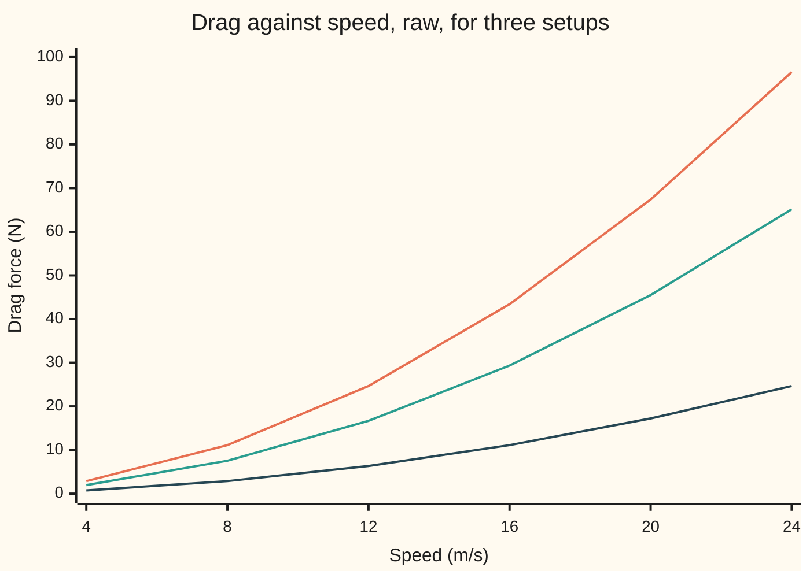
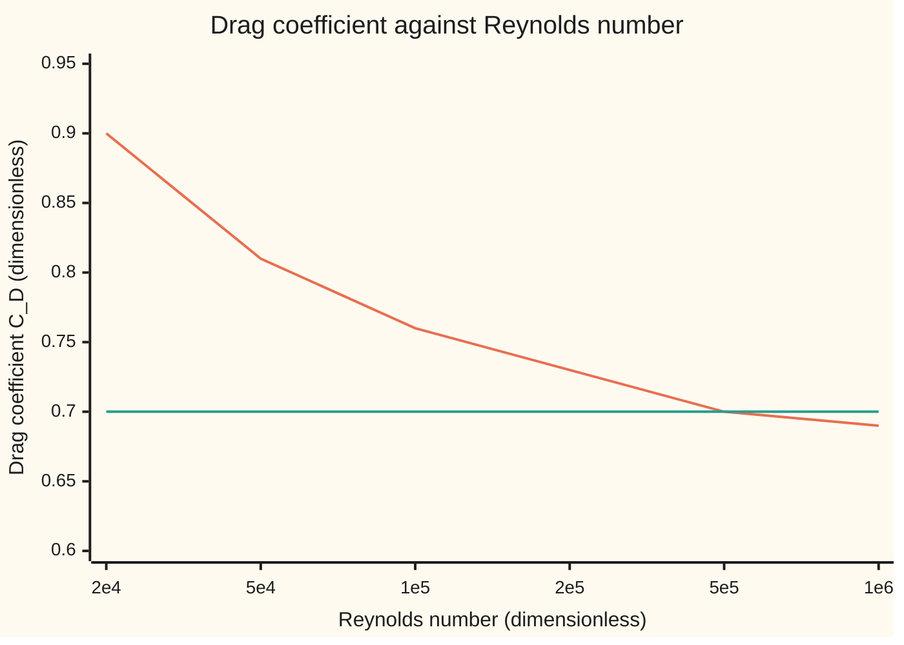

# Buckingham Pi: count the variables, subtract the dimensions, get the groups

[Syllabus](../../../SYLLABUS.md) → [Engineering mathematics](../README.md) → [Units and Modelling](../README.md#s01) → Buckingham Pi

---

## General Overview

A cyclist rides at 12 m/s, about 43 km/h, on a still day at sea level. The air pushes back. A team wants that drag force, in newtons, because it sets the power the rider must supply: force times speed.

What can the drag depend on? The rider's speed. The rider's frontal area, the silhouette seen from the front: 0.40 m^2 here. The air's density, 1.225 kg/m^3 at sea level. And the air's viscosity, its stickiness, 1.7894 × 10^-5 Pa·s. Five quantities, counting the drag itself.

Measuring it the direct way means a separate curve of drag against speed for every rider size, every altitude, every air temperature. Three sizes at three altitudes is nine curves, and each new condition adds another.

Units forbid most of that work. Drag is measured in newtons, and newtons are kilograms times metres per second squared. A true law cannot change when the metre is redefined, so the five quantities can enter only in combinations that carry no units at all. Count those combinations and the nine curves become one.

**A physical law among n quantities, built from k independent units, is a law among just n − k unit-free combinations of them.**

**What kind of fact this is:** a theorem, proved on this card in Why it works. Which quantities go on the list is a modelling choice, not part of the theorem.

### The picture: three setups, three different curves



Top line: full-size rider, 0.40 m^2, at sea level. Middle line: the same rider at 4,000 m, where the air is thinner. Bottom line: a half-scale model, 0.10 m^2, at sea level. Three curves that never meet. The bottom line at 24 m/s reads 24.65 N, exactly the top line at 12 m/s: a first hint that something simpler sits underneath.

---

## The formula

Notation first, in words. Square brackets give a quantity's dimension, as on [Units and dimensions](01-si-units-and-dimensional-homogeneity.md): [M] mass, [L] length, [T] time. A **dimensionless group** is a product of the quantities, each raised to some power, whose units all cancel. This wing writes such a group with the capital Greek letter Π, "pi", and names it where it has a name.

Suppose the drag is fixed by the other four:

$$F = f(V, A, \rho, \mu).$$

The theorem says this relation can always be rewritten as

$$\Pi_F = \varphi(\Pi_\mu), \qquad \Pi_F = \frac{F}{\rho V^2 A}, \qquad \Pi_\mu = \frac{\mu}{\rho V \sqrt{A}}.$$

**Read it aloud:** the drag, divided by the force scale the air's momentum sets, is some function of one other unit-free number; nothing else can matter.

The count behind it, in general:

$$\text{number of groups} = n - k.$$

Here $n$ = 5 quantities and $k$ = 3 independent dimensions, so two groups, and the law is one curve of one group against the other.

Engineers flip $\Pi_\mu$ and double $\Pi_F$, by convention:

$$\mathrm{Re} = \frac{\rho V \sqrt{A}}{\mu}, \qquad C_D = \frac{F}{\tfrac12 \rho V^2 A} = \varphi_D(\mathrm{Re}).$$

$\mathrm{Re}$ is the **Reynolds number**: the ratio of the air's momentum to its stickiness. $C_D$ is the **drag coefficient**. The half and the choice of $\sqrt{A}$ as the length are habits, not part of the theorem.

| Symbol | Plain meaning | In our example | Push it up and the answer… |
| --- | --- | --- | --- |
| $F$ | drag force, newtons | 24.65 N | — (the output) |
| $V$ | speed of the rider through still air | 12 m/s | drag rises roughly as its square |
| $A$ | frontal area | 0.40 m^2 | drag rises roughly in proportion |
| $\rho$ | air density, "rho" | 1.225 kg/m^3 | drag rises nearly in proportion |
| $\mu$ | air's dynamic viscosity, its stickiness, "mu" | 1.7894 × 10^-5 Pa·s | Re falls, C_D rises a little |
| $n$ | how many quantities are on the list | 5 | one more group per added quantity, unless it brings a new independent dimension |
| $k$ | rank of the dimension matrix: how many independent units the list really uses | 3 | one fewer group |
| $\Pi_F$ | drag group, $F/(\rho V^2 A)$ | 0.3493 | — |
| $\Pi_\mu$ | viscosity group, $\mu/(\rho V \sqrt{A})$ | 1.924687 × 10^-6 | — |
| $\mathrm{Re}$ | Reynolds number, $1/\Pi_\mu$ | 519,565 | C_D drifts toward its high-Re floor |
| $C_D$ | drag coefficient, $2\Pi_F$ | 0.6986 | — |
| $f$, $\varphi$, $\varphi_D$ | the law in raw quantities; the unknown curve the theorem leaves to experiment | one curve | — |
| $a$, $b$, $c$, $d$, $e$ | the powers of ρ, V, A, F and μ in a trial product (Step 1, Worked numbers) | for $\Pi_F$: −1, −2, −1, 1, 0 | — |
| c, in the code's output | speed of sound in the air | 340.29 m/s at sea level | the Mach number V/c falls |

### When it holds

- **The list is complete.** Every quantity that affects the drag is on it. Leave viscosity off and the theorem predicts one constant $C_D$; the stand-in law below says $C_D$ runs from 0.90 to 0.69 over the tested range.
- **The units are the right ones to count.** $k$ is the rank of the dimension matrix, not the number of unit names written down. Name temperature as a fourth unit when nothing on the list carries it, and the count wrongly drops to one group.
- **The shapes are alike.** One length, $\sqrt{A}$, stands for the whole rider. That holds only for riders and models of the same shape and posture; a different shape adds its own length ratios to the list, one group each.
- **The physics does not change regime.** At 12 m/s the air is effectively incompressible; at 150 m/s the speed of sound joins the list and a third group, the Mach number, appears.
- **The quantities are positive and the law is the same in every unit system.** The proof uses this and the complete list of the first bullet, and nothing else.

---

## Why it works

### Step 0: a law cannot know which ruler was used

Measure the rider in centimetres instead of metres and the number for $A$ grows by 10,000. The drag does not care. A law that held only in metres would be a coincidence of the metre, not physics. Everything below is that one demand turned into arithmetic.

### Step 1: write each quantity's units as a column of exponents

Force is kg·m·s^-2, so its column is (1, 1, −2) for (M, L, T). Density is kg·m^-3: (1, −3, 0). Viscosity, in Pa·s, is kg·m^-1·s^-1: (1, −1, −1). The five columns form the **dimension matrix**, three rows by five columns:

| | $\rho$ | $V$ | $A$ | $F$ | $\mu$ |
| --- | --- | --- | --- | --- | --- |
| M | 1 | 0 | 0 | 1 | 1 |
| L | −3 | 1 | 2 | 1 | −1 |
| T | 0 | −1 | 0 | −2 | −1 |

A product $\rho^a V^b A^c F^d \mu^e$ has M-exponent $a + d + e$, and so on down the rows. It is dimensionless exactly when all three row sums are zero. So the exponent lists of dimensionless products are the solutions of three linear equations: the **null space** of the matrix.

### Step 2: rank–nullity counts them

The matrix has rank 3: its first three columns, $\rho$, $V$ and $A$, are independent. Rank–nullity ([Rank and nullity](../../03-Algebra/05-Solving%20Systems/05-rank-nullity.md)) says the null space has dimension columns minus rank: 5 − 3 = 2. Every dimensionless product is a product of powers of two basic ones. Pick the exponent of $F$ to be 1 and of $\mu$ to be 0, solve, and $\Pi_F$ comes out. Swap, and $\Pi_\mu$ comes out.

### Step 3: choose units that make three quantities equal to 1

Here is the heart of the proof. The three independent columns $\rho$, $V$ and $A$, the **repeating variables**, act like a private unit system. Because their columns are independent, there is a choice of mass, length and time units in which the rider's density, speed and area all read exactly 1. In those units the drag reads $F/(\rho V^2 A)$, which is $\Pi_F$, and the viscosity reads $\Pi_\mu$.

The law holds in every unit system, so it holds in this one. There it says: drag-number = $f$(1, 1, 1, viscosity-number). That is $\Pi_F = f(1, 1, 1, \Pi_\mu)$, a function of $\Pi_\mu$ alone.

<details>
<summary>Detailed proof</summary>

Let the quantities be $Q_1, \dots, Q_n$ whose dimension matrix has rank $k$. Change the unit of each base dimension: the new units of mass, length and time are the old ones divided by $x_M, x_L, x_T$, all positive. A quantity whose column is $(a_1, a_2, a_3)$ then reads $Q \, x_M^{a_1} x_L^{a_2} x_T^{a_3}$ in the new units. In logarithms: $\ln Q$ shifts by the column dotted with $(\ln x_M, \ln x_L, \ln x_T)$.

Reorder so that $Q_1, \dots, Q_k$ have independent columns. Then the $k$ equations "shift of $\ln Q_j$ equals $-\ln Q_j$" for $j = 1, \dots, k$ have a solution for the log-scales: their coefficient rows are the $k$ independent columns, so the system has full row rank. (When $k$ is less than the number of base dimensions, some scales stay free.) In the chosen units $Q_1 = \dots = Q_k = 1$.

Each remaining quantity $Q_i \; (i > k)$ has a column that is a combination of the first $k$ columns, $\text{col}_i = \sum_j c_{ij}\,\text{col}_j$. So $\Pi_i = Q_i \prod_j Q_j^{-c_{ij}}$ is dimensionless, the same number in every unit system, and in the chosen units it equals that quantity's reading.

Write the law as $\Phi(Q_1, \dots, Q_n) = 0$ (capital phi), assumed to hold in every unit system. In the chosen system it reads $\Phi(1, \dots, 1, \Pi_{k+1}, \dots, \Pi_n) = 0$. That is a relation among the $n - k$ groups alone, which is the theorem. These groups are independent because each contains its own leftover quantity and no other.

</details>

### Step 4: what the theorem gives, and what it does not

It gives the arguments of the curve: one group against one group. It does not give the curve $\varphi$. That has to be measured, or computed from the flow equations. A rider tested at many speeds, sizes and altitudes traces one curve of $C_D$ against $\mathrm{Re}$, and that curve is all the data needed.

A second road to the same groups is to write the governing equations and divide out their scales. That is [Nondimensionalisation](03-scaling-and-nondimensionalisation.md); it finds the groups and also says which terms are small.

---

## Worked numbers, by hand

Find the exponents of $\Pi_F = F \rho^a V^b A^c$ by setting each row sum to zero:

| Step | Arithmetic | Value |
| --- | --- | --- |
| M row | 1 + a = 0 | a = −1 |
| T row | −2 − b = 0 | b = −2 |
| L row | 1 − 3a + b + 2c = 1 + 3 − 2 + 2c = 0 | c = −1 |
| so | $\Pi_F = F/(\rho V^2 A)$ | exponents −1, −2, −1, 1, 0 |
| same for $\mu$: M, T, L rows | 1 + a = 0; −1 − b = 0; −1 + 3 − 1 + 2c = 0 | a = −1, b = −1, c = −1/2 |
| length scale | $\sqrt{0.40}$ | 0.6325 m |
| Reynolds number | 1.225 × 12 × √0.40 / 1.7894 × 10^-5 | 519,565 |
| air's force scale | ½ × 1.225 × 12^2 × 0.40 | 35.28 N |
| $C_D$ from the curve below | 0.65 + 35 / 720.8 = 0.65 + 0.0486 | 0.6986 |
| **drag** | 35.28 × 0.6986 | **24.65 N** |
| power | 24.6451 × 12 | 295.7 W |

The rider spends 295.7 W just pushing air at 12 m/s. A half-scale model at 24 m/s has the same Reynolds number, 519,565, so the same $C_D$, and in the same air its drag is the same 24.65 N: the bottom curve in the first picture meeting the top one.

### What breaks if you drop a piece

| Mistake | Comes out at | What went wrong |
| --- | --- | --- |
| Leave viscosity off the list, then test a quarter-scale model at the rider's 12 m/s | full-size drag predicted 26.36 N; true 24.65 N | Four quantities give one group, so $C_D$ looks constant. The model ran at Re = 129,891 with $C_D$ = 0.7471, not the rider's 0.6986. |
| Count unit names, not rank: add temperature [Θ] because air temperature sets $\mu$ | 5 − 4 = 1 group | No quantity carries [Θ]; its row is all zeros and the rank stays 3. Two groups, not one. |
| A product that is not dimensionless: $F/(\rho V A)$ | 4.191339 in SI, 25148.036901 in grams, centimetres and minutes | One power of $V$ short; it still carries m/s, so its value depends on the ruler. $\Pi_F$ reads 0.349278 in both. |
| Same list at 150 m/s | Mach number 0.4408 against the rider's 0.0353 | Air compresses; the speed of sound, 340.29 m/s, joins the list: 6 quantities, rank 3, three groups. |

---

## Code, from first principles, and it actually runs

The code reaches the group count by two independent roads and checks the groups two more ways. Road 1 row-reduces the dimension matrix in exact fractions and reads off the rank and the null-space basis. Road 2 tries every product with exponents −2, −1.5, …, 2 on all five quantities, 59,049 of them, keeps the dimensionless ones, and finds they span two directions; it also counts them from the two groups and gets the same 25. Road 3 converts the rider's numbers into grams, centimetres and minutes and confirms both groups keep their values while the drag changes. Road 4 runs a stand-in experiment at nine setups (three sizes, three altitudes) and shows every point lands on one curve.

The stand-in experiment is a two-term drag law, chosen to give cyclist-like numbers; it is not a measured curve. It is written in raw quantities, with no group inside it:

$$F = \tfrac12 (0.65) \rho V^2 A + 17.5 \sqrt{\rho \mu}\, V^{1.5} A^{0.75}.$$

Dividing by $\tfrac12 \rho V^2 A$ gives $C_D = 0.65 + 35/\sqrt{\mathrm{Re}}$, the "master curve" the code checks against. Air density and viscosity at altitude come from the US Standard Atmosphere 1976 formulas: temperature falling 6.5 K per km, the pressure law that follows, and Sutherland's law for viscosity. At sea level they reproduce the standard's table, 1.225 kg/m^3 and 1.7894 × 10^-5 Pa·s, and at 4,000 m its density, 0.8194 kg/m^3, to within 0.001 kg/m^3.

### Python

```python
# Buckingham Pi on cyclist drag -- the check behind the card. Standard library only.
# Road 1: exact elimination on the dimension matrix gives the rank and the groups.
# Road 2: brute force over every half-step exponent finds the dimensionless products.
# Road 3: a change of units leaves the groups unchanged. Road 4: nine setups collapse.
from fractions import Fraction as Q
from math import sqrt

NAMES = ["rho", "V", "A", "F", "mu"]          # repeating variables rho, V, A first
DIMS = [[1, 0, 0, 1, 1],                      # M exponents
        [-3, 1, 2, 1, -1],                    # L exponents
        [0, -1, 0, -2, -1]]                   # T exponents

def rref(rows):
    m = [[Q(x) for x in r] for r in rows]
    piv, r = [], 0
    for c in range(len(m[0]) if m else 0):
        p = next((i for i in range(r, len(m)) if m[i][c] != 0), None)
        if p is None: continue
        m[r], m[p] = m[p], m[r]
        m[r] = [x / m[r][c] for x in m[r]]
        for i in range(len(m)):
            if i != r and m[i][c] != 0:
                f = m[i][c]; m[i] = [a - f * b for a, b in zip(m[i], m[r])]
        piv.append(c); r += 1
        if r == len(m): break
    return m, piv

def kernel(rows):
    m, piv = rref(rows)
    n = len(rows[0]); out = []
    for fc in [c for c in range(n) if c not in piv]:
        v = [Q(0)] * n; v[fc] = Q(1)
        for i, pc in enumerate(piv): v[pc] = -m[i][fc]
        out.append(v)
    return out, len(piv)

def show(v): return " ".join(f"{str(x):>4}" for x in v)

print("dimension matrix, columns " + " ".join(f"{s:>4}" for s in NAMES))
for lab, r in zip("MLT", DIMS): print(f"  {lab}  " + " " * 21 + show(r))
basis, k = kernel(DIMS)
print(f"variables n = {len(NAMES)}, rank k = {k}, groups n - k = {len(basis)}")
for name, v in zip(["Pi_F ", "Pi_mu"], basis): print(f"{name} exponents rho V A F mu: {show(v)}")

# Road 2: every product with exponents -2, -1.5, ..., 2 (doubled: -4..4), tested for zero dimension
found = []
for code in range(9 ** 5):
    e = [(code // 9 ** j) % 9 - 4 for j in range(5)]
    if all(sum(d * x for d, x in zip(r, e)) == 0 for r in DIMS): found.append(e)
from_basis = 0
for a in range(-4, 5):                        # doubled exponent of F
    for b in range(-4, 5):                    # doubled exponent of mu
        if b % 2: continue                    # A would get a quarter power
        v = [-a - b, -2 * a - b, -a - b // 2, a, b]
        from_basis += all(-4 <= x <= 4 for x in v)
_, brute_rank = rref(found) if found else (None, [])
print(f"brute force: {len(found)} dimensionless products in the box, {from_basis} predicted from the two groups")
print(f"brute force: those products span {len(brute_rank)} independent directions")

# Road 3: same rider in grams, centimetres, minutes
rho, mu, A, V = 1.225, 1.7894e-5, 0.40, 12.0  # US Standard Atmosphere 1976 at sea level; full-size rider
def law(rho, mu, A, V):                       # stand-in experiment, written without any group in it
    return 0.5 * 0.65 * rho * V * V * A + 17.5 * sqrt(rho * mu) * V ** 1.5 * A ** 0.75
def groups(rho, V, A, F, mu): return F / (rho * V * V * A), mu / (rho * V * sqrt(A))
F = law(rho, mu, A, V)
g = 1000.0; cm = 100.0; mn = 1 / 60.0         # new units per old unit: kg->g, m->cm, s->min
conv = [g / cm ** 3, cm / mn, cm * cm, g * cm / mn ** 2, g / (cm * mn)]
new = [x * c for x, c in zip([rho, V, A, F, mu], conv)]
p_si, p_new = groups(rho, V, A, F, mu), groups(*new)
bad_si, bad_new = F / (rho * V * A), new[3] / (new[0] * new[1] * new[2])
print(f"units: F = {F:.4f} N in SI, {new[3] / 1e9:.6f} x 10^9 g cm/min^2 in the new units")
print(f"units: Pi_F  SI {p_si[0]:.6f}  new {p_new[0]:.6f}")
print(f"units: Pi_mu x 10^6 SI {p_si[1] * 1e6:.6f}  new {p_new[1] * 1e6:.6f}")
print(f"units: wrong F/(rho V A) SI {bad_si:.6f}  new {bad_new:.6f}")

# The cyclist, read back
L = sqrt(A); Re = rho * V * L / mu; CD = F / (0.5 * rho * V * V * A)
print(f"cyclist: sqrt(A) = {L:.4f} m, Re = {Re:.0f}, C_D = {CD:.4f}, Pi_F = {CD / 2:.4f}")
print(f"cyclist: sqrt(Re) = {sqrt(Re):.1f}, 35/sqrt(Re) = {35 / sqrt(Re):.4f}, 0.5 rho V^2 A = {0.5 * rho * V * V * A:.2f} N")
print(f"cyclist: drag F = {F:.2f} N, power F V = {F * V:.1f} W")

def atmos(h):                                 # US Standard Atmosphere 1976, troposphere
    T = 288.15 - 0.0065 * h
    p = 101325.0 * (T / 288.15) ** 5.255877
    return p / (287.05287 * T), 1.458e-6 * T ** 1.5 / (T + 110.4), sqrt(1.4 * 287.05287 * T)
def master(Re): return 0.65 + 35.0 / sqrt(Re)  # C_D the stand-in law implies, derived on the card

# Road 4: nine setups (three sizes x three altitudes), each at the speed that gives a target Re
setups = [(h, a) for h in (0.0, 2000.0, 4000.0) for a in (0.40, 0.10, 0.025)]
spread_ok = True
for target in (2e4, 5e4, 1e5, 2e5, 5e5, 1e6):
    cs, fs = [], []
    for h, a in setups:
        r, m, _ = atmos(h); v = target * m / (r * sqrt(a)); f = law(r, m, a, v)
        cs.append(f / (0.5 * r * v * v * a)); fs.append(f)
    spread_ok &= max(cs) - min(cs) < 1e-12 and abs(cs[0] - master(target)) < 1e-12
    print(f"collapse Re {target:>9.0f}: C_D {cs[0]:.4f} in all 9 setups; raw F {min(fs):.4f} N to {max(fs):.4f} N")
print(f"collapse: one curve, spread below 1e-12: {'yes' if spread_ok else 'no'}")

print("figure, C_D at Re 2e4 5e4 1e5 2e5 5e5 1e6: " + " ".join(f"{master(x):.2f}" for x in (2e4, 5e4, 1e5, 2e5, 5e5, 1e6)))
print(f"figure, C_D if viscosity is left off (one constant): {CD:.2f}")
print("figure, raw drag in N at V = 4 8 12 16 20 24 m/s")
for lab, h, a in (("full size, sea level", 0.0, 0.40), ("full size, 4000 m", 4000.0, 0.40), ("half scale, sea level", 0.0, 0.10)):
    r, m, _ = atmos(h)
    print(f"  {lab:<22}" + " ".join(f"{law(r, m, a, v):.2f}" for v in (4, 8, 12, 16, 20, 24)))

# What breaks
q_a = 0.025; q_re = rho * V * sqrt(q_a) / mu; q_cd = law(rho, mu, q_a, V) / (0.5 * rho * V * V * q_a)
print(f"no viscosity: quarter-scale model at 12 m/s, Re = {q_re:.0f}, C_D = {q_cd:.4f}")
print(f"no viscosity: full-size drag predicted {0.5 * rho * V * V * A * q_cd:.2f} N, true {F:.2f} N")
h_v = 2 * V; h_f = law(rho, mu, 0.10, h_v)
print(f"similar model: half scale at {h_v:.0f} m/s, Re = {rho * h_v * sqrt(0.10) / mu:.0f}, drag {h_f:.2f} N")
with_theta = DIMS + [[0, 0, 0, 0, 0]]
_, k4 = kernel(with_theta)
print(f"names vs rank: 4 dimension names, rank {k4}, groups {5 - k4} (not {5 - 4})")
with_c = [r + [c] for r, c in zip(DIMS, (0, 1, -1))]
bc, kc = kernel(with_c)
r0, m0, c0 = atmos(0.0)
print(f"add sound speed c = {c0:.2f} m/s: n = 6, rank {kc}, groups {len(bc)}")
print(f"Mach V/c: cyclist {V / c0:.4f}, at 150 m/s {150 / c0:.4f}")
print(f"try: C_D at Re 1e7 {master(1e7):.4f}, at Re 1000 {master(1e3):.4f}")

assert len(basis) == len(brute_rank)                           # elimination vs brute force
assert k == 3 and len(basis) == 2 and k4 == 3 and len(bc) == 3  # the counts the card states
assert abs(0.5 * rho * V * V * A * q_cd / F - 1) > 0.05        # dropping viscosity mispredicts
via = [1.0, 1.0]                                               # the elimination's exponents, applied
for i, v in enumerate(basis):
    for x, e in zip([rho, V, A, F, mu], v): via[i] *= x ** float(e)
assert all(abs(a / b - 1) < 1e-12 for a, b in zip(via, p_si))  # match the groups written out by hand
assert len(found) == from_basis                                # brute count vs count built from the groups
assert all(abs(x / y - 1) < 1e-12 for x, y in zip(p_si, p_new))  # groups survive the unit change
assert abs(bad_new / bad_si - 1) > 0.1                         # a non-group does not
assert spread_ok                                               # raw law at nine setups vs the master curve
assert abs(h_f - F) < 1e-9 * F                                 # half-scale run of the law equals full size
assert abs(r0 - 1.225) < 1e-3 and abs(m0 - 1.7894e-5) < 1e-8 and abs(atmos(4000.0)[0] - 0.8194) < 1e-3  # the standard's table, 0 m and 4000 m
print("all checks passed")
```

**Ran 2026-10-06 on macOS, Python 3.14.6, standard library only. All checks passed. Output, pasted from the run:**

```
dimension matrix, columns  rho    V    A    F   mu
  M                          1    0    0    1    1
  L                         -3    1    2    1   -1
  T                          0   -1    0   -2   -1
variables n = 5, rank k = 3, groups n - k = 2
Pi_F  exponents rho V A F mu:   -1   -2   -1    1    0
Pi_mu exponents rho V A F mu:   -1   -1 -1/2    0    1
brute force: 25 dimensionless products in the box, 25 predicted from the two groups
brute force: those products span 2 independent directions
units: F = 24.6451 N in SI, 8.872227 x 10^9 g cm/min^2 in the new units
units: Pi_F  SI 0.349278  new 0.349278
units: Pi_mu x 10^6 SI 1.924687  new 1.924687
units: wrong F/(rho V A) SI 4.191339  new 25148.036901
cyclist: sqrt(A) = 0.6325 m, Re = 519565, C_D = 0.6986, Pi_F = 0.3493
cyclist: sqrt(Re) = 720.8, 35/sqrt(Re) = 0.0486, 0.5 rho V^2 A = 35.28 N
cyclist: drag F = 24.65 N, power F V = 295.7 W
collapse Re     20000: C_D 0.8975 in all 9 setups; raw F 0.0469 N to 0.0605 N
collapse Re     50000: C_D 0.8065 in all 9 setups; raw F 0.2635 N to 0.3396 N
collapse Re    100000: C_D 0.7607 in all 9 setups; raw F 0.9941 N to 1.2812 N
collapse Re    200000: C_D 0.7283 in all 9 setups; raw F 3.8070 N to 4.9064 N
collapse Re    500000: C_D 0.6995 in all 9 setups; raw F 22.8542 N to 29.4537 N
collapse Re   1000000: C_D 0.6850 in all 9 setups; raw F 89.5220 N to 115.3728 N
collapse: one curve, spread below 1e-12: yes
figure, C_D at Re 2e4 5e4 1e5 2e5 5e5 1e6: 0.90 0.81 0.76 0.73 0.70 0.69
figure, C_D if viscosity is left off (one constant): 0.70
figure, raw drag in N at V = 4 8 12 16 20 24 m/s
  full size, sea level  2.88 11.12 24.65 43.41 67.39 96.57
  full size, 4000 m     1.96 7.55 16.68 29.34 45.50 65.15
  half scale, sea level 0.75 2.88 6.34 11.12 17.23 24.65
no viscosity: quarter-scale model at 12 m/s, Re = 129891, C_D = 0.7471
no viscosity: full-size drag predicted 26.36 N, true 24.65 N
similar model: half scale at 24 m/s, Re = 519565, drag 24.65 N
names vs rank: 4 dimension names, rank 3, groups 2 (not 1)
add sound speed c = 340.29 m/s: n = 6, rank 3, groups 3
Mach V/c: cyclist 0.0353, at 150 m/s 0.4408
try: C_D at Re 1e7 0.6611, at Re 1000 1.7568
all checks passed
```

### Rust

```rust
// Buckingham Pi on cyclist drag -- the check behind the card. Rust std only.
// Road 1: exact elimination on the dimension matrix gives the rank and the groups.
// Road 2: brute force over every half-step exponent finds the dimensionless products.
// Road 3: a change of units leaves the groups unchanged. Road 4: nine setups collapse.
#[derive(Clone, Copy, PartialEq)]
struct Q { n: i64, d: i64 }               // an exact fraction n/d, d > 0, lowest terms
fn gcd(a: i64, b: i64) -> i64 { if b == 0 { a.abs() } else { gcd(b, a % b) } }
fn q(n: i64, d: i64) -> Q { let g = gcd(n, d).max(1) * d.signum(); Q { n: n / g, d: d / g } }
fn sub(a: Q, b: Q) -> Q { q(a.n * b.d - b.n * a.d, a.d * b.d) }
fn mul(a: Q, b: Q) -> Q { q(a.n * b.n, a.d * b.d) }
fn div(a: Q, b: Q) -> Q { q(a.n * b.d, a.d * b.n) }
fn fmt(a: Q) -> String { if a.d == 1 { format!("{}", a.n) } else { format!("{}/{}", a.n, a.d) } }

fn rref(rows: &[Vec<i64>]) -> (Vec<Vec<Q>>, Vec<usize>) {
    let mut m: Vec<Vec<Q>> = rows.iter().map(|r| r.iter().map(|&x| q(x, 1)).collect()).collect();
    let (mut piv, mut r) = (vec![], 0);
    let cols = if m.is_empty() { 0 } else { m[0].len() };
    for c in 0..cols {
        let p = match (r..m.len()).find(|&i| m[i][c].n != 0) { Some(p) => p, None => continue };
        m.swap(r, p);
        let lead = m[r][c];
        m[r] = m[r].iter().map(|&x| div(x, lead)).collect();
        for i in 0..m.len() {
            if i != r && m[i][c].n != 0 {
                let f = m[i][c];
                let row_r = m[r].clone();
                m[i] = m[i].iter().zip(row_r.iter()).map(|(&a, &b)| sub(a, mul(f, b))).collect();
            }
        }
        piv.push(c); r += 1;
        if r == m.len() { break; }
    }
    (m, piv)
}

fn kernel(rows: &[Vec<i64>]) -> (Vec<Vec<Q>>, usize) {
    let (m, piv) = rref(rows);
    let n = rows[0].len();
    let mut out = vec![];
    for fc in (0..n).filter(|c| !piv.contains(c)) {
        let mut v = vec![q(0, 1); n];
        v[fc] = q(1, 1);
        for (i, &pc) in piv.iter().enumerate() { v[pc] = sub(q(0, 1), m[i][fc]); }
        out.push(v);
    }
    (out, piv.len())
}

fn show(v: &[Q]) -> String { v.iter().map(|&x| format!("{:>4}", fmt(x))).collect::<Vec<_>>().join(" ") }
fn law(rho: f64, mu: f64, a: f64, v: f64) -> f64 {      // stand-in experiment, no group written in it
    0.5 * 0.65 * rho * v * v * a + 17.5 * (rho * mu).sqrt() * v.powf(1.5) * a.powf(0.75)
}
fn groups(x: [f64; 5]) -> (f64, f64) { (x[3] / (x[0] * x[1] * x[1] * x[2]), x[4] / (x[0] * x[1] * x[2].sqrt())) }
fn atmos(h: f64) -> (f64, f64, f64) {                   // US Standard Atmosphere 1976, troposphere
    let t = 288.15 - 0.0065 * h;
    let p = 101325.0 * (t / 288.15).powf(5.255877);
    (p / (287.05287 * t), 1.458e-6 * t.powf(1.5) / (t + 110.4), (1.4 * 287.05287 * t).sqrt())
}
fn master(re: f64) -> f64 { 0.65 + 35.0 / re.sqrt() }

fn main() {
    let names = ["rho", "V", "A", "F", "mu"];
    let dims: Vec<Vec<i64>> = vec![vec![1, 0, 0, 1, 1], vec![-3, 1, 2, 1, -1], vec![0, -1, 0, -2, -1]];
    println!("dimension matrix, columns {}", names.iter().map(|s| format!("{:>4}", s)).collect::<Vec<_>>().join(" "));
    for (lab, r) in ["M", "L", "T"].iter().zip(dims.iter()) {
        let rq: Vec<Q> = r.iter().map(|&x| q(x, 1)).collect();
        println!("  {}  {}{}", lab, " ".repeat(21), show(&rq));
    }
    let (basis, k) = kernel(&dims);
    println!("variables n = {}, rank k = {}, groups n - k = {}", names.len(), k, basis.len());
    for (name, v) in ["Pi_F ", "Pi_mu"].iter().zip(basis.iter()) { println!("{} exponents rho V A F mu: {}", name, show(v)); }

    let mut found: Vec<Vec<i64>> = vec![];
    for code in 0..9i64.pow(5) {
        let e: Vec<i64> = (0..5).map(|j| (code / 9i64.pow(j)) % 9 - 4).collect();
        if dims.iter().all(|r| r.iter().zip(e.iter()).map(|(d, x)| d * x).sum::<i64>() == 0) { found.push(e); }
    }
    let mut from_basis = 0;
    for a in -4i64..5 {
        for b in -4i64..5 {
            if b % 2 != 0 { continue; }
            let v = [-a - b, -2 * a - b, -a - b / 2, a, b];
            if v.iter().all(|&x| (-4..=4).contains(&x)) { from_basis += 1; }
        }
    }
    let brute_rank = rref(&found).1.len();
    println!("brute force: {} dimensionless products in the box, {} predicted from the two groups", found.len(), from_basis);
    println!("brute force: those products span {} independent directions", brute_rank);

    let (rho, mu, a_full, v): (f64, f64, f64, f64) = (1.225, 1.7894e-5, 0.40, 12.0);
    let f = law(rho, mu, a_full, v);
    let (g, cm, mn) = (1000.0, 100.0, 1.0 / 60.0);
    let conv = [g / (cm * cm * cm), cm / mn, cm * cm, g * cm / (mn * mn), g / (cm * mn)];
    let old = [rho, v, a_full, f, mu];
    let mut new = [0.0; 5];
    for i in 0..5 { new[i] = old[i] * conv[i]; }
    let (p_si, p_new) = (groups(old), groups(new));
    let (bad_si, bad_new) = (f / (rho * v * a_full), new[3] / (new[0] * new[1] * new[2]));
    println!("units: F = {:.4} N in SI, {:.6} x 10^9 g cm/min^2 in the new units", f, new[3] / 1e9);
    println!("units: Pi_F  SI {:.6}  new {:.6}", p_si.0, p_new.0);
    println!("units: Pi_mu x 10^6 SI {:.6}  new {:.6}", p_si.1 * 1e6, p_new.1 * 1e6);
    println!("units: wrong F/(rho V A) SI {:.6}  new {:.6}", bad_si, bad_new);

    let (l, re) = (a_full.sqrt(), rho * v * a_full.sqrt() / mu);
    let cd = f / (0.5 * rho * v * v * a_full);
    println!("cyclist: sqrt(A) = {:.4} m, Re = {:.0}, C_D = {:.4}, Pi_F = {:.4}", l, re, cd, cd / 2.0);
    println!("cyclist: sqrt(Re) = {:.1}, 35/sqrt(Re) = {:.4}, 0.5 rho V^2 A = {:.2} N", re.sqrt(), 35.0 / re.sqrt(), 0.5 * rho * v * v * a_full);
    println!("cyclist: drag F = {:.2} N, power F V = {:.1} W", f, f * v);

    let mut setups = vec![];
    for h in [0.0, 2000.0, 4000.0] { for a in [0.40f64, 0.10, 0.025] { setups.push((h, a)); } }
    let mut spread_ok = true;
    for target in [2e4, 5e4, 1e5, 2e5, 5e5, 1e6] {
        let (mut cs, mut fs) = (vec![], vec![]);
        for &(h, a) in &setups {
            let (r, m, _) = atmos(h);
            let vv = target * m / (r * a.sqrt());
            let ff = law(r, m, a, vv);
            cs.push(ff / (0.5 * r * vv * vv * a)); fs.push(ff);
        }
        let mx = |x: &Vec<f64>| x.iter().cloned().fold(f64::MIN, f64::max);
        let mn_ = |x: &Vec<f64>| x.iter().cloned().fold(f64::MAX, f64::min);
        spread_ok &= mx(&cs) - mn_(&cs) < 1e-12 && (cs[0] - master(target)).abs() < 1e-12;
        println!("collapse Re {:>9.0}: C_D {:.4} in all 9 setups; raw F {:.4} N to {:.4} N", target, cs[0], mn_(&fs), mx(&fs));
    }
    println!("collapse: one curve, spread below 1e-12: {}", if spread_ok { "yes" } else { "no" });

    let fig: Vec<String> = [2e4, 5e4, 1e5, 2e5, 5e5, 1e6].iter().map(|&x| format!("{:.2}", master(x))).collect();
    println!("figure, C_D at Re 2e4 5e4 1e5 2e5 5e5 1e6: {}", fig.join(" "));
    println!("figure, C_D if viscosity is left off (one constant): {:.2}", cd);
    println!("figure, raw drag in N at V = 4 8 12 16 20 24 m/s");
    for (lab, h, a) in [("full size, sea level", 0.0, 0.40), ("full size, 4000 m", 4000.0, 0.40), ("half scale, sea level", 0.0, 0.10)] {
        let (r, m, _) = atmos(h);
        let pts: Vec<String> = [4.0, 8.0, 12.0, 16.0, 20.0, 24.0].iter().map(|&vv| format!("{:.2}", law(r, m, a, vv))).collect();
        println!("  {:<22}{}", lab, pts.join(" "));
    }

    let (q_a, q_re) = (0.025f64, rho * v * 0.025f64.sqrt() / mu);
    let q_cd = law(rho, mu, q_a, v) / (0.5 * rho * v * v * q_a);
    println!("no viscosity: quarter-scale model at 12 m/s, Re = {:.0}, C_D = {:.4}", q_re, q_cd);
    println!("no viscosity: full-size drag predicted {:.2} N, true {:.2} N", 0.5 * rho * v * v * a_full * q_cd, f);
    let (h_v, h_f) = (2.0 * v, law(rho, mu, 0.10, 2.0 * v));
    println!("similar model: half scale at {:.0} m/s, Re = {:.0}, drag {:.2} N", h_v, rho * h_v * 0.10f64.sqrt() / mu, h_f);
    let mut with_theta = dims.clone();
    with_theta.push(vec![0, 0, 0, 0, 0]);
    let (_, k4) = kernel(&with_theta);
    println!("names vs rank: 4 dimension names, rank {}, groups {} (not {})", k4, 5 - k4, 5 - 4);
    let with_c: Vec<Vec<i64>> = dims.iter().zip([0, 1, -1]).map(|(r, c)| { let mut x = r.clone(); x.push(c); x }).collect();
    let (bc, kc) = kernel(&with_c);
    let (r0, m0, c0) = atmos(0.0);
    println!("add sound speed c = {:.2} m/s: n = 6, rank {}, groups {}", c0, kc, bc.len());
    println!("Mach V/c: cyclist {:.4}, at 150 m/s {:.4}", v / c0, 150.0 / c0);
    println!("try: C_D at Re 1e7 {:.4}, at Re 1000 {:.4}", master(1e7), master(1e3));

    assert_eq!(basis.len(), brute_rank, "elimination vs brute force");
    assert!(k == 3 && basis.len() == 2 && k4 == 3 && bc.len() == 3, "the counts the card states");
    assert!((0.5 * rho * v * v * a_full * q_cd / f - 1.0).abs() > 0.05, "dropping viscosity mispredicts");
    let mut via = [1.0f64, 1.0];                  // the elimination's exponents, applied
    for (i, b) in basis.iter().enumerate() {
        for (x, e) in old.iter().zip(b.iter()) { via[i] *= x.powf(e.n as f64 / e.d as f64); }
    }
    assert!((via[0] / p_si.0 - 1.0).abs() < 1e-12 && (via[1] / p_si.1 - 1.0).abs() < 1e-12, "match the groups written out by hand");
    assert_eq!(found.len(), from_basis, "brute count vs count built from the groups");
    assert!((p_si.0 / p_new.0 - 1.0).abs() < 1e-12 && (p_si.1 / p_new.1 - 1.0).abs() < 1e-12, "groups survive the unit change");
    assert!((bad_new / bad_si - 1.0).abs() > 0.1, "a non-group does not");
    assert!(spread_ok, "raw law at nine setups vs the master curve");
    assert!((h_f - f).abs() < 1e-9 * f, "half-scale run of the law equals full size");
    assert!((r0 - 1.225).abs() < 1e-3 && (m0 - 1.7894e-5).abs() < 1e-8 && (atmos(4000.0).0 - 0.8194).abs() < 1e-3, "the standard's table, 0 m and 4000 m");
    println!("all checks passed");
}
```

**Ran 2026-10-06 on macOS, rustc 1.98.1, no crates. All checks passed. Output, pasted from the run:**

```
dimension matrix, columns  rho    V    A    F   mu
  M                          1    0    0    1    1
  L                         -3    1    2    1   -1
  T                          0   -1    0   -2   -1
variables n = 5, rank k = 3, groups n - k = 2
Pi_F  exponents rho V A F mu:   -1   -2   -1    1    0
Pi_mu exponents rho V A F mu:   -1   -1 -1/2    0    1
brute force: 25 dimensionless products in the box, 25 predicted from the two groups
brute force: those products span 2 independent directions
units: F = 24.6451 N in SI, 8.872227 x 10^9 g cm/min^2 in the new units
units: Pi_F  SI 0.349278  new 0.349278
units: Pi_mu x 10^6 SI 1.924687  new 1.924687
units: wrong F/(rho V A) SI 4.191339  new 25148.036901
cyclist: sqrt(A) = 0.6325 m, Re = 519565, C_D = 0.6986, Pi_F = 0.3493
cyclist: sqrt(Re) = 720.8, 35/sqrt(Re) = 0.0486, 0.5 rho V^2 A = 35.28 N
cyclist: drag F = 24.65 N, power F V = 295.7 W
collapse Re     20000: C_D 0.8975 in all 9 setups; raw F 0.0469 N to 0.0605 N
collapse Re     50000: C_D 0.8065 in all 9 setups; raw F 0.2635 N to 0.3396 N
collapse Re    100000: C_D 0.7607 in all 9 setups; raw F 0.9941 N to 1.2812 N
collapse Re    200000: C_D 0.7283 in all 9 setups; raw F 3.8070 N to 4.9064 N
collapse Re    500000: C_D 0.6995 in all 9 setups; raw F 22.8542 N to 29.4537 N
collapse Re   1000000: C_D 0.6850 in all 9 setups; raw F 89.5220 N to 115.3728 N
collapse: one curve, spread below 1e-12: yes
figure, C_D at Re 2e4 5e4 1e5 2e5 5e5 1e6: 0.90 0.81 0.76 0.73 0.70 0.69
figure, C_D if viscosity is left off (one constant): 0.70
figure, raw drag in N at V = 4 8 12 16 20 24 m/s
  full size, sea level  2.88 11.12 24.65 43.41 67.39 96.57
  full size, 4000 m     1.96 7.55 16.68 29.34 45.50 65.15
  half scale, sea level 0.75 2.88 6.34 11.12 17.23 24.65
no viscosity: quarter-scale model at 12 m/s, Re = 129891, C_D = 0.7471
no viscosity: full-size drag predicted 26.36 N, true 24.65 N
similar model: half scale at 24 m/s, Re = 519565, drag 24.65 N
names vs rank: 4 dimension names, rank 3, groups 2 (not 1)
add sound speed c = 340.29 m/s: n = 6, rank 3, groups 3
Mach V/c: cyclist 0.0353, at 150 m/s 0.4408
try: C_D at Re 1e7 0.6611, at Re 1000 1.7568
all checks passed
```

The two outputs are identical line for line.

### The picture: nine setups, one curve



The falling line is $C_D$ against Re; all nine setups sit on it, with a spread below 10^-12. The flat line is what a list without viscosity predicts: one constant, read off the full-size rider. At a fixed Re the raw drags still differ, from 22.8542 N to 29.4537 N at Re = 500,000, because air at altitude is thinner; divided by $\tfrac12\rho V^2 A$, the difference vanishes.

> [!TIP]
> **Try changing**
> - **Guess first: add a sixth quantity, the speed of sound.** How many groups? Answer: three; the code's sound-speed line prints n = 6, rank 3, groups 3. The new one is the Mach number.
> - **Guess first: what is $C_D$ at Re = 10^7, a truck at motorway speed?** Answer: `master(1e7)` prints 0.6611, close to the 0.65 floor of this stand-in law.
> - **Guess first: and at Re = 1,000, a small insect?** Answer: 1.7568. The stand-in law is not meant for that range; a real curve changes shape there, which is why the measured curve, not the theorem, has to be trusted.
> - **Guess first: change the area exponent in the law from 0.75 to 0.70.** Answer: the law is no longer dimensionally consistent, the collapse line prints "no", and the assert fails.

---

## The usual mistake

> [!warning]
> **Believing the theorem chooses the variables.** It does not. It counts groups among whatever list it is given. Leave viscosity off and it returns, correctly for that list, a single constant $C_D$; a quarter-scale tunnel model at the rider's speed then predicts 26.36 N for a true 24.65 N. The list is physics; the count is mathematics.
>
> - **Counting unit names instead of the rank.** Temperature named but unused gives 1 group instead of 2. In other problems two units can appear only in a fixed combination, which drops the rank further.
> - **Expecting a unique set of groups.** $\mu/(\rho V\sqrt{A})$ and its reciprocal Re are the same group. $F/(\mu V \sqrt{A})$ is a legitimate alternative to $\Pi_F$, a product of $\Pi_F$ and Re. The count, two, is fixed; the labels are not.
> - **Treating $\varphi$ as known.** The theorem says $C_D$ depends on Re alone. It says nothing about the shape: 0.90 at Re = 20,000 and 0.69 at Re = 1,000,000 in the stand-in law come from the law, not from the theorem.
> - **Mixing length scales.** Re built on $\sqrt{A}$ and Re built on the rider's height differ by a constant factor. Either is fine; using one for the model and the other for the full-size rider is not.

---

## Where you meet it in real life

- **Wind tunnels.** A model is useful only at the same groups as the real thing; matching Re for a half-scale model means doubling the speed, 24 m/s for the rider's 12 m/s. The full method is [Similarity](04-similarity-and-model-testing.md).
- **Cycling at altitude.** At 4,000 m the rider's drag at 12 m/s falls to 16.68 N in the stand-in law, because $\rho$ falls. Several hour records have been set on high-altitude tracks for this reason.
- **Pipes and ducts.** The friction factor, a dimensionless pressure drop, depends on Re and the wall roughness divided by the diameter: three groups, one chart of curves (the Moody chart).
- **Ships.** A towed hull model must match the Froude number, speed over the square root of gravity times length, as well as Re; both cannot be matched in water at once, which is why ship testing splits the drag into parts.
- **Heat exchangers.** Convection coefficients are tabulated as a Nusselt number against Reynolds and Prandtl numbers, again a count of groups set by Buckingham's theorem.
- **Checking a derivation.** A derived formula that is not a function of the groups is wrong somewhere; [Error propagation](07-error-propagation-and-sensitivity.md) goes on to ask how errors in the measured groups spread.

> **Say it back**
> List the quantities a law depends on: drag, speed, area, density, viscosity. Write each one's units as a column of exponents and find the rank of that matrix: three. Five minus three leaves two dimensionless groups, the drag coefficient and the Reynolds number. Because a law cannot depend on the choice of units, it is a relation between those two groups, one curve instead of a family. The theorem gives the count and the groups; the shape of the curve still has to be measured.

---

## What this builds on

- [Units and dimensions](01-si-units-and-dimensional-homogeneity.md): the dimension brackets and the rule that every term of a law carries the same units, which is what makes the exponent columns meaningful.
- [Rank and nullity](../../03-Algebra/05-Solving%20Systems/05-rank-nullity.md): the null space of an m-by-n matrix has dimension n minus the rank, the whole of the count in Step 2.

## Where this goes next

- [Nondimensionalisation](03-scaling-and-nondimensionalisation.md): the groups found from the equations of motion instead of the variable list, and the size of each term read from them.

This card finds which groups the drag can depend on; it cannot say which of them is small enough to drop, and that is the question scaling answers.

---

## Sources

Verified 2026-10-06: every link below resolves to the publisher's page.

- Buckingham, Edgar. "On Physically Similar Systems; Illustrations of the Use of Dimensional Equations." *Physical Review* 4, no. 4 (1914): 345–376. [doi:10.1103/PhysRev.4.345](https://doi.org/10.1103/PhysRev.4.345). The theorem and the counting argument.
- Barenblatt, G. I. *Scaling, Self-similarity, and Intermediate Asymptotics*. Cambridge University Press, 1996. [doi:10.1017/CBO9781107050242](https://doi.org/10.1017/CBO9781107050242). The proof by choice of units, as in Step 3, and when a group can be dropped.
- NOAA, NASA and USAF. *U.S. Standard Atmosphere, 1976*. NASA Technical Reports Server. [ntrs.nasa.gov/citations/19770009539](https://ntrs.nasa.gov/citations/19770009539). Sea-level density and viscosity, the lapse rate, and Sutherland's law used in the code.
