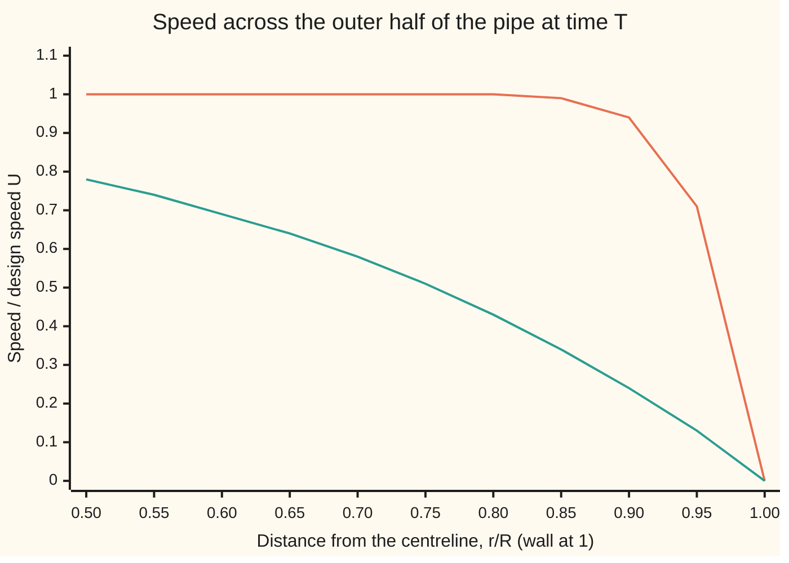
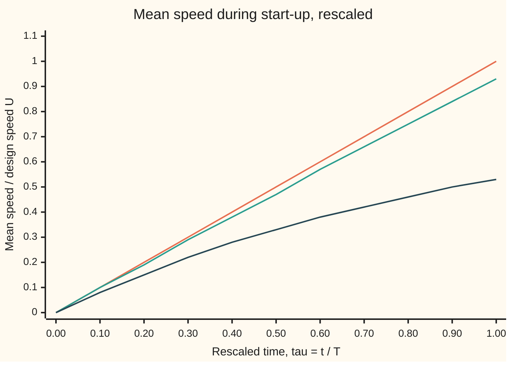

# Nondimensionalisation: choose natural scales and the small parameter appears

[Syllabus](../../../SYLLABUS.md) → [Engineering mathematics](../../../SYLLABUS.md#w13) → [Units and Modelling](../../../SYLLABUS.md#w13-s01) → Nondimensionalisation

---

## General Overview

A straight water pipe, 0.1 m across and hundreds of metres long, sits full and still. A pump starts and holds a steady push along it. Two designs. The slow one is meant to carry water at 0.02 m/s: Reynolds number 2,000, laminar, the water sliding in smooth layers. The fast one is meant to carry it at 2 m/s: Reynolds number 200,000, turbulent once it settles. (The Reynolds number, written Re, is speed times diameter divided by the water's viscosity per unit density; it has no units, as [Buckingham Pi](02-dimensional-analysis-and-buckingham-pi.md) showed, and it compares the water's momentum with its internal friction.)

The engineer wants to know what the water does in the first moments. Does it start as a solid slug, every layer moving together, or does friction at the wall hold it back from the start? The answer decides how fast the pipe fills with flow, how big the early wall stress is, and which model to trust.

The governing equation has three terms: acceleration, push and viscous drag, all in pascals per metre. **Nondimensionalisation** measures each against its own yardstick: speed in units of the design speed, distance in units of the pipe radius, time in units of the time the push alone would need to reach design speed. Every variable is then about one, and one pure number is left in front of the drag term: the **small parameter**. It is 0.125 for the slow pipe and 0.00256 for the fast one. The fast pipe may drop the drag term in its core; the slow pipe may not.

**Rescale each variable by the size it actually reaches, divide through by the biggest term, and the number left in front of each other term says how much it matters.**

**What kind of fact this is:** a method. Its output is an approximation whose error this card states and checks; the equation it is applied to is a model of laminar flow, with its range stated in When it holds.

### The picture: the two pipes at the moment the push alone would reach design speed

The outer half of the pipe, centreline side on the left, wall on the right. Speed is shown as a fraction of each pipe's design speed, each at its own natural time: 6.39 s for the fast pipe, 312.50 s for the slow one.



Orange: the fast pipe, Re 200,000. Flat at 1.00 out to r/R = 0.80, then a thin drop to zero. That is a slug with a skin. Green: the slow pipe, Re 2,000. Rounded all the way across: by time T the slowed layer is already 0.3536 of the radius thick, and even the centre has fallen to 0.93065 of design speed. The fast pipe's chart line is what the small parameter predicted.

---

## The formula

The pipe-start equation, after rescaling:

$$\frac{\partial u^*}{\partial \tau} \;=\; 1 \;+\; \varepsilon\,\frac{1}{r^*}\frac{\partial}{\partial r^*}\!\left(r^*\,\frac{\partial u^*}{\partial r^*}\right), \qquad \varepsilon = \frac{\mu U}{G R^2} = \frac{8}{f\,\mathrm{Re}}$$

with $u^* = 0$ at the wall $r^* = 1$ and $u^* = 0$ when the pump starts. The starred letters are the rescaled ones: $u^* = u/U$, $r^* = r/R$, $\tau = t/T$ with $T = \rho U / G$.

**Read it aloud:** "the rate the rescaled speed grows equals one unit of push, plus a small number times the viscous drag; when that number is small, the water accelerates as a slug."

| Symbol | Plain meaning | In our example | Push it up and the answer… |
| --- | --- | --- | --- |
| $u$, $\bar u$ | water speed along the pipe at a given radius; its average over the cross-section | 0 at the start | — |
| $r$, $R$, $D$ | distance from the centreline; pipe radius; diameter | $R$ = 0.05 m, $D$ = 0.1 m | bigger pipe, smaller $\varepsilon$ |
| $t$, $T$ | time since the pump started; the natural time $\rho U/G$, in which the push alone would reach design speed | $T$ = 312.50 s and 6.39 s | — |
| $U$ | the design mean speed | 0.02 m/s and 2.00 m/s | higher $\mathrm{Re}$ |
| $G$ | the pressure drop per metre the pump holds, in Pa/m | 0.064 and 312.79 Pa/m | smaller $\varepsilon$, more slug-like |
| $\rho$, $\mu$, $\nu$ | water's density, its viscosity, and $\nu = \mu/\rho$ | 1000 kg/m^3, 1.0 × 10^-3 Pa·s, 1.0 × 10^-6 m^2/s | more viscosity, larger $\varepsilon$ |
| $\mathrm{Re}$ | Reynolds number $UD/\nu$ | 2,000 and 200,000 | smaller $\varepsilon$ |
| $f$ | Darcy friction factor: $G$ measured in units of $\rho U^2/(2D)$ | 0.03200 and 0.01564 | — |
| $\varepsilon$ | the small parameter: drag term over push term, after rescaling | 0.12500 and 0.00256 | drag matters more |
| $u^*$, $r^*$, $\tau$ | the rescaled speed, radius and time, each about one | $\tau$ = 1 at time $T$ | — |
| $\delta$, $y$, $y^*$, $K$, $w$, $g$, $s$ | thickness of the slowed layer at the wall; distance in from the wall, and the same in radii, $y/R$; the layer's constant $8/(3\sqrt\pi)$; in the proof, the shortfall below the plug, its value at the wall, and an earlier rescaled time | $\delta$ = 2.53 mm (fast pipe), $K$ = 1.5045 | — |
| $\lambda_n$, $\lambda_1$, $J_0$, $J_1$ | the zeros of the Bessel function $J_0$, and the Bessel functions used by the exact solution | $\lambda_1$ = 2.40483 | — |

The dimension check, in square brackets ([M] mass, [L] length, [T] the dimension of time, not the time $T$, as on [Units and dimensions](01-si-units-and-dimensional-homogeneity.md)): viscosity times speed has dimensions [M][L]^-1[T]^-1 times [L][T]^-1, which is [M][T]^-2; push times radius squared has [M][L]^-2[T]^-2 times [L]^2, also [M][T]^-2. They cancel, so $\varepsilon$ is a pure number.

The second form, $8/(f\,\mathrm{Re})$, comes from writing the push through the friction factor, $G = f\rho U^2/(2D)$, which is how a pump is sized.

### When it holds

- **A long straight pipe, far from its ends.** The water's speed then depends on radius and time only, so the term for speed changing along the pipe is exactly zero. Near the inlet it is not, and the equation gains a term.
- **Laminar flow.** Ordinary pipe flow is laminar below about Re 2,300. The drag term is the viscous law for smooth layers. Turbulent eddies carry extra momentum that it leaves out. At Re 200,000, the laminar steady formula asks for 6.40 Pa/m where the real pipe needs 312.79 Pa/m, 48.9 times more. The card uses the equation for the fast pipe only through the start, up to time $T$; when its wall layer turns turbulent is an experimental question this card does not settle.
- **A push switched on at once and held constant.** A pump that ramps up slowly has its own time scale, and $T$ must be replaced by it.
- **Water of fixed density and viscosity.** Warmer water is less viscous, and $\varepsilon$ moves in proportion to the viscosity.
- **A rigid pipe.** A valve slammed shut sends pressure waves along the pipe (water hammer); this equation has no such waves in it.

---

## Why it works

### Step 0: every term is a scale times a number near one

A term like $\rho\,\partial u/\partial t$ is a size, set by how large speed and time actually get, times a pure number that stays near one if the sizes were chosen honestly. Choose the sizes from the problem itself and divide by the biggest term. The coefficients left compare the terms directly. One far below one marks a term that may be dropped wherever its starred part really is near one.

### Step 1: the equation, from a force balance on a thin shell of water

Take a thin cylindrical shell of water at radius $r$, of small thickness dr, one metre long. Its mass is $\rho$ × 2π r dr. The pump's push on it is $G$ × 2π r dr. The water just inside and just outside drags on it with the viscous stress $\mu\,\partial u/\partial r$ (viscosity times the rate speed changes with radius), acting on faces of area 2π r per metre, and the shell feels the difference between its two faces. Divide by the shell's volume, 2π r dr:

$$\rho\,\frac{\partial u}{\partial t} \;=\; G \;+\; \mu\,\frac{1}{r}\frac{\partial}{\partial r}\!\left(r\,\frac{\partial u}{\partial r}\right).$$

Acceleration, push, drag. This is a heat equation in a cylinder with a steady source, the kind met on [The heat equation](../../08-Differential%20equations%20and%20dynamics/10-The%20Classical%20PDEs/03-the-heat-equation.md).

### Step 2: choose the scales, substitute, divide

Speed reaches the design speed $U$, so set $u = U u^*$. Radius runs to the wall, so set $r = R\,r^*$. For time, ask how long the push alone would take to bring still water to $U$: speed gained per second is $G/\rho$, so $T = \rho U / G$. Set $t = T\tau$.

Substitute. The acceleration term becomes $(\rho U/T)\,\partial u^*/\partial\tau = G\,\partial u^*/\partial\tau$. The drag term becomes $(\mu U/R^2)$ times the starred drag. Divide every term by $G$:

$$\frac{\partial u^*}{\partial \tau} = 1 + \frac{\mu U}{G R^2}\,(\text{starred drag}).$$

The coefficient is $\varepsilon$. Nothing else survived; the pipe's size, the water and the pump are all inside that one number.

### Step 3: the small parameter, through the Reynolds number

A pump is sized from the steady flow it must hold, $G = f\rho U^2/(2D)$, with $R = D/2$. Put that into $\varepsilon$:

$$\varepsilon = \frac{\mu U}{G R^2} = \frac{8\nu}{f U D} = \frac{8}{f\,\mathrm{Re}}.$$

**Slow pipe.** Laminar steady flow has $f = 64/\mathrm{Re}$ = 0.03200, so $\varepsilon = 8/64$ = 0.12500. Every laminar design gives exactly one eighth, whatever its size: the push was chosen to balance the drag, so the drag can never be small next to it.

**Fast pipe.** Turbulent steady flow in a smooth pipe follows Prandtl's law, $1/\sqrt{f} = 2\log_{10}(\mathrm{Re}\sqrt{f}) - 0.8$ (White and Xue, below), which gives $f$ = 0.01564 at Re 200,000. So $G$ = 312.79 Pa/m and $\varepsilon$ = 0.00256. The push is strong because turbulence demands it, and next to that push the laminar drag is tiny.

### Step 4: drop the small term

Set $\varepsilon = 0$ in the fast pipe. The equation becomes $\partial u^*/\partial\tau = 1$, so $u^* = \tau$: every layer gains speed together, a plug. At $\tau = 1$ the plug is at design speed, 2.00 m/s, after 6.39 s. The exact solution at the centreline gives 1.00000 to five decimals. Dropping the term was safe there.

### Step 5: where the dropped term fights back

At the wall the water must be still. A plug cannot satisfy that, so near the wall the speed changes over a short distance, the starred drag is no longer near one, and the dropped term matters. Rescale again, this time measuring distance in from the wall, $y = R - r$, by a new size $\delta$. The drag term grows by $(R/\delta)^2$. It balances the acceleration when $\varepsilon (R/\delta)^2 = 1$, so $\delta = R\sqrt{\varepsilon} = \sqrt{\nu T}$.

Fast pipe: $\delta$ = 2.53 mm, 0.0506 of the radius. A skin. Slow pipe: $\delta$ = 17.68 mm, 0.3536 of the radius. Not a skin: over a third of the radius, so no part of the slow pipe is free of drag, which is what $\varepsilon$ = 0.125 already said. This second rescaling is the first step of the [Boundary layers](06-boundary-layers-and-singular-perturbation.md) card, which takes it further.

The skin costs flow. The slowed layer, spread over the perimeter, cuts the mean speed below the plug's by a fraction $K\sqrt{\varepsilon\tau}$, with $K = 8/(3\sqrt\pi)$ = 1.5045. At $\tau = 1$ in the fast pipe that is 1 − 1.5045 × 0.0506, a mean of 0.92391 of design speed, against an exact 0.92520.

<details>
<summary>Detailed proof: the wall layer's constant $K = 8/(3\sqrt\pi)$</summary>

Inside the layer the wall looks flat, since $\delta$ is 0.0506 of $R$. Write the shortfall below the plug as $w = \tau - u^*$. It obeys the flat heat equation $\partial w/\partial\tau = \varepsilon\,\partial^2 w/\partial y^{*2}$, where $y^* = y/R$ is the distance in from the wall measured in radii, with $w = \tau$ at the wall (the plug's speed, removed) and $w \to 0$ far from it.

A wall held at 1 from time zero pushes a flux (shortfall entering through the wall per unit time) of $\sqrt{\varepsilon/(\pi\tau)}$ into a half-line obeying this heat equation, read off the error-function solution built from [The heat kernel](../../08-Differential%20equations%20and%20dynamics/10-The%20Classical%20PDEs/10-the-heat-kernel.md). A wall value $g$ that rises in steps adds one such response per step (the equation is linear), so the flux is $\sqrt{\varepsilon/\pi}\int_0^\tau g'(s)\,(\tau - s)^{-1/2}\,ds$, where $s$ is an earlier rescaled time at which a step was taken. Here $g' = 1$, so the flux is $2\sqrt{\varepsilon\tau/\pi}$.

The total shortfall per unit of wall, the integral of $w$ across the layer, grows at the rate of that flux, so it equals $(4/3)\sqrt{\varepsilon/\pi}\,\tau^{3/2}$. The pipe's perimeter is 2π in rescaled units and its area is π, so the mean shortfall is twice that integral: $(8/3)\sqrt{\varepsilon/\pi}\,\tau^{3/2}$. Divide by the plug speed $\tau$: the fractional shortfall is $(8/(3\sqrt\pi))\sqrt{\varepsilon\tau}$.

The flat-wall step ignores the wall's curve, an error of order $\varepsilon\tau$ next to the $\sqrt{\varepsilon\tau}$ kept. At Re 200,000 the code measures shortfall over $\sqrt\varepsilon$ as 1.4790, against $K$ = 1.5045; at Re 2,000,000, 1.4947. The gap shrinks with $\varepsilon$, as an error of order $\sqrt\varepsilon$ in the ratio should.

</details>

### The other door: solve the full equation exactly

The rescaled equation is linear, so separation of variables solves it with no term dropped ([Separation of variables](../../08-Differential%20equations%20and%20dynamics/10-The%20Classical%20PDEs/04-separation-of-variables-for-the-heat-equation.md)). The shapes across the pipe are Bessel functions $J_0(\lambda_n r^*)$, zero at the wall when $\lambda_n$ is a zero of $J_0$ ([Bessel's equation](../../08-Differential%20equations%20and%20dynamics/07-Series%20Solutions%20and%20Boundary%20Problems/03-bessels-equation-and-the-drum.md)). Each shape fades at the rate $\varepsilon\lambda_n^2$:

$$\bar u^* = \frac{1}{8\varepsilon} - \sum_{n\ge1}\frac{4}{\varepsilon\lambda_n^4}\,e^{-\varepsilon\lambda_n^2\tau}.$$

The first term is the steady laminar answer; the sum is the start-up still to come. This series is the exact road in the code, which sums 150 terms, because at small $\varepsilon$ the plug is built from many fine shapes. The rescaled picture gets 0.92391 against the series' 0.92520 from one line.

---

## Worked numbers, by hand

Water rounded to $\rho$ = 1000 kg/m^3 and $\nu$ = 1.0 × 10^-6 m^2/s; the NIST WebBook gives 998.21 kg/m^3 and 1.0016 × 10^-3 Pa·s at 20 °C, so $\nu$ = 1.0034 × 10^-6 m^2/s against the round 1.0 × 10^-6. Pipe $D$ = 0.1 m.

| Step | Arithmetic | Value |
| --- | --- | --- |
| design speeds, $U = \mathrm{Re}\,\nu/D$ | 2000 × 10^-6 / 0.1 and 200000 × 10^-6 / 0.1 | 0.02 and 2.00 m/s |
| friction factors | 64/2000, and Prandtl's law at 200,000 | 0.03200 and 0.01564 |
| push, $G = f\rho U^2/(2D)$ | 0.032 × 1000 × 0.0004 / 0.2, and 0.01564 × 1000 × 4 / 0.2 | 0.064 and 312.79 Pa/m |
| natural time, $T = \rho U/G$ | 1000 × 0.02 / 0.064, and 1000 × 2 / 312.79 | 312.50 s and 6.39 s |
| small parameter, $8/(f\,\mathrm{Re})$ | 8 / 64, and 8 / (0.01564 × 200000) | 0.12500 and 0.00256 |
| wall layer, $\sqrt{\nu T}$ | √(10^-6 × 312.5), and √(10^-6 × 6.39) | 17.68 mm and 2.53 mm |
| fast pipe, mean at $T$, plug minus layer | 1 − 1.5045 × √0.00256 | 0.92391 |
| fast pipe, mean at $T$, exact | the Bessel series | **0.92520 of U, 1.8504 m/s** |
| slow pipe, mean at $T$, exact | the Bessel series | **0.53486 of U, 0.0107 m/s** |

At 6.39 s after the pump starts, the fast pipe's water is moving at 1.85 m/s on average and 2.00 m/s in the core. The slug model, corrected for one 2.53 mm skin, gives 0.92391 of design speed against the exact 0.92520. The slow pipe, at its own natural time of 312.50 s, has reached only 0.0107 m/s, about half its design speed. It reaches 99% of design speed at $\tau$ = 6.3093, which is 1972 s. That time is set by viscous spreading across the pipe, $R^2/\nu$ = 2500 s, not by the push.

### What breaks if you drop a piece

| Mistake | Comes out at | What went wrong |
| --- | --- | --- |
| Take 1/Re = 0.000500 as the small parameter in the slow pipe and drop the drag | mean 1.00 of U at 312.50 s; truth 0.53486 | 1/Re compares inertia with drag over one diameter of travel; this equation's coefficient is 8/(f Re) = 0.125 |
| Use the laminar steady formula for the fast pipe's push | 6.40 Pa/m; the pipe needs 312.79 | Re 200,000 is outside the laminar range; 48.9 times too little |
| Rescale time by the viscous time $R^2/\nu$ and drop the acceleration in the fast pipe | steady laminar mean 97.75 m/s | the time scale chosen was not the one the flow reaches; the dropped term was the biggest |
| Apply the wall-layer correction to the slow pipe | 0.4681 of U; truth 0.5349 | a layer 0.3536 of the radius is not thin, so the flat-wall step fails |

---

## Code, from first principles, and it actually runs

The scripts solve the rescaled equation three independent ways. Road 1 is the exact Bessel series, with $J_0$ and $J_1$ built from their integral formula and their zeros found by Newton's method. Road 2 is a finite-difference simulation (Crank–Nicolson steps on 400 rings, [Stepping the heat equation on a grid](../../08-Differential%20equations%20and%20dynamics/10-The%20Classical%20PDEs/09-finite-differences-for-the-heat-equation.md)) that never mentions a Bessel function. Road 3 is the rescaled answer: the plug, plus its wall-layer correction. The asserts tie road 1 to road 2 at both Reynolds numbers, road 3 to road 1 in the fast pipe, the bisected settling time to the one-mode formula, the two forms of $\varepsilon$ to each other, and Prandtl's friction factor to Haaland's explicit fit, a second published formula, within 2%.

### Python

```python
# Scaling and nondimensionalisation -- the check behind the card.  Standard library only.
# Water in a 0.1 m pipe, pushed from rest by a steady pressure drop per metre G.
# Rescaled: du/dtau = 1 + eps * (1/r) d/dr (r du/dr), u = 0 at the wall r = 1, u = 0 at tau = 0.
# Road 1: the exact Bessel series.  Road 2: Crank-Nicolson finite differences.
# Road 3: eps -> 0 (the plug), plus its wall-layer correction.  Nothing imported knows the answer.
from math import pi, sqrt, cos, sin, exp, log, log10

RHO, NU, D = 1000.0, 1.0e-6, 0.1            # kg/m^3, m^2/s, m: water near 20 C, rounded
MU, R = RHO * NU, D / 2.0

def bessel(n, x, m=600):                     # J_n(x) = (1/pi) int_0^pi cos(n t - x sin t) dt, trapezoid
    h = pi / m
    s = 0.5 * (1.0 + cos(n * pi))
    for k in range(1, m):
        s += cos(n * k * h - x * sin(k * h))
    return s * h / pi

ZEROS = []                                   # zeros of J_0 by Newton, J_0' = -J_1
for k in range(1, 151):
    x = (k - 0.25) * pi
    for _ in range(6):
        x += bessel(0, x) / bessel(1, x)
    ZEROS.append((x, bessel(1, x)))

def series_mean(eps, tau):                   # road 1: mean speed / U
    return 1 / (8 * eps) - sum(4 / (eps * l ** 4) * exp(-eps * l * l * tau) for l, _ in ZEROS)

def series_u(eps, tau, r):                   # road 1: speed / U at radius r / R
    return (1 - r * r) / (4 * eps) - sum(2 * bessel(0, l * r) / (eps * l ** 3 * j1)
                                         * exp(-eps * l * l * tau) for l, j1 in ZEROS)

def simulate(eps, tau_end, n=400, steps=2000):   # road 2: Crank-Nicolson on n cells
    h, dt = 1.0 / n, tau_end / steps
    lo, up = [0.0] * n, [4 / (h * h)] + [0.0] * (n - 1)
    for i in range(1, n):
        lo[i] = (i - 0.5) / (i * h * h)
        up[i] = (i + 0.5) / (i * h * h)
    c = 0.5 * eps * dt
    u = [0.0] * (n + 1)                          # u[n] is the wall, held at 0
    for _ in range(steps):
        rhs = [u[i] + dt + c * (lo[i] * (u[i - 1] if i else 0) - (lo[i] + up[i]) * u[i] + up[i] * u[i + 1])
               for i in range(n)]
        cp, dp = [0.0] * n, [0.0] * n            # Thomas algorithm
        for i in range(n):
            a, b, cc = -c * lo[i], 1 + c * (lo[i] + up[i]), -c * up[i]
            den = b - (a * cp[i - 1] if i else 0)
            cp[i] = cc / den
            dp[i] = (rhs[i] - (a * dp[i - 1] if i else 0)) / den
        for i in range(n - 1, -1, -1):
            u[i] = dp[i] - cp[i] * u[i + 1]
    mean = sum(2 * (i * h) * u[i] * h for i in range(1, n))   # trapezoid of 2 r u dr; ends are 0
    return mean, u[0]

def prandtl_f(re):                           # smooth-pipe law 1/sqrt f = 2 log10(Re sqrt f) - 0.8
    g = 0.02
    for _ in range(50):
        g = 1 / (2 * log10(re * sqrt(g)) - 0.8) ** 2
    return g

K_LAYER = 8 / (3 * sqrt(pi))                 # mean deficit = K sqrt(eps tau): the wall-layer road
print(f"inputs: rho 1000 kg/m^3, nu 1.0e-6 m^2/s, D = 0.1 m; NIST, 20 C: rho 998.21, mu 1.0016e-3 Pa s, "
      f"nu {1.0016e-3 / 998.21 * 1e6:.4f}e-6 m^2/s")
cases = []
for re, laminar in ((2000, True), (200000, False)):
    U = re * NU / D
    f = 64 / re if laminar else prandtl_f(re)
    G = f * RHO * U * U / (2 * D)                   # Pa/m the steady flow needs
    T = RHO * U / G                                 # s: time for G alone to bring water to U
    eps = MU * U / (G * R * R)
    cases.append((re, U, f, G, T, eps))
    sm, sc = simulate(eps, 1.0)
    em, ec = series_mean(eps, 1.0), series_u(eps, 1.0, 0.0)
    print(f"Re {re:>6}: U = {U:.2f} m/s, 1/Re = {1 / re:.6f}, f = {f:.5f}, G = {G:.3f} Pa/m")
    print(f"   T = rho U / G = {T:.2f} s, D/U = {D / U:.2f} s, eps = mu U/(G R^2) = {eps:.5f}, 8/(f Re) = {8 / (f * re):.5f}")
    print(f"   wall layer sqrt(nu T) = {sqrt(NU * T) * 1000:.2f} mm, sqrt(eps) = {sqrt(eps):.4f} of R")
    print(f"   at tau = 1, mean/U: series {em:.5f}  simulation {sm:.5f}  plug 1.00000  "
          f"plug - layer {1 - K_LAYER * sqrt(eps):.5f}")
    print(f"   at tau = 1, centre/U: series {ec:.5f}  simulation {sc:.5f}  plug 1.00000")
    print(f"   mean speed at T: {em * U:.4f} m/s, deficit / sqrt(eps) = {(1 - em) / sqrt(eps):.4f}")
    assert abs(sm - em) < 1e-4, "simulation and series disagree on the mean"
    assert abs(sc - ec) < 1e-4, "simulation and series disagree at the centre"
    assert abs(eps * f * re / 8 - 1) < 1e-12, "mu U/(G R^2) and 8/(f Re) disagree"

reA, UA, fA, GA, TA, epsA = cases[0]
reB, UB, fB, GB, TB, epsB = cases[1]
lo_t, hi_t = 0.0, 20.0                       # case A: time to 99% of the steady mean, by bisection
for _ in range(60):
    mid = 0.5 * (lo_t + hi_t)
    lo_t, hi_t = (mid, hi_t) if series_mean(epsA, mid) < 0.99 / (8 * epsA) else (lo_t, mid)
l1 = ZEROS[0][0]
t99_mode = log(32 / l1 ** 4 / 0.01) / (epsA * l1 * l1)
print(f"Re 2000 to 99% of steady: tau {lo_t:.4f} (series), {t99_mode:.4f} (first mode) = {lo_t * TA:.0f} s")
print(f"K = 8/(3 sqrt pi) = {K_LAYER:.4f}; first zero of J0 = {l1:.5f}; viscous time R^2/nu = {R * R / NU:.0f} s")
print(f"wrong: laminar G at Re 200000 = {8 * MU * UB / R ** 2:.2f} Pa/m, needed {GB:.2f} Pa/m (x{GB * R ** 2 / (8 * MU * UB):.1f})")
print(f"wrong: drop the acceleration at Re 200000: mean = {GB * R * R / (8 * MU):.2f} m/s")
print(f"wrong: plug-minus-layer at Re 2000 = {1 - K_LAYER * sqrt(epsA):.4f}, true {series_mean(epsA, 1.0):.4f}")
for re in (4000, 2000000):
    f = prandtl_f(re); e = 8 / (f * re); m = series_mean(e, 1.0)
    print(f"try: Re {re:>7}: f = {f:.5f}, eps = {e:.5f}, mean/U at tau 1 = {m:.4f}, "
          f"deficit/sqrt(eps) = {(1 - m) / sqrt(e):.4f}")
coarse = simulate(epsB, 1.0, n=25, steps=200)[0]
print(f"try: Re 200000 on 25 cells: simulation mean {coarse:.4f}")
fH = (-1.8 * log10(6.9 / reB)) ** -2         # Haaland's explicit smooth-pipe fit: a second road to f
print(f"friction at Re 200000: Prandtl {fB:.5f}, Haaland {fH:.5f}, gap {(fB / fH - 1) * 100:.1f}%")
taus = [k / 10 for k in range(11)]
rads = [0.5 + k / 20 for k in range(11)]
print(f"{'chart, tau':<22}" + " ".join(f"{t:5.2f}" for t in taus))
print(f"{'chart, plug mean':<22}" + " ".join(f"{t:5.2f}" for t in taus))
for lab, e in (("Re 200000", epsB), ("Re 2000", epsA)):
    print(f"chart, mean {lab:<10}" + " ".join(f"{series_mean(e, t):5.2f}" for t in taus))
print(f"{'chart, r/R':<22}" + " ".join(f"{r:5.2f}" for r in rads))
for lab, e in (("Re 200000", epsB), ("Re 2000", epsA)):
    print(f"chart, prof {lab:<10}" + " ".join(f"{max(series_u(e, 1.0, r), 0.0):5.2f}" for r in rads))
mB = series_mean(epsB, 1.0)
assert abs(mB - (1 - K_LAYER * sqrt(epsB))) < 0.005, "wall-layer road misses the exact mean at Re 200000"
assert abs(series_u(epsB, 1.0, 0.0) - 1.0) < 1e-3, "the plug must be exact at the centre at Re 200000"
assert abs(lo_t - t99_mode) < 1e-3, "bisection and first-mode settling times disagree"
assert abs(fB / fH - 1) < 0.02, "Prandtl and Haaland friction factors disagree"
assert series_mean(epsA, 1.0) < 0.6, "at Re 2000 the plug must fail badly"
print("ALL CHECKS PASS")
```

**Ran 2026-10-06 on macOS, Python 3.14.6, standard library only. All checks passed. Output, pasted from the run:**

```
inputs: rho 1000 kg/m^3, nu 1.0e-6 m^2/s, D = 0.1 m; NIST, 20 C: rho 998.21, mu 1.0016e-3 Pa s, nu 1.0034e-6 m^2/s
Re   2000: U = 0.02 m/s, 1/Re = 0.000500, f = 0.03200, G = 0.064 Pa/m
   T = rho U / G = 312.50 s, D/U = 5.00 s, eps = mu U/(G R^2) = 0.12500, 8/(f Re) = 0.12500
   wall layer sqrt(nu T) = 17.68 mm, sqrt(eps) = 0.3536 of R
   at tau = 1, mean/U: series 0.53486  simulation 0.53486  plug 1.00000  plug - layer 0.46808
   at tau = 1, centre/U: series 0.93065  simulation 0.93065  plug 1.00000
   mean speed at T: 0.0107 m/s, deficit / sqrt(eps) = 1.3156
Re 200000: U = 2.00 m/s, 1/Re = 0.000005, f = 0.01564, G = 312.791 Pa/m
   T = rho U / G = 6.39 s, D/U = 0.05 s, eps = mu U/(G R^2) = 0.00256, 8/(f Re) = 0.00256
   wall layer sqrt(nu T) = 2.53 mm, sqrt(eps) = 0.0506 of R
   at tau = 1, mean/U: series 0.92520  simulation 0.92517  plug 1.00000  plug - layer 0.92391
   at tau = 1, centre/U: series 1.00000  simulation 1.00000  plug 1.00000
   mean speed at T: 1.8504 m/s, deficit / sqrt(eps) = 1.4790
Re 2000 to 99% of steady: tau 6.3093 (series), 6.3093 (first mode) = 1972 s
K = 8/(3 sqrt pi) = 1.5045; first zero of J0 = 2.40483; viscous time R^2/nu = 2500 s
wrong: laminar G at Re 200000 = 6.40 Pa/m, needed 312.79 Pa/m (x48.9)
wrong: drop the acceleration at Re 200000: mean = 97.75 m/s
wrong: plug-minus-layer at Re 2000 = 0.4681, true 0.5349
try: Re    4000: f = 0.03992, eps = 0.05011, mean/U at tau 1 = 0.6893, deficit/sqrt(eps) = 1.3882
try: Re 2000000: f = 0.01037, eps = 0.00039, mean/U at tau 1 = 0.9707, deficit/sqrt(eps) = 1.4947
try: Re 200000 on 25 cells: simulation mean 0.9165
friction at Re 200000: Prandtl 0.01564, Haaland 0.01550, gap 0.9%
chart, tau             0.00  0.10  0.20  0.30  0.40  0.50  0.60  0.70  0.80  0.90  1.00
chart, plug mean       0.00  0.10  0.20  0.30  0.40  0.50  0.60  0.70  0.80  0.90  1.00
chart, mean Re 200000  0.00  0.10  0.19  0.29  0.38  0.47  0.57  0.66  0.75  0.84  0.93
chart, mean Re 2000    0.00  0.08  0.15  0.22  0.28  0.33  0.38  0.42  0.46  0.50  0.53
chart, r/R             0.50  0.55  0.60  0.65  0.70  0.75  0.80  0.85  0.90  0.95  1.00
chart, prof Re 200000  1.00  1.00  1.00  1.00  1.00  1.00  1.00  0.99  0.94  0.71  0.00
chart, prof Re 2000    0.78  0.74  0.69  0.64  0.58  0.51  0.43  0.34  0.24  0.13  0.00
ALL CHECKS PASS
```

The series and the simulation agree to four decimals on every mean and every centreline speed. The plug-minus-layer road lands next to the exact mean in the fast pipe, 0.92391 against 0.92520, and far from it in the slow pipe, 0.46808 against 0.53486, which is the point.

### Rust

The same roads in Rust, std only, built with `rustc --edition 2021 -O`.

```rust
// Scaling and nondimensionalisation -- the same check as the Python, in Rust.  Std only, no crates.
// Water in a 0.1 m pipe, pushed from rest by a steady pressure drop per metre G.
// Rescaled: du/dtau = 1 + eps * (1/r) d/dr (r du/dr), u = 0 at the wall r = 1, u = 0 at tau = 0.
// Road 1: the exact Bessel series.  Road 2: Crank-Nicolson finite differences.
// Road 3: eps -> 0 (the plug), plus its wall-layer correction.
use std::f64::consts::PI;

const RHO: f64 = 1000.0; // kg/m^3, water near 20 C, rounded
const NU: f64 = 1.0e-6; // m^2/s
const D: f64 = 0.1; // m
const MU: f64 = RHO * NU;
const R: f64 = D / 2.0;

fn bessel(n: f64, x: f64) -> f64 { // J_n(x) = (1/pi) int_0^pi cos(n t - x sin t) dt, trapezoid
    let m = 600;
    let h = PI / m as f64;
    let mut s = 0.5 * (1.0 + (n * PI).cos());
    for k in 1..m {
        let t = k as f64 * h;
        s += (n * t - x * t.sin()).cos();
    }
    s * h / PI
}

fn zeros() -> Vec<(f64, f64)> { // zeros of J_0 by Newton, J_0' = -J_1
    (1..151).map(|k| {
        let mut x = (k as f64 - 0.25) * PI;
        for _ in 0..6 { x += bessel(0.0, x) / bessel(1.0, x); }
        (x, bessel(1.0, x))
    }).collect()
}

fn series_mean(z: &[(f64, f64)], eps: f64, tau: f64) -> f64 { // road 1: mean speed / U
    1.0 / (8.0 * eps) - z.iter().map(|&(l, _)| 4.0 / (eps * l.powi(4)) * (-eps * l * l * tau).exp()).sum::<f64>()
}

fn series_u(z: &[(f64, f64)], eps: f64, tau: f64, r: f64) -> f64 { // road 1: speed / U at r / R
    (1.0 - r * r) / (4.0 * eps)
        - z.iter().map(|&(l, j1)| 2.0 * bessel(0.0, l * r) / (eps * l.powi(3) * j1) * (-eps * l * l * tau).exp()).sum::<f64>()
}

fn simulate(eps: f64, tau_end: f64, n: usize, steps: usize) -> (f64, f64) { // road 2: Crank-Nicolson
    let (h, dt) = (1.0 / n as f64, tau_end / steps as f64);
    let mut lo = vec![0.0; n];
    let mut up = vec![0.0; n];
    up[0] = 4.0 / (h * h);
    for i in 1..n {
        lo[i] = (i as f64 - 0.5) / (i as f64 * h * h);
        up[i] = (i as f64 + 0.5) / (i as f64 * h * h);
    }
    let c = 0.5 * eps * dt;
    let mut u = vec![0.0; n + 1]; // u[n] is the wall, held at 0
    let (mut cp, mut dp, mut rhs) = (vec![0.0; n], vec![0.0; n], vec![0.0; n]);
    for _ in 0..steps {
        for i in 0..n {
            let left = if i > 0 { u[i - 1] } else { 0.0 };
            rhs[i] = u[i] + dt + c * (lo[i] * left - (lo[i] + up[i]) * u[i] + up[i] * u[i + 1]);
        }
        for i in 0..n { // Thomas algorithm
            let (a, b, cc) = (-c * lo[i], 1.0 + c * (lo[i] + up[i]), -c * up[i]);
            let den = b - if i > 0 { a * cp[i - 1] } else { 0.0 };
            cp[i] = cc / den;
            dp[i] = (rhs[i] - if i > 0 { a * dp[i - 1] } else { 0.0 }) / den;
        }
        for i in (0..n).rev() { u[i] = dp[i] - cp[i] * u[i + 1]; }
    }
    let mean: f64 = (1..n).map(|i| 2.0 * (i as f64 * h) * u[i] * h).sum(); // trapezoid of 2 r u dr
    (mean, u[0])
}

fn prandtl_f(re: f64) -> f64 { // smooth-pipe law 1/sqrt f = 2 log10(Re sqrt f) - 0.8
    let mut g: f64 = 0.02;
    for _ in 0..50 { g = 1.0 / (2.0 * (re * g.sqrt()).log10() - 0.8).powi(2); }
    g
}

fn row(label: &str, v: &[f64]) -> String {
    format!("{:<22}{}", label, v.iter().map(|x| format!("{:5.2}", x)).collect::<Vec<_>>().join(" "))
}

fn main() {
    let z = zeros();
    let k_layer = 8.0 / (3.0 * PI.sqrt()); // mean deficit = K sqrt(eps tau): the wall-layer road
    println!("inputs: rho 1000 kg/m^3, nu 1.0e-6 m^2/s, D = 0.1 m; NIST, 20 C: rho 998.21, mu 1.0016e-3 Pa s, nu {:.4}e-6 m^2/s",
             1.0016e-3 / 998.21 * 1e6);
    let mut cases = vec![];
    for &(re, laminar) in &[(2000.0_f64, true), (200000.0, false)] {
        let u_d = re * NU / D;
        let f = if laminar { 64.0 / re } else { prandtl_f(re) };
        let g = f * RHO * u_d * u_d / (2.0 * D); // Pa/m the steady flow needs
        let t = RHO * u_d / g; // s: time for G alone to bring water to U
        let eps = MU * u_d / (g * R * R);
        cases.push((u_d, g, t, eps, f));
        let (sm, sc) = simulate(eps, 1.0, 400, 2000);
        let (em, ec) = (series_mean(&z, eps, 1.0), series_u(&z, eps, 1.0, 0.0));
        println!("Re {:>6}: U = {:.2} m/s, 1/Re = {:.6}, f = {:.5}, G = {:.3} Pa/m", re, u_d, 1.0 / re, f, g);
        println!("   T = rho U / G = {:.2} s, D/U = {:.2} s, eps = mu U/(G R^2) = {:.5}, 8/(f Re) = {:.5}",
                 t, D / u_d, eps, 8.0 / (f * re));
        println!("   wall layer sqrt(nu T) = {:.2} mm, sqrt(eps) = {:.4} of R", (NU * t).sqrt() * 1000.0, eps.sqrt());
        println!("   at tau = 1, mean/U: series {:.5}  simulation {:.5}  plug 1.00000  plug - layer {:.5}",
                 em, sm, 1.0 - k_layer * eps.sqrt());
        println!("   at tau = 1, centre/U: series {:.5}  simulation {:.5}  plug 1.00000", ec, sc);
        println!("   mean speed at T: {:.4} m/s, deficit / sqrt(eps) = {:.4}", em * u_d, (1.0 - em) / eps.sqrt());
        assert!((sm - em).abs() < 1e-4, "simulation and series disagree on the mean");
        assert!((sc - ec).abs() < 1e-4, "simulation and series disagree at the centre");
        assert!((eps * f * re / 8.0 - 1.0).abs() < 1e-12, "mu U/(G R^2) and 8/(f Re) disagree");
    }
    let (_, _, t_a, eps_a, _) = cases[0];
    let (u_b, g_b, _, eps_b, f_b) = cases[1];
    let (mut lo_t, mut hi_t) = (0.0_f64, 20.0_f64); // case A: time to 99% of the steady mean
    for _ in 0..60 {
        let mid = 0.5 * (lo_t + hi_t);
        if series_mean(&z, eps_a, mid) < 0.99 / (8.0 * eps_a) { lo_t = mid; } else { hi_t = mid; }
    }
    let l1 = z[0].0;
    let t99_mode = (32.0 / l1.powi(4) / 0.01).ln() / (eps_a * l1 * l1);
    println!("Re 2000 to 99% of steady: tau {:.4} (series), {:.4} (first mode) = {:.0} s", lo_t, t99_mode, lo_t * t_a);
    println!("K = 8/(3 sqrt pi) = {:.4}; first zero of J0 = {:.5}; viscous time R^2/nu = {:.0} s", k_layer, l1, R * R / NU);
    println!("wrong: laminar G at Re 200000 = {:.2} Pa/m, needed {:.2} Pa/m (x{:.1})",
             8.0 * MU * u_b / (R * R), g_b, g_b * R * R / (8.0 * MU * u_b));
    println!("wrong: drop the acceleration at Re 200000: mean = {:.2} m/s", g_b * R * R / (8.0 * MU));
    println!("wrong: plug-minus-layer at Re 2000 = {:.4}, true {:.4}", 1.0 - k_layer * eps_a.sqrt(), series_mean(&z, eps_a, 1.0));
    for &re in &[4000.0_f64, 2000000.0] {
        let f = prandtl_f(re);
        let e = 8.0 / (f * re);
        let m = series_mean(&z, e, 1.0);
        println!("try: Re {:>7}: f = {:.5}, eps = {:.5}, mean/U at tau 1 = {:.4}, deficit/sqrt(eps) = {:.4}",
                 re, f, e, m, (1.0 - m) / e.sqrt());
    }
    println!("try: Re 200000 on 25 cells: simulation mean {:.4}", simulate(eps_b, 1.0, 25, 200).0);
    let f_h = (-1.8 * (6.9 / 200000.0_f64).log10()).powi(-2); // Haaland's explicit smooth-pipe fit: a second road to f
    println!("friction at Re 200000: Prandtl {:.5}, Haaland {:.5}, gap {:.1}%", f_b, f_h, (f_b / f_h - 1.0) * 100.0);
    let taus: Vec<f64> = (0..11).map(|k| k as f64 / 10.0).collect();
    let rads: Vec<f64> = (0..11).map(|k| 0.5 + k as f64 / 20.0).collect();
    println!("{}", row("chart, tau", &taus));
    println!("{}", row("chart, plug mean", &taus));
    for &(lab, e) in &[("Re 200000", eps_b), ("Re 2000", eps_a)] {
        let v: Vec<f64> = taus.iter().map(|&t| series_mean(&z, e, t)).collect();
        println!("{}", row(&format!("chart, mean {}", lab), &v));
    }
    println!("{}", row("chart, r/R", &rads));
    for &(lab, e) in &[("Re 200000", eps_b), ("Re 2000", eps_a)] {
        let v: Vec<f64> = rads.iter().map(|&r| series_u(&z, e, 1.0, r).max(0.0)).collect();
        println!("{}", row(&format!("chart, prof {}", lab), &v));
    }
    let m_b = series_mean(&z, eps_b, 1.0);
    assert!((m_b - (1.0 - k_layer * eps_b.sqrt())).abs() < 0.005, "wall-layer road misses the exact mean at Re 200000");
    assert!((series_u(&z, eps_b, 1.0, 0.0) - 1.0).abs() < 1e-3, "the plug must be exact at the centre at Re 200000");
    assert!((lo_t - t99_mode).abs() < 1e-3, "bisection and first-mode settling times disagree");
    assert!((f_b / f_h - 1.0).abs() < 0.02, "Prandtl and Haaland friction factors disagree");
    assert!(series_mean(&z, eps_a, 1.0) < 0.6, "at Re 2000 the plug must fail badly");
    println!("ALL CHECKS PASS");
}
```

**Ran 2026-10-06 on macOS, rustc 1.98.1, no crates. All checks passed. Output, pasted from the run:**

```
inputs: rho 1000 kg/m^3, nu 1.0e-6 m^2/s, D = 0.1 m; NIST, 20 C: rho 998.21, mu 1.0016e-3 Pa s, nu 1.0034e-6 m^2/s
Re   2000: U = 0.02 m/s, 1/Re = 0.000500, f = 0.03200, G = 0.064 Pa/m
   T = rho U / G = 312.50 s, D/U = 5.00 s, eps = mu U/(G R^2) = 0.12500, 8/(f Re) = 0.12500
   wall layer sqrt(nu T) = 17.68 mm, sqrt(eps) = 0.3536 of R
   at tau = 1, mean/U: series 0.53486  simulation 0.53486  plug 1.00000  plug - layer 0.46808
   at tau = 1, centre/U: series 0.93065  simulation 0.93065  plug 1.00000
   mean speed at T: 0.0107 m/s, deficit / sqrt(eps) = 1.3156
Re 200000: U = 2.00 m/s, 1/Re = 0.000005, f = 0.01564, G = 312.791 Pa/m
   T = rho U / G = 6.39 s, D/U = 0.05 s, eps = mu U/(G R^2) = 0.00256, 8/(f Re) = 0.00256
   wall layer sqrt(nu T) = 2.53 mm, sqrt(eps) = 0.0506 of R
   at tau = 1, mean/U: series 0.92520  simulation 0.92517  plug 1.00000  plug - layer 0.92391
   at tau = 1, centre/U: series 1.00000  simulation 1.00000  plug 1.00000
   mean speed at T: 1.8504 m/s, deficit / sqrt(eps) = 1.4790
Re 2000 to 99% of steady: tau 6.3093 (series), 6.3093 (first mode) = 1972 s
K = 8/(3 sqrt pi) = 1.5045; first zero of J0 = 2.40483; viscous time R^2/nu = 2500 s
wrong: laminar G at Re 200000 = 6.40 Pa/m, needed 312.79 Pa/m (x48.9)
wrong: drop the acceleration at Re 200000: mean = 97.75 m/s
wrong: plug-minus-layer at Re 2000 = 0.4681, true 0.5349
try: Re    4000: f = 0.03992, eps = 0.05011, mean/U at tau 1 = 0.6893, deficit/sqrt(eps) = 1.3882
try: Re 2000000: f = 0.01037, eps = 0.00039, mean/U at tau 1 = 0.9707, deficit/sqrt(eps) = 1.4947
try: Re 200000 on 25 cells: simulation mean 0.9165
friction at Re 200000: Prandtl 0.01564, Haaland 0.01550, gap 0.9%
chart, tau             0.00  0.10  0.20  0.30  0.40  0.50  0.60  0.70  0.80  0.90  1.00
chart, plug mean       0.00  0.10  0.20  0.30  0.40  0.50  0.60  0.70  0.80  0.90  1.00
chart, mean Re 200000  0.00  0.10  0.19  0.29  0.38  0.47  0.57  0.66  0.75  0.84  0.93
chart, mean Re 2000    0.00  0.08  0.15  0.22  0.28  0.33  0.38  0.42  0.46  0.50  0.53
chart, r/R             0.50  0.55  0.60  0.65  0.70  0.75  0.80  0.85  0.90  0.95  1.00
chart, prof Re 200000  1.00  1.00  1.00  1.00  1.00  1.00  1.00  0.99  0.94  0.71  0.00
chart, prof Re 2000    0.78  0.74  0.69  0.64  0.58  0.51  0.43  0.34  0.24  0.13  0.00
ALL CHECKS PASS
```

The two outputs match line for line.

### The picture: mean speed against rescaled time

The rescaled clock lets both pipes share one chart: $\tau$ = 1 is 6.39 s for the fast pipe and 312.50 s for the slow one.



Orange: the plug, $\bar u^* = \tau$, the answer with the small term dropped. Green: the fast pipe, which hugs the plug and ends at 0.93. Dark blue: the slow pipe, which falls away from the plug from the start, ending at 0.53.

> [!TIP]
> **Try changing**
> Guess first, then run it.
> - **Ten times faster again.** At Re 2,000,000, Prandtl gives $f$ = 0.01037 and $\varepsilon$ = 0.00039. Guess the mean at $\tau$ = 1. It is 0.9707: the skin thins as $\sqrt\varepsilon$, and shortfall over $\sqrt\varepsilon$ is 1.4947, closer to $K$ = 1.5045.
> - **Just past transition.** At Re 4,000, $f$ = 0.03992 and $\varepsilon$ = 0.05011. The mean at $\tau$ = 1 is 0.6893. A small parameter of 0.05 is small enough to name and too big to drop.
> - **Starve the grid.** Run `simulate(epsB, 1.0, n=25, steps=200)`. Twenty-five rings put one point inside the 2.53 mm skin, and the mean comes out at 0.9165 instead of 0.9252. Resolving a layer needs points inside it, and the rescaling says how thin to make them.

---

## The usual mistake

> [!warning]
> **Reading 1/Re as the small parameter of every pipe problem.** The Reynolds number compares inertia with drag when the flow changes over one diameter of travel. In a long straight pipe the flow does not change along the pipe at all, so that comparison is not in the equation. The coefficient that is there, $\varepsilon = 8/(f\,\mathrm{Re})$, carries the friction factor, and in laminar flow the two cancel to 1/8. At Re 2,000, 1/Re is 0.000500 and $\varepsilon$ is 0.12500, and only the second describes this pipe.
>
> - **Scales that the flow never reaches.** In the fast pipe, rescaling time by the transit time $D/U$ (0.05 s) or the viscous time $R^2/\nu$ (2500 s) puts a large or small number in front of some term, but the variables are then not near one, and the reading is wrong: the viscous clock drops acceleration and predicts 97.75 m/s. In the slow pipe the viscous clock is the right one, since there $T = R^2/(8\nu)$.
> - **Dropping a term everywhere because it is small somewhere.** The drag is negligible in the fast pipe's core and decisive in its 2.53 mm skin. A small coefficient licenses a drop only where the starred part is near one.
> - **A small parameter that is not small.** 0.125 is below one, and the wall-layer correction built on it gives 0.4681 of design speed where the truth is 0.5349.

---

## Where you meet it in real life

- **Pump and valve start-up in water mains and oil lines.** A heavy crude oil line runs laminar, so its $\varepsilon$ is 1/8 and its start-up is set by the viscous time $R^2/\nu$; a water main's push is large next to laminar drag, so the core moves as a slug.
- **Blood in arteries.** Womersley rescaled the same equation with a pulsing push. His number, the radius times the square root of the pulse's angular frequency (rad/s) over $\nu$, decides whether the flow in an artery is a plug with a skin (the aorta) or a parabola at every instant (small vessels).
- **The Navier–Stokes equations.** Rescaling them with one length and one speed leaves 1/Re in front of the viscous term. When that is the right reading, and when the flow's own lengths are different, is the subject of Navier-Stokes.
- **Wind-tunnel and water-tank models.** Two flows whose rescaled equations carry the same coefficients behave the same, which is what lets a model stand in for the real thing: [Similarity](04-similarity-and-model-testing.md).
- **Measurement uncertainty.** An error in the viscosity moves $\varepsilon$ in proportion; how such errors travel through a model is [Error propagation](07-error-propagation-and-sensitivity.md).

> **Say it back**
> Write each variable as its natural size times a number near one, then divide the equation by its biggest term. The pure numbers left in front of the other terms say how much each matters. For water starting in a pipe, that number is $\varepsilon = 8/(f\,\mathrm{Re})$: 0.00256 in the fast pipe, which starts as a slug with a 2.53 mm skin, and 1/8 in any laminar pipe, where drag rules from the start. A small coefficient lets a term be dropped only where its rescaled part stays near one, which fails at the wall.

---

## What this builds on

- [Buckingham Pi](02-dimensional-analysis-and-buckingham-pi.md): dimensionless groups and the Reynolds number. That card counts the groups; this one puts them into an equation and asks what each one does.
- [A differential equation](../../08-Differential%20equations%20and%20dynamics/01-Rate%20Equations/01-what-a-differential-equation-says.md): an equation as a balance of rates, the reading every step above relies on.

## Where this goes next

- [Similarity](04-similarity-and-model-testing.md): matching the rescaled coefficients between a model and the real thing.
- [Regular perturbation](05-regular-perturbation.md): keeping the small term and adding its effect as a correction, step by step, when it is small everywhere.
- Navier-Stokes: the full equations of fluid motion, rescaled.

Dropping a small term gave the core right and the wall wrong; how to build an answer that is right at both, by matching a core solution to a wall-layer solution, is the job of [Boundary layers](06-boundary-layers-and-singular-perturbation.md).

---

## Sources

Verified 2026-10-06: every link below resolves to the publisher's page or the paper's DOI record.

- Reynolds, Osborne. "An Experimental Investigation of the Circumstances Which Determine Whether the Motion of Water Shall Be Direct or Sinuous, and of the Law of Resistance in Parallel Channels." *Philosophical Transactions of the Royal Society of London* 174 (1883): 935–982. [doi:10.1098/rstl.1883.0029](https://doi.org/10.1098/rstl.1883.0029). The pipe experiments behind the Reynolds number.
- Womersley, J. R. "Method for the Calculation of Velocity, Rate of Flow and Viscous Drag in Arteries When the Pressure Gradient Is Known." *Journal of Physiology* 127, no. 3 (1955): 553–563. [doi:10.1113/jphysiol.1955.sp005276](https://doi.org/10.1113/jphysiol.1955.sp005276). The same pipe equation with a pulsing push, solved with Bessel functions and read through one rescaled number.
- Lin, C. C., and L. A. Segel. *Mathematics Applied to Deterministic Problems in the Natural Sciences*. SIAM Classics in Applied Mathematics, 1988. [doi:10.1137/1.9781611971347](https://doi.org/10.1137/1.9781611971347). The method of this card, scaling, set out as a discipline.
- White, Frank M., and Henry Xue. *Fluid Mechanics*, 9th ed. McGraw Hill, 2021. [Publisher page](https://www.mheducation.com/highered/product/fluid-mechanics-white/M9781260258318.html). Laminar $f = 64/\mathrm{Re}$, Prandtl's smooth-pipe friction law and Haaland's explicit fit.
- National Institute of Standards and Technology. *NIST Chemistry WebBook*, Thermophysical Properties of Fluid Systems. [Database page](https://webbook.nist.gov/chemistry/fluid/). Density and viscosity of water at 20 °C and 1 atm.
