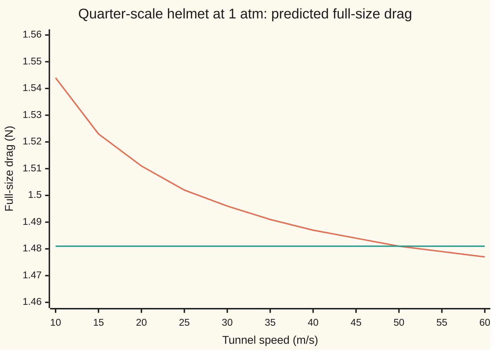
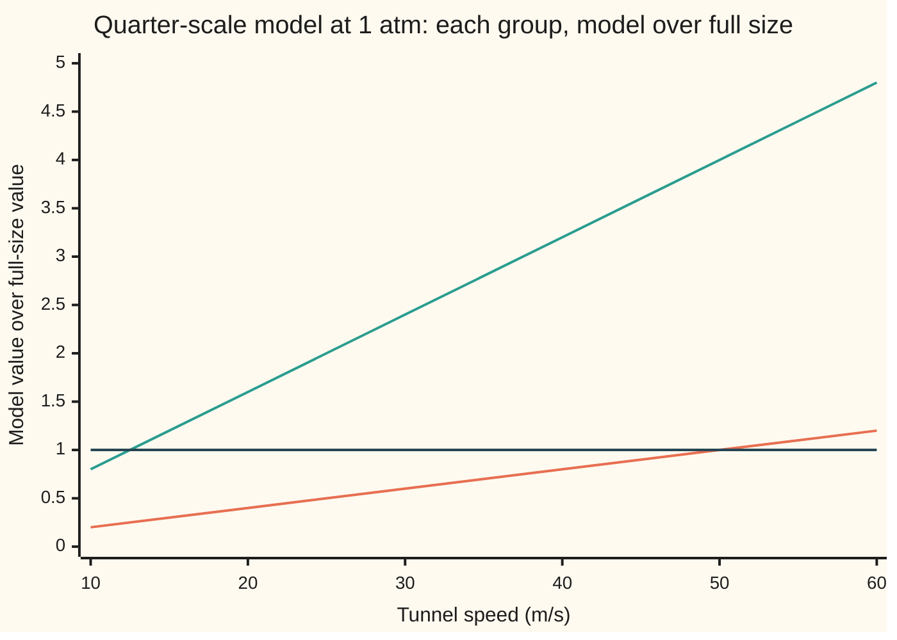

# Similarity: when a small model in a tunnel really predicts the full size thing

[Syllabus](../../../SYLLABUS.md) → [Engineering mathematics](../README.md) → [Units and Modelling](../README.md#s01) → Similarity

---

## General Overview

A helmet maker wants the drag on a new road helmet at 12.5 m/s, which is 45 km/h, a fast pace in a breakaway. The tunnel's test section is small, so the engineers print the helmet at quarter scale: 0.22 m wide at full size, 0.055 m on the model. They put the model on a force balance and turn on the fan.

The balance reads a force in newtons. The question is what that number says about the full helmet. Run the fan at the rider's own 12.5 m/s and the model feels 0.0958 N. Scale it up by area, sixteen times, and the full helmet comes out 3.46 % too high. Run the fan at 50 m/s instead and the model feels 1.4810 N, which on the card's stand-in drag curve is exactly the full helmet's drag, with no scaling at all.

The tunnel speed that works is not a guess. Air flow round a body is governed by a few **dimensionless groups**: ratios with no units, written Π in general, such as the Reynolds number Re from [Buckingham Pi](02-dimensional-analysis-and-buckingham-pi.md). Make every group on the model equal to its value at full size and the model's flow is the full flow shrunk, the way similar triangles are one triangle drawn at two sizes. The model's drag, divided by the right combination of density, speed and size, then equals the full helmet's. This match is called **similarity**, and the model is then **similar** to the full-size helmet in the physical sense.

The catch is that the groups fight. In the same air, matching Re needs a model four times faster, while matching the second group, the Mach number, needs the same speed. Both cannot hold at once unless the air itself is changed, for example by pressurising the tunnel to 4 atm. Most real tests match the group that matters and argue that the other one does not.

**A scale model predicts the full-size object when every dimensionless group that governs the flow takes the same value on both; when the groups cannot all be matched together, the test matches the ones that matter and shows the rest are negligible.**

**What kind of fact this is:** a method, resting on a theorem: that any law relating physical quantities can be written among dimensionless groups, proved on [Buckingham Pi](02-dimensional-analysis-and-buckingham-pi.md) and sketched here in a folded proof.

### The picture: what the model predicts at each tunnel speed

The quarter-scale model is run at each tunnel speed in open air, its drag is scaled up by the similarity rule, and the result is plotted against the full helmet's true drag.



The falling line is the prediction from the model. The flat line is the full helmet's drag at 12.5 m/s, 1.481 N. They cross at 50 m/s, the speed where the model's Reynolds number equals the full helmet's. Too slow and the prediction runs high; too fast and it runs low. Above about 54.8 m/s the model's Re passes 200,000, the end of the stand-in curve's range, so the last two points are extrapolation.

---

## The formula

A reminder of notation: square brackets name a dimension, [L] length, [M] mass, [T] time. A new group is introduced here in words first: the **Mach number** Ma is the flow speed divided by the speed of sound in the air, so Ma = 0.3 means the air moves at three tenths of the speed of sound.

The drag on a body of fixed shape depends on six quantities: the force itself, the air's density, its viscosity, its speed of sound, the speed, and one size. Three dimensions, [M], [L] and [T], leave three groups, and the law is a relation among them:

$$C_D = \frac{F}{\tfrac12 \rho U^2 A} = \varphi(\mathrm{Re}, \mathrm{Ma}), \qquad \mathrm{Re} = \frac{\rho U D}{\mu} = \frac{U D}{\nu}, \qquad \mathrm{Ma} = \frac{U}{c}$$

**Read it aloud:** the drag coefficient, which is the force divided by the air's dynamic pressure $\tfrac12 \rho U^2$ (the pressure rise if the moving air were brought to rest) and the frontal area, is some fixed function of the Reynolds number and the Mach number, and of nothing else.

The function $\varphi$ is unknown; finding it is the tunnel's job. Similarity uses only the fact that it exists. If the model, marked m, and the full-size helmet, marked p for prototype (the engineer's word for the full-size thing), have the same Re and the same Ma, they have the same $C_D$, and the force scales as

$$F_p = F_m \, \frac{\rho_p \, U_p^2 \, D_p^2}{\rho_m \, U_m^2 \, D_m^2} \qquad \text{when } \mathrm{Re}_m = \mathrm{Re}_p \text{ and } \mathrm{Ma}_m = \mathrm{Ma}_p$$

**Read it aloud:** with the groups matched, the full-size drag is the model's drag times the ratio of density times speed squared times size squared.

Both groups can be matched at a scale $\lambda$ only when the two airs satisfy

$$\frac{\nu_m}{\nu_p} = \lambda \, \frac{c_m}{c_p}$$

In one fixed air the left side is 1 and the right side is $\lambda$, so a quarter-scale model can never match both.

| Symbol | Plain meaning | In our example | Push it up and the answer… |
| --- | --- | --- | --- |
| $F$, $F_m$, $F_p$ | drag force, in newtons, on the model and on the full-size helmet | $F_p$ = 1.4810 N | — |
| $\rho$, $\rho_m$, $\rho_p$ | air density, kg/m^3 | 1.2041 at 1 atm, 20 °C | drag rises roughly in proportion, and Re rises |
| $U$, $U_m$, $U_p$ | air speed past the helmet, m/s | 12.5 full size; 50 Re-matched model | drag rises roughly as the square |
| $D$, $D_m$, $D_p$, $A$ | width, m, and frontal area $A = \pi D^2/4$, m^2 | 0.22 and 0.055; $A$ = 0.03801 m^2 | drag rises as the square of $D$ |
| $\mu$ | dynamic viscosity: the air's stickiness, Pa s, [M][L]^-1[T]^-1 | 18.134 µPa s | Re falls |
| $\nu$, $\nu_m$, $\nu_p$ | kinematic viscosity $\mu/\rho$, m^2/s, [L]^2[T]^-1 | 15.060 mm^2/s at 1 atm | Re falls |
| $c$, $c_m$, $c_p$ | speed of sound, m/s | 343.23 | Ma falls |
| $\lambda$ | scale: model size over full size, $D_m/D_p$ | 1/4 | the Re-matching speed falls |
| $\mathrm{Re}$ | Reynolds number: inertia over viscosity | 182,603 | thinner boundary layers, lower $C_D$ here |
| $\mathrm{Ma}$ | Mach number: speed over speed of sound | 0.0364 full size | compressibility grows, as Ma^2/2 |
| $C_D$, $\varphi$, $\Pi$ | drag coefficient; the unknown law $C_D = \varphi(\mathrm{Re}, \mathrm{Ma})$; any dimensionless group | $C_D$ = 0.4141 | drag rises in proportion |
| $p$, $T$, $R$, $\gamma$, $\beta$, $S$ | air pressure, temperature, gas constant 287.05 J/(kg K), heat-capacity ratio 1.4, Sutherland's two constants | 1 atm, 293.15 K | raising $p$ raises $\rho$ and Re; leaves $\mu$ and $c$ alone |

The air's properties come from the constants of the U.S. Standard Atmosphere 1976: density from the ideal-gas law $\rho = p/(RT)$, viscosity from Sutherland's law $\mu = \beta T^{3/2}/(T + S)$ with $\beta$ = 1.458e-6 kg/(m s K^0.5) and $S$ = 110.4 K, and $c = \sqrt{\gamma R T}$. [Boundary layers](06-boundary-layers-and-singular-perturbation.md) takes 1.82 × 10^-5 Pa s for the same air, from a newer correlation; the two values differ by 0.4 %, which moves Re by the same 0.4 % and leaves the method untouched. To have a curve to test against, the card lets a smooth sphere of the helmet's width stand in for $\varphi$, using White's curve fit $C_D \approx 24/\mathrm{Re} + 6/(1 + \sqrt{\mathrm{Re}}) + 0.4$, stated for Re up to 200,000. It has no Mach dependence, so on it a Re-matched test is exact. A real helmet's curve differs, which is why it goes in a tunnel; the method needs only that some curve exists.

### When it holds

- **Geometric similarity.** Every length on the model is $\lambda$ times the matching length on the helmet, vents, straps and surface roughness included. A quarter-scale vent that a printer rounds off is a different shape, with its own $\varphi$.
- **The list of quantities is complete.** Six quantities give three groups. A free surface would add gravity and a Froude number, speed squared over gravitational acceleration times size; a heated helmet would add heat-transfer groups. Leave one out and the matched model misses the physics it carries.
- **Every group matched, or shown not to matter.** Matching Re in open air leaves Ma four times too large, 0.1457 against 0.0364. That is acceptable only because density changes across the flow by about Ma^2/2, 1.06 % on the model; at Ma 0.3 it is 4.50 %, and a 1/10 model would need 125 m/s, Ma 0.3642, past that line.
- **The stand-in curve's range.** White's fit holds to Re 200,000. A 20 m/s descent on the full helmet has Re 292,164, outside it, where a smooth sphere's drag drops sharply and this card's numbers no longer apply.

---

## Why it works

### Step 0: a law of nature cannot know which units people chose

The drag on the helmet is the same whether it is measured in newtons or in pounds-feet per minute squared. Any equation that gives it must therefore give the same answer after every quantity is converted into other units. The only combinations that survive every change of units unchanged are the dimensionless groups, so the law must be writable in them alone.

### Step 1: count the groups

The list is $F$, $\rho$, $U$, $D$, $\mu$, $c$: six quantities in three dimensions. The Buckingham Pi theorem ([Buckingham Pi](02-dimensional-analysis-and-buckingham-pi.md)) says six minus three, so three independent groups. One choice is $C_D$, Re and Ma. Check Re: $\rho U D/\mu$ has dimensions [M][L]^-3 times [L][T]^-1 times [L], divided by [M][L]^-1[T]^-1, and every exponent cancels.

### Step 2: the law is one function of two groups

Solve the relation among three groups for the one containing the force: $C_D = \varphi(\mathrm{Re}, \mathrm{Ma})$. This is the step that turns six quantities into two inputs. It is also what the unit-change check in the code shows: the full-size flow written in feet, pounds and minutes has a drag number of 38562.3 instead of 1.4810, but Re is 182,603, Ma 0.0364 and $C_D$ 0.4141 in both.

<details>
<summary>Detailed proof: why the law can only depend on the groups</summary>

Suppose $F = f(\rho, U, D, \mu, c)$ holds in every system of units. Change the mass, length and time units by three positive factors: each quantity's number changes by a known product of powers of those factors. Choose them so that the numbers for $\rho$, $U$ and $D$ all become 1, which three free factors can always do, since $\rho$, $U$ and $D$ between them contain mass, length and time independently.

In those units, $\mu$'s number is $\mu/(\rho U D)$, which is 1/Re, and $c$'s number is $c/U$, which is 1/Ma; the force's number is $F/(\rho U^2 D^2)$. The law still holds there, so $F/(\rho U^2 D^2) = f(1, 1, 1, 1/\mathrm{Re}, 1/\mathrm{Ma})$, a function of Re and Ma alone. Since $\tfrac12 \rho U^2 A = (\pi/8)\rho U^2 D^2$, multiplying by the constant $8/\pi$ gives $C_D = \varphi(\mathrm{Re}, \mathrm{Ma})$. The same argument on any list leaves as many groups as there are quantities beyond the independent dimensions, which is the Buckingham theorem.

</details>

### Step 3: matched groups give matched drag coefficients

If the model's Re and Ma equal the helmet's, the same function returns the same $C_D$ for both. Write $C_D$ out on each side and set them equal: $F_m/(\tfrac12 \rho_m U_m^2 A_m) = F_p/(\tfrac12 \rho_p U_p^2 A_p)$. The areas are in the ratio $D_m^2/D_p^2$, the halves cancel, and the scaling formula follows. Nothing about the shape of $\varphi$ was used.

### Step 4: in one air, Re and Ma pull the speed apart

Take ratios, model over full size, at scale $\lambda$. Re's ratio is $(U_m/U_p) \lambda (\nu_p/\nu_m)$; Ma's is $(U_m/U_p)(c_p/c_m)$. In the same air, $\nu$ and $c$ are the same on both, so Re wants $U_m = U_p/\lambda$, which is 50 m/s, and Ma wants $U_m = U_p$, which is 12.5 m/s. Setting both ratios to 1 and dividing one by the other gives $\nu_m/\nu_p = \lambda c_m/c_p$: the second air must have a kinematic viscosity $\lambda$ times smaller, relative to its speed of sound.



The shallow line is the Reynolds ratio, which reaches 1 at 50 m/s. The steep line is the Mach ratio, which passed 1 at 12.5 m/s and is 4.00 by 50 m/s. The flat line is the target. No single speed puts both on it.

### Step 5: change the air instead of the speed

Pressurising the tunnel raises the density in proportion to the pressure, $\rho = p/(RT)$. Viscosity and the speed of sound depend on temperature, not pressure, so $\nu = \mu/\rho$ falls by the pressure ratio while $c$ stays put. At the rider's 12.5 m/s, Ma matches automatically, and Re matches when the pressure is $1/\lambda$ times atmospheric: 4 atm. That is complete similarity. The model then feels 0.3702 N. The scaling formula divides by 4 for the denser air, leaves the speed alone and multiplies by 16 for the larger size: 0.3702 × 16 / 4 gives the full 1.4810 N.

Pressure is one way to move $\nu$ against $c$; cooling the gas is another, since viscosity falls and density rises as temperature drops. Open tunnels usually take the third way, **partial similarity**: match Re, let Ma float, and check that Ma stays where compressibility is a percent or so. Barenblatt uses the same words in a second, narrower sense, about one unmatched group rather than all of them: if the law tends to a finite, non-zero limit as that group goes to zero or infinity, the group drops out (complete similarity in it); if instead it leaves a power of the group behind, the similarity is incomplete and the group cannot simply be ignored.

---

## Worked numbers, by hand

| Step | Arithmetic | Value |
| --- | --- | --- |
| air density, 1 atm, 20 °C | 101325 / (287.05 × 293.15) | 1.2041 kg/m^3 |
| kinematic viscosity | 18.134 µPa s / 1.2041 kg/m^3 | 15.060 mm^2/s |
| full-size Re | 12.5 × 0.22 / (15.060 × 10^-6) | 182,603 |
| stand-in $C_D$ | 0.00013 + 6 / (1 + 427.32) + 0.4 = 0.00013 + 0.01401 + 0.4 | 0.4141 |
| dynamic pressure and area | ½ × 1.2041 × 12.5^2; π × 0.22^2 / 4 | 94.07 Pa; 0.03801 m^2 |
| full-size drag | 94.07 × 0.03801 × 0.4141, carried unrounded | 1.4810 N |
| Re-matching tunnel speed | 12.5 × 0.22 / 0.055 | 50 m/s |
| force ratio at that speed | (50/12.5)^2 × (0.055/0.22)^2 = 16 × 1/16 | 1 |
| model's Mach number | 50 / 343.23 | 0.1457 |
| pressure for complete similarity | 1 atm × 0.22 / 0.055 | 4 atm |
| model drag at 4 atm, 12.5 m/s | 1.4810 × 4 × 1/16 | **0.3702 N, predicting 1.4810 N** |

At 45 km/h the helmet's stand-in drag costs the rider 18.51 W, and on the stand-in, which ignores Mach number, the model measures it to the last digit at 50 m/s in open air or at 12.5 m/s and 4 atm. In real air the open-air test's Mach number is four times too large, which shifts density by about 1.06 %, the price of that shortcut.

### What breaks if you drop a piece

| Mistake | Comes out at | What went wrong |
| --- | --- | --- |
| Run at the rider's speed in open air, scale by ρU^2D^2 | 1.5322 N, +3.46 %, 0.64 W too much | Re is 45,651, a quarter of the helmet's |
| Scale the matched model's force by area alone | 23.6952 N, +1500.0 % | the speed went up 4 times and its square was left out |
| Scale the speed the wrong way, 3.125 m/s | 1.6369 N, +10.53 % | Re is 11,413, a sixteenth of the helmet's |
| Pressurise to 4 atm and also speed up to 50 m/s | Re 730,410, 4.00 times too large | each change matched Re alone; together they overshoot |

The code prints all four.

---

## Code, from first principles, and it actually runs

The script computes the air's properties from the Standard Atmosphere constants, the full helmet's drag from the stand-in curve, and three tunnel cases. Its roads are independent: the Re-matching speed and the complete-similarity pressure come from a closed formula and from a bisection root finder written out on the card; the model's predicted drag, built from model numbers alone, is compared with the full-size drag computed directly; the whole flow is re-expressed in feet, pounds and minutes, and the groups are recomputed there from the converted numbers; and the smallest scale that keeps Ma under 0.3 comes from a formula and from a scan. Six asserts compare these roads; mutation tests that square the wrong factor, freeze the density, invert the scale or shift the Mach limit each stop the run.

### Python

```python
# Similarity and model testing -- the check behind the card.  Standard library
# only.  A quarter-scale cycling helmet sits in a wind tunnel.  Which tunnel
# speed, or which tunnel pressure, makes its drag predict the full-size
# helmet's drag, and which dimensionless groups cannot be matched together?
import math

R, GAMMA = 287.05, 1.4        # air: gas constant J/(kg K), ratio of specific heats
BETA, SUTH = 1.458e-6, 110.4  # Sutherland's law: kg/(m s K^0.5) and K
T, P0 = 293.15, 101325.0      # 20 C and sea-level pressure, Pa (US Std Atmosphere 1976)
MU = BETA * T ** 1.5 / (T + SUTH)    # viscosity, Pa s; does not depend on pressure
C = math.sqrt(GAMMA * R * T)         # speed of sound, m/s; does not depend on pressure
DP, UP, LAM = 0.22, 12.5, 0.25       # helmet width m, rider speed m/s, model scale
DM = LAM * DP

def rho(p):                          # ideal-gas density, kg/m^3
    return p / (R * T)

def reynolds(p, u, d):
    return rho(p) * u * d / MU

def cd(re):                          # stand-in drag law: White's smooth-sphere fit, Re <= 2e5
    return 24 / re + 6 / (1 + math.sqrt(re)) + 0.4

def drag(p, u, d):                   # newtons: dynamic pressure x frontal area x C_D
    return 0.5 * rho(p) * u * u * (math.pi * d * d / 4) * cd(reynolds(p, u, d))

def predict(fm, pm, um):             # similarity: equal C_D, so scale by rho U^2 D^2
    return fm * (rho(P0) * UP ** 2 * DP ** 2) / (rho(pm) * um ** 2 * DM ** 2)

def bisect(f, lo, hi):               # root finder, written out: f(lo) < 0 < f(hi)
    for _ in range(200):
        mid = 0.5 * (lo + hi)
        if f(mid) < 0:
            lo = mid
        else:
            hi = mid
    return 0.5 * (lo + hi)

def pct(a, b):
    return 100 * (a - b) / b

re_p, ma_p, f_p = reynolds(P0, UP, DP), UP / C, drag(P0, UP, DP)
print(f"inputs: R {R} J/(kg K), gamma {GAMMA}, beta {BETA * 1e6:.3f}e-6, S {SUTH} K, T {T} K, "
      f"p {P0:.0f} Pa, U {UP} m/s = {UP * 3.6:.1f} km/h")
print(f"air at {T - 273.15:.0f} C, 1 atm: rho {rho(P0):.4f} kg/m^3, mu {MU * 1e6:.3f} uPa s, "
      f"nu {MU / rho(P0) * 1e6:.3f} mm^2/s, c {C:.2f} m/s")
print(f"card 06's value for the same air, mu 1.82e-5 Pa s, is {pct(1.82e-5, MU):+.1f} % from Sutherland's")
print(f"full size: D {DP:.3f} m, U {UP:.1f} m/s, Re {re_p:.0f}, Ma {ma_p:.4f}, "
      f"C_D {cd(re_p):.4f}, drag {f_p:.4f} N, power {f_p * UP:.2f} W")
print(f"by hand: sqrt(Re) {math.sqrt(re_p):.2f}, 24/Re {24 / re_p:.5f}, 6/(1 + sqrt(Re)) "
      f"{6 / (1 + math.sqrt(re_p)):.5f}, q {0.5 * rho(P0) * UP ** 2:.2f} Pa, A {math.pi * DP ** 2 / 4:.5f} m^2")
print(f"model: D {DM:.3f} m, scale 1/{1 / LAM:.0f}")
# Case 1: atmospheric tunnel at the rider's own speed.
f1 = drag(P0, UP, DM)
print(f"case 1, 1 atm, {UP:.1f} m/s: Re {reynolds(P0, UP, DM):.0f}, Ma {UP / C:.4f}, "
      f"model drag {f1:.4f} N, predicts {predict(f1, P0, UP):.4f} N, "
      f"error {pct(predict(f1, P0, UP), f_p):+.2f} %, {(predict(f1, P0, UP) - f_p) * UP:.2f} W")
# Case 2: atmospheric tunnel, speed chosen to match Re.  Two roads to that speed.
u2_formula = UP * DP / DM
u2_root = bisect(lambda u: reynolds(P0, u, DM) - re_p, 1.0, 200.0)
f2 = drag(P0, u2_formula, DM)
print(f"case 2, 1 atm, Re matched: speed by formula {u2_formula:.6f} m/s, "
      f"by root finder {u2_root:.6f} m/s")
print(f"case 2: Re {reynolds(P0, u2_formula, DM):.0f}, Ma {u2_formula / C:.4f}, "
      f"model drag {f2:.4f} N, predicts {predict(f2, P0, u2_formula):.4f} N, "
      f"size of error {abs(pct(predict(f2, P0, u2_formula), f_p)):.9f} %")
# Case 3: pressurised tunnel at the rider's speed, so Ma matches; pressure matches Re.
p3_formula = P0 * DP / DM
p3_root = bisect(lambda p: reynolds(p, UP, DM) - re_p, P0, 20 * P0)
f3 = drag(p3_formula, UP, DM)
print(f"case 3, Ma matched at {UP:.1f} m/s: pressure by formula {p3_formula / P0:.6f} atm, "
      f"by root finder {p3_root / P0:.6f} atm")
print(f"case 3: Re {reynolds(p3_formula, UP, DM):.0f}, Ma {UP / C:.4f}, "
      f"model drag {f3:.4f} N, predicts {predict(f3, p3_formula, UP):.4f} N, "
      f"size of error {abs(pct(predict(f3, p3_formula, UP), f_p)):.9f} %")
# The clash: in one fixed air, Re wants U_m = U_p / LAM, Ma wants U_m = U_p.
print(f"same air: Re needs {UP / LAM:.1f} m/s, Ma needs {UP:.1f} m/s; both only at scale 1")
print(f"density change, about Ma^2/2: full size {ma_p ** 2 / 2 * 100:.2f} %, "
      f"Re-matched model {(u2_formula / C) ** 2 / 2 * 100:.2f} %, at Ma 0.3 {0.3 ** 2 / 2 * 100:.2f} %")
lam_min_formula = UP / (0.3 * C)
lam_min_scan = next(k / 10000 for k in range(1, 10001) if UP / (k / 10000) / C <= 0.3)
print(f"smallest scale keeping Ma <= 0.3 with Re matched at 1 atm: formula {lam_min_formula:.4f} "
      f"(1/{1 / lam_min_formula:.2f}), scan {lam_min_scan:.4f}")
print(f"outside the range: a 1/10 model needs {UP * 10:.0f} m/s, Ma {UP * 10 / C:.4f}; "
      f"a 20 m/s descent has Re {reynolds(P0, 20.0, DP):.0f}, past the fit's 200000")
print(f"fit's edge: the model's Re reaches 200000 at {200000 * MU / (rho(P0) * DM):.1f} m/s")
# Unit-change road: feet, pounds, minutes.  The numbers move; Re, Ma and C_D do not.
FT, LB, MIN = 0.3048, 0.45359237, 60.0
rho_i = rho(P0) / (LB / FT ** 3)
u_i, d_i, mu_i, c_i = UP / (FT / MIN), DP / FT, MU / (LB / (FT * MIN)), C / (FT / MIN)
f_i = f_p / (LB * FT / MIN ** 2)
re_i = rho_i * u_i * d_i / mu_i
cd_i = f_i / (0.5 * rho_i * u_i ** 2 * math.pi * d_i ** 2 / 4)
print(f"in ft, lb, min: U {u_i:.1f} ft/min, drag {f_i:.1f} lb ft/min^2, Re {re_i:.0f}, "
      f"Ma {u_i / c_i:.4f}, C_D {cd_i:.4f}")
# What breaks: three wrong recipes, each from the Re-matched or naive model.
print(f"mistake 1, force scaled by area alone: {f2 / LAM ** 2:.4f} N, error {pct(f2 / LAM ** 2, f_p):+.1f} %")
u_bad = UP * LAM
f_bad = drag(P0, u_bad, DM)
print(f"mistake 2, speed scaled the wrong way, {u_bad:.3f} m/s: Re {reynolds(P0, u_bad, DM):.0f}, "
      f"predicts {predict(f_bad, P0, u_bad):.4f} N, error {pct(predict(f_bad, P0, u_bad), f_p):+.2f} %")
print(f"mistake 3, 4 atm and 50 m/s together: Re {reynolds(p3_formula, u2_formula, DM):.0f}, "
      f"Re ratio {reynolds(p3_formula, u2_formula, DM) / re_p:.2f}")
# Figure points: the model's prediction against tunnel speed, and the two ratios.
print("figure, tunnel speed m/s -> predicted full-size drag N (truth " + f"{f_p:.3f})")
print("  " + ", ".join(f"{u}:{predict(drag(P0, u, DM), P0, u):.3f}" for u in range(10, 65, 5)))
print("figure, tunnel speed m/s -> Re_m/Re_p and Ma_m/Ma_p at 1 atm")
print("  " + ", ".join(f"{u}:{reynolds(P0, u, DM) / re_p:.2f}/{u / C / ma_p:.2f}" for u in range(10, 70, 10)))
assert abs(u2_root - u2_formula) < 1e-9 and abs(p3_root - p3_formula) < 1e-6   # two roads, two answers
assert abs(predict(f2, P0, u2_formula) - f_p) < 1e-12 * f_p                      # matched Re: model = truth
assert abs(predict(f3, p3_formula, UP) - f_p) < 1e-12 * f_p                      # complete similarity
assert abs(re_i - re_p) < 1e-6 * re_p and abs(cd_i - cd(re_p)) < 1e-9           # unit-free means unit-free
assert pct(predict(f1, P0, UP), f_p) > 1.0                                       # unmatched Re misleads
assert abs(lam_min_scan - lam_min_formula) < 1e-4                                # scan meets formula
print("ALL CHECKS PASS")
```

**Ran 2026-10-06 on macOS, Python 3.14.6, standard library only. All checks passed. Output, pasted from the run:**

```
inputs: R 287.05 J/(kg K), gamma 1.4, beta 1.458e-6, S 110.4 K, T 293.15 K, p 101325 Pa, U 12.5 m/s = 45.0 km/h
air at 20 C, 1 atm: rho 1.2041 kg/m^3, mu 18.134 uPa s, nu 15.060 mm^2/s, c 343.23 m/s
card 06's value for the same air, mu 1.82e-5 Pa s, is +0.4 % from Sutherland's
full size: D 0.220 m, U 12.5 m/s, Re 182603, Ma 0.0364, C_D 0.4141, drag 1.4810 N, power 18.51 W
by hand: sqrt(Re) 427.32, 24/Re 0.00013, 6/(1 + sqrt(Re)) 0.01401, q 94.07 Pa, A 0.03801 m^2
model: D 0.055 m, scale 1/4
case 1, 1 atm, 12.5 m/s: Re 45651, Ma 0.0364, model drag 0.0958 N, predicts 1.5322 N, error +3.46 %, 0.64 W
case 2, 1 atm, Re matched: speed by formula 50.000000 m/s, by root finder 50.000000 m/s
case 2: Re 182603, Ma 0.1457, model drag 1.4810 N, predicts 1.4810 N, size of error 0.000000000 %
case 3, Ma matched at 12.5 m/s: pressure by formula 4.000000 atm, by root finder 4.000000 atm
case 3: Re 182603, Ma 0.0364, model drag 0.3702 N, predicts 1.4810 N, size of error 0.000000000 %
same air: Re needs 50.0 m/s, Ma needs 12.5 m/s; both only at scale 1
density change, about Ma^2/2: full size 0.07 %, Re-matched model 1.06 %, at Ma 0.3 4.50 %
smallest scale keeping Ma <= 0.3 with Re matched at 1 atm: formula 0.1214 (1/8.24), scan 0.1214
outside the range: a 1/10 model needs 125 m/s, Ma 0.3642; a 20 m/s descent has Re 292164, past the fit's 200000
fit's edge: the model's Re reaches 200000 at 54.8 m/s
in ft, lb, min: U 2460.6 ft/min, drag 38562.3 lb ft/min^2, Re 182603, Ma 0.0364, C_D 0.4141
mistake 1, force scaled by area alone: 23.6952 N, error +1500.0 %
mistake 2, speed scaled the wrong way, 3.125 m/s: Re 11413, predicts 1.6369 N, error +10.53 %
mistake 3, 4 atm and 50 m/s together: Re 730410, Re ratio 4.00
figure, tunnel speed m/s -> predicted full-size drag N (truth 1.481)
  10:1.544, 15:1.523, 20:1.511, 25:1.502, 30:1.496, 35:1.491, 40:1.487, 45:1.484, 50:1.481, 55:1.479, 60:1.477
figure, tunnel speed m/s -> Re_m/Re_p and Ma_m/Ma_p at 1 atm
  10:0.20/0.80, 20:0.40/1.60, 30:0.60/2.40, 40:0.80/3.20, 50:1.00/4.00, 60:1.20/4.80
ALL CHECKS PASS
```

### Rust

Same numbers, same labels, built with `rustc --edition 2021 -O`.

```rust
// Similarity and model testing -- the same check as the Python, in Rust.  No
// crates.  A quarter-scale cycling helmet sits in a wind tunnel.  Which tunnel
// speed, or which tunnel pressure, makes its drag predict the full-size
// helmet's drag, and which dimensionless groups cannot be matched together?
use std::f64::consts::PI;

const R: f64 = 287.05;       // air: gas constant J/(kg K)
const GAMMA: f64 = 1.4;      // ratio of specific heats
const BETA: f64 = 1.458e-6;  // Sutherland's law: kg/(m s K^0.5)
const SUTH: f64 = 110.4;     // Sutherland's law: K
const T: f64 = 293.15;       // 20 C (US Std Atmosphere 1976 constants)
const P0: f64 = 101325.0;    // sea-level pressure, Pa
const DP: f64 = 0.22;        // helmet width, m
const UP: f64 = 12.5;        // rider speed, m/s
const LAM: f64 = 0.25;       // model scale
const DM: f64 = LAM * DP;

fn mu() -> f64 { BETA * T.powf(1.5) / (T + SUTH) }   // Pa s; does not depend on pressure
fn c() -> f64 { (GAMMA * R * T).sqrt() }             // m/s; does not depend on pressure
fn rho(p: f64) -> f64 { p / (R * T) }                // ideal-gas density, kg/m^3
fn reynolds(p: f64, u: f64, d: f64) -> f64 { rho(p) * u * d / mu() }

fn cd(re: f64) -> f64 {              // stand-in drag law: White's smooth-sphere fit, Re <= 2e5
    24.0 / re + 6.0 / (1.0 + re.sqrt()) + 0.4
}

fn drag(p: f64, u: f64, d: f64) -> f64 {   // newtons: dynamic pressure x frontal area x C_D
    0.5 * rho(p) * u * u * (PI * d * d / 4.0) * cd(reynolds(p, u, d))
}

fn predict(fm: f64, pm: f64, um: f64) -> f64 {   // similarity: equal C_D, so scale by rho U^2 D^2
    fm * (rho(P0) * UP.powi(2) * DP.powi(2)) / (rho(pm) * um.powi(2) * DM.powi(2))
}

fn bisect(f: &dyn Fn(f64) -> f64, mut lo: f64, mut hi: f64) -> f64 {   // f(lo) < 0 < f(hi)
    for _ in 0..200 {
        let mid = 0.5 * (lo + hi);
        if f(mid) < 0.0 { lo = mid } else { hi = mid }
    }
    0.5 * (lo + hi)
}

fn pct(a: f64, b: f64) -> f64 { 100.0 * (a - b) / b }

fn main() {
    let (mu, c) = (mu(), c());
    let (re_p, ma_p, f_p) = (reynolds(P0, UP, DP), UP / c, drag(P0, UP, DP));
    println!("inputs: R {} J/(kg K), gamma {}, beta {:.3}e-6, S {} K, T {} K, p {:.0} Pa, U {} m/s = {:.1} km/h",
             R, GAMMA, BETA * 1e6, SUTH, T, P0, UP, UP * 3.6);
    println!("air at {:.0} C, 1 atm: rho {:.4} kg/m^3, mu {:.3} uPa s, nu {:.3} mm^2/s, c {:.2} m/s",
             T - 273.15, rho(P0), mu * 1e6, mu / rho(P0) * 1e6, c);
    println!("card 06's value for the same air, mu 1.82e-5 Pa s, is {:+.1} % from Sutherland's", pct(1.82e-5, mu));
    println!("full size: D {:.3} m, U {:.1} m/s, Re {:.0}, Ma {:.4}, C_D {:.4}, drag {:.4} N, power {:.2} W",
             DP, UP, re_p, ma_p, cd(re_p), f_p, f_p * UP);
    println!("by hand: sqrt(Re) {:.2}, 24/Re {:.5}, 6/(1 + sqrt(Re)) {:.5}, q {:.2} Pa, A {:.5} m^2",
             re_p.sqrt(), 24.0 / re_p, 6.0 / (1.0 + re_p.sqrt()), 0.5 * rho(P0) * UP.powi(2), PI * DP.powi(2) / 4.0);
    println!("model: D {:.3} m, scale 1/{:.0}", DM, 1.0 / LAM);
    // Case 1: atmospheric tunnel at the rider's own speed.
    let f1 = drag(P0, UP, DM);
    let pr1 = predict(f1, P0, UP);
    println!("case 1, 1 atm, {:.1} m/s: Re {:.0}, Ma {:.4}, model drag {:.4} N, predicts {:.4} N, error {:+.2} %, {:.2} W",
             UP, reynolds(P0, UP, DM), UP / c, f1, pr1, pct(pr1, f_p), (pr1 - f_p) * UP);
    // Case 2: atmospheric tunnel, speed chosen to match Re.  Two roads to that speed.
    let u2_formula = UP * DP / DM;
    let u2_root = bisect(&|u| reynolds(P0, u, DM) - re_p, 1.0, 200.0);
    let f2 = drag(P0, u2_formula, DM);
    let pr2 = predict(f2, P0, u2_formula);
    println!("case 2, 1 atm, Re matched: speed by formula {:.6} m/s, by root finder {:.6} m/s", u2_formula, u2_root);
    println!("case 2: Re {:.0}, Ma {:.4}, model drag {:.4} N, predicts {:.4} N, size of error {:.9} %",
             reynolds(P0, u2_formula, DM), u2_formula / c, f2, pr2, pct(pr2, f_p).abs());
    // Case 3: pressurised tunnel at the rider's speed, so Ma matches; pressure matches Re.
    let p3_formula = P0 * DP / DM;
    let p3_root = bisect(&|p| reynolds(p, UP, DM) - re_p, P0, 20.0 * P0);
    let f3 = drag(p3_formula, UP, DM);
    let pr3 = predict(f3, p3_formula, UP);
    println!("case 3, Ma matched at {:.1} m/s: pressure by formula {:.6} atm, by root finder {:.6} atm",
             UP, p3_formula / P0, p3_root / P0);
    println!("case 3: Re {:.0}, Ma {:.4}, model drag {:.4} N, predicts {:.4} N, size of error {:.9} %",
             reynolds(p3_formula, UP, DM), UP / c, f3, pr3, pct(pr3, f_p).abs());
    // The clash: in one fixed air, Re wants U_m = U_p / LAM, Ma wants U_m = U_p.
    println!("same air: Re needs {:.1} m/s, Ma needs {:.1} m/s; both only at scale 1", UP / LAM, UP);
    println!("density change, about Ma^2/2: full size {:.2} %, Re-matched model {:.2} %, at Ma 0.3 {:.2} %",
             ma_p * ma_p / 2.0 * 100.0, (u2_formula / c).powi(2) / 2.0 * 100.0, 0.3_f64 * 0.3 / 2.0 * 100.0);
    let lam_min_formula = UP / (0.3 * c);
    let lam_min_scan = (1..=10000).map(|k| k as f64 / 10000.0).find(|&l| UP / l / c <= 0.3).unwrap();
    println!("smallest scale keeping Ma <= 0.3 with Re matched at 1 atm: formula {:.4} (1/{:.2}), scan {:.4}",
             lam_min_formula, 1.0 / lam_min_formula, lam_min_scan);
    println!("outside the range: a 1/10 model needs {:.0} m/s, Ma {:.4}; a 20 m/s descent has Re {:.0}, past the fit's 200000",
             UP * 10.0, UP * 10.0 / c, reynolds(P0, 20.0, DP));
    println!("fit's edge: the model's Re reaches 200000 at {:.1} m/s", 200000.0 * mu / (rho(P0) * DM));
    // Unit-change road: feet, pounds, minutes.  The numbers move; Re, Ma and C_D do not.
    let (ft, lb, min) = (0.3048, 0.45359237, 60.0);
    let rho_i = rho(P0) / (lb / (ft * ft * ft));
    let (u_i, d_i, mu_i, c_i) = (UP / (ft / min), DP / ft, mu / (lb / (ft * min)), c / (ft / min));
    let f_i = f_p / (lb * ft / (min * min));
    let re_i = rho_i * u_i * d_i / mu_i;
    let cd_i = f_i / (0.5 * rho_i * u_i * u_i * PI * d_i * d_i / 4.0);
    println!("in ft, lb, min: U {:.1} ft/min, drag {:.1} lb ft/min^2, Re {:.0}, Ma {:.4}, C_D {:.4}",
             u_i, f_i, re_i, u_i / c_i, cd_i);
    // What breaks: three wrong recipes, each from the Re-matched or naive model.
    let area_only = f2 / (LAM * LAM);
    println!("mistake 1, force scaled by area alone: {:.4} N, error {:+.1} %", area_only, pct(area_only, f_p));
    let u_bad = UP * LAM;
    let pr_bad = predict(drag(P0, u_bad, DM), P0, u_bad);
    println!("mistake 2, speed scaled the wrong way, {:.3} m/s: Re {:.0}, predicts {:.4} N, error {:+.2} %",
             u_bad, reynolds(P0, u_bad, DM), pr_bad, pct(pr_bad, f_p));
    let re_both = reynolds(p3_formula, u2_formula, DM);
    println!("mistake 3, 4 atm and 50 m/s together: Re {:.0}, Re ratio {:.2}", re_both, re_both / re_p);
    // Figure points: the model's prediction against tunnel speed, and the two ratios.
    println!("figure, tunnel speed m/s -> predicted full-size drag N (truth {:.3})", f_p);
    let pts: Vec<String> = (10..65).step_by(5)
        .map(|u| format!("{}:{:.3}", u, predict(drag(P0, u as f64, DM), P0, u as f64))).collect();
    println!("  {}", pts.join(", "));
    println!("figure, tunnel speed m/s -> Re_m/Re_p and Ma_m/Ma_p at 1 atm");
    let rat: Vec<String> = (10..70).step_by(10)
        .map(|u| format!("{}:{:.2}/{:.2}", u, reynolds(P0, u as f64, DM) / re_p, u as f64 / c / ma_p)).collect();
    println!("  {}", rat.join(", "));
    assert!((u2_root - u2_formula).abs() < 1e-9 && (p3_root - p3_formula).abs() < 1e-6);   // two roads
    assert!((pr2 - f_p).abs() < 1e-12 * f_p);                                    // matched Re: model = truth
    assert!((pr3 - f_p).abs() < 1e-12 * f_p);                                    // complete similarity
    assert!((re_i - re_p).abs() < 1e-6 * re_p && (cd_i - cd(re_p)).abs() < 1e-9);   // unit-free
    assert!(pct(pr1, f_p) > 1.0);                                                // unmatched Re misleads
    assert!((lam_min_scan - lam_min_formula).abs() < 1e-4);                      // scan meets formula
    println!("ALL CHECKS PASS");
}
```

**Ran 2026-10-06 on macOS, rustc 1.98.1, no crates. All checks passed. Output, pasted from the run:**

```
inputs: R 287.05 J/(kg K), gamma 1.4, beta 1.458e-6, S 110.4 K, T 293.15 K, p 101325 Pa, U 12.5 m/s = 45.0 km/h
air at 20 C, 1 atm: rho 1.2041 kg/m^3, mu 18.134 uPa s, nu 15.060 mm^2/s, c 343.23 m/s
card 06's value for the same air, mu 1.82e-5 Pa s, is +0.4 % from Sutherland's
full size: D 0.220 m, U 12.5 m/s, Re 182603, Ma 0.0364, C_D 0.4141, drag 1.4810 N, power 18.51 W
by hand: sqrt(Re) 427.32, 24/Re 0.00013, 6/(1 + sqrt(Re)) 0.01401, q 94.07 Pa, A 0.03801 m^2
model: D 0.055 m, scale 1/4
case 1, 1 atm, 12.5 m/s: Re 45651, Ma 0.0364, model drag 0.0958 N, predicts 1.5322 N, error +3.46 %, 0.64 W
case 2, 1 atm, Re matched: speed by formula 50.000000 m/s, by root finder 50.000000 m/s
case 2: Re 182603, Ma 0.1457, model drag 1.4810 N, predicts 1.4810 N, size of error 0.000000000 %
case 3, Ma matched at 12.5 m/s: pressure by formula 4.000000 atm, by root finder 4.000000 atm
case 3: Re 182603, Ma 0.0364, model drag 0.3702 N, predicts 1.4810 N, size of error 0.000000000 %
same air: Re needs 50.0 m/s, Ma needs 12.5 m/s; both only at scale 1
density change, about Ma^2/2: full size 0.07 %, Re-matched model 1.06 %, at Ma 0.3 4.50 %
smallest scale keeping Ma <= 0.3 with Re matched at 1 atm: formula 0.1214 (1/8.24), scan 0.1214
outside the range: a 1/10 model needs 125 m/s, Ma 0.3642; a 20 m/s descent has Re 292164, past the fit's 200000
fit's edge: the model's Re reaches 200000 at 54.8 m/s
in ft, lb, min: U 2460.6 ft/min, drag 38562.3 lb ft/min^2, Re 182603, Ma 0.0364, C_D 0.4141
mistake 1, force scaled by area alone: 23.6952 N, error +1500.0 %
mistake 2, speed scaled the wrong way, 3.125 m/s: Re 11413, predicts 1.6369 N, error +10.53 %
mistake 3, 4 atm and 50 m/s together: Re 730410, Re ratio 4.00
figure, tunnel speed m/s -> predicted full-size drag N (truth 1.481)
  10:1.544, 15:1.523, 20:1.511, 25:1.502, 30:1.496, 35:1.491, 40:1.487, 45:1.484, 50:1.481, 55:1.479, 60:1.477
figure, tunnel speed m/s -> Re_m/Re_p and Ma_m/Ma_p at 1 atm
  10:0.20/0.80, 20:0.40/1.60, 30:0.60/2.40, 40:0.80/3.20, 50:1.00/4.00, 60:1.20/4.80
ALL CHECKS PASS
```

The two outputs match line for line.

> [!TIP]
> **Try changing**
> Guess first, then run it.
> - **Half scale.** Set `LAM = 0.5`. The Re-matching speed falls to 25 m/s and the pressure for complete similarity to 2 atm. Case 1's error shrinks to +1.43 %, since the model's Re is now half the helmet's, not a quarter.
> - **A smaller tunnel.** Set `LAM = 0.1`. The Re-matching speed is 125 m/s, Ma 0.3642, past the line where the stand-in ignores compressibility, and case 1's error grows to +7.55 %. The code still runs; the physics it assumes no longer does.
> - **A faster rider.** Set `UP = 20.0`. Full-size Re becomes 292,164, past the fit's 200,000, and the Re-matched model needs 80 m/s. The asserts still pass, because the method holds for any curve, but the drag numbers are now outside the stand-in's range.
> - **Cold air.** Set `T = 253.15`, minus 20 °C. Density rises to 1.3944 kg/m^3 and viscosity falls, so full-size Re climbs to 237,385, again past the fit. The pressure for complete similarity stays 4 atm, since model and full size share the same air.

---

## The usual mistake

> [!warning]
> **Shrinking the object without shrinking anything else.** A quarter-scale model at the full-scale speed is a different flow, not a small copy: its Re is 45,651, not 182,603, so its boundary layers, the thin slowed layers of air against the surface, are relatively thicker and its drag coefficient higher. Scaled up, it predicts 1.5322 N against 1.4810 N, 3.46 % high, and the method gives no warning unless the groups are checked.
>
> - **Matching Re and forgetting the force law.** The Re-matched model at 50 m/s feels the full 1.4810 N. Multiplying that by the area ratio 16 gives 23.6952 N.
> - **Inverting the scale.** A quarter-size model needs four times the speed, not a quarter of it. At 3.125 m/s, Re is 11,413 and the prediction 10.53 % high.
> - **Assuming every group can be matched.** In one air, Re and Ma need 50 m/s and 12.5 m/s. A 1/10 model in open air needs 125 m/s, where Ma is 0.3642.
> - **Stacking two fixes.** Pressure and speed each raise Re. Using both, 4 atm and 50 m/s, gives Re 730,410, four times too high.

---

## Where you meet it in real life

- **Bicycle and helmet aerodynamics.** Helmets and riders are tested in wind tunnels and reported as drag area or watts at a stated speed; a scale model is useful only at its Re-matched speed.
- **Pressurised and cryogenic tunnels.** Aircraft models are tested in compressed or cooled gas to match Re and Ma together, the route of Step 5.
- **Ship towing tanks.** A hull has a free surface, so the Froude number joins Re; in water both cannot be matched together, and naval architects match Froude and correct friction by a separate rule.
- **River and harbour models.** Gravity-driven flows are scaled by Froude number, with roughness adjusted so the model's friction comes out right.
- **Numbers that carry over.** The tunnel's force balance has its own error, and the rule that carries it through a product of powers, such as the scaling formula, is [Error propagation](07-error-propagation-and-sensitivity.md), worked there on a full-size tunnel test.

> **Say it back**
> A model predicts the full-size object when every dimensionless group governing the flow is the same on both. Then the drag coefficient is the same, and the force scales by density times speed squared times size squared. For a quarter-scale helmet in open air, Reynolds matching needs 50 m/s, and the model then feels the full 1.4810 N. Re and Ma cannot both be matched in one air at a smaller scale; a 4 atm tunnel at the rider's own speed matches both. When a group cannot be matched, the test must show it does not matter, as Ma 0.1457 does here.

---

## What this builds on

- [Nondimensionalisation](03-scaling-and-nondimensionalisation.md): rewriting an equation in scaled variables, where groups such as Re appear as coefficients.
- [Similar triangles](../../05-Geometry%20and%20trig/01-Angles%2C%20Triangles%20and%20Congruence/04-similar-triangles-and-scale.md): one shape at two sizes, with lengths in a fixed ratio and areas in its square.
- [Buckingham Pi](02-dimensional-analysis-and-buckingham-pi.md): why six quantities in three dimensions leave three groups.
- [Units and dimensions](01-si-units-and-dimensional-homogeneity.md): the bracket notation and the rule that both sides of a law carry the same dimensions.

## Where this goes next

- [Regular perturbation](05-regular-perturbation.md): the method that corrects for a small number term by term instead of ignoring it, shown there on a pendulum; the same expansion in Ma^2 would size the compressibility correction.
- [Boundary layers](06-boundary-layers-and-singular-perturbation.md): why a large Re makes a thin layer next to the surface, which is where the helmet's drag coefficient depends on Re.
- [Error propagation](07-error-propagation-and-sensitivity.md): the power rule that carries balance and speed errors through the scaling formula.

Similarity said Ma 0.1457 was small enough to ignore; how to correct for a small number term by term, instead of ignoring it, is the method of [Regular perturbation](05-regular-perturbation.md).

---

## Sources

Verified 2026-10-06: every link below resolves to a page naming the cited work; the Buckingham DOI checked against Crossref.

- Buckingham, E. "On Physically Similar Systems; Illustrations of the Use of Dimensional Equations." *Physical Review* 4 (1914): 345–376. [APS page](https://journals.aps.org/pr/abstract/10.1103/PhysRev.4.345). The Π theorem and the idea of physically similar systems, models included.
- NOAA, NASA and U.S. Air Force. *U.S. Standard Atmosphere, 1976*. [NASA Technical Reports Server](https://ntrs.nasa.gov/citations/19770009539). The gas constant 287.05 J/(kg K), the heat-capacity ratio 1.4, Sutherland's constants and sea-level pressure used for the air.
- White, Frank M., and Joseph Majdalani. *Viscous Fluid Flow*, 4th ed. McGraw-Hill, 2022. [Publisher page](https://www.mheducation.com/highered/product/viscous-fluid-flow-white.html). The smooth-sphere drag curve fit used as the stand-in, and Sutherland's law for gas viscosity.
- Barenblatt, G. I. *Scaling, Self-similarity, and Intermediate Asymptotics*. Cambridge University Press, 1996. [Cambridge Core](https://www.cambridge.org/core/books/scaling-selfsimilarity-and-intermediate-asymptotics/3B56096C3B7E822794C81B51F7370B82). Complete and incomplete similarity, and when an unmatched group may be dropped.
