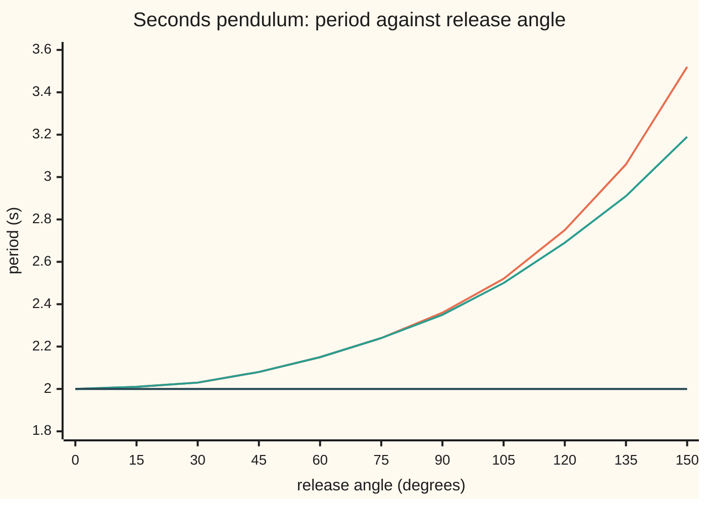
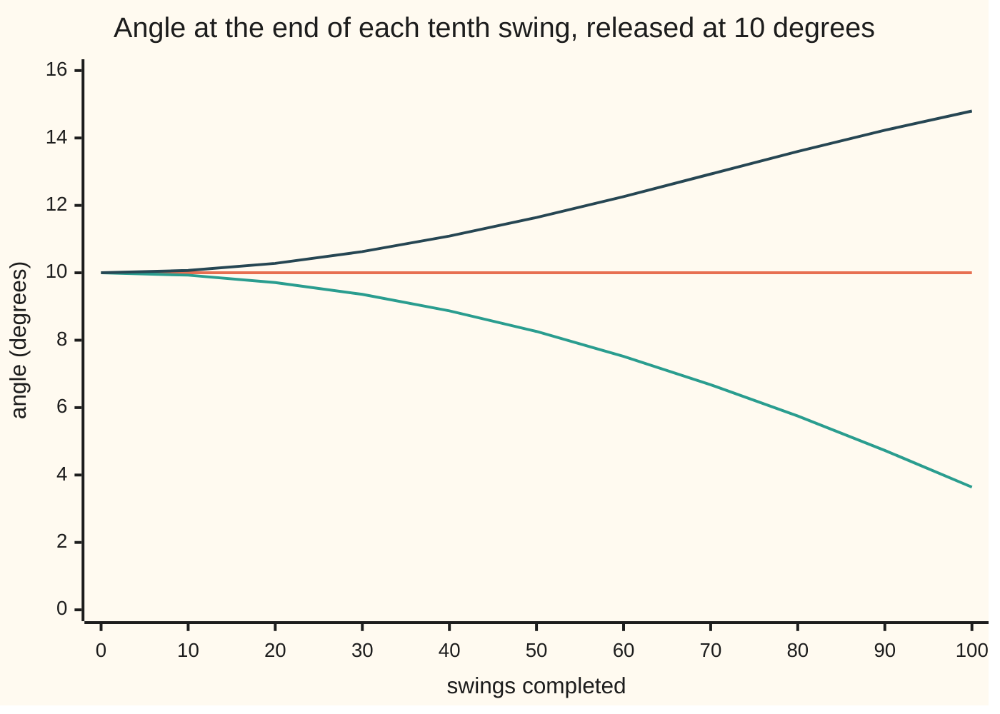

# Regular perturbation: solve the easy problem, then correct in powers of a small number

Engineering mathematics → Units and Modelling → Small-parameter expansions → Regular perturbation

---

## General Overview

A longcase clock keeps time with a seconds pendulum: a rod 0.9936 m long, cut so that a very small swing takes exactly 2 s there and back, one tick each way. The clockmaker releases it at 10 degrees from vertical. The engineer's question is how many seconds a day the clock loses because 10 degrees is not "very small", and how much that loss moves if the swing drifts by a degree.

The exact swing has no formula in sines and cosines. Its equation contains the sine of the angle, and the sine makes it nonlinear (the response is not proportional to the push). But 10 degrees is close to the easy case. At tiny angles the sine of an angle is the angle itself, the equation turns linear, and the answer is a pure cosine with period 2 s.

Regular perturbation turns that closeness into numbers. It names a small number, writes the true answer as the easy answer plus corrections in powers of that number, and finds the corrections one at a time, each from a linear problem. Here the small number is the square of the release angle in radians, 0.030462. Two corrections give the period as 2.003814363 s against the exact 2.003814376 s. The clock loses 164.47 s a day, and each extra degree of swing costs about 32.89 s more.

**Write the unknown as the easy answer plus a small number times a first correction plus its square times a second, put that into the equation and match powers: each power gives a linear problem the earlier ones have already set up, and the error left is about the size of the first power not kept.**

**What kind of fact this is:** a method. The period series it gives is an approximation whose error shrinks like the cube of the small number, proved in Why it works and measured in the code.

### The picture: the period against the swing



Orange: the exact period. Green: the easy answer plus two corrections. Dark blue: the easy answer alone, 2 s at every angle. Up to 60 degrees orange and green are one line at this scale; past 90 degrees the small number is no longer small and they part.

---

## The formula

Two pieces of notation first, in words. The Greek letter $\varepsilon$ (epsilon) names the small number an expansion is built on. $O(\varepsilon^3)$, read "order epsilon cubed", stands for a remainder no bigger than some fixed multiple of $\varepsilon^3$ once $\varepsilon$ is small enough.

The pendulum's law, from [the-nonlinear-pendulum](../../08-Differential%20equations%20and%20dynamics/06-Nonlinear%20Dynamics%20in%20the%20Plane/03-the-nonlinear-pendulum.md), is $\theta'' = -(g/l)\sin\theta$, with $g$ the acceleration of gravity and $l$ the rod length: the angle's acceleration is minus $g/l$ times its sine. The swing starts at rest at angle $a$. Count time $t$ in units of $\sqrt{l/g}$, 0.318310 s here, and measure the angle in units of the release angle, $u = \theta/a$. Then

$$u'' + u = \frac{\varepsilon}{6}\,u^3 - \frac{\varepsilon^2}{120}\,u^5 + O(\varepsilon^3), \qquad \varepsilon = a^2, \qquad u(0) = 1,\; u'(0) = 0.$$

**Read it aloud:** the swing is a plain oscillator, pushed by a small cubic force of size epsilon over six and a smaller fifth-power force of size epsilon squared.

Regular perturbation of this equation gives the period:

$$\frac{T}{T_0} = 1 + \frac{\varepsilon}{16} + \frac{11\,\varepsilon^2}{3072} + O(\varepsilon^3), \qquad T_0 = 2\pi\sqrt{l/g}.$$

**Read it aloud:** the true period is the small-swing period, stretched by one sixteenth of epsilon, plus eleven parts in 3072 of epsilon squared, plus something of order epsilon cubed.

It gives the motion too:

$$\theta(t) = a\Big[\cos\tau + \frac{\varepsilon}{192}\,(\cos\tau - \cos 3\tau)\Big] + O(a\,\varepsilon^2), \qquad \tau = \omega t, \quad \omega = 1 - \frac{\varepsilon}{16} + \frac{\varepsilon^2}{3072}.$$

**Read it aloud:** the angle is a cosine running at a slightly slowed clock, plus a small ripple at three times the swing frequency.

| Symbol | Plain meaning | In our example | Push it up and the answer… |
| --- | --- | --- | --- |
| $\theta$ | angle of the rod from vertical, rad | starts at 10 degrees | — |
| $a$ | release angle, the amplitude, rad | 0.174533 rad = 10 degrees | period rises |
| $\varepsilon$ | the small number, $a^2$ | 0.030462 | each correction grows; at 2.467 (90 degrees) two corrections are 0.37% short |
| $u$, $u_0$, $u_1$, $u_2$ | angle in units of $a$; the easy answer and its corrections | $u_0 = \cos\tau$ | — |
| $t$ | time in units of $\sqrt{l/g}$ | one unit is 0.318310 s | — |
| $\tau$ | strained time: $t$ run at the true frequency | one swing is $2\pi$ | — |
| $\omega$, $\omega_1$, $\omega_2$ | true angular frequency in units of $\sqrt{g/l}$, and its corrections | $\omega_1 = -1/16$, $\omega_2 = 1/3072$ | lower frequency, longer period |
| $T$, $T_0$ | true period; small-swing period | 2.003814376 s; 2.000000000 s | — |
| $g$, $l$ | gravity; rod length | 9.80665 m/s^2 (standard gravity, NIST); 0.993621 m | $g$ up: faster; $l$ up: slower |
| $k$, $\varphi$ | in the exact period integral: $k$ is the sine of half the release angle, $\varphi$ the variable integrated over | $k$ = sin 5 degrees | $k$ near 1: period without bound |
| $O(\varepsilon^3)$ | a remainder at most a fixed multiple of $\varepsilon^3$ | 6.6 parts per billion of $T$ | — |

The ratio $T/T_0$ depends on the angle alone. Local gravity differs from the standard 9.80665 m/s^2 by a few parts in a thousand, which moves $T_0$ but not the stretch.

### When it holds

- **$\varepsilon$ small.** At 10 degrees two corrections are good to 6.6 parts per billion. At 90 degrees ($\varepsilon$ = 2.467) they are 0.37% short; at 170 degrees, 25.07% short. Near 180 degrees the true period grows without bound and no finite sum follows it.
- **Setting $\varepsilon$ to zero leaves the same kind of problem.** Here it leaves a second-order equation with both its starting conditions. When the small number multiplies the highest derivative, setting it to zero drops a condition, and the method fails: that is [boundary-layers-and-singular-perturbation](06-boundary-layers-and-singular-perturbation.md).
- **The frequency is expanded too.** A plain expansion of the motion in powers of $\varepsilon$ holds only while $\varepsilon t$ is small. After 100 swings it reports 14.80 degrees for a swing that stays at 10.00. Why it works shows the cause and the fix.
- **The model.** A rigid rod, a point bob, no friction, no drive. A real clock loses energy to air and gets it back from the escapement (the mechanism that releases the gear train one tick at a time); both shift the period by amounts this card does not model.

---

## Why it works

### Step 0: a smooth answer has a series, and the series is found one rung at a time

If the answer depends smoothly on $\varepsilon$, it has a Taylor series in $\varepsilon$ ([taylor-series](../../06-Calculus%20and%20analysis/06-Series/05-taylor-series.md)). Put the series into the equation and collect the terms with no $\varepsilon$, then those with one power, then two. Each collection must vanish on its own, since the equation holds for every small $\varepsilon$. The rung with no $\varepsilon$ is the easy problem. Every later rung has the same linear left side, with a right side built from rungs already solved. One hard nonlinear problem becomes a ladder of easy linear ones.

### Step 1: scaling exposes the small number

Scaling ([scaling-and-nondimensionalisation](03-scaling-and-nondimensionalisation.md)) strips the units. Time in units of $\sqrt{l/g}$ removes $g$ and $l$. The angle in units of $a$ makes the starting angle 1. The law becomes $u'' + \sin(a u)/a = 0$. The sine's Taylor series, $\sin x = x - x^3/6 + x^5/120 - \dots$, gives

$$\frac{\sin(a u)}{a} = u - \frac{a^2}{6}u^3 + \frac{a^4}{120}u^5 - \dots$$

Only $a^2$ appears, never $a$ alone, because swinging left is the mirror of swinging right. So the natural small number is $\varepsilon = a^2$, not $a$.

### Step 2: the first try, and the term that grows

Write $u = u_0 + \varepsilon u_1$. The rung with no $\varepsilon$ is $u_0'' + u_0 = 0$ with $u_0(0) = 1$: so $u_0 = \cos t$. The rung with one $\varepsilon$ is

$$u_1'' + u_1 = \tfrac16\cos^3 t = \tfrac18\cos t + \tfrac{1}{24}\cos 3t, \qquad u_1(0) = u_1'(0) = 0.$$

The $\cos 3t$ part is answered by $-\cos 3t/192$. The $\cos t$ part pushes the oscillator at its own frequency, which is resonance (each push lands in step and the response builds). Its answer is $t\sin t/16$, which grows with time. Fitting the starting conditions:

$$u_1 = \frac{\cos t - \cos 3t}{192} + \frac{t \sin t}{16}.$$

The growing term is called **secular**. It cannot be right: energy is conserved, so the swing returns to 10 degrees every period. The cause is a frequency error. The true frequency is about $1 - \varepsilon/16$, and the Taylor series of $\cos((1 - \varepsilon/16)t)$ in $\varepsilon$ is $\cos t + (\varepsilon t/16)\sin t + \dots$. The plain expansion is expanding a phase that grows with time, which is fine for a few swings and wrong for many.



Orange: the true swing, stepped by RK4 (Runge-Kutta 4, a stepping rule that samples the slope four times per step), back at 10.00 degrees after every period. Green: the easy answer alone, running fast, so it drifts out of step to 3.64 degrees. Dark blue: easy answer plus first correction, whose growing term overshoots to 14.80 degrees. The strained expansion of Step 3 lies on the orange line, 0.000009 degrees off at worst over all 100 swings (200.38 s).

### Step 3: let the frequency carry a series of its own

Run the cosine on a stretched clock. Set $\tau = \omega t$ with $\omega = 1 + \varepsilon\omega_1 + \varepsilon^2\omega_2$, an unknown frequency with its own corrections. This is the Lindstedt-Poincaré method: still regular perturbation, but in two unknowns at once, the shape and the frequency. The law becomes $\omega^2 u_{\tau\tau} + \sin(a u)/a = 0$, where $u_{\tau\tau}$ is the second derivative in $\tau$; from here on a prime means a derivative in $\tau$. The rung with no $\varepsilon$ gives $u_0 = \cos\tau$ again. The rung with one $\varepsilon$ now has an extra term from $\omega^2 = 1 + 2\varepsilon\omega_1 + \dots$:

$$u_1'' + u_1 = \Big(2\omega_1 + \tfrac18\Big)\cos\tau + \tfrac{1}{24}\cos 3\tau.$$

Choose $\omega_1$ to kill the resonant push: $2\omega_1 + 1/8 = 0$, so $\omega_1 = -1/16$. What is left has no resonance:

$$u_1 = \frac{\cos\tau - \cos 3\tau}{192}.$$

That is the ripple in the motion formula. Its size, $\varepsilon/192$ = 0.0001587 of the swing, is what RK4 measures as the swing's third harmonic: −0.0001590, the gap being the next rung.

### Step 4: the second rung fixes the second frequency correction

The rung with two powers of $\varepsilon$ has the same left side, $u_2'' + u_2$. Its right side collects the earlier rungs. Again its $\cos\tau$ part must vanish, which fixes $\omega_2$. That part works out to $2\omega_2 - 1/1536$, so $\omega_2 = 1/3072$.

<details>
<summary>The algebra behind this, if you want it</summary>

With $\omega^2 = 1 + 2\varepsilon\omega_1 + \varepsilon^2(\omega_1^2 + 2\omega_2)$ and $u = u_0 + \varepsilon u_1 + \varepsilon^2 u_2$, the rung with $\varepsilon^2$ reads
$u_2'' + u_2 = -2\omega_1 u_1'' - (\omega_1^2 + 2\omega_2)u_0'' + \tfrac12 u_0^2 u_1 - \tfrac{1}{120}u_0^5.$
Read off each term's $\cos\tau$ part, using $u_0 = \cos\tau$ and $u_1 = (\cos\tau - \cos 3\tau)/192$:
- $-2\omega_1 u_1'' = \tfrac18 \cdot (-\cos\tau + 9\cos 3\tau)/192$ gives $-1/1536$.
- $-(\omega_1^2 + 2\omega_2)u_0''$ gives $+1/256 + 2\omega_2$.
- $\tfrac12\cos^2\tau\,(\cos\tau - \cos 3\tau)/192$: $\cos^3\tau$ holds $\tfrac34\cos\tau$ and $\cos^2\tau\cos 3\tau$ holds $\tfrac14\cos\tau$, giving $\tfrac{1}{384}(\tfrac34 - \tfrac14) = +1/768$.
- $-\tfrac{1}{120}\cos^5\tau$: $\cos^5\tau$ holds $\tfrac58\cos\tau$, giving $-1/192$.

In units of 1/1536 the sum is $-1 + 6 + 2 - 8 = -1$, plus $2\omega_2$. Setting it to zero gives $\omega_2 = 1/3072$.

</details>

### Step 5: the period from the frequency

One swing is $\tau = 2\pi$, so in time units the period is $2\pi/\omega$, and $T/T_0 = 1/\omega$. Expand $1/(1 - \varepsilon/16 + \varepsilon^2/3072)$:

$$\frac{1}{\omega} = 1 + \frac{\varepsilon}{16} + \Big(\frac{1}{256} - \frac{1}{3072}\Big)\varepsilon^2 + O(\varepsilon^3) = 1 + \frac{\varepsilon}{16} + \frac{11\,\varepsilon^2}{3072} + O(\varepsilon^3).$$

These are the card's two corrections: 0.001903859 and 0.000003323 at 10 degrees.

### Step 6: why the error shrinks like the cube

The exact period is a smooth function of $\varepsilon$, so its Taylor series exists and the remainder after the $\varepsilon^2$ term is at most a constant times $\varepsilon^3$. Halving the amplitude quarters $\varepsilon$, so the two-correction error should fall 64-fold. The code measures 64.02.

<details>
<summary>Detailed proof: the series is the Taylor series of the exact period, with remainder of order epsilon cubed</summary>

The exact period, from [the-nonlinear-pendulum](../../08-Differential%20equations%20and%20dynamics/06-Nonlinear%20Dynamics%20in%20the%20Plane/03-the-nonlinear-pendulum.md), is $T/T_0 = \tfrac{2}{\pi}\int_0^{\pi/2} (1 - k^2\sin^2\varphi)^{-1/2}\,d\varphi$ with $k = \sin(a/2)$ and $\varphi$ the integral's variable.

For $k^2 < 1$ the binomial series $(1 - x)^{-1/2} = 1 + \tfrac12 x + \tfrac38 x^2 + \dots$ converges uniformly in $\varphi$ (after enough terms the error is below any chosen bound for every $\varphi$ at once), so it may be integrated term by term. With $\tfrac{2}{\pi}\int_0^{\pi/2}\sin^2\varphi\,d\varphi = \tfrac12$ and $\tfrac{2}{\pi}\int_0^{\pi/2}\sin^4\varphi\,d\varphi = \tfrac38$, this gives $T/T_0 = 1 + \tfrac14 k^2 + \tfrac{9}{64}k^4 + \dots$, a convergent series.

Now $k^2 = \sin^2(a/2) = (1 - \cos a)/2 = \varepsilon/4 - \varepsilon^2/48 + O(\varepsilon^3)$, itself a convergent series in $\varepsilon$. Substituting: $T/T_0 = 1 + \varepsilon/16 - \varepsilon^2/192 + 9\varepsilon^2/1024 + O(\varepsilon^3)$, and $-16/3072 + 27/3072 = 11/3072$. The same two coefficients, by a road with no differential equation in it.

A convergent power series has a remainder after the $\varepsilon^2$ term equal to $\varepsilon^3$ times a convergent series, which is bounded on any interval $0 \le \varepsilon \le \varepsilon_{\max}$ inside the radius (the distance from 0, counting complex values of $\varepsilon$ too, within which the series converges). That is the $O(\varepsilon^3)$. The radius reaches the nearest $\varepsilon$, real or complex, where the period breaks down, which is where $k^2 = 1$, that is $\cos\sqrt{\varepsilon} = -1$. No complex $\varepsilon$ nearer than $\pi^2$ does that, and $\varepsilon = \pi^2$ is the swing to the top, $a = \pi$, so the full series converges for every swing short of 180 degrees, ever more slowly near it.

</details>

A third road skips series altogether. Gauss's arithmetic-geometric mean, AGM (average two numbers both ways, arithmetic and geometric, and repeat until they agree), gives the exact period in a few steps: $T = T_0/\mathrm{AGM}(1, \cos(a/2))$. The code uses it as the exact answer and reads the two coefficients back off it: 0.0625000000 and 0.0035807292, against 1/16 and 11/3072.

---

## Worked numbers, by hand

| Step | Arithmetic | Value |
| --- | --- | --- |
| release angle in radians | 10 × π/180 | 0.174533 rad |
| the small number | $\varepsilon = a^2$ | 0.030462 |
| first correction | $\varepsilon/16$ | 0.001903859 |
| second correction | $11\varepsilon^2/3072$ | 0.000003323 |
| period, easy answer | $T_0 = 2\pi\sqrt{l/g}$ | 2.000000000 s |
| period, one correction | 2 s × (1 + 0.001903859) | 2.003807718 s |
| period, two corrections | add 2 s × 0.000003323 | **2.003814363 s** |
| exact, for comparison | AGM and RK4 agree | 2.003814376 s |
| clock loss, per day | 86,400 s × (1 − 2/2.003814376) | **164.47 s/day** |

A clock regulated by the small-swing formula loses 164.47 s a day at a 10-degree swing. At 9 degrees it loses 133.22 s, at 11 degrees 199.00 s: about 32.89 s a day per degree near 10. A clockmaker regulates the length at the working amplitude, so the number that matters is the 32.89: the daily rate moves that much for each degree the swing drifts, from a tired mainspring or thickening oil.

The error falls with each rung. Keeping no correction is 1903.5577 parts per million (ppm) off, 164.4674 s/day; one correction, 3.3229 ppm, 0.2871 s/day; two, 0.0066 ppm, 0.0006 s/day.

### What breaks if you drop a piece

| Mistake | Comes out at | What went wrong |
| --- | --- | --- |
| $\varepsilon$ from the angle in degrees, 100 | period 86.1146 s | the series needs radians; $\varepsilon$ is not small |
| $\varepsilon = a$ instead of $a^2$ | period 2.022035 s | only even powers of the angle appear (Step 1) |
| frequency read as period: $1 - \varepsilon/16 + \dots$ | period 1.996193 s, shorter | $T/T_0 = 1/\omega$: a lower frequency is a longer period |
| plain expansion, no strained time, 100 swings | 14.80 degrees for a 10.00 degree swing | the secular term $t\sin t/16$ grows without bound |

Outside the range the series falls short. At 170 degrees, $\varepsilon$ = 8.803, two corrections give 3.6554 s against the true 4.8787 s, 25.07% short.

---

## Code, from first principles, and it actually runs

Three roads reach the 10-degree period. The series is road one. Gauss's AGM, with no series in it, is road two. Road three steps the pendulum law itself with RK4 from release to the bottom, bisects the last step to land on the vertical, and multiplies the quarter swing by four. The code then reads the two coefficients back off the AGM by Richardson extrapolation (two small-angle values combined so the next term cancels), measures the third harmonic of an RK4 swing, runs 100 swings to compare the plain and strained expansions, and prints every number on the card, including both charts and the out-of-range table.

### Python

```python
# Regular perturbation -- the check behind the card.  Standard library only.
# A seconds pendulum (small-swing period exactly 2 s) released from rest at
# 10 degrees.  Its period is found three ways: the perturbation series in
# eps = a^2, Gauss's arithmetic-geometric mean, and RK4 stepping of the swing.
from math import pi, sin, cos, sqrt

G = 9.80665                          # standard gravity, m/s^2 (NIST conventional value)
L = G / (pi * pi)                    # rod length giving a 2 s small-swing period, m
T0 = 2.0 * pi * sqrt(L / G)          # small-swing period, s
DAY = 86400.0                        # seconds in a day
D = pi / 180.0                       # radians per degree

def series(a, n):                    # T/T0 from the series, keeping n corrections
    e = a * a
    return (1.0, 1.0 + e / 16.0, 1.0 + e / 16.0 + 11.0 * e * e / 3072.0)[n]

def agm(x, y):                       # Gauss's arithmetic-geometric mean, written out
    for _ in range(30):
        x, y = 0.5 * (x + y), sqrt(x * y)
    return x

def exact(a):                        # T/T0 = 1 / AGM(1, cos(a/2)): no series anywhere
    return 1.0 / agm(1.0, cos(0.5 * a))

def step(th, w, h):                  # one RK4 step of th' = w, w' = -sin th
    k1t, k1w = w, -sin(th)
    k2t, k2w = w + 0.5 * h * k1w, -sin(th + 0.5 * h * k1t)
    k3t, k3w = w + 0.5 * h * k2w, -sin(th + 0.5 * h * k2t)
    k4t, k4w = w + h * k3w, -sin(th + h * k3t)
    return (th + h * (k1t + 2.0 * k2t + 2.0 * k3t + k4t) / 6.0,
            w + h * (k1w + 2.0 * k2w + 2.0 * k3w + k4w) / 6.0)

def rk4_ratio(a, h=0.001):           # time from rest at a to the bottom, times 4, over 2 pi
    th, w, n = a, 0.0, 0
    while True:
        th2, w2 = step(th, w, h)
        if th2 <= 0.0:
            break
        th, w, n = th2, w2, n + 1
    lo, hi = 0.0, h                  # bisect the last step to land on the bottom
    for _ in range(60):
        mid = 0.5 * (lo + hi)
        if step(th, w, mid)[0] > 0.0:
            lo = mid
        else:
            hi = mid
    return 4.0 * (n * h + lo) / (2.0 * pi)

def strained(a, t):                  # two-term solution, frequency expanded too
    e = a * a
    tau = (1.0 - e / 16.0 + e * e / 3072.0) * t
    return a * (cos(tau) + e * (cos(tau) - cos(3.0 * tau)) / 192.0)

def naive(a, t):                     # two-term solution, frequency held at 1
    e = a * a
    return a * (cos(t) + e * ((cos(t) - cos(3.0 * t)) / 192.0 + t * sin(t) / 16.0))

a = 10.0 * D
e = a * a
s = [series(a, n) for n in range(3)]
x, r = exact(a), rk4_ratio(a)
print(f"pendulum: l = {L:.6f} m, g = {G:.5f} m/s^2, T0 = {T0:.9f} s, time unit sqrt(l/g) = {sqrt(L / G):.6f} s")
print(f"amplitude a = 10 deg = {a:.6f} rad; eps = a^2 = {e:.6f}")
print(f"first correction eps/16 = {e / 16.0:.9f}; second 11 eps^2/3072 = {11.0 * e * e / 3072.0:.9f}")
for label, v in (("0 corrections", s[0]), ("1 correction", s[1]), ("2 corrections", s[2]),
                 ("exact, by AGM", x), ("exact, by RK4", r)):
    print(f"period, {label:<15} {v * T0:.9f} s")
for n in range(3):
    err = (x - s[n]) / x
    print(f"error, keeping {n}       {err * 1e6:11.4f} ppm   clock off by {DAY * err:9.4f} s/day")
for d in (9.0, 10.0, 11.0):
    print(f"clock at {d:4.1f} deg loses {DAY * (1.0 - 1.0 / exact(d * D)):7.2f} s/day vs the small-swing 2 s")
print(f"near 10 deg the loss changes by {DAY * (1.0 / exact(9.0 * D) - 1.0 / exact(11.0 * D)) / 2.0:.2f} s/day per degree")
print("shrink: amplitude deg   eps        error 1 corr ppm   error 2 corr ppb")
errs = {}
for d in (20.0, 10.0, 5.0, 2.5):
    b = d * D
    xb = exact(b)
    errs[d] = (xb - series(b, 2)) / xb
    print(f"shrink: {d:12.1f}   {b * b:.6f}   {(xb - series(b, 1)) / xb * 1e6:16.4f}   {errs[d] * 1e9:16.4f}")
ratio = errs[10.0] / errs[5.0]
print(f"halving the amplitude cuts the 2-correction error by {ratio:.2f} (eps^3 predicts 64)")
r1 = lambda b: (exact(b) - 1.0) / (b * b)                          # left over after 1, per eps
r2 = lambda b: (exact(b) - 1.0 - b * b / 16.0) / (b * b * b * b)   # after 1 + eps/16, per eps^2
c1 = (4.0 * r1(0.5 * D) - r1(1.0 * D)) / 3.0                       # Richardson: cancel the next term
c2 = (4.0 * r2(2.0 * D) - r2(4.0 * D)) / 3.0
print(f"coefficient of eps, read off the AGM:   {c1:.10f}   derived 1/16    = {1.0 / 16.0:.10f}")
print(f"coefficient of eps^2, read off the AGM: {c2:.10f}   derived 11/3072 = {11.0 / 3072.0:.10f}")

N = 4000                             # one exact period, sampled for the third harmonic
P = 2.0 * pi * x
th, w, b3 = a, 0.0, 0.0
for k in range(N):
    b3 += th * cos(3.0 * 2.0 * pi * k / N)
    th, w = step(th, w, P / N)
b3 = 2.0 * b3 / N / a
print(f"third harmonic, share of the swing: RK4 {b3:.7f}   derived -eps/192 = {-e / 192.0:.7f}")

M = 2000                             # 100 swings: both expansions against RK4
th, w, worst, chart = a, 0.0, 0.0, {0: (a, a, a, a)}
for n in range(1, 101):
    for k in range(M):
        th, w = step(th, w, P / M)
        t = ((n - 1) * M + k + 1) * (P / M)
        worst = max(worst, abs(th - strained(a, t)))
    chart[n] = (th, a * cos(t), naive(a, t), strained(a, t))
for n in (1, 10, 100):
    v = [c / D for c in chart[n]]
    print(f"after {n:3d} swings: RK4 {v[0]:7.4f} deg  small-angle {v[1]:8.4f}  naive {v[2]:8.4f}  strained {v[3]:7.4f}")
print(f"worst gap, strained expansion vs RK4, 100 swings ({100.0 * P * sqrt(L / G):.2f} s): {worst / D:.6f} deg")
ns = [10 * i for i in range(11)]
print("chart, swing number   " + " ".join(f"{n:6d}" for n in ns))
for j, lab in enumerate(("RK4 deg        ", "small-angle deg", "naive deg      ", "strained deg   ")):
    print("chart, " + lab + " " + " ".join(f"{chart[n][j] / D:6.2f}" for n in ns))

print("beyond: amplitude deg   eps      exact s   2 corrections s   error %")
for d in (30.0, 60.0, 90.0, 120.0, 150.0, 170.0):
    b = d * D
    xb, sb = exact(b), series(b, 2)
    print(f"beyond: {d:12.0f}   {b * b:6.3f}   {xb * T0:7.4f}   {sb * T0:15.4f}   {(xb - sb) / xb * 100.0:7.2f}")
amps = [15.0 * i for i in range(11)]
print("chart, amplitude deg     " + " ".join(f"{d:6.0f}" for d in amps))
print("chart, exact period s    " + " ".join(f"{exact(d * D) * T0:6.2f}" for d in amps))
print("chart, 2 corrections s   " + " ".join(f"{series(d * D, 2) * T0:6.2f}" for d in amps))

ed = 10.0 * 10.0                     # mistakes, all at the 10 degree swing
print(f"wrong: eps in degrees, 100      period {T0 * (1.0 + ed / 16.0 + 11.0 * ed * ed / 3072.0):.4f} s")
print(f"wrong: eps = a, not a^2         period {T0 * (1.0 + a / 16.0 + 11.0 * a * a / 3072.0):.6f} s")
print(f"wrong: frequency read as period period {T0 * (1.0 - e / 16.0 + e * e / 3072.0):.6f} s")

assert abs(r - x) < 1e-10, "RK4 period must match the AGM period"
assert abs(c1 - 1.0 / 16.0) < 1e-9, "first coefficient read off the AGM must be 1/16"
assert abs(c2 - 11.0 / 3072.0) < 1e-8, "second coefficient read off the AGM must be 11/3072"
assert 60.0 < ratio < 70.0, "two-correction error must fall about 64-fold per halving"
assert abs(b3 + e / 192.0) < 2e-6, "RK4 third harmonic must match the first correction"
assert worst < 1e-5 * D, "strained expansion must stay on the RK4 swing for 100 swings"
assert chart[100][2] - a > 4.0 * D, "naive expansion must drift by over 4 degrees by swing 100"
print("ALL CHECKS PASS")
```

**Ran 2026-09-30 on macOS, Python 3.14.6, standard library only. All checks passed. Output, pasted from the run:**

```
pendulum: l = 0.993621 m, g = 9.80665 m/s^2, T0 = 2.000000000 s, time unit sqrt(l/g) = 0.318310 s
amplitude a = 10 deg = 0.174533 rad; eps = a^2 = 0.030462
first correction eps/16 = 0.001903859; second 11 eps^2/3072 = 0.000003323
period, 0 corrections   2.000000000 s
period, 1 correction    2.003807718 s
period, 2 corrections   2.003814363 s
period, exact, by AGM   2.003814376 s
period, exact, by RK4   2.003814376 s
error, keeping 0         1903.5577 ppm   clock off by  164.4674 s/day
error, keeping 1            3.3229 ppm   clock off by    0.2871 s/day
error, keeping 2            0.0066 ppm   clock off by    0.0006 s/day
clock at  9.0 deg loses  133.22 s/day vs the small-swing 2 s
clock at 10.0 deg loses  164.47 s/day vs the small-swing 2 s
clock at 11.0 deg loses  199.00 s/day vs the small-swing 2 s
near 10 deg the loss changes by 32.89 s/day per degree
shrink: amplitude deg   eps        error 1 corr ppm   error 2 corr ppb
shrink:         20.0   0.121847            53.1824           425.0839
shrink:         10.0   0.030462             3.3229             6.6348
shrink:          5.0   0.007615             0.2077             0.1036
shrink:          2.5   0.001904             0.0130             0.0016
halving the amplitude cuts the 2-correction error by 64.02 (eps^3 predicts 64)
coefficient of eps, read off the AGM:   0.0625000000   derived 1/16    = 0.0625000000
coefficient of eps^2, read off the AGM: 0.0035807292   derived 11/3072 = 0.0035807292
third harmonic, share of the swing: RK4 -0.0001590   derived -eps/192 = -0.0001587
after   1 swings: RK4 10.0000 deg  small-angle   9.9993  naive  10.0007  strained 10.0000
after  10 swings: RK4 10.0000 deg  small-angle   9.9283  naive  10.0717  strained 10.0000
after 100 swings: RK4 10.0000 deg  small-angle   3.6392  naive  14.8045  strained 10.0000
worst gap, strained expansion vs RK4, 100 swings (200.38 s): 0.000009 deg
chart, swing number        0     10     20     30     40     50     60     70     80     90    100
chart, RK4 deg          10.00  10.00  10.00  10.00  10.00  10.00  10.00  10.00  10.00  10.00  10.00
chart, small-angle deg  10.00   9.93   9.71   9.36   8.87   8.26   7.52   6.68   5.75   4.73   3.64
chart, naive deg        10.00  10.07  10.28  10.63  11.09  11.64  12.26  12.93  13.60  14.23  14.80
chart, strained deg     10.00  10.00  10.00  10.00  10.00  10.00  10.00  10.00  10.00  10.00  10.00
beyond: amplitude deg   eps      exact s   2 corrections s   error %
beyond:           30    0.274    2.0348            2.0348      0.00
beyond:           60    1.097    2.1464            2.1457      0.03
beyond:           90    2.467    2.3607            2.3520      0.37
beyond:          120    4.386    2.7458            2.6861      2.17
beyond:          150    6.854    3.5244            3.1932      9.40
beyond:          170    8.803    4.8787            3.6554     25.07
chart, amplitude deg          0     15     30     45     60     75     90    105    120    135    150
chart, exact period s      2.00   2.01   2.03   2.08   2.15   2.24   2.36   2.52   2.75   3.06   3.52
chart, 2 corrections s     2.00   2.01   2.03   2.08   2.15   2.24   2.35   2.50   2.69   2.91   3.19
wrong: eps in degrees, 100      period 86.1146 s
wrong: eps = a, not a^2         period 2.022035 s
wrong: frequency read as period period 1.996193 s
ALL CHECKS PASS
```

### Rust

Same numbers, same labels, built with `rustc --edition 2021 -O`.

```rust
// Regular perturbation -- the same check as the Python, in Rust.  No crates.
// A seconds pendulum (small-swing period exactly 2 s) released from rest at
// 10 degrees.  Its period is found three ways: the perturbation series in
// eps = a^2, Gauss's arithmetic-geometric mean, and RK4 stepping of the swing.
use std::f64::consts::PI;

const G: f64 = 9.80665;              // standard gravity, m/s^2 (NIST conventional value)
const DAY: f64 = 86400.0;            // seconds in a day
const D: f64 = PI / 180.0;           // radians per degree

fn series(a: f64, n: usize) -> f64 {  // T/T0 from the series, keeping n corrections
    let e = a * a;
    [1.0, 1.0 + e / 16.0, 1.0 + e / 16.0 + 11.0 * e * e / 3072.0][n]
}

fn agm(mut x: f64, mut y: f64) -> f64 {  // Gauss's arithmetic-geometric mean, written out
    for _ in 0..30 {
        let (nx, ny) = (0.5 * (x + y), (x * y).sqrt());
        x = nx;
        y = ny;
    }
    x
}

fn exact(a: f64) -> f64 { 1.0 / agm(1.0, (0.5 * a).cos()) }  // T/T0 = 1 / AGM(1, cos(a/2))

fn step(th: f64, w: f64, h: f64) -> (f64, f64) {  // one RK4 step of th' = w, w' = -sin th
    let (k1t, k1w) = (w, -th.sin());
    let (k2t, k2w) = (w + 0.5 * h * k1w, -(th + 0.5 * h * k1t).sin());
    let (k3t, k3w) = (w + 0.5 * h * k2w, -(th + 0.5 * h * k2t).sin());
    let (k4t, k4w) = (w + h * k3w, -(th + h * k3t).sin());
    (th + h * (k1t + 2.0 * k2t + 2.0 * k3t + k4t) / 6.0,
     w + h * (k1w + 2.0 * k2w + 2.0 * k3w + k4w) / 6.0)
}

fn rk4_ratio(a: f64, h: f64) -> f64 {  // time from rest at a to the bottom, times 4, over 2 pi
    let (mut th, mut w, mut n) = (a, 0.0, 0.0);
    loop {
        let (th2, w2) = step(th, w, h);
        if th2 <= 0.0 { break }
        th = th2;
        w = w2;
        n += 1.0;
    }
    let (mut lo, mut hi) = (0.0, h);   // bisect the last step to land on the bottom
    for _ in 0..60 {
        let mid = 0.5 * (lo + hi);
        if step(th, w, mid).0 > 0.0 { lo = mid } else { hi = mid }
    }
    4.0 * (n * h + lo) / (2.0 * PI)
}

fn strained(a: f64, t: f64) -> f64 {  // two-term solution, frequency expanded too
    let e = a * a;
    let tau = (1.0 - e / 16.0 + e * e / 3072.0) * t;
    a * (tau.cos() + e * (tau.cos() - (3.0 * tau).cos()) / 192.0)
}

fn naive(a: f64, t: f64) -> f64 {     // two-term solution, frequency held at 1
    let e = a * a;
    a * (t.cos() + e * ((t.cos() - (3.0 * t).cos()) / 192.0 + t * t.sin() / 16.0))
}

fn row(v: &[f64], f: impl Fn(f64) -> String) -> String {
    v.iter().map(|&x| f(x)).collect::<Vec<_>>().join(" ")
}

fn main() {
    let l = G / (PI * PI);             // rod length giving a 2 s small-swing period, m
    let t0 = 2.0 * PI * (l / G).sqrt();
    let a = 10.0 * D;
    let e = a * a;
    let s: Vec<f64> = (0..3).map(|n| series(a, n)).collect();
    let (x, r) = (exact(a), rk4_ratio(a, 0.001));
    println!("pendulum: l = {:.6} m, g = {:.5} m/s^2, T0 = {:.9} s, time unit sqrt(l/g) = {:.6} s", l, G, t0, (l / G).sqrt());
    println!("amplitude a = 10 deg = {:.6} rad; eps = a^2 = {:.6}", a, e);
    println!("first correction eps/16 = {:.9}; second 11 eps^2/3072 = {:.9}", e / 16.0, 11.0 * e * e / 3072.0);
    for (label, v) in [("0 corrections", s[0]), ("1 correction", s[1]), ("2 corrections", s[2]),
                       ("exact, by AGM", x), ("exact, by RK4", r)] {
        println!("period, {:<15} {:.9} s", label, v * t0);
    }
    for n in 0..3 {
        let err = (x - s[n]) / x;
        println!("error, keeping {}       {:11.4} ppm   clock off by {:9.4} s/day", n, err * 1e6, DAY * err);
    }
    for d in [9.0, 10.0, 11.0] {
        println!("clock at {:4.1} deg loses {:7.2} s/day vs the small-swing 2 s", d, DAY * (1.0 - 1.0 / exact(d * D)));
    }
    println!("near 10 deg the loss changes by {:.2} s/day per degree", DAY * (1.0 / exact(9.0 * D) - 1.0 / exact(11.0 * D)) / 2.0);
    println!("shrink: amplitude deg   eps        error 1 corr ppm   error 2 corr ppb");
    let mut errs = Vec::new();
    for d in [20.0, 10.0, 5.0, 2.5] {
        let b = d * D;
        let xb = exact(b);
        errs.push((xb - series(b, 2)) / xb);
        println!("shrink: {:12.1}   {:.6}   {:16.4}   {:16.4}", d, b * b, (xb - series(b, 1)) / xb * 1e6, errs[errs.len() - 1] * 1e9);
    }
    let ratio = errs[1] / errs[2];
    println!("halving the amplitude cuts the 2-correction error by {:.2} (eps^3 predicts 64)", ratio);
    let r1 = |b: f64| (exact(b) - 1.0) / (b * b);                         // left over after 1, per eps
    let r2 = |b: f64| (exact(b) - 1.0 - b * b / 16.0) / (b * b * b * b);  // after 1 + eps/16, per eps^2
    let c1 = (4.0 * r1(0.5 * D) - r1(1.0 * D)) / 3.0;                     // Richardson: cancel the next term
    let c2 = (4.0 * r2(2.0 * D) - r2(4.0 * D)) / 3.0;
    println!("coefficient of eps, read off the AGM:   {:.10}   derived 1/16    = {:.10}", c1, 1.0 / 16.0);
    println!("coefficient of eps^2, read off the AGM: {:.10}   derived 11/3072 = {:.10}", c2, 11.0 / 3072.0);

    let nn = 4000;                     // one exact period, sampled for the third harmonic
    let p = 2.0 * PI * x;
    let (mut th, mut w, mut b3) = (a, 0.0, 0.0);
    for k in 0..nn {
        b3 += th * (3.0 * 2.0 * PI * k as f64 / nn as f64).cos();
        (th, w) = step(th, w, p / nn as f64);
    }
    b3 = 2.0 * b3 / nn as f64 / a;
    println!("third harmonic, share of the swing: RK4 {:.7}   derived -eps/192 = {:.7}", b3, -e / 192.0);

    let m = 2000;                      // 100 swings: both expansions against RK4
    let (mut th, mut w, mut worst) = (a, 0.0, 0.0f64);
    let mut chart: Vec<[f64; 4]> = Vec::new();
    chart.push([a, a, a, a]);
    for n in 1..=100 {
        let mut t = 0.0;
        for k in 0..m {
            (th, w) = step(th, w, p / m as f64);
            t = ((n - 1) * m + k + 1) as f64 * (p / m as f64);
            worst = worst.max((th - strained(a, t)).abs());
        }
        chart.push([th, a * t.cos(), naive(a, t), strained(a, t)]);
    }
    for n in [1, 10, 100] {
        let v: Vec<f64> = chart[n].iter().map(|c| c / D).collect();
        println!("after {:3} swings: RK4 {:7.4} deg  small-angle {:8.4}  naive {:8.4}  strained {:7.4}", n, v[0], v[1], v[2], v[3]);
    }
    println!("worst gap, strained expansion vs RK4, 100 swings ({:.2} s): {:.6} deg", 100.0 * p * (l / G).sqrt(), worst / D);
    let ns: Vec<usize> = (0..11).map(|i| 10 * i).collect();
    println!("chart, swing number   {}", ns.iter().map(|n| format!("{:6}", n)).collect::<Vec<_>>().join(" "));
    for (j, lab) in ["RK4 deg        ", "small-angle deg", "naive deg      ", "strained deg   "].iter().enumerate() {
        println!("chart, {} {}", lab, ns.iter().map(|&n| format!("{:6.2}", chart[n][j] / D)).collect::<Vec<_>>().join(" "));
    }

    println!("beyond: amplitude deg   eps      exact s   2 corrections s   error %");
    for d in [30.0, 60.0, 90.0, 120.0, 150.0, 170.0] {
        let b = d * D;
        let (xb, sb) = (exact(b), series(b, 2));
        println!("beyond: {:12.0}   {:6.3}   {:7.4}   {:15.4}   {:7.2}", d, b * b, xb * t0, sb * t0, (xb - sb) / xb * 100.0);
    }
    let amps: Vec<f64> = (0..11).map(|i| 15.0 * i as f64).collect();
    println!("chart, amplitude deg     {}", row(&amps, |d| format!("{:6.0}", d)));
    println!("chart, exact period s    {}", row(&amps, |d| format!("{:6.2}", exact(d * D) * t0)));
    println!("chart, 2 corrections s   {}", row(&amps, |d| format!("{:6.2}", series(d * D, 2) * t0)));

    let ed = 10.0 * 10.0;              // mistakes, all at the 10 degree swing
    println!("wrong: eps in degrees, 100      period {:.4} s", t0 * (1.0 + ed / 16.0 + 11.0 * ed * ed / 3072.0));
    println!("wrong: eps = a, not a^2         period {:.6} s", t0 * (1.0 + a / 16.0 + 11.0 * a * a / 3072.0));
    println!("wrong: frequency read as period period {:.6} s", t0 * (1.0 - e / 16.0 + e * e / 3072.0));

    assert!((r - x).abs() < 1e-10, "RK4 period must match the AGM period");
    assert!((c1 - 1.0 / 16.0).abs() < 1e-9, "first coefficient read off the AGM must be 1/16");
    assert!((c2 - 11.0 / 3072.0).abs() < 1e-8, "second coefficient read off the AGM must be 11/3072");
    assert!(60.0 < ratio && ratio < 70.0, "two-correction error must fall about 64-fold per halving");
    assert!((b3 + e / 192.0).abs() < 2e-6, "RK4 third harmonic must match the first correction");
    assert!(worst < 1e-5 * D, "strained expansion must stay on the RK4 swing for 100 swings");
    assert!(chart[100][2] - a > 4.0 * D, "naive expansion must drift by over 4 degrees by swing 100");
    println!("ALL CHECKS PASS");
}
```

**Ran 2026-09-30 on macOS, rustc 1.98.1, no crates. All checks passed. Output, pasted from the run:**

```
pendulum: l = 0.993621 m, g = 9.80665 m/s^2, T0 = 2.000000000 s, time unit sqrt(l/g) = 0.318310 s
amplitude a = 10 deg = 0.174533 rad; eps = a^2 = 0.030462
first correction eps/16 = 0.001903859; second 11 eps^2/3072 = 0.000003323
period, 0 corrections   2.000000000 s
period, 1 correction    2.003807718 s
period, 2 corrections   2.003814363 s
period, exact, by AGM   2.003814376 s
period, exact, by RK4   2.003814376 s
error, keeping 0         1903.5577 ppm   clock off by  164.4674 s/day
error, keeping 1            3.3229 ppm   clock off by    0.2871 s/day
error, keeping 2            0.0066 ppm   clock off by    0.0006 s/day
clock at  9.0 deg loses  133.22 s/day vs the small-swing 2 s
clock at 10.0 deg loses  164.47 s/day vs the small-swing 2 s
clock at 11.0 deg loses  199.00 s/day vs the small-swing 2 s
near 10 deg the loss changes by 32.89 s/day per degree
shrink: amplitude deg   eps        error 1 corr ppm   error 2 corr ppb
shrink:         20.0   0.121847            53.1824           425.0839
shrink:         10.0   0.030462             3.3229             6.6348
shrink:          5.0   0.007615             0.2077             0.1036
shrink:          2.5   0.001904             0.0130             0.0016
halving the amplitude cuts the 2-correction error by 64.02 (eps^3 predicts 64)
coefficient of eps, read off the AGM:   0.0625000000   derived 1/16    = 0.0625000000
coefficient of eps^2, read off the AGM: 0.0035807292   derived 11/3072 = 0.0035807292
third harmonic, share of the swing: RK4 -0.0001590   derived -eps/192 = -0.0001587
after   1 swings: RK4 10.0000 deg  small-angle   9.9993  naive  10.0007  strained 10.0000
after  10 swings: RK4 10.0000 deg  small-angle   9.9283  naive  10.0717  strained 10.0000
after 100 swings: RK4 10.0000 deg  small-angle   3.6392  naive  14.8045  strained 10.0000
worst gap, strained expansion vs RK4, 100 swings (200.38 s): 0.000009 deg
chart, swing number        0     10     20     30     40     50     60     70     80     90    100
chart, RK4 deg          10.00  10.00  10.00  10.00  10.00  10.00  10.00  10.00  10.00  10.00  10.00
chart, small-angle deg  10.00   9.93   9.71   9.36   8.87   8.26   7.52   6.68   5.75   4.73   3.64
chart, naive deg        10.00  10.07  10.28  10.63  11.09  11.64  12.26  12.93  13.60  14.23  14.80
chart, strained deg     10.00  10.00  10.00  10.00  10.00  10.00  10.00  10.00  10.00  10.00  10.00
beyond: amplitude deg   eps      exact s   2 corrections s   error %
beyond:           30    0.274    2.0348            2.0348      0.00
beyond:           60    1.097    2.1464            2.1457      0.03
beyond:           90    2.467    2.3607            2.3520      0.37
beyond:          120    4.386    2.7458            2.6861      2.17
beyond:          150    6.854    3.5244            3.1932      9.40
beyond:          170    8.803    4.8787            3.6554     25.07
chart, amplitude deg          0     15     30     45     60     75     90    105    120    135    150
chart, exact period s      2.00   2.01   2.03   2.08   2.15   2.24   2.36   2.52   2.75   3.06   3.52
chart, 2 corrections s     2.00   2.01   2.03   2.08   2.15   2.24   2.35   2.50   2.69   2.91   3.19
wrong: eps in degrees, 100      period 86.1146 s
wrong: eps = a, not a^2         period 2.022035 s
wrong: frequency read as period period 1.996193 s
ALL CHECKS PASS
```

The two outputs match line for line.

> [!TIP]
> **Try changing**
> Guess first, then run it.
> - **Double the swing to 20 degrees.** $\varepsilon$ quadruples to 0.121847. Guess the error growth. The shrink rows answer it: one correction is off 53.1824 ppm against 3.3229 (16 times, $\varepsilon^2$), two corrections 425.0839 ppb against 6.6348 (64 times, $\varepsilon^3$).
> - **Break the second coefficient.** Change 11.0 to 12.0 in `series`. The two-correction error now shrinks like $\varepsilon^2$, the halving ratio falls far below 64, and the fourth assert stops the run.
> - **Spoil the frequency correction.** In `strained`, change `e / 16.0` to `e / 15.0`. The strained expansion slips out of step with RK4 over 100 swings and the sixth assert stops the run.
> - **Take the swing to 90 degrees.** The beyond row shows 2.3520 s from two corrections against the true 2.3607 s: 0.37% short, at $\varepsilon$ = 2.467.

---

## The usual mistake

> [!warning]
> **Expanding the motion and leaving the frequency fixed.** The plain expansion is right for a few swings and then grows a term, $t\sin t/16$, that no conserved-energy swing can have: it reports 14.80 degrees after 100 swings for a pendulum that never exceeds 10.00. The fix is to give the frequency its own series and choose each correction so that nothing pushes at resonance.
>
> - **The small number in degrees.** $\varepsilon$ = 100 gives a period of 86.1146 s for a 2 s pendulum.
> - **The wrong small number.** $\varepsilon = a$ rather than $a^2$ gives 2.022035 s; the mirror symmetry of the swing allows only even powers.
> - **Frequency mistaken for period.** Writing $T/T_0 = 1 - \varepsilon/16$ gives 1.996193 s, a pendulum that speeds up as it swings wider.
> - **Trusting the series far out.** At 170 degrees two corrections are 25.07% short; the series converges for every swing below 180 degrees but needs ever more terms near it.

---

## Where you meet it in real life

- **Clockmaking.** Horologists call the amplitude dependence of the period "circular error". It is the first correction, $\varepsilon/16$, and it is why precision regulators swing only a few degrees and work to keep the swing constant.
- **Vibrating structures.** A cable, a beam or a spring whose stiffness changes as it stretches has a frequency that shifts with amplitude. The same strained-time expansion gives the shift.
- **Planetary orbits.** Lindstedt built the method in the 1880s for the slow drift of orbits under small pulls from other planets, where a plain expansion grows the same secular terms.
- **Tolerance and sensitivity.** The 32.89 s/day per degree is a sensitivity: how the output moves with an input. How such sensitivities combine with measurement errors is [error-propagation-and-sensitivity](07-error-propagation-and-sensitivity.md).
- **Model testing.** A scaled model in a wind tunnel and its full-size original share dimensionless groups ([similarity-and-model-testing](04-similarity-and-model-testing.md)); when one group is small but not zero, such as the Mach number (air speed over the speed of sound) of a model run fast to match the Reynolds number, the drag coefficient can be expanded in powers of its square the same way, and the first correction sizes what the mismatch costs.

> **Say it back**
> Scale the problem until a small number appears; here it is the swing angle squared, in radians. Write the answer as the easy answer plus corrections in powers of that number, and match powers: each rung is a linear problem with the same left side. Where a rung pushes at resonance, the frequency needs its own series, or a growing term spoils the answer after many swings. Two corrections put the 10-degree period at 2.003814363 s against the exact 2.003814376 s, and the clock's loss at 164.47 s a day. The error shrinks like the cube of the small number, and past 90 degrees the number is no longer small.

---

## What this builds on

- [scaling-and-nondimensionalisation](03-scaling-and-nondimensionalisation.md): choosing the time and angle units that make the small number appear.
- [taylor-series](../../06-Calculus%20and%20analysis/06-Series/05-taylor-series.md): the sine's series, and why a smooth answer has one in $\varepsilon$.
- [the-nonlinear-pendulum](../../08-Differential%20equations%20and%20dynamics/06-Nonlinear%20Dynamics%20in%20the%20Plane/03-the-nonlinear-pendulum.md): the law, its conserved energy and the exact period integral.

## Where this goes next

- [boundary-layers-and-singular-perturbation](06-boundary-layers-and-singular-perturbation.md): what to do when setting the small number to zero throws away a condition, and the answer changes sharply in a thin layer.

Regular perturbation needs the easy problem to keep every condition of the hard one; when a small number multiplies the highest derivative, it does not, and the next card shows how to stitch an inner answer to an outer one.

---

## Sources

Verified 2026-09-30: every link below resolves to the publisher's page.

- National Institute of Standards and Technology. "Standard acceleration of gravity", CODATA internationally recommended values. [NIST page](https://physics.nist.gov/cgi-bin/cuu/Value?gn). The conventional value 9.80665 m/s^2 used for $g$.
- Hinch, E. J. *Perturbation Methods*. Cambridge University Press, 1991. [Publisher page](https://doi.org/10.1017/CBO9781139172189). Regular expansions, secular terms and strained coordinates, in a short book.
- Nayfeh, Ali H. *Perturbation Methods*. Wiley Classics Library, Wiley-VCH, 2008. [Publisher page](https://www.wiley.com/en-us/Perturbation+Methods-p-9783527617616). The Lindstedt-Poincaré method for nonlinear oscillators, worked in full.
- Carvalhaes, Claudio G., and Patrick Suppes. "Approximations for the period of the simple pendulum based on the arithmetic-geometric mean." *American Journal of Physics* 76, 1150–1154 (2008). [doi:10.1119/1.2968864](https://doi.org/10.1119/1.2968864). The AGM formula for the exact period, road two of the code.
