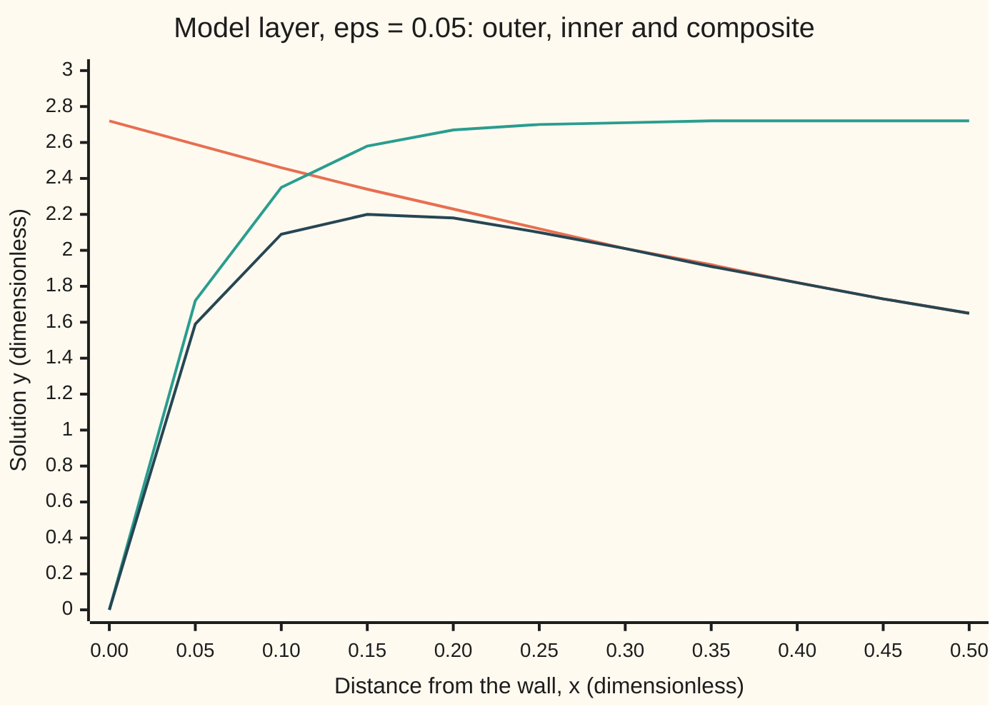
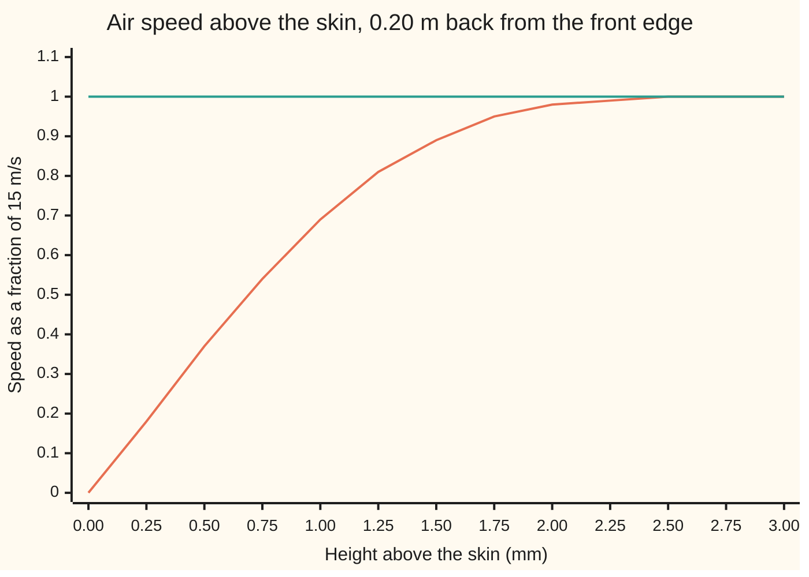

# Boundary layers: when the small term cannot be dropped near a wall

[Syllabus](../../../SYLLABUS.md) → [Engineering mathematics](../../../SYLLABUS.md#w13) → [Units and Modelling](../../../SYLLABUS.md#w13-s01) → Boundary layers

---

## General Overview

A small survey drone flies at 15 m/s. Its wing is 0.20 m from front edge to back edge; that distance is the **chord**. The air is at 20 °C and sea-level pressure. The engineer wants two numbers: how thick the slow-moving air on the wing's skin is, and how much drag that skin friction costs per metre of wing.

Air is barely sticky. Its stickiness, set against its momentum, is measured by the Reynolds number, the dimensionless ratio of inertia to viscous force from [Buckingham Pi](02-dimensional-analysis-and-buckingham-pi.md). Here it is 198,476, so the viscous term in the flow equations carries a coefficient of 1/Re, 5.038 in a million. Dropping it looks safe. The flow that remains is smooth and easy to compute, and it slides past the skin at full speed.

Real air does not slide. A hot-wire probe held at the skin reads almost no speed: the air sticks. Between the skin and the **free stream**, the undisturbed oncoming air, sits a sheet of air 2.204 mm thick at the back edge, where the speed climbs from zero to full. That sheet is the **boundary layer**. Inside it the "negligible" viscous term is as large as any other, because speed changes so fast across so short a distance. All of the skin-friction drag comes from there: 0.1615 N per metre of span, both sides.

**A small coefficient on the highest derivative cannot be dropped everywhere: drop it away from the wall (outer solution), stretch the coordinate near the wall until it matters again (inner solution), make the two agree where they overlap (matching), and add them minus their shared part (composite).**

**What kind of fact this is:** a method. On the model equation below it is checked against the exact answer, with its error stated; on the wing it is Prandtl's 1904 approximation, a model that holds for a thin, smooth, attached layer.

### The picture: two half-answers and the stitched one

The model equation of The formula, with its small number set to 0.05. Distance from the wall runs left to right; the solution runs up.



Orange: the outer solution, right far from the wall, wrong at it (2.72 where the truth is 0). Green: the inner solution, right at the wall, flat at 2.72 further out. Dark blue: the composite, which follows the green near the wall and the orange beyond about x = 0.3. The exact answer stays within 0.0862 of the dark blue; the code's table prints both.

---

## The formula

Notation already met: ε (epsilon) is a small dimensionless number, and O(ε), "order of ε", means "no bigger than a fixed multiple of ε" ([Regular perturbation](05-regular-perturbation.md)). A prime is a derivative in the function's own variable: in x on y, in X on Y, and in η on Blasius's f below.

The model problem is a two-point boundary value problem: one condition at each end ([Boundary value problems](../../08-Differential%20equations%20and%20dynamics/07-Series%20Solutions%20and%20Boundary%20Problems/05-two-point-boundary-value-problems.md)).

$$\varepsilon\, y'' + y' + y = 0, \qquad y(0) = 0,\quad y(1) = 1$$

It is not the wing's equation. It has the wing's structure: the small number multiplies the highest derivative, as viscosity does; the middle term carries the solution along, as the oncoming air does; and the wall sits at x = 0, where the solution must vanish, as the air speed does. Unlike the wing, it can be solved exactly, so the method can be checked before it is trusted.

The method, in four lines:

$$\text{outer: } y_o' + y_o = 0,\ y_o(1) = 1 \;\Rightarrow\; y_o = e^{1-x}$$

$$\text{inner: } X = \frac{x}{\varepsilon},\quad Y'' + Y' = 0,\ Y(0) = 0 \;\Rightarrow\; Y = A\,(1 - e^{-X})$$

$$\text{match: } \lim_{X\to\infty} Y = \lim_{x\to 0} y_o \;\Rightarrow\; A = e$$

$$y_c(x) = y_o(x) + Y\!\left(\tfrac{x}{\varepsilon}\right) - e = e^{1-x} - e^{\,1 - x/\varepsilon}$$

**Read it aloud:** away from the wall, drop the small term and keep the far condition; near the wall, magnify distance by one over epsilon and keep the wall condition; choose the free constant so the two agree in between; add them and take away the value they share.

On the wing the same four steps run on Prandtl's boundary-layer equations. The layer's thickness scale and the inner equation are

$$\delta = \frac{c}{\sqrt{\mathrm{Re}}}, \qquad f''' + \tfrac12 f f'' = 0,\quad f(0) = f'(0) = 0,\quad f'(\infty) = 1$$

where $\eta$ is the height above the skin in units of the local layer scale, $\eta = y_w\sqrt{U/(\nu x_w)}$, with $y_w$ the height and $x_w$ the distance back from the front edge, and $u/U = f'(\eta)$ is the air's speed as a fraction of the free stream. The condition $f'(\infty) = 1$ is the matching: far above the skin, in the inner variable, the layer must reach the outer flow's speed. This is Blasius's equation (1908). Its solution gives the average skin-friction coefficient and the drag on one side per metre of span:

$$C_f = \frac{4 f''(0)}{\sqrt{\mathrm{Re}}} = \frac{1.328}{\sqrt{\mathrm{Re}}}, \qquad D = \tfrac12 \rho U^2 c\, C_f$$

| Symbol | Plain meaning | In our example | Push it up and the answer… |
| --- | --- | --- | --- |
| $x$, $y$, $x_w$, $y_w$ | model: distance from the wall, and the solution; wing: distance back from the front edge, and height above the skin. The model's x plays the part of the wing's height $y_w$, not of $x_w$ | x from 0 to 1; $x_w$ up to 0.20 m | — |
| $\varepsilon$ | the small number on the highest derivative | 0.05; on the wing 1/Re = 5.038 per million | the layer thickens and the composite's error grows, about e × ε |
| $e$ | Euler's number, the base of the natural exponential | 2.7183, the value outer and inner share | — |
| $A$, $B$ | free constants of a general solution, fixed by the conditions | $B = -A$ from the wall; $A = e$ by matching | — |
| $r_1$, $r_2$, $a$ | in the proofs: the slow and fast roots of ε r^2 + r + 1 = 0; the trial power in x = ε^a X | $r_1$ near −1, $r_2$ near −1/ε; a = 1 in the layer | — |
| $y_o$ | outer solution: small term dropped, far condition kept | $e^{1-x}$, 2.7183 at the wall | — |
| $X$, $Y$ | inner (stretched) distance x/ε, and the inner solution | x = 0.05 is X = 1, Y = 1.7183 | — |
| $y_c$ | composite: outer plus inner minus the shared value e | 1.5857 at x = 0.05, exact 1.6117 | — |
| $U$, $c$ | free-stream speed; chord | 15 m/s; 0.20 m | U up: thinner layer, more drag |
| $\nu$, $\mu$, $\rho$ | kinematic viscosity μ/ρ; viscosity; air density | 15.1152 mm^2/s; 1.82 × 10^-5 Pa s; 1.2041 kg/m^3 | ν up: thicker layer, more drag |
| $\mathrm{Re}$ | Reynolds number Uc/ν | 198,476 | thinner layer, smaller C_f |
| $\delta$ | the layer's thickness scale c/√Re at the back edge | 0.4489 mm | — |
| $\eta$, $f$ | inner height in units of the local layer scale; Blasius's function, with u/U = f′ | f′ reaches 0.99 at η = 4.9100 | — |
| $C_f$ | average skin-friction coefficient: drag over ½ρU^2 times area | 0.002981 | — |
| $D$ | skin-friction drag, one side, per metre of span | 0.08077 N/m | — |

The viscosity is Lemmon and Jacobsen's value for air at 20 °C and 1 atm. [Similarity](04-similarity-and-model-testing.md) computes the same air's viscosity from Sutherland's older law and gets a value 0.4 % lower; that would move Re by about the same 0.4 % and change no step of the method.

### When it holds

- **ε small.** The composite's worst error tends to e × ε as ε shrinks: 0.0242 at ε = 0.01 (e × ε is 0.0272), but 0.1097 at ε = 0.1. When ε reaches 0.25 the model's two exponential modes merge and the split into fast and slow parts is gone.
- **The fast mode must decay into the domain.** The inner solution's e^(−X) dies away from x = 0, so the layer sits there. Flip the sign of the middle term and the layer moves to x = 1; putting it at the wrong wall gives an inner solution that grows and cannot be matched.
- **On the wing, laminar flow.** Blasius's layer holds on a smooth plate in a quiet stream up to Re about 500,000. A light aircraft's wing at Re 5,954,265 is turbulent, and the laminar formula underestimates the friction (What breaks).
- **On the wing, a thin flat skin with uniform outer speed.** A real aerofoil speeds the outer flow up and then slows it along the chord. That changes the inner equation, and a strong enough slow-down lifts the layer off the skin (separation), after which the outer flow is no longer the one assumed.
- **Away from the front edge.** The local layer scale grows from zero at the front edge, where the thin-layer assumption fails over a short region. The total drag barely notices.

---

## Why it works

### Step 0: the small term is small only where the solution is gentle

Setting ε to 0 turns a second-order equation into a first-order one. A first-order equation takes one condition, but the problem has two. One must be dropped, and the solution that results cannot satisfy it. Near that end the true solution must change so fast that ε y″ is no longer small. That region is the boundary layer. A regular perturbation series, which assumes every term keeps its size, misses it entirely ([Regular perturbation](05-regular-perturbation.md)).

### Step 1: the outer solution keeps the far condition

Drop ε: y′ + y = 0, solved by A e^(−x). Which condition to keep is decided by where the layer can sit: at x = 0, the only wall the inner solution's e^(−X) decays away from (Step 3). So the outer solution keeps y(1) = 1 and is $y_o = e^{1-x}$. At the wall it gives e = 2.7183, where the truth is 0. On the wing the outer solution is the inviscid flow: on a thin flat wing, air at 15 m/s sliding over the skin.

### Step 2: stretch the coordinate until the small term counts again

Write x = ε^a X for an unknown power a and see which terms are biggest. The three terms scale as ε^(1−2a) Y″, ε^(−a) Y′ and Y. With a = 0 the first is small: that is the outer region. With a = 1 the first two are both of size 1/ε and the third is smaller: a new balance, the inner region, of thickness ε. No other a balances two terms that beat the third.

On the wing the balance is between two different terms of Prandtl's equations. Carrying air along the chord costs about U^2/c per unit mass. Viscous diffusion across a layer of thickness δ supplies about νU/δ^2. Equal when δ^2/c^2 = ν/(Uc) = 1/Re, so δ = c/√Re: 0.4489 mm here. The thickness goes as the square root of ε, not ε itself, because the length along the wing stays c while only the height shrinks.

### Step 3: the inner solution keeps the wall condition

In X the model reads Y″ + Y′ + εY = 0. Keep the leading terms: Y″ + Y′ = 0, solved by A + B e^(−X). The wall condition Y(0) = 0 gives B = −A, so Y = A(1 − e^(−X)). One constant, A, is left. The equation alone cannot fix it.

### Step 4: matching fixes the last constant

Far out in the inner variable (X large) the inner solution tends to A. Close in for the outer one (x small) it tends to e. Both describe the same function in a region a little way off the wall: far in inner units, close in outer units. So A = e. At x = √ε, which is such a point, the gap between them shrinks with ε, roughly as e√ε: 0.5136 at ε = 0.05, 0.0846 at ε = 0.001.

On the wing, matching is the condition f′(∞) = 1: the top of the layer must move at the outer flow's speed.

### Step 5: the composite counts the shared part once

Inner plus outer counts the overlap value e twice. Subtract it: $y_c = e^{1-x} - e^{1 - x/\varepsilon}$. Near the wall the outer part is close to e and cancels the subtraction, leaving the inner solution. Far away the inner part is e and cancels, leaving the outer one. The worst gap from the exact answer, divided by ε, settles towards e: 2.674 at ε = 0.001.

<details>
<summary>Detailed proof: the composite is within about e × ε of the exact answer</summary>

The characteristic equation ε r^2 + r + 1 = 0 has roots r₁ = (−1 + √(1 − 4ε))/(2ε) and r₂ = (−1 − √(1 − 4ε))/(2ε). Expanding the square root, r₁ = −1 − ε + O(ε^2) and r₂ = −1/ε + 1 + O(ε). The exact solution is y = (e^(r₁x) − e^(r₂x))/(e^(r₁) − e^(r₂)), and e^(r₂) is smaller than any power of ε, so it can be dropped from the denominator.

Slow part: e^(r₁(x − 1)) = e^((1 + ε)(1 − x)) × (1 + O(ε^2)) = e^(1−x) (1 + ε(1 − x)) + O(ε^2).

Fast part: e^(r₂x − r₁) = e^(1 + ε) e^(−x/ε) e^(x + O(εx)) = e^(1 − x/ε) (1 + ε + x) + O(ε^2), uniformly in x, since x e^(−x/ε) is at most ε/e.

Subtract the composite: y − y_c = ε(1 − x) e^(1−x) − (ε + x) e^(1 − x/ε) + O(ε^2). The second term is at most (e + 1)ε, since x e^(−x/ε) is at most ε/e, and it dies within a few layer widths; the first is largest just outside the layer, where x is small but x/ε is large, and there it is e × ε. So the worst error is e × ε (1 + o(1)), as the printed ratio approaches. The error is O(ε) throughout, which is what "uniformly valid" means: no region where the composite fails.

</details>

### Step 6: the wing's inner problem, solved by shooting

Prandtl's equations in the layer have no length of their own along the skin, so the speed profile has the same shape at every distance $x_w$ back from the front edge, stretched by √(ν x_w/U). That collapses them to Blasius's ordinary differential equation. It is a boundary value problem with conditions at η = 0 and at infinity. The shooting method ([Shooting](../../08-Differential%20equations%20and%20dynamics/07-Series%20Solutions%20and%20Boundary%20Problems/06-the-shooting-method.md)) guesses the unknown f″(0), integrates out to η = 10, and adjusts until f′ there is 1. The answer is f″(0) = 0.332057, Howarth's 1938 value. Here the outer flow is uniform, so the composite is U + U f′ − U = U f′: the inner solution is already uniformly valid.

### Step 7: drag, two ways

The skin's shear stress is μ times the speed gradient at the skin, μ U f″(0) √(U/(ν x_w)). Integrated along the chord it gives D = ½ρU^2c × 4f″(0)/√Re. Separately, a force on the air removes momentum from it: the layer carries less momentum than free-stream air would, by ρU^2 times the momentum thickness, which is ∫ f′(1 − f′) dη = 0.664112 layer scales. Both roads give 0.08077 N/m on one side. They agree because momentum is conserved, and that identity is the momentum-integral method the Lift and drag card uses on real aerofoils.

A second route to the model's answer is a finite-difference solve ([Finite differences](../../08-Differential%20equations%20and%20dynamics/07-Series%20Solutions%20and%20Boundary%20Problems/07-finite-differences-for-boundary-problems.md)): it needs no asymptotics, but it must put several grid points inside the layer, so its cost grows as ε shrinks, while the composite only gets better.

---

## Worked numbers, by hand

| Step | Arithmetic | Value |
| --- | --- | --- |
| outer at x = 0.05 | e^(1 − 0.05) | 2.5857 |
| inner at x = 0.05, ε = 0.05 | X = 1; e × (1 − e^(−1)) | 1.7183 |
| composite | 2.5857 + 1.7183 − 2.7183 | **1.5857** (exact 1.6117) |
| air density | 101,325 × 0.0289644 / (8.314462618 × 293.15) | 1.2041 kg/m^3 |
| kinematic viscosity | 1.82 × 10^-5 / 1.2041 | 15.1152 mm^2/s |
| Reynolds number | 15 × 0.20 / (15.1152 × 10^-6) | 198,476 |
| thickness scale | 0.20 m / √198,476 | 0.4489 mm |
| 99% thickness at the back edge | 4.9100 × 0.4489 mm | **2.204 mm** |
| skin-friction coefficient | 4 × 0.332057 / √198,476 | 0.002981 |
| drag, one side | ½ × 1.2041 × 15^2 × 0.20 × 0.002981 | **0.08077 N/m** |

The skin of the drone's wing drags with 0.1615 N per metre of span, top and bottom together, through a layer only 2.204 mm thick at the back edge.

### What breaks if you drop a piece

| Mistake | Comes out at | What went wrong |
| --- | --- | --- |
| Drop ε everywhere (regular perturbation) | 2.7183 at the wall, truth 0; wing drag 0.0000 N/m | the reduced equation cannot hold the wall condition |
| Inner plus outer, nothing subtracted | 3.7183 at x = 1, truth 1 | the shared value e counted twice |
| Model's thickness ε × c used on the wing | 1.008 µm instead of a 0.4489 mm scale | the wing balances diffusion across against carrying along, so δ goes as √ε |
| Laminar formula on a light-aircraft wing, Re 5,954,265 | C_f 0.000544; turbulent fit 0.003268 | that layer is turbulent; Blasius does not apply |

The code prints all of them.

### The picture: the speed profile at the back edge



Orange: Blasius's inner solution, f′(η) read at each height. Green: the outer, inviscid answer, full speed right down to the skin; both rows are printed by the code. They agree above about 2.25 mm and disagree completely below.

---

## Code, from first principles, and it actually runs

The script takes the model problem three ways: the exact roots of the characteristic equation, a finite-difference solve with a hand-written tridiagonal sweep, and the matched composite. It then solves the wing's inner equation by RK4 shooting two independent ways, bisection on the unknown slope and a single run rescaled by the equation's stretching symmetry, and computes the drag by two roads, wall shear and momentum lost. Air density comes from the ideal-gas law; nothing imported holds an answer.

### Python

```python
# Boundary layers and singular perturbation -- the check behind the card.
# Standard library only (math gives exp, sqrt and e).  Part 1 solves the model
# layer  eps*y'' + y' + y = 0,  y(0) = 0,  y(1) = 1  three ways: exact roots,
# finite differences, and the matched inner-outer composite.  Part 2 takes the
# same steps on a drone wing: Blasius's inner equation solved by shooting two
# ways, then the skin-friction drag by two independent roads.
from math import exp, sqrt, e

def exact(x, eps):                       # road 1: roots of eps r^2 + r + 1 = 0
    d = sqrt(1.0 - 4.0 * eps)
    r1, r2 = (-1.0 + d) / (2.0 * eps), (-1.0 - d) / (2.0 * eps)
    return (exp(r1 * x) - exp(r2 * x)) / (exp(r1) - exp(r2))

def finite_diff(eps, n):                 # road 2: central differences, Thomas sweep
    h = 1.0 / n
    a, b, c = eps / h**2 - 0.5 / h, 1.0 - 2.0 * eps / h**2, eps / h**2 + 0.5 / h
    cp = [0.0] * n                       # y(0) = 0 and zero right side: y_i = -cp_i y_(i+1)
    for i in range(1, n):
        cp[i] = c / (b - a * cp[i - 1])
    y = [0.0] * (n + 1)
    y[n] = 1.0
    for i in range(n - 1, 0, -1):
        y[i] = -cp[i] * y[i + 1]
    return y

def outer(x):        return exp(1.0 - x)                   # eps dropped, keeps y(1) = 1
def inner(x, eps):   return e * (1.0 - exp(-x / eps))      # X = x/eps, keeps y(0) = 0
def composite(x, eps): return outer(x) + inner(x, eps) - e  # minus the shared value e

N = 4000
def worst(eps, f):                       # largest gap from the exact answer on the grid
    return max(abs(f(i / N, i) - exact(i / N, eps)) for i in range(N + 1))

eps = 0.05
y_fd = finite_diff(eps, N)
print("part 1: model layer, eps = 0.05")
print(f"{'x':>6} {'exact':>9} {'fin-diff':>9} {'outer':>9} {'inner':>9} {'composite':>9}")
for x in (0.0, 0.01, 0.02, 0.05, 0.1, 0.2, 0.5, 1.0):
    print(f"{x:6.2f} {exact(x, eps):9.4f} {y_fd[round(x * N)]:9.4f} {outer(x):9.4f} "
          f"{inner(x, eps):9.4f} {composite(x, eps):9.4f}")
fd_gap = worst(eps, lambda x, i: y_fd[i])
print(f"worst gap, finite differences vs exact   {fd_gap:.8f}")
print("eps     worst gap, composite vs exact   gap / eps   overlap gap at x = sqrt(eps)")
gaps = {}
for ep in (0.2, 0.1, 0.05, 0.02, 0.01, 0.001):
    gaps[ep] = worst(ep, lambda x, i: composite(x, ep))
    s = sqrt(ep)
    print(f"{ep:<7.3f} {gaps[ep]:28.4f} {gaps[ep] / ep:11.3f} {abs(outer(s) - inner(s, ep)):16.4f}")
print(f"e x eps at eps = 0.01: {e * 0.01:.4f}")
print(f"mistake, outer only, value at the wall x = 0:   {outer(0.0):.4f}  (truth 0)")
print(f"mistake, inner + outer, no subtraction, x = 1:  {outer(1.0) + inner(1.0, eps):.4f}  (truth 1)")
print("chart, x      " + " ".join(f"{0.05 * k:5.2f}" for k in range(11)))
for lab, f in (("chart, outer  ", outer), ("chart, inner  ", lambda x: inner(x, eps)),
               ("chart, compos.", lambda x: composite(x, eps))):
    print(lab + " " + " ".join(f"{f(0.05 * k):5.2f}" for k in range(11)))

# ---- part 2: the drone wing, chord 0.20 m at 15 m/s in air at 20 C ----
R, M, T, p, mu = 8.314462618, 0.0289644, 293.15, 101325.0, 1.82e-5
rho = p * M / (R * T)                    # ideal gas
nu, U, c = mu / rho, 15.0, 0.20
Re = U * c / nu

def blasius(s, eta_max, h):              # f''' = -f f''/2, f(0) = f'(0) = 0, f''(0) = s; RK4
    def rhs(v): return (v[1], v[2], -0.5 * v[0] * v[2])
    v, path = (0.0, 0.0, s), [(0.0, 0.0, 0.0, 0.0)]  # (eta, f, f', integral of f'(1 - f'))
    for k in range(round(eta_max / h)):
        k1 = rhs(v)
        k2 = rhs(tuple(v[j] + 0.5 * h * k1[j] for j in range(3)))
        k3 = rhs(tuple(v[j] + 0.5 * h * k2[j] for j in range(3)))
        k4 = rhs(tuple(v[j] + h * k3[j] for j in range(3)))
        w = tuple(v[j] + h / 6 * (k1[j] + 2 * k2[j] + 2 * k3[j] + k4[j]) for j in range(3))
        mom = path[-1][3] + 0.5 * h * (v[1] * (1 - v[1]) + w[1] * (1 - w[1]))
        v = w
        path.append(((k + 1) * h, v[0], v[1], mom))
    return v, path

lo, hi = 0.1, 1.0                        # road A: bisect on f''(0) until f'(10) = 1
for _ in range(60):
    mid = 0.5 * (lo + hi)
    lo, hi = (mid, hi) if blasius(mid, 10.0, 0.01)[0][1] < 1.0 else (lo, mid)
s_shoot = 0.5 * (lo + hi)
lam = blasius(1.0, 8.0, 0.005)[0][1]     # road B: one run with f''(0) = 1, then rescale
s_scale = lam ** -1.5
_, path = blasius(s_shoot, 10.0, 0.01)
i99 = next(i for i, q in enumerate(path) if q[2] >= 0.99)
(e0, _, u0, _), (e1, _, u1, _) = path[i99 - 1], path[i99]
eta99 = e0 + (0.99 - u0) * (e1 - e0) / (u1 - u0)
disp, theta = path[-1][0] - path[-1][1], path[-1][3]

def u_over_U(eta):                       # f'(eta) read off the stored run
    i = min(int(eta / 0.01), len(path) - 2)
    t = (eta - path[i][0]) / 0.01
    return path[i][2] + t * (path[i + 1][2] - path[i][2])

delta = c / sqrt(Re)                     # the layer's thickness scale at the trailing edge
D_wall = 2.0 * mu * U * s_shoot * sqrt(U * c / nu)   # road 1: wall shear integrated along the chord
D_mom = rho * U * U * theta * delta                  # road 2: momentum the layer has lost
print("part 2: drone wing, chord 0.20 m, 15 m/s, air at 20 C")
print(f"rho {rho:.4f} kg/m^3   nu {nu * 1e6:.4f} mm^2/s   Re {Re:.0f}   1/Re {1e6 / Re:.3f} per million")
print(f"mu {mu * 1e5:.2f}e-5 Pa s; Sutherland's law, as on card 04, gives "
      f"{100 * (1.458e-6 * T ** 1.5 / (T + 110.4) - mu) / mu:+.1f} %")
print(f"laminar on a smooth plate in a quiet stream up to Re about 500000; this wing {Re:.0f}, "
      f"{'inside' if Re < 5e5 else 'OUTSIDE'}")
print(f"f''(0) by bisection shooting {s_shoot:.6f}   by rescaling one run {s_scale:.6f}")
print(f"eta at 99% of U {eta99:.4f}   eta - f far out {disp:.4f}   momentum integral {theta:.6f}")
print(f"thickness scale c/sqrt(Re) {delta * 1e3:.4f} mm   99% thickness {eta99 * delta * 1e3:.3f} mm")
print(f"displacement thickness {disp * delta * 1e3:.3f} mm   wrong scale c/Re {c / Re * 1e6:.3f} um")
print(f"average skin-friction coefficient 4 f''(0)/sqrt(Re) {4 * s_shoot / sqrt(Re):.6f}   4 f''(0) {4 * s_shoot:.3f}")
print(f"drag per metre of span, one side, by wall shear {D_wall:.5f} N/m   by momentum lost {D_mom:.5f} N/m")
print(f"drag per metre of span, both sides {2 * D_wall:.4f} N/m   inviscid outer flow alone 0.0000 N/m")
Re2 = 60.0 * 1.5 / nu                    # outside the range: light-aircraft wing, laminar formula misused
print(f"outside range: chord 1.5 m at 60 m/s, Re {Re2:.0f}; laminar 4 f''(0)/sqrt(Re) "
      f"{4 * s_shoot / sqrt(Re2):.6f} vs turbulent fit 0.074 Re^-0.2 {0.074 * Re2 ** -0.2:.6f}")
heights = [0.25 * k for k in range(13)]
print("chart, height above skin (mm)  " + " ".join(f"{y:4.2f}" for y in heights))
print("chart, u/U Blasius inner       " + " ".join(f"{u_over_U(y / (delta * 1e3)):4.2f}" for y in heights))
print("chart, u/U outer (inviscid)    " + " ".join(f"{1.0:4.2f}" for y in heights))

assert fd_gap < 1e-4, "finite differences must land on the exact roots"
assert gaps[0.01] < gaps[0.1] / 4, "composite error shrinks with eps"
assert abs(gaps[0.001] / 0.001 - e) < 0.1, "first outer correction eps (1 - x) e^(1 - x) predicts e eps"
assert abs(s_shoot - s_scale) < 1e-6 and abs(s_shoot - 0.332057) < 1e-5, "two shooting roads, and Howarth's value"
assert abs(D_wall - D_mom) < 1e-4 * D_wall, "wall shear and momentum deficit must give one drag"
assert abs(eta99 - 4.91) < 0.01, "99% thickness at eta near 4.91"
print("ALL CHECKS PASS")
```

**Ran 2026-10-06 on macOS, Python 3.14.6, standard library only. All checks passed. Output, pasted from the run:**

```
part 1: model layer, eps = 0.05
     x     exact  fin-diff     outer     inner composite
  0.00    0.0000    0.0000    2.7183    0.0000    0.0000
  0.01    0.4658    0.4658    2.6912    0.4927    0.4657
  0.02    0.8464    0.8464    2.6645    0.8962    0.8423
  0.05    1.6117    1.6117    2.5857    1.7183    1.5857
  0.10    2.1538    2.1538    2.4596    2.3504    2.0917
  0.20    2.2620    2.2620    2.2255    2.6685    2.1758
  0.50    1.6951    1.6951    1.6487    2.7182    1.6486
  1.00    1.0000    1.0000    1.0000    2.7183    1.0000
worst gap, finite differences vs exact   0.00000231
eps     worst gap, composite vs exact   gap / eps   overlap gap at x = sqrt(eps)
0.200                         0.0814       0.407           0.6897
0.100                         0.1097       1.097           0.6219
0.050                         0.0862       1.725           0.5136
0.020                         0.0442       2.209           0.3562
0.010                         0.0242       2.419           0.2586
0.001                         0.0027       2.674           0.0846
e x eps at eps = 0.01: 0.0272
mistake, outer only, value at the wall x = 0:   2.7183  (truth 0)
mistake, inner + outer, no subtraction, x = 1:  3.7183  (truth 1)
chart, x       0.00  0.05  0.10  0.15  0.20  0.25  0.30  0.35  0.40  0.45  0.50
chart, outer    2.72  2.59  2.46  2.34  2.23  2.12  2.01  1.92  1.82  1.73  1.65
chart, inner    0.00  1.72  2.35  2.58  2.67  2.70  2.71  2.72  2.72  2.72  2.72
chart, compos.  0.00  1.59  2.09  2.20  2.18  2.10  2.01  1.91  1.82  1.73  1.65
part 2: drone wing, chord 0.20 m, 15 m/s, air at 20 C
rho 1.2041 kg/m^3   nu 15.1152 mm^2/s   Re 198476   1/Re 5.038 per million
mu 1.82e-5 Pa s; Sutherland's law, as on card 04, gives -0.4 %
laminar on a smooth plate in a quiet stream up to Re about 500000; this wing 198476, inside
f''(0) by bisection shooting 0.332057   by rescaling one run 0.332057
eta at 99% of U 4.9100   eta - f far out 1.7208   momentum integral 0.664112
thickness scale c/sqrt(Re) 0.4489 mm   99% thickness 2.204 mm
displacement thickness 0.773 mm   wrong scale c/Re 1.008 um
average skin-friction coefficient 4 f''(0)/sqrt(Re) 0.002981   4 f''(0) 1.328
drag per metre of span, one side, by wall shear 0.08077 N/m   by momentum lost 0.08077 N/m
drag per metre of span, both sides 0.1615 N/m   inviscid outer flow alone 0.0000 N/m
outside range: chord 1.5 m at 60 m/s, Re 5954265; laminar 4 f''(0)/sqrt(Re) 0.000544 vs turbulent fit 0.074 Re^-0.2 0.003268
chart, height above skin (mm)  0.00 0.25 0.50 0.75 1.00 1.25 1.50 1.75 2.00 2.25 2.50 2.75 3.00
chart, u/U Blasius inner       0.00 0.18 0.37 0.54 0.69 0.81 0.89 0.95 0.98 0.99 1.00 1.00 1.00
chart, u/U outer (inviscid)    1.00 1.00 1.00 1.00 1.00 1.00 1.00 1.00 1.00 1.00 1.00 1.00 1.00
ALL CHECKS PASS
```

### Rust

Same numbers, same labels, built with `rustc --edition 2021 -O`.

```rust
// Boundary layers and singular perturbation -- the same check as the Python,
// in Rust, std only.  Part 1 solves the model layer  eps*y'' + y' + y = 0,
// y(0) = 0,  y(1) = 1  three ways: exact roots, finite differences, and the
// matched inner-outer composite.  Part 2 takes the same steps on a drone wing:
// Blasius's inner equation solved by shooting two ways, then the
// skin-friction drag by two independent roads.
const E: f64 = std::f64::consts::E;
const N: usize = 4000;

fn exact(x: f64, eps: f64) -> f64 {          // road 1: roots of eps r^2 + r + 1 = 0
    let d = (1.0 - 4.0 * eps).sqrt();
    let (r1, r2) = ((-1.0 + d) / (2.0 * eps), (-1.0 - d) / (2.0 * eps));
    ((r1 * x).exp() - (r2 * x).exp()) / (r1.exp() - r2.exp())
}

fn finite_diff(eps: f64, n: usize) -> Vec<f64> { // road 2: central differences, Thomas sweep
    let h = 1.0 / n as f64;
    let (a, b, c) = (eps / (h * h) - 0.5 / h, 1.0 - 2.0 * eps / (h * h), eps / (h * h) + 0.5 / h);
    let mut cp = vec![0.0; n];               // y(0) = 0 and zero right side: y_i = -cp_i y_(i+1)
    for i in 1..n { cp[i] = c / (b - a * cp[i - 1]) }
    let mut y = vec![0.0; n + 1];
    y[n] = 1.0;
    for i in (1..n).rev() { y[i] = -cp[i] * y[i + 1] }
    y
}

fn outer(x: f64) -> f64 { (1.0 - x).exp() }                       // eps dropped, keeps y(1) = 1
fn inner(x: f64, eps: f64) -> f64 { E * (1.0 - (-x / eps).exp()) } // X = x/eps, keeps y(0) = 0
fn composite(x: f64, eps: f64) -> f64 { outer(x) + inner(x, eps) - E } // minus the shared value e

fn worst(eps: f64, f: &dyn Fn(f64, usize) -> f64) -> f64 { // largest gap from the exact answer
    (0..=N).map(|i| { let x = i as f64 / N as f64; (f(x, i) - exact(x, eps)).abs() }).fold(0.0, f64::max)
}

fn rhs(v: [f64; 3]) -> [f64; 3] { [v[1], v[2], -0.5 * v[0] * v[2]] }

// f''' = -f f''/2, f(0) = f'(0) = 0, f''(0) = s; RK4.  Path rows: (eta, f, f', integral of f'(1 - f'))
fn blasius(s: f64, eta_max: f64, h: f64) -> ([f64; 3], Vec<[f64; 4]>) {
    let mut v = [0.0, 0.0, s];
    let mut path: Vec<[f64; 4]> = Vec::new();
    path.push([0.0; 4]);
    for k in 0..(eta_max / h).round() as usize {
        let k1 = rhs(v);
        let k2 = rhs([0, 1, 2].map(|j| v[j] + 0.5 * h * k1[j]));
        let k3 = rhs([0, 1, 2].map(|j| v[j] + 0.5 * h * k2[j]));
        let k4 = rhs([0, 1, 2].map(|j| v[j] + h * k3[j]));
        let w = [0, 1, 2].map(|j| v[j] + h / 6.0 * (k1[j] + 2.0 * k2[j] + 2.0 * k3[j] + k4[j]));
        let mom = path[path.len() - 1][3] + 0.5 * h * (v[1] * (1.0 - v[1]) + w[1] * (1.0 - w[1]));
        v = w;
        path.push([(k + 1) as f64 * h, v[0], v[1], mom]);
    }
    (v, path)
}

fn row(lab: &str, vals: &[f64], w: usize) -> String {
    format!("{} {}", lab, vals.iter().map(|v| format!("{:w$.2}", v, w = w)).collect::<Vec<_>>().join(" "))
}

fn main() {
    let eps = 0.05;
    let y_fd = finite_diff(eps, N);
    println!("part 1: model layer, eps = 0.05");
    println!("{:>6} {:>9} {:>9} {:>9} {:>9} {:>9}", "x", "exact", "fin-diff", "outer", "inner", "composite");
    for x in [0.0, 0.01, 0.02, 0.05, 0.1, 0.2, 0.5, 1.0] {
        println!("{:6.2} {:9.4} {:9.4} {:9.4} {:9.4} {:9.4}", x, exact(x, eps),
                 y_fd[(x * N as f64).round() as usize], outer(x), inner(x, eps), composite(x, eps));
    }
    let fd_gap = worst(eps, &|_, i| y_fd[i]);
    println!("worst gap, finite differences vs exact   {:.8}", fd_gap);
    println!("eps     worst gap, composite vs exact   gap / eps   overlap gap at x = sqrt(eps)");
    let eps_list = [0.2, 0.1, 0.05, 0.02, 0.01, 0.001];
    let mut gaps = [0.0; 6];
    for (k, &ep) in eps_list.iter().enumerate() {
        gaps[k] = worst(ep, &|x, _| composite(x, ep));
        let s = ep.sqrt();
        println!("{:<7.3} {:28.4} {:11.3} {:16.4}", ep, gaps[k], gaps[k] / ep, (outer(s) - inner(s, ep)).abs());
    }
    println!("e x eps at eps = 0.01: {:.4}", E * 0.01);
    println!("mistake, outer only, value at the wall x = 0:   {:.4}  (truth 0)", outer(0.0));
    println!("mistake, inner + outer, no subtraction, x = 1:  {:.4}  (truth 1)", outer(1.0) + inner(1.0, eps));
    let xs: Vec<f64> = (0..11).map(|k| 0.05 * k as f64).collect();
    println!("{}", row("chart, x     ", &xs, 5));
    println!("{}", row("chart, outer  ", &xs.iter().map(|&x| outer(x)).collect::<Vec<_>>(), 5));
    println!("{}", row("chart, inner  ", &xs.iter().map(|&x| inner(x, eps)).collect::<Vec<_>>(), 5));
    println!("{}", row("chart, compos.", &xs.iter().map(|&x| composite(x, eps)).collect::<Vec<_>>(), 5));

    // ---- part 2: the drone wing, chord 0.20 m at 15 m/s in air at 20 C ----
    let (r, m, t, p, mu) = (8.314462618, 0.0289644, 293.15, 101325.0, 1.82e-5);
    let rho: f64 = p * m / (r * t);          // ideal gas
    let (nu, u, c) = (mu / rho, 15.0, 0.20);
    let re: f64 = u * c / nu;
    let (mut lo, mut hi) = (0.1, 1.0);       // road A: bisect on f''(0) until f'(10) = 1
    for _ in 0..60 {
        let mid = 0.5 * (lo + hi);
        if blasius(mid, 10.0, 0.01).0[1] < 1.0 { lo = mid } else { hi = mid }
    }
    let s_shoot: f64 = 0.5 * (lo + hi);
    let lam: f64 = blasius(1.0, 8.0, 0.005).0[1]; // road B: one run with f''(0) = 1, then rescale
    let s_scale = lam.powf(-1.5);
    let (_, path) = blasius(s_shoot, 10.0, 0.01);
    let i99 = path.iter().position(|q| q[2] >= 0.99).unwrap();
    let (a0, a1) = (path[i99 - 1], path[i99]);
    let eta99 = a0[0] + (0.99 - a0[2]) * (a1[0] - a0[0]) / (a1[2] - a0[2]);
    let last = path[path.len() - 1];
    let (disp, theta) = (last[0] - last[1], last[3]);
    let u_over_u = |eta: f64| {             // f'(eta) read off the stored run
        let i = ((eta / 0.01) as usize).min(path.len() - 2);
        let tt = (eta - path[i][0]) / 0.01;
        path[i][2] + tt * (path[i + 1][2] - path[i][2])
    };
    let delta = c / re.sqrt();               // the layer's thickness scale at the trailing edge
    let d_wall = 2.0 * mu * u * s_shoot * (u * c / nu).sqrt(); // road 1: wall shear along the chord
    let d_mom = rho * u * u * theta * delta;                  // road 2: momentum the layer has lost
    println!("part 2: drone wing, chord 0.20 m, 15 m/s, air at 20 C");
    println!("rho {:.4} kg/m^3   nu {:.4} mm^2/s   Re {:.0}   1/Re {:.3} per million", rho, nu * 1e6, re, 1e6 / re);
    println!("mu {:.2}e-5 Pa s; Sutherland's law, as on card 04, gives {:+.1} %",
             mu * 1e5, 100.0 * (1.458e-6 * t.powf(1.5) / (t + 110.4) - mu) / mu);
    println!("laminar on a smooth plate in a quiet stream up to Re about 500000; this wing {:.0}, {}", re,
             if re < 5e5 { "inside" } else { "OUTSIDE" });
    println!("f''(0) by bisection shooting {:.6}   by rescaling one run {:.6}", s_shoot, s_scale);
    println!("eta at 99% of U {:.4}   eta - f far out {:.4}   momentum integral {:.6}", eta99, disp, theta);
    println!("thickness scale c/sqrt(Re) {:.4} mm   99% thickness {:.3} mm", delta * 1e3, eta99 * delta * 1e3);
    println!("displacement thickness {:.3} mm   wrong scale c/Re {:.3} um", disp * delta * 1e3, c / re * 1e6);
    println!("average skin-friction coefficient 4 f''(0)/sqrt(Re) {:.6}   4 f''(0) {:.3}", 4.0 * s_shoot / re.sqrt(), 4.0 * s_shoot);
    println!("drag per metre of span, one side, by wall shear {:.5} N/m   by momentum lost {:.5} N/m", d_wall, d_mom);
    println!("drag per metre of span, both sides {:.4} N/m   inviscid outer flow alone 0.0000 N/m", 2.0 * d_wall);
    let re2: f64 = 60.0 * 1.5 / nu;          // outside the range: light-aircraft wing, laminar formula misused
    println!("outside range: chord 1.5 m at 60 m/s, Re {:.0}; laminar 4 f''(0)/sqrt(Re) {:.6} vs turbulent fit 0.074 Re^-0.2 {:.6}",
             re2, 4.0 * s_shoot / re2.sqrt(), 0.074 * re2.powf(-0.2));
    let heights: Vec<f64> = (0..13).map(|k| 0.25 * k as f64).collect();
    println!("{}", row("chart, height above skin (mm) ", &heights, 4));
    println!("{}", row("chart, u/U Blasius inner      ", &heights.iter().map(|&y| u_over_u(y / (delta * 1e3))).collect::<Vec<_>>(), 4));
    println!("{}", row("chart, u/U outer (inviscid)   ", &heights.iter().map(|_| 1.0).collect::<Vec<_>>(), 4));

    assert!(fd_gap < 1e-4, "finite differences must land on the exact roots");
    assert!(gaps[4] < gaps[1] / 4.0, "composite error shrinks with eps");
    assert!((gaps[5] / 0.001 - E).abs() < 0.1, "first outer correction eps (1 - x) e^(1 - x) predicts e eps");
    assert!((s_shoot - s_scale).abs() < 1e-6 && (s_shoot - 0.332057).abs() < 1e-5, "two shooting roads, and Howarth's value");
    assert!((d_wall - d_mom).abs() < 1e-4 * d_wall, "wall shear and momentum deficit must give one drag");
    assert!((eta99 - 4.91).abs() < 0.01, "99% thickness at eta near 4.91");
    println!("ALL CHECKS PASS");
}
```

**Ran 2026-10-06 on macOS, rustc 1.98.1, no crates. All checks passed. Output, pasted from the run:**

```
part 1: model layer, eps = 0.05
     x     exact  fin-diff     outer     inner composite
  0.00    0.0000    0.0000    2.7183    0.0000    0.0000
  0.01    0.4658    0.4658    2.6912    0.4927    0.4657
  0.02    0.8464    0.8464    2.6645    0.8962    0.8423
  0.05    1.6117    1.6117    2.5857    1.7183    1.5857
  0.10    2.1538    2.1538    2.4596    2.3504    2.0917
  0.20    2.2620    2.2620    2.2255    2.6685    2.1758
  0.50    1.6951    1.6951    1.6487    2.7182    1.6486
  1.00    1.0000    1.0000    1.0000    2.7183    1.0000
worst gap, finite differences vs exact   0.00000231
eps     worst gap, composite vs exact   gap / eps   overlap gap at x = sqrt(eps)
0.200                         0.0814       0.407           0.6897
0.100                         0.1097       1.097           0.6219
0.050                         0.0862       1.725           0.5136
0.020                         0.0442       2.209           0.3562
0.010                         0.0242       2.419           0.2586
0.001                         0.0027       2.674           0.0846
e x eps at eps = 0.01: 0.0272
mistake, outer only, value at the wall x = 0:   2.7183  (truth 0)
mistake, inner + outer, no subtraction, x = 1:  3.7183  (truth 1)
chart, x       0.00  0.05  0.10  0.15  0.20  0.25  0.30  0.35  0.40  0.45  0.50
chart, outer    2.72  2.59  2.46  2.34  2.23  2.12  2.01  1.92  1.82  1.73  1.65
chart, inner    0.00  1.72  2.35  2.58  2.67  2.70  2.71  2.72  2.72  2.72  2.72
chart, compos.  0.00  1.59  2.09  2.20  2.18  2.10  2.01  1.91  1.82  1.73  1.65
part 2: drone wing, chord 0.20 m, 15 m/s, air at 20 C
rho 1.2041 kg/m^3   nu 15.1152 mm^2/s   Re 198476   1/Re 5.038 per million
mu 1.82e-5 Pa s; Sutherland's law, as on card 04, gives -0.4 %
laminar on a smooth plate in a quiet stream up to Re about 500000; this wing 198476, inside
f''(0) by bisection shooting 0.332057   by rescaling one run 0.332057
eta at 99% of U 4.9100   eta - f far out 1.7208   momentum integral 0.664112
thickness scale c/sqrt(Re) 0.4489 mm   99% thickness 2.204 mm
displacement thickness 0.773 mm   wrong scale c/Re 1.008 um
average skin-friction coefficient 4 f''(0)/sqrt(Re) 0.002981   4 f''(0) 1.328
drag per metre of span, one side, by wall shear 0.08077 N/m   by momentum lost 0.08077 N/m
drag per metre of span, both sides 0.1615 N/m   inviscid outer flow alone 0.0000 N/m
outside range: chord 1.5 m at 60 m/s, Re 5954265; laminar 4 f''(0)/sqrt(Re) 0.000544 vs turbulent fit 0.074 Re^-0.2 0.003268
chart, height above skin (mm)  0.00 0.25 0.50 0.75 1.00 1.25 1.50 1.75 2.00 2.25 2.50 2.75 3.00
chart, u/U Blasius inner       0.00 0.18 0.37 0.54 0.69 0.81 0.89 0.95 0.98 0.99 1.00 1.00 1.00
chart, u/U outer (inviscid)    1.00 1.00 1.00 1.00 1.00 1.00 1.00 1.00 1.00 1.00 1.00 1.00 1.00
ALL CHECKS PASS
```

The two outputs match line for line.

> [!TIP]
> **Try changing**
> Guess first, then run it.
> - **Flip the convection term in the solver.** Swap the signs of both `0.5 / h` terms in `finite_diff`. The solver now treats ε y″ − y′ + y = 0, whose layer sits at x = 1, and the first assert stops the run.
> - **The wrong stretch.** Replace `x / eps` with `x / sqrt(eps)` in `inner`. The layer is drawn too thick, the worst gap no longer shrinks like ε, and the second assert stops it.
> - **Fly twice as fast.** Set `U` to 30.0. Guess first: the thickness goes as 1/√U, so the 99% thickness falls by √2, and the drag, as U^(3/2), rises by 2√2.
> - **A full-size wing.** Set `c` to 1.5 and `U` to 60.0. The script still prints a laminar answer, but the laminar-range line now reads OUTSIDE.

---

## The usual mistake

> [!warning]
> **Treating a small coefficient as a small effect.** ε = 5.038 in a million on the wing, yet the viscous term decides the whole drag, because it multiplies the highest derivative and the speed changes over 2.204 mm. Dropping it gives zero friction drag; the layer gives 0.1615 N/m. A small coefficient is safe to drop only where nothing changes fast.
>
> - **Guessing the layer's thickness from ε alone.** On the model the layer is ε thick; on the wing it is √ε thick, 0.4489 mm, not 1.008 µm. The thickness comes from a dominant balance, done for each equation.
> - **Adding inner and outer.** Without subtracting the shared value the composite reads 3.7183 at x = 1 where it should read 1.
> - **Keeping the wrong condition in the outer solution.** An outer solution through y(0) = 0 is zero everywhere, and the inner layer at x = 1 then grows instead of decaying, so no constant matches it.
> - **Trusting laminar numbers at a turbulent Reynolds number.** At Re 5,954,265 the laminar C_f is 0.000544, against 0.003268 from the turbulent fit.

---

## Where you meet it in real life

- **Aircraft and drone drag estimates.** Skin friction is a large part of a clean wing's drag at cruise; the layer's thickness also sets how the wing behaves at stall. Lift and drag takes this further.
- **Wind-tunnel testing.** A model's layer is a different fraction of its size unless the Reynolds number matches, which is why tunnel results need care when scaled ([Similarity](04-similarity-and-model-testing.md)).
- **Heat exchangers and cooling fins.** Heat crosses a thin thermal layer by conduction alone; its thickness, found by the same balance, sets the heat-transfer rate.
- **Electrodes and catalysts.** Near a reacting surface a dissolved species changes over a thin diffusion layer, and the current or reaction rate is read off its thickness.
- **Stiff control and circuit models.** A fast mode with a tiny time constant, such as a parasitic capacitance, is a layer in time: the response jumps over it, then follows the slow equation.

> **Say it back**
> When a small number multiplies the highest derivative, dropping it lowers the equation's order and loses a boundary condition. Away from that boundary the reduced equation is fine: that is the outer solution. Near it, stretch the coordinate until the small term balances the others, and solve again: that is the inner solution, with one free constant. Matching the two in between fixes the constant, and their sum minus the shared value is right everywhere to order ε. On the drone's wing the layer is c/√Re thick and carries all the skin-friction drag, 0.08077 N/m per side.

---

## What this builds on

- [Regular perturbation](05-regular-perturbation.md): the small parameter ε, O(ε), and the series that works when no term changes size, which is what fails here.
- [Boundary value problems](../../08-Differential%20equations%20and%20dynamics/07-Series%20Solutions%20and%20Boundary%20Problems/05-two-point-boundary-value-problems.md): one condition at each end, and fitting the general solution's constants to them.

## Where this goes next

- Lift and drag: real aerofoils, where the outer speed varies along the chord, the layer can separate, and turbulent friction takes over.

This card's wing is a flat skin in a uniform stream; what the layer does when the aerofoil's shape speeds the air up and then slows it, and when that costs lift, is the question the lift-and-drag card answers.

---

## Sources

Verified 2026-10-06: every link below resolves to the publisher's page.

- Holmes, Mark H. *Introduction to Perturbation Methods*, 2nd ed. Springer, Texts in Applied Mathematics, 2013. [Publisher page](https://link.springer.com/book/10.1007/978-1-4614-5477-9). Chapter 2 builds outer, inner and composite solutions on model equations of exactly this type.
- Schlichting, Hermann, and Klaus Gersten. *Boundary-Layer Theory*, 9th ed. Springer, 2017. [Publisher page](https://link.springer.com/book/10.1007/978-3-662-52919-5). Prandtl's equations, Blasius's flat-plate solution with f″(0) = 0.332, the laminar range, and the turbulent 0.074 Re^-0.2 fit.
- Lemmon, E. W., and R. T. Jacobsen. "Viscosity and Thermal Conductivity Equations for Nitrogen, Oxygen, Argon, and Air." *International Journal of Thermophysics* 25 (2004), 21–69. [DOI](https://doi.org/10.1023/B:IJOT.0000022327.04529.f3). The viscosity of air, 1.82 × 10^-5 Pa s at 20 °C and 1 atm.
- NIST CODATA. "Molar gas constant." [Value](https://physics.nist.gov/cgi-bin/cuu/Value?r). R = 8.314462618 J/(mol K), exact.
- NOAA, NASA and USAF. *U.S. Standard Atmosphere, 1976*. [NASA Technical Reports Server](https://ntrs.nasa.gov/citations/19770009539). Sea-level pressure 101,325 Pa and the molar mass of air, 0.0289644 kg/mol.
