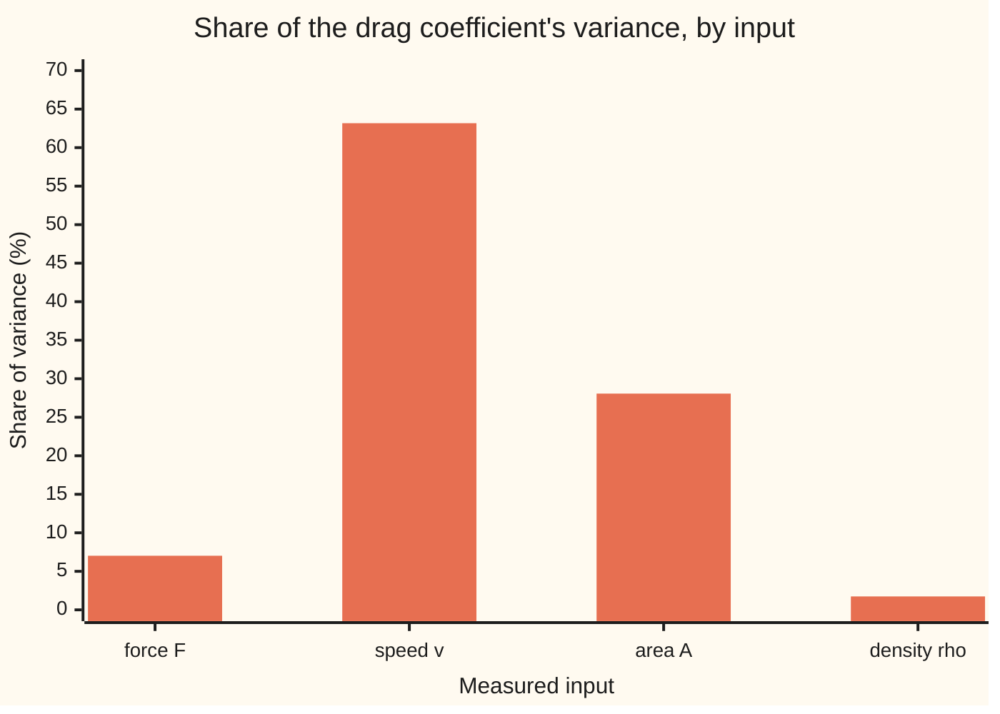
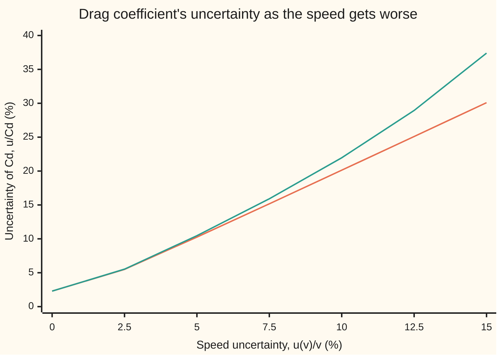

# Error propagation: measurement slop in the inputs becomes slop in the answer

Engineering mathematics → Units and Modelling → Uncertainty budgets → Error propagation

---

## General Overview

A racing cyclist sits on a bike bolted to a balance in a full-size wind tunnel. Air blows at 12.00 m/s. The balance reads a drag force of 24.0 N. A photograph from the front gives the cyclist's frontal area, 0.400 m^2. The tunnel's barometer and thermometer give the air's density, 1.204 kg/m^3.

The team wants one number out of this: the drag coefficient, how slippery this rider's shape is, with no unit. It comes out at 0.692. A new skinsuit is worth buying only if it lowers that by a few hundredths. So the real question is how far 0.692 can be trusted.

Every reading is a little off. The balance is good to about 1 %, the speed to 1.5 %, the area to 2 %, the density to 0.5 %. Each of those bits of slop passes through the formula and lands in the answer, some magnified, some shrunk. **Error propagation** is the bookkeeping that follows them through. It gives the answer's own uncertainty, 0.026, and says which reading to improve first. Here that is the speed, although its 1.5 % is not the largest input error: the formula squares the speed, and squaring doubles its slop.

**Each input's error moves the answer by that error times the answer's slope with respect to that input; independent moves add like the sides of a right-angled triangle, so the answer's uncertainty is the square root of the sum of their squares, and the biggest square is the input to fix.**

**What kind of fact this is:** a method, built on a first-order approximation: exact for a formula that is a straight line in its inputs, and close for any smooth formula when the input errors are small; its error is measured on this card by simulation.

### The picture: where the answer's uncertainty comes from



One bar per reading. The speed's bar is 63.17 % of the total; the area's is 28.07 %. Together they are over nine tenths of the answer's uncertainty. A better balance would buy almost nothing.

---

## The formula

Notation first, in words. A measured input is $x_i$, with $i$ counting the inputs; here there are four. Its **standard uncertainty**, $u(x_i)$, is its likely error written as one standard deviation, in the input's own unit. The answer is $y = f(x_1, \dots, x_4)$. The slope of $f$ along one input with the others held still is the partial derivative $\partial f/\partial x_i$; engineers call it the **sensitivity coefficient**, $c_i$. The **law of propagation of uncertainty**, for independent inputs, is

$$u(y)^2 = \sum_i c_i^2\, u(x_i)^2, \qquad c_i = \frac{\partial f}{\partial x_i}$$

**Read it aloud:** the answer's squared uncertainty is the sum, over the inputs, of each slope squared times that input's squared uncertainty.

Each product $c_i\,u(x_i)$ is one input's **term**: how far that input alone would push the answer. The square of a term over $u(y)^2$ is that input's **share**. A table of terms and shares is an **uncertainty budget**.

The drag coefficient is

$$C_d = \frac{2F}{\rho\, v^2 A}$$

**Read it aloud:** the drag coefficient is twice the force, divided by the air's density times the speed squared times the frontal area.

Reminder from [si-units-and-dimensional-homogeneity](01-si-units-and-dimensional-homogeneity.md): square brackets give a quantity's dimensions, [M] mass, [L] length, [T] time. Force is [M L T^-2]; the bottom is [M L^-3][L^2 T^-2][L^2], also [M L T^-2]. So $C_d$ has no unit, which is why it is the number a rider's shape is judged by; [dimensional-analysis-and-buckingham-pi](02-dimensional-analysis-and-buckingham-pi.md) shows why such a group must exist.

A formula that is a product of powers has a shortcut. If $y = k\,x_1^{n_1} x_2^{n_2}\cdots$, with $k$ a fixed number, then

$$\left(\frac{u(y)}{y}\right)^2 = \sum_i n_i^2 \left(\frac{u(x_i)}{x_i}\right)^2$$

**Read it aloud:** in percentages, each input's error is multiplied by its power, and the multiplied percentages add in squares.

For $C_d$ the powers are $+1$ on $F$, $-2$ on $v$, $-1$ on $A$ and $-1$ on $\rho$. The minus signs vanish when squared. The 2 on the speed does not: it doubles the speed's 1.5 % into 3 %.

| Symbol | Plain meaning | In our example | Push it up and the answer… |
| --- | --- | --- | --- |
| $F$ | drag force read by the balance | 24.0 N, u = 0.24 N | $C_d$ rises in proportion |
| $v$ | air speed in the tunnel | 12.00 m/s, u = 0.18 m/s | $C_d$ falls as one over its square |
| $A$ | frontal area, from a photograph | 0.400 m^2, u = 0.008 m^2 | $C_d$ falls in proportion |
| $\rho$ | air density (rho) | 1.204 kg/m^3, u = 0.006 kg/m^3 | $C_d$ falls in proportion |
| $C_d$ | drag coefficient, no unit | 0.692137 | — |
| $x_i$, $i$ | the i-th measured input, and the counter i | $F$, $v$, $A$, $\rho$ | — |
| $u(x_i)$, $u(y)$ | standard uncertainty, one standard deviation, of an input and of the answer | 0.18 m/s for speed; 0.026126 for $C_d$ | $u(y)$ grows |
| $y$, $f$ | the answer, and the formula that makes it | $C_d$ and $2F/(\rho v^2 A)$ | — |
| $c_i$ | sensitivity coefficient: the partial derivative of $f$ by $x_i$ | −0.115356 per m/s for speed | that input's term grows |
| $\delta_i$, $\delta y$ | an input's actual error, and the answer's | a speed 0.18 m/s high moves $C_d$ by −0.020764 | — |
| $\mathrm{Var}$, $E$ | variance, the average squared distance from the mean; expected value, the long-run average | $\mathrm{Var}(\delta y)$ is $u(C_d)^2$ | — |
| $H_{ij}$, $R$ | second partial derivatives of $f$; the leftover third-order remainder | $H_{vv} = 6C_d/v^2$ | the average result drifts |
| $n_i$, $k$ | the power on each input, and the fixed factor in front | −2 on speed; $k$ = 2 | a bigger power magnifies that input |

### When it holds

- **Small errors.** The law keeps only the tangent-plane part of the formula. At 1.5 % on the speed the simulated spread is 0.026185 against the law's 0.026126; at 15 % the law says 30.09 % and the simulation gives 37.40 %, chart below.
- **Independent inputs.** If two readings share a cause, their errors move together and a cross term $2c_ic_j$ times their covariance belongs in the sum. Dropping it can err either way.
- **A slope that is not zero.** At a minimum or a kink of $f$ the slope is zero or undefined, and the first-order law reports no uncertainty when there is some.
- **Like with like.** Every $u(x_i)$ must be one standard deviation. A maker's "±2 %" tolerance is often a limit, not a standard deviation. If every value inside ±a is equally likely, the standard deviation is a/√3.
- **The formula itself is right.** The law spreads measurement error only. A tunnel's blockage correction left out shifts every result the same way, and no budget of reading errors sees it.



The lower line is the first-order law. The upper line is 200,000 simulated rigs per point. They agree to about 5 % speed error and part beyond it, because one over the speed squared bends upward and the tangent line does not.

---

## Why it works

### Step 0: near the true values, every smooth formula is flat

A 1.5 % error in the speed is a small step. Over a small step a curved formula is nearly its tangent: a straight line in one input, a flat plane in several. A straight line turns a spread into a spread, scaled by the slope. That is the whole method. The rest is the arithmetic of adding several scaled spreads.

### Step 1: each error moves the answer by slope times error

Write each reading as its true value plus an error, $x_i + \delta_i$. The multivariable chain rule ([multivariable-chain-rule-and-jacobians](../../06-Calculus%20and%20analysis/07-Several%20Variables/04-multivariable-chain-rule-and-jacobians.md)) gives the first-order change in the answer:

$$\delta y \approx \sum_i c_i\, \delta_i$$

A speed reading 0.18 m/s high, alone, moves $C_d$ by −0.115356 × 0.18 = −0.020764. The minus sign says faster air makes the same force look slipperier.

### Step 2: independent errors add in squares

Each $\delta_i$ is random, with standard deviation $u(x_i)$. The variance of a constant times a random quantity is the constant squared times its variance. The variance of a sum of independent quantities is the sum of their variances ([variance-and-standard-deviation](../../09-Probability%20and%20statistics/02-Random%20Variables/03-variance-and-standard-deviation.md)). Together:

$$\mathrm{Var}(\delta y) = \sum_i c_i^2\, u(x_i)^2$$

Taking the square root gives the law. The terms add like perpendicular sides: the four terms 1.00 %, 3.00 %, 2.00 % and 0.498 % give 3.775 %, not 6.498 %, because independent errors rarely all go the same way at full size.

<details>
<summary>Detailed proof, with the error of the approximation</summary>

Let the input errors $\delta_i$ be independent with mean 0 and variances $u(x_i)^2$. Taylor's theorem in several variables gives
$$f(x + \delta) = f(x) + \sum_i c_i \delta_i + \tfrac12 \sum_{i,j} H_{ij}\, \delta_i \delta_j + R,$$
where $H_{ij}$ are the second partial derivatives at $x$ and $R$ is of third order in the δ's.

**Spread.** The linear part has variance $\sum_i c_i^2 u(x_i)^2$: expand $E[(\sum_i c_i\delta_i)^2]$, and every cross term $E[\delta_i\delta_j]$ with $i \ne j$ is $E[\delta_i]E[\delta_j] = 0$ by independence. For symmetric errors such as normal ones, the quadratic part adds only terms of fourth order in the u's, which is why the law is first-order.

**Centre.** The linear part has mean 0, but the quadratic part does not: its mean is $\tfrac12 \sum_i H_{ii} u(x_i)^2$. The answer's average sits above or below $f(x)$ by about that much. For $C_d$, $H_{vv} = 6C_d/v^2$, $H_{AA} = 2C_d/A^2$, $H_{\rho\rho} = 2C_d/\rho^2$ and $H_{FF} = 0$. The second-order mean is 0.692899; the simulation's mean is 0.692955, with standard error 0.000059. Both sit above 0.692137.

**When the expansion stops working.** The remainder $R$ is small only when every $\delta_i$ is small next to the distance over which the second derivatives change. For one over the speed squared that distance is the speed itself, so errors of a few percent are fine and 15 % is not.

</details>

### Step 3: for a product of powers, work in percentages

Take $y = k\,x_1^{n_1}x_2^{n_2}\cdots$. Then $\partial y/\partial x_i = n_i\, y / x_i$. Divide the law by $y^2$ and each term becomes $n_i\,u(x_i)/x_i$: the power times the percentage error. The answer's percentage error depends only on the inputs' percentage errors and the powers, not on their sizes. That is why the budget below is a column of percentages.

### Step 4: the budget ranks the inputs

Each term squared, over the total, is the fraction of the answer's variance that input causes. Halving the input with the biggest share does the most good. Halving one with a tiny share does almost nothing: the sum of squares lets the big term rule.

The probability wing proves the same linearisation as a limit theorem for a function of an average ([delta-method-and-slutsky](../../09-Probability%20and%20statistics/06-Limit%20Theorems%20in%20Practice/05-delta-method-and-slutsky.md)); this card is the engineer's budget built on it. Where a partial derivative is awkward to find by hand, a central difference finds it from the formula alone ([numerical-derivatives-and-sensitivity](../../06-Calculus%20and%20analysis/03-What%20Derivatives%20Tell%20You/08-numerical-derivatives-and-sensitivity.md)), and the code does both.

---

## Worked numbers, by hand

| Step | Arithmetic | Value |
| --- | --- | --- |
| top of the formula | 2 × 24.0 N | 48.000 N |
| bottom | 1.204 × 12.00^2 × 0.400 | 69.3504 N |
| drag coefficient | 48.000 / 69.3504 | **0.692137** |
| force, power 1 | 1 × 0.24/24.0 | 1.00 % |
| speed, power −2 | 2 × 0.18/12.00 | 3.00 % |
| area, power −1 | 1 × 0.008/0.400 | 2.00 % |
| density, power −1 | 1 × 0.006/1.204 | 0.50 % |
| squares, added | 1.0000 + 9.0000 + 4.0000 + 0.2483 | 14.2483 %^2 |
| square root | √14.2483 | 3.775 % |
| answer's uncertainty | 3.775 % of 0.692137 | **0.026126** |
| shares | 9.0000/14.2483 for speed, and so on | 63.17 %, 28.07 %, 7.02 %, 1.74 % |

The rider's drag coefficient is 0.692 with a standard uncertainty of 0.026. Doubled, as test reports usually quote it for roughly 95 % confidence, the band runs from 0.639885 to 0.744390. A skinsuit that saves a few hundredths sits inside that band, so two separate absolute results cannot show it; a back-to-back comparison, where shared errors cancel, can.

### What breaks if you drop a piece

| Mistake | Comes out at | What went wrong |
| --- | --- | --- |
| Add the four terms straight, no squares | 0.044977 (6.498 %) | Assumes every error hits its worst at once, in the same direction. |
| Forget the power 2 on the speed | 0.018953 (2.738 %) | Treats the squared speed as if it entered once; the dominant term is halved. |
| Push every input to its one-u worst corner | 0.046761 | The same over-statement as straight addition, in disguise. |
| Use first order at 15 % speed error | 30.087 % (simulated: 37.405 %) | The tangent plane is far from the curve; the mean also drifts to 0.745178. |

---

## Code, from first principles, and it actually runs

The code computes $C_d$ and its uncertainty by four roads. Road 1 uses the partial derivatives worked by hand. Road 2 finds them again by central differences from the formula alone. Road 3 uses the exponent rule in percentages. Road 4 builds 200,000 simulated rigs, each with fresh normal errors on all four readings, from a SplitMix64 generator (a small random-number generator) and the Box–Muller transform (a rule turning two uniform random numbers into a normal one), both written out, and measures the spread and mean of the results. It then prints the what-breaks numbers, the upgrade options and the chart points. The two languages print the same bytes.

### Python

```python
# Error propagation and sensitivity -- the check behind the card.  Standard library only.
# A cyclist in a full-size wind tunnel: drag coefficient Cd = 2F / (rho v^2 A) from a
# measured force F, air speed v, frontal area A and air density rho, each with a
# standard uncertainty.  Road 1: partial derivatives by hand.  Road 2: partial
# derivatives by central differences, from the formula alone.  Road 3: the
# exponent rule for a product of powers.  Road 4: a Monte Carlo of 200,000 rigs,
# normal errors from a SplitMix64 generator and Box-Muller, written out here.
from math import sqrt, log, cos, pi

def cd(F, v, A, rho): return 2.0 * F / (rho * v * v * A)

X = [24.0, 12.0, 0.400, 1.204]            # F in N, v in m/s, A in m^2, rho in kg/m^3
U = [0.24, 0.18, 0.008, 0.006]            # standard uncertainties, same units
NAMES = ["F", "v", "A", "rho"]
UNITS = ["N", "m/s", "m^2", "kg/m^3"]                # partials are per this unit
EXPO = [1, -2, -1, -1]                    # Cd = 2 F^1 v^-2 A^-1 rho^-1
M64 = (1 << 64) - 1

class SplitMix64:
    def __init__(self, seed): self.s = seed
    def next(self):
        self.s = (self.s + 0x9E3779B97F4A7C15) & M64
        z = self.s
        z = ((z ^ (z >> 30)) * 0xBF58476D1CE4E5B9) & M64
        z = ((z ^ (z >> 27)) * 0x94D049BB133111EB) & M64
        return z ^ (z >> 31)
    def unif(self): return ((self.next() >> 11) + 1) / 9007199254740992.0   # in (0, 1]
    def normal(self):                                                     # Box-Muller, cosine half
        return sqrt(-2.0 * log(self.unif())) * cos(2.0 * pi * self.unif())

def monte_carlo(u, n, seed):
    g = SplitMix64(seed); s1 = s2 = 0.0
    for _ in range(n):
        y = cd(*[X[i] + u[i] * g.normal() for i in range(4)])
        s1 += y; s2 += y * y
    mean = s1 / n
    return mean, sqrt((s2 - n * mean * mean) / (n - 1))

c0 = cd(*X)
# road 1: partial derivatives worked by hand
d1 = [2.0 / (X[3] * X[1] ** 2 * X[2]), -4.0 * X[0] / (X[3] * X[1] ** 3 * X[2]),
      -2.0 * X[0] / (X[3] * X[1] ** 2 * X[2] ** 2), -2.0 * X[0] / (X[3] ** 2 * X[1] ** 2 * X[2])]
# road 2: central differences, step one millionth of each input
d2 = []
for i in range(4):
    h = X[i] * 1e-6; up = X[:]; dn = X[:]; up[i] += h; dn[i] -= h
    d2.append((cd(*up) - cd(*dn)) / (2.0 * h))
terms = [abs(d1[i]) * U[i] for i in range(4)]
u_quad = sqrt(sum(t * t for t in terms))
u_num = sqrt(sum((d2[i] * U[i]) ** 2 for i in range(4)))
rel = [U[i] / X[i] for i in range(4)]
u_rel = sqrt(sum((EXPO[i] * rel[i]) ** 2 for i in range(4)))      # road 3, as a fraction of Cd
share = [100.0 * t * t / u_quad ** 2 for t in terms]
# second-order mean: Cd + 1/2 sum of (second partial) u^2; second partials by hand
d2nd = [0.0, 6.0 * c0 / X[1] ** 2, 2.0 * c0 / X[2] ** 2, 2.0 * c0 / X[3] ** 2]
mean2 = c0 + 0.5 * sum(d2nd[i] * U[i] ** 2 for i in range(4))
N = 200000
mc_mean, mc_sd = monte_carlo(U, N, 20260930)

print(f"Cd = 2F/(rho v^2 A)                 {c0:10.6f}")
print(f"by hand: 2F = {2*X[0]:.3f} N, rho v^2 A = {X[3]*X[1]**2*X[2]:.4f} N")
print("input   value      u        u/value   partial dCd/dx  by differences  exponent  unit of x")
for i in range(4):
    print(f"{NAMES[i]:<6}{X[i]:8.3f}{U[i]:9.4f}{100*rel[i]:9.2f} %{d1[i]:15.6f}{d2[i]:16.6f}{EXPO[i]:8d}  {UNITS[i]}")
print("budget  term |dCd/dx| u   rel term   squared, %^2   share of variance")
for i in range(4):
    print(f"{NAMES[i]:<6}{terms[i]:12.6f}{100*abs(EXPO[i])*rel[i]:11.2f} %{(100*EXPO[i]*rel[i])**2:14.4f}{share[i]:12.2f} %")
print(f"sum of squared rel terms, %^2       {sum((100*EXPO[i]*rel[i])**2 for i in range(4)):10.4f}")
print(f"u(Cd) road 1, hand partials         {u_quad:10.6f}")
print(f"u(Cd) road 2, central differences   {u_num:10.6f}")
print(f"u(Cd) road 3, exponent rule         {u_rel * c0:10.6f}   = {100*u_rel:.3f} % of Cd")
print(f"95% band, Cd +- 2u                  {c0 - 2*u_quad:10.6f} to {c0 + 2*u_quad:.6f}")
print(f"road 4, Monte Carlo {N} rigs, seed 20260930")
print(f"  sd of Cd                          {mc_sd:10.6f}   standard error {mc_sd/sqrt(2*N):.6f}")
print(f"  mean of Cd                        {mc_mean:10.6f}   standard error {mc_sd/sqrt(N):.6f}")
print(f"  second-order mean                 {mean2:10.6f}")

# what breaks, and what to buy
lin_sum = sum(terms)
no_square = c0 * sqrt(sum((rel[i] * (1 if i == 1 else abs(EXPO[i]))) ** 2 for i in range(4)))
def rel_with(r): return 100.0 * sqrt(sum((EXPO[i] * r[i]) ** 2 for i in range(4)))
print(f"wrong: add terms, no quadrature     {lin_sum:10.6f}   = {100*lin_sum/c0:.3f} %")
print(f"wrong: speed exponent 1, not 2      {no_square:10.6f}   = {100*no_square/c0:.3f} %")
print(f"wrong: worst corner, all inputs     {cd(X[0]+U[0], X[1]-U[1], X[2]-U[2], X[3]-U[3]) - c0:10.6f}")
print(f"buy: load cell 0.1 %                {rel_with([0.001, rel[1], rel[2], rel[3]]):10.3f} %")
print(f"buy: speed 0.5 %                    {rel_with([rel[0], 0.005, rel[2], rel[3]]):10.3f} %")
print(f"buy: area 1.0 %                     {rel_with([rel[0], rel[1], 0.010, rel[3]]):10.3f} %")
# far from small: the same sweep up to a hand-held anemometer, speed uncertainty 15 %
steps = [0.0, 2.5, 5.0, 7.5, 10.0, 12.5, 15.0]
fo, sim = [], []
for p in steps:
    fo.append(rel_with([rel[0], p / 100.0, rel[2], rel[3]]))
    far_mean, far_sd = monte_carlo([U[0], p / 100.0 * X[1], U[2], U[3]], N, 20260930)
    sim.append(100.0 * far_sd / c0)
far_mean2 = c0 + 0.5 * (d2nd[1] * (0.15 * X[1]) ** 2 + d2nd[2] * U[2] ** 2 + d2nd[3] * U[3] ** 2)
print(f"far: u(v) = 15 %, first order       {fo[-1]:10.3f} %")
print(f"far: Monte Carlo sd                 {sim[-1]:10.3f} %   mean {far_mean:.6f}")
print(f"far: second-order mean              {far_mean2:10.6f}")
print("chart, u(v) %       " + " ".join(f"{p:6.1f}" for p in steps))
print("chart, first order %" + " ".join(f"{p:6.2f}" for p in fo))
print("chart, simulated %  " + " ".join(f"{p:6.2f}" for p in sim))
print("chart, shares %     " + " ".join(f"{s:6.2f}" for s in share))

for i in range(4):
    assert abs(d1[i] - d2[i]) < 1e-6 * abs(d1[i]), "hand partial vs central difference"
assert abs(u_quad - u_rel * c0) < 1e-12, "hand partials vs exponent rule"
assert abs(u_num - u_quad) < 1e-8, "central differences vs hand partials"
assert abs(mc_sd - u_quad) < 0.01 * u_quad, "simulated spread vs first-order u, within 1 %"
assert abs(mc_mean - mean2) < 4.0 * mc_sd / sqrt(N), "simulated mean vs second-order mean"
assert max(range(4), key=lambda i: share[i]) == 1, "speed dominates the budget"
assert sim[-1] > 1.05 * fo[-1], "first order fails far out"
print("ALL CHECKS PASS")
```

**Ran 2026-10-06 on macOS, Python 3.14.6, standard library only. All checks passed. Output, pasted from the run:**

```
Cd = 2F/(rho v^2 A)                   0.692137
by hand: 2F = 48.000 N, rho v^2 A = 69.3504 N
input   value      u        u/value   partial dCd/dx  by differences  exponent  unit of x
F       24.000   0.2400     1.00 %       0.028839        0.028839       1  N
v       12.000   0.1800     1.50 %      -0.115356       -0.115356      -2  m/s
A        0.400   0.0080     2.00 %      -1.730343       -1.730343      -1  m^2
rho      1.204   0.0060     0.50 %      -0.574865       -0.574865      -1  kg/m^3
budget  term |dCd/dx| u   rel term   squared, %^2   share of variance
F         0.006921       1.00 %        1.0000        7.02 %
v         0.020764       3.00 %        9.0000       63.17 %
A         0.013843       2.00 %        4.0000       28.07 %
rho       0.003449       0.50 %        0.2483        1.74 %
sum of squared rel terms, %^2          14.2483
u(Cd) road 1, hand partials           0.026126
u(Cd) road 2, central differences     0.026126
u(Cd) road 3, exponent rule           0.026126   = 3.775 % of Cd
95% band, Cd +- 2u                    0.639885 to 0.744390
road 4, Monte Carlo 200000 rigs, seed 20260930
  sd of Cd                            0.026185   standard error 0.000041
  mean of Cd                          0.692955   standard error 0.000059
  second-order mean                   0.692899
wrong: add terms, no quadrature       0.044977   = 6.498 %
wrong: speed exponent 1, not 2        0.018953   = 2.738 %
wrong: worst corner, all inputs       0.046761
buy: load cell 0.1 %                     3.641 %
buy: speed 0.5 %                         2.500 %
buy: area 1.0 %                          3.354 %
far: u(v) = 15 %, first order           30.087 %
far: Monte Carlo sd                     37.405 %   mean 0.745178
far: second-order mean                0.739151
chart, u(v) %          0.0    2.5    5.0    7.5   10.0   12.5   15.0
chart, first order %  2.29   5.50  10.26  15.17  20.13  25.10  30.09
chart, simulated %    2.29   5.53  10.47  15.91  21.96  28.94  37.40
chart, shares %       7.02  63.17  28.07   1.74
ALL CHECKS PASS
```

### Rust

```rust
// Error propagation and sensitivity -- the same check in Rust, std only, no crates.
// Cd = 2F / (rho v^2 A) for a cyclist in a full-size wind tunnel.  Road 1: hand
// partial derivatives.  Road 2: central differences.  Road 3: the exponent rule.
// Road 4: a Monte Carlo of 200,000 rigs, SplitMix64 and Box-Muller written out.
// Compile: rustc --edition 2021 -O error_propagation_and_sensitivity_check.rs -o /tmp/<dir>/chk
use std::f64::consts::PI;

const X: [f64; 4] = [24.0, 12.0, 0.400, 1.204]; // F in N, v in m/s, A in m^2, rho in kg/m^3
const U: [f64; 4] = [0.24, 0.18, 0.008, 0.006]; // standard uncertainties, same units
const NAMES: [&str; 4] = ["F", "v", "A", "rho"];
const UNITS: [&str; 4] = ["N", "m/s", "m^2", "kg/m^3"]; // partials are per this unit
const EXPO: [i32; 4] = [1, -2, -1, -1]; // Cd = 2 F^1 v^-2 A^-1 rho^-1

fn cd(x: &[f64; 4]) -> f64 { 2.0 * x[0] / (x[3] * x[1] * x[1] * x[2]) }

struct SplitMix64 { s: u64 }
impl SplitMix64 {
    fn next(&mut self) -> u64 {
        self.s = self.s.wrapping_add(0x9E3779B97F4A7C15);
        let mut z = self.s;
        z = (z ^ (z >> 30)).wrapping_mul(0xBF58476D1CE4E5B9);
        z = (z ^ (z >> 27)).wrapping_mul(0x94D049BB133111EB);
        z ^ (z >> 31)
    }
    fn unif(&mut self) -> f64 { ((self.next() >> 11) + 1) as f64 / 9007199254740992.0 } // in (0, 1]
    fn normal(&mut self) -> f64 { // Box-Muller, cosine half
        let r = (-2.0 * self.unif().ln()).sqrt();
        r * (2.0 * PI * self.unif()).cos()
    }
}

fn monte_carlo(u: &[f64; 4], n: usize, seed: u64) -> (f64, f64) {
    let mut g = SplitMix64 { s: seed };
    let (mut s1, mut s2) = (0.0, 0.0);
    for _ in 0..n {
        let mut x = [0.0; 4];
        for i in 0..4 { x[i] = X[i] + u[i] * g.normal(); }
        let y = cd(&x);
        s1 += y; s2 += y * y;
    }
    let mean = s1 / n as f64;
    (mean, ((s2 - n as f64 * mean * mean) / (n as f64 - 1.0)).sqrt())
}

fn rel_with(r: &[f64; 4]) -> f64 {
    100.0 * (0..4).map(|i| (EXPO[i] as f64 * r[i]).powi(2)).sum::<f64>().sqrt()
}

fn main() {
    let c0 = cd(&X);
    // road 1: partial derivatives worked by hand
    let d1 = [2.0 / (X[3] * X[1].powi(2) * X[2]), -4.0 * X[0] / (X[3] * X[1].powi(3) * X[2]),
              -2.0 * X[0] / (X[3] * X[1].powi(2) * X[2].powi(2)), -2.0 * X[0] / (X[3].powi(2) * X[1].powi(2) * X[2])];
    // road 2: central differences, step one millionth of each input
    let mut d2 = [0.0; 4];
    for i in 0..4 {
        let h = X[i] * 1e-6;
        let (mut up, mut dn) = (X, X);
        up[i] += h; dn[i] -= h;
        d2[i] = (cd(&up) - cd(&dn)) / (2.0 * h);
    }
    let terms: Vec<f64> = (0..4).map(|i| d1[i].abs() * U[i]).collect();
    let u_quad = terms.iter().map(|t| t * t).sum::<f64>().sqrt();
    let u_num = (0..4).map(|i| (d2[i] * U[i]).powi(2)).sum::<f64>().sqrt();
    let rel = [U[0] / X[0], U[1] / X[1], U[2] / X[2], U[3] / X[3]];
    let u_rel = (0..4).map(|i| (EXPO[i] as f64 * rel[i]).powi(2)).sum::<f64>().sqrt(); // road 3
    let share: Vec<f64> = terms.iter().map(|t| 100.0 * t * t / u_quad.powi(2)).collect();
    // second-order mean: Cd + 1/2 sum of (second partial) u^2; second partials by hand
    let d2nd = [0.0, 6.0 * c0 / X[1].powi(2), 2.0 * c0 / X[2].powi(2), 2.0 * c0 / X[3].powi(2)];
    let mean2 = c0 + 0.5 * (0..4).map(|i| d2nd[i] * U[i].powi(2)).sum::<f64>();
    let n = 200000usize;
    let (mc_mean, mc_sd) = monte_carlo(&U, n, 20260930);

    println!("Cd = 2F/(rho v^2 A)                 {:10.6}", c0);
    println!("by hand: 2F = {:.3} N, rho v^2 A = {:.4} N", 2.0 * X[0], X[3] * X[1].powi(2) * X[2]);
    println!("input   value      u        u/value   partial dCd/dx  by differences  exponent  unit of x");
    for i in 0..4 {
        println!("{:<6}{:8.3}{:9.4}{:9.2} %{:15.6}{:16.6}{:8}  {}", NAMES[i], X[i], U[i], 100.0 * rel[i], d1[i], d2[i], EXPO[i], UNITS[i]);
    }
    println!("budget  term |dCd/dx| u   rel term   squared, %^2   share of variance");
    for i in 0..4 {
        let r = 100.0 * EXPO[i].abs() as f64 * rel[i];
        println!("{:<6}{:12.6}{:11.2} %{:14.4}{:12.2} %", NAMES[i], terms[i], r, r * r, share[i]);
    }
    println!("sum of squared rel terms, %^2       {:10.4}", (0..4).map(|i| (100.0 * EXPO[i] as f64 * rel[i]).powi(2)).sum::<f64>());
    println!("u(Cd) road 1, hand partials         {:10.6}", u_quad);
    println!("u(Cd) road 2, central differences   {:10.6}", u_num);
    println!("u(Cd) road 3, exponent rule         {:10.6}   = {:.3} % of Cd", u_rel * c0, 100.0 * u_rel);
    println!("95% band, Cd +- 2u                  {:10.6} to {:.6}", c0 - 2.0 * u_quad, c0 + 2.0 * u_quad);
    println!("road 4, Monte Carlo {} rigs, seed 20260930", n);
    println!("  sd of Cd                          {:10.6}   standard error {:.6}", mc_sd, mc_sd / (2.0 * n as f64).sqrt());
    println!("  mean of Cd                        {:10.6}   standard error {:.6}", mc_mean, mc_sd / (n as f64).sqrt());
    println!("  second-order mean                 {:10.6}", mean2);

    // what breaks, and what to buy
    let lin_sum: f64 = terms.iter().sum();
    let no_square = c0 * (0..4).map(|i| (rel[i] * if i == 1 { 1.0 } else { EXPO[i].abs() as f64 }).powi(2)).sum::<f64>().sqrt();
    let corner = cd(&[X[0] + U[0], X[1] - U[1], X[2] - U[2], X[3] - U[3]]) - c0;
    println!("wrong: add terms, no quadrature     {:10.6}   = {:.3} %", lin_sum, 100.0 * lin_sum / c0);
    println!("wrong: speed exponent 1, not 2      {:10.6}   = {:.3} %", no_square, 100.0 * no_square / c0);
    println!("wrong: worst corner, all inputs     {:10.6}", corner);
    println!("buy: load cell 0.1 %                {:10.3} %", rel_with(&[0.001, rel[1], rel[2], rel[3]]));
    println!("buy: speed 0.5 %                    {:10.3} %", rel_with(&[rel[0], 0.005, rel[2], rel[3]]));
    println!("buy: area 1.0 %                     {:10.3} %", rel_with(&[rel[0], rel[1], 0.010, rel[3]]));
    // far from small: the same sweep up to a hand-held anemometer, speed uncertainty 15 %
    let steps = [0.0, 2.5, 5.0, 7.5, 10.0, 12.5, 15.0];
    let (mut fo, mut sim) = (Vec::new(), Vec::new());
    let mut far_mean = 0.0;
    for p in steps {
        fo.push(rel_with(&[rel[0], p / 100.0, rel[2], rel[3]]));
        let (m, s) = monte_carlo(&[U[0], p / 100.0 * X[1], U[2], U[3]], n, 20260930);
        far_mean = m;
        sim.push(100.0 * s / c0);
    }
    let far_mean2 = c0 + 0.5 * (d2nd[1] * (0.15 * X[1]).powi(2) + d2nd[2] * U[2].powi(2) + d2nd[3] * U[3].powi(2));
    println!("far: u(v) = 15 %, first order       {:10.3} %", fo[6]);
    println!("far: Monte Carlo sd                 {:10.3} %   mean {:.6}", sim[6], far_mean);
    println!("far: second-order mean              {:10.6}", far_mean2);
    let row = |v: &[f64], prec: usize| v.iter().map(|x| format!("{:6.*}", prec, x)).collect::<Vec<_>>().join(" ");
    println!("chart, u(v) %       {}", row(&steps, 1));
    println!("chart, first order %{}", row(&fo, 2));
    println!("chart, simulated %  {}", row(&sim, 2));
    println!("chart, shares %     {}", row(&share, 2));

    for i in 0..4 { assert!((d1[i] - d2[i]).abs() < 1e-6 * d1[i].abs(), "hand partial vs central difference"); }
    assert!((u_quad - u_rel * c0).abs() < 1e-12, "hand partials vs exponent rule");
    assert!((u_num - u_quad).abs() < 1e-8, "central differences vs hand partials");
    assert!((mc_sd - u_quad).abs() < 0.01 * u_quad, "simulated spread vs first-order u, within 1 %");
    assert!((mc_mean - mean2).abs() < 4.0 * mc_sd / (n as f64).sqrt(), "simulated mean vs second-order mean");
    let top = (0..4).fold(0, |b, i| if share[i] > share[b] { i } else { b });
    assert!(top == 1, "speed dominates the budget");
    assert!(sim[6] > 1.05 * fo[6], "first order fails far out");
    println!("ALL CHECKS PASS");
}
```

**Ran 2026-10-06 on macOS, rustc 1.98.1, no crates. All checks passed. Output, pasted from the run:**

```
Cd = 2F/(rho v^2 A)                   0.692137
by hand: 2F = 48.000 N, rho v^2 A = 69.3504 N
input   value      u        u/value   partial dCd/dx  by differences  exponent  unit of x
F       24.000   0.2400     1.00 %       0.028839        0.028839       1  N
v       12.000   0.1800     1.50 %      -0.115356       -0.115356      -2  m/s
A        0.400   0.0080     2.00 %      -1.730343       -1.730343      -1  m^2
rho      1.204   0.0060     0.50 %      -0.574865       -0.574865      -1  kg/m^3
budget  term |dCd/dx| u   rel term   squared, %^2   share of variance
F         0.006921       1.00 %        1.0000        7.02 %
v         0.020764       3.00 %        9.0000       63.17 %
A         0.013843       2.00 %        4.0000       28.07 %
rho       0.003449       0.50 %        0.2483        1.74 %
sum of squared rel terms, %^2          14.2483
u(Cd) road 1, hand partials           0.026126
u(Cd) road 2, central differences     0.026126
u(Cd) road 3, exponent rule           0.026126   = 3.775 % of Cd
95% band, Cd +- 2u                    0.639885 to 0.744390
road 4, Monte Carlo 200000 rigs, seed 20260930
  sd of Cd                            0.026185   standard error 0.000041
  mean of Cd                          0.692955   standard error 0.000059
  second-order mean                   0.692899
wrong: add terms, no quadrature       0.044977   = 6.498 %
wrong: speed exponent 1, not 2        0.018953   = 2.738 %
wrong: worst corner, all inputs       0.046761
buy: load cell 0.1 %                     3.641 %
buy: speed 0.5 %                         2.500 %
buy: area 1.0 %                          3.354 %
far: u(v) = 15 %, first order           30.087 %
far: Monte Carlo sd                     37.405 %   mean 0.745178
far: second-order mean                0.739151
chart, u(v) %          0.0    2.5    5.0    7.5   10.0   12.5   15.0
chart, first order %  2.29   5.50  10.26  15.17  20.13  25.10  30.09
chart, simulated %    2.29   5.53  10.47  15.91  21.96  28.94  37.40
chart, shares %       7.02  63.17  28.07   1.74
ALL CHECKS PASS
```

The first three roads agree to six decimals on $u(C_d)$ = 0.026126, and the fourth, the simulated spread, 0.026185, sits slightly above it: the small upward bend of one over speed squared. The simulated mean, 0.692955, matches the second-order mean, 0.692899, to within its standard error, 0.000059.

> [!TIP]
> **Try changing**
> - **Buy a better balance.** Guess first: does a 0.1 % load cell help much? Set the force uncertainty to 0.1 %. The total falls from 3.775 % to only **3.641 %**, because force had 7.02 % of the variance.
> - **Buy a better speed probe.** Guess first. Set the speed uncertainty to 0.5 %. The total falls to **2.500 %**: the dominant term shrinks from 3 % to 1 %.
> - **Measure the area better.** Guess first. Set the area uncertainty to 1.0 %. The total is **3.354 %**: better than the balance, worse than the speed probe.
> - **Use a hand-held anemometer.** Guess first. Set the speed uncertainty to 15 %. First order says **30.087 %**; the simulation says **37.405 %**, and the average result drifts to **0.745178**.

---

## The usual mistake

> [!warning]
> **Ranking the inputs by their own percentage errors.** The area's 2 % looks like the weak point. But the formula squares the speed, so its 1.5 % enters as 3 %, and the squares make that 9.0000 against the area's 4.0000. Rank by power times percentage, never by percentage alone.
>
> - **Adding errors straight.** 1 + 3 + 2 + 0.498 gives 6.498 %, against the true 3.775 %. Straight addition is a worst case, and quoting it as an uncertainty makes a good rig look bad.
> - **Treating shared causes as independent.** Comparing two skinsuits in one session, both runs share the same area photograph and air density, so those errors cancel in the difference. Using the full 3.775 % on each run and adding them hides a real gain.
> - **Mixing limits with standard deviations.** A tolerance of ±1 % quoted as a hard limit is not the same as a standard deviation of 1 %, and the law needs the latter for every input.
> - **Trusting first order far out.** At 15 % on the speed the law reports 30.087 % where a simulation gives about 37.4 %, and the answer's average moves too. Strictly, a normal speed error can reach zero speed, so neither the spread nor the average has a finite exact value; the simulated figures describe the readings that actually turn up, and they shift a little with the seed.

---

## Where you meet it in real life

- **Wind-tunnel and test-rig reports.** Every quoted coefficient comes with an uncertainty budget like the one here, laid out the way the international guide below sets out.
- **Choosing instruments.** The budget says where money buys accuracy. Here a speed probe good to 0.5 % cuts the total from 3.775 % to 2.500 %, while a balance good to 0.1 % only reaches 3.641 %.
- **Scale-model testing.** A model run at a different speed and size, matched by Reynolds number, carries its own budget, and the scaling laws multiply its errors by their powers ([similarity-and-model-testing](04-similarity-and-model-testing.md)).
- **Calibration certificates.** A certificate's stated uncertainty is the output of this law applied to the calibration's own chain of readings.
- **Small corrections.** A second-order term that shifts the average is a perturbation in the small relative errors, the subject of [regular-perturbation](05-regular-perturbation.md).

> **Say it back**
> Each reading's error moves the answer by the slope times the error. Independent errors add in squares, so the answer's uncertainty is the square root of the sum of the squared terms. For a product of powers, work in percentages and multiply each by its power. The largest squared term is the input to improve. The law is first-order: good for small errors, wrong when the formula bends over the error's range.

---

## What this builds on

- [si-units-and-dimensional-homogeneity](01-si-units-and-dimensional-homogeneity.md): units on every reading, and the dimension check that makes $C_d$ unitless.
- [multivariable-chain-rule-and-jacobians](../../06-Calculus%20and%20analysis/07-Several%20Variables/04-multivariable-chain-rule-and-jacobians.md): how small changes in several inputs combine into one change in the answer.
- [variance-and-standard-deviation](../../09-Probability%20and%20statistics/02-Random%20Variables/03-variance-and-standard-deviation.md): why independent variances add, and what one standard deviation means.
- [numerical-derivatives-and-sensitivity](../../06-Calculus%20and%20analysis/03-What%20Derivatives%20Tell%20You/08-numerical-derivatives-and-sensitivity.md): the central difference that gives road 2 its slopes.
- [delta-method-and-slutsky](../../09-Probability%20and%20statistics/06-Limit%20Theorems%20in%20Practice/05-delta-method-and-slutsky.md): the same linearisation, proved as a limit theorem.

## Where this goes next

- conditioning-and-stability: the same sensitivity, turned on a computation, where the condition number says how much a problem magnifies relative errors in its data.

This card spreads measurement errors through one formula; the open question is how much any problem, solved by any algorithm, magnifies the errors it is fed, rounding included.

---

## Sources

Verified 2026-10-06: every link below resolves to the publisher's page.

- JCGM 100:2008. *Evaluation of measurement data — Guide to the expression of uncertainty in measurement* (GUM). BIPM. [doi:10.59161/JCGM100-2008E](https://doi.org/10.59161/JCGM100-2008E). The law of propagation of uncertainty, sensitivity coefficients, the budget, and the coverage factor of 2.
- JCGM 101:2008. *Supplement 1 to the GUM — Propagation of distributions using a Monte Carlo method*. BIPM. [doi:10.59161/JCGM101-2008](https://doi.org/10.59161/JCGM101-2008). The simulation road, and when it should replace the first-order law.
- Taylor, Barry N., and Chris E. Kuyatt. *Guidelines for Evaluating and Expressing the Uncertainty of NIST Measurement Results*. NIST Technical Note 1297, 1994. [NIST page](https://www.nist.gov/pml/nist-technical-note-1297). The GUM's method in short form, with the conversion from limits to standard deviations.
- Crouch, Timothy N., David Burton, Zach A. LaBry, and Kim B. Blair. "Riding against the wind: a review of competition cycling aerodynamics." *Sports Engineering* 20 (2017): 81–110. [doi:10.1007/s12283-017-0234-1](https://doi.org/10.1007/s12283-017-0234-1). How cyclists' drag is measured, the setting of this card's example.
