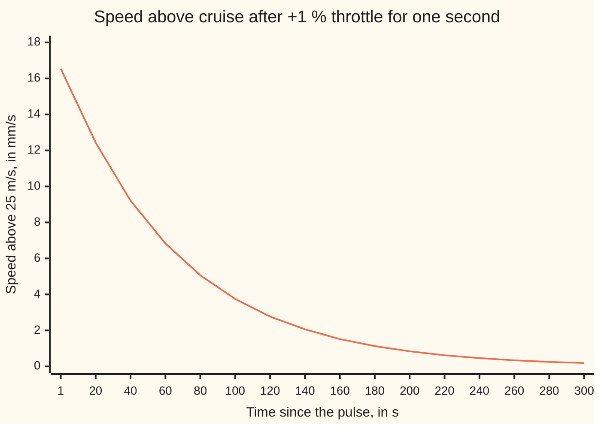
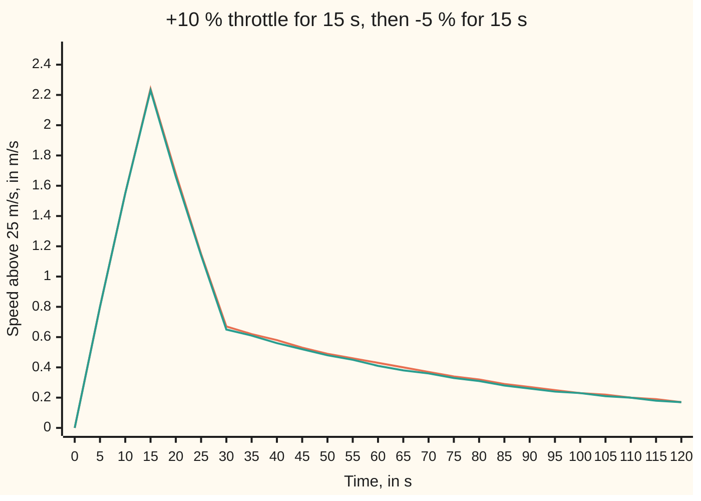
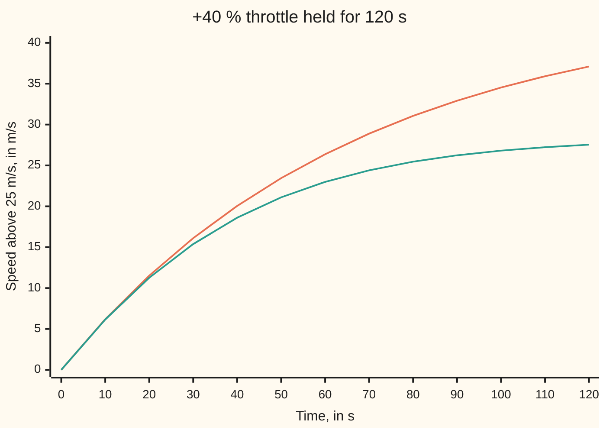

# Linear and time-invariant: superposition plus a fixed clock gives convolution

[Syllabus](../../../SYLLABUS.md) → [Engineering mathematics](../README.md) → [Linear Systems and Transforms](../README.md#s02) → Linear and time-invariant

---

## General Overview

A 1,500 kg car cruises on a flat motorway at 25 m/s with the throttle at 17.25 % open. An engineer is about to design its cruise control. First she needs a model of the car itself: given any history of throttle movements, what will the road speed do?

She could derive the physics. Instead she pokes the car. The throttle opens 1 % more for one second, then returns. The speed rises by 0.016542 m/s in that second, then fades back over several minutes: 10.71 mm/s above cruise after 30 s, 0.19 mm/s after 300 s. That record is the car's **pulse response**, the name used from here on. Its continuous-time cousin is the impulse response of [Convolution](../../08-Differential%20equations%20and%20dynamics/08-Laplace%20Transforms%20for%20Initial-Value%20Problems/07-convolution-and-the-impulse-response.md), where a linear equation was solved by exactly this kind of blend.

Two properties make the one record enough. **Linear**: twice the throttle move gives twice the speed change, and two moves together give the sum of their separate effects. **Time-invariant**: the same move made now or 40 s later gives the same response, only 40 s later. Grant both, and any throttle history can be cut into one-second pulses. Each pulse produces a scaled, delayed copy of the record, and the copies add. That adding is **convolution**. For an overtaking manoeuvre, +10 % for 15 s then −5 % for 15 s, it predicts 2.2386 m/s above cruise at 15 s, and the car agrees to within 0.0145 m/s all the way.

A real car is linear only near its cruise speed, and time-invariant only while nothing about it or its air changes. The card tests both and shows each failing.

**A system that is linear and time-invariant is completely described by its response to one short pulse: its output for any input is that input convolved with the pulse response.**

**What kind of fact this is:** a theorem, proved on this card in Why it works. Whether a real system is linear and time-invariant is a modelling claim settled by test; the car passes near 25 m/s and fails far from it.

### The picture: the car's pulse response



One line: the measured pulse response h, at 1 s and then every 20 s. At 0 s it is 0. It jumps to its peak of 16.54 mm/s in the first second, while the extra throttle pushes, then only fades as drag takes the extra speed back. Both checks print every point.

---

## The formula

Notation first, in words. Square brackets after a signal's name hold a whole-number time: u[n] is the throttle in second n. (Around a single capital, as in [T], the wing's square brackets mean a dimension; the two never meet.) A system S is a rule that takes a whole input record and returns a whole output record. The **unit pulse** δ[n] is 1 at n = 0 and 0 at every other n: the sampled form of the impulse in [Impulses](../../08-Differential%20equations%20and%20dynamics/08-Laplace%20Transforms%20for%20Initial-Value%20Problems/06-impulses-and-the-delta-function.md). A star between two records means convolution.

The two properties, as tests a system can pass or fail:

$$\text{linear:}\quad S(\alpha u_1 + \beta u_2) = \alpha\,S(u_1) + \beta\,S(u_2)$$

$$\text{time-invariant:}\quad \text{if } S(u) = y, \text{ then the input } u[n - n_0] \text{ gives the output } y[n - n_0]$$

**Read it aloud:** scaling and adding inputs scales and adds outputs; delaying the input delays the output and changes nothing else.

The theorem they give:

$$y[n] = (h * u)[n] = \sum_{k=0}^{n} h[k]\,u[n-k], \qquad h = S(\delta)$$

**Read it aloud:** the output now is a sum over every earlier second; the throttle applied k seconds ago is weighted by the pulse response at age k.

| Symbol | Plain meaning | In our example | Push it up and the answer… |
| --- | --- | --- | --- |
| $S$ | the system: whole input record in, whole output record out | the car, throttle record to speed record | — |
| $u[n]$, $\theta$ | throttle above its cruise setting through second n, in %; $\theta$ is the throttle itself | +10 % for 15 s, then −5 % for 15 s | the speed change grows in step, near cruise |
| $y[n]$, $v$ | speed above cruise at time n, in m/s; $v$ is the speed itself | 2.2386 m/s at n = 15 | — |
| $n$, $t$ | time in whole seconds; t is time in seconds when it runs continuously | 0 to 300 s | — |
| $k$, $j$ | in the formula, the age of a pulse: seconds since it was applied; Steps 0 to 3 and the proof use k for the second the pulse came and j = n − k for its age | 0 to n | h[k] fades with age |
| $N$ | in the proof, the last second of an input record that ends | 2, for the hand-worked record | — |
| $g(\lambda)$, $\lambda$ | the continuous-time impulse response, read at age λ, in s | the car's speed after an instant throttle kick | — |
| $h[k]$ | the pulse response: speed above cruise k seconds after +1 % for one second | 0.016542 m/s at k = 1, 10.71 mm/s at k = 30 | — |
| $\delta[n]$, $\delta_k$ | the unit pulse: 1 at n = 0, 0 elsewhere; $\delta_k$ is the same pulse moved to second k | +1 % in the first second | — |
| $\alpha$, $\beta$ | any two numbers that scale inputs | 5 and 10 | — |
| $u_1$, $u_2$ | two input records | two 10 s blocks of +5 % | — |
| $n_0$ | a delay, in whole seconds | 40 s | — |
| $K$, $\tau$ | the linearised car's steady gain, in (m/s) per %, and its time constant, in s | 1.1111 and 66.667 s | a heavier car raises $\tau$ |
| $a$ | share of a speed bump left after one second, e^(−1/τ) | 0.985112 | slower fading |

The car behind the box, used only to run the experiments:

$$1500\,\frac{dv}{dt} = 25\,\theta - 0.45\,v^2 - 150$$

Mass 1,500 kg; 25 N of drive per % of throttle; air drag 0.45 v^2 N, from an air density taken as 1.2 kg/m^3 (the International Standard Atmosphere gives 1.225 kg/m^3 at sea level, 15 °C) and a drag area of 0.75 m^2; rolling resistance 150 N. At 25 m/s the drag is 281.25 N, so cruise needs 17.25 %.

Near cruise the drag curve's slope is 2 × 0.45 × 25 = 22.5 N s/m. Replacing the curve by its slope gives 1500 dy/dt = 25 u − 22.5 y, a linear equation with a time constant τ = 1500/22.5 = 66.667 s and a steady gain K = 25/22.5 = 1.1111 (m/s) per %. Its pulse response is h[0] = 0 and

$$h[k] = K\,(1 - a)\,a^{k-1} \quad (k \ge 1)$$

in words: the first second's push leaves K(1 − a) = 0.016542 m/s, and each later second keeps a share a of what was there.

### When it holds

- **Linear, so near one operating point.** Drag grows with the square of speed. Held at +40 % for 120 s, the linear model predicts 37.10 m/s above cruise; the car reaches 27.54 m/s, because its drag rose faster than the slope allowed.
- **Time-invariant, so nothing about the car or its air changes.** Tucked behind a lorry from t = 50 s, the car's drag area falls to 0.60 m^2. The same pulse then leaves 10.71 mm/s after 30 s when applied at t = 0, and 11.42 mm/s when applied at t = 100 s: no single pulse response exists.
- **Starting at rest, and causal.** Here rest means cruising at 25 m/s. A car still 1 m/s fast from an earlier move carries that fading 1 m/s on top of the convolution. Causal means no response before the push; without it the sum would run over future inputs too, not stop at k = n.
- **Throttle held through each second.** The sampled sum covers inputs that change only on the second. A finer clock, or the continuous blend of the wing 08 card, covers the rest.
- **Bounded inputs give bounded outputs only for a fading pulse response.** A record that starts at 0 gives a finite sum at every n, even if it never stops. Every bounded throttle keeps the speed bounded exactly when the |h[k]| add to a finite total, here K. When they do not is the subject of [Poles and zeros](03-poles-zeros-and-stability.md).

---

## Why it works

### Step 0: any input is a pile of delayed, scaled pulses

A throttle record of +10, +10 and −5 % in seconds 0, 1 and 2 is 10 copies of the unit pulse at second 0, plus 10 copies of it delayed to second 1, plus −5 copies delayed to second 2. In general

$$u[n] = \sum_{k} u[k]\,\delta[n - k],$$

since at each n only the term with k = n survives. This is bookkeeping and needs nothing from the system. The two properties then act on each term.

### Step 1: time-invariance moves the response with the pulse

The unit pulse gives h by definition. Time-invariance says the pulse delayed to second k gives h delayed to second k: h[n − k]. For the car, a +10 % block at second 40 gives exactly the response of the same block at second 0, 40 s later; the checks find the two records equal to nine decimal places.

### Step 2: linearity scales each copy

Scaling the input scales the output, so u[k] δ[n − k] gives u[k] h[n − k]. A 10 % pulse gives ten times the 1 % record.

### Step 3: linearity adds the copies

The output for a sum of inputs is the sum of their outputs, so

$$y[n] = \sum_{k} u[k]\,h[n - k].$$

Here k is the second the pulse came. Write its age as j = n − k and the sum becomes Σ h[j] u[n − j]: the formula, with j for the age the formula calls k. That renaming is the **flip**: walking forward through the input means walking backward through the response. The newest throttle meets the youngest part of h.

### Step 4: the sum starts at age 0 because the car cannot see the future

The car does not respond before it is pushed, so h[k] = 0 for negative k. Such a system is **causal**. Then only ages from 0 to n count, and the sum runs over n + 1 terms. Here h[0] = 0 as well: speed needs time to build, so the throttle in second n first shows at n + 1.

### Step 5: the converse, so the class is exactly the convolutions

Any rule of the form y = h * u is linear, since each output is a weighted sum of inputs. It is time-invariant, since the weights depend only on age. So linear time-invariant systems and convolutions with a fixed h are the same thing. The pulse response is not one description among many: it is the system.

<details>
<summary>Detailed proof</summary>

**Setting.** Records are real sequences indexed by whole numbers n ≥ 0, zero before 0. S is linear and time-invariant on records that are zero after some finite time. Write $\delta_k$ for the pulse at k, so $\delta_k[n] = \delta[n-k]$.

**Zero in, zero out.** Linearity with α = β = 0 gives S(0) = 0 · S(u) + 0 · S(u) = 0. A record that is zero gives a response that is zero; the car's test 1 checks this.

**Decomposition.** A record u that is zero after time N equals the finite sum $\sum_{k=0}^{N} u[k]\,\delta_k$: at each n both sides equal u[n].

**Response.** By linearity applied N times, $S(u) = \sum_{k=0}^{N} u[k]\, S(\delta_k)$. By time-invariance with $n_0 = k$, $S(\delta_k)[n] = h[n-k]$. So $S(u)[n] = \sum_{k=0}^{N} u[k]\,h[n-k]$.

**Causality.** If S is causal, h[m] = 0 for m < 0, so terms with k > n vanish and the sum stops at k = n. Substituting j = n − k gives $\sum_{j=0}^{n} h[j]\,u[n-j]$.

**Converse.** For y = h * u: $(h * (\alpha u_1 + \beta u_2))[n] = \alpha (h*u_1)[n] + \beta (h*u_2)[n]$, term by term. For a delay, $(h * u[\cdot - n_0])[n] = \sum_j h[j]\,u[n - n_0 - j] = (h*u)[n-n_0]$.

**Inputs that never stop.** The finite sum is exact for every record that ends. If S is causal, y[n] depends only on u[0], …, u[n], so a record that never ends, such as a held step, gives y[n] by the same sum of n + 1 terms. Every bounded input gives a bounded output exactly when the sum of |h[k]| over all k is finite, which for the car is K = 1.1111.

</details>

### What a test can and cannot show

Steps 1 to 3 use the two properties for every input; a test runs a few. So a test can refute linearity, never prove it. The car's scaling ratio of 1.9985 refutes exact linearity and shows only that the error is small at that input size. Engineers test at the sizes and speeds the system will meet, and quote the model's range.

The continuous version, $y(t) = \int_0^t g(\lambda)\,u(t - \lambda)\,d\lambda$ with g the impulse response, is proved for linear constant-coefficient equations in [Convolution](../../08-Differential%20equations%20and%20dynamics/08-Laplace%20Transforms%20for%20Initial-Value%20Problems/07-convolution-and-the-impulse-response.md); the argument above is its sampled form, needing no equation at all. Turning the sum into a single multiplication per frequency is the work of [Transfer functions](02-impulse-response-and-transfer-functions.md).

---

## Worked numbers, by hand

### Four tests on the car

| Test | Experiment | Result |
| --- | --- | --- |
| zero in, zero out | cruise throttle for 120 s | largest speed change 0.000000000 m/s |
| scaling | +5 % and +10 % for 10 s, speed at 10 s | 0.7732 and 1.5453 m/s: ratio **1.9985**, not 2 |
| adding | two +5 % blocks, seconds 0 to 9 and 10 to 19, at 20 s | together 1.4358 m/s, separately 1.4374 m/s |
| shifting, clean air | +10 % block at 0 s and at 40 s | largest gap **0.000000000 m/s** |
| shifting, behind a lorry | +1 % pulse at 0 s and at 100 s, 30 s later | 10.71 and **11.42 mm/s** |

The car is time-invariant in clean air and nearly linear near cruise: the scaling and adding tests miss only in the third decimal. Behind the lorry it fails the shift test outright, 10.71 against 11.42 mm/s.

### One convolution by hand

Throttle +10, +10 and −5 % in seconds 0, 1 and 2. Speed at 3 s.

| Step | Arithmetic | Value |
| --- | --- | --- |
| measured pulse response | ages 1, 2, 3 s | h[1] = 0.016542, h[2] = 0.016296, h[3] = 0.016053 m/s |
| same, from the formula K(1 − a)a^(k−1) | K(1 − a) = 0.016542, then × 0.985112 each second | 0.016542, 0.016296, 0.016053 m/s |
| line up by age (the flip) | u[2] is 1 s old, u[1] is 2 s old, u[0] is 3 s old | h[1]u[2] + h[2]u[1] + h[3]u[0] |
| multiply | 0.016542 × (−5), 0.016296 × 10, 0.016053 × 10 | −0.082711, 0.162959, 0.160532 |
| **y[3]** | add | **0.240780 m/s** |
| the car itself | run the box | 0.240737 m/s |

Three seconds of throttle leave the car 0.240780 m/s above cruise; the sum and the car agree to within 0.00005 m/s.

### The picture: an overtaking manoeuvre



Orange: the measured pulse response convolved with the throttle record. Teal: the car itself, run through the same record. They part by at most 0.0145 m/s: the drag curve's bend over an excursion that peaks near 2.2386 m/s. The linearised car's exact solution, printed beside them, sits on the orange line; its 0.50 against 0.49 at 50 s is rounding.

### What breaks if you drop a piece

| Mistake | Comes out at | What went wrong |
| --- | --- | --- |
| Linear model far from cruise: +40 % for 120 s | 37.10 m/s, car 27.54 m/s | drag is a square law; its slope at 25 m/s understates the drag at the higher speed |
| Clean-air h behind the lorry: +10 % for 30 s from t = 100 s | 4.0261 m/s, car 4.1087 m/s | less drag area, slower fading; in clean air the car gives 3.9788 m/s |
| Step response used as h: overtaking at 15 s | 18.5326 m/s, not 2.2386 | each pulse was charged a held step's full effect |
| No flip, h[k] u[k]: overtaking at 30 s | 1.1973 m/s, not 0.6682 | old throttle was weighted as if young |

The code prints all four. The second row needs care: its gap mixes the lorry's effect with the drag curve's bend. The bend alone, in clean air, puts the car at 3.9788 m/s, below the sum; the lorry pushes it above.

### The picture: where linear stops



Orange: the linear model. Teal: the car. They agree for the first 10 s, while the speed is still near 25 m/s, and part by 9.56 m/s at 120 s.

---

## Code, from first principles, and it actually runs

The car is a black box: the equation above, stepped ten times a second with Runge-Kutta 4 ([Runge-Kutta four](../../08-Differential%20equations%20and%20dynamics/05-Numerical%20Evolution/04-runge-kutta-four.md)). The pulse response is measured from it, not derived. Three roads reach the overtaking answer: the measured h convolved with the throttle record; the box run on the same record; and the linearised car solved exactly second by second, y[n + 1] = a y[n] + K(1 − a) u[n], which uses no sum over the past. The scripts also run the four tests and print every number on the card. Eight asserts can fail: scaling within 1 %, adding within 0.01 m/s, exact shifting in clean air and a visible change behind the lorry, measured h within 1 % of its formula, convolution within 0.05 m/s of the box, the formula pulse response convolved with the input matching the exact linear solution to 1e-9 m/s, and a linear model more than 5 m/s off far from cruise.

### Python

```python
# Linear and time-invariant systems and convolution -- the check behind the card.
# Standard library only; only math.exp is imported.  The car is a black box:
# 1500 dv/dt = 25 (17.25 + u) - 0.6 CdA v^2 - 150, stepped with RK4.
# Road one convolves the measured pulse response with the throttle history;
# road two runs the box itself; road three is the linearised car's closed form.
from math import exp

M, KF, HALF_RHO, FR, V0 = 1500.0, 25.0, 0.5 * 1.2, 150.0, 25.0  # kg, N/%, kg/m^3, N, m/s
DRAG = HALF_RHO * 0.75                    # drag area 0.75 m^2: 0.45 N per (m/s)^2
TH0 = (DRAG * V0 * V0 + FR) / KF          # cruise throttle, %
B = 2 * DRAG * V0                         # slope of the drag curve at 25 m/s, N s/m
TAU, K = M / B, KF / B                    # time constant in s; steady gain in (m/s) per %
A = exp(-1.0 / TAU)                       # share of a speed bump left after one second

def clean(t): return 0.75                       # drag area in clean air, m^2
def draft(t): return 0.75 if t < 50 else 0.60   # tucked behind a lorry from t = 50 s

def car(u, area=clean, mass=M, sub=10):
    """Throttle deviation u[n] in %, held through second n -> speed deviation y[n] in m/s at t = n s."""
    v, dt, y = V0, 1.0 / sub, [0.0]
    for n, un in enumerate(u):
        F = KF * (TH0 + un) - FR
        f = lambda t, v: (F - HALF_RHO * area(t) * v * v) / mass
        for j in range(sub):
            t = n + j * dt
            k1 = f(t, v); k2 = f(t + dt / 2, v + dt / 2 * k1)
            k3 = f(t + dt / 2, v + dt / 2 * k2); k4 = f(t + dt, v + dt * k3)
            v += dt / 6 * (k1 + 2 * k2 + 2 * k3 + k4)
        y.append(v - V0)
    return y

def conv(h, u):                           # y[n] = sum over k of h[k] u[n - k]
    return [sum(h[k] * u[n - k] for k in range(n + 1) if n - k < len(u)) for n in range(len(u) + 1)]

def linear(u, a=A, gain=K):               # the linearised car, solved exactly second by second
    y = [0.0]
    for un in u: y.append(a * y[-1] + gain * (1 - a) * un)
    return y

def block(level, start, length, n): return [level if start <= i < start + length else 0.0 for i in range(n)]
def plus(p, q): return [a + b for a, b in zip(p, q)]
def minus(p, q): return [a - b for a, b in zip(p, q)]

N = 300
h = car([1.0] + [0.0] * (N - 1))          # measured: +1 % for one second, then cruise throttle
hcf = [0.0] + [K * (1 - A) * A ** (k - 1) for k in range(1, N + 1)]
print(f"car: mass {M:.0f} kg, drive {KF:.0f} N per %, air {2 * HALF_RHO:.1f} kg/m^3, drag area 0.75 m^2 "
      f"(0.60 m^2 behind the lorry), rolling {FR:.0f} N; drag {DRAG:.2f} N/(m/s)^2, {DRAG * V0 * V0:.2f} N at {V0:.0f} m/s")
print(f"model: cruise throttle {TH0:.2f} %, drag slope {B:.1f} N s/m, tau {TAU:.3f} s, "
      f"K {K:.4f} (m/s)/%, a {A:.6f}")

# ---- the four tests, run on the box ----
zero = car([0.0] * 120)
s1, s2 = car(block(5.0, 0, 10, 20)), car(block(10.0, 0, 10, 20))
b1, b2 = car(block(5.0, 10, 10, 30)), car(block(5.0, 0, 10, 30))
both = car(plus(block(5.0, 0, 10, 30), block(5.0, 10, 10, 30)))
late = car(block(10.0, 40, 10, 80)); early = car(block(10.0, 0, 10, 80))
shift_gap = max(abs(late[n + 40] - early[n]) for n in range(41))
base = car([0.0] * 140, draft)
g0 = minus(car(block(1.0, 0, 1, 140), draft), base)
g1 = minus(car(block(1.0, 100, 1, 140), draft), base)
print(f"test 1, zero in: largest speed deviation {max(abs(x) for x in zero):.9f} m/s")
print(f"test 2, scaling at 10 s: 5 % gives {s1[10]:.4f} m/s, 10 % gives {s2[10]:.4f} m/s, ratio {s2[10] / s1[10]:.4f}")
print(f"test 3, adding at 20 s: together {both[20]:.4f} m/s, separately {b1[20] + b2[20]:.4f} m/s")
print(f"test 4, shifting by 40 s, clean air: largest gap {shift_gap:.9f} m/s")
print(f"test 4, shifting by 100 s, lorry from 50 s: 30 s after the pulse {1000 * g0[30]:.2f} mm/s "
      f"early, {1000 * g1[130]:.2f} mm/s late")

# ---- the pulse response, measured and from the formula ----
print(f"h[1], h[2], h[3] measured: {h[1]:.6f} {h[2]:.6f} {h[3]:.6f} m/s; formula K(1-a)a^(k-1): "
      f"{hcf[1]:.6f} {hcf[2]:.6f} {hcf[3]:.6f}")
ks1 = [1] + list(range(20, N + 1, 20))    # chart 1 starts at 1 s, the end of the push; h[0] = 0
print("chart1, k in s:   " + " ".join(f"{k:5d}" for k in ks1))
print("chart1, h mm/s:   " + " ".join(f"{1000 * h[k]:5.2f}" for k in ks1))
herr = max(abs(h[k] - hcf[k]) / hcf[k] for k in range(1, N + 1))
print(f"pulse response, measured vs formula: largest relative gap {100 * herr:.3f} %")
print(f"running sum of h to 300 s (the step response) {sum(h):.4f} m/s per %; K = {K:.4f}")

# ---- worked by hand: throttle +10, +10, -5 % for three seconds ----
hand = [10.0, 10.0, -5.0]
print(f"hand: products h[1]u[2], h[2]u[1], h[3]u[0] = {h[1] * hand[2]:.6f} {h[2] * hand[1]:.6f} {h[3] * hand[0]:.6f} m/s")
print(f"hand: y[3] = h[3]*10 + h[2]*10 + h[1]*(-5) = {conv(h, hand)[3]:.6f} m/s; "
      f"box {car(hand)[3]:.6f}; linear model {linear(hand)[3]:.6f}")

# ---- the overtaking manoeuvre: +10 % for 15 s, -5 % for 15 s, then cruise ----
u = [10.0] * 15 + [-5.0] * 15 + [0.0] * 90
yc, yb, yl, yh = conv(h, u), car(u), linear(u), conv(hcf, u)
print("chart2, t s:     " + " ".join(f"{n:5d}" for n in range(0, 121, 5)))
for name, ys in (("convolution", yc), ("box", yb), ("linear", yl)):
    print(f"chart2, {name + ':':<12}" + " ".join(f"{ys[n]:5.2f}" for n in range(0, 121, 5)))
gap = max(abs(a - b) for a, b in zip(yc, yb))
exact = max(abs(a - b) for a, b in zip(yh, yl))
print(f"overtaking: largest gap convolution vs box {gap:.4f} m/s; formula-h convolution vs linear model {exact:.9f}")

# ---- what breaks ----
big = [40.0] * 120
bl, bb = linear(big), car(big)
print("chart3, t s:     " + " ".join(f"{n:5d}" for n in range(0, 121, 10)))
print("chart3, linear:  " + " ".join(f"{bl[n]:5.2f}" for n in range(0, 121, 10)))
print("chart3, box:     " + " ".join(f"{bb[n]:5.2f}" for n in range(0, 121, 10)))
gw = conv(h, [10.0] * 30)[30]; bw = minus(car(block(10.0, 100, 30, 130), draft), base[:131])[130]
print(f"breaks 1, +40 % for 120 s: linear {bl[120]:.2f} m/s, box {bb[120]:.2f} m/s, gap {bl[120] - bb[120]:.2f} m/s")
print(f"breaks 2, clean-air h used behind the lorry, +10 % for 30 s: predicted {gw:.4f} m/s, "
      f"box {bw:.4f} m/s, box in clean air {car([10.0] * 30)[30]:.4f} m/s")
step = car([1.0] * 120)
print(f"breaks 3, step response used as h: overtaking at 15 s {conv(step, u)[15]:.4f} m/s, not {yc[15]:.4f}")
noflip = sum(h[k] * u[k] for k in range(31))
print(f"breaks 4, no flip at 30 s: {noflip:.4f} m/s, not {yc[30]:.4f}")

# ---- try changing ----
for scale in (0.5, 2.0):
    us = [scale * x for x in u]
    print(f"try, overtaking x {scale:.1f}: largest gap convolution vs box {max(abs(a - b) for a, b in zip(conv(h, us), car(us))):.4f} m/s")
print(f"try, car of 2000 kg: speed at 15 s {car(u, mass=2000.0)[15]:.4f} m/s")

assert abs(s2[10] / s1[10] - 2.0) < 0.01                           # scaling nearly holds near cruise
assert abs(both[20] - (b1[20] + b2[20])) < 0.01                   # adding nearly holds near cruise
assert shift_gap < 1e-9                                            # the clean-air car only shifts
assert abs(g1[130] - g0[30]) > 2e-4                                # the drafting car changes its answer
assert herr < 0.01                                                 # measured pulse response = linear formula
assert gap < 0.05                                                  # convolution = the box itself, near cruise
assert exact < 1e-9                                                # convolution = exact linear solution
assert bl[120] - bb[120] > 5.0                                     # far from cruise, linearity fails
print("ALL CHECKS PASS")
```

**Ran 2026-10-06 on macOS, Python 3.14.6, standard library only. All checks passed. Output, pasted from the run:**

```
car: mass 1500 kg, drive 25 N per %, air 1.2 kg/m^3, drag area 0.75 m^2 (0.60 m^2 behind the lorry), rolling 150 N; drag 0.45 N/(m/s)^2, 281.25 N at 25 m/s
model: cruise throttle 17.25 %, drag slope 22.5 N s/m, tau 66.667 s, K 1.1111 (m/s)/%, a 0.985112
test 1, zero in: largest speed deviation 0.000000000 m/s
test 2, scaling at 10 s: 5 % gives 0.7732 m/s, 10 % gives 1.5453 m/s, ratio 1.9985
test 3, adding at 20 s: together 1.4358 m/s, separately 1.4374 m/s
test 4, shifting by 40 s, clean air: largest gap 0.000000000 m/s
test 4, shifting by 100 s, lorry from 50 s: 30 s after the pulse 10.71 mm/s early, 11.42 mm/s late
h[1], h[2], h[3] measured: 0.016542 0.016296 0.016053 m/s; formula K(1-a)a^(k-1): 0.016542 0.016296 0.016053
chart1, k in s:       1    20    40    60    80   100   120   140   160   180   200   220   240   260   280   300
chart1, h mm/s:   16.54 12.44  9.21  6.83  5.06  3.75  2.77  2.06  1.52  1.13  0.84  0.62  0.46  0.34  0.25  0.19
pulse response, measured vs formula: largest relative gap 0.033 %
running sum of h to 300 s (the step response) 1.0986 m/s per %; K = 1.1111
hand: products h[1]u[2], h[2]u[1], h[3]u[0] = -0.082711 0.162959 0.160532 m/s
hand: y[3] = h[3]*10 + h[2]*10 + h[1]*(-5) = 0.240780 m/s; box 0.240737; linear model 0.240783
chart2, t s:         0     5    10    15    20    25    30    35    40    45    50    55    60    65    70    75    80    85    90    95   100   105   110   115   120
chart2, convolution: 0.00  0.80  1.55  2.24  1.68  1.15  0.67  0.62  0.58  0.53  0.49  0.46  0.43  0.40  0.37  0.34  0.32  0.29  0.27  0.25  0.23  0.22  0.20  0.19  0.17
chart2, box:         0.00  0.80  1.55  2.23  1.66  1.14  0.65  0.61  0.56  0.52  0.48  0.45  0.41  0.38  0.36  0.33  0.31  0.28  0.26  0.24  0.23  0.21  0.20  0.18  0.17
chart2, linear:      0.00  0.80  1.55  2.24  1.68  1.15  0.67  0.62  0.58  0.53  0.50  0.46  0.43  0.40  0.37  0.34  0.32  0.29  0.27  0.25  0.23  0.22  0.20  0.19  0.17
overtaking: largest gap convolution vs box 0.0145 m/s; formula-h convolution vs linear model 0.000000000
chart3, t s:         0    10    20    30    40    50    60    70    80    90   100   110   120
chart3, linear:   0.00  6.19 11.52 16.11 20.05 23.45 26.37 28.89 31.06 32.92 34.53 35.91 37.10
chart3, box:      0.00  6.15 11.26 15.38 18.61 21.10 22.99 24.40 25.46 26.24 26.81 27.23 27.54
breaks 1, +40 % for 120 s: linear 37.10 m/s, box 27.54 m/s, gap 9.56 m/s
breaks 2, clean-air h used behind the lorry, +10 % for 30 s: predicted 4.0261 m/s, box 4.1087 m/s, box in clean air 3.9788 m/s
breaks 3, step response used as h: overtaking at 15 s 18.5326 m/s, not 2.2386
breaks 4, no flip at 30 s: 1.1973 m/s, not 0.6682
try, overtaking x 0.5: largest gap convolution vs box 0.0036 m/s
try, overtaking x 2.0: largest gap convolution vs box 0.0575 m/s
try, car of 2000 kg: speed at 15 s 1.7220 m/s
ALL CHECKS PASS
```

### Rust

```rust
// Linear and time-invariant systems and convolution -- the check behind the card.
// Rust std only.  The car is a black box:
// 1500 dv/dt = 25 (17.25 + u) - 0.6 CdA v^2 - 150, stepped with RK4.
// Road one convolves the measured pulse response with the throttle history;
// road two runs the box itself; road three is the linearised car's closed form.

const M: f64 = 1500.0; // kg
const KF: f64 = 25.0; // N per % throttle
const HALF_RHO: f64 = 0.5 * 1.2; // kg/m^3
const FR: f64 = 150.0; // rolling resistance, N
const V0: f64 = 25.0; // cruise speed, m/s

fn clean(_t: f64) -> f64 { 0.75 } // drag area in clean air, m^2
fn draft(t: f64) -> f64 { if t < 50.0 { 0.75 } else { 0.60 } } // behind a lorry from t = 50 s

struct Car { th0: f64 }

impl Car {
    // throttle deviation u[n] in %, held through second n -> speed deviation y[n] in m/s at t = n s
    fn run(&self, u: &[f64], area: fn(f64) -> f64, mass: f64) -> Vec<f64> {
        let sub = 10;
        let dt = 1.0 / sub as f64;
        let mut v = V0;
        let mut y = vec![0.0];
        for (n, &un) in u.iter().enumerate() {
            let force = KF * (self.th0 + un) - FR;
            let f = |t: f64, v: f64| (force - HALF_RHO * area(t) * v * v) / mass;
            for j in 0..sub {
                let t = n as f64 + j as f64 * dt;
                let k1 = f(t, v);
                let k2 = f(t + dt / 2.0, v + dt / 2.0 * k1);
                let k3 = f(t + dt / 2.0, v + dt / 2.0 * k2);
                let k4 = f(t + dt, v + dt * k3);
                v += dt / 6.0 * (k1 + 2.0 * k2 + 2.0 * k3 + k4);
            }
            y.push(v - V0);
        }
        y
    }
    fn go(&self, u: &[f64]) -> Vec<f64> { self.run(u, clean, M) }
}

fn conv(h: &[f64], u: &[f64]) -> Vec<f64> { // y[n] = sum over k of h[k] u[n - k]
    (0..=u.len()).map(|n| (0..=n).filter(|&k| n - k < u.len()).map(|k| h[k] * u[n - k]).sum()).collect()
}

fn linear(u: &[f64], a: f64, gain: f64) -> Vec<f64> { // the linearised car, solved exactly
    let mut y = vec![0.0];
    for &un in u { let last = *y.last().unwrap(); y.push(a * last + gain * (1.0 - a) * un); }
    y
}

fn block(level: f64, start: usize, length: usize, n: usize) -> Vec<f64> {
    (0..n).map(|i| if start <= i && i < start + length { level } else { 0.0 }).collect()
}
fn plus(p: &[f64], q: &[f64]) -> Vec<f64> { p.iter().zip(q).map(|(a, b)| a + b).collect() }
fn minus(p: &[f64], q: &[f64]) -> Vec<f64> { p.iter().zip(q).map(|(a, b)| a - b).collect() }
fn maxgap(p: &[f64], q: &[f64]) -> f64 { p.iter().zip(q).map(|(a, b)| (a - b).abs()).fold(0.0, f64::max) }
fn row(label: &str, xs: &[f64], scale: f64, step: usize) -> String {
    let cells: Vec<String> = xs.iter().step_by(step).map(|x| format!("{:5.2}", scale * x)).collect();
    format!("{}{}", label, cells.join(" "))
}
fn ticks(label: &str, end: usize, step: usize) -> String {
    let cells: Vec<String> = (0..=end).step_by(step).map(|k| format!("{:5}", k)).collect();
    format!("{}{}", label, cells.join(" "))
}

fn main() {
    let drag = HALF_RHO * 0.75; // drag area 0.75 m^2: 0.45 N per (m/s)^2
    let th0 = (drag * V0 * V0 + FR) / KF; // cruise throttle, %
    let b = 2.0 * drag * V0; // slope of the drag curve at 25 m/s, N s/m
    let (tau, k_gain) = (M / b, KF / b);
    let a = (-1.0 / tau).exp(); // share of a speed bump left after one second
    let car = Car { th0 };
    let n_len = 300;

    let mut pulse = vec![0.0; n_len];
    pulse[0] = 1.0;
    let h = car.go(&pulse); // measured: +1 % for one second
    let mut hcf = vec![0.0];
    for k in 1..=n_len { hcf.push(k_gain * (1.0 - a) * a.powf((k - 1) as f64)); }
    println!("car: mass {:.0} kg, drive {:.0} N per %, air {:.1} kg/m^3, drag area 0.75 m^2 (0.60 m^2 behind the lorry), rolling {:.0} N; drag {:.2} N/(m/s)^2, {:.2} N at {:.0} m/s", M, KF, 2.0 * HALF_RHO, FR, drag, drag * V0 * V0, V0);
    println!("model: cruise throttle {:.2} %, drag slope {:.1} N s/m, tau {:.3} s, K {:.4} (m/s)/%, a {:.6}", th0, b, tau, k_gain, a);

    // ---- the four tests, run on the box ----
    let zero = car.go(&vec![0.0; 120]);
    let (s1, s2) = (car.go(&block(5.0, 0, 10, 20)), car.go(&block(10.0, 0, 10, 20)));
    let (b1, b2) = (car.go(&block(5.0, 10, 10, 30)), car.go(&block(5.0, 0, 10, 30)));
    let both = car.go(&plus(&block(5.0, 0, 10, 30), &block(5.0, 10, 10, 30)));
    let (late, early) = (car.go(&block(10.0, 40, 10, 80)), car.go(&block(10.0, 0, 10, 80)));
    let shift_gap = (0..=40).map(|n| (late[n + 40] - early[n]).abs()).fold(0.0, f64::max);
    let base = car.run(&vec![0.0; 140], draft, M);
    let g0 = minus(&car.run(&block(1.0, 0, 1, 140), draft, M), &base);
    let g1 = minus(&car.run(&block(1.0, 100, 1, 140), draft, M), &base);
    println!("test 1, zero in: largest speed deviation {:.9} m/s", zero.iter().map(|x| x.abs()).fold(0.0, f64::max));
    println!("test 2, scaling at 10 s: 5 % gives {:.4} m/s, 10 % gives {:.4} m/s, ratio {:.4}", s1[10], s2[10], s2[10] / s1[10]);
    println!("test 3, adding at 20 s: together {:.4} m/s, separately {:.4} m/s", both[20], b1[20] + b2[20]);
    println!("test 4, shifting by 40 s, clean air: largest gap {:.9} m/s", shift_gap);
    println!("test 4, shifting by 100 s, lorry from 50 s: 30 s after the pulse {:.2} mm/s early, {:.2} mm/s late", 1000.0 * g0[30], 1000.0 * g1[130]);

    // ---- the pulse response, measured and from the formula ----
    println!("h[1], h[2], h[3] measured: {:.6} {:.6} {:.6} m/s; formula K(1-a)a^(k-1): {:.6} {:.6} {:.6}", h[1], h[2], h[3], hcf[1], hcf[2], hcf[3]);
    let ks1: Vec<usize> = std::iter::once(1).chain((20..=n_len).step_by(20)).collect(); // chart 1 starts at 1 s; h[0] = 0
    println!("chart1, k in s:   {}", ks1.iter().map(|k| format!("{:5}", k)).collect::<Vec<_>>().join(" "));
    println!("chart1, h mm/s:   {}", ks1.iter().map(|&k| format!("{:5.2}", 1000.0 * h[k])).collect::<Vec<_>>().join(" "));
    let herr = (1..=n_len).map(|k| (h[k] - hcf[k]).abs() / hcf[k]).fold(0.0, f64::max);
    println!("pulse response, measured vs formula: largest relative gap {:.3} %", 100.0 * herr);
    println!("running sum of h to 300 s (the step response) {:.4} m/s per %; K = {:.4}", h.iter().sum::<f64>(), k_gain);

    // ---- worked by hand: throttle +10, +10, -5 % for three seconds ----
    let hand = [10.0, 10.0, -5.0];
    println!("hand: products h[1]u[2], h[2]u[1], h[3]u[0] = {:.6} {:.6} {:.6} m/s", h[1] * hand[2], h[2] * hand[1], h[3] * hand[0]);
    println!("hand: y[3] = h[3]*10 + h[2]*10 + h[1]*(-5) = {:.6} m/s; box {:.6}; linear model {:.6}", conv(&h, &hand)[3], car.go(&hand)[3], linear(&hand, a, k_gain)[3]);

    // ---- the overtaking manoeuvre: +10 % for 15 s, -5 % for 15 s, then cruise ----
    let mut u = vec![10.0; 15];
    u.extend(vec![-5.0; 15]);
    u.extend(vec![0.0; 90]);
    let (yc, yb, yl, yh) = (conv(&h, &u), car.go(&u), linear(&u, a, k_gain), conv(&hcf, &u));
    println!("{}", ticks("chart2, t s:     ", 120, 5));
    for (name, ys) in [("convolution", &yc), ("box", &yb), ("linear", &yl)] {
        println!("{}", row(&format!("chart2, {:<12}", format!("{}:", name)), ys, 1.0, 5));
    }
    let gap = maxgap(&yc, &yb);
    let exact = maxgap(&yh, &yl);
    println!("overtaking: largest gap convolution vs box {:.4} m/s; formula-h convolution vs linear model {:.9}", gap, exact);

    // ---- what breaks ----
    let big = vec![40.0; 120];
    let (bl, bb) = (linear(&big, a, k_gain), car.go(&big));
    println!("{}", ticks("chart3, t s:     ", 120, 10));
    println!("{}", row("chart3, linear:  ", &bl, 1.0, 10));
    println!("{}", row("chart3, box:     ", &bb, 1.0, 10));
    let gw = conv(&h, &vec![10.0; 30])[30];
    let bw = car.run(&block(10.0, 100, 30, 130), draft, M)[130] - base[130];
    println!("breaks 1, +40 % for 120 s: linear {:.2} m/s, box {:.2} m/s, gap {:.2} m/s", bl[120], bb[120], bl[120] - bb[120]);
    println!("breaks 2, clean-air h used behind the lorry, +10 % for 30 s: predicted {:.4} m/s, box {:.4} m/s, box in clean air {:.4} m/s", gw, bw, car.go(&vec![10.0; 30])[30]);
    let step = car.go(&vec![1.0; 120]);
    println!("breaks 3, step response used as h: overtaking at 15 s {:.4} m/s, not {:.4}", conv(&step, &u)[15], yc[15]);
    let noflip: f64 = (0..=30).map(|k| h[k] * u[k]).sum();
    println!("breaks 4, no flip at 30 s: {:.4} m/s, not {:.4}", noflip, yc[30]);

    // ---- try changing ----
    for scale in [0.5, 2.0] {
        let us: Vec<f64> = u.iter().map(|x| scale * x).collect();
        println!("try, overtaking x {:.1}: largest gap convolution vs box {:.4} m/s", scale, maxgap(&conv(&h, &us), &car.go(&us)));
    }
    println!("try, car of 2000 kg: speed at 15 s {:.4} m/s", car.run(&u, clean, 2000.0)[15]);

    assert!((s2[10] / s1[10] - 2.0).abs() < 0.01); // scaling nearly holds near cruise
    assert!((both[20] - (b1[20] + b2[20])).abs() < 0.01); // adding nearly holds near cruise
    assert!(shift_gap < 1e-9); // the clean-air car only shifts
    assert!((g1[130] - g0[30]).abs() > 2e-4); // the drafting car changes its answer
    assert!(herr < 0.01); // measured pulse response = linear formula
    assert!(gap < 0.05); // convolution = the box itself, near cruise
    assert!(exact < 1e-9); // convolution = exact linear solution
    assert!(bl[120] - bb[120] > 5.0); // far from cruise, linearity fails
    println!("ALL CHECKS PASS");
}
```

**Ran 2026-10-06 on macOS, rustc 1.98.1, no crates. All checks passed. Output, pasted from the run:**

```
car: mass 1500 kg, drive 25 N per %, air 1.2 kg/m^3, drag area 0.75 m^2 (0.60 m^2 behind the lorry), rolling 150 N; drag 0.45 N/(m/s)^2, 281.25 N at 25 m/s
model: cruise throttle 17.25 %, drag slope 22.5 N s/m, tau 66.667 s, K 1.1111 (m/s)/%, a 0.985112
test 1, zero in: largest speed deviation 0.000000000 m/s
test 2, scaling at 10 s: 5 % gives 0.7732 m/s, 10 % gives 1.5453 m/s, ratio 1.9985
test 3, adding at 20 s: together 1.4358 m/s, separately 1.4374 m/s
test 4, shifting by 40 s, clean air: largest gap 0.000000000 m/s
test 4, shifting by 100 s, lorry from 50 s: 30 s after the pulse 10.71 mm/s early, 11.42 mm/s late
h[1], h[2], h[3] measured: 0.016542 0.016296 0.016053 m/s; formula K(1-a)a^(k-1): 0.016542 0.016296 0.016053
chart1, k in s:       1    20    40    60    80   100   120   140   160   180   200   220   240   260   280   300
chart1, h mm/s:   16.54 12.44  9.21  6.83  5.06  3.75  2.77  2.06  1.52  1.13  0.84  0.62  0.46  0.34  0.25  0.19
pulse response, measured vs formula: largest relative gap 0.033 %
running sum of h to 300 s (the step response) 1.0986 m/s per %; K = 1.1111
hand: products h[1]u[2], h[2]u[1], h[3]u[0] = -0.082711 0.162959 0.160532 m/s
hand: y[3] = h[3]*10 + h[2]*10 + h[1]*(-5) = 0.240780 m/s; box 0.240737; linear model 0.240783
chart2, t s:         0     5    10    15    20    25    30    35    40    45    50    55    60    65    70    75    80    85    90    95   100   105   110   115   120
chart2, convolution: 0.00  0.80  1.55  2.24  1.68  1.15  0.67  0.62  0.58  0.53  0.49  0.46  0.43  0.40  0.37  0.34  0.32  0.29  0.27  0.25  0.23  0.22  0.20  0.19  0.17
chart2, box:         0.00  0.80  1.55  2.23  1.66  1.14  0.65  0.61  0.56  0.52  0.48  0.45  0.41  0.38  0.36  0.33  0.31  0.28  0.26  0.24  0.23  0.21  0.20  0.18  0.17
chart2, linear:      0.00  0.80  1.55  2.24  1.68  1.15  0.67  0.62  0.58  0.53  0.50  0.46  0.43  0.40  0.37  0.34  0.32  0.29  0.27  0.25  0.23  0.22  0.20  0.19  0.17
overtaking: largest gap convolution vs box 0.0145 m/s; formula-h convolution vs linear model 0.000000000
chart3, t s:         0    10    20    30    40    50    60    70    80    90   100   110   120
chart3, linear:   0.00  6.19 11.52 16.11 20.05 23.45 26.37 28.89 31.06 32.92 34.53 35.91 37.10
chart3, box:      0.00  6.15 11.26 15.38 18.61 21.10 22.99 24.40 25.46 26.24 26.81 27.23 27.54
breaks 1, +40 % for 120 s: linear 37.10 m/s, box 27.54 m/s, gap 9.56 m/s
breaks 2, clean-air h used behind the lorry, +10 % for 30 s: predicted 4.0261 m/s, box 4.1087 m/s, box in clean air 3.9788 m/s
breaks 3, step response used as h: overtaking at 15 s 18.5326 m/s, not 2.2386
breaks 4, no flip at 30 s: 1.1973 m/s, not 0.6682
try, overtaking x 0.5: largest gap convolution vs box 0.0036 m/s
try, overtaking x 2.0: largest gap convolution vs box 0.0575 m/s
try, car of 2000 kg: speed at 15 s 1.7220 m/s
ALL CHECKS PASS
```

The two outputs are identical.

> [!TIP]
> **Try changing**
> - **Halve the overtaking manoeuvre.** Guess first: does the gap between convolution and car halve? The loop's first scale, 0.5, answers it. The gap falls to 0.0036 m/s, a quarter of 0.0145: the drag bend is a square-law error, so it shrinks with the square of the input.
> - **Double it.** Guess first; the loop's second scale, 2.0, answers it. The gap grows to 0.0575 m/s, four times. A model tested at one input size says little about one twice as large.
> - **A heavier car, 2000 kg.** Guess first: does the speed at 15 s rise or fall? Pass `mass=2000.0`. It falls to 1.7220 m/s from 2.2386: more mass, slower response. The pulse response must be measured again: convolving with the old h would model the wrong car.

---

## The usual mistake

> [!warning]
> **Calling the car linear.** The car is not linear; its speed changes near 25 m/s are. Linear and time-invariant describe a model around an operating point, valid over a range. Say the range with the model: over the overtaking manoeuvre, peaking at 2.2386 m/s above cruise, the convolution is good to 0.0145 m/s; at +40 % held for 120 s it is off by 9.56 m/s.
>
> - **Using absolute throttle and speed.** Zero throttle does not give zero speed, and 17.25 % gives 25 m/s, so doubling it cannot give 50. Linearity holds for deviations from cruise, which is why u and y are measured from 17.25 % and 25 m/s.
> - **Convolving with the step response.** A held +1 % step leaves the speed climbing toward K; convolving the overtaking record with it gives 18.5326 m/s at 15 s instead of 2.2386. The pulse response is the step response's second-by-second change.
> - **Forgetting the flip.** Weighting the throttle of second k by h[k], not by h[n − k], gives 1.1973 m/s at 30 s instead of 0.6682.
> - **Passing tests is not proof.** The four tests at small throttle passed. They say nothing about +40 %, nor about the lorry the tests never met.

---

## Where you meet it in real life

- **Cruise and engine control.** Calibration engineers log the speed or torque response to small throttle steps and pulses around each operating point, then design the controller on that linear model; [Step response specs](07-step-response-specifications.md) reads such records as numbers to meet.
- **Room and concert-hall acoustics.** A recorded hand clap or balloon pop is a room's impulse response; convolving a dry recording with it places the music in that room.
- **Digital filters.** A moving average of recent readings is a convolution with equal weights. Every finite-length digital filter is a list of h values; [The z-transform](08-z-transform-and-discrete-time-systems.md) gives them their algebra.
- **Earthquake engineering.** A building's response to a short ground pulse, convolved with a recorded ground motion, predicts its sway, as long as the frame stays elastic; once it yields, linearity is gone.
- **Drug dosing.** Blood concentration after a dose follows a pulse response in many drugs; repeated doses add, which is convolution, until the body's clearance saturates.

> **Say it back**
> A system is linear if scaled and added inputs give scaled and added outputs, and time-invariant if a delayed input gives the same output, delayed. Any input is a pile of delayed, scaled unit pulses, so such a system's output is the pile of delayed, scaled pulse responses: the convolution of the input with h. The car's speed changes near 25 m/s pass both tests; its pulse response, measured once, predicts an overtaking manoeuvre to 0.0145 m/s. Far from cruise, or behind a lorry, the tests fail and the single h no longer describes the car.

---

## What this builds on

- [Convolution](../../08-Differential%20equations%20and%20dynamics/08-Laplace%20Transforms%20for%20Initial-Value%20Problems/07-convolution-and-the-impulse-response.md): the continuous blend of an input with an impulse response, proved for a linear equation with constant coefficients; this card gets the same sum from the two properties alone.
- [Impulses](../../08-Differential%20equations%20and%20dynamics/08-Laplace%20Transforms%20for%20Initial-Value%20Problems/06-impulses-and-the-delta-function.md): the kick of total size 1 at an instant, whose sampled form is the unit pulse δ[n].

## Where this goes next

- [Transfer functions](02-impulse-response-and-transfer-functions.md): the continuous impulse response turned into a transfer function, what the system does to each exponential, where convolution becomes multiplication. The sampled h[k] gets its transform on the z-transform card below.
- [Poles and zeros](03-poles-zeros-and-stability.md): when a pulse response fades and bounded inputs give bounded outputs.
- [The z-transform](08-z-transform-and-discrete-time-systems.md): the second-by-second recurrence used as road three, written as an algebra of delays.

Convolution needs the whole pulse response and a fresh sum of every past second for each new output; the transfer function replaces that sum with one multiplication per frequency, and that is what makes a cruise controller designable by hand.

---

## Sources

Verified 2026-10-06: every link below resolves to the publisher's page.

- Åström, Karl Johan, and Richard M. Murray. *Feedback Systems: An Introduction for Scientists and Engineers*, 2nd ed. Princeton University Press, 2021. [Publisher page](https://press.princeton.edu/books/hardcover/9780691193984/feedback-systems); [free online edition](https://fbswiki.org/wiki/index.php/Feedback_Systems:_An_Introduction_for_Scientists_and_Engineers). Cruise control as the running example, with a nonlinear car model linearised about a cruise speed, and the convolution form of a linear system's response.
- Smith, Steven W. *The Scientist and Engineer's Guide to Digital Signal Processing*, chapter 6, "Convolution". [Book chapter](https://www.dspguide.com/ch6.htm). The sampled convolution sum, built from delayed and scaled impulse responses as in Steps 0 to 3.
- Freeman, Dennis. *6.003 Signals and Systems*, MIT OpenCourseWare, Fall 2011. [Course page](https://ocw.mit.edu/courses/6-003-signals-and-systems-fall-2011/). Linearity, time-invariance and the convolution sum as the description of a discrete-time system.
