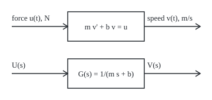
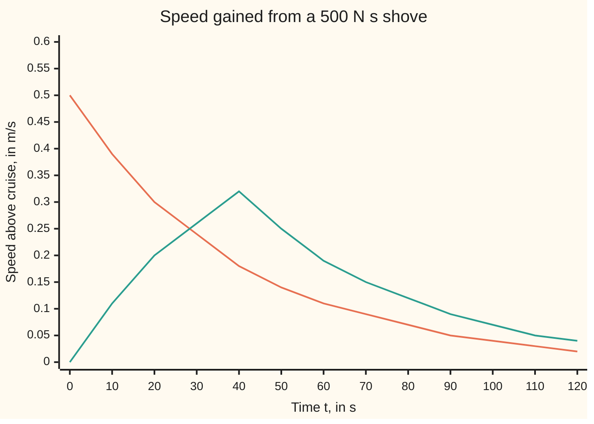

# Transfer functions: the Laplace transform turns a differential equation into a ratio

[Syllabus](../../../SYLLABUS.md) → [Engineering mathematics](../../../SYLLABUS.md#w13) → [Linear Systems and Transforms](../../../SYLLABUS.md#w13-s02) → Transfer functions

---

## General Overview

A 1000 kg car cruises at 25 m/s on a level road. It is lighter than the 1,500 kg car of [Linear and time-invariant](01-linear-time-invariant-systems-and-convolution.md), and only the air holds it back. The engine pushes with 312.5 N, exactly what the air drag takes away, so the speed holds. A cruise controller will soon adjust that push. Before anyone designs it, the engineer wants one thing: a compact description of how the car's speed answers any change in force. Push 100 N harder, how fast does the speed rise, and to what? Give it a sharp shove, how long does the gain last?

The car's law of motion answers each question, but only by solving a differential equation each time. A transfer function solves it once. Feed the car a force that grows or decays exponentially, and the speed comes back as the same exponential, scaled. That scale factor, one number for each rate, is the whole description: a ratio of two polynomials, here one over (mass times the rate plus drag). Every other response follows by algebra, and the response to an ideal shove, the **impulse response**, is the same object seen in time.

The answers, worked below: a 100 N extra push buys 4 m/s, reached slowly, with a time constant of 40 s; a shove of 500 N·s adds 0.5 m/s at once, and that gain decays on the same 40 s clock.

**The transfer function is what a linear, time-invariant system does to each exponential: it multiplies it by one number, and for a system governed by a differential equation that number is a ratio of polynomials in the exponential's rate, which is also the Laplace transform of the impulse response.**

**What kind of fact this is:** a definition, of the transfer function; that it equals the transform of the impulse response, and the car's numbers, are proved on this card in Why it works. The car's straight-line drag is a model, with its range stated in When it holds.

### The picture: the car as one block

The top row is the car in time, where the block stands for a differential equation. The bottom row is the same car after the Laplace transform, where the block is one multiplication. Schematic, not to scale.

<p align="center"></p>

---

## The formula

Notation first, in words. The Laplace transform ([The Laplace transform](../../08-Differential%20equations%20and%20dynamics/08-Laplace%20Transforms%20for%20Initial-Value%20Problems/01-the-laplace-transform.md)) turns a signal of time into a function of a rate $s$, measured in 1/s; a capital letter is the transform of the lower-case signal, so $U(s)$ is the transform of the force $u(t)$. New here: the **transfer function** $G(s)$, read "what the system does to each exponential e^(st)".

The car's law of motion, with $v$ the speed above the 25 m/s cruise and $u$ the force above the 312.5 N cruise push:

$$m\,\frac{dv}{dt} + b\,v = u(t)$$

Transform it with the car at cruise when the clock starts, so $v(0) = 0$, and divide:

$$G(s) = \frac{V(s)}{U(s)} = \frac{1}{m s + b}, \qquad h(t) = \frac{1}{m}\,e^{-t/\tau}, \qquad \tau = \frac{m}{b}$$

**Read it aloud:** the transfer function is the speed's transform over the force's transform, one over mass times s plus drag; its inverse transform is the impulse response, a jump of one over the mass that dies away on the time constant, mass over drag.

| Symbol | Plain meaning | In our example | Push it up and the answer… |
| --- | --- | --- | --- |
| $t$, $\sigma$ | time since the clock started; a delay inside an integral | 0 to 160 s | — |
| $u(t)$, $U(s)$, $r$ | extra force from the engine, its transform; the force commanded | a 100 N step; a 500 N·s shove | speed rises in proportion |
| $v(t)$, $V(s)$ | speed above cruise, and its transform | 0 at the start | — |
| $m$ | the car's mass | 1000 kg | slower response, smaller jump from a shove |
| $c$, $v_0$ | air-drag coefficient, in N·s^2/m^2, and the cruise speed | 0.5 and 25 m/s | more drag at cruise |
| $b$ | drag per extra m/s near cruise, $2 c v_0$ | 25 N·s/m | lower steady gain, faster settling |
| $s$ | the rate of an exponential e^(st), in 1/s; complex in general, and an imaginary s is a steady oscillation | 0, 0.025, 0.05, 0.1 | — |
| $G(s)$, $q$ | the transfer function, in (m/s)/N; q is the same number found by trial in Step 1 | 1/(1000 s + 25) | — |
| $y$, $a_i$, $\beta_i$, $n$, $k$ | in Step 0 and the detailed proof: a general system's output; in the proof, the coefficients on its output and input sides, and their highest orders | for the car y = v, a_1 = m, a_0 = b, β_0 = 1, n = 1, k = 0 | — |
| $A$, $B$, $C$, $D$, $I$ | the state-space matrices and the identity matrix, used once below; for the car single numbers, unrelated to b and c | −b/m, 1/m, 1, 0 | — |
| $h(t)$, $h_2(t)$ | impulse response, in (m/s) per N·s; with engine lag | 0.001 e^(−t/40) | — |
| $\tau$, $\tau_e$ | time constant of the car; of the engine | 40 s; 0.5 s | slower rise, slower decay |
| $\delta(t)$, $J$ | the delta (an ideal instant shove of area 1 N·s); a shove's size | $J$ = 500 N·s | speed jump $J/m$ grows |

The time constant $\tau$ is the time for the impulse response to fall by the factor e. The pole of $G(s)$, the rate where the denominator is zero, is $s = -b/m$ = −0.025 1/s, minus one over the time constant.

### When it holds

- **Linear.** True drag is $c v^2$, and the straight line $b v$ is its tangent at 25 m/s. A 100 N step gives +4.000 m/s by the model and +3.723 m/s for the real drag. A 1000 N step is outside the range: the model says +40.000 m/s, the drag-squared car reaches only +26.235 m/s.
- **Time-invariant.** Mass and drag constant over the run. A hill or a headwind is an extra input force, not a new transfer function; a trailer hitched on is a new $m$ and a new $G$.
- **At rest, in the deviation sense.** The ratio of transforms is $G$ only when the speed deviation starts at zero. Starting 1 m/s fast adds a term, and the ratio at s = 0.05 reads 0.0200, not 0.0133.
- **An impulse is short next to the time constant.** A 0.5 s push of 1000 N acts like the ideal shove; the same 500 N·s spread over 40 s peaks at 0.316 m/s, not 0.500 m/s.
- **Nothing else between pedal and road.** An engine that takes 0.5 s to build force is a second block in series: G(0.05) drops from 0.0133333 to 0.0130081 (m/s)/N.

---

## Why it works

### Step 0: an exponential goes through a linear, time-invariant system unchanged in shape

Delay an exponential e^(st), running for all time, by any amount and it is the same curve times a constant. A system that is linear (scaling the input scales the output) and time-invariant (delaying the input delays the output) must therefore answer e^(st) with the same exponential times a constant ([Linear and time-invariant](01-linear-time-invariant-systems-and-convolution.md)). Here is why. Call the output y. The input delayed by σ is e^(s(t − σ)) = e^(−sσ) e^(st), the same input times the constant e^(−sσ). Time-invariance says its output is y(t − σ); linearity says it is e^(−sσ) y(t). So y(t − σ) = e^(−sσ) y(t) for every t and σ. Put t = σ: y(σ) = y(0) e^(sσ), the input's own exponential times the constant y(0). That constant depends on $s$ and on the system only. It is $G(s)$.

### Step 1: find the constant for the car

Push the car with $u = e^{st}$ and try $v = q e^{st}$, with q a number to be found. The derivative brings down a factor $s$:

m s q e^(st) + b q e^(st) = e^(st), so q = 1/(m s + b).

At s = 0.05 1/s this is 1/(1000 × 0.05 + 25) = 0.0133333 (m/s)/N. The code checks it by simulation: it drives the car from rest with a force e^(0.05 t) newtons for 800 s and divides speed by force at the end. The start-up transient has died by then, and the ratio reads 0.0133333. That force is a mathematical probe of the linear model; no engine could follow it.

### Step 2: the same ratio from the Laplace transform

The transform of a derivative is $s$ times the transform minus the starting value ([Transforming a derivative](../../08-Differential%20equations%20and%20dynamics/08-Laplace%20Transforms%20for%20Initial-Value%20Problems/02-transforms-of-derivatives.md)). Applied to the car:

m (s V(s) − v(0)) + b V(s) = U(s).

With $v(0) = 0$ this is $V(s) = U(s)/(m s + b)$: the differential equation has become a multiplication. The derivative turned into a factor $s$, so any equation with constant coefficients becomes a ratio of polynomials in $s$. The folded proof below writes that out.

### Step 3: the impulse response is the transfer function in time

An ideal shove of area 1 N·s is the delta $\delta(t)$, whose transform is 1 ([Impulses](../../08-Differential%20equations%20and%20dynamics/08-Laplace%20Transforms%20for%20Initial-Value%20Problems/06-impulses-and-the-delta-function.md)). Put $U = 1$ into Step 2: $V = G$. The response to the delta, $h(t)$, has transform $G(s)$. One function holds the system twice: as a curve in time and as a ratio in $s$.

The physics agrees. A shove of $J$ N·s changes the car's momentum by $J$, so the speed jumps by $J/m$; afterwards no force acts but drag, and the jump decays at the rate $b/m$.

### Step 4: invert the ratio by its residue

The inverse transform of $G$ is the sum of the residues of $G(s) e^{st}$ at its poles ([Inverting a Laplace transform](../../07-Complex%20analysis/08-Transforms%20in%20Outline/07-inverse-laplace-by-residues.md)). The car's $G$ has one pole, at $s = -b/m$. Near it, $G(s) e^{st} = (1/m) e^{st}/(s + b/m)$, so the residue is $(1/m) e^{-bt/m}$:

h(t) = (1/1000) e^(−t/40) per N·s, so h(0+) = 0.001 (m/s) per N·s.

The code runs this backwards: it integrates $h(t) e^{-st}$ numerically from 0 to 1000 s by Simpson's rule (a weighted sum of samples) and recovers $G(s)$ to seven digits at four rates.

### Step 5: any input, by multiplication

Since $V = G U$, and a product of transforms is the transform of a convolution, the speed is $h$ convolved with the force ([Convolution](../../08-Differential%20equations%20and%20dynamics/08-Laplace%20Transforms%20for%20Initial-Value%20Problems/07-convolution-and-the-impulse-response.md)). For a 100 N step, $U(s) = 100/s$ and

V(s) = 100 / (s (1000 s + 25)) = 4/s − 4/(s + 0.025),

split by partial fractions ([Inverting](../../08-Differential%20equations%20and%20dynamics/08-Laplace%20Transforms%20for%20Initial-Value%20Problems/03-inverting-by-partial-fractions.md)). So $v(t) = 4(1 - e^{-t/40})$ m/s: 2.5285 m/s at 40 s, 3.9267 m/s at 160 s. The engineer reads two numbers off it: 100 N buys 4 m/s, and the car takes tens of seconds to get there, so a controller cannot correct speed faster than the car allows without big force swings.

### Step 6: blocks in series multiply

Suppose the engine does not deliver force at once but follows the command $r$ with a lag: $\tau_e\,du/dt + u = r$, with $\tau_e$ = 0.5 s. That block alone has transfer function $1/(\tau_e s + 1)$. Command to speed is the product:

G_total(s) = 1 / ((0.5 s + 1)(1000 s + 25)), so G_total(0.05) = 0.0133333 / (0.5 × 0.05 + 1) = 0.0130081 (m/s)/N.

Two poles now, at −0.025 and −2 1/s. Their residues give

h2(t) = 0.00101266 (e^(−0.025 t) − e^(−2 t)), and h2(0+) = 0.

The jump is gone: force has to build through the engine first, so a shove on the throttle starts the speed rising from zero, at 0.002 m/s^2 per N·s, instead of jumping. After a few seconds the fast term has died, and the curve is nearly the car's own. Through the engine a 500 N·s command gives 0.39433 m/s at 10 s, against 0.389 m/s for a shove on the car itself.

<details>
<summary>Detailed proof: G is a ratio of polynomials, and it is the transform of h</summary>

**Any constant-coefficient equation.** Take $a_n y^{(n)} + \dots + a_1 y' + a_0 y = \beta_k u^{(k)} + \dots + \beta_0 u$, with $y(t)$ and $u(t)$ and all their derivatives zero at the start. Each derivative transforms to $s$ times the previous transform, with no starting terms, so a derivative of order k becomes $s^k$ times the transform. Collecting terms, $(a_n s^n + \dots + a_0)\,Y(s) = (\beta_k s^k + \dots + \beta_0)\,U(s)$, and $G = Y/U$ is the ratio of those two polynomials. For the car, $n = 1$, $a_1 = m$, $a_0 = b$, and the top polynomial is 1.

**G is the transform of h.** For a linear, time-invariant system the output is $y(t) = \int_0^\infty h(\sigma)\,u(t - \sigma)\,d\sigma$, with $\sigma$ the delay since each piece of input arrived. Feed it $u = e^{st}$ for all time. Then $y(t) = e^{st} \int_0^\infty h(\sigma) e^{-s\sigma}\,d\sigma$: the same exponential times the Laplace transform of $h$, wherever that integral converges (for the car, any $s$ above −0.025 1/s). By Step 0 that multiplier is $G(s)$. So the multiplier on exponentials, the ratio of transforms at rest, and the transform of the impulse response are one function.

**Starting conditions.** If $v(0) \ne 0$, Step 2 gives $V = (U + m\,v(0))/(m s + b)$. The extra term $m\,v(0)/(m s + b)$ is the free decay of the starting speed, which the input did not cause. That is why the definition demands rest.

</details>

Another road to the same $G$ runs through the state-space form, $G(s) = C (sI - A)^{-1} B + D$, worked in State space. There A, B, C and D are the matrices that card introduces to describe a system, and I is the identity matrix, the matrix version of 1. For the car each is a single number, unrelated to this card's drag b and c: A = −b/m, B = 1/m, C = 1, D = 0 gives the same ratio.

---

## Worked numbers, by hand

| Step | Arithmetic | Value |
| --- | --- | --- |
| cruise push | c v0^2 = 0.5 × 25 × 25 | 312.5 N |
| drag per extra m/s | b = 2 c v0 = 2 × 0.5 × 25 | 25 N·s/m |
| time constant | τ = m/b = 1000/25 | 40 s |
| transfer function | 1/(m s + b) | 1/(1000 s + 25) (m/s)/N |
| steady gain | G(0) = 1/25 | 0.04 (m/s)/N |
| at s = 0.05 1/s | 1/(50 + 25) | 0.0133333 (m/s)/N |
| impulse response | residue at s = −0.025 | 0.001 e^(−t/40) per N·s |
| 500 N·s shove, at once | 500 × 0.001 | 0.500 m/s |
| the same shove, 40 s later | 0.5 × e^(−1) | 0.184 m/s |
| 100 N step, 40 s in | 4 × (1 − e^(−1)) | 2.5285 m/s |
| 100 N step, for good | 100 × G(0) | **4 m/s** |

A cruise controller that adds 100 N will, if nothing else changes, raise the speed by 4 m/s, slowly: the time constant of 40 s sets the pace, and any correction wanted faster than that needs a larger, briefer force.

### The picture: one shove, delivered two ways



Orange: 500 times the impulse response, the ideal instant shove. Teal: the same 500 N·s spread as 12.5 N over 40 s, simulated. Points are rounded to 0.01 m/s, as the figure lines print them. A real 0.5 s push of 1000 N, also simulated, sits almost on the orange line from 10 s on: 0.392 against 0.389 m/s at 10 s.

### What breaks if you drop a piece

| Mistake | Comes out at | What went wrong |
| --- | --- | --- |
| A slow push treated as an impulse | peak 0.316 m/s, not 0.500 m/s | the push lasts as long as the time constant |
| Car 1 m/s fast at the start | V/U = 0.0200 at s = 0.05, not 0.0133 | the starting speed adds a term outside G |
| Mass dropped from the equation | steady gain 40 (m/s)/N, not 0.04 | v' + 0.025 v = u is a 1 kg car |
| Linear model used for a 1000 N step | +40.000 m/s, true +26.235 m/s | drag grows as the square; the tangent fails far out |

The code prints all four.

---

## Code, from first principles, and it actually runs

Python imports only `math`; Rust uses only std. The scripts reach $G(s)$ three independent ways at four rates: the formula; the numerical Laplace transform of the residue-inverted impulse response, by Simpson's rule; and a fourth-order Runge–Kutta simulation (RK4, a standard step-by-step solver of the equation) driven by e^(st). The impulse response is checked against simulated 0.5 s and 40 s pushes; the step response by partial fractions, by simulation and by convolution; the engine-lag cascade by the product rule against simulation and by residues against simulation. Then every what-breaks number is reproduced, the last against a simulation of the drag-squared car.

### Python

```python
# Transfer functions -- the check behind the card.  Standard library only.
# The plant is a car on cruise control: m dv/dt = u - b v, with the drag
# c v^2 linearised about 25 m/s.  Its transfer function is G(s) = 1/(m s + b).
# Roads: the formula; an RK4 simulation of the equation; a numerical Laplace
# transform (Simpson) of the impulse response; residues at the poles.
import math

M, C, V0 = 1000.0, 0.5, 25.0                # mass kg, drag N s^2/m^2, cruise m/s
B = 2 * C * V0                               # linearised drag, N s/m
TAU, DT = M / B, 0.01                        # time constant s, RK4 step s
J, TE = 500.0, 0.5                           # the shove N s, engine lag s

def G(s):                                    # the transfer function, (m/s)/N
    return 1.0 / (M * s + B)

def h(t):                                    # impulse response: residue at s = -b/m
    return math.exp(-B * t / M) / M

def run(f, x, t0, n):                        # RK4 on dx/dt = f(t, x); keeps every state
    out = [x]
    for i in range(n):
        t = t0 + i * DT
        k1 = f(t, x)
        k2 = f(t + DT / 2, [a + DT / 2 * k for a, k in zip(x, k1)])
        k3 = f(t + DT / 2, [a + DT / 2 * k for a, k in zip(x, k2)])
        k4 = f(t + DT, [a + DT * k for a, k in zip(x, k3)])
        x = [a + DT / 6 * (p + 2 * q + 2 * r + w) for a, p, q, r, w in zip(x, k1, k2, k3, k4)]
        out.append(x)
    return out

def car(u):                                  # the linear car pushed by the force u(t)
    return lambda t, x: [(u(t) - B * x[0]) / M]

def steps(t):
    return round(t / DT)

def push(force, width, t_end):               # constant force for width s, then coast
    on = run(car(lambda t: force), [0.0], 0.0, steps(width))
    off = run(car(lambda t: 0.0), on[-1], width, steps(t_end - width))
    return [x[0] for x in on + off[1:]]

def simpson(ys, dx):                         # composite Simpson's rule, odd point count
    return dx / 3 * (ys[0] + ys[-1] + 4 * sum(ys[1:-1:2]) + 2 * sum(ys[2:-1:2]))

def laplace_of_h(s, t_end=1000.0, dx=0.05):  # integral of h(t) e^(-s t) dt, numerically
    n = round(t_end / dx)
    return simpson([h(k * dx) * math.exp(-s * k * dx) for k in range(n + 1)], dx)

def drive_ratio(s, t_end=800.0):             # feed u = e^(s t) from rest; output / input
    v = run(car(lambda t: math.exp(s * t)), [0.0], 0.0, steps(t_end))[-1][0]
    return v / math.exp(s * t_end)

print(f"car: m = {M:.0f} kg, c = {C} N s^2/m^2, cruising at v0 = {V0:.0f} m/s")
print(f"linearised drag b = 2 c v0 = {B:.0f} N s/m; cruise force c v0^2 = {C * V0 * V0:.1f} N")
print(f"G(s) = 1/({M:.0f} s + {B:.0f}) (m/s)/N; pole s = {-B / M:.3f} 1/s; time constant {TAU:.0f} s")
print("G(s) three ways, (m/s)/N: formula | transform of h, Simpson to 1000 s | e^(st) drive, RK4 to 800 s")
rows = []
for s in (0.0, 0.025, 0.05, 0.1):
    rows.append((G(s), laplace_of_h(s), drive_ratio(s)))
    print(f"s = {s:.3f} 1/s: {rows[-1][0]:.7f} | {rows[-1][1]:.7f} | {rows[-1][2]:.7f}")
print(f"impulse response h(t) = (1/m) e^(-t/{TAU:.0f} s); h(0+) = {h(0.0):.3f} (m/s) per N s")
short, slow = push(1000.0, 0.5, 120.0), push(12.5, 40.0, 120.0)
print(f"{J:.0f} N s shove, speed gained (m/s): t | ideal impulse | 1000 N for 0.5 s | 12.5 N for 40 s")
times = list(range(0, 121, 10))
for t in times:
    print(f"t = {t:3d} s: {J * h(t):.3f} | {short[steps(t)]:.3f} | {slow[steps(t)]:.3f}")
print("figure, chart ideal:", " ".join(f"{J * h(t):.2f}" for t in times))
print("figure, chart 40 s push:", " ".join(f"{slow[steps(t)]:.2f}" for t in times))
step = [x[0] for x in run(car(lambda t: 100.0), [0.0], 0.0, steps(160.0))]
print("100 N extra thrust, speed gained (m/s): t | partial fractions | RK4 | convolution h*u")
stepped = []
for t in (20, 40, 80, 160):
    pf = 100.0 / B * (1.0 - math.exp(-t / TAU))
    conv = simpson([100.0 * h(k * 0.05) for k in range(round(t / 0.05) + 1)], 0.05)
    stepped.append((pf, step[steps(t)], conv))
    print(f"t = {t:3d} s: {pf:.4f} | {step[steps(t)]:.4f} | {conv:.4f}")
p1, p2 = -B / M, -1.0 / TE                   # engine lag 1/(TE s + 1) in series
r1, r2 = 1.0 / ((TE * p1 + 1.0) * M), 1.0 / (TE * (M * p2 + B))
lag = lambda r: (lambda t, x: [(r(t) - x[0]) / TE, (x[0] - B * x[1]) / M])
g2 = G(0.05) / (TE * 0.05 + 1.0)
d2 = run(lag(lambda t: math.exp(0.05 * t)), [0.0, 0.0], 0.0, steps(800.0))[-1][1] / math.exp(40.0)
print(f"engine lag {TE} s in series: G_total(0.05) = {g2:.7f} by product, {d2:.7f} by e^(st) drive")
print(f"residues: h2(t) = {r1:.8f} e^({p1:.3f} t) + ({r2:.8f}) e^({p2:.0f} t); h2(0+) = {abs(r1 + r2):.6f}")
kick = run(lag(lambda t: 0.0), [J / TE, 0.0], 0.0, steps(40.0))
for t in (1, 10, 40):
    print(f"{J:.0f} N s through the engine, t = {t:2d} s: residues {J * (r1 * math.exp(p1 * t) + r2 * math.exp(p2 * t)):.5f} m/s | RK4 {kick[steps(t)][1]:.5f} m/s")
print(f"mistake 1, shove spread over 40 s: peak {max(slow):.3f} m/s, not {J * h(0.0):.3f} m/s")
warm = [x[0] for x in run(car(lambda t: 100.0), [1.0], 0.0, steps(800.0))]
vs = simpson([v * math.exp(-0.05 * k * DT) for k, v in enumerate(warm)], DT)
print(f"mistake 2, car already 1 m/s fast: V/U at s = 0.05 is {vs / (100.0 / 0.05):.4f}, not G = {G(0.05):.4f}")
print(f"mistake 3, mass dropped, G = 1/(s + {B / M:.3f}): steady gain {1.0 / (B / M):.0f} (m/s)/N, not {G(0.0):.2f}")
far = []
for df in (100.0, 1000.0):
    sq = lambda t, x: [(C * V0 * V0 + df - C * x[0] * x[0]) / M]
    far.append((df / B, math.sqrt(V0 * V0 + df / C) - V0, run(sq, [V0], 0.0, steps(600.0))[-1][0] - V0))
    print(f"{'mistake 4, ' if df > 500 else 'in range, '}{df:.0f} N step: linear +{far[-1][0]:.3f} m/s, "
          f"drag-squared car +{far[-1][1]:.3f} m/s (RK4 at 600 s: +{far[-1][2]:.3f})")
for g, lap, drv in rows:                     # transform of h, and the e^(st) drive, both give G
    assert abs(lap - g) < 1e-6 * g and abs(drv - g) < 1e-6 * g
assert all(abs(short[steps(t)] - J * h(t)) < 0.01 * J * h(t) for t in times[1:])
assert abs(max(slow) - 12.5 / B * (1.0 - math.exp(-40.0 / TAU))) < 1e-6   # 40 s push peak, closed form
assert all(abs(rk - pf) < 1e-6 and abs(cv - pf) < 1e-6 for pf, rk, cv in stepped)
assert abs(d2 - g2) < 1e-6 * g2
assert all(abs(kick[steps(t)][1] - J * (r1 * math.exp(p1 * t) + r2 * math.exp(p2 * t))) < 1e-6 for t in (1, 10, 40))
assert all(abs(rk - exact) < 1e-6 for _, exact, rk in far) and abs(vs - (2000.0 + M * 1.0) * G(0.05)) < 1e-4
print("ALL CHECKS PASS")
```

**Ran 2026-10-06 on macOS, Python 3.14.6, standard library only. All checks passed. Output, pasted from the run:**

```
car: m = 1000 kg, c = 0.5 N s^2/m^2, cruising at v0 = 25 m/s
linearised drag b = 2 c v0 = 25 N s/m; cruise force c v0^2 = 312.5 N
G(s) = 1/(1000 s + 25) (m/s)/N; pole s = -0.025 1/s; time constant 40 s
G(s) three ways, (m/s)/N: formula | transform of h, Simpson to 1000 s | e^(st) drive, RK4 to 800 s
s = 0.000 1/s: 0.0400000 | 0.0400000 | 0.0400000
s = 0.025 1/s: 0.0200000 | 0.0200000 | 0.0200000
s = 0.050 1/s: 0.0133333 | 0.0133333 | 0.0133333
s = 0.100 1/s: 0.0080000 | 0.0080000 | 0.0080000
impulse response h(t) = (1/m) e^(-t/40 s); h(0+) = 0.001 (m/s) per N s
500 N s shove, speed gained (m/s): t | ideal impulse | 1000 N for 0.5 s | 12.5 N for 40 s
t =   0 s: 0.500 | 0.000 | 0.000
t =  10 s: 0.389 | 0.392 | 0.111
t =  20 s: 0.303 | 0.305 | 0.197
t =  30 s: 0.236 | 0.238 | 0.264
t =  40 s: 0.184 | 0.185 | 0.316
t =  50 s: 0.143 | 0.144 | 0.246
t =  60 s: 0.112 | 0.112 | 0.192
t =  70 s: 0.087 | 0.087 | 0.149
t =  80 s: 0.068 | 0.068 | 0.116
t =  90 s: 0.053 | 0.053 | 0.091
t = 100 s: 0.041 | 0.041 | 0.071
t = 110 s: 0.032 | 0.032 | 0.055
t = 120 s: 0.025 | 0.025 | 0.043
figure, chart ideal: 0.50 0.39 0.30 0.24 0.18 0.14 0.11 0.09 0.07 0.05 0.04 0.03 0.02
figure, chart 40 s push: 0.00 0.11 0.20 0.26 0.32 0.25 0.19 0.15 0.12 0.09 0.07 0.05 0.04
100 N extra thrust, speed gained (m/s): t | partial fractions | RK4 | convolution h*u
t =  20 s: 1.5739 | 1.5739 | 1.5739
t =  40 s: 2.5285 | 2.5285 | 2.5285
t =  80 s: 3.4587 | 3.4587 | 3.4587
t = 160 s: 3.9267 | 3.9267 | 3.9267
engine lag 0.5 s in series: G_total(0.05) = 0.0130081 by product, 0.0130081 by e^(st) drive
residues: h2(t) = 0.00101266 e^(-0.025 t) + (-0.00101266) e^(-2 t); h2(0+) = 0.000000
500 N s through the engine, t =  1 s: residues 0.42530 m/s | RK4 0.42530 m/s
500 N s through the engine, t = 10 s: residues 0.39433 m/s | RK4 0.39433 m/s
500 N s through the engine, t = 40 s: residues 0.18627 m/s | RK4 0.18627 m/s
mistake 1, shove spread over 40 s: peak 0.316 m/s, not 0.500 m/s
mistake 2, car already 1 m/s fast: V/U at s = 0.05 is 0.0200, not G = 0.0133
mistake 3, mass dropped, G = 1/(s + 0.025): steady gain 40 (m/s)/N, not 0.04
in range, 100 N step: linear +4.000 m/s, drag-squared car +3.723 m/s (RK4 at 600 s: +3.723)
mistake 4, 1000 N step: linear +40.000 m/s, drag-squared car +26.235 m/s (RK4 at 600 s: +26.235)
ALL CHECKS PASS
```

### Rust

Same numbers, same labels, built with `rustc --edition 2021 -O`.

```rust
// Transfer functions -- the same check as the Python, in Rust.  No crates.
// The plant is a car on cruise control: m dv/dt = u - b v, with the drag
// c v^2 linearised about 25 m/s.  Its transfer function is G(s) = 1/(m s + b).
// Roads: the formula; an RK4 simulation of the equation; a numerical Laplace
// transform (Simpson) of the impulse response; residues at the poles.
const M: f64 = 1000.0; // mass, kg
const C: f64 = 0.5; // drag, N s^2/m^2
const V0: f64 = 25.0; // cruise, m/s
const B: f64 = 2.0 * C * V0; // linearised drag, N s/m
const TAU: f64 = M / B; // time constant, s
const DT: f64 = 0.01; // RK4 step, s
const J: f64 = 500.0; // the shove, N s
const TE: f64 = 0.5; // engine lag, s

fn g(s: f64) -> f64 { 1.0 / (M * s + B) } // the transfer function, (m/s)/N
fn h(t: f64) -> f64 { (-B * t / M).exp() / M } // impulse response: residue at s = -b/m
fn steps(t: f64) -> usize { (t / DT).round() as usize }

// RK4 on dx/dt = f(t, x); keeps every state
fn run(f: &dyn Fn(f64, &[f64]) -> Vec<f64>, x0: Vec<f64>, t0: f64, n: usize) -> Vec<Vec<f64>> {
    let axpy = |x: &[f64], c: f64, k: &[f64]| -> Vec<f64> { x.iter().zip(k).map(|(a, b)| a + c * b).collect() };
    let mut x = x0;
    let mut out = vec![x.clone()];
    for i in 0..n {
        let t = t0 + i as f64 * DT;
        let k1 = f(t, &x);
        let k2 = f(t + DT / 2.0, &axpy(&x, DT / 2.0, &k1));
        let k3 = f(t + DT / 2.0, &axpy(&x, DT / 2.0, &k2));
        let k4 = f(t + DT, &axpy(&x, DT, &k3));
        x = (0..x.len()).map(|j| x[j] + DT / 6.0 * (k1[j] + 2.0 * k2[j] + 2.0 * k3[j] + k4[j])).collect();
        out.push(x.clone());
    }
    out
}

fn car(u: impl Fn(f64) -> f64) -> impl Fn(f64, &[f64]) -> Vec<f64> { move |t, x| vec![(u(t) - B * x[0]) / M] }

fn push(force: f64, width: f64, t_end: f64) -> Vec<f64> { // constant force for width s, then coast
    let on = run(&car(|_| force), vec![0.0], 0.0, steps(width));
    let off = run(&car(|_| 0.0), on[on.len() - 1].clone(), width, steps(t_end - width));
    on.iter().chain(off[1..].iter()).map(|x| x[0]).collect()
}

fn simpson(ys: &[f64], dx: f64) -> f64 { // composite Simpson's rule, odd point count
    let n = ys.len();
    let (mut odd, mut even) = (0.0, 0.0);
    for i in (1..n - 1).step_by(2) { odd += ys[i] }
    for i in (2..n - 1).step_by(2) { even += ys[i] }
    dx / 3.0 * (ys[0] + ys[n - 1] + 4.0 * odd + 2.0 * even)
}

fn laplace_of_h(s: f64) -> f64 { // integral of h(t) e^(-s t) dt, numerically
    let (t_end, dx) = (1000.0, 0.05);
    let n = (t_end / dx as f64).round() as usize;
    let ys: Vec<f64> = (0..=n).map(|k| h(k as f64 * dx) * (-s * k as f64 * dx).exp()).collect();
    simpson(&ys, dx)
}

fn drive_ratio(s: f64) -> f64 { // feed u = e^(s t) from rest; output / input
    let t_end = 800.0;
    let v = run(&car(|t| (s * t).exp()), vec![0.0], 0.0, steps(t_end));
    v[v.len() - 1][0] / (s * t_end).exp()
}

fn main() {
    println!("car: m = {:.0} kg, c = {} N s^2/m^2, cruising at v0 = {:.0} m/s", M, C, V0);
    println!("linearised drag b = 2 c v0 = {:.0} N s/m; cruise force c v0^2 = {:.1} N", B, C * V0 * V0);
    println!("G(s) = 1/({:.0} s + {:.0}) (m/s)/N; pole s = {:.3} 1/s; time constant {:.0} s", M, B, -B / M, TAU);
    println!("G(s) three ways, (m/s)/N: formula | transform of h, Simpson to 1000 s | e^(st) drive, RK4 to 800 s");
    let mut rows = Vec::new();
    for s in [0.0, 0.025, 0.05, 0.1] {
        let r = (g(s), laplace_of_h(s), drive_ratio(s));
        println!("s = {:.3} 1/s: {:.7} | {:.7} | {:.7}", s, r.0, r.1, r.2);
        rows.push(r);
    }
    println!("impulse response h(t) = (1/m) e^(-t/{:.0} s); h(0+) = {:.3} (m/s) per N s", TAU, h(0.0));
    let (short, slow) = (push(1000.0, 0.5, 120.0), push(12.5, 40.0, 120.0));
    println!("{:.0} N s shove, speed gained (m/s): t | ideal impulse | 1000 N for 0.5 s | 12.5 N for 40 s", J);
    let times: Vec<f64> = (0..=12).map(|k| 10.0 * k as f64).collect();
    for &t in &times {
        println!("t = {:3} s: {:.3} | {:.3} | {:.3}", t as i64, J * h(t), short[steps(t)], slow[steps(t)]);
    }
    println!("figure, chart ideal: {}", times.iter().map(|&t| format!("{:.2}", J * h(t))).collect::<Vec<_>>().join(" "));
    println!("figure, chart 40 s push: {}", times.iter().map(|&t| format!("{:.2}", slow[steps(t)])).collect::<Vec<_>>().join(" "));
    let step: Vec<f64> = run(&car(|_| 100.0), vec![0.0], 0.0, steps(160.0)).iter().map(|x| x[0]).collect();
    println!("100 N extra thrust, speed gained (m/s): t | partial fractions | RK4 | convolution h*u");
    let mut stepped = Vec::new();
    for t in [20.0, 40.0, 80.0, 160.0] {
        let pf = 100.0 / B * (1.0 - (-t / TAU).exp());
        let ys: Vec<f64> = (0..=(t / 0.05_f64).round() as usize).map(|k| 100.0 * h(k as f64 * 0.05)).collect();
        let conv = simpson(&ys, 0.05);
        println!("t = {:3} s: {:.4} | {:.4} | {:.4}", t as i64, pf, step[steps(t)], conv);
        stepped.push((pf, step[steps(t)], conv));
    }
    let (p1, p2) = (-B / M, -1.0 / TE); // engine lag 1/(TE s + 1) in series
    let (r1, r2) = (1.0 / ((TE * p1 + 1.0) * M), 1.0 / (TE * (M * p2 + B)));
    let lag = |r: Box<dyn Fn(f64) -> f64>| move |t: f64, x: &[f64]| vec![(r(t) - x[0]) / TE, (x[0] - B * x[1]) / M];
    let g2 = g(0.05) / (TE * 0.05 + 1.0);
    let d = run(&lag(Box::new(|t| (0.05 * t).exp())), vec![0.0, 0.0], 0.0, steps(800.0));
    let d2 = d[d.len() - 1][1] / 40.0_f64.exp();
    println!("engine lag {} s in series: G_total(0.05) = {:.7} by product, {:.7} by e^(st) drive", TE, g2, d2);
    println!("residues: h2(t) = {:.8} e^({:.3} t) + ({:.8}) e^({:.0} t); h2(0+) = {:.6}", r1, p1, r2, p2, (r1 + r2).abs());
    let kick = run(&lag(Box::new(|_| 0.0)), vec![J / TE, 0.0], 0.0, steps(40.0));
    let h2 = |t: f64| J * (r1 * (p1 * t).exp() + r2 * (p2 * t).exp());
    for t in [1.0, 10.0, 40.0] {
        println!("{:.0} N s through the engine, t = {:2} s: residues {:.5} m/s | RK4 {:.5} m/s", J, t as i64, h2(t), kick[steps(t)][1]);
    }
    let peak = slow.iter().cloned().fold(f64::MIN, f64::max);
    println!("mistake 1, shove spread over 40 s: peak {:.3} m/s, not {:.3} m/s", peak, J * h(0.0));
    let warm = run(&car(|_| 100.0), vec![1.0], 0.0, steps(800.0));
    let ys: Vec<f64> = warm.iter().enumerate().map(|(k, x)| x[0] * (-0.05 * k as f64 * DT).exp()).collect();
    let vs = simpson(&ys, DT);
    println!("mistake 2, car already 1 m/s fast: V/U at s = 0.05 is {:.4}, not G = {:.4}", vs / (100.0 / 0.05), g(0.05));
    println!("mistake 3, mass dropped, G = 1/(s + {:.3}): steady gain {:.0} (m/s)/N, not {:.2}", B / M, 1.0 / (B / M), g(0.0));
    let mut far = Vec::new();
    for df in [100.0, 1000.0] {
        let sq = move |_t: f64, x: &[f64]| vec![(C * V0 * V0 + df - C * x[0] * x[0]) / M];
        let r = run(&sq, vec![V0], 0.0, steps(600.0));
        let row = (df / B, (V0 * V0 + df / C).sqrt() - V0, r[r.len() - 1][0] - V0);
        println!("{}{:.0} N step: linear +{:.3} m/s, drag-squared car +{:.3} m/s (RK4 at 600 s: +{:.3})",
                 if df > 500.0 { "mistake 4, " } else { "in range, " }, df, row.0, row.1, row.2);
        far.push(row);
    }
    for &(gs, lap, drv) in &rows { // transform of h, and the e^(st) drive, both give G
        assert!((lap - gs).abs() < 1e-6 * gs && (drv - gs).abs() < 1e-6 * gs);
    }
    assert!(times[1..].iter().all(|&t| (short[steps(t)] - J * h(t)).abs() < 0.01 * J * h(t)));
    assert!((peak - 12.5 / B * (1.0 - (-40.0 / TAU).exp())).abs() < 1e-6); // 40 s push peak, closed form
    assert!(stepped.iter().all(|&(pf, rk, cv)| (rk - pf).abs() < 1e-6 && (cv - pf).abs() < 1e-6));
    assert!((d2 - g2).abs() < 1e-6 * g2);
    assert!([1.0, 10.0, 40.0].iter().all(|&t| (kick[steps(t)][1] - h2(t)).abs() < 1e-6));
    assert!(far.iter().all(|&(_, exact, rk)| (rk - exact).abs() < 1e-6) && (vs - (2000.0 + M * 1.0) * g(0.05)).abs() < 1e-4);
    println!("ALL CHECKS PASS");
}
```

**Ran 2026-10-06 on macOS, rustc 1.98.1, no crates. All checks passed. Output, pasted from the run:**

```
car: m = 1000 kg, c = 0.5 N s^2/m^2, cruising at v0 = 25 m/s
linearised drag b = 2 c v0 = 25 N s/m; cruise force c v0^2 = 312.5 N
G(s) = 1/(1000 s + 25) (m/s)/N; pole s = -0.025 1/s; time constant 40 s
G(s) three ways, (m/s)/N: formula | transform of h, Simpson to 1000 s | e^(st) drive, RK4 to 800 s
s = 0.000 1/s: 0.0400000 | 0.0400000 | 0.0400000
s = 0.025 1/s: 0.0200000 | 0.0200000 | 0.0200000
s = 0.050 1/s: 0.0133333 | 0.0133333 | 0.0133333
s = 0.100 1/s: 0.0080000 | 0.0080000 | 0.0080000
impulse response h(t) = (1/m) e^(-t/40 s); h(0+) = 0.001 (m/s) per N s
500 N s shove, speed gained (m/s): t | ideal impulse | 1000 N for 0.5 s | 12.5 N for 40 s
t =   0 s: 0.500 | 0.000 | 0.000
t =  10 s: 0.389 | 0.392 | 0.111
t =  20 s: 0.303 | 0.305 | 0.197
t =  30 s: 0.236 | 0.238 | 0.264
t =  40 s: 0.184 | 0.185 | 0.316
t =  50 s: 0.143 | 0.144 | 0.246
t =  60 s: 0.112 | 0.112 | 0.192
t =  70 s: 0.087 | 0.087 | 0.149
t =  80 s: 0.068 | 0.068 | 0.116
t =  90 s: 0.053 | 0.053 | 0.091
t = 100 s: 0.041 | 0.041 | 0.071
t = 110 s: 0.032 | 0.032 | 0.055
t = 120 s: 0.025 | 0.025 | 0.043
figure, chart ideal: 0.50 0.39 0.30 0.24 0.18 0.14 0.11 0.09 0.07 0.05 0.04 0.03 0.02
figure, chart 40 s push: 0.00 0.11 0.20 0.26 0.32 0.25 0.19 0.15 0.12 0.09 0.07 0.05 0.04
100 N extra thrust, speed gained (m/s): t | partial fractions | RK4 | convolution h*u
t =  20 s: 1.5739 | 1.5739 | 1.5739
t =  40 s: 2.5285 | 2.5285 | 2.5285
t =  80 s: 3.4587 | 3.4587 | 3.4587
t = 160 s: 3.9267 | 3.9267 | 3.9267
engine lag 0.5 s in series: G_total(0.05) = 0.0130081 by product, 0.0130081 by e^(st) drive
residues: h2(t) = 0.00101266 e^(-0.025 t) + (-0.00101266) e^(-2 t); h2(0+) = 0.000000
500 N s through the engine, t =  1 s: residues 0.42530 m/s | RK4 0.42530 m/s
500 N s through the engine, t = 10 s: residues 0.39433 m/s | RK4 0.39433 m/s
500 N s through the engine, t = 40 s: residues 0.18627 m/s | RK4 0.18627 m/s
mistake 1, shove spread over 40 s: peak 0.316 m/s, not 0.500 m/s
mistake 2, car already 1 m/s fast: V/U at s = 0.05 is 0.0200, not G = 0.0133
mistake 3, mass dropped, G = 1/(s + 0.025): steady gain 40 (m/s)/N, not 0.04
in range, 100 N step: linear +4.000 m/s, drag-squared car +3.723 m/s (RK4 at 600 s: +3.723)
mistake 4, 1000 N step: linear +40.000 m/s, drag-squared car +26.235 m/s (RK4 at 600 s: +26.235)
ALL CHECKS PASS
```

The two outputs match line for line.

> [!TIP]
> **Try changing**
> Guess first, then run it.
> - **A heavier car.** Set `M` to `2000.0`. The time constant doubles to 80 s and G(0.05) falls to 0.0080000. The first assert stops the run at s = 0: 1000 s of impulse response is no longer long enough for the transform (0.0399999), and 800 s of drive no longer outlasts the transient (0.0399982).
> - **Cruise faster.** Set `V0` to `35.0`. The drag slope rises to 35 N·s/m, the time constant falls to 29 s, and the steady gain to 0.0285714 (m/s)/N. Every assert still passes; the linear model's error on a 1000 N step shrinks to 28.571 against 21.789 m/s.
> - **A sluggish engine.** Set `TE` to `5.0`. G_total(0.05) drops to 0.0106667, still matched by simulation.
> - **Spread the short push.** Change `push(1000.0, 0.5, 120.0)` to `push(100.0, 5.0, 120.0)`. At 10 s it reads 0.415 against the ideal 0.389, outside the assert's band, and the second assert stops it: 5 s is no longer short next to 40 s.

---

## The usual mistake

> [!warning]
> **Taking the ratio of transforms when the system is not at rest.** $G(s)$ is defined with every deviation zero at the start. A car already 1 m/s above cruise, given a 100 N step, has speed 4 − 3 e^(−t/40) m/s; its transform over the input's transform at s = 0.05 is 0.0200, not G(0.05) = 0.0133. The difference is the free decay of the starting speed, which belongs to the initial condition, not to the car's transfer function.
>
> - **Dropping the mass.** Writing v' + (b/m) v = u gives 1/(s + 0.025): a steady gain of 40 (m/s)/N, a thousand times too large.
> - **Inverting the time constant.** The time constant is m/b = 40 s; b/m is the pole's distance from zero, 0.025 1/s. Reading 0.025 as seconds predicts a car that settles almost at once.
> - **Calling any short push an impulse.** "Short" means short next to the time constant. A 40 s push of the same 500 N·s peaks at 0.316 m/s, not 0.500 m/s.
> - **Using the tangent far from the operating point.** The linear car is right near 25 m/s. For a 1000 N step it predicts +40.000 m/s; real drag holds the gain to +26.235 m/s.

---

## Where you meet it in real life

- **Cruise control and adaptive cruise.** The controller is designed against $1/(m s + b)$, with $m$ and $b$ re-estimated as load and speed change; the loop around it is [Feedback](../03-Feedback%20Control/01-feedback-and-closed-loop-transfer-functions.md).
- **Hammer tests on structures.** Engineers strike a bridge or an engine mount with an instrumented hammer, record the response, and transform it: the measured impulse response is the structure's transfer function in time.
- **Audio and electronics.** A loudspeaker, an amplifier stage or a filter is specified by its transfer function; evaluated along the imaginary axis it gives the gain and lag at each pitch, the subject of [Bode plots](04-frequency-response-and-bode-plots.md).
- **Digital controllers.** A computer samples the speed every few milliseconds; its version of $G$ is a ratio in a one-step delay, in [The z-transform](08-z-transform-and-discrete-time-systems.md).

> **Say it back**
> A linear, time-invariant system answers each exponential e^(st) with the same exponential times one number, and that number, as a function of s, is the transfer function. Transforming the equation at rest turns derivatives into powers of s, so the transfer function is a ratio of polynomials: for the car, 1/(1000 s + 25). Since the delta transforms to 1, the transfer function is also the transform of the impulse response, here 0.001 e^(−t/40) per N·s, found from the residue at the pole. Any other input's response is the transfer function times the input's transform: 100 N gives 4 m/s with a 40 s time constant. Blocks in series multiply, and the ratio is only the transfer function when the system starts at rest.

---

## What this builds on

- [Linear and time-invariant](01-linear-time-invariant-systems-and-convolution.md): linearity, time-invariance, and the output as a convolution with the impulse response.
- [The Laplace transform](../../08-Differential%20equations%20and%20dynamics/08-Laplace%20Transforms%20for%20Initial-Value%20Problems/01-the-laplace-transform.md): the transform itself and where it converges.
- [Transforming a derivative](../../08-Differential%20equations%20and%20dynamics/08-Laplace%20Transforms%20for%20Initial-Value%20Problems/02-transforms-of-derivatives.md): why a derivative becomes a factor s, and where the starting value enters.
- [Inverting a Laplace transform](../../07-Complex%20analysis/08-Transforms%20in%20Outline/07-inverse-laplace-by-residues.md): the residue sum that turns G back into h.
- [Impulses](../../08-Differential%20equations%20and%20dynamics/08-Laplace%20Transforms%20for%20Initial-Value%20Problems/06-impulses-and-the-delta-function.md): the delta as the limit of ever-shorter pushes, with transform 1.

## Where this goes next

- [Poles and zeros](03-poles-zeros-and-stability.md): where the denominator and numerator of G vanish, and what their places say about settling.
- [Bode plots](04-frequency-response-and-bode-plots.md): G along the imaginary axis, as gain and phase against frequency.
- [The z-transform](08-z-transform-and-discrete-time-systems.md): the same ratio for a system that moves in steps.
- [Feedback](../03-Feedback%20Control/01-feedback-and-closed-loop-transfer-functions.md): wrapping a controller round G, and the algebra of the closed loop.
- State space: the matrix form that gives G for many inputs and outputs at once.

The car's ratio has one pole, at −0.025 1/s, and its speed settles; why the sign of that pole decides between settling and running away is [Poles and zeros](03-poles-zeros-and-stability.md).

---

## Sources

Verified 6 Oct 2026: every link below opens a page that names the cited work.

- Åström, Karl Johan, and Richard M. Murray. *Feedback Systems: An Introduction for Scientists and Engineers*, 2nd ed. Princeton University Press, 2021. [Authors' site, with the full text by the publisher's leave](https://fbswiki.org/wiki/index.php/Feedback_Systems:_An_Introduction_for_Scientists_and_Engineers). Uses cruise control as its running example; the transfer-function chapter derives G from exponential inputs and from the impulse response.
- Oppenheim, Alan V., Alan S. Willsky, and S. Hamid Nawab. *Signals and Systems*, 2nd ed. Prentice Hall, 1997. [Publisher page](https://www.pearson.com/en-us/subject-catalog/p/Oppenheim-Signals-and-Systems-2nd-Edition/P200000003155/9780138147570). Exponentials as the signals an LTI system only scales; the system function as the transform of the impulse response.
- NIST *Digital Library of Mathematical Functions*, §1.14(iii), Laplace transform. [DLMF 1.14](https://dlmf.nist.gov/1.14.iii). Definition, derivative rule, convolution and inversion, with their hypotheses.
- Oppenheim, Alan V. *Signals and Systems*, MIT OpenCourseWare RES.6-007, 2011. [Course page](https://ocw.mit.edu/courses/res-6-007-signals-and-systems-spring-2011/). Free lectures on convolution, the Laplace transform and system functions.
