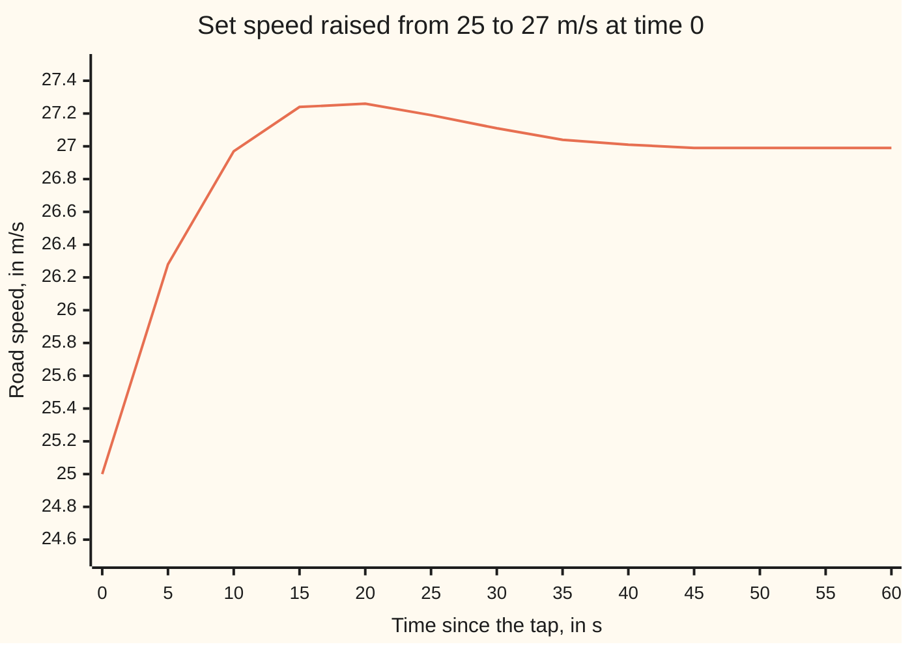
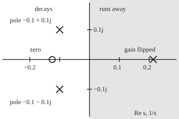

# Poles and zeros: where a response decays, rings, or runs away

Engineering mathematics → Linear Systems and Transforms → Reading modes off the s-plane → Poles and zeros

---

## General Overview

A 1,500 kg car holds 25 m/s (90.0 km/h) on cruise control. The driver taps "+" twice and asks for 27 m/s. The controller compares the set speed with the measured speed. It pushes the throttle in proportion to the shortfall, and it also keeps a running total of the shortfall and pushes in proportion to that. The running total is an **integrator**: while any shortfall remains, the push keeps growing, so the car cannot settle a little slow.

The engineer wants four answers before the car leaves the factory. Does the speed settle at 27 m/s? How far past it does the car go? How long does it swing about? Could a wrong setting make it run away? For this car the answers are: yes; to 27.2684 m/s, 18.16 s after the tap; one slow swing every 62.83 s, inside an envelope that halves every 6.93 s; and yes, if the controller's gain is wired with the wrong sign.

All four answers come from a handful of numbers called **poles**. A linear system's response to a kick or a step is a sum of exponentials, and each pole is the rate inside one of them. A pole works like a tuning fork the system carries: strike the system and each fork sounds in its own way. From here on each fork's sound is called a **mode**. The real part of a pole says whether its mode fades or grows. The imaginary part says how fast it rings. **Zeros**, the other half of the title, set how loudly each mode sounds. With the poles fixed they never decide whether it fades, though a zero inside a feedback loop can move the poles themselves (Step 6).

**Factor the transfer function: each pole is one mode of the response, decaying if its real part is negative, ringing if it has an imaginary part, running away if its real part is positive; the system turns every bounded input into a bounded output exactly when all its poles have negative real part.**

**What kind of fact this is:** a theorem, the bounded-input bounded-output test, proved on this card in Why it works; poles, zeros and modes are definitions.

### The picture: the car's speed after the tap



The line is the simulated speed, sampled every 5 s. It passes 27 m/s at 10.304 s, peaks at 27.2684 m/s at 18.16 s, and reads 27.01 m/s at 40 s. The slight dip below 27 m/s around 50 s is the second swing of the same ring, far smaller than the first.

---

## The formula

Reminder from [impulse-response-and-transfer-functions](02-impulse-response-and-transfer-functions.md): the transfer function $G(s)$ says what the system does to each exponential e^(st) fed into it, and its inverse Laplace transform is the impulse response, written h(t) there and $g(t)$ here, the output after one sharp kick. Engineers write j for the square root of −1, as this wing does; the rest of the library writes i.

For the car on cruise control, from set speed to road speed (derived in Step 1):

$$G(s) = \frac{0.16\,(s + 0.125)}{s^2 + 0.2\,s + 0.02} = \frac{0.16\,(s - z_1)}{(s - p_1)(s - p_2)}, \qquad p_{1,2} = -0.1 \pm 0.1j, \quad z_1 = -0.125.$$

A **pole** is a value of $s$ where the denominator is zero and $G(s)$ blows up. A **zero** is a value of $s$ where the numerator is zero and the system blocks that exponential completely. With distinct poles, partial fractions split $G(s)$ into one simple piece per pole, and each piece is the transform of one exponential:

$$G(s) = \sum_{i=1}^{n} \frac{r_i}{s - p_i} \quad\Longrightarrow\quad g(t) = \sum_{i=1}^{n} r_i\, e^{p_i t}, \qquad r_i = \lim_{s \to p_i} (s - p_i)\,G(s).$$

**Read it aloud:** the kick response is one exponential per pole, each scaled by its residue.

The test that the poles decide:

$$\text{every input with } |\text{input}(t)| \le M \text{ gives a bounded output} \iff \int_0^\infty |g(t)|\,dt < \infty \iff \operatorname{Re} p_i < 0 \text{ for every } i.$$

**Read it aloud:** a system is stable in the bounded-input bounded-output sense, BIBO for short, exactly when the area under the size of its kick response, |g(t)|, is finite, and that happens exactly when every pole sits strictly left of the imaginary axis. The output then never exceeds $M$ times that area.

| Symbol | Plain meaning | In our example | Push it up and the answer… |
| --- | --- | --- | --- |
| $s$ | the rate in a test exponential e^(st), in 1/s; complex, its imaginary part in rad/s | any complex number | — |
| $G(s)$ | transfer function, set speed to road speed | 0.16 (s + 0.125) / (s^2 + 0.2 s + 0.02) | — |
| $p_i$ | a pole: a root of the denominator, in 1/s | −0.1 ± 0.1j | real part up: slower decay, then growth past 0 |
| $\sigma$, $\omega$ | decay rate and ring rate: the pole is −σ ± jω | 0.1 1/s and 0.1 rad/s | σ up: faster settling; ω up: faster ring |
| $z_i$ | a zero: a root of the numerator, in 1/s | −0.125 | with the poles held: toward 0, bigger overshoot; past 0, a dip first |
| $r_i$ | residue: how much of mode i the kick excites | 0.08 − 0.02j | bigger swing in that mode |
| $t$, $g(t)$ | time in s; impulse response, per s | g(0) = 0.16 per s | — |
| $m$, $b$ | car mass in kg; drag slope in N per (m/s) | 1,500 kg; 60 N per (m/s) | m up: slower car pole −b/m |
| $k$ | controller gain, N of push per (m/s) of shortfall | 240 N per (m/s) | poles move: table in Step 2 |
| $a$ | controller zero at s = −a, in 1/s | 0.125 1/s | integrator acts harder |
| $M$ | the largest size the input ever reaches | ±1 m/s of set-speed change | output bound grows with it |
| $v$, $u$, $E$ | in Step 1: speed change in m/s; throttle push in N; the shortfall, set speed minus speed, in m/s | E starts at 2 m/s after the tap; v ends at 2 m/s | — |
| $T$, $\tau$ | in Step 4: the time the output is read, and the age of each slice of input, in s | τ from 0 to T | — |

### When it holds

- **Linear and time-invariant.** Real drag grows with the square of speed; the card uses its slope near 25 m/s. For a 10 m/s change the straight line gives 600 N of extra drag where a 1.2 v^2 law gives 720 N, so poles drawn at 25 m/s do not describe a jump to 35 m/s.
- **A rational G with common factors cancelled.** A zero that lands on a pole erases it from $G(s)$, but the mode is still inside the machine: an erased runaway pole still runs away, unseen at the output (state-space-models-and-the-matrix-exponential tracks it).
- **Distinct poles, or care with repeats.** A pole repeated twice gives a mode t e^(pt). The test is unchanged in the open left half-plane, but a repeated pole on the axis grows like t.
- **Numerator degree below the denominator's, for the sum as written.** At equal degree G also has a constant term: that share of the input passes straight through, so g gains an instant spike of that size, and the area of |g| gains the size too. Above it, a pure differentiator, G(s) = s, has no pole yet fails the test: a bounded input that wiggles ever faster has an unbounded slope.
- **Starting from rest.** BIBO is about the input-to-output map with zero initial stored energy; a start from a disturbed state adds the same modes with other amounts.

---

## Why it works

### Step 0: exponentials pass through unchanged in shape

A linear, time-invariant system fed e^(st) returns G(s) e^(st): same exponential, new size. A rational G also splits, by algebra, into simple fractions, and each fraction 1/(s − p) is the transform of one exponential e^(pt). So the response is a sum of exponentials, and the poles are their rates. Everything below is that one idea, read off the s-plane: the plane of complex values of s, real part across and imaginary part up, drawn after Step 2.

### Step 1: turn the car into a transfer function

Call the speed change v, in m/s, and the throttle push u, in N. Newton's law with linearised drag: m v' = −b v + u. The car alone has transfer function 1/(m s + b), one pole at −b/m = −0.04 1/s: a time constant of 25.0 s. This is a draggier vehicle than the car of [linear-time-invariant-systems-and-convolution](01-linear-time-invariant-systems-and-convolution.md): the same mass, but more than twice the drag slope, so it answers faster.

The controller pushes u = k E + k a × (running total of E), where E is the shortfall, set speed minus speed. Its transfer function is k + k a / s = k (s + a)/s: a **pole at the origin**, the integrator, and a zero at −a = −0.125 1/s. Closing the loop, v = (controller × car)(set speed − v), and solving for v over set speed:

$$G(s) = \frac{(k/m)(s + a)}{s^2 + \frac{b + k}{m}\, s + \frac{k a}{m}} = \frac{0.16\,(s + 0.125)}{s^2 + 0.2\,s + 0.02}.$$

G(0) = 0.02 / 0.02 = 1.0000: a held change in set speed ends as the same change in road speed. That is the integrator's job, and [final-value-theorem-and-steady-gain](05-final-value-theorem-and-steady-gain.md) proves it in general.

### Step 2: factor, and read one mode per pole

The quadratic formula on s^2 + 0.2 s + 0.02 gives −0.1 ± 0.1j. Each pole p = −σ + jω gives a mode e^(−σt) times a turn at ω rad/s; a conjugate pair combines into a real mix of e^(−σt) cos ωt and e^(−σt) sin ωt ([complex-roots-and-damped-oscillation](../../08-Differential%20equations%20and%20dynamics/03-Oscillators%20-%20Second-Order%20Linear%20Equations/03-complex-roots-and-damped-oscillation.md)). So:

- σ = 0.1 1/s: the envelope halves every ln 2 / 0.1 = 6.93 s.
- ω = 0.1 rad/s: one swing every 2π / 0.1 = 62.83 s.

The integrator's pole did not stay at the origin. Feedback moved it. The gain k sets where both poles go:

| Gain k, N per (m/s) | Poles, 1/s | The speed |
| --- | --- | --- |
| 0 (controller off) | 0 and −0.04 | holds any error forever |
| 60 | −0.04 ± 0.0583j | rings, decays slowly |
| 240 (this car) | −0.1 ± 0.1j | rings once, settles |
| 960 | −0.1513 and −0.5287 | no ring from the poles |

### The picture: the s-plane, to scale

Real part of s across, imaginary part up, 600 px per 1/s. Crosses are poles, the circle is the zero. The shaded half is where a pole runs away.

<p align="center"></p>

The two crosses on the left are this car's poles. The circle at −0.125 is the controller's zero. The lone cross at +0.2136 is the pole a flipped gain sign produces (its partner, −0.0936, sits near the others and is left off).

### Step 3: the residues say how much of each mode

The residue at p1 is the rest of G with the factor (s − p1) removed, evaluated at p1:

$$r_1 = \frac{0.16\,p_1 + 0.02}{p_1 - p_2} = \frac{0.004 + 0.016j}{0.2j} = 0.08 - 0.02j,$$

and r2 is its mirror image, 0.08 + 0.02j. Adding the pair:

$$g(t) = e^{-0.1t}\,(0.16 \cos 0.1t + 0.04 \sin 0.1t)\ \text{per s}.$$

The response to the tap is the running area of g, so its own residues are those of G(s)/s: 1 at the new pole s = 0, and r1/p1 = −0.5 − 0.3j at p1. Per m/s of set-speed change,

$$\text{speed change}(t) = 1 - e^{-0.1t}\,(\cos 0.1t - 0.6 \sin 0.1t).$$

### Step 4: a bounded input gives a bounded output exactly when the area of |g| is finite

The output is the input smeared by g, a convolution ([linear-time-invariant-systems-and-convolution](01-linear-time-invariant-systems-and-convolution.md)): at time T it is the integral of g(τ) times the input at T − τ, over τ from 0 to T. If the input never exceeds M, each slice is at most M |g(τ)|, so the output never exceeds M times the area of |g|.

The converse needs one cruel input. Choose the input at time T − τ to be +M wherever g(τ) is positive and −M wherever it is negative. Every slice then adds, and the output at T equals M times the area of |g| up to T. If that area grows without limit, inputs within ±M drive the output past any bound, so no bound of the form M times a constant covers them all. For a rational G a single input does it, as the poles of Step 5 show: a pole at 0 or in the right half makes a held step's output grow without limit, and a pair at ±jω does the same to a sine at ω.

For the car the area of |g| is 1.280471. Wiggle the set speed in any pattern within ±1 m/s and the road speed moves at most 1.28 m/s from 25 m/s. The worst pattern, simulated, reaches 1.280471. The signed area of g is 1.000000, which is G(0), where a held input ends up. Even the step's peak, 1.1342, falls short of the cruel input's 1.280471.

### Step 5: finite area exactly when every pole is in the left half-plane

One mode r e^(pt) has size |r| e^(t Re p). With Re p < 0 its area is |r| / (−Re p), finite; a finite sum of finite areas is finite. With Re p = 0 the size never shrinks; with Re p > 0 it grows. Exponentials with different rates cannot cancel each other for all time, so one such mode is enough to make the area infinite.

<details>
<summary>Detailed proof: one pole with Re p ≥ 0 makes the area infinite</summary>

Let q be the largest real part among the poles, q ≥ 0, and let the poles with that real part be q + jω_1, …, q + jω_r, the largest power of t among their modes being t^d. Divide g by t^d e^(qt). As t grows, the terms from poles with smaller real part, or lower power of t, die away, and what is left is a trigonometric sum c_1 e^(jω_1 t) + … + c_r e^(jω_r t) with distinct ω and not all c zero. Its average squared size over a long time is c^2 = |c_1|^2 + … + |c_r|^2 > 0, since the cross terms average to zero. The sum never exceeds B = |c_1| + … + |c_r|, so the share of time where its size is below c/2 cannot exceed 1 − 3c^2/(4B^2); on the rest of every long interval, once the dying terms have fallen below c/4, |g(t)| is at least c/4 times t^d e^(qt), which is at least c/4 for t ≥ 1. The area of |g| then grows at least in proportion to the length of the interval, and is infinite.

</details>

### Step 6: the zeros of a given G set the amounts, not the stability

The zeros of a given G sit in its numerator, so they move its residues, not its poles. Move the zero of G with its denominator held fixed, and the same two poles give a different speed curve:

- **Zero at −0.125 (this car):** overshoot 13.42%.
- **No zero, same poles and G(0):** overshoot 4.32%, which is e^(−πσ/ω) = e^(−π) for σ = ω.
- **Zero at +0.125:** the speed first moves the wrong way, to 24.41 m/s at 4.18 s, before rising to a peak of 1.0560 per m/s requested.

That holds for G with its poles fixed. This car's zero is the controller's own, at −a, and a also enters the denominator through ka/m. Put the controller's zero at +0.125, so a = −0.125, and the denominator becomes s^2 + 0.2 s − 0.02, with poles +0.0732 and −0.2732 1/s: the car runs away. A zero inside a loop pulls the closed-loop poles towards it as the gain grows, the subject of [root-locus](../03-Feedback%20Control/05-root-locus.md).

A system whose zeros all sit in the left half-plane is called **minimum-phase**. A right-half-plane zero can be split off as an **all-pass** factor, (a − s)/(a + s), which keeps every frequency's size and adds only delay to its phase ([frequency-response-and-bode-plots](04-frequency-response-and-bode-plots.md)). That delay is why a right-half-plane zero limits how fast any controller can make the system respond.

**Another route.** The poles are also the eigenvalues of the car-and-controller state matrix, and state-space-models-and-the-matrix-exponential reads stability from there. When only the sign of the real parts matters, [routh-hurwitz-criterion](../03-Feedback%20Control/04-routh-hurwitz-criterion.md) decides it from the denominator's coefficients without finding a single root.

---

## Worked numbers, by hand

| Step | Arithmetic | Value |
| --- | --- | --- |
| Coefficients | k/m = 240/1,500; (b + k)/m = 300/1,500; k a/m = 30/1,500 | 0.16, 0.2, 0.02 |
| Discriminant | 0.2^2 − 4 × 0.02 | −0.04 |
| Poles | (−0.2 ± √−0.04)/2 = (−0.2 ± 0.2j)/2 | −0.1 ± 0.1j |
| Residue at p1 | (0.16 × (−0.1 + 0.1j) + 0.02)/(0.2j) = (0.004 + 0.016j)/(0.2j) | 0.08 − 0.02j |
| Step residue at p1 | (0.08 − 0.02j)/(−0.1 + 0.1j) | −0.5 − 0.3j |
| Speed change per m/s | 1 + 2 Re((−0.5 − 0.3j) e^(p1 t)) | 1 − e^(−0.1t)(cos 0.1t − 0.6 sin 0.1t) |
| Peak time | slope g(t) = 0: tan 0.1t = −4, 0.1t = π − arctan 4 | 18.16 s |
| Peak speed | 25 + 2 × (1 + overshoot 0.1342) | **27.2684 m/s** |

The car overshoots its new set speed by 13.42% of the requested change, peaks 18.16 s after the tap, and reads 27.01 m/s at 40 s.

### What breaks if you drop a piece

| Mistake | Comes out at | What went wrong |
| --- | --- | --- |
| Calling the integrator alone stable, since its pole is not in the right half | a held 1 m/s shortfall builds 3000.0 N in 100 s and 30000.0 N in 1000 s | a pole at the origin is a mode that never decays: its area grows without bound |
| Wiring the gain with the wrong sign, k = −240 | poles +0.2136 and −0.0936; speed change −500.15 per m/s requested at 30 s | one pole crossed into the right half; the linear model has left reality, and a real throttle hits its stop long before |
| Judging stability by a zero of the closed-loop G, its poles fixed | zero at +0.125: speed first drops to 24.41 m/s | that zero moves residues only; the poles, and the stability, did not change (the controller's own zero is another matter: Step 6) |
| Using the poles far from 25 m/s | a 10 m/s change: 600 N linear against 720 N | the drag slope 60 N per (m/s) holds near 25 m/s only |

---

## Code, from first principles, and it actually runs

Both programs take three roads to the same speed curve. Road 1 is the formula: quadratic formula for the poles, residues by partial fractions, the speed as a sum of modes. Road 2 simulates the car's force balance and the controller's running total with a fourth-order Runge-Kutta step of 0.01 s, with no transfer function anywhere, and must match road 1 to 1e-12. Road 3 reads the poles back from the simulated curve alone: the gap between crossings of 27 m/s gives ω, the ratio of the first two swings gives σ. The BIBO area is computed by Simpson's rule and then reached by simulating the cruel ±1 command. The flipped-gain run measures its growth rate and compares it with the right-half-plane pole.

### Python

```python
# Poles, zeros and stability: cruise control with an integrator. Standard library only.
# Road 1: poles from the quadratic formula, modes from partial fractions (residues).
# Road 2: RK4 simulation of the car and controller, with no transfer function in sight.
# Road 3: the poles read back from the simulated wiggle (crossing times, peak ratios).
# BIBO: the area under |g(t)| by Simpson's rule, against the worst bounded command, simulated.
import math

m, b = 1500.0, 60.0      # car mass in kg; drag slope in N per (m/s), linearised near 25 m/s
k, a = 240.0, 0.125      # controller gain in N per (m/s); controller zero at s = -a, a in 1/s

def cexp(z):             # e^z for a complex z, written out
    return complex(math.exp(z.real) * math.cos(z.imag), math.exp(z.real) * math.sin(z.imag))

def roots(d1, d0):       # the two roots of s^2 + d1 s + d0, as complex numbers
    disc = d1 * d1 - 4.0 * d0
    if disc >= 0.0:
        q = math.sqrt(disc)
        return complex((-d1 + q) / 2.0, 0.0), complex((-d1 - q) / 2.0, 0.0)
    q = math.sqrt(-disc)
    return complex(-d1 / 2.0, q / 2.0), complex(-d1 / 2.0, -q / 2.0)

def loop(kk, aa):               # closed loop G(s) = (c1 s + c0) / (s^2 + d1 s + d0)
    return kk / m, kk * aa / m, (b + kk) / m, kk * aa / m

def modes(c1, c0, d1, d0):      # partial fractions: G(s) = r1/(s - p1) + r2/(s - p2)
    p1, p2 = roots(d1, d0)
    return [(p1, (c1 * p1 + c0) / (p1 - p2)), (p2, (c1 * p2 + c0) / (p2 - p1))]

def g_of(t, ms):                # impulse response: sum of r e^(p t)
    return sum((r * cexp(p * t)).real for p, r in ms)

def y_of(t, ms, dc):            # unit step response: G(0) + sum of (r/p) e^(p t)
    return dc + sum((r / p * cexp(p * t)).real for p, r in ms)

def simulate(kk, aa, T, dt, cmd):   # states: v speed change, w summed error
    def f(v, w, rr):
        e = rr - v
        return (-b * v + kk * e + kk * aa * w) / m, e   # m v' = -b v + throttle force
    v = w = 0.0
    out = [0.0]
    for i in range(int(round(T / dt))):
        rr = cmd((i + 0.5) * dt)                # command held over each step
        k1 = f(v, w, rr)
        k2 = f(v + dt / 2 * k1[0], w + dt / 2 * k1[1], rr)
        k3 = f(v + dt / 2 * k2[0], w + dt / 2 * k2[1], rr)
        k4 = f(v + dt * k3[0], w + dt * k3[1], rr)
        v += dt / 6 * (k1[0] + 2 * k2[0] + 2 * k3[0] + k4[0])
        w += dt / 6 * (k1[1] + 2 * k2[1] + 2 * k3[1] + k4[1])
        out.append(v)
    return out

def fc(p):
    return f"{p.real:+.4f} {p.imag:+.4f}j"

print(f"car alone, pole            {-b / m:+.4f} 1/s, time constant {m / b:.1f} s")
print(f"controller, pole {0.0:+.4f} 1/s, zero {-a:+.4f} 1/s, integrator slope {k * a:.1f} N/s per m/s")
print(f"integrator area to 100 s   {k * a * 100:.1f}, to 1000 s {k * a * 1000:.1f}")
for kk in (0.0, 60.0, 240.0, 960.0):
    p1, p2 = roots(*loop(kk, a)[2:])
    print(f"gain k = {kk:5.0f}: poles {fc(p1)}  {fc(p2)}")
c1, c0, d1, d0 = loop(k, a)
ms = modes(c1, c0, d1, d0)
dc = c0 / d0
print(f"G(s) = ({c1:.4f} s + {c0:.4f}) / (s^2 + {d1:.4f} s + {d0:.4f}), G(0) = {dc:.4f}")
p1, p2 = ms[0][0], ms[1][0]
print(f"hand: discriminant {d1 * d1 - 4 * d0:+.4f}, c1 p1 + c0 = {fc(c1 * p1 + c0)}, p1 - p2 = {fc(p1 - p2)}")
for p, r in ms:
    print(f"pole {fc(p)}  residue {fc(r)}  step residue {fc(r / p)}")

dt = 0.01
sim = simulate(k, a, 120.0, dt, lambda t: 1.0)
err = max(abs(sim[i] - y_of(i * dt, ms, dc)) for i in range(len(sim)))
print(f"road 1 vs road 2, largest step-response gap below 1e-12: {'yes' if err < 1e-12 else 'NO'}")
print("chart, t (s)       " + " ".join(f"{5 * i:5d}" for i in range(13)))
print("chart, speed (m/s) " + " ".join(f"{25 + 2 * sim[500 * i]:5.2f}" for i in range(13)))
ipk = max(range(len(sim)), key=lambda i: sim[i])
tpk = (math.pi - math.atan(4.0)) / 0.1
print(f"peak: sim {25 + 2 * sim[ipk]:.4f} m/s at {ipk * dt:.2f} s; formula {25 + 2 * y_of(tpk, ms, dc):.4f} m/s at {tpk:.2f} s")

cross = [(i - 1 + (1 - sim[i - 1]) / (sim[i] - sim[i - 1])) * dt
         for i in range(1, len(sim)) if (sim[i - 1] - 1) * (sim[i] - 1) < 0]
ext = [sim[i] - 1 for i in range(1, len(sim) - 1)
       if (sim[i] - sim[i - 1]) * (sim[i + 1] - sim[i]) < 0]
w_back = math.pi / (cross[1] - cross[0])
s_back = -w_back / math.pi * math.log(abs(ext[0] / ext[1]))
print(f"road 3: crossings {cross[0]:.3f} s, {cross[1]:.3f} s; extremes {ext[0]:+.5f}, {ext[1]:+.5f}")
print(f"road 3: poles read back {s_back:+.4f} {w_back:+.4f}j")

def simpson(f, n=40000, h=0.005):              # Simpson's rule on 0..200 s
    return sum((1 if j in (0, n) else 4 if j % 2 else 2) * f(j * h) for j in range(n + 1)) * h / 3

area = simpson(lambda t: abs(g_of(t, ms)))
T = 200.0
worst = simulate(k, a, T, 0.005, lambda t: 1.0 if g_of(T - t, ms) >= 0 else -1.0)
print(f"BIBO area of |g| {area:.6f}; worst +-1 command, simulated {worst[-1]:.6f}")
print(f"g(0) = {g_of(0.0, ms):.4f} per s; signed area of g {simpson(lambda t: g_of(t, ms)):.6f}")

bc1, bc0, bd1, bd0 = loop(-k, a)               # gain sign flipped: k -> -k
bms = modes(bc1, bc0, bd1, bd0)
print(f"sign error, poles {fc(bms[0][0])}  {fc(bms[1][0])}")
bad = simulate(-k, a, 60.0, dt, lambda t: 1.0)
rate = math.log(bad[6000] / bad[5000]) / 10.0
print(f"sign error, y at 30 s: formula {y_of(30.0, bms, bc0 / bd0):.2f}, sim {bad[3000]:.2f}; growth rate {rate:.4f} 1/s")

zr = modes(-c1, c0, d1, d0)                    # zero moved to s = +a: same poles
yr = [y_of(i * dt, zr, dc) for i in range(6001)]
i0 = min(range(len(yr)), key=lambda i: yr[i])
nz = modes(0.0, c0, d1, d0)                    # no zero at all: same poles
yn = max(y_of(i * dt, nz, dc) for i in range(6001))
print(f"zero at +a: dip {yr[i0]:+.4f} at {i0 * dt:.2f} s ({25 + 2 * yr[i0]:.2f} m/s), peak {max(yr):.4f}")
print(f"no zero: peak {yn:.4f}, 1 + e^-pi {1 + math.exp(-math.pi):.4f}")
cz1, cz2 = roots(*loop(k, -a)[2:])             # the controller's own zero moved to +a: a sits in k a/m too
print(f"controller zero at +a, closed loop: poles {fc(cz1)}  {fc(cz2)}")
print(f"ring period {2 * math.pi / p1.imag:.2f} s, envelope halves every {math.log(2) / -p1.real:.2f} s, "
      f"25 m/s = {25 * 3.6:.1f} km/h, overshoot {100 * (sim[ipk] - 1):.2f} %, no zero {100 * (yn - 1):.2f} %")
px = lambda z: f"({180 + 600 * z.real:.1f},{120 - 600 * z.imag:.1f})"
print(f"figure, 600 px per 1/s: poles {px(ms[0][0])} {px(ms[1][0])}, zero {px(complex(-a, 0))}, flipped {px(bms[0][0])}")
print(f"drag +10 m/s from 25: linear {b * 10:.0f} N, quadratic 1.2 v^2 {1.2 * (35 ** 2 - 25 ** 2):.0f} N")

assert err < 1e-12, "RK4 simulation must match the partial-fraction step response"
assert abs(s_back - ms[0][0].real) < 1e-3 and abs(w_back - ms[0][0].imag) < 1e-3, "poles read back"
assert abs(worst[-1] - area) < 1e-4, "worst bounded command reaches the BIBO area"
assert abs(rate - bms[0][0].real) < 1e-3, "runaway rate equals the right-half-plane pole"
assert abs(yn - (1 + math.exp(-math.pi))) < 1e-6, "no-zero peak against the damping formula"
print("ALL CHECKS PASS")
```

**Ran 2026-10-06 on macOS, Python 3.14.6, standard library only. All checks passed. Output, pasted from the run:**

```
car alone, pole            -0.0400 1/s, time constant 25.0 s
controller, pole +0.0000 1/s, zero -0.1250 1/s, integrator slope 30.0 N/s per m/s
integrator area to 100 s   3000.0, to 1000 s 30000.0
gain k =     0: poles +0.0000 +0.0000j  -0.0400 +0.0000j
gain k =    60: poles -0.0400 +0.0583j  -0.0400 -0.0583j
gain k =   240: poles -0.1000 +0.1000j  -0.1000 -0.1000j
gain k =   960: poles -0.1513 +0.0000j  -0.5287 +0.0000j
G(s) = (0.1600 s + 0.0200) / (s^2 + 0.2000 s + 0.0200), G(0) = 1.0000
hand: discriminant -0.0400, c1 p1 + c0 = +0.0040 +0.0160j, p1 - p2 = +0.0000 +0.2000j
pole -0.1000 +0.1000j  residue +0.0800 -0.0200j  step residue -0.5000 -0.3000j
pole -0.1000 -0.1000j  residue +0.0800 +0.0200j  step residue -0.5000 +0.3000j
road 1 vs road 2, largest step-response gap below 1e-12: yes
chart, t (s)           0     5    10    15    20    25    30    35    40    45    50    55    60
chart, speed (m/s) 25.00 26.28 26.97 27.24 27.26 27.19 27.11 27.04 27.01 26.99 26.99 26.99 26.99
peak: sim 27.2684 m/s at 18.16 s; formula 27.2684 m/s at 18.16 s
road 3: crossings 10.304 s, 41.720 s; extremes +0.13418, -0.00580
road 3: poles read back -0.1000 +0.1000j
BIBO area of |g| 1.280471; worst +-1 command, simulated 1.280471
g(0) = 0.1600 per s; signed area of g 1.000000
sign error, poles +0.2136 +0.0000j  -0.0936 +0.0000j
sign error, y at 30 s: formula -500.15, sim -500.15; growth rate 0.2136 1/s
zero at +a: dip -0.2965 at 4.18 s (24.41 m/s), peak 1.0560
no zero: peak 1.0432, 1 + e^-pi 1.0432
controller zero at +a, closed loop: poles +0.0732 +0.0000j  -0.2732 +0.0000j
ring period 62.83 s, envelope halves every 6.93 s, 25 m/s = 90.0 km/h, overshoot 13.42 %, no zero 4.32 %
figure, 600 px per 1/s: poles (120.0,60.0) (120.0,180.0), zero (105.0,120.0), flipped (308.2,120.0)
drag +10 m/s from 25: linear 600 N, quadratic 1.2 v^2 720 N
ALL CHECKS PASS
```

### Rust

```rust
// Poles, zeros and stability: cruise control with an integrator. Rust std only.
// Road 1: poles from the quadratic formula, modes from partial fractions (residues).
// Road 2: RK4 simulation of the car and controller, with no transfer function in sight.
// Road 3: the poles read back from the simulated wiggle (crossing times, peak ratios).
// BIBO: the area under |g(t)| by Simpson's rule, against the worst bounded command, simulated.
use std::f64::consts::PI;

const M: f64 = 1500.0; // car mass in kg
const B: f64 = 60.0; // drag slope in N per (m/s), linearised near 25 m/s
const K: f64 = 240.0; // controller gain in N per (m/s)
const A: f64 = 0.125; // controller zero at s = -a, a in 1/s

#[derive(Clone, Copy)]
struct C { re: f64, im: f64 }
impl C {
    fn new(re: f64, im: f64) -> C { C { re, im } }
    fn sub(self, o: C) -> C { C::new(self.re - o.re, self.im - o.im) }
    fn mul(self, o: C) -> C { C::new(self.re * o.re - self.im * o.im, self.re * o.im + self.im * o.re) }
    fn scale(self, x: f64) -> C { C::new(self.re * x, self.im * x) }
    fn div(self, o: C) -> C {
        let d = o.re * o.re + o.im * o.im;
        C::new((self.re * o.re + self.im * o.im) / d, (self.im * o.re - self.re * o.im) / d)
    }
    fn exp(self) -> C { let e = self.re.exp(); C::new(e * self.im.cos(), e * self.im.sin()) }
}

fn roots(d1: f64, d0: f64) -> (C, C) { // the two roots of s^2 + d1 s + d0
    let disc = d1 * d1 - 4.0 * d0;
    if disc >= 0.0 {
        let q = disc.sqrt();
        (C::new((-d1 + q) / 2.0, 0.0), C::new((-d1 - q) / 2.0, 0.0))
    } else {
        let q = (-disc).sqrt();
        (C::new(-d1 / 2.0, q / 2.0), C::new(-d1 / 2.0, -q / 2.0))
    }
}

fn lp(kk: f64, aa: f64) -> (f64, f64, f64, f64) { // closed loop G(s) = (c1 s + c0) / (s^2 + d1 s + d0)
    (kk / M, kk * aa / M, (B + kk) / M, kk * aa / M)
}

fn modes(c1: f64, c0: f64, d1: f64, d0: f64) -> [(C, C); 2] { // partial fractions
    let (p1, p2) = roots(d1, d0);
    let r1 = p1.scale(c1).sub(C::new(-c0, 0.0)).div(p1.sub(p2));
    let r2 = p2.scale(c1).sub(C::new(-c0, 0.0)).div(p2.sub(p1));
    [(p1, r1), (p2, r2)]
}

fn g_of(t: f64, ms: &[(C, C); 2]) -> f64 { ms.iter().map(|&(p, r)| r.mul(p.scale(t).exp()).re).sum() }

fn y_of(t: f64, ms: &[(C, C); 2], dc: f64) -> f64 {
    dc + ms.iter().map(|&(p, r)| r.div(p).mul(p.scale(t).exp()).re).sum::<f64>()
}

fn simulate(kk: f64, aa: f64, t_end: f64, dt: f64, cmd: &dyn Fn(f64) -> f64) -> Vec<f64> {
    let f = |v: f64, w: f64, rr: f64| { let e = rr - v; ((-B * v + kk * e + kk * aa * w) / M, e) };
    let (mut v, mut w) = (0.0, 0.0);
    let mut out = vec![0.0];
    for i in 0..(t_end / dt).round() as usize {
        let rr = cmd((i as f64 + 0.5) * dt); // command held over each step
        let k1 = f(v, w, rr);
        let k2 = f(v + dt / 2.0 * k1.0, w + dt / 2.0 * k1.1, rr);
        let k3 = f(v + dt / 2.0 * k2.0, w + dt / 2.0 * k2.1, rr);
        let k4 = f(v + dt * k3.0, w + dt * k3.1, rr);
        v += dt / 6.0 * (k1.0 + 2.0 * k2.0 + 2.0 * k3.0 + k4.0);
        w += dt / 6.0 * (k1.1 + 2.0 * k2.1 + 2.0 * k3.1 + k4.1);
        out.push(v);
    }
    out
}

fn fc(p: C) -> String { format!("{:+.4} {:+.4}j", p.re, p.im) }

fn simpson(f: &dyn Fn(f64) -> f64) -> f64 { // Simpson's rule on 0..200 s
    let (n, h) = (40000usize, 0.005);
    (0..=n).map(|j| (if j == 0 || j == n { 1.0 } else if j % 2 == 1 { 4.0 } else { 2.0 }) * f(j as f64 * h)).sum::<f64>() * h / 3.0
}

fn main() {
    println!("car alone, pole            {:+.4} 1/s, time constant {:.1} s", -B / M, M / B);
    println!("controller, pole {:+.4} 1/s, zero {:+.4} 1/s, integrator slope {:.1} N/s per m/s", 0.0, -A, K * A);
    println!("integrator area to 100 s   {:.1}, to 1000 s {:.1}", K * A * 100.0, K * A * 1000.0);
    for kk in [0.0, 60.0, 240.0, 960.0] {
        let (_, _, d1, d0) = lp(kk, A);
        let (p1, p2) = roots(d1, d0);
        println!("gain k = {:5.0}: poles {}  {}", kk, fc(p1), fc(p2));
    }
    let (c1, c0, d1, d0) = lp(K, A);
    let ms = modes(c1, c0, d1, d0);
    let dc = c0 / d0;
    println!("G(s) = ({:.4} s + {:.4}) / (s^2 + {:.4} s + {:.4}), G(0) = {:.4}", c1, c0, d1, d0, dc);
    let (p1, p2) = (ms[0].0, ms[1].0);
    println!("hand: discriminant {:+.4}, c1 p1 + c0 = {}, p1 - p2 = {}", d1 * d1 - 4.0 * d0, fc(p1.scale(c1).sub(C::new(-c0, 0.0))), fc(p1.sub(p2)));
    for &(p, r) in ms.iter() {
        println!("pole {}  residue {}  step residue {}", fc(p), fc(r), fc(r.div(p)));
    }

    let dt = 0.01;
    let sim = simulate(K, A, 120.0, dt, &|_t| 1.0);
    let err = (0..sim.len()).map(|i| (sim[i] - y_of(i as f64 * dt, &ms, dc)).abs()).fold(0.0, f64::max);
    println!("road 1 vs road 2, largest step-response gap below 1e-12: {}", if err < 1e-12 { "yes" } else { "NO" });
    let ts: Vec<String> = (0..13).map(|i| format!("{:5}", 5 * i)).collect();
    let vs: Vec<String> = (0..13).map(|i| format!("{:5.2}", 25.0 + 2.0 * sim[500 * i])).collect();
    println!("chart, t (s)       {}", ts.join(" "));
    println!("chart, speed (m/s) {}", vs.join(" "));
    let mut ipk = 0;
    for i in 0..sim.len() { if sim[i] > sim[ipk] { ipk = i; } }
    let tpk = (PI - 4.0f64.atan()) / 0.1;
    println!("peak: sim {:.4} m/s at {:.2} s; formula {:.4} m/s at {:.2} s",
             25.0 + 2.0 * sim[ipk], ipk as f64 * dt, 25.0 + 2.0 * y_of(tpk, &ms, dc), tpk);

    let mut cross = Vec::new();
    let mut ext = Vec::new();
    for i in 1..sim.len() {
        if (sim[i - 1] - 1.0) * (sim[i] - 1.0) < 0.0 {
            cross.push((i as f64 - 1.0 + (1.0 - sim[i - 1]) / (sim[i] - sim[i - 1])) * dt);
        }
        if i + 1 < sim.len() && (sim[i] - sim[i - 1]) * (sim[i + 1] - sim[i]) < 0.0 { ext.push(sim[i] - 1.0); }
    }
    let w_back = PI / (cross[1] - cross[0]);
    let s_back = -w_back / PI * (ext[0] / ext[1]).abs().ln();
    println!("road 3: crossings {:.3} s, {:.3} s; extremes {:+.5}, {:+.5}", cross[0], cross[1], ext[0], ext[1]);
    println!("road 3: poles read back {:+.4} {:+.4}j", s_back, w_back);

    let area = simpson(&|t| g_of(t, &ms).abs());
    let t_end = 200.0;
    let worst = simulate(K, A, t_end, 0.005, &|t| if g_of(t_end - t, &ms) >= 0.0 { 1.0 } else { -1.0 });
    let wl = worst[worst.len() - 1];
    println!("BIBO area of |g| {:.6}; worst +-1 command, simulated {:.6}", area, wl);
    println!("g(0) = {:.4} per s; signed area of g {:.6}", g_of(0.0, &ms), simpson(&|t| g_of(t, &ms)));

    let (bc1, bc0, bd1, bd0) = lp(-K, A); // gain sign flipped: k -> -k
    let bms = modes(bc1, bc0, bd1, bd0);
    println!("sign error, poles {}  {}", fc(bms[0].0), fc(bms[1].0));
    let bad = simulate(-K, A, 60.0, dt, &|_t| 1.0);
    let rate = (bad[6000] / bad[5000]).ln() / 10.0;
    println!("sign error, y at 30 s: formula {:.2}, sim {:.2}; growth rate {:.4} 1/s", y_of(30.0, &bms, bc0 / bd0), bad[3000], rate);

    let zr = modes(-c1, c0, d1, d0); // zero moved to s = +a: same poles
    let yr: Vec<f64> = (0..=6000).map(|i| y_of(i as f64 * dt, &zr, dc)).collect();
    let mut i0 = 0;
    for i in 0..yr.len() { if yr[i] < yr[i0] { i0 = i; } }
    let ymax = yr.iter().cloned().fold(f64::MIN, f64::max);
    let nz = modes(0.0, c0, d1, d0); // no zero at all: same poles
    let yn = (0..=6000).map(|i| y_of(i as f64 * dt, &nz, dc)).fold(f64::MIN, f64::max);
    println!("zero at +a: dip {:+.4} at {:.2} s ({:.2} m/s), peak {:.4}", yr[i0], i0 as f64 * dt, 25.0 + 2.0 * yr[i0], ymax);
    println!("no zero: peak {:.4}, 1 + e^-pi {:.4}", yn, 1.0 + (-PI).exp());
    let (_, _, zd1, zd0) = lp(K, -A); // the controller's own zero moved to +a: a sits in k a/m too
    let (cz1, cz2) = roots(zd1, zd0);
    println!("controller zero at +a, closed loop: poles {}  {}", fc(cz1), fc(cz2));
    println!("ring period {:.2} s, envelope halves every {:.2} s, 25 m/s = {:.1} km/h, overshoot {:.2} %, no zero {:.2} %",
             2.0 * PI / p1.im, 2f64.ln() / -p1.re, 25.0 * 3.6, 100.0 * (sim[ipk] - 1.0), 100.0 * (yn - 1.0));
    let px = |z: C| format!("({:.1},{:.1})", 180.0 + 600.0 * z.re, 120.0 - 600.0 * z.im);
    println!("figure, 600 px per 1/s: poles {} {}, zero {}, flipped {}", px(ms[0].0), px(ms[1].0), px(C::new(-A, 0.0)), px(bms[0].0));
    println!("drag +10 m/s from 25: linear {:.0} N, quadratic 1.2 v^2 {:.0} N", B * 10.0, 1.2 * (35.0f64.powi(2) - 25.0f64.powi(2)));

    assert!(err < 1e-12, "RK4 simulation must match the partial-fraction step response");
    assert!((s_back - ms[0].0.re).abs() < 1e-3 && (w_back - ms[0].0.im).abs() < 1e-3, "poles read back");
    assert!((wl - area).abs() < 1e-4, "worst bounded command reaches the BIBO area");
    assert!((rate - bms[0].0.re).abs() < 1e-3, "runaway rate equals the right-half-plane pole");
    assert!((yn - (1.0 + (-PI).exp())).abs() < 1e-6, "no-zero peak against the damping formula");
    println!("ALL CHECKS PASS");
}
```

**Ran 2026-10-06 on macOS, rustc 1.98.1, no crates. All checks passed. Output, pasted from the run:**

```
car alone, pole            -0.0400 1/s, time constant 25.0 s
controller, pole +0.0000 1/s, zero -0.1250 1/s, integrator slope 30.0 N/s per m/s
integrator area to 100 s   3000.0, to 1000 s 30000.0
gain k =     0: poles +0.0000 +0.0000j  -0.0400 +0.0000j
gain k =    60: poles -0.0400 +0.0583j  -0.0400 -0.0583j
gain k =   240: poles -0.1000 +0.1000j  -0.1000 -0.1000j
gain k =   960: poles -0.1513 +0.0000j  -0.5287 +0.0000j
G(s) = (0.1600 s + 0.0200) / (s^2 + 0.2000 s + 0.0200), G(0) = 1.0000
hand: discriminant -0.0400, c1 p1 + c0 = +0.0040 +0.0160j, p1 - p2 = +0.0000 +0.2000j
pole -0.1000 +0.1000j  residue +0.0800 -0.0200j  step residue -0.5000 -0.3000j
pole -0.1000 -0.1000j  residue +0.0800 +0.0200j  step residue -0.5000 +0.3000j
road 1 vs road 2, largest step-response gap below 1e-12: yes
chart, t (s)           0     5    10    15    20    25    30    35    40    45    50    55    60
chart, speed (m/s) 25.00 26.28 26.97 27.24 27.26 27.19 27.11 27.04 27.01 26.99 26.99 26.99 26.99
peak: sim 27.2684 m/s at 18.16 s; formula 27.2684 m/s at 18.16 s
road 3: crossings 10.304 s, 41.720 s; extremes +0.13418, -0.00580
road 3: poles read back -0.1000 +0.1000j
BIBO area of |g| 1.280471; worst +-1 command, simulated 1.280471
g(0) = 0.1600 per s; signed area of g 1.000000
sign error, poles +0.2136 +0.0000j  -0.0936 +0.0000j
sign error, y at 30 s: formula -500.15, sim -500.15; growth rate 0.2136 1/s
zero at +a: dip -0.2965 at 4.18 s (24.41 m/s), peak 1.0560
no zero: peak 1.0432, 1 + e^-pi 1.0432
controller zero at +a, closed loop: poles +0.0732 +0.0000j  -0.2732 +0.0000j
ring period 62.83 s, envelope halves every 6.93 s, 25 m/s = 90.0 km/h, overshoot 13.42 %, no zero 4.32 %
figure, 600 px per 1/s: poles (120.0,60.0) (120.0,180.0), zero (105.0,120.0), flipped (308.2,120.0)
drag +10 m/s from 25: linear 600 N, quadratic 1.2 v^2 720 N
ALL CHECKS PASS
```

The two outputs are identical line for line.

> [!TIP]
> **Try changing**
> - **Gain k from 240 to 60.** Guess first: faster or slower ring? The poles move to −0.04 ± 0.0583j: slower decay and slower ring, a lazier car.
> - **Gain k to 960.** Guess first: more ring or less? The poles become real, −0.1513 and −0.5287; the poles alone no longer ring.
> - **Flip the sign of k.** Guess first: how long until the model is useless? The pole at +0.2136 1/s doubles the error every few seconds; by 30 s the model asks for −500.15 per m/s requested.
> - **Move the zero to +0.125 in G only.** Guess first: does stability change? No: the same poles, but the speed dips to 24.41 m/s at 4.18 s before climbing.

---

## The usual mistake

> [!warning]
> **Treating a pole on the imaginary axis as stable because it is not in the right half.** A pole at the origin is a mode that holds forever, and a pair at ±jω is a ring that never fades. Neither passes the bounded-input bounded-output test. The integrator alone turns a steady 1 m/s shortfall into 3000.0 N after 100 s and 30000.0 N after 1000 s. That is useful inside a loop, where feedback pulls the pole left; on its own it is not stable.
>
> - **Judging the open loop instead of the closed loop.** Controller times car has poles at 0 and −0.04. The car people ride in has poles at −0.1 ± 0.1j. Stability belongs to the closed loop.
> - **Reading the imaginary part in hertz.** 0.1 is in rad/s. The period is 2π/0.1 = 62.83 s; reading 0.1 as hertz makes the period 2π times too short.
> - **Cancelling a bad pole with a zero.** On paper G loses the pole; in the car the mode is still there and still grows.
> - **Thinking a zero of the closed-loop G, its poles fixed, can stabilise or destabilise.** Moving that zero to +0.125 leaves the poles at −0.1 ± 0.1j; only the curve's shape changes, including a dip to 24.41 m/s. Moving the controller's zero there is different: it puts a closed-loop pole at +0.0732 1/s.

---

## Where you meet it in real life

- **Cruise control and adaptive cruise control.** The closed-loop poles set how far the car overshoots a new set speed and how long it takes to settle; this card's car overshoots by 0.2684 m/s.
- **Aircraft handling.** The short-period and phugoid modes of an aircraft's pitch are pole pairs; handling-quality specifications set the minimum damping of each.
- **Audio and anti-alias filters.** A filter's poles set its ring; a filter with poles near the axis rings audibly after a click ([frequency-response-and-bode-plots](04-frequency-response-and-bode-plots.md)).
- **Digital controllers.** In sampled time the same test reads "every pole inside the unit circle" ([z-transform-and-discrete-time-systems](08-z-transform-and-discrete-time-systems.md)).
- **Footbridges and tall buildings.** A lightly damped structural mode is a pole pair close to the imaginary axis; dampers are fitted to push it left.

> **Say it back**
> A linear system's response is a sum of exponentials, one per pole of its transfer function. A pole's real part sets decay or growth and its imaginary part sets the ring. The residues, shaped by the zeros, set how much of each mode appears. Bounded inputs give bounded outputs exactly when the kick response has finite area, which is exactly when every pole has negative real part. The cruise-control integrator's pole at the origin fails that test alone, and feedback moves it to −0.1 ± 0.1j, where the car rings once and settles.

---

## What this builds on

- [impulse-response-and-transfer-functions](02-impulse-response-and-transfer-functions.md): G(s) and its kick response g(t), the two objects this card factors.
- [rational-functions-and-partial-fractions](../../07-Complex%20analysis/05-Laurent%20Series%2C%20Singularities%20and%20Residues/03-rational-functions-and-partial-fractions.md): splitting a rational function into one piece per pole, with the residue formula.
- [complex-roots-and-damped-oscillation](../../08-Differential%20equations%20and%20dynamics/03-Oscillators%20-%20Second-Order%20Linear%20Equations/03-complex-roots-and-damped-oscillation.md): why a conjugate pair −σ ± jω is a ring inside a shrinking envelope.

## Where this goes next

- [frequency-response-and-bode-plots](04-frequency-response-and-bode-plots.md): the same poles and zeros read as gain and phase against frequency.
- [second-order-systems-damping-and-natural-frequency](06-second-order-systems-damping-and-natural-frequency.md): a pole pair renamed by damping ratio and natural frequency, the engineer's dials.
- [z-transform-and-discrete-time-systems](08-z-transform-and-discrete-time-systems.md): the left half-plane becomes the inside of the unit circle.
- [routh-hurwitz-criterion](../03-Feedback%20Control/04-routh-hurwitz-criterion.md): the sign of every pole's real part from the coefficients, no roots needed.
- state-space-models-and-the-matrix-exponential: poles as eigenvalues, and the hidden modes a cancelled pole leaves behind.

The poles say whether the car settles and how it rings; [second-order-systems-damping-and-natural-frequency](06-second-order-systems-damping-and-natural-frequency.md) turns a pole pair into overshoot and settling numbers, and choosing the gain that puts the poles where those numbers are met is the work of [root-locus](../03-Feedback%20Control/05-root-locus.md).

---

## Sources

Verified 2026-10-06: every link below resolves to a page naming the cited work.

- Åström, Karl Johan, and Richard M. Murray. *Feedback Systems: An Introduction for Scientists and Engineers*, 2nd ed. Princeton University Press, 2021. [Publisher page](https://press.princeton.edu/books/hardcover/9780691193984/feedback-systems). Transfer functions, poles and zeros, and a cruise-control example used throughout.
- Åström and Murray, the same book's companion site. [FBSwiki](https://fbswiki.org/wiki/index.php/Feedback_Systems:_An_Introduction_for_Scientists_and_Engineers). Free chapters, including the pole-zero and stability material.
- Freeman, Dennis. *6.003 Signals and Systems*, Fall 2011. MIT OpenCourseWare. [Course page](https://ocw.mit.edu/courses/6-003-signals-and-systems-fall-2011/). Lectures on poles, modes and the s-plane.
- Oppenheim, Alan V., and George C. Verghese. *6.011 Signals, Systems and Inference*, Spring 2018. MIT OpenCourseWare. [Course page](https://ocw.mit.edu/courses/6-011-signals-systems-and-inference-spring-2018/). BIBO stability, minimum-phase and all-pass systems.
