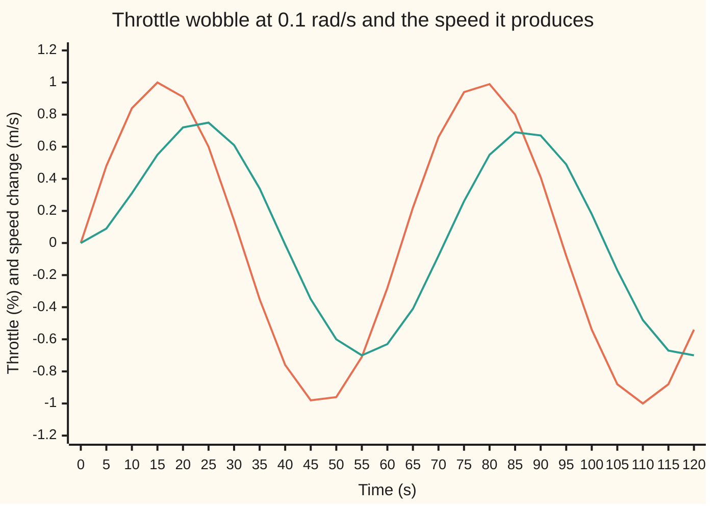
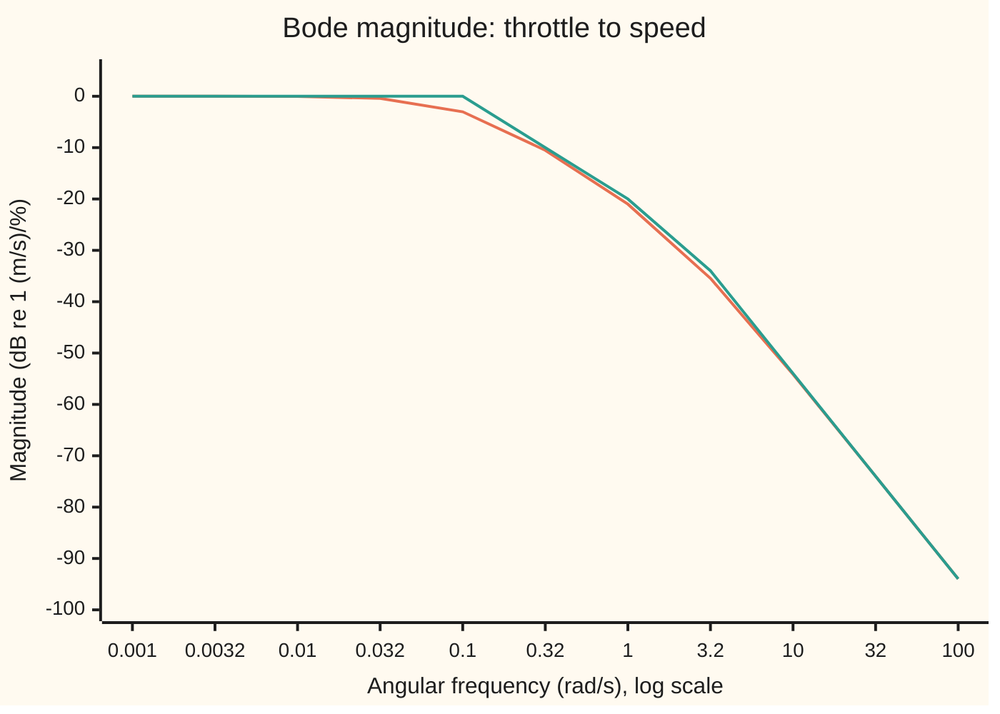
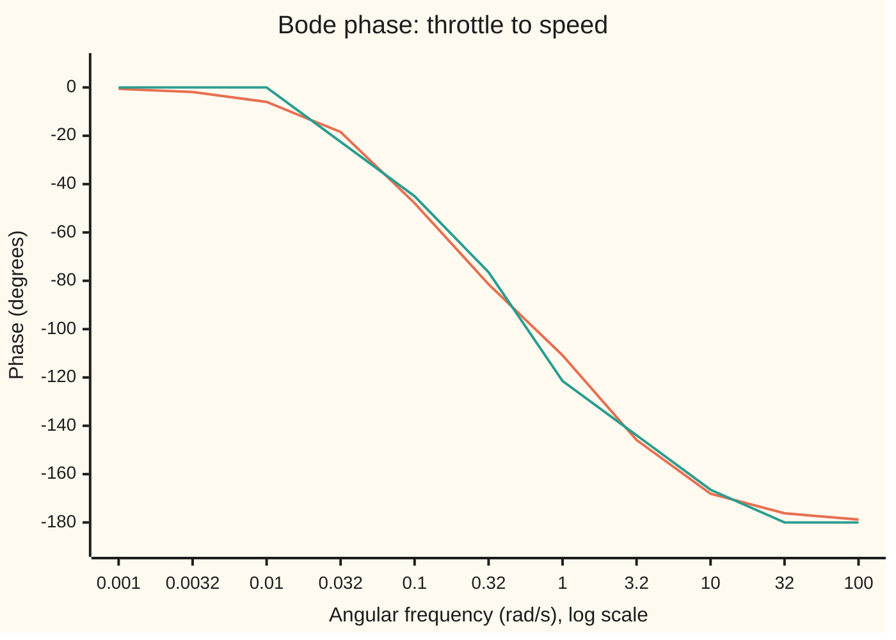

# Bode plots: how much a system magnifies and delays each frequency

[Syllabus](../../../SYLLABUS.md) → [Engineering mathematics](../README.md) → [Linear Systems and Transforms](../README.md#s02) → Bode plots

---

## General Overview

A car holds a steady cruise on a level road. Its cruise controller works the throttle, measured in percent of full travel. Hold the throttle 1% further open and, once the car has settled, it runs 1 m/s faster. The settling takes time: the car's speed follows a held throttle change with a time constant of 10 s, and the engine itself takes about 0.5 s to deliver a new throttle setting as thrust.

The controller never holds the throttle still. It nudges it up and down all the time. So the engineer's question is about wobbles: if the throttle swings up and down by 1% at a steady rate, how far does the speed swing, and how late? A slow swing, one cycle every 628 s, comes through almost whole: the speed swings by 0.9950 m/s. A swing once every 62.83 s comes through at 0.7062 m/s and arrives 8.35 s late. A swing every 6.28 s moves the speed by only 0.0890 m/s, 1.93 s late. Above about 0.1 radians per second the car stops following: it rolls off.

Two numbers per rate, a size ratio and a delay, describe the whole response. The size ratio is the **gain**. The delay, measured as a fraction of a cycle, is the **phase**. A **Bode plot** draws both against the rate of the wobble, with the rate on a log scale and the gain in decibels, so that the curves become nearly straight lines that can be sketched by hand, a decade (a tenfold step in frequency) at a time.

### The picture: a throttle wobble and the speed it produces

The throttle swings ±1% with one cycle every 62.83 s, starting from rest at time 0. The speed starts at zero, overshoots briefly while the car's start-up motion dies away, and then settles into a smaller swing that peaks later than the throttle.



Orange: the throttle, in percent. Green: the simulated speed change, in m/s. After about 50 s the green line is a sine of the same rate as the orange one, about seven tenths its height, shifted to the right.

**Feed a stable linear system a sine wave and, once it settles, out comes a sine wave of the same frequency, scaled by the size of the transfer function on the imaginary axis and shifted by its angle; a Bode plot draws that size and angle against frequency on log scales, where each pole or zero adds a straight-line piece.**

**What kind of fact this is:** a method for drawing and reading a system's response, resting on a theorem (sine in, same-frequency sine out) proved on this card in Why it works; the straight-line sketch is an approximation, with its worst error, 3.01 dB at each corner, stated and checked.

---

## The formula

Three pieces of notation first, in words. Engineers write $j$ for the square root of −1; the rest of the library writes i. The **transfer function** $G(s)$ says what the system does to each exponential $e^{st}$: feed it in, and $G(s)\,e^{st}$ comes out ([Transfer functions](02-impulse-response-and-transfer-functions.md)). A **decibel** (dB) measures a gain on a log scale: the gain $g$ is $20\log_{10} g$ decibels, so a gain of 10 is +20 dB, a gain of 1 is 0 dB and a gain of 0.1 is −20 dB.

For the car, with throttle $u$ in percent and speed change $y$ in m/s, two first-order equations make the model. The engine delivers thrust $F$, counted in the throttle percent it settles to, with a 0.5 s time constant: $\tau_2 F' = -F + u$. The car's speed follows the thrust against its drag: $\tau_1 y' = -y + K F$. Started from rest, the Laplace transform turns each derivative into a factor $s$, so the thrust is $1/(\tau_2 s + 1)$ times the throttle and the speed is $K/(\tau_1 s + 1)$ times the thrust. Their product is the transfer function:

$$G(s) = \frac{K}{(\tau_1 s + 1)(\tau_2 s + 1)}$$

Drive it with $u(t) = A\sin(\omega t)$. Once the start-up motion has died away, the output is

$$y(t) = A\,\lvert G(j\omega)\rvert\,\sin\!\big(\omega t + \varphi(\omega)\big), \qquad \varphi(\omega) = \arg G(j\omega)$$

**Read it aloud:** a sine at angular frequency omega comes out as a sine at the same omega, its height multiplied by the size of G at j omega, and shifted by the angle of G at j omega.

The Bode plot is the pair of curves

$$M(\omega) = 20\log_{10}\lvert G(j\omega)\rvert \ \text{dB}, \qquad \varphi(\omega) \ \text{in degrees},$$

each drawn against $\omega$ on a log scale. For the car, one factor at a time:

$$M(\omega) = 20\log_{10}K - 10\log_{10}\!\big(1 + \omega^2\tau_1^2\big) - 10\log_{10}\!\big(1 + \omega^2\tau_2^2\big), \qquad \varphi(\omega) = -\arctan(\omega\tau_1) - \arctan(\omega\tau_2)$$

**Read it aloud:** in decibels, each factor's contribution is subtracted; in angle, each factor's lag is added.

| Symbol | Plain meaning | In our example | Push it up and the answer… |
| --- | --- | --- | --- |
| $G(s)$, $G$ | the transfer function: what the car does to each exponential | throttle in, speed out | — |
| $s$ | the Laplace variable, a complex rate in 1/s | set to $j\omega$ on this card | — |
| $j$ | the square root of −1, as engineers write it | — | — |
| $\omega$, $f$ | angular frequency of the wobble in rad/s; $f = \omega/2\pi$ in hertz | 0.1 rad/s is 0.0159 Hz, one cycle per 62.83 s | gain falls, lag grows |
| $K$ | the steady gain: settled speed change per held throttle change | 1 (m/s) per % | every dB value rises; +6.02 dB for doubling |
| $\tau_1$, $\tau_2$ | time constants: the car's 10 s, the engine's 0.5 s | 10 s and 0.5 s | corners move to lower frequency |
| $\omega_c$ | a corner frequency, one over a time constant | 0.1 rad/s and 2 rad/s | the roll-off starts later |
| $g$, $\lvert G(j\omega)\rvert$ | the gain: output swing per input swing | 0.7062 (m/s)/% at 0.1 rad/s | bigger speed swing |
| $M$ | the gain in decibels, $20\log_{10}$ of it | −3.02 dB at 0.1 rad/s | — |
| $\varphi$ | the phase: the output's shift, negative for a lag | −47.86° at 0.1 rad/s | output arrives earlier |
| $u$, $y$, $A$ | throttle in %, speed change in m/s, throttle swing size | $A$ = 1% | output swing grows in proportion |
| $F$ | the engine's delivered thrust, counted in the throttle % it settles to | follows the throttle with a 0.5 s time constant | speed rises in proportion |
| $T_d$, $t$, $r$, $h$ | a pure delay in s; time in s; a past time in s; the impulse response | $T_d$ = 1 s in What breaks | — |

A phase in degrees turns into a time lag by dividing the phase in radians by $\omega$: −47.86° at 0.1 rad/s is a lag of 8.35 s.

### When it holds

- **Linear.** The model describes small changes about a steady cruise. Outside that range it is wrong: a 50% throttle swing at 0.01 rad/s is predicted to swing the speed by 49.8 m/s, more than a car on a level road can gain or lose by throttle, since the engine runs out of power and the throttle hits its stops.
- **Time-invariant.** The same car on the same road. A hill, a trailer or a headwind changes $K$ and $\tau_1$, and the plot with them.
- **Stable.** Every pole must sit in the left half of the complex plane, or the start-up motion never dies away. An unstable car has a $G(j\omega)$ that can still be computed, size 0.7062 at an angle of −137.86° at 0.1 rad/s, but the simulated speed reaches 231.0 million m/s by 200 s: there is no settled sine to measure.
- **Settled.** The formula describes the output after several times the longest time constant. In the chart above that is after about 50 s.
- **Every lag in the model.** A pure delay leaves the gain alone and adds lag that the straight-line sketch cannot show; it must be added by hand.

---

## Why it works

### Step 0: a sine is two exponentials, and exponentials pass through unchanged

A linear time-invariant system answers the exponential $e^{st}$ with the same exponential times one complex number, $G(s)$. That is what the transfer function means. Euler's formula ([Euler's formula](../../07-Complex%20analysis/01-Complex%20Numbers%20and%20the%20Plane/04-eulers-formula.md)) writes a sine as two such exponentials: $\sin(\omega t) = \big(e^{j\omega t} - e^{-j\omega t}\big)/2j$. Each passes through, multiplied by $G$ at $s = j\omega$ or $s = -j\omega$. Putting the two back together gives a sine again. Everything on this card is that one move: evaluate $G(s)$ along the imaginary axis, $s = j\omega$.

### Step 1: the settled response to $e^{j\omega t}$ is $G(j\omega)\,e^{j\omega t}$

The output is the input convolved with the impulse response $h$, the output after a sharp unit kick ([Linear and time-invariant](01-linear-time-invariant-systems-and-convolution.md)). Switch $e^{j\omega t}$ on at time 0, and the output at time $t$ is $e^{j\omega t}$ times the integral of $h(r)e^{-j\omega r}$ over past times $r$ from 0 to $t$. As $t$ grows, that integral approaches $G(j\omega)$, provided $h$ dies away fast enough. Stability is exactly that condition ([Poles and zeros](03-poles-zeros-and-stability.md)).

<details>
<summary>Detailed proof</summary>

Let $h$ be the impulse response, with $\int_0^\infty \lvert h(r)\rvert\,dr$ finite (true when every pole has negative real part, since $h$ is then a sum of decaying exponentials times polynomials). Its Laplace transform $G(s) = \int_0^\infty h(r)e^{-sr}dr$ then converges at $s = j\omega$.

Input $u(t) = e^{j\omega t}$ for $t \ge 0$, zero before. Convolution gives
$$y(t) = \int_0^t h(r)\,e^{j\omega(t-r)}\,dr = e^{j\omega t}\int_0^t h(r)e^{-j\omega r}dr = e^{j\omega t}\Big(G(j\omega) - \int_t^\infty h(r)e^{-j\omega r}dr\Big).$$
The last integral is at most $\int_t^\infty \lvert h(r)\rvert dr$ in size, which tends to 0. So $y(t) - G(j\omega)e^{j\omega t} \to 0$: the transient dies and the settled part is $G(j\omega)e^{j\omega t}$.

For a real $h$, $G(-j\omega)$ is the complex conjugate of $G(j\omega)$. Write $G(j\omega) = \lvert G\rvert e^{j\varphi}$. The input $\sin\omega t = (e^{j\omega t} - e^{-j\omega t})/2j$ settles to
$$\frac{\lvert G\rvert e^{j\varphi}e^{j\omega t} - \lvert G\rvert e^{-j\varphi}e^{-j\omega t}}{2j} = \lvert G\rvert\sin(\omega t + \varphi).$$
If a pole has positive real part, $h$ grows, the integral from $t$ to infinity does not exist, and the transient swamps the sine: the unstable case in What breaks.

</details>

### Step 2: a real sine comes out as a real sine, scaled and shifted

The impulse response of a real car is a real function. Its value at $-j\omega$ is then the mirror image, the complex conjugate, of its value at $j\omega$. The two exponentials recombine into one sine of height $\lvert G(j\omega)\rvert$ times the input's, shifted by the angle $\varphi = \arg G(j\omega)$. The frequency is untouched: a linear time-invariant system cannot create a new frequency.

### Step 3: logs turn the product of factors into a sum

$G(j\omega)$ for the car is a product: $K$, times $1/(1 + j\omega\tau_1)$, times $1/(1 + j\omega\tau_2)$. Sizes of complex numbers multiply and their angles add. Take $20\log_{10}$ of the size and the product becomes a sum ([Log laws and log scales](../../01-Foundations/03-Powers%2C%20Roots%20and%20Logarithms/06-log-laws-and-log-scales.md)). So the Bode plot of a chain of simple factors is the plain sum of their plots, in dB and in degrees. Hendrik Bode drew the plots this way at Bell Labs in the 1930s for exactly that reason: a designer could add straight lines by hand.

### Step 4: one factor, two straight lines

Take one factor $1/(1 + j\omega\tau)$ with corner $\omega_c = 1/\tau$. Its size is $1/\sqrt{1 + \omega^2\tau^2}$.

- Well below the corner, $\omega\tau$ is small, the size is close to 1, and the magnitude is close to 0 dB: a flat line.
- Well above the corner, the 1 is negligible, the size is close to $1/(\omega\tau)$, and the magnitude is $-20\log_{10}(\omega/\omega_c)$ dB. Each tenfold rise in frequency, one **decade**, lowers it by 20 dB: a straight line of slope −20 dB per decade on a log axis.
- The two lines meet at the corner. There the true size is $1/\sqrt 2$, which is $-10\log_{10}2$ = −3.01 dB. That is the sketch's worst error: the code sweeps 4,001 frequencies across four decades and finds the largest gap at 3.0103 dB.

The phase is $-\arctan(\omega\tau)$: 0° far below the corner, −45° at it, −90° far above. The straight-line phase sketch holds 0° up to a decade below the corner, falls 45° per decade for two decades, and holds −90° from a decade above. Its worst error is 5.71°, a decade either side of the corner, where the true phase is $\arctan 0.1$ away from the line; the sweep finds 5.711°.

Two more pieces appear in most plots. A **zero**, a factor $1 + j\omega\tau$ on top, is a pole turned upside down: its dB and degrees are the pole's with the sign flipped, so it climbs at +20 dB per decade above its corner and its phase rises to +90°. At 1 rad/s the zero $1 + 10s$ gives +20.04 dB and +84.289°. An **integrator** $1/s$ is a system that adds up its input, as position adds up speed. Its size is $1/\omega$ and its angle −90° at every frequency: a straight line of −20 dB per decade through 0 dB at 1 rad/s, with no corner.

### Step 5: add the pieces, decade by decade

For the car the corners sit at 0.1 rad/s and 2 rad/s. Below 0.1 rad/s both factors are flat: 0 dB, because $K$ = 1 is 0 dB. From 0.1 to 2 rad/s the car's factor falls at −20 dB per decade, reaching −26.02 dB at 2 rad/s. Above 2 rad/s the engine's factor adds its own −20, for −40 dB per decade: −66.02 dB by 20 rad/s. The code measures the true slope far out, between 100 and 1,000 rad/s, at −39.998 dB per decade. The phase sketch adds the two factors' ramps and ends at −180°, which the exact phase approaches but never reaches.

A second road to the same complex number draws it as one curve in the plane, size and angle together, as $\omega$ runs from 0 upwards. That is the Nyquist plot, which counts encirclements to judge a feedback loop: [Nyquist and margins](../03-Feedback%20Control/06-nyquist-criterion-and-stability-margins.md).

---

## Worked numbers, by hand

The throttle wobbles ±1% at $\omega$ = 1 rad/s, one cycle every 6.28 s. Corners at 0.1 and 2 rad/s.

| Step | Arithmetic | Value |
| --- | --- | --- |
| car factor, $\omega\tau_1$ | 1 × 10 | 10 |
| car factor, magnitude | −10 log10(1 + 100) | −20.04 dB |
| car factor, phase | −arctan 10 | −84.289° |
| engine factor, $\omega\tau_2$ | 1 × 0.5 | 0.5 |
| engine factor, magnitude | −10 log10(1 + 0.25) | −0.97 dB |
| engine factor, phase | −arctan 0.5 | −26.565° |
| total magnitude | −20.04 − 0.97 | −21.01 dB |
| as a gain | 10^(−21.01/20) | 0.0890 (m/s)/% |
| total phase | −84.289 − 26.565 | −110.85° |
| as a time lag | 110.85° in radians, divided by 1 rad/s | 1.93 s |
| sketch magnitude | car's line one decade past its corner, engine still flat | −20.00 dB |
| sketch phase | −90° from the car, −45 × (log10 0.5 + 1) from the engine | −121.45° |
| **speed swing** | 1% × 0.0890 | **±0.0890 m/s, 1.93 s late** |

A throttle that pumps once every 6.28 s moves the car's speed by less than a tenth of a metre per second. The cruise controller can only steer the speed with slow throttle changes: anything faster than about 0.1 rad/s is mostly absorbed by the car's mass. The sketch read −20.00 dB and −121.45° against the exact −21.01 dB and −110.85°: close enough to think with, not to sign off on.

The two Bode curves for the car, exact against sketch, at half-decade steps from 0.001 to 100 rad/s:



Orange: the exact magnitude. Green: the straight-line sketch, flat to 0.1 rad/s, then −20 dB per decade, then −40 from 2 rad/s. Labels such as 0.0032 stand for 10^(−2.5) = 0.0032 rad/s; the steps are equal on the log scale. The exact values at 0.001 and 0.0032 rad/s print as −0.00: they are below zero by less than 0.005 dB.



Orange: the exact phase. Green: the straight-line sketch, the two factors' 45°-per-decade ramps added. The exact phase heads for −180° and never reaches it.

### What breaks if you drop a piece

| Mistake | Comes out at | What went wrong |
| --- | --- | --- |
| $10\log_{10}$ instead of $20\log_{10}$, at 1 rad/s | −10.51 dB (right: −21.01 dB) | Ten is for power, which goes as the square of a swing; a gain of swings takes twenty |
| Read the sketch at the 0.1 rad/s corner | 1.0000 m/s swing (right: 0.7062 m/s) | The straight lines are 3.01 dB high at a corner; the true swing is already seven tenths of the input's |
| Leave out a 1 s engine delay, at 1 rad/s | −110.85° (right: −168.15°, simulated −168.15°) | A delay has gain 1 at every frequency, so the magnitude plot hides it; its lag, $\omega T_d$ in radians, grows without limit |
| Use the formula on an unstable car (pole at +0.1 rad/s) | 0.7062 at −137.86° predicted; simulated speed 231.0 million m/s at 200 s | No settled sine exists; the growing start-up motion swamps it |

---

## Code, from first principles, and it actually runs

The code builds the car's gain and phase three independent ways at six frequencies from 0.01 to 10 rad/s. Road 1 is the closed form, one factor at a time. Road 2 expands the denominator into a polynomial and evaluates it at $s = j\omega$ with complex arithmetic. Road 3 ignores the transfer function: it simulates the two equations behind it with a fourth-order Runge-Kutta step (RK4), wobbles the throttle, waits at least 150 s for the start-up motion to die, and measures the settled speed swing over one whole cycle by multiplying it by a sine and by a cosine and averaging. The straight-line sketch is printed beside them and checked against the exact curve at its worst points and far from the corners. Then the code reproduces every number in What breaks, including a simulated delay and a simulated unstable car, and prints every charted point.

### Python

```python
# Bode plots -- the check behind the card.  Standard library only.
# A car on cruise control: throttle (%) in, road speed (m/s) out, small changes
# about a steady cruise.  G(s) = K / ((tau1 s + 1)(tau2 s + 1)) with K = 1 (m/s)/%,
# tau1 = 10 s (the car's mass against its drag), tau2 = 0.5 s (the engine's lag).
# Three roads to the gain and phase at each angular frequency w (rad/s):
#   1. closed form, factor by factor;  2. complex arithmetic on the expanded
#   polynomial at s = jw;  3. simulate the car with RK4, wobble the throttle,
#   and measure the settled speed wobble.  A fourth line is the asymptote sketch.
from math import sqrt, atan, atan2, log10, sin, cos, pi, degrees, ceil

K, T1, T2 = 1.0, 10.0, 0.5

def db(g): return 20 * log10(g)

def road1(w, t1=T1, t2=T2, delay=0.0):         # one factor at a time: gains multiply, phases add
    g = K / sqrt(1 + (w * t1) ** 2) / sqrt(1 + (w * t2) ** 2)
    return g, degrees(-atan(w * t1) - atan(w * t2) - w * delay)

def road2(w, den=(T1 * T2, T1 + T2, 1.0)):      # Horner on the denominator, here tau1 tau2 s^2 + (tau1 + tau2) s + 1
    v = 0j
    for c in den:
        v = v * complex(0, w) + c
    g = K / v
    return abs(g), degrees(atan2(g.imag, g.real))

def sketch(w, corners=(1 / T1, 1 / T2)):        # straight lines: 0 then -20 dB/decade per pole;
    m = p = 0.0                                 # phase 0, then -45 deg/decade for two decades, then -90
    for c in corners:
        if w > c: m -= 20 * log10(w / c)
        r = log10(w / c)
        p -= 0.0 if r <= -1 else (90.0 if r >= 1 else 45.0 * (r + 1))
    return m + db(K), p

def run(w, dt, steps, a1=1.0, delay=0.0, every=0):
    # tau2 f' = -f + u(t - delay);  tau1 v' = -a1 v + K f.  a1 = -1 makes the car's pole unstable.
    def rhs(t, f, v):
        u = sin(w * (t - delay)) if t >= delay else 0.0
        return (-f + u) / T2, (-a1 * v + K * f) / T1
    f = v = 0.0; vs = []
    for k in range(steps):
        t = k * dt
        vs.append(v)
        k1 = rhs(t, f, v)
        k2 = rhs(t + dt / 2, f + dt / 2 * k1[0], v + dt / 2 * k1[1])
        k3 = rhs(t + dt / 2, f + dt / 2 * k2[0], v + dt / 2 * k2[1])
        k4 = rhs(t + dt, f + dt * k3[0], v + dt * k3[1])
        f += dt / 6 * (k1[0] + 2 * k2[0] + 2 * k3[0] + k4[0])
        v += dt / 6 * (k1[1] + 2 * k2[1] + 2 * k3[1] + k4[1])
    vs.append(v)
    return vs

def road3(w, delay=0.0):                        # settle at least 150 s, then project one period on sin and cos
    period = 2 * pi / w
    n = max(200, ceil(period / 0.01)); dt = period / n
    settle = ceil(150 / period) * n
    vs = run(w, dt, settle + n, delay=delay)[settle:settle + n]
    a = 2 / n * sum(y * sin(w * (settle + k) * dt) for k, y in enumerate(vs))
    b = 2 / n * sum(y * cos(w * (settle + k) * dt) for k, y in enumerate(vs))
    return sqrt(a * a + b * b), degrees(atan2(b, a))

print("car: K = 1 (m/s)/%, tau1 = 10 s, tau2 = 0.5 s; corners 1/tau1 = 0.1 rad/s, 1/tau2 = 2 rad/s")
print("road 1 = closed form, road 2 = complex arithmetic, road 3 = RK4 simulation; sketch = asymptotes")
print("  w rad/s    f Hz  period s |  |G| road1  road2  road3 |   dB    sketch | phase deg road1  road2  road3  sketch")
for w in (0.01, 0.1, 0.5, 1.0, 2.0, 10.0):
    g1, p1 = road1(w); g2, p2 = road2(w); g3, p3 = road3(w); sm, sp = sketch(w)
    print(f"{w:9.2f} {w / (2 * pi):7.4f} {2 * pi / w:9.2f} | {g1:11.4f} {g2:6.4f} {g3:6.4f} | {db(g1):7.2f} {sm:7.2f} |"
          f" {p1:15.2f} {p2:6.2f} {p3:6.2f} {sp:7.2f}")
    assert abs(g1 - g2) < 1e-12                                  # two algebraic roads, gain
    assert abs(p1 - p2) < 1e-9                                   # and phase
    assert abs(g3 - g1) < 2e-4 * max(g1, 0.01)                   # the simulated car agrees, gain
    assert abs(p3 - p1) < 0.05                                   # and phase
g, p = road1(0.1)
print(f"at 0.1 rad/s: 1% throttle wobble -> speed wobble {g:.4f} m/s, lag {-p:.2f} deg = {-p / degrees(0.1):.2f} s")
g, p = road1(1.0)
print(f"at 1 rad/s:   1% throttle wobble -> speed wobble {g:.4f} m/s, lag {-p:.2f} deg = {-p / degrees(1.0):.2f} s")
print(f"hand, w = 1: factor 1 {db(1 / sqrt(101)):.2f} dB {degrees(-atan(10)):.3f} deg;"
      f" factor 2 {db(1 / sqrt(1.25)):.2f} dB {degrees(-atan(0.5)):.3f} deg")
print(f"sketch corners: at 2 rad/s {sketch(2.0)[0]:.2f} dB, at 20 rad/s {sketch(20.0)[0]:.2f} dB")
slope = db(road1(1000.0)[0]) - db(road1(100.0)[0])
print(f"slope, 100 to 1000 rad/s: {slope:.3f} dB per decade")
assert abs(slope + 40) < 0.01                                    # two poles: -40 dB/decade far out
sweep = [10 ** (k / 1000 - 3) for k in range(4001)]             # one pole, corner 0.1 rad/s
worst = max(abs(db(road1(w, t2=0.0)[0]) - sketch(w, (1 / T1,))[0]) for w in sweep)
worstp = max(abs(road1(w, t2=0.0)[1] - sketch(w, (1 / T1,))[1]) for w in sweep)
print(f"one pole, worst sketch error over 0.001..10 rad/s: {worst:.4f} dB (10 log10 2 = {10 * log10(2):.4f}),"
      f" {worstp:.3f} deg (arctan 0.1 = {degrees(atan(0.1)):.3f})")
assert abs(worst - 10 * log10(2)) < 1e-4                         # the sweep finds the corner's 3.01 dB
assert abs(worstp - degrees(atan(0.1))) < 1e-3                   # and the phase sketch's 5.71 deg
far = [abs(db(road1(w)[0]) - sketch(w)[0]) for w in (1e-4, 1e3)]
print(f"sketch against exact, far from both corners: {far[0]:.4f} dB at 0.0001 rad/s, {far[1]:.4f} dB at 1000 rad/s")
assert max(far) < 0.01                                           # the asymptotes are the right lines
z, i1, i10 = complex(1, 1.0 * T1), road2(1.0, (1.0, 0.0)), road2(10.0, (1.0, 0.0))   # integrator 1/s by road 2
print(f"zero 1 + tau1 s at 1 rad/s: {db(abs(z)):+.2f} dB {degrees(atan2(z.imag, z.real)):+.3f} deg;"
      f" integrator 1/s: {db(i1[0]):.2f} dB at 1 rad/s, {db(i10[0]):.2f} dB at 10 rad/s,"
      f" {i10[1]:.2f} deg")
assert abs(db(abs(z)) + db(road1(1.0, t2=0.0)[0])) < 1e-12       # a zero is a pole turned upside down
assert abs(db(i10[0]) - db(i1[0]) + 20) < 1e-12                  # integrator: -20 dB per decade
# ---- what breaks ----
print(f"wrong: 10 log10 instead of 20 log10 at 1 rad/s: {10 * log10(road1(1.0)[0]):.2f} dB (right {db(road1(1.0)[0]):.2f})")
print(f"wrong: read the sketch at the corner 0.1 rad/s: {10 ** (sketch(0.1)[0] / 20):.4f} m/s (right {road1(0.1)[0]:.4f})")
gd, pd = road1(1.0, delay=1.0); g3, p3 = road3(1.0, delay=1.0)
print(f"wrong: ignore a 1 s delay at 1 rad/s: phase {road1(1.0)[1]:.2f} deg (right {pd:.2f}, simulated {p3:.2f}); gain {g3:.4f}")
assert abs(p3 - pd) < 0.05                                       # delay: more lag ...
assert abs(g3 - gd) < 2e-4                                       # ... and the same gain
vu = run(0.1, 0.01, 20000, a1=-1.0)                              # 20000 steps of 0.01 s: vu[-1] is at 200 s
gu, pu = road2(0.1, (T1 * T2, T1 - T2, -1.0))                    # the unstable car, (tau1 s - 1)(tau2 s + 1)
print(f"wrong: unstable car, pole at +0.1 rad/s: formula |G| at 0.1 rad/s {gu:.4f}, angle {pu:.2f} deg;"
      f" simulated speed at 200 s {vu[-1] / 1e6:.1f} million m/s")
assert abs(vu[-1]) > 100 * gu                                     # no settled sine to measure
print(f"outside the model: 50% throttle wobble at 0.01 rad/s -> {50 * road1(0.01)[0]:.1f} m/s swing predicted")
# ---- try changing ----
print(f"try: tau1 = 20 s, gain at 1 rad/s {road1(1.0, t1=20.0)[0]:.4f} ({db(road1(1.0, t1=20.0)[0]):.2f} dB)")
print(f"try: 2 s delay, phase at 1 rad/s {road1(1.0, delay=2.0)[1]:.2f} deg")
print(f"try: K = 2, every dB value moves by {db(2.0):.2f} dB")
# ---- chart points ----
ws = [10 ** (k / 2) for k in range(-6, 5)]
print("chart, w rad/s      " + " ".join(f"{w:8.4f}" for w in ws))
print("chart, exact dB     " + " ".join(f"{db(road1(w)[0]):8.2f}" for w in ws))
print("chart, sketch dB    " + " ".join(f"{sketch(w)[0]:8.2f}" for w in ws))
print("chart, exact deg    " + " ".join(f"{road1(w)[1]:8.2f}" for w in ws))
print("chart, sketch deg   " + " ".join(f"{sketch(w)[1]:8.2f}" for w in ws))
vt = run(0.1, 0.01, 12001)
print("chart, t s          " + " ".join(f"{5 * k:5d}" for k in range(25)))
print("chart, throttle %   " + " ".join(f"{sin(0.5 * k):5.2f}" for k in range(25)))
print("chart, speed m/s    " + " ".join(f"{vt[500 * k]:5.2f}" for k in range(25)))
print("ALL CHECKS PASS")
```

**Ran 2026-10-06 on macOS, Python 3.14.6, standard library only. All checks passed. Output, pasted from the run:**

```
car: K = 1 (m/s)/%, tau1 = 10 s, tau2 = 0.5 s; corners 1/tau1 = 0.1 rad/s, 1/tau2 = 2 rad/s
road 1 = closed form, road 2 = complex arithmetic, road 3 = RK4 simulation; sketch = asymptotes
  w rad/s    f Hz  period s |  |G| road1  road2  road3 |   dB    sketch | phase deg road1  road2  road3  sketch
     0.01  0.0016    628.32 |      0.9950 0.9950 0.9950 |   -0.04    0.00 |           -6.00  -6.00  -6.00    0.00
     0.10  0.0159     62.83 |      0.7062 0.7062 0.7062 |   -3.02    0.00 |          -47.86 -47.86 -47.86  -45.00
     0.50  0.0796     12.57 |      0.1903 0.1903 0.1903 |  -14.41  -13.98 |          -92.73 -92.73 -92.73  -94.36
     1.00  0.1592      6.28 |      0.0890 0.0890 0.0890 |  -21.01  -20.00 |         -110.85 -110.85 -110.85 -121.45
     2.00  0.3183      3.14 |      0.0353 0.0353 0.0353 |  -29.04  -26.02 |         -132.14 -132.14 -132.14 -135.00
    10.00  1.5915      0.63 |      0.0020 0.0020 0.0020 |  -54.15  -53.98 |         -168.12 -168.12 -168.12 -166.45
at 0.1 rad/s: 1% throttle wobble -> speed wobble 0.7062 m/s, lag 47.86 deg = 8.35 s
at 1 rad/s:   1% throttle wobble -> speed wobble 0.0890 m/s, lag 110.85 deg = 1.93 s
hand, w = 1: factor 1 -20.04 dB -84.289 deg; factor 2 -0.97 dB -26.565 deg
sketch corners: at 2 rad/s -26.02 dB, at 20 rad/s -66.02 dB
slope, 100 to 1000 rad/s: -39.998 dB per decade
one pole, worst sketch error over 0.001..10 rad/s: 3.0103 dB (10 log10 2 = 3.0103), 5.711 deg (arctan 0.1 = 5.711)
sketch against exact, far from both corners: 0.0000 dB at 0.0001 rad/s, 0.0000 dB at 1000 rad/s
zero 1 + tau1 s at 1 rad/s: +20.04 dB +84.289 deg; integrator 1/s: 0.00 dB at 1 rad/s, -20.00 dB at 10 rad/s, -90.00 deg
wrong: 10 log10 instead of 20 log10 at 1 rad/s: -10.51 dB (right -21.01)
wrong: read the sketch at the corner 0.1 rad/s: 1.0000 m/s (right 0.7062)
wrong: ignore a 1 s delay at 1 rad/s: phase -110.85 deg (right -168.15, simulated -168.15); gain 0.0890
wrong: unstable car, pole at +0.1 rad/s: formula |G| at 0.1 rad/s 0.7062, angle -137.86 deg; simulated speed at 200 s 231.0 million m/s
outside the model: 50% throttle wobble at 0.01 rad/s -> 49.8 m/s swing predicted
try: tau1 = 20 s, gain at 1 rad/s 0.0447 (-27.00 dB)
try: 2 s delay, phase at 1 rad/s -225.45 deg
try: K = 2, every dB value moves by 6.02 dB
chart, w rad/s        0.0010   0.0032   0.0100   0.0316   0.1000   0.3162   1.0000   3.1623  10.0000  31.6228 100.0000
chart, exact dB        -0.00    -0.00    -0.04    -0.42    -3.02   -10.52   -21.01   -35.45   -54.15   -74.00   -93.98
chart, sketch dB        0.00     0.00     0.00     0.00     0.00   -10.00   -20.00   -33.98   -53.98   -73.98   -93.98
chart, exact deg       -0.60    -1.90    -6.00   -18.45   -47.86   -81.44  -110.85  -145.88  -168.12  -176.20  -178.80
chart, sketch deg       0.00     0.00     0.00   -22.50   -45.00   -76.45  -121.45  -143.95  -166.45  -180.00  -180.00
chart, t s              0     5    10    15    20    25    30    35    40    45    50    55    60    65    70    75    80    85    90    95   100   105   110   115   120
chart, throttle %    0.00  0.48  0.84  1.00  0.91  0.60  0.14 -0.35 -0.76 -0.98 -0.96 -0.71 -0.28  0.22  0.66  0.94  0.99  0.80  0.41 -0.08 -0.54 -0.88 -1.00 -0.88 -0.54
chart, speed m/s     0.00  0.09  0.31  0.55  0.72  0.75  0.61  0.34 -0.01 -0.35 -0.60 -0.70 -0.63 -0.41 -0.08  0.26  0.55  0.69  0.67  0.49  0.18 -0.17 -0.48 -0.67 -0.70
ALL CHECKS PASS
```

Three roads, one answer. The two algebraic roads agree to twelve digits; the simulated car agrees to the four printed decimals of gain and two of phase. The delay is simulated, not just added to the formula: the simulated car lags by the same −168.15°.

### Rust

The same checks, with complex numbers as a small struct written out. No crates.

```rust
// Bode plots -- the same check as frequency_response_and_bode_plots_check.py, in Rust.
// Standard library only, no crates.  Complex numbers are a small struct written out.
// Car on cruise control: G(s) = K / ((tau1 s + 1)(tau2 s + 1)), K = 1 (m/s)/%,
// tau1 = 10 s, tau2 = 0.5 s.  Roads: closed form, complex arithmetic, RK4 simulation.
use std::f64::consts::PI;

const K: f64 = 1.0;
const T1: f64 = 10.0;
const T2: f64 = 0.5;
const CAR: [f64; 3] = [T1 * T2, T1 + T2, 1.0];   // denominator tau1 tau2 s^2 + (tau1 + tau2) s + 1

#[derive(Clone, Copy)]
struct C { re: f64, im: f64 }
impl C {
    fn mul(self, o: C) -> C { C { re: self.re * o.re - self.im * o.im, im: self.re * o.im + self.im * o.re } }
    fn div(self, o: C) -> C {
        let d = o.re * o.re + o.im * o.im;
        C { re: (self.re * o.re + self.im * o.im) / d, im: (self.im * o.re - self.re * o.im) / d }
    }
    fn abs(self) -> f64 { (self.re * self.re + self.im * self.im).sqrt() }
}

fn db(g: f64) -> f64 { 20.0 * g.log10() }

fn road1(w: f64, t1: f64, t2: f64, delay: f64) -> (f64, f64) {
    let g = K / (1.0 + (w * t1).powi(2)).sqrt() / (1.0 + (w * t2).powi(2)).sqrt();
    (g, (-(w * t1).atan() - (w * t2).atan() - w * delay).to_degrees())
}

fn road2(w: f64, den: &[f64]) -> (f64, f64) {
    let mut v = C { re: 0.0, im: 0.0 };
    for &c in den {
        v = v.mul(C { re: 0.0, im: w });
        v.re += c;
    }
    let g = C { re: K, im: 0.0 }.div(v);
    (g.abs(), g.im.atan2(g.re).to_degrees())
}

fn sketch(w: f64) -> (f64, f64) { sketch_c(w, &[1.0 / T1, 1.0 / T2]) }

fn sketch_c(w: f64, corners: &[f64]) -> (f64, f64) {
    let (mut m, mut p) = (0.0, 0.0);
    for &c in corners {
        if w > c { m -= 20.0 * (w / c).log10(); }
        let r = (w / c).log10();
        p -= if r <= -1.0 { 0.0 } else if r >= 1.0 { 90.0 } else { 45.0 * (r + 1.0) };
    }
    (m + db(K), p)
}

fn run(w: f64, dt: f64, steps: usize, a1: f64, delay: f64) -> Vec<f64> {
    let rhs = |t: f64, f: f64, v: f64| -> (f64, f64) {
        let u = if t >= delay { (w * (t - delay)).sin() } else { 0.0 };
        ((-f + u) / T2, (-a1 * v + K * f) / T1)
    };
    let (mut f, mut v) = (0.0f64, 0.0f64);
    let mut vs = Vec::with_capacity(steps + 1);
    for k in 0..steps {
        let t = k as f64 * dt;
        vs.push(v);
        let k1 = rhs(t, f, v);
        let k2 = rhs(t + dt / 2.0, f + dt / 2.0 * k1.0, v + dt / 2.0 * k1.1);
        let k3 = rhs(t + dt / 2.0, f + dt / 2.0 * k2.0, v + dt / 2.0 * k2.1);
        let k4 = rhs(t + dt, f + dt * k3.0, v + dt * k3.1);
        f += dt / 6.0 * (k1.0 + 2.0 * k2.0 + 2.0 * k3.0 + k4.0);
        v += dt / 6.0 * (k1.1 + 2.0 * k2.1 + 2.0 * k3.1 + k4.1);
    }
    vs.push(v);
    vs
}

fn road3(w: f64, delay: f64) -> (f64, f64) {
    let period = 2.0 * PI / w;
    let n = ((period / 0.01).ceil() as usize).max(200);
    let dt = period / n as f64;
    let settle = (150.0 / period).ceil() as usize * n;
    let vs = run(w, dt, settle + n, 1.0, delay);
    let (mut a, mut b) = (0.0, 0.0);
    for k in 0..n {
        let t = (settle + k) as f64 * dt;
        a += vs[settle + k] * (w * t).sin();
        b += vs[settle + k] * (w * t).cos();
    }
    let (a, b) = (2.0 / n as f64 * a, 2.0 / n as f64 * b);
    ((a * a + b * b).sqrt(), b.atan2(a).to_degrees())
}

fn r1(w: f64) -> (f64, f64) { road1(w, T1, T2, 0.0) }

fn row(label: &str, vals: &[f64], width: usize, prec: usize) {
    let s: Vec<String> = vals.iter().map(|x| format!("{:>w$.p$}", x, w = width, p = prec)).collect();
    println!("{}{}", label, s.join(" "));
}

fn main() {
    println!("car: K = 1 (m/s)/%, tau1 = 10 s, tau2 = 0.5 s; corners 1/tau1 = 0.1 rad/s, 1/tau2 = 2 rad/s");
    println!("road 1 = closed form, road 2 = complex arithmetic, road 3 = RK4 simulation; sketch = asymptotes");
    println!("  w rad/s    f Hz  period s |  |G| road1  road2  road3 |   dB    sketch | phase deg road1  road2  road3  sketch");
    for w in [0.01, 0.1, 0.5, 1.0, 2.0, 10.0] {
        let ((g1, p1), (g2, p2), (g3, p3), (sm, sp)) = (r1(w), road2(w, &CAR), road3(w, 0.0), sketch(w));
        println!("{:9.2} {:7.4} {:9.2} | {:11.4} {:6.4} {:6.4} | {:7.2} {:7.2} | {:15.2} {:6.2} {:6.2} {:7.2}",
                 w, w / (2.0 * PI), 2.0 * PI / w, g1, g2, g3, db(g1), sm, p1, p2, p3, sp);
        assert!((g1 - g2).abs() < 1e-12);
        assert!((p1 - p2).abs() < 1e-9);
        assert!((g3 - g1).abs() < 2e-4 * g1.max(0.01));
        assert!((p3 - p1).abs() < 0.05);
    }
    let (g, p) = r1(0.1);
    println!("at 0.1 rad/s: 1% throttle wobble -> speed wobble {:.4} m/s, lag {:.2} deg = {:.2} s", g, -p, -p / 0.1f64.to_degrees());
    let (g, p) = r1(1.0);
    println!("at 1 rad/s:   1% throttle wobble -> speed wobble {:.4} m/s, lag {:.2} deg = {:.2} s", g, -p, -p / 1.0f64.to_degrees());
    println!("hand, w = 1: factor 1 {:.2} dB {:.3} deg; factor 2 {:.2} dB {:.3} deg",
             db(1.0 / 101f64.sqrt()), (-(10f64).atan()).to_degrees(), db(1.0 / 1.25f64.sqrt()), (-(0.5f64).atan()).to_degrees());
    println!("sketch corners: at 2 rad/s {:.2} dB, at 20 rad/s {:.2} dB", sketch(2.0).0, sketch(20.0).0);
    let slope = db(r1(1000.0).0) - db(r1(100.0).0);
    println!("slope, 100 to 1000 rad/s: {:.3} dB per decade", slope);
    assert!((slope + 40.0).abs() < 0.01);
    let sweep: Vec<f64> = (0..4001).map(|k| 10f64.powf(k as f64 / 1000.0 - 3.0)).collect();
    let pole = |w: f64| road1(w, T1, 0.0, 0.0);
    let worst = sweep.iter().map(|&w| (db(pole(w).0) - sketch_c(w, &[1.0 / T1]).0).abs()).fold(0.0, f64::max);
    let worstp = sweep.iter().map(|&w| (pole(w).1 - sketch_c(w, &[1.0 / T1]).1).abs()).fold(0.0, f64::max);
    println!("one pole, worst sketch error over 0.001..10 rad/s: {:.4} dB (10 log10 2 = {:.4}), {:.3} deg (arctan 0.1 = {:.3})",
             worst, 10.0 * 2f64.log10(), worstp, 0.1f64.atan().to_degrees());
    assert!((worst - 10.0 * 2f64.log10()).abs() < 1e-4);
    assert!((worstp - 0.1f64.atan().to_degrees()).abs() < 1e-3);
    let far: Vec<f64> = [1e-4, 1e3].iter().map(|&w| (db(r1(w).0) - sketch(w).0).abs()).collect();
    println!("sketch against exact, far from both corners: {:.4} dB at 0.0001 rad/s, {:.4} dB at 1000 rad/s", far[0], far[1]);
    assert!(far[0].max(far[1]) < 0.01);
    let (z, i1, i10) = (C { re: 1.0, im: 1.0 * T1 }, road2(1.0, &[1.0, 0.0]), road2(10.0, &[1.0, 0.0]));
    println!("zero 1 + tau1 s at 1 rad/s: {:+.2} dB {:+.3} deg; integrator 1/s: {:.2} dB at 1 rad/s, {:.2} dB at 10 rad/s, {:.2} deg",
             db(z.abs()), z.im.atan2(z.re).to_degrees(), db(i1.0), db(i10.0), i10.1);
    assert!((db(z.abs()) + db(pole(1.0).0)).abs() < 1e-12);
    assert!((db(i10.0) - db(i1.0) + 20.0).abs() < 1e-12);
    // ---- what breaks ----
    println!("wrong: 10 log10 instead of 20 log10 at 1 rad/s: {:.2} dB (right {:.2})", 10.0 * r1(1.0).0.log10(), db(r1(1.0).0));
    println!("wrong: read the sketch at the corner 0.1 rad/s: {:.4} m/s (right {:.4})", 10f64.powf(sketch(0.1).0 / 20.0), r1(0.1).0);
    let ((gd, pd), (g3, p3)) = (road1(1.0, T1, T2, 1.0), road3(1.0, 1.0));
    println!("wrong: ignore a 1 s delay at 1 rad/s: phase {:.2} deg (right {:.2}, simulated {:.2}); gain {:.4}", r1(1.0).1, pd, p3, g3);
    assert!((p3 - pd).abs() < 0.05);
    assert!((g3 - gd).abs() < 2e-4);
    let vu = run(0.1, 0.01, 20000, -1.0, 0.0);
    let (gu, pu) = road2(0.1, &[T1 * T2, T1 - T2, -1.0]);
    println!("wrong: unstable car, pole at +0.1 rad/s: formula |G| at 0.1 rad/s {:.4}, angle {:.2} deg; simulated speed at 200 s {:.1} million m/s",
             gu, pu, vu[vu.len() - 1] / 1e6);
    assert!(vu[vu.len() - 1].abs() > 100.0 * gu);
    println!("outside the model: 50% throttle wobble at 0.01 rad/s -> {:.1} m/s swing predicted", 50.0 * r1(0.01).0);
    // ---- try changing ----
    let g20 = road1(1.0, 20.0, T2, 0.0).0;
    println!("try: tau1 = 20 s, gain at 1 rad/s {:.4} ({:.2} dB)", g20, db(g20));
    println!("try: 2 s delay, phase at 1 rad/s {:.2} deg", road1(1.0, T1, T2, 2.0).1);
    println!("try: K = 2, every dB value moves by {:.2} dB", db(2.0));
    // ---- chart points ----
    let ws: Vec<f64> = (-6..5).map(|k| 10f64.powf(k as f64 / 2.0)).collect();
    row("chart, w rad/s      ", &ws, 8, 4);
    row("chart, exact dB     ", &ws.iter().map(|&w| db(r1(w).0)).collect::<Vec<_>>(), 8, 2);
    row("chart, sketch dB    ", &ws.iter().map(|&w| sketch(w).0).collect::<Vec<_>>(), 8, 2);
    row("chart, exact deg    ", &ws.iter().map(|&w| r1(w).1).collect::<Vec<_>>(), 8, 2);
    row("chart, sketch deg   ", &ws.iter().map(|&w| sketch(w).1).collect::<Vec<_>>(), 8, 2);
    let vt = run(0.1, 0.01, 12001, 1.0, 0.0);
    row("chart, t s          ", &(0..25).map(|k| 5.0 * k as f64).collect::<Vec<_>>(), 5, 0);
    row("chart, throttle %   ", &(0..25).map(|k| (0.5 * k as f64).sin()).collect::<Vec<_>>(), 5, 2);
    row("chart, speed m/s    ", &(0..25).map(|k| vt[500 * k]).collect::<Vec<_>>(), 5, 2);
    println!("ALL CHECKS PASS");
}
```

**Ran 2026-10-06 on macOS, rustc 1.98.1, no crates. All checks passed. Output, pasted from the run:**

```
car: K = 1 (m/s)/%, tau1 = 10 s, tau2 = 0.5 s; corners 1/tau1 = 0.1 rad/s, 1/tau2 = 2 rad/s
road 1 = closed form, road 2 = complex arithmetic, road 3 = RK4 simulation; sketch = asymptotes
  w rad/s    f Hz  period s |  |G| road1  road2  road3 |   dB    sketch | phase deg road1  road2  road3  sketch
     0.01  0.0016    628.32 |      0.9950 0.9950 0.9950 |   -0.04    0.00 |           -6.00  -6.00  -6.00    0.00
     0.10  0.0159     62.83 |      0.7062 0.7062 0.7062 |   -3.02    0.00 |          -47.86 -47.86 -47.86  -45.00
     0.50  0.0796     12.57 |      0.1903 0.1903 0.1903 |  -14.41  -13.98 |          -92.73 -92.73 -92.73  -94.36
     1.00  0.1592      6.28 |      0.0890 0.0890 0.0890 |  -21.01  -20.00 |         -110.85 -110.85 -110.85 -121.45
     2.00  0.3183      3.14 |      0.0353 0.0353 0.0353 |  -29.04  -26.02 |         -132.14 -132.14 -132.14 -135.00
    10.00  1.5915      0.63 |      0.0020 0.0020 0.0020 |  -54.15  -53.98 |         -168.12 -168.12 -168.12 -166.45
at 0.1 rad/s: 1% throttle wobble -> speed wobble 0.7062 m/s, lag 47.86 deg = 8.35 s
at 1 rad/s:   1% throttle wobble -> speed wobble 0.0890 m/s, lag 110.85 deg = 1.93 s
hand, w = 1: factor 1 -20.04 dB -84.289 deg; factor 2 -0.97 dB -26.565 deg
sketch corners: at 2 rad/s -26.02 dB, at 20 rad/s -66.02 dB
slope, 100 to 1000 rad/s: -39.998 dB per decade
one pole, worst sketch error over 0.001..10 rad/s: 3.0103 dB (10 log10 2 = 3.0103), 5.711 deg (arctan 0.1 = 5.711)
sketch against exact, far from both corners: 0.0000 dB at 0.0001 rad/s, 0.0000 dB at 1000 rad/s
zero 1 + tau1 s at 1 rad/s: +20.04 dB +84.289 deg; integrator 1/s: 0.00 dB at 1 rad/s, -20.00 dB at 10 rad/s, -90.00 deg
wrong: 10 log10 instead of 20 log10 at 1 rad/s: -10.51 dB (right -21.01)
wrong: read the sketch at the corner 0.1 rad/s: 1.0000 m/s (right 0.7062)
wrong: ignore a 1 s delay at 1 rad/s: phase -110.85 deg (right -168.15, simulated -168.15); gain 0.0890
wrong: unstable car, pole at +0.1 rad/s: formula |G| at 0.1 rad/s 0.7062, angle -137.86 deg; simulated speed at 200 s 231.0 million m/s
outside the model: 50% throttle wobble at 0.01 rad/s -> 49.8 m/s swing predicted
try: tau1 = 20 s, gain at 1 rad/s 0.0447 (-27.00 dB)
try: 2 s delay, phase at 1 rad/s -225.45 deg
try: K = 2, every dB value moves by 6.02 dB
chart, w rad/s        0.0010   0.0032   0.0100   0.0316   0.1000   0.3162   1.0000   3.1623  10.0000  31.6228 100.0000
chart, exact dB        -0.00    -0.00    -0.04    -0.42    -3.02   -10.52   -21.01   -35.45   -54.15   -74.00   -93.98
chart, sketch dB        0.00     0.00     0.00     0.00     0.00   -10.00   -20.00   -33.98   -53.98   -73.98   -93.98
chart, exact deg       -0.60    -1.90    -6.00   -18.45   -47.86   -81.44  -110.85  -145.88  -168.12  -176.20  -178.80
chart, sketch deg       0.00     0.00     0.00   -22.50   -45.00   -76.45  -121.45  -143.95  -166.45  -180.00  -180.00
chart, t s              0     5    10    15    20    25    30    35    40    45    50    55    60    65    70    75    80    85    90    95   100   105   110   115   120
chart, throttle %    0.00  0.48  0.84  1.00  0.91  0.60  0.14 -0.35 -0.76 -0.98 -0.96 -0.71 -0.28  0.22  0.66  0.94  0.99  0.80  0.41 -0.08 -0.54 -0.88 -1.00 -0.88 -0.54
chart, speed m/s     0.00  0.09  0.31  0.55  0.72  0.75  0.61  0.34 -0.01 -0.35 -0.60 -0.70 -0.63 -0.41 -0.08  0.26  0.55  0.69  0.67  0.49  0.18 -0.17 -0.48 -0.67 -0.70
ALL CHECKS PASS
```

The two outputs agree line for line at the printed precision.

> [!TIP]
> **Try changing**
> Guess first, then run.
> - **A heavier car.** Call `road1(1.0, t1=20.0)`. Guess the gain at 1 rad/s. The car's corner halves, so far above it the gain about halves too: **0.0447 (m/s)/%**, or **−27.00 dB**.
> - **A longer delay.** Call `road1(1.0, delay=2.0)`. Guess the phase. The gain is unchanged; the phase falls to **−225.45°**, past −180°, the phase at which a feedback loop with gain above 0 dB goes unstable.
> - **A stronger engine.** Set `K = 2.0`. Guess what moves. The whole magnitude curve lifts by **6.02 dB**; the phase curve does not move at all.

---

## The usual mistake

> [!warning]
> **Reading the straight-line sketch as the system.** The sketch is a drawing aid. It is 3.01 dB high at every isolated corner, more where corners crowd together, and it misses whatever has no corner: a pure delay adds lag without changing the gain, so a sketch drawn from poles alone can show a comfortable −110.85° where the true phase is −168.15°. Lightly damped pairs of poles peak above the sketch instead of below it ([Damping ratio and natural frequency](06-second-order-systems-damping-and-natural-frequency.md)). Sketch to think; compute to decide.
>
> - **Ten instead of twenty.** Decibels of a gain of swings are $20\log_{10}$, since power goes as the square of a swing. Using ten halves every number: −10.51 dB where −21.01 dB is right.
> - **Hertz for radians per second.** The corner at 0.1 rad/s is 0.0159 Hz. A plot labelled in one and read in the other is off by a factor of 2π along the whole axis.
> - **Measuring before it settles.** In the chart in the overview the speed reads 0.75 m/s at 25 s, in the first cycle, against the settled 0.7062. A gain read from the first cycle is wrong.
> - **Trusting the plot of an unstable system.** $G(j\omega)$ exists for the unstable car too, but nothing in the real car settles to it.

---

## Where you meet it in real life

- **Cruise control and every other feedback loop.** Control engineers shape a loop's Bode plot so that its gain crosses 0 dB with phase to spare; how much is the subject of [Nyquist and margins](../03-Feedback%20Control/06-nyquist-criterion-and-stability-margins.md).
- **Audio.** A loudspeaker's or amplifier's data sheet shows a magnitude plot in dB against frequency in hertz. Its −3 dB points are the corners.
- **Measuring a machine you cannot model.** Shake it with sines at many frequencies and record gain and phase: the Bode plot comes straight from the bench, and the corners reveal the time constants.
- **Digital filters.** The same curves, with the frequency axis ending at half the sampling rate: [The z-transform](08-z-transform-and-discrete-time-systems.md).
- **The steady gain.** The left end of the magnitude plot, at $\omega$ = 0, is $G(0) = K$, the settled response to a held step: [Final value and bandwidth](05-final-value-theorem-and-steady-gain.md).

> **Say it back**
> A stable linear system answers a sine with a sine of the same frequency. Its height is multiplied by the size of the transfer function at $s = j\omega$ and its timing shifted by that number's angle. On log scales the factors of the transfer function add, so each pole contributes a flat line, a corner and a −20 dB-per-decade slope, with its phase falling to −90°. The cruise-controlled car follows throttle wobbles slower than 0.1 rad/s and ignores most faster ones: at 1 rad/s it passes 0.0890 m/s per percent, 1.93 s late. The sketch is 3.01 dB off at each corner and blind to delays, so the exact curve decides.

---

## What this builds on

- [Transfer functions](02-impulse-response-and-transfer-functions.md): $G(s)$ and the impulse response $h$; this card evaluates the first along the imaginary axis.
- [Poles and zeros](03-poles-zeros-and-stability.md): the corners are the poles, and the settled sine exists only when they are stable.
- [Euler's formula](../../07-Complex%20analysis/01-Complex%20Numbers%20and%20the%20Plane/04-eulers-formula.md): a sine as two exponentials, the move that makes Step 0 work.
- [Log laws and log scales](../../01-Foundations/03-Powers%2C%20Roots%20and%20Logarithms/06-log-laws-and-log-scales.md): the log of a product is a sum, which turns factors into straight lines.

## Where this goes next

- [Final value and bandwidth](05-final-value-theorem-and-steady-gain.md): the left end of the plot as the settled answer to a step, and the bandwidth read off the magnitude curve.
- [Nyquist and margins](../03-Feedback%20Control/06-nyquist-criterion-and-stability-margins.md): the same complex numbers used to judge a closed loop, and the gain and phase margins read straight off a Bode plot.
- Sampling: what happens to the frequency axis when the signal is only measured at sample times.

This card says how much and how late the car follows each wobble on its own; whether a controller wrapped around it settles or rings is the question the Nyquist card answers from these same curves.

---

## Sources

Verified 2026-10-06: every link below resolves to the publisher's or the authors' page.

- Bode, Hendrik W. "Relations Between Attenuation and Phase in Feedback Amplifier Design." *Bell System Technical Journal* 19, no. 3 (1940): 421–454. [doi:10.1002/j.1538-7305.1940.tb00839.x](https://doi.org/10.1002/j.1538-7305.1940.tb00839.x). The source of the log-magnitude and phase plots, their straight-line asymptotes, and the gain–phase relations.
- Åström, Karl J., and Richard M. Murray. *Feedback Systems: An Introduction for Scientists and Engineers*, 2nd ed. Princeton University Press, 2021. [Authors' book site](https://fbswiki.org/wiki/index.php/Main_Page). The frequency-response chapter: sine in, sine out, Bode plots and their asymptotes, with time delays.
