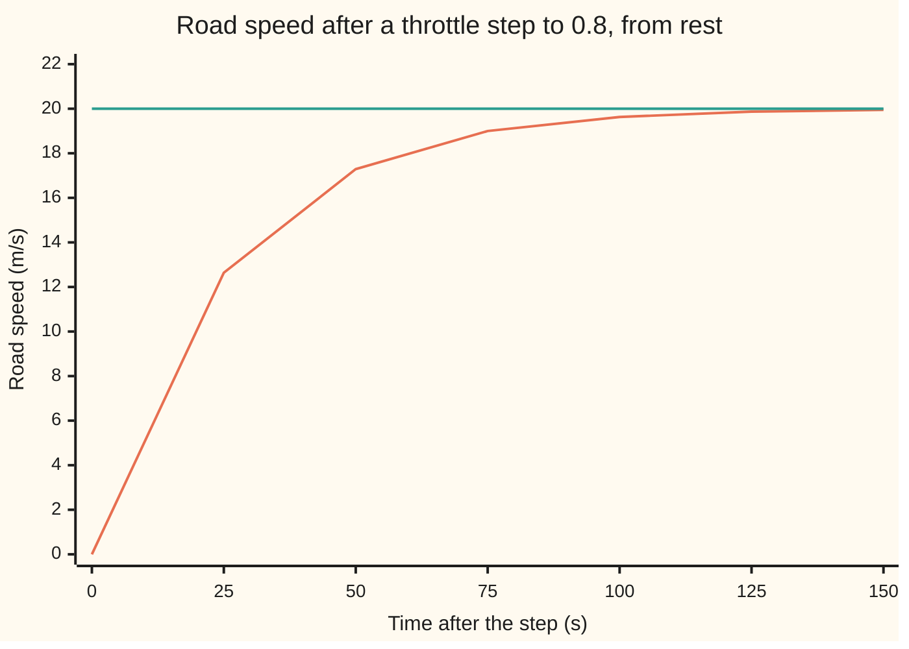
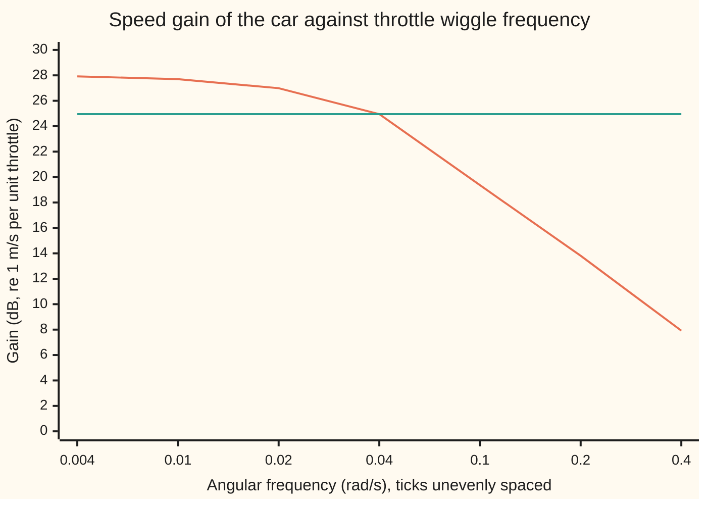

# Final value and bandwidth: where a response settles and how fast it keeps up

[Syllabus](../../../SYLLABUS.md) → [Engineering mathematics](../../../SYLLABUS.md#w13) → [Linear Systems and Transforms](../../../SYLLABUS.md#w13-s02) → Final value and bandwidth

---

## General Overview

A car of 1500 kg stands on a level road. Its engine pushes with up to 1500 N, in proportion to the throttle, a number from 0 (closed) to 1 (wide open). Air and tyres hold it back with a force that grows with speed, here 60 N for every metre per second. Hold the throttle at 0.8 from rest and wait.

An engineer tuning the cruise control asks two questions before anything else. **Where does the speed end up?** And **how fast can the speed follow when the throttle changes?** The first is a single number with units: 20 m/s, which is 72.0 km/h. The second is a frequency: throttle changes slower than one cycle in 157 s reach the speed at 71% or more of full size; faster ones are smoothed away.

Both answers can be read straight off the car's transfer function, the formula for what the car does to each input pattern, without running a simulation. The final speed comes from the transfer function at zero frequency, the input that never changes. The speed of following comes from the frequency at which the response has shrunk by three decibels. This card proves the first reading, defines the second, and checks both against a simulated car.

**Where a stable system settles is its transfer function evaluated at zero frequency, times the step size; how fast it keeps up is the bandwidth, the frequency at which its gain has fallen to 1/√2 of that zero-frequency value.**

**What kind of fact this is:** a theorem, the final value theorem, proved on this card in Why it works for the transfer functions engineers use; bandwidth is a definition, a convention fixed at three decibels.

### The picture: the car's speed after the throttle goes to 0.8



The rising line is the simulated speed. The flat line is 20 m/s, the final value the transform gives before any simulation runs. After 25 s the car is at 12.64 m/s; after 150 s it reads 19.95 m/s.

---

## The formula

Two reminders first. The Laplace variable $s$ (from [The Laplace transform](../../08-Differential%20equations%20and%20dynamics/08-Laplace%20Transforms%20for%20Initial-Value%20Problems/01-the-laplace-transform.md)) stands in for "rate of change": a signal growing like e^(st) has derivative s times itself. The transfer function G(s) says what the system does to each such exponential ([Transfer functions](02-impulse-response-and-transfer-functions.md)).

The car obeys Newton's second law, mass times acceleration equals push minus drag:

$$m\,\frac{dv}{dt} = F\,u - b\,v \qquad\Longrightarrow\qquad G(s) = \frac{K}{\tau s + 1},\quad K = \frac{F}{b} = 25\ \tfrac{\text{m/s}}{\text{unit}},\quad \tau = \frac{m}{b} = 25\ \text{s}.$$

The final value theorem. Write $y(t)$ for the speed and $Y(s)$ for its Laplace transform. If $y$ settles,

$$\lim_{t\to\infty} y(t) \;=\; \lim_{s\to 0}\, s\,Y(s).$$

**Read it aloud:** the value a signal settles at equals s times its transform, as s shrinks to zero.

For a throttle step of size $u_0$ the transform of the input is u0/s, so Y(s) = G(s) u0/s and the s cancels:

$$y(\infty) = G(0)\,u_0 = 25 \times 0.8 = 20\ \text{m/s}.$$

**Read it aloud:** the speed settles at the zero-frequency gain times the size of the throttle step.

Bandwidth. Engineers write $j$ for the square root of −1; the rest of the library writes i. Feed the car a throttle that wiggles like a sine wave of angular frequency $\omega$ in rad/s. Its speed wiggles at the same frequency, with the amplitude scaled by |G(jω)|. The bandwidth $\omega_b$ is where that gain has fallen to 1/√2 of its zero-frequency value:

$$\lvert G(j\omega_b)\rvert = \frac{\lvert G(0)\rvert}{\sqrt 2}, \qquad\text{for this car}\quad \omega_b = \frac{1}{\tau} = 0.04\ \text{rad/s}.$$

**Read it aloud:** the bandwidth is the frequency where the output's swing has shrunk to 0.7071 of the swing a very slow input would give.

On a decibel scale, 20 log10 of a gain (from [Bode plots](04-frequency-response-and-bode-plots.md)), the factor 1/√2 is a drop of 3 dB. The squared amplitude, which is proportional to power, has halved, so it is also called the half-power point. In hertz the car's bandwidth is 0.006366 Hz, one cycle every 157.08 s.

| Symbol | Plain meaning | In our example | Push it up and the answer… |
| --- | --- | --- | --- |
| $y$, $v$, $t$ | road speed, a function of time t | settles at 20 m/s | — |
| $u$, $u_0$ | throttle, 0 to 1; the size of its step | step to 0.8 | final speed rises in proportion |
| $m$, $b$, $F$ | mass; drag per m/s; full-throttle push | 1500 kg, 60 N s/m, 1500 N | $m$ slows the car's response; $b$ lowers $K$ and speeds it; $F$ raises $K$ |
| $K$ | steady gain, G(0) | 25 m/s per unit throttle | final speed rises |
| $\tau$ | time constant m/b, the response's time scale | 25 s | slower response, smaller bandwidth |
| $G$ | transfer function: output transform over input transform | 25/(25s + 1) | — |
| $s$ | Laplace variable, the rate of an exponential | — | — |
| $Y$ | Laplace transform of the speed | 20/(s(25s + 1)) | — |
| $j$ | square root of −1, engineers' letter | — | — |
| $\omega$, $\omega_b$ | angular frequency of a wiggle; the bandwidth | 0.04 rad/s | — |
| $\tau_a$ | a second lag: the throttle actuator | 2 s | bandwidth falls a little |
| $t_r$ | 10–90% rise time | 54.931 s | bandwidth falls |

### When it holds

- **Every pole of sY(s) strictly in the left half of the complex plane.** A pole is a value of s where the transform blows up ([Poles and zeros](03-poles-zeros-and-stability.md)). One on the right means growth: a speed loop wired with the wrong sign, G = 25/(25s − 1), gets −20 m/s from the formula while the simulated car reaches 1071.96 m/s at 100 s.
- **No poles on the imaginary axis.** Those mean a lasting oscillation. A throttle wiggling forever gives sY(s) → 0, yet the speed keeps swinging ±1.7678 m/s.
- **A linear model.** The throttle cannot pass 1. Asking for 30 m/s needs u = 1.20; the real car stops at 25.000 m/s.
- **Drag linear in speed.** Real drag grows roughly with speed squared. The model replaces it with one straight line, 60 N for every m/s, from rest up to the 25 m/s top speed; the 20 m/s and the 25 s time constant are that line's answers, and a real car's numbers differ as far as its drag curve bends away from that line.
- **Bandwidth needs a low-pass shape**: a finite, nonzero gain at zero frequency that falls away at high frequency. A resonant system, whose gain rises to a peak before it falls ([Damping ratio and natural frequency](06-second-order-systems-damping-and-natural-frequency.md)), is measured 3 dB down from its zero-frequency gain, not from its peak.

---

## Why it works

### Step 0: s marks change, so zero frequency means nothing changing

In the transform world, for a signal starting from rest, multiplying by $s$ is taking a derivative. A settled speed has derivative zero. Set the derivative to zero in the car's equation: 0 = F u − b v, so v = (F/b) u = 25 × 0.8 = 20 m/s. Setting s = 0 in G(s) does exactly the same thing, which is why G(0) is called the steady gain, or DC gain, after direct current, the electrical signal that never changes.

That argument assumes the speed does settle. The theorem says when it does, and why the factor s appears.

### Step 1: split the transform into pieces whose fates are known

For the car, partial fractions ([Inverting](../../08-Differential%20equations%20and%20dynamics/08-Laplace%20Transforms%20for%20Initial-Value%20Problems/03-inverting-by-partial-fractions.md)) give

$$Y(s) = \frac{20}{s\,(25 s + 1)} = \frac{20}{s} - \frac{20}{s + 0.04}.$$

The first piece is the transform of the constant 20. The second is the transform of 20 e^(−0.04 t), which dies away. So y(t) = 20 − 20 e^(−0.04 t), and the speed settles at 20 m/s.

### Step 2: multiply by s and shrink s

Multiply each piece by s. The constant's piece becomes 20, whatever s is. The decaying piece becomes −20 s/(s + 0.04), which goes to 0 as s goes to 0, because its pole sits at −0.04, not at 0. So s Y(s) → 20, the same number as y(∞).

The same holds for any transform that is a ratio of polynomials. Split it into a constant's piece c/s plus pieces with poles p. Each such piece is a term e^(pt) in time, possibly times a power of t. If every p has negative real part, every term dies, so y(∞) = c. Multiplying by s turns c/s into c and leaves each other piece with its pole away from zero, so each goes to 0. Both limits equal c.

### Step 3: what each hypothesis buys

The argument used two facts: every pole except the one at zero has negative real part, and the pole at zero is simple, one factor of s. A pole with positive real part makes a growing term in time, but s times its piece still goes to 0 as s shrinks, so the formula returns a confident, finite, wrong answer. A pole pair on the imaginary axis makes a lasting sine wave in time; again s times its piece goes to 0. The theorem gives no warning in either case. The hypothesis has to be checked first.

<details>
<summary>Detailed proof, for any signal whose derivative is absolutely integrable</summary>

The transform of a derivative is $\int_0^\infty e^{-st}\,y'(t)\,dt = sY(s) - y(0)$ ([Transforming a derivative](../../08-Differential%20equations%20and%20dynamics/08-Laplace%20Transforms%20for%20Initial-Value%20Problems/02-transforms-of-derivatives.md)). Suppose $\int_0^\infty \lvert y'(t)\rvert\,dt$ is finite. Then $y(T) = y(0) + \int_0^T y'\,dt$ has a limit as $T \to \infty$, so the final value exists. For real $s > 0$, $\lvert e^{-st} y'(t)\rvert \le \lvert y'(t)\rvert$, so the dominated convergence theorem (a limit may pass inside an integral when one fixed integrable bound holds for every s) lets the limit pass inside the integral: as $s \to 0^+$, the left side tends to $\int_0^\infty y'\,dt = y(\infty) - y(0)$. The $y(0)$ terms cancel and $\lim_{s\to 0^+} sY(s) = y(\infty)$.

When $Y$ is a ratio of polynomials, the condition on $y'$ holds exactly when every pole of $sY(s)$ has negative real part, since $y'$ is then a sum of decaying exponentials times powers of $t$. The theorem's converse fails: $sY(s)$ can have a limit while $y$ has none, as for a sine wave.

</details>

### Step 4: bandwidth is where the lag's two terms balance

At s = jω the car's transfer function is 25/(1 + j 25 ω). Its size is

$$\lvert G(j\omega)\rvert = \frac{K}{\sqrt{1 + \tau^2 \omega^2}}.$$

At low frequency the 1 dominates and the gain is the steady gain, 25. At high frequency the τω term dominates and the gain falls in proportion to 1/ω: the car's mass cannot accelerate fast enough. The two terms are equal at τω = 1. There the gain is 25/√2 = 17.6777 m/s per unit throttle, the speed lags the throttle by 45° (π/4 rad), and ω = 1/τ = 0.04 rad/s.

Bandwidth and response time measure the same thing. The 10–90% rise time of the step response is τ ln 9 = 54.931 s, so bandwidth times rise time is ln 9 = 2.1972 for any first-order lag. Double the mass and both halve their speed: bandwidth 0.02000 rad/s, final speed still 20 m/s.

### Step 5: more than one lag

A throttle actuator that takes $\tau_a$ = 2 s to respond adds a second factor: G(s) = 25/((25s + 1)(2s + 1)). At s = 0 both factors are 1, so the steady gain stays 25. The bandwidth solves $(1 + \tau^2\omega^2)(1 + \tau_a^2\omega^2) = 2$, a quadratic in $\omega^2$, giving 0.039748 rad/s. Lags change how fast the car gets there, never where it ends up.

### The gain across frequency



The falling line is the car's gain in decibels; the ticks are unevenly spaced, roughly evenly on a logarithmic scale, as on a Bode plot. The flat line sits 3 dB below the zero-frequency gain; the curves meet at 0.04 rad/s, the bandwidth.

A second road to the bandwidth is the time domain: drive the simulated car with a throttle sine at 0.04 rad/s and measure the swing. The code does this and gets 0.7071 of the zero-frequency swing.

---

## Worked numbers, by hand

| Step | Arithmetic | Value |
| --- | --- | --- |
| steady gain K | F/b = 1500 / 60 | 25 m/s per unit throttle |
| time constant τ | m/b = 1500 / 60 | 25 s |
| s Y(s) at s = 0.01 | 25 × 0.8 / (25 × 0.01 + 1) = 20 / 1.25 | 16.00000 m/s |
| s Y(s) at s = 0.001 | 20 / 1.025 | 19.51220 m/s |
| s Y(s) at s = 0 | 25 × 0.8 | **20 m/s = 72.0 km/h** |
| bandwidth | 1/τ = 1/25 | **0.04 rad/s** |
| in hertz | 0.04 / (2π) | 0.006366 Hz, period 157.08 s |
| gain at bandwidth | 25 / √2 | 17.6777 m/s per unit throttle |
| a 10 s wiggle | ω = 2π/10; 25 / √(1 + (25ω)^2) | 1.5883 m/s per unit throttle |

The car settles at 72 km/h with the throttle at 0.8. A throttle that wanders over minutes moves the speed nearly in full; one that jitters every 10 s moves it by 1.5883 m/s per unit throttle against 25 for a held throttle, which is why the speed barely registers small throttle noise.

### What breaks if you drop a piece

| Mistake | Comes out at | What went wrong |
| --- | --- | --- |
| Final value theorem on a wrong-sign loop, G = 25/(25s − 1) | −20.000 m/s; the simulated car is at 1071.96 m/s at 100 s | Pole at +0.04: the speed grows, and the formula cannot see it |
| Final value theorem on a throttle that wiggles forever | s Y(s) at s = 1e-6 is 0.000062 m/s | Poles on the imaginary axis: the swing stays ±1.7678 m/s |
| Linear model asked for 30 m/s | needs u = 1.20; the clamped car settles at 25.000 m/s | The throttle saturates at 1 |
| Bandwidth taken at half the gain, −6 dB | √3/τ = 0.06928 rad/s | Halving the amplitude is not halving the power |

The code prints all four.

---

## Code, from first principles, and it actually runs

The script builds the car's transfer function from its mass, drag and push, with complex arithmetic written out in Rust. It reaches the steady gain by four roads, three of them independent: G(0); s Y(s) at shrinking s, which is G(s) u0 once the s cancels, so it shows the theorem's limit rather than checking it; an RK4 simulation ([Runge-Kutta four](../../08-Differential%20equations%20and%20dynamics/05-Numerical%20Evolution/04-runge-kutta-four.md)) run for 300 s; and the area under the impulse response, by Simpson's rule, since G(0) is that area. It reaches the bandwidth by three: the formula 1/τ; bisection on |G(jω)|; and a simulated sine-wave throttle whose speed swing is measured. Then it repeats the gain and bandwidth with a 2 s actuator lag, and prints each failure in the table above.

### Python

```python
# Final value and bandwidth -- the check behind the card.  Standard library only.
# A car on cruise control, throttle u (0 to 1) in, road speed v (m/s) out:
#   m dv/dt = F u - b v,  so  G(s) = K / (tau s + 1),  K = F/b,  tau = m/b.
# Steady gain by four roads: G(0); s Y(s) as s shrinks; an RK4 run; the impulse
# response's area.  Bandwidth by three: 1/tau; bisection on |G(jw)|; a simulated wiggle.
import math

m, b, F, u0 = 1500.0, 60.0, 1500.0, 0.8           # kg, N s/m, N per unit throttle, step
K, tau, tau_a = F / b, m / b, 2.0                   # m/s per unit, s, actuator lag in s

def G(s, lags=(tau,)):                              # the transfer function, complex s
    out = complex(K)
    for T in lags:
        out /= T * s + 1
    return out

def rk4(f, x, t_end, dt, u):                        # RK4 on a list state, input u(t)
    t, xs = 0.0, [(0.0, x[0])]
    while t < t_end - 1e-9:
        k1 = f(x, u(t)); x2 = [a + dt / 2 * k for a, k in zip(x, k1)]
        k2 = f(x2, u(t + dt / 2)); x3 = [a + dt / 2 * k for a, k in zip(x, k2)]
        k3 = f(x3, u(t + dt / 2)); x4 = [a + dt * k for a, k in zip(x, k3)]
        k4 = f(x4, u(t + dt))
        x = [a + dt / 6 * (p + 2 * q + 2 * r + w) for a, p, q, r, w in zip(x, k1, k2, k3, k4)]
        t += dt
        xs.append((t, x[0]))
    return xs

car = lambda x, u: [(F * u - b * x[0]) / m]
car_lag = lambda x, u: [(F * x[1] - b * x[0]) / m, (u - x[1]) / tau_a]   # x[1]: throttle reached
wrong_sign = lambda x, u: [(K * u + x[0]) / tau]                         # G = K/(tau s - 1)

def bisect(f, lo, hi):                              # f(lo) > 0 > f(hi)
    for _ in range(200):
        mid = 0.5 * (lo + hi)
        lo, hi = (mid, hi) if f(mid) > 0 else (lo, mid)
    return 0.5 * (lo + hi)

def simpson(f, a, c, n):
    h = (c - a) / n
    return h / 3 * (f(a) + f(c) + sum((4 if i % 2 else 2) * f(a + i * h) for i in range(1, n)))

def cross(xs, level):                               # first time the record passes level
    for (t1, v1), (t2, v2) in zip(xs, xs[1:]):
        if v1 < level <= v2:
            return t1 + (level - v1) / (v2 - v1) * (t2 - t1)

# ---- steady gain: four roads ----
dc = G(0).real
step = rk4(car, [0.0], 300.0, 0.1, lambda t: u0)
area = simpson(lambda t: K / tau * math.exp(-t / tau), 0.0, 1000.0, 20000)
print(f"inputs: m = {m:.0f} kg, b = {b:.0f} N s/m, F = {F:.0f} N per unit throttle, actuator lag {tau_a} s")
print(f"model: K = F/b = {K:.1f} m/s per unit throttle, tau = m/b = {tau:.1f} s, step u0 = {u0}")
print(f"road 1  G(0) x u0                 {dc * u0:10.5f} m/s = {dc * u0 * 3.6:.1f} km/h")
for s in (0.1, 0.01, 0.001, 1e-6):
    print(f"road 2  s Y(s) at s = {s:<9g}   {(s * G(s) * u0 / s).real:10.5f} m/s")
print(f"road 3  RK4 speed at t = 300 s    {step[-1][1]:10.5f} m/s")
print(f"        exact 20(1 - e^-12)       {K * u0 * (1 - math.exp(-300 / tau)):10.5f} m/s")
print(f"road 4  area of impulse response  {area:10.5f} m/s per unit")
print("chart, step at t (s) " + " ".join(f"{t:6.0f}" for t, v in step[::250][:7]))
print("chart, speed (m/s)   " + " ".join(f"{v:6.2f}" for t, v in step[::250][:7]))

# ---- bandwidth: three roads ----
wb_form = 1 / tau
wb_bis = bisect(lambda w: abs(G(1j * w)) - dc / math.sqrt(2), 1e-6, 10.0)
wig = 0.1
sim = rk4(car, [0.0], 40 * math.pi / wb_form, 0.05, lambda t: wig * math.sin(wb_form * t))
tail = [v for t, v in sim if t > 30 * math.pi / wb_form]
amp = 0.5 * (max(tail) - min(tail))
print(f"bandwidth 1/tau                   {wb_form:10.5f} rad/s = {wb_form / (2 * math.pi):.6f} Hz")
print(f"bandwidth, bisection on |G(jw)|   {wb_bis:10.5f} rad/s")
print(f"wiggle 0.1 at 0.04 rad/s: speed swing +-{amp:.4f} m/s, ratio to DC {amp / (dc * wig):.4f}")
print(f"  1/sqrt(2) = {1 / math.sqrt(2):.4f}; phase at w_b {math.degrees(math.atan2(G(1j * wb_form).imag, G(1j * wb_form).real)):.1f} deg")
print(f"period at bandwidth 2 pi/w_b      {2 * math.pi / wb_form:10.2f} s")
for w in (0.004, 0.01, 0.02, 0.04, 0.1, 0.2, 0.4):
    print(f"chart, w = {w:<5} rad/s  gain {abs(G(1j * w)):8.4f} m/s per unit  {20 * math.log10(abs(G(1j * w))):6.2f} dB")
w10 = 2 * math.pi / 10
print(f"10 s throttle wiggle: gain {abs(G(1j * w10)):.4f} m/s per unit throttle")
t10, t90 = cross(step, 0.1 * K * u0), cross(step, 0.9 * K * u0)
print(f"rise 10-90 by simulation          {t90 - t10:10.3f} s;  tau ln 9 = {tau * math.log(9):.3f} s")
print(f"bandwidth x rise time             {wb_form * (t90 - t10):10.4f};  ln 9 = {math.log(9):.4f}")

# ---- a second lag: the 2 s actuator ----
two = (tau, tau_a)
A, B = tau ** 2 * tau_a ** 2, tau ** 2 + tau_a ** 2
wb2_form = math.sqrt((-B + math.sqrt(B * B + 4 * A)) / (2 * A))
wb2_bis = bisect(lambda w: abs(G(1j * w, two)) - G(0, two).real / math.sqrt(2), 1e-6, 10.0)
step2 = rk4(car_lag, [0.0, 0.0], 300.0, 0.1, lambda t: u0)
print(f"with 2 s actuator: G(0) u0 = {G(0, two).real * u0:.5f} m/s, RK4 at 300 s = {step2[-1][1]:.5f} m/s")
print(f"  bandwidth: quadratic {wb2_form:.6f} rad/s, bisection {wb2_bis:.6f} rad/s")

# ---- what breaks ----
bad = rk4(wrong_sign, [0.0], 100.0, 0.1, lambda t: u0)
fvt_bad = (K / (tau * 1e-9 - 1) * u0).real
print(f"wrong-sign loop: FVT says {fvt_bad:.3f} m/s; RK4 at 100 s {bad[-1][1]:.2f} m/s; exact {K * u0 * (math.exp(100 / tau) - 1):.2f} m/s")
sy = 1e-6 * G(1e-6) * wig * wb_form / (1e-12 + wb_form ** 2)   # s Y(s), Y = G(s) x transform of the wiggle
print(f"wiggle forever: s Y(s) at s = 1e-6 is {abs(sy):.6f} m/s; the swing stays +-{amp:.4f} m/s")
sat = rk4(car, [0.0], 300.0, 0.1, lambda t: min(30.0 / K, 1.0))
print(f"ask 30 m/s: linear FVT {30.0:.2f} m/s needs u = {30.0 / K:.2f}; clamped at 1.0 it settles at {sat[-1][1]:.3f} m/s")
print(f"half the gain (-6 dB) instead of -3 dB: w = sqrt(3)/tau = {math.sqrt(3) / tau:.5f} rad/s")
print(f"0.04 read as Hz: {2 * math.pi * 0.04:.5f} rad/s, 6.28 times too fast")

wb_heavy = bisect(lambda w: abs(G(1j * w, (2 * m / b,))) - dc / math.sqrt(2), 1e-6, 10.0)
wb_slow = bisect(lambda w: abs(G(1j * w, (tau, tau))) - dc / math.sqrt(2), 1e-6, 10.0)
print(f"try: m = 3000 kg: G(0) u0 still {dc * u0:.5f} m/s, bandwidth {wb_heavy:.5f} rad/s")
print(f"try: actuator lag 25 s: bandwidth {wb_slow:.6f} rad/s")

assert abs(step[-1][1] - dc * u0) < 1e-3                      # simulation vs transform at s = 0
assert abs(area - dc) < 1e-6                                   # impulse-response area vs G(0)
assert abs(wb_bis - wb_form) < 1e-9                            # bisection vs 1/tau
assert abs(amp / (dc * wig) - 1 / math.sqrt(2)) < 1e-3         # simulated wiggle vs -3 dB
assert abs(t90 - t10 - tau * math.log(9)) < 0.05               # simulated rise vs tau ln 9
assert abs(wb2_bis - wb2_form) < 1e-9                          # bisection vs the quadratic
assert abs(step2[-1][1] - G(0, two).real * u0) < 1e-3          # two-state RK4 vs G(0)
assert abs(bad[-1][1] / (K * u0 * (math.exp(100 / tau) - 1)) - 1) < 1e-6   # unstable run vs e^(t/tau)
print("ALL CHECKS PASS")
```

**Ran 2026-10-06 on macOS, Python 3.14.6, standard library only. All checks passed. Output, pasted from the run:**

```
inputs: m = 1500 kg, b = 60 N s/m, F = 1500 N per unit throttle, actuator lag 2.0 s
model: K = F/b = 25.0 m/s per unit throttle, tau = m/b = 25.0 s, step u0 = 0.8
road 1  G(0) x u0                   20.00000 m/s = 72.0 km/h
road 2  s Y(s) at s = 0.1            5.71429 m/s
road 2  s Y(s) at s = 0.01          16.00000 m/s
road 2  s Y(s) at s = 0.001         19.51220 m/s
road 2  s Y(s) at s = 1e-06         19.99950 m/s
road 3  RK4 speed at t = 300 s      19.99988 m/s
        exact 20(1 - e^-12)         19.99988 m/s
road 4  area of impulse response    25.00000 m/s per unit
chart, step at t (s)      0     25     50     75    100    125    150
chart, speed (m/s)     0.00  12.64  17.29  19.00  19.63  19.87  19.95
bandwidth 1/tau                      0.04000 rad/s = 0.006366 Hz
bandwidth, bisection on |G(jw)|      0.04000 rad/s
wiggle 0.1 at 0.04 rad/s: speed swing +-1.7678 m/s, ratio to DC 0.7071
  1/sqrt(2) = 0.7071; phase at w_b -45.0 deg
period at bandwidth 2 pi/w_b          157.08 s
chart, w = 0.004 rad/s  gain  24.8759 m/s per unit   27.92 dB
chart, w = 0.01  rad/s  gain  24.2536 m/s per unit   27.70 dB
chart, w = 0.02  rad/s  gain  22.3607 m/s per unit   26.99 dB
chart, w = 0.04  rad/s  gain  17.6777 m/s per unit   24.95 dB
chart, w = 0.1   rad/s  gain   9.2848 m/s per unit   19.36 dB
chart, w = 0.2   rad/s  gain   4.9029 m/s per unit   13.81 dB
chart, w = 0.4   rad/s  gain   2.4876 m/s per unit    7.92 dB
10 s throttle wiggle: gain 1.5883 m/s per unit throttle
rise 10-90 by simulation              54.931 s;  tau ln 9 = 54.931 s
bandwidth x rise time                 2.1972;  ln 9 = 2.1972
with 2 s actuator: G(0) u0 = 20.00000 m/s, RK4 at 300 s = 19.99987 m/s
  bandwidth: quadratic 0.039748 rad/s, bisection 0.039748 rad/s
wrong-sign loop: FVT says -20.000 m/s; RK4 at 100 s 1071.96 m/s; exact 1071.96 m/s
wiggle forever: s Y(s) at s = 1e-6 is 0.000062 m/s; the swing stays +-1.7678 m/s
ask 30 m/s: linear FVT 30.00 m/s needs u = 1.20; clamped at 1.0 it settles at 25.000 m/s
half the gain (-6 dB) instead of -3 dB: w = sqrt(3)/tau = 0.06928 rad/s
0.04 read as Hz: 0.25133 rad/s, 6.28 times too fast
try: m = 3000 kg: G(0) u0 still 20.00000 m/s, bandwidth 0.02000 rad/s
try: actuator lag 25 s: bandwidth 0.025744 rad/s
ALL CHECKS PASS
```

### Rust

Same numbers, same labels, built with `rustc --edition 2021 -O`.

```rust
// Final value and bandwidth -- the same check as the Python, in Rust.  No crates.
// A car on cruise control, throttle u (0 to 1) in, road speed v (m/s) out:
//   m dv/dt = F u - b v,  so  G(s) = K / (tau s + 1),  K = F/b,  tau = m/b.
// Steady gain by four roads: G(0); s Y(s) as s shrinks; an RK4 run; the impulse
// response's area.  Bandwidth by three: 1/tau; bisection on |G(jw)|; a simulated wiggle.
use std::f64::consts::PI;

#[derive(Clone, Copy)]
struct C { re: f64, im: f64 }                       // a complex number, written out
impl C {
    fn div(self, o: C) -> C {
        let d = o.re * o.re + o.im * o.im;
        C { re: (self.re * o.re + self.im * o.im) / d, im: (self.im * o.re - self.re * o.im) / d }
    }
    fn abs(self) -> f64 { (self.re * self.re + self.im * self.im).sqrt() }
}

const M: f64 = 1500.0; const B: f64 = 60.0; const F: f64 = 1500.0; const U0: f64 = 0.8;
const K: f64 = F / B; const TAU: f64 = M / B; const TAU_A: f64 = 2.0;

fn g(s: C, lags: &[f64]) -> C {                     // the transfer function, complex s
    let mut out = C { re: K, im: 0.0 };
    for &t in lags { out = out.div(C { re: t * s.re + 1.0, im: t * s.im }) }
    out
}
fn jw(w: f64) -> C { C { re: 0.0, im: w } }
fn re(x: f64) -> C { C { re: x, im: 0.0 } }

fn rk4(f: &dyn Fn(&[f64], f64) -> Vec<f64>, x0: &[f64], t_end: f64, dt: f64,
       u: &dyn Fn(f64) -> f64) -> Vec<(f64, f64)> {  // RK4 on a vector state, input u(t)
    let (mut t, mut x) = (0.0, x0.to_vec());
    let mut xs = vec![(0.0, x[0])];
    let step = |x: &[f64], k: &[f64], h: f64| -> Vec<f64> { x.iter().zip(k).map(|(a, k)| a + h * k).collect() };
    while t < t_end - 1e-9 {
        let k1 = f(&x, u(t)); let k2 = f(&step(&x, &k1, dt / 2.0), u(t + dt / 2.0));
        let k3 = f(&step(&x, &k2, dt / 2.0), u(t + dt / 2.0)); let k4 = f(&step(&x, &k3, dt), u(t + dt));
        for i in 0..x.len() { x[i] += dt / 6.0 * (k1[i] + 2.0 * k2[i] + 2.0 * k3[i] + k4[i]) }
        t += dt;
        xs.push((t, x[0]));
    }
    xs
}

fn bisect(f: &dyn Fn(f64) -> f64, mut lo: f64, mut hi: f64) -> f64 {   // f(lo) > 0 > f(hi)
    for _ in 0..200 {
        let mid = 0.5 * (lo + hi);
        if f(mid) > 0.0 { lo = mid } else { hi = mid }
    }
    0.5 * (lo + hi)
}

fn simpson(f: &dyn Fn(f64) -> f64, a: f64, c: f64, n: usize) -> f64 {
    let h = (c - a) / n as f64;
    let mut sum = 0.0;
    for i in 1..n { sum += if i % 2 == 1 { 4.0 } else { 2.0 } * f(a + i as f64 * h) }
    h / 3.0 * (f(a) + f(c) + sum)
}

fn cross(xs: &[(f64, f64)], level: f64) -> f64 {    // first time the record passes level
    for w in xs.windows(2) {
        let ((t1, v1), (t2, v2)) = (w[0], w[1]);
        if v1 < level && level <= v2 { return t1 + (level - v1) / (v2 - v1) * (t2 - t1) }
    }
    f64::NAN
}

fn main() {
    let car = |x: &[f64], u: f64| vec![(F * u - B * x[0]) / M];
    let car_lag = |x: &[f64], u: f64| vec![(F * x[1] - B * x[0]) / M, (u - x[1]) / TAU_A];
    let wrong_sign = |x: &[f64], u: f64| vec![(K * u + x[0]) / TAU];

    // ---- steady gain: four roads ----
    let dc = g(re(0.0), &[TAU]).re;
    let step = rk4(&car, &[0.0], 300.0, 0.1, &|_t| U0);
    let area = simpson(&|t: f64| K / TAU * (-t / TAU).exp(), 0.0, 1000.0, 20000);
    println!("inputs: m = {:.0} kg, b = {:.0} N s/m, F = {:.0} N per unit throttle, actuator lag {:.1} s", M, B, F, TAU_A);
    println!("model: K = F/b = {:.1} m/s per unit throttle, tau = m/b = {:.1} s, step u0 = {}", K, TAU, U0);
    println!("road 1  G(0) x u0                 {:10.5} m/s = {:.1} km/h", dc * U0, dc * U0 * 3.6);
    for (s, lab) in [(0.1, "0.1"), (0.01, "0.01"), (0.001, "0.001"), (1e-6, "1e-06")] {
        println!("road 2  s Y(s) at s = {:<9}   {:10.5} m/s", lab, g(re(s), &[TAU]).re * U0);
    }
    println!("road 3  RK4 speed at t = 300 s    {:10.5} m/s", step.last().unwrap().1);
    println!("        exact 20(1 - e^-12)       {:10.5} m/s", K * U0 * (1.0 - (-300.0 / TAU).exp()));
    println!("road 4  area of impulse response  {:10.5} m/s per unit", area);
    let pts: Vec<(f64, f64)> = step.iter().step_by(250).take(7).copied().collect();
    println!("chart, step at t (s) {}", pts.iter().map(|p| format!("{:6.0}", p.0)).collect::<Vec<_>>().join(" "));
    println!("chart, speed (m/s)   {}", pts.iter().map(|p| format!("{:6.2}", p.1)).collect::<Vec<_>>().join(" "));

    // ---- bandwidth: three roads ----
    let wb_form = 1.0 / TAU;
    let wb_bis = bisect(&|w| g(jw(w), &[TAU]).abs() - dc / 2f64.sqrt(), 1e-6, 10.0);
    let wig = 0.1;
    let sim = rk4(&car, &[0.0], 40.0 * PI / wb_form, 0.05, &|t: f64| wig * (wb_form * t).sin());
    let tail: Vec<f64> = sim.iter().filter(|p| p.0 > 30.0 * PI / wb_form).map(|p| p.1).collect();
    let amp = 0.5 * (tail.iter().cloned().fold(f64::MIN, f64::max) - tail.iter().cloned().fold(f64::MAX, f64::min));
    let gb = g(jw(wb_form), &[TAU]);
    println!("bandwidth 1/tau                   {:10.5} rad/s = {:.6} Hz", wb_form, wb_form / (2.0 * PI));
    println!("bandwidth, bisection on |G(jw)|   {:10.5} rad/s", wb_bis);
    println!("wiggle 0.1 at 0.04 rad/s: speed swing +-{:.4} m/s, ratio to DC {:.4}", amp, amp / (dc * wig));
    println!("  1/sqrt(2) = {:.4}; phase at w_b {:.1} deg", 1.0 / 2f64.sqrt(), gb.im.atan2(gb.re).to_degrees());
    println!("period at bandwidth 2 pi/w_b      {:10.2} s", 2.0 * PI / wb_form);
    for w in [0.004, 0.01, 0.02, 0.04, 0.1, 0.2, 0.4] {
        let a = g(jw(w), &[TAU]).abs();
        println!("chart, w = {:<5} rad/s  gain {:8.4} m/s per unit  {:6.2} dB", w, a, 20.0 * a.log10());
    }
    println!("10 s throttle wiggle: gain {:.4} m/s per unit throttle", g(jw(2.0 * PI / 10.0), &[TAU]).abs());
    let (t10, t90) = (cross(&step, 0.1 * K * U0), cross(&step, 0.9 * K * U0));
    println!("rise 10-90 by simulation          {:10.3} s;  tau ln 9 = {:.3} s", t90 - t10, TAU * 9f64.ln());
    println!("bandwidth x rise time             {:10.4};  ln 9 = {:.4}", wb_form * (t90 - t10), 9f64.ln());

    // ---- a second lag: the 2 s actuator ----
    let two = [TAU, TAU_A];
    let (a2, b2) = (TAU * TAU * TAU_A * TAU_A, TAU * TAU + TAU_A * TAU_A);
    let wb2_form = ((-b2 + (b2 * b2 + 4.0 * a2).sqrt()) / (2.0 * a2)).sqrt();
    let dc2 = g(re(0.0), &two).re;
    let wb2_bis = bisect(&|w| g(jw(w), &two).abs() - dc2 / 2f64.sqrt(), 1e-6, 10.0);
    let step2 = rk4(&car_lag, &[0.0, 0.0], 300.0, 0.1, &|_t| U0);
    println!("with 2 s actuator: G(0) u0 = {:.5} m/s, RK4 at 300 s = {:.5} m/s", dc2 * U0, step2.last().unwrap().1);
    println!("  bandwidth: quadratic {:.6} rad/s, bisection {:.6} rad/s", wb2_form, wb2_bis);

    // ---- what breaks ----
    let bad = rk4(&wrong_sign, &[0.0], 100.0, 0.1, &|_t| U0);
    let fvt_bad = K / (TAU * 1e-9 - 1.0) * U0;
    let exact_bad = K * U0 * ((100.0 / TAU).exp() - 1.0);
    println!("wrong-sign loop: FVT says {:.3} m/s; RK4 at 100 s {:.2} m/s; exact {:.2} m/s", fvt_bad, bad.last().unwrap().1, exact_bad);
    let sy = g(re(1e-6), &[TAU]).re * 1e-6 * wig * wb_form / (1e-12 + wb_form * wb_form);   // s Y(s) for the wiggle
    println!("wiggle forever: s Y(s) at s = 1e-6 is {:.6} m/s; the swing stays +-{:.4} m/s", sy.abs(), amp);
    let sat = rk4(&car, &[0.0], 300.0, 0.1, &|_t| (30.0 / K).min(1.0));
    println!("ask 30 m/s: linear FVT {:.2} m/s needs u = {:.2}; clamped at 1.0 it settles at {:.3} m/s", 30.0, 30.0 / K, sat.last().unwrap().1);
    println!("half the gain (-6 dB) instead of -3 dB: w = sqrt(3)/tau = {:.5} rad/s", 3f64.sqrt() / TAU);
    println!("0.04 read as Hz: {:.5} rad/s, 6.28 times too fast", 2.0 * PI * 0.04);

    let wb_heavy = bisect(&|w| g(jw(w), &[2.0 * M / B]).abs() - dc / 2f64.sqrt(), 1e-6, 10.0);
    let wb_slow = bisect(&|w| g(jw(w), &[TAU, TAU]).abs() - dc / 2f64.sqrt(), 1e-6, 10.0);
    println!("try: m = 3000 kg: G(0) u0 still {:.5} m/s, bandwidth {:.5} rad/s", dc * U0, wb_heavy);
    println!("try: actuator lag 25 s: bandwidth {:.6} rad/s", wb_slow);

    assert!((step.last().unwrap().1 - dc * U0).abs() < 1e-3);              // simulation vs transform at s = 0
    assert!((area - dc).abs() < 1e-6);                                       // impulse-response area vs G(0)
    assert!((wb_bis - wb_form).abs() < 1e-9);                                // bisection vs 1/tau
    assert!((amp / (dc * wig) - 1.0 / 2f64.sqrt()).abs() < 1e-3);            // simulated wiggle vs -3 dB
    assert!((t90 - t10 - TAU * 9f64.ln()).abs() < 0.05);                     // simulated rise vs tau ln 9
    assert!((wb2_bis - wb2_form).abs() < 1e-9);                              // bisection vs the quadratic
    assert!((step2.last().unwrap().1 - dc2 * U0).abs() < 1e-3);              // two-state RK4 vs G(0)
    assert!((bad.last().unwrap().1 / (K * U0 * ((100.0 / TAU).exp() - 1.0)) - 1.0).abs() < 1e-6);   // unstable run vs e^(t/tau)
    println!("ALL CHECKS PASS");
}
```

**Ran 2026-10-06 on macOS, rustc 1.98.1, no crates. All checks passed. Output, pasted from the run:**

```
inputs: m = 1500 kg, b = 60 N s/m, F = 1500 N per unit throttle, actuator lag 2.0 s
model: K = F/b = 25.0 m/s per unit throttle, tau = m/b = 25.0 s, step u0 = 0.8
road 1  G(0) x u0                   20.00000 m/s = 72.0 km/h
road 2  s Y(s) at s = 0.1            5.71429 m/s
road 2  s Y(s) at s = 0.01          16.00000 m/s
road 2  s Y(s) at s = 0.001         19.51220 m/s
road 2  s Y(s) at s = 1e-06         19.99950 m/s
road 3  RK4 speed at t = 300 s      19.99988 m/s
        exact 20(1 - e^-12)         19.99988 m/s
road 4  area of impulse response    25.00000 m/s per unit
chart, step at t (s)      0     25     50     75    100    125    150
chart, speed (m/s)     0.00  12.64  17.29  19.00  19.63  19.87  19.95
bandwidth 1/tau                      0.04000 rad/s = 0.006366 Hz
bandwidth, bisection on |G(jw)|      0.04000 rad/s
wiggle 0.1 at 0.04 rad/s: speed swing +-1.7678 m/s, ratio to DC 0.7071
  1/sqrt(2) = 0.7071; phase at w_b -45.0 deg
period at bandwidth 2 pi/w_b          157.08 s
chart, w = 0.004 rad/s  gain  24.8759 m/s per unit   27.92 dB
chart, w = 0.01  rad/s  gain  24.2536 m/s per unit   27.70 dB
chart, w = 0.02  rad/s  gain  22.3607 m/s per unit   26.99 dB
chart, w = 0.04  rad/s  gain  17.6777 m/s per unit   24.95 dB
chart, w = 0.1   rad/s  gain   9.2848 m/s per unit   19.36 dB
chart, w = 0.2   rad/s  gain   4.9029 m/s per unit   13.81 dB
chart, w = 0.4   rad/s  gain   2.4876 m/s per unit    7.92 dB
10 s throttle wiggle: gain 1.5883 m/s per unit throttle
rise 10-90 by simulation              54.931 s;  tau ln 9 = 54.931 s
bandwidth x rise time                 2.1972;  ln 9 = 2.1972
with 2 s actuator: G(0) u0 = 20.00000 m/s, RK4 at 300 s = 19.99987 m/s
  bandwidth: quadratic 0.039748 rad/s, bisection 0.039748 rad/s
wrong-sign loop: FVT says -20.000 m/s; RK4 at 100 s 1071.96 m/s; exact 1071.96 m/s
wiggle forever: s Y(s) at s = 1e-6 is 0.000062 m/s; the swing stays +-1.7678 m/s
ask 30 m/s: linear FVT 30.00 m/s needs u = 1.20; clamped at 1.0 it settles at 25.000 m/s
half the gain (-6 dB) instead of -3 dB: w = sqrt(3)/tau = 0.06928 rad/s
0.04 read as Hz: 0.25133 rad/s, 6.28 times too fast
try: m = 3000 kg: G(0) u0 still 20.00000 m/s, bandwidth 0.02000 rad/s
try: actuator lag 25 s: bandwidth 0.025744 rad/s
ALL CHECKS PASS
```

The two outputs match line for line.

> [!TIP]
> **Try changing**
> Guess first, then run it.
> - **A heavier car.** Double the mass to 3000 kg. Guess the final speed and the bandwidth. The final speed stays 20.00000 m/s, since mass does not appear in K; the bandwidth halves to 0.02000 rad/s. The script prints both on its "try" line.
> - **A slow actuator.** Make the actuator lag 25 s, as slow as the car. The steady gain is untouched; the bandwidth drops to 0.025744 rad/s, printed on the last "try" line.
> - **A bigger step.** Set `u0` to 1.2. Roads 1 and 3 both land on 30 m/s and every assert passes: the linear model has no throttle stop. The clamped run in "what breaks" shows the real car stopping at 25.000 m/s.
> - **Flip the drag.** Change `- b * x[0]` to `+ b * x[0]` in `car`. The RK4 speed runs away and the first assert stops the program; G(0) still says 20 m/s.

---

## The usual mistake

> [!warning]
> **Using the final value theorem before checking that the response settles.** The formula always returns a number. For the wrong-sign loop it returns −20.000 m/s, a reasonable-looking speed, while the actual speed has reached 1071.96 m/s after 100 s. Check that every pole of sY(s) has negative real part first; only then is the number a final value.
>
> - **Dropping the s.** Y(s) itself, with no factor of s, runs off to infinity as s shrinks; the factor s is what turns the step's 1/s into a finite number.
> - **Hertz for radians per second.** The bandwidth is 0.04 rad/s, which is 0.006366 Hz. Reading 0.04 as hertz claims 0.25133 rad/s, 6.28 times too fast.
> - **Six decibels instead of three.** Half the amplitude is −6 dB, at 0.06928 rad/s for this car; the bandwidth is the half-power point at 0.04 rad/s.
> - **Measuring from the peak.** For a system with a resonant peak, 3 dB is counted down from the zero-frequency gain, not from the top of the peak.

---

## Where you meet it in real life

- **Cruise control and every set-point loop.** The final speed for a held throttle is G(0) times the throttle, and the steady error of a feedback loop is read the same way, in [Steady-state error](../03-Feedback%20Control/03-steady-state-error-and-system-type.md).
- **Sensor and amplifier data sheets.** A "3 dB bandwidth" printed for an accelerometer or an audio amplifier is this definition: above it, signals come through at less than 1/√2 of their true size.
- **Response-time specifications.** Rise time and bandwidth trade one for the other; for a first-order lag their product is ln 9. The step-response measures are in [Step response specs](07-step-response-specifications.md).
- **Choosing a sampling rate.** A digital controller must sample well above the bandwidth of the loop it runs; turning a design into code is [Discretising a design](09-zero-order-hold-and-tustin-discretisation.md), and the discrete final value theorem uses z near 1 in [The z-transform](08-z-transform-and-discrete-time-systems.md).

> **Say it back**
> Where a stable system settles is s times its output's transform, as s goes to zero. For a step input that is the transfer function at zero, the steady gain, times the step size: 25 × 0.8 = 20 m/s for this car. The theorem needs every pole of sY(s) in the left half-plane, and it gives a wrong answer without warning when that fails. The bandwidth is the frequency where the gain has fallen 3 dB, to 1/√2 of the steady gain: 0.04 rad/s here. Lags change the bandwidth, never the steady gain.

---

## What this builds on

- [Bode plots](04-frequency-response-and-bode-plots.md): the gain |G(jω)|, the decibel and the low-frequency end of the Bode plot.
- [Limits](../../06-Calculus%20and%20analysis/01-Limits%20and%20Continuity/01-limits.md): both sides of the theorem are limits, one in time and one in s.

## Where this goes next

- [Steady-state error](../03-Feedback%20Control/03-steady-state-error-and-system-type.md): the final value theorem applied to the error of a feedback loop, and why an integrator drives it to zero.

The car settles at 20 m/s only for this exact model; when a controller must hold 20 m/s against hills and a mass it does not know, the question becomes how big the leftover error is, which steady-state-error-and-system-type answers.

---

## Sources

Verified 2026-10-06: every link below resolves to a page naming the cited work; the DOI was checked against Crossref.

- Franklin, Gene F., J. David Powell, and Abbas F. Emami-Naeini. *Feedback Control of Dynamic Systems*, 8th ed. Pearson, 2019. [Publisher page](https://www.pearson.com/en-us/subject-catalog/p/feedback-control-of-dynamic-systems/P200000003343/9780137516834). Chapter 3 states the final value theorem with its pole condition and the imaginary-axis and right-half-plane failures.
- Nise, Norman S. *Control Systems Engineering*, 8th ed. Wiley, 2020. [Publisher page](https://www.wiley.com/en-us/control-systems-engineering-8th-edition-p-9781119721406). Chapter 10 defines bandwidth as 3 dB below the zero-frequency gain and relates it to rise and settling time.
- Åström, Karl Johan, and Richard M. Murray. *Feedback Systems: An Introduction for Scientists and Engineers*, 2nd ed. Princeton University Press, 2021. [Authors' site with the full text](https://fbswiki.org/wiki/index.php/Feedback_Systems:_An_Introduction_for_Scientists_and_Engineers). Steady-state gain as G(0), bandwidth of a low-pass system, and a cruise-control example of its own.
- Chen, Jie, Kent H. Lundberg, Daniel E. Davison, and Dennis S. Bernstein. "The Final Value Theorem Revisited: Infinite Limits and Irrational Functions." *IEEE Control Systems Magazine* 27(3), 97–99, 2007. [DOI](https://doi.org/10.1109/MCS.2007.365008). The exact hypotheses, and the sine-wave counter-example.
