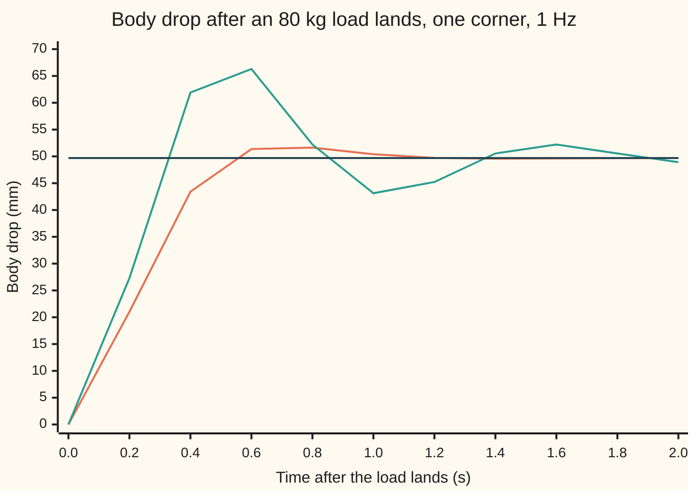
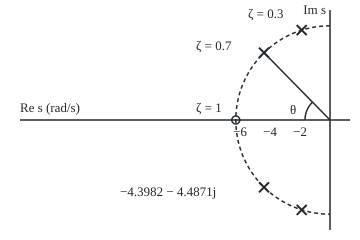
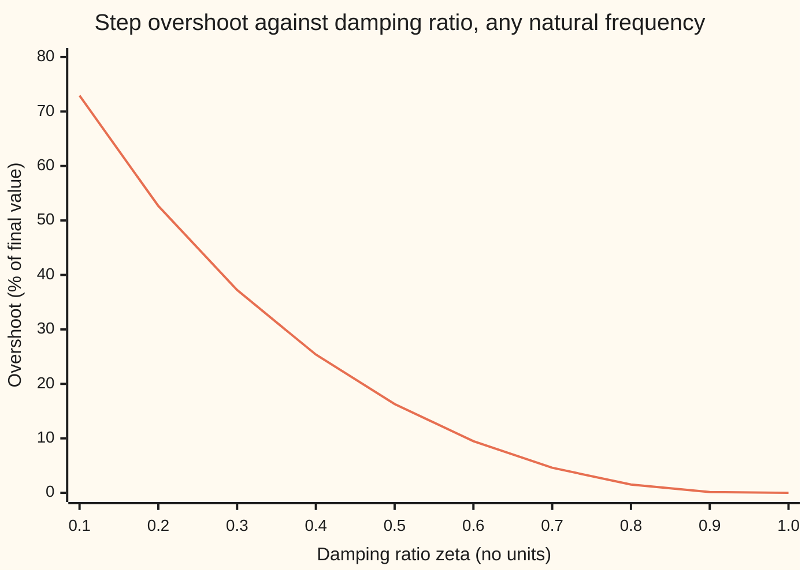

# Damping ratio and natural frequency: two numbers fix a second-order response

Engineering mathematics → Linear Systems and Transforms → Ringing and overshoot → Damping ratio and natural frequency

---

## General Overview

One corner of a car carries 400 kg of body on a steel spring and a shock absorber. The shock absorber is a damper: an oil-filled cylinder whose resisting force grows with the speed at which it is squeezed. Someone drops an 80 kg load into the boot above that corner. The body sinks, goes a little too far, comes back, and stops.

The suspension engineer wants three numbers before anything else. How far does the body sink in the end? How far past that does it go on the way? How long until it is still? For this car the answers are 49.68 mm, a further 2.28 mm, and 0.9516 s to stay within 2% of the final drop. A worn shock absorber with less than half its damping left would let the same corner swing 37.23% past its final drop and take 1.7873 s to stop.

All of those numbers come from just two quantities. The first is how fast the corner wants to bounce: here one cycle per second, 1 Hz. The second is how much damping it has, as a fraction of the least damping that would stop it bouncing at all: here 0.7. The engineer calls them the **natural frequency** and the **damping ratio**. The rest of the card writes them ω_n (omega-n) and ζ (zeta).

**A spring, a mass and a damper, or any system whose equation has the same shape, is fixed by two numbers: the natural frequency ω_n sets the clock, the damping ratio ζ sets the shape, and the overshoot after a step depends on ζ alone, as e^(−πζ/√(1 − ζ^2)).**

**What kind of fact this is:** ζ and ω_n are definitions; the overshoot and peak-time formulas are a theorem about the second-order model, proved on this card in Why it works; the settling time 4/(ζω_n) is an approximation, with its error stated.

### The picture: the body sinking after the load lands



The first line (orange) is the healthy damper, ζ = 0.7: one small bump to 51.97 mm at 0.7001 s, then still. The second line (green) is the worn damper, ζ = 0.3, on the same spring: it overshoots by 37.23% at 0.5241 s, is back up at 43.13 mm at 1.0 s, and is still ringing at 2 s. The flat line (dark) is the final drop, 49.68 mm. Both curves are simulated; both settle to the same place, because damping changes the path, never the destination.

---

## The formula

Newton's second law for the body, with the drop $x$ measured downward from where the body sat, in metres, and $t$ the time in seconds:

$$m\,\ddot x + c\,\dot x + k\,x = F .$$

Each dot is one time derivative. The spring pushes back with k times the drop; the damper pushes back with c times the speed; the load's weight $F$ pushes down. Divide by $m$ and name the two coefficients that are left:

$$\ddot x + 2\zeta\omega_n\,\dot x + \omega_n^2\,x = \omega_n^2\,\frac{F}{k}, \qquad \omega_n = \sqrt{\frac{k}{m}}, \qquad \zeta = \frac{c}{2\sqrt{k\,m}} .$$

**Read it aloud:** the natural frequency is the square root of stiffness over mass; the damping ratio is the damper's coefficient divided by twice the square root of stiffness times mass.

The number $\omega_n$ is in radians per second, dimension [T]^−1; in hertz it is $f_n$ = ω_n/(2π). The number $\zeta$ has no units: it is c divided by the critical damping 2√(km), the value of c at which bouncing just stops.

The poles of the corner are the roots of m s^2 + c s + k = 0, written with $s$, the Laplace variable, and $j$, the square root of −1 as engineers write it (the rest of the library writes i). For ζ below 1 they are a complex pair $p$:

$$p = -\sigma \pm j\,\omega_d, \qquad \sigma = \zeta\,\omega_n, \qquad \omega_d = \omega_n\sqrt{1-\zeta^2} .$$

**Read it aloud:** the poles sit a distance ω_n from the origin, at an angle from the negative real axis whose cosine is ζ; their real part is the decay rate, their imaginary part the frequency of the ringing.

Going back is just as short. Given a pole p:

$$\omega_n = \lvert p \rvert, \qquad \zeta = \frac{-\operatorname{Re} p}{\lvert p\rvert} = \cos\theta .$$

Here $\theta$ is the angle between the pole and the negative real axis.

The step-response numbers follow. After a sudden constant push, with no zero in the transfer function (see When it holds), the overshoot $M_p$ as a fraction of the final value, the time of the first peak $t_p$ and the 2% settling time $t_s$ are

$$M_p = e^{-\pi\zeta/\sqrt{1-\zeta^2}}, \qquad t_p = \frac{\pi}{\omega_d}, \qquad t_s \approx \frac{4}{\zeta\,\omega_n} .$$

**Read it aloud:** the overshoot depends on the damping ratio alone; the first peak comes half a ringing period after the step; the response is within 2% after about four decay times.

In the frequency domain, the transfer function $G$ from load force to body drop, scaled so its steady gain is 1, answers a sine push of angular frequency $\omega$ with

$$G(j\omega) = \frac{k}{k - m\,\omega^2 + j\,c\,\omega}, \qquad G(j\omega_n) = \frac{1}{2\zeta\,j} .$$

**Read it aloud:** at the natural frequency the response lags by exactly a quarter cycle, and its size is one over twice the damping ratio.

| Symbol | Plain meaning | In our example | Push it up and the answer… |
| --- | --- | --- | --- |
| $m$ | sprung mass on one corner | 400 kg | ω_n and ζ both fall |
| $k$ | spring stiffness | 15791.4 N/m | ω_n rises, ζ falls, sag shrinks |
| $c$ | damper coefficient: force per unit squeeze speed | 3518.6 N s/m | ζ rises, overshoot falls |
| $F$, $x$, $t$ | load's weight; body drop, down positive; time | 784.53 N; settles at 49.68 mm | sag grows with F |
| $\omega_n$, $f_n$ | natural frequency in rad/s; the same in Hz | 6.2832 rad/s; 1 Hz | every time on the card shrinks in proportion |
| $\zeta$ | damping ratio, c over critical damping | 0.7 | overshoot falls; past 1, response slows |
| $\sigma$, $\omega_d$ | decay rate ζω_n; damped (ringing) frequency | 4.3982 per second; 4.4871 rad/s = 0.7141 Hz | faster decay; faster ringing |
| $s$, $p$, $j$ | Laplace variable; a pole; √−1 | p = −4.3982 ± 4.4871j rad/s | — |
| $\theta$ | pole angle from the negative real axis, arccos ζ | 45.57° | more ringing |
| $M_p$, $t_p$ | overshoot as a fraction; time of first peak | 4.60% = 2.28 mm; 0.7001 s | — |
| $t_s$ | 2% settling time | 0.9516 s simulated; 0.9095 s by 4/(ζω_n) | — |
| $G$, $\omega$, $r$ | transfer function; sine frequency; road height under the wheel | gain 0.7143 at ω_n; a 5 cm kerb | — |

### When it holds

- **A linear spring and a linear damper.** Real shock absorbers resist rebound harder than bump, and springs stiffen at the bump stop. Then ζ is a slope at one operating point, and a large kerb sees a different ζ on the way up and the way down.
- **No zero in the transfer function.** The overshoot formula is for an input that enters only as a force. A kerb under the wheel enters through the damper too, which adds a zero at s = −k/c = −4.4880 rad/s. The body then overshoots by 21.03%, not 4.60%.
- **ζ below 1 for the overshoot and ringing formulas.** At ζ = 1 or above the poles are real, there is no ringing frequency ω_d, and there is no overshoot. The estimate 4/(ζω_n) also fails there: at ζ = 1.5 it says 0.4244 s; the body takes 1.6957 s.
- **One mode only.** The real corner has a second mass, the wheel, on the tyre's own spring, bouncing several times faster. Treating the body alone is fair when the two frequencies are well apart.

The picture of the poles, drawn to scale at 15 pixels per rad/s:

<p align="center"></p>

The dashed half-circle has radius ω_n = 6.2832 rad/s: every pole on it has the same natural frequency. The crosses at −4.3982 ± 4.4871j are the healthy damper, at θ = 45.57° from the negative real axis. The crosses near the imaginary axis are the worn damper, ζ = 0.3: same circle, steeper angle, slower decay. The ring at −6.2832 marks critical damping, ζ = 1, where the pair meets on the axis.

---

## Why it works

### Step 0: dividing by the mass leaves two numbers, a clock and a shape

The equation m x'' + c x' + k x = F has three physical constants. Dividing by m leaves two coefficients, c/m and k/m. One of them can be absorbed by choosing the unit of time: measure time in units of 1/ω_n and the spring term becomes 1. What is left is one number, ζ, and it alone decides the shape of the response. That is why two numbers suffice, and why overshoot, a shape, depends on ζ alone while every time scales with 1/ω_n.

### Step 1: the poles are the characteristic roots

Try x = e^(st) in the unforced equation. It works when m s^2 + c s + k = 0, the characteristic equation, solved in [complex-roots-and-damped-oscillation](../../08-Differential%20equations%20and%20dynamics/03-Oscillators%20-%20Second-Order%20Linear%20Equations/03-complex-roots-and-damped-oscillation.md). Its roots are the poles of the transfer function ([poles-zeros-and-stability](03-poles-zeros-and-stability.md)). The quadratic formula gives

$$s = \frac{-c \pm \sqrt{c^2 - 4mk}}{2m} = -\zeta\omega_n \pm \omega_n\sqrt{\zeta^2 - 1} .$$

The square root changes character at ζ = 1. Below it, the root is imaginary and the poles are the complex pair −σ ± jω_d. The engineer's two numbers are the polar coordinates of that pair.

### Step 2: polar form, radius ω_n and angle arccos ζ

The size of either pole is √(σ^2 + ω_d^2) = ω_n √(ζ^2 + 1 − ζ^2) = ω_n. So every pole pair with the same natural frequency sits on a circle of radius ω_n. The cosine of its angle from the negative real axis is σ/ω_n = ζ. For the corner: |p| = 6.2832 rad/s, which is 1.0000 Hz, and ζ = 4.3982/6.2832 = 0.7000, an angle of 45.57°. Reading a pole map is reading these two coordinates.

### Step 3: the step response, from the poles

Put the constant push F on at t = 0, with the body at rest. The final drop is F/k, the static sag. The response is the sag minus a decaying ring:

$$x(t) = \frac{F}{k}\left[1 - e^{-\sigma t}\left(\cos\omega_d t + \frac{\sigma}{\omega_d}\sin\omega_d t\right)\right].$$

The decay rate σ comes from the real part of the poles; the ringing frequency ω_d from the imaginary part. Check t = 0: the bracket is 1 − 1 = 0, so the body starts at rest position. Check large t: the exponential dies and x tends to F/k.

<details>
<summary>Detailed proof: the step response and its first peak</summary>

Take Laplace transforms with zero starting position and speed. The equation becomes (m s^2 + c s + k) X(s) = F/s, so X(s) = (F/k) ω_n^2 / (s (s^2 + 2σ s + ω_n^2)). Partial fractions give
$$X(s) = \frac{F}{k}\left[\frac{1}{s} - \frac{s + 2\sigma}{(s+\sigma)^2 + \omega_d^2}\right] = \frac{F}{k}\left[\frac1s - \frac{s+\sigma}{(s+\sigma)^2+\omega_d^2} - \frac{\sigma}{\omega_d}\,\frac{\omega_d}{(s+\sigma)^2+\omega_d^2}\right],$$
using (s + σ)^2 + ω_d^2 = s^2 + 2σs + ω_n^2. The three pieces invert to 1, e^(−σt) cos ω_d t and e^(−σt) sin ω_d t, which is the formula in Step 3.

Differentiate. The cosine terms cancel and what is left is
$$\dot x(t) = \frac{F}{k}\,\frac{\omega_n^2}{\omega_d}\,e^{-\sigma t}\sin\omega_d t .$$
The speed is zero exactly when sin ω_d t = 0, at t = π/ω_d, 2π/ω_d, …. The first of these is the first peak, t_p = π/ω_d. There cos ω_d t = −1 and sin ω_d t = 0, so x(t_p) = (F/k)(1 + e^(−σπ/ω_d)). The overshoot is the second term: M_p = e^(−σπ/ω_d), and σ/ω_d = ζ/√(1 − ζ^2). Each later extremum is smaller than the one before by the same factor M_p, alternating sides.

</details>

### Step 4: the overshoot depends on ζ alone

From the folded proof, the first peak comes at t_p = π/ω_d, half a ringing period, and overshoots by

$$M_p = e^{-\sigma\pi/\omega_d} = e^{-\pi\zeta/\sqrt{1-\zeta^2}} .$$

This is the overshoot [the-rlc-circuit-and-the-spring](../../08-Differential%20equations%20and%20dynamics/03-Oscillators%20-%20Second-Order%20Linear%20Equations/08-the-rlc-circuit-and-the-spring.md) found from the roots as e^(π × real part / imaginary part); with real part −ζω_n and imaginary part ω_n√(1 − ζ^2) it becomes the formula above. The natural frequency cancelled. A stiff racing suspension and a soft limousine with the same ζ overshoot by the same percentage; the racing car just does it sooner. The curve below is that formula, with the simulation of x'' + 2ζx' + x = 1 printed beside it in the code; they agree to the printed 0.01%.



The single line is the overshoot. It falls fast at first: going from ζ = 0.3 to 0.7 cuts the corner's swing from 37.23% to 4.60%. Above 0.8 there is little left to remove: 1.52%, then 0.15%, then none at critical damping.

### Step 5: settling is set by the decay rate

The ring inside the bracket is never bigger than e^(−σt)/√(1 − ζ^2). It drops below 2% of the sag when σt passes the natural log of 50, just under 4, plus a small term from the square root. So t_s ≈ 4/σ = 4/(ζω_n): 0.9095 s for the corner. The simulation finds 0.9516 s. The difference is real: at ζ = 0.7 the one overshoot is 4.60%, outside the 2% band, and the body has to come back from it. The rule is an estimate for light damping, not a formula; for an overdamped system it is badly wrong, as When it holds shows.

One more surprise from the same simulation: critical damping, ζ = 1, settles in 0.9285 s, a little faster than ζ = 0.7 into a 2% band. Settling time alone does not choose ζ = 0.7. What does is the combination: a small overshoot, a fast rise, and the frequency response below.

### Step 6: the frequency domain reads off the same two numbers

Put s = jω in the transfer function: G(jω) = k / (k − mω^2 + jcω). At ω = ω_n the first two terms of the denominator cancel, since k = m ω_n^2. What is left is jcω_n, and c ω_n / k = 2ζ. So G(jω_n) = 1/(2ζ j): a lag of exactly 90°, and a gain of 1/(2ζ) = 0.7143.

That gives a test-rig method. Shake the corner with a sine force, sweep the frequency until the body lags by a quarter cycle: that frequency is ω_n. The gain there gives ζ. The code finds the quarter-cycle point by bisection on the phase of G(jω), at 6.2832 rad/s, where the gain 0.7143 gives ζ = 0.7000; a simulated shaker driven at that frequency measures the same gain, 0.7143, and so the same ζ = 0.7000.

The gain has a resonant peak only when ζ is below 1/√2. At ζ = 0.7, just under, the peak is only 1.0002, at 0.8886 rad/s: the gain stays almost exactly 1 until it rolls off. The flattest possible curve comes at ζ = 1/√2 ≈ 0.7071. This is the second reason suspension, instrument and servo designers like ζ near 0.7.

The full treatment of gain and phase curves is on [frequency-response-and-bode-plots](04-frequency-response-and-bode-plots.md).

---

## Worked numbers, by hand

| Step | Arithmetic | Value |
| --- | --- | --- |
| natural frequency | ω_n = 2π × 1 Hz | 6.2832 rad/s |
| spring stiffness | k = m ω_n^2 = 400 × 6.2832^2 | 15791.4 N/m |
| damper | c = 2 ζ √(k m) = 2 × 0.7 × √(15791.4 × 400) | 3518.6 N s/m |
| load's weight | F = 80 × 9.80665 | 784.53 N |
| static sag | F/k = 784.53 / 15791.4 | 49.68 mm |
| decay rate | σ = ζ ω_n = 0.7 × 6.2832 | 4.3982 per second |
| ringing frequency | ω_d = 6.2832 × √(1 − 0.7^2) | 4.4871 rad/s = 0.7141 Hz |
| poles | −σ ± jω_d | −4.3982 ± 4.4871j rad/s |
| overshoot | e^(−π × 0.7 / √(1 − 0.7^2)) | 4.60% = 2.28 mm |
| peak time | π / 4.4871 | 0.7001 s |
| settling estimate | 4 / 4.3982 | 0.9095 s |
| deepest drop | 49.68 + 2.28 | **51.97 mm at 0.7001 s** |

The body settles 49.68 mm lower, overshoots to 51.97 mm at 0.7001 s, and is within 2% after 0.9516 s. The last digit of the deepest drop comes from the unrounded sum; the simulation finds the same 51.97 mm.

### What breaks if you drop a piece

| Mistake | Comes out at | What went wrong |
| --- | --- | --- |
| 1 Hz used as ω_n = 1 rad/s | k = 400.0 N/m, sag 1.961 m | Hertz are cycles per second; ω_n needs the factor 2π |
| The 2 dropped from c = 2ζ√(km) | c = 1759.3 N s/m, real ζ 0.35, overshoot 30.92% | The damper is half the size the design needs |
| Overshoot formula for a 5 cm kerb | 4.60% predicted; the body overshoots 21.03% | The road enters through the damper too, adding a zero at −4.4880 rad/s |
| 4/(ζω_n) at ζ = 1.5 | 0.4244 s; the body takes 1.6957 s | Overdamped: the slow real pole, not ζω_n, sets the settling |

The code prints all four.

---

## Code, from first principles, and it actually runs

The script builds the corner from mass, frequency and damping ratio, then reaches the two numbers and their consequences by four roads. Road 1 is the formulas. Road 2 solves m s^2 + c s + k = 0 by the quadratic formula and reads ω_n and ζ back off the poles. Road 3 is an RK4 simulation ([runge-kutta-four](../../08-Differential%20equations%20and%20dynamics/05-Numerical%20Evolution/04-runge-kutta-four.md)) of the load drop: it measures the peak and its time, then inverts the overshoot formula to recover ζ and ω_n from the measured curve, as a test engineer would from a drop test. Road 4 is the frequency domain: bisection on the phase of G(jω), and a simulated sine shaker at ω_n. It also sweeps ζ from 0.1 to 1.0 against simulation, and prints every row of the what-breaks table and the pole-map coordinates.

### Python

```python
# Damping ratio and natural frequency -- the check behind the card.  Standard library only.
# One corner of a car: sprung mass m on a spring k and a shock absorber c.
#   m x'' + c x' + k x = F,  wn = sqrt(k/m),  zeta = c / (2 sqrt(k m)).
# Roads: the formulas; the quadratic formula on m s^2 + c s + k; an RK4 drop test read
# back into (zeta, wn); a frequency sweep and a simulated shaker at wn.
import math

m, f_n, zeta = 400.0, 1.0, 0.7          # kg on one corner, Hz, damping ratio
g, load = 9.80665, 80.0                  # m/s^2 standard gravity (CGPM), kg in the boot
wn = 2 * math.pi * f_n                   # rad/s
k = m * wn ** 2                          # N/m
c = 2 * zeta * math.sqrt(k * m)          # N s/m
F = load * g                             # N
sag = F / k                              # m, the static drop

def roots(m, c, k):                      # quadratic formula on m s^2 + c s + k, as (re, im)
    d = c * c - 4 * m * k
    if d < 0:
        return (-c / (2 * m), math.sqrt(-d) / (2 * m))
    return ((-c + math.sqrt(d)) / (2 * m), 0.0)

def overshoot(z):                        # peak above final value, fraction, step input, no zero
    return math.exp(-math.pi * z / math.sqrt(1 - z * z)) if z < 1 else 0.0

def rk4(f, x, dt, n):                    # RK4 on a list state, x' = f(t, x); returns samples
    out, t = [x], 0.0
    for _ in range(n):
        k1 = f(t, x); k2 = f(t + dt / 2, [a + dt / 2 * b for a, b in zip(x, k1)])
        k3 = f(t + dt / 2, [a + dt / 2 * b for a, b in zip(x, k2)])
        k4 = f(t + dt, [a + dt * b for a, b in zip(x, k3)])
        x = [a + dt / 6 * (p + 2 * q + 2 * r + s) for a, p, q, r, s in zip(x, k1, k2, k3, k4)]
        t += dt; out.append(x)
    return out

def peak(ys, dt):                        # largest sample, refined by a parabola through 3 points
    i = max(range(1, len(ys) - 1), key=lambda j: ys[j])
    a, b, d = ys[i - 1], ys[i], ys[i + 1]
    h = 0.5 * (a - d) / (a - 2 * b + d)
    return b - 0.25 * (a - d) * h, (i + h) * dt

def settle(ys, dt, final, band=0.02):    # last exit from +-2% of the final value, interpolated
    last = max(i for i, y in enumerate(ys) if abs(y - final) > band * final)
    e0, e1 = (abs(ys[j] - final) - band * final for j in (last, last + 1))
    return (last + e0 / (e0 - e1)) * dt

def drop(cc, dt=1e-4, T=5.0):            # body drop x(t) after the load lands, damper cc
    xs = rk4(lambda t, x: [x[1], (F - cc * x[1] - k * x[0]) / m], [0.0, 0.0], dt, round(T / dt))
    return [x[0] for x in xs]

# ---- road 1: formulas ----
sig, wd = zeta * wn, wn * math.sqrt(1 - zeta ** 2)
print(f"inputs: m = {m:.0f} kg, f_n = {f_n:.1f} Hz, zeta = {zeta:.1f}, load {load:.0f} kg, g = {g} m/s^2")
print(f"model: wn = {wn:.4f} rad/s, k = {k:.1f} N/m, c = {c:.1f} N s/m, F = {F:.2f} N")
print(f"static sag F/k = {sag * 1000:.2f} mm")
print(f"poles from (zeta, wn): {-sig:.4f} +- {wd:.4f}j rad/s; damped f_d = {wd / (2 * math.pi):.4f} Hz")
print(f"formula overshoot {100 * overshoot(zeta):.2f} % = {overshoot(zeta) * sag * 1000:.2f} mm, "
      f"peak time pi/wd {math.pi / wd:.4f} s, settle 4/(zeta wn) {4 / sig:.4f} s")
# ---- road 2: quadratic formula on (m, c, k), then poles back to the two numbers ----
pr, pi_ = roots(m, c, k)
wn_p, z_p = math.hypot(pr, pi_), -pr / math.hypot(pr, pi_)
print(f"poles from (m, c, k):  {pr:.4f} +- {pi_:.4f}j rad/s")
print(f"back from poles: wn = |p| = {wn_p:.4f} rad/s = {wn_p / (2 * math.pi):.4f} Hz, "
      f"zeta = -Re p/|p| = {z_p:.4f}, angle {math.degrees(math.acos(z_p)):.2f} deg")
# ---- road 3: RK4 drop test, read back ----
dt = 1e-4
xs = drop(c)
xp, tp = peak(xs, dt)
Mp = xp / sag - 1
z_s = -math.log(Mp) / math.sqrt(math.pi ** 2 + math.log(Mp) ** 2)
wn_s = math.pi / tp / math.sqrt(1 - z_s ** 2)
ts = settle(xs, dt, sag)
print(f"RK4 drop: peak {xp * 1000:.2f} mm at {tp:.4f} s, overshoot {100 * Mp:.2f} %, 2% settle {ts:.4f} s")
print(f"read back from the drop: zeta = {z_s:.4f}, wn = {wn_s:.4f} rad/s = {wn_s / (2 * math.pi):.4f} Hz")
tc = [i / 10 for i in range(0, 21, 2)]
worn = drop(2 * 0.3 * math.sqrt(k * m))
print("chart, t (s)       " + " ".join(f"{t:6.2f}" for t in tc))
print("chart, zeta 0.7 mm " + " ".join(f"{xs[round(t / dt)] * 1000:6.2f}" for t in tc))
print("chart, zeta 0.3 mm " + " ".join(f"{worn[round(t / dt)] * 1000:6.2f}" for t in tc))
wp, wtp = peak(worn, dt)
print(f"worn damper zeta 0.3: formula {100 * overshoot(0.3):.2f} %, RK4 {100 * (wp / sag - 1):.2f} % at {wtp:.4f} s, "
      f"2% settle {settle(worn, dt, sag):.4f} s")
# ---- overshoot depends on zeta alone: formula vs simulation with wn = 1 rad/s ----
sweep = []
for z in [0.1, 0.2, 0.3, 0.4, 0.5, 0.6, 0.7, 0.8, 0.9, 1.0]:
    ys = [x[0] for x in rk4(lambda t, x: [x[1], 1 - 2 * z * x[1] - x[0]], [0.0, 0.0], 1e-3, 20000)]
    sim = max(max(ys) - 1, 0.0)
    sweep.append((z, overshoot(z), sim))
    print(f"chart, zeta {z:.1f}: overshoot formula {100 * overshoot(z):6.2f} %, simulated {100 * sim:6.2f} %")
# ---- road 4: frequency domain ----
G = lambda w: complex(k, 0) / complex(k - m * w * w, c * w)
lo, hi = 0.1, 100.0
for _ in range(100):                     # bisection on the phase: where is it -90 degrees?
    mid = 0.5 * (lo + hi)
    lo, hi = (mid, hi) if math.atan2(G(mid).imag, G(mid).real) > -math.pi / 2 else (lo, mid)
w90 = 0.5 * (lo + hi)
print(f"sweep: phase -90 deg at {w90:.4f} rad/s; gain there {abs(G(w90)):.4f} = 1/(2 zeta) -> zeta {1 / (2 * abs(G(w90))):.4f}")
wr = max((i * 1e-4 for i in range(1, 100000)), key=lambda w: abs(G(w)))
print(f"resonant peak: |G| max {abs(G(wr)):.4f} at {wr:.4f} rad/s; formula {1 / (2 * zeta * math.sqrt(1 - zeta ** 2)):.4f} "
      f"at {wn * math.sqrt(1 - 2 * zeta ** 2):.4f} rad/s")
F0 = 100.0
sh = rk4(lambda t, x: [x[1], (F0 * math.sin(wn * t) - c * x[1] - k * x[0]) / m], [0.0, 0.0], 1e-3, 20000)
tail = [x[0] for x in sh[15000:]]
amp = 0.5 * (max(tail) - min(tail)) / (F0 / k)
print(f"shaker at wn, 100 N: amplitude ratio {amp:.4f} -> zeta {1 / (2 * amp):.4f}")
# ---- what breaks ----
r0 = 0.05                                # a 5 cm kerb under the wheel: G = (c s + k)/(m s^2 + c s + k)
kz = rk4(lambda t, x: [x[1], (r0 - c * x[1] - k * x[0]) / m], [0.0, 0.0], dt, 50000)
ky = [c * x[1] + k * x[0] for x in kz]   # body height = c z' + k z
kp, ktp = peak(ky, dt)
y0 = lambda t: 1 - math.exp(-sig * t) * (math.cos(wd * t) + sig / wd * math.sin(wd * t))
y0d = lambda t: wn ** 2 / wd * math.exp(-sig * t) * math.sin(wd * t)
cf = max(r0 * (y0(i * 1e-4) + 2 * zeta / wn * y0d(i * 1e-4)) for i in range(20000))
print(f"kerb 5 cm: RK4 overshoot {100 * (kp / r0 - 1):.2f} % at {ktp:.4f} s; closed form {100 * (cf / r0 - 1):.2f} %; "
      f"formula said {100 * overshoot(zeta):.2f} %; zero at {-k / c:.4f} rad/s")
print(f"1 Hz read as 1 rad/s: k = {m * 1.0:.1f} N/m, sag {F / m:.3f} m")
c2 = zeta * math.sqrt(k * m)
z2 = c2 / (2 * math.sqrt(k * m))
print(f"the 2 dropped: c = {c2:.1f} N s/m, real zeta {z2:.2f}, overshoot {100 * overshoot(z2):.2f} %")
hv = drop(2 * 1.5 * math.sqrt(k * m))
print(f"zeta 1.5: no overshoot (peak {max(hv) / sag:.4f} of sag), 2% settle {settle(hv, dt, sag):.4f} s; "
      f"4/(zeta wn) says {4 / (1.5 * wn):.4f} s")
cr = drop(2 * math.sqrt(k * m))
print(f"zeta 1.0: 2% settle {settle(cr, dt, sag):.4f} s")
s0, s1 = 330.0, 15.0                      # figure: origin (px), px per rad/s
print(f"figure, poles 0.7 ({s0 + s1 * pr:.1f}, {120 - s1 * pi_:.1f}) ({s0 + s1 * pr:.1f}, {120 + s1 * pi_:.1f}); "
      f"radius {s1 * wn:.1f}")
q = roots(m, 2 * 0.3 * math.sqrt(k * m), k)
print(f"figure, poles 0.3 ({s0 + s1 * q[0]:.1f}, {120 - s1 * q[1]:.1f}) ({s0 + s1 * q[0]:.1f}, {120 + s1 * q[1]:.1f}); "
      f"critical ({s0 - s1 * wn:.1f}, 120.0)")

assert abs(z_s - zeta) < 1e-3                                     # drop test read back vs design zeta
assert abs(wn_s - wn) < 1e-3                                      # drop test read back vs design wn
assert abs(pi_ - wd) < 1e-9                                       # quadratic formula vs wn sqrt(1 - zeta^2)
assert all(abs(f - s) < 1e-4 for z, f, s in sweep)                # overshoot formula vs simulation
assert abs(tp - math.pi / wd) < 1e-4                              # simulated peak time vs pi/wd
assert abs(w90 - wn) < 1e-6                                       # phase sweep vs sqrt(k/m)
assert abs(amp - 1 / (2 * zeta)) < 2e-3                           # simulated shaker vs 1/(2 zeta)
assert abs(abs(G(w90)) - amp) < 2e-3                             # complex gain vs simulated shaker
assert abs(kp - cf) < 1e-6                                        # kerb: RK4 vs closed form
print("ALL CHECKS PASS")
```

**Ran 2026-10-06 on macOS, Python 3.14.6, standard library only. All checks passed. Output, pasted from the run:**

```
inputs: m = 400 kg, f_n = 1.0 Hz, zeta = 0.7, load 80 kg, g = 9.80665 m/s^2
model: wn = 6.2832 rad/s, k = 15791.4 N/m, c = 3518.6 N s/m, F = 784.53 N
static sag F/k = 49.68 mm
poles from (zeta, wn): -4.3982 +- 4.4871j rad/s; damped f_d = 0.7141 Hz
formula overshoot 4.60 % = 2.28 mm, peak time pi/wd 0.7001 s, settle 4/(zeta wn) 0.9095 s
poles from (m, c, k):  -4.3982 +- 4.4871j rad/s
back from poles: wn = |p| = 6.2832 rad/s = 1.0000 Hz, zeta = -Re p/|p| = 0.7000, angle 45.57 deg
RK4 drop: peak 51.97 mm at 0.7001 s, overshoot 4.60 %, 2% settle 0.9516 s
read back from the drop: zeta = 0.7000, wn = 6.2832 rad/s = 1.0000 Hz
chart, t (s)         0.00   0.20   0.40   0.60   0.80   1.00   1.20   1.40   1.60   1.80   2.00
chart, zeta 0.7 mm   0.00  21.03  43.41  51.37  51.63  50.40  49.72  49.58  49.62  49.67  49.68
chart, zeta 0.3 mm   0.00  27.31  61.90  66.30  52.22  43.13  45.22  50.54  52.21  50.54  48.92
worn damper zeta 0.3: formula 37.23 %, RK4 37.23 % at 0.5241 s, 2% settle 1.7873 s
chart, zeta 0.1: overshoot formula  72.92 %, simulated  72.92 %
chart, zeta 0.2: overshoot formula  52.66 %, simulated  52.66 %
chart, zeta 0.3: overshoot formula  37.23 %, simulated  37.23 %
chart, zeta 0.4: overshoot formula  25.38 %, simulated  25.38 %
chart, zeta 0.5: overshoot formula  16.30 %, simulated  16.30 %
chart, zeta 0.6: overshoot formula   9.48 %, simulated   9.48 %
chart, zeta 0.7: overshoot formula   4.60 %, simulated   4.60 %
chart, zeta 0.8: overshoot formula   1.52 %, simulated   1.52 %
chart, zeta 0.9: overshoot formula   0.15 %, simulated   0.15 %
chart, zeta 1.0: overshoot formula   0.00 %, simulated   0.00 %
sweep: phase -90 deg at 6.2832 rad/s; gain there 0.7143 = 1/(2 zeta) -> zeta 0.7000
resonant peak: |G| max 1.0002 at 0.8886 rad/s; formula 1.0002 at 0.8886 rad/s
shaker at wn, 100 N: amplitude ratio 0.7143 -> zeta 0.7000
kerb 5 cm: RK4 overshoot 21.03 % at 0.3545 s; closed form 21.03 %; formula said 4.60 %; zero at -4.4880 rad/s
1 Hz read as 1 rad/s: k = 400.0 N/m, sag 1.961 m
the 2 dropped: c = 1759.3 N s/m, real zeta 0.35, overshoot 30.92 %
zeta 1.5: no overshoot (peak 1.0000 of sag), 2% settle 1.6957 s; 4/(zeta wn) says 0.4244 s
zeta 1.0: 2% settle 0.9285 s
figure, poles 0.7 (264.0, 52.7) (264.0, 187.3); radius 94.2
figure, poles 0.3 (301.7, 30.1) (301.7, 209.9); critical (235.8, 120.0)
ALL CHECKS PASS
```

### Rust

Same numbers, same labels, built with `rustc --edition 2021 -O`; complex arithmetic is a small struct written out.

```rust
// Damping ratio and natural frequency -- the same check as the Python, in Rust.  No crates.
// One corner of a car: sprung mass m on a spring k and a shock absorber c.
//   m x'' + c x' + k x = F,  wn = sqrt(k/m),  zeta = c / (2 sqrt(k m)).
// Roads: the formulas; the quadratic formula on m s^2 + c s + k; an RK4 drop test read
// back into (zeta, wn); a frequency sweep and a simulated shaker at wn.
use std::f64::consts::PI;

const M: f64 = 400.0; const F_N: f64 = 1.0; const ZETA: f64 = 0.7;   // kg, Hz, damping ratio
const G: f64 = 9.80665; const LOAD: f64 = 80.0;                      // m/s^2 (CGPM), kg in the boot

#[derive(Clone, Copy)]
struct C { re: f64, im: f64 }                                       // a complex number, written out
impl C {
    fn div(self, o: C) -> C {
        let d = o.re * o.re + o.im * o.im;
        C { re: (self.re * o.re + self.im * o.im) / d, im: (self.im * o.re - self.re * o.im) / d }
    }
    fn abs(self) -> f64 { self.re.hypot(self.im) }
    fn arg(self) -> f64 { self.im.atan2(self.re) }
}

fn roots(m: f64, c: f64, k: f64) -> (f64, f64) {                   // quadratic formula, (re, im)
    let d = c * c - 4.0 * m * k;
    if d < 0.0 { (-c / (2.0 * m), (-d).sqrt() / (2.0 * m)) } else { ((-c + d.sqrt()) / (2.0 * m), 0.0) }
}

fn overshoot(z: f64) -> f64 {                                       // step input, no zero
    if z < 1.0 { (-PI * z / (1.0 - z * z).sqrt()).exp() } else { 0.0 }
}

fn rk4(f: &dyn Fn(f64, &[f64]) -> Vec<f64>, x0: &[f64], dt: f64, n: usize) -> Vec<Vec<f64>> {
    let mut x = x0.to_vec();
    let mut out = vec![x.clone()];
    let mut t = 0.0;
    let st = |x: &[f64], k: &[f64], h: f64| -> Vec<f64> { x.iter().zip(k).map(|(a, b)| a + h * b).collect() };
    for _ in 0..n {
        let k1 = f(t, &x); let k2 = f(t + dt / 2.0, &st(&x, &k1, dt / 2.0));
        let k3 = f(t + dt / 2.0, &st(&x, &k2, dt / 2.0)); let k4 = f(t + dt, &st(&x, &k3, dt));
        for i in 0..x.len() { x[i] = x[i] + dt / 6.0 * (k1[i] + 2.0 * k2[i] + 2.0 * k3[i] + k4[i]) }
        t += dt;
        out.push(x.clone());
    }
    out
}

fn peak(ys: &[f64], dt: f64) -> (f64, f64) {                        // largest sample, parabola refined
    let mut i = 1;
    for j in 1..ys.len() - 1 { if ys[j] > ys[i] { i = j } }
    let (a, b, d) = (ys[i - 1], ys[i], ys[i + 1]);
    let h = 0.5 * (a - d) / (a - 2.0 * b + d);
    (b - 0.25 * (a - d) * h, (i as f64 + h) * dt)
}

fn settle(ys: &[f64], dt: f64, fin: f64) -> f64 {                   // last exit from +-2%, interpolated
    let last = (0..ys.len()).filter(|&i| (ys[i] - fin).abs() > 0.02 * fin).max().unwrap();
    let (e0, e1) = ((ys[last] - fin).abs() - 0.02 * fin, (ys[last + 1] - fin).abs() - 0.02 * fin);
    (last as f64 + e0 / (e0 - e1)) * dt
}

fn main() {
    let wn = 2.0 * PI * F_N;
    let k = M * wn * wn;
    let c = 2.0 * ZETA * (k * M).sqrt();
    let f = LOAD * G;
    let sag = f / k;
    let dt = 1e-4;
    let drop = |cc: f64| -> Vec<f64> {
        rk4(&|_t, x: &[f64]| vec![x[1], (f - cc * x[1] - k * x[0]) / M], &[0.0, 0.0], dt, (5.0f64 / dt).round() as usize)
            .iter().map(|x| x[0]).collect()
    };

    // ---- road 1: formulas ----
    let (sig, wd) = (ZETA * wn, wn * (1.0 - ZETA * ZETA).sqrt());
    println!("inputs: m = {:.0} kg, f_n = {:.1} Hz, zeta = {:.1}, load {:.0} kg, g = {} m/s^2", M, F_N, ZETA, LOAD, G);
    println!("model: wn = {:.4} rad/s, k = {:.1} N/m, c = {:.1} N s/m, F = {:.2} N", wn, k, c, f);
    println!("static sag F/k = {:.2} mm", sag * 1000.0);
    println!("poles from (zeta, wn): {:.4} +- {:.4}j rad/s; damped f_d = {:.4} Hz", -sig, wd, wd / (2.0 * PI));
    println!("formula overshoot {:.2} % = {:.2} mm, peak time pi/wd {:.4} s, settle 4/(zeta wn) {:.4} s",
             100.0 * overshoot(ZETA), overshoot(ZETA) * sag * 1000.0, PI / wd, 4.0 / sig);
    // ---- road 2: quadratic formula on (m, c, k), then poles back to the two numbers ----
    let (pr, pi_) = roots(M, c, k);
    let wn_p = pr.hypot(pi_);
    let z_p = -pr / wn_p;
    println!("poles from (m, c, k):  {:.4} +- {:.4}j rad/s", pr, pi_);
    println!("back from poles: wn = |p| = {:.4} rad/s = {:.4} Hz, zeta = -Re p/|p| = {:.4}, angle {:.2} deg",
             wn_p, wn_p / (2.0 * PI), z_p, z_p.acos().to_degrees());
    // ---- road 3: RK4 drop test, read back ----
    let xs = drop(c);
    let (xp, tp) = peak(&xs, dt);
    let mp = xp / sag - 1.0;
    let z_s = -mp.ln() / (PI * PI + mp.ln() * mp.ln()).sqrt();
    let wn_s = PI / tp / (1.0 - z_s * z_s).sqrt();
    let ts = settle(&xs, dt, sag);
    println!("RK4 drop: peak {:.2} mm at {:.4} s, overshoot {:.2} %, 2% settle {:.4} s", xp * 1000.0, tp, 100.0 * mp, ts);
    println!("read back from the drop: zeta = {:.4}, wn = {:.4} rad/s = {:.4} Hz", z_s, wn_s, wn_s / (2.0 * PI));
    let tc: Vec<f64> = (0..21).step_by(2).map(|i| i as f64 / 10.0).collect();
    let worn = drop(2.0 * 0.3 * (k * M).sqrt());
    let row = |v: &dyn Fn(f64) -> f64| tc.iter().map(|&t| format!("{:6.2}", v(t))).collect::<Vec<_>>().join(" ");
    println!("chart, t (s)       {}", row(&|t| t));
    println!("chart, zeta 0.7 mm {}", row(&|t| xs[(t / dt).round() as usize] * 1000.0));
    println!("chart, zeta 0.3 mm {}", row(&|t| worn[(t / dt).round() as usize] * 1000.0));
    let (wp, wtp) = peak(&worn, dt);
    println!("worn damper zeta 0.3: formula {:.2} %, RK4 {:.2} % at {:.4} s, 2% settle {:.4} s",
             100.0 * overshoot(0.3), 100.0 * (wp / sag - 1.0), wtp, settle(&worn, dt, sag));
    // ---- overshoot depends on zeta alone: formula vs simulation with wn = 1 rad/s ----
    let mut sweep = vec![];
    for z in [0.1, 0.2, 0.3, 0.4, 0.5, 0.6, 0.7, 0.8, 0.9, 1.0] {
        let ys = rk4(&|_t, x: &[f64]| vec![x[1], 1.0 - 2.0 * z * x[1] - x[0]], &[0.0, 0.0], 1e-3, 20000);
        let sim = (ys.iter().map(|x| x[0]).fold(f64::MIN, f64::max) - 1.0).max(0.0);
        sweep.push((overshoot(z), sim));
        println!("chart, zeta {:.1}: overshoot formula {:6.2} %, simulated {:6.2} %", z, 100.0 * overshoot(z), 100.0 * sim);
    }
    // ---- road 4: frequency domain ----
    let gf = |w: f64| C { re: k, im: 0.0 }.div(C { re: k - M * w * w, im: c * w });
    let (mut lo, mut hi) = (0.1, 100.0);
    for _ in 0..100 {                                               // bisection on the phase
        let mid = 0.5 * (lo + hi);
        if gf(mid).arg() > -PI / 2.0 { lo = mid } else { hi = mid }
    }
    let w90 = 0.5 * (lo + hi);
    println!("sweep: phase -90 deg at {:.4} rad/s; gain there {:.4} = 1/(2 zeta) -> zeta {:.4}",
             w90, gf(w90).abs(), 1.0 / (2.0 * gf(w90).abs()));
    let mut wr = 1e-4;
    for i in 1..100000 { let w = i as f64 * 1e-4; if gf(w).abs() > gf(wr).abs() { wr = w } }
    println!("resonant peak: |G| max {:.4} at {:.4} rad/s; formula {:.4} at {:.4} rad/s", gf(wr).abs(), wr,
             1.0 / (2.0 * ZETA * (1.0 - ZETA * ZETA).sqrt()), wn * (1.0 - 2.0 * ZETA * ZETA).sqrt());
    let f0 = 100.0;
    let sh = rk4(&|t, x: &[f64]| vec![x[1], (f0 * (wn * t).sin() - c * x[1] - k * x[0]) / M], &[0.0, 0.0], 1e-3, 20000);
    let tail: Vec<f64> = sh[15000..].iter().map(|x| x[0]).collect();
    let amp = 0.5 * (tail.iter().cloned().fold(f64::MIN, f64::max) - tail.iter().cloned().fold(f64::MAX, f64::min)) / (f0 / k);
    println!("shaker at wn, 100 N: amplitude ratio {:.4} -> zeta {:.4}", amp, 1.0 / (2.0 * amp));
    // ---- what breaks ----
    let r0 = 0.05;                                                  // a 5 cm kerb: G = (c s + k)/(m s^2 + c s + k)
    let kz = rk4(&|_t, x: &[f64]| vec![x[1], (r0 - c * x[1] - k * x[0]) / M], &[0.0, 0.0], dt, 50000);
    let ky: Vec<f64> = kz.iter().map(|x| c * x[1] + k * x[0]).collect();
    let (kp, ktp) = peak(&ky, dt);
    let y0 = |t: f64| 1.0 - (-sig * t).exp() * ((wd * t).cos() + sig / wd * (wd * t).sin());
    let y0d = |t: f64| wn * wn / wd * (-sig * t).exp() * (wd * t).sin();
    let cf = (0..20000).map(|i| { let t = i as f64 * 1e-4; r0 * (y0(t) + 2.0 * ZETA / wn * y0d(t)) }).fold(f64::MIN, f64::max);
    println!("kerb 5 cm: RK4 overshoot {:.2} % at {:.4} s; closed form {:.2} %; formula said {:.2} %; zero at {:.4} rad/s",
             100.0 * (kp / r0 - 1.0), ktp, 100.0 * (cf / r0 - 1.0), 100.0 * overshoot(ZETA), -k / c);
    println!("1 Hz read as 1 rad/s: k = {:.1} N/m, sag {:.3} m", M * 1.0, f / M);
    let c2 = ZETA * (k * M).sqrt();
    let z2 = c2 / (2.0 * (k * M).sqrt());
    println!("the 2 dropped: c = {:.1} N s/m, real zeta {:.2}, overshoot {:.2} %", c2, z2, 100.0 * overshoot(z2));
    let hv = drop(2.0 * 1.5 * (k * M).sqrt());
    println!("zeta 1.5: no overshoot (peak {:.4} of sag), 2% settle {:.4} s; 4/(zeta wn) says {:.4} s",
             hv.iter().cloned().fold(f64::MIN, f64::max) / sag, settle(&hv, dt, sag), 4.0 / (1.5 * wn));
    let cr = drop(2.0 * (k * M).sqrt());
    println!("zeta 1.0: 2% settle {:.4} s", settle(&cr, dt, sag));
    let (s0, s1) = (330.0, 15.0);                                   // figure: origin (px), px per rad/s
    println!("figure, poles 0.7 ({:.1}, {:.1}) ({:.1}, {:.1}); radius {:.1}",
             s0 + s1 * pr, 120.0 - s1 * pi_, s0 + s1 * pr, 120.0 + s1 * pi_, s1 * wn);
    let q = roots(M, 2.0 * 0.3 * (k * M).sqrt(), k);
    println!("figure, poles 0.3 ({:.1}, {:.1}) ({:.1}, {:.1}); critical ({:.1}, 120.0)",
             s0 + s1 * q.0, 120.0 - s1 * q.1, s0 + s1 * q.0, 120.0 + s1 * q.1, s0 - s1 * wn);

    assert!((z_s - ZETA).abs() < 1e-3);                            // drop test read back vs design zeta
    assert!((wn_s - wn).abs() < 1e-3);                              // drop test read back vs design wn
    assert!((pi_ - wd).abs() < 1e-9);                               // quadratic formula vs wn sqrt(1 - zeta^2)
    assert!(sweep.iter().all(|(fo, si)| (fo - si).abs() < 1e-4));   // overshoot formula vs simulation
    assert!((tp - PI / wd).abs() < 1e-4);                           // simulated peak time vs pi/wd
    assert!((w90 - wn).abs() < 1e-6);                               // phase sweep vs sqrt(k/m)
    assert!((amp - 1.0 / (2.0 * ZETA)).abs() < 2e-3);               // simulated shaker vs 1/(2 zeta)
    assert!((gf(w90).abs() - amp).abs() < 2e-3);                    // complex gain vs simulated shaker
    assert!((kp - cf).abs() < 1e-6);                                // kerb: RK4 vs closed form
    println!("ALL CHECKS PASS");
}
```

**Ran 2026-10-06 on macOS, rustc 1.98.1, no crates. All checks passed. Output, pasted from the run:**

```
inputs: m = 400 kg, f_n = 1.0 Hz, zeta = 0.7, load 80 kg, g = 9.80665 m/s^2
model: wn = 6.2832 rad/s, k = 15791.4 N/m, c = 3518.6 N s/m, F = 784.53 N
static sag F/k = 49.68 mm
poles from (zeta, wn): -4.3982 +- 4.4871j rad/s; damped f_d = 0.7141 Hz
formula overshoot 4.60 % = 2.28 mm, peak time pi/wd 0.7001 s, settle 4/(zeta wn) 0.9095 s
poles from (m, c, k):  -4.3982 +- 4.4871j rad/s
back from poles: wn = |p| = 6.2832 rad/s = 1.0000 Hz, zeta = -Re p/|p| = 0.7000, angle 45.57 deg
RK4 drop: peak 51.97 mm at 0.7001 s, overshoot 4.60 %, 2% settle 0.9516 s
read back from the drop: zeta = 0.7000, wn = 6.2832 rad/s = 1.0000 Hz
chart, t (s)         0.00   0.20   0.40   0.60   0.80   1.00   1.20   1.40   1.60   1.80   2.00
chart, zeta 0.7 mm   0.00  21.03  43.41  51.37  51.63  50.40  49.72  49.58  49.62  49.67  49.68
chart, zeta 0.3 mm   0.00  27.31  61.90  66.30  52.22  43.13  45.22  50.54  52.21  50.54  48.92
worn damper zeta 0.3: formula 37.23 %, RK4 37.23 % at 0.5241 s, 2% settle 1.7873 s
chart, zeta 0.1: overshoot formula  72.92 %, simulated  72.92 %
chart, zeta 0.2: overshoot formula  52.66 %, simulated  52.66 %
chart, zeta 0.3: overshoot formula  37.23 %, simulated  37.23 %
chart, zeta 0.4: overshoot formula  25.38 %, simulated  25.38 %
chart, zeta 0.5: overshoot formula  16.30 %, simulated  16.30 %
chart, zeta 0.6: overshoot formula   9.48 %, simulated   9.48 %
chart, zeta 0.7: overshoot formula   4.60 %, simulated   4.60 %
chart, zeta 0.8: overshoot formula   1.52 %, simulated   1.52 %
chart, zeta 0.9: overshoot formula   0.15 %, simulated   0.15 %
chart, zeta 1.0: overshoot formula   0.00 %, simulated   0.00 %
sweep: phase -90 deg at 6.2832 rad/s; gain there 0.7143 = 1/(2 zeta) -> zeta 0.7000
resonant peak: |G| max 1.0002 at 0.8886 rad/s; formula 1.0002 at 0.8886 rad/s
shaker at wn, 100 N: amplitude ratio 0.7143 -> zeta 0.7000
kerb 5 cm: RK4 overshoot 21.03 % at 0.3545 s; closed form 21.03 %; formula said 4.60 %; zero at -4.4880 rad/s
1 Hz read as 1 rad/s: k = 400.0 N/m, sag 1.961 m
the 2 dropped: c = 1759.3 N s/m, real zeta 0.35, overshoot 30.92 %
zeta 1.5: no overshoot (peak 1.0000 of sag), 2% settle 1.6957 s; 4/(zeta wn) says 0.4244 s
zeta 1.0: 2% settle 0.9285 s
figure, poles 0.7 (264.0, 52.7) (264.0, 187.3); radius 94.2
figure, poles 0.3 (301.7, 30.1) (301.7, 209.9); critical (235.8, 120.0)
ALL CHECKS PASS
```

The two outputs match line for line.

> [!TIP]
> **Try changing**
> Guess first, then run it.
> - **A worn damper.** Set `zeta` to 0.3. Guess the overshoot. It is 37.23%, the worn line in the first chart, and the body takes 1.7873 s to settle; the script already prints this case on its "worn damper" line.
> - **A heavier load.** Set `load` to 160 kg. Guess the overshoot percentage. It stays 4.60%: the sag doubles, and so does the overshoot in millimetres, but ζ has not changed.
> - **A stiffer car.** Set `f_n` to 2.0 Hz. Guess which numbers change. The overshoot stays 4.60% and ζ reads back as 0.7000; the peak time halves, since every time scales with 1/ω_n.
> - **Too much damping.** Set `zeta` to 1.5. Guess where the script stops. It stops on the line that computes ω_d: √(1 − ζ^2) has no real value, because an overdamped corner does not ring. The "zeta 1.5" line already shows the 1.6957 s such a corner takes to settle.

---

## The usual mistake

> [!warning]
> **Applying the overshoot formula to a system with a zero.** The formula e^(−πζ/√(1 − ζ^2)) is for an input that enters as a pure force, with nothing in the numerator of the transfer function. A kerb under the wheel pushes through the spring and the damper, and the damper responds to the kerb's speed. That adds a zero at −4.4880 rad/s, close to the poles, and the body overshoots the kerb by 21.03%, not the 4.60% the formula says. Two numbers fix the response only when the system is exactly second order with no zero; [step-response-specifications](07-step-response-specifications.md) measures what a third pole does.
>
> - **Hertz for radians per second.** "1 Hz" is ω_n = 6.2832 rad/s. Using 1 rad/s gives a spring of 400.0 N/m and a sag of 1.961 m.
> - **Forgetting the 2 in critical damping.** Critical damping is 2√(km). Without the 2 the damper comes out at 1759.3 N s/m, the real ζ is 0.35, and the corner overshoots by 30.92%.
> - **Confusing ω_d with ω_n.** The body rings at 0.7141 Hz, not 1 Hz. A stopwatch on the ringing measures ω_d; the natural frequency is the distance of the pole from the origin.
> - **"More damping is faster."** Past ζ = 1 it is slower: at ζ = 1.5 the corner takes 1.6957 s to settle, against 0.9285 s at ζ = 1.

---

## Where you meet it in real life

- **Car suspension.** Engineers quote a ride frequency and a damping ratio for each axle; the shock absorber's valving is chosen to set ζ. A worn damper is a falling ζ, and a corner that bounces twice after the load lands is the 37.23% curve.
- **Moving-needle instruments and servo drives.** An analogue meter needle, a hard-disk head or a camera gimbal is tuned near ζ = 0.7 so it reaches a new reading fast with only a few percent overshoot.
- **Feedback loops.** A controller places the closed-loop poles; designers aim for a damping ratio, and the pole angle θ = arccos ζ becomes a line on the pole map. Moving the poles with a gain is [root-locus](../03-Feedback%20Control/05-root-locus.md).
- **Circuits.** A resistor, inductor and capacitor in series obey the same equation, with ω_n = 1/√(LC); the circuit version is rlc-circuits-and-resonance.
- **Structures.** Each vibration mode of a footbridge or a building has its own ω_n and a small ζ, which is why they can resonate; see vibration-modes-and-resonance.

> **Say it back**
> A mass on a spring with a damper has two numbers that fix its whole response. The natural frequency ω_n = √(k/m) sets the clock; the damping ratio ζ = c/(2√(km)) sets the shape. The poles sit on a circle of radius ω_n at an angle whose cosine is ζ. The overshoot after a step is e^(−πζ/√(1 − ζ^2)) and depends on ζ alone: 4.60% at ζ = 0.7, 37.23% at ζ = 0.3. The formula holds for a pure second-order system with no zero; a kerb pushing through the damper overshoots by 21.03%.

---

## What this builds on

- [poles-zeros-and-stability](03-poles-zeros-and-stability.md): what a pole is, and why its real part sets decay; this card reads a pole pair in polar form.
- [complex-roots-and-damped-oscillation](../../08-Differential%20equations%20and%20dynamics/03-Oscillators%20-%20Second-Order%20Linear%20Equations/03-complex-roots-and-damped-oscillation.md): complex characteristic roots give a decaying sine; this card names the two numbers inside them.
- [the-rlc-circuit-and-the-spring](../../08-Differential%20equations%20and%20dynamics/03-Oscillators%20-%20Second-Order%20Linear%20Equations/08-the-rlc-circuit-and-the-spring.md): the spring-mass-damper equation itself, its match with the circuit, the damping ratio and the overshoot from the roots; this card rewrites that overshoot in ζ and ω_n.

## Where this goes next

- [step-response-specifications](07-step-response-specifications.md): rise time, peak time, overshoot and settling as written requirements, and what a third pole does to them.
- [root-locus](../03-Feedback%20Control/05-root-locus.md): how the poles, and so ζ and ω_n, move as a feedback gain is turned up.
- rlc-circuits-and-resonance: the same two numbers in a circuit, with the quality factor Q = 1/(2ζ).
- vibration-modes-and-resonance: a structure with many masses has one ω_n and ζ per mode.

The corner meets its 4.60% only if nothing but a force pushes it; when a specification also limits rise time and settling, the question becomes which numbers to write in the requirement, which step-response-specifications answers.

---

## Sources

Verified 2026-10-06: every link below resolves to the publisher's or the authors' page.

- Nise, Norman S. *Control Systems Engineering*, 8th ed. Wiley, 2020. [Publisher page](https://www.wiley.com/en-us/control-systems-engineering-8th-edition-p-9781119721406). Chapter 4 defines natural frequency and damping ratio, derives the percent-overshoot and peak-time formulas, and gives the 4/(ζω_n) settling estimate and the pole-angle reading.
- Åström, Karl Johan, and Richard M. Murray. *Feedback Systems: An Introduction for Scientists and Engineers*, 2nd ed. Princeton University Press, 2021. [Authors' site with the full text](https://fbswiki.org/wiki/index.php/Feedback_Systems:_An_Introduction_for_Scientists_and_Engineers). The second-order system, its step response and frequency response, and the damped spring-mass example.
- NIST. *CODATA Value: standard acceleration of gravity*. [NIST page](https://physics.nist.gov/cgi-bin/cuu/Value?gn). The conventional value 9.80665 m/s^2 used for the load's weight.
